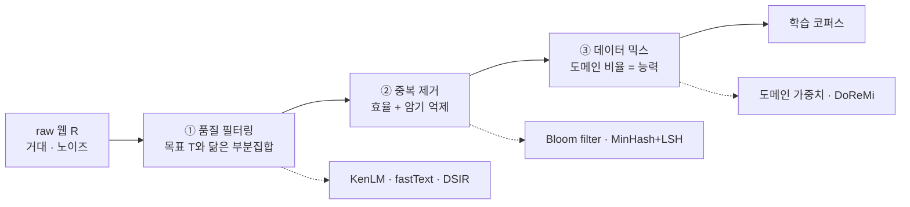

`CS336-LLM-From-Scratch` 시리즈의 14단계입니다. 전체 지도는 [CS336 커리큘럼](/2026/06/26/cs336-llm-from-scratch-curriculum.html)에서 볼 수 있습니다. ([13강 — 데이터 (1)](/2026/06/26/cs336-lecture-13-data-1-sources.html)에서 이어집니다.)

13강이 "무엇을 모으나"(출처·수집·추출)였다면, 14강은 "어떻게 거르나"입니다. Common Crawl에서 긁어온 원석은 스팸·중복·독성·잡동사니로 가득 차 있어 그대로는 못 먹입니다. 이 강의를 관통하는 문제는 한 줄로 요약됩니다 — **목표 데이터 T와 닮은 부분집합 T′를, 거대한 raw 데이터 R에서 극도로 빠르게 골라내라.** 그리고 역설적이게도 T와 T′는 같아선 안 됩니다. 우리가 가진 목표 예시(위키피디아·교과서 등)를 그대로 복제하는 게 아니라, 그와 *닮은* 방대한 새 텍스트를 모아 **일반화**해야 하기 때문입니다. 이 과제를 푸는 세 가지 기술 — **품질 필터링 · 중복 제거 · 데이터 믹스** — 을 차례로 봅니다.

<figure class="post-figure post-figure--header">
<svg role="img" aria-label="데이터 정제를 좌에서 우로 좁아지는 깔때기로 표현한 도식. 왼쪽의 거대한 raw 웹 데이터 R이 품질 필터링, 중복 제거, 데이터 믹스라는 세 단계를 통과하며 부피가 줄어 오른쪽의 작고 깨끗한 학습 코퍼스가 된다. 대부분의 데이터는 아래로 버려진다." viewBox="0 0 780 300" xmlns="http://www.w3.org/2000/svg">
  <title>데이터 정제 깔때기 — 품질 필터링 · 중복 제거 · 데이터 믹스</title>
  <defs>
    <marker id="funArrow" viewBox="0 0 10 10" refX="8" refY="5" markerWidth="8" markerHeight="8" orient="auto-start-reverse">
      <path d="M0,0 L10,5 L0,10 z" fill="var(--gold)"/>
    </marker>
  </defs>

  <text x="390" y="30" text-anchor="middle" font-family="var(--font-body)" font-size="16" font-weight="700" fill="var(--text-color)">raw 웹을 좋은 코퍼스로 — 세 단계의 깔때기</text>

  <!-- input block -->
  <rect x="24" y="88" width="104" height="124" rx="9" fill="currentColor" opacity="0.06"/>
  <rect x="24" y="88" width="104" height="124" rx="9" fill="none" stroke="currentColor" stroke-width="1.8"/>
  <text x="76" y="142" text-anchor="middle" font-family="var(--font-body)" font-size="15" font-weight="700" fill="var(--text-color)">raw 웹 R</text>
  <text x="76" y="164" text-anchor="middle" font-family="var(--font-body)" font-size="11.5" fill="var(--text-light)">거대 · 잡음</text>

  <!-- funnel trapezoid (narrows left to right) -->
  <path d="M 150 62 L 610 118 L 610 182 L 150 238 Z" fill="currentColor" opacity="0.05"/>
  <path d="M 150 62 L 610 118 L 610 182 L 150 238 Z" fill="none" stroke="var(--secondary-color)" stroke-width="2"/>
  <!-- stage dividers -->
  <line x1="303" y1="80.6" x2="303" y2="219.4" stroke="var(--secondary-color)" stroke-width="1.4" opacity="0.6"/>
  <line x1="456" y1="99.2" x2="456" y2="200.8" stroke="var(--secondary-color)" stroke-width="1.4" opacity="0.6"/>

  <!-- stage 1 -->
  <circle cx="226" cy="112" r="14" fill="var(--secondary-color)"/>
  <text x="226" y="117" text-anchor="middle" font-family="var(--font-body)" font-size="14" font-weight="700" fill="var(--bg-panel)">1</text>
  <text x="226" y="150" text-anchor="middle" font-family="var(--font-body)" font-size="12.5" font-weight="700" fill="var(--text-color)">품질 필터링</text>
  <text x="226" y="170" text-anchor="middle" font-family="var(--font-body)" font-size="10.5" fill="var(--text-light)">KenLM·fastText</text>

  <!-- stage 2 -->
  <circle cx="379" cy="116" r="14" fill="var(--secondary-color)"/>
  <text x="379" y="121" text-anchor="middle" font-family="var(--font-body)" font-size="14" font-weight="700" fill="var(--bg-panel)">2</text>
  <text x="379" y="150" text-anchor="middle" font-family="var(--font-body)" font-size="12.5" font-weight="700" fill="var(--text-color)">중복 제거</text>
  <text x="379" y="170" text-anchor="middle" font-family="var(--font-body)" font-size="10.5" fill="var(--text-light)">MinHash·Bloom</text>

  <!-- stage 3 (payoff — accent) -->
  <circle cx="533" cy="120" r="14" fill="var(--accent-color)"/>
  <text x="533" y="125" text-anchor="middle" font-family="var(--font-body)" font-size="14" font-weight="700" fill="var(--bg-panel)">3</text>
  <text x="533" y="150" text-anchor="middle" font-family="var(--font-body)" font-size="12.5" font-weight="700" fill="var(--text-color)">데이터 믹스</text>
  <text x="533" y="170" text-anchor="middle" font-family="var(--font-body)" font-size="10.5" fill="var(--text-light)">도메인 가중치</text>

  <!-- output block -->
  <rect x="636" y="118" width="120" height="64" rx="9" fill="currentColor" opacity="0.05"/>
  <rect x="636" y="118" width="120" height="64" rx="9" fill="none" stroke="var(--accent-color)" stroke-width="2.5"/>
  <text x="696" y="145" text-anchor="middle" font-family="var(--font-body)" font-size="13" font-weight="700" fill="var(--text-color)">학습 코퍼스</text>
  <text x="696" y="165" text-anchor="middle" font-family="var(--font-body)" font-size="11" fill="var(--text-light)">작고 깨끗</text>

  <!-- flow arrows -->
  <line x1="130" y1="150" x2="147" y2="150" stroke="var(--gold)" stroke-width="2.2" marker-end="url(#funArrow)"/>
  <line x1="612" y1="150" x2="633" y2="150" stroke="var(--gold)" stroke-width="2.2" marker-end="url(#funArrow)"/>

  <!-- discard arrow -->
  <line x1="379" y1="238" x2="379" y2="266" stroke="var(--text-light)" stroke-width="1.8" stroke-dasharray="3 4" marker-end="url(#funArrow)"/>
  <text x="390" y="284" text-anchor="middle" font-family="var(--font-body)" font-size="11" fill="var(--text-light)">버려지는 데이터 (대부분)</text>
</svg>
<figcaption>정제는 좌에서 우로 좁아지는 깔때기다. 거대하고 잡음 많은 raw R이 품질 필터링 → 중복 제거 → 데이터 믹스를 거치며 부피가 줄어, 작고 깨끗한 학습 코퍼스만 남는다. 세 단계 모두 "목표와 닮은 것만 남기고 나머지는 버린다".</figcaption>
</figure>

## 한눈에 보기

세 단계는 목적이 다릅니다 — 필터링은 **좋은 텍스트를 고르고**, 중복 제거는 **같은 텍스트를 솎아 내고**, 믹스는 **도메인 비율을 조정**합니다. 각 단계에는 저마다의 도구상자가 있고, 공통점은 하나 — 전부 **초고속**이어야 한다는 것입니다(R이 조 단위 토큰이므로).



핵심 긴장은 매 단계에서 반복됩니다 — **얼마나 빠른가 vs 얼마나 정교한가.** n-gram은 빠르지만 거칠고, 분류기는 똑똑하지만 느리며, 근접 중복 제거는 정확하지만 무겁습니다.

## 문제 정의 — 빠르고 일반화되는 선택

형식적으로 쓰면 이렇습니다. 목표 데이터 **T**(원하는 텍스트의 예시, 예: 위키피디아·책·잘 쓰인 웹)와 거대한 raw 데이터 **R**(Common Crawl)이 주어졌을 때, R에서 T와 닮은 부분집합 **T′ ⊂ R**을 찾아라. 조건은 두 가지입니다.

- **일반화(T ≠ T′)**: T′는 T의 복제가 아니라 T와 *같은 분포에서 나온 듯한* 새 텍스트여야 합니다. 목표 예시 자체를 다시 긁어오는 게 아니라, 그 스타일·주제를 가진 방대한 신규 데이터를 모으는 게 목적입니다.
- **초고속**: R은 조 단위 토큰입니다. 문서 하나당 무거운 모델을 돌릴 여유가 없습니다 — 그래서 이 강의의 도구들은 하나같이 **가볍고 병렬화 가능한** 것들입니다(n-gram 언어 모델, 선형 분류기, 해시).

이 두 제약이 이후 모든 설계 결정을 지배합니다. "정확하지만 느린" 방법은 애초에 후보에서 탈락합니다.

## 품질 필터링

첫 단계는 "이 텍스트가 좋은가"를 점수로 매겨 거르는 것입니다. 세 가지 대표 접근이 있습니다.

**n-gram / KenLM.** 가장 고전적입니다. 목표 코퍼스로 n-gram 언어 모델을 학습하고(**Kneser-Ney 스무딩**), 각 문서의 **perplexity**로 품질을 점수화합니다 — 목표와 닮은 텍스트일수록 perplexity가 낮습니다. **CCNet**은 이를 **문단 단위**로 적용해, perplexity가 가장 낮은 **상위 1/3**만 유지합니다(LLaMA도 이 방식을 썼습니다). n-gram은 학습·추론이 극도로 빠른 대신 표면적 통계만 봅니다.

> KenLM 방식의 성격은 한 줄로 요약됩니다 — **빠르지만 거칠다(fast but crude).** 문법·주제의 표면은 잡지만, 의미의 질은 못 잽니다.

**fastText 분류기.** 살짝 더 똑똑한 접근입니다. **bag of word embeddings**를 평균 내 hidden layer 하나를 거쳐 분류하는 얕은 신경망으로, "좋음/나쁨"(K=2) 이진 분류라면 사실상 **선형 분류기**가 됩니다. 어휘를 임베딩 테이블로 관리하는 대신 **해싱 트릭**(약 10M bins, MurmurHash)으로 n-gram을 버킷에 흩어 넣어 메모리를 절약합니다. 목표(positive) 예시와 raw(negative) 예시를 주고 학습시키면, 문서마다 "좋을 확률"을 초고속으로 뱉습니다.

**DSIR (Data Selection via Importance Resampling).** 통계적으로 가장 원리적인 방법입니다. 목표 분포 `p`와 제안(proposal) 분포 `q`가 있을 때, raw 데이터를 **importance weight `p(x)/q(x)`에 비례해 리샘플링**하면 결과적으로 목표 분포를 근사합니다.

```text
importance weight:  w(x) = p(x) / q(x)      # p = target, q = proposal(raw)
선택 확률 ∝ w(x)  →  T와 닮은 문서일수록 뽑힐 확률↑
p, q 는 해시된 n-gram feature의 bag-of-words 분포로 근사 (과적합 회피)
```

`p`와 `q`를 **해시된 n-gram** feature 위에서 추정해 과적합을 피하는 것이 요령입니다. GLUE 실험에서 DSIR은 fastText를 소폭 상회했고, 단일 임계값이 아니라 **분포를 맞추는** 방식이라 데이터의 다양성을 더 잘 보존한다는 장점이 있습니다.

실제 랩들이 이 도구들을 어떻게 조합했는지가 흥미롭습니다.

| 사례 | 필터 구성 | 결과 |
| --- | --- | --- |
| **GPT-3** | Wiki·WebText·Books를 positive, Common Crawl을 negative로 분류기 학습. 임계값으로 자르지 않고 **Pareto(α=9)** 분포로 **확률적 유지** | CC를 통째 버리지 않고 "좋아 보이는 것"을 확률적으로 남김 |
| **phi-1** | GPT-4에게 "**교육적 가치**"를 라벨링시켜 → CodeGen 임베딩 위 **랜덤 포레스트**로 확대 | HumanEval **12.19% → 17.68%**, 그것도 **절반의 스텝**으로 |
| **OpenMathText** | LaTeX 규칙 + **KenLM ppl < 15,000** + **fastText 점수 0.17** 임계 | **14.7B 토큰** 확보. 1.4B 모델이 **20배 큰 미필터 데이터**로 학습한 모델을 상회 |

phi-1과 OpenMathText가 주는 교훈은 강렬합니다 — **잘 고른 소량이 대충 모은 대량을 이긴다.** "교육적 가치"라는 추상적 기준조차 강한 모델(GPT-4)로 라벨을 만든 뒤 값싼 분류기로 확대하면 실전 필터가 됩니다.

## 언어 식별과 독성·PII

품질과 별개로, 코퍼스에서 **원치 않는 것**을 걸러야 합니다.

**언어 식별(language ID).** 대부분의 랩은 fastText 언어 식별기(**176개 언어** 지원)로 문서의 언어를 판별합니다. 예컨대 **Dolma**는 영어일 확률 **p(en) ≥ 0.5**인 문서만 남깁니다. 다만 언어 식별에는 약점이 뚜렷합니다 — **짧은 문장**, **저자원(low-resource) 언어**, 한 문서에 여러 언어가 섞인 **code-switching**, 그리고 서로 **유사한 언어**(말레이어 vs 인도네시아어)에서 자주 틀립니다. 이 필터가 곧 "누구의 언어를 남기는가"를 결정하므로 사회적 함의도 큽니다.

**독성(toxicity)·NSFW.** 유해 콘텐츠 필터는 대개 **Jigsaw Toxic Comments** 데이터로 학습됩니다. Dolma는 hate와 NSFW를 각각 잡는 **두 개의 fastText 분류기**를 씁니다.

**PII 익명화.** 이메일·IP 주소 등 개인식별정보는 정규식·규칙으로 탐지해 마스킹합니다. 완벽하진 않지만, 학습 데이터에 원본 PII가 그대로 남는 것을 줄이는 최소 방어선입니다.

## 중복 제거(Deduplication)

웹에는 같은 텍스트가 수없이 반복됩니다(미러 사이트·인용·보일러플레이트). 중복 제거는 두 가지 이유로 중요합니다.

- **효율**: 같은 문장을 수천 번 학습하는 것은 연산 낭비입니다.
- **암기(memorization) 억제**: 특정 텍스트가 너무 자주 나오면 모델이 그것을 **통째로 외웁니다** — 저작권·프라이버시 위험이자 일반화의 적입니다. 중복 제거는 이 암기를 눌러 줍니다.

중복 제거의 설계 공간은 **세 축**으로 정리됩니다.

| 축 | 선택지 |
| --- | --- |
| **단위(unit)** | 문장 / 문단 / 문서 — 무엇을 "하나"로 볼 것인가 |
| **매칭 기준(match)** | 정확 일치 / 부분 문자열(substring) / 겹침 비율(예: Jaccard) |
| **액션(action)** | 매칭된 것을 **모두 제거** vs **하나만 남기기** |

**정확 중복(exact).** 가장 단순합니다. 텍스트를 해시(MurmurHash 등)해 같은 해시끼리 묶습니다. **C4**는 **3-문장 스팬** 단위로 중복을 찾아 하나만 남깁니다. 다만 주의할 함정이 있습니다.

> 문서 중간의 중복 스팬을 들어내면 **문맥이 깨질 수** 있다 — "하나만 남기기"가 항상 안전한 건 아니다. 어디를, 어떤 단위로 자르느냐가 텍스트 품질에 직결된다.

**Bloom filter.** 거대한 집합에서 "이거 본 적 있나?"를 **메모리 효율적으로** 판별하는 확률적 자료구조입니다. 비트 배열 하나에 여러 해시로 원소를 표시하며, **삽입만 가능**(삭제 불가)합니다. 핵심 성질은 비대칭적입니다 — **false negative는 없고**(봤다면 반드시 "봤다"고 답함), **false positive는 가능**(안 본 것을 "봤다"고 오판할 수 있음)하되 그 확률을 튜닝할 수 있습니다.

```text
최적 해시 개수:   k = ln2 · (m / n)        # m = 비트 수, n = 원소 수
false positive:  FP ≈ 0.5^k               # k를 키우면 FP는 지수적으로 감소
```

Dolma는 문단 단위 중복 제거에 **FP = 1e-15**라는 극단적으로 낮은 오판율을 씁니다 — 사실상 정확 중복 제거를 훨씬 적은 메모리로 해내는 셈입니다.

**근접 중복(near-duplicate).** 진짜 어려운 경우는 "거의 같지만 완전히 같지는 않은" 문서입니다(한 단어만 다른 두 기사 등). 유사도의 척도로는 집합의 **Jaccard 유사도**를 씁니다.

```text
Jaccard(A, B) = |A ∩ B| / |A ∪ B|      # A, B = 문서의 n-gram(shingle) 집합
```

문제는 문서 쌍마다 Jaccard를 다 계산하면 O(문서²)이라 조 단위 코퍼스에선 불가능하다는 것. 여기서 두 아이디어가 결합됩니다.

- **MinHash**: 각 집합에 대해 여러 해시 함수의 최솟값을 시그니처로 삼으면, 놀랍게도 두 시그니처가 같을 확률이 정확히 Jaccard 유사도가 됩니다 — **Pr[h(A) = h(B)] = Jaccard(A, B).** 즉 무거운 집합 비교를 값싼 해시 비교로 근사합니다.
- **LSH(Locality-Sensitive Hashing) 밴드 구조**: n개의 MinHash를 **b개 밴드 × r행**(n = b·r)으로 쪼갭니다. 한 밴드 전체가 일치하면 후보로 잡고(**AND** — 밴드 안 r개가 다 같아야), 여러 밴드 중 하나라도 걸리면 후보로 올립니다(**OR** — b개 밴드 중 하나만 걸려도). 이 AND-OR 조합이 유사도에 대한 가파른 **S-곡선** 임계를 만듭니다.

```text
P(두 문서가 최소 한 밴드에서 충돌) = 1 − (1 − s^r)^b
  s = 두 문서의 Jaccard 유사도
  r = 밴드당 행 수,  b = 밴드 수,  n = b·r = 전체 MinHash 수
  근사 임계 유사도 ≈ (1/b)^(1/r)
  → r 를 키우면 임계가 오른쪽으로·곡선이 더 급경사, b 를 키우면 임계가 왼쪽으로
```

DALL-E의 학습 데이터 중복 제거가 좋은 예입니다 — **n = 9000, b = 20, r = 450**으로 두면 임계 유사도가 **≈ 0.99**가 됩니다. 즉 "거의 완전히 같은" 문서만 중복으로 잡고 나머지는 살립니다. b와 r을 조절하는 것만으로 "얼마나 비슷해야 중복인가"를 원하는 지점에 정확히 놓을 수 있다는 것이 LSH의 힘입니다.

<figure class="post-figure">
<svg role="img" aria-label="MinHash가 왜 Jaccard 유사도를 근사하는지 보여주는 도식. 문서 A와 문서 B를 각각 shingle 집합으로 그린 벤 다이어그램으로, 두 집합이 겹치는 교집합 영역이 있다. 각 shingle에는 해시 함수 h를 적용한 값이 숫자로 적혀 있고, A∪B 전체에서 가장 작은 해시값 12는 금색으로 강조되어 교집합에 속해 있다. 각 집합의 최소 해시를 취하면 min h(A)와 min h(B)가 모두 12로 같아 충돌한다. 전체 최소값을 가진 shingle이 교집합에 있을 때만 두 최소 해시가 일치하므로, 충돌 확률은 교집합 크기를 합집합 크기로 나눈 값 즉 Jaccard 유사도와 같다." viewBox="0 0 640 440" xmlns="http://www.w3.org/2000/svg">
  <title>MinHash — 두 최소 해시가 충돌할 확률 = Jaccard(A, B)</title>
  <defs>
    <marker id="minArrow" viewBox="0 0 10 10" refX="8" refY="5" markerWidth="7" markerHeight="7" orient="auto-start-reverse">
      <path d="M0,0 L10,5 L0,10 z" fill="var(--gold)"/>
    </marker>
  </defs>

  <text x="320" y="26" text-anchor="middle" font-family="var(--font-body)" font-size="15" font-weight="700" fill="var(--text-color)">MinHash — 두 최소 해시가 같을 확률이 곧 Jaccard</text>
  <text x="320" y="48" text-anchor="middle" font-family="var(--font-body)" font-size="11" fill="var(--text-light)">각 shingle에 해시 h를 적용한 값(숫자) · 금색 = A∪B 전체에서 가장 작은 해시</text>

  <!-- Venn diagram: 문서 A, 문서 B as shingle sets -->
  <circle cx="225" cy="180" r="110" fill="currentColor" opacity="0.06"/>
  <circle cx="418" cy="180" r="110" fill="currentColor" opacity="0.06"/>
  <circle cx="225" cy="180" r="110" fill="none" stroke="var(--secondary-color)" stroke-width="2"/>
  <circle cx="418" cy="180" r="110" fill="none" stroke="var(--secondary-color)" stroke-width="2"/>

  <text x="180" y="98" text-anchor="middle" font-family="var(--font-body)" font-size="13" font-weight="700" fill="var(--text-color)">문서 A</text>
  <text x="462" y="98" text-anchor="middle" font-family="var(--font-body)" font-size="13" font-weight="700" fill="var(--text-color)">문서 B</text>
  <text x="321" y="185" text-anchor="middle" font-family="var(--font-body)" font-size="11" fill="var(--text-light)">A∩B</text>

  <!-- connectors: 두 집합의 최소 = 같은 shingle(12) -->
  <line x1="321" y1="166" x2="200" y2="305" stroke="var(--gold)" stroke-width="1.4" stroke-dasharray="3 4" opacity="0.55" marker-end="url(#minArrow)"/>
  <line x1="321" y1="166" x2="450" y2="305" stroke="var(--gold)" stroke-width="1.4" stroke-dasharray="3 4" opacity="0.55" marker-end="url(#minArrow)"/>

  <!-- shingle tokens: A-only -->
  <g font-family="var(--font-body)" font-size="13" text-anchor="middle">
    <rect x="127" y="136" width="46" height="28" rx="7" fill="var(--bg-panel)" stroke="currentColor" stroke-width="1.6"/>
    <text x="150" y="154" fill="var(--text-color)">47</text>
    <rect x="125" y="192" width="46" height="28" rx="7" fill="var(--bg-panel)" stroke="currentColor" stroke-width="1.6"/>
    <text x="148" y="210" fill="var(--text-color)">83</text>
    <rect x="162" y="242" width="46" height="28" rx="7" fill="var(--bg-panel)" stroke="currentColor" stroke-width="1.6"/>
    <text x="185" y="260" fill="var(--text-color)">61</text>
  </g>

  <!-- shingle tokens: B-only -->
  <g font-family="var(--font-body)" font-size="13" text-anchor="middle">
    <rect x="432" y="136" width="46" height="28" rx="7" fill="var(--bg-panel)" stroke="currentColor" stroke-width="1.6"/>
    <text x="455" y="154" fill="var(--text-color)">55</text>
    <rect x="445" y="192" width="46" height="28" rx="7" fill="var(--bg-panel)" stroke="currentColor" stroke-width="1.6"/>
    <text x="468" y="210" fill="var(--text-color)">74</text>
    <rect x="415" y="242" width="46" height="28" rx="7" fill="var(--bg-panel)" stroke="currentColor" stroke-width="1.6"/>
    <text x="438" y="260" fill="var(--text-color)">90</text>
  </g>

  <!-- shingle tokens: A∩B (39, and 12 = global min in gold) -->
  <g font-family="var(--font-body)" font-size="13" text-anchor="middle">
    <rect x="298" y="196" width="46" height="28" rx="7" fill="var(--bg-panel)" stroke="currentColor" stroke-width="1.6"/>
    <text x="321" y="214" fill="var(--text-color)">39</text>
    <rect x="298" y="136" width="46" height="28" rx="7" fill="currentColor" opacity="0.15"/>
    <rect x="298" y="136" width="46" height="28" rx="7" fill="none" stroke="var(--gold)" stroke-width="2.4"/>
    <text x="321" y="154" fill="var(--gold)" font-weight="700">12</text>
  </g>

  <!-- min-of-each-set boxes -->
  <g font-family="var(--font-body)" font-size="11.5" text-anchor="middle">
    <rect x="110" y="307" width="112" height="26" rx="7" fill="currentColor" opacity="0.06"/>
    <rect x="110" y="307" width="112" height="26" rx="7" fill="none" stroke="currentColor" stroke-width="1.4"/>
    <text x="166" y="324" fill="var(--text-color)">min h(A) = <tspan fill="var(--gold)" font-weight="700">12</tspan></text>
    <rect x="422" y="307" width="112" height="26" rx="7" fill="currentColor" opacity="0.06"/>
    <rect x="422" y="307" width="112" height="26" rx="7" fill="none" stroke="currentColor" stroke-width="1.4"/>
    <text x="478" y="324" fill="var(--text-color)">min h(B) = <tspan fill="var(--gold)" font-weight="700">12</tspan></text>
  </g>
  <text x="320" y="325" text-anchor="middle" font-family="var(--font-body)" font-size="12.5" font-weight="700" fill="var(--gold)">→ 일치 · 충돌</text>

  <!-- reasoning + identity -->
  <text x="320" y="352" text-anchor="middle" font-family="var(--font-body)" font-size="11.5" fill="var(--text-light)">A∪B에서 가장 작은 해시를 가진 shingle이 교집합에 있을 때만 두 최소값이 일치한다</text>

  <rect x="59" y="362" width="522" height="64" rx="10" fill="currentColor" opacity="0.05"/>
  <rect x="59" y="362" width="522" height="64" rx="10" fill="none" stroke="var(--secondary-color)" stroke-width="1.5"/>
  <text x="320" y="389" text-anchor="middle" font-family="var(--font-body)" font-size="15" font-weight="700" fill="var(--text-color)">Pr[ min h(A) = min h(B) ] = <tspan fill="var(--accent-color)">|A∩B| / |A∪B|</tspan> = <tspan fill="var(--gold)">Jaccard(A, B)</tspan></text>
  <text x="320" y="412" text-anchor="middle" font-family="var(--font-body)" font-size="11" fill="var(--text-light)">이 예시: |A∩B| = 2, |A∪B| = 8 → Jaccard = 1/4</text>
</svg>
<figcaption>문서를 shingle 집합으로 보면, 각 shingle에 해시 h를 적용했을 때 A∪B 전체의 최솟값(여기선 12)을 누가 갖느냐가 관건이다. 그 최소 shingle이 교집합 A∩B에 있으면 min h(A)와 min h(B)가 같아 충돌하고, 아니면 어긋난다. 모든 shingle이 최소가 될 확률이 같으므로 충돌 확률 = |A∩B| / |A∪B| = Jaccard(A, B) — 무거운 집합 비교를 값싼 최소 해시 비교로 바꾸는 마법이다.</figcaption>
</figure>

<figure class="post-figure">
<svg role="img" aria-label="LSH 밴드 구조가 만드는 S자 충돌 확률 곡선. 가로축은 두 문서의 Jaccard 유사도 s, 세로축은 두 문서가 최소 한 밴드에서 충돌할 확률. 곡선은 유사도가 낮을 때 거의 0, 임계 근처에서 급격히 상승해 높은 유사도에서 거의 1이 된다. r을 키우면 임계가 오른쪽으로 이동하며 곡선이 급경사가 되고, b를 키우면 임계가 왼쪽으로 이동한다." viewBox="0 0 680 360" xmlns="http://www.w3.org/2000/svg">
  <title>LSH 밴드 구조의 S자 임계 곡선 — P(s) = 1 − (1 − s^r)^b</title>

  <text x="340" y="28" text-anchor="middle" font-family="var(--font-body)" font-size="15" font-weight="700" fill="var(--text-color)">밴드 구조가 만드는 가파른 중복 임계</text>

  <!-- axes -->
  <g stroke="currentColor" stroke-width="2" fill="none" stroke-linecap="square">
    <path d="M 80 60 L 80 300 L 620 300" opacity="0.85"/>
  </g>
  <!-- axis labels -->
  <text x="350" y="332" text-anchor="middle" font-family="var(--font-body)" font-size="13" fill="var(--text-light)">Jaccard 유사도 s  (0 → 1)</text>
  <text x="40" y="180" text-anchor="middle" font-family="var(--font-body)" font-size="13" fill="var(--text-light)" transform="rotate(-90 40 180)">충돌 확률 P(s)</text>
  <!-- y ticks 0 / 1 -->
  <text x="70" y="304" text-anchor="end" font-family="var(--font-body)" font-size="11" fill="var(--text-light)">0</text>
  <text x="70" y="66" text-anchor="end" font-family="var(--font-body)" font-size="11" fill="var(--text-light)">1</text>

  <!-- gentle curve (작은 r) -->
  <path d="M 80 296 C 220 288, 300 250, 360 196 C 410 152, 470 96, 620 72" fill="none" stroke="var(--secondary-color)" stroke-width="2.5" opacity="0.8"/>
  <!-- sharp curve (큰 r) -->
  <path d="M 80 297 C 300 296, 440 292, 486 282 C 512 275, 522 118, 548 82 C 566 68, 592 66, 620 65" fill="none" stroke="var(--accent-color)" stroke-width="3"/>

  <!-- threshold guide for sharp curve -->
  <line x1="520" y1="72" x2="520" y2="300" stroke="var(--gold)" stroke-width="1.5" stroke-dasharray="3 5" opacity="0.85"/>
  <text x="520" y="316" text-anchor="middle" font-family="var(--font-body)" font-size="11" font-weight="700" fill="var(--gold)">임계 s</text>

  <!-- region labels -->
  <text x="230" y="286" text-anchor="middle" font-family="var(--font-body)" font-size="11" fill="var(--text-light)">유사도 낮음 → 충돌 안 함 (살림)</text>
  <text x="576" y="94" text-anchor="middle" font-family="var(--font-body)" font-size="11" fill="var(--text-light)">거의 같음</text>
  <text x="576" y="110" text-anchor="middle" font-family="var(--font-body)" font-size="11" fill="var(--text-light)">→ 중복 (버림)</text>

  <!-- legend -->
  <g font-family="var(--font-body)" font-size="12" fill="var(--text-light)">
    <line x1="120" y1="122" x2="152" y2="122" stroke="var(--accent-color)" stroke-width="3"/>
    <text x="158" y="126">큰 r — 임계 오른쪽 · 급경사</text>
    <line x1="120" y1="146" x2="152" y2="146" stroke="var(--secondary-color)" stroke-width="2.5"/>
    <text x="158" y="150">작은 r — 임계 왼쪽 · 완만</text>
  </g>
</svg>
<figcaption>LSH의 충돌 확률 P(s) = 1 − (1 − s^r)^b는 유사도 s에 대한 S자 곡선이다. 낮은 유사도에선 거의 0(문서를 살림), 임계를 넘으면 급격히 1로(중복으로 버림). r을 키우면 임계가 오른쪽으로 밀리며 곡선이 더 가팔라지고, b를 키우면 임계가 왼쪽으로 이동한다 — b·r을 조절해 "얼마나 비슷해야 중복인가"를 원하는 지점에 놓는다.</figcaption>
</figure>

## 데이터 믹스(Data Mixing)

마지막 손잡이는 **도메인 비율**입니다. 최종 코퍼스에서 웹·코드·책·논문·수학이 각각 몇 %를 차지하느냐가 모델의 능력을 조형합니다 — 코드를 늘리면 추론이 좋아지고, 책을 늘리면 장문 이해가 좋아지는 식입니다. 문제는 이 비율을 **어떻게 정하느냐**입니다.

**DoReMi.** 손으로 비율을 튜닝하는 대신, **작은 프록시 모델**로 **group-DRO**(distributionally robust optimization)를 돌려 도메인 가중치를 *학습*합니다. 직관적으로는 "지금 가장 못하는(손실이 높은) 도메인에 가중치를 더 준다"는 식으로 최악 도메인을 끌어올리는 가중치를 찾고, 그 가중치를 본 게임의 데이터 믹스로 씁니다. 값비싼 수작업 스윕을 작은 모델의 자동 탐색으로 대체하는 것이 핵심입니다.

**데이터 한계(data-constrained) 스케일링.** 고품질 토큰이 모자랄 때는 어떻게 할까요? 답은 **반복(epoch)**입니다. Muennighoff et al.의 관찰에 따르면, 대략 **~4 epoch까지는 반복이 새 데이터와 비슷한 가치**를 주고, 그 이상은 수확이 급격히 체감합니다. 즉 데이터가 부족하면 무한정 새로 긁는 대신 있는 데이터를 몇 번 더 도는 것이 합리적이되, 한계가 있다는 뜻입니다.

> **불확실 표시**: 믹스·반복은 강의에서 상대적으로 짧게 다뤄지는 주제입니다. "~4 epoch" 같은 구체적 수치와 DoReMi의 세부 절차는 대략의 경향으로만 받아들이는 것이 안전합니다 — 정확한 임계는 데이터·모델 구성에 따라 달라집니다.

## 실전 노트

- **속도 ↔ 정교함이 매 단계의 축**: n-gram(빠름·거침) → 분류기(똑똑·느림) → DSIR(원리적·무거움). R이 거대하므로 항상 "충분히 빠른 가장 똑똑한" 방법을 고른다.
- **메모리 ↔ 정확도**: Bloom filter는 극소 메모리로 중복을 잡되 false positive를 허용하고, MinHash+LSH는 b·r로 정확도-비용을 조율한다. 완벽한 중복 제거는 없고, 오판율을 *선택*할 뿐이다.
- **중복 제거는 곧 암기 억제**: 효율뿐 아니라 저작권·프라이버시·일반화를 위해서도 필수. "하나만 남기기"가 문맥을 깨지 않도록 단위 선택에 주의한다.
- **분류기 필터가 대세**: GPT-3·phi-1·OpenMathText 모두 "좋은 예시로 값싼 분류기를 학습해 확대"한다. 잘 고른 소량이 대충 모은 대량을 이긴다(phi-1: HumanEval 12→18%, 절반 스텝).
- **믹스가 능력을 조형**: 도메인 비율은 부수적 설정이 아니라 능력의 핵심 손잡이다. 손튜닝 대신 DoReMi 같은 프록시-기반 자동화가 등장했다.
- **모든 도구가 "목표와 닮은 것 고르기"의 변주**: 필터링·DSIR·믹스는 결국 하나의 질문 — "이게 목표 분포에 얼마나 가까운가"를 서로 다른 속도·정밀도로 답한다.

## 요약

- **핵심 과제**: 거대한 raw R에서 목표 T와 닮은 부분집합 T′를 **극도로 빠르게** 골라내되, T′는 T의 복제가 아니라 일반화여야 한다.
- **품질 필터링**: KenLM(perplexity·빠르지만 거침) → fastText(선형 분류기·해싱 트릭) → DSIR(importance resampling `p/q`). 랩들은 좋은 예시로 값싼 분류기를 학습해 확대한다(GPT-3·phi-1·OpenMathText).
- **언어·독성·PII**: fastText 언어 식별(176개, 짧은 문장·유사 언어에 약함), Jigsaw 기반 독성 분류기, PII 마스킹.
- **중복 제거**: 정확 중복(해시·C4의 3-문장 스팬), Bloom filter(메모리 효율·FP만 허용·`FP≈0.5^k`), 근접 중복(Jaccard → MinHash로 `Pr[h(A)=h(B)]=Jaccard` → LSH 밴드 `P(s)=1−(1−s^r)^b`). 효율과 암기 억제를 동시에 노린다.
- **데이터 믹스**: 도메인 비율이 능력을 만든다. DoReMi(프록시 모델 group-DRO로 가중치 학습), 데이터 부족 시 반복(~4 epoch까지는 새 데이터와 비슷 — 대략의 경향).

이로써 **유닛 4(데이터 & 평가)를 마칩니다.** 원석은 준비됐습니다 — 다음 유닛은 그 원석을 쓸모 있는 어시스턴트로 길들이는 **정렬(alignment)**입니다.

### 다음 학습 (Next Learning)

- **15단계: 정렬 (1) — SFT와 RLHF** — [CS336 15강 — 정렬 (1)](/2026/06/26/cs336-lecture-15-alignment-sft-rlhf.html) (유닛 5 시작)
- [CS336 13강 — 데이터 (1)](/2026/06/26/cs336-lecture-13-data-1-sources.html) — 직전 단계
- [CS336 커리큘럼](/2026/06/26/cs336-llm-from-scratch-curriculum.html) — 전체 17단계 지도
