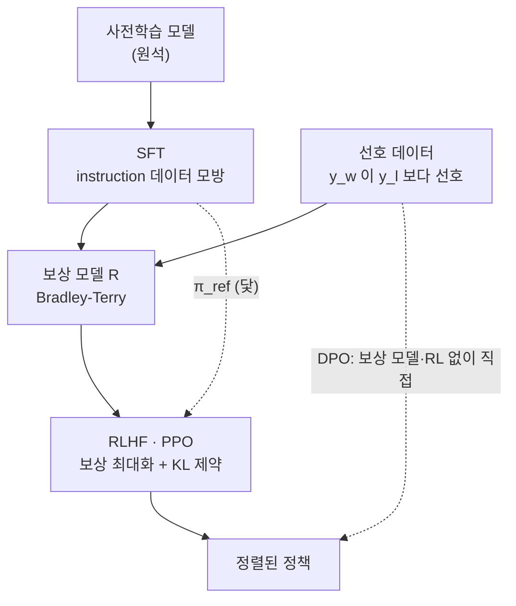

`CS336-LLM-From-Scratch` 시리즈의 15단계입니다. 전체 지도는 [CS336 커리큘럼](/2026/06/26/cs336-llm-from-scratch-curriculum.html)에서 볼 수 있습니다. ([14강 — 데이터 (2)](/2026/06/26/cs336-lecture-14-data-2-filtering-dedup.html)에서 이어집니다.)

여기서부터 **유닛 5(정렬)**가 시작됩니다. 유닛 1~4를 지나며 우리는 사전학습된 "원석"을 손에 쥐었습니다 — 아키텍처로 빚고, 스케일링으로 키우고, 좋은 데이터로 먹인 모델. 그러나 원석은 그대로는 쓸모가 애매합니다. 다음 토큰을 잘 맞힐 뿐, **지시를 따르지도** 않고 사람이 원하는 방식으로 답하지도 않습니다. "이메일을 요약해 줘"라고 하면, 사전학습 모델은 요약 대신 비슷한 이메일을 이어 쓰기 십상입니다. 정렬(alignment)은 이 원석을 **어시스턴트로 길들이는** 과정이고, 그 첫 두 도구가 **SFT**(지시를 따르게)와 **RLHF**(사람 선호에 맞추기)입니다. (강사 Tatsu Hashimoto.)

<figure class="post-figure post-figure--header">
<svg role="img" aria-label="정렬 파이프라인 도식. 사전학습 모델에서 시작해 SFT(instruction 데이터), 보상 모델(선호 데이터, Bradley-Terry), RLHF(PPO·KL 제약)를 거쳐 정렬된 모델에 이르는 다섯 단계가 화살표로 이어진다. 그 아래로 DPO 지름길 화살표가 SFT에서 곧장 정렬된 모델로 향하며, 보상 모델과 RL 루프 두 단계를 건너뛴다." viewBox="0 0 820 320" xmlns="http://www.w3.org/2000/svg">
  <title>정렬 파이프라인 — SFT · 보상 모델 · RLHF, 그리고 DPO 지름길</title>
  <defs>
    <marker id="alignArrow" viewBox="0 0 10 10" refX="8" refY="5" markerWidth="8" markerHeight="8" orient="auto-start-reverse">
      <path d="M0,0 L10,5 L0,10 z" fill="var(--gold)"/>
    </marker>
    <marker id="dpoArrow" viewBox="0 0 10 10" refX="8" refY="5" markerWidth="8" markerHeight="8" orient="auto-start-reverse">
      <path d="M0,0 L10,5 L0,10 z" fill="var(--accent-color)"/>
    </marker>
  </defs>

  <text x="410" y="30" text-anchor="middle" font-family="var(--font-body)" font-size="16" font-weight="700" fill="var(--text-color)">사전학습된 원석 → 어시스턴트로: 정렬 파이프라인</text>

  <!-- ===== DPO bypass enclosure (behind boxes) ===== -->
  <rect x="322" y="66" width="286" height="124" rx="10" fill="none" stroke="var(--accent-color)" stroke-width="1.4" stroke-dasharray="3 5" opacity="0.55"/>

  <!-- ===== stage boxes ===== -->
  <!-- box 1: 사전학습 모델 -->
  <rect x="15" y="80" width="120" height="96" rx="8" fill="currentColor" opacity="0.05"/>
  <rect x="15" y="80" width="120" height="96" rx="8" fill="none" stroke="var(--secondary-color)" stroke-width="2"/>
  <text x="75" y="122" text-anchor="middle" font-family="var(--font-body)" font-size="13.5" font-weight="700" fill="var(--text-color)">사전학습 모델</text>
  <text x="75" y="144" text-anchor="middle" font-family="var(--font-body)" font-size="11.5" fill="var(--text-light)">원석</text>

  <!-- box 2: SFT -->
  <rect x="172" y="80" width="120" height="96" rx="8" fill="currentColor" opacity="0.05"/>
  <rect x="172" y="80" width="120" height="96" rx="8" fill="none" stroke="var(--secondary-color)" stroke-width="2"/>
  <text x="232" y="122" text-anchor="middle" font-family="var(--font-body)" font-size="14" font-weight="700" fill="var(--text-color)">SFT</text>
  <text x="232" y="144" text-anchor="middle" font-family="var(--font-body)" font-size="11.5" fill="var(--text-light)">instruction 데이터</text>

  <!-- box 3: 보상 모델 -->
  <rect x="329" y="80" width="120" height="96" rx="8" fill="currentColor" opacity="0.05"/>
  <rect x="329" y="80" width="120" height="96" rx="8" fill="none" stroke="var(--secondary-color)" stroke-width="2"/>
  <text x="389" y="122" text-anchor="middle" font-family="var(--font-body)" font-size="13.5" font-weight="700" fill="var(--text-color)">보상 모델</text>
  <text x="389" y="144" text-anchor="middle" font-family="var(--font-body)" font-size="11.5" fill="var(--text-light)">선호 데이터</text>

  <!-- box 4: RLHF -->
  <rect x="486" y="80" width="120" height="96" rx="8" fill="currentColor" opacity="0.05"/>
  <rect x="486" y="80" width="120" height="96" rx="8" fill="none" stroke="var(--secondary-color)" stroke-width="2"/>
  <text x="546" y="122" text-anchor="middle" font-family="var(--font-body)" font-size="14" font-weight="700" fill="var(--text-color)">RLHF</text>
  <text x="546" y="144" text-anchor="middle" font-family="var(--font-body)" font-size="11.5" fill="var(--text-light)">PPO · KL 제약</text>

  <!-- box 5: 정렬된 모델 (payoff — accent stroke) -->
  <rect x="643" y="80" width="120" height="96" rx="8" fill="currentColor" opacity="0.05"/>
  <rect x="643" y="80" width="120" height="96" rx="8" fill="none" stroke="var(--accent-color)" stroke-width="2.5"/>
  <text x="703" y="122" text-anchor="middle" font-family="var(--font-body)" font-size="13.5" font-weight="700" fill="var(--text-color)">정렬된 모델</text>
  <text x="703" y="144" text-anchor="middle" font-family="var(--font-body)" font-size="11.5" fill="var(--text-light)">어시스턴트</text>

  <!-- ===== main pipeline arrows (gold) ===== -->
  <g stroke="var(--gold)" stroke-width="2.2">
    <line x1="137" y1="128" x2="170" y2="128" marker-end="url(#alignArrow)"/>
    <line x1="294" y1="128" x2="327" y2="128" marker-end="url(#alignArrow)"/>
    <line x1="451" y1="128" x2="484" y2="128" marker-end="url(#alignArrow)"/>
    <line x1="608" y1="128" x2="641" y2="128" marker-end="url(#alignArrow)"/>
  </g>

  <!-- enclosure caption -->
  <text x="465" y="60" text-anchor="middle" font-family="var(--font-body)" font-size="11" fill="var(--accent-color)">DPO가 건너뛰는 구간 (보상 모델 + RL)</text>

  <!-- ===== DPO shortcut arrow (accent, dashed) ===== -->
  <path d="M 232 176 C 300 268, 630 268, 703 178" fill="none" stroke="var(--accent-color)" stroke-width="2.4" stroke-dasharray="5 4" marker-end="url(#dpoArrow)"/>
  <text x="467" y="286" text-anchor="middle" font-family="var(--font-body)" font-size="12.5" font-weight="700" fill="var(--accent-color)">DPO — 선호 데이터로 정책에 직접 (보상 모델 · RL 없이)</text>
</svg>
<figcaption>정렬의 주 경로는 사전학습 모델 → SFT(instruction 데이터로 형식 학습) → 보상 모델(선호 데이터로 Bradley-Terry 학습) → RLHF(PPO로 보상을 최대화하되 KL로 제약) → 정렬된 어시스턴트다. DPO는 가운데 두 단계(보상 모델·RL 루프)를 통째로 건너뛰어, 선호 데이터로 정책을 곧장 학습한다.</figcaption>
</figure>

## 한눈에 보기

정렬을 관통하는 한 문장은 이렇습니다 — **사람의 선호를 어떻게 학습 신호로 바꿀 것인가.** SFT는 "좋은 답을 모방"하고, RLHF는 "두 답 중 나은 쪽"이라는 비교 신호를 보상 모델로 요약한 뒤 그 보상을 최적화합니다. DPO는 그 중간 다리(보상 모델·RL)를 걷어내고 선호 데이터에서 곧장 정책으로 갑니다.



주 경로(실선)는 SFT → 보상 모델 ← 선호 데이터 → RLHF로 흐르고, SFT 모델은 RLHF에서 벗어나지 말아야 할 **닻(π_ref)** 역할도 겸합니다. DPO(점선)는 같은 선호 데이터를 쓰되 보상 모델과 RL 루프를 건너뛰어 정책을 직접 업데이트합니다.

## SFT — 지시를 따르게 만들기

정렬의 첫 단계는 **SFT(supervised fine-tuning)**, 즉 지도학습 미세조정입니다. 방법은 단순합니다 — `(지시, 이상적 응답)` 쌍을 잔뜩 모아, 사전학습 때와 똑같은 다음 토큰 예측 손실로 이어서 학습합니다. 형식만 보면 사전학습과 다를 게 없습니다. 다른 건 데이터입니다 — 웹 크롤이 아니라, **어시스턴트가 이렇게 답했으면**하는 시연(demonstration)입니다.

여기서 이 강의가 강조하는 핵심 통찰이 나옵니다 — **SFT는 사전학습에서 이미 배운 행동을 "추출"할 뿐, 새로운 것을 "추가"할 때는 가장 잘 작동하지 않는다.**

> 지식과 능력은 대부분 **사전학습**에서 온다. SFT가 새로 가르치는 것은 주로 **형식·스타일·페르소나** — "질문에는 곧장 답하고, 이런 어조로, 이런 구조로 응답하라"는 사용법이다.

이 관점의 놀라운 따름정리가 있습니다 — **사실적으로 옳은 데이터를 더하는 것조차 해가 될 수 있습니다.** 모델이 **모르는** 사실을 SFT로 가르치면, 모델은 "이런 종류의 질문에는 자신 있게 답을 지어내라"는 패턴을 배웁니다. 시연을 그대로 흉내 내는 **행동 복제(behavior cloning)**의 함정이죠 — 결과는 더 그럴듯하지만 근거 없는 **환각(hallucination)**입니다(Schulman·Gekhman 2023). 그래서 SFT 데이터는 모델이 이미 아는 범위 안에서 형식을 다듬는 데 쓰는 것이 안전합니다.

실무적 함의는 **품질 > 양**입니다 — 올바른 종류의 행동(안전·지시 이행·스타일)은 **소량으로도 큰 차이**를 만듭니다. 예컨대 **~500개**의 안전 예제만 더해도 모델의 안전 프로필이 크게 바뀝니다(다만 과하면 멀쩡한 질문까지 거부하는 over-refusal로 기웁니다). 물론 성능의 **긴 꼬리(long tail)**는 여전히 더 많은 데이터에서 이득을 봅니다.

하지만 SFT에는 구조적 한계가 있습니다. SFT는 시연을 **모방(imitation)**할 뿐입니다.

- 시연을 **넘어설** 수 없습니다 — 데이터에 담긴 것 이상으로 잘하도록 밀어붙이는 신호가 없습니다.
- **부정 신호로 배우지 못합니다** — "이 답은 나쁘다"를 가르칠 수 없습니다. SFT의 목표는 오직 "이 답을 더 그럴듯하게 만들어라"뿐이라, 나쁜 답을 억누르는 건 간접적일 뿐입니다.

무엇이 좋고 무엇이 나쁜지를 **비교**로 가르치고, 모방을 넘어서게 하려면 다른 신호가 필요합니다. 강의는 이 전환을 **모방(imitation)에서 최적화(optimization)로**라고 부릅니다 — 언어 모델을 "어떤 분포를 흉내 내는 것"이 아니라 "측정 가능한 보상을 최대화하는 **정책(policy)**"으로 다시 봅니다. 동기는 셋입니다: (1) 좋은 시연을 통째로 써내는 것보다 **둘 중 나은 쪽을 고르는 스칼라 피드백**이 값싸고, (2) 사람은 자기가 **선호하는 답을 직접 써내지는 못하는** 경우가 많으며(생성-검증 격차, generation-verification gap), (3) SFT처럼 모방에 갇히지 않고 시연을 **넘어설** 수 있습니다. 이것이 RLHF의 출발점입니다.

## 선호 데이터와 보상 모델

RLHF의 재료는 **선호 데이터(preference data)**입니다. 사람에게 같은 프롬프트 `x`에 대한 두 응답을 보여 주고 어느 쪽이 나은지 고르게 합니다. 결과는 "선호된 응답 `y_w`(winner)가 거부된 응답 `y_l`(loser)보다 낫다", 즉 `y_w ≻ y_l`이라는 비교 쌍의 모음입니다. 절대 점수를 매기게 하는 것보다, **둘 중 나은 쪽 고르기**가 사람에게 훨씬 일관적이고 값싸다는 점이 핵심입니다.

문제는 이 이산적인 "A가 B보다 낫다"를 어떻게 학습 가능한 **연속 신호**로 바꾸느냐입니다. 답은 심리측정학에서 온 **Bradley-Terry 모델**입니다. 각 응답에 잠재 점수(보상) `R(x, y)`가 있다고 가정하고, 두 응답의 보상 차이를 시그모이드에 넣어 선호 확률로 만듭니다.

```text
P(y_w ≻ y_l | x) = σ( R(x, y_w) − R(x, y_l) )
```

<figure class="post-figure">
<svg role="img" aria-label="Bradley-Terry 모델 도식. 왼쪽에서 보상 모델이 선호된 응답 y_w와 거부된 응답 y_l에 각각 스칼라 보상 R(x, y_w)와 R(x, y_l)을 매기고, 둘의 차이를 구한다. 그 차이가 시그모이드 σ를 거쳐 오른쪽 곡선의 선호 확률 P(y_w ≻ y_l | x)로 변환된다. 곡선은 가로축이 보상 차이, 세로축이 선호 확률이며, 차이가 0이면 확률 0.5(반반), 차이가 크게 양수이면 확률이 1에 가까워지고, 크게 음수이면 0에 가까워지는 S자 시그모이드다." viewBox="0 0 720 400" xmlns="http://www.w3.org/2000/svg">
  <title>Bradley-Terry — 보상 차이를 시그모이드에 넣어 선호 확률로</title>
  <defs>
    <marker id="btSigArrow" viewBox="0 0 10 10" refX="8" refY="5" markerWidth="8" markerHeight="8" orient="auto-start-reverse">
      <path d="M0,0 L10,5 L0,10 z" fill="var(--accent-color)"/>
    </marker>
    <marker id="btAxisArrow" viewBox="0 0 10 10" refX="8" refY="5" markerWidth="7" markerHeight="7" orient="auto-start-reverse">
      <path d="M0,0 L10,5 L0,10 z" fill="currentColor"/>
    </marker>
  </defs>

  <text x="360" y="30" text-anchor="middle" font-family="var(--font-body)" font-size="16" font-weight="700" fill="var(--text-color)">이산적 선호를 연속 확률로 — Bradley-Terry</text>

  <!-- ===== left column: two reward boxes → difference ===== -->
  <!-- y_w box (preferred) -->
  <rect x="28" y="86" width="168" height="56" rx="8" fill="currentColor" opacity="0.05"/>
  <rect x="28" y="86" width="168" height="56" rx="8" fill="none" stroke="var(--secondary-color)" stroke-width="2"/>
  <text x="112" y="108" text-anchor="middle" font-family="var(--font-body)" font-size="11" fill="var(--text-light)">y_w · 선호된 응답</text>
  <text x="112" y="130" text-anchor="middle" font-family="var(--font-body)" font-size="14" font-weight="700" fill="var(--text-color)">R(x, y_w)</text>

  <!-- y_l box (rejected) -->
  <rect x="28" y="176" width="168" height="56" rx="8" fill="currentColor" opacity="0.05"/>
  <rect x="28" y="176" width="168" height="56" rx="8" fill="none" stroke="var(--secondary-color)" stroke-width="2"/>
  <text x="112" y="198" text-anchor="middle" font-family="var(--font-body)" font-size="11" fill="var(--text-light)">y_l · 거부된 응답</text>
  <text x="112" y="220" text-anchor="middle" font-family="var(--font-body)" font-size="14" font-weight="700" fill="var(--text-color)">R(x, y_l)</text>

  <!-- converging lines into difference node -->
  <g stroke="var(--secondary-color)" stroke-width="1.6" fill="none">
    <line x1="196" y1="114" x2="234" y2="150"/>
    <line x1="196" y1="204" x2="234" y2="168"/>
  </g>

  <!-- difference node -->
  <circle cx="250" cy="159" r="18" fill="currentColor" opacity="0.05"/>
  <circle cx="250" cy="159" r="18" fill="none" stroke="var(--secondary-color)" stroke-width="2"/>
  <text x="250" y="167" text-anchor="middle" font-family="var(--font-body)" font-size="22" font-weight="700" fill="var(--text-color)">−</text>
  <text x="250" y="197" text-anchor="middle" font-family="var(--font-body)" font-size="11" fill="var(--text-light)">보상 차이 Δ</text>

  <!-- sigmoid arrow into plot -->
  <line x1="272" y1="159" x2="352" y2="159" stroke="var(--accent-color)" stroke-width="2.4" marker-end="url(#btSigArrow)"/>
  <text x="312" y="147" text-anchor="middle" font-family="var(--font-body)" font-size="12.5" font-weight="700" fill="var(--accent-color)">σ</text>

  <!-- ===== right: sigmoid plot ===== -->
  <text x="356" y="64" text-anchor="start" font-family="var(--font-body)" font-size="11.5" fill="var(--text-light)">P(y_w ≻ y_l | x) — 선호 확률</text>

  <!-- axes -->
  <g stroke="currentColor" stroke-width="2" fill="none">
    <path d="M 360 320 L 360 72" marker-end="url(#btAxisArrow)"/>
    <path d="M 360 320 L 700 320" marker-end="url(#btAxisArrow)"/>
  </g>

  <!-- y ticks + labels (P) -->
  <g stroke="currentColor" stroke-width="1.6" opacity="0.7">
    <line x1="356" y1="80" x2="360" y2="80"/>
    <line x1="356" y1="200" x2="360" y2="200"/>
  </g>
  <text x="352" y="84" text-anchor="end" font-family="var(--font-body)" font-size="11.5" fill="var(--text-light)">1</text>
  <text x="352" y="204" text-anchor="end" font-family="var(--font-body)" font-size="11.5" fill="var(--text-light)">0.5</text>
  <text x="352" y="324" text-anchor="end" font-family="var(--font-body)" font-size="11.5" fill="var(--text-light)">0</text>

  <!-- reference lines: P=0.5 and Δ=0 -->
  <line x1="360" y1="200" x2="690" y2="200" stroke="var(--text-light)" stroke-width="1.4" stroke-dasharray="3 5" opacity="0.75"/>
  <line x1="525" y1="80" x2="525" y2="320" stroke="var(--text-light)" stroke-width="1.4" stroke-dasharray="3 5" opacity="0.75"/>

  <!-- sigmoid curve -->
  <path d="M 360 319 L 388 318 L 415 316 L 429 313 L 443 309 L 456 302 L 470 292 L 484 276 L 498 256 L 511 229 L 525 200 L 539 171 L 553 145 L 566 124 L 580 109 L 594 98 L 608 91 L 621 87 L 635 84 L 663 82 L 690 81" fill="none" stroke="var(--gold)" stroke-width="3"/>

  <!-- center point Δ=0 → 0.5 -->
  <circle cx="525" cy="200" r="6" fill="var(--gold)" stroke="var(--bg-panel)" stroke-width="2"/>
  <text x="445" y="190" text-anchor="middle" font-family="var(--font-body)" font-size="11.5" font-weight="700" fill="var(--text-light)">차이 0 → 0.5</text>
  <text x="445" y="206" text-anchor="middle" font-family="var(--font-body)" font-size="10.5" fill="var(--text-light)">(반반)</text>

  <!-- right annotation: large positive → 1 -->
  <text x="632" y="160" text-anchor="middle" font-family="var(--font-body)" font-size="11.5" font-weight="700" fill="var(--gold)">차이 ↑ → 1</text>
  <text x="632" y="176" text-anchor="middle" font-family="var(--font-body)" font-size="10.5" fill="var(--text-light)">y_w 확실히 선호</text>

  <!-- left annotation: large negative → 0 -->
  <text x="452" y="278" text-anchor="middle" font-family="var(--font-body)" font-size="11.5" font-weight="700" fill="var(--text-light)">차이 ↓ → 0</text>

  <!-- x-axis: Δ=0 tick + sign hints + label -->
  <line x1="525" y1="320" x2="525" y2="326" stroke="currentColor" stroke-width="1.6" opacity="0.7"/>
  <text x="525" y="340" text-anchor="middle" font-family="var(--font-body)" font-size="11.5" fill="var(--text-light)">0</text>
  <text x="392" y="340" text-anchor="middle" font-family="var(--font-body)" font-size="12" fill="var(--text-light)">−</text>
  <text x="662" y="340" text-anchor="middle" font-family="var(--font-body)" font-size="12" fill="var(--text-light)">+</text>
  <text x="525" y="366" text-anchor="middle" font-family="var(--font-body)" font-size="12.5" fill="var(--text-light)">보상 차이  R(x, y_w) − R(x, y_l)  →</text>
</svg>
<figcaption>Bradley-Terry는 "A가 B보다 낫다"는 이산적 선호를 연속 신호로 바꾼다. 보상 모델이 두 응답에 스칼라 보상을 매기고, 그 차이 R(x, y_w) − R(x, y_l)를 시그모이드 σ에 통과시켜 선호 확률 P(y_w ≻ y_l | x)로 만든다. 차이가 0이면 0.5(반반), 크게 양수이면 1에 가까워지고 음수이면 0에 가까워지는 S자 곡선이다.</figcaption>
</figure>

직관은 단순합니다 — 두 보상의 차이가 클수록 사람이 `y_w`를 고를 확률이 1에 가까워지고, 차이가 0이면 반반(0.5)입니다. 우리는 관측된 선호들의 우도(likelihood)를 최대화하도록 `R`을 학습합니다. **보상 모델(reward model)**은 대개 사전학습/SFT된 LM 위에 **스칼라 헤드**를 하나 얹은 것 — 시퀀스를 넣으면 토큰 대신 하나의 숫자(보상)를 뱉게 만든 모델입니다.

> 보상 모델은 "사람의 선호를 흉내 내는 자동 채점기"다. 사람을 매 스텝 불러올 수는 없으니, 사람 판정을 한 번 학습해 두고 RL 루프에서 무한히 질의한다.

## RLHF — 보상을 최적화하되 멀리 가지 않기

보상 모델 `R`이 생겼으니, 이제 정책 `π`(우리 LM)가 **높은 보상을 받는 응답**을 내도록 밀어붙이면 됩니다. 그런데 순진하게 `R`만 최대화하면 곧장 재앙이 옵니다 — 모델은 보상 모델의 허점을 파고들어, 사람이 보기엔 엉망이지만 점수만 높은 문장으로 붕괴합니다. 그래서 RLHF의 목적함수에는 **제약**이 붙습니다.

```text
max_π  E_{x, y~π}[ R(x, y) ]  −  β · KL( π(y|x) ‖ π_ref(y|x) )
```

앞항은 "보상을 높여라", 뒷항은 "SFT 모델 `π_ref`에서 너무 멀어지지 마라"는 벌점입니다. 여기서 `π_ref`는 보통 **SFT 모델**이고, `β`는 그 벌점의 세기(KL 예산)를 정하는 계수입니다.

> **KL 제약이 이 목적함수의 핵심이다.** 정책이 SFT 모델 근처의 "말이 되는 언어" 영역에 머물도록 붙잡아, 보상만 노리다 문장이 무너지는 것을 막는다. 보상은 프록시일 뿐이므로, 그 프록시를 신뢰할 수 있는 범위 안에서만 최적화하겠다는 뜻이다.

이 목적함수를 실제로 최적화하는 알고리즘이 **PPO(Proximal Policy Optimization)**입니다 — 정책 경사(policy gradient)에 클리핑(clipping)을 얹어, 한 번의 업데이트가 정책을 너무 크게 바꾸지 않도록 다시 한 번 안전장치를 건 방법입니다. RL 특유의 불안정성(가치 함수, advantage 추정, 롤아웃 샘플링 등) 때문에 구현 디테일이 까다로운데, 그 부분은 17강에서 따로 다룹니다. 여기서 기억할 것은 하나 — **RLHF는 "보상 최대화 − KL 벌점"이라는 제약된 최적화이고, PPO는 그것을 안전하게 푸는 도구**라는 점입니다.

## 보상 해킹(reward hacking)과 과최적화

RLHF의 가장 근본적인 위험은 보상 모델 `R`이 **진짜 선호가 아니라 그 프록시(proxy)**라는 데서 옵니다. `R`은 유한한 선호 데이터로 학습된 근사치라, 반드시 어딘가에 허점이 있습니다. 정책을 그 허점 쪽으로 세게 밀면, **보상 점수는 오르는데 실제 품질은 떨어지는** 일이 벌어집니다 — 이것이 **보상 해킹(reward hacking)**이자, 측정 지표를 목표로 삼으면 그 지표가 망가진다는 **Goodhart의 법칙**의 전형적 사례입니다.

이 현상은 정성적 관찰에 그치지 않고 **정량적 스케일링 법칙**으로 정리됐습니다 (Gao et al., "Scaling Laws for Reward Model Overoptimization"). 정책이 `π_ref`에서 멀어질수록(KL이 커질수록):

- 보상 모델이 매기는 **프록시 보상**은 단조롭게 계속 오릅니다.
- 하지만 진짜 선호(gold reward)로 재보면, 처음엔 같이 오르다가 **어느 지점에서 정점을 찍고 하락**합니다.

<figure class="post-figure">
<svg role="img" aria-label="보상 모델 과최적화 곡선. 가로축은 정책이 참조 모델에서 멀어지는 KL 거리, 세로축은 보상이다. 프록시 보상 곡선은 KL이 커질수록 단조롭게 계속 상승하지만, 실제 보상 곡선은 처음엔 함께 오르다 어느 지점에서 정점을 찍고 하락한다. 그 정점이 최적 KL 예산이며, 그 오른쪽은 과최적화 구간으로 보상은 올라도 실제 품질은 떨어진다." viewBox="0 0 680 380" xmlns="http://www.w3.org/2000/svg">
  <title>보상 모델 과최적화 — 프록시 보상은 상승, 실제 보상은 정점 후 하락</title>

  <text x="340" y="30" text-anchor="middle" font-family="var(--font-body)" font-size="16" font-weight="700" fill="var(--text-color)">최적화를 세게 할수록 프록시는 오르고 실제 보상은 꺾인다</text>

  <!-- over-optimization region shading (right of the peak) -->
  <rect x="300" y="60" width="320" height="240" fill="currentColor" opacity="0.05"/>

  <!-- axes -->
  <g stroke="currentColor" stroke-width="2" fill="none" stroke-linecap="square">
    <path d="M 72 60 L 72 300 L 620 300" opacity="0.85"/>
  </g>

  <!-- proxy reward: monotonically rising, concave (accent) -->
  <path d="M 72 300 Q 300 150 620 100" fill="none" stroke="var(--accent-color)" stroke-width="3"/>
  <!-- true/gold reward: rises then falls (gold) -->
  <path d="M 72 300 C 170 150, 250 120, 300 120 C 380 120, 510 210, 620 252" fill="none" stroke="var(--gold)" stroke-width="3"/>

  <!-- peak marker on true reward -->
  <line x1="300" y1="120" x2="300" y2="300" stroke="var(--text-light)" stroke-width="1.5" stroke-dasharray="3 5" opacity="0.85"/>
  <circle cx="300" cy="120" r="6" fill="var(--gold)" stroke="var(--bg-panel)" stroke-width="2"/>
  <text x="300" y="322" text-anchor="middle" font-family="var(--font-body)" font-size="11.5" font-weight="700" fill="var(--text-light)">최적 KL 예산 (β가 정함)</text>

  <!-- curve labels -->
  <text x="560" y="90" text-anchor="middle" font-family="var(--font-body)" font-size="12.5" font-weight="700" fill="var(--accent-color)">프록시 보상 (R)</text>
  <text x="470" y="248" text-anchor="middle" font-family="var(--font-body)" font-size="12.5" font-weight="700" fill="var(--gold)">실제 보상 (gold)</text>

  <!-- over-optimization label -->
  <text x="460" y="82" text-anchor="middle" font-family="var(--font-body)" font-size="12" fill="var(--text-light)">과최적화 구간 — 보상↑ 품질↓</text>

  <!-- axis labels -->
  <text x="346" y="352" text-anchor="middle" font-family="var(--font-body)" font-size="13" fill="var(--text-light)">KL 거리 — 정책이 SFT(π_ref)에서 멀어질수록 →</text>
  <text x="34" y="180" text-anchor="middle" font-family="var(--font-body)" font-size="13" fill="var(--text-light)" transform="rotate(-90 34 180)">보상</text>
</svg>
<figcaption>가로축은 정책이 참조 모델에서 멀어지는 KL 거리, 세로축은 보상. 프록시 보상(붉은 선)은 최적화를 세게 할수록 계속 오르지만, 실제 선호(금색 선)는 정점을 찍고 하락한다. 그 정점이 멈춰야 할 지점이며, β(KL 예산)가 이 균형을 조절한다 — 오른쪽 음영은 보상은 올라도 실제 품질이 떨어지는 과최적화 구간이다.</figcaption>
</figure>

여기서 `β`(KL 예산)의 역할이 분명해집니다 — **`β`는 이 곡선의 어디에서 멈출지를 정하는 손잡이**입니다. `β`가 너무 크면(KL을 빡빡하게 조이면) 정점에 못 미쳐 개선을 덜 얻고, `β`가 너무 작으면(마음껏 멀어지게 두면) 정점을 지나쳐 과최적화 구간으로 굴러떨어집니다. 좋은 RLHF는 결국 이 균형을 맞히는 문제입니다.

과최적화만이 RLHF의 부작용은 아닙니다. 강의는 두 가지를 더 짚습니다 — **길이 편향(length bias)**과 **모드 붕괴(mode collapse)**입니다. RLHF는 사람·LM 평가자 모두가 **긴 답을 선호**하는 경향 탓에 출력이 체계적으로 길어지는데, 이는 RLHF의 "가장 두드러진 부작용" 중 하나로 꼽힙니다(12강의 길이 편향과 이어집니다). 또 RLHF를 거친 모델은 더 이상 **확률적으로 보정(calibration)된** 모델이 아니게 됩니다 — 확률이 소수의 모드로 쏠려 "이 답이 몇 % 확률로 맞다"는 신뢰도가 무너집니다(사전학습 모델의 ECE ≈ 0.01 → PPO 후 ≈ 0.07).

## DPO — 보상 모델을 지워버리기

RLHF는 강력하지만 무겁습니다 — 별도의 보상 모델을 학습하고, 불안정한 RL 루프를 돌리고, 매 스텝 정책에서 샘플을 뽑아 보상을 질의해야 합니다. **DPO(Direct Preference Optimization)**는 이 전체 파이프라인을 **하나의 분류 손실**로 접어 버립니다. 통찰의 출발점은 앞의 KL-정규화 목적함수의 **최적 정책이 닫힌 형태(closed form)로 알려져 있다**는 사실입니다.

```text
π*(y|x) ∝ π_ref(y|x) · exp( R(x, y) / β )
```

즉 최적 정책은 참조 정책을 보상에 비례해 지수적으로 재가중한 분포입니다. 이 식을 `R`에 대해 뒤집으면, **보상을 정책과 참조 정책의 로그 비율로** 표현할 수 있습니다.

```text
⇒  R(x, y) = β · log( π(y|x) / π_ref(y|x) ) + const
```

여기가 핵심입니다 — 보상 `R`이 더 이상 **별도로 학습할 대상이 아니라, 정책 자체로 표현**됩니다. 이제 이 `R`을 앞의 Bradley-Terry 우도에 그대로 대입합니다. 상수항은 `y_w`와 `y_l`에서 똑같이 나타나 차이를 취할 때 소거되고, 남는 것은 **보상 모델도 RL 루프도 없이** 정책에만 직접 거는 분류(로지스틱) 손실입니다.

```text
L_DPO = − log σ( β·log(π(y_w|x)/π_ref(y_w|x)) − β·log(π(y_l|x)/π_ref(y_l|x)) )
```

읽는 법은 이렇습니다 — 선호된 응답 `y_w`의 로그 확률은 참조 대비 **올리고**, 거부된 응답 `y_l`은 **내려라**. 그것도 `π_ref`를 기준으로 상대적으로. RLHF와 똑같은 KL-정규화 목적을 겨냥하면서도, 보상 모델 학습과 온라인 샘플링을 통째로 없앤 것입니다.

- **장점**: 단순하고 안정적입니다. 별도의 보상 모델·가치 함수·롤아웃 샘플링이 필요 없고, 표준 지도학습처럼 배치를 돌리면 됩니다. 그래서 재현이 쉽고 계산도 가볍습니다.
- **단점**: DPO는 본질적으로 **오프라인(offline)**입니다 — 미리 고정된 선호 데이터로만 학습하며, 학습 중인 정책이 스스로 만든 응답을 새로 채점하는 **on-policy 탐색이 없습니다.** 그래서 정책이 데이터 분포에서 벗어나는 **분포 이동(distribution shift)**에 민감합니다. 다만 성능 자체는, 통제된 비교(AlpacaFarm)에서 **PPO와 대등**했고("고통 없이 같은 성능") 실제로 오픈소스 상위 RLHF 모델 대부분이 DPO로 학습됩니다. 그럼에도 **잘 튜닝한 PPO**(더 큰 보상 모델·다양한 프롬프트)가 DPO를 근소하게 앞서기도 해, 결론은 "결과는 실험 셋업에 크게 좌우된다"입니다.

> DPO는 "보상 모델은 어차피 정책의 로그 비율로 표현되니, 굳이 따로 만들지 말자"는 재해석이다. 대가로 온라인 탐색을 포기하므로, 무거워도 강한 PPO와 가벼워도 오프라인인 DPO 사이의 트레이드오프가 된다.

## 실전 노트

- **SFT는 추출이지 추가가 아니다**: 지식은 사전학습에서 오고, SFT는 형식·스타일·지시 이행을 얹는다. 모르는 사실을 가르치면 오히려 **환각**을 학습한다(Schulman·Gekhman). 그래서 **품질 > 양** — 올바른 행동은 소량(안전 ~500개)으로도 큰 차이.
- **보상 모델 = Bradley-Terry**: 사람이 하기 쉬운 "둘 중 나은 쪽" 비교를, 두 보상의 차이를 시그모이드에 넣어 연속 신호로 바꾼다. 스칼라 헤드를 단 LM이 사람 선호의 자동 채점기가 된다.
- **RLHF는 KL 예산이 생명**: 목적함수는 "보상 최대화 − β·KL(π‖π_ref)". SFT 모델을 닻으로 붙잡지 않으면 보상만 노리다 문장이 무너진다. PPO로 최적화한다(디테일은 17강).
- **reward hacking = Goodhart**: 보상은 프록시일 뿐이라, 세게 최적화하면 프록시 보상↑·실제 보상↓. 과최적화 스케일링 법칙(Gao et al.)이 그 곡선을 정량화했고, β가 멈출 지점을 정한다.
- **DPO는 RM을 없앤다**: KL-정규화 최적 정책의 닫힌 형태를 이용해 보상을 정책의 로그 비율로 대체 → 보상 모델·RL 없는 분류 손실. 단순·안정하지만 **오프라인**이라 분포 이동에 약하고 PPO보다 약할 때가 있다.
- **선택 기준**: 자원·안정성이 우선이면 DPO, 최고 성능과 on-policy 탐색이 필요하면 PPO. 둘은 같은 KL-정규화 목적을 다른 방식으로 푼다.

## 요약

- **정렬 = 원석을 어시스턴트로**: 사전학습 모델은 지시를 따르지 않는다. 정렬은 SFT(지시 이행)와 RLHF(선호 반영)로 이를 길들이는 과정이다.
- **SFT**: 지시-응답 쌍의 모방으로 사전학습 행동을 **추출**(추가가 아님) — 모르는 사실을 가르치면 환각을 학습한다. 시연을 넘어서거나 부정 신호로 배우지는 못한다 → RLHF 필요.
- **보상 모델**: 선호 비교(`y_w ≻ y_l`)를 **Bradley-Terry**(`σ(R(x,y_w) − R(x,y_l))`)로 확률화해, 스칼라 헤드 LM을 사람 선호의 프록시로 학습한다.
- **RLHF**: `max_π E[R] − β·KL(π‖π_ref)`를 PPO로 최적화. KL 제약이 붕괴를 막고, 보상은 프록시라 과최적화(Goodhart)에 취약 — β가 균형을 조절한다.
- **DPO**: KL-정규화 최적 정책의 닫힌 형태로 보상을 정책의 로그 비율로 대체 → 보상 모델·RL 없는 분류 손실. 단순·안정하지만 오프라인이라는 트레이드오프.

SFT와 RLHF로 원석을 어시스턴트로 만들었습니다. 그런데 보상이 "학습된 프록시"라면 늘 해킹 위험이 있습니다 — 다음 강의는 보상을 아예 **검증**해 버리는 RLVR입니다.

### 다음 학습 (Next Learning)

- **16단계: 정렬 (2) — RLVR와 추론 모델** — [CS336 16강 — 정렬 (2)](/2026/06/26/cs336-lecture-16-alignment-rlvr.html)
- [CS336 14강 — 데이터 (2)](/2026/06/26/cs336-lecture-14-data-2-filtering-dedup.html) — 직전 단계 (유닛 4 마무리)
- [CS336 커리큘럼](/2026/06/26/cs336-llm-from-scratch-curriculum.html) — 전체 17단계 지도
