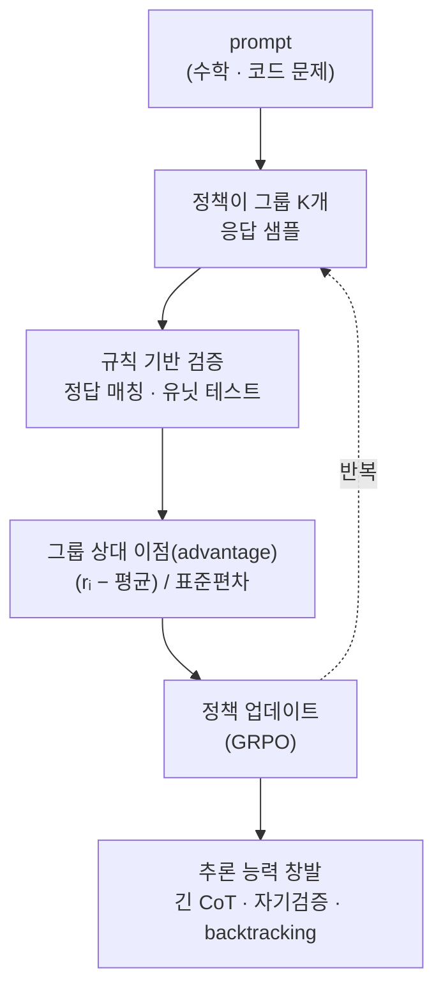

`CS336-LLM-From-Scratch` 시리즈의 16단계입니다. 전체 지도는 [CS336 커리큘럼](/2026/06/26/cs336-llm-from-scratch-curriculum.html)에서 볼 수 있습니다. ([15강 — 정렬 (1): SFT와 RLHF](/2026/06/26/cs336-lecture-15-alignment-sft-rlhf.html)에서 이어집니다.)

15강의 RLHF는 사람 선호를 **학습한 보상 모델(reward model)**로 최적화했습니다 — 그런데 학습된 보상은 늘 **해킹 가능한 프록시(proxy)**입니다. 모델은 "사람이 좋아할 답"이 아니라 "보상 모델이 높게 매기는 답"을 향해 달려가고, 그 둘의 틈을 파고듭니다. 여기서 통찰 하나가 판을 바꿉니다 — 수학·코드처럼 **정답을 검증할 수 있는** 과제라면, 보상을 굳이 학습할 필요가 없습니다. **그냥 계산하면** 됩니다. 이것이 **RLVR(RL with Verifiable Rewards)**이고, 이 단순한 전환이 스스로 사고사슬을 기르는 **추론 모델(reasoning model)**을 낳았습니다. (강사 Tatsu Hashimoto.)

<figure class="post-figure post-figure--header">
<svg role="img" aria-label="RLHF와 RLVR의 보상 원천 대비. 왼쪽 RLHF는 응답을 학습된 보상 모델에 통과시켜 주관적이고 해킹 가능한 프록시 보상을 얻고, 오른쪽 RLVR은 응답을 규칙 기반 검증기(정답 매칭·유닛 테스트)에 통과시켜 객관적으로 계산되는 정오 보상을 얻는다." viewBox="0 0 720 340" xmlns="http://www.w3.org/2000/svg">
  <title>RLHF(학습된 보상 · 주관적) 대 RLVR(규칙 기반 검증 · 객관적)</title>
  <defs>
    <marker id="rlvrArrow" viewBox="0 0 10 10" refX="8" refY="5" markerWidth="8" markerHeight="8" orient="auto-start-reverse">
      <path d="M0,0 L10,5 L0,10 z" fill="var(--gold)"/>
    </marker>
  </defs>

  <text x="360" y="30" text-anchor="middle" font-family="var(--font-body)" font-size="16" font-weight="700" fill="var(--text-color)">보상은 어디서 오는가 — 학습(RLHF) vs 검증(RLVR)</text>

  <!-- ===== LEFT: RLHF ===== -->
  <rect x="20" y="52" width="320" height="256" rx="10" fill="currentColor" opacity="0.04"/>
  <rect x="20" y="52" width="320" height="256" rx="10" fill="none" stroke="var(--secondary-color)" stroke-width="2"/>
  <text x="180" y="82" text-anchor="middle" font-family="var(--font-body)" font-size="16" font-weight="700" fill="var(--secondary-color)">RLHF</text>
  <text x="180" y="104" text-anchor="middle" font-family="var(--font-body)" font-size="12.5" fill="var(--text-light)">학습된 보상 모델</text>

  <!-- flow: 응답 -> RM -> 보상 -->
  <rect x="46" y="132" width="88" height="52" rx="8" fill="var(--bg-panel)" stroke="currentColor" stroke-width="1.8"/>
  <text x="90" y="163" text-anchor="middle" font-family="var(--font-body)" font-size="13" font-weight="700" fill="var(--text-color)">응답</text>

  <line x1="140" y1="158" x2="180" y2="158" stroke="var(--gold)" stroke-width="2.2" marker-end="url(#rlvrArrow)"/>

  <rect x="186" y="126" width="128" height="64" rx="8" fill="currentColor" opacity="0.06"/>
  <rect x="186" y="126" width="128" height="64" rx="8" fill="none" stroke="var(--secondary-color)" stroke-width="1.8" stroke-dasharray="5 4"/>
  <text x="250" y="153" text-anchor="middle" font-family="var(--font-body)" font-size="12.5" font-weight="700" fill="var(--text-color)">보상 모델(RM)</text>
  <text x="250" y="172" text-anchor="middle" font-family="var(--font-body)" font-size="11" fill="var(--text-light)">학습됨 · 근사</text>

  <text x="180" y="228" text-anchor="middle" font-family="var(--font-body)" font-size="13" font-weight="700" fill="var(--text-color)">→ 보상 r (주관적)</text>
  <text x="180" y="268" text-anchor="middle" font-family="var(--font-body)" font-size="12" fill="var(--text-light)">프록시 → reward hacking에 취약</text>
  <text x="180" y="288" text-anchor="middle" font-family="var(--font-body)" font-size="11.5" fill="var(--text-light)">사람 선호 라벨 필요</text>

  <!-- ===== RIGHT: RLVR ===== -->
  <rect x="380" y="52" width="320" height="256" rx="10" fill="currentColor" opacity="0.04"/>
  <rect x="380" y="52" width="320" height="256" rx="10" fill="none" stroke="var(--accent-color)" stroke-width="2.5"/>
  <text x="540" y="82" text-anchor="middle" font-family="var(--font-body)" font-size="16" font-weight="700" fill="var(--accent-color)">RLVR</text>
  <text x="540" y="104" text-anchor="middle" font-family="var(--font-body)" font-size="12.5" fill="var(--text-light)">규칙 기반 검증</text>

  <!-- flow: 응답 -> 검증기 -> 보상 -->
  <rect x="406" y="132" width="88" height="52" rx="8" fill="var(--bg-panel)" stroke="currentColor" stroke-width="1.8"/>
  <text x="450" y="163" text-anchor="middle" font-family="var(--font-body)" font-size="13" font-weight="700" fill="var(--text-color)">응답</text>

  <line x1="500" y1="158" x2="540" y2="158" stroke="var(--gold)" stroke-width="2.2" marker-end="url(#rlvrArrow)"/>

  <rect x="546" y="126" width="128" height="64" rx="8" fill="currentColor" opacity="0.06"/>
  <rect x="546" y="126" width="128" height="64" rx="8" fill="none" stroke="var(--accent-color)" stroke-width="2"/>
  <text x="610" y="153" text-anchor="middle" font-family="var(--font-body)" font-size="12.5" font-weight="700" fill="var(--text-color)">검증기</text>
  <text x="610" y="172" text-anchor="middle" font-family="var(--font-body)" font-size="11" fill="var(--text-light)">정답 매칭 · 유닛 테스트</text>

  <text x="540" y="228" text-anchor="middle" font-family="var(--font-body)" font-size="13" font-weight="700" fill="var(--gold)">→ 보상 r (객관적)</text>
  <text x="540" y="268" text-anchor="middle" font-family="var(--font-body)" font-size="12" fill="var(--text-light)">정오를 계산 → 해킹 여지 축소</text>
  <text x="540" y="288" text-anchor="middle" font-family="var(--font-body)" font-size="11.5" fill="var(--text-light)">라벨·RM 없이 자동·확장</text>
</svg>
<figcaption>같은 RL 루프라도 보상의 원천이 다르다. RLHF는 응답을 학습된 보상 모델에 통과시켜 주관적이고 해킹 가능한 프록시 값을 얻는 반면, RLVR은 규칙 기반 검증기(정답 매칭·유닛 테스트)로 정오를 직접 계산해 객관적 보상을 준다.</figcaption>
</figure>

## 한눈에 보기

RLVR은 하나의 **루프**입니다 — 문제를 던지고, 정책이 여러 답을 뽑고, 규칙으로 정오를 매기고, 그 신호로 정책을 밀어 올립니다. 놀라운 점은 이 단순한 루프를 오래 돌리면 아무도 손으로 넣지 않은 **추론 능력이 창발**한다는 것입니다.



왼쪽 위(prompt)에서 오른쪽 아래(창발)로 흐르는 이 그림이 강의 전체의 척추입니다. 핵심은 두 가지 — **검증 가능한 보상**이 루프를 돌리고, 그 결과로 **추론(긴 사고사슬)**이 부산물이 아니라 주산물로 튀어나온다는 것입니다.

## 왜 검증 가능한 보상인가

15강에서 본 RLHF의 병목은 보상 모델이었습니다. 사람 선호를 학습한 RM은 **진짜 목표의 근사(proxy)**일 뿐이라, 최적화를 오래 밀면 모델이 RM의 허점을 찾아냅니다 — 답을 길게 늘여 점수를 부풀리거나, 자신 있어 보이는 말투로 채점자를 속이는 식입니다. 이것이 **reward hacking**이고, 학습된 보상을 쓰는 한 원리적으로 피하기 어렵습니다.

그런데 어떤 과제는 근사가 필요 없습니다. 수학 문제의 답은 **정답과 일치하는지** 계산하면 되고, 코드는 **유닛 테스트가 통과하는지** 실행하면 됩니다. 정오가 규칙으로 결정되는 영역에서는 보상을 *학습*할 이유가 없습니다.

> 검증할 수 있으면 학습할 필요가 없다.

RLVR은 학습된 critic이나 RM 대신 **규칙 기반 검증 함수**로 보상을 줍니다. 검증기는 근사가 아니라 정의상 옳은 신호를 주므로, RM 특유의 편향과 해킹 여지가 크게 줄어듭니다. 보상이 주관적 선호가 아니라 **객관적 정오**가 되는 것입니다. (물론 "검증할 수 있는 과제"라는 전제가 이 방법의 힘이자 한계인데, 그 한계는 뒤에서 다시 봅니다.)

## RLVR 레시피

RLVR의 보상은 **결과 보상(outcome reward)**입니다 — 풀이 *과정*의 각 단계를 채점하는 게 아니라, **최종 답의 정오**만 봅니다. 전형적인 구성은 이렇습니다.

| 과제 | 검증 방식 | 보상 |
| --- | --- | --- |
| **수학** | 정답 문자열/수치와 매칭 | 맞으면 1, 틀리면 0 |
| **코드** | 테스트 스위트 실행 | 통과 비율 / 전부 통과 시 1 |
| **형식** | 지정 형식(예: `\boxed{}`, 태그) 준수 | 소량의 형식 보상 |

과정을 채점하는 **process reward**(단계별 보상 모델, PRM)와 대비하면 outcome reward는 훨씬 단순합니다 — 중간 추론이 지저분해도 **답만 맞으면** 보상을 줍니다. 놀랍게도 이 느슨한 신호만으로 좋은 추론이 학습됩니다. 결정적 이점은 **사람 라벨도 보상 모델도 필요 없다**는 것 — 검증기는 코드 몇 줄이면 되고, 문제만 있으면 보상이 자동으로 나오므로 **저비용으로 무한히 확장**됩니다.

## 추론 모델의 등장

RLVR의 진짜 놀라움은 여기 있습니다. 검증 가능한 보상으로 학습하면, **추론 행동이 창발(emerge)**합니다 — 설계자가 "이렇게 생각하라"고 손으로 넣지 않았는데도, 모델이 스스로 더 길고 신중하게 사고하기 시작합니다.

- **OpenAI o1 (2024)**: RL로 test-time의 **사고사슬(chain-of-thought)**을 강화한 첫 프런티어 추론 모델입니다. 답하기 전에 더 오래 "생각"할수록 어려운 수학·코딩 문제의 정답률이 오릅니다 — 추론에 쓰는 연산(생각 토큰)을 늘리는 것이 성능을 사는 새로운 손잡이가 됩니다.
- **DeepSeek R1-Zero / R1 (2025)**: 창발을 가장 극적으로 드러낸 공개 사례입니다. **R1-Zero**는 SFT 단계 없이 **base 모델(DeepSeek-V3)에서 곧장 순수 RL(RLVR)**만 돌렸습니다 — 보상은 단 두 가지, **정답(accuracy)**과 **형식(thinking 태그 사용)**뿐이었죠. 그런데 학습이 진행되며 **응답의 CoT 길이가 스스로 길어지고**, 자기 답을 되짚어 검산하는 **자기검증**과 막다른 길에서 돌아 나오는 **backtracking**("aha moment")이 나타났습니다. 아무도 그런 행동을 라벨로 가르치지 않았고, 이 결과는 정교한 **MCTS·과정 보상 모델(PRM)이 추론에 필수라던 통념을 깼습니다**(R1도 둘 다 시도했으나 실패했습니다). **R1**은 여기에 **소량의 long-CoT cold-start SFT → RL(GRPO) → SFT/RLHF**라는 다단계 파이프라인과, CoT의 언어 혼용을 막는 **언어 일관성 보상(language consistency reward)**을 더해 R1-Zero의 가독성·일반성을 보강한 버전입니다.

<figure class="post-figure">
<svg role="img" aria-label="RLVR 학습 중 평균 사고사슬 길이가 증가하는 곡선. 가로축은 RL 학습 스텝, 세로축은 응답당 평균 CoT 토큰 수이며, 곡선이 우상향으로 오르다가 뒤쪽에서 자기검증과 backtracking이 창발하는 지점이 표시된다." viewBox="0 0 680 320" xmlns="http://www.w3.org/2000/svg">
  <title>RLVR 학습 중 CoT 길이가 스스로 자란다 (R1-Zero)</title>

  <text x="340" y="30" text-anchor="middle" font-family="var(--font-body)" font-size="15" font-weight="700" fill="var(--text-color)">순수 RL만으로 사고사슬이 스스로 길어진다</text>

  <!-- axes -->
  <g stroke="currentColor" stroke-width="2" fill="none" stroke-linecap="square">
    <path d="M 70 60 L 70 262 L 620 262" opacity="0.85"/>
  </g>
  <text x="345" y="296" text-anchor="middle" font-family="var(--font-body)" font-size="13" fill="var(--text-light)">RL 학습 스텝 →</text>
  <text x="34" y="161" text-anchor="middle" font-family="var(--font-body)" font-size="13" fill="var(--text-light)" transform="rotate(-90 34 161)">평균 CoT 길이</text>

  <!-- rising response-length curve -->
  <path d="M 70 244 Q 240 232 360 176 T 620 84" fill="none" stroke="var(--accent-color)" stroke-width="3"/>

  <!-- early point: short answers -->
  <circle cx="96" cy="240" r="5" fill="var(--secondary-color)" stroke="var(--bg-panel)" stroke-width="1.5"/>
  <text x="112" y="236" font-family="var(--font-body)" font-size="11.5" fill="var(--text-light)">짧은 답 · 얕은 추론</text>

  <!-- emergence marker near the top-right -->
  <line x1="520" y1="112" x2="520" y2="240" stroke="var(--gold)" stroke-width="1.5" stroke-dasharray="3 5" opacity="0.8"/>
  <circle cx="520" cy="112" r="6" fill="var(--gold)" stroke="var(--bg-panel)" stroke-width="1.8"/>
  <text x="512" y="150" text-anchor="end" font-family="var(--font-body)" font-size="12" font-weight="700" fill="var(--gold)">"aha moment"</text>
  <text x="512" y="168" text-anchor="end" font-family="var(--font-body)" font-size="11" fill="var(--text-light)">자기검증 · backtracking 창발</text>

  <text x="360" y="230" text-anchor="middle" font-family="var(--font-body)" font-size="11.5" fill="var(--text-light)">라벨 없이 — 보상만으로</text>
</svg>
<figcaption>R1-Zero의 인상적 관찰: 순수 RLVR을 돌리는 동안 응답의 평균 사고사슬 길이가 스스로 자라고, 학습 후반에는 자기검증과 backtracking이 창발한다. 곡선의 정확한 형태·수치는 슬라이드로 확인이 필요하지만, "길이가 스스로 는다"는 정성적 사실이 핵심이다.</figcaption>
</figure>

> 추론(긴 사고사슬·자기수정)은 설계된 게 아니라 RLVR에서 창발한다.

이것이 이 강의의 핵심 놀라움입니다. RLHF가 "말투와 예의"를 다듬었다면, RLVR은 검증 가능한 보상 하나로 **사고의 절차 자체**를 길러 냈습니다. (다만 후속 분석은 이 그림이 **다소 과장**됐다고 봅니다 — 길이 증가의 일부는 뒤에서 볼 GRPO의 길이 편향 탓이고, base 모델도 이미 "aha" 같은 표현을 쓸 줄 알기 때문입니다.)

## GRPO — critic를 버리다

RLVR을 돌리려면 정책을 어떻게 업데이트할지 정해야 합니다. 표준 선택지인 **PPO(Proximal Policy Optimization)**는 이점(advantage)을 추정하기 위해 **가치 함수(value function, critic)**를 정책과 별도로 학습합니다 — 정책만 한 벌인데 비슷한 크기의 critic을 하나 더 학습·저장해야 하니 메모리와 연산이 비쌉니다.

**GRPO(Group Relative Policy Optimization)**는 이 critic을 통째로 없앱니다. 아이디어는 단순합니다 — critic으로 baseline을 *추정*하는 대신, **같은 프롬프트에 대해 그룹 K개의 응답을 샘플**하고 그 그룹의 **평균 보상을 baseline**으로 삼습니다. 이점은 그룹 안에서 정규화해 구합니다.

```text
프롬프트 하나 → K개 응답 {o₁,…,o_K}, 각자 검증 보상 rᵢ
advantageᵢ = (rᵢ − mean(r)) / std(r)      # 그룹 내 정규화
→ 평균보다 나은 답은 밀어 올리고, 못한 답은 눌러 내린다
```

직관은 "이 문제에서 **평균보다 잘한 답**을 강화하라"입니다. critic이 없어도 그룹 자체가 baseline 역할을 하니 **저렴하고 안정적**입니다. 게다가 검증 가능한 보상과 궁합이 좋습니다 — 한 문제에서 K번 시도해 몇 개가 맞고 몇 개가 틀린 신호는 그대로 "이 문제에서의 상대적 잘함"이 되기 때문입니다(DeepSeekMath에서 제안되어 R1 계열이 채택).

<figure class="post-figure">
<svg role="img" aria-label="GRPO의 그룹 상대 이점 계산. 하나의 프롬프트에서 정책이 K개 응답을 샘플하고 검증기가 각 응답에 보상 rᵢ(일부는 1, 일부는 0)를 준다. 그룹의 평균 보상을 baseline으로 삼아 이점 Aᵢ=(rᵢ−μ)/σ를 구하며, 평균보다 높은 응답은 양의 이점으로 밀어 올리고 낮은 응답은 음의 이점으로 눌러 내린다. 그룹 자체가 baseline이므로 별도의 value model(critic)이 필요 없다." viewBox="0 0 720 384" xmlns="http://www.w3.org/2000/svg">
  <title>GRPO — 그룹 평균이 baseline, critic 불필요</title>
  <defs>
    <marker id="grpoFlow" viewBox="0 0 10 10" refX="8" refY="5" markerWidth="8" markerHeight="8" orient="auto-start-reverse">
      <path d="M0,0 L10,5 L0,10 z" fill="var(--gold)"/>
    </marker>
    <marker id="grpoUp" viewBox="0 0 10 10" refX="8" refY="5" markerWidth="7.5" markerHeight="7.5" orient="auto-start-reverse">
      <path d="M0,0 L10,5 L0,10 z" fill="var(--accent-color)"/>
    </marker>
    <marker id="grpoDown" viewBox="0 0 10 10" refX="8" refY="5" markerWidth="7.5" markerHeight="7.5" orient="auto-start-reverse">
      <path d="M0,0 L10,5 L0,10 z" fill="var(--secondary-color)"/>
    </marker>
  </defs>

  <text x="360" y="28" text-anchor="middle" font-family="var(--font-body)" font-size="16" font-weight="700" fill="var(--text-color)">critic 없이 — 그룹이 스스로 baseline이 된다</text>
  <text x="360" y="48" text-anchor="middle" font-family="var(--font-body)" font-size="12" fill="var(--text-light)">K개 응답을 검증기로 채점 → 그룹 평균을 baseline으로 이점 Aᵢ 계산</text>

  <!-- ===== LEFT: prompt → sample ===== -->
  <text x="85" y="150" text-anchor="middle" font-family="var(--font-body)" font-size="12" fill="var(--text-light)">정책 π</text>
  <rect x="26" y="166" width="118" height="58" rx="8" fill="var(--bg-panel)" stroke="currentColor" stroke-width="1.8"/>
  <text x="85" y="192" text-anchor="middle" font-family="var(--font-body)" font-size="13" font-weight="700" fill="var(--text-color)">prompt</text>
  <text x="85" y="210" text-anchor="middle" font-family="var(--font-body)" font-size="11" fill="var(--text-light)">(문제 하나)</text>

  <text x="185" y="184" text-anchor="middle" font-family="var(--font-body)" font-size="11" fill="var(--text-light)">K개 샘플</text>
  <line x1="146" y1="196" x2="224" y2="196" stroke="var(--gold)" stroke-width="2.2" marker-end="url(#grpoFlow)"/>

  <!-- ===== reward axis ===== -->
  <line x1="236" y1="100" x2="236" y2="272" stroke="currentColor" stroke-width="1.6" opacity="0.55"/>
  <text x="228" y="116" text-anchor="end" font-family="var(--font-body)" font-size="11.5" font-weight="700" fill="var(--accent-color)">r = 1 (정답)</text>
  <text x="228" y="264" text-anchor="end" font-family="var(--font-body)" font-size="11.5" font-weight="700" fill="var(--secondary-color)">r = 0 (오답)</text>

  <!-- ===== baseline (group mean) ===== -->
  <line x1="250" y1="186" x2="634" y2="186" stroke="var(--gold)" stroke-width="2" stroke-dasharray="6 5"/>
  <text x="250" y="180" text-anchor="start" font-family="var(--font-body)" font-size="11.5" font-weight="700" fill="var(--gold)">그룹 평균 μ = baseline</text>

  <!-- ===== responses o1..o6 : rewards [1,0,1,1,0,0] ===== -->
  <!-- above-mean (reward 1) : push up, A>0 -->
  <line x1="300" y1="101" x2="300" y2="78" stroke="var(--accent-color)" stroke-width="2.4" marker-end="url(#grpoUp)"/>
  <circle cx="300" cy="112" r="9" fill="var(--accent-color)" stroke="var(--bg-panel)" stroke-width="2"/>
  <text x="300" y="140" text-anchor="middle" font-family="var(--font-body)" font-size="11.5" fill="var(--text-color)">o₁</text>
  <text x="310" y="90" text-anchor="start" font-family="var(--font-body)" font-size="11" font-weight="700" fill="var(--accent-color)">A=+1</text>

  <line x1="420" y1="101" x2="420" y2="78" stroke="var(--accent-color)" stroke-width="2.4" marker-end="url(#grpoUp)"/>
  <circle cx="420" cy="112" r="9" fill="var(--accent-color)" stroke="var(--bg-panel)" stroke-width="2"/>
  <text x="420" y="140" text-anchor="middle" font-family="var(--font-body)" font-size="11.5" fill="var(--text-color)">o₃</text>

  <line x1="480" y1="101" x2="480" y2="78" stroke="var(--accent-color)" stroke-width="2.4" marker-end="url(#grpoUp)"/>
  <circle cx="480" cy="112" r="9" fill="var(--accent-color)" stroke="var(--bg-panel)" stroke-width="2"/>
  <text x="480" y="140" text-anchor="middle" font-family="var(--font-body)" font-size="11.5" fill="var(--text-color)">o₄</text>

  <!-- below-mean (reward 0) : push down, A<0 -->
  <line x1="360" y1="271" x2="360" y2="294" stroke="var(--secondary-color)" stroke-width="2.4" marker-end="url(#grpoDown)"/>
  <circle cx="360" cy="260" r="9" fill="var(--secondary-color)" stroke="var(--bg-panel)" stroke-width="2"/>
  <text x="360" y="244" text-anchor="middle" font-family="var(--font-body)" font-size="11.5" fill="var(--text-color)">o₂</text>
  <text x="370" y="290" text-anchor="start" font-family="var(--font-body)" font-size="11" font-weight="700" fill="var(--secondary-color)">A=−1</text>

  <line x1="540" y1="271" x2="540" y2="294" stroke="var(--secondary-color)" stroke-width="2.4" marker-end="url(#grpoDown)"/>
  <circle cx="540" cy="260" r="9" fill="var(--secondary-color)" stroke="var(--bg-panel)" stroke-width="2"/>
  <text x="540" y="244" text-anchor="middle" font-family="var(--font-body)" font-size="11.5" fill="var(--text-color)">o₅</text>

  <line x1="600" y1="271" x2="600" y2="294" stroke="var(--secondary-color)" stroke-width="2.4" marker-end="url(#grpoDown)"/>
  <circle cx="600" cy="260" r="9" fill="var(--secondary-color)" stroke="var(--bg-panel)" stroke-width="2"/>
  <text x="600" y="244" text-anchor="middle" font-family="var(--font-body)" font-size="11.5" fill="var(--text-color)">o₆</text>

  <!-- ===== right legend : advantage direction ===== -->
  <text x="640" y="108" text-anchor="start" font-family="var(--font-body)" font-size="11.5" font-weight="700" fill="var(--accent-color)">A &gt; 0</text>
  <text x="640" y="124" text-anchor="start" font-family="var(--font-body)" font-size="10.5" fill="var(--text-light)">↑ 밀어올림</text>
  <text x="640" y="256" text-anchor="start" font-family="var(--font-body)" font-size="11.5" font-weight="700" fill="var(--secondary-color)">A &lt; 0</text>
  <text x="640" y="272" text-anchor="start" font-family="var(--font-body)" font-size="10.5" fill="var(--text-light)">↓ 눌러내림</text>

  <!-- ===== formula + punchline ===== -->
  <line x1="40" y1="318" x2="680" y2="318" stroke="currentColor" stroke-width="1" opacity="0.15"/>
  <text x="360" y="342" text-anchor="middle" font-family="var(--font-body)" font-size="15" font-weight="700" fill="var(--text-color)">Aᵢ = (rᵢ − μ) / σ</text>
  <text x="360" y="364" text-anchor="middle" font-family="var(--font-body)" font-size="12" fill="var(--text-light)">μ·σ 를 그룹이 직접 제공 → 별도 value model(critic) 불필요</text>
</svg>
<figcaption>GRPO의 핵심: 한 프롬프트에서 K개 응답을 샘플해 검증기로 채점(rᵢ)한 뒤, 그룹 평균 μ를 baseline으로 이점 Aᵢ=(rᵢ−μ)/σ를 구한다. 평균 위 응답은 밀어 올리고(A&gt;0) 아래는 눌러 내린다(A&lt;0) — 그룹 자체가 baseline이라 PPO의 value model(critic)이 필요 없다.</figcaption>
</figure>

PPO의 나머지 골격은 대체로 유지됩니다 — 정책이 한 번에 너무 크게 움직이지 않도록 확률비를 잘라 내는 **클리핑(clipping)**, 그리고 정책이 원래 모델에서 지나치게 멀어지지 않도록 **참조 정책(reference policy)에 대한 KL 페널티**를 더합니다. 바뀐 건 이점 추정 부분뿐입니다 — value function 대신 그룹 정규화로 advantage를 구하는 것. 정책 경사(policy gradient)의 유도, baseline이 왜 분산만 줄이고 편향은 안 만드는지, 그리고 클리핑·KL 항의 구현 디테일은 **17강에서 손으로 짭니다** — 여기서는 "critic을 그룹 baseline으로 대체한다"는 직관까지면 충분합니다.

## test-time compute와 한계

RLVR과 추론 모델을 관통하는 실전 감각은 **test-time compute**입니다 — 더 많은 "생각 토큰"이 더 나은 답을 만들고, RL은 그 토큰을 **효율적으로 쓰도록** 정책을 가르칩니다. 무작정 길게 쓰는 게 아니라, 검산하고 대안을 시도하며 **쓸모 있게** 길어지는 것입니다. 이는 추론 비용을 다룬 10강, 그리고 추론 능력을 재는 벤치마크(GPQA·SWEBench 등)를 다룬 12강과 곧장 이어집니다 — RLVR은 그 벤치마크들이 재려던 능력을 **직접 최적화 대상으로** 올려놓습니다.

다만 한계는 분명합니다.

- **검증 가능한 영역에 강하다**: 정오가 규칙으로 결정되는 수학·코드에서 특히 강력합니다. 반면 열린 글쓰기·전략·판단처럼 **검증기를 짜기 어려운 개방형 과제**로의 일반화는 여전히 열린 문제입니다.
- **검증기도 속을 수 있다**: 규칙 기반이라 RM보다 낫지만 완벽하진 않습니다 — 테스트를 통과하도록 답을 특수 케이스에 맞추거나, 정답 매칭의 형식만 흉내 내는 등 **검증기 자체를 겨냥한 해킹**이 남습니다.
- **길이 편향**: GRPO의 이점 계산(그룹 표준편차·응답 길이로 정규화)이 정답은 짧게·오답은 길게 만드는 편향을 낳습니다 — 이를 바로잡은 변형이 **Dr. GRPO**("GRPO Done Right")입니다.

## 실전 노트

- **RLVR = 규칙 기반 보상**: 학습된 RM 대신 검증 함수로 정오를 계산 → reward hacking과 편향을 크게 줄인다. "검증할 수 있으면 학습할 필요가 없다."
- **결과 보상(outcome reward)**: 과정이 아니라 최종 답의 정오(+소량의 형식 보상). 수학=정답 매칭, 코드=유닛 테스트. 라벨·RM 없이 자동·확장 가능.
- **추론은 창발한다**: CoT·자기검증·backtracking은 손으로 넣은 게 아니라 RLVR을 오래 돌린 결과로 튀어나온다.
- **R1-Zero = 순수 RL**: SFT 없이 base에서 RLVR만으로 추론이 창발 — CoT 길이가 스스로 자란다. R1은 cold-start SFT + 다단계로 가독성·일반성 보강.
- **GRPO = critic 제거**: 그룹 K개 샘플의 평균 보상을 baseline으로 advantage=(r−mean)/std. PPO의 value function 없이 저렴·안정, 검증 보상과 궁합이 좋다.
- **검증 가능 영역 한정**: 수학·코드에서 강력하지만 개방형 일반화, 검증기 해킹, 길이 편향은 과제로 남는다.

## 요약

- **RLVR**: 학습된 보상(해킹 가능한 프록시) 대신 **규칙 기반 검증**으로 보상을 계산 — 객관적이고, 사람 라벨·RM이 필요 없어 확장된다.
- **레시피**: **결과 보상**으로 최종 답의 정오만 채점(수학=매칭, 코드=테스트) + 소량의 형식 보상. 단순한데도 잘 작동한다.
- **추론 모델**: RLVR로 학습하면 긴 CoT·자기검증·backtracking이 **창발**한다 — o1(test-time CoT 강화), R1-Zero(순수 RL로 창발), R1(SFT+다단계로 보강).
- **GRPO**: 프롬프트마다 그룹 K개를 샘플해 **그룹 평균을 baseline**으로 advantage를 구한다 → PPO의 critic 없이 저렴·안정.
- **한계와 연결**: test-time compute가 성능을 사는 새 손잡이(10·12강과 연결)지만, 개방형 일반화·검증기 해킹·길이 편향은 남는다.

RLVR가 "무엇을 최적화하나(검증 가능 보상)"와 "무엇이 나오나(추론)"를 보여줬다면, 마지막 강의는 "어떻게 최적화하나" — 정책 경사와 GRPO를 손으로 구현합니다.

### 다음 학습 (Next Learning)

- **17단계: 정렬 (3) — 정책 경사와 GRPO 직접 구현** — [CS336 17강 — 정렬 (3)](/2026/06/26/cs336-lecture-17-alignment-rl-grpo.html) (시리즈 피날레)
- [CS336 15강 — 정렬 (1): SFT와 RLHF](/2026/06/26/cs336-lecture-15-alignment-sft-rlhf.html) — 직전 단계
- [CS336 커리큘럼](/2026/06/26/cs336-llm-from-scratch-curriculum.html) — 전체 17단계 지도
