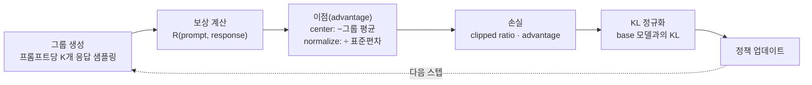

`CS336-LLM-From-Scratch` 시리즈의 17단계이자 **마지막 강의**입니다. 전체 지도는 [CS336 커리큘럼](/2026/06/26/cs336-llm-from-scratch-curriculum.html)에서 볼 수 있습니다. ([16강 — 정렬 (2): RLVR와 추론 모델](/2026/06/26/cs336-lecture-16-alignment-rlvr.html)에서 이어집니다.)

16강이 "**무엇**을 최적화하나"였다면 — 검증 가능한 보상(verifiable reward), 즉 정답을 자동으로 채점할 수 있는 신호였습니다 — 17강은 "**어떻게** 최적화하나"입니다. RL을 언어 모델에 실제로 돌리는 기계를 세 걸음으로 엽니다. **정책 경사(policy gradient)의 유도 → baseline과 advantage로 분산 줄이기 → GRPO를 한 줄씩 구현.** 강의(Percy Liang)는 이론을 세운 뒤 곧장 장난감 과제에 GRPO를 손으로 짜 넣어, "raw reward만으로는 왜 학습이 안 되는가"를 실험으로 보여 줍니다. 시리즈의 마지막 강입니다.

<figure class="post-figure post-figure--header">
<svg role="img" aria-label="언어 모델을 강화학습 문제로 보는 대응 관계 도식. 상태 s는 프롬프트와 지금까지 생성한 응답, 행동 a는 다음 토큰, 보상 R은 검증 가능한 결과 보상, 정책 π는 언어 모델에 대응한다. 아래에는 정책 경사 추정량 grad E[R] = E[grad log π(a|s) 곱하기 (R 빼기 baseline b)]가 놓여 있다." viewBox="0 0 760 344" xmlns="http://www.w3.org/2000/svg">
  <title>언어 모델 = RL 문제 — 상태·행동·보상·정책의 대응과 정책 경사 추정량</title>
  <defs>
    <marker id="mapArrow" viewBox="0 0 10 10" refX="8" refY="5" markerWidth="8" markerHeight="8" orient="auto-start-reverse">
      <path d="M0,0 L10,5 L0,10 z" fill="var(--gold)"/>
    </marker>
  </defs>

  <text x="380" y="28" text-anchor="middle" font-family="var(--font-body)" font-size="16" font-weight="700" fill="var(--text-color)">언어 모델을 RL 문제로 보기</text>
  <text x="152" y="52" text-anchor="middle" font-family="var(--font-body)" font-size="12" fill="var(--text-light)">RL 개념</text>
  <text x="544" y="52" text-anchor="middle" font-family="var(--font-body)" font-size="12" fill="var(--text-light)">언어 모델에서</text>

  <!-- row 1: state -->
  <rect x="52" y="62" width="200" height="36" rx="8" fill="currentColor" opacity="0.05"/>
  <rect x="52" y="62" width="200" height="36" rx="8" fill="none" stroke="var(--secondary-color)" stroke-width="2"/>
  <text x="152" y="85" text-anchor="middle" font-family="var(--font-body)" font-size="13.5" font-weight="700" fill="var(--text-color)">상태 s</text>
  <line x1="256" y1="80" x2="372" y2="80" stroke="var(--gold)" stroke-width="2" marker-end="url(#mapArrow)"/>
  <rect x="376" y="62" width="336" height="36" rx="8" fill="var(--bg-panel)" stroke="currentColor" stroke-width="1.6"/>
  <text x="544" y="85" text-anchor="middle" font-family="var(--font-body)" font-size="12.5" fill="var(--text-color)">prompt + 지금까지 생성한 응답</text>

  <!-- row 2: action -->
  <rect x="52" y="110" width="200" height="36" rx="8" fill="currentColor" opacity="0.05"/>
  <rect x="52" y="110" width="200" height="36" rx="8" fill="none" stroke="var(--secondary-color)" stroke-width="2"/>
  <text x="152" y="133" text-anchor="middle" font-family="var(--font-body)" font-size="13.5" font-weight="700" fill="var(--text-color)">행동 a</text>
  <line x1="256" y1="128" x2="372" y2="128" stroke="var(--gold)" stroke-width="2" marker-end="url(#mapArrow)"/>
  <rect x="376" y="110" width="336" height="36" rx="8" fill="var(--bg-panel)" stroke="currentColor" stroke-width="1.6"/>
  <text x="544" y="133" text-anchor="middle" font-family="var(--font-body)" font-size="12.5" fill="var(--text-color)">다음 토큰 (전이는 결정적: s' = s + a)</text>

  <!-- row 3: reward -->
  <rect x="52" y="158" width="200" height="36" rx="8" fill="currentColor" opacity="0.05"/>
  <rect x="52" y="158" width="200" height="36" rx="8" fill="none" stroke="var(--secondary-color)" stroke-width="2"/>
  <text x="152" y="181" text-anchor="middle" font-family="var(--font-body)" font-size="13.5" font-weight="700" fill="var(--text-color)">보상 R</text>
  <line x1="256" y1="176" x2="372" y2="176" stroke="var(--gold)" stroke-width="2" marker-end="url(#mapArrow)"/>
  <rect x="376" y="158" width="336" height="36" rx="8" fill="var(--bg-panel)" stroke="currentColor" stroke-width="1.6"/>
  <text x="544" y="181" text-anchor="middle" font-family="var(--font-body)" font-size="12.5" fill="var(--text-color)">검증 가능한 결과 보상 (outcome)</text>

  <!-- row 4: policy -->
  <rect x="52" y="206" width="200" height="36" rx="8" fill="currentColor" opacity="0.05"/>
  <rect x="52" y="206" width="200" height="36" rx="8" fill="none" stroke="var(--accent-color)" stroke-width="2.5"/>
  <text x="152" y="229" text-anchor="middle" font-family="var(--font-body)" font-size="13.5" font-weight="700" fill="var(--text-color)">정책 π(a|s)</text>
  <line x1="256" y1="224" x2="372" y2="224" stroke="var(--gold)" stroke-width="2" marker-end="url(#mapArrow)"/>
  <rect x="376" y="206" width="336" height="36" rx="8" fill="var(--bg-panel)" stroke="var(--accent-color)" stroke-width="1.8"/>
  <text x="544" y="229" text-anchor="middle" font-family="var(--font-body)" font-size="12.5" font-weight="700" fill="var(--text-color)">언어 모델 (LM) — 목적: max E[R]</text>

  <!-- estimator banner -->
  <rect x="52" y="262" width="660" height="62" rx="9" fill="currentColor" opacity="0.04"/>
  <rect x="52" y="262" width="660" height="62" rx="9" fill="none" stroke="var(--gold)" stroke-width="2"/>
  <text x="382" y="291" text-anchor="middle" font-family="var(--font-body)" font-size="15.5" font-weight="700" fill="var(--text-color)">∇ E[R] = E[ ∇ log π(a|s) · ( R − b ) ]</text>
  <text x="382" y="312" text-anchor="middle" font-family="var(--font-body)" font-size="11.5" fill="var(--text-light)">보상 큰 행동의 로그우도를 밀어 올린다 · baseline b로 분산을 죽인다</text>
</svg>
<figcaption>언어 모델은 그 자체로 RL 문제다 — 상태는 프롬프트+생성 토큰, 행동은 다음 토큰, 전이는 결정적, 보상은 검증 가능한 결과, 정책은 LM. 목적은 기대 보상 max E[R]이고, 이를 정책 경사 추정량으로 최적화한다.</figcaption>
</figure>

## 한눈에 보기

GRPO는 한 바퀴 도는 루프입니다 — **프롬프트마다 여러 응답을 뽑고(그룹), 각각을 채점하고, 그룹 안에서 이점(advantage)으로 바꾸고, clipped 비율 손실을 만들고, base 모델과 너무 멀어지지 않게 KL로 잡아당긴 뒤, 정책을 한 스텝 업데이트**합니다. 이 그림 한 장이 강의 구현의 뼈대입니다.



핵심 통찰 두 가지를 미리 심어 둡니다 — **(1) 그룹 평균 자체가 공짜 baseline**이라 별도의 가치 함수(critic)가 필요 없고, **(2) advantage로 바꾸지 않은 raw reward로는 학습이 아예 안 됩니다.** 두 번째는 뒤에서 실험으로 확인합니다.

## 언어 모델을 RL 문제로 보기

먼저 언어 생성을 RL의 언어로 번역합니다. **상태 s = prompt + 지금까지 생성한 응답**, **행동 a = 다음 토큰**, 전이는 **결정적**입니다 — 다음 상태는 `s' = s + a`로 완전히 정해집니다. **보상 R**은 16강의 검증 가능한 결과 보상, 즉 완성된 응답을 자동 채점한 값이고, **정책 π(a|s)** 는 곧 언어 모델입니다. 목적은 하나 — 기대 보상을 최대화하는 것, `max E[R]`.

이 매핑에서 언어 모델링만의 두 가지 특권이 나옵니다.

> 전이가 **결정적**이라 test-time에 앞을 내다보는 **계획(planning)** 이 가능하고(다음 상태가 확실하니 여러 경로를 탐색할 수 있다), 상태 표현도 자유롭습니다 — 로보틱스처럼 물리 센서에 묶여 있지 않고, 상태가 그냥 텍스트라 무엇이든 될 수 있습니다.

RL이 로보틱스에서보다 언어 모델에서 다루기 쉬운 이유가 여기 있습니다. 그럼에도 뒤에서 보겠지만, "쉽다"는 건 어디까지나 상대적입니다.

## 정책 경사(policy gradient) 기초

목적 `E[R]`를 정책의 파라미터로 미분하려면 문제가 하나 있습니다 — 보상 `R`은 보통 미분 불가능한 함수(채점기)이고, 기대값 안의 분포 자체가 정책에 의존합니다. 이를 우회하는 고전적 항등식이 **REINFORCE 추정량**입니다.

```text
∇ E[R] = E[ ∇ log π(a|s) · R(s, a) ]
```

직관은 단순합니다 — **보상이 큰 행동의 로그우도를 밀어 올리고, 작은 행동은 상대적으로 내린다.** 로그우도의 그래디언트에 그 행동이 받은 보상을 가중치로 곱하는 것입니다. 미분이 정책의 `log π`로 옮겨 갔으니 보상은 그냥 스칼라로 취급되고, 채점기가 미분 불가능해도 상관없습니다.

문제는 실전에서 이 추정량이 **끔찍하게 노이지**하다는 점입니다. 검증 가능한 보상은 대개 이진값 `{0, 1}`인데(정답이면 1, 아니면 0), 초기 정책은 대부분의 응답에서 0을 받습니다. 그래서 신호가 **희소(sparse)** 하고 그래디언트 추정의 **분산이 큽니다.** 이 분산을 죽이는 것이 다음 절의 전부입니다.

## Baseline과 advantage — 분산을 죽이기

핵심 트릭은 놀랍도록 단순합니다 — **보상에서 baseline `b(s)`를 빼도 추정량은 여전히 불편(unbiased)** 하며, 오직 분산만 줄어듭니다.

```text
∇ log π(a|s) · ( R(s, a) − b(s) )
```

`b(s)`가 행동 `a`에 의존하지 않기만 하면(상태 `s`에만 의존), 빼는 항의 기대 그래디언트 기여가 0이 되어 편향이 생기지 않습니다(`E[∇ log π(a|s)] = 0`이므로). 그러니 **아무 baseline이나 마음껏 빼도 정답은 안 바뀌고, 잘 고르면 분산만 준다**는 뜻입니다.

가장 좋은 baseline은 그 상태의 **기대 보상**입니다 — `b(s) = E[R | s] = V(s)`, 즉 가치 함수. 여기서 **이점(advantage)** 이 정의됩니다.

```text
A(s, a) = Q(s, a) − V(s)      # 이 행동이 '평균보다' 얼마나 나은가
```

`b = V`로 두면 baseline을 뺀 보상이 곧 advantage가 됩니다. 의미가 아름답습니다 — "이 행동의 절대 보상"이 아니라 "이 상태에서 평균 대비 얼마나 잘했나"로 신호를 재정의하는 것입니다. 잘한 행동은 양의 advantage, 못한 행동은 음의 advantage를 받아 서로를 밀고 당깁니다.

> **같은 기대값, 훨씬 낮은 분산.** 강의의 구체적 수치 예시에서, baseline을 빼기 전 그래디언트 추정의 표준편차가 약 **5.478**이었던 것이 baseline을 뺀 뒤 **1.000**으로 줄어듭니다 — 편향은 그대로 두고 노이즈만 걷어낸 것입니다.

<figure class="post-figure">
<svg role="img" aria-label="baseline을 빼기 전과 후의 그래디언트 추정 분포 비교. 왼쪽 raw reward는 넓게 퍼진 낮은 종 모양으로 표준편차가 약 5.478, 오른쪽 advantage는 좁고 높은 종 모양으로 표준편차가 1.000이다. 같은 평균을 유지한 채 분산만 크게 줄었다." viewBox="0 0 720 320" xmlns="http://www.w3.org/2000/svg">
  <title>분산 줄이기 — raw reward(고분산) 대 advantage(저분산)</title>

  <text x="360" y="30" text-anchor="middle" font-family="var(--font-body)" font-size="16" font-weight="700" fill="var(--text-color)">baseline을 빼면 — 같은 평균, 훨씬 낮은 분산</text>

  <!-- ===== LEFT: raw reward (high variance) ===== -->
  <rect x="20" y="52" width="330" height="234" rx="10" fill="currentColor" opacity="0.04"/>
  <rect x="20" y="52" width="330" height="234" rx="10" fill="none" stroke="var(--secondary-color)" stroke-width="2"/>
  <text x="185" y="80" text-anchor="middle" font-family="var(--font-body)" font-size="15" font-weight="700" fill="var(--secondary-color)">raw reward (고분산)</text>

  <!-- baseline axis -->
  <line x1="50" y1="238" x2="320" y2="238" stroke="currentColor" stroke-width="1.6" opacity="0.7"/>
  <!-- mean guide -->
  <line x1="185" y1="120" x2="185" y2="238" stroke="var(--text-light)" stroke-width="1.2" stroke-dasharray="3 5"/>
  <!-- wide low bell -->
  <path d="M 56 238 C 130 238 140 150 185 150 C 230 150 240 238 314 238 Z" fill="var(--secondary-color)" opacity="0.14"/>
  <path d="M 56 238 C 130 238 140 150 185 150 C 230 150 240 238 314 238" fill="none" stroke="var(--secondary-color)" stroke-width="2.5"/>
  <!-- std bracket -->
  <line x1="96" y1="256" x2="274" y2="256" stroke="var(--secondary-color)" stroke-width="1.8"/>
  <line x1="96" y1="250" x2="96" y2="262" stroke="var(--secondary-color)" stroke-width="1.8"/>
  <line x1="274" y1="250" x2="274" y2="262" stroke="var(--secondary-color)" stroke-width="1.8"/>
  <text x="185" y="278" text-anchor="middle" font-family="var(--font-body)" font-size="12.5" font-weight="700" fill="var(--secondary-color)">표준편차 ≈ 5.478</text>

  <!-- ===== RIGHT: advantage (low variance) ===== -->
  <rect x="370" y="52" width="330" height="234" rx="10" fill="currentColor" opacity="0.04"/>
  <rect x="370" y="52" width="330" height="234" rx="10" fill="none" stroke="var(--accent-color)" stroke-width="2.5"/>
  <text x="535" y="80" text-anchor="middle" font-family="var(--font-body)" font-size="15" font-weight="700" fill="var(--accent-color)">advantage (저분산)</text>

  <!-- baseline axis -->
  <line x1="400" y1="238" x2="670" y2="238" stroke="currentColor" stroke-width="1.6" opacity="0.7"/>
  <!-- mean guide -->
  <line x1="535" y1="110" x2="535" y2="238" stroke="var(--text-light)" stroke-width="1.2" stroke-dasharray="3 5"/>
  <!-- narrow tall bell -->
  <path d="M 495 238 C 522 238 522 110 535 110 C 548 110 548 238 575 238 Z" fill="var(--accent-color)" opacity="0.16"/>
  <path d="M 495 238 C 522 238 522 110 535 110 C 548 110 548 238 575 238" fill="none" stroke="var(--accent-color)" stroke-width="3"/>
  <!-- std bracket -->
  <line x1="516" y1="256" x2="554" y2="256" stroke="var(--accent-color)" stroke-width="1.8"/>
  <line x1="516" y1="250" x2="516" y2="262" stroke="var(--accent-color)" stroke-width="1.8"/>
  <line x1="554" y1="250" x2="554" y2="262" stroke="var(--accent-color)" stroke-width="1.8"/>
  <text x="535" y="278" text-anchor="middle" font-family="var(--font-body)" font-size="12.5" font-weight="700" fill="var(--accent-color)">표준편차 = 1.000</text>
</svg>
<figcaption>같은 그래디언트를 추정하되, baseline을 빼면 분포가 평균을 중심으로 훨씬 좁아진다 — 강의 예시에서 표준편차가 약 5.478에서 1.000으로 줄었다. 편향은 없고 노이즈만 걷힌다.</figcaption>
</figure>

## GRPO를 한 줄씩

이제 남은 질문 — **가치 함수 `V(s)`를 어디서 얻나?** PPO는 별도의 critic 신경망을 학습해 `V(s)`를 추정합니다. 이는 정책만큼 큰 모델을 하나 더 굴린다는 뜻이라 비쌉니다. **GRPO의 동기는 이 critic을 아예 없애는 것**입니다.

발상은 이렇습니다 — 프롬프트 하나에 대해 응답을 **한 개**만 뽑지 말고 **그룹**으로 여러 개(K개) 뽑으면, 그 **그룹의 평균 보상**이 곧 그 상태의 기대 보상 `V(s)`에 대한 자연스러운 추정치입니다. 학습해야 할 critic 없이, **그룹 평균이 공짜 baseline**이 됩니다.

강의는 이를 장난감 **정렬(sorting) 과제**로 구현합니다 — 프롬프트는 무작위 숫자 `n`개, 응답은 그 숫자들을 정렬한 것이고, 보상은 위치가 얼마나 맞는지(정답 위치 일치, 또는 인접한 쌍이 올바른 순서인지 등)로 채점합니다. 채점기가 코드 몇 줄이라 RL의 기계 부품에만 집중할 수 있습니다. 구현 요소는 다섯입니다.

- **응답 생성**: 모델의 로짓에 softmax를 씌워 `torch.multinomial`로 토큰을 샘플링합니다. 그룹이면 같은 프롬프트로 K번 반복합니다.
- **보상 계산**: `(prompt, response)` 배치를 채점기에 통과시켜 스칼라 보상을 얻습니다.
- **delta(이점) 모드**: 보상을 그대로 쓸지, 어떻게 정규화할지 — **raw**(그대로), **centered**(그룹 평균을 뺌), **normalized**(z-score: 평균 빼고 표준편차로 나눔), **max**(그룹에서 최대만 남김)의 네 모드를 비교합니다.
- **손실**: 가장 순진한 `−Σ logp·δ`에서 시작해, importance ratio `exp(logp − old_logp)·δ`(현재 정책이 이전 정책 대비 이 행동을 얼마나 더/덜 뽑는가)로, 마지막에 PPO식 **clipped** 손실(`torch.minimum`으로 비율을 `[1−ε, 1+ε]`에 가둠)로 발전시킵니다.
- **정규화**: base 모델과의 **KL 페널티** `KL(p‖q) = E_p[−log(q/p)]`를 더해, 정책이 base에서 너무 멀리 벗어나 **파국적 망각(catastrophic forgetting)** 에 빠지지 않게 잡아둡니다.

한 가지 조용한 **구현 함정**이 있습니다.

> 참조(이전) 정책의 로그우도를 계산할 때는 반드시 `torch.no_grad()`로 감싸야 합니다. 그러지 않으면 비율 `exp(logp − old_logp)`의 분모 쪽으로 그래디언트가 새어 나가, 이전 정책이 "고정된 기준"이라는 전제가 깨집니다. 이 한 줄이 비율 계산의 정확성을 좌우합니다.

이 부품들을 한 스텝으로 엮으면 다음과 같습니다.

```python
def grpo_step(policy, ref_policy, prompts, K, eps, beta):
    # 1) 그룹 생성 — 프롬프트마다 K개 응답을 뽑는다 (이전 정책은 고정)
    samples, old_logp = [], []
    with torch.no_grad():                        # ← 이전 정책으로 그래디언트가 새지 않게
        for p in prompts:
            for _ in range(K):
                logits = ref_policy(p)
                a = torch.multinomial(softmax(logits, dim=-1), 1)   # 로짓에서 샘플링
                samples.append((p, a))
                old_logp.append(logp(logits, a))                    # 이전 정책의 log π (상수)

    # 2) 보상 — (prompt, response) 배치를 채점기로
    rewards = reward_fn(samples)                  # sorting 과제: 위치 일치/인접 정렬

    # 3) 이점 — 그룹 안에서 center + normalize (그룹 평균이 곧 baseline = V(s))
    adv = rewards - group_mean(rewards)           # centered
    adv = adv / (group_std(rewards) + 1e-8)       # normalized (z-score)

    # 4) 손실 — clipped importance ratio (PPO 식)
    new_logp = policy.logp(samples)               # 현재 정책 (그래디언트 O)
    ratio = torch.exp(new_logp - old_logp)        # 비율: 현재 vs 이전 정책
    loss_pg = -torch.minimum(ratio * adv,
                             torch.clamp(ratio, 1 - eps, 1 + eps) * adv).mean()

    # 5) KL 정규화 — base 모델과 멀어지지 않게 (파국적 망각 방지)
    #    KL(p‖q) = E_p[-log(q/p)]  (p=현재 정책, q=base 모델)
    kl = (torch.exp(base_logp - new_logp) - (base_logp - new_logp) - 1).mean()

    (loss_pg + beta * kl).backward()              # policy만 업데이트
```

3번의 두 줄(center → normalize)이 앞 절의 advantage 정의를 그대로 코드로 옮긴 것입니다 — 그룹 평균을 빼는 순간 critic 없이 baseline이 생기고, 표준편차로 나누는 순간 스케일이 정규화됩니다.

## 실험이 주는 교훈

이제 delta 모드를 바꿔 가며 sorting 과제를 학습시키면, 이론이 예고한 그대로가 눈앞에서 벌어집니다.

- **raw 보상** → **학습이 아예 안 됩니다.** advantage로 중심화하지 않으면 그래디언트 분산이 너무 커서 신호가 노이즈에 파묻힙니다. 헤더의 5.478 대 1.000이 바로 이 실패의 정량적 이유입니다.
- **centered** → 학습이 됩니다. 그러나 종종 **국소 최적(local optimum)** 에 갇힙니다 — 어떤 부분 전략을 익히고는 거기서 더 나아가지 못합니다.
- **normalized** → centered 대비 **큰 차이는 없습니다.** (표준편차로 나누는 것이 길이에 따른 편향을 은근히 끌어들이기도 해서, 그 편향을 피하려 정규화 항을 손본 **Dr. GRPO** 변형이 제안되었습니다.)

여기서 강의가 남기는 교훈이 둘입니다. 하나는 겸손에 관한 것입니다.

> **RL은 결코 자명하지 않다.** 부품 하나만 잘못 골라도(raw reward, 혹은 새는 그래디언트) 학습이 통째로 무너지고, 잘 돌더라도 국소 최적 같은 나쁜 상태에 쉽게 갇힌다.

다른 하나는 이 유닛 전체를 관통하는 원리입니다 — **측정할 수 있으면 최적화할 수 있다(If you can measure it, you can optimize it).** 검증 가능한 보상(16강)이라는 "측정"이 있었기에, 정책 경사라는 "최적화"가 성립합니다. 다만 대가가 있습니다 — RL 시스템은 사전학습(pretraining)보다 **훨씬 복잡**합니다. 생성(추론 워크로드)과 학습을 한 루프 안에서 굴려야 하고, 이전 정책·base 모델·현재 정책이라는 여러 모델을 동시에 관리해야 합니다. 단순히 "다음 토큰 예측"만 하던 사전학습과는 엔지니어링 난이도의 결이 다릅니다.

## 시리즈를 마치며

17강의 여정을 하나의 실로 꿰면 그 실의 이름은 **효율(efficiency)** 입니다. 무한한 연산이 있다면 이 강의의 절반은 필요 없었을 것입니다 — CS336의 거의 모든 결정은 "제한된 자원으로 최선을 뽑는" 문제였습니다.

- **유닛 1 — 토크나이저** (1강): 바이트를 토큰으로 묶어, 같은 텍스트를 더 적은 스텝으로 표현하는 것부터가 효율의 문제였습니다.
- **유닛 2 — 아키텍처와 시스템** (2~8강): Transformer의 설계, MoE, GPU와 커널, 그리고 데이터·텐서·파이프라인 병렬 — 하드웨어에서 FLOP 하나까지 짜내는 기술.
- **유닛 3 — 스케일링과 추론** (9~11강): 스케일링 법칙으로 작은 실험에서 큰 결정을 예측하고(작은 대리 모델·muP·WSD), 추론 비용까지 계산에 넣는 법.
- **유닛 4 — 데이터와 평가** (12~14강): "무엇을 먹이고 어떻게 측정하나" — 하나의 참된 평가는 없고, 데이터의 질이 모델의 성격을 만든다.
- **유닛 5 — 정렬** (15~17강): SFT로 형식을, RLVR로 검증 가능한 능력을, 그리고 오늘 정책 경사와 GRPO로 그 최적화 기계를 손에 쥐었습니다.

한 문장으로 정리하면 이렇습니다 — **언어 모델은 마법이 아니라 엔지니어링**입니다. 측정 가능하고 설계 가능한 결정들의 긴 연쇄이고, 그 연쇄를 처음부터 끝까지 직접 따라가 본 것이 이 시리즈였습니다. 토크나이저의 첫 바이트부터 GRPO의 마지막 그래디언트 스텝까지, 이제 "from scratch"라는 제목이 빈말이 아니게 되었습니다. **CS336 완주를 축하합니다.** 🎉

## 실전 노트

- **critic을 없앤 게 GRPO의 전부다**: 프롬프트당 그룹으로 여러 응답을 뽑아 그 평균을 baseline으로 쓴다 — 별도 가치 함수를 학습할 필요가 없다.
- **raw reward는 금물**: 반드시 그룹 안에서 중심화(center)하라. 안 하면 분산이 커서 학습이 안 된다(5.478 → 1.000이 그 증거).
- **참조 정책은 `torch.no_grad()`로**: 비율의 분모로 그래디언트가 새면 정책 경사가 조용히 틀어진다. 가장 흔한 GRPO 버그다.
- **clipping은 안전벨트**: importance ratio를 `[1−ε, 1+ε]`에 가두면 한 스텝이 정책을 너무 멀리 밀어내는 걸 막는다.
- **KL 없이는 망각한다**: base 모델과의 KL 페널티가 없으면 정책이 보상만 좇다가 언어 능력 자체를 잃는다(파국적 망각).
- **정규화는 만능이 아니다**: normalized가 centered보다 크게 낫지는 않고, 길이 편향을 부를 수 있다(Dr. GRPO). 부품 선택 하나하나가 결과를 바꾼다.

## 요약

- **언어 모델 = RL 문제**: 상태 = prompt+생성 토큰, 행동 = 다음 토큰, 전이 결정적, 보상 = 검증 가능한 결과, 정책 = LM. 목적은 `max E[R]`.
- **정책 경사**: `∇E[R] = E[∇log π · R]`로 보상 큰 행동의 로그우도를 밀어 올린다 — 그러나 이진 보상이면 희소·고분산.
- **baseline과 advantage**: `b(s)`를 빼도 불편, 분산만 준다. `b = V(s)`면 baseline을 뺀 값이 곧 advantage(평균 대비 얼마나 나은가). 표준편차 5.478 → 1.000.
- **GRPO**: critic을 그룹 평균으로 대체 → 그룹 생성 → 보상 → center/normalize advantage → clipped 비율 손실 → KL 정규화 → 업데이트. 참조 정책은 `no_grad`.
- **교훈**: raw reward는 학습 실패, centered는 국소 최적, normalized는 큰 차이 없음. **측정할 수 있으면 최적화할 수 있다** — 그러나 RL은 사전학습보다 훨씬 복잡하다.

여기까지가 CS336 전 17강의 마지막 조각입니다. 토크나이저에서 시작해 정렬(alignment)의 최적화 기계까지, 언어 모델을 바닥부터 한 바퀴 완주했습니다. **축하합니다 — 시리즈 완주입니다.** 🎉

### 다음 학습 (Next Learning)

- [CS336 커리큘럼 — 전체 17단계 완주 🎉](/2026/06/26/cs336-llm-from-scratch-curriculum.html) — 시리즈 지도와 진행 현황
- [CS336 16강 — 정렬 (2): RLVR와 추론 모델](/2026/06/26/cs336-lecture-16-alignment-rlvr.html) — 직전 단계, "무엇을 최적화하나"
- (여운) 더 깊이 — Qwen(Junyang Lin)·Llama(Mike Lewis) 팀의 초청 강의 같은 실전 사례로, 여기서 배운 정책 경사·GRPO가 프런티어 규모에서 어떻게 돌아가는지 확장해 볼 수 있습니다.
