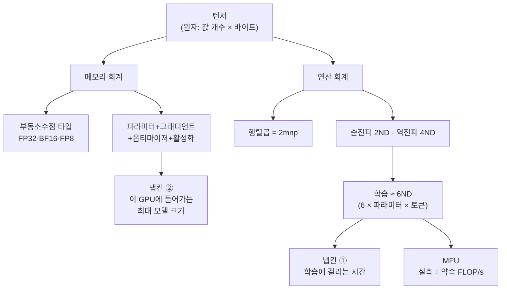
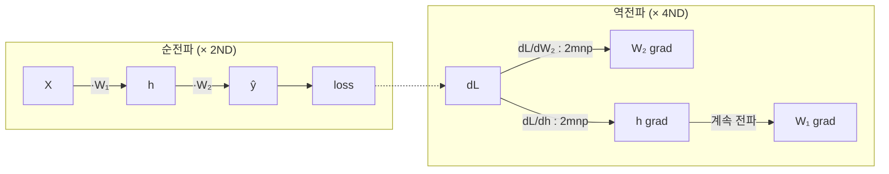

`CS336-LLM-From-Scratch` 시리즈의 2단계입니다. 전체 지도는 [CS336 커리큘럼](/2026/06/26/cs336-llm-from-scratch-curriculum.html)에서 볼 수 있습니다. ([1강 — 토크나이제이션](/2026/06/26/cs336-lecture-1-overview-and-tokenization.html)에서 이어집니다.)

<figure class="post-figure post-figure--header">
<svg role="img" aria-label="자원 회계는 모델을 두 통화로 저울에 단다. 왼쪽 접시는 메모리(바이트), 오른쪽 접시는 연산(FLOPs). 저울의 받침에 16바이트/파라미터와 6ND라는 두 숫자가 새겨져 있고, 그 아래 두 통화는 결국 달러 한 가지로 환산된다는 주제가 전체를 관통한다." viewBox="0 0 760 300" xmlns="http://www.w3.org/2000/svg">
  <title>자원 회계 — 모델을 메모리(바이트)와 연산(FLOPs) 두 통화로 저울질하고, 둘 다 달러로 환산한다</title>

  <!-- 냅킨 / 원장 배경 -->
  <rect x="20" y="20" width="720" height="218" rx="6" fill="none" stroke="currentColor" stroke-width="2" opacity="0.5"/>
  <line x1="20" y1="52" x2="740" y2="52" stroke="currentColor" stroke-width="1" opacity="0.3"/>
  <text x="40" y="42" font-size="13" font-weight="700" fill="currentColor">자원 회계 — 냅킨 한 장</text>
  <text x="720" y="42" text-anchor="end" font-size="11" fill="currentColor" opacity="0.6">FLOPs · 바이트 = $</text>

  <!-- 저울 기둥 -->
  <g stroke="currentColor" stroke-width="3" fill="none" stroke-linecap="round">
    <line x1="380" y1="92" x2="380" y2="196"/>
    <path d="M352 196 H408"/>
  </g>
  <circle cx="380" cy="92" r="6" fill="currentColor"/>

  <!-- 저울 빔 (왼쪽이 무거워 살짝 기운다) -->
  <g stroke="currentColor" stroke-width="3" fill="none" stroke-linecap="round">
    <line x1="200" y1="106" x2="560" y2="86"/>
    <line x1="200" y1="106" x2="200" y2="130"/>
    <line x1="560" y1="86" x2="560" y2="110"/>
  </g>

  <!-- 왼쪽 접시: 메모리(바이트) -->
  <g>
    <path d="M150 130 H250 L232 168 H168 Z" fill="var(--bg-panel)" stroke="currentColor" stroke-width="2"/>
    <text x="200" y="120" text-anchor="middle" font-size="13" font-weight="700" fill="var(--primary-color)">메모리</text>
    <g font-family="monospace" font-size="12" text-anchor="middle" fill="currentColor">
      <rect x="170" y="142" width="20" height="16" rx="2" fill="none" stroke="currentColor" stroke-width="1.5"/>
      <rect x="194" y="142" width="20" height="16" rx="2" fill="none" stroke="currentColor" stroke-width="1.5"/>
      <rect x="218" y="142" width="14" height="16" rx="2" fill="none" stroke="currentColor" stroke-width="1.5"/>
      <text x="180" y="155">B</text>
      <text x="204" y="155">B</text>
    </g>
    <text x="200" y="184" text-anchor="middle" font-size="11" fill="currentColor" opacity="0.7">바이트</text>
  </g>

  <!-- 오른쪽 접시: 연산(FLOPs) -->
  <g>
    <path d="M510 110 H610 L592 148 H528 Z" fill="var(--bg-panel)" stroke="currentColor" stroke-width="2"/>
    <text x="560" y="100" text-anchor="middle" font-size="13" font-weight="700" fill="var(--secondary-color)">연산</text>
    <g stroke="var(--secondary-color)" stroke-width="1.6" fill="none">
      <circle cx="540" cy="129" r="3.5"/>
      <circle cx="560" cy="123" r="3.5"/>
      <circle cx="580" cy="129" r="3.5"/>
      <path d="M543 129 L557 124 M563 124 L577 128"/>
    </g>
    <text x="560" y="164" text-anchor="middle" font-size="11" fill="currentColor" opacity="0.7">FLOPs</text>
  </g>

  <!-- 받침에 새겨진 두 북극성 숫자 -->
  <g text-anchor="middle">
    <rect x="262" y="200" width="110" height="30" rx="4" fill="var(--bg-panel)" stroke="var(--gold)" stroke-width="2"/>
    <text x="317" y="220" font-size="14" font-weight="700" fill="var(--primary-color)" font-family="monospace">16 B/param</text>
    <rect x="388" y="200" width="110" height="30" rx="4" fill="var(--bg-panel)" stroke="var(--gold)" stroke-width="2"/>
    <text x="443" y="220" font-size="14" font-weight="700" fill="var(--primary-color)" font-family="monospace">6ND</text>
  </g>

  <!-- 효율 = 달러 through-theme bar -->
  <g>
    <line x1="20" y1="268" x2="740" y2="268" stroke="var(--gold)" stroke-width="2" stroke-dasharray="2 5"/>
    <rect x="296" y="252" width="168" height="32" rx="4" fill="var(--bg-panel)" stroke="var(--gold)" stroke-width="2"/>
    <text x="380" y="273" text-anchor="middle" font-size="14" font-weight="700" fill="var(--primary-color)">효율 = 달러</text>
    <text x="60" y="290" font-size="11" fill="currentColor" opacity="0.7">바이트를 줄이면 ↓</text>
    <text x="700" y="290" text-anchor="end" font-size="11" fill="currentColor" opacity="0.7">FLOPs를 짜내면 ↑</text>
  </g>
</svg>
<figcaption>이 글의 척추: 자원 회계는 모델을 두 통화 &mdash; 메모리(바이트)와 연산(FLOPs) &mdash; 로 저울에 단다. 받침에 새겨진 두 숫자가 이 강의의 북극성, 학습 메모리 &lsquo;16바이트/파라미터&rsquo;와 학습 연산 &lsquo;6ND&rsquo;다. 그리고 두 통화는 결국 하나의 단위, 달러로 환산된다.</figcaption>
</figure>

1강이 "효율"이라는 코스의 주제를 선언했다면, 2강은 그 효율을 **측정하는 법**을 가르칩니다. 보통 우리는 모델을 짜고, 돌리고, 되는 대로 둡니다. 하지만 학습이 수억 달러로 번지는 순간 그 태도는 통하지 않습니다 — **FLOPs와 메모리는 곧 달러**이기 때문입니다. 이 강의(Percy Liang)는 텐서에서 시작해 학습 루프까지 PyTorch 프리미티브를 훑되, 매 단계에서 "이건 메모리를 얼마, 연산을 얼마 쓰는가"를 끈질기게 따집니다. 트랜스포머는 다루지 않습니다 — 선형 모델만으로도 핵심 회계는 전부 나옵니다.

## 한눈에 보기

자원 회계는 두 축으로 갈라집니다 — **메모리(무엇을 얼마나 저장하나)**와 **연산(FLOPs를 얼마나 쓰나)**. 이 둘을 알면 "이 학습이 며칠 걸리고, 이 GPU에 얼마나 큰 모델이 들어가나"라는 실전 질문에 냅킨 한 장으로 답할 수 있습니다.



이 강의가 가르치는 두 개의 숫자는 결국 이것입니다 — **학습 연산량 ≈ 6ND**, 그리고 **AdamW 학습 메모리 ≈ 16바이트/파라미터**.

## 냅킨 계산: 두 개의 질문

강의는 두 질문으로 문을 엽니다. 지금은 답만 보고, 아래에서 직접 유도합니다.

1. **70B 밀집(dense) 트랜스포머를 15T 토큰으로, H100 1,024장에서 학습하면 며칠 걸리나?**
   → 총 FLOPs = `6 × 70e9 × 15e12`. 이를 (H100 FLOP/s × MFU 0.5 × 1024장 × 하루 초)로 나누면 **약 144일**.
2. **H100 8장에서 AdamW로 (특별한 기교 없이) 학습 가능한 최대 모델은?**
   → 메모리 `8 × 80GB = 640GB`를 **파라미터당 16바이트**로 나누면 **약 40B 파라미터**(활성화 무시한 거친 추정).

두 답 모두 곱셈·나눗셈 몇 번이 전부입니다. 핵심은 그 안에 들어가는 **6**과 **16**이 어디서 오는가입니다.

## 메모리 회계

### 텐서와 바이트

딥러닝의 모든 것 — 파라미터·그래디언트·옵티마이저 상태·활성화·데이터 — 은 **텐서**에 담깁니다. 텐서의 메모리는 단순합니다.

> **메모리 = (원소 개수) × (원소당 바이트 수)**

```python
import torch
x = torch.zeros(4, 8)        # 기본 dtype: float32
x.numel()                    # 32 (원소 개수)
x.element_size()             # 4 (바이트) — float32 = 32비트 = 4바이트
x.numel() * x.element_size() # 128 바이트
```

행렬 하나가 작아 보여도, GPT-3의 한 FFN 행렬은 **2.3 GB**에 이릅니다. 그래서 원소당 바이트를 줄이는 것 — **부동소수점 타입 선택** — 이 첫 번째 효율 레버입니다.

### 부동소수점 타입

| 타입 | 비트 | 부호/지수/가수 | 바이트 | 특징 |
| --- | --- | --- | --- | --- |
| **FP32** | 32 | 1 / 8 / 23 | 4 | 기본값, "full precision". 안전하지만 무겁다 |
| **FP16** | 16 | 1 / 5 / 10 | 2 | half precision. **dynamic range가 좁아** 작은 값이 underflow(0으로) |
| **BF16** | 16 | 1 / 8 / 7 | 2 | brain float(2018). FP32의 **dynamic range** + 낮은 해상도 — DL 연산의 사실상 표준 |
| **FP8** | 8 | 1/4/3 또는 1/5/2 | 1 | 2022, H100~. 매우 거칠다. 안정성 주의 |

```python
torch.tensor([1e-8], dtype=torch.float16)   # → tensor([0.])  ← underflow!
torch.tensor([1e-8], dtype=torch.bfloat16)  # → 0이 아님       ← dynamic range 보존
```

<figure class="post-figure">
<svg role="img" aria-label="FP32·FP16·BF16·FP8 네 부동소수점 타입의 비트 배치 비교. 각 막대는 부호 1비트, 지수 비트, 가수 비트로 나뉜다. FP32는 지수 8비트·가수 23비트, FP16은 지수 5비트·가수 10비트, BF16은 지수 8비트(FP32와 동일)·가수 7비트, FP8은 지수 4비트·가수 3비트. 지수 비트는 dynamic range를, 가수 비트는 해상도를 결정한다. BF16은 FP32의 지수 8비트를 그대로 유지해 dynamic range를 보존하고 가수만 깎는다." viewBox="0 0 720 360" xmlns="http://www.w3.org/2000/svg">
  <title>FP32 / FP16 / BF16 / FP8 비트 배치 — 부호 1 · 지수(dynamic range) · 가수(해상도)</title>

  <!-- 범례 -->
  <g font-size="12" fill="currentColor">
    <rect x="40" y="18" width="14" height="14" fill="var(--accent-color)" opacity="0.85"/>
    <text x="60" y="30">부호 1비트</text>
    <rect x="150" y="18" width="14" height="14" fill="var(--secondary-color)" opacity="0.85"/>
    <text x="170" y="30">지수 — dynamic range</text>
    <rect x="360" y="18" width="14" height="14" fill="var(--gold)" opacity="0.85"/>
    <text x="380" y="30">가수 — 해상도</text>
  </g>

  <!-- 각 비트 = 18px. 시작 x=120, 부호 1칸. -->
  <!-- FP32: 1 / 8 / 23 = 32비트, 4바이트 -->
  <g>
    <text x="110" y="74" text-anchor="end" font-size="13" font-weight="700" fill="currentColor">FP32</text>
    <text x="110" y="90" text-anchor="end" font-size="10" fill="currentColor" opacity="0.65">4바이트</text>
    <rect x="120" y="58" width="18" height="30" fill="var(--accent-color)" opacity="0.85" stroke="currentColor" stroke-width="1"/>
    <rect x="138" y="58" width="144" height="30" fill="var(--secondary-color)" opacity="0.85" stroke="currentColor" stroke-width="1"/>
    <rect x="282" y="58" width="414" height="30" fill="var(--gold)" opacity="0.85" stroke="currentColor" stroke-width="1"/>
    <text x="210" y="78" text-anchor="middle" font-size="11" font-weight="700" fill="var(--bg-panel)">지수 8</text>
    <text x="489" y="78" text-anchor="middle" font-size="11" font-weight="700" fill="var(--bg-panel)">가수 23</text>
  </g>

  <!-- FP16: 1 / 5 / 10 = 16비트, 2바이트 -->
  <g>
    <text x="110" y="138" text-anchor="end" font-size="13" font-weight="700" fill="currentColor">FP16</text>
    <text x="110" y="154" text-anchor="end" font-size="10" fill="currentColor" opacity="0.65">2바이트</text>
    <rect x="120" y="122" width="18" height="30" fill="var(--accent-color)" opacity="0.85" stroke="currentColor" stroke-width="1"/>
    <rect x="138" y="122" width="90" height="30" fill="var(--secondary-color)" opacity="0.85" stroke="currentColor" stroke-width="1"/>
    <rect x="228" y="122" width="180" height="30" fill="var(--gold)" opacity="0.85" stroke="currentColor" stroke-width="1"/>
    <text x="183" y="142" text-anchor="middle" font-size="11" font-weight="700" fill="var(--bg-panel)">지수 5</text>
    <text x="318" y="142" text-anchor="middle" font-size="11" font-weight="700" fill="var(--bg-panel)">가수 10</text>
    <text x="424" y="142" font-size="10" fill="currentColor" opacity="0.7">지수 좁음 → underflow</text>
  </g>

  <!-- BF16: 1 / 8 / 7 = 16비트, 2바이트 -->
  <g>
    <text x="110" y="202" text-anchor="end" font-size="13" font-weight="700" fill="currentColor">BF16</text>
    <text x="110" y="218" text-anchor="end" font-size="10" fill="currentColor" opacity="0.65">2바이트</text>
    <rect x="120" y="186" width="18" height="30" fill="var(--accent-color)" opacity="0.85" stroke="currentColor" stroke-width="1"/>
    <rect x="138" y="186" width="144" height="30" fill="var(--secondary-color)" opacity="0.85" stroke="currentColor" stroke-width="1"/>
    <rect x="282" y="186" width="126" height="30" fill="var(--gold)" opacity="0.85" stroke="currentColor" stroke-width="1"/>
    <text x="210" y="206" text-anchor="middle" font-size="11" font-weight="700" fill="var(--bg-panel)">지수 8</text>
    <text x="345" y="206" text-anchor="middle" font-size="11" font-weight="700" fill="var(--bg-panel)">가수 7</text>
    <!-- FP32 지수폭과 같음을 잇는 점선 -->
    <line x1="138" y1="100" x2="138" y2="186" stroke="var(--secondary-color)" stroke-width="1.5" stroke-dasharray="3 3" opacity="0.8"/>
    <line x1="282" y1="100" x2="282" y2="186" stroke="var(--secondary-color)" stroke-width="1.5" stroke-dasharray="3 3" opacity="0.8"/>
    <text x="424" y="206" font-size="10" fill="currentColor" opacity="0.7">지수는 FP32와 동일 → range 보존</text>
  </g>

  <!-- FP8: 1 / 4 / 3 = 8비트, 1바이트 -->
  <g>
    <text x="110" y="266" text-anchor="end" font-size="13" font-weight="700" fill="currentColor">FP8</text>
    <text x="110" y="282" text-anchor="end" font-size="10" fill="currentColor" opacity="0.65">1바이트</text>
    <rect x="120" y="250" width="18" height="30" fill="var(--accent-color)" opacity="0.85" stroke="currentColor" stroke-width="1"/>
    <rect x="138" y="250" width="72" height="30" fill="var(--secondary-color)" opacity="0.85" stroke="currentColor" stroke-width="1"/>
    <rect x="210" y="250" width="54" height="30" fill="var(--gold)" opacity="0.85" stroke="currentColor" stroke-width="1"/>
    <text x="174" y="270" text-anchor="middle" font-size="11" font-weight="700" fill="var(--bg-panel)">지수 4</text>
    <text x="237" y="270" text-anchor="middle" font-size="10" font-weight="700" fill="var(--bg-panel)">가수 3</text>
    <text x="280" y="270" font-size="10" fill="currentColor" opacity="0.7">E4M3 예 (매우 거칠다)</text>
  </g>

  <!-- 두 축 화살표: 지수↔range, 가수↔해상도 -->
  <g font-size="11" fill="currentColor">
    <text x="120" y="318" font-weight="700">지수 비트 ↑</text>
    <text x="220" y="318" opacity="0.75">= 표현 가능한 범위(dynamic range) ↑ — 작은 값이 0으로 underflow하지 않는다</text>
    <text x="120" y="340" font-weight="700">가수 비트 ↑</text>
    <text x="220" y="340" opacity="0.75">= 두 수 사이의 해상도(정밀도) ↑ — 같은 범위 안을 더 촘촘히 쪼갠다</text>
  </g>
</svg>
<figcaption>같은 척도 위의 네 타입: 막대 길이가 곧 비트 수다. 핵심은 <strong>BF16이 FP32의 지수 8비트를 그대로 물려받는다</strong>는 점(점선) &mdash; FP16보다 가수(해상도)는 떨어지지만 dynamic range는 FP32만큼 넓어, 작은 값이 0으로 underflow하지 않는다. 딥러닝이 해상도보다 range를 택하는 이유가 한눈에 보인다.</figcaption>
</figure>

BF16의 통찰은 "딥러닝은 **해상도보다 dynamic range**가 중요하다"입니다. 지수 비트를 FP32만큼 유지하고 가수를 깎아, 같은 2바이트로 안정성을 챙깁니다. 다만 **파라미터와 옵티마이저 상태는 FP32**로 둬야 학습이 무너지지 않습니다 — BF16은 순전파처럼 잠깐 쓰고 버리는 **전이용(transitory)** 표현으로 봅니다(→ **혼합 정밀도, mixed precision**).

### 파라미터당 16바이트 (AdamW)

학습 중 한 파라미터가 끌고 다니는 메모리를 세어 보면, 냅킨 ②의 **16**이 나옵니다(전부 FP32 기준).

| 항목 | 바이트/파라미터 |
| --- | --- |
| 파라미터(weights) | 4 |
| 그래디언트(gradients) | 4 |
| 옵티마이저 상태 m (1차 모멘트) | 4 |
| 옵티마이저 상태 v (2차 모멘트) | 4 |
| **합계** | **16** |

여기에 **활성화(activations)**가 더해지는데, 이건 배치 크기·시퀀스 길이에 따라 달라져 위 16에는 빠져 있습니다(그래서 냅킨 ②가 "거친 추정"인 이유).

<figure class="post-figure">
<svg role="img" aria-label="파라미터 하나가 학습 중 끌고 다니는 메모리를 쌓은 막대그래프. 아래에서부터 파라미터 4바이트, 그래디언트 4바이트, 옵티마이저 1차 모멘트 m 4바이트, 옵티마이저 2차 모멘트 v 4바이트가 쌓여 합계 16바이트가 된다. 모두 FP32 기준이다. 그 위로 활성화는 배치와 시퀀스 길이에 따라 달라지는 별도의 가변 블록으로, 16에는 포함되지 않는다." viewBox="0 0 720 340" xmlns="http://www.w3.org/2000/svg">
  <title>파라미터당 16바이트 = 파라미터 4 + 그래디언트 4 + m 4 + v 4 (FP32). 활성화는 별도 가변.</title>

  <!-- 눈금 (0 / 4 / 8 / 12 / 16) -->
  <g font-size="11" fill="currentColor" opacity="0.6">
    <line x1="200" y1="60" x2="200" y2="284" stroke="currentColor" stroke-width="1.5" opacity="0.5"/>
    <g text-anchor="end">
      <text x="190" y="288">0</text>
      <text x="190" y="232">4</text>
      <text x="190" y="176">8</text>
      <text x="190" y="120">12</text>
      <text x="190" y="64">16</text>
    </g>
    <g stroke="currentColor" stroke-width="1" stroke-dasharray="2 4" opacity="0.4">
      <line x1="200" y1="228" x2="600" y2="228"/>
      <line x1="200" y1="172" x2="600" y2="172"/>
      <line x1="200" y1="116" x2="600" y2="116"/>
      <line x1="200" y1="60" x2="600" y2="60"/>
    </g>
  </g>

  <!-- 16바이트 스택 (각 항목 4바이트 = 56px 높이) -->
  <!-- bottom: 파라미터 -->
  <g>
    <rect x="230" y="228" width="150" height="56" fill="var(--accent-color)" opacity="0.85" stroke="currentColor" stroke-width="1.5"/>
    <text x="305" y="261" text-anchor="middle" font-size="13" font-weight="700" fill="var(--bg-panel)">파라미터 4</text>
    <rect x="230" y="172" width="150" height="56" fill="var(--secondary-color)" opacity="0.85" stroke="currentColor" stroke-width="1.5"/>
    <text x="305" y="205" text-anchor="middle" font-size="13" font-weight="700" fill="var(--bg-panel)">그래디언트 4</text>
    <rect x="230" y="116" width="150" height="56" fill="var(--gold)" opacity="0.85" stroke="currentColor" stroke-width="1.5"/>
    <text x="305" y="149" text-anchor="middle" font-size="13" font-weight="700" fill="var(--bg-panel)">옵티마이저 m 4</text>
    <rect x="230" y="60" width="150" height="56" fill="var(--gold)" opacity="0.6" stroke="currentColor" stroke-width="1.5"/>
    <text x="305" y="93" text-anchor="middle" font-size="13" font-weight="700" fill="var(--bg-panel)">옵티마이저 v 4</text>
  </g>

  <!-- 합계 16 중괄호 (스택 우측, 60→284 높이를 감싼다) -->
  <g>
    <path d="M392 60 q8 0 8 8 V 162 q0 8 8 8 q-8 0 -8 8 V 276 q0 8 -8 8" fill="none" stroke="var(--primary-color)" stroke-width="2"/>
    <text x="416" y="172" font-size="20" font-weight="700" fill="var(--primary-color)">= 16</text>
    <text x="416" y="194" font-size="12" fill="currentColor" opacity="0.75">바이트 / 파라미터</text>
    <text x="416" y="212" font-size="11" fill="currentColor" opacity="0.6">(모두 FP32)</text>
  </g>

  <!-- 활성화: 별도 가변 블록 (점선·해치) -->
  <g>
    <rect x="525" y="120" width="120" height="164" fill="none" stroke="currentColor" stroke-width="2" stroke-dasharray="5 4"/>
    <text x="585" y="108" text-anchor="middle" font-size="13" font-weight="700" fill="currentColor">활성화</text>
    <g stroke="currentColor" stroke-width="1" opacity="0.4">
      <line x1="525" y1="150" x2="645" y2="150"/>
      <line x1="525" y1="180" x2="645" y2="180"/>
      <line x1="525" y1="210" x2="645" y2="210"/>
      <line x1="525" y1="240" x2="645" y2="240"/>
    </g>
    <text x="585" y="200" text-anchor="middle" font-size="12" fill="currentColor" opacity="0.75">가변</text>
    <!-- 위아래로 늘었다 줄었다 하는 양방향 화살표 -->
    <g stroke="currentColor" stroke-width="1.5" fill="currentColor" opacity="0.7">
      <line x1="660" y1="130" x2="660" y2="274"/>
      <path d="M656 134 L660 124 L664 134 Z"/>
      <path d="M656 270 L660 280 L664 270 Z"/>
    </g>
    <text x="585" y="302" text-anchor="middle" font-size="10" fill="currentColor" opacity="0.7">배치 · 시퀀스 길이 의존</text>
    <text x="585" y="318" text-anchor="middle" font-size="10" fill="currentColor" opacity="0.7">→ 16에 포함되지 않음</text>
  </g>
</svg>
<figcaption>학습 메모리의 두 번째 북극성: 파라미터 하나가 끌고 다니는 4가지 &mdash; 파라미터·그래디언트·옵티마이저 m·옵티마이저 v &mdash; 가 각 4바이트씩 쌓여 <strong>16바이트/파라미터</strong>가 된다(모두 FP32). 활성화는 배치·시퀀스 길이에 따라 늘었다 줄었다 하는 별도 가변 블록이라 이 16에는 빠져 있다(그래서 냅킨 ②가 &lsquo;거친 추정&rsquo;인 이유).</figcaption>
</figure>

## 텐서의 내부: 스토리지와 뷰

회계를 정확히 하려면 "언제 복사가 일어나는가"를 알아야 합니다. PyTorch 텐서는 수학적 객체가 아니라 **할당된 메모리(storage)를 가리키는 포인터 + 메타데이터(stride)**입니다.

```python
x = torch.arange(6).reshape(2, 3)   # [[0,1,2],[3,4,5]]
x.stride()        # (3, 1) — 다음 행으로 가려면 3칸, 다음 열로 가려면 1칸
# 원소 [1,2](값 5)의 storage 오프셋 = 1*3 + 2*1 = 5

y = x[0]          # 첫 행 — 복사 아님! 같은 storage를 보는 뷰(view)
x[0, 0] = 99      # x를 바꾸면 y도 바뀐다 (포인터 공유)

x.t().is_contiguous()   # False — 전치는 storage를 건드리지 않고 stride만 바꾼다
x.t().contiguous()      # 여기서 비로소 복사가 일어난다
```

슬라이싱·`view`·`transpose`는 **뷰**라서 메모리를 새로 쓰지 않습니다 — 공짜이니 마음껏 변수로 쪼개 가독성을 높이세요. 다만 `contiguous`·`reshape`는 **복사를 일으킬 수 있으니** 회계할 때 주의합니다.

> 실전 팁: 차원을 `-1`·`-2` 인덱스로 다루면 버그가 잦습니다. 강의는 **einops**(`einsum`/`rearrange`/`reduce`)로 차원에 **이름**을 붙이길 권합니다 — "행렬곱에 좋은 부기(bookkeeping)를 더한 것"입니다.

## 연산 회계: 행렬곱은 2mnp

### FLOPs vs FLOP/s

먼저 용어를 분리합니다. **FLOPs**(소문자 s)는 *수행한 부동소수점 연산의 개수*(연산량)이고, **FLOP/s**는 *초당 연산 수*(하드웨어 속도)입니다. 이 글은 속도를 항상 `/s`로 적습니다.

딥러닝 연산량은 거의 전부 **행렬곱**이 지배합니다. `(m×n)·(n×p)` 행렬곱의 FLOPs는:

> **행렬곱 FLOPs = 2 × m × n × p** (곱셈 1 + 덧셈 1, 그래서 ×2)

```python
# 선형 모델: 데이터 X(B×D) · 가중치 W(D×K) → (B×K)
def matmul_flops(B, D, K):
    return 2 * B * D * K        # 2 × (세 차원의 곱)
```

이 식을 머신러닝 언어로 옮기면 강의의 첫 통찰이 나옵니다. `B`는 데이터 포인트(토큰) 수, `D×K`는 파라미터 수이므로:

> **순전파 FLOPs ≈ 2 × (토큰 수 N) × (파라미터 수 D) = 2ND**

(시퀀스 길이가 너무 길지 않다면 트랜스포머에도 대략 성립합니다.) 다른 연산들은 텐서 크기에 선형이라, 충분히 큰 모델에선 행렬곱 외에는 무시할 만합니다 — 냅킨 계산이 단순해지는 이유입니다.

### MFU: 하드웨어를 얼마나 짜냈나

연산량(FLOPs)을 시간으로 나누면 실측 속도(FLOP/s)가 나오고, 이를 **카탈로그상 약속 속도**와 비교한 것이 **MFU(Model FLOPs Utilization)**입니다.

> **MFU = (모델에 유용한 실측 FLOP/s) ÷ (하드웨어 약속 FLOP/s)**

```python
def mfu(flops, seconds, promised_flops_per_s):
    return (flops / seconds) / promised_flops_per_s

# 예: H100 dense BF16 ≈ 9.9e14 FLOP/s
mfu(flops=2*1024*51200*51200, seconds=0.03, promised_flops_per_s=9.9e14)  # ≈ 0.18
```

**0.5 이상이면 좋고, 0.05면 형편없는** 수준입니다. 통신·오버헤드를 빼고 순수 연산만 보기 때문에 100%엔 닿지 못합니다. 주의할 함정 둘:

- **데이터 타입에 따라 약속 FLOP/s가 다르다.** H100에서 FP32는 BF16/FP8보다 몇 배 느립니다. 빠른 행렬곱은 **텐서 코어(Tensor Core)** 위에서 돕니다(PyTorch·`torch.compile`이 알아서 씀).
- **희소성(sparsity) 별표.** 카탈로그의 큰 숫자(예: H100 1979 TFLOP/s)는 구조적 2:4 희소성 가정입니다. 밀집 행렬에선 정확히 **절반**(~990 TFLOP/s)만 나옵니다 — 강의의 표현으로는 "마케팅 부서가 쓰는 숫자".

## 역전파의 비용과 6ND

순전파만 셌습니다. 학습은 **역전파(backward)**가 더해집니다. 2층 선형망에서 한 가중치 `W`에 대해 역전파가 하는 일은 두 가지입니다.

1. **가중치 그래디언트** `dL/dW` 계산 → 행렬곱 한 번(2mnp)
2. **입력(활성화) 그래디언트** `dL/dh` 계산 → 역전파를 더 흘려보내기 위해 또 한 번(2mnp)



가중치마다 2번의 행렬곱이 필요하므로:

> **역전파 FLOPs ≈ 4 × N × D = 4ND** (순전파의 2배)

둘을 합치면 학습 1스텝의 총 연산량, 냅킨 ①의 **6**이 나옵니다.

> **학습 FLOPs ≈ 순전파(2ND) + 역전파(4ND) = 6 × 파라미터 × 토큰 = 6ND**

이것이 강의 맨 앞 "총 FLOPs = 6 × 파라미터 × 토큰"의 정체입니다. (참고: GPT-3 ≈ 3.1e23 FLOPs, GPT-4 ≈ 2e25 FLOPs(추정).)

## 전체 메모리를 한 장에

이제 메모리도 전부 모읍니다. `num_layers`개의 `D×D` 선형층 + 헤드를 가진 모델이라면:

```python
def total_memory_bytes(D, num_layers, B, bytes_per_value=4):
    n_params     = num_layers * D * D + D          # 가중치
    n_gradients  = n_params                         # 그래디언트(파라미터와 동수)
    n_optim      = 2 * n_params                     # Adam: m, v 두 벌
    n_activations = B * D * num_layers              # 활성화(배치·시퀀스 의존)
    total = n_params + n_gradients + n_optim + n_activations
    return total * bytes_per_value
```

**파라미터 + 그래디언트 + 옵티마이저 상태 + 활성화** — 이 네 가지가 학습 메모리의 전부입니다. 트랜스포머는 항이 더 많아질 뿐 형태는 같습니다.

활성화를 **왜** 저장할까요? `i`층의 그래디언트가 그 층의 활성화에 의존하기 때문입니다. 메모리가 빠듯하면 **활성화 체크포인팅(activation checkpointing)** — 저장 대신 역전파 때 **재계산** — 으로 메모리를 연산과 맞바꿉니다(뒤 병렬화 강의에서 다룹니다).

## 냅킨 계산 다시 풀기

이제 두 질문을 직접 풉니다.

```python
# ① 학습 시간 — 70B 모델, 15T 토큰, H100 1024장
total_flops   = 6 * 70e9 * 15e12                 # 6ND = 6.3e24
h100_bf16     = 9.9e14                            # dense BF16 FLOP/s (희소성 별표 제거)
mfu           = 0.5
flops_per_day = h100_bf16 * mfu * 1024 * 86400    # ≈ 4.38e22 FLOP/day
days = total_flops / flops_per_day                # ≈ 144일

# ② 최대 모델 크기 — H100 8장, AdamW
hbm_bytes        = 8 * 80e9                        # 640 GB
bytes_per_param  = 16                              # 4+4+4+4 (FP32, 활성화 제외)
max_params = hbm_bytes / bytes_per_param           # ≈ 40e9 = 40B
```

두 답 모두 앞에서 유도한 **6ND**와 **16바이트/파라미터**가 핵심입니다. 이것이 강의가 심으려는 *마인드셋*입니다 — 모델을 돌리기 전에 비용을 **숫자로 먼저 안다**.

## 모델·옵티마이저·학습 루프

회계 외에 PyTorch 프리미티브도 짚고 갑니다(과제 1의 토대).

- **초기화.** `randn`을 그대로 쓰면 출력이 `√(hidden_dim)`에 비례해 커져 학습이 불안정해집니다. **`1/√(입력 차원)`로 스케일**하면 출력이 `N(0,1)` 근처로 안정됩니다 — 상수배까지 **Xavier 초기화**이며, 보통 `±3`으로 truncate해 꼬리값을 막습니다.
- **재현성.** 초기화·드롭아웃·데이터 순서마다 **랜덤 시드를 고정**하세요. 소스별로 다른 시드를 주면 "초기화만 고정, 데이터는 변화" 같은 디버깅이 가능합니다.
- **데이터 로딩.** 토큰은 정수 열이라 numpy 배열로 직렬화합니다. Llama 데이터(2.8 TB)를 통째로 못 올리니 **`np.memmap`**으로 필요할 때만 읽어 배치를 샘플링합니다.
- **옵티마이저.** SGD → 모멘텀 → AdaGrad → RMSProp → **Adam**(모멘텀 + RMSProp, 2014)으로 이어집니다. `Optimizer`를 상속해 `step()`에서 파라미터별 `state`(예: `m`, `v`)를 갱신합니다.
- **체크포인팅.** 학습은 길고 언젠가 크래시합니다. **모델 + 옵티마이저 상태 + 현재 스텝**을 주기적으로 저장하세요.

```python
# 전형적인 학습 루프 — 회계의 대상이 된 그 루프
for step in range(num_steps):
    x, y = get_batch(data, batch_size)
    loss = model(x).mse_loss(y)   # 순전파 (2ND)
    loss.backward()                # 역전파 (4ND)
    optimizer.step()               # 파라미터 갱신 (옵티마이저 상태 사용)
    optimizer.zero_grad()
```

## 성능·복잡도 노트

- **행렬곱이 연산을 지배한다.** `2mnp`만 세면 모델 연산의 대부분이 잡힙니다. 행렬이 너무 작으면 다른 연산이 비중을 키우지만, 그건 하드웨어를 못 쓰는 나쁜 영역입니다.
- **6ND와 16바이트가 두 개의 북극성.** 학습 연산은 `6 × 파라미터 × 토큰`, AdamW 학습 메모리는 `16바이트 × 파라미터`(+활성화). 이 둘로 시간·비용·하드웨어 한계를 즉석에서 추정합니다.
- **MFU로 낭비를 잡는다.** 0.5 미만이면 어딘가 새고 있는 것. 단, 약속 FLOP/s는 데이터 타입·희소성 별표에 휘둘리니 **항상 직접 벤치마크**하세요.
- **정밀도는 시스템과 모델 설계가 만나는 지점.** FP32는 안전하되 무겁고, BF16/FP8은 빠르되 불안정합니다. 추론(inference)에서는 학습보다 훨씬 공격적인 양자화가 통합니다.

## 요약

- 2강의 주제는 **자원 회계** — 모델을 느낌이 아니라 **메모리와 FLOPs라는 숫자**로 다루는 마인드셋입니다.
- **메모리**: 텐서 = 값 개수 × 바이트. 타입(FP32/BF16/FP8)이 첫 레버이고, 학습 메모리는 **파라미터 + 그래디언트 + 옵티마이저 + 활성화**, AdamW 기준 **16바이트/파라미터**(+활성화).
- **연산**: 행렬곱 = `2mnp`. 순전파 `2ND` + 역전파 `4ND` = **학습 6ND**. 효율은 **MFU**(실측 ÷ 약속 FLOP/s, 0.5↑ 양호)로 측정합니다.
- 이 **6**과 **16** 두 숫자로, "며칠 걸리나·얼마나 큰 모델이 들어가나"를 냅킨 한 장에 답합니다.
- 텐서 뷰(공짜) vs `contiguous`(복사), `1/√d` 초기화, `memmap` 데이터 로딩, 모델+옵티마이저+스텝 체크포인팅이 과제 1의 실전 토대입니다.

### 다음 학습 (Next Learning)

- **3단계: 아키텍처와 하이퍼파라미터** — Pre-norm·RMSNorm·SwiGLU·RoPE 등 현대 트랜스포머의 표준 설계 (상세 포스트 작성 예정)
- [CS336 1강 — 개요와 토크나이제이션](/2026/06/26/cs336-lecture-1-overview-and-tokenization.html) — 코스의 "효율" 주제가 시작된 곳
- [CS336 커리큘럼](/2026/06/26/cs336-llm-from-scratch-curriculum.html) — 전체 17단계 지도와 진행 현황
