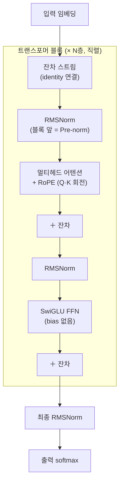
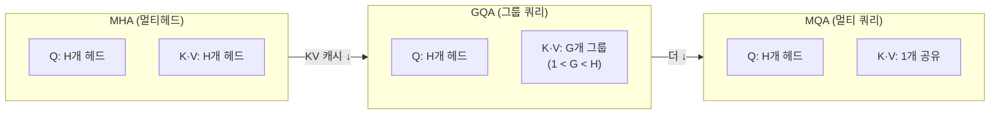

`CS336-LLM-From-Scratch` 시리즈의 3단계입니다. 전체 지도는 [CS336 커리큘럼](/2026/06/26/cs336-llm-from-scratch-curriculum.html)에서 볼 수 있습니다. ([2강 — 자원 회계](/2026/06/26/cs336-lecture-2-pytorch-resource-accounting.html)에서 이어집니다.)

이 강의(Tatsunori Hashimoto)의 제목은 "**LM 아키텍처와 학습에 대해 당신이 알고 싶지 않았던 모든 것**"입니다. 다른 수업이라면 건너뛸 디테일 — 하이퍼파라미터를 뭘로 둘지, 왜 bias를 빼는지 — 을 정면으로 다룹니다. 핵심 방법론은 이렇습니다. 우리는 수십 개의 LLM을 직접 학습시킬 수 없습니다. 그러니 **남들이 학습시킨 모델에서 배웁니다.** 2017년 원조 트랜스포머부터 2025년 최신 모델까지(작년 한 해에만 약 19개의 dense 모델이 공개됐습니다) 무엇이 바뀌고 무엇이 살아남았는지를 추적하면, 일종의 **수렴 진화(convergent evolution)**가 보입니다.

<figure class="post-figure post-figure--header">
<svg role="img" aria-label="2017년 여러 갈래로 갈라졌던 트랜스포머 설계들이 2025년 하나의 합의 트랜스포머 줄기로 수렴하는 그림. 살아남은 선택지는 Pre-norm, RMSNorm, SwiGLU, RoPE." viewBox="0 0 680 300" xmlns="http://www.w3.org/2000/svg">
  <defs>
    <marker id="ce-arrow" viewBox="0 0 10 10" refX="8" refY="5" markerWidth="7" markerHeight="7" orient="auto-start-reverse">
      <path d="M0 0 L10 5 L0 10 z" fill="var(--gold)"/>
    </marker>
  </defs>

  <!-- left rail: divergent early architectures (2017) -->
  <text x="92" y="26" text-anchor="middle" font-size="14" font-weight="700" fill="currentColor">2017 — 난립</text>
  <text x="92" y="42" text-anchor="middle" font-size="10.5" fill="var(--text-light)">갈라진 초기 설계</text>

  <g font-size="11.5" fill="currentColor">
    <g>
      <rect x="18" y="58" width="148" height="26" rx="5" fill="none" stroke="currentColor" stroke-width="1.4" opacity="0.55"/>
      <text x="92" y="75" text-anchor="middle">Post-norm · LayerNorm</text>
    </g>
    <g>
      <rect x="18" y="98" width="148" height="26" rx="5" fill="none" stroke="currentColor" stroke-width="1.4" opacity="0.55"/>
      <text x="92" y="115" text-anchor="middle">ReLU / GeLU MLP</text>
    </g>
    <g>
      <rect x="18" y="138" width="148" height="26" rx="5" fill="none" stroke="currentColor" stroke-width="1.4" opacity="0.55"/>
      <text x="92" y="155" text-anchor="middle">sin/cos · 절대 위치</text>
    </g>
    <g>
      <rect x="18" y="178" width="148" height="26" rx="5" fill="none" stroke="currentColor" stroke-width="1.4" opacity="0.55"/>
      <text x="92" y="195" text-anchor="middle">상대 위치 임베딩</text>
    </g>
    <g>
      <rect x="18" y="218" width="148" height="26" rx="5" fill="none" stroke="currentColor" stroke-width="1.4" opacity="0.55"/>
      <text x="92" y="235" text-anchor="middle">bias 항 · dropout</text>
    </g>
  </g>

  <!-- converging streams toward the trunk -->
  <g fill="none" stroke="var(--gold)" stroke-width="1.6" opacity="0.85" marker-end="url(#ce-arrow)">
    <path d="M166 71  C 250 71, 300 150, 392 150"/>
    <path d="M166 111 C 250 111, 300 150, 392 150"/>
    <path d="M166 151 C 250 151, 320 150, 392 150"/>
    <path d="M166 191 C 250 191, 300 150, 392 150"/>
    <path d="M166 231 C 250 231, 300 150, 392 150"/>
  </g>

  <!-- consensus trunk (2025) -->
  <text x="540" y="26" text-anchor="middle" font-size="14" font-weight="700" fill="var(--accent-color)">2025 — 합의</text>
  <text x="540" y="42" text-anchor="middle" font-size="10.5" fill="var(--text-light)">하나의 합의 트랜스포머</text>

  <rect x="398" y="56" width="266" height="192" rx="9" fill="var(--gold-soft)" stroke="var(--accent-color)" stroke-width="2"/>
  <text x="531" y="82" text-anchor="middle" font-size="13.5" font-weight="700" fill="currentColor">Llama 계열 트랜스포머</text>
  <line x1="416" y1="94" x2="646" y2="94" stroke="var(--border-color)" stroke-width="1.2" opacity="0.7"/>

  <g font-size="12.5" font-weight="700">
    <g>
      <rect x="416" y="106" width="106" height="30" rx="6" fill="none" stroke="var(--secondary-color)" stroke-width="1.8"/>
      <text x="469" y="126" text-anchor="middle" fill="currentColor">Pre-norm</text>
    </g>
    <g>
      <rect x="540" y="106" width="106" height="30" rx="6" fill="none" stroke="var(--secondary-color)" stroke-width="1.8"/>
      <text x="593" y="126" text-anchor="middle" fill="currentColor">RMSNorm</text>
    </g>
    <g>
      <rect x="416" y="146" width="106" height="30" rx="6" fill="none" stroke="var(--secondary-color)" stroke-width="1.8"/>
      <text x="469" y="166" text-anchor="middle" fill="currentColor">SwiGLU</text>
    </g>
    <g>
      <rect x="540" y="146" width="106" height="30" rx="6" fill="none" stroke="var(--secondary-color)" stroke-width="1.8"/>
      <text x="593" y="166" text-anchor="middle" fill="currentColor">RoPE</text>
    </g>
  </g>
  <text x="531" y="202" text-anchor="middle" font-size="11" fill="var(--text-light)">+ bias 제거 · 직렬 블록</text>
  <text x="531" y="226" text-anchor="middle" font-size="11" fill="var(--text-light)">= 고민 없이 따라가는 기본값</text>
</svg>
<figcaption>수렴 진화: 2017년 여러 갈래로 난립하던 설계가 2025년 하나의 합의 트랜스포머(Pre-norm · RMSNorm · SwiGLU · RoPE)로 수렴했다.</figcaption>
</figure>

## 한눈에 보기

원조 "Attention Is All You Need" 트랜스포머에서 출발해, 거의 모든 현대 모델이 도달한 **합의 변종(consensus variant, 흔히 'Llama 계열')**은 다음과 같이 생겼습니다. 이 글은 각 화살표가 *왜* 그렇게 굳었는지를 따라갑니다.



수렴한 합의를 한 표로 요약하면 — 새 모델을 만들 때 *고민 없이* 따라가도 되는 기본값들입니다.

| 선택지 | 합의된 답 | 핵심 이유 |
| --- | --- | --- |
| 정규화 **위치** | **Pre-norm** (잔차 스트림 밖) | 안정적, warmup 불필요, loss 스파이크 감소 |
| 정규화 **종류** | **RMSNorm** | 평균·bias 제거 → 더 빠름, 성능 동일 |
| **bias** 항 | **제거** | 안정성 + 파라미터 절약 |
| **활성화** | **SwiGLU / GeGLU** | 일관된 소폭 향상 |
| **위치 인코딩** | **RoPE** | (조사한 19개 모델 전부) 상대 위치 + 길이 외삽 |
| 블록 연결 | **직렬(serial)** | 병렬은 소수(GPT-J·PaLM) |

## 정규화: Pre-norm, RMSNorm, bias 제거

### Pre-norm vs Post-norm

원조 트랜스포머는 **post-norm** — 서브블록(어텐션·FFN) *뒤에*, 잔차 스트림 *안에* LayerNorm을 뒀습니다. 거의 즉시 사람들은 정규화를 비잔차 부분의 **앞으로** 옮긴 **pre-norm**이 훨씬 안정적임을 발견했습니다. 거의 모든 현대 LLM이 pre-norm을 씁니다.

왜일까요? 잔차 연결은 네트워크 꼭대기에서 바닥까지 이어지는 **identity 경로**를 줘서 그래디언트 전파를 쉽게 만듭니다. 정규화를 잔차 스트림 *안에* 끼우면 이 깨끗한 경로가 망가집니다. Pre-norm은 그 경로를 건드리지 않아, post-norm이 careful warmup으로 겨우 막던 **loss 스파이크**를 애초에 줄입니다 — 오늘날 정규화는 정확도 장치라기보다 **안정성 장치**로 쓰입니다.

> 최근엔 **double-norm**(블록 앞·뒤 모두 정규화)도 등장했습니다(Grok, Gemma 2). 더 큰 모델에서 조금 더 안정적이라는 보고가 있습니다.

### LayerNorm → RMSNorm

LayerNorm은 평균을 빼고, 표준편차로 나누고, 학습 가능한 `γ`로 스케일하고 `β`로 시프트합니다. **RMSNorm**은 여기서 **평균 빼기와 bias `β`를 버립니다** — RMS(제곱평균제곱근)로만 정규화합니다. Llama·PaLM·Chinchilla·T5 등 거의 전부가 갈아탔습니다.

```python
import torch
import torch.nn as nn

class RMSNorm(nn.Module):
    def __init__(self, d, eps=1e-6):
        super().__init__()
        self.g = nn.Parameter(torch.ones(d))   # 스케일 γ만 — bias β 없음
        self.eps = eps

    def forward(self, x):
        # 평균을 빼지 않는다. RMS로만 정규화
        rms = x.pow(2).mean(-1, keepdim=True).add(self.eps).rsqrt()
        return x * rms * self.g
```

성능은 똑같은데 왜 굳이? **더 빠르기 때문**입니다. 그런데 여기서 2강의 교훈이 되살아납니다 — "행렬곱 외엔 런타임에 안 중요하다며?" 정규화는 행렬곱이 아닙니다. 프로파일링을 보면 텐서 연산(행렬곱)이 트랜스포머 FLOPs의 **99.8%**지만, softmax·정규화 같은 연산은 FLOPs의 **0.17%**이면서 **런타임의 25%**를 잡아먹습니다. 이유는 **메모리 이동(memory movement)** 때문입니다. 그래서 평균·bias를 빼 메모리 이동을 줄이는 RMSNorm이 "공짜로" 빨라집니다.

<figure class="post-figure">
<svg role="img" aria-label="FLOPs 점유율과 런타임 점유율 비교. 정규화/softmax 같은 비행렬곱 연산은 FLOPs의 0.17%에 불과하지만 런타임의 25%를 차지한다. FLOPs는 런타임과 비례하지 않으며, 그 간극은 메모리 이동에서 온다." viewBox="0 0 620 290" xmlns="http://www.w3.org/2000/svg">
  <!-- legend -->
  <g font-size="11.5">
    <rect x="178" y="14" width="13" height="13" rx="2" fill="var(--secondary-color)"/>
    <text x="197" y="25" fill="currentColor">행렬곱 (텐서 연산)</text>
    <rect x="360" y="14" width="13" height="13" rx="2" fill="var(--accent-color)"/>
    <text x="379" y="25" fill="currentColor">정규화 · softmax 등</text>
  </g>

  <!-- ===== FLOPs bar ===== -->
  <text x="92" y="86" text-anchor="end" font-size="13" font-weight="700" fill="currentColor">FLOPs</text>
  <!-- track -->
  <rect x="108" y="62" width="464" height="34" rx="5" fill="var(--bg-light)" stroke="var(--border-color)" stroke-width="1"/>
  <!-- 99.8% matmul -->
  <rect x="108" y="62" width="463" height="34" rx="5" fill="var(--secondary-color)" opacity="0.85"/>
  <text x="340" y="84" text-anchor="middle" font-size="12.5" font-weight="700" fill="var(--bg-panel)">행렬곱 99.8%</text>
  <!-- 0.17% sliver: tiny strip at the right edge -->
  <rect x="570" y="62" width="2" height="34" fill="var(--accent-color)"/>
  <text x="572" y="118" text-anchor="end" font-size="11.5" font-weight="700" fill="var(--accent-color)">0.17%</text>

  <!-- ===== Runtime bar ===== -->
  <text x="92" y="186" text-anchor="end" font-size="13" font-weight="700" fill="currentColor">런타임</text>
  <rect x="108" y="162" width="464" height="34" rx="5" fill="var(--bg-light)" stroke="var(--border-color)" stroke-width="1"/>
  <!-- 75% matmul (464 * 0.75 = 348) -->
  <rect x="108" y="162" width="348" height="34" rx="5" fill="var(--secondary-color)" opacity="0.85"/>
  <text x="282" y="184" text-anchor="middle" font-size="12.5" font-weight="700" fill="var(--bg-panel)">행렬곱 75%</text>
  <!-- 25% norm/softmax (464 * 0.25 = 116) -->
  <rect x="456" y="162" width="116" height="34" rx="5" fill="var(--accent-color)"/>
  <text x="514" y="184" text-anchor="middle" font-size="12.5" font-weight="700" fill="var(--bg-panel)">25%</text>

  <!-- takeaway -->
  <text x="340" y="252" text-anchor="middle" font-size="12.5" fill="currentColor">FLOPs의 <tspan font-weight="700" fill="var(--accent-color)">0.17%</tspan>가 런타임의 <tspan font-weight="700" fill="var(--accent-color)">25%</tspan> — FLOPs ≠ 런타임</text>
  <text x="340" y="274" text-anchor="middle" font-size="11" fill="var(--text-light)">간극의 출처는 메모리 이동. RMSNorm은 그 이동을 줄여 "공짜로" 빨라진다.</text>
</svg>
<figcaption>FLOPs와 런타임의 불일치. 정규화·softmax는 FLOPs의 0.17%에 불과한데 런타임의 25%를 먹는다 — 병목은 연산이 아니라 메모리 이동이다.</figcaption>
</figure>

> **일반화 교훈:** 아키텍처 설계는 FLOPs만이 아니라 **메모리 이동**도 봐야 합니다. 5강(GPU)부터 이 주제가 본격화됩니다.

### bias 항 제거

같은 흐름에서, 대부분의 현대 트랜스포머는 **bias 항을 전부 뺍니다.** 성능은 동일하고("행렬곱이면 충분"), 경험적으로 가장 큰 모델의 학습을 **안정화**한다는 관찰이 명확합니다. 그래서 요즘 구현은 순수 행렬곱만 남깁니다.

## 활성화: GLU 계열 (SwiGLU)

활성화 함수의 동물원(ReLU·GeLU·Swish…)과 그 게이트 변종(GeGLU·ReGLU·SwiGLU)이 있습니다. 결론부터: **게이트 선형 유닛(Gated Linear Unit, GLU) 계열이 일관되게 잘 됩니다.** 원조 트랜스포머의 ReLU → GPT 계열의 GeLU → 2023년 이후 대부분이 SwiGLU/GeGLU로 수렴했습니다.

게이팅의 아이디어는 MLP의 은닉 부분을 **입력에서 계산한 게이트로 원소별 곱**해 거르는 것입니다. SwiGLU는 비선형으로 Swish(`x·σ(x)`)를 씁니다.

```python
import torch.nn.functional as F

class SwiGLU(nn.Module):
    def __init__(self, d_model, d_ff):
        super().__init__()
        # 게이트용 V가 추가되므로 d_ff를 줄여 파라미터 수를 맞춘다 (아래 8/3 규칙)
        self.w1 = nn.Linear(d_model, d_ff, bias=False)  # 값(value)
        self.v  = nn.Linear(d_model, d_ff, bias=False)  # 게이트(gate)
        self.w2 = nn.Linear(d_ff, d_model, bias=False)

    def forward(self, x):
        return self.w2(F.silu(self.w1(x)) * self.v(x))   # Swish(xW1) ⊙ (xV) → W2
```

주의할 점 둘. ① 게이트 `V`라는 행렬이 하나 더 늘었으니, **파라미터 수를 맞추려면 `d_ff`를 기존 `4·d_model`의 2/3 — 즉 `8/3·d_model ≈ 2.67·d_model` — 로 줄입니다**(아래 하이퍼파라미터 절). ② GLU가 *필수*는 아닙니다 — GPT-3(GeLU)·Falcon(ReLU)도 고성능입니다. 다만 **일관된 소폭 향상**이라 모두가 채택했고, 그래서 과제에서도 SwiGLU를 구현합니다.

## 위치 인코딩: RoPE

위치 인코딩은 초기에 sin/cos → 절대(absolute) → 상대(relative)로 난립했지만, 지금은 **RoPE(Rotary Position Embedding)**로 완전히 수렴했습니다(조사한 19개 모델 전부). 출발점은 "중요한 건 **상대 위치**"라는 직관입니다 — 두 단어의 임베딩 내적이 위치 *차이*에만 의존해야 합니다.

RoPE의 영리함은 **회전(rotation)**을 쓰는 데 있습니다. 내적은 회전에 불변이므로, 각 토큰의 임베딩을 **위치에 비례하는 각도만큼 회전**시키면, 두 벡터의 내적은 둘의 회전각 *차이* — 즉 위치 차이 — 에만 반응합니다. 절대 위치가 통째로 평행이동해도 상대 각도는 보존됩니다.

<figure class="post-figure">
<svg role="img" aria-label="RoPE 회전. 같은 단어쌍을 위치 (0,1)에 둔 경우와 (2,3)에 둔 경우 모두, 두 벡터를 위치에 비례한 각도만큼 회전시키면 둘 사이의 상대 각도 Δθ는 동일하게 유지된다. 따라서 내적은 절대 위치가 아니라 위치 차이에만 의존한다." viewBox="0 0 660 320" xmlns="http://www.w3.org/2000/svg">
  <defs>
    <marker id="rope-q" viewBox="0 0 10 10" refX="9" refY="5" markerWidth="7" markerHeight="7" orient="auto-start-reverse">
      <path d="M0 0 L10 5 L0 10 z" fill="var(--secondary-color)"/>
    </marker>
    <marker id="rope-k" viewBox="0 0 10 10" refX="9" refY="5" markerWidth="7" markerHeight="7" orient="auto-start-reverse">
      <path d="M0 0 L10 5 L0 10 z" fill="var(--accent-color)"/>
    </marker>
  </defs>

  <!-- ===== Panel A: positions (0,1) ===== -->
  <text x="165" y="28" text-anchor="middle" font-size="13.5" font-weight="700" fill="currentColor">위치 (0, 1)</text>

  <!-- axes -->
  <g stroke="currentColor" stroke-width="1" opacity="0.35">
    <line x1="55" y1="200" x2="285" y2="200"/>
    <line x1="165" y1="90" x2="165" y2="280"/>
  </g>
  <circle cx="165" cy="200" r="92" fill="none" stroke="currentColor" stroke-width="1" stroke-dasharray="3 4" opacity="0.3"/>

  <!-- vector at pos 0: angle 0 (along +x). secondary = "query" word -->
  <line x1="165" y1="200" x2="257" y2="200" stroke="var(--secondary-color)" stroke-width="2.6" marker-end="url(#rope-q)"/>
  <text x="263" y="196" font-size="11" font-weight="700" fill="var(--secondary-color)">x₀</text>
  <!-- vector at pos 1: rotated by θ (=40°). accent = "key" word -->
  <line x1="165" y1="200" x2="235" y2="141" stroke="var(--accent-color)" stroke-width="2.6" marker-end="url(#rope-k)"/>
  <text x="241" y="135" font-size="11" font-weight="700" fill="var(--accent-color)">x₁</text>
  <!-- relative-angle arc Δθ -->
  <path d="M223 200 A 58 58 0 0 0 209 165" fill="none" stroke="var(--gold)" stroke-width="2"/>
  <text x="231" y="178" font-size="11.5" font-weight="700" fill="var(--gold)">Δθ</text>

  <!-- ===== Panel B: positions (2,3) ===== -->
  <text x="495" y="28" text-anchor="middle" font-size="13.5" font-weight="700" fill="currentColor">위치 (2, 3)</text>

  <g stroke="currentColor" stroke-width="1" opacity="0.35">
    <line x1="385" y1="200" x2="615" y2="200"/>
    <line x1="495" y1="90" x2="495" y2="280"/>
  </g>
  <circle cx="495" cy="200" r="92" fill="none" stroke="currentColor" stroke-width="1" stroke-dasharray="3 4" opacity="0.3"/>

  <!-- both rotated further by 2θ (=80°), but SAME Δθ between them -->
  <!-- pos 2: rotated 80° from +x -->
  <line x1="495" y1="200" x2="511" y2="109" stroke="var(--secondary-color)" stroke-width="2.6" marker-end="url(#rope-q)"/>
  <text x="513" y="104" font-size="11" font-weight="700" fill="var(--secondary-color)">x₂</text>
  <!-- pos 3: rotated 120° from +x -->
  <line x1="495" y1="200" x2="449" y2="120" stroke="var(--accent-color)" stroke-width="2.6" marker-end="url(#rope-k)"/>
  <text x="430" y="113" font-size="11" font-weight="700" fill="var(--accent-color)">x₃</text>
  <!-- same Δθ arc between them -->
  <path d="M512 110 A 92 92 0 0 0 451 122" fill="none" stroke="var(--gold)" stroke-width="2"/>
  <text x="486" y="96" font-size="11.5" font-weight="700" fill="var(--gold)">Δθ</text>

  <!-- equals sign / takeaway -->
  <text x="330" y="206" text-anchor="middle" font-size="24" font-weight="700" fill="var(--text-light)">=</text>

  <text x="330" y="306" text-anchor="middle" font-size="12" fill="currentColor">절대 위치는 달라도 상대 각도 Δθ는 같다 → 내적은 <tspan font-weight="700">위치 차이</tspan>에만 의존</text>
</svg>
<figcaption>RoPE: 각 토큰을 위치에 비례한 각도만큼 회전시킨다. 같은 단어쌍을 (0,1)에 두든 (2,3)에 두든 둘 사이의 각도 Δθ는 보존되므로, Q·K 내적은 절대 위치가 아니라 위치 차이에만 반응한다.</figcaption>
</figure>

고차원에서는 벡터를 **2차원씩 블록으로 잘라**, 블록마다 정해진 속도 `θ`로 회전시킵니다(sin/cos 임베딩처럼 빠른·느린 주파수를 섞어 가까운·먼 위치 정보를 모두 담습니다). `θ`는 **학습하지 않는 고정값**이라, 회전은 결국 고정 행렬곱일 뿐 — 학습에 부담을 주지 않습니다.

```python
# RoPE는 입력에 더하지 않는다. 어텐션 직전, Q·K에만 적용한다
# (cos·sin: 위치별 회전각 캐시, rotate_half: 2D 블록 절반 교환 — 개념용 의사코드)
q_rot = (q * cos) + (rotate_half(q) * sin)   # 2차원 블록마다 회전
k_rot = (k * cos) + (rotate_half(k) * sin)
attn  = softmax(q_rot @ k_rot.transpose(-2, -1) / head_dim**0.5) @ v
```

RoPE가 이긴 이유는 작은 스케일·짧은 컨텍스트에서도 경험적으로 효과적이고, **컨텍스트 길이 외삽(extrapolation)** 알고리즘이 풍부해 프로덕션 LLM에 잘 맞기 때문입니다.

## 하이퍼파라미터: 몇 안 되는 다이얼

새 모델을 훈련하라고 하면 하이퍼파라미터가 막막해 보이지만, 실제로 모델마다 *바뀌는* 건 몇 개뿐이고 나머지는 분명한 규칙이 있습니다.

| 하이퍼파라미터 | 합의된 규칙 | 예외 / 비고 |
| --- | --- | --- |
| **d_ff / d_model** | **4** (비GLU), **8/3 ≈ 2.67** (GLU, 파라미터 맞춤) | T5 = 64× (대담) → v1.1에서 2.5로 회귀. 최적은 1~10의 넓은 골짜기 |
| **head_dim × n_heads** | **≈ d_model** (비율 1) | T5 = 16. 저랭크 우려는 실전에서 거의 없음 |
| **aspect ratio** (d_model / n_layers) | **≈ 128** (층당 은닉차원) | 스케일 바뀌어도 최적점 안정(Kaplan) |
| **vocab size** | 단일어 30~50k, 다국어·프로덕션 **100~250k** | GPT-4 ≈ 100k. 추세는 상승 |
| **정규화(regularization)** | dropout 폐기, **weight decay 유지** | 아래 참고 |

몇 가지 통찰을 덧붙이면:

- **`d_ff` 4배의 근거.** Kaplan의 스케일링 논문은 `d_ff/d_model`을 바꿔 가며 손실을 재 보면 **1~10의 넓은 최적 골짜기**가 있고 4가 그 안에 든다고 보여 줍니다. T5의 64×는 "넓고 뚱뚱한 행렬곱으로 시스템 효율"을 노린 대담한 선택이었지만, 표현력 측면에선 다소 비효율적이라 후속작에서 표준값으로 돌아갔습니다.
- **aspect ratio.** 너무 넓지도 깊지도 않은 **층당 ~128 은닉차원**이 스위트 스폿이며, 이 최적점이 여러 자릿수 스케일에 걸쳐 잘 안 흔들립니다. 손실만 보면 "파라미터 수만 중요(깊이 무관)"하지만, 다운스트림 정확도는 같은 FLOPs에서 **더 깊은 모델**이 유리할 수 있습니다. 한편 폭/깊이는 뒤의 **병렬화**(텐서 병렬은 폭, 파이프라인 병렬은 깊이) 제약과도 얽힙니다.
- **weight decay의 반전.** 사전학습은 보통 **1 에폭**이라 과적합이 없는데도 weight decay를 씁니다. 이유가 의외입니다 — 과적합 억제가 아니라, **학습률 스케줄(cosine decay)과 상호작용**해 학습 막바지에 손실을 더 빨리 떨어뜨리기 때문입니다. 즉 더 나은 *검증* 손실이 아니라 더 나은 *학습* 손실을 위해 씁니다. dropout은 (과적합이 없으니) 유행에서 사라졌습니다.

## 안정성 트릭

작년 한 해 아키텍처 코어는 거의 안 바뀌었지만, 많은 릴리스가 강조한 새 흐름이 **안정성 트릭**입니다. 큰 모델을 오래 학습하면 그래디언트 노름이 폭발하는 스파이크가 생겨 학습이 죽습니다. 문제아는 거의 항상 **softmax**(지수·나눗셈)이고, 트랜스포머엔 softmax가 둘 — 출력층과 어텐션 — 있습니다.

- **z-loss (출력 softmax).** 출력 softmax의 정규화항 `Z`(= 모든 vocab 로짓의 exp 합)가 1에 가깝도록(`log Z → 0`) 보조 손실 `α·(log Z)²`를 더합니다. `log Z = 0`이면 지수와 로그가 상쇄돼 수치적으로 안정해집니다. PaLM이 개척, 이후 DCLM·OLMo 등이 채택.
- **QK-norm (어텐션 softmax).** Q와 K를 내적하기 *전에* 정규화해 softmax 입력의 크기를 묶어 둡니다. 정규화항이 아니라 **입력**을 통제하는 방식. 비전·멀티모달에서 건너온 기법으로 Gemma 2·OLMo 2 등이 사용. 더 공격적인 학습률을 쓸 수 있어 오히려 perplexity가 좋아진 보고도 있습니다.
- **logit soft-capping.** `softcap · tanh(logits / softcap)`로 로짓을 부드럽게 클리핑. Gemma 2가 사용하나 덜 보편적이며, perplexity를 오히려 해친다는 결과도 있습니다.

> 강의자의 농담 섞인 관찰: 안정성 개입의 상당수가 결국 **"LayerNorm을 한 군데 더"**입니다 — 블록 앞 → 앞·뒤 → 이제 Q·K까지. 정규화는 놀랍도록 효과적입니다.

## 어텐션 변형: KV 캐시와 MQA/GQA

마지막은 학습보다 **추론 비용**에 직결되는 어텐션 변형입니다. 열쇠는 **산술 강도(arithmetic intensity)** = (연산량 ÷ 메모리 접근)입니다. GPU에서 메모리 접근은 비싸고 연산은 싸므로, 산술 강도를 **높게** 유지해야 합니다.

학습 때는 큰 행렬을 한꺼번에 곱해 산술 강도가 좋습니다. 하지만 **추론은 토큰을 하나씩 자기회귀로 생성**하므로 큰 행렬이 없습니다. 과거 토큰의 K·V를 매번 다시 계산하지 않으려고 **KV 캐시**에 쌓고 새 토큰마다 어텐션 한 행씩만 계산하는데, 이때 메모리 접근 패턴이 나빠져 산술 강도에 `n/d` 항이 끼어 처리량을 갉아먹습니다(긴 시퀀스·작은 모델일수록 불리).



- **MQA(Multi-Query Attention).** 쿼리는 여러 헤드, **K·V는 하나로 공유**. KV 캐시 메모리 이동이 확 줄어 산술 강도가 크게 좋아집니다.
- **GQA(Grouped-Query Attention).** MHA와 MQA의 중간 — 쿼리 헤드들을 **그룹으로 묶어** 그룹당 K·V를 공유. 추론 비용과 표현력을 절충합니다(MQA는 너무 공격적일 때가 있어, GQA가 표현력 손해 없이 자주 쓰입니다).
- **긴 컨텍스트.** 슬라이딩 윈도우 어텐션(층마다 국소 영역만), 그리고 Llama 4·Gemma·Command A의 트릭 — **4블록 중 1블록만 RoPE 없는 풀 어텐션, 나머지 3블록은 RoPE 슬라이딩 윈도우**. 풀 어텐션을 가끔만 써 시스템 비용을 줄이고, 장거리는 위치 인코딩이 없어 아주 길게 외삽됩니다.

## 성능·복잡도 노트

- **남의 경험이 곧 데이터다.** 모든 LLM을 직접 학습할 수 없으니, 수십 개 모델의 수렴 진화를 읽어 합의를 추출합니다. 이 글의 합의 표가 그 결과입니다.
- **반복되는 일반화 교훈 셋:** ① **identity 잔차 연결**(그래디언트 전파), ② **정규화로 활성화 스케일을 묶기**(안정성), ③ **시스템(메모리 이동)을 아키텍처 설계에 포함**.
- **FLOPs ≠ 런타임.** 정규화는 FLOPs의 0.17%지만 런타임의 25%. 설계 결정은 메모리 이동까지 봐야 합니다(RMSNorm·QK-norm이 그 산물).
- **학습과 추론의 비용 구조는 다르다.** 산술 강도가 학습에선 좋고 추론에선 나쁩니다. MQA/GQA·KV 캐시는 그 간극을 메우는 장치 — 10강(추론)에서 깊이 다룹니다.

## 요약

- 3강의 방법은 **남이 학습시킨 모델에서 배우기** — 2017~2025년 수렴 진화에서 현대 트랜스포머의 합의를 추출합니다.
- **합의:** Pre-norm + **RMSNorm**(평균·bias 제거) + **bias 제거** + **SwiGLU** + **RoPE** + 직렬 블록 = "Llama 계열".
- **하이퍼파라미터 규칙:** `d_ff/d_model` 4(또는 GLU면 8/3), `head_dim×heads ≈ d_model`, aspect ratio ≈ 128, vocab 100~250k(다국어), dropout 폐기·weight decay 유지(학습 손실용).
- **안정성 트릭:** softmax가 문제아 → **z-loss**(출력)·**QK-norm**(어텐션)·logit soft-capping. 결국 "정규화를 한 군데 더".
- **추론용 어텐션:** 산술 강도가 핵심. KV 캐시의 병목을 **MQA/GQA**로, 긴 컨텍스트를 슬라이딩 윈도우 + 주기적 풀 어텐션으로 푼다.

### 다음 학습 (Next Learning)

- **4단계: Mixture of Experts (MoE)** — 연산은 고정한 채 파라미터만 키우는 희소 아키텍처 (상세 포스트 작성 예정)
- [CS336 2강 — PyTorch와 자원 회계](/2026/06/26/cs336-lecture-2-pytorch-resource-accounting.html) — "FLOPs ≠ 런타임"의 토대가 된 자원 회계
- [CS336 커리큘럼](/2026/06/26/cs336-llm-from-scratch-curriculum.html) — 전체 17단계 지도와 진행 현황
