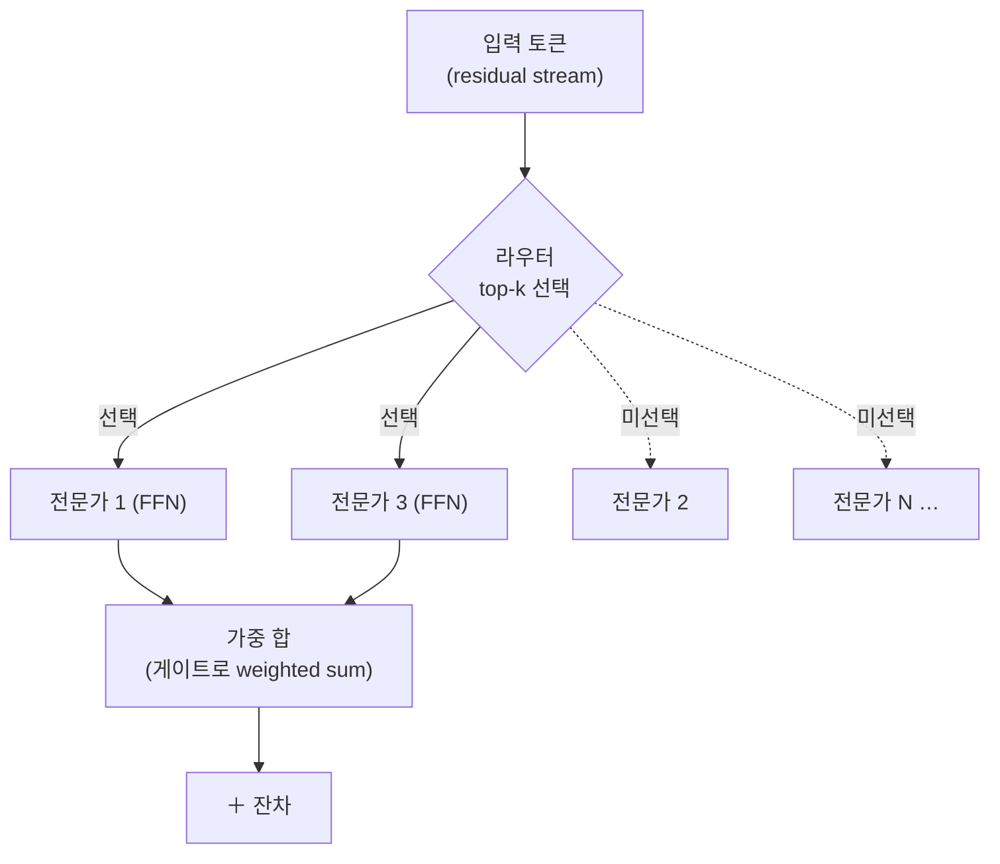
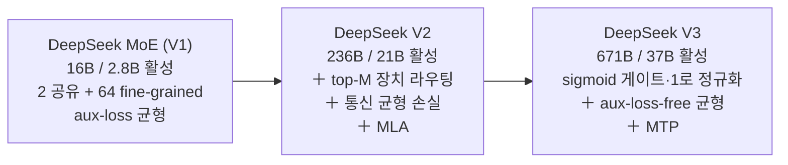

`CS336-LLM-From-Scratch` 시리즈의 4단계입니다. 전체 지도는 [CS336 커리큘럼](/2026/06/26/cs336-llm-from-scratch-curriculum.html)에서 볼 수 있습니다. ([3강 — 아키텍처](/2026/06/26/cs336-lecture-3-architectures-hyperparameters.html)에서 이어집니다.)

2025년 현재, 최고 성능의 오픈·클로즈드 모델 상당수가 **Mixture of Experts(MoE)**입니다 — GPT-4(루머), Grok, DeepSeek, Llama 4, Mixtral, Qwen이 모두 MoE로 옮겨 갔습니다. 같은 학습 FLOPs에서 dense보다 일관되게 좋다는 증거가 쌓여, 동·서양 모두가 채택하는 흐름입니다. 이 강의(Tatsunori Hashimoto)는 MoE의 기본 구조부터 라우팅·전문가 설계·학습 트릭을 훑고, 마지막에 **DeepSeek V3**를 한 바퀴 돌며 현대 오픈 SOTA가 어떻게 조립되는지 보여 줍니다.

> **이름의 함정.** "전문가(expert)"라는 말은 오해를 부릅니다. 코딩 전문가·영어 전문가처럼 도메인별로 특화된 모듈이 *아닙니다*. MoE는 그저 **희소하게 활성화되는 MLP 하위 부품들**일 뿐입니다.

<figure class="post-figure post-figure--header">
<svg role="img" aria-label="Dense FFN과 MoE의 비교. 왼쪽은 전체가 활성화된 하나의 큰 FFN 블록. 오른쪽은 라우터가 N개의 작은 전문가 중 top-k개(여기선 2개)만 켜는 모습 — 활성 연산(FLOPs)은 같지만 전체 파라미터는 N배." viewBox="0 0 680 320" xmlns="http://www.w3.org/2000/svg">
  <defs>
    <marker id="moe-arrow" viewBox="0 0 10 10" refX="8" refY="5" markerWidth="7" markerHeight="7" orient="auto-start-reverse">
      <path d="M0 0 L10 5 L0 10 z" fill="var(--gold)"/>
    </marker>
  </defs>

  <!-- LEFT: dense FFN — one big, fully-lit block -->
  <text x="150" y="30" text-anchor="middle" font-size="14" font-weight="700" fill="currentColor">Dense FFN</text>
  <text x="150" y="48" text-anchor="middle" font-size="10.5" fill="var(--text-light)">큰 블록 하나 · 전부 활성</text>

  <rect x="78" y="66" width="144" height="190" rx="6" fill="var(--accent-color)" opacity="0.16" stroke="var(--accent-color)" stroke-width="2"/>
  <g stroke="var(--accent-color)" stroke-width="1.3" opacity="0.7">
    <line x1="98" y1="92" x2="202" y2="92"/>
    <line x1="98" y1="120" x2="202" y2="120"/>
    <line x1="98" y1="148" x2="202" y2="148"/>
    <line x1="98" y1="176" x2="202" y2="176"/>
    <line x1="98" y1="204" x2="202" y2="204"/>
    <line x1="98" y1="232" x2="202" y2="232"/>
  </g>
  <text x="150" y="284" text-anchor="middle" font-size="11" font-weight="700" fill="var(--accent-color)">활성 = 100%</text>

  <!-- arrow: transform -->
  <line x1="246" y1="160" x2="304" y2="160" stroke="var(--gold)" stroke-width="2.4" marker-end="url(#moe-arrow)"/>
  <text x="275" y="148" text-anchor="middle" font-size="10.5" fill="var(--text-light)">분할</text>

  <!-- RIGHT: router + N small experts, only top-k lit -->
  <text x="500" y="30" text-anchor="middle" font-size="14" font-weight="700" fill="currentColor">MoE</text>
  <text x="500" y="48" text-anchor="middle" font-size="10.5" fill="var(--text-light)">라우터 + 작은 전문가 N개 · top-k만 활성</text>

  <!-- router -->
  <path d="M460 66 L540 66 L524 92 L476 92 Z" fill="var(--secondary-color)" opacity="0.18" stroke="var(--secondary-color)" stroke-width="1.8"/>
  <text x="500" y="84" text-anchor="middle" font-size="10.5" font-weight="700" fill="var(--secondary-color)">라우터 top-k</text>

  <!-- N small experts grid (3x2) — 2 lit (top-k=2), 4 dim -->
  <g font-size="9.5" text-anchor="middle">
    <!-- lit expert 1 -->
    <rect x="346" y="118" width="86" height="56" rx="5" fill="var(--accent-color)" opacity="0.2" stroke="var(--accent-color)" stroke-width="2"/>
    <text x="389" y="150" fill="var(--accent-color)" font-weight="700">전문가 1</text>
    <!-- dim -->
    <rect x="446" y="118" width="86" height="56" rx="5" fill="none" stroke="currentColor" stroke-width="1.3" opacity="0.4"/>
    <text x="489" y="150" fill="currentColor" opacity="0.45">전문가 2</text>
    <!-- lit expert 3 -->
    <rect x="546" y="118" width="86" height="56" rx="5" fill="var(--accent-color)" opacity="0.2" stroke="var(--accent-color)" stroke-width="2"/>
    <text x="589" y="150" fill="var(--accent-color)" font-weight="700">전문가 3</text>
    <!-- dim row -->
    <rect x="346" y="186" width="86" height="56" rx="5" fill="none" stroke="currentColor" stroke-width="1.3" opacity="0.4"/>
    <text x="389" y="218" fill="currentColor" opacity="0.45">전문가 4</text>
    <rect x="446" y="186" width="86" height="56" rx="5" fill="none" stroke="currentColor" stroke-width="1.3" opacity="0.4"/>
    <text x="489" y="218" fill="currentColor" opacity="0.45">전문가 5</text>
    <rect x="546" y="186" width="86" height="56" rx="5" fill="none" stroke="currentColor" stroke-width="1.3" opacity="0.4"/>
    <text x="589" y="218" fill="currentColor" opacity="0.45">전문가 N…</text>
  </g>

  <!-- router → lit experts -->
  <g stroke="var(--secondary-color)" stroke-width="1.6" fill="none">
    <path d="M484 92 L389 116" marker-end="url(#moe-arrow)"/>
    <path d="M516 92 L589 116" marker-end="url(#moe-arrow)"/>
  </g>

  <text x="500" y="266" text-anchor="middle" font-size="11" font-weight="700" fill="var(--accent-color)">활성 = k개뿐 <tspan fill="var(--text-light)" font-weight="400">·</tspan> <tspan fill="currentColor">전체 파라미터 = N배</tspan></text>
  <text x="500" y="288" text-anchor="middle" font-size="10.5" fill="var(--text-light)">FLOPs는 dense와 같다 (k개만 계산)</text>
</svg>
<figcaption>MoE의 핵심 거래: 전부 켜진 dense FFN 하나를, 라우터가 top-k개만 켜는 작은 전문가 N개로 바꾼다. 활성 연산(FLOPs)은 그대로, 담을 수 있는 전체 파라미터는 N배.</figcaption>
</figure>

## 한눈에 보기

MoE의 모든 액션은 **FFN(피드포워드)**에서 일어납니다. Dense 모델의 큰 FFN 하나를, **라우터 + 여러 개의 작은 FFN(전문가)**으로 바꾸고, 토큰마다 그중 **top-k개만** 골라 통과시킵니다. 나머지 구성요소(어텐션 등)는 그대로입니다.



핵심 거래는 한 줄입니다 — **k개만 활성화하니 FLOPs는 dense와 같지만, 전체 파라미터 수(N개 전문가)는 훨씬 많다.** 파라미터가 많을수록 세상에 대한 사실을 더 많이 담을 수 있다고 믿는다면, 이건 아주 좋은 거래입니다.

## MoE란 무엇이고, 무엇이 아닌가

Dense 트랜스포머의 FFN을 `N`개의 전문가로 복제(또는 분할)하고, 그 앞에 **라우터(router)**를 둡니다. 라우터는 토큰마다 활성화할 전문가 `k`개를 고릅니다. 전문가 하나의 크기가 dense FFN과 같고 `k=1`이라면, dense와 MoE의 **FLOPs는 정확히 같습니다** — 같은 행렬곱을 하니까요. 대신 전체 파라미터는 `N`배입니다.

**그래서 정말 더 좋은가?** 같은 학습 FLOPs에서 MoE가 dense보다 낮은 손실에 도달한다는 결과가 수없이 많습니다(Fedus 2022의 Switch Transformer, AI2의 OLMoE, DeepSeek). DeepSeek V2의 유명한 그림은 **활성 파라미터(activated params) 대비 MMLU**에서 MoE가 크게 앞섭니다(비활성 전문가는 추론 FLOPs에 안 잡히니 유리한 축이긴 합니다). 보너스로, 전문가를 장치마다 하나씩 얹는 **전문가 병렬화(expert parallelism)**라는 자연스러운 분할 축도 생깁니다.

**그런데 왜 표준이 아니었나?** 둘 때문입니다. ① **시스템 복잡도** — 멀티노드에서 전문가를 샤딩하고 토큰을 라우팅하는 인프라가 까다롭습니다. ② **라우팅은 미분 불가능** — 어떤 전문가를 고를지는 이산(discrete) 결정이라 매끄러운 그래디언트가 없습니다. 그래서 학습 목표가 휴리스틱이거나 불안정합니다. MoE를 배운다는 건 사실상 이 두 난점을 다루는 법을 배우는 것입니다.

설계 질문은 셋으로 정리됩니다 — **(1) 어떻게 라우팅하나, (2) 전문가를 몇 개·얼마 크기로, (3) 라우터를 어떻게 학습하나.**

## ① 라우팅: token-choice top-k

토큰을 전문가에 어떻게 배정할까요? 세 갈래가 있습니다.

- **Token choice** — 토큰마다 선호하는 전문가 top-k를 고른다.
- **Expert choice** — 전문가마다 선호하는 토큰 top-k를 고른다(전문가별 부하가 자동으로 균형).
- **Global assignment** — 최적 수송(optimal transport) 같은 전역 최적화로 배정.

거의 모든 현대 MoE가 **token-choice top-k**로 수렴했습니다(OLMoE 어블레이션에서 token-choice가 검증 손실이 더 빨리 떨어짐). 라우터는 의외로 **가볍습니다** — 어텐션과 비슷한 내적 한 번입니다.

```python
import torch.nn.functional as F

def moe_layer(u, experts, E, k):
    # u: 입력 토큰(residual stream), E: 라우터 가중치(N×d_model), experts: N개의 FFN
    scores = F.softmax(u @ E.t(), dim=-1)     # 토큰-전문가 affinity (어텐션과 유사)
    # (여기선 softmax→top-k 변종; DeepSeek V3·Mixtral은 top-k→softmax 순서)
    topk_val, topk_idx = scores.topk(k, dim=-1)  # 상위 k개 전문가만 선택
    gate = topk_val / topk_val.sum(-1, keepdim=True)  # 정규화 → 가중평균용
    out = sum(gate[..., i:i+1] * experts[topk_idx[..., i]](u) for i in range(k))
    return u + out                             # 잔차 연결
```

몇 가지 통찰:

- **K는 보통 2.** 초기 논문들은 "탐험(exploration)을 위해 `k ≥ 2`"를 주장했습니다 — `k=1`이면 늘 최선의 팔만 당겨(exploit) 다른 전문가를 영영 모릅니다. `k=2`가 표준이고 여전히 인기지만, 활성 FLOPs는 그만큼 늘어납니다("활성 파라미터 ×2").
- **softmax는 "1로 정규화"용.** 여기 softmax는 가장 큰 하나를 고르는 장치가 아니라, 나중에 전문가 출력을 **가중 평균**할 때 합이 1이 되게 하는 정규화입니다(그래서 top-k *뒤에* softmax를 두는 변종도 많습니다 — DeepSeek V3·Mixtral).
- **top-k는 학습 때도 필수.** softmax로 전부 게이팅하면 편하지만, 그러면 학습 때 `N`개 전문가 비용을 다 치릅니다. 희소성을 학습·추론 양쪽에서 지키려는 모든 체조가 이 top-k 때문입니다.
- **놀라운 사실: 해싱 라우터도 된다.** 의미 정보 없이 해시로 토큰을 전문가에 배정해도 이득이 납니다(같은 토큰은 같은 전문가로 가니 비의미적 특화가 생김). RL 라우팅·최적 수송은 우아하지만 비용 대비 이득이 없어 실전에서 안 쓰입니다.

## ② 전문가의 수와 크기: fine-grained + shared

기본형은 dense FFN을 통째로 복제해 `k=2`로 쓰는 것입니다. DeepSeek은 여기서 두 혁신을 더했고, 이후 거의 모든 오픈 모델이 따라갔습니다.

- **Fine-grained experts(잘게 쪼갠 전문가).** "전문가가 많을수록 좋다. 하지만 파라미터 비용은 내기 싫다." → 각 전문가를 **더 작게** 만듭니다. 3강의 `d_ff = 4·d_model` 대신 `2·d_model`로 줄이면, 같은 파라미터로 전문가를 **두 배** 둘 수 있습니다. 더 극단으로 ×8까지 쪼갤 수도 있습니다. FLOPs 관점에선 공짜(각 전문가가 작아짐)이고, 거의 무조건 이득입니다.
- **Shared experts(공유 전문가).** 어떤 처리는 토큰과 무관하게 *늘* 필요합니다. 그런 공통 구조를 항상 켜진 1~2개의 **공유 전문가**가 맡으면, 라우팅 낭비를 줄입니다. 다만 증거는 엇갈립니다 — DeepSeek은 이득을 봤지만 OLMoE 재현에선 별 효과가 없어 공유 전문가를 안 썼습니다.

대표 구성의 진화: 8~16개·top-2 시절(Mixtral·DBRx·Grok) → **DeepSeek 프로토타입**(64개 fine-grained 중 6개 라우팅 + 2개 공유, 각 ~1/4 크기) → Qwen·Llama 4 등이 같은 골격을 따름. fine-grained는 사실상 표준이 됐습니다.

<figure class="post-figure">
<svg role="img" aria-label="DeepSeek의 두 혁신. 위: 큰 전문가 하나를 더 작은 fine-grained 전문가 네 개로 쪼개면, 같은 파라미터·FLOPs로 전문가 수가 늘어 라우팅 조합이 풍부해진다. 아래: 토큰마다 골라 켜는 라우팅 전문가 옆에, 모든 토큰이 항상 통과하는 공유 전문가 한두 개를 둔다." viewBox="0 0 680 360" xmlns="http://www.w3.org/2000/svg">
  <defs>
    <marker id="fg-arrow" viewBox="0 0 10 10" refX="8" refY="5" markerWidth="7" markerHeight="7" orient="auto-start-reverse">
      <path d="M0 0 L10 5 L0 10 z" fill="var(--gold)"/>
    </marker>
  </defs>

  <!-- ROW 1: fine-grained slicing -->
  <text x="20" y="28" font-size="13.5" font-weight="700" fill="currentColor">① Fine-grained — 잘게 쪼갠다</text>

  <!-- one normal expert -->
  <rect x="38" y="44" width="116" height="96" rx="6" fill="var(--accent-color)" opacity="0.16" stroke="var(--accent-color)" stroke-width="2"/>
  <text x="96" y="88" text-anchor="middle" font-size="11" font-weight="700" fill="var(--accent-color)">전문가 1개</text>
  <text x="96" y="106" text-anchor="middle" font-size="10" fill="var(--text-light)">d_ff = 4·d_model</text>

  <!-- arrow -->
  <line x1="172" y1="92" x2="226" y2="92" stroke="var(--gold)" stroke-width="2.4" marker-end="url(#fg-arrow)"/>
  <text x="199" y="80" text-anchor="middle" font-size="10" fill="var(--text-light)">분할</text>

  <!-- four smaller experts -->
  <g>
    <rect x="246" y="44" width="92" height="44" rx="4" fill="var(--accent-color)" opacity="0.16" stroke="var(--accent-color)" stroke-width="1.6"/>
    <rect x="346" y="44" width="92" height="44" rx="4" fill="var(--accent-color)" opacity="0.16" stroke="var(--accent-color)" stroke-width="1.6"/>
    <rect x="246" y="96" width="92" height="44" rx="4" fill="var(--accent-color)" opacity="0.16" stroke="var(--accent-color)" stroke-width="1.6"/>
    <rect x="346" y="96" width="92" height="44" rx="4" fill="var(--accent-color)" opacity="0.16" stroke="var(--accent-color)" stroke-width="1.6"/>
  </g>
  <text x="392" y="70" text-anchor="middle" font-size="9.5" fill="var(--accent-color)" font-weight="700">작은 전문가 ×4</text>
  <text x="392" y="122" text-anchor="middle" font-size="9.5" fill="var(--text-light)">d_ff 축소</text>

  <text x="466" y="80" font-size="10.5" fill="currentColor">같은 파라미터·FLOPs,</text>
  <text x="466" y="98" font-size="10.5" fill="currentColor">전문가 수↑ → 조합↑</text>
  <text x="466" y="116" font-size="10" fill="var(--text-light)">(거의 공짜 점심)</text>

  <!-- divider gap -->
  <line x1="20" y1="172" x2="660" y2="172" stroke="currentColor" stroke-width="1" opacity="0.18"/>

  <!-- ROW 2: shared + routed -->
  <text x="20" y="206" font-size="13.5" font-weight="700" fill="currentColor">② Shared — 항상 켜진 공유 전문가</text>

  <!-- token -->
  <circle cx="64" cy="278" r="20" fill="var(--secondary-color)" opacity="0.18" stroke="var(--secondary-color)" stroke-width="1.8"/>
  <text x="64" y="282" text-anchor="middle" font-size="10" font-weight="700" fill="var(--secondary-color)">토큰</text>

  <!-- routed experts (top-k chosen) -->
  <text x="300" y="232" text-anchor="middle" font-size="10.5" fill="var(--text-light)">라우팅 전문가 — top-k만 켜짐</text>
  <g font-size="9.5" text-anchor="middle">
    <rect x="200" y="244" width="84" height="40" rx="5" fill="var(--accent-color)" opacity="0.2" stroke="var(--accent-color)" stroke-width="2"/>
    <text x="242" y="269" fill="var(--accent-color)" font-weight="700">전문가 a</text>
    <rect x="300" y="244" width="84" height="40" rx="5" fill="none" stroke="currentColor" stroke-width="1.3" opacity="0.4"/>
    <text x="342" y="269" fill="currentColor" opacity="0.45">전문가 b</text>
    <rect x="400" y="244" width="84" height="40" rx="5" fill="var(--accent-color)" opacity="0.2" stroke="var(--accent-color)" stroke-width="2"/>
    <text x="442" y="269" fill="var(--accent-color)" font-weight="700">전문가 c</text>
    <rect x="500" y="244" width="84" height="40" rx="5" fill="none" stroke="currentColor" stroke-width="1.3" opacity="0.4"/>
    <text x="542" y="269" fill="currentColor" opacity="0.45">전문가 d…</text>
  </g>

  <!-- shared expert — always on -->
  <text x="342" y="312" text-anchor="middle" font-size="10.5" fill="var(--gold)" font-weight="700">공유 전문가 — 모든 토큰 항상 통과</text>
  <rect x="280" y="320" width="124" height="32" rx="5" fill="var(--gold)" opacity="0.18" stroke="var(--gold)" stroke-width="2"/>
  <text x="342" y="340" text-anchor="middle" font-size="10" font-weight="700" fill="var(--gold)">공유 전문가</text>

  <!-- token → router top-k (solid to lit, dashed to dim) -->
  <g fill="none">
    <path d="M84 270 L198 262" stroke="var(--accent-color)" stroke-width="1.6" marker-end="url(#fg-arrow)"/>
    <path d="M84 276 L398 262" stroke="var(--accent-color)" stroke-width="1.6" marker-end="url(#fg-arrow)"/>
    <path d="M70 296 L278 332" stroke="var(--gold)" stroke-width="1.6" marker-end="url(#fg-arrow)"/>
  </g>
</svg>
<figcaption>DeepSeek의 두 혁신. ① 큰 전문가를 잘게 쪼개면 같은 파라미터·FLOPs로 전문가 수만 늘어 라우팅 조합이 풍부해진다. ② 라우팅 전문가(top-k만 선택) 옆에, 모든 토큰이 늘 통과하는 공유 전문가 1~2개를 둬 공통 처리를 맡긴다.</figcaption>
</figure>

## ③ 라우터 학습: 가장 까다로운 부분

순전파는 단순하지만 **학습은 고약합니다.** 학습 때 모든 전문가를 켜면 `N`배 비싼 모델이 되니 **희소성을 학습 중에도 지켜야** 하는데, top-k 선택은 미분 불가능합니다. 세 갈래 — RL(가장 원칙적이나 비싸고 까다로워 폐기), 확률적 섭동(Shazeer 2017의 노이즈 주입, 대부분 폐기), 그리고 **휴리스틱 부하 분산 손실(everyone uses this)**.

**왜 균형이 필요한가 — 붕괴(collapse).** 아무 제약 없이 두면 라우터는 **한 전문가에만** 모든 토큰을 보내는 국소 최저점에 빠집니다. 나머지 전문가는 죽고(dead), 결국 더 작은 모델이 돼 버립니다. 부하 분산 손실이 이 붕괴를 막는 열쇠입니다.

<figure class="post-figure">
<svg role="img" aria-label="라우터 붕괴와 균형의 비교. 왼쪽(균형 없음): 거의 모든 토큰이 한 전문가에 쏠리고 나머지 전문가는 토큰을 못 받아 죽는다(dead). 오른쪽(부하 분산): 토큰이 전문가들에 고르게 퍼져 모든 전문가가 살아 있다." viewBox="0 0 680 300" xmlns="http://www.w3.org/2000/svg">
  <!-- token pool labels -->
  <text x="170" y="26" text-anchor="middle" font-size="13.5" font-weight="700" fill="var(--accent-color)">균형 없음 → 붕괴</text>
  <text x="170" y="44" text-anchor="middle" font-size="10" fill="var(--text-light)">한 전문가 독식 · 나머지는 죽음(dead)</text>

  <text x="510" y="26" text-anchor="middle" font-size="13.5" font-weight="700" fill="var(--secondary-color)">부하 분산 → 균형</text>
  <text x="510" y="44" text-anchor="middle" font-size="10" fill="var(--text-light)">토큰이 고르게 퍼짐 · 모두 활용</text>

  <!-- baseline -->
  <line x1="40" y1="250" x2="300" y2="250" stroke="currentColor" stroke-width="1.4" opacity="0.4"/>
  <line x1="380" y1="250" x2="640" y2="250" stroke="currentColor" stroke-width="1.4" opacity="0.4"/>

  <!-- LEFT: collapse — one tall bar, rest near-zero & grey/dead -->
  <g font-size="10" text-anchor="middle">
    <!-- overloaded expert -->
    <rect x="52" y="78" width="40" height="172" rx="3" fill="var(--accent-color)" opacity="0.78"/>
    <text x="72" y="266" fill="var(--accent-color)" font-weight="700">E1</text>
    <!-- dead experts -->
    <rect x="116" y="242" width="40" height="8" rx="3" fill="currentColor" opacity="0.35"/>
    <text x="136" y="266" fill="currentColor" opacity="0.45">E2</text>
    <text x="136" y="234" font-size="9" fill="var(--text-light)">✗ dead</text>
    <rect x="180" y="244" width="40" height="6" rx="3" fill="currentColor" opacity="0.35"/>
    <text x="200" y="266" fill="currentColor" opacity="0.45">E3</text>
    <text x="200" y="236" font-size="9" fill="var(--text-light)">✗ dead</text>
    <rect x="244" y="245" width="40" height="5" rx="3" fill="currentColor" opacity="0.35"/>
    <text x="264" y="266" fill="currentColor" opacity="0.45">E4</text>
    <text x="264" y="237" font-size="9" fill="var(--text-light)">✗ dead</text>
  </g>

  <!-- divider -->
  <line x1="340" y1="60" x2="340" y2="270" stroke="currentColor" stroke-width="1" opacity="0.18"/>

  <!-- RIGHT: balanced — four even bars, all lit -->
  <g font-size="10" text-anchor="middle">
    <rect x="392" y="160" width="40" height="90" rx="3" fill="var(--secondary-color)" opacity="0.7"/>
    <text x="412" y="266" fill="var(--secondary-color)" font-weight="700">E1</text>
    <rect x="456" y="150" width="40" height="100" rx="3" fill="var(--secondary-color)" opacity="0.7"/>
    <text x="476" y="266" fill="var(--secondary-color)" font-weight="700">E2</text>
    <rect x="520" y="158" width="40" height="92" rx="3" fill="var(--secondary-color)" opacity="0.7"/>
    <text x="540" y="266" fill="var(--secondary-color)" font-weight="700">E3</text>
    <rect x="584" y="152" width="40" height="98" rx="3" fill="var(--secondary-color)" opacity="0.7"/>
    <text x="604" y="266" fill="var(--secondary-color)" font-weight="700">E4</text>
  </g>

  <!-- y-axis hint -->
  <text x="30" y="150" text-anchor="middle" font-size="9.5" fill="var(--text-light)" transform="rotate(-90 30 150)">전문가가 받은 토큰 수</text>
</svg>
<figcaption>균형이 없으면 라우터는 한 전문가(E1)에 토큰을 몰아주는 국소 최저점에 빠지고 나머지는 죽어(dead) 사실상 더 작은 모델이 된다. 부하 분산 손실은 가장 많이 받은 전문가를 강하게 눌러 토큰을 고르게 퍼뜨린다.</figcaption>
</figure>

```python
# Switch Transformer 부하 분산 손실: 토큰 쏠림(붕괴)을 막는다
def load_balance_loss(router_probs, dispatch_mask, N, alpha=0.01):
    # dispatch_mask: 토큰×전문가 배정 마스크 (top-1이면 one-hot, k≥2면 multi-hot)
    f = dispatch_mask.float().mean(0)   # f_i: 전문가 i가 받은 토큰 비율(실제 배정)
    p = router_probs.mean(0)            # p_i: 라우터가 i에 준 평균 확률(의도)
    return alpha * N * (f * p).sum()    # f·p 내적 — 토큰을 많이 받은 전문가를 더 강하게 누름
```

`f_i`(전문가 `i`가 실제로 받은 토큰 비율)와 `p_i`(라우터가 `i`에 *의도한* 확률)의 내적입니다. `p_i`에 대해 미분하면 **가장 많은 토큰을 받은 전문가가 가장 강하게 눌리므로**, 자연스레 균형이 잡힙니다. 같은 구조로 **배치 단위**뿐 아니라 **장치(device) 단위** 균형도 둘 수 있습니다(GPU별 토큰 수를 고르게 → 균등 활용).

**DeepSeek V3의 보조손실 없는 균형(auxiliary-loss-free).** V3는 전문가별 부하 분산 손실을 빼고, 대신 라우팅 점수에 **전문가별 편향 `b_i`**를 더합니다. `b_i`는 온라인 학습으로 갱신 — 어떤 전문가가 토큰을 덜 받으면 `b_i`를 올려 더 끌어오고, 너무 많이 받으면 내립니다. 중요한 점: `b_i`는 **선택(라우팅 결정)에만** 쓰이고 게이트 가중치엔 안 들어갑니다. 다만 V3도 결국 **시퀀스 단위 보조 손실**을 따로 더하므로, 광고만큼 완전히 "보조손실 없는" 건 아닙니다(추론 때 분포 밖 시퀀스가 특정 전문가를 압도하는 걸 막으려는 의도).

## 시스템과 함정

- **전문가 병렬화.** 전문가를 장치마다 얹고, 라우터 뒤에 **all-to-all** 통신으로 토큰을 해당 장치로 보냈다가(dispatch) 다시 모읍니다(combine). MegaBlocks 같은 라이브러리는 장치 내 희소 행렬곱으로 여러 전문가 계산을 한 번에 처리합니다.
- **토큰 드롭(token dropping).** 전문가마다 **용량(capacity/load factor)** 한도가 있어, 라우터가 한 전문가에 토큰을 너무 많이 보내면 초과분을 **버립니다** — 그 토큰의 MLP는 0을 내고 잔차만 통과합니다. 같은 배치에 누가 있느냐에 따라 결과가 달라지므로, 학습·추론 모두에서 **비결정성**의 원인이 됩니다(temperature=0인데도 GPT-4 응답이 달라지던 미스터리의 한 가설).
- **안정성.** 불안정의 주범은 늘 **softmax**(3강과 동일). 그래서 라우터 계산을 **FP32**로 하고, 라우터 softmax에 **z-loss**를 겁니다(사실 z-loss의 초기 사용처 중 하나가 MoE 라우터였습니다).
- **파인튜닝과 upcycling.** MoE는 파라미터가 많아 작은 데이터에 **과적합**하기 쉽습니다(해법: dense/MoE 층을 번갈아 두거나, DeepSeek처럼 SFT 데이터를 많이 — 1.4M개 — 붓기). 그리고 **upcycling** — dense 모델의 MLP를 복제해 전문가로 초기화하고 그때부터 MoE로 학습 — 은 큰 파라미터 모델을 싸게 얻는 트릭입니다(MiniCPM, Qwen).

## DeepSeek V3 한 바퀴

마지막으로 현대 오픈 SOTA를 조립해 봅니다. 핵심 메시지는 **"아키텍처는 별로 안 바뀐다"** — DeepSeek은 1.5~2년 전 작은 모델에서 이미 골격을 잡았고, V3는 그 엔지니어링을 키운 것입니다("되면 바꾸지 마라").



- **V1 (DeepSeek MoE).** 16B(2.8B 활성), 공유 2 + fine-grained 64(약 6개 활성). softmax-bottom top-k 라우팅 + 전문가·장치 부하 분산 손실.
- **V2.** 236B(21B 활성). **top-M 장치 라우팅** 추가 — 토큰마다 top-M *장치*를 먼저 고른 뒤 그 안에서 top-k 전문가를 골라 **통신 비용**을 묶습니다(fine-grained가 너무 잘게 흩어지는 걸 방지). + 통신 균형 손실, + MLA.
- **V3.** 671B(37B 활성). softmax 대신 **sigmoid 게이트 + 1로 정규화**, **aux-loss-free 균형(`b_i`)** + 시퀀스 단위 보조 손실. top-M은 유지.

V3의 **MoE 아닌 두 부품**도 짚을 만합니다.

- **MLA (Multi-head Latent Attention).** GQA/MQA(3강)처럼 KV 캐시를 줄이는 또 다른 길. K·V를 직접 만들지 않고, 입력을 먼저 **저차원 잠재 벡터 `c`**로 압축해 **`c`만 캐시**합니다(필요할 때 up-projection). up-projection 행렬은 Q 쪽 행렬과 **결합법칙으로 합쳐** 추가 행렬곱 없이 처리합니다. (RoPE와 호환되지 않는 부분은 비압축 차원에서 따로 회전.)
- **MTP (Multi-Token Prediction).** 다음 토큰 하나가 아니라, 가벼운 트랜스포머 블록 헤드로 **한 토큰 더 미래**를 함께 예측하는 보조 손실(다이어그램은 여러 토큰을 그리지만 실제론 1토큰만).

## 성능·복잡도 노트

- **희소성이 핵심.** "모든 파라미터를 늘 쓸 필요는 없다." MoE는 활성 FLOPs를 고정한 채 전체 파라미터(=용량)를 키웁니다. flop-제약 환경에서 거의 항상 비용 효율적입니다.
- **이산 라우팅이 진짜 난제.** 미분 불가능한 top-k가 MoE를 어렵게 만듭니다. 그럼에도 **휴리스틱 부하 분산이 그냥 통합니다** — MoE가 즉시 표준이 되지 못한 이유이자, 이제는 표준이 된 이유.
- **fine-grained는 공짜 점심에 가깝다.** 전문가를 잘게 쪼개면 FLOPs 그대로 더 많은 전문가를 얻습니다. 공유 전문가는 증거가 엇갈립니다.
- **시스템이 설계를 지배한다.** top-M 장치 라우팅·통신 균형 손실·MLA처럼, 큰 MoE의 결정은 통신·메모리에서 나옵니다(5~8강 시스템 강의의 예고편).

## 요약

- **MoE = dense FFN을 라우터 + N개 전문가로.** k개만 활성화 → FLOPs 그대로, 파라미터는 N배. 같은 학습 FLOPs에서 dense보다 낫다(GPT-4·DeepSeek·Llama 4·Mixtral).
- **라우팅:** token-choice **top-k**로 수렴. 라우터는 가벼운 내적 + softmax(=1로 정규화). K=2가 표준. 해싱조차 이득.
- **전문가:** **fine-grained**(잘게 쪼개 더 많이, 사실상 공짜) + **shared**(엇갈리는 증거). DeepSeek 골격이 표준.
- **학습:** 미분 불가 → **부하 분산 손실**로 붕괴(한 전문가 독식)를 막는다. DeepSeek V3는 **aux-loss-free**(`b_i` 편향) + 시퀀스 보조 손실.
- **함정:** 전문가 병렬화·토큰 드롭(비결정성)·라우터 FP32+z-loss·upcycling.
- **DeepSeek V3:** MoE 골격은 V1 그대로, 거기에 top-M 라우팅·aux-loss-free·**MLA**(KV 압축)·**MTP**(다중 토큰 예측)를 더한 현대 오픈 SOTA.

### 다음 학습 (Next Learning)

- **5단계: GPU** — MoE의 시스템 복잡도를 이해하기 위한 토대, GPU 구조와 메모리 계층 (상세 포스트 작성 예정)
- [CS336 3강 — 아키텍처와 하이퍼파라미터](/2026/06/26/cs336-lecture-3-architectures-hyperparameters.html) — GQA/MQA·RoPE 등 MLA의 배경
- [CS336 커리큘럼](/2026/06/26/cs336-llm-from-scratch-curriculum.html) — 전체 17단계 지도와 진행 현황
