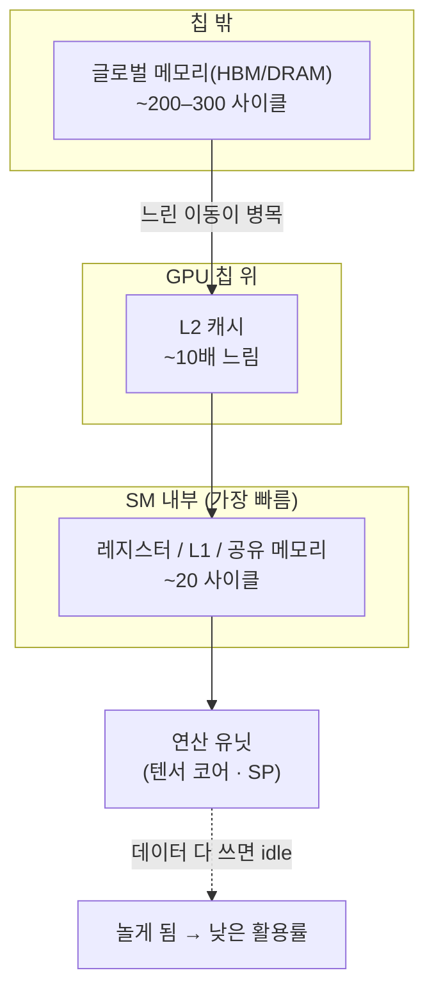

`CS336-LLM-From-Scratch` 시리즈의 5단계입니다. 전체 지도는 [CS336 커리큘럼](/2026/06/26/cs336-llm-from-scratch-curriculum.html)에서 볼 수 있습니다. ([4강 — MoE](/2026/06/26/cs336-lecture-4-mixture-of-experts.html)에서 이어집니다.)

유닛 2의 후반, **시스템** 강의가 시작됩니다. GPU는 언어 모델을 굴러가게 하는 물건이지만, 하드웨어를 들여다본 적 없다면 마법처럼 보입니다. 이 강의(Tatsunori Hashimoto)의 목표는 둘 — ① GPU가 *왜 느려지는지*(행렬 크기를 키우면 처리량이 물결치듯 출렁이는 미스터리)를 이해하고, ② Flash Attention 같은 빠른 알고리즘을 직접 짤 수 있게 되는 것입니다. 강의를 관통하는 한 단어는 **메모리**입니다.

<figure class="post-figure post-figure--header">
<svg role="img" aria-label="로그 축 위의 두 성장 곡선. 위쪽 가파른 곡선은 연산(FLOPs)이 여러 세대에 걸쳐 약 10만 배 빨라진 길, 아래쪽 완만한 곡선은 메모리 대역폭이 약 100배에 그친 길이다. 두 곡선 사이가 세대가 지날수록 벌어지고, 그 벌어진 틈에 '병목 = 메모리 이동'이라는 한 문장이 새겨져 이 강의의 핵심 명제를 이룬다." viewBox="0 0 760 320" xmlns="http://www.w3.org/2000/svg">
  <title>연산은 ~100,000배, 메모리 대역폭은 ~100배 — 벌어지는 격차가 메모리 병목을 낳는다 (로그 축)</title>

  <!-- 차트 틀 -->
  <rect x="20" y="18" width="720" height="284" rx="6" fill="none" stroke="currentColor" stroke-width="2" opacity="0.45"/>
  <text x="40" y="42" font-size="13" font-weight="700" fill="currentColor">하드웨어 세대별 성장 (로그 스케일)</text>
  <text x="720" y="42" text-anchor="end" font-size="11" fill="currentColor" opacity="0.6">연산 ≫ 메모리</text>

  <!-- 축 -->
  <g stroke="currentColor" stroke-width="2" fill="none" stroke-linecap="round">
    <line x1="90" y1="70" x2="90" y2="262"/>
    <line x1="90" y1="262" x2="700" y2="262"/>
  </g>
  <!-- y축 로그 눈금 -->
  <g font-size="10" fill="currentColor" opacity="0.55" text-anchor="end">
    <line x1="86" y1="78"  x2="90" y2="78"  stroke="currentColor" stroke-width="1.5" opacity="0.6"/>
    <text x="82" y="82">100,000×</text>
    <line x1="86" y1="140" x2="90" y2="140" stroke="currentColor" stroke-width="1.5" opacity="0.6"/>
    <text x="82" y="144">1,000×</text>
    <line x1="86" y1="202" x2="90" y2="202" stroke="currentColor" stroke-width="1.5" opacity="0.6"/>
    <text x="82" y="206">10×</text>
    <text x="82" y="266">1×</text>
  </g>
  <text x="52" y="166" font-size="11" font-weight="700" fill="currentColor" transform="rotate(-90 52 166)" text-anchor="middle">성능 (배수)</text>
  <text x="395" y="290" font-size="11" font-weight="700" fill="currentColor" text-anchor="middle" opacity="0.85">하드웨어 세대 →</text>

  <!-- 벌어지는 격차 음영 (두 곡선 사이) -->
  <path d="M90 262 C 320 240, 470 110, 700 78 L700 246 C 470 226, 320 240, 90 262 Z"
        fill="var(--accent-color)" opacity="0.13"/>

  <!-- 연산(FLOPs): 가파른 곡선 -->
  <path d="M90 262 C 300 244, 480 120, 700 78"
        fill="none" stroke="var(--accent-color)" stroke-width="3.5" stroke-linecap="round"/>
  <circle cx="700" cy="78" r="5" fill="var(--accent-color)"/>
  <rect x="556" y="86" width="150" height="22" rx="4" fill="var(--bg-panel)" stroke="var(--accent-color)" stroke-width="1.6"/>
  <text x="631" y="101" font-size="12" font-weight="700" fill="var(--accent-color)" text-anchor="middle">연산 ~100,000×</text>

  <!-- 메모리 대역폭: 완만한 곡선 -->
  <path d="M90 262 C 320 252, 500 244, 700 230"
        fill="none" stroke="var(--secondary-color)" stroke-width="3.5" stroke-linecap="round" stroke-dasharray="1 0"/>
  <circle cx="700" cy="230" r="5" fill="var(--secondary-color)"/>
  <rect x="538" y="236" width="168" height="22" rx="4" fill="var(--bg-panel)" stroke="var(--secondary-color)" stroke-width="1.6"/>
  <text x="622" y="251" font-size="12" font-weight="700" fill="var(--secondary-color)" text-anchor="middle">메모리 대역폭 ~100×</text>

  <!-- 벌어지는 틈 표시 + 주제 라벨 -->
  <g stroke="var(--gold)" stroke-width="2" fill="none">
    <line x1="668" y1="84" x2="668" y2="224" stroke-dasharray="3 4"/>
    <path d="M664 92 L668 82 L672 92" stroke-linejoin="round"/>
    <path d="M664 216 L668 226 L672 216" stroke-linejoin="round"/>
  </g>
  <g>
    <rect x="300" y="150" width="226" height="34" rx="5" fill="var(--bg-panel)" stroke="var(--gold)" stroke-width="2"/>
    <text x="413" y="172" font-size="15" font-weight="700" fill="var(--primary-color)" text-anchor="middle">병목 = 메모리 이동</text>
  </g>
</svg>
<figcaption>이 글의 척추: 여러 하드웨어 세대에 걸쳐 연산(FLOPs)은 약 10만 배 빨라졌지만 메모리 대역폭은 약 100배에 그쳤다. 벌어지는 그 틈이 현대 GPU의 병목 &mdash; 연산이 아니라 <strong>메모리 이동</strong> &mdash; 을 만든다. 이 글의 모든 트릭은 결국 이 틈을 줄이거나 숨기는 일이다.</figcaption>
</figure>

## 한눈에 보기

GPU 성능의 모든 이야기는 **메모리 계층**으로 수렴합니다. 연산은 미친 듯이 빨라졌지만 메모리는 그만큼 빨라지지 못했고, 그래서 "연산 유닛을 놀리지 않으려면 어떻게 느린 메모리 접근을 줄이나"가 전부입니다.



핵심 명제 하나 — **연산은 ~100,000배 빨라졌지만 메모리 대역폭은 ~100배에 그쳤다.** 그래서 현대 GPU에서 병목은 거의 항상 **메모리 이동(memory movement)**입니다. 이 글의 모든 트릭은 결국 "느린 글로벌 메모리 접근을 줄이거나 숨기는" 한 가지 일을 합니다.

## CPU vs GPU: 지연 시간 vs 처리량

CPU는 **지연 시간(latency)** 최적화 — 큰 제어 유닛과 분기 예측에 칩을 많이 쓰고, 적은 수의 스레드로 *한 작업을 최대한 빨리* 끝냅니다. GPU는 **처리량(throughput)** 최적화 — 칩의 대부분을 수많은 연산 유닛(ALU)에 쓰고, 제어는 최소화합니다. 개별 작업의 지연은 더 길어도, *모든 작업을 통틀어* 가장 빨리 끝내는 게 목표입니다. 스레드가 가볍게 잠들고 깨어나며 빈틈을 메웁니다.

## GPU 해부학: SM과 메모리 계층

GPU의 핵심 개념은 **SM(Streaming Multiprocessor)**입니다. A100에 약 108~128개가 있고, 각 SM은 자율적인 제어 단위(Triton은 이 SM 수준에서 동작)입니다. SM 안에는 많은 **SP(Streaming Processor)**와, 행렬곱 전용 하드웨어인 **텐서 코어(Tensor Core)**가 있습니다.

성능을 좌우하는 건 **물리적 근접성**입니다. 메모리가 SM에 가까울수록 빠릅니다.

| 메모리 | 위치 | 대략 속도 |
| --- | --- | --- |
| 레지스터 · L1 · 공유 메모리 | SM **안** | ~20 사이클 (가장 빠름) |
| L2 캐시 | GPU 칩 위 | ~10배 느림 |
| 글로벌 메모리 (HBM/DRAM) | 칩 **밖** | ~200–300 사이클 |

이 **10배 차이가 사람 잡습니다.** 연산이 글로벌 메모리 접근을 기다리면, SM은 할 일을 다 하고 **놀게(idle)** 됩니다 — 활용률이 떨어집니다. (TPU도 개념은 같습니다: 텐서 코어 ≈ SM, MXU = 행렬곱 유닛, 칩 안 빠른 메모리 + 칩 밖 HBM.)

## 실행 모델: 블록 → 워프 → 스레드

CUDA 코드를 짜려면 세 단계 granularity를 알아야 합니다.

- **블록(block)** — 스레드의 큰 묶음. 블록 하나가 SM 하나에 배정됩니다(SM = 일꾼).
- **워프(warp)** — 블록 안에서 **연속된 32개 스레드**가 한 묶음으로 실행됩니다.
- **스레드(thread)** — 워프 안의 모든 스레드는 **같은 명령을 서로 다른 데이터에** 적용합니다(SIMT).

블록 간 정보 교환은 느린 **글로벌 메모리**를 거쳐야 합니다. 그래서 이상적인 커널은 작은 데이터를 공유 메모리에 올려, 모든 스레드가 거기서만 작업하고 끝내는 모양입니다.

## 진짜 병목은 메모리

왜 메모리가 그렇게 중요할까요? 두 가지 사실 때문입니다.

- **행렬곱은 축복받은 연산이다.** V100부터 텐서 코어가 들어가며, 행렬곱 FLOPs와 비-행렬곱 FLOPs 사이에 엄청난 격차가 생겼습니다. 신경망 워크로드 대부분이 행렬곱이어야 하는 이유입니다(비-행렬곱 기반 아키텍처를 만들면 큰일 납니다).
- **연산과 메모리의 스케일링 속도가 다르다.** 지난 세대들에 걸쳐 연산(행렬곱 FLOP/s)은 **~100,000배** 빨라진 반면, 메모리 대역폭(HBM)은 **~100배**, 인터커넥트는 더 느리게 성장했습니다. DRAM은 키우기 어려워, 이 격차는 앞으로도 벌어집니다. 즉 **하드웨어 효율 알고리즘 = 메모리 효율 알고리즘**입니다.

## 루프라인: 메모리 바운드 vs 연산 바운드

처리량을 **산술 강도(arithmetic intensity, FLOPs/byte)** 기준으로 보면 두 영역이 있습니다.

- **메모리 바운드(memory-bound)** — 루프라인의 비스듬한 부분. 메모리 대역폭이 연산 유닛을 못 따라가 연산기가 놀고 있는 상태.
- **연산 바운드(compute-bound)** — 평평한 천장. 모든 연산 유닛이 쉬지 않고 돌아 **완전 활용**되는, 우리가 원하는 상태.

목표는 산술 강도를 높여 **메모리 바운드를 벗어나 연산 바운드로** 가는 것입니다. 그러려면 느린 글로벌 메모리 접근을 줄여야 하고, 그 방법이 아래 도구상자입니다.

<figure class="post-figure">
<svg role="img" aria-label="루프라인 그래프. 가로축은 산술 강도(FLOPs/byte), 세로축은 처리량(FLOP/s)이다. 왼쪽에는 비스듬히 올라가는 직선(메모리 대역폭으로 제한되는 메모리 바운드 영역)이 있고, 오른쪽에는 평평한 천장(연산 유닛이 완전 활용되는 연산 바운드 영역)이 있다. 두 선이 만나는 꼭짓점이 '리지 포인트'다. 작은 행렬은 왼쪽 비탈에, 타일링으로 산술 강도를 높인 큰 행렬은 오른쪽 천장에 놓인다." viewBox="0 0 760 340" xmlns="http://www.w3.org/2000/svg">
  <title>루프라인 모델 — 메모리 바운드(비탈) 대 연산 바운드(천장), 그리고 둘이 만나는 리지 포인트</title>

  <!-- 축 -->
  <g stroke="currentColor" stroke-width="2" fill="none" stroke-linecap="round">
    <line x1="96" y1="40" x2="96" y2="280"/>
    <line x1="96" y1="280" x2="710" y2="280"/>
    <path d="M90 50 L96 38 L102 50" stroke-linejoin="round"/>
    <path d="M700 274 L712 280 L700 286" stroke-linejoin="round"/>
  </g>
  <text x="62" y="160" font-size="12" font-weight="700" fill="currentColor" transform="rotate(-90 62 160)" text-anchor="middle">처리량 (FLOP/s)</text>
  <text x="403" y="312" font-size="12" font-weight="700" fill="currentColor" text-anchor="middle">산술 강도 (FLOPs / byte) →</text>

  <!-- 연산 바운드 천장의 점선 가이드 -->
  <line x1="96" y1="86" x2="710" y2="86" stroke="currentColor" stroke-width="1" opacity="0.3" stroke-dasharray="3 5"/>
  <text x="704" y="78" font-size="11" fill="currentColor" opacity="0.55" text-anchor="end">하드웨어 최대 처리량</text>

  <!-- 메모리 바운드 영역 음영 (비탈 아래) -->
  <path d="M96 280 L380 86 L380 280 Z" fill="var(--secondary-color)" opacity="0.12"/>
  <!-- 연산 바운드 영역 음영 (천장 아래) -->
  <path d="M380 280 L380 86 L710 86 L710 280 Z" fill="var(--accent-color)" opacity="0.10"/>

  <!-- 루프라인: 비탈 + 천장 -->
  <path d="M96 280 L380 86" fill="none" stroke="var(--secondary-color)" stroke-width="4" stroke-linecap="round"/>
  <path d="M380 86 L710 86" fill="none" stroke="var(--accent-color)" stroke-width="4" stroke-linecap="round"/>

  <!-- 리지 포인트 -->
  <circle cx="380" cy="86" r="7" fill="var(--bg-panel)" stroke="var(--gold)" stroke-width="3"/>
  <line x1="380" y1="93" x2="380" y2="280" stroke="var(--gold)" stroke-width="1.5" stroke-dasharray="2 4" opacity="0.8"/>
  <rect x="316" y="106" width="128" height="24" rx="4" fill="var(--bg-panel)" stroke="var(--gold)" stroke-width="2"/>
  <text x="380" y="123" font-size="12" font-weight="700" fill="var(--primary-color)" text-anchor="middle">리지 포인트</text>

  <!-- 영역 라벨: 메모리 바운드 -->
  <g text-anchor="middle">
    <text x="215" y="205" font-size="13" font-weight="700" fill="var(--secondary-color)">메모리 바운드</text>
    <text x="215" y="223" font-size="10.5" fill="currentColor" opacity="0.75">대역폭이 발목 →</text>
    <text x="215" y="239" font-size="10.5" fill="currentColor" opacity="0.75">연산기가 논다</text>
  </g>
  <!-- 영역 라벨: 연산 바운드 -->
  <g text-anchor="middle">
    <text x="545" y="138" font-size="13" font-weight="700" fill="var(--accent-color)">연산 바운드</text>
    <text x="545" y="156" font-size="10.5" fill="currentColor" opacity="0.75">완전 활용 ✓</text>
    <text x="545" y="172" font-size="10.5" fill="currentColor" opacity="0.75">우리가 원하는 곳</text>
  </g>

  <!-- 작은 행렬 (왼쪽 비탈) → 큰 행렬/타일링 (오른쪽 천장) 화살표 -->
  <circle cx="200" cy="225.6" r="5" fill="var(--secondary-color)"/>
  <text x="200" y="265" font-size="10.5" fill="currentColor" text-anchor="middle" opacity="0.85">작은 행렬</text>
  <circle cx="560" cy="86" r="5" fill="var(--accent-color)"/>
  <text x="560" y="74" font-size="10.5" fill="currentColor" text-anchor="middle" opacity="0.85">타일링한 큰 행렬</text>
  <path d="M214 222 C 330 188, 430 118, 545 90" fill="none" stroke="var(--gold)" stroke-width="2" stroke-dasharray="4 4"/>
  <path d="M539 86 L548 89 L543 96" fill="none" stroke="var(--gold)" stroke-width="2" stroke-linejoin="round" stroke-linecap="round"/>
  <rect x="300" y="166" width="176" height="22" rx="4" fill="var(--bg-panel)" stroke="var(--gold)" stroke-width="1.6"/>
  <text x="388" y="181" font-size="11.5" font-weight="700" fill="var(--primary-color)" text-anchor="middle">산술 강도를 높여라</text>
</svg>
<figcaption>루프라인 모델: 산술 강도(FLOPs/byte)가 낮으면 처리량은 메모리 대역폭에 묶인 <strong>비탈</strong>(메모리 바운드)에 머문다. 강도를 키우면 <strong>리지 포인트</strong>를 넘어 평평한 천장(연산 바운드)에 닿아 연산 유닛이 완전 활용된다. 작은 행렬은 왼쪽 비탈에, 타일링으로 글로벌 접근을 줄인 큰 행렬은 오른쪽 천장에 놓인다.</figcaption>
</figure>

## 빠르게 만드는 도구상자

거의 전부 "메모리 접근을 줄이거나 숨기는" 트릭입니다. 딱 하나, 첫 번째만 메모리와 무관합니다.

### ① 조건문 피하기 (워프 분기)

SIMT라 한 워프의 32개 스레드는 **같은 명령**을 실행합니다. `if/else`가 들어가면 일부 스레드가 `A`를 도는 동안 나머지는 **멈췄다가** 교대로 `B`를 돌아 **직렬화**됩니다(warp divergence).

```python
# 한 warp 안의 조건 분기 — 스레드가 교대 실행되어 느려진다
if thread_idx < 4:
    do_A()      # 스레드 0~3 실행 동안
else:
    do_B()      # 스레드 4~31은 멈췄다가 나중에 → 직렬화
```

### ② 낮은 정밀도

비트가 적으면 **옮길 데이터가 적습니다.** FP32 → FP16이면 같은 연산에 메모리 접근이 절반 → 사실상 메모리 대역폭이 공짜로 두 배(2강의 부동소수점 타입과 직결). 단, 전부 낮추면 안 됩니다 — 혼합 정밀도에선 **입력은 16비트, 누적(accumulation)은 FP32**로 둬 부분합의 정밀도를 지킵니다.

### ③ 연산자 퓨전 (operator fusion)

Horace He의 **공장 비유**: 메모리↔연산 사이 컨베이어 벨트(대역폭)가 병목입니다. 연산마다 결과를 글로벌 메모리로 보냈다가 다시 불러오면(네모→세모→글로벌→세모→동그라미…) 왕복 낭비가 큽니다. 의존성이 없다면 데이터를 **연산 유닛에 둔 채 연속으로** 처리하고, 끝났을 때만 글로벌 메모리로 보냅니다. `sin²x + cos²x` 같은 코드는 5개 커널로 흩어지지만, `torch.compile`이 하나로 **융합**해 줍니다.

### ④ 재계산 (recomputation)

역전파에 필요한 활성화를 **저장하는 대신**, 역전파 때 **다시 계산**합니다. 메모리 접근을 줄이는 대가로 연산을 더 합니다 — 연산은 남아돌고 메모리는 부족하니 좋은 거래입니다(예시에서 메모리 접근이 8 → 5로). 활성화 체크포인팅(gradient checkpointing)과 같은 기법이지만, 메모리 부족이 아니라 **속도**를 위해 씁니다.

### ⑤ 메모리 코얼레싱 (coalescing)

DRAM은 **버스트 모드(burst mode)** — 한 값을 읽으면 그 주변 한 묶음(burst section)을 통째로 줍니다(데이터를 증폭기로 옮기는 게 느린 단계라, 일단 옮기면 여러 바이트가 공짜). 한 워프의 32개 스레드 접근이 같은 버스트 안에 떨어지면 하드웨어가 묶어 **한 번에** 읽어 처리량이 ~4배. 그래서 행렬을 읽을 때 **순서가 중요**합니다 — 스레드들이 같은 버스트를 동시에 읽도록 정렬해야 합니다.

### ⑥ 타일링 (tiling)

행렬곱의 핵심 최적화. 행렬을 **타일(작은 부분 행렬)**로 잘라 **공유 메모리**에 올린 뒤, 그 안에서 최대한 계산하고 다음 타일로 넘어갑니다.

```text
나이브 행렬곱:  각 입력을 글로벌 메모리에서 N번 읽음
타일 행렬곱:    각 입력을 글로벌에서 N/T번 + 공유 메모리에서 T번
            → 글로벌 메모리 접근이 T배 감소 (T = 타일 크기)
```

총 읽기 횟수는 줄일 수 없지만, 그 대부분을 **빠른 공유 메모리로 옮기는** 것이 타일링의 힘입니다. 게다가 타일을 통째로 불러올 때 코얼레싱도 챙깁니다.

## 행렬곱 미스터리 풀기

이제 그 "물결치는 처리량" 그래프를 설명할 수 있습니다.

- **왼쪽(작은 행렬)** — 일감이 부족해 메모리 IO가 병목인 **메모리 바운드**(루프라인 왼쪽). 처리량이 바닥.
- **나눗셈 정렬(divisibility)** — 행렬 크기가 32로 나뉘면 좋고, **소수(prime) 차원은 최악**. 버스트와 타일이 정렬되지 않아 코얼레싱이 깨집니다.
- **웨이브 양자화(wave quantization)** — 타일 개수가 SM 수를 **살짝** 넘으면 절벽이 생깁니다. A100의 SM은 108개. 타일이 98개면 한 번에 다 도는데, 차원을 +1 해 타일이 120개가 되면 108개가 돌고 **남은 12개가 따로 한 웨이브**를 더 돌아 활용률이 뚝 떨어집니다.

<figure class="post-figure">
<svg role="img" aria-label="웨이브 양자화를 두 경우로 비교한다. 왼쪽은 타일 98개가 108개의 SM 위에서 한 번의 웨이브로 모두 처리되어 거의 모든 SM이 바쁜 경우, 활용률이 높다. 오른쪽은 타일 120개가 같은 108개의 SM에 올라가는데, 첫 웨이브에서 108개가 처리되고 남은 12개가 거의 텅 빈 두 번째 웨이브를 따로 돌아야 해서 전체 시간이 두 배가 되고 활용률이 절벽처럼 떨어지는 경우다." viewBox="0 0 760 360" xmlns="http://www.w3.org/2000/svg">
  <title>웨이브 양자화 — 타일 98개(한 웨이브, 거의 다 바쁨) 대 타일 120개(108개 + 12개 낙오 → 두 번째 웨이브, 활용률 절벽)</title>

  <!-- 좌: 타일 98개 = 한 웨이브 -->
  <text x="190" y="36" font-size="13" font-weight="700" fill="var(--secondary-color)" text-anchor="middle">타일 98개 — 한 웨이브</text>
  <text x="190" y="54" font-size="10.5" fill="currentColor" text-anchor="middle" opacity="0.75">108개 SM 중 98개가 바쁨 · 활용률 높음 ✓</text>
  <rect x="40" y="66" width="300" height="118" rx="6" fill="none" stroke="currentColor" stroke-width="1.5" opacity="0.5"/>
  <text x="52" y="84" font-size="10" fill="currentColor" opacity="0.6">웨이브 1 (108 슬롯)</text>
  <!-- 14열 x 8행 = 112 슬롯, 98 채움 -->
  <g id="grid98">
  <rect x="49.0" y="92.0" width="12" height="12" rx="2" fill="var(--secondary-color)" opacity="0.9"/>
  <rect x="64.9" y="92.0" width="12" height="12" rx="2" fill="var(--secondary-color)" opacity="0.9"/>
  <rect x="80.8" y="92.0" width="12" height="12" rx="2" fill="var(--secondary-color)" opacity="0.9"/>
  <rect x="96.6" y="92.0" width="12" height="12" rx="2" fill="var(--secondary-color)" opacity="0.9"/>
  <rect x="112.5" y="92.0" width="12" height="12" rx="2" fill="var(--secondary-color)" opacity="0.9"/>
  <rect x="128.4" y="92.0" width="12" height="12" rx="2" fill="var(--secondary-color)" opacity="0.9"/>
  <rect x="144.3" y="92.0" width="12" height="12" rx="2" fill="var(--secondary-color)" opacity="0.9"/>
  <rect x="160.2" y="92.0" width="12" height="12" rx="2" fill="var(--secondary-color)" opacity="0.9"/>
  <rect x="176.1" y="92.0" width="12" height="12" rx="2" fill="var(--secondary-color)" opacity="0.9"/>
  <rect x="191.9" y="92.0" width="12" height="12" rx="2" fill="var(--secondary-color)" opacity="0.9"/>
  <rect x="207.8" y="92.0" width="12" height="12" rx="2" fill="var(--secondary-color)" opacity="0.9"/>
  <rect x="223.7" y="92.0" width="12" height="12" rx="2" fill="var(--secondary-color)" opacity="0.9"/>
  <rect x="239.6" y="92.0" width="12" height="12" rx="2" fill="var(--secondary-color)" opacity="0.9"/>
  <rect x="255.5" y="92.0" width="12" height="12" rx="2" fill="var(--secondary-color)" opacity="0.9"/>
  <rect x="271.4" y="92.0" width="12" height="12" rx="2" fill="var(--secondary-color)" opacity="0.9"/>
  <rect x="287.2" y="92.0" width="12" height="12" rx="2" fill="var(--secondary-color)" opacity="0.9"/>
  <rect x="303.1" y="92.0" width="12" height="12" rx="2" fill="var(--secondary-color)" opacity="0.9"/>
  <rect x="319.0" y="92.0" width="12" height="12" rx="2" fill="var(--secondary-color)" opacity="0.9"/>
  <rect x="49.0" y="107.0" width="12" height="12" rx="2" fill="var(--secondary-color)" opacity="0.9"/>
  <rect x="64.9" y="107.0" width="12" height="12" rx="2" fill="var(--secondary-color)" opacity="0.9"/>
  <rect x="80.8" y="107.0" width="12" height="12" rx="2" fill="var(--secondary-color)" opacity="0.9"/>
  <rect x="96.6" y="107.0" width="12" height="12" rx="2" fill="var(--secondary-color)" opacity="0.9"/>
  <rect x="112.5" y="107.0" width="12" height="12" rx="2" fill="var(--secondary-color)" opacity="0.9"/>
  <rect x="128.4" y="107.0" width="12" height="12" rx="2" fill="var(--secondary-color)" opacity="0.9"/>
  <rect x="144.3" y="107.0" width="12" height="12" rx="2" fill="var(--secondary-color)" opacity="0.9"/>
  <rect x="160.2" y="107.0" width="12" height="12" rx="2" fill="var(--secondary-color)" opacity="0.9"/>
  <rect x="176.1" y="107.0" width="12" height="12" rx="2" fill="var(--secondary-color)" opacity="0.9"/>
  <rect x="191.9" y="107.0" width="12" height="12" rx="2" fill="var(--secondary-color)" opacity="0.9"/>
  <rect x="207.8" y="107.0" width="12" height="12" rx="2" fill="var(--secondary-color)" opacity="0.9"/>
  <rect x="223.7" y="107.0" width="12" height="12" rx="2" fill="var(--secondary-color)" opacity="0.9"/>
  <rect x="239.6" y="107.0" width="12" height="12" rx="2" fill="var(--secondary-color)" opacity="0.9"/>
  <rect x="255.5" y="107.0" width="12" height="12" rx="2" fill="var(--secondary-color)" opacity="0.9"/>
  <rect x="271.4" y="107.0" width="12" height="12" rx="2" fill="var(--secondary-color)" opacity="0.9"/>
  <rect x="287.2" y="107.0" width="12" height="12" rx="2" fill="var(--secondary-color)" opacity="0.9"/>
  <rect x="303.1" y="107.0" width="12" height="12" rx="2" fill="var(--secondary-color)" opacity="0.9"/>
  <rect x="319.0" y="107.0" width="12" height="12" rx="2" fill="var(--secondary-color)" opacity="0.9"/>
  <rect x="49.0" y="122.0" width="12" height="12" rx="2" fill="var(--secondary-color)" opacity="0.9"/>
  <rect x="64.9" y="122.0" width="12" height="12" rx="2" fill="var(--secondary-color)" opacity="0.9"/>
  <rect x="80.8" y="122.0" width="12" height="12" rx="2" fill="var(--secondary-color)" opacity="0.9"/>
  <rect x="96.6" y="122.0" width="12" height="12" rx="2" fill="var(--secondary-color)" opacity="0.9"/>
  <rect x="112.5" y="122.0" width="12" height="12" rx="2" fill="var(--secondary-color)" opacity="0.9"/>
  <rect x="128.4" y="122.0" width="12" height="12" rx="2" fill="var(--secondary-color)" opacity="0.9"/>
  <rect x="144.3" y="122.0" width="12" height="12" rx="2" fill="var(--secondary-color)" opacity="0.9"/>
  <rect x="160.2" y="122.0" width="12" height="12" rx="2" fill="var(--secondary-color)" opacity="0.9"/>
  <rect x="176.1" y="122.0" width="12" height="12" rx="2" fill="var(--secondary-color)" opacity="0.9"/>
  <rect x="191.9" y="122.0" width="12" height="12" rx="2" fill="var(--secondary-color)" opacity="0.9"/>
  <rect x="207.8" y="122.0" width="12" height="12" rx="2" fill="var(--secondary-color)" opacity="0.9"/>
  <rect x="223.7" y="122.0" width="12" height="12" rx="2" fill="var(--secondary-color)" opacity="0.9"/>
  <rect x="239.6" y="122.0" width="12" height="12" rx="2" fill="var(--secondary-color)" opacity="0.9"/>
  <rect x="255.5" y="122.0" width="12" height="12" rx="2" fill="var(--secondary-color)" opacity="0.9"/>
  <rect x="271.4" y="122.0" width="12" height="12" rx="2" fill="var(--secondary-color)" opacity="0.9"/>
  <rect x="287.2" y="122.0" width="12" height="12" rx="2" fill="var(--secondary-color)" opacity="0.9"/>
  <rect x="303.1" y="122.0" width="12" height="12" rx="2" fill="var(--secondary-color)" opacity="0.9"/>
  <rect x="319.0" y="122.0" width="12" height="12" rx="2" fill="var(--secondary-color)" opacity="0.9"/>
  <rect x="49.0" y="137.0" width="12" height="12" rx="2" fill="var(--secondary-color)" opacity="0.9"/>
  <rect x="64.9" y="137.0" width="12" height="12" rx="2" fill="var(--secondary-color)" opacity="0.9"/>
  <rect x="80.8" y="137.0" width="12" height="12" rx="2" fill="var(--secondary-color)" opacity="0.9"/>
  <rect x="96.6" y="137.0" width="12" height="12" rx="2" fill="var(--secondary-color)" opacity="0.9"/>
  <rect x="112.5" y="137.0" width="12" height="12" rx="2" fill="var(--secondary-color)" opacity="0.9"/>
  <rect x="128.4" y="137.0" width="12" height="12" rx="2" fill="var(--secondary-color)" opacity="0.9"/>
  <rect x="144.3" y="137.0" width="12" height="12" rx="2" fill="var(--secondary-color)" opacity="0.9"/>
  <rect x="160.2" y="137.0" width="12" height="12" rx="2" fill="var(--secondary-color)" opacity="0.9"/>
  <rect x="176.1" y="137.0" width="12" height="12" rx="2" fill="var(--secondary-color)" opacity="0.9"/>
  <rect x="191.9" y="137.0" width="12" height="12" rx="2" fill="var(--secondary-color)" opacity="0.9"/>
  <rect x="207.8" y="137.0" width="12" height="12" rx="2" fill="var(--secondary-color)" opacity="0.9"/>
  <rect x="223.7" y="137.0" width="12" height="12" rx="2" fill="var(--secondary-color)" opacity="0.9"/>
  <rect x="239.6" y="137.0" width="12" height="12" rx="2" fill="var(--secondary-color)" opacity="0.9"/>
  <rect x="255.5" y="137.0" width="12" height="12" rx="2" fill="var(--secondary-color)" opacity="0.9"/>
  <rect x="271.4" y="137.0" width="12" height="12" rx="2" fill="var(--secondary-color)" opacity="0.9"/>
  <rect x="287.2" y="137.0" width="12" height="12" rx="2" fill="var(--secondary-color)" opacity="0.9"/>
  <rect x="303.1" y="137.0" width="12" height="12" rx="2" fill="var(--secondary-color)" opacity="0.9"/>
  <rect x="319.0" y="137.0" width="12" height="12" rx="2" fill="var(--secondary-color)" opacity="0.9"/>
  <rect x="49.0" y="152.0" width="12" height="12" rx="2" fill="var(--secondary-color)" opacity="0.9"/>
  <rect x="64.9" y="152.0" width="12" height="12" rx="2" fill="var(--secondary-color)" opacity="0.9"/>
  <rect x="80.8" y="152.0" width="12" height="12" rx="2" fill="var(--secondary-color)" opacity="0.9"/>
  <rect x="96.6" y="152.0" width="12" height="12" rx="2" fill="var(--secondary-color)" opacity="0.9"/>
  <rect x="112.5" y="152.0" width="12" height="12" rx="2" fill="var(--secondary-color)" opacity="0.9"/>
  <rect x="128.4" y="152.0" width="12" height="12" rx="2" fill="var(--secondary-color)" opacity="0.9"/>
  <rect x="144.3" y="152.0" width="12" height="12" rx="2" fill="var(--secondary-color)" opacity="0.9"/>
  <rect x="160.2" y="152.0" width="12" height="12" rx="2" fill="var(--secondary-color)" opacity="0.9"/>
  <rect x="176.1" y="152.0" width="12" height="12" rx="2" fill="var(--secondary-color)" opacity="0.9"/>
  <rect x="191.9" y="152.0" width="12" height="12" rx="2" fill="var(--secondary-color)" opacity="0.9"/>
  <rect x="207.8" y="152.0" width="12" height="12" rx="2" fill="var(--secondary-color)" opacity="0.9"/>
  <rect x="223.7" y="152.0" width="12" height="12" rx="2" fill="var(--secondary-color)" opacity="0.9"/>
  <rect x="239.6" y="152.0" width="12" height="12" rx="2" fill="var(--secondary-color)" opacity="0.9"/>
  <rect x="255.5" y="152.0" width="12" height="12" rx="2" fill="var(--secondary-color)" opacity="0.9"/>
  <rect x="271.4" y="152.0" width="12" height="12" rx="2" fill="var(--secondary-color)" opacity="0.9"/>
  <rect x="287.2" y="152.0" width="12" height="12" rx="2" fill="var(--secondary-color)" opacity="0.9"/>
  <rect x="303.1" y="152.0" width="12" height="12" rx="2" fill="var(--secondary-color)" opacity="0.9"/>
  <rect x="319.0" y="152.0" width="12" height="12" rx="2" fill="var(--secondary-color)" opacity="0.9"/>
  <rect x="49.0" y="167.0" width="12" height="12" rx="2" fill="var(--secondary-color)" opacity="0.9"/>
  <rect x="64.9" y="167.0" width="12" height="12" rx="2" fill="var(--secondary-color)" opacity="0.9"/>
  <rect x="80.8" y="167.0" width="12" height="12" rx="2" fill="var(--secondary-color)" opacity="0.9"/>
  <rect x="96.6" y="167.0" width="12" height="12" rx="2" fill="var(--secondary-color)" opacity="0.9"/>
  <rect x="112.5" y="167.0" width="12" height="12" rx="2" fill="var(--secondary-color)" opacity="0.9"/>
  <rect x="128.4" y="167.0" width="12" height="12" rx="2" fill="var(--secondary-color)" opacity="0.9"/>
  <rect x="144.3" y="167.0" width="12" height="12" rx="2" fill="var(--secondary-color)" opacity="0.9"/>
  <rect x="160.2" y="167.0" width="12" height="12" rx="2" fill="var(--secondary-color)" opacity="0.9"/>
  <rect x="176.1" y="167.0" width="12" height="12" rx="2" fill="none" stroke="currentColor" stroke-width="1" opacity="0.32"/>
  <rect x="191.9" y="167.0" width="12" height="12" rx="2" fill="none" stroke="currentColor" stroke-width="1" opacity="0.32"/>
  <rect x="207.8" y="167.0" width="12" height="12" rx="2" fill="none" stroke="currentColor" stroke-width="1" opacity="0.32"/>
  <rect x="223.7" y="167.0" width="12" height="12" rx="2" fill="none" stroke="currentColor" stroke-width="1" opacity="0.32"/>
  <rect x="239.6" y="167.0" width="12" height="12" rx="2" fill="none" stroke="currentColor" stroke-width="1" opacity="0.32"/>
  <rect x="255.5" y="167.0" width="12" height="12" rx="2" fill="none" stroke="currentColor" stroke-width="1" opacity="0.32"/>
  <rect x="271.4" y="167.0" width="12" height="12" rx="2" fill="none" stroke="currentColor" stroke-width="1" opacity="0.32"/>
  <rect x="287.2" y="167.0" width="12" height="12" rx="2" fill="none" stroke="currentColor" stroke-width="1" opacity="0.32"/>
  <rect x="303.1" y="167.0" width="12" height="12" rx="2" fill="none" stroke="currentColor" stroke-width="1" opacity="0.32"/>
  <rect x="319.0" y="167.0" width="12" height="12" rx="2" fill="none" stroke="currentColor" stroke-width="1" opacity="0.32"/>
  </g>

  <!-- 우: 타일 120개 = 두 웨이브 -->
  <text x="570" y="36" font-size="13" font-weight="700" fill="var(--accent-color)" text-anchor="middle">타일 120개 — 두 웨이브</text>
  <text x="570" y="54" font-size="10.5" fill="currentColor" text-anchor="middle" opacity="0.75">108개 처리 후 12개가 따로 한 웨이브 · 활용률 절벽</text>
  <rect x="420" y="66" width="300" height="118" rx="6" fill="none" stroke="currentColor" stroke-width="1.5" opacity="0.5"/>
  <text x="432" y="84" font-size="10" fill="currentColor" opacity="0.6">웨이브 1 — 108개 꽉 참</text>
  <g id="gridFull">
  <rect x="429.0" y="92.0" width="12" height="12" rx="2" fill="var(--accent-color)" opacity="0.9"/>
  <rect x="444.9" y="92.0" width="12" height="12" rx="2" fill="var(--accent-color)" opacity="0.9"/>
  <rect x="460.8" y="92.0" width="12" height="12" rx="2" fill="var(--accent-color)" opacity="0.9"/>
  <rect x="476.6" y="92.0" width="12" height="12" rx="2" fill="var(--accent-color)" opacity="0.9"/>
  <rect x="492.5" y="92.0" width="12" height="12" rx="2" fill="var(--accent-color)" opacity="0.9"/>
  <rect x="508.4" y="92.0" width="12" height="12" rx="2" fill="var(--accent-color)" opacity="0.9"/>
  <rect x="524.3" y="92.0" width="12" height="12" rx="2" fill="var(--accent-color)" opacity="0.9"/>
  <rect x="540.2" y="92.0" width="12" height="12" rx="2" fill="var(--accent-color)" opacity="0.9"/>
  <rect x="556.1" y="92.0" width="12" height="12" rx="2" fill="var(--accent-color)" opacity="0.9"/>
  <rect x="571.9" y="92.0" width="12" height="12" rx="2" fill="var(--accent-color)" opacity="0.9"/>
  <rect x="587.8" y="92.0" width="12" height="12" rx="2" fill="var(--accent-color)" opacity="0.9"/>
  <rect x="603.7" y="92.0" width="12" height="12" rx="2" fill="var(--accent-color)" opacity="0.9"/>
  <rect x="619.6" y="92.0" width="12" height="12" rx="2" fill="var(--accent-color)" opacity="0.9"/>
  <rect x="635.5" y="92.0" width="12" height="12" rx="2" fill="var(--accent-color)" opacity="0.9"/>
  <rect x="651.4" y="92.0" width="12" height="12" rx="2" fill="var(--accent-color)" opacity="0.9"/>
  <rect x="667.2" y="92.0" width="12" height="12" rx="2" fill="var(--accent-color)" opacity="0.9"/>
  <rect x="683.1" y="92.0" width="12" height="12" rx="2" fill="var(--accent-color)" opacity="0.9"/>
  <rect x="699.0" y="92.0" width="12" height="12" rx="2" fill="var(--accent-color)" opacity="0.9"/>
  <rect x="429.0" y="107.0" width="12" height="12" rx="2" fill="var(--accent-color)" opacity="0.9"/>
  <rect x="444.9" y="107.0" width="12" height="12" rx="2" fill="var(--accent-color)" opacity="0.9"/>
  <rect x="460.8" y="107.0" width="12" height="12" rx="2" fill="var(--accent-color)" opacity="0.9"/>
  <rect x="476.6" y="107.0" width="12" height="12" rx="2" fill="var(--accent-color)" opacity="0.9"/>
  <rect x="492.5" y="107.0" width="12" height="12" rx="2" fill="var(--accent-color)" opacity="0.9"/>
  <rect x="508.4" y="107.0" width="12" height="12" rx="2" fill="var(--accent-color)" opacity="0.9"/>
  <rect x="524.3" y="107.0" width="12" height="12" rx="2" fill="var(--accent-color)" opacity="0.9"/>
  <rect x="540.2" y="107.0" width="12" height="12" rx="2" fill="var(--accent-color)" opacity="0.9"/>
  <rect x="556.1" y="107.0" width="12" height="12" rx="2" fill="var(--accent-color)" opacity="0.9"/>
  <rect x="571.9" y="107.0" width="12" height="12" rx="2" fill="var(--accent-color)" opacity="0.9"/>
  <rect x="587.8" y="107.0" width="12" height="12" rx="2" fill="var(--accent-color)" opacity="0.9"/>
  <rect x="603.7" y="107.0" width="12" height="12" rx="2" fill="var(--accent-color)" opacity="0.9"/>
  <rect x="619.6" y="107.0" width="12" height="12" rx="2" fill="var(--accent-color)" opacity="0.9"/>
  <rect x="635.5" y="107.0" width="12" height="12" rx="2" fill="var(--accent-color)" opacity="0.9"/>
  <rect x="651.4" y="107.0" width="12" height="12" rx="2" fill="var(--accent-color)" opacity="0.9"/>
  <rect x="667.2" y="107.0" width="12" height="12" rx="2" fill="var(--accent-color)" opacity="0.9"/>
  <rect x="683.1" y="107.0" width="12" height="12" rx="2" fill="var(--accent-color)" opacity="0.9"/>
  <rect x="699.0" y="107.0" width="12" height="12" rx="2" fill="var(--accent-color)" opacity="0.9"/>
  <rect x="429.0" y="122.0" width="12" height="12" rx="2" fill="var(--accent-color)" opacity="0.9"/>
  <rect x="444.9" y="122.0" width="12" height="12" rx="2" fill="var(--accent-color)" opacity="0.9"/>
  <rect x="460.8" y="122.0" width="12" height="12" rx="2" fill="var(--accent-color)" opacity="0.9"/>
  <rect x="476.6" y="122.0" width="12" height="12" rx="2" fill="var(--accent-color)" opacity="0.9"/>
  <rect x="492.5" y="122.0" width="12" height="12" rx="2" fill="var(--accent-color)" opacity="0.9"/>
  <rect x="508.4" y="122.0" width="12" height="12" rx="2" fill="var(--accent-color)" opacity="0.9"/>
  <rect x="524.3" y="122.0" width="12" height="12" rx="2" fill="var(--accent-color)" opacity="0.9"/>
  <rect x="540.2" y="122.0" width="12" height="12" rx="2" fill="var(--accent-color)" opacity="0.9"/>
  <rect x="556.1" y="122.0" width="12" height="12" rx="2" fill="var(--accent-color)" opacity="0.9"/>
  <rect x="571.9" y="122.0" width="12" height="12" rx="2" fill="var(--accent-color)" opacity="0.9"/>
  <rect x="587.8" y="122.0" width="12" height="12" rx="2" fill="var(--accent-color)" opacity="0.9"/>
  <rect x="603.7" y="122.0" width="12" height="12" rx="2" fill="var(--accent-color)" opacity="0.9"/>
  <rect x="619.6" y="122.0" width="12" height="12" rx="2" fill="var(--accent-color)" opacity="0.9"/>
  <rect x="635.5" y="122.0" width="12" height="12" rx="2" fill="var(--accent-color)" opacity="0.9"/>
  <rect x="651.4" y="122.0" width="12" height="12" rx="2" fill="var(--accent-color)" opacity="0.9"/>
  <rect x="667.2" y="122.0" width="12" height="12" rx="2" fill="var(--accent-color)" opacity="0.9"/>
  <rect x="683.1" y="122.0" width="12" height="12" rx="2" fill="var(--accent-color)" opacity="0.9"/>
  <rect x="699.0" y="122.0" width="12" height="12" rx="2" fill="var(--accent-color)" opacity="0.9"/>
  <rect x="429.0" y="137.0" width="12" height="12" rx="2" fill="var(--accent-color)" opacity="0.9"/>
  <rect x="444.9" y="137.0" width="12" height="12" rx="2" fill="var(--accent-color)" opacity="0.9"/>
  <rect x="460.8" y="137.0" width="12" height="12" rx="2" fill="var(--accent-color)" opacity="0.9"/>
  <rect x="476.6" y="137.0" width="12" height="12" rx="2" fill="var(--accent-color)" opacity="0.9"/>
  <rect x="492.5" y="137.0" width="12" height="12" rx="2" fill="var(--accent-color)" opacity="0.9"/>
  <rect x="508.4" y="137.0" width="12" height="12" rx="2" fill="var(--accent-color)" opacity="0.9"/>
  <rect x="524.3" y="137.0" width="12" height="12" rx="2" fill="var(--accent-color)" opacity="0.9"/>
  <rect x="540.2" y="137.0" width="12" height="12" rx="2" fill="var(--accent-color)" opacity="0.9"/>
  <rect x="556.1" y="137.0" width="12" height="12" rx="2" fill="var(--accent-color)" opacity="0.9"/>
  <rect x="571.9" y="137.0" width="12" height="12" rx="2" fill="var(--accent-color)" opacity="0.9"/>
  <rect x="587.8" y="137.0" width="12" height="12" rx="2" fill="var(--accent-color)" opacity="0.9"/>
  <rect x="603.7" y="137.0" width="12" height="12" rx="2" fill="var(--accent-color)" opacity="0.9"/>
  <rect x="619.6" y="137.0" width="12" height="12" rx="2" fill="var(--accent-color)" opacity="0.9"/>
  <rect x="635.5" y="137.0" width="12" height="12" rx="2" fill="var(--accent-color)" opacity="0.9"/>
  <rect x="651.4" y="137.0" width="12" height="12" rx="2" fill="var(--accent-color)" opacity="0.9"/>
  <rect x="667.2" y="137.0" width="12" height="12" rx="2" fill="var(--accent-color)" opacity="0.9"/>
  <rect x="683.1" y="137.0" width="12" height="12" rx="2" fill="var(--accent-color)" opacity="0.9"/>
  <rect x="699.0" y="137.0" width="12" height="12" rx="2" fill="var(--accent-color)" opacity="0.9"/>
  <rect x="429.0" y="152.0" width="12" height="12" rx="2" fill="var(--accent-color)" opacity="0.9"/>
  <rect x="444.9" y="152.0" width="12" height="12" rx="2" fill="var(--accent-color)" opacity="0.9"/>
  <rect x="460.8" y="152.0" width="12" height="12" rx="2" fill="var(--accent-color)" opacity="0.9"/>
  <rect x="476.6" y="152.0" width="12" height="12" rx="2" fill="var(--accent-color)" opacity="0.9"/>
  <rect x="492.5" y="152.0" width="12" height="12" rx="2" fill="var(--accent-color)" opacity="0.9"/>
  <rect x="508.4" y="152.0" width="12" height="12" rx="2" fill="var(--accent-color)" opacity="0.9"/>
  <rect x="524.3" y="152.0" width="12" height="12" rx="2" fill="var(--accent-color)" opacity="0.9"/>
  <rect x="540.2" y="152.0" width="12" height="12" rx="2" fill="var(--accent-color)" opacity="0.9"/>
  <rect x="556.1" y="152.0" width="12" height="12" rx="2" fill="var(--accent-color)" opacity="0.9"/>
  <rect x="571.9" y="152.0" width="12" height="12" rx="2" fill="var(--accent-color)" opacity="0.9"/>
  <rect x="587.8" y="152.0" width="12" height="12" rx="2" fill="var(--accent-color)" opacity="0.9"/>
  <rect x="603.7" y="152.0" width="12" height="12" rx="2" fill="var(--accent-color)" opacity="0.9"/>
  <rect x="619.6" y="152.0" width="12" height="12" rx="2" fill="var(--accent-color)" opacity="0.9"/>
  <rect x="635.5" y="152.0" width="12" height="12" rx="2" fill="var(--accent-color)" opacity="0.9"/>
  <rect x="651.4" y="152.0" width="12" height="12" rx="2" fill="var(--accent-color)" opacity="0.9"/>
  <rect x="667.2" y="152.0" width="12" height="12" rx="2" fill="var(--accent-color)" opacity="0.9"/>
  <rect x="683.1" y="152.0" width="12" height="12" rx="2" fill="var(--accent-color)" opacity="0.9"/>
  <rect x="699.0" y="152.0" width="12" height="12" rx="2" fill="var(--accent-color)" opacity="0.9"/>
  <rect x="429.0" y="167.0" width="12" height="12" rx="2" fill="var(--accent-color)" opacity="0.9"/>
  <rect x="444.9" y="167.0" width="12" height="12" rx="2" fill="var(--accent-color)" opacity="0.9"/>
  <rect x="460.8" y="167.0" width="12" height="12" rx="2" fill="var(--accent-color)" opacity="0.9"/>
  <rect x="476.6" y="167.0" width="12" height="12" rx="2" fill="var(--accent-color)" opacity="0.9"/>
  <rect x="492.5" y="167.0" width="12" height="12" rx="2" fill="var(--accent-color)" opacity="0.9"/>
  <rect x="508.4" y="167.0" width="12" height="12" rx="2" fill="var(--accent-color)" opacity="0.9"/>
  <rect x="524.3" y="167.0" width="12" height="12" rx="2" fill="var(--accent-color)" opacity="0.9"/>
  <rect x="540.2" y="167.0" width="12" height="12" rx="2" fill="var(--accent-color)" opacity="0.9"/>
  <rect x="556.1" y="167.0" width="12" height="12" rx="2" fill="var(--accent-color)" opacity="0.9"/>
  <rect x="571.9" y="167.0" width="12" height="12" rx="2" fill="var(--accent-color)" opacity="0.9"/>
  <rect x="587.8" y="167.0" width="12" height="12" rx="2" fill="var(--accent-color)" opacity="0.9"/>
  <rect x="603.7" y="167.0" width="12" height="12" rx="2" fill="var(--accent-color)" opacity="0.9"/>
  <rect x="619.6" y="167.0" width="12" height="12" rx="2" fill="var(--accent-color)" opacity="0.9"/>
  <rect x="635.5" y="167.0" width="12" height="12" rx="2" fill="var(--accent-color)" opacity="0.9"/>
  <rect x="651.4" y="167.0" width="12" height="12" rx="2" fill="var(--accent-color)" opacity="0.9"/>
  <rect x="667.2" y="167.0" width="12" height="12" rx="2" fill="var(--accent-color)" opacity="0.9"/>
  <rect x="683.1" y="167.0" width="12" height="12" rx="2" fill="var(--accent-color)" opacity="0.9"/>
  <rect x="699.0" y="167.0" width="12" height="12" rx="2" fill="var(--accent-color)" opacity="0.9"/>
  </g>

  <rect x="420" y="200" width="300" height="118" rx="6" fill="none" stroke="var(--accent-color)" stroke-width="2" stroke-dasharray="5 4"/>
  <text x="432" y="218" font-size="10" fill="var(--accent-color)" opacity="0.9">웨이브 2 — 12개만, 96개 텅 빔</text>
  <g id="gridStraggler">
  <rect x="429.0" y="226.0" width="12" height="12" rx="2" fill="var(--accent-color)" opacity="0.9"/>
  <rect x="444.9" y="226.0" width="12" height="12" rx="2" fill="var(--accent-color)" opacity="0.9"/>
  <rect x="460.8" y="226.0" width="12" height="12" rx="2" fill="var(--accent-color)" opacity="0.9"/>
  <rect x="476.6" y="226.0" width="12" height="12" rx="2" fill="var(--accent-color)" opacity="0.9"/>
  <rect x="492.5" y="226.0" width="12" height="12" rx="2" fill="var(--accent-color)" opacity="0.9"/>
  <rect x="508.4" y="226.0" width="12" height="12" rx="2" fill="var(--accent-color)" opacity="0.9"/>
  <rect x="524.3" y="226.0" width="12" height="12" rx="2" fill="var(--accent-color)" opacity="0.9"/>
  <rect x="540.2" y="226.0" width="12" height="12" rx="2" fill="var(--accent-color)" opacity="0.9"/>
  <rect x="556.1" y="226.0" width="12" height="12" rx="2" fill="var(--accent-color)" opacity="0.9"/>
  <rect x="571.9" y="226.0" width="12" height="12" rx="2" fill="var(--accent-color)" opacity="0.9"/>
  <rect x="587.8" y="226.0" width="12" height="12" rx="2" fill="var(--accent-color)" opacity="0.9"/>
  <rect x="603.7" y="226.0" width="12" height="12" rx="2" fill="var(--accent-color)" opacity="0.9"/>
  <rect x="619.6" y="226.0" width="12" height="12" rx="2" fill="none" stroke="currentColor" stroke-width="1" opacity="0.32"/>
  <rect x="635.5" y="226.0" width="12" height="12" rx="2" fill="none" stroke="currentColor" stroke-width="1" opacity="0.32"/>
  <rect x="651.4" y="226.0" width="12" height="12" rx="2" fill="none" stroke="currentColor" stroke-width="1" opacity="0.32"/>
  <rect x="667.2" y="226.0" width="12" height="12" rx="2" fill="none" stroke="currentColor" stroke-width="1" opacity="0.32"/>
  <rect x="683.1" y="226.0" width="12" height="12" rx="2" fill="none" stroke="currentColor" stroke-width="1" opacity="0.32"/>
  <rect x="699.0" y="226.0" width="12" height="12" rx="2" fill="none" stroke="currentColor" stroke-width="1" opacity="0.32"/>
  <rect x="429.0" y="241.0" width="12" height="12" rx="2" fill="none" stroke="currentColor" stroke-width="1" opacity="0.32"/>
  <rect x="444.9" y="241.0" width="12" height="12" rx="2" fill="none" stroke="currentColor" stroke-width="1" opacity="0.32"/>
  <rect x="460.8" y="241.0" width="12" height="12" rx="2" fill="none" stroke="currentColor" stroke-width="1" opacity="0.32"/>
  <rect x="476.6" y="241.0" width="12" height="12" rx="2" fill="none" stroke="currentColor" stroke-width="1" opacity="0.32"/>
  <rect x="492.5" y="241.0" width="12" height="12" rx="2" fill="none" stroke="currentColor" stroke-width="1" opacity="0.32"/>
  <rect x="508.4" y="241.0" width="12" height="12" rx="2" fill="none" stroke="currentColor" stroke-width="1" opacity="0.32"/>
  <rect x="524.3" y="241.0" width="12" height="12" rx="2" fill="none" stroke="currentColor" stroke-width="1" opacity="0.32"/>
  <rect x="540.2" y="241.0" width="12" height="12" rx="2" fill="none" stroke="currentColor" stroke-width="1" opacity="0.32"/>
  <rect x="556.1" y="241.0" width="12" height="12" rx="2" fill="none" stroke="currentColor" stroke-width="1" opacity="0.32"/>
  <rect x="571.9" y="241.0" width="12" height="12" rx="2" fill="none" stroke="currentColor" stroke-width="1" opacity="0.32"/>
  <rect x="587.8" y="241.0" width="12" height="12" rx="2" fill="none" stroke="currentColor" stroke-width="1" opacity="0.32"/>
  <rect x="603.7" y="241.0" width="12" height="12" rx="2" fill="none" stroke="currentColor" stroke-width="1" opacity="0.32"/>
  <rect x="619.6" y="241.0" width="12" height="12" rx="2" fill="none" stroke="currentColor" stroke-width="1" opacity="0.32"/>
  <rect x="635.5" y="241.0" width="12" height="12" rx="2" fill="none" stroke="currentColor" stroke-width="1" opacity="0.32"/>
  <rect x="651.4" y="241.0" width="12" height="12" rx="2" fill="none" stroke="currentColor" stroke-width="1" opacity="0.32"/>
  <rect x="667.2" y="241.0" width="12" height="12" rx="2" fill="none" stroke="currentColor" stroke-width="1" opacity="0.32"/>
  <rect x="683.1" y="241.0" width="12" height="12" rx="2" fill="none" stroke="currentColor" stroke-width="1" opacity="0.32"/>
  <rect x="699.0" y="241.0" width="12" height="12" rx="2" fill="none" stroke="currentColor" stroke-width="1" opacity="0.32"/>
  <rect x="429.0" y="256.0" width="12" height="12" rx="2" fill="none" stroke="currentColor" stroke-width="1" opacity="0.32"/>
  <rect x="444.9" y="256.0" width="12" height="12" rx="2" fill="none" stroke="currentColor" stroke-width="1" opacity="0.32"/>
  <rect x="460.8" y="256.0" width="12" height="12" rx="2" fill="none" stroke="currentColor" stroke-width="1" opacity="0.32"/>
  <rect x="476.6" y="256.0" width="12" height="12" rx="2" fill="none" stroke="currentColor" stroke-width="1" opacity="0.32"/>
  <rect x="492.5" y="256.0" width="12" height="12" rx="2" fill="none" stroke="currentColor" stroke-width="1" opacity="0.32"/>
  <rect x="508.4" y="256.0" width="12" height="12" rx="2" fill="none" stroke="currentColor" stroke-width="1" opacity="0.32"/>
  <rect x="524.3" y="256.0" width="12" height="12" rx="2" fill="none" stroke="currentColor" stroke-width="1" opacity="0.32"/>
  <rect x="540.2" y="256.0" width="12" height="12" rx="2" fill="none" stroke="currentColor" stroke-width="1" opacity="0.32"/>
  <rect x="556.1" y="256.0" width="12" height="12" rx="2" fill="none" stroke="currentColor" stroke-width="1" opacity="0.32"/>
  <rect x="571.9" y="256.0" width="12" height="12" rx="2" fill="none" stroke="currentColor" stroke-width="1" opacity="0.32"/>
  <rect x="587.8" y="256.0" width="12" height="12" rx="2" fill="none" stroke="currentColor" stroke-width="1" opacity="0.32"/>
  <rect x="603.7" y="256.0" width="12" height="12" rx="2" fill="none" stroke="currentColor" stroke-width="1" opacity="0.32"/>
  <rect x="619.6" y="256.0" width="12" height="12" rx="2" fill="none" stroke="currentColor" stroke-width="1" opacity="0.32"/>
  <rect x="635.5" y="256.0" width="12" height="12" rx="2" fill="none" stroke="currentColor" stroke-width="1" opacity="0.32"/>
  <rect x="651.4" y="256.0" width="12" height="12" rx="2" fill="none" stroke="currentColor" stroke-width="1" opacity="0.32"/>
  <rect x="667.2" y="256.0" width="12" height="12" rx="2" fill="none" stroke="currentColor" stroke-width="1" opacity="0.32"/>
  <rect x="683.1" y="256.0" width="12" height="12" rx="2" fill="none" stroke="currentColor" stroke-width="1" opacity="0.32"/>
  <rect x="699.0" y="256.0" width="12" height="12" rx="2" fill="none" stroke="currentColor" stroke-width="1" opacity="0.32"/>
  <rect x="429.0" y="271.0" width="12" height="12" rx="2" fill="none" stroke="currentColor" stroke-width="1" opacity="0.32"/>
  <rect x="444.9" y="271.0" width="12" height="12" rx="2" fill="none" stroke="currentColor" stroke-width="1" opacity="0.32"/>
  <rect x="460.8" y="271.0" width="12" height="12" rx="2" fill="none" stroke="currentColor" stroke-width="1" opacity="0.32"/>
  <rect x="476.6" y="271.0" width="12" height="12" rx="2" fill="none" stroke="currentColor" stroke-width="1" opacity="0.32"/>
  <rect x="492.5" y="271.0" width="12" height="12" rx="2" fill="none" stroke="currentColor" stroke-width="1" opacity="0.32"/>
  <rect x="508.4" y="271.0" width="12" height="12" rx="2" fill="none" stroke="currentColor" stroke-width="1" opacity="0.32"/>
  <rect x="524.3" y="271.0" width="12" height="12" rx="2" fill="none" stroke="currentColor" stroke-width="1" opacity="0.32"/>
  <rect x="540.2" y="271.0" width="12" height="12" rx="2" fill="none" stroke="currentColor" stroke-width="1" opacity="0.32"/>
  <rect x="556.1" y="271.0" width="12" height="12" rx="2" fill="none" stroke="currentColor" stroke-width="1" opacity="0.32"/>
  <rect x="571.9" y="271.0" width="12" height="12" rx="2" fill="none" stroke="currentColor" stroke-width="1" opacity="0.32"/>
  <rect x="587.8" y="271.0" width="12" height="12" rx="2" fill="none" stroke="currentColor" stroke-width="1" opacity="0.32"/>
  <rect x="603.7" y="271.0" width="12" height="12" rx="2" fill="none" stroke="currentColor" stroke-width="1" opacity="0.32"/>
  <rect x="619.6" y="271.0" width="12" height="12" rx="2" fill="none" stroke="currentColor" stroke-width="1" opacity="0.32"/>
  <rect x="635.5" y="271.0" width="12" height="12" rx="2" fill="none" stroke="currentColor" stroke-width="1" opacity="0.32"/>
  <rect x="651.4" y="271.0" width="12" height="12" rx="2" fill="none" stroke="currentColor" stroke-width="1" opacity="0.32"/>
  <rect x="667.2" y="271.0" width="12" height="12" rx="2" fill="none" stroke="currentColor" stroke-width="1" opacity="0.32"/>
  <rect x="683.1" y="271.0" width="12" height="12" rx="2" fill="none" stroke="currentColor" stroke-width="1" opacity="0.32"/>
  <rect x="699.0" y="271.0" width="12" height="12" rx="2" fill="none" stroke="currentColor" stroke-width="1" opacity="0.32"/>
  <rect x="429.0" y="286.0" width="12" height="12" rx="2" fill="none" stroke="currentColor" stroke-width="1" opacity="0.32"/>
  <rect x="444.9" y="286.0" width="12" height="12" rx="2" fill="none" stroke="currentColor" stroke-width="1" opacity="0.32"/>
  <rect x="460.8" y="286.0" width="12" height="12" rx="2" fill="none" stroke="currentColor" stroke-width="1" opacity="0.32"/>
  <rect x="476.6" y="286.0" width="12" height="12" rx="2" fill="none" stroke="currentColor" stroke-width="1" opacity="0.32"/>
  <rect x="492.5" y="286.0" width="12" height="12" rx="2" fill="none" stroke="currentColor" stroke-width="1" opacity="0.32"/>
  <rect x="508.4" y="286.0" width="12" height="12" rx="2" fill="none" stroke="currentColor" stroke-width="1" opacity="0.32"/>
  <rect x="524.3" y="286.0" width="12" height="12" rx="2" fill="none" stroke="currentColor" stroke-width="1" opacity="0.32"/>
  <rect x="540.2" y="286.0" width="12" height="12" rx="2" fill="none" stroke="currentColor" stroke-width="1" opacity="0.32"/>
  <rect x="556.1" y="286.0" width="12" height="12" rx="2" fill="none" stroke="currentColor" stroke-width="1" opacity="0.32"/>
  <rect x="571.9" y="286.0" width="12" height="12" rx="2" fill="none" stroke="currentColor" stroke-width="1" opacity="0.32"/>
  <rect x="587.8" y="286.0" width="12" height="12" rx="2" fill="none" stroke="currentColor" stroke-width="1" opacity="0.32"/>
  <rect x="603.7" y="286.0" width="12" height="12" rx="2" fill="none" stroke="currentColor" stroke-width="1" opacity="0.32"/>
  <rect x="619.6" y="286.0" width="12" height="12" rx="2" fill="none" stroke="currentColor" stroke-width="1" opacity="0.32"/>
  <rect x="635.5" y="286.0" width="12" height="12" rx="2" fill="none" stroke="currentColor" stroke-width="1" opacity="0.32"/>
  <rect x="651.4" y="286.0" width="12" height="12" rx="2" fill="none" stroke="currentColor" stroke-width="1" opacity="0.32"/>
  <rect x="667.2" y="286.0" width="12" height="12" rx="2" fill="none" stroke="currentColor" stroke-width="1" opacity="0.32"/>
  <rect x="683.1" y="286.0" width="12" height="12" rx="2" fill="none" stroke="currentColor" stroke-width="1" opacity="0.32"/>
  <rect x="699.0" y="286.0" width="12" height="12" rx="2" fill="none" stroke="currentColor" stroke-width="1" opacity="0.32"/>
  <rect x="429.0" y="301.0" width="12" height="12" rx="2" fill="none" stroke="currentColor" stroke-width="1" opacity="0.32"/>
  <rect x="444.9" y="301.0" width="12" height="12" rx="2" fill="none" stroke="currentColor" stroke-width="1" opacity="0.32"/>
  <rect x="460.8" y="301.0" width="12" height="12" rx="2" fill="none" stroke="currentColor" stroke-width="1" opacity="0.32"/>
  <rect x="476.6" y="301.0" width="12" height="12" rx="2" fill="none" stroke="currentColor" stroke-width="1" opacity="0.32"/>
  <rect x="492.5" y="301.0" width="12" height="12" rx="2" fill="none" stroke="currentColor" stroke-width="1" opacity="0.32"/>
  <rect x="508.4" y="301.0" width="12" height="12" rx="2" fill="none" stroke="currentColor" stroke-width="1" opacity="0.32"/>
  <rect x="524.3" y="301.0" width="12" height="12" rx="2" fill="none" stroke="currentColor" stroke-width="1" opacity="0.32"/>
  <rect x="540.2" y="301.0" width="12" height="12" rx="2" fill="none" stroke="currentColor" stroke-width="1" opacity="0.32"/>
  <rect x="556.1" y="301.0" width="12" height="12" rx="2" fill="none" stroke="currentColor" stroke-width="1" opacity="0.32"/>
  <rect x="571.9" y="301.0" width="12" height="12" rx="2" fill="none" stroke="currentColor" stroke-width="1" opacity="0.32"/>
  <rect x="587.8" y="301.0" width="12" height="12" rx="2" fill="none" stroke="currentColor" stroke-width="1" opacity="0.32"/>
  <rect x="603.7" y="301.0" width="12" height="12" rx="2" fill="none" stroke="currentColor" stroke-width="1" opacity="0.32"/>
  <rect x="619.6" y="301.0" width="12" height="12" rx="2" fill="none" stroke="currentColor" stroke-width="1" opacity="0.32"/>
  <rect x="635.5" y="301.0" width="12" height="12" rx="2" fill="none" stroke="currentColor" stroke-width="1" opacity="0.32"/>
  <rect x="651.4" y="301.0" width="12" height="12" rx="2" fill="none" stroke="currentColor" stroke-width="1" opacity="0.32"/>
  <rect x="667.2" y="301.0" width="12" height="12" rx="2" fill="none" stroke="currentColor" stroke-width="1" opacity="0.32"/>
  <rect x="683.1" y="301.0" width="12" height="12" rx="2" fill="none" stroke="currentColor" stroke-width="1" opacity="0.32"/>
  <rect x="699.0" y="301.0" width="12" height="12" rx="2" fill="none" stroke="currentColor" stroke-width="1" opacity="0.32"/>
  </g>

  <!-- 시간 막대: 한 웨이브 vs 두 웨이브 -->
  <text x="40" y="346" font-size="11" font-weight="700" fill="currentColor">처리 시간</text>
  <rect x="110" y="334" width="120" height="16" rx="3" fill="var(--secondary-color)" opacity="0.85"/>
  <text x="170" y="346" font-size="10.5" fill="var(--bg-panel)" text-anchor="middle" font-weight="700">1×</text>
  <rect x="420" y="334" width="240" height="16" rx="3" fill="var(--accent-color)" opacity="0.85"/>
  <line x1="540" y1="332" x2="540" y2="352" stroke="var(--bg-panel)" stroke-width="1.5" stroke-dasharray="2 2"/>
  <text x="540" y="346" font-size="10.5" fill="var(--bg-panel)" text-anchor="middle" font-weight="700">2× (낙오 12개 때문에)</text>
</svg>
<figcaption>웨이브 양자화: 타일 98개는 108개 SM 위에서 <strong>한 웨이브</strong>로 끝나 거의 모든 SM이 바쁘다. 차원을 살짝 키워 타일이 120개가 되면 108개가 한 웨이브를 채우고 <strong>남은 12개가 거의 텅 빈 두 번째 웨이브</strong>를 따로 돌아, 일감은 22%만 늘었는데 시간은 두 배가 된다 &mdash; 활용률 절벽. 그래서 차원을 64의 배수로 맞춘다.</figcaption>
</figure>

그래서 Karpathy의 유명한 일화 — nanoGPT의 vocab을 50257 → **50304**(64의 배수)로 바꾸자 **25% 빨라졌습니다.** 47개 차원을 더했을 뿐인데요. 딥러닝은 디테일에 대한 주의력입니다.

## 한데 모으기: Flash Attention

배운 트릭이 어떻게 모여 현대 트랜스포머의 토대가 되는지 — **Flash Attention**입니다. 핵심 주장: *타일링 + 재계산으로 정확한 어텐션을 **서브쿼드러틱 HBM 접근**으로 계산한다.* 연산은 여전히 O(n²)이지만(피할 수 없음), **느린 글로벌 메모리 접근**을 O(n²) 아래로 낮춥니다.

KQV 행렬곱 셋은 앞서 본 타일링으로 쉽게 처리됩니다. 진짜 난관은 **softmax** — 행 전체를 합쳐야 정규화항이 나오는 **전역(global) 연산**이라, 타일 안에서 닫히지 않습니다. 해법은 **온라인 softmax(online softmax)**입니다.

```python
# 온라인 softmax: 전체를 한 번에 안 보고, 타일을 흘려보내며 점진적으로 계산
m = float("-inf")   # 지금까지 본 최댓값 (수치 안정용)
d = 0.0             # 정규화항(분모) 누적
for x in stream:                          # 타일 하나씩
    m_new = max(m, x)
    d = d * exp(m - m_new) + exp(x - m_new)  # 최댓값이 바뀌면 분모를 보정
    m = m_new
# N×N 전체 행렬을 메모리에 올리지 않고도 softmax 분모 d를 얻었다
```

실행 중인 **최댓값**과 **분모**를 보정항과 함께 갱신하면, `x1…xn`을 미리 다 갖지 않고 **스트림으로** softmax를 계산할 수 있습니다. 덕분에 **N×N 어텐션 행렬을 메모리에 올리지 않고** 타일 단위로 처리합니다. 역전파에서는 그 N² 활성화를 저장하는 대신 **타일별로 재계산**(④)합니다. 타일링·코얼레싱·재계산이 한자리에 모인 결과가 Flash Attention입니다.

## 성능·복잡도 노트

- **메모리가 1순위.** "FLOPs를 어떻게 줄이지?"보다 "**메모리 이동을 어떻게 줄이지?**"를 먼저 물어야 합니다. 연산은 메모리보다 1,000배 빠르게 성장했습니다.
- **메모리 계층을 활용하라.** 느린 글로벌 메모리 접근을 빠른 공유 메모리로 옮기는 것(타일링)이 성능의 핵심.
- **트레이드오프 목록.** 메모리를 ↔ 연산(재계산)으로, ↔ 정밀도(양자화)로 맞바꿉니다. 코얼레싱·퓨전은 불필요한 접근을 제거합니다.
- **디테일이 25%를 가른다.** 차원을 64의 배수로 맞추는 것만으로 큰 속도 차가 납니다(웨이브 양자화·버스트 정렬).

## 요약

- GPU는 **처리량** 기계 — 수많은 SM·텐서 코어 + SIMT(워프 32스레드가 같은 명령).
- 성능을 가르는 건 **메모리 계층**: SM 내부(빠름) → L2 → HBM(느림, ~10배). 연산은 ~100,000배, 메모리는 ~100배 성장 → **병목 = 메모리**.
- **루프라인**: 메모리 바운드(연산기 놀음) → 연산 바운드(완전 활용)로 가야 한다. 산술 강도를 높여라.
- **도구상자:** 워프 분기 회피 · 낮은 정밀도 · 퓨전 · 재계산 · 코얼레싱 · **타일링**.
- **행렬곱 미스터리:** 메모리 바운드 + 나눗셈 정렬 + 웨이브 양자화. 차원을 64의 배수로(nanoGPT vocab 50304 = +25%).
- **Flash Attention** = 타일링 + **온라인 softmax** + 재계산 → N² 행렬을 안 올리고 어텐션을 서브쿼드러틱 HBM 접근으로.

### 다음 학습 (Next Learning)

- **6단계: 커널과 Triton** — 이 트릭들을 실제 커스텀 커널로 짜기, Flash Attention 직접 구현 (상세 포스트 작성 예정)
- [CS336 2강 — PyTorch와 자원 회계](/2026/06/26/cs336-lecture-2-pytorch-resource-accounting.html) — "FLOPs ≠ 런타임"과 MFU의 토대
- [CS336 커리큘럼](/2026/06/26/cs336-llm-from-scratch-curriculum.html) — 전체 17단계 지도와 진행 현황
