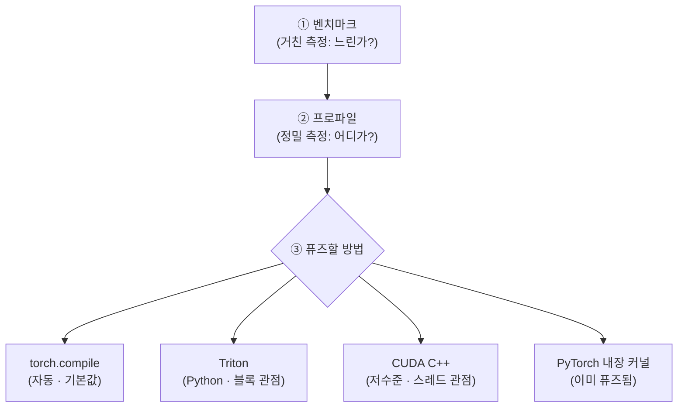
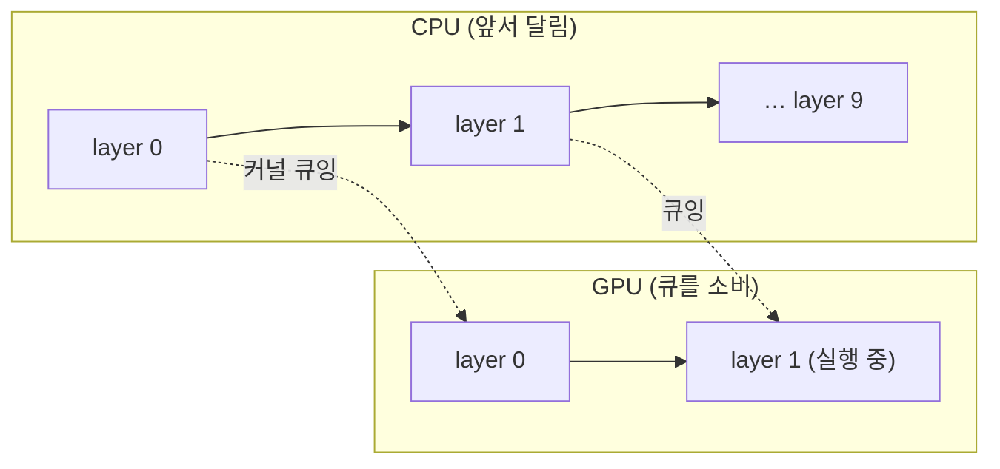

`CS336-LLM-From-Scratch` 시리즈의 6단계입니다. 전체 지도는 [CS336 커리큘럼](/2026/06/26/cs336-llm-from-scratch-curriculum.html)에서 볼 수 있습니다. ([5강 — GPU](/2026/06/26/cs336-lecture-5-gpus.html)에서 이어집니다.)

5강이 "GPU가 *어떻게* 동작하나"였다면, 6강(Tatsunori Hashimoto)은 "그 위에서 *빠른 코드를 어떻게 짜나*"입니다. 실전 강의입니다 — 벤치마킹·프로파일링으로 병목을 찾고, GELU 커널을 다섯 가지 방식으로 써 보며 **커널 퓨전(kernel fusion)**의 효과를 직접 잽니다. 한 문장으로 요약하면 — **추측하지 말고 측정하라, 그리고 퓨즈하라.**

<figure class="post-figure post-figure--header">
<svg role="img" aria-label="같은 GELU 연산을 다섯 가지로 구현했을 때의 실행 시간을 비교한 가로 막대그래프. 맨 위 수동 PyTorch 막대는 8.1밀리초로 압도적으로 길며 '여러 커널(메모리 왕복)'이라는 꼬리표가 붙어 있다. 아래 네 막대 — PyTorch 내장 1.1, torch.compile 1.47, CUDA C++ 1.8, Triton 1.85밀리초 — 는 모두 짧고 '단일 퓨즈드 커널'로 묶여 있다. 긴 막대와 짧은 막대의 차이가 곧 커널 퓨전의 이득임을 한눈에 보여 준다." viewBox="0 0 760 340" xmlns="http://www.w3.org/2000/svg">
  <title>GELU 다섯 가지 — 수동 PyTorch(8.1 ms, 여러 커널) ≫ 단일 퓨즈드 커널(1.1~1.85 ms)</title>

  <!-- 차트 틀 -->
  <rect x="20" y="18" width="720" height="304" rx="6" fill="none" stroke="currentColor" stroke-width="2" opacity="0.45"/>
  <text x="40" y="42" font-size="13" font-weight="700" fill="currentColor">GELU 다섯 가지 — 실행 시간 (낮을수록 빠름)</text>

  <!-- 기준 세로축 -->
  <line x1="176" y1="58" x2="176" y2="298" stroke="currentColor" stroke-width="2" opacity="0.55"/>

  <!-- 시간 눈금 (x: 176 = 0 ms, 700 = 8.4 ms → 62.4 px/ms) -->
  <g font-size="9.5" fill="currentColor" opacity="0.5" text-anchor="middle">
    <line x1="301" y1="58" x2="301" y2="298" stroke="currentColor" stroke-width="1" stroke-dasharray="2 5" opacity="0.45"/>
    <text x="301" y="314">2 ms</text>
    <line x1="425" y1="58" x2="425" y2="298" stroke="currentColor" stroke-width="1" stroke-dasharray="2 5" opacity="0.45"/>
    <text x="425" y="314">4 ms</text>
    <line x1="550" y1="58" x2="550" y2="298" stroke="currentColor" stroke-width="1" stroke-dasharray="2 5" opacity="0.45"/>
    <text x="550" y="314">6 ms</text>
    <line x1="675" y1="58" x2="675" y2="298" stroke="currentColor" stroke-width="1" stroke-dasharray="2 5" opacity="0.45"/>
    <text x="675" y="314">8 ms</text>
  </g>

  <!-- 막대들 (y: 행 높이 44, 막대 두께 24) -->
  <!-- ① 수동 PyTorch — 8.1 ms (긴 막대, 강조색) -->
  <text x="168" y="80" font-size="11.5" font-weight="700" fill="currentColor" text-anchor="end">수동 PyTorch</text>
  <rect x="176" y="68" width="505" height="24" rx="3" fill="var(--accent-color)" opacity="0.85"/>
  <text x="671" y="84" font-size="12" font-weight="700" fill="var(--bg-panel)" text-anchor="end">8.1 ms</text>

  <!-- ② PyTorch 내장 — 1.1 ms -->
  <text x="168" y="126" font-size="11.5" font-weight="700" fill="currentColor" text-anchor="end">PyTorch 내장</text>
  <rect x="176" y="114" width="69" height="24" rx="3" fill="var(--secondary-color)" opacity="0.9"/>
  <text x="253" y="130" font-size="11.5" font-weight="700" fill="var(--secondary-color)" text-anchor="start">1.1 ms</text>

  <!-- ③ torch.compile — 1.47 ms -->
  <text x="168" y="172" font-size="11.5" font-weight="700" fill="currentColor" text-anchor="end">torch.compile</text>
  <rect x="176" y="160" width="92" height="24" rx="3" fill="var(--secondary-color)" opacity="0.9"/>
  <text x="276" y="176" font-size="11.5" font-weight="700" fill="var(--secondary-color)" text-anchor="start">1.47 ms</text>

  <!-- ④ CUDA C++ — 1.8 ms -->
  <text x="168" y="218" font-size="11.5" font-weight="700" fill="currentColor" text-anchor="end">CUDA C++</text>
  <rect x="176" y="206" width="112" height="24" rx="3" fill="var(--secondary-color)" opacity="0.9"/>
  <text x="296" y="222" font-size="11.5" font-weight="700" fill="var(--secondary-color)" text-anchor="start">1.8 ms</text>

  <!-- ⑤ Triton — 1.85 ms -->
  <text x="168" y="264" font-size="11.5" font-weight="700" fill="currentColor" text-anchor="end">Triton</text>
  <rect x="176" y="252" width="115" height="24" rx="3" fill="var(--secondary-color)" opacity="0.9"/>
  <text x="299" y="268" font-size="11.5" font-weight="700" fill="var(--secondary-color)" text-anchor="start">1.85 ms</text>

  <!-- 그룹 라벨: 여러 커널 vs 단일 퓨즈드 -->
  <g>
    <rect x="430" y="62" width="160" height="22" rx="4" fill="var(--bg-panel)" stroke="var(--accent-color)" stroke-width="1.6"/>
    <text x="510" y="77" font-size="11" font-weight="700" fill="var(--accent-color)" text-anchor="middle">여러 커널 · 메모리 왕복</text>
  </g>
  <g stroke="var(--gold)" stroke-width="2" fill="none">
    <line x1="330" y1="108" x2="330" y2="280" stroke-dasharray="3 4"/>
    <path d="M324 116 L330 106 L336 116" stroke-linejoin="round"/>
    <path d="M324 272 L330 282 L336 272" stroke-linejoin="round"/>
  </g>
  <g>
    <rect x="356" y="183" width="170" height="22" rx="4" fill="var(--bg-panel)" stroke="var(--gold)" stroke-width="2"/>
    <text x="441" y="198" font-size="11.5" font-weight="700" fill="var(--primary-color)" text-anchor="middle">단일 퓨즈드 커널</text>
  </g>
</svg>
<figcaption>이 글의 척추: 같은 GELU를 다섯 가지로 구현하면, <strong>수동 PyTorch만 8.1 ms</strong>로 압도적으로 느리다 &mdash; 곱·tanh·덧셈이 제각각 <strong>별도 커널</strong>이라 매번 글로벌 메모리를 왕복하기 때문. 나머지 넷(내장 1.1 · torch.compile 1.47 · CUDA C++ 1.8 · Triton 1.85 ms)은 모두 <strong>단일 퓨즈드 커널</strong>이라 빠르다. 승부를 가르는 건 언어가 아니라 <strong>커널 퓨전</strong>이다.</figcaption>
</figure>

## 한눈에 보기

성능 작업의 흐름은 단순합니다. 거친 도구(벤치마크)로 "느리다"를 확인하고, 정밀한 도구(프로파일러)로 "어디가 느린지"를 찾은 뒤, 그 지점을 **퓨즈**합니다. 퓨전을 구현하는 길은 넷 — 그 트레이드오프가 이 글의 핵심입니다.



핵심 교훈은 처음부터 하나입니다 — **"여기가 병목일 것 같아"라며 세 시간 최적화하지 말 것.** 프로파일러를 켜면 실제 병목이 보이고, 거기에 노력을 쏟으면 됩니다.

## 먼저 측정하라: 벤치마킹

벤치마킹은 함수의 **벽시계 시간(wall-clock time)**을 재는 일입니다. 그런데 GPU에선 두 가지를 빠뜨리면 엉터리 숫자(예: 거대한 행렬곱이 "즉시" 끝남)가 나옵니다.

```python
def benchmark(run, warmup=3, trials=10):
    for _ in range(warmup):       # ① 워밍업: 첫 실행의 컴파일·초기화를 측정에서 제외
        run()
    torch.cuda.synchronize()      # ② CPU/GPU 상태 맞추기 (둘은 비동기로 따로 돈다)
    times = []
    for _ in range(trials):
        t0 = time.time()
        run()
        torch.cuda.synchronize()  # GPU가 끝날 때까지 기다린 뒤에 시간 기록
        times.append(time.time() - t0)
    return sum(times) / len(times)  # 여러 번 재서 평균(발열 등 변동 흡수)
```

- **워밍업(warm-up).** PyTorch 코드를 처음 실행하면 그 자리에서 머신 코드를 컴파일하고 초기화합니다. 그 시작 비용이 아니라 **정상 상태(steady state)** 속도를 재야 합니다.
- **`torch.cuda.synchronize()`.** CPU와 GPU는 **독립적인** 연산 장치라 따로 돕니다. CPU가 CUDA 커널을 GPU에 던져 놓고는 기다리지 않고 앞서 달려갑니다. 동기화하지 않으면 GPU 실행 시간을 **재지 못합니다.**

행렬곱은 크기에 슈퍼리니어(super-linear)로 느려지지만, 작은 크기에선 커널 런치·CPU→GPU 전송 같은 **상수 오버헤드** 때문에 시간이 잘 안 줄어듭니다.

## 어디가 느린가: 프로파일링

벤치마크는 "느리다"만 알려줄 뿐, **어디서** 시간을 쓰는지는 모릅니다. 그건 프로파일러의 몫입니다. PyTorch에서 `a + b` 한 줄을 호출해도, 빙산 아래에는 이런 일들이 벌어집니다.

```text
a + b  (Python)
 └─ ATen 래퍼 (C++ 인터페이스)
     └─ vectorized_elementwise_kernel  ← 실제 덧셈 (GPU)
     └─ cudaLaunchKernel               ← CPU가 명령을 GPU로 전송
     └─ cudaDeviceSynchronize          ← GPU 완료를 기다림
```

행렬곱은 CUTLASS/cuBLAS의 특정 **타일 크기** 커널로 디스패치되고, 크기마다 다른 커널이 불립니다(그래서 `torch.compile`이 마이크로벤치마크로 최적 커널을 골라 ~10%를 공짜로 줍니다). `cdist`처럼 복합 연산은 `mm`(78%)·`pow`·`sum`으로 분해돼, 어디를 최적화할지 한눈에 보입니다.

### CPU와 GPU는 따로 논다

NVIDIA **Nsight Systems** 같은 본격 프로파일러로 보면, CPU와 GPU가 별개의 타임라인으로 돕니다. CPU는 커널을 GPU 큐에 **던져 놓고 앞서 달려갑니다** — GPU가 1층을 돌 때 CPU는 이미 9층을 큐에 넣고 있습니다(큐 깊이까지).



이 비동기성 덕분에 **Python의 느림이 병목이 안 됩니다** — CPU는 그저 커널을 큐에 넣으면 되니까요. 단, `print(loss)`처럼 **GPU 결과를 CPU가 기다려야 하는** 코드를 끼우면 동기화가 강제돼, 심하면 CPU 병목이 생깁니다. 프로파일러 없이는 보이지 않는 함정입니다.

## 커널 퓨전: GELU를 다섯 가지로

이제 핵심입니다. 5강의 **퓨전**(데이터를 글로벌 메모리로 왕복시키지 않고 연산 유닛에 둔 채 처리)을 GELU로 실험합니다. 같은 GELU를 다섯 가지로 구현해 큰 입력에서 시간을 잽니다.

<figure class="post-figure">
<svg role="img" aria-label="커널 퓨전의 정신 모델을 공장과 창고 비유로 그린 두 그림. 위쪽 '퓨전 안 됨' 그림에서는 데이터가 글로벌 메모리(창고)와 연산 유닛(공장) 사이를 연산마다 왕복한다 — 창고에서 곱셈 공장으로 갔다 창고로 돌아오고, 다시 tanh 공장으로 갔다 돌아오고, 또 덧셈 공장으로 가는 식으로 화살표가 여러 번 오간다. 아래쪽 '퓨전 됨' 그림에서는 데이터를 창고에서 공장으로 한 번만 싣고 가, 곱·tanh·덧셈을 공장 안에서 전부 끝낸 뒤 창고로 한 번만 돌려보낸다. 왕복 횟수의 차이가 속도 차이를 만든다." viewBox="0 0 760 392" xmlns="http://www.w3.org/2000/svg">
  <title>커널 퓨전 — 퓨전 안 됨(연산마다 메모리 왕복) 대 퓨전 됨(한 번 싣고, 다 처리하고, 한 번 내림)</title>

  <!-- ===== 위: 퓨전 안 됨 (NAIVE) ===== -->
  <text x="24" y="30" font-size="13" font-weight="700" fill="var(--accent-color)">퓨전 안 됨 — 연산마다 메모리를 왕복</text>

  <!-- 글로벌 메모리(창고) 띠 -->
  <rect x="24" y="44" width="712" height="34" rx="5" fill="currentColor" opacity="0.08"/>
  <rect x="24" y="44" width="712" height="34" rx="5" fill="none" stroke="currentColor" stroke-width="1.6" opacity="0.6"/>
  <text x="36" y="65" font-size="11" font-weight="700" fill="currentColor" opacity="0.85">글로벌 메모리 (창고 · 느림)</text>

  <!-- 연산 유닛(공장) 3칸 -->
  <g font-size="11" font-weight="700" text-anchor="middle">
    <rect x="120" y="128" width="130" height="40" rx="5" fill="var(--bg-panel)" stroke="var(--accent-color)" stroke-width="2"/>
    <text x="185" y="147" fill="var(--primary-color)">곱셈 공장</text>
    <text x="185" y="162" font-size="9.5" fill="currentColor" opacity="0.7">x·x·x …</text>

    <rect x="315" y="128" width="130" height="40" rx="5" fill="var(--bg-panel)" stroke="var(--accent-color)" stroke-width="2"/>
    <text x="380" y="147" fill="var(--primary-color)">tanh 공장</text>
    <text x="380" y="162" font-size="9.5" fill="currentColor" opacity="0.7">tanh(…)</text>

    <rect x="510" y="128" width="130" height="40" rx="5" fill="var(--bg-panel)" stroke="var(--accent-color)" stroke-width="2"/>
    <text x="575" y="147" fill="var(--primary-color)">덧셈 공장</text>
    <text x="575" y="162" font-size="9.5" fill="currentColor" opacity="0.7">0.5·x·(1+…)</text>
  </g>

  <!-- 왕복 화살표 (내려갔다 올라오기 ×3) -->
  <g stroke="var(--accent-color)" stroke-width="2" fill="var(--accent-color)">
    <!-- 창고→곱셈 -->
    <line x1="155" y1="78" x2="155" y2="126" stroke-dasharray="0"/>
    <path d="M150 118 L155 128 L160 118 Z"/>
    <!-- 곱셈→창고 -->
    <line x1="215" y1="126" x2="215" y2="80"/>
    <path d="M210 88 L215 78 L220 88 Z"/>
    <!-- 창고→tanh -->
    <line x1="350" y1="78" x2="350" y2="126"/>
    <path d="M345 118 L350 128 L355 118 Z"/>
    <!-- tanh→창고 -->
    <line x1="410" y1="126" x2="410" y2="80"/>
    <path d="M405 88 L410 78 L415 88 Z"/>
    <!-- 창고→덧셈 -->
    <line x1="545" y1="78" x2="545" y2="126"/>
    <path d="M540 118 L545 128 L550 118 Z"/>
    <!-- 덧셈→창고 -->
    <line x1="605" y1="126" x2="605" y2="80"/>
    <path d="M600 88 L605 78 L610 88 Z"/>
  </g>
  <text x="700" y="105" font-size="11" font-weight="700" fill="var(--accent-color)" text-anchor="end">왕복 ×3 (느림)</text>

  <!-- 구분선 -->
  <line x1="24" y1="202" x2="736" y2="202" stroke="currentColor" stroke-width="1" opacity="0.25" stroke-dasharray="3 6"/>

  <!-- ===== 아래: 퓨전 됨 (FUSED) ===== -->
  <text x="24" y="232" font-size="13" font-weight="700" fill="var(--secondary-color)">퓨전 됨 — 한 번 싣고, 공장 안에서 다 처리하고, 한 번 내림</text>

  <!-- 글로벌 메모리(창고) 띠 -->
  <rect x="24" y="246" width="712" height="34" rx="5" fill="currentColor" opacity="0.08"/>
  <rect x="24" y="246" width="712" height="34" rx="5" fill="none" stroke="currentColor" stroke-width="1.6" opacity="0.6"/>
  <text x="36" y="267" font-size="11" font-weight="700" fill="currentColor" opacity="0.85">글로벌 메모리 (창고 · 느림)</text>

  <!-- 단일 퓨즈드 공장 -->
  <rect x="190" y="324" width="380" height="48" rx="6" fill="var(--bg-panel)" stroke="var(--secondary-color)" stroke-width="2.5"/>
  <text x="380" y="345" font-size="12" font-weight="700" fill="var(--secondary-color)" text-anchor="middle">단일 퓨즈드 공장</text>
  <text x="380" y="362" font-size="10" fill="currentColor" opacity="0.78" text-anchor="middle">곱 → tanh → 덧셈을 한 자리에서 전부</text>

  <!-- 한 번 싣고 / 한 번 내림 -->
  <g stroke="var(--secondary-color)" stroke-width="2.5" fill="var(--secondary-color)">
    <!-- 창고→공장 (load once) -->
    <line x1="300" y1="280" x2="300" y2="322"/>
    <path d="M294 314 L300 324 L306 314 Z"/>
    <!-- 공장→창고 (store once) -->
    <line x1="460" y1="322" x2="460" y2="282"/>
    <path d="M454 290 L460 280 L466 290 Z"/>
  </g>
  <text x="252" y="306" font-size="9.5" font-weight="700" fill="var(--secondary-color)" text-anchor="end">한 번 싣기</text>
  <text x="508" y="306" font-size="9.5" font-weight="700" fill="var(--secondary-color)" text-anchor="start">한 번 내리기</text>
  <text x="700" y="307" font-size="11" font-weight="700" fill="var(--secondary-color)" text-anchor="end">왕복 ×1 (빠름)</text>
</svg>
<figcaption>Horace He의 정신 모델: 글로벌 메모리는 <strong>창고</strong>, 연산 유닛은 <strong>공장</strong>이다. 퓨전이 안 되면(수동 PyTorch) 곱·tanh·덧셈마다 데이터를 창고와 공장 사이로 <strong>왕복</strong>시켜 느리고, 퓨전이 되면 <strong>한 번 싣고</strong> 공장 안에서 전부 처리한 뒤 <strong>한 번만 내려</strong> 메모리 왕복을 없앤다. GELU의 8.1 ms와 ~1.1 ms를 가르는 건 이 왕복 횟수다.</figcaption>
</figure>

| 구현 | 시간 | GPU 커널 |
| --- | --- | --- |
| **수동 PyTorch** (`0.5*x*(1+tanh(...))`) | **8.1 ms** | 여러 개 (곱 ×3·tanh·add…) |
| **PyTorch 내장** (`F.gelu`) | **1.1 ms** | 단일 퓨즈드 |
| **CUDA C++** (직접 작성) | **1.8 ms** | 단일 |
| **Triton** (직접 작성) | **1.85 ms** | 단일 |
| **torch.compile** | **1.47 ms** | 단일 (Triton 자동 생성) |

수동 PyTorch가 8배 느린 이유는 명확합니다 — `x³`, `tanh`, 상수곱 하나하나가 **별도 CUDA 커널**이라, 매번 글로벌 메모리를 왕복합니다. 나머지는 모두 **단일 퓨즈드 커널**이라 빠릅니다.

### CUDA C++: 스레드 관점

가장 저수준. 각 스레드가 원소 하나를 맡고, 자기 전역 좌표를 직접 계산합니다.

```cpp
// 커널(GPU): 각 스레드가 원소 하나를 처리
__global__ void gelu_kernel(const float* in, float* out, int n) {
    int i = blockIdx.x * blockDim.x + threadIdx.x;  // 블록 시작 + 블록 내 오프셋 = 전역 좌표
    if (i < n) {                                     // 경계 검사 (마지막 블록의 초과 스레드 보호)
        float x = in[i];
        out[i] = 0.5f * x * (1.0f + tanhf(0.7978845608f * (x + 0.044715f * x*x*x)));
    }
}
// 래퍼(CPU): x가 CUDA 텐서·contiguous인지 assert → empty_like로 y 할당
//   → grid = ceil(n / block_size) → gelu_kernel<<<grid, block_size>>>(x, y, n)
```

`__global__`이 CUDA 커널임을 표시합니다. 래퍼는 입력이 **연속(contiguous) 메모리**인지 확인하고(인덱싱 산술이 그걸 전제), 출력은 `zeros`가 아니라 `empty_like`로 잡아(어차피 덮어쓰니) 한 번의 초기화를 아낍니다. 결과는 8.1 → **1.8 ms** — C 코드가 그리 어렵지 않은데도 큰 이득입니다.

### Triton: 블록 관점

매번 C++로 내려가는 건 번거롭습니다. **Triton**(OpenAI, 2021)은 GPU 프로그래밍을 Python으로 끌어올립니다. 핵심 차이 — **스레드가 아니라 블록 관점**으로 짜고, 코얼레싱·공유 메모리·스레드 관리를 **Triton이 자동 처리**합니다(SM 간 스케줄링만 수동).

```python
import triton
import triton.language as tl

@triton.jit
def gelu_kernel(x_ptr, y_ptr, n, BLOCK: tl.constexpr):
    pid = tl.program_id(0)                        # 스레드가 아니라 '블록' id
    offsets = pid * BLOCK + tl.arange(0, BLOCK)   # 좌표가 단일 값이 아니라 '벡터'다
    mask = offsets < n                            # 경계 밖 원소 마스킹
    x = tl.load(x_ptr + offsets, mask=mask)       # 코얼레싱은 Triton이 알아서
    y = 0.5 * x * (1 + tl.math.tanh(0.7978845608 * (x + 0.044715 * x*x*x)))
    tl.store(y_ptr + offsets, y, mask=mask)
```

스레드별 오프셋이 아니라 **오프셋 벡터**(`block_start + arange(BLOCK)`)로 블록 전체를 한 번에 다룹니다. CUDA와 거의 같은 속도(**1.85 ms**)지만 Python으로 짜고 디버깅하기 훨씬 쉽고, 컴파일된 **PTX**(거의 기계어)를 들여다보면 각 스레드가 `ld.global`로 **4개 값을 한 번에** 읽는(코얼레싱) 모습이 보입니다.

### torch.compile: 그냥 맡기기

대부분의 경우 직접 커널을 쓸 필요조차 없습니다. `torch.compile`은 평범한 PyTorch 코드를 받아 **자동으로 퓨전**합니다 — 내부적으로 Triton을 생성하며, 우리가 손으로 짠 것보다 살짝 더 최적화돼 **1.47 ms**가 나옵니다.

## 리덕션: Triton softmax

지금까지는 원소별(elementwise) 연산이라 쉬웠습니다. **softmax**는 행 전체를 더하는 **리덕션(reduction)**이 들어갑니다. 영리한 블록 설계 — **블록 하나 = 행 하나**(grid = 행 수, block_size = 열 수의 다음 2의 거듭제곱). 한 행이 SM에 통째로 들어가면, SM 안에서 행을 더하고 나누면 끝입니다.

```python
@triton.jit
def softmax_kernel(x_ptr, y_ptr, n_cols, stride, BLOCK: tl.constexpr):
    row = tl.program_id(0)                         # 블록 하나 = 행 하나
    cols = tl.arange(0, BLOCK)
    mask = cols < n_cols
    x = tl.load(x_ptr + row * stride + cols, mask=mask, other=-float("inf"))
    x = x - tl.max(x, axis=0)                      # 수치 안정
    e = tl.exp(x)
    y = e / tl.sum(e, axis=0)                       # 행 정규화
    tl.store(y_ptr + row * stride + cols, y, mask=mask)
```

연산이 SM에 깔끔히 들어가면, Triton 코드는 보통의 Python처럼 보입니다 — 약간의 `load`/`store`와 블록 좌표 계산만 더해질 뿐입니다.

## 언제 무엇을 쓰나

- **기본값은 `torch.compile`.** 현대 JIT 컴파일러는 연산자 퓨전과 행렬곱 최적화(모양을 알면 최적 커널 선택)를 아주 잘합니다. 웬만하면 이걸 넘기 어렵습니다.
- **Triton은 비자명한 부분에.** 컴파일러가 못 찾는 최적화 — 예컨대 **Flash Attention**(2·3) 같은 — 이 필요할 때 꺼냅니다. 모델의 모든 부분에 CUDA 커널을 짜는 건 시간 낭비입니다.
- **CUDA C++는 최후의 수단.** Triton이 못 주는 하드웨어 수준 제어(예: H100 전용 Flash Attention 3 최적화)가 필요할 때.

## 성능·복잡도 노트

- **측정이 1순위.** "여기가 병목 같다"는 직관은 자주 틀립니다. 벤치마크(거친)와 프로파일러(정밀)로 실제 병목을 찾고 거기에만 노력을 쏟으세요.
- **퓨전이 핵심 무기.** 여러 작은 연산을 한 커널로 합쳐 글로벌 메모리 왕복을 없애는 것 — GELU에서 8.1 ms → ~1.1–1.85 ms.
- **벤치마킹 함정 둘.** 워밍업과 `cuda.synchronize`를 빠뜨리면 숫자가 거짓말을 합니다.
- **CPU/GPU 비동기.** CPU가 커널을 큐에 넣고 앞서 달리는 덕에 Python이 병목이 안 됩니다. 단 `print(loss)` 류의 동기화는 그 이점을 깹니다.

## 요약

- 6강은 **GPU 코드를 빠르게 만드는 실전** — 측정하고, 퓨즈하라.
- **벤치마킹**: 벽시계 시간. **워밍업** + **`torch.cuda.synchronize()`** 필수(CPU/GPU는 비동기).
- **프로파일링**: 빙산 아래(ATen → 커널 → 런치 → 싱크)를 본다. Nsight로 CPU가 GPU보다 앞서 달리는 모습까지. `print(loss)`는 동기화를 강제.
- **GELU 다섯 가지**: 수동 PyTorch(8.1 ms) ≫ 내장·CUDA·Triton·torch.compile(~1.1–1.85 ms). 차이는 **커널 퓨전**.
- **Triton**: Python으로, **블록 관점**, 코얼레싱·공유 메모리 자동. 리덕션(softmax)은 블록=행으로.
- **선택**: 기본 `torch.compile` → 비자명하면 Triton(Flash Attention) → 최후에 CUDA C++.

### 다음 학습 (Next Learning)

- **7단계: 병렬화 1 — 데이터 병렬** — 한 GPU를 넘어 여러 장치로, 집합 통신과 ZeRO/FSDP (상세 포스트 작성 예정)
- [CS336 5강 — GPU: 병목은 연산이 아니라 메모리다](/2026/06/26/cs336-lecture-5-gpus.html) — 퓨전·타일링·Flash Attention의 토대
- [CS336 커리큘럼](/2026/06/26/cs336-llm-from-scratch-curriculum.html) — 전체 17단계 지도와 진행 현황
