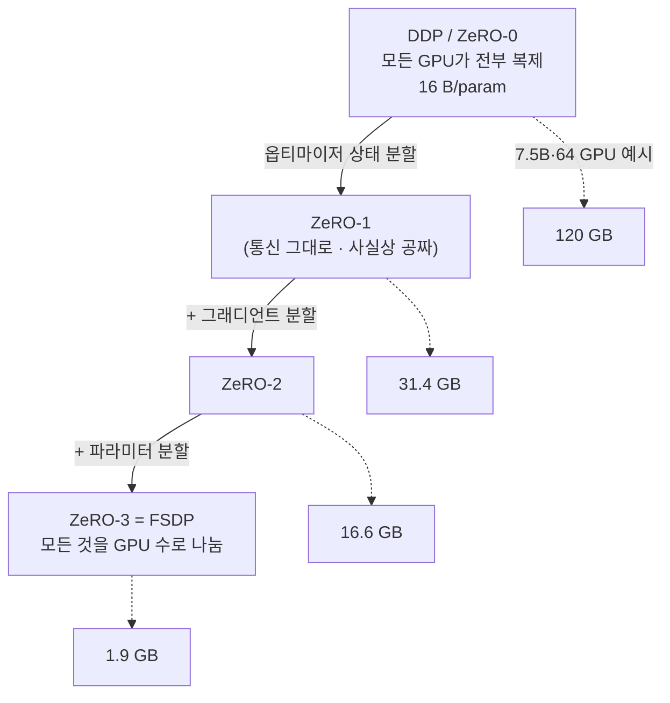

`CS336-LLM-From-Scratch` 시리즈의 7단계입니다. 전체 지도는 [CS336 커리큘럼](/2026/06/26/cs336-llm-from-scratch-curriculum.html)에서 볼 수 있습니다. ([6강 — 커널과 Triton](/2026/06/26/cs336-lecture-6-kernels-triton.html)에서 이어집니다.)

지금까지는 GPU **한 장**을 짜내는 이야기였습니다. 7강(Tatsunori Hashimoto)부터는 **여러 대**로 넘어갑니다. 큰 모델은 한 GPU에 안 들어가고(메모리), 빨리 학습하려면 여러 서버를 동시에 써야 하니까(연산) — 이제 연산 단위는 GPU가 아니라 **데이터센터**입니다. 이 강의는 병렬화 전체(데이터·모델·활성화)를 다루지만, 이 글은 **데이터 병렬 계열**(집합 통신 → 데이터 병렬 → ZeRO/FSDP)에 집중합니다. **텐서·파이프라인 병렬은 [8강](/2026/06/26/cs336-lecture-8-parallelism-2-tensor-pipeline.html)**에서 이어집니다.

<figure class="post-figure post-figure--header">
<svg role="img" aria-label="파라미터당 16바이트 메모리 스택을 여러 GPU로 분할하는 그림. 왼쪽 한 GPU는 파라미터 2·그래디언트 2·마스터 4·Adam m 4·Adam v 4 = 16바이트 전부를 들고 있고, 옵티마이저 상태(12바이트)가 대부분을 차지한다. 오른쪽 ZeRO/FSDP는 같은 스택을 N개 GPU로 쪼개 GPU마다 16/N 바이트만 남긴다." viewBox="0 0 640 360" xmlns="http://www.w3.org/2000/svg">
  <title>16 B/param 메모리 스택을 GPU 수로 분할하는 ZeRO/FSDP</title>
  <defs>
    <marker id="hdr-arrow" markerWidth="10" markerHeight="10" refX="7" refY="4" orient="auto">
      <path d="M0,0 L8,4 L0,8 Z" fill="var(--gold)"/>
    </marker>
  </defs>

  <!-- ===== LEFT: one GPU holds the full 16 B/param stack ===== -->
  <text x="120" y="34" text-anchor="middle" font-size="15" font-weight="700" fill="currentColor">GPU 1대 = 16 B/param</text>

  <!-- GPU plate -->
  <rect x="44" y="50" width="152" height="276" rx="6" fill="var(--bg-light)" stroke="var(--border-color)" stroke-width="2"/>

  <!-- stack: params 2 -->
  <rect x="60" y="62" width="120" height="26" rx="3" fill="none" stroke="currentColor" stroke-width="1.6"/>
  <text x="120" y="79" text-anchor="middle" font-size="11.5" fill="currentColor">params · 2</text>
  <!-- grads 2 -->
  <rect x="60" y="92" width="120" height="26" rx="3" fill="none" stroke="currentColor" stroke-width="1.6"/>
  <text x="120" y="109" text-anchor="middle" font-size="11.5" fill="currentColor">grads · 2</text>

  <!-- optimizer state bracket (12 B, dominates) -->
  <rect x="60" y="124" width="120" height="190" rx="4" fill="var(--accent-color)" opacity="0.16" stroke="var(--accent-color)" stroke-width="1.6"/>
  <rect x="60" y="130" width="120" height="56" rx="3" fill="none" stroke="var(--accent-color)" stroke-width="1.4"/>
  <text x="120" y="162" text-anchor="middle" font-size="11.5" fill="currentColor">master · 4</text>
  <rect x="60" y="192" width="120" height="56" rx="3" fill="none" stroke="var(--accent-color)" stroke-width="1.4"/>
  <text x="120" y="224" text-anchor="middle" font-size="11.5" fill="currentColor">Adam m · 4</text>
  <rect x="60" y="254" width="120" height="56" rx="3" fill="none" stroke="var(--accent-color)" stroke-width="1.4"/>
  <text x="120" y="286" text-anchor="middle" font-size="11.5" fill="currentColor">Adam v · 4</text>

  <!-- optimizer-state label -->
  <text x="120" y="346" text-anchor="middle" font-size="11" font-weight="700" fill="var(--accent-color)">옵티마이저 상태 12 B (대부분)</text>

  <!-- ===== ARROW: ZeRO / FSDP shards it ===== -->
  <line x1="208" y1="188" x2="268" y2="188" stroke="var(--gold)" stroke-width="2.4" marker-end="url(#hdr-arrow)"/>
  <text x="238" y="176" text-anchor="middle" font-size="12" font-weight="700" fill="var(--gold)">ZeRO</text>
  <text x="238" y="208" text-anchor="middle" font-size="11" fill="var(--text-light)">/ FSDP</text>

  <!-- ===== RIGHT: stack split across N GPUs → 16/N each ===== -->
  <text x="468" y="34" text-anchor="middle" font-size="15" font-weight="700" fill="currentColor">N대로 분할 = 16/N each</text>

  <!-- four GPU slices, each holding one shard of the stack -->
  <g font-size="9.5" fill="currentColor">
    <!-- GPU A -->
    <rect x="300" y="58" width="68" height="252" rx="5" fill="var(--bg-light)" stroke="var(--border-color)" stroke-width="1.6"/>
    <rect x="308" y="120" width="52" height="40" rx="3" fill="var(--secondary-color)" opacity="0.22" stroke="var(--secondary-color)" stroke-width="1.3"/>
    <text x="334" y="144" text-anchor="middle">shard A</text>
    <text x="334" y="324" text-anchor="middle" font-size="9.5" fill="var(--text-light)">GPU 1</text>

    <!-- GPU B -->
    <rect x="376" y="58" width="68" height="252" rx="5" fill="var(--bg-light)" stroke="var(--border-color)" stroke-width="1.6"/>
    <rect x="384" y="172" width="52" height="40" rx="3" fill="var(--secondary-color)" opacity="0.22" stroke="var(--secondary-color)" stroke-width="1.3"/>
    <text x="410" y="196" text-anchor="middle">shard B</text>
    <text x="410" y="324" text-anchor="middle" font-size="9.5" fill="var(--text-light)">GPU 2</text>

    <!-- GPU C -->
    <rect x="452" y="58" width="68" height="252" rx="5" fill="var(--bg-light)" stroke="var(--border-color)" stroke-width="1.6"/>
    <rect x="460" y="224" width="52" height="40" rx="3" fill="var(--secondary-color)" opacity="0.22" stroke="var(--secondary-color)" stroke-width="1.3"/>
    <text x="486" y="248" text-anchor="middle">shard C</text>
    <text x="486" y="324" text-anchor="middle" font-size="9.5" fill="var(--text-light)">GPU 3</text>

    <!-- GPU D -->
    <rect x="528" y="58" width="68" height="252" rx="5" fill="var(--bg-light)" stroke="var(--border-color)" stroke-width="1.6"/>
    <rect x="536" y="68" width="52" height="40" rx="3" fill="var(--secondary-color)" opacity="0.22" stroke="var(--secondary-color)" stroke-width="1.3"/>
    <text x="562" y="92" text-anchor="middle">shard D</text>
    <text x="562" y="324" text-anchor="middle" font-size="9.5" fill="var(--text-light)">GPU 4</text>
  </g>

  <text x="448" y="346" text-anchor="middle" font-size="11" font-weight="700" fill="var(--secondary-color)">중복 제거 — 각 GPU는 1/N만 보관</text>
</svg>
<figcaption>데이터 병렬은 16 B/param 스택(파라미터 2 · 그래디언트 2 · 옵티마이저 상태 12)을 모든 GPU에 통째로 복제한다. ZeRO/FSDP는 같은 스택을 N개 GPU로 쪼개 GPU마다 16/N 바이트만 남긴다 — 이 글의 핵심 긴장.</figcaption>
</figure>

## 한눈에 보기

데이터 병렬의 발목을 잡는 건 **메모리**입니다. 모든 GPU가 파라미터·그래디언트·옵티마이저 상태를 통째로 복제하니 — 파라미터당 **16바이트**가 GPU마다 그대로 반복됩니다. **ZeRO**는 이 중복을 단계적으로 걷어내, 같은 통신량으로 메모리를 GPU 수만큼 나눕니다.



목표는 둘 — **선형 메모리 스케일링**(GPU를 늘리면 더 큰 모델)과 **선형 연산 스케일링**(GPU를 늘리면 더 빠르게). 그리고 이 알고리즘들의 성능은 결국 **집합 통신을 몇 번 부르나**로 따집니다.

## 왜 여러 대인가

두 자원이 한 GPU의 한계를 만듭니다.

- **연산.** 가장 빠른 슈퍼컴퓨터는 엑사플롭스 단위입니다. 지금 당장 강력한 모델을 학습하려면 GPU 곡선이 몇 년 더 오르길 기다릴 수 없으니, **다기계 병렬**에 기댑니다.
- **메모리.** 수십억 파라미터는 한 GPU에 안 들어갑니다. GPU 메모리도 늘지만 모델만큼 빠르진 않습니다.

## 네트워킹 계층

병렬화 전략은 **하드웨어 통신 계층**에서 출발합니다. 한 노드(서버) 안의 8개 GPU는 **NVLink/NVSwitch**로 아주 빠르게 연결됩니다. 하지만 다른 노드의 GPU와 통신하려면 **InfiniBand** 스위치를 거치는데, 레인당 약 **8배 느립니다.** 또 약 **256 GPU**까지는 all-to-all로 빠르게 통신되지만, 그 너머는 leaf·spine 스위치로 더 느려집니다. 이 위계가 "무엇을 어디에 병렬화할지"를 결정합니다.

## 집합 통신 (collective communication)

병렬 알고리즘은 몇 가지 **집합 통신 프리미티브**로 조립됩니다.

| 연산 | 하는 일 | 대략 비용 |
| --- | --- | --- |
| **all-reduce** | 모두의 값을 합쳐 모두에게 복사 | ~2× 데이터 |
| **broadcast** | 한 랭크 → 모두 | ~1× |
| **reduce** | 모두 → 합쳐서 한 랭크 | ~1× |
| **all-gather** | 각 랭크의 조각을 모두에게 | ~1× |
| **reduce-scatter** | 합치되 각 조각을 한 랭크씩에게(부분 all-reduce) | ~1× |

이 강의 전체를 관통하는 **핵심 항등식** 하나:

> **all-reduce = reduce-scatter + all-gather** (대역폭 비용이 같다)

데이터 병렬에서 그래디언트를 합치는 자연스러운 연산은 all-reduce지만, 이를 reduce-scatter와 all-gather **두 단계로 쪼개도 비용이 같습니다.** 그 사이에 약간의 계산을 끼워 넣을 수 있다는 점이 — 곧 보겠지만 — ZeRO의 마법입니다.

<figure class="post-figure">
<svg role="img" aria-label="all-reduce가 reduce-scatter와 all-gather 두 단계의 합과 같음을 보여주는 그림. 처음엔 4개 GPU가 각각 4개 조각의 부분 값을 갖는다. reduce-scatter 후에는 각 GPU가 한 조각의 완전한 합만 소유한다. all-gather 후에는 모든 GPU가 4개 조각의 완전한 합을 전부 갖는다 — 이는 한 번의 all-reduce 결과와 같다." viewBox="0 0 640 400" xmlns="http://www.w3.org/2000/svg">
  <title>all-reduce = reduce-scatter + all-gather</title>
  <defs>
    <marker id="id-arrow" markerWidth="11" markerHeight="11" refX="7" refY="4.5" orient="auto">
      <path d="M0,0 L9,4.5 L0,9 Z" fill="var(--gold)"/>
    </marker>
  </defs>

  <!-- shard color legend rows: 4 GPUs (columns), 4 shard slots (rows) per GPU -->
  <!-- ===== STAGE 0: start — each GPU has partial values for ALL shards ===== -->
  <text x="92" y="24" text-anchor="middle" font-size="12.5" font-weight="700" fill="currentColor">시작</text>
  <text x="92" y="40" text-anchor="middle" font-size="9.5" fill="var(--text-light)">각자 부분 값 전부</text>
  <g font-size="10" fill="currentColor" text-anchor="middle">
    <!-- 4 GPU columns -->
    <g>
      <rect x="20" y="50" width="34" height="120" rx="4" fill="var(--bg-light)" stroke="var(--border-color)" stroke-width="1.4"/>
      <rect x="44" y="50" width="34" height="120" rx="4" fill="var(--bg-light)" stroke="var(--border-color)" stroke-width="1.4"/>
      <rect x="68" y="50" width="34" height="120" rx="4" fill="var(--bg-light)" stroke="var(--border-color)" stroke-width="1.4"/>
      <rect x="92" y="50" width="34" height="120" rx="4" fill="var(--bg-light)" stroke="var(--border-color)" stroke-width="1.4"/>
    </g>
    <!-- each column: 4 faint partial shards -->
    <g opacity="0.42">
      <rect x="22" y="53" width="30" height="26" fill="var(--secondary-color)"/>
      <rect x="22" y="82" width="30" height="26" fill="var(--accent-color)"/>
      <rect x="22" y="111" width="30" height="26" fill="var(--gold)"/>
      <rect x="22" y="140" width="30" height="26" fill="var(--text-light)"/>
      <rect x="46" y="53" width="30" height="26" fill="var(--secondary-color)"/>
      <rect x="46" y="82" width="30" height="26" fill="var(--accent-color)"/>
      <rect x="46" y="111" width="30" height="26" fill="var(--gold)"/>
      <rect x="46" y="140" width="30" height="26" fill="var(--text-light)"/>
      <rect x="70" y="53" width="30" height="26" fill="var(--secondary-color)"/>
      <rect x="70" y="82" width="30" height="26" fill="var(--accent-color)"/>
      <rect x="70" y="111" width="30" height="26" fill="var(--gold)"/>
      <rect x="70" y="140" width="30" height="26" fill="var(--text-light)"/>
      <rect x="94" y="53" width="30" height="26" fill="var(--secondary-color)"/>
      <rect x="94" y="82" width="30" height="26" fill="var(--accent-color)"/>
      <rect x="94" y="111" width="30" height="26" fill="var(--gold)"/>
      <rect x="94" y="140" width="30" height="26" fill="var(--text-light)"/>
    </g>
    <text x="73" y="186" font-size="9.5" fill="var(--text-light)">G1  G2  G3  G4</text>
  </g>

  <!-- arrow: reduce-scatter -->
  <line x1="150" y1="110" x2="214" y2="110" stroke="var(--gold)" stroke-width="2.2" marker-end="url(#id-arrow)"/>
  <text x="182" y="100" text-anchor="middle" font-size="10.5" font-weight="700" fill="var(--gold)">reduce-</text>
  <text x="182" y="128" text-anchor="middle" font-size="10.5" font-weight="700" fill="var(--gold)">scatter</text>

  <!-- ===== STAGE 1: after reduce-scatter — each GPU OWNS the full sum of ONE shard ===== -->
  <text x="312" y="24" text-anchor="middle" font-size="12.5" font-weight="700" fill="currentColor">reduce-scatter 후</text>
  <text x="312" y="40" text-anchor="middle" font-size="9.5" fill="var(--text-light)">각자 한 조각의 완전한 합</text>
  <g font-size="10" fill="currentColor" text-anchor="middle">
    <rect x="240" y="50" width="34" height="120" rx="4" fill="var(--bg-light)" stroke="var(--border-color)" stroke-width="1.4"/>
    <rect x="264" y="50" width="34" height="120" rx="4" fill="var(--bg-light)" stroke="var(--border-color)" stroke-width="1.4"/>
    <rect x="288" y="50" width="34" height="120" rx="4" fill="var(--bg-light)" stroke="var(--border-color)" stroke-width="1.4"/>
    <rect x="312" y="50" width="34" height="120" rx="4" fill="var(--bg-light)" stroke="var(--border-color)" stroke-width="1.4"/>
    <!-- G1 owns shard1 (green), G2 owns shard2 (crimson), G3 gold, G4 grey — solid = full sum -->
    <rect x="242" y="53" width="30" height="26" fill="var(--secondary-color)"/>
    <rect x="266" y="82" width="30" height="26" fill="var(--accent-color)"/>
    <rect x="290" y="111" width="30" height="26" fill="var(--gold)"/>
    <rect x="314" y="140" width="30" height="26" fill="var(--text-light)"/>
    <text x="293" y="186" font-size="9.5" fill="var(--text-light)">G1  G2  G3  G4</text>
  </g>

  <!-- arrow: all-gather -->
  <line x1="370" y1="110" x2="434" y2="110" stroke="var(--gold)" stroke-width="2.2" marker-end="url(#id-arrow)"/>
  <text x="402" y="100" text-anchor="middle" font-size="10.5" font-weight="700" fill="var(--gold)">all-</text>
  <text x="402" y="128" text-anchor="middle" font-size="10.5" font-weight="700" fill="var(--gold)">gather</text>

  <!-- ===== STAGE 2: after all-gather — every GPU has the full sum of ALL shards ===== -->
  <text x="532" y="24" text-anchor="middle" font-size="12.5" font-weight="700" fill="currentColor">all-gather 후</text>
  <text x="532" y="40" text-anchor="middle" font-size="9.5" fill="var(--text-light)">모두가 완전한 합 전부</text>
  <g font-size="10" fill="currentColor" text-anchor="middle">
    <rect x="460" y="50" width="34" height="120" rx="4" fill="var(--bg-light)" stroke="var(--border-color)" stroke-width="1.4"/>
    <rect x="484" y="50" width="34" height="120" rx="4" fill="var(--bg-light)" stroke="var(--border-color)" stroke-width="1.4"/>
    <rect x="508" y="50" width="34" height="120" rx="4" fill="var(--bg-light)" stroke="var(--border-color)" stroke-width="1.4"/>
    <rect x="532" y="50" width="34" height="120" rx="4" fill="var(--bg-light)" stroke="var(--border-color)" stroke-width="1.4"/>
    <!-- every column: all 4 shards solid (full sum) -->
    <rect x="462" y="53" width="30" height="26" fill="var(--secondary-color)"/>
    <rect x="462" y="82" width="30" height="26" fill="var(--accent-color)"/>
    <rect x="462" y="111" width="30" height="26" fill="var(--gold)"/>
    <rect x="462" y="140" width="30" height="26" fill="var(--text-light)"/>
    <rect x="486" y="53" width="30" height="26" fill="var(--secondary-color)"/>
    <rect x="486" y="82" width="30" height="26" fill="var(--accent-color)"/>
    <rect x="486" y="111" width="30" height="26" fill="var(--gold)"/>
    <rect x="486" y="140" width="30" height="26" fill="var(--text-light)"/>
    <rect x="510" y="53" width="30" height="26" fill="var(--secondary-color)"/>
    <rect x="510" y="82" width="30" height="26" fill="var(--accent-color)"/>
    <rect x="510" y="111" width="30" height="26" fill="var(--gold)"/>
    <rect x="510" y="140" width="30" height="26" fill="var(--text-light)"/>
    <rect x="534" y="53" width="30" height="26" fill="var(--secondary-color)"/>
    <rect x="534" y="82" width="30" height="26" fill="var(--accent-color)"/>
    <rect x="534" y="111" width="30" height="26" fill="var(--gold)"/>
    <rect x="534" y="140" width="30" height="26" fill="var(--text-light)"/>
    <text x="513" y="186" font-size="9.5" fill="var(--text-light)">G1  G2  G3  G4</text>
  </g>

  <!-- bottom identity bar -->
  <line x1="36" y1="232" x2="604" y2="232" stroke="var(--border-color)" stroke-width="1.2" stroke-dasharray="4 4"/>
  <text x="320" y="266" text-anchor="middle" font-size="15" font-weight="700" fill="currentColor">all-reduce  =  reduce-scatter  +  all-gather</text>
  <text x="320" y="292" text-anchor="middle" font-size="11.5" fill="var(--text-light)">두 단계를 합친 대역폭 비용이 한 번의 all-reduce와 같다 (~2× 데이터)</text>

  <!-- legend: faint = partial, solid = full sum -->
  <g font-size="10" fill="currentColor">
    <rect x="172" y="312" width="20" height="16" fill="var(--secondary-color)" opacity="0.42"/>
    <text x="200" y="325" font-size="10.5">부분 값</text>
    <rect x="296" y="312" width="20" height="16" fill="var(--secondary-color)"/>
    <text x="324" y="325" font-size="10.5">완전한 합(reduced)</text>
  </g>
</svg>
<figcaption>all-reduce는 두 단계로 쪼개진다 — reduce-scatter는 각 GPU가 한 조각의 완전한 합만 소유하게 하고(중간에 분할 갱신을 끼울 틈), all-gather가 그 합을 모두에게 복사한다. 두 단계의 대역폭 비용 합이 한 번의 all-reduce와 같다는 이 항등식이 ZeRO를 가능케 한다.</figcaption>
</figure>

## 데이터 병렬

가장 단순한 출발점. **파라미터는 GPU마다 복제**하고, **배치를 쪼개** 각 GPU가 다른 부분을 맡습니다. 각 GPU가 자기 몫(B/M개)의 그래디언트를 계산한 뒤, **all-reduce로 그래디언트를 합치고**, 파라미터를 갱신합니다.

```text
각 GPU:  배치의 1/M 받기 → 순전파·역전파 → 로컬 그래디언트
   ↓ all-reduce (그래디언트 합산, ~2× 파라미터 통신)
모든 GPU:  동일한 평균 그래디언트 → 각자 파라미터 갱신(동일 결과)
```

- **연산 스케일링: 좋음.** 각 GPU가 마이크로배치를 받아 연산을 채웁니다.
- **통신: 배치당 ~2× 파라미터.** 배치가 크면 이 동기화 비용을 가립니다.
- **메모리 스케일링: 끔찍함.** 모든 GPU가 파라미터·옵티마이저 상태를 통째로 복제합니다. 손도 못 댄 셈.

## 파라미터당 16바이트

메모리가 왜 문제인지 숫자로 봅시다. 혼합 정밀도 학습에서 파라미터 하나가 끌고 다니는 메모리는 **16바이트**입니다.

| 항목 | 바이트/파라미터 |
| --- | --- |
| 파라미터 (BF16) | 2 |
| 그래디언트 (BF16) | 2 |
| 마스터 가중치 (FP32, 누적용) | 4 |
| Adam 1차 모멘트 `m` (FP32) | 4 |
| Adam 2차 모멘트 `v` (FP32) | 4 |
| **합계** | **16** |

순수 파라미터는 2바이트면 되는데 **8배**가 붙고, 그 대부분이 **옵티마이저 상태**(마스터+m+v = 12바이트)입니다. (2강의 "16바이트/파라미터"가 전부 FP32 기준이었다면, 여기선 마스터 가중치를 둔 혼합 정밀도 분해 — 합계는 같은 16.) 그리고 이 메모리가 **모든 GPU에 그대로 복제**되니, 7.5B 모델을 64 GPU에 올리면 GPU당 ~120GB가 됩니다. 끔찍합니다.

핵심 통찰: 데이터 병렬을 하려면 파라미터·그래디언트는 복제해야 할 것 같지만, **옵티마이저 상태까지 모든 GPU에 둘 필요는 없습니다.**

## ZeRO: 중복을 걷어내다

**ZeRO(Zero Redundancy Optimizer)**는 복제된 것들을 단계적으로 분할(shard)합니다.

### Stage 1 — 옵티마이저 상태 분할

모든 GPU가 파라미터·그래디언트는 **전부** 갖되, 옵티마이저 상태(m·v)는 **자기 몫만** 갖고 **자기 몫의 파라미터만** 갱신합니다.

```text
① 각 GPU: 자기 데이터의 full 그래디언트 계산
② reduce-scatter: 그래디언트를 합쳐 — 각 GPU가 '자기 담당 파라미터'의 합산 그래디언트를 받음
③ 각 GPU: 자기 담당 파라미터만 Adam 갱신 (옵티마이저 상태가 거기 있으니까)
④ all-gather: 갱신된 파라미터를 모두에게 복사
```

여기서 **항등식**이 빛납니다 — ②reduce-scatter + ④all-gather = all-reduce이므로, **통신 비용은 나이브 데이터 병렬과 똑같습니다(2× 파라미터).** 그런데 옵티마이저 상태는 GPU 수만큼 나뉩니다. **사실상 공짜로 메모리를 아낍니다**(120 → 31.4GB). 안 할 이유가 없습니다.

### Stage 2 — + 그래디언트 분할

그래디언트도 분할합니다. 복잡함이 하나 늘어요 — full 그래디언트 벡터를 통째로 만들면 OOM이 나니, 역전파가 **한 층의 그래디언트를 계산하는 즉시 담당 GPU로 보내고** 나머지는 버립니다. 통신 총량은 그대로(2× 파라미터)지만 층별 동기화 오버헤드가 약간 붙습니다(→ 16.6GB).

### Stage 3 = FSDP — + 파라미터 분할

**모든 것**(파라미터·그래디언트·옵티마이저 상태)을 분할합니다. **FSDP(Fully Sharded Data Parallel)가 바로 ZeRO Stage 3**입니다. 어떤 GPU도 전체 파라미터를 갖지 않으므로, 계산 그래프를 따라가며 **필요할 때 파라미터를 요청(all-gather)**합니다.

```text
각 층마다:  all-gather로 그 층 파라미터 모으기 → 순전파 → 즉시 파라미터 버리기
역전파:     all-gather로 모으기 → 그래디언트 계산 → reduce-scatter로 갱신 → 버리기
```

통신 비용은 **3× 파라미터**로 늘지만(2× → 3×), 놀랍게도 오버헤드가 작습니다. 비결은 **통신과 연산의 겹치기(overlap)** — 지금 층을 계산하는 동안 **다음 층 파라미터를 미리 가져옵니다(prefetch)**. 6강에서 본 "CPU가 앞서 달리며 큐에 넣기"가 여기서 재현됩니다. 그래서 8×A100(80GB) 한 노드에서 baseline ~6B → **ZeRO-3로 ~50B** 모델까지 올릴 수 있습니다.

> FSDP가 이렇게 인기인 또 다른 이유: **아키텍처를 몰라도 됩니다.** 데이터 병렬은 모델 내부를 들여다볼 필요 없이 임의의 신경망을 감싸 병렬화할 수 있습니다.

## 배치 크기라는 자원

데이터 병렬엔 결정적 한계가 있습니다 — **배치 크기보다 더 병렬화할 수 없습니다**(GPU당 최소 1개 예시). 게다가 배치를 무작정 키우면 **임계 배치 크기(critical batch size)** 너머로는 최적화 효율이 빠르게 떨어집니다(작을 땐 그래디언트 노이즈 감소가 값지지만, 어느 순간 변수는 노이즈가 아니라 **스텝 수**가 됩니다). 그래서 배치 크기는 **유한한 자원**이고, 데이터 병렬·파이프라인 병렬 등에 **나눠 쓰는** 대상입니다 — 이 관점은 8강에서 중요해집니다.

## 데이터 병렬의 한계 → 모델 병렬

ZeRO Stage 1·2는 메모리를 못 줄이고, Stage 3는 좋지만 느려질 수 있으며, 결정적으로 **활성화(activation) 메모리를 줄이지 못합니다.** 모델을 통째로 쪼개 GPU마다 **다른 부분이 살게** 하면 활성화 메모리도 함께 줄어듭니다 — 그게 **모델 병렬(텐서·파이프라인)**이고, [8강](/2026/06/26/cs336-lecture-8-parallelism-2-tensor-pipeline.html)에서 다룹니다. 모델 병렬은 파라미터를 옮기지 않고 **활성화를 주고받는다**는 점이 데이터 병렬과 결정적으로 다릅니다.

## 성능·복잡도 노트

- **새 단위는 데이터센터.** 목표는 선형 메모리·연산 스케일링. 성능 분석은 **집합 통신 횟수**로 환원됩니다.
- **항등식이 ZeRO를 만든다.** all-reduce = reduce-scatter + all-gather. 같은 대역폭으로 그 사이에 분할 갱신을 끼워 메모리를 GPU 수로 나눕니다.
- **옵티마이저 상태가 메모리를 지배.** 16바이트 중 12바이트가 마스터+m+v. ZeRO-1은 이를 거의 공짜로 분할 — 무조건 켜세요.
- **겹치기가 FSDP를 살린다.** 파라미터를 계속 주고받는데도 빠른 건, 통신을 연산 뒤에 숨기는 prefetch 덕분입니다.

## 요약

- 큰 모델은 한 GPU를 넘는다 — 연산·메모리 모두. 새 단위는 **데이터센터**, 통신 계층은 NVLink(노드 내) ≫ InfiniBand(노드 간), 임계점 ~256 GPU.
- **집합 통신**으로 조립한다. 핵심 항등식 **all-reduce = reduce-scatter + all-gather**.
- **데이터 병렬**: 배치 쪼개기 + 그래디언트 all-reduce. 연산✓ 통신 가림 가능, 그러나 메모리✗(파라미터당 **16바이트**를 전 GPU가 복제, 대부분 옵티마이저 상태).
- **ZeRO**: 1(옵티마이저 상태, 거의 공짜) → 2(+그래디언트) → 3=**FSDP**(+파라미터, 통신 3× 그러나 겹치기로 가림). 메모리를 GPU 수로 나눈다.
- **배치 크기는 유한한 자원**이고, 데이터 병렬은 활성화 메모리를 못 줄인다 → 모델 병렬(8강)로.

### 다음 학습 (Next Learning)

- [CS336 8강 — 병렬화 2: 텐서·파이프라인 병렬과 3D 병렬화](/2026/06/26/cs336-lecture-8-parallelism-2-tensor-pipeline.html) — 모델을 쪼개 활성화만 주고받기, 그리고 3D 병렬화
- [CS336 6강 — 커널과 Triton](/2026/06/26/cs336-lecture-6-kernels-triton.html) — FSDP의 통신·연산 겹치기를 이해하는 토대
- [CS336 커리큘럼](/2026/06/26/cs336-llm-from-scratch-curriculum.html) — 전체 17단계 지도와 진행 현황
