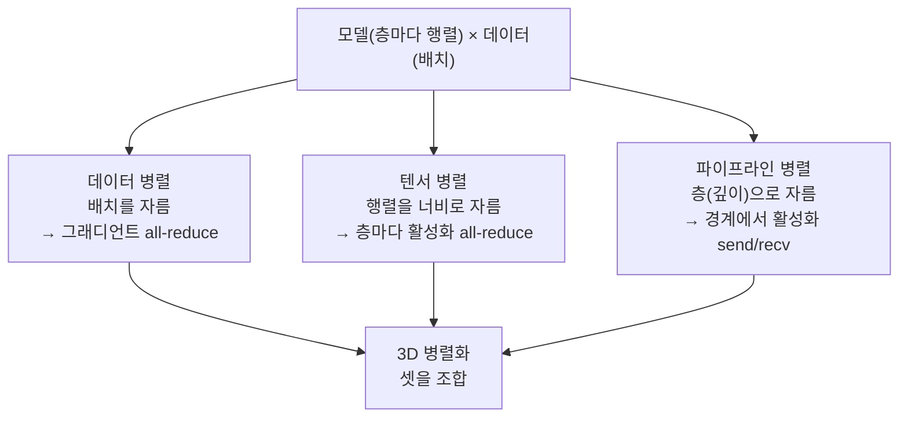
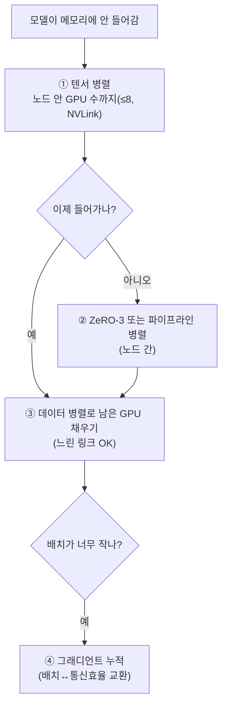

`CS336-LLM-From-Scratch` 시리즈의 8단계입니다. 전체 지도는 [CS336 커리큘럼](/2026/06/26/cs336-llm-from-scratch-curriculum.html)에서 볼 수 있습니다. ([7강 — 데이터 병렬](/2026/06/26/cs336-lecture-7-parallelism-1-data-parallel.html)에서 이어집니다.)

7강이 병렬화의 **개념**(데이터 병렬·ZeRO/FSDP)이었다면, 8강(Percy Liang)은 그것을 **코드로** 내려가 확인하고, 데이터 병렬이 못 푸는 문제 — 모델 자체가 한 GPU에 안 들어가고 활성화 메모리가 터지는 — 를 **모델 병렬**로 해결합니다. 핵심 차이 한 줄: 데이터 병렬은 *파라미터*를 주고받았지만, **모델 병렬은 *활성화*를 주고받습니다.**

<figure class="post-figure post-figure--header">
<svg role="img" aria-label="모델은 층(깊이) × 행렬(너비)의 스택이고, 데이터는 배치입니다. 세 가지 병렬화가 서로 다른 축으로 자릅니다 — 데이터 병렬은 배치를, 텐서 병렬은 각 행렬의 너비를, 파이프라인 병렬은 층(깊이)을 자릅니다." viewBox="0 0 720 380" xmlns="http://www.w3.org/2000/svg">
  <title>세 가지 자르기: 배치(데이터)·너비(텐서)·깊이(파이프라인)</title>

  <!-- ===== 모델: 층(깊이)을 쌓은 스택, 각 층은 너비를 가진 행렬 ===== -->
  <g stroke="currentColor" fill="none" stroke-width="1.6" stroke-linejoin="round">
    <!-- 4개 층(깊이). 각 층은 좌→우로 너비를 가진 행렬 -->
    <rect x="70"  y="70"  width="300" height="48" rx="4"/>
    <rect x="70"  y="128" width="300" height="48" rx="4"/>
    <rect x="70"  y="186" width="300" height="48" rx="4"/>
    <rect x="70"  y="244" width="300" height="48" rx="4"/>
  </g>
  <!-- 각 층(행렬)을 너비 방향 셀로 채움 -->
  <g stroke="currentColor" fill="none" stroke-width="0.7" opacity="0.45">
    <line x1="145" y1="70" x2="145" y2="292"/>
    <line x1="220" y1="70" x2="220" y2="292"/>
    <line x1="295" y1="70" x2="295" y2="292"/>
  </g>
  <text x="220" y="58" text-anchor="middle" font-family="var(--font-body)" font-size="13" font-weight="700" fill="currentColor">모델 = 층(깊이) × 행렬(너비)</text>

  <!-- ===== 데이터: 배치(행 묶음) ===== -->
  <g stroke="currentColor" fill="none" stroke-width="1.4">
    <rect x="430" y="100" width="118" height="22" rx="3"/>
    <rect x="430" y="126" width="118" height="22" rx="3"/>
    <rect x="430" y="152" width="118" height="22" rx="3"/>
    <rect x="430" y="178" width="118" height="22" rx="3"/>
    <rect x="430" y="204" width="118" height="22" rx="3"/>
    <rect x="430" y="230" width="118" height="22" rx="3"/>
  </g>
  <text x="489" y="90" text-anchor="middle" font-family="var(--font-body)" font-size="13" font-weight="700" fill="currentColor">데이터 = 배치</text>

  <!-- ===== ① 데이터 병렬: 배치(데이터)를 가로로 자름 ===== -->
  <g stroke="var(--secondary-color)" stroke-width="2.6" stroke-linecap="round">
    <line x1="418" y1="176" x2="560" y2="176"/>
  </g>
  <g fill="var(--secondary-color)" font-family="var(--font-body)">
    <circle cx="600" cy="176" r="9"/>
    <text x="600" y="180" text-anchor="middle" font-size="11" font-weight="700" fill="var(--bg-panel)">D</text>
    <text x="616" y="172" font-size="12" font-weight="700">데이터 병렬</text>
    <text x="616" y="187" font-size="10.5">배치를 자름</text>
  </g>

  <!-- ===== ② 텐서 병렬: 각 행렬의 너비를 세로로 자름 ===== -->
  <g stroke="var(--accent-color)" stroke-width="2.6" stroke-linecap="round" stroke-dasharray="2 0">
    <line x1="220" y1="62" x2="220" y2="300"/>
  </g>
  <g fill="var(--accent-color)" font-family="var(--font-body)">
    <circle cx="220" cy="320" r="9"/>
    <text x="220" y="324" text-anchor="middle" font-size="11" font-weight="700" fill="var(--bg-panel)">T</text>
    <text x="220" y="346" text-anchor="middle" font-size="12" font-weight="700">텐서 병렬</text>
    <text x="220" y="361" text-anchor="middle" font-size="10.5">행렬 너비를 자름</text>
  </g>

  <!-- ===== ③ 파이프라인 병렬: 층(깊이)을 가로로 자름 ===== -->
  <g stroke="var(--gold)" stroke-width="2.6" stroke-linecap="round">
    <line x1="58" y1="181" x2="382" y2="181"/>
  </g>
  <g fill="var(--gold)" font-family="var(--font-body)">
    <circle cx="40" cy="181" r="9"/>
    <text x="40" y="185" text-anchor="middle" font-size="11" font-weight="700" fill="var(--bg-panel)">P</text>
    <text x="32" y="206" text-anchor="middle" font-size="12" font-weight="700">파이프라인</text>
    <text x="32" y="221" text-anchor="middle" font-size="10.5">층(깊이)을 자름</text>
  </g>
</svg>
<figcaption>같은 모델·데이터를 세 축으로 자른다 — 데이터 병렬은 배치를, 텐서 병렬은 각 행렬의 너비를, 파이프라인 병렬은 층(깊이)을 자른다. 모델 병렬(텐서·파이프라인)은 파라미터가 아니라 활성화를 주고받는다.</figcaption>
</figure>

## 한눈에 보기

병렬화는 결국 **무엇을 어느 축으로 자르나**의 문제입니다. 세 가지 자르기가 있고, 큰 모델은 셋을 **함께** 씁니다.



규칙은 통신 비용에서 나옵니다 — **텐서 병렬은 노드 안(빠른 NVLink)**, **파이프라인·데이터 병렬은 노드 간(느려도 됨)**. 그리고 **배치 크기**는 이 축들에 나눠 쓰는 유한한 자원입니다.

## 코드로 내려가기: 집합 통신 → DDP

모델 병렬로 가기 전에, 7강의 개념이 코드에선 어떻게 보이는지 짚습니다. 집합 통신은 **NCCL**(Nvidia 통신 라이브러리)이 GPU 간 패킷으로 옮기고, **`torch.distributed`**가 그 위에 깔끔한 파이썬 인터페이스를 얹습니다(`all_reduce`, `reduce_scatter`, `all_gather` … 백엔드는 GPU=NCCL('nickel'로 발음), CPU=gloo). 그 덕에 **데이터 병렬(DDP)은 평범한 SGD에 단 한 줄**입니다.

```python
# DDP: 역전파 뒤 그래디언트만 동기화하면 끝
loss = forward(layers, x_local)   # 각 랭크는 배치의 1/world_size만 받음
loss.backward()
for p in params:
    dist.all_reduce(p.grad, op=dist.ReduceOp.AVG)  # ← 이 한 줄이 DDP의 전부
optimizer.step()
# 랭크마다 loss는 다르지만, all-reduce 뒤 그래디언트(→파라미터)는 모두 동일
```

SGD 입장에선 아무 일도 없습니다 — 누군가 역전파 직후 그래디언트를 섞었을 뿐입니다. (`all_reduce`는 **동기화 지점**이라, 한 랭크가 이 호출을 빠뜨리면 전체가 멈춥니다.) 이제 데이터가 아니라 **모델**을 자르는 두 방식으로 갑니다.

## 텐서 병렬: 너비로 자르기

큰 모델 연산의 대부분은 행렬곱입니다. **텐서 병렬(tensor parallel)**은 그 행렬곱을 **서브행렬로 쪼개** 여러 GPU에 나눕니다 — 행렬의 **너비(hidden 차원)** 방향 자르기입니다. MLP `Z = dropout(GELU(X·A)·B)`라면, `A`를 `A1·A2`로, `B`를 `B1·B2`로 쪼갭니다.

```python
# 텐서 병렬(forward): 각 랭크는 각 층의 1/world_size만 보유 (W: num_dim × local_num_dim)
for W in local_layers:
    x_local = act(x @ W)                 # 로컬 활성화 (batch, local_num_dim)
    parts = [torch.empty_like(x_local) for _ in range(world_size)]
    dist.all_gather(parts, x_local)      # 모든 랭크의 활성화 조각을 모아
    x = torch.cat(parts, dim=-1)         # → 전체 활성화 (batch, num_dim)
# 파라미터는 옮기지 않고 '활성화'를 주고받는다
```

위 코드는 강의 데모처럼 각 랭크가 활성화 조각을 만든 뒤 **all-gather로 이어 붙이는** 단순한 형태입니다. 실제 Megatron 방식은 더 영리합니다 — MLP의 첫 행렬곱(`·A`)은 **열 분할(column-parallel)**이라 통신 없이 각 랭크가 은닉 활성화의 조각을 만들고, 둘째 행렬곱(`·B`)은 **행 분할(row-parallel)**이라 각 랭크가 **부분합**을 내므로 이를 **all-reduce**로 합칩니다. 그래서 순전파에 all-reduce 한 번, 역전파에 한 번이 **층마다** 들어갑니다(이 동기화 지점을 `f`·`g`로 표기). 어느 쪽이든 층마다 활성화를 주고받으니 통신이 많아 **고대역폭 인터커넥트가 필수**입니다.

> **철칙: 텐서 병렬은 노드 안 ≤8 GPU에만.** 한 박스의 8개 GPU는 NVLink로 빠르게 묶여 있어 텐서 병렬에 딱입니다. 처리량 하락이 8까지는 ~10%대지만, 16 GPU에서 **~42%**, 32에서 **~65%**로 절벽이 옵니다. 8이 스위트 스폿입니다.

## 파이프라인 병렬: 깊이로 자르기

신경망은 층으로 쌓이니, 가장 직관적인 자르기는 **층 경계**입니다. **파이프라인 병렬(pipeline parallel)**은 각 GPU가 일부 층을 맡고, 경계에서 **활성화를 point-to-point로** 다음 GPU에 넘깁니다.

```python
# 파이프라인 병렬: 모델을 '층'으로 쪼갬. send/recv + 마이크로배치
for micro in x.chunk(num_micro):     # 배치를 마이크로배치로 쪼갬 (버블 완화)
    if rank > 0:
        dist.recv(micro, src=rank - 1)   # 이전 랭크의 활성화를 받고
    h = forward(local_layers, micro)     # 내가 맡은 층들을 계산한 뒤
    if rank < world_size - 1:
        dist.send(h, dst=rank + 1)       # 다음 랭크로 보낸다
```

문제는 **버블(bubble)**입니다. 나이브하게 하면 GPU 하나가 일하는 동안 나머지는 놀아, 4 GPU를 붙여도 처리량이 1 GPU와 같아집니다. 해법은 **마이크로배치** — 배치를 잘게 쪼개 파이프라인을 채웁니다. 오버헤드 비율은 **`(스테이지 수 − 1) / 마이크로배치 수`**라, 배치가 크면 버블이 작아집니다(그래서 배치 크기가 자원).

<figure class="post-figure">
<svg role="img" aria-label="파이프라인 버블 비교. 위: 나이브 — 4개 GPU(스테이지)가 배치 하나를 차례로 처리해, 한 번에 한 GPU만 일하고 나머지는 큰 대각선 버블(유휴)로 논다. 아래: 마이크로배치 — 배치를 여러 마이크로배치로 쪼개 겹쳐 흘려보내면, 같은 스테이지들이 채워져 버블이 훨씬 작아진다." viewBox="0 0 720 420" xmlns="http://www.w3.org/2000/svg">
  <title>파이프라인 버블: 나이브 vs 마이크로배치</title>

  <!-- ============ 위: 나이브 ============ -->
  <text x="20" y="34" font-family="var(--font-body)" font-size="14" font-weight="700" fill="currentColor">나이브 — 한 번에 한 GPU만 일함 (큰 버블)</text>

  <!-- GPU 레인 라벨 + 기준선 -->
  <g font-family="var(--font-body)" font-size="11" fill="currentColor">
    <text x="20" y="64">GPU1</text>
    <text x="20" y="90">GPU2</text>
    <text x="20" y="116">GPU3</text>
    <text x="20" y="142">GPU4</text>
  </g>
  <g stroke="currentColor" stroke-width="1" opacity="0.5">
    <line x1="60" y1="48" x2="60" y2="156"/>
    <line x1="60" y1="156" x2="700" y2="156"/>
  </g>
  <text x="380" y="174" text-anchor="middle" font-family="var(--font-body)" font-size="10.5" fill="currentColor" opacity="0.8">시간 →</text>

  <!-- 일하는 칸(채움) — 한 배치가 4 스테이지를 순서대로: 계단식 대각선 -->
  <g fill="var(--secondary-color)" stroke="var(--bg-panel)" stroke-width="1.5">
    <rect x="60"  y="52" width="40" height="20" rx="2"/>
    <rect x="100" y="78" width="40" height="20" rx="2"/>
    <rect x="140" y="104" width="40" height="20" rx="2"/>
    <rect x="180" y="130" width="40" height="20" rx="2"/>
  </g>
  <!-- 버블(유휴) — 대각선 위/아래의 빈 영역에 사선 해치 -->
  <g stroke="var(--accent-color)" stroke-width="1" opacity="0.55">
    <!-- GPU2~4의 시작 전 유휴 + GPU1~3의 끝난 후 유휴 (대각선 버블) -->
    <line x1="62" y1="74" x2="78" y2="148"/>
    <line x1="78" y1="74" x2="98" y2="148"/>
    <line x1="98" y1="74" x2="118" y2="148"/>
    <line x1="118" y1="74" x2="138" y2="148"/>
    <line x1="138" y1="78" x2="158" y2="148"/>
    <line x1="158" y1="100" x2="178" y2="148"/>
    <line x1="222" y1="54" x2="242" y2="128"/>
    <line x1="222" y1="54" x2="262" y2="74" />
    <line x1="222" y1="78" x2="282" y2="102"/>
    <line x1="222" y1="104" x2="262" y2="120"/>
  </g>
  <rect x="60" y="48" width="160" height="108" rx="3" fill="none" stroke="var(--accent-color)" stroke-width="1.4" stroke-dasharray="4 3"/>
  <text x="300" y="100" font-family="var(--font-body)" font-size="12" font-weight="700" fill="var(--accent-color)">버블 = 유휴 시간</text>
  <text x="300" y="118" font-family="var(--font-body)" font-size="11" fill="currentColor">4 GPU인데 처리량은 1 GPU와 같음</text>

  <!-- ============ 아래: 마이크로배치 ============ -->
  <text x="20" y="234" font-family="var(--font-body)" font-size="14" font-weight="700" fill="currentColor">마이크로배치 — 겹쳐 흘려보내 파이프라인을 채움 (작은 버블)</text>

  <g font-family="var(--font-body)" font-size="11" fill="currentColor">
    <text x="20" y="264">GPU1</text>
    <text x="20" y="290">GPU2</text>
    <text x="20" y="316">GPU3</text>
    <text x="20" y="342">GPU4</text>
  </g>
  <g stroke="currentColor" stroke-width="1" opacity="0.5">
    <line x1="60" y1="248" x2="60" y2="356"/>
    <line x1="60" y1="356" x2="700" y2="356"/>
  </g>
  <text x="380" y="374" text-anchor="middle" font-family="var(--font-body)" font-size="10.5" fill="currentColor" opacity="0.8">시간 →</text>

  <!-- 마이크로배치 4개(m1..m4)가 파이프라인을 채움: 각 GPU 레인이 채워진다 -->
  <!-- GPU1 (y=252) -->
  <g stroke="var(--bg-panel)" stroke-width="1.5">
    <rect x="60"  y="252" width="34" height="20" rx="2" fill="var(--secondary-color)"/>
    <rect x="94"  y="252" width="34" height="20" rx="2" fill="var(--secondary-color)"/>
    <rect x="128" y="252" width="34" height="20" rx="2" fill="var(--secondary-color)"/>
    <rect x="162" y="252" width="34" height="20" rx="2" fill="var(--secondary-color)"/>
  </g>
  <!-- GPU2 (y=278) — 한 칸 지연 -->
  <g stroke="var(--bg-panel)" stroke-width="1.5">
    <rect x="94"  y="278" width="34" height="20" rx="2" fill="var(--secondary-color)"/>
    <rect x="128" y="278" width="34" height="20" rx="2" fill="var(--secondary-color)"/>
    <rect x="162" y="278" width="34" height="20" rx="2" fill="var(--secondary-color)"/>
    <rect x="196" y="278" width="34" height="20" rx="2" fill="var(--secondary-color)"/>
  </g>
  <!-- GPU3 (y=304) — 두 칸 지연 -->
  <g stroke="var(--bg-panel)" stroke-width="1.5">
    <rect x="128" y="304" width="34" height="20" rx="2" fill="var(--secondary-color)"/>
    <rect x="162" y="304" width="34" height="20" rx="2" fill="var(--secondary-color)"/>
    <rect x="196" y="304" width="34" height="20" rx="2" fill="var(--secondary-color)"/>
    <rect x="230" y="304" width="34" height="20" rx="2" fill="var(--secondary-color)"/>
  </g>
  <!-- GPU4 (y=330) — 세 칸 지연 -->
  <g stroke="var(--bg-panel)" stroke-width="1.5">
    <rect x="162" y="330" width="34" height="20" rx="2" fill="var(--secondary-color)"/>
    <rect x="196" y="330" width="34" height="20" rx="2" fill="var(--secondary-color)"/>
    <rect x="230" y="330" width="34" height="20" rx="2" fill="var(--secondary-color)"/>
    <rect x="264" y="330" width="34" height="20" rx="2" fill="var(--secondary-color)"/>
  </g>
  <!-- 남은 작은 버블: 시작 채우기(좌하 삼각) + 끝 비우기(우상 삼각) -->
  <g stroke="var(--accent-color)" stroke-width="1" opacity="0.55">
    <line x1="62" y1="280" x2="92" y2="350"/>
    <line x1="62" y1="306" x2="126" y2="350"/>
    <line x1="62" y1="332" x2="160" y2="350"/>
    <line x1="300" y1="254" x2="298" y2="324"/>
    <line x1="266" y1="254" x2="298" y2="298"/>
    <line x1="232" y1="254" x2="298" y2="272"/>
  </g>
  <text x="320" y="296" font-family="var(--font-body)" font-size="12" font-weight="700" fill="var(--secondary-color)">버블이 작아짐</text>
  <text x="320" y="314" font-family="var(--font-body)" font-size="11" fill="currentColor">오버헤드 ≈ (스테이지−1) / 마이크로배치 수</text>
</svg>
<figcaption>파이프라인 버블 — 나이브하게 배치 하나를 흘리면 한 번에 한 GPU만 일하고 나머지는 대각선 버블로 논다(위). 배치를 마이크로배치로 쪼개 겹쳐 흘려보내면 같은 스테이지가 채워져 버블이 작아진다(아래). 마이크로배치가 많을수록 버블이 줄어 배치 크기가 자원이 된다.</figcaption>
</figure>

더 영리하게는 **zero-bubble / DualPipe**(DeepSeek)가 있습니다 — 역전파를 *활성화 그래디언트*(직렬 의존)와 *가중치 그래디언트*(아무 때나 가능)로 쪼개, 후자를 버블 자리에 끼워 넣습니다. 단, 파이프라인 병렬은 **인프라가 악명 높게 복잡**합니다("우리 팀에서 파이프라인 병렬을 이해하는 사람이 둘이었는데 하나가 떠났다"는 농담이 있을 정도). 그래서 가능하면 피하고, 모델이 안 들어갈 때 **느린 노드 간 링크**에 씁니다.

## 텐서 vs 파이프라인

| | **텐서 병렬** | **파이프라인 병렬** |
| --- | --- | --- |
| 자르는 축 | 너비(행렬 분할) | 깊이(층) |
| 주고받는 것 | 활성화 — 층마다 all-reduce | 활성화 — 경계, point-to-point |
| 통신량 | 큼 (고대역폭 필요) | 작음 (느린 링크 OK) |
| 배치 크기 | 소비 안 함 | 소비함(버블 완화에 필요) |
| 구현 난이도 | 낮음 | 높음(버블·인터리빙) |
| 어디에 | 노드 내 ≤8 GPU(NVLink) | 노드 간 |

텐서 병렬은 배치 크기를 **안** 먹는 유일한 축이라는 점이 큰 장점입니다.

## 활성화·시퀀스 병렬

큰 모델·긴 시퀀스에선 **활성화 메모리**가 큰 부분을 차지합니다. 텐서·파이프라인 병렬로 대부분을 GPU 수(`t`)로 나눠도, **non-행렬곱 연산**(layer norm·dropout·어텐션/MLP 입력)에서 나오는 `10·s·b·h` 항은 안 나뉘고 남습니다.

**시퀀스 병렬(sequence parallel)**이 이 잔여를 처리합니다 — layer norm·dropout 같은 점별(point-wise) 연산은 시퀀스 위치끼리 상호작용이 없으니, **시퀀스 차원으로 쪼개** 각 GPU가 일부 위치만 맡습니다(forward에서 all-gather/reduce-scatter, backward에서 반대). 텐서 병렬 + 시퀀스 병렬 + (Flash Attention식) 재계산을 합치면, 층당 활성화 메모리를 대략 **`s·b·h·34/t`**까지 낮출 수 있습니다.

## 3D 병렬화: 셋을 합치기

큰 모델은 데이터·텐서·파이프라인을 **함께** 씁니다(흔히 "3D 병렬화"). 자원은 셋 — **메모리**, **대역폭/연산**, 그리고 유한한 **배치 크기**. 간단한 규칙:



순서가 곧 **필요 대역폭 순**입니다 — TP(가장 빠른 링크) → PP → DP(가장 느려도 됨). 데이터 병렬은 샤딩된 가중치를 비동기로 미리 가져올 수 있어 긴 지연도 견딥니다.

## 실전 사례

- **Megatron-LM** (2021): 1.7B → 1T 파라미터를 학습하며 **이론 피크의 40~52%** MFU 달성. 텐서 병렬은 8에서 멈추고, 모델이 커지면 파이프라인 병렬을 키우며, 데이터 병렬은 크게 시작해 줄어듭니다(파이프라인이 배치를 먹으니까).
- **DeepSeek V3**: 16-way 파이프라인 병렬 + 64-way 전문가 병렬(MoE) + ZeRO-1. 텐서 병렬을 **안** 쓰는 드문 예.
- **Llama 3**: TP=8 + 파이프라인 + 데이터 병렬 + (긴 컨텍스트용) 컨텍스트 병렬. 거대 학습의 현실 — **GPU 고장으로 148회 중단**(전체 중단의 ~30%), 그리고 더 무서운 **무증상 데이터 손상**. 이 규모에선 **내결함성(fault tolerance)** 아키텍처가 알고리즘만큼 중요합니다.
- **Gemma 2** (TPU): ZeRO-3 + 모델 병렬 + 데이터 병렬. TPU의 토러스 메시 덕에 모델 병렬을 더 멀리 늘립니다.

> 그 밖에 **컨텍스트 병렬(ring attention)** — 키·값을 링처럼 돌려 긴 어텐션을 분산(Flash Attention의 타일링과 같은 원리) — 과 **전문가 병렬** — MoE 전문가를 장치마다(텐서 병렬과 비슷하되 희소 라우팅) — 도 도구함에 있습니다.

## 성능·복잡도 노트

- **데이터 vs 모델 병렬의 본질:** 데이터 병렬은 파라미터를 복제·동기화하고, 모델 병렬은 모델을 쪼개 **활성화를 주고받습니다.** 활성화가 파라미터보다 작을 때 모델 병렬이 유리합니다.
- **통신 계층이 배치를 정한다:** 텐서 병렬은 NVLink(노드 내)에, 파이프라인·데이터 병렬은 느린 노드 간 링크에. 하드웨어 위계가 전략을 강제합니다.
- **배치 크기는 화폐다:** 파이프라인 버블 완화에도, 데이터 병렬에도 쓰입니다. 부족하면 그래디언트 누적으로 통신 효율과 맞바꿉니다.
- **규모엔 내결함성이 따라온다:** 수천 GPU 학습은 잦은 고장·데이터 손상과 싸웁니다 — 체크포인팅과 복구가 필수.

## 요약

- 모델 병렬은 모델을 쪼개 **활성화를 주고받는다**(데이터 병렬은 파라미터를 주고받음).
- **텐서 병렬**: 너비로 자름, 층마다 all-reduce, 통신 많음 → **노드 내 ≤8 GPU(NVLink)**. 배치를 안 먹는 게 장점.
- **파이프라인 병렬**: 깊이(층)로 자름, point-to-point, **버블**을 마이크로배치/zero-bubble로 완화. 통신 적지만 구현이 복잡 → 노드 간.
- **시퀀스 병렬**: 텐서 병렬이 못 나눈 점별 연산의 활성화를 시퀀스 차원으로 분할.
- **3D 병렬화**: TP(노드 내) → ZeRO-3/PP(노드 간) → DP(채우기) → 그래디언트 누적. 사례: Megatron·DeepSeek V3·Llama 3·Gemma 2.

이로써 **유닛 2(아키텍처 & 시스템)를 마칩니다.** 다음 유닛은 "작게 실험해 크게 예측하는" 스케일링입니다.

### 다음 학습 (Next Learning)

- **9단계: 스케일링 법칙 1** — 손실이 모델·데이터·연산의 거듭제곱으로 줄어드는 법칙과 Chinchilla (상세 포스트 작성 예정)
- [CS336 7강 — 병렬화 1: 데이터 병렬과 ZeRO/FSDP](/2026/06/26/cs336-lecture-7-parallelism-1-data-parallel.html) — 모델 병렬과 짝을 이루는 데이터 병렬
- [CS336 커리큘럼](/2026/06/26/cs336-llm-from-scratch-curriculum.html) — 전체 17단계 지도와 진행 현황
