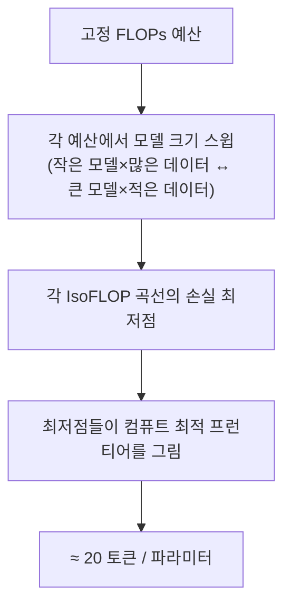

`CS336-LLM-From-Scratch` 시리즈의 9단계입니다. 전체 지도는 [CS336 커리큘럼](/2026/06/26/cs336-llm-from-scratch-curriculum.html)에서 볼 수 있습니다. ([8강 — 병렬화 2](/2026/06/26/cs336-lecture-8-parallelism-2-tensor-pipeline.html)에서 이어집니다.)

유닛 3(스케일링 & 추론)이 시작됩니다. 상상해 봅시다 — 부자 친구가 **H100 10만 장을 한 달** 빌려주며 "최고의 오픈 LLM을 만들어 달라"고 합니다. 인프라·데이터·아키텍처는 앞 강의에서 배웠지만, 큰 모델로 하이퍼파라미터를 일일이 튜닝할 컴퓨트는 없습니다. 답이 **스케일링 법칙(scaling laws)**입니다 — **작은 모델 여러 개로 배우고, 큰 모델의 행동을 외삽해, 본 게임을 단번에 맞히는** 것. 이 강의(Tatsunori Hashimoto)는 그 법칙이 왜 성립하는지, 무엇을 결정할 수 있는지를 다룹니다.

<figure class="post-figure post-figure--header">
<svg role="img" aria-label="log-log 평면의 스케일링 법칙: 작은 모델 데이터 점 몇 개가 내려가는 직선 위에 놓이고, 그 직선을 점선으로 오른쪽 큰 컴퓨트까지 외삽해 큰 모델의 손실을 예측한다" viewBox="0 0 640 360" xmlns="http://www.w3.org/2000/svg">
  <title>작게 실험해 크게 예측: log-log 스케일링 법칙</title>
  <!-- plot frame / axes -->
  <g stroke="currentColor" stroke-width="2" fill="none" stroke-linecap="square">
    <path d="M 78 40 L 78 296 L 600 296" opacity="0.85"/>
  </g>
  <!-- faint log gridlines -->
  <g stroke="currentColor" stroke-width="1" opacity="0.16">
    <line x1="78" y1="246" x2="600" y2="246"/>
    <line x1="78" y1="196" x2="600" y2="196"/>
    <line x1="78" y1="146" x2="600" y2="146"/>
    <line x1="78" y1="96"  x2="600" y2="96"/>
    <line x1="182" y1="40" x2="182" y2="296"/>
    <line x1="286" y1="40" x2="286" y2="296"/>
    <line x1="390" y1="40" x2="390" y2="296"/>
    <line x1="494" y1="40" x2="494" y2="296"/>
  </g>
  <!-- axis labels -->
  <text x="339" y="334" text-anchor="middle" font-family="var(--font-body)" font-size="15" fill="var(--text-light)">연산량 compute (log)</text>
  <text x="30" y="168" text-anchor="middle" font-family="var(--font-body)" font-size="15" fill="var(--text-light)" transform="rotate(-90 30 168)">손실 loss (log)</text>
  <!-- fitted straight line through the small-model points (solid) -->
  <line x1="110" y1="96" x2="318" y2="200" stroke="var(--secondary-color)" stroke-width="3" stroke-linecap="round"/>
  <!-- extrapolated continuation (dashed) far to the right -->
  <line x1="318" y1="200" x2="556" y2="319" stroke="var(--secondary-color)" stroke-width="3" stroke-linecap="round" stroke-dasharray="3 8" opacity="0.95"/>
  <!-- small-model data points sitting ON the fitted line -->
  <g fill="var(--accent-color)" stroke="var(--bg-panel)" stroke-width="2">
    <circle cx="130" cy="106" r="6"/>
    <circle cx="182" cy="132" r="6"/>
    <circle cx="234" cy="158" r="6"/>
    <circle cx="286" cy="184" r="6"/>
  </g>
  <text x="208" y="118" text-anchor="middle" font-family="var(--font-body)" font-size="13" fill="var(--accent-color)" font-weight="700">작은 모델 몇 개</text>
  <!-- big-model predicted point at the end of the dashed line -->
  <g>
    <circle cx="556" cy="319" r="8" fill="none" stroke="var(--secondary-color)" stroke-width="3"/>
    <circle cx="556" cy="319" r="3" fill="var(--secondary-color)"/>
  </g>
  <text x="556" y="300" text-anchor="middle" font-family="var(--font-body)" font-size="13" fill="var(--secondary-color)" font-weight="700">큰 모델 손실 예측</text>
  <!-- the move: extrapolation arrow caption -->
  <text x="430" y="240" text-anchor="middle" font-family="var(--font-body)" font-size="13" fill="var(--text-light)">외삽 (extrapolate)</text>
</svg>
<figcaption>작은 모델 몇 개를 log-log 평면에 찍으면 내려가는 직선(멱법칙)에 놓인다. 그 직선을 점선으로 큰 연산량까지 늘이면 본 게임 모델의 손실을 미리 맞힐 수 있다 — 작게 실험해 크게 예측.</figcaption>
</figure>

## 한눈에 보기

스케일링 법칙의 쓰임은 한 절차로 압축됩니다 — **작은 모델 몇 개(여러 자릿수 컴퓨트)로 멱법칙을 피팅하고, 그 직선을 큰 컴퓨트로 외삽**합니다. 이 한 장이 아키텍처·하이퍼파라미터·데이터·모델 크기 결정을 전부 떠받칩니다.


핵심 명제 — **손실은 데이터·모델·연산의 거듭제곱으로 예측 가능하게 줄어든다**(log-log에서 직선). 그래서 자원을 얼마나, 어디에 쓸지 *훈련 전에* 계산할 수 있습니다.

## 스케일링 법칙이란

흔히 스케일링 법칙은 "로그 직선이 영원히 이어져 초지능에 이른다" 같은 신화로 소비되지만, 실은 훨씬 **견실한 경험적 도구**이고 역사도 깊습니다. 최초의 스케일링 법칙 논문은 **1993년 벨연구소**(Vapnik·Cortes 등)로, "큰 데이터로 학습하기 전에 어떤 모델이 좋을지 예측하자"는 — 정확히 오늘의 발상입니다. Hestness 등(2017)은 오차가 멱법칙으로 떨어짐을 보이며 **세 영역**을 그렸습니다.

> **① 최선의 추측(best-guess)** → **② 멱법칙(power-law)** → **③ 환원 불가 오차(irreducible error)**

통계적 ML의 일반화 한계(`1/√m`)가 이론적 스케일링 법칙(상한)이라면, 스케일링 법칙은 그 상한을 버리고 **실측 곡선을 직접 피팅**하는 도약입니다. 관심은 주로 ②멱법칙 영역 — **log-log에서 직선**, 즉 x와 손실 사이의 **다항(멱) 관계**입니다.

## 데이터 스케일링: 왜 멱법칙이 자연스러운가

오차가 데이터에 멱법칙으로 줄어드는 건 통계학에서 자연스럽습니다.

- **평균 추정**: 가우시안의 평균을 `n`개로 추정하면 오차 = `σ²/n`. 양변에 로그를 취하면 `log(오차) = −log n + 상수` → log-log **기울기 −1**.
- **비모수 회귀**: `d`차원 공간을 작은 박스로 나눠 평균내면 오차 ~ `n^(−1/d)` → **기울기 −1/d**(차원 의존).

그런데 실측 기울기는 훨씬 **완만**합니다 — 기계번역 0.13, 음성 0.3, 언어모델 **0.095**. `1/n`이나 `1/√n`보다 한참 느립니다. 이는 데이터의 **내재적 차원(intrinsic dimensionality)**을 반영합니다 — 기울기가 곧 "이 과제가 얼마나 배우기 쉬운가"의 척도인 셈입니다.

데이터 스케일링 법칙은 실전 결정에도 쓰입니다 — **데이터 구성(composition)은 기울기가 아니라 절편(offset)만 바꾸므로**, 데이터 선택 실험은 작은 모델에서 해도 됩니다. 또 반복 학습(multi-epoch)은 **약 4에폭 후 급격한 수확 체감**, "데이터를 반복할까 새 데이터를 넣을까" 같은 트레이드오프도 법칙으로 따집니다.

## 모델 스케일링: 엔지니어링 결정

"새 아키텍처(state-space?)·새 옵티마이저가 키울 가치가 있나?"를 **큰 모델을 안 만들고** 답합니다 — 여러 컴퓨트 수준에서 작은 모델들을 훈련해 기울기를 비교합니다.

- **아키텍처**: 트랜스포머가 LSTM보다 **상수배(예: ~15×) 컴퓨트 효율**적(로그 스케일에서 일정한 간격). 여러 대안 중 트랜스포머를 확실히 능가한 건 **GLU와 MoE**뿐 — 오늘날 모두가 쓰는 그것.
- **옵티마이저**: Adam이 SGD보다 상수배 우위.
- **종횡비(aspect ratio)**: 폭/깊이 비율은 10~100의 **넓은 골짜기**에서 거의 최적(3강의 결론을 스케일링으로 재확인).
- **함정 — 임베딩 파라미터는 다르다**: 파라미터 수를 셀 때 임베딩을 포함하면 곡선이 휩니다. **비임베딩(non-embedding) 파라미터만** 깨끗하게 멱법칙을 따릅니다.

핵심 마인드셋: 곡선들이 **교차하지 않고 일정한 절편 차**를 보이면, 작은 스케일에서 튜닝한 선택이 큰 스케일로 **전이**됩니다 — "작은 데서 튜닝"이 아니라 **스케일을 의식한(scale-aware) 튜닝**입니다.

## 배치 크기와 학습률

스케일을 올리면 두 하이퍼파라미터가 까다로워집니다.

- **임계 배치 크기(critical batch size)**: 완벽한 병렬 이득에서 수확 체감으로 넘어가는 문턱. 흥미롭게도 **손실 목표가 낮을수록 임계 배치가 커집니다** — 그래서 Llama 3는 학습 도중 배치 크기를 키웁니다(작은 손실엔 더 정밀한, 즉 덜 노이지한 그래디언트가 필요하니까).
- **학습률과 muP**: 최적 학습률은 모델이 넓어질수록 작아집니다(대략 `1/width`). 매번 스케일링 법칙으로 최적 학습률을 예측하는 건 불안정합니다. **muP(maximal update parameterization)**는 초기화·학습률·출력 스케일을 폭에 맞춰 재매개변수화해, **최적 학습률이 스케일에 걸쳐 안정**되게 만듭니다 — 작은 모델에서 한 번 튜닝하면 큰 모델로 그대로 전이(Meta는 Llama 4에서 "metaP"를 언급).

## 함정: 로그 손실 vs 다운스트림

스케일링 법칙은 **로그 손실(cross-entropy)**엔 아주 잘 듣지만, **다운스트림 벤치마크**엔 훨씬 덜 예측적입니다. perplexity는 컴퓨트에 깔끔하게 선형이어도, SuperGLUE 정확도 같은 능력은 아키텍처마다 들쭉날쭉합니다(state-space 모델이 perplexity는 잘 따라가도 in-context learning은 뒤처지듯). **perplexity 스케일링 ≠ 능력 스케일링** — 항상 조심해야 합니다.

## 스케일링 법칙으로 피팅하기

절차는 단순합니다 — 작은 모델 몇 개를 여러 자릿수 컴퓨트에 걸쳐 훈련하고, log-log 직선을 피팅해 외삽합니다.

```python
import numpy as np
# 작은 모델들의 (compute, loss)로 멱법칙 피팅 — log-log 선형회귀
log_C = np.log(compute)               # 여러 자릿수에 걸친 컴퓨트
log_L = np.log(loss - E)              # 손실에서 환원불가 오차 E를 뺀 '초과오차'
slope, intercept = np.polyfit(log_C, log_L, 1)   # 기울기 = 멱지수(−α)
# 큰 컴퓨트로 외삽 — 작은 모델 몇 개로 큰 모델의 손실을 예측
pred_loss = E + np.exp(intercept) * big_compute ** slope
```

많은 경우 기울기가 같아, 작은 모델 결과가 큰 모델로 잘 전이됩니다(학습률은 중요한 예외).

## 컴퓨트 최적: Chinchilla

스케일링 법칙의 가장 영향력 있는 쓰임 — **"데이터를 늘릴까, 모델을 키울까?"** 컴퓨트 예산 `C`가 한정 자원일 때(2021~2023엔 데이터가 컴퓨트보다 흔했습니다), 같은 FLOPs를 작은 모델×많은 데이터 vs 큰 모델×적은 데이터로 쓸 수 있습니다. 둘 다 극단은 낭비입니다.

**결합 스케일링 법칙**이 답의 틀입니다(Rosenfeld·Kaplan의 결합 스케일링 계보를 잇는 Chinchilla의 함수꼴):

> **L(N, D) = E + A/Nᵅ + B/Dᵝ** (N=파라미터, D=토큰, E=환원 불가 오차)

이 함수꼴은 다소 임의적인데도 실측을 놀랍도록 잘 맞춥니다. **Chinchilla**(2022)는 이를 써 컴퓨트 최적 배분을 못 박았습니다 — 세 가지 방법으로:



1. **최저 곡선(minimum over curves)**: 여러 학습 곡선의 하단 포락선.
2. **IsoFLOP 분석**(가장 정석): FLOP 수준마다 모델 크기를 스윕해 손실 최저점을 찾고, 그 최저점들이 멱법칙을 이룸 → 최적 파라미터·토큰 수를 동시에 읽음.

<figure class="post-figure">
<svg role="img" aria-label="IsoFLOP 분석: FLOP 예산마다 모델 크기에 대한 손실이 U자 곡선을 그리며, 각 U의 최저점을 이으면 컴퓨트 최적 프런티어가 되고 그 비율이 파라미터당 약 20토큰이다" viewBox="0 0 640 380" xmlns="http://www.w3.org/2000/svg">
  <title>IsoFLOP 곡선과 컴퓨트 최적 프런티어 (≈ 20 토큰/파라미터)</title>
  <!-- axes -->
  <g stroke="currentColor" stroke-width="2" fill="none" stroke-linecap="square">
    <path d="M 84 36 L 84 312 L 604 312" opacity="0.85"/>
  </g>
  <!-- axis labels -->
  <text x="344" y="350" text-anchor="middle" font-family="var(--font-body)" font-size="15" fill="var(--text-light)">모델 크기 N — 파라미터 수 (log)</text>
  <text x="34" y="174" text-anchor="middle" font-family="var(--font-body)" font-size="15" fill="var(--text-light)" transform="rotate(-90 34 174)">손실 loss</text>
  <!-- three IsoFLOP U-curves: bigger FLOP budget → lower U, minimum shifts right -->
  <!-- U1 (smallest budget): minimum at (188, 196) -->
  <path d="M 112 96 Q 188 268 300 150" fill="none" stroke="var(--text-color)" stroke-width="2.5" opacity="0.55"/>
  <!-- U2 (mid budget): minimum at (300, 232) -->
  <path d="M 200 140 Q 300 300 420 192" fill="none" stroke="var(--text-color)" stroke-width="2.5" opacity="0.75"/>
  <!-- U3 (largest budget): minimum at (420, 264) -->
  <path d="M 312 192 Q 420 326 552 240" fill="none" stroke="var(--text-color)" stroke-width="2.5"/>
  <!-- per-curve FLOP-budget labels -->
  <text x="118" y="86"  font-family="var(--font-body)" font-size="12" fill="var(--text-light)">작은 FLOPs</text>
  <text x="430" y="184" font-family="var(--font-body)" font-size="12" fill="var(--text-light)">큰 FLOPs</text>
  <!-- minima of each U (true lowest point of each Bezier) -->
  <g fill="var(--accent-color)" stroke="var(--bg-panel)" stroke-width="2">
    <circle cx="215" cy="198" r="6"/>
    <circle cx="327" cy="236" r="6"/>
    <circle cx="452" cy="274" r="6"/>
  </g>
  <!-- compute-optimal frontier through the minima (dashed) -->
  <path d="M 188 188 L 215 198 L 327 236 L 452 274 L 500 290" fill="none" stroke="var(--secondary-color)" stroke-width="3" stroke-linecap="round" stroke-dasharray="2 7"/>
  <text x="512" y="306" text-anchor="middle" font-family="var(--font-body)" font-size="13" fill="var(--secondary-color)" font-weight="700">컴퓨트 최적 프런티어</text>
  <!-- the rule -->
  <text x="344" y="60" text-anchor="middle" font-family="var(--font-body)" font-size="15" fill="var(--gold)" font-weight="700">≈ 20 토큰 / 파라미터</text>
</svg>
<figcaption>IsoFLOP 분석 — FLOP 예산을 고정할 때마다 모델 크기 N에 따른 손실은 U자를 그린다(너무 작아도, 너무 커도 손해). 각 U의 최저점(붉은 점)을 이으면 컴퓨트 최적 프런티어가 되고, 그 위에서 토큰과 파라미터의 비율이 약 20:1로 모인다.</figcaption>
</figure>
3. **함수꼴 직접 피팅**: 가장 지저분. 한동안 방법 3만 다른 값을 줬는데, Epoch AI의 재현 연구가 **원 논문의 곡선 피팅이 틀렸음**(잔차가 0-중심이 아니었음)을 찾아 고치자 방법 1·2와 일치했습니다.

결론이 그 유명한 **Chinchilla 비율 ≈ 파라미터당 20토큰**입니다. (Kaplan의 초기 추정이 빗나간 이유 하나는 **코사인 학습률 스케줄** — 코사인은 중간에 끊으면 안 되고 끝의 cool-down까지 가야 유효한 모델이 됩니다.)

## 추론을 생각한 전환

Chinchilla는 **학습** 최적입니다. 하지만 지금 LLM은 제품이라 **추론 비용**이 중요합니다. 그래서 추세는 작은 모델을 **더 많은 토큰**으로 과훈련(over-training)하는 쪽입니다 — GPT-3는 파라미터당 2토큰, Chinchilla가 20토큰, 지금은 수백 토큰(Qwen은 30조 토큰). **선불(학습) 비용을 더 내고 운영(추론) 비용을 아끼는** 거래입니다.

> 스케일링 법칙은 cherry-pick이 아닙니다 — 같은 IsoFLOP 플레이북이 **확산(diffusion) 모델**에도 거의 그대로 적용돼 Chinchilla 같은 곡선을 줍니다.

## 성능·복잡도 노트

- **작게 실험해 크게 예측한다**: 큰 모델로 튜닝하지 말고, 작은 모델 몇 개로 멱법칙을 피팅해 외삽. 이것이 "혁신"과 "남 따라하기"를 가르는 도구.
- **멱법칙의 기울기는 의미가 있다**: 데이터 내재 차원·과제 난이도를 반영. 느린 기울기(LM 0.095)는 비정상이 아니라 자연스러움.
- **무엇을 세느냐가 중요**: 비임베딩 파라미터만 깨끗하게 스케일. 데이터 구성은 절편만 바꿈.
- **로그 손실 ≠ 능력**: perplexity 스케일링은 깨끗해도 다운스트림은 들쭉날쭉. 외삽을 맹신하지 말 것.
- **Chinchilla는 학습 최적, 현실은 추론 최적**: 20토큰/파라미터는 출발점이고, 제품 시대엔 과훈련이 합리적.

## 요약

- **스케일링 법칙** = 손실이 데이터·모델·연산의 **멱법칙**으로 예측 가능하게 줄어든다(log-log 직선). 세 영역: 추측 → 멱법칙 → 환원 불가.
- **데이터 스케일링**은 통계적으로 자연스럽다(평균추정 −1, 비모수 −1/d). 실측 기울기는 내재 차원을 반영해 완만.
- **모델 스케일링**으로 아키텍처(트랜스포머·GLU·MoE)·옵티마이저·종횡비를 작은 스케일에서 결정. 곡선이 안 교차하면 전이된다.
- **배치/학습률**: 임계 배치 크기(손실 낮을수록 큼), **muP**로 학습률을 스케일에 걸쳐 전이.
- **Chinchilla**: 결합 법칙 + IsoFLOP → 컴퓨트 최적 **≈ 20토큰/파라미터**. 추론 시대엔 그보다 더 과훈련(2→20→수백 토큰).

### 다음 학습 (Next Learning)

- **10단계: 추론(Inference)** — 학습된 모델을 경제적으로 서빙하기, prefill/decode·KV 캐시·양자화 (상세 포스트 작성 예정)
- [CS336 8강 — 병렬화 2: 텐서·파이프라인 병렬과 3D 병렬화](/2026/06/26/cs336-lecture-8-parallelism-2-tensor-pipeline.html) — 유닛 2(시스템)의 마무리
- [CS336 커리큘럼](/2026/06/26/cs336-llm-from-scratch-curriculum.html) — 전체 17단계 지도와 진행 현황
