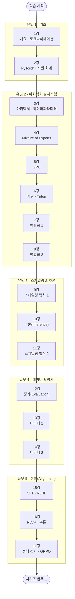

## 소개

대형 언어 모델(LLM)은 이제 API 한 줄로 호출하는 블랙박스가 되었습니다. 하지만 그 안에서 **토큰이 어떻게 잘리고, 어텐션이 어떻게 계산되며, 수천 장의 GPU가 어떻게 한 모델을 나눠 학습하고, 데이터와 정렬이 모델의 성격을 어떻게 결정하는지**를 이해하지 못하면, 우리는 영영 그 블랙박스의 사용자에 머무릅니다. Stanford **CS336 "Language Modeling from Scratch"**(2025 봄, Percy Liang · Tatsunori Hashimoto)는 바로 그 블랙박스를 열어, **밑바닥부터(from scratch)** 언어 모델을 직접 조립해 보는 강의입니다.

이 글은 `CS336-LLM-From-Scratch` 시리즈의 **마스터 로드맵**입니다. CS336의 17개 강의를 **기초 → 아키텍처·시스템 → 스케일링·추론 → 데이터·평가 → 정렬**이라는 5개 유닛, **17단계**로 재구성했습니다. 각 단계(=강의 한 편)를 정복할 때마다 상세 포스트를 작성하고 체크박스를 채우는 **도장깨기** 방식으로 진행 상황을 추적합니다.

이 강의를 관통하는 한 단어는 **효율(efficiency)**입니다. "더 큰 모델"이 아니라 "주어진 연산 예산으로 가장 좋은 모델"을 만드는 것 — 토크나이제이션부터 커널, 병렬화, 스케일링 법칙, 데이터 큐레이션까지 모든 결정이 결국 **연산·메모리·데이터라는 한정된 자원을 어디에 쓸 것인가**라는 질문으로 수렴합니다. 이 로드맵은 그 질문을 따라 17단계를 정복합니다.

## 강의 정보

- **강의:** Stanford CS336 — Language Modeling from Scratch (Spring 2025)
- **강사:** Percy Liang, Tatsunori Hashimoto
- **플레이리스트:** [YouTube — CS336 Spring 2025 (17 lectures)](https://www.youtube.com/playlist?list=PLoROMvodv4rOY23Y0BoGoBGgQ1zmU_MT_)
- **코스 홈페이지:** [stanford-cs336.github.io](https://stanford-cs336.github.io/spring2025/)

## 학습 흐름

17단계는 아래 순서대로 진행하는 것을 권장합니다. **기초**(토크나이저·자원 회계)로 언어 모델의 입력과 비용의 언어를 익히고, **아키텍처·시스템**(Transformer 변형·MoE·GPU·커널·병렬화)으로 모델을 효율적으로 만들고 굴리는 법을 배운 뒤, **스케일링·추론**(스케일링 법칙·추론 최적화)으로 자원 대비 성능을 설계하고, **데이터·평가**로 무엇을 먹이고 어떻게 측정할지 정한 다음, **정렬**(SFT·RLHF·RL)로 모델을 쓸모 있게 길들이는 흐름입니다.

## 학습 진행 현황

> 완료한 항목에는 상세 포스트 링크가 연결됩니다. 학습이 진행될 때마다 체크박스와 진행률을 갱신합니다.

- 현재 완료한 항목: **51개**
- 전체 항목: **51개**
- 진행률: **100%** 🎉 (시리즈 완주)

## 1단계: 개요와 토크나이제이션 (Lecture 1)

**[유닛 1 · 기초]** 코스 전체의 지도를 그리는 단계. "밑바닥부터 만든다"는 것이 무엇이고 왜 **효율**이 이 강의의 중심 주제인지 이해한 뒤, 언어 모델의 첫 관문인 **토크나이저**를 다룹니다. 문자·바이트 단위의 한계에서 출발해, 오늘날 거의 모든 LLM이 쓰는 **BPE(Byte Pair Encoding)**를 직접 구현해 봅니다. 자세한 내용은 [CS336 1강 — 개요와 토크나이제이션: BPE를 밑바닥부터](/2026/06/26/cs336-lecture-1-overview-and-tokenization.html) 포스트에서 다룹니다.

- [x] **코스 개요와 철학**: "from scratch"의 의미, 효율(연산·메모리·데이터)이라는 관통 주제, 3대 빌딩블록(아키텍처·시스템·데이터) — [[상세](/2026/06/26/cs336-lecture-1-overview-and-tokenization.html)]
- [x] **토크나이제이션의 필요성**: 문자/바이트 기반의 한계, 어휘 크기 ↔ 시퀀스 길이 트레이드오프, 서브워드의 등장 — [[상세](/2026/06/26/cs336-lecture-1-overview-and-tokenization.html)]
- [x] **BPE(Byte Pair Encoding)**: 병합 규칙 학습, 인코딩·디코딩, GPT-2 토크나이저와 바이트 수준 BPE — [[상세](/2026/06/26/cs336-lecture-1-overview-and-tokenization.html)]

## 2단계: PyTorch와 자원 회계 (Lecture 2)

**[유닛 1 · 기초]** 모델을 "느낌"이 아니라 **숫자**로 다루는 법을 익히는 단계. 텐서의 메모리 레이아웃과 연산을 PyTorch로 짚고, 모델 크기·연산량(FLOPs)·메모리를 직접 추정하는 **자원 회계(resource accounting)**를 배웁니다. 이후 모든 시스템·스케일링 논의는 이 회계 위에서 이뤄집니다. 자세한 내용은 [CS336 2강 — PyTorch와 자원 회계: 6ND와 메모리를 냅킨에 계산하기](/2026/06/26/cs336-lecture-2-pytorch-resource-accounting.html) 포스트에서 다룹니다.

- [x] **텐서와 메모리**: dtype(fp32/bf16/fp8)·메모리 레이아웃·뷰 vs 복사, 파라미터·활성화·옵티마이저 상태의 메모리 — [[상세](/2026/06/26/cs336-lecture-2-pytorch-resource-accounting.html)]
- [x] **FLOPs 회계**: forward/backward 연산량, 행렬곱이 지배하는 비용, 모델 크기 대비 학습 FLOPs(6ND 근사) — [[상세](/2026/06/26/cs336-lecture-2-pytorch-resource-accounting.html)]
- [x] **MFU와 학습 비용 추정**: 하드웨어 이론 성능 대비 활용률(MFU), 토큰·파라미터·GPU 시간으로 학습 비용 가늠하기 — [[상세](/2026/06/26/cs336-lecture-2-pytorch-resource-accounting.html)]

## 3단계: 아키텍처와 하이퍼파라미터 (Lecture 3)

**[유닛 2 · 아키텍처 & 시스템]** 원조 Transformer에서 현대 LLM으로 오며 굳어진 **설계 표준**을 정리합니다. 정규화 위치, 정규화·활성화 함수, 위치 인코딩, 그리고 깊이·너비·헤드 수 같은 하이퍼파라미터의 실전 기본값을 다룹니다. 자세한 내용은 [CS336 3강 — 아키텍처와 하이퍼파라미터: 현대 트랜스포머의 합의](/2026/06/26/cs336-lecture-3-architectures-hyperparameters.html) 포스트에서 다룹니다.

- [x] **Transformer 변형**: Pre-norm vs Post-norm, RMSNorm, SwiGLU/GeGLU 등 현대 LLM의 표준 선택 — [[상세](/2026/06/26/cs336-lecture-3-architectures-hyperparameters.html)]
- [x] **위치 인코딩**: 절대/상대 인코딩의 한계와 RoPE(회전 위치 인코딩) — [[상세](/2026/06/26/cs336-lecture-3-architectures-hyperparameters.html)]
- [x] **하이퍼파라미터 실전값**: 너비/깊이 비율, 헤드 수·차원, FFN 배율 등 검증된 기본 설정 — [[상세](/2026/06/26/cs336-lecture-3-architectures-hyperparameters.html)]

## 4단계: Mixture of Experts (Lecture 4)

**[유닛 2 · 아키텍처 & 시스템]** **연산은 고정한 채 파라미터만 키우는** 희소(sparse) 아키텍처. 토큰마다 일부 전문가(expert)만 활성화하는 MoE의 원리와, 그것을 실제로 학습 가능하게 만드는 라우팅·로드 밸런싱을 다룹니다. 자세한 내용은 [CS336 4강 — Mixture of Experts: 연산은 그대로, 파라미터만 키우기](/2026/06/26/cs336-lecture-4-mixture-of-experts.html) 포스트에서 다룹니다.

- [x] **MoE의 핵심 아이디어**: 희소 활성화로 파라미터 ↑·토큰당 연산 고정, 밀집(dense) 모델과의 비교 — [[상세](/2026/06/26/cs336-lecture-4-mixture-of-experts.html)]
- [x] **라우팅과 게이팅**: top-k 라우팅, 로드 밸런싱 손실, 전문가 용량(capacity)과 토큰 드롭 — [[상세](/2026/06/26/cs336-lecture-4-mixture-of-experts.html)]
- [x] **실전 MoE**: 대표 MoE 모델 사례와 학습 안정성·시스템상의 과제 — [[상세](/2026/06/26/cs336-lecture-4-mixture-of-experts.html)]

## 5단계: GPU (Lecture 5)

**[유닛 2 · 아키텍처 & 시스템]** 모델이 실제로 돌아가는 **하드웨어**를 이해하는 단계. SM·메모리 계층·텐서 코어 같은 GPU 구조와, compute-bound vs memory-bound를 가르는 **루프라인(roofline)** 사고를 익혀, 왜 어떤 연산은 빠르고 어떤 연산은 느린지 설명합니다. 자세한 내용은 [CS336 5강 — GPU: 병목은 연산이 아니라 메모리다](/2026/06/26/cs336-lecture-5-gpus.html) 포스트에서 다룹니다.

- [x] **GPU 구조**: SM(스트리밍 멀티프로세서), 메모리 계층(HBM↔SRAM/레지스터), 텐서 코어 — [[상세](/2026/06/26/cs336-lecture-5-gpus.html)]
- [x] **성능 모델**: 산술 강도(arithmetic intensity)와 루프라인, compute-bound vs memory-bound — [[상세](/2026/06/26/cs336-lecture-5-gpus.html)]
- [x] **왜 행렬곱인가**: 행렬곱이 GPU에 잘 맞는 이유와, 메모리 이동이 성능을 지배하는 지점 — [[상세](/2026/06/26/cs336-lecture-5-gpus.html)]

## 6단계: 커널과 Triton (Lecture 6)

**[유닛 2 · 아키텍처 & 시스템]** GPU 코드를 **빠르게 만드는 실전**. 벤치마킹·프로파일링으로 병목을 찾고, 메모리 이동을 줄이는 커널 퓨전(fusion)의 원리를 배우며, **Triton**·`torch.compile`로 커스텀 커널을 작성합니다(그 동기가 되는 목표가 FlashAttention — 알고리즘 자체는 5단계에서 다룹니다). 자세한 내용은 [CS336 6강 — 커널과 Triton: 측정하고, 퓨즈하라](/2026/06/26/cs336-lecture-6-kernels-triton.html) 포스트에서 다룹니다.

- [x] **벤치마킹·프로파일링**: warm-up·`cuda.synchronize`로 정확히 재기, 프로파일러로 병목 찾기(CPU/GPU 비동기 실행) — [[상세](/2026/06/26/cs336-lecture-6-kernels-triton.html)]
- [x] **커널 퓨전**: 여러 연산을 한 커널로 합쳐 HBM 왕복 줄이기(GELU 8배 가속) — [[상세](/2026/06/26/cs336-lecture-6-kernels-triton.html)]
- [x] **Triton과 torch.compile**: 블록 관점의 커스텀 커널, 자동 퓨전, 그리고 도구 선택 기준 — [[상세](/2026/06/26/cs336-lecture-6-kernels-triton.html)]

## 7단계: 병렬화 1 — 데이터 병렬 (Lecture 7)

**[유닛 2 · 아키텍처 & 시스템]** 한 장의 GPU로는 큰 모델을 학습할 수 없습니다. 여러 GPU에 일을 나누는 첫 축, **데이터 병렬화**와 그 통신 비용, 그리고 메모리를 분산하는 **ZeRO/FSDP**를 다룹니다. 자세한 내용은 [CS336 7강 — 병렬화 1: 데이터 병렬과 ZeRO/FSDP](/2026/06/26/cs336-lecture-7-parallelism-1-data-parallel.html) 포스트에서 다룹니다.

- [x] **집합 통신(collective)**: all-reduce·all-gather·reduce-scatter와 통신 비용 모델(all-reduce = reduce-scatter + all-gather) — [[상세](/2026/06/26/cs336-lecture-7-parallelism-1-data-parallel.html)]
- [x] **데이터 병렬화**: 동기 SGD, 그래디언트 동기화, 파라미터당 16바이트 메모리와 배치 크기 한계 — [[상세](/2026/06/26/cs336-lecture-7-parallelism-1-data-parallel.html)]
- [x] **ZeRO / FSDP**: 옵티마이저 상태·그래디언트·파라미터 샤딩으로 메모리 분산 — [[상세](/2026/06/26/cs336-lecture-7-parallelism-1-data-parallel.html)]

## 8단계: 병렬화 2 — 텐서·파이프라인 병렬 (Lecture 8)

**[유닛 2 · 아키텍처 & 시스템]** 모델 자체를 쪼개는 병렬화. **텐서 병렬**(한 레이어를 여러 GPU로)과 **파이프라인 병렬**(레이어들을 단계로), 그리고 이들을 데이터 병렬과 조합하는 **3D 병렬화**로 초대형 모델을 학습하는 법을 다룹니다. 자세한 내용은 [CS336 8강 — 병렬화 2: 텐서·파이프라인 병렬과 3D 병렬화](/2026/06/26/cs336-lecture-8-parallelism-2-tensor-pipeline.html) 포스트에서 다룹니다.

- [x] **텐서 병렬(Tensor Parallelism)**: 행렬곱을 GPU 간에 분할, 통신 지점과 비용 — [[상세](/2026/06/26/cs336-lecture-8-parallelism-2-tensor-pipeline.html)]
- [x] **파이프라인 병렬(Pipeline Parallelism)**: 레이어 분할, 마이크로배치와 버블(bubble) 최소화 — [[상세](/2026/06/26/cs336-lecture-8-parallelism-2-tensor-pipeline.html)]
- [x] **3D 병렬화**: 데이터·텐서·파이프라인 병렬의 조합과 통신-연산 오버랩 — [[상세](/2026/06/26/cs336-lecture-8-parallelism-2-tensor-pipeline.html)]

## 9단계: 스케일링 법칙 1 (Lecture 9)

**[유닛 3 · 스케일링 & 추론]** "작게 실험해서 크게 예측한다." 손실이 모델·데이터·연산의 거듭제곱으로 줄어드는 **스케일링 법칙**과, 주어진 연산 예산에서 모델 크기와 데이터 양의 최적 배분을 알려주는 **Chinchilla**를 다룹니다. 자세한 내용은 [CS336 9강 — 스케일링 법칙 1: 작게 실험해 크게 예측하기](/2026/06/26/cs336-lecture-9-scaling-laws-1.html) 포스트에서 다룹니다.

- [x] **스케일링 법칙의 형태**: 손실 = f(파라미터·데이터·연산)의 거듭제곱 법칙, 멱법칙(power law) 직관 — [[상세](/2026/06/26/cs336-lecture-9-scaling-laws-1.html)]
- [x] **Chinchilla와 compute-optimal**: 고정 연산에서 모델 크기 ↔ 토큰 수의 최적 비율(≈20토큰/파라미터) — [[상세](/2026/06/26/cs336-lecture-9-scaling-laws-1.html)]
- [x] **스케일링 실험 설계**: IsoFLOP 곡선, 작은 모델에서 큰 모델의 성능 외삽 — [[상세](/2026/06/26/cs336-lecture-9-scaling-laws-1.html)]

## 10단계: 추론 (Inference) (Lecture 10)

**[유닛 3 · 스케일링 & 추론]** 학습이 끝난 모델을 **실제로 서빙**할 때의 경제학. prefill과 decode의 비대칭, KV 캐시, 그리고 양자화·speculative decoding·배칭 같은 추론 최적화 기법을 다룹니다. 자세한 내용은 [CS336 10강 — 추론(Inference): KV 캐시와 메모리 한계의 게임](/2026/06/26/cs336-lecture-10-inference.html) 포스트에서 다룹니다.

- [x] **추론의 두 단계**: prefill(병렬·연산 한계) vs decode(순차·메모리 한계)의 비대칭, 지연 vs 처리량 — [[상세](/2026/06/26/cs336-lecture-10-inference.html)]
- [x] **KV 캐시**: 캐시의 메모리 비용과 그것을 줄이는 아키텍처(GQA·MLA·local attention) — [[상세](/2026/06/26/cs336-lecture-10-inference.html)]
- [x] **추론 최적화**: 양자화, speculative decoding(무손실), 연속 배칭·PagedAttention — [[상세](/2026/06/26/cs336-lecture-10-inference.html)]

## 11단계: 스케일링 법칙 2 (Lecture 11)

**[유닛 3 · 스케일링 & 추론]** 스케일링 법칙을 **실무 의사결정**으로 잇는 단계. 작은 모델에서 튜닝한 하이퍼파라미터를 큰 모델로 옮기는 **하이퍼파라미터 전이(muP 등)**와, 스케일링으로 학습 레시피를 결정하는 방법을 다룹니다. 자세한 내용은 [CS336 11강 — 스케일링 법칙 2: 실전 레시피와 muP](/2026/06/26/cs336-lecture-11-scaling-laws-2.html) 포스트에서 다룹니다.

- [x] **하이퍼파라미터 전이**: muP(maximal update parameterization), 작은 모델에서 큰 모델로 학습률 전이 — [[상세](/2026/06/26/cs336-lecture-11-scaling-laws-2.html)]
- [x] **스케일링으로 레시피 정하기**: 실전 사례(Cerebras·MiniCPM·DeepSeek)와 WSD 학습률로 한 번에 Chinchilla — [[상세](/2026/06/26/cs336-lecture-11-scaling-laws-2.html)]
- [x] **실전 스케일링의 함정**: "20토큰/파라미터는 출발점", IsoFLOP은 재현되나 비율은 커짐 — [[상세](/2026/06/26/cs336-lecture-11-scaling-laws-2.html)]

## 12단계: 평가 (Evaluation) (Lecture 12)

**[유닛 4 · 데이터 & 평가]** "좋은 모델"을 어떻게 측정하는가. perplexity 같은 내재적 지표부터 MMLU 등 벤치마크, LM-as-judge까지 평가 방법을 정리하고, 오염(contamination)·재현성 같은 평가의 함정을 짚습니다. 자세한 내용은 [CS336 12강 — 평가(Evaluation): 하나의 참된 평가는 없다](/2026/06/26/cs336-lecture-12-evaluation.html) 포스트에서 다룹니다.

- [x] **내재적 지표**: perplexity·bits-per-byte와 그 한계 — [[상세](/2026/06/26/cs336-lecture-12-evaluation.html)]
- [x] **벤치마크와 LM-as-judge**: MMLU 등 능력 벤치마크, 모델로 모델 평가하기, 휴먼 평가 — [[상세](/2026/06/26/cs336-lecture-12-evaluation.html)]
- [x] **평가의 함정**: 데이터 오염(contamination), 프롬프트 민감도, 재현성과 리더보드의 한계 — [[상세](/2026/06/26/cs336-lecture-12-evaluation.html)]

## 13단계: 데이터 1 — 수집과 출처 (Lecture 13)

**[유닛 4 · 데이터 & 평가]** 모델의 성격을 결정하는 진짜 원재료, **데이터**. Common Crawl 같은 웹 데이터의 수집과 추출, 그리고 raw 웹에서 학습 가능한 텍스트를 뽑아내는 처리 파이프라인의 큰 그림을 다룹니다. 자세한 내용은 [CS336 13강 — 데이터 (1): 웹을 학습 코퍼스로, 그리고 저작권](/2026/06/26/cs336-lecture-13-data-1-sources.html) 포스트에서 다룹니다.

- [x] **데이터 출처와 계보**: Common Crawl·C4·The Pile·RefinedWeb·FineWeb·Dolma·DCLM 등 사전학습 데이터셋의 진화 — [[상세](/2026/06/26/cs336-lecture-13-data-1-sources.html)]
- [x] **추출과 파이프라인**: WARC vs WET, HTML→텍스트 추출(trafilatura), 라이브 웹 → 코퍼스 흐름 — [[상세](/2026/06/26/cs336-lecture-13-data-1-sources.html)]
- [x] **저작권과 공정 이용**: fair use 4요소 판단·라이선스·그림자 도서관, 학습의 변형성 논쟁 — [[상세](/2026/06/26/cs336-lecture-13-data-1-sources.html)]

## 14단계: 데이터 2 — 필터링·중복 제거·믹스 (Lecture 14)

**[유닛 4 · 데이터 & 평가]** 데이터 처리의 핵심 기술. 품질 분류로 좋은 문서를 고르고, 중복 제거(dedup)로 낭비와 암기를 줄이며, 도메인 비율(데이터 믹스)을 조절해 모델의 능력을 조형하는 법을 다룹니다. 자세한 내용은 [CS336 14강 — 데이터 (2): 필터링·중복 제거·데이터 믹스](/2026/06/26/cs336-lecture-14-data-2-filtering-dedup.html) 포스트에서 다룹니다.

- [x] **품질 필터링**: KenLM·fastText·DSIR 기반 선별, 언어 식별, 독성·PII 제거 — [[상세](/2026/06/26/cs336-lecture-14-data-2-filtering-dedup.html)]
- [x] **중복 제거(Deduplication)**: 정확(Bloom filter)·근접(MinHash+LSH) 중복 제거와 그 효과 — [[상세](/2026/06/26/cs336-lecture-14-data-2-filtering-dedup.html)]
- [x] **데이터 믹스**: 도메인 비율 조절(DoReMi), 데이터 한계 환경에서의 반복(epoch) — [[상세](/2026/06/26/cs336-lecture-14-data-2-filtering-dedup.html)]

## 15단계: 정렬 — SFT와 RLHF (Lecture 15)

**[유닛 5 · 정렬(Alignment)]** 사전학습된 "원석" 모델을 사람이 쓸 수 있는 어시스턴트로 길들이는 첫 단계. **지도 미세조정(SFT)**으로 지시를 따르게 하고, **RLHF**로 사람 선호에 맞추는 과정을 다룹니다. 자세한 내용은 [CS336 15강 — 정렬 (1): SFT와 RLHF](/2026/06/26/cs336-lecture-15-alignment-sft-rlhf.html) 포스트에서 다룹니다.

- [x] **SFT(Instruction Tuning)**: 지시-응답 데이터로 미세조정, 표면적 정렬 가설(LIMA)·품질 > 양 — [[상세](/2026/06/26/cs336-lecture-15-alignment-sft-rlhf.html)]
- [x] **선호 데이터와 보상 모델**: 사람 선호 비교(Bradley-Terry)로 보상 모델 학습 — [[상세](/2026/06/26/cs336-lecture-15-alignment-sft-rlhf.html)]
- [x] **RLHF와 DPO**: 보상 모델 + PPO·KL 제약·보상 해킹, 그리고 보상 모델을 없애는 DPO — [[상세](/2026/06/26/cs336-lecture-15-alignment-sft-rlhf.html)]

## 16단계: 정렬 — RLVR와 추론 모델 (Lecture 16)

**[유닛 5 · 정렬(Alignment)]** 학습된 보상 대신 정답을 **검증**하는 보상(RLVR). 수학·코드의 규칙 기반 보상으로 reward hacking을 줄이고, 이 전환이 스스로 사고사슬을 기르는 추론 모델(o1·DeepSeek R1)과 GRPO를 낳는 과정을 다룹니다. 자세한 내용은 [CS336 16강 — 정렬 (2): RLVR와 추론 모델](/2026/06/26/cs336-lecture-16-alignment-rlvr.html) 포스트에서 다룹니다.

- [x] **검증 가능 보상(RLVR)**: 규칙 기반 보상(정답 매칭·유닛 테스트), RLHF 대비 객관성 — [[상세](/2026/06/26/cs336-lecture-16-alignment-rlvr.html)]
- [x] **추론 모델의 창발**: o1·R1-Zero 순수 RL, CoT 길이 자기 증가와 "aha moment" — [[상세](/2026/06/26/cs336-lecture-16-alignment-rlvr.html)]
- [x] **GRPO**: critic 없이 그룹 상대 이점으로 최적화, test-time compute와 한계 — [[상세](/2026/06/26/cs336-lecture-16-alignment-rlvr.html)]

## 17단계: 정렬 — 정책 경사와 GRPO 직접 구현 (Lecture 17)

**[유닛 5 · 정렬(Alignment)]** RL을 언어 모델에 실제로 돌리는 기계. 정책 경사의 유도, baseline·advantage로 분산 줄이기, 그리고 GRPO를 한 줄씩 구현하며 "raw reward로는 왜 안 되는가"를 확인하고 시리즈를 마무리합니다. 자세한 내용은 [CS336 17강 — 정렬 (3): 정책 경사와 GRPO 직접 구현](/2026/06/26/cs336-lecture-17-alignment-rl-grpo.html) 포스트에서 다룹니다.

- [x] **정책 경사 기초**: REINFORCE 추정량, LM을 RL로 보기(state·action·보상) — [[상세](/2026/06/26/cs336-lecture-17-alignment-rl-grpo.html)]
- [x] **Baseline과 advantage**: 정책 무관 baseline으로 불편·저분산, advantage = Q − V — [[상세](/2026/06/26/cs336-lecture-17-alignment-rl-grpo.html)]
- [x] **GRPO 구현**: 그룹 baseline·clipped ratio·KL 정규화, raw/centered/normalized 이점 — [[상세](/2026/06/26/cs336-lecture-17-alignment-rl-grpo.html)]

## 핵심 포인트

- **효율이 모든 결정을 관통한다**: 토크나이저·커널·병렬화·스케일링·데이터 큐레이션은 결국 "한정된 연산·메모리·데이터를 어디에 쓸 것인가"라는 한 질문의 다른 얼굴입니다. 새 기법을 만나면 "어떤 자원을 아끼는가"부터 물으면 길을 잃지 않습니다.
- **숫자로 사고하라(자원 회계)**: 모델을 FLOPs·메모리·MFU로 추정하는 습관이 시스템·스케일링 전체의 토대입니다. "느낌"이 아니라 회계가 설계를 이끌어야 합니다.
- **아키텍처보다 시스템이 병목인 시대**: 현대 LLM의 한계는 종종 모델 구조가 아니라 GPU·커널·통신에서 옵니다. 시스템 유닛(5~8강)이 이 강의의 무게중심인 이유입니다.
- **데이터가 모델의 성격을 만든다**: 같은 아키텍처라도 무엇을 어떻게 먹였는지가 능력을 가릅니다. 수집·필터링·dedup·믹스는 부차적 전처리가 아니라 핵심 설계입니다.
- **사전학습이 끝이 아니다(정렬)**: SFT·RLHF·RL은 원석을 쓸모 있는 도구로 바꾸는 단계이며, 최신 reasoning 모델의 능력은 상당 부분 정렬·RL에서 옵니다.

## 추천 학습 순서

CS336은 강의 순서 자체가 잘 설계된 학습 경로이므로, 1단계부터 순서대로 진행하길 권합니다. 5개 유닛의 흐름은 다음과 같습니다.

1. **유닛 1 · 기초(1~2단계)** — 토크나이저로 모델의 입력을 이해하고, 자원 회계로 "비용의 언어"를 익힙니다. 이후 모든 시스템·스케일링 논의가 이 회계 위에서 이뤄지므로 건너뛰면 안 되는 토대입니다.
2. **유닛 2 · 아키텍처 & 시스템(3~8단계)** — 이 강의의 무게중심. 현대 Transformer 설계와 MoE를 익히고, GPU·커널·병렬화로 모델을 **효율적으로** 학습·실행하는 법을 배웁니다.
3. **유닛 3 · 스케일링 & 추론(9~11단계)** — 작게 실험해 크게 예측하는 스케일링 법칙과, 학습된 모델을 경제적으로 서빙하는 추론 최적화를 다룹니다.
4. **유닛 4 · 데이터 & 평가(12~14단계)** — 모델에 무엇을 먹일지(데이터)와 잘 됐는지 어떻게 알지(평가)를 정합니다. 데이터는 모델의 성격을 결정하는 진짜 원재료입니다.
5. **유닛 5 · 정렬(15~17단계)** — 사전학습된 원석을 SFT·RLHF·RL로 쓸모 있는 모델로 길들이며, 최신 reasoning 모델로 이어지는 RL 기법까지 다룹니다.

각 단계는 앞 단계의 토대 위에 쌓이므로, 순서대로 정복하며 체크박스를 채워 나가길 권합니다.

## 결론

CS336이 던지는 메시지는 분명합니다 — **언어 모델은 마법이 아니라 엔지니어링이다.** 토큰을 자르는 규칙, 어텐션을 계산하는 커널, GPU를 가로지르는 통신, 데이터를 거르는 분류기, 모델을 길들이는 보상까지 — 모든 단계가 측정 가능하고 설계 가능한 결정입니다. 그리고 그 결정들을 묶는 한 줄의 원칙이 **효율**입니다.

이로써 **17단계를 모두 정복해 시리즈를 완주했습니다** 🎉 (진행 현황은 위 "학습 진행 현황" 참고). 토크나이저에서 정렬까지, "API 뒤의 블랙박스"가 "내가 이해하고 만들 수 있는 시스템"으로 바뀌었습니다. 각 단계의 상세 포스트는 아래 "다음 학습"에서 순서대로 따라갈 수 있습니다.

### 다음 학습 (Next Learning)

- [CS336 1강 — 개요와 토크나이제이션: BPE를 밑바닥부터](/2026/06/26/cs336-lecture-1-overview-and-tokenization.html) — 첫 단계, 토크나이제이션과 BPE 밑바닥 구현
- [CS336 2강 — PyTorch와 자원 회계: 6ND와 메모리를 냅킨에 계산하기](/2026/06/26/cs336-lecture-2-pytorch-resource-accounting.html) — 둘째 단계, FLOPs·메모리 회계와 6ND
- [CS336 3강 — 아키텍처와 하이퍼파라미터: 현대 트랜스포머의 합의](/2026/06/26/cs336-lecture-3-architectures-hyperparameters.html) — 셋째 단계, Pre-norm·RMSNorm·SwiGLU·RoPE
- [CS336 4강 — Mixture of Experts: 연산은 그대로, 파라미터만 키우기](/2026/06/26/cs336-lecture-4-mixture-of-experts.html) — 넷째 단계, MoE 라우팅·부하 분산·DeepSeek V3
- [CS336 5강 — GPU: 병목은 연산이 아니라 메모리다](/2026/06/26/cs336-lecture-5-gpus.html) — 다섯째 단계, GPU 구조·루프라인·타일링·Flash Attention
- [CS336 6강 — 커널과 Triton: 측정하고, 퓨즈하라](/2026/06/26/cs336-lecture-6-kernels-triton.html) — 여섯째 단계, 벤치마킹·프로파일링·커널 퓨전·Triton
- [CS336 7강 — 병렬화 1: 데이터 병렬과 ZeRO/FSDP](/2026/06/26/cs336-lecture-7-parallelism-1-data-parallel.html) — 일곱째 단계, 집합 통신·데이터 병렬·ZeRO/FSDP
- [CS336 8강 — 병렬화 2: 텐서·파이프라인 병렬과 3D 병렬화](/2026/06/26/cs336-lecture-8-parallelism-2-tensor-pipeline.html) — 여덟째 단계, 텐서·파이프라인·3D 병렬화 (유닛 2 완료)
- [CS336 9강 — 스케일링 법칙 1: 작게 실험해 크게 예측하기](/2026/06/26/cs336-lecture-9-scaling-laws-1.html) — 아홉째 단계, 멱법칙·Chinchilla·컴퓨트 최적 (유닛 3 시작)
- [CS336 10강 — 추론(Inference): KV 캐시와 메모리 한계의 게임](/2026/06/26/cs336-lecture-10-inference.html) — 열째 단계, prefill/decode·KV 캐시·speculative decoding
- [CS336 11강 — 스케일링 법칙 2: 실전 레시피와 muP](/2026/06/26/cs336-lecture-11-scaling-laws-2.html) — 열한째 단계, 실전 사례·WSD·muP (유닛 3 완료)
- [CS336 12강 — 평가(Evaluation): 하나의 참된 평가는 없다](/2026/06/26/cs336-lecture-12-evaluation.html) — 열두째 단계, 평가 프레임워크·벤치마크·LM-as-judge·오염 (유닛 4 시작)
- [CS336 13강 — 데이터 (1): 웹을 학습 코퍼스로, 그리고 저작권](/2026/06/26/cs336-lecture-13-data-1-sources.html) — 열셋째 단계, Common Crawl·데이터셋 계보·공정 이용
- [CS336 14강 — 데이터 (2): 필터링·중복 제거·데이터 믹스](/2026/06/26/cs336-lecture-14-data-2-filtering-dedup.html) — 열넷째 단계, KenLM·fastText·MinHash/LSH·DoReMi (유닛 4 완료)
- [CS336 15강 — 정렬 (1): SFT와 RLHF](/2026/06/26/cs336-lecture-15-alignment-sft-rlhf.html) — 열다섯째 단계, SFT·Bradley-Terry 보상 모델·PPO·DPO (유닛 5 시작)
- [CS336 16강 — 정렬 (2): RLVR와 추론 모델](/2026/06/26/cs336-lecture-16-alignment-rlvr.html) — 열여섯째 단계, 검증 가능 보상·o1/R1·GRPO
- [CS336 17강 — 정렬 (3): 정책 경사와 GRPO 직접 구현](/2026/06/26/cs336-lecture-17-alignment-rl-grpo.html) — 열일곱째 단계, 정책 경사·baseline/advantage·GRPO 구현 (시리즈 완주 🎉)
- [Data Engineering Essential Curriculum](/2026/06/25/data-engineering-essential-curriculum.html) — 모델에 먹일 데이터를 만드는 파이프라인의 토대
- [Python Advanced Competency Curriculum](/2025/10/12/python-advanced-competency-curriculum.html) — LLM 구현의 기반 언어, Python 심화
