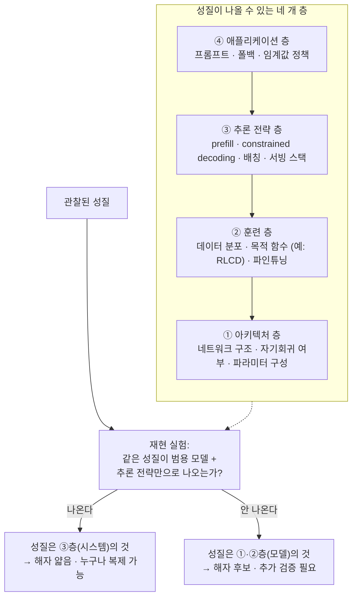
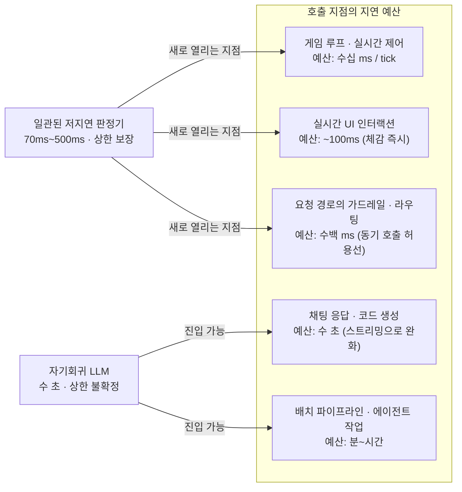

<figure class="post-figure post-figure--header">
<svg role="img" aria-label="System One 모델을 해부하는 그림. 가운데에 구조화 출력 전용 System One 모델이 있고, 위에서 state와 choices가 담긴 요청이 들어와 아래로 answer 하나가 담긴 구조화 응답이 나온다. 왼쪽에는 TypeSafe의 발표 주장 패널 — 가장 느린 응답도 500ms, Doom 실시간 플레이, 환각 면역 — 이, 오른쪽에는 Sean Goedecke의 재현 반박 패널 — prefill과 토큰 1개 생성, Qwen2.5-1.5B로 2~3배 가속, 실질적 해자 없음 — 이 모델을 향해 화살표를 겨눈다. 아래에는 시리즈 관통 질문인 '이 성질은 모델의 것인가, 시스템의 것인가?'가 적혀 있다." viewBox="0 0 680 292" xmlns="http://www.w3.org/2000/svg">
  <title>Jev 해부 — 발표 주장과 재현 반박 사이의 System One</title>
  <defs>
    <marker id="jev5-hd-arrow" viewBox="0 0 10 10" refX="8" refY="5" markerWidth="7" markerHeight="7" orient="auto-start-reverse">
      <path d="M0,0 L10,5 L0,10 z" fill="var(--secondary-color)"/>
    </marker>
  </defs>

  <!-- input request -->
  <rect x="250" y="16" width="180" height="30" rx="3" fill="var(--bg-light)" stroke="currentColor" stroke-width="1.5"/>
  <text x="340" y="35" text-anchor="middle" font-size="9.5" fill="currentColor" font-family="monospace">{ state, choices }</text>
  <line x1="340" y1="46" x2="340" y2="72" stroke="var(--secondary-color)" stroke-width="2" marker-end="url(#jev5-hd-arrow)"/>

  <!-- System One model (center) -->
  <rect x="245" y="76" width="190" height="98" rx="3" fill="var(--bg-panel)" stroke="var(--gold)" stroke-width="2.5"/>
  <text x="340" y="102" text-anchor="middle" font-size="13" fill="currentColor" font-weight="700">System One</text>
  <text x="340" y="121" text-anchor="middle" font-size="9" fill="currentColor" opacity="0.85">구조화 출력 전용</text>
  <text x="340" y="137" text-anchor="middle" font-size="9" fill="currentColor" opacity="0.85">단일 forward pass 판정</text>
  <text x="340" y="158" text-anchor="middle" font-size="10.5" fill="var(--accent-color)" font-weight="700">70ms ~ 500ms</text>

  <!-- output response -->
  <line x1="340" y1="174" x2="340" y2="200" stroke="var(--secondary-color)" stroke-width="2" marker-end="url(#jev5-hd-arrow)"/>
  <rect x="254" y="204" width="172" height="30" rx="3" fill="var(--bg-light)" stroke="currentColor" stroke-width="1.5"/>
  <text x="340" y="223" text-anchor="middle" font-size="9.5" fill="currentColor" font-family="monospace">{ "answer": "blue" }</text>

  <!-- claim panel (left) -->
  <rect x="24" y="82" width="192" height="112" rx="3" fill="var(--bg-light)" stroke="var(--accent-color)" stroke-width="2"/>
  <text x="120" y="104" text-anchor="middle" font-size="11" fill="currentColor" font-weight="700">발표 주장 (TypeSafe)</text>
  <text x="120" y="126" text-anchor="middle" font-size="9" fill="currentColor" opacity="0.85">가장 느린 응답도 500ms</text>
  <text x="120" y="143" text-anchor="middle" font-size="9" fill="currentColor" opacity="0.85">Doom 실시간 플레이</text>
  <text x="120" y="160" text-anchor="middle" font-size="9" fill="currentColor" opacity="0.85">“환각 면역” 주장</text>
  <text x="120" y="182" text-anchor="middle" font-size="8" fill="currentColor" opacity="0.6">→ 아키텍처의 마법?</text>
  <line x1="216" y1="132" x2="240" y2="132" stroke="var(--secondary-color)" stroke-width="2" marker-end="url(#jev5-hd-arrow)"/>

  <!-- rebuttal panel (right) -->
  <rect x="464" y="82" width="192" height="112" rx="3" fill="var(--bg-light)" stroke="var(--secondary-color)" stroke-width="2"/>
  <text x="560" y="104" text-anchor="middle" font-size="11" fill="currentColor" font-weight="700">재현 반박 (Goedecke)</text>
  <text x="560" y="126" text-anchor="middle" font-size="9" fill="currentColor" opacity="0.85">prefill + 토큰 1개 생성</text>
  <text x="560" y="143" text-anchor="middle" font-size="9" fill="currentColor" opacity="0.85">Qwen2.5-1.5B로 2~3배</text>
  <text x="560" y="160" text-anchor="middle" font-size="9" fill="currentColor" opacity="0.85">“실질적 해자 없음”</text>
  <text x="560" y="182" text-anchor="middle" font-size="8" fill="currentColor" opacity="0.6">→ 추론 전략의 성질?</text>
  <line x1="464" y1="132" x2="440" y2="132" stroke="var(--secondary-color)" stroke-width="2" marker-end="url(#jev5-hd-arrow)"/>

  <!-- series question -->
  <line x1="150" y1="254" x2="530" y2="254" stroke="currentColor" stroke-width="1" opacity="0.25"/>
  <text x="340" y="278" text-anchor="middle" font-size="12" fill="currentColor" font-weight="700" opacity="0.9">이 성질은 모델의 것인가, 시스템의 것인가?</text>
</svg>
<figcaption>System One 해부 — 발표 주장과 재현 반박을 나란히 놓고, 각 성질이 어느 층에서 나오는지 묻는다</figcaption>
</figure>

## 소개

1~4단계에서 네 개의 렌즈를 장착했습니다. 제약 디코딩이 logit 단계에서 무엇을 하는지(1단계), prefill과 generation의 비용이 왜 비대칭인지(2단계), 판단이라는 태스크가 분류기 → LLM-as-Judge → 판단 특화 모델로 어떻게 이어져 왔는지(3단계), 그리고 보정된 확률이 무엇이고 어떻게 검증하는지(4단계). 이제 그 렌즈로 **Jev 자체를 해부할 차례**입니다.

TypeSafe AI의 발표문은 강렬합니다. 자기회귀 텍스트 생성을 버린 "System One" 모델, 가장 빠른 응답 70ms에 가장 느린 응답조차 500ms, 실시간으로 Doom을 플레이하는 시연, 그리고 "환각 면역(hallucination immunity)"이라는 주장까지. 그러나 발표 직후 Sean Goedecke는 소형 오픈 모델로 재현 실험을 돌려 **그 속도의 상당 부분이 특별한 아키텍처 없이도 나온다**는 반박을 내놨습니다.

이 글은 양쪽을 다 진지하게 받습니다. 발표문을 그대로 받아쓰지도, 반박을 그대로 받아쓰지도 않고 — **"이 성질은 모델의 것인가, 시스템의 것인가?"**라는 시리즈 관통 질문을 판정 도구로 삼아, 주장과 반박이 각각 어느 층(layer)을 겨냥하는지 가려냅니다. 이 단계를 마치면 여러분은 Jev뿐 아니라 앞으로 나올 어떤 "혁명적 신모델" 발표도 같은 방법으로 해부할 수 있게 됩니다.

<div class="post-summary-box" markdown="1">

### 📌 이 글에서 다루는 내용

#### 🔍 핵심 주제

- **System One 모델의 구조**: 구조화 출력 전용 설계, 단일 forward pass 병렬 판정, 70ms~500ms 지연 프로파일
- **재현 실험과 해자 논쟁**: prefill + 단일 토큰 constrained decoding으로 속도를 재현한 반박과 "해자는 얇지만 프리미티브는 진짜"라는 결론
- **층 분해 프레임워크**: 차별점이 아키텍처 층인가 추론 전략 층인가를 증거 기반으로 가르는 방법

#### 🎯 주요 내용

1. **Jev의 주장**: 구조화 출력 전용 설계가 만드는 성질들 (속도·일관성·병렬성)과 Doom 시연의 의미
2. **Goedecke의 반박**: Qwen2.5-1.5B 재현 실험(2~3배 가속)의 구조와 그 반박이 커버하는 범위
3. **마케팅 주장의 기술적 평가**: "환각 면역"의 재해석(오류 형태의 전환), 공정한 벤치마크 비교의 조건
4. **저지연의 설계 공간**: 일관된 저지연이 여는 새 호출 지점 — 게임 루프, 실시간 UI, 가드레일

</div>

## 핵심 개념 — System One 모델의 구조

### 구조화 출력 전용이라는 설계 결정

일반 LLM은 자기회귀(autoregressive) 방식으로 동작합니다. 프롬프트를 받아 토큰을 하나 생성하고, 그 토큰을 입력에 붙여 다음 토큰을 생성하고 — 응답이 끝날 때까지 이 순차 루프를 돕니다. 유연하지만 느리고, 출력 형식은 (1단계에서 봤듯) 제약 디코딩 같은 별도 장치로 보장해야 합니다.

Jev는 이 루프 자체를 버렸다고 주장합니다. 입력은 여전히 평범한 영어 프롬프트지만, **출력은 구조화 데이터만** 내보냅니다.

```json
// 요청
{ "state": "What color is the sky?", "choices": ["blue", "red", "yellow"] }

// 응답 — 산문 없이 구조화 데이터만
{ "answer": "blue" }
```

"System One"이라는 이름은 Daniel Kahneman의 빠르고 직관적인 사고(System 1) / 느리고 숙고하는 사고(System 2) 구분에서 왔습니다. 숙고 — 즉 chain-of-thought나 test-time compute — 를 구조적으로 포기하는 대신, **판단 한 번의 비용을 밀리초 단위로 끌어내리겠다**는 설계 철학입니다. 대화형 모델이 "무엇이든 말할 수 있는" 범용성을 파는 물건이라면, Jev는 "정해진 선택지 중 하나를 고르는" 판정을 파는 물건입니다. TypeSafe의 슬로건 — "We're building prod, not God" — 이 이 트레이드오프를 압축합니다.

여기서 1단계의 렌즈가 바로 작동합니다. **선택지가 유한한 판단 태스크는 자유 형식 생성과 구조적으로 다릅니다.** 출력 공간이 `{blue, red, yellow}`처럼 닫혀 있으면, 모델이 해야 할 일은 "문장을 조립하는 것"이 아니라 "분포에서 하나를 고르는 것"으로 줄어듭니다. 이 축소가 Jev의 모든 성질 — 속도, 병렬성, 지연 상한 — 의 출발점입니다.

### 단일 forward pass 병렬 판정

자기회귀 생성의 비용은 출력 토큰 수에 비례해 **순차적으로** 쌓입니다(2단계). 반면 출력이 "선택지 하나"라면 필요한 계산은 forward pass 한 번입니다. 입력을 인코딩하고, 마지막 위치의 logit에서 선택지들의 점수를 읽으면 끝입니다. 앞 토큰이 끝나기를 기다릴 다음 토큰이 없으므로, 순차 루프가 통째로 사라집니다.

이 성질은 배칭과 결합할 때 더 강해집니다. 판정 하나가 forward pass 하나라면, **판정 여러 개를 한 배치에 묶어 단일 pass로 처리**할 수 있습니다. 4단계에서 참조한 Mike Taylor의 실사용 실험 — 37편 문서 × 21개 질문 = 777개 판단이 0.7초에 처리된 것 — 이 바로 이 구조의 결과입니다. 자기회귀 모델이라면 777개의 JSON 응답을 각각 토큰 단위로 순차 생성해야 했을 작업입니다.

<figure class="post-figure">
<svg role="img" aria-label="자기회귀 생성과 단일 forward pass 판정을 위아래로 비교한 그림. 위쪽 자기회귀 생성은 프롬프트에서 토큰 1, 토큰 2, 토큰 3이 순서대로 이어지고, 생성된 토큰을 입력에 다시 붙여 다음 토큰을 만드는 순차 루프가 점선으로 표시되어 지연이 출력 길이에 비례하고 분산이 크다. 아래쪽 단일 토큰 판정은 프롬프트와 선택지가 forward pass 한 번을 거쳐 마지막 위치의 logits에 도달하고, blue, red, yellow 세 선택지의 점수 막대 중 가장 긴 blue가 argmax로 선택된다. 순차 루프가 없어 판정 1회가 pass 1회이고, 배치로 묶으면 판정 N개도 1 pass로 처리된다." viewBox="0 0 680 330" xmlns="http://www.w3.org/2000/svg">
  <title>자기회귀 순차 루프 vs 단일 forward pass 판정</title>
  <defs>
    <marker id="jev5-fp-arrow" viewBox="0 0 10 10" refX="8" refY="5" markerWidth="7" markerHeight="7" orient="auto-start-reverse">
      <path d="M0,0 L10,5 L0,10 z" fill="var(--secondary-color)"/>
    </marker>
    <marker id="jev5-fp-loop" viewBox="0 0 10 10" refX="8" refY="5" markerWidth="6" markerHeight="6" orient="auto-start-reverse">
      <path d="M0,0 L10,5 L0,10 z" fill="var(--accent-color)"/>
    </marker>
  </defs>

  <!-- ===== TOP: autoregressive ===== -->
  <text x="24" y="26" font-size="11" fill="currentColor" font-weight="700" opacity="0.75">자기회귀 생성 — 순차 루프</text>
  <rect x="24" y="40" width="92" height="34" rx="3" fill="var(--bg-light)" stroke="currentColor" stroke-width="1.5"/>
  <text x="70" y="61" text-anchor="middle" font-size="9.5" fill="currentColor" font-weight="700">프롬프트</text>
  <line x1="116" y1="57" x2="146" y2="57" stroke="var(--secondary-color)" stroke-width="2" marker-end="url(#jev5-fp-arrow)"/>
  <rect x="150" y="40" width="56" height="34" rx="3" fill="var(--bg-panel)" stroke="var(--accent-color)" stroke-width="2"/>
  <text x="178" y="61" text-anchor="middle" font-size="9.5" fill="currentColor" font-weight="700">토큰 1</text>
  <line x1="206" y1="57" x2="234" y2="57" stroke="var(--secondary-color)" stroke-width="2" marker-end="url(#jev5-fp-arrow)"/>
  <rect x="238" y="40" width="56" height="34" rx="3" fill="var(--bg-panel)" stroke="var(--accent-color)" stroke-width="2"/>
  <text x="266" y="61" text-anchor="middle" font-size="9.5" fill="currentColor" font-weight="700">토큰 2</text>
  <line x1="294" y1="57" x2="322" y2="57" stroke="var(--secondary-color)" stroke-width="2" marker-end="url(#jev5-fp-arrow)"/>
  <rect x="326" y="40" width="56" height="34" rx="3" fill="var(--bg-panel)" stroke="var(--accent-color)" stroke-width="2"/>
  <text x="354" y="61" text-anchor="middle" font-size="9.5" fill="currentColor" font-weight="700">토큰 3</text>
  <text x="404" y="62" text-anchor="middle" font-size="12" fill="currentColor" opacity="0.7">…</text>
  <rect x="426" y="40" width="56" height="34" rx="3" fill="var(--bg-panel)" stroke="var(--accent-color)" stroke-width="2"/>
  <text x="454" y="61" text-anchor="middle" font-size="9.5" fill="currentColor" font-weight="700">토큰 n</text>
  <!-- loop back -->
  <path d="M 454 74 L 454 100 L 70 100 L 70 78" fill="none" stroke="var(--accent-color)" stroke-width="1.6" stroke-dasharray="5 4" marker-end="url(#jev5-fp-loop)"/>
  <text x="262" y="114" text-anchor="middle" font-size="8.5" fill="var(--accent-color)" opacity="0.95">출력 토큰을 입력에 붙여 다음 토큰 생성 — 끝날 때까지 반복</text>
  <text x="560" y="52" text-anchor="middle" font-size="9" fill="currentColor" opacity="0.75">지연 ∝ 출력 길이</text>
  <text x="560" y="68" text-anchor="middle" font-size="9" fill="currentColor" opacity="0.75">순차 · 분산 큼</text>

  <!-- divider -->
  <line x1="24" y1="138" x2="656" y2="138" stroke="currentColor" stroke-width="1" opacity="0.2"/>

  <!-- ===== BOTTOM: single forward pass ===== -->
  <text x="24" y="164" font-size="11" fill="currentColor" font-weight="700" opacity="0.75">단일 토큰 판정 — forward pass 1회</text>
  <rect x="24" y="180" width="136" height="52" rx="3" fill="var(--bg-light)" stroke="currentColor" stroke-width="1.5"/>
  <text x="92" y="201" text-anchor="middle" font-size="9.5" fill="currentColor" font-weight="700">프롬프트 + 선택지</text>
  <text x="92" y="219" text-anchor="middle" font-size="8.5" fill="currentColor" opacity="0.8" font-family="monospace">{blue, red, yellow}</text>
  <line x1="160" y1="206" x2="196" y2="206" stroke="var(--secondary-color)" stroke-width="2" marker-end="url(#jev5-fp-arrow)"/>
  <rect x="200" y="180" width="140" height="52" rx="3" fill="var(--bg-panel)" stroke="var(--gold)" stroke-width="2.5"/>
  <text x="270" y="201" text-anchor="middle" font-size="10" fill="currentColor" font-weight="700">Forward Pass</text>
  <text x="270" y="219" text-anchor="middle" font-size="8.5" fill="currentColor" opacity="0.8">1회 · 병렬 인코딩</text>
  <line x1="340" y1="206" x2="376" y2="206" stroke="var(--secondary-color)" stroke-width="2" marker-end="url(#jev5-fp-arrow)"/>
  <!-- logits panel -->
  <rect x="380" y="164" width="276" height="96" rx="3" fill="var(--bg-light)" stroke="currentColor" stroke-width="1.5"/>
  <text x="518" y="182" text-anchor="middle" font-size="9" fill="currentColor" font-weight="700">마지막 위치 logits — 선택지 점수만 읽기</text>
  <text x="418" y="203" text-anchor="end" font-size="8.5" fill="currentColor" font-family="monospace">blue</text>
  <rect x="426" y="194" width="118" height="11" fill="var(--secondary-color)"/>
  <text x="552" y="203" font-size="8.5" fill="var(--secondary-color)" font-weight="700">◀ argmax 선택</text>
  <text x="418" y="223" text-anchor="end" font-size="8.5" fill="currentColor" font-family="monospace">red</text>
  <rect x="426" y="214" width="34" height="11" fill="currentColor" opacity="0.35"/>
  <text x="418" y="243" text-anchor="end" font-size="8.5" fill="currentColor" font-family="monospace">yellow</text>
  <rect x="426" y="234" width="58" height="11" fill="currentColor" opacity="0.35"/>

  <!-- bottom note -->
  <text x="340" y="292" text-anchor="middle" font-size="9.5" fill="currentColor" font-weight="700" opacity="0.85">순차 루프 없음 — 판정 1회 = pass 1회, 배치로 묶으면 판정 N개도 1 pass</text>
  <text x="340" y="312" text-anchor="middle" font-size="8.5" fill="currentColor" opacity="0.6">(777개 판단 0.7초 처리의 구조적 배경)</text>
</svg>
<figcaption>자기회귀 순차 루프 vs 단일 forward pass 판정 — 출력 공간이 닫히면 순차 루프가 통째로 사라진다</figcaption>
</figure>

### 지연 시간 프로파일: 70ms~500ms — 평균이 아니라 상한이 핵심

Jev의 속도 주장에서 진짜 흥미로운 숫자는 70ms가 아니라 **500ms**입니다.

> 가장 빠른 응답이 (일반 LLM의 수 초 대비) 약 70ms다. 더 좋은 건, 가장 *느린* 응답조차 500ms에 불과하다는 점이다. — Sean Goedecke

자기회귀 모델의 지연은 출력 길이에 비례하므로 **분산이 큽니다.** 같은 모델이 짧은 답엔 1초, 긴 답엔 20초를 씁니다. 이 분산 때문에 자기회귀 LLM은 "언젠가 끝나는" 비동기 작업으로만 시스템에 꽂을 수 있습니다. 반면 출력이 항상 판정 하나라면 지연의 상한이 구조적으로 낮게 고정됩니다. 시스템 설계자 입장에서 이것은 평균 속도의 개선이 아니라 **계약(contract)의 변화**입니다 — "이 호출은 최악의 경우에도 500ms 안에 돌아온다"는 보장이 있어야 동기(synchronous) 경로, 즉 요청을 블록하는 자리에 모델을 꽂을 수 있기 때문입니다.

<figure class="post-figure">
<svg role="img" aria-label="두 모델의 지연 분포를 위아래 두 개의 시간 축으로 비교한 개념도. 위쪽 자기회귀 LLM의 축에는 1초부터 20초 이상까지 넓게 퍼진 지연 띠가 있고, 오른쪽 끝은 점선 화살표로 이어지며 상한 불확정이라고 표시된다. 분산이 커서 언젠가 끝나는 비동기 작업으로만 쓸 수 있다. 아래쪽 일관된 저지연 판정기의 축에는 70ms에서 500ms 사이의 좁은 띠가 있고, 500ms 위치에 굵은 세로선이 상한은 계약이라는 이름으로 그어져 있다. 최악의 경우에도 이 선 안쪽이라는 보장이 있어야 게임 루프, 실시간 UI, 요청 경로 가드레일 같은 동기 지점에 모델을 꽂을 수 있다. 두 축은 축척이 다른 개념도다." viewBox="0 0 680 292" xmlns="http://www.w3.org/2000/svg">
  <title>지연 분포 vs 상한 계약 — 평균이 아니라 최악 지연의 보장이 호출 지점을 결정한다</title>
  <defs>
    <marker id="jev5-lat-arrow" viewBox="0 0 10 10" refX="8" refY="5" markerWidth="7" markerHeight="7" orient="auto-start-reverse">
      <path d="M0,0 L10,5 L0,10 z" fill="currentColor"/>
    </marker>
  </defs>

  <!-- ===== TOP: autoregressive ===== -->
  <text x="24" y="30" font-size="11" fill="currentColor" font-weight="700" opacity="0.75">자기회귀 LLM — 지연 ∝ 출력 길이</text>
  <line x1="24" y1="82" x2="600" y2="82" stroke="currentColor" stroke-width="1.5" opacity="0.45" marker-end="url(#jev5-lat-arrow)"/>
  <rect x="110" y="52" width="360" height="20" rx="2" fill="var(--bg-light)" stroke="currentColor" stroke-width="1.5"/>
  <text x="290" y="66" text-anchor="middle" font-size="8.5" fill="currentColor" opacity="0.85">응답마다 널뛰는 지연 — 분산 큼</text>
  <line x1="470" y1="62" x2="560" y2="62" stroke="currentColor" stroke-width="1.5" stroke-dasharray="5 4" opacity="0.7" marker-end="url(#jev5-lat-arrow)"/>
  <text x="516" y="48" text-anchor="middle" font-size="8.5" fill="var(--accent-color)" font-weight="700">상한 불확정</text>
  <text x="110" y="98" text-anchor="middle" font-size="8.5" fill="currentColor" opacity="0.7">짧은 답 ~1초</text>
  <text x="470" y="98" text-anchor="middle" font-size="8.5" fill="currentColor" opacity="0.7">긴 답 20초+</text>
  <text x="24" y="122" font-size="9" fill="currentColor" opacity="0.8">→ “언젠가 끝나는” 비동기 작업으로만 시스템에 꽂을 수 있음</text>

  <!-- divider -->
  <line x1="24" y1="140" x2="656" y2="140" stroke="currentColor" stroke-width="1" opacity="0.2"/>

  <!-- ===== BOTTOM: bounded-latency judge ===== -->
  <text x="24" y="166" font-size="11" fill="currentColor" font-weight="700" opacity="0.75">일관된 저지연 판정기 — 출력은 항상 판정 1개</text>
  <line x1="24" y1="216" x2="600" y2="216" stroke="currentColor" stroke-width="1.5" opacity="0.45" marker-end="url(#jev5-lat-arrow)"/>
  <rect x="60" y="186" width="170" height="20" rx="2" fill="var(--bg-light)" stroke="var(--secondary-color)" stroke-width="2"/>
  <text x="145" y="200" text-anchor="middle" font-size="8.5" fill="currentColor" opacity="0.9">좁은 지연 띠</text>
  <text x="60" y="232" text-anchor="middle" font-size="8.5" fill="currentColor" opacity="0.7">70ms</text>
  <text x="230" y="232" text-anchor="middle" font-size="8.5" fill="currentColor" opacity="0.7">500ms</text>
  <!-- contract ceiling -->
  <line x1="230" y1="172" x2="230" y2="222" stroke="var(--accent-color)" stroke-width="3"/>
  <text x="242" y="180" font-size="10" fill="var(--accent-color)" font-weight="700">상한 = 계약(contract)</text>
  <text x="242" y="198" font-size="8.5" fill="currentColor" opacity="0.85">최악의 경우에도 이 선 안쪽이라는 보장</text>
  <text x="24" y="256" font-size="9" fill="currentColor" opacity="0.8">→ 동기(synchronous) 경로 진입 가능 — 게임 루프 · 실시간 UI · 요청 경로 가드레일</text>
  <text x="600" y="282" text-anchor="end" font-size="8" fill="currentColor" opacity="0.55">(개념도 — 두 축의 축척은 다름)</text>
</svg>
<figcaption>지연 분포의 차이 — 평균 속도가 아니라 최악 지연의 상한이, 모델을 꽂을 수 있는 호출 지점을 결정한다</figcaption>
</figure>

### Doom 시연이 상징하는 것

가장 인상적인 시연은 Jev가 **Doom을 실시간으로 플레이**한다는 것이었습니다. 중요한 것은 게임 실력이 아닙니다. 게임 전용으로 학습된 특화 네트워크가 아니라 다양한 판단 과제를 처리하는 범용 모델이, **게임 루프의 틱(tick) 안에 응답을 돌려줄 수 있다**는 사실 자체입니다.

Goedecke는 여기서 Nelson Elhage를 인용합니다 — "빠른 소프트웨어는 같은 일을 더 빠르게 한다는 뜻이 아니라, 완전히 새로운 종류의 일을 할 수 있다는 뜻이다." 수 초짜리 지능으로 만들 수 있는 것은 챗봇과 배치 파이프라인뿐입니다. 70ms짜리 지능은 호출 지점 자체가 다른 애플리케이션을 엽니다. 이 관점은 뒤의 분석에서 다시 다룹니다.

## 분석

### 반박 — 그 속도, 기존 LLM에서도 나온다

발표문이 화제가 되자 Goedecke는 질문 하나를 실험으로 바꿨습니다: **"이 속도는 아키텍처가 없으면 불가능한가?"**

그의 관찰은 2단계의 비용 구조에서 곧장 나옵니다. 선택지가 제한된 판단 태스크라면, 기존 자기회귀 LLM에서도 다음 세 수를 쓸 수 있습니다.

1. 응답을 `{ "choice": "`까지 **prefill**해 둔다 — prefill은 병렬 인코딩이라 저렴하다
2. 사용자가 준 선택지로 logit을 제약해 **토큰 1개만 생성**한다 — 순차 generation이 한 스텝으로 줄어든다
3. 여러 판정은 표준 추론 배칭으로 **단일 forward pass에 묶는다**

의사 코드로 쓰면 이 정도로 단순합니다.

```python
# prefill + 단일 토큰 constrained decoding (개념 스케치)
prompt = build_prompt(state, choices)
prefix = '{ "choice": "'                # 응답 접두사를 미리 채워 넣는다

logits = model.forward(prompt + prefix)  # prefill — 병렬 인코딩, 1 pass
mask = allowed_first_tokens(choices)     # 선택지의 첫 토큰만 허용
answer = argmax(logits[-1][mask])        # 생성은 제약된 토큰 1개로 끝
```

그리고 직접 돌렸습니다.

> `Qwen2.5-1.5B-Instruct`로 직접 해봤더니, prefix 없는 structured output 대비 **2~3배 속도 향상**을 얻었다.

발표 이후 다른 사람들도 같은 접근을 재현해 유사한 성과를 냈습니다. 여기서 Goedecke의 결론이 나옵니다: **"Jev에게 실질적인 기술적 해자는 없다."** 어떤 LLM이든 — 그의 표현으로는 "Terra급 모델 아무거나" — 단일 토큰 추론 스택에 태우면 비슷한 결과가 나올 수 있다는 것입니다.

이 재현 실험이 시리즈 전체에서 가장 중요한 장면입니다. 마케팅 주장("혁명적 아키텍처")을 반박하는 데 필요했던 것은 내부 정보도 대규모 자원도 아니고, **비용 구조에 대한 이해(2단계)와 소형 오픈 모델 하나**였습니다.

### 층 분해 — 이 성질은 어느 층의 것인가

이제 시리즈 관통 질문을 정면으로 다룰 차례입니다. "이 성질은 모델의 것인가, 시스템의 것인가?"를 Jev에 적용하려면, 먼저 "모델"과 "시스템"을 층으로 분해해야 합니다. LLM 제품의 성질은 대략 네 개 층 어딘가에서 나옵니다.



이 프레임워크로 Jev의 주장들을 하나씩 배치해 봅니다.

| 관찰된 성질 | 발표문의 암시 | 재현 실험의 판정 | 귀속 층 |
|---|---|---|---|
| 낮은 지연 (70ms급) | 아키텍처 (①) | prefill + 단일 토큰으로 2~3x 재현됨 | **추론 전략 (③)** 이 대부분 |
| 지연 상한 (최악 500ms) | 아키텍처 (①) | 출력이 1토큰이면 상한은 자동으로 낮아짐 | **추론 전략 (③)** + 서빙 설계 |
| 병렬 판정 (단일 pass에 다수) | 아키텍처 (①) | 표준 추론 배칭으로 재현됨 | **추론 전략 (③)** |
| 형식 보장 (구조화 출력만) | 아키텍처 (①) | constrained decoding으로 기존 LLM도 보장 (1단계) | **추론 전략 (③)** |
| 보정된 확률 (RLCD) | 훈련 (②) | 추론 전략만으로는 재현 안 됨 — 4단계에서 다룸 | **훈련 (②)** — 검증 필요 |
| 같은 지연에서의 판단 정확도 | 훈련+아키텍처 | **미판정** — 공정 벤치마크 부재 | 열린 질문 |

표가 보여주는 그림은 명확합니다. 발표문이 아키텍처의 마법처럼 제시한 성질들 — 속도, 상한, 병렬성, 형식 보장 — 은 재현 실험을 통과하면서 대부분 **③ 추론 전략 층**으로 내려왔습니다. 즉 "시스템의 성질"입니다. 반면 아직 모델(①·②층)에 남아 있을 수 있는 것은 두 가지, **보정**과 **같은 지연에서의 정확도**입니다.

### 반박의 사거리 — 속도는 반박됐지만 품질은 아니다

여기서 Goedecke의 반박을 과대해석하지 않는 것이 중요합니다. "prefill + 단일 토큰으로 재현 가능"은 **속도에 대한 반박이지, 품질에 대한 반박이 아닙니다.**

판단 태스크 전용으로 학습(또는 파인튜닝)된 모델이, 같은 지연 시간 예산 안에서 범용 모델 + 추론 전략 조합보다 **더 나은 선택 정확도**를 낼 가능성은 Goedecke 자신도 열어 둡니다. 이것을 판정하려면 어떤 실험이 필요할까요? 조건을 명시하면 이렇습니다.

**공정한 벤치마크의 조건:**

1. **상대 모델에게도 최적 추론 전략을 준다.** TypeSafe의 비교 벤치마크에 대해 Goedecke가 아쉬워한 지점이 정확히 이것입니다 — 상대 모델에게 불필요한 토큰별 JSON 생성을 강제한 비교는, 아키텍처의 우위가 아니라 추론 전략의 차이를 측정한 것입니다. 공정한 비교라면 상대에게도 prefill + 단일 토큰 스택을 태워야 합니다.
2. **지연 시간을 통제 변수로 고정한다.** "빠르고 정확하다"는 두 주장을 합치면 검증이 불가능해집니다. "지연 X ms 이하에서의 정확도"로 축을 고정해야 훈련 층의 기여가 분리됩니다.
3. **보정을 별도 축으로 측정한다.** 정확도(accuracy)와 보정(calibration)은 다른 성질입니다(4단계). reliability diagram과 ECE를 정확도 표와 나란히 요구해야 합니다.
4. **도메인 분포를 명시한다.** 벤더가 고른 태스크 분포에서의 성적은 자기 도메인으로 이전되지 않을 수 있습니다 — 도입 전 자기 데이터 검증(4단계의 절차)이 여전히 필요합니다.

이 네 조건을 채운 비교가 나오기 전까지, "Jev의 모델 자체가 우월한가"는 **판정 불가**로 남습니다. 그리고 그것이 정직한 결론입니다 — 증거가 없는 곳에서 단정하지 않는 것도 프레임워크의 일부입니다.

### "환각 면역"의 재해석 — 오류는 사라지지 않고 형태를 바꾼다

TypeSafe의 마케팅 중 가장 강한 주장이 "환각 면역(hallucination immunity)"입니다. Goedecke는 이를 **"의미론적 회피(semantic dodge)"**라고 잘라 말합니다.

논리를 풀어 보면 이렇습니다. Jev는 사용자가 준 선택지 안에서만 답합니다. 따라서 존재하지 않는 API를 지어내거나 없는 판례를 인용하는 식의 — "내용을 지어내는" — 환각은 정의상 불가능합니다. 여기까지는 사실입니다. 그러나 Jev도 하늘 색깔을 묻는 질문에 `"red"`를 고를 수 있습니다. TypeSafe의 논리는 "그것은 환각이 아니라 실수(mistake)"라는 것인데 — **이 구분은 constrained decoding을 쓰는 모든 LLM에 똑같이 적용됩니다**(1단계에서 본 형식 보장 ≠ 내용 정확성). 즉 Jev 고유의 신뢰성 우위가 아니라, 제약 출력이라는 방식 일반의 성질을 자기 제품의 면역력처럼 재포장한 것입니다.

실무자에게 유용한 재해석은 이렇습니다: **제약 출력은 오류를 제거하는 게 아니라 오류의 형태를 바꿉니다.**

- 자유 형식 생성의 오류: **그럴듯한 거짓말** — 표면적으로 유창해서 파싱은 되지만 내용이 허구
- 제약 출력의 오류: **자신 있는 오답** — 형식은 완벽하게 유효하지만 선택이 틀림

형태의 전환에는 실질적 이점이 있습니다. "자신 있는 오답"은 형식이 보장되므로 **프로그램으로 다루기 쉽고**, 확률이 함께 오면 임계값으로 걸러낼 수 있습니다(이것이 6단계의 주제입니다). 그러나 오류율 자체가 0이 된 것은 아니므로, 평가 지표는 여전히 선택 정확도여야 하고, 검증 없는 신뢰는 여전히 위험합니다. "면역"이라는 단어에서 멈추지 말고 "그래서 오류는 어떤 형태로 남는가?"를 묻는 것 — 이것이 마케팅 용어를 기술적으로 평가하는 자세입니다.

### 일관된 저지연이 여는 새 호출 지점

해자 논쟁을 한 겹 걷어내고 나면, 양쪽이 **동의하는** 지점이 드러납니다. 속도의 출처가 아키텍처든 추론 전략이든, "일관되게 빠른 구조화 출력"이라는 프리미티브 자체는 진짜이고, 그것이 여는 설계 공간도 진짜라는 것입니다.

핵심은 지연 시간을 성능 지표가 아니라 **호출 지점(call site)을 결정하는 축**으로 보는 관점입니다. 어떤 코드 위치에 모델 호출을 꽂을 수 있는가는 그 위치의 지연 예산이 결정합니다.



각 지점을 구체화하면:

- **게임 루프 · 실시간 제어**: Doom 시연이 상징하는 영역. 매 틱마다 "지금 상태에서 어떤 행동인가?"를 판정. 틱 예산 안에 응답 상한이 들어와야 하므로, 평균이 아니라 **최악 지연의 보장**이 진입 조건입니다.
- **실시간 UI**: 키 입력·저장 시점마다 도는 판정 — "이 문단은 근거 없는 반복인가?" 같은 검사(Mike Taylor의 "지식 노동의 린터"). 100ms 안팎이어야 사용자가 흐름이 끊긴다고 느끼지 않습니다.
- **가드레일 · 라우팅**: 요청 경로 한가운데서 "이 행동은 위험한가?", "이 요청은 어느 큐로?"를 동기적으로 판정. 수 초짜리 모델은 이 자리에 못 들어갑니다 — 모든 요청의 지연에 그대로 얹히기 때문입니다. 상한 500ms급 판정기는 처음으로 이 자리에 들어갈 수 있는 모델 계층입니다.

"의사결정 지점마다 100ms짜리 헐값 지능을 주입한다"는 Goedecke의 표현이 이 그림의 요약입니다. 챗봇 시대의 모델이 **목적지**(사용자가 모델과 대화하러 감)였다면, 저지연 판정기는 **경유지**(코드 경로가 지나가며 물어봄)입니다. 어디에 꽂을지는 6단계에서 설계 패턴으로 다룹니다.

### 그래서, 모델의 것인가 시스템의 것인가

시리즈 관통 질문에 대한 이 단계의 답을 정리합니다.

**속도·상한·병렬성·형식 보장은 시스템의 성질입니다.** 재현 실험이 보여줬듯, 이 성질들은 범용 LLM + 올바른 추론 전략(prefill, 단일 토큰 constrained decoding, 배칭)으로 대부분 복제됩니다. 그래서 해자는 얇습니다 — "GPT-x-System-One" 같은 변종을 주요 랩이 내놓는 순간 경쟁이 시작될 수 있고, Goedecke는 실제로 그런 경쟁을 환영한다고 씁니다.

**보정과 (미검증인) 같은 지연에서의 정확도는 모델의 성질일 수 있습니다.** RLCD 같은 훈련 층의 기여는 추론 전략으로 복제되지 않으며, 이것이 사실이라면 얇은 해자 안쪽의 진짜 차별점입니다. 다만 벤더 주장 단계이므로, 4단계의 절차 — 자기 도메인 데이터로 보정 곡선을 직접 검증 — 를 통과해야 합니다.

**그리고 프리미티브는 귀속과 무관하게 진짜입니다.** "일관되게 빠른 구조화 판정"이라는 부품이 존재할 수 있음이 증명됐다는 사실 자체가, 그것이 Jev의 것이든 아무 모델 + 추론 스택의 것이든, 시스템 설계자의 어휘를 바꿉니다. 해자 논쟁은 "누가 이 시장을 가져가는가"의 문제이지 "이 부품이 존재하는가"의 문제가 아닙니다.

이 삼단 결론 — **해자는 얇고, 훈련 층의 차별점은 검증 대기 중이며, 프리미티브는 진짜다** — 이 발표문과 반박을 모두 소화한 뒤에 남는 정직한 잔고입니다.

## 정리

- **System One의 정체**: 자기회귀 순차 생성을 버리고 구조화 출력만 내보내는 판단 특화 설계 — 유한한 선택지라는 출력 공간의 축소가 속도(70ms)·지연 상한(500ms)·단일 forward pass 병렬 판정의 출발점입니다
- **상한이 계약이다**: 저지연의 핵심 가치는 평균이 아니라 최악 지연의 보장 — 그 보장이 있어야 동기 경로(게임 루프·실시간 UI·가드레일)에 모델을 꽂을 수 있습니다
- **재현 실험의 판정**: prefill + 단일 토큰 constrained decoding + 배칭으로 기존 LLM(Qwen2.5-1.5B)에서 2~3배 가속이 재현됨 — 속도·병렬성·형식 보장은 아키텍처 층이 아니라 **추론 전략 층의 성질**입니다
- **반박의 사거리를 정확히 재라**: 속도는 반박됐지만 품질은 미판정 — "같은 지연 예산에서의 정확도" 벤치마크(상대에게도 최적 추론 전략, 지연 고정, 보정 별도 측정, 도메인 명시)가 나와야 훈련 층의 기여를 가릴 수 있습니다
- **"환각 면역"은 오류 형태의 전환**: 제약 출력은 "그럴듯한 거짓말"을 "자신 있는 오답"으로 바꿀 뿐 오류를 없애지 않음 — 이 성질은 constrained decoding 일반의 것이지 Jev 고유의 것이 아닙니다
- **최종 잔고**: 해자는 얇지만(시스템으로 복제 가능), 보정이라는 훈련 층 차별점은 검증 대기 중이고, "일관된 저지연 구조화 판정"이라는 프리미티브 자체는 진짜입니다

다음 단계에서는 관점을 해부에서 활용으로 돌립니다. 보정된 확률이라는 출력을 실제 코드에 꽂는 법 — 판단 지점의 목록화, 확률 + 임계값 + 폴백 아키텍처, 그리고 "지식 노동의 린터"라는 배치 패턴을 다룹니다.

### 다음 학습 (Next Learning)

- [JEV Essential Curriculum](/2026/09/21/jev-essential-curriculum.html) — 시리즈 전체 로드맵과 진행 현황
- [4단계: 확률 보정 (Calibration) — 신뢰할 수 있는 확률의 조건](/2026/09/21/jev-probability-calibration.html) — 이 글이 "검증 대기 중"이라 판정한 훈련 층 차별점(RLCD·보정)의 배경
- [6단계: 판단을 코드에 꽂기 — 확률 + 임계값 설계 패턴](/2026/09/21/jev-probability-threshold-design-pattern.html) — 해부를 마친 판정기를 소프트웨어 부품으로 쓰는 법
- [2단계: 자기회귀 추론의 비용 구조 — prefill vs generation](/2026/09/21/jev-autoregressive-inference-cost-structure.html) — 이 글의 속도 반박(prefill + 단일 토큰)을 지탱하는 기술적 근거
- [Jev와 구조화 출력의 재발견 (Sean Goedecke)](/2026/09/20/jev-structured-output-interesting-again.html) — 이 단계의 뼈대가 된 원문 분석 포스트
