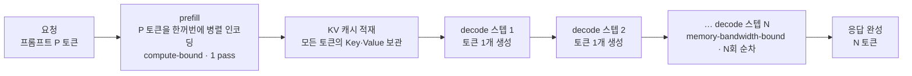
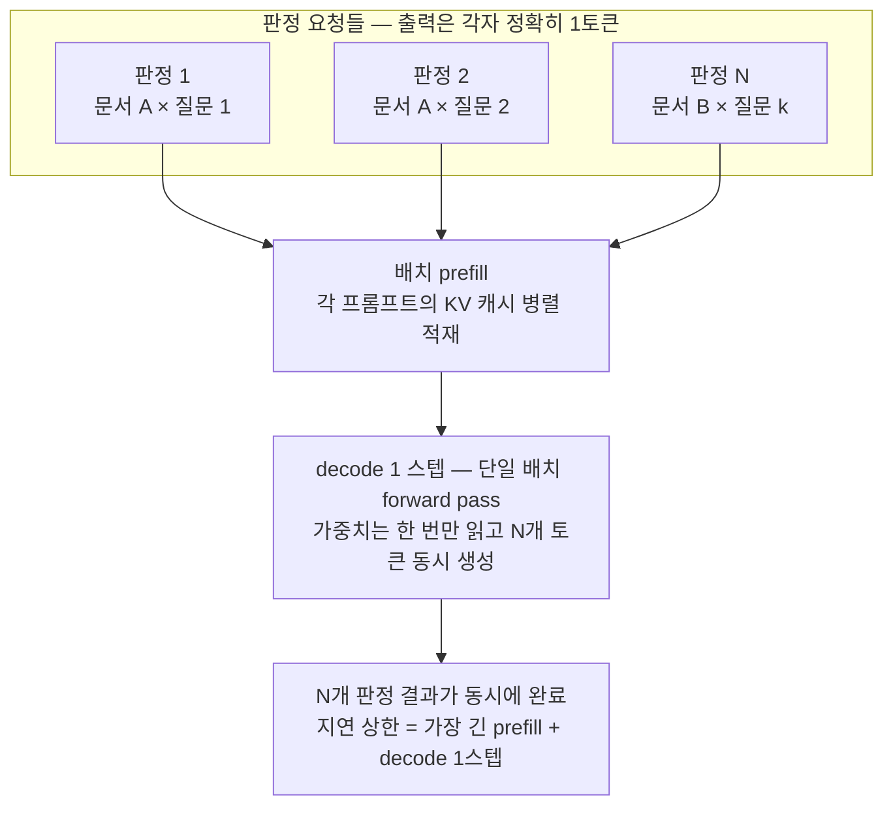

<figure class="post-figure post-figure--header">
  <svg role="img" aria-label="자기회귀 추론의 두 단계 — 프롬프트 전체를 한 번에 병렬 인코딩하는 prefill과, 토큰마다 가중치 전체를 다시 읽으며 한 토큰씩 순차 생성하는 decode의 비용 비대칭" viewBox="0 0 640 280" xmlns="http://www.w3.org/2000/svg">
    <defs>
      <marker id="jev2-arh-g" markerWidth="8" markerHeight="8" refX="6" refY="3" orient="auto"><path d="M0,0 L6,3 L0,6 Z" fill="var(--secondary-color)"/></marker>
      <marker id="jev2-arh-a" markerWidth="8" markerHeight="8" refX="6" refY="3" orient="auto"><path d="M0,0 L6,3 L0,6 Z" fill="var(--accent-color)"/></marker>
      <marker id="jev2-arh-w" markerWidth="8" markerHeight="8" refX="6" refY="3" orient="auto"><path d="M0,0 L6,3 L0,6 Z" fill="var(--gold)"/></marker>
    </defs>
    <line x1="320" y1="26" x2="320" y2="262" stroke="currentColor" stroke-opacity="0.3" stroke-dasharray="4 4"/>
    <text x="166" y="34" text-anchor="middle" font-size="14" font-weight="700" fill="var(--secondary-color)">PREFILL — 병렬 · 1 pass</text>
    <text x="166" y="54" text-anchor="middle" font-size="10" fill="currentColor" opacity="0.7">프롬프트 P 토큰</text>
    <rect x="40" y="60" width="34" height="26" rx="3" fill="none" stroke="currentColor" stroke-width="1.5"/>
    <rect x="82" y="60" width="34" height="26" rx="3" fill="none" stroke="currentColor" stroke-width="1.5"/>
    <rect x="124" y="60" width="34" height="26" rx="3" fill="none" stroke="currentColor" stroke-width="1.5"/>
    <rect x="166" y="60" width="34" height="26" rx="3" fill="none" stroke="currentColor" stroke-width="1.5"/>
    <rect x="208" y="60" width="34" height="26" rx="3" fill="none" stroke="currentColor" stroke-width="1.5"/>
    <rect x="250" y="60" width="34" height="26" rx="3" fill="none" stroke="currentColor" stroke-width="1.5"/>
    <line x1="57" y1="90" x2="57" y2="112" stroke="var(--secondary-color)" stroke-width="1.5" marker-end="url(#jev2-arh-g)"/>
    <line x1="99" y1="90" x2="99" y2="112" stroke="var(--secondary-color)" stroke-width="1.5" marker-end="url(#jev2-arh-g)"/>
    <line x1="141" y1="90" x2="141" y2="112" stroke="var(--secondary-color)" stroke-width="1.5" marker-end="url(#jev2-arh-g)"/>
    <line x1="183" y1="90" x2="183" y2="112" stroke="var(--secondary-color)" stroke-width="1.5" marker-end="url(#jev2-arh-g)"/>
    <line x1="225" y1="90" x2="225" y2="112" stroke="var(--secondary-color)" stroke-width="1.5" marker-end="url(#jev2-arh-g)"/>
    <line x1="267" y1="90" x2="267" y2="112" stroke="var(--secondary-color)" stroke-width="1.5" marker-end="url(#jev2-arh-g)"/>
    <rect x="40" y="118" width="244" height="46" rx="4" fill="none" stroke="var(--secondary-color)" stroke-width="2"/>
    <text x="162" y="138" text-anchor="middle" font-size="11" font-weight="700" fill="currentColor">1 forward pass</text>
    <text x="162" y="155" text-anchor="middle" font-size="11" fill="currentColor" opacity="0.8">행렬×행렬 연산</text>
    <rect x="116" y="196" width="92" height="30" rx="3" fill="var(--gold-soft)" stroke="var(--gold)" stroke-width="2"/>
    <text x="162" y="216" text-anchor="middle" font-size="11" fill="currentColor">가중치 W</text>
    <line x1="162" y1="194" x2="162" y2="170" stroke="var(--gold)" stroke-width="1.5" marker-end="url(#jev2-arh-w)"/>
    <text x="162" y="248" text-anchor="middle" font-size="11" fill="currentColor" opacity="0.75">1회 읽어 P 토큰에 재사용</text>
    <text x="162" y="268" text-anchor="middle" font-size="12" font-weight="700" fill="var(--secondary-color)">compute-bound</text>
    <text x="480" y="34" text-anchor="middle" font-size="14" font-weight="700" fill="var(--accent-color)">DECODE — 순차 · N pass</text>
    <rect x="356" y="52" width="248" height="26" rx="3" fill="var(--gold-soft)" stroke="var(--gold)" stroke-width="2"/>
    <text x="480" y="69" text-anchor="middle" font-size="11" fill="currentColor">가중치 W — 매 스텝 전체 다시 읽기</text>
    <line x1="381" y1="82" x2="381" y2="124" stroke="var(--gold)" stroke-width="1.5" stroke-dasharray="3 3" marker-end="url(#jev2-arh-w)"/>
    <line x1="445" y1="82" x2="445" y2="124" stroke="var(--gold)" stroke-width="1.5" stroke-dasharray="3 3" marker-end="url(#jev2-arh-w)"/>
    <line x1="509" y1="82" x2="509" y2="124" stroke="var(--gold)" stroke-width="1.5" stroke-dasharray="3 3" marker-end="url(#jev2-arh-w)"/>
    <line x1="573" y1="82" x2="573" y2="124" stroke="var(--gold)" stroke-width="1.5" stroke-dasharray="3 3" marker-end="url(#jev2-arh-w)"/>
    <rect x="364" y="130" width="34" height="34" rx="3" fill="none" stroke="var(--accent-color)" stroke-width="2"/>
    <rect x="428" y="130" width="34" height="34" rx="3" fill="none" stroke="var(--accent-color)" stroke-width="2"/>
    <rect x="492" y="130" width="34" height="34" rx="3" fill="none" stroke="var(--accent-color)" stroke-width="2"/>
    <rect x="556" y="130" width="34" height="34" rx="3" fill="none" stroke="var(--accent-color)" stroke-width="2"/>
    <text x="381" y="152" text-anchor="middle" font-size="12" fill="var(--accent-color)">+1</text>
    <text x="445" y="152" text-anchor="middle" font-size="12" fill="var(--accent-color)">+1</text>
    <text x="509" y="152" text-anchor="middle" font-size="12" fill="var(--accent-color)">+1</text>
    <text x="573" y="152" text-anchor="middle" font-size="12" fill="var(--accent-color)">+1</text>
    <line x1="400" y1="147" x2="424" y2="147" stroke="var(--accent-color)" stroke-width="1.5" marker-end="url(#jev2-arh-a)"/>
    <line x1="464" y1="147" x2="488" y2="147" stroke="var(--accent-color)" stroke-width="1.5" marker-end="url(#jev2-arh-a)"/>
    <line x1="528" y1="147" x2="552" y2="147" stroke="var(--accent-color)" stroke-width="1.5" marker-end="url(#jev2-arh-a)"/>
    <text x="480" y="186" text-anchor="middle" font-size="10" fill="currentColor" opacity="0.7">… N 스텝 반복</text>
    <text x="480" y="216" text-anchor="middle" font-size="11" fill="currentColor" opacity="0.75">스텝마다 가중치 전체 읽고 토큰 1개 (행렬×벡터)</text>
    <text x="480" y="240" text-anchor="middle" font-size="12" font-weight="700" fill="var(--accent-color)">memory-bandwidth-bound</text>
  </svg>
  <figcaption>자기회귀 추론의 두 얼굴 — 프롬프트를 한꺼번에 읽는 병렬 prefill(왼쪽)과, 토큰마다 가중치를 다시 퍼 나르는 순차 decode(오른쪽)</figcaption>
</figure>

## 소개

`JEV-Essential` 시리즈의 2단계입니다. 전체 지도는 [JEV Essential Curriculum](/2026/09/21/jev-essential-curriculum.html)에서 볼 수 있습니다. ([1단계 — 구조화 출력과 제약 디코딩](/2026/09/21/jev-structured-output-and-constrained-decoding.html)에서 이어집니다.)

Jev 논쟁의 기술적 심장부는 한 문장으로 요약됩니다 — **"70ms의 비밀은 아키텍처가 아니라 추론 전략이다."** Sean Goedecke가 [Qwen2.5-1.5B로 재현 실험](/2026/09/20/jev-structured-output-interesting-again.html)을 통해 던진 이 반박은, 자기회귀(autoregressive) 추론의 비용 구조를 모르면 평가할 수 없습니다. 왜 응답을 `"choice": "`까지 미리 채워 넣고 토큰 1개만 생성하면 2~3배가 빨라지는가? 그 절약은 어디서 오는가?

답은 자기회귀 추론이 **성격이 완전히 다른 두 단계**로 이루어져 있다는 사실에 있습니다. 프롬프트를 읽는 **prefill**은 병렬적이고 연산 한계(compute-bound)라 싸고, 답을 만드는 **generation(decode)**은 순차적이고 메모리 대역폭 한계(memory-bandwidth-bound)라 비쌉니다. 이 비대칭을 숫자로 이해하는 것이 이번 단계의 목표입니다. 시리즈를 관통하는 질문 — "이 성질은 모델의 것인가, 시스템의 것인가" — 에서 **시스템 쪽 답변의 근거**를 마련하는 단계이기도 합니다.

이 글에서 다루는 내용:

- **prefill vs generation 비용 비대칭** — 병렬 인코딩 vs 순차 디코딩, KV 캐시와 메모리 대역폭의 역할
- **prefill + 단일 토큰 전략** — 프리필된 응답 접두사 + 선택지 제약 1토큰 생성이 만드는 2~3배 가속의 구조
- **단일 토큰 출력과 배칭** — 여러 판정을 단일 forward pass에 묶을 때 지연 시간 상한이 낮아지는 이유

> 자기회귀 추론의 하드웨어 관점(roofline, KV 캐시 축소 아키텍처, speculative decoding)은 [CS336 10강 — 추론](/2026/06/26/cs336-lecture-10-inference.html)에서 더 깊게 다룹니다. 이 글은 그중 "판단 태스크"에 필요한 부분을 비용 모델 중심으로 재구성합니다.

## 한눈에 보기

자기회귀 추론 한 번의 여정입니다. prefill은 한 번의 병렬 pass, generation은 토큰 수만큼 반복되는 순차 스텝 — 지연 시간의 지배 항은 대부분 오른쪽입니다.



## 핵심 개념 1: 추론의 두 단계와 비용 비대칭

### prefill — 프롬프트를 한꺼번에 읽는다

자기회귀 LLM에 프롬프트를 보내면, 모델은 첫 토큰을 뱉기 전에 프롬프트 전체를 인코딩합니다. 이때 프롬프트의 모든 토큰은 **이미 주어져 있으므로 서로를 기다릴 필요가 없습니다**. P개 토큰의 hidden state를 하나의 행렬로 묶어 단일 forward pass로 처리합니다 — 행렬×행렬(matrix-matrix) 연산입니다.

행렬×행렬 연산은 GPU가 가장 잘하는 일입니다. 가중치를 HBM(GPU 메모리)에서 **한 번 읽어와** P개 토큰에 재사용하므로, 읽어온 바이트당 수행하는 연산량(arithmetic intensity)이 높습니다. 병목은 연산 유닛의 속도, 즉 **compute-bound**입니다. 그리고 현대 GPU의 연산 처리량은 어마어마해서(A100 기준 FP16 약 312 TFLOPS), 수백 토큰짜리 프롬프트의 prefill도 수십 ms 안에 끝납니다.

### generation — 토큰을 하나씩, 순차적으로 만든다

생성은 다릅니다. 토큰 t+1은 토큰 t가 **확정되어야** 만들 수 있습니다. 자기회귀의 정의 자체가 "이전 출력이 다음 입력"이므로, N개 토큰을 생성하려면 **N번의 순차적 forward pass**가 필요합니다. 병렬화할 방법이 (speculative decoding 같은 우회로를 빼면) 없습니다.

더 나쁜 것은 각 스텝의 효율입니다. 한 스텝이 처리하는 새 토큰은 **단 1개** — 행렬×벡터(matrix-vector) 연산입니다. 그런데 그 1개 토큰을 위해 **모델 가중치 전체를 HBM에서 다시 읽어와야** 합니다. 읽어온 바이트당 연산량이 극도로 낮아서, GPU 연산 유닛은 거의 놀고 메모리 버스만 바쁩니다. 병목은 메모리 대역폭, 즉 **memory-bandwidth-bound**입니다.

숫자로 체감해 봅시다. Qwen2.5-1.5B를 FP16으로 올리면 가중치가 약 3GB입니다.

- **decode 스텝 1회의 메모리 비용**: 가중치 3GB를 읽어야 함 → 대역폭 2TB/s급 GPU에서 **하한 약 1.5ms** (실제로는 커널 오버헤드·KV 캐시 읽기가 더해져 수 ms~수십 ms)
- **decode 스텝 1회의 연산 비용**: 토큰 1개 × 약 2 × 1.5B ≈ 3 GFLOP → 312 TFLOPS에서 **약 0.01ms**

연산은 0.01ms인데 메모리 읽기는 1.5ms — **150배가 넘는 불균형**입니다. batch 1의 decode에서 GPU는 계산기가 아니라 "가중치를 퍼 나르는 펌프"에 가깝고, 토큰 하나를 만들 때마다 그 펌프질을 처음부터 반복합니다. 이것이 "generation은 토큰당 순차 비용을 낸다"의 실체입니다.

<figure class="post-figure">
  <svg role="img" aria-label="batch 1 decode 1스텝의 비용 구조 — 가중치 3GB를 HBM에서 퍼 날라 토큰 1개를 만들며, 메모리 읽기 시간이 연산 시간의 약 150배" viewBox="0 0 640 220" xmlns="http://www.w3.org/2000/svg">
    <rect x="44" y="36" width="176" height="44" rx="4" fill="var(--gold-soft)" stroke="var(--gold)" stroke-width="2"/>
    <text x="132" y="62" text-anchor="middle" font-size="12" fill="currentColor">HBM — 가중치 3GB</text>
    <rect x="126" y="84" width="12" height="44" fill="var(--gold)"/>
    <polygon points="116,128 148,128 132,146" fill="var(--gold)"/>
    <rect x="112" y="152" width="40" height="32" rx="3" fill="none" stroke="var(--accent-color)" stroke-width="2"/>
    <text x="132" y="173" text-anchor="middle" font-size="12" fill="var(--accent-color)">+1</text>
    <text x="132" y="206" text-anchor="middle" font-size="11" fill="currentColor" opacity="0.8">스텝마다 3GB를 퍼 날라 토큰 1개</text>
    <text x="270" y="48" font-size="12" font-weight="700" fill="currentColor">decode 1스텝의 시간</text>
    <text x="270" y="87" font-size="12" fill="currentColor">연산</text>
    <rect x="356" y="74" width="4" height="16" fill="var(--secondary-color)"/>
    <text x="368" y="87" font-size="11" fill="currentColor">≈ 0.01ms</text>
    <text x="270" y="127" font-size="12" fill="currentColor">메모리 읽기</text>
    <rect x="356" y="114" width="256" height="16" fill="var(--accent-color)"/>
    <text x="604" y="127" text-anchor="end" font-size="11" font-weight="700" fill="var(--bg-panel)">≈ 1.5ms</text>
    <text x="478" y="162" text-anchor="middle" font-size="12" font-weight="700" fill="var(--accent-color)">≈ 150배 불균형</text>
    <text x="478" y="182" text-anchor="middle" font-size="11" fill="currentColor" opacity="0.8">연산 유닛은 놀고 메모리 버스만 바쁘다</text>
    <text x="478" y="202" text-anchor="middle" font-size="10" fill="currentColor" opacity="0.55">(막대 길이는 실제 비율을 축약한 것)</text>
  </svg>
  <figcaption>batch 1 decode의 실체 — GPU는 계산기가 아니라 가중치를 퍼 나르는 펌프에 가깝다 (Qwen2.5-1.5B FP16 기준 예시)</figcaption>
</figure>

### KV 캐시 — 재계산을 메모리 읽기로 바꾼 거래

attention은 매 스텝 "지금까지의 모든 토큰"의 Key·Value를 필요로 합니다. 이걸 스텝마다 다시 계산하면 생성 길이에 대해 O(n²)의 재계산이 발생하므로, 한 번 계산한 K·V를 메모리에 쌓아두고 재사용합니다 — 이것이 **KV 캐시**입니다.

KV 캐시는 재계산(연산)을 없애는 대신 두 가지 비용을 남깁니다.

1. **메모리 점유**: 시퀀스가 길어질수록, 동시 요청이 많아질수록 캐시가 커져 배치 크기의 상한을 정합니다
2. **대역폭 소비**: 매 decode 스텝마다 가중치에 **더해** 지금까지의 KV 캐시 전체를 읽어야 하므로, 스텝이 진행될수록 스텝당 비용이 조금씩 늘어납니다

즉 KV 캐시는 generation을 살 만하게 만들어 주지만, memory-bandwidth-bound라는 본질은 바꾸지 못하고 오히려 강화합니다. prefill 단계의 또 하나의 역할이 여기서 드러납니다 — **prefill은 프롬프트 전체의 KV 캐시를 병렬로, 한 번에 적재하는 단계**입니다. 이후 decode는 그 위에 토큰을 하나씩 얹을 뿐입니다.

<figure class="post-figure">
  <svg role="img" aria-label="KV 캐시의 동작 — prefill이 프롬프트 P 토큰의 KV 캐시를 한 번에 적재하고, 이후 decode는 매 스텝 가중치 W와 누적된 KV 캐시 전체를 읽으며, 캐시가 자라 스텝당 읽기량이 조금씩 늘어난다" viewBox="0 0 640 270" xmlns="http://www.w3.org/2000/svg">
    <defs>
      <marker id="jev2-ar2-g" markerWidth="8" markerHeight="8" refX="6" refY="3" orient="auto"><path d="M0,0 L6,3 L0,6 Z" fill="var(--secondary-color)"/></marker>
      <marker id="jev2-ar2-a" markerWidth="8" markerHeight="8" refX="6" refY="3" orient="auto"><path d="M0,0 L6,3 L0,6 Z" fill="var(--accent-color)"/></marker>
    </defs>
    <text x="320" y="30" text-anchor="middle" font-size="12" font-weight="700" fill="currentColor">decode가 매 스텝 읽는 양 = 가중치 W + 지금까지의 KV 캐시</text>
    <text x="101" y="92" text-anchor="middle" font-size="10" fill="var(--secondary-color)">P 토큰 KV 한 번에 적재</text>
    <line x1="101" y1="100" x2="101" y2="134" stroke="var(--secondary-color)" stroke-width="1.5" marker-end="url(#jev2-ar2-g)"/>
    <rect x="56" y="140" width="90" height="60" fill="none" stroke="var(--secondary-color)" stroke-width="2"/>
    <text x="101" y="174" text-anchor="middle" font-size="11" fill="currentColor">KV (P)</text>
    <rect x="200" y="156" width="90" height="44" fill="var(--gold-soft)" stroke="var(--gold)" stroke-width="2"/>
    <text x="245" y="182" text-anchor="middle" font-size="11" fill="currentColor">W</text>
    <rect x="200" y="96" width="90" height="60" fill="none" stroke="var(--secondary-color)" stroke-width="2"/>
    <text x="245" y="130" text-anchor="middle" font-size="11" fill="currentColor">KV</text>
    <rect x="200" y="88" width="90" height="8" fill="var(--accent-color)"/>
    <rect x="344" y="156" width="90" height="44" fill="var(--gold-soft)" stroke="var(--gold)" stroke-width="2"/>
    <text x="389" y="182" text-anchor="middle" font-size="11" fill="currentColor">W</text>
    <rect x="344" y="88" width="90" height="68" fill="none" stroke="var(--secondary-color)" stroke-width="2"/>
    <text x="389" y="126" text-anchor="middle" font-size="11" fill="currentColor">KV</text>
    <rect x="344" y="80" width="90" height="8" fill="var(--accent-color)"/>
    <rect x="488" y="156" width="90" height="44" fill="var(--gold-soft)" stroke="var(--gold)" stroke-width="2"/>
    <text x="533" y="182" text-anchor="middle" font-size="11" fill="currentColor">W</text>
    <rect x="488" y="80" width="90" height="76" fill="none" stroke="var(--secondary-color)" stroke-width="2"/>
    <text x="533" y="122" text-anchor="middle" font-size="11" fill="currentColor">KV</text>
    <rect x="488" y="72" width="90" height="8" fill="var(--accent-color)"/>
    <line x1="296" y1="82" x2="482" y2="66" stroke="var(--accent-color)" stroke-width="1.5" stroke-dasharray="4 3" marker-end="url(#jev2-ar2-a)"/>
    <text x="482" y="52" text-anchor="end" font-size="11" fill="var(--accent-color)">스텝당 읽기량 점증</text>
    <text x="101" y="222" text-anchor="middle" font-size="11" fill="currentColor" opacity="0.8">prefill</text>
    <text x="245" y="222" text-anchor="middle" font-size="11" fill="currentColor" opacity="0.8">decode 1</text>
    <text x="389" y="222" text-anchor="middle" font-size="11" fill="currentColor" opacity="0.8">decode 2</text>
    <text x="533" y="222" text-anchor="middle" font-size="11" fill="currentColor" opacity="0.8">decode 3</text>
    <rect x="88" y="242" width="10" height="10" fill="var(--gold-soft)" stroke="var(--gold)" stroke-width="1.5"/>
    <text x="104" y="251" font-size="10" fill="currentColor" opacity="0.8">가중치 W (매 스텝 고정)</text>
    <rect x="266" y="242" width="10" height="10" fill="none" stroke="var(--secondary-color)" stroke-width="1.5"/>
    <text x="282" y="251" font-size="10" fill="currentColor" opacity="0.8">KV 캐시 (누적)</text>
    <rect x="408" y="242" width="10" height="10" fill="var(--accent-color)"/>
    <text x="424" y="251" font-size="10" fill="currentColor" opacity="0.8">새로 쌓이는 K·V</text>
  </svg>
  <figcaption>KV 캐시의 거래 — 재계산을 없앤 대신, 매 decode 스텝의 읽기량에 "누적 캐시"가 더해져 조금씩 자란다</figcaption>
</figure>

### 비대칭 요약

| | prefill | generation (decode) |
|---|---|---|
| 처리 단위 | 프롬프트 P 토큰 전체 | 새 토큰 1개 |
| 병렬성 | 토큰 간 완전 병렬 (1 pass) | 토큰 간 순차 (N pass) |
| 연산 형태 | 행렬×행렬 | 행렬×벡터 |
| 병목 | 연산 (compute-bound) | 메모리 대역폭 (memory-bandwidth-bound) |
| 가중치 읽기 | 1회로 P 토큰 처리 | **토큰마다 1회** |
| 토큰당 비용 | 낮음 (P에 분할 상환) | 높음 (혼자 다 부담) |

같은 "토큰 1개"라도 프롬프트에 넣어 읽히는 것과 생성시키는 것의 비용이 완전히 다르다는 것 — 이 표가 이 글 전체, 그리고 Jev 논쟁의 기술적 토대입니다.

## 핵심 개념 2: prefill + 단일 토큰 전략

### 판단 태스크의 비용 낭비 지점

[1단계](/2026/09/21/jev-structured-output-and-constrained-decoding.html)에서 본 것처럼, 선택지가 유한한 판단 태스크의 출력은 정보량이 아주 작습니다. `{ "choice": "blue" }`라는 응답에서 **정보를 담은 토큰은 `blue` 하나뿐**이고, 나머지 — `{`, `"choice"`, `:`, `"`, `"}` — 는 형식이 미리 정해진 보일러플레이트입니다.

그런데 이걸 통째로 생성시키면 모델은 보일러플레이트에도 **똑같은 토큰당 순차 비용**을 지불합니다. 위 예시라면 대략 7번의 decode 스텝 중 6번이, 이미 답이 정해져 있는 토큰에 가중치 3GB짜리 펌프질을 반복하는 데 쓰입니다.

### 전략: 보일러플레이트를 generation에서 prefill로 옮긴다

해법은 비용 비대칭을 그대로 이용하는 것입니다.

1. 응답 접두사 `{ "choice": "`를 **프롬프트 쪽에 미리 채워(prefill)** 넣는다 — assistant 응답의 앞부분을 미리 써주는 prefill 기법
2. 남은 것은 정보를 담은 토큰 1개 — **사용자가 준 선택지(blue/red/yellow)만 허용하도록 logit을 제약**해서 딱 1 스텝만 생성한다
3. 닫는 `"}` 는 생성할 필요조차 없다 — 클라이언트가 이어 붙이면 된다

보일러플레이트 토큰들은 "비싼 순차 decode"에서 "싼 병렬 prefill"로 자리를 옮깁니다. prefill은 어차피 한 번의 병렬 pass — 토큰 몇 개가 늘어도 비용 증가는 미미합니다. 반면 decode 스텝 수는 7에서 1로 줄어듭니다. **N을 줄이는 게 아니라 N을 1로 고정하는** 전략입니다.

<figure class="post-figure">
  <svg role="img" aria-label="prefill + 단일 토큰 전략 — 경로 A는 JSON 전체를 순차 decode로 생성하지만, 경로 B는 형식 보일러플레이트를 prefill로 옮겨 decode를 정보 토큰 1개(blue)로 고정하고 닫는 토큰은 클라이언트가 이어 붙인다" viewBox="0 0 640 256" xmlns="http://www.w3.org/2000/svg">
    <defs>
      <marker id="jev2-ar3-a" markerWidth="8" markerHeight="8" refX="6" refY="3" orient="auto"><path d="M0,0 L6,3 L0,6 Z" fill="var(--accent-color)"/></marker>
      <marker id="jev2-ar3-g" markerWidth="8" markerHeight="8" refX="6" refY="3" orient="auto"><path d="M0,0 L6,3 L0,6 Z" fill="var(--secondary-color)"/></marker>
    </defs>
    <text x="20" y="78" font-size="14" font-weight="700" fill="currentColor">A</text>
    <rect x="38" y="46" width="102" height="54" rx="4" fill="none" stroke="var(--secondary-color)" stroke-width="1.5" stroke-dasharray="4 3"/>
    <text x="89" y="40" text-anchor="middle" font-size="10" fill="var(--secondary-color)">prefill</text>
    <rect x="152" y="46" width="290" height="54" rx="4" fill="none" stroke="var(--accent-color)" stroke-width="1.5" stroke-dasharray="4 3"/>
    <text x="297" y="40" text-anchor="middle" font-size="10" fill="var(--accent-color)">decode — 토큰마다 순차 스텝</text>
    <rect x="44" y="56" width="88" height="34" rx="3" fill="none" stroke="currentColor" stroke-width="1.5"/>
    <text x="88" y="77" text-anchor="middle" font-size="11" fill="currentColor">프롬프트</text>
    <line x1="134" y1="73" x2="150" y2="73" stroke="var(--accent-color)" stroke-width="1.5" marker-end="url(#jev2-ar3-a)"/>
    <rect x="160" y="56" width="28" height="34" rx="3" fill="none" stroke="var(--accent-color)" stroke-width="1.5"/>
    <text x="174" y="77" text-anchor="middle" font-size="11" font-family="monospace" fill="currentColor">{</text>
    <rect x="202" y="56" width="76" height="34" rx="3" fill="none" stroke="var(--accent-color)" stroke-width="1.5"/>
    <text x="240" y="77" text-anchor="middle" font-size="11" font-family="monospace" fill="currentColor">"choice":</text>
    <rect x="292" y="56" width="24" height="34" rx="3" fill="none" stroke="var(--accent-color)" stroke-width="1.5"/>
    <text x="304" y="77" text-anchor="middle" font-size="11" font-family="monospace" fill="currentColor">"</text>
    <rect x="330" y="56" width="52" height="34" rx="3" fill="var(--accent-color)"/>
    <text x="356" y="77" text-anchor="middle" font-size="11" font-family="monospace" font-weight="700" fill="var(--bg-panel)">blue</text>
    <rect x="396" y="56" width="36" height="34" rx="3" fill="none" stroke="var(--accent-color)" stroke-width="1.5"/>
    <text x="414" y="77" text-anchor="middle" font-size="11" font-family="monospace" fill="currentColor">"}</text>
    <text x="452" y="66" font-size="11" fill="currentColor" opacity="0.8">정보 토큰은 blue 하나,</text>
    <text x="452" y="82" font-size="11" fill="currentColor" opacity="0.8">나머지는 형식 보일러플레이트</text>
    <line x1="240" y1="108" x2="240" y2="164" stroke="var(--secondary-color)" stroke-width="1.5" stroke-dasharray="4 3" marker-end="url(#jev2-ar3-g)"/>
    <text x="256" y="140" font-size="11" fill="var(--secondary-color)">형식 토큰을 decode → prefill로 이동</text>
    <text x="20" y="206" font-size="14" font-weight="700" fill="currentColor">B</text>
    <rect x="38" y="174" width="286" height="54" rx="4" fill="none" stroke="var(--secondary-color)" stroke-width="1.5" stroke-dasharray="4 3"/>
    <text x="181" y="168" text-anchor="middle" font-size="10" fill="var(--secondary-color)">prefill — 응답 접두사까지 미리 채움</text>
    <rect x="324" y="174" width="64" height="54" rx="4" fill="none" stroke="var(--accent-color)" stroke-width="1.5" stroke-dasharray="4 3"/>
    <text x="356" y="168" text-anchor="middle" font-size="10" fill="var(--accent-color)">decode ×1</text>
    <rect x="44" y="184" width="88" height="34" rx="3" fill="none" stroke="currentColor" stroke-width="1.5"/>
    <text x="88" y="205" text-anchor="middle" font-size="11" fill="currentColor">프롬프트</text>
    <rect x="160" y="184" width="28" height="34" rx="3" fill="none" stroke="var(--secondary-color)" stroke-width="1.5"/>
    <text x="174" y="205" text-anchor="middle" font-size="11" font-family="monospace" fill="currentColor">{</text>
    <rect x="202" y="184" width="76" height="34" rx="3" fill="none" stroke="var(--secondary-color)" stroke-width="1.5"/>
    <text x="240" y="205" text-anchor="middle" font-size="11" font-family="monospace" fill="currentColor">"choice":</text>
    <rect x="292" y="184" width="24" height="34" rx="3" fill="none" stroke="var(--secondary-color)" stroke-width="1.5"/>
    <text x="304" y="205" text-anchor="middle" font-size="11" font-family="monospace" fill="currentColor">"</text>
    <rect x="330" y="184" width="52" height="34" rx="3" fill="var(--accent-color)"/>
    <text x="356" y="205" text-anchor="middle" font-size="11" font-family="monospace" font-weight="700" fill="var(--bg-panel)">blue</text>
    <rect x="396" y="184" width="36" height="34" rx="3" fill="none" stroke="currentColor" stroke-width="1.5" stroke-dasharray="3 3" opacity="0.55"/>
    <text x="414" y="205" text-anchor="middle" font-size="11" font-family="monospace" fill="currentColor" opacity="0.6">"}</text>
    <text x="414" y="244" text-anchor="middle" font-size="10" fill="currentColor" opacity="0.7">클라이언트가 이어 붙임</text>
    <text x="452" y="196" font-size="12" font-weight="700" fill="var(--secondary-color)">decode 스텝 7 → 1</text>
    <text x="452" y="214" font-size="11" fill="currentColor" opacity="0.8">가중치 펌프질도 1회로 끝</text>
  </svg>
  <figcaption>비용 이전의 구조 — 보일러플레이트는 싼 병렬 prefill로 옮기고, 비싼 순차 decode에는 정보 토큰 1개만 남긴다</figcaption>
</figure>

Sean Goedecke가 Qwen2.5-1.5B-Instruct로 이 구조를 직접 재현했을 때, prefix 없는 구조화 출력 대비 **2~3배 속도 향상**을 얻었습니다. 특별한 아키텍처 없이, 기존 자기회귀 LLM 그대로, 추론 전략만 바꿔서 얻은 수치입니다 — "Jev의 속도는 모델의 성질인가, 시스템의 성질인가"라는 질문에 시스템 쪽 무게를 싣는 실험입니다.

### 간단한 비용 계산 예시

1차 근사로, 자기회귀 추론의 지연 시간은 이렇게 쓸 수 있습니다.

```text
T_total ≈ T_prefill(P) + N × T_decode

  P        : 프롬프트 토큰 수 (prefill되는 응답 접두사 포함)
  N        : 생성 토큰 수 (decode 스텝 수)
  T_prefill: P 토큰 병렬 인코딩 1 pass — P에 대해 완만하게 증가
  T_decode : decode 1 스텝 — 가중치 + KV 캐시 읽기가 지배, 거의 상수
```

판단 태스크에 예시 숫자를 넣어 봅시다. 문서 + 질문 + 선택지로 프롬프트가 600 토큰, 소형 모델에서 T_prefill ≈ 60ms, T_decode ≈ 30ms라고 하겠습니다(장비·모델에 따라 달라지는 예시값이지만, "decode 1스텝이 prefill 수백 토큰의 절반 비용"이라는 비율은 batch 1 소형 모델에서 전형적입니다).

| 경로 | prefill | decode 스텝 | 계산 | 총 지연 |
|---|---|---|---|---|
| A. 토큰별 JSON 생성 | 600 토큰 | 8 스텝 (`{ "choice": "blue" }`) | 60 + 8 × 30 | **300ms** |
| B. prefill + 단일 토큰 | 605 토큰 (접두사 5 토큰 포함) | 1 스텝 (`blue`) | 61 + 1 × 30 | **91ms** |

약 **3.3배** — 재현 실험의 2~3배와 같은 자리수입니다. 여기서 두 가지 구조적 통찰을 읽을 수 있습니다.

- **절약분은 전부 decode 스텝 수에서 온다.** 경로 B의 prefill은 오히려 5 토큰 더 길지만 비용 증가는 1ms 수준입니다. 싼 자원(병렬 prefill)을 더 쓰고 비싼 자원(순차 decode)을 아끼는 교환입니다.
- **가속비의 상한은 프롬프트 길이가 정한다.** N=1로 고정하면 남는 지연은 T_prefill + 1스텝이므로, 프롬프트가 아주 길어지면 prefill이 지배 항이 되어 가속비는 줄어듭니다. 반대로 프롬프트가 짧고 출력 JSON이 장황할수록 가속비는 커집니다. "2~3배"는 마법의 수가 아니라 이 두 항의 비율입니다.

## 핵심 개념 3: 단일 토큰 출력과 배칭 — 지연 상한이 낮아지는 이유

### 배칭은 decode의 약점을 정확히 보완한다

batch 1 decode의 문제는 가중치 3GB를 읽어 **토큰 1개**만 만든다는 낭비였습니다. 배칭(batching)은 이 낭비를 직접 공략합니다. B개의 요청을 묶으면, 가중치를 **한 번 읽어 B개 토큰**을 만듭니다 — 행렬×벡터가 행렬×행렬로 돌아가고, 가중치 읽기 비용이 B개 요청에 분할 상환됩니다. decode의 arithmetic intensity가 회복되는 것입니다.

다만 일반 텍스트 생성에서 배칭은 골칫거리를 동반합니다. 요청마다 생성 길이가 달라서, 200 토큰짜리 응답과 5 토큰짜리 응답을 한 배치에 묶으면 짧은 쪽이 긴 쪽을 기다리게 됩니다(head-of-line blocking). 이를 풀려고 continuous batching 같은 정교한 스케줄링이 등장했고, 그래도 개별 요청의 지연 시간은 "배치 안에서 무슨 일이 벌어지는가"에 따라 출렁입니다.

### 출력이 1토큰이면 배칭의 골칫거리가 사라진다

판단 태스크는 이 문제 자체가 없습니다. **모든 요청의 생성 길이가 정확히 1로 같기 때문입니다.**



세 가지가 동시에 좋아집니다.

1. **처리량**: N개의 판정이 decode 1 스텝, 즉 사실상 **단일 forward pass**에 끝납니다. 가중치 읽기 비용이 N개 판정에 분할 상환되어 판정당 단가가 급락합니다. "777개 판단을 0.7초·0.25센트에" 같은 숫자는 이 구조의 자연스러운 귀결입니다.
2. **지연 상한**: 배치 전체의 완료 시간이 `max(각 요청의 prefill) + decode 1스텝`으로 **결정론적으로 계산됩니다**. 가장 느린 요청조차 "제일 긴 프롬프트의 prefill + 1스텝"을 넘지 않습니다. 생성 길이가 가변인 일반 LLM에서는 최악 지연이 "제일 수다스러운 응답"에 끌려가 사실상 상한을 약속할 수 없지만, 단일 토큰 출력에서는 **최악 500ms 같은 SLA를 스펙으로 내걸 수 있습니다.**
3. **스케줄링 단순화**: 모든 요청이 같은 스텝 수로 끝나므로 continuous batching류의 복잡한 스케줄러 없이 **표준 배칭**만으로 충분합니다. 낙오자(straggler)가 구조적으로 생기지 않습니다.

정리하면 — 단일 토큰 출력은 decode의 순차성이라는 자기회귀 추론 최대의 약점을 "스텝 수 1"로 무력화하고, 남은 비용(가중치 읽기)은 배칭이 분할 상환합니다. **일관된 저지연은 모델의 마법이 아니라, 이 비용 구조 위에 정확히 올라탄 추론 스택 설계의 결과**로 설명이 가능합니다.

## 정리

- **자기회귀 추론은 두 단계다**: prefill은 프롬프트 전체를 행렬×행렬로 한꺼번에 처리하는 compute-bound 단계라 싸고, generation은 토큰마다 가중치 전체를 다시 읽는 행렬×벡터 순차 스텝이라 memory-bandwidth-bound로 비싸다
- **KV 캐시는 재계산을 메모리 읽기로 바꾼 거래다**: attention의 O(n²) 재계산을 없애는 대신 메모리 점유와 스텝당 대역폭 소비를 남기며, decode의 메모리 한계 성격을 오히려 강화한다
- **prefill + 단일 토큰 전략의 본질은 비용 이전이다**: 형식 보일러플레이트를 비싼 순차 decode에서 싼 병렬 prefill로 옮기고 decode 스텝을 1로 고정한다 — `T_prefill + N × T_decode`에서 N을 1로 만드는 것만으로 Qwen2.5-1.5B에서 2~3배 가속이 재현된다
- **가속비는 프롬프트 길이와 출력 장황함의 비율이다**: 프롬프트가 길수록 prefill이 지배해 가속비가 줄고, 출력 JSON이 장황할수록 절약분이 커진다 — "2~3배"는 상수가 아니라 이 비율의 함수다
- **단일 토큰 출력은 배칭과 최고의 궁합이다**: 모든 요청의 생성 길이가 1로 같아 head-of-line blocking이 사라지고, N개 판정이 단일 forward pass에 끝나며, 지연 상한이 "가장 긴 prefill + 1스텝"으로 결정론적이 된다 — 최악 지연을 스펙으로 약속할 수 있는 이유
- **"이 성질은 모델의 것인가, 시스템의 것인가"**: 이 단계의 답 — 일관된 저지연의 상당 부분은 자기회귀 추론의 비용 구조를 정확히 이용한 시스템 설계로 재현된다. 남는 쟁점(같은 지연에서의 정확도, 전용 학습의 이점)은 5단계에서 다룬다

### 다음 학습 (Next Learning)

- [JEV Essential Curriculum](/2026/09/21/jev-essential-curriculum.html) — 시리즈 전체 로드맵. 이 포스트는 2단계 (배경 — 비용 구조 렌즈)
- [1단계 — 구조화 출력과 제약 디코딩](/2026/09/21/jev-structured-output-and-constrained-decoding.html) — 이전 단계. logit 마스킹과 형식 보장의 원리, 이 글의 "선택지 제약 1토큰"의 기반
- [3단계 — 판단의 계보: 분류기 · LLM-as-Judge](/2026/09/21/jev-lineage-of-judgment-llm-as-judge.html) — 다음 단계. 값싸고 빨라진 판정이 어떤 계보 위에 서 있는가
- [CS336 10강 — 추론(Inference): KV 캐시와 메모리 한계의 게임](/2026/06/26/cs336-lecture-10-inference.html) — 이 글의 하드웨어 관점 심화. roofline, KV 캐시 축소 아키텍처(GQA·MLA), speculative decoding, PagedAttention
- [Jev와 구조화 출력의 재발견 (Sean Goedecke)](/2026/09/20/jev-structured-output-interesting-again.html) — 이 단계의 씨앗이 된 분석. prefill + 단일 토큰 재현 실험(Qwen2.5-1.5B, 2~3x)의 전말과 해자 논쟁
