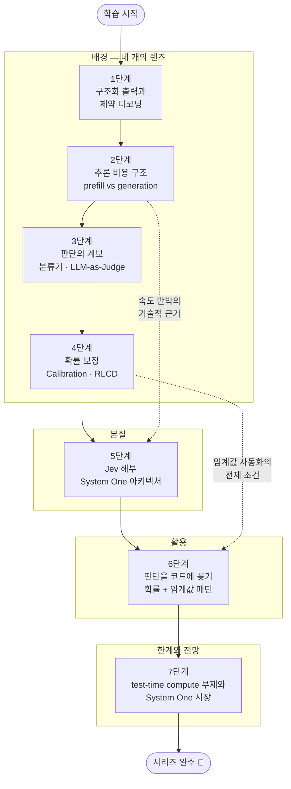

## 소개

2026년 가을, TypeSafe AI의 **Jev**가 화제가 됐습니다. 대화하는 LLM이 아니라 **판단만 하는 모델** — 평범한 영어 질문을 받아 보정된(calibrated) 확률만 돌려주고, 가장 느린 응답조차 500ms를 넘지 않으며, 777개의 판단을 0.7초·0.25센트에 처리합니다. 어떤 이는 "새로운 컴퓨팅 프리미티브"라 부르고, 어떤 이는 "기존 LLM의 추론 전략으로 재현 가능한, 해자 없는 제품"이라 반박합니다.

이 글은 `JEV-Essential` 시리즈의 **마스터 로드맵**입니다. Jev라는 하나의 제품을 소재로 삼되, 목표는 제품 리뷰가 아닙니다. **판단 특화 모델이라는 계층이 왜 등장했고(배경), 무엇이 본질이며(의미), 어떻게 쓰는가(활용)** — 이 세 질문에 답하는 데 필요한 개념들을 7단계로 재구성했습니다. 시리즈를 완주하면 Jev를 둘러싼 마케팅과 반박을 스스로 평가할 수 있고, 자기 파이프라인의 판단 지점에 값싼 판정기를 설계해 꽂을 수 있게 됩니다.

이 시리즈를 관통하는 한 문장은 이것입니다: **"이 성질은 모델의 것인가, 시스템의 것인가?"** Jev의 속도는 아키텍처의 마법인가 추론 스택 설계의 결과인가, "환각 면역"은 신뢰성의 진보인가 오류 형태의 전환인가 — 매 단계가 이 질문으로 되돌아옵니다.

## 학습 흐름

7단계는 **배경(1~4) → 본질(5) → 활용(6) → 한계와 전망(7)**의 순서로 진행합니다. 배경 4단계는 Jev를 해부하는 데 필요한 네 개의 렌즈 — 형식 보장(제약 디코딩), 비용 구조(prefill vs generation), 판단의 계보(분류기·LLM-as-Judge), 신뢰의 단위(확률 보정) — 를 하나씩 장착하는 과정입니다. 렌즈 없이 5단계로 직행하면 발표문의 주장과 반박을 가를 수 없습니다.

## 학습 진행 현황

> 완료한 항목에는 상세 포스트 링크가 연결됩니다. 학습이 진행될 때마다 체크박스와 진행률을 갱신합니다.

- 현재 완료한 항목: **21개**
- 전체 항목: **21개**
- 진행률: **100%** 🎉

## 1단계: 구조화 출력과 제약 디코딩 (Structured Output & Constrained Decoding)

**[배경]** Jev의 출발점은 "출력은 구조화 데이터만"이라는 제약입니다. 이 제약이 왜 성질을 바꾸는지 이해하려면, 먼저 기존 LLM이 어떻게 형식이 보장된 출력을 만들어 왔는지를 알아야 합니다. JSON mode, grammar-constrained decoding, logit 마스킹 — 자기회귀 생성 위에 형식 보장을 얹는 기법들의 원리와 한계를 다룹니다.

**학습 목표:** 자기회귀 LLM이 logit 단계의 제약으로 출력 형식을 보장하는 원리를 이해하고, "형식 보장"과 "내용 정확성"이 별개의 문제임을 설명할 수 있다.

**핵심 질문:**

- 자기회귀 생성에서 JSON 같은 형식은 어떻게 보장되는가 — grammar-constrained decoding은 logit 단계에서 정확히 무엇을 하는가?
- 형식이 보장돼도 내용은 왜 틀릴 수 있는가 — "환각 면역" 류의 주장은 이 구분 위에서 어떻게 평가해야 하는가?
- 선택지가 유한한 판단 태스크는 자유 형식 생성과 무엇이 구조적으로 다른가?

**학습 항목:**

- [x] **구조화 출력의 계보**: JSON mode, function calling, schema 강제 — 프롬프트 구슬리기에서 디코딩 제약까지의 진화 — [[상세](/2026/09/21/jev-structured-output-and-constrained-decoding.html)]
- [x] **grammar-constrained decoding의 원리**: 문법 상태 기계와 logit 마스킹, 유효하지 않은 토큰을 걸러내는 메커니즘 — [[상세](/2026/09/21/jev-structured-output-and-constrained-decoding.html)]
- [x] **형식 보장 ≠ 내용 정확성**: 제약 출력에서 오류의 형태가 어떻게 바뀌는가 ("그럴듯한 거짓말" → "자신 있는 오답") — [[상세](/2026/09/21/jev-structured-output-and-constrained-decoding.html)]

## 2단계: 자기회귀 추론의 비용 구조 — prefill vs generation

**[배경]** "70ms의 비밀은 아키텍처가 아니라 추론 전략"이라는 반박을 이해하려면 자기회귀 추론의 비용 구조를 알아야 합니다. prefill은 왜 병렬적이고 싸며, generation은 왜 순차적이고 비싼가 — 이 비대칭이 Jev 논쟁 전체의 기술적 토대입니다. [CS336 10강 — 추론(Inference)](/2026/06/26/cs336-lecture-10-inference.html)이 좋은 선행 학습입니다.

**학습 목표:** prefill/generation의 비용 비대칭과 KV 캐시·배칭의 원리를 이해하고, "prefill + 단일 토큰" 전략이 왜 2~3배 가속을 만드는지 계산으로 설명할 수 있다.

**핵심 질문:**

- prefill은 왜 병렬 처리되어 저렴하고, generation은 왜 토큰당 순차 비용을 내는가?
- 응답을 `"choice": "`까지 prefill하고 제약된 토큰 1개만 생성하면 무엇이 절약되는가?
- 출력이 단일 토큰일 때 표준 추론 배칭이 특히 유리한 이유는 무엇인가?

**학습 항목:**

- [x] **prefill vs generation 비용 비대칭**: 병렬 인코딩 vs 순차 디코딩, KV 캐시와 메모리 대역폭의 역할 — [[상세](/2026/09/21/jev-autoregressive-inference-cost-structure.html)]
- [x] **prefill + 단일 토큰 전략**: 프리필된 응답 접두사 + 선택지 제약 1토큰 생성 — 재현 실험(Qwen2.5-1.5B, 2~3x)의 구조 — [[상세](/2026/09/21/jev-autoregressive-inference-cost-structure.html)]
- [x] **단일 토큰 출력과 배칭**: 여러 판정을 단일 forward pass에 묶는 표준 배칭, 지연 시간 상한이 낮아지는 이유 — [[상세](/2026/09/21/jev-autoregressive-inference-cost-structure.html)]

## 3단계: 판단의 계보 — 분류기 vs 생성 모델, 그리고 LLM-as-Judge

**[배경]** "질문을 받아 확률을 돌려주는 모델"은 사실 오래된 물건입니다 — 전통적 분류기가 정확히 그 일을 했습니다. 그런데 왜 다들 분류기를 버리고 프롬프트 기반 LLM 판정(LLM-as-Judge)으로 갔다가, 다시 판단 특화 모델로 돌아오는가? 이 계보를 알아야 Jev가 "무엇의 후속"인지 보입니다. [CS336 12강 — 평가(Evaluation)](/2026/06/26/cs336-lecture-12-evaluation.html)의 LLM 평가 방법론이 배경 지식이 됩니다.

**학습 목표:** 전통적 분류기 → LLM-as-Judge → 판단 특화 모델로 이어지는 계보에서 각 접근의 트레이드오프를 비교하고, Jev가 어떤 틈새를 겨냥하는지 설명할 수 있다.

**핵심 질문:**

- 전통적 분류기(학습 데이터 필요, 태스크 고정)와 프롬프트 기반 LLM 판정(zero-shot, 유연)의 트레이드오프는 무엇인가?
- LLM-as-Judge의 알려진 문제 — 산문 출력의 파싱 취약성, 비용, 지연, 편향 — 는 각각 어디서 오는가?
- "주관적 질문에도 답하는 zero-shot 판정기 + 구조화 출력"이라는 조합은 계보의 어느 지점을 메우는가?

**학습 항목:**

- [x] **전통적 분류기의 자리**: 지도학습 분류기의 강점(속도·보정 가능성)과 한계(태스크당 학습 데이터·재학습 비용) — [[상세](/2026/09/21/jev-lineage-of-judgment-llm-as-judge.html)]
- [x] **LLM-as-Judge의 부상과 문제**: 평가·채점·라우팅에 프론티어 LLM을 쓸 때의 파싱·비용·지연·편향 문제 ("The problem is the text itself") — [[상세](/2026/09/21/jev-lineage-of-judgment-llm-as-judge.html)]
- [x] **판단 특화 모델이라는 제3의 길**: zero-shot 유연성 + 분류기의 출력 형태(확률)를 겸하는 계층의 성립 조건 — [[상세](/2026/09/21/jev-lineage-of-judgment-llm-as-judge.html)]

## 4단계: 확률 보정 (Calibration) — 신뢰할 수 있는 확률의 조건

**[배경 → 본질의 다리]** Jev의 진짜 열쇠는 속도·가격보다 **보정**입니다. 모델이 0.9라고 말할 때 실제로 90% 맞아야 그 확률을 코드의 if문에 꽂을 수 있습니다. 보정의 정의와 측정법, 그리고 TypeSafe가 내세우는 RLCD(Reinforcement Learning for Calibrated Decisions)의 위치를 다룹니다. 정렬 훈련의 일반론은 [CS336 15강 — 정렬: SFT·RLHF](/2026/06/26/cs336-lecture-15-alignment-sft-rlhf.html)를 참고하세요.

**학습 목표:** 보정의 정의(확신도 = 실제 정답률)와 측정 도구(reliability diagram, ECE)를 이해하고, 자기 도메인 데이터로 보정을 검증하는 절차를 설계할 수 있다.

**핵심 질문:**

- "보정된 확률"이란 정확히 무엇이고, 정확도(accuracy)와는 어떻게 다른 개념인가?
- 보정은 어떻게 측정하고 검증하는가 — reliability diagram, ECE, 온도 스케일링 같은 사후 보정 기법은 무엇을 하는가?
- 보정이 무너지면(예: 도메인 이동) 임계값 기반 자동화에는 무슨 일이 생기는가?
- RLCD는 무엇을 최적화하도록 설계된 훈련인가 — 통상의 RLHF와 목적 함수가 어떻게 다른가?

**학습 항목:**

- [x] **보정의 정의와 직관**: 확신도-정답률 일치, over/under-confidence, 신경망이 대체로 과신하는 이유 — [[상세](/2026/09/21/jev-probability-calibration.html)]
- [x] **보정의 측정과 사후 보정**: reliability diagram·ECE 읽기, 온도 스케일링 등 사후 보정 기법과 그 한계 — [[상세](/2026/09/21/jev-probability-calibration.html)]
- [x] **RLCD와 훈련 단계의 보정**: 보정을 훈련 목표로 삼는 접근, 그리고 "벤더 주장을 자기 데이터로 검증"하는 절차 설계 — [[상세](/2026/09/21/jev-probability-calibration.html)]

## 5단계: Jev 해부 — System One 아키텍처와 저지연 구조화 출력

**[본질]** 네 개의 렌즈를 장착했으니 이제 Jev 자체를 해부합니다. 자기회귀 텍스트 생성을 버린 "System One" 모델의 구조, 70ms~500ms라는 지연 시간 프로파일, Doom 실시간 플레이 시연 — 그리고 "그 속도는 prefill + 단일 토큰 constrained decoding으로 기존 LLM에서도 재현된다"는 Sean Goedecke의 실험적 반박까지, 주장과 반박을 양쪽 다 검토합니다.

**학습 목표:** Jev의 차별점이 모델 아키텍처 층과 추론 전략 층 중 어디에 있는지 증거 기반으로 가려내고, "환각 면역" 같은 마케팅 주장을 기술적으로 평가할 수 있다.

**핵심 질문:**

- Jev는 기존 LLM과 정확히 어느 층에서 다른가 — 아키텍처의 혁신인가, 추론 스택 설계의 결과인가?
- "prefill + 단일 토큰"으로 속도는 재현되더라도, 판단 태스크 전용 학습이 같은 지연 시간에서 더 나은 정확도를 줄 가능성은 어떻게 판정할 수 있는가?
- "환각 면역(hallucination immunity)"은 왜 의미론적 회피인가 — 제약 출력에서 오류는 어떤 형태로 남는가?
- 일관된 저지연(최악 500ms)은 어떤 새로운 호출 지점(게임 루프·실시간 UI·가드레일)을 여는가?

**학습 항목:**

- [x] **System One 모델의 구조**: 구조화 출력 전용 설계, 단일 forward pass 병렬 판정, 지연 시간 프로파일(70ms~500ms) — [[상세](/2026/09/21/jev-anatomy-system-one-architecture.html)]
- [x] **재현 실험과 해자 논쟁**: prefill + 단일 토큰 constrained decoding으로 기존 LLM에서 속도를 재현한 반박, "해자는 얇지만 프리미티브는 진짜"라는 결론의 구조 — [[상세](/2026/09/21/jev-anatomy-system-one-architecture.html)]
- [x] **마케팅 주장의 기술적 평가**: "환각 면역"의 재해석(오류 형태의 전환), 공정한 벤치마크 비교의 조건 — [[상세](/2026/09/21/jev-anatomy-system-one-architecture.html)]

## 6단계: 판단을 코드에 꽂기 — 확률 + 임계값 설계 패턴

**[활용]** 보정된 확률이 주어졌을 때, 그것을 소프트웨어 부품으로 쓰는 법을 다룹니다. 실사용 실험(37편 문서 × 21개 질문 = 777개 판단, 0.7초, 0.25센트)이 보여준 세 활용 영역 — 컨텍스트 찾기 · 작업 검사 · 의사결정 — 을 설계 패턴으로 일반화하고, "지식 노동의 린터"라는 새 도구 계층을 자기 파이프라인에 적용합니다.

**학습 목표:** 자기 파이프라인의 판단 지점을 목록화하고, 확률 + 임계값 + 폴백 구조의 판정 레이어를 설계·검증할 수 있다.

**핵심 질문:**

- 파이프라인에서 "판단 지점"(라우팅·에스컬레이션·채점·우선순위)은 어떻게 찾아내고 목록화하는가?
- 판정 출력을 boolean이 아니라 확률로 받고 임계값·폴백을 코드로 명시하면 무엇이 좋아지는가(벤더 교체 가능성 포함)?
- 값싼 판정기를 최종 게이트가 아니라 1차 필터(triage)로 배치해야 하는 이유는 무엇인가 — 6/7 검출률은 어떻게 읽어야 하는가?
- "지식 노동의 린터" — 작업 도중의 상시 품질 검사는 기존 리뷰 워크플로를 어떻게 바꾸는가?

**학습 항목:**

- [x] **세 활용 영역의 설계 패턴**: 컨텍스트 찾기(파일·정책 검색) · 작업 검사(채점·플래깅·감사) · 의사결정(우선순위·분류·예측) — [[상세](/2026/09/21/jev-probability-threshold-design-pattern.html)]
- [x] **확률 + 임계값 + 폴백 아키텍처**: 임계값 설정, 사람/상위 모델 에스컬레이션, 도입 전 자기 데이터 보정 검증 절차 — [[상세](/2026/09/21/jev-probability-threshold-design-pattern.html)]
- [x] **린터로서의 판정기**: 상시 1차 필터 + 비싼 검토 자원의 triage — 검증 비대칭("생성은 싸졌지만 검증은 싸지지 않았다")에 대한 가격 파괴 응답 — [[상세](/2026/09/21/jev-probability-threshold-design-pattern.html)]

## 7단계: 한계와 전망 — test-time compute 부재와 System One 시장

**[한계와 전망]** 마지막으로 이 계층의 천장과 앞날을 봅니다. 구조상 test-time compute를 쓸 수 없다는 근본 한계, 도메인 이동 시 보정 붕괴와 적대적 입력이라는 미검증 지대, 그리고 "fast-structured-output 시장"에서 경쟁이 벌어질 때 하니스·에이전트 아키텍처에서 판정기가 차지할 자리를 전망합니다.

**학습 목표:** 판단 특화 모델의 능력 상한과 미검증 위험을 구체적으로 나열하고, 하니스 설계에서 판정기 계층의 위치를 논증할 수 있다.

**핵심 질문:**

- test-time compute 부재는 능력 상한을 어떻게 규정하는가 — 비추론(non-reasoning) 모델 수준의 상한은 어떤 태스크에서 문제가 되고 어떤 태스크에선 무관한가?
- "판단 특화 모델"이라는 계층은 독립 벤치마크와 경쟁 제품 없이 성립을 판정할 수 있는가 — 해자 논쟁의 남은 쟁점은 무엇인가?
- 적대적 입력(프롬프트 인젝션성 문서), 도메인 이동, "주관적 질문"의 애매함은 확률의 의미를 어떻게 흔드는가?
- 에이전트 하니스에서 판정기의 자리는 어디인가 — 생성과 판정의 분리는 아키텍처를 어떻게 바꾸는가?

**학습 항목:**

- [x] **능력 상한과 그 무관함**: test-time compute 부재 → 비추론 모델 상한, 저지연 용도에서 이 한계가 치명적이지 않은 이유 — [[상세](/2026/09/21/jev-limits-and-system-one-market.html)]
- [x] **미검증 지대**: 적대적 입력, 도메인 이동 시 보정 붕괴, 주관적 질문의 애매함 — 도입 전 점검 목록 — [[상세](/2026/09/21/jev-limits-and-system-one-market.html)]
- [x] **System One 시장과 하니스의 미래**: 생성/판정 분리의 상품화, 판정기가 꽂힐 하니스 계층, "GPT-x-System-One" 류 경쟁 시나리오 — [[상세](/2026/09/21/jev-limits-and-system-one-market.html)]

## 참고 아티클

이 시리즈의 씨앗이 된 두 편의 분석 포스트입니다. 시리즈 스테이지는 아니지만, 각 단계에서 반복해 참조하게 됩니다.

- [Jev와 구조화 출력의 재발견: 70ms 지능은 새로운 컴퓨팅 프리미티브인가 (Sean Goedecke)](/2026/09/20/jev-structured-output-interesting-again.html) — **아키텍처·레이턴시 관점의 해부.** System One 구조, prefill + 단일 토큰 재현 실험, 해자 논쟁, "환각 면역" 비판. 특히 2단계와 5단계의 뼈대.
- [0.7초 만에 내 글 전부를 심사한 모델: TypeSafe Jev 미니 바이브 체크 (Mike Taylor)](/2026/09/20/mini-vibe-check-typesafe-jev.html) — **사용자 관점의 실사용 검증.** 777개 판단 실험, RLCD와 보정, 세 활용 영역, "지식 노동의 린터" 프레임. 특히 4단계와 6단계의 뼈대.

## 핵심 포인트

- **렌즈 먼저, 제품은 나중**: 제약 디코딩·추론 비용·판단 계보·보정이라는 배경 없이 발표문을 읽으면 마케팅과 본질을 가를 수 없습니다
- **속도보다 보정**: 25배 빠르고 580배 싸다는 숫자보다, 확신도가 실제 정답률과 일치하느냐가 "코드에 꽂을 수 있는가"를 결정합니다
- **"모델의 성질인가, 시스템의 성질인가"를 항상 물어라**: Jev 논쟁의 교훈은 신제품 평가의 일반 방법론입니다 — 재현 가능한 최소 실험을 설계하세요
- **값싼 판정기는 triage다**: 최종 게이트가 아니라 상시 1차 필터로 배치하고, 걸러진 소수만 비싼 검토로 보내는 구조가 올바른 자리입니다
- **한계를 스펙으로 읽어라**: test-time compute 부재는 결함이 아니라 설계 트레이드오프 — 어떤 태스크에 무관하고 어떤 태스크에 치명적인지가 도입 판단의 축입니다

## 결론

Jev는 지나가는 신제품일 수 있지만, 그것이 대표하는 질문 — **판단이 토큰이 아니라 보정된 확률로 상품화될 때 무엇이 가능해지는가** — 은 오래 남을 것입니다. 생성이 충분히 싸진 시대의 병목은 검증이고, 검증의 단가가 밀리초·마이크로센트로 내려오는 순간 검사는 이벤트가 아니라 배경 프로세스가 됩니다. 이 커리큘럼은 그 전환을 이해하고 활용하는 데 필요한 최소한의 지도입니다.

배경 단계(1~4)를 건너뛰고 싶은 유혹이 들겠지만, 렌즈 없이는 5단계의 해자 논쟁을 스스로 판정할 수 없습니다. 한 단계씩 도장을 깨며 올라가세요.

### 다음 학습 (Next Learning)

- [CS336: 밑바닥부터 만드는 언어 모델 — Essential Curriculum](/2026/06/26/cs336-llm-from-scratch-curriculum.html) — LLM의 내부 구조 전반. 특히 [10강 추론](/2026/06/26/cs336-lecture-10-inference.html)과 [12강 평가](/2026/06/26/cs336-lecture-12-evaluation.html)는 이 시리즈의 직접 선수 지식
- [무엇이 하니스를 하니스로 만드는가](/2026/08/03/what-makes-a-harness-a-harness.html) — 판정기가 부품으로 꽂힐 하니스 계층의 정의
- [확률적 엔지니어링과 24-7 직원](/2026/06/25/probabilistic-engineering-and-the-24-7-employee.html) — Jev가 겨냥하는 "생성은 싸졌지만 검증은 싸지지 않았다"는 비대칭
- [GPT-6 Astra: 하니스가 곧 제품이다](/2026/09/08/gpt6-astra-harness-is-the-product.html) — "가치는 모델인가 시스템인가"라는 같은 질문의 하니스 버전
- [신뢰할 수 있는 Agentic AI 시스템 만들기](/2026/06/19/reliable-agentic-ai-systems.html) — 프로덕션 에이전트에서 판정 레이어가 놓일 자리
