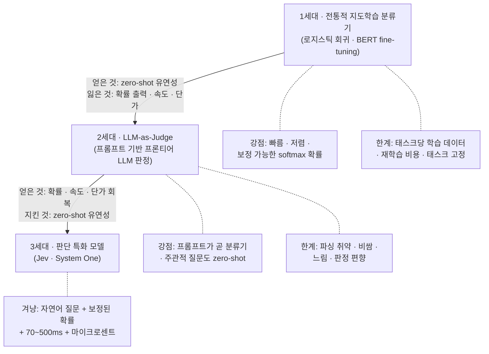
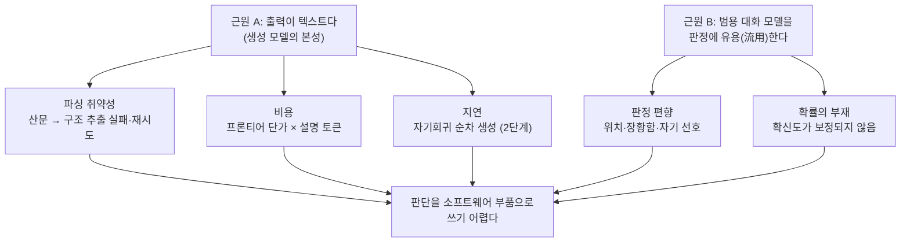

<figure class="post-figure post-figure--header">
<svg role="img" aria-label="판단의 계보 세 세대를 나란히 그린 그림. 왼쪽 1세대 지도학습 분류기는 레이블 데이터 수천 건을 넣어 만들고 softmax 확률을 돌려준다. 가운데 2세대 LLM-as-Judge는 프롬프트 한 줄로 무엇이든 묻지만 산문 텍스트를 돌려줘 파싱이 필요하고 확률이 없다. 오른쪽 3세대 판단 특화 모델은 질문 한 줄을 받아 선택지 위의 보정된 확률 분포를 70에서 500밀리초에 돌려준다. 아래쪽 점선 화살표는 1세대의 출력 형태인 확률이 3세대에서 zero-shot 유연성과 함께 돌아왔음을 보여준다." viewBox="0 0 680 272" xmlns="http://www.w3.org/2000/svg">
  <title>판단의 계보 — 분류기 · LLM-as-Judge · 판단 특화 모델</title>
  <defs>
    <marker id="jev3-arrow" viewBox="0 0 10 10" refX="9" refY="5" markerWidth="7" markerHeight="7" orient="auto-start-reverse">
      <path d="M 0 0 L 10 5 L 0 10 z" fill="var(--secondary-color)"/>
    </marker>
    <marker id="jev3-arrow-gold" viewBox="0 0 10 10" refX="9" refY="5" markerWidth="7" markerHeight="7" orient="auto-start-reverse">
      <path d="M 0 0 L 10 5 L 0 10 z" fill="var(--gold)"/>
    </marker>
  </defs>

  <!-- ===== 1세대 ===== -->
  <text x="110" y="22" text-anchor="middle" font-size="11" font-weight="700" fill="currentColor">1세대 · 지도학습 분류기</text>
  <rect x="32" y="34" width="156" height="24" rx="3" fill="var(--bg-light)" stroke="currentColor" stroke-width="1.5"/>
  <text x="110" y="50" text-anchor="middle" font-size="8.5" fill="currentColor">레이블 데이터 수천 건</text>
  <line x1="110" y1="58" x2="110" y2="72" stroke="var(--secondary-color)" stroke-width="2" marker-end="url(#jev3-arrow)"/>
  <rect x="32" y="76" width="156" height="46" rx="3" fill="var(--bg-panel)" stroke="var(--secondary-color)" stroke-width="2.5"/>
  <text x="110" y="95" text-anchor="middle" font-size="10" font-weight="700" fill="currentColor">지도학습 분류기</text>
  <text x="110" y="110" text-anchor="middle" font-size="7.5" fill="currentColor" opacity="0.8">태스크 고정 · 밀리초 · 저렴</text>
  <line x1="110" y1="122" x2="110" y2="136" stroke="var(--secondary-color)" stroke-width="2" marker-end="url(#jev3-arrow)"/>
  <rect x="28" y="140" width="164" height="52" rx="3" fill="var(--bg-light)" stroke="var(--secondary-color)" stroke-width="2"/>
  <text x="110" y="161" text-anchor="middle" font-size="10.5" font-weight="700" fill="currentColor">[0.08, 0.92]</text>
  <text x="110" y="179" text-anchor="middle" font-size="7.5" fill="currentColor" opacity="0.8">softmax 확률 — if문에 꽂힌다</text>

  <!-- 1세대 → 2세대 -->
  <line x1="192" y1="99" x2="258" y2="99" stroke="var(--secondary-color)" stroke-width="2" marker-end="url(#jev3-arrow)"/>
  <text x="225" y="90" text-anchor="middle" font-size="7" fill="currentColor">+ zero-shot 유연성</text>
  <text x="225" y="113" text-anchor="middle" font-size="7" fill="var(--accent-color)">− 확률·속도·단가</text>

  <!-- ===== 2세대 ===== -->
  <text x="340" y="22" text-anchor="middle" font-size="11" font-weight="700" fill="currentColor">2세대 · LLM-as-Judge</text>
  <rect x="262" y="34" width="156" height="24" rx="3" fill="var(--bg-light)" stroke="currentColor" stroke-width="1.5"/>
  <text x="340" y="50" text-anchor="middle" font-size="8.5" fill="currentColor">프롬프트 한 줄 (zero-shot)</text>
  <line x1="340" y1="58" x2="340" y2="72" stroke="var(--secondary-color)" stroke-width="2" marker-end="url(#jev3-arrow)"/>
  <rect x="262" y="76" width="156" height="46" rx="3" fill="var(--bg-panel)" stroke="currentColor" stroke-width="2.5"/>
  <text x="340" y="95" text-anchor="middle" font-size="10" font-weight="700" fill="currentColor">프론티어 LLM 판정</text>
  <text x="340" y="110" text-anchor="middle" font-size="7.5" fill="currentColor" opacity="0.8">범용 생성 모델의 유용 · 수 초</text>
  <line x1="340" y1="122" x2="340" y2="136" stroke="var(--secondary-color)" stroke-width="2" marker-end="url(#jev3-arrow)"/>
  <rect x="258" y="140" width="164" height="52" rx="3" fill="var(--bg-light)" stroke="var(--accent-color)" stroke-width="2"/>
  <text x="340" y="160" text-anchor="middle" font-size="9" font-style="italic" fill="currentColor">“네, 이 리뷰는 아마도…”</text>
  <text x="340" y="179" text-anchor="middle" font-size="7.5" fill="currentColor" opacity="0.8">산문 — 파싱 필요 · 확률 없음</text>

  <!-- 2세대 → 3세대 -->
  <line x1="422" y1="99" x2="488" y2="99" stroke="var(--secondary-color)" stroke-width="2" marker-end="url(#jev3-arrow)"/>
  <text x="455" y="90" text-anchor="middle" font-size="7" fill="currentColor">+ 확률·속도 회복</text>
  <text x="455" y="113" text-anchor="middle" font-size="7" fill="currentColor" opacity="0.8">유연성 유지</text>

  <!-- ===== 3세대 ===== -->
  <text x="570" y="22" text-anchor="middle" font-size="11" font-weight="700" fill="currentColor">3세대 · 판단 특화 모델</text>
  <rect x="492" y="34" width="156" height="24" rx="3" fill="var(--bg-light)" stroke="currentColor" stroke-width="1.5"/>
  <text x="570" y="50" text-anchor="middle" font-size="8.5" fill="currentColor">질문 한 줄 + 선택지</text>
  <line x1="570" y1="58" x2="570" y2="72" stroke="var(--secondary-color)" stroke-width="2" marker-end="url(#jev3-arrow)"/>
  <rect x="492" y="76" width="156" height="46" rx="3" fill="var(--bg-panel)" stroke="var(--gold)" stroke-width="3"/>
  <text x="570" y="95" text-anchor="middle" font-size="10" font-weight="700" fill="currentColor">판단 특화 모델</text>
  <text x="570" y="110" text-anchor="middle" font-size="7.5" fill="currentColor" opacity="0.8">Jev · zero-shot · 70~500ms</text>
  <line x1="570" y1="122" x2="570" y2="136" stroke="var(--secondary-color)" stroke-width="2" marker-end="url(#jev3-arrow)"/>
  <rect x="488" y="140" width="164" height="52" rx="3" fill="var(--bg-light)" stroke="var(--gold)" stroke-width="2.5"/>
  <text x="514" y="159" text-anchor="end" font-size="7.5" fill="currentColor">yes</text>
  <rect x="520" y="151" width="95" height="9" fill="var(--secondary-color)"/>
  <text x="620" y="159" text-anchor="start" font-size="7.5" font-weight="700" fill="currentColor">0.91</text>
  <text x="514" y="173" text-anchor="end" font-size="7.5" fill="currentColor">no</text>
  <rect x="520" y="165" width="9" height="9" fill="var(--accent-color)"/>
  <text x="620" y="173" text-anchor="start" font-size="7.5" fill="currentColor">0.09</text>
  <text x="570" y="187" text-anchor="middle" font-size="7.5" fill="currentColor" opacity="0.8">보정된 확률 분포 — 임계값 설계 가능</text>

  <!-- 확률의 귀환 (왕복 운동) -->
  <path d="M 110 196 C 110 250 570 250 570 196" fill="none" stroke="var(--gold)" stroke-width="2" stroke-dasharray="6 4" marker-end="url(#jev3-arrow-gold)"/>
  <text x="340" y="256" text-anchor="middle" font-size="8.5" font-weight="700" fill="currentColor">출력 형태의 귀환 — 확률이 zero-shot과 함께 돌아온다</text>
</svg>
<figcaption>판단의 계보 — 1세대의 출력 형태(보정 가능한 확률)를 버리고 2세대의 유연성으로 갔다가, 3세대에서 둘을 조합해 되돌아오는 왕복 운동</figcaption>
</figure>

## 소개

`JEV-Essential` 시리즈의 3단계입니다. 전체 로드맵은 [JEV Essential Curriculum](/2026/09/21/jev-essential-curriculum.html)에서 볼 수 있습니다. ([2단계 — 자기회귀 추론의 비용 구조](/2026/09/21/jev-autoregressive-inference-cost-structure.html)에서 이어집니다.)

1단계에서 형식 보장의 원리를, 2단계에서 속도의 원가 구조를 봤습니다. 이번 단계는 세 번째 렌즈, **판단의 계보**입니다. 출발점은 이 관찰입니다 — Jev가 하는 일, 즉 "평범한 영어 질문을 받아 보정된(calibrated) 확률을 돌려주는 것"은 전혀 새로운 일이 아닙니다. **전통적 지도학습 분류기(supervised classifier)가 수십 년 동안 정확히 그 일을 해 왔습니다.** 스팸 필터는 "이 메일이 스팸인가?"에 확률을 돌려줬고, 감성 분류기는 "이 리뷰가 부정적인가?"에 확률을 돌려줬습니다. 빠르고, 싸고, 출력은 softmax 확률이었습니다.

그렇다면 질문은 이렇게 됩니다. **왜 다들 분류기를 버리고 프롬프트 기반 LLM 판정(LLM-as-Judge)으로 갔는가? 그리고 왜 지금, 다시 "확률을 돌려주는 모델"로 돌아오는가?** 이 왕복 운동의 이유를 이해해야 Jev가 "무엇의 후속"인지 — 그리고 판단 특화 모델이라는 계층이 계보의 어느 빈자리를 메우는지 — 보입니다.

이 글은 세 세대를 순서대로 해부합니다. 각 세대에서 **무엇을 얻고 무엇을 잃었는지**를 추적하면, 3세대(판단 특화 모델)가 우연한 발명이 아니라 계보가 남긴 빈칸을 채우는 필연적 조합임이 드러납니다. LLM 평가 방법론의 일반론은 [CS336 12강 — 평가(Evaluation)](/2026/06/26/cs336-lecture-12-evaluation.html)가 좋은 배경 지식입니다.

## 한눈에 보기

계보 전체를 한 장으로 그리면 이렇습니다. 각 세대가 무엇을 얻고 무엇을 잃었는지에 주목하세요 — 3세대는 앞 두 세대가 각각 포기했던 것을 다시 조합하려는 시도입니다.



핵심 질문 세 개를 미리 걸어 둡니다. 이 글을 다 읽으면 스스로 답할 수 있어야 합니다.

1. 전통적 분류기(학습 데이터 필요, 태스크 고정)와 프롬프트 기반 LLM 판정(zero-shot, 유연)의 트레이드오프는 무엇인가?
2. LLM-as-Judge의 알려진 문제 — 파싱 취약성, 비용, 지연, 편향 — 는 각각 **어디서** 오는가?
3. "주관적 질문에도 답하는 zero-shot 판정기 + 구조화 출력"이라는 조합은 계보의 어느 지점을 메우는가?

## 1세대: 전통적 지도학습 분류기 — 확률을 돌려주는 오래된 기계

### 분류기는 원래부터 "판단 특화 모델"이었다

지도학습 분류기의 인터페이스는 놀랄 만큼 Jev와 닮았습니다. 입력을 받아, 유한한 선택지 위의 **확률 분포**를 돌려줍니다.

```python
# 고전적인 감성 분류기 — 입력을 받아 확률 분포를 돌려준다
from sklearn.linear_model import LogisticRegression

clf = LogisticRegression()
clf.fit(X_train, y_train)          # 레이블된 학습 데이터 수천 건이 필요

proba = clf.predict_proba(x)[0]    # 예: [0.08, 0.92]
if proba[1] > 0.85:                # 확률 + 임계값 — if문에 바로 꽂힌다
    escalate_to_human()
```

BERT 시대에도 구조는 같았습니다. 사전학습된 인코더 위에 분류 헤드를 얹고 태스크 데이터로 fine-tuning하면, 단일 forward pass로 softmax 확률이 나옵니다. 이 형태가 가진 강점은 오늘날 다시 봐도 탐이 납니다.

**강점 1 — 속도와 단가.** 분류기는 생성하지 않습니다. 입력을 한 번 인코딩하고 헤드를 한 번 통과하면 끝 — 자기회귀 디코딩의 토큰당 순차 비용(2단계에서 본 그 비용)이 아예 없습니다. 수백만 건을 배치로 밀어 넣어도 GPU 한 장으로 감당됩니다. "밀리초 지연·사실상 0에 가까운 단가"는 분류기 세계에서는 뉴스가 아니라 기본값이었습니다.

**강점 2 — 보정 가능성(calibratability).** 출력이 처음부터 확률이기 때문에, 보정을 **측정하고 고치는 도구**가 풍부하게 발달했습니다. reliability diagram으로 확신도-정답률 일치를 확인하고, 어긋나면 temperature scaling이나 Platt scaling 같은 사후 보정을 검증 셋 하나로 적용할 수 있습니다. "모델이 0.9라고 말하면 실제로 90% 맞는다"는 성질을 엔지니어링 대상으로 다룰 수 있었다는 뜻입니다. (이 주제는 [4단계 — 확률 보정](/2026/09/21/jev-probability-calibration.html)에서 본격적으로 다룹니다.)

### 그런데 왜 버렸나 — 태스크당 학습 데이터라는 세금

한계는 단 하나의 문장으로 요약됩니다. **분류기는 태스크마다 새로 만들어야 합니다.**

- **태스크당 레이블 데이터**: "이 리뷰가 부정적인가?"용 분류기를 만들려면 레이블된 리뷰 수천 건이 필요합니다. 질문을 "이 리뷰가 배송 불만인가?"로 바꾸면 — 데이터셋부터 다시 만들어야 합니다.
- **재학습 비용**: 스키마가 바뀌거나(클래스 추가), 도메인이 이동하거나(새 제품군), 정책이 바뀌면(판단 기준 변경) 데이터 수집 → 레이블링 → 재학습 → 재배포 사이클을 다시 돕니다. 판단 기준이 자주 바뀌는 업무일수록 이 세금이 무겁습니다.
- **주관적·롱테일 질문의 벽**: "이 글이 같은 아이디어를 근거 추가 없이 반복하는가?" 같은 질문에는 학습 데이터 자체를 구하기 어렵습니다. 정의가 미묘하고, 레이블러 간 합의가 낮고, 수요는 한 팀에 수십 건뿐인 — 분류기를 만들 경제성이 안 나오는 판단이 현실 업무에는 무수히 많습니다.

정리하면 1세대는 **출력 형태(확률)와 운영 특성(속도·단가)은 이상적이었지만, 태스크 유연성이 없었습니다.** 판단 수요는 롱테일인데 공급은 태스크당 프로젝트 단위였던 것입니다.

## 2세대: LLM-as-Judge — 프롬프트가 곧 분류기

### 부상: 학습 데이터 없이, 질문을 그냥 말로 하면 된다

instruction-tuned LLM이 등장하자 판도가 뒤집혔습니다. 분류기를 **만드는** 대신, 프론티어 LLM에게 판단을 **부탁**하면 됐기 때문입니다.

```text
다음 리뷰가 배송 불만을 담고 있으면 "yes", 아니면 "no"로 답하고,
판단 근거를 한 문장으로 설명해 주세요.

리뷰: "물건은 좋은데 3주나 걸렸어요..."
```

학습 데이터 0건, 재학습 0회. 질문을 바꾸고 싶으면 프롬프트의 문장을 바꾸면 됩니다. 이것이 **zero-shot 유연성**이고, 1세대가 가장 아파했던 지점을 정확히 해결합니다. 게다가 프론티어 LLM은 "이 답변이 더 도움이 되는가" 같은 **주관적 질문**에도 사람과 상당히 일치하는 판단을 내놓습니다 — [CS336 12강](/2026/06/26/cs336-lecture-12-evaluation.html)에서 봤듯, 개방형 응답 채점(AlpacaEval, MT-Bench 류)과 Chatbot Arena 스타일 선호 비교가 LM-as-judge 위에서 산업 표준이 된 이유입니다. 평가 벤치마크만이 아닙니다 — 프로덕션의 라우팅, 콘텐츠 감사, 에이전트 출력 검사까지, "판단이 필요한 곳에 LLM을 꽂는" 패턴이 순식간에 퍼졌습니다.

### 문제: 네 가지 청구서, 그리고 그 근원

그런데 LLM-as-Judge를 파이프라인에 실제로 꽂아 본 사람은 누구나 같은 곳에서 부러집니다. 문제를 나열만 하지 말고, **각 문제가 어디서 오는지**를 추적해 봅시다 — 근원을 알아야 3세대가 무엇을 고친 것인지 보입니다.



**문제 1 — 파싱 취약성 (근원: 텍스트 출력).** 프로그램은 `0.92`나 `"yes"`를 기대하는데 모델은 산문을 돌려줍니다. "네, 이 리뷰는 배송 불만으로 보입니다. 다만..." 같은 출력에서 판정을 뽑아내려면 정규식, 재시도 루프, "JSON만 출력해"라는 구슬리기가 필요하고, 이 접착 코드는 모델 버전이 바뀔 때마다 조용히 깨집니다. TypeSafe 공동창업자 Diogo Almeida의 요약이 정확합니다 — **"The problem is the text itself."** 텍스트라는 매체 자체가 문제라는 것입니다. (1단계에서 본 constrained decoding이 이 문제의 형식 층위를 해결하지만, 형식 보장 ≠ 내용 정확성이었음을 기억하세요.)

**문제 2 — 비용 (근원: 텍스트 출력 × 프론티어 단가).** 판정 하나에 프론티어 모델 호출 하나. 게다가 판정 품질을 높이려고 근거 설명이나 chain-of-thought를 시키면 출력 토큰이 수백 개로 늘어납니다. 문서 37편 × 질문 21개 = 777개 판단 같은 매트릭스형 워크로드에서는 청구서가 판단 수에 비례해 자랍니다 — [Mike Taylor의 실측](/2026/09/20/mini-vibe-check-typesafe-jev.html)에서 프론티어 모델 대비 **약 580배** 차이가 났던 바로 그 축입니다.

**문제 3 — 지연 (근원: 자기회귀 생성).** 2단계에서 본 그대로입니다. 출력이 텍스트인 이상 토큰당 순차 비용을 내야 하고, 판정 하나에 수 초가 걸립니다. 수 초짜리 판정기는 배치 파이프라인에는 들어가도 실시간 UI, 게임 루프, 요청 경로 위의 가드레일에는 못 들어갑니다. 판단을 "이벤트"가 아니라 "배경 프로세스"로 만들려면 이 지연이 두 자릿수 밀리초로 내려와야 합니다.

**문제 4 — 판정 편향 (근원: 범용 생성 모델의 유용).** LLM-as-Judge 문헌에 반복 보고되는 편향들이 있습니다. 두 후보 중 **먼저 제시된 쪽**을 선호하는 position bias, **길고 장황한 답**을 후하게 치는 verbosity bias, **자기(같은 계열 모델)가 쓴 텍스트**를 선호하는 self-preference bias. 이것들은 버그라기보다, 대화·생성용으로 훈련된 모델의 선호가 판정 과제에 새어 들어온 것입니다. 판정 전용으로 훈련되지 않은 모델을 판정에 쓰는 데서 오는 구조적 비용입니다.

그리고 조용히 잃어버린 것이 하나 더 있습니다. **확률입니다.** 1세대의 softmax 확률은 사라지고, "확신도를 0~1로 말해 줘"라고 시키면 모델은 숫자를 *생성*하지만 그 숫자는 보정돼 있지 않습니다 — verbalized confidence는 과신 쪽으로 쏠린다는 보고가 많고, 0.9라고 말하면서 60%만 맞는 판정기로는 임계값 기반 자동화를 설계할 수 없습니다. 선택지 토큰의 logprob을 쓰는 우회로도 있지만, chat 모델의 logprob이 판단 확신도로서 보정돼 있다는 보장은 어디에도 없습니다.

<figure class="post-figure">
<svg role="img" aria-label="확률의 상실을 보여주는 두 개의 나란한 패널. 왼쪽 1세대 softmax 확률 패널에서는 모델이 말한 확신도 0.90과 실제 정답률 약 90퍼센트의 막대 길이가 일치해 보정된 상태를 보여주고, 임계값 기반 자동화를 설계할 수 있다고 적혀 있다. 오른쪽 2세대 verbalized confidence 패널에서는 모델이 말한 확신도는 0.90이지만 실제 정답률 막대는 약 60퍼센트에서 멈춰 그 사이가 과신 gap으로 표시되며, 임계값 설계가 불가능하다고 적혀 있다." viewBox="0 0 640 222" xmlns="http://www.w3.org/2000/svg">
  <title>확률의 상실 — softmax 확률 vs verbalized confidence</title>

  <!-- ===== 왼쪽: 1세대 softmax 확률 ===== -->
  <rect x="16" y="12" width="296" height="196" rx="3" fill="var(--bg-light)" stroke="var(--secondary-color)" stroke-width="2"/>
  <text x="164" y="34" text-anchor="middle" font-size="10" font-weight="700" fill="currentColor">1세대 · softmax 확률</text>
  <text x="164" y="48" text-anchor="middle" font-size="7.5" fill="currentColor" opacity="0.8">출력이 처음부터 확률 — 보정을 측정·수리 가능</text>
  <text x="40" y="76" text-anchor="start" font-size="8" fill="currentColor">모델이 말한 확신도</text>
  <rect x="40" y="82" width="198" height="12" fill="var(--secondary-color)"/>
  <text x="246" y="92" text-anchor="start" font-size="8" font-weight="700" fill="currentColor">0.90</text>
  <text x="40" y="114" text-anchor="start" font-size="8" fill="currentColor">실제 정답률</text>
  <rect x="40" y="120" width="198" height="12" fill="var(--secondary-color)" opacity="0.55"/>
  <text x="246" y="130" text-anchor="start" font-size="8" fill="currentColor">~90%</text>
  <line x1="238" y1="78" x2="238" y2="138" stroke="currentColor" stroke-width="1" stroke-dasharray="3 3" opacity="0.7"/>
  <line x1="40" y1="142" x2="260" y2="142" stroke="currentColor" stroke-width="1" opacity="0.4"/>
  <text x="40" y="154" text-anchor="middle" font-size="6.5" fill="currentColor" opacity="0.7">0</text>
  <text x="150" y="154" text-anchor="middle" font-size="6.5" fill="currentColor" opacity="0.7">0.5</text>
  <text x="260" y="154" text-anchor="middle" font-size="6.5" fill="currentColor" opacity="0.7">1.0</text>
  <text x="164" y="178" text-anchor="middle" font-size="9.5" font-weight="700" fill="var(--secondary-color)">확신도 = 정답률 → 보정됨</text>
  <text x="164" y="194" text-anchor="middle" font-size="7.5" fill="currentColor" opacity="0.85">임계값 기반 자동화를 설계할 수 있다</text>

  <!-- ===== 오른쪽: 2세대 verbalized confidence ===== -->
  <rect x="328" y="12" width="296" height="196" rx="3" fill="var(--bg-light)" stroke="var(--accent-color)" stroke-width="2"/>
  <text x="476" y="34" text-anchor="middle" font-size="10" font-weight="700" fill="currentColor">2세대 · verbalized confidence</text>
  <text x="476" y="48" text-anchor="middle" font-size="7.5" fill="currentColor" opacity="0.8">“확신도를 0~1로 말해 줘” — 생성된 숫자일 뿐</text>
  <text x="352" y="76" text-anchor="start" font-size="8" fill="currentColor">모델이 말한 확신도</text>
  <rect x="352" y="82" width="198" height="12" fill="var(--accent-color)"/>
  <text x="558" y="92" text-anchor="start" font-size="8" font-weight="700" fill="currentColor">0.90</text>
  <text x="352" y="114" text-anchor="start" font-size="8" fill="currentColor">실제 정답률</text>
  <rect x="352" y="120" width="132" height="12" fill="var(--accent-color)" opacity="0.55"/>
  <text x="490" y="130" text-anchor="start" font-size="8" fill="currentColor">~60%</text>
  <rect x="484" y="118" width="66" height="16" fill="none" stroke="var(--accent-color)" stroke-width="1.5" stroke-dasharray="3 3"/>
  <text x="517" y="112" text-anchor="middle" font-size="7" font-weight="700" fill="var(--accent-color)">과신 gap</text>
  <line x1="550" y1="78" x2="550" y2="138" stroke="currentColor" stroke-width="1" stroke-dasharray="3 3" opacity="0.7"/>
  <line x1="352" y1="142" x2="572" y2="142" stroke="currentColor" stroke-width="1" opacity="0.4"/>
  <text x="352" y="154" text-anchor="middle" font-size="6.5" fill="currentColor" opacity="0.7">0</text>
  <text x="462" y="154" text-anchor="middle" font-size="6.5" fill="currentColor" opacity="0.7">0.5</text>
  <text x="572" y="154" text-anchor="middle" font-size="6.5" fill="currentColor" opacity="0.7">1.0</text>
  <text x="476" y="178" text-anchor="middle" font-size="9.5" font-weight="700" fill="var(--accent-color)">확신도 ≠ 정답률 → 과신</text>
  <text x="476" y="194" text-anchor="middle" font-size="7.5" fill="currentColor" opacity="0.85">0.9라고 말하며 60%만 맞는다 — 임계값 설계 불가</text>
</svg>
<figcaption>2세대가 조용히 잃은 것 — 1세대의 0.9는 “10번 중 9번 맞음”이었지만, 2세대가 생성한 “0.9”는 보정되지 않은 숫자다</figcaption>
</figure>

정리하면 2세대는 **태스크 유연성을 얻는 대가로, 1세대가 당연하게 갖고 있던 출력 형태(확률)·속도·단가를 전부 반납**했습니다. 계보에 빈칸이 생긴 것입니다: *"zero-shot으로 유연하면서, 분류기처럼 빠르고 싸고, 보정된 확률을 돌려주는 판정기"* — 이 칸이 비어 있었습니다.

<figure class="post-figure">
<svg role="img" aria-label="출력 형태와 태스크 유연성을 축으로 한 2 곱하기 2 격자. 가로축은 태스크 고정과 zero-shot, 세로축은 보정된 확률과 산문 텍스트다. 왼쪽 위 칸은 1세대 분류기로 확률과 속도와 단가는 이상적이지만 태스크마다 학습 데이터가 필요하다. 오른쪽 아래 칸은 2세대 LLM-as-Judge로 주관적 질문도 zero-shot으로 다루지만 파싱이 취약하고 비싸고 느리며 확률이 없다. 왼쪽 아래 칸은 아무도 고르지 않는 조합으로 흐리게 표시된다. 오른쪽 위 칸, 즉 보정된 확률과 zero-shot의 조합은 오랫동안 비어 있던 칸으로 금색 점선 테두리로 강조되며 3세대 판단 특화 모델이 겨냥하는 자리다." viewBox="0 0 640 290" xmlns="http://www.w3.org/2000/svg">
  <title>계보의 빈칸 — 출력 형태 × 태스크 유연성</title>

  <!-- 열 머리 -->
  <text x="275" y="36" text-anchor="middle" font-size="9" font-weight="700" fill="currentColor">태스크 고정 (학습 데이터 필요)</text>
  <text x="505" y="36" text-anchor="middle" font-size="9" font-weight="700" fill="currentColor">zero-shot (질문만 바꾸면 됨)</text>

  <!-- 행 머리 -->
  <text x="152" y="104" text-anchor="end" font-size="9" font-weight="700" fill="currentColor">출력 =</text>
  <text x="152" y="118" text-anchor="end" font-size="9" font-weight="700" fill="currentColor">보정된 확률</text>
  <text x="152" y="220" text-anchor="end" font-size="9" font-weight="700" fill="currentColor">출력 =</text>
  <text x="152" y="234" text-anchor="end" font-size="9" font-weight="700" fill="currentColor">산문 텍스트</text>

  <!-- 왼쪽 위: 1세대 -->
  <rect x="168" y="64" width="214" height="94" rx="3" fill="var(--bg-light)" stroke="var(--secondary-color)" stroke-width="2"/>
  <text x="275" y="94" text-anchor="middle" font-size="11" font-weight="700" fill="currentColor">1세대 · 분류기</text>
  <text x="275" y="112" text-anchor="middle" font-size="7.5" fill="currentColor" opacity="0.85">확률·속도·단가는 이상적</text>
  <text x="275" y="126" text-anchor="middle" font-size="7.5" fill="currentColor" opacity="0.85">태스크마다 학습 데이터 필요</text>

  <!-- 오른쪽 위: 빈칸 → 3세대 -->
  <rect x="398" y="64" width="214" height="94" rx="3" fill="var(--gold-soft)" stroke="var(--gold)" stroke-width="3" stroke-dasharray="7 4"/>
  <text x="505" y="88" text-anchor="middle" font-size="7.5" fill="currentColor" opacity="0.8">오랫동안 비어 있던 칸</text>
  <text x="505" y="108" text-anchor="middle" font-size="11" font-weight="700" fill="currentColor">3세대 · 판단 특화 모델</text>
  <text x="505" y="126" text-anchor="middle" font-size="7.5" fill="currentColor" opacity="0.85">질문 한 줄 → 보정된 확률 분포</text>

  <!-- 왼쪽 아래: 아무도 고르지 않는 조합 -->
  <rect x="168" y="180" width="214" height="94" rx="3" fill="none" stroke="currentColor" stroke-width="1.5" stroke-dasharray="4 4" opacity="0.35"/>
  <text x="275" y="222" text-anchor="middle" font-size="8.5" fill="currentColor" opacity="0.55">아무도 고르지 않는 조합</text>
  <text x="275" y="238" text-anchor="middle" font-size="7.5" fill="currentColor" opacity="0.55">태스크 고정인데 출력마저 산문</text>

  <!-- 오른쪽 아래: 2세대 -->
  <rect x="398" y="180" width="214" height="94" rx="3" fill="var(--bg-light)" stroke="var(--accent-color)" stroke-width="2"/>
  <text x="505" y="210" text-anchor="middle" font-size="11" font-weight="700" fill="currentColor">2세대 · LLM-as-Judge</text>
  <text x="505" y="228" text-anchor="middle" font-size="7.5" fill="currentColor" opacity="0.85">주관적 질문도 zero-shot으로</text>
  <text x="505" y="242" text-anchor="middle" font-size="7.5" fill="currentColor" opacity="0.85">파싱 취약 · 비쌈 · 느림 · 확률 없음</text>
</svg>
<figcaption>출력 형태 × 태스크 유연성의 2×2 — 1·2세대는 대각선의 두 칸을 차지했고, “보정된 확률 + zero-shot” 칸은 비어 있었다. 3세대는 이 칸을 겨냥한다</figcaption>
</figure>

## 3세대: 판단 특화 모델 — 제3의 길

### 성립 조건: 세 개의 부품

Jev가 대표하는 판단 특화 모델은 정확히 그 빈칸을 겨냥합니다. **입력은 2세대처럼(평범한 자연어 질문, 주관적이어도 됨), 출력은 1세대처럼(선택지 위의 보정된 확률).** 이 조합이 성립하려면 세 부품이 맞물려야 하는데, 공교롭게도 앞 단계들에서 하나씩 본 것들입니다.

1. **구조화 출력 전용 설계 (1단계).** 자유 형식 텍스트 생성을 아예 버리고 유한 선택지 위의 분포만 출력합니다. 파싱 취약성이 접착 코드로 완화되는 게 아니라 **문제 설정에서 제거**됩니다 — 산문이 없으니 파싱할 것도 없습니다.
2. **단일 forward pass 추론 (2단계).** 출력이 선택지 분포뿐이므로 자기회귀 디코딩의 순차 비용이 사라지고, 여러 판정을 배칭으로 한 pass에 묶을 수 있습니다. 70ms~최악 500ms라는 지연 프로파일과 "10억 토큰당 42달러"라는 단가는 여기서 나옵니다 — 1세대 분류기의 운영 특성이 돌아온 것입니다.
3. **판단 전용 학습 + 보정 훈련 (4단계 예고).** zero-shot 유연성을 지키면서 확률이 **믿을 수 있으려면**, 다양한 판단 태스크에 대해 확신도가 실제 정답률과 일치하도록 훈련돼야 합니다. TypeSafe가 내세우는 RLCD(Reinforcement Learning for Calibrated Decisions)가 이 자리에 있습니다. 그리고 판정 전용 학습은 4번 문제(생성 모델 선호의 편향 유입)에 대한 구조적 응답이기도 합니다 — 판정을 위해 훈련된 모델은 최소한 "대화를 잘하려는 선호"를 판정에 끌고 들어오지는 않습니다.

### 세 세대 비교표

| | 1세대 · 지도학습 분류기 | 2세대 · LLM-as-Judge | 3세대 · 판단 특화 모델 |
| --- | --- | --- | --- |
| **새 태스크 추가** | 데이터 수집 + 레이블링 + 재학습 | 프롬프트 한 줄 (zero-shot) | 질문 한 줄 (zero-shot) |
| **주관적 질문** | 데이터 확보가 사실상 불가 | 가능 (사람과 높은 일치) | 가능 (판단 전용 학습) |
| **출력 형태** | softmax 확률 | 산문 텍스트 (파싱 필요) | 선택지 위의 확률 분포 |
| **보정** | 사후 보정 도구 성숙 (temperature scaling 등) | verbalized confidence — 보정 안 됨 | 훈련 단계 보정 (RLCD) — 단, 벤더 주장 검증 필요 |
| **지연** | 밀리초 (단일 forward pass) | 수 초 (자기회귀 순차 생성) | 70~500ms (단일 forward pass) |
| **판정당 단가** | 사실상 0 | 프론티어 토큰 단가 × 출력 길이 | 마이크로센트 (~580배 저렴 실측) |
| **대표 실패 모드** | 도메인 이동 시 성능·보정 붕괴 | 파싱 실패 · 판정 편향 · 청구서 | "자신 있는 오답" · 보정 붕괴는 미검증 |
| **판단을 코드에 꽂기** | `predict_proba` + 임계값 | 접착 코드 + 재시도 루프 | 확률 + 임계값 (분류기와 동일) |

표를 세로로 읽으면 3세대의 정체가 분명해집니다. **3세대는 새로운 종(種)이 아니라, 1세대의 출력·운영 열(列)과 2세대의 유연성 행(行)을 한 칸에 합친 조합**입니다. "질문을 받아 확률을 돌려주는 모델"이라는 형태 자체는 1세대로의 회귀이고, 그 형태를 태스크 고정 없이 제공한다는 점만이 새롭습니다.

### Jev가 겨냥하는 틈새 — 그리고 한 겹의 유보

이제 커리큘럼의 세 번째 핵심 질문에 답할 수 있습니다. "주관적 질문에도 답하는 zero-shot 판정기 + 구조화 출력"이라는 조합이 메우는 지점은, **판단 수요의 롱테일**입니다. 1세대는 판단 하나에 프로젝트 하나가 필요해서 롱테일을 포기했고, 2세대는 롱테일을 감당했지만 판정 하나의 단가·지연 때문에 판단을 드문드문 배치할 수밖에 없었습니다. 3세대의 제안은 롱테일 전체에 **상시** 판정을 붙이자는 것입니다 — 라우팅, 에스컬레이션, 채점, 우선순위 부여처럼 지금 사람이나 프론티어 LLM이 띄엄띄엄 하고 있는 반복 판단이 전부 후보입니다.

다만 계보를 정확히 읽으려면 유보도 한 겹 얹어야 합니다. [Sean Goedecke의 반박](/2026/09/20/jev-structured-output-interesting-again.html)이 보여줬듯, 3세대의 **속도·형식 축은 기존 LLM + prefill + 단일 토큰 constrained decoding으로 상당 부분 재현**됩니다 (2단계에서 계산으로 확인한 그 2~3배 가속). 즉 "계보의 빈칸이 존재한다"는 것과 "그 칸을 채우려면 전용 모델이 필요하다"는 것은 다른 명제입니다. 전용 모델의 고유 기여로 남는 후보는 **판단 전용 학습이 같은 지연에서 주는 정확도 우위, 그리고 훈련 단계 보정** — 둘 다 아직 독립 벤치마크로 검증되지 않은 영역입니다. 계보상의 위치는 진짜지만, 그 자리를 Jev가 차지할지 "GPT-x-System-One" 류의 변종이 차지할지는 열려 있습니다.

## 예시: 같은 질문, 세 세대의 답

추상적인 비교를 손에 잡히게 만들어 봅시다. 고객서비스 파이프라인의 고전적 판단 지점 — **"이 고객이 화나 있는가? 화났으면 사람에게 에스컬레이션"** — 을 세 세대로 각각 구현하면 이렇습니다.

### 1세대: 분류기 — 확률은 좋은데, 만들 수 있는가?

```python
# 전제: 레이블된 고객 메시지 수천 건으로 이미 학습해 둔 분류기
proba_angry = anger_clf.predict_proba(vectorize(message))[0][1]

if proba_angry > 0.85:
    escalate_to_human(ticket)
```

코드는 이상적입니다 — 확률, 임계값, 폴백이 전부 명시적입니다. 문제는 코드 밖에 있습니다. 이 분류기를 갖기까지 레이블링 프로젝트가 필요했고, 다음 달에 "화남"이 아니라 "이탈 위험"을 판정하고 싶어지면 처음부터 다시입니다.

### 2세대: LLM-as-Judge — 질문은 자유인데, 답이 산문이다

```python
prompt = f"""다음 고객 메시지의 화자가 화나 있으면 "yes", 아니면 "no"로만 답하세요.

메시지: {message}"""

text = frontier_llm(prompt)          # 수 초 · 프론티어 단가
if "yes" in text.lower():            # "Yes, the customer appears..." 도 잡아야 하고,
    escalate_to_human(ticket)        # "no, but yes in tone" 같은 출력은...?
```

질문을 바꾸는 건 문자열 수정 한 번입니다. 대신 `"yes" in text.lower()` 같은 파싱이 언제 깨질지 모르고, 확신도가 없으니 "애매하면 사람에게"라는 정책을 세울 수 없으며, 요청 경로 위에 수 초짜리 호출이 들어앉습니다. constrained decoding으로 출력을 `yes|no`에 강제하면 파싱은 해결되지만, 비용·지연·"이 yes는 얼마나 확실한가"는 그대로 남습니다.

### 3세대: 판단 특화 모델 — 질문도 자유, 답도 확률

```python
resp = judge_model({
    "state": message,
    "question": "이 고객이 화나 있는가?",
    "choices": ["yes", "no"],
})
# → { "yes": 0.91, "no": 0.09 }   (70~500ms · 마이크로센트)

p = resp["yes"]
if p > 0.85:
    escalate_to_human(ticket)        # 확신 높음 → 즉시 에스컬레이션
elif p > 0.55:
    flag_for_review(ticket)          # 애매한 구간 → 사람의 검토 큐로
# 그 외 → 통과
```

1세대의 코드 형태(확률 + 임계값 + 폴백)가 그대로 돌아왔고, 2세대의 질문 유연성도 유지됩니다. 눈여겨볼 것은 **애매한 구간(0.55~0.85)을 코드로 표현할 수 있게 됐다**는 점입니다 — boolean 판정에서는 존재할 수 없던 정책 공간이며, 이것이 가능한 전제가 바로 보정입니다. `0.91`이 실제로 "10번 중 9번은 맞는다"를 뜻하지 않는다면 이 세 갈래 분기는 그럴듯한 장식일 뿐입니다. 그래서 이 계보의 다음 정거장은 필연적으로 **보정** — 확률이라는 출력 형태를 믿을 수 있게 만드는 조건 — 이 됩니다.

한 가지 실무적 함의를 덧붙이면: 세 세대의 코드가 수렴하는 형태(확률 + 임계값)를 처음부터 유지하면, **판정기 벤더를 갈아 끼울 수 있습니다.** 1세대 분류기 → 3세대 판단 모델로, 혹은 Jev → 경쟁 제품으로 옮겨도 임계값·폴백 정책 코드는 그대로 남습니다. 판정을 boolean이 아니라 확률로 받는 습관은 계보의 어느 지점에 있든 유효한 설계입니다.

## 정리

세 세대의 계보를 다시 한 문장씩으로 압축합니다.

- **1세대(지도학습 분류기)는 출력 형태의 정답을 갖고 있었습니다.** 보정 가능한 확률, 밀리초 지연, 0에 가까운 단가 — 그러나 태스크당 학습 데이터라는 세금 때문에 판단 수요의 롱테일을 포기했습니다.
- **2세대(LLM-as-Judge)는 유연성의 정답을 갖고 있었습니다.** 프롬프트가 곧 분류기이고 주관적 질문도 zero-shot으로 — 그러나 텍스트 출력이라는 매체에서 파싱 취약성·비용·지연이, 범용 생성 모델의 유용에서 판정 편향이 나왔고, 확률을 잃었습니다. "The problem is the text itself."
- **3세대(판단 특화 모델)는 두 정답의 조합입니다.** 입력은 2세대처럼, 출력은 1세대처럼. 새로운 종이 아니라 계보가 남긴 빈칸 — "zero-shot으로 유연하면서 보정된 확률을 돌려주는 판정기" — 을 채우는 조합이며, Jev가 겨냥하는 틈새는 판단 수요의 롱테일 전체에 상시 판정을 붙이는 것입니다.
- **다만 계보상의 위치와 해자는 별개입니다.** 속도·형식 축은 기존 LLM의 추론 전략으로 재현 가능하다는 반박이 있고(2단계), 전용 학습의 정확도 우위와 훈련 단계 보정만이 독립 검증을 기다리는 고유 기여 후보로 남습니다.
- **어느 세대를 쓰든 확률 + 임계값 + 폴백으로 설계하세요.** 판정기를 갈아 끼워도 정책 코드가 살아남는, 계보 전체를 관통하는 형태입니다.

그리고 이 모든 논의가 한 지점에 기대고 있음을 확인했습니다 — `0.91`이라는 숫자가 실제로 91%를 뜻한다는 보장, 즉 **보정**입니다. 확률이라는 출력 형태는 보정 없이는 장식에 불과합니다. 다음 단계에서 이 마지막 렌즈를 장착합니다.

### 다음 학습 (Next Learning)

- [JEV Essential Curriculum](/2026/09/21/jev-essential-curriculum.html) — 시리즈 전체 로드맵, 3단계 도장 깨기
- [2단계 — 자기회귀 추론의 비용 구조: prefill vs generation](/2026/09/21/jev-autoregressive-inference-cost-structure.html) — 이전 단계: LLM-as-Judge의 "지연" 문제가 어디서 오는지의 계산적 근거
- [4단계 — 확률 보정 (Calibration): 신뢰할 수 있는 확률의 조건](/2026/09/21/jev-probability-calibration.html) — 다음 단계: 3세대의 출력 형태(확률)를 믿을 수 있게 만드는 조건, reliability diagram·ECE·RLCD
- [CS336 12강 — 평가(Evaluation): 하나의 참된 평가는 없다](/2026/06/26/cs336-lecture-12-evaluation.html) — LM-as-judge가 평가 방법론의 사다리 어디에 놓이는지, 판정 편향의 배경 지식
- [Jev와 구조화 출력의 재발견 (Sean Goedecke)](/2026/09/20/jev-structured-output-interesting-again.html) — "속도는 재현 가능하다"는 반박과 해자 논쟁의 원전
- [0.7초 만에 내 글 전부를 심사한 모델: TypeSafe Jev 미니 바이브 체크 (Mike Taylor)](/2026/09/20/mini-vibe-check-typesafe-jev.html) — 3세대 판정기가 롱테일 판단(777개)을 실제로 감당하는 실사용 기록
