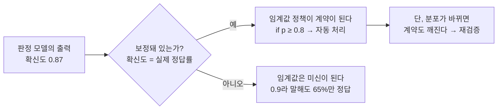
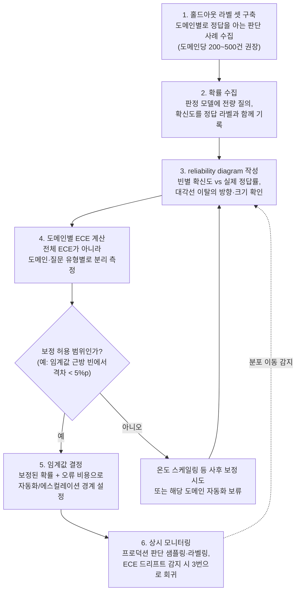

<figure class="post-figure post-figure--header">
<svg role="img" aria-label="보정의 개념을 세 단계로 담은 그림. 왼쪽은 판정 모델이 확신도 0.9를 출력하는 상자. 가운데는 저울로, 왼쪽 접시에 모델의 주장 0.9, 오른쪽 접시에 현실의 정답률 90%가 놓여 수평을 이루고, 그 아래 판단 10개를 나타내는 점 10개 중 9개가 채워져 있다. 오른쪽은 코드 상자로 if p >= 0.8: automate()가 적혀 있고 임계값 = 계약이라는 라벨이 붙어 있다. 화살표가 모델에서 저울을 거쳐 코드로 이어져, 주장과 현실이 일치할 때에만 확률이 코드의 계약이 됨을 보여준다." viewBox="0 0 680 260" xmlns="http://www.w3.org/2000/svg">
  <title>보정 — 확률이 계약이 되는 조건</title>

  <text x="340" y="34" text-anchor="middle" font-size="15" fill="currentColor" font-weight="700">보정(Calibration) — 확률이 계약이 되는 조건</text>

  <!-- left: judgment model -->
  <rect x="30" y="80" width="155" height="85" rx="3" fill="var(--bg-light)" stroke="currentColor" stroke-width="2"/>
  <text x="107" y="106" text-anchor="middle" font-size="11" fill="currentColor" font-weight="700">판정 모델</text>
  <text x="107" y="134" text-anchor="middle" font-size="15" fill="var(--accent-color)" font-weight="700">확신도 p = 0.9</text>
  <text x="107" y="154" text-anchor="middle" font-size="8.5" fill="currentColor" opacity="0.75">모델의 주장</text>

  <line x1="190" y1="122" x2="240" y2="122" stroke="var(--secondary-color)" stroke-width="2" marker-end="url(#jev4-h-arrow)"/>

  <!-- middle: balance scale (claim vs reality) -->
  <line x1="282" y1="95" x2="422" y2="95" stroke="currentColor" stroke-width="3"/>
  <line x1="352" y1="95" x2="352" y2="160" stroke="currentColor" stroke-width="3"/>
  <rect x="332" y="160" width="40" height="8" fill="currentColor"/>
  <line x1="282" y1="95" x2="282" y2="118" stroke="currentColor" stroke-width="1.5"/>
  <line x1="422" y1="95" x2="422" y2="118" stroke="currentColor" stroke-width="1.5"/>
  <rect x="257" y="118" width="50" height="8" rx="2" fill="var(--accent-color)"/>
  <rect x="397" y="118" width="50" height="8" rx="2" fill="var(--secondary-color)"/>
  <text x="282" y="142" text-anchor="middle" font-size="10" fill="var(--accent-color)" font-weight="700">주장 0.9</text>
  <text x="422" y="142" text-anchor="middle" font-size="10" fill="var(--secondary-color)" font-weight="700">현실 90%</text>
  <text x="352" y="182" text-anchor="middle" font-size="10" fill="currentColor" font-weight="700">일치 = 보정됨</text>

  <!-- 10 judgments: 9 correct, 1 wrong -->
  <g>
    <circle cx="262" cy="205" r="6" fill="var(--secondary-color)"/>
    <circle cx="282" cy="205" r="6" fill="var(--secondary-color)"/>
    <circle cx="302" cy="205" r="6" fill="var(--secondary-color)"/>
    <circle cx="322" cy="205" r="6" fill="var(--secondary-color)"/>
    <circle cx="342" cy="205" r="6" fill="var(--secondary-color)"/>
    <circle cx="362" cy="205" r="6" fill="var(--secondary-color)"/>
    <circle cx="382" cy="205" r="6" fill="var(--secondary-color)"/>
    <circle cx="402" cy="205" r="6" fill="var(--secondary-color)"/>
    <circle cx="422" cy="205" r="6" fill="var(--secondary-color)"/>
    <circle cx="442" cy="205" r="6" fill="none" stroke="var(--accent-color)" stroke-width="2"/>
  </g>
  <text x="352" y="230" text-anchor="middle" font-size="9" fill="currentColor" opacity="0.8">0.9라 말한 판단 10개 중 9개 정답 — 확률이 빈도의 약속이 되는 상태</text>

  <line x1="460" y1="122" x2="498" y2="122" stroke="var(--secondary-color)" stroke-width="2" marker-end="url(#jev4-h-arrow)"/>

  <!-- right: code gate -->
  <rect x="505" y="80" width="150" height="85" rx="3" fill="var(--bg-sunken)" stroke="var(--gold)" stroke-width="2"/>
  <text x="520" y="112" text-anchor="start" font-size="11.5" fill="currentColor" font-family="monospace" font-weight="700">if p &gt;= 0.8:</text>
  <text x="536" y="132" text-anchor="start" font-size="11.5" fill="currentColor" font-family="monospace" font-weight="700">automate()</text>
  <text x="580" y="155" text-anchor="middle" font-size="9.5" fill="var(--secondary-color)" font-weight="700">임계값 = 계약</text>

  <defs>
    <marker id="jev4-h-arrow" markerWidth="8" markerHeight="8" refX="6" refY="4" orient="auto">
      <path d="M0,0 L8,4 L0,8 z" fill="var(--secondary-color)"/>
    </marker>
  </defs>
</svg>
<figcaption>모델이 말하는 <strong>확신도(주장)</strong>와 <strong>실제 정답률(현실)</strong>이 저울처럼 일치할 때 — 그때에만 확률은 <code>if p &gt;= 0.8</code> 같은 코드의 <strong>계약</strong>이 된다. 이 일치가 보정(calibration)이다.</figcaption>
</figure>

`JEV-Essential` 시리즈의 4단계입니다. 전체 지도는 [JEV Essential Curriculum](/2026/09/21/jev-essential-curriculum.html)에서 볼 수 있습니다. ([3단계 — 판단의 계보](/2026/09/21/jev-lineage-of-judgment-llm-as-judge.html)에서 이어집니다.)

## 소개

Jev를 둘러싼 숫자들 — 25배 빠르고, 580배 싸고, 777개 판단을 0.7초에 — 은 인상적이지만, 이 시리즈의 커리큘럼이 거듭 강조했듯 **진짜 열쇠는 속도도 가격도 아니라 보정(calibration)**입니다. 판단 특화 모델의 존재 이유는 "확률을 코드의 if문에 꽂는다"는 한 문장으로 요약되는데, 그 문장이 성립하려면 전제가 하나 필요합니다 — **모델이 0.9라고 말할 때 실제로 90% 맞아야 한다**는 것입니다.

이 전제가 무너지면 어떻게 될까요? `if p >= 0.8: escalate()` 같은 코드는 여전히 돌아갑니다. 컴파일 에러도, 런타임 예외도 없습니다. 다만 그 임계값이 의미하던 것 — "10건 중 8건은 맞는 판단만 자동화한다" — 이 조용히 거짓이 될 뿐입니다. 보정은 판정 레이어의 **타입 시스템** 같은 것입니다. 있으면 확률이 계약이 되고, 없으면 확률은 그냥 0과 1 사이의 장식용 숫자입니다.

이 글은 배경 4단계의 마지막 렌즈입니다. 보정의 정의(그리고 정확도와의 구분), 측정 도구(reliability diagram, ECE), 사후 보정 기법(온도 스케일링)과 그 한계, 도메인 이동 시 보정 붕괴가 임계값 자동화에 미치는 영향, 그리고 TypeSafe가 내세우는 훈련 기법 RLCD가 통상의 RLHF와 목적 함수 차원에서 어떻게 달라야 하는지를 다룹니다. 마지막에는 이 모든 것을 하나의 실무 절차 — **벤더의 보정 주장을 자기 데이터로 검증하는 파이프라인** — 로 묶습니다.

한눈에 보면, 이 글이 다루는 것은 "모델의 확신도"가 "코드가 신뢰할 수 있는 확률"이 되기까지의 다리입니다.



## 보정이란 무엇인가 — 정의와 직관

### 확신도 = 실제 정답률

**보정(calibration)**의 정의는 한 문장입니다 — 모델이 확신도 `p`로 내놓은 예측들만 모아 보면, 그중 실제로 맞은 비율이 `p`여야 한다는 것.

```text
완벽한 보정:  P(정답 | 모델의 확신도 = p) = p,  모든 p에 대해
```

즉 "0.7이라고 말한 판단 1,000개를 모으면 그중 700개가 맞아야" 합니다. 0.99라고 말한 것들은 99%가 맞아야 하고, 0.5라고 말한 것들은 반반이어야 합니다. 확률이 **빈도에 대한 약속**으로 기능하는 상태 — 이것이 보정입니다.

여기서 중요한 것은 보정이 **개별 예측의 성질이 아니라 예측들의 집합에 대한 통계적 성질**이라는 점입니다. 단 하나의 판단만 보고 "이 0.87은 보정된 0.87인가"를 물을 수는 없습니다. 검증하려면 반드시 정답을 아는 사례를 여럿 모아야 합니다 — 이 사실이 뒤에서 다룰 검증 절차의 형태를 결정합니다.

### 보정 ≠ 정확도 — 서로 독립인 두 축

보정과 정확도(accuracy)는 다른 개념일 뿐 아니라 **서로 독립적인 축**입니다. 네 조합이 모두 존재합니다.

| | **보정됨** | **보정 안 됨** |
|---|---|---|
| **정확도 높음** | 이상적 — 확률을 그대로 자동화에 사용 가능 | 유능하지만 과신/과소신 — 맞긴 잘 맞는데 확률이 거짓말 |
| **정확도 낮음** | 정직한 무능 — "모르겠다(0.5)"를 정확히 0.5로 보고 | 최악 — 틀리면서 확신까지 함 |

극단적인 예 두 개가 직관을 세워 줍니다.

- **공정한 동전 던지기를 항상 0.5로 예측하는 모델**: 정확도는 동전 던지기 수준(50%)으로 쓸모없지만, 보정은 **완벽**합니다. 0.5라고 말한 것들이 정확히 50% 맞으니까요.
- **정확도 90%인데 모든 예측에 0.99를 붙이는 모델**: 꽤 유능하지만 보정은 엉망입니다. 0.99라고 말한 것들이 90%만 맞습니다 — 이 모델의 확률로 `if p >= 0.95` 정책을 짜면, "95% 이상 확실한 것만 자동화"한다고 믿으면서 실제로는 10%씩 틀리는 판단을 통과시키게 됩니다.

정확도는 "얼마나 맞히는가"이고, 보정은 "**자기가 얼마나 맞힐지를 스스로 아는가**"입니다. 임계값 자동화가 필요로 하는 것은 후자입니다.

### over-confidence와 under-confidence

보정이 깨지는 방향은 둘입니다.

- **과신(over-confidence)**: 확신도 > 실제 정답률. 0.9라고 말하는데 75%만 맞는 경우. 임계값 자동화에서 **위험한 쪽**입니다 — 자동화하면 안 될 판단이 게이트를 통과합니다.
- **과소신(under-confidence)**: 확신도 < 실제 정답률. 0.6이라고 말하는데 85% 맞는 경우. 안전하지만 **비효율적인 쪽**입니다 — 자동화해도 될 판단이 계속 사람에게 에스컬레이션됩니다.

### 신경망은 왜 과신하는가

현대 신경망의 기본 상태는 과신입니다. 이를 체계적으로 보인 것이 Guo et al.의 "On Calibration of Modern Neural Networks"(2017)인데, 흥미롭게도 1990년대의 얕은 네트워크는 꽤 보정돼 있었던 반면 **깊고 큰 현대 네트워크일수록 보정이 나빠졌다**는 관찰에서 출발합니다. 원인은 겹겹입니다.

- **NLL 과적합**: cross-entropy(음의 로그 우도) 학습은 정답 클래스의 확률을 1로 밀어붙입니다. 훈련 후반에는 **정확도가 이미 포화된 뒤에도** 손실을 더 낮추는 유일한 방법이 "이미 맞히는 예측의 확신도를 더 올리는 것"뿐이라, 모델은 정확도 개선 없이 확신도만 부풀립니다.
- **용량 증가**: 모델이 클수록 훈련 데이터를 확신 있게 외울 수 있어, 위 효과가 증폭됩니다.
- **softmax의 기하학**: logit의 작은 차이가 softmax를 거치며 극단적 확률로 증폭됩니다. 모델은 "A가 B보다 조금 그럴듯하다"를 배웠을 뿐인데 출력은 0.97이 됩니다.

그리고 LLM에는 한 겹이 더 있습니다. **사전학습된 베이스 LM은 의외로 보정이 좋은데, 정렬(RLHF)이 그것을 파괴합니다.** [CS336 15강](/2026/06/26/cs336-lecture-15-alignment-sft-rlhf.html)에서 다뤘듯, RLHF를 거치면 확률 질량이 소수의 모드로 쏠리면서(mode collapse) 보정이 무너집니다 — GPT-4 계열의 보고에서 사전학습 모델의 ECE ≈ 0.01이 PPO 후 ≈ 0.07로 뛰는 것이 대표적 사례입니다. "사람이 선호하는 답"을 최적화하는 훈련은 "빈도에 정직한 확률"을 유지할 이유가 없기 때문입니다.

이 사실이 Jev 논의와 직결됩니다. **대화형으로 정렬된 LLM에게 "몇 % 확신하니?"라고 물어서 받는 숫자(verbalized confidence)는 훈련 과정 자체가 보정을 훼손한 모델의 자기 보고**라서, 그대로 임계값에 꽂기 어렵습니다. 판단 특화 모델이 보정을 별도의 훈련 목표로 내세우는 배경이 여기 있습니다.

## 보정의 측정 — reliability diagram과 ECE

### reliability diagram — 보정을 그림으로

보정을 측정하는 표준 절차는 단순합니다. 정답을 아는 평가 셋에 대해 모델의 확신도를 수집한 뒤,

1. 확신도 구간을 **빈(bin)**으로 나눕니다 (예: [0.0, 0.1), [0.1, 0.2), … [0.9, 1.0] 의 10개).
2. 각 빈에 속한 예측들의 **평균 확신도(confidence)**와 **실제 정답률(accuracy)**을 계산합니다.
3. 가로축 = 확신도, 세로축 = 정답률로 그립니다.

완벽하게 보정된 모델은 모든 점이 **대각선(y = x)** 위에 놓입니다. 읽는 법은 이렇습니다.

- 점이 **대각선 아래**에 있으면 (정답률 < 확신도) → **과신**. 현대 신경망의 전형적 모양입니다.
- 점이 **대각선 위**에 있으면 (정답률 > 확신도) → **과소신**.
- 대각선에서 떨어진 **거리**가 그 확신도 구간에서 확률이 하는 거짓말의 크기입니다.

<figure class="post-figure">
<svg role="img" aria-label="reliability diagram 읽는 법을 보여주는 그래프. 가로축은 확신도(모델의 주장), 세로축은 실제 정답률(현실)이고, 왼쪽 아래에서 오른쪽 위로 완벽한 보정을 뜻하는 대각선 y = x가 점선으로 그려져 있다. 대각선 아래는 과신 영역(정답률이 확신도보다 낮음), 위는 과소신 영역(정답률이 확신도보다 높음)이다. 전형적인 과신 모델의 빈별 점들이 붉은 곡선으로 대각선 아래에 깔려 있고, 확신도 0.85 지점에서 점과 대각선 사이의 수직 거리에 격차 마이너스 21%p라는 주석이 붙어, 대각선에서 떨어진 거리가 그 구간에서 확률이 하는 거짓말의 크기임을 보여준다. 대각선 위에는 0.6이라 말하는데 80% 맞는 과소신 예시 점이 하나 찍혀 있다." viewBox="0 0 680 420" xmlns="http://www.w3.org/2000/svg">
  <title>Reliability Diagram 읽는 법 — 대각선, 과신, 과소신, 격차</title>

  <text x="330" y="36" text-anchor="middle" font-size="14" fill="currentColor" font-weight="700">Reliability Diagram 읽는 법</text>

  <!-- zones -->
  <polygon points="90,305 550,80 550,350 90,350" fill="var(--accent-color)" opacity="0.07"/>
  <polygon points="90,305 550,80 90,80" fill="var(--secondary-color)" opacity="0.07"/>

  <!-- faint bin gridlines -->
  <line x1="182" y1="80" x2="182" y2="350" stroke="currentColor" stroke-width="1" opacity="0.12"/>
  <line x1="274" y1="80" x2="274" y2="350" stroke="currentColor" stroke-width="1" opacity="0.12"/>
  <line x1="366" y1="80" x2="366" y2="350" stroke="currentColor" stroke-width="1" opacity="0.12"/>
  <line x1="458" y1="80" x2="458" y2="350" stroke="currentColor" stroke-width="1" opacity="0.12"/>

  <!-- axes -->
  <line x1="90" y1="350" x2="560" y2="350" stroke="currentColor" stroke-width="2"/>
  <line x1="90" y1="350" x2="90" y2="70" stroke="currentColor" stroke-width="2"/>
  <text x="90" y="368" text-anchor="middle" font-size="9" fill="currentColor" opacity="0.8">0.5</text>
  <text x="182" y="368" text-anchor="middle" font-size="9" fill="currentColor" opacity="0.8">0.6</text>
  <text x="274" y="368" text-anchor="middle" font-size="9" fill="currentColor" opacity="0.8">0.7</text>
  <text x="366" y="368" text-anchor="middle" font-size="9" fill="currentColor" opacity="0.8">0.8</text>
  <text x="458" y="368" text-anchor="middle" font-size="9" fill="currentColor" opacity="0.8">0.9</text>
  <text x="550" y="368" text-anchor="middle" font-size="9" fill="currentColor" opacity="0.8">1.0</text>
  <text x="80" y="353" text-anchor="end" font-size="9" fill="currentColor" opacity="0.8">0.4</text>
  <text x="80" y="263" text-anchor="end" font-size="9" fill="currentColor" opacity="0.8">0.6</text>
  <text x="80" y="173" text-anchor="end" font-size="9" fill="currentColor" opacity="0.8">0.8</text>
  <text x="80" y="83" text-anchor="end" font-size="9" fill="currentColor" opacity="0.8">1.0</text>
  <text x="325" y="392" text-anchor="middle" font-size="11" fill="currentColor" font-weight="700">확신도 (모델의 주장)</text>
  <text x="32" y="215" text-anchor="middle" font-size="11" fill="currentColor" font-weight="700" transform="rotate(-90 32 215)">실제 정답률 (현실)</text>

  <!-- diagonal y = x -->
  <line x1="90" y1="305" x2="550" y2="80" stroke="currentColor" stroke-width="2" stroke-dasharray="7 5" opacity="0.65"/>
  <text x="352" y="164" text-anchor="middle" font-size="10" fill="currentColor" font-weight="700" opacity="0.75" transform="rotate(-26 352 164)">완벽한 보정 (y = x)</text>

  <!-- zone labels -->
  <text x="430" y="322" text-anchor="middle" font-size="11" fill="var(--accent-color)" font-weight="700">과신 영역 — 정답률 &lt; 확신도</text>
  <text x="210" y="104" text-anchor="middle" font-size="11" fill="var(--secondary-color)" font-weight="700">과소신 영역 — 정답률 &gt; 확신도</text>

  <!-- over-confident model curve (typical modern NN) -->
  <polyline points="136,305 228,282.5 320,269 412,242 485.6,219.5 531.6,161" fill="none" stroke="var(--accent-color)" stroke-width="2.5"/>
  <circle cx="136" cy="305" r="5" fill="var(--accent-color)"/>
  <circle cx="228" cy="282.5" r="5" fill="var(--accent-color)"/>
  <circle cx="320" cy="269" r="5" fill="var(--accent-color)"/>
  <circle cx="412" cy="242" r="5" fill="var(--accent-color)"/>
  <circle cx="485.6" cy="219.5" r="5" fill="var(--accent-color)"/>
  <circle cx="531.6" cy="161" r="5" fill="var(--accent-color)"/>
  <text x="528" y="145" text-anchor="end" font-size="9" fill="var(--accent-color)" font-weight="700">과신 모델의 곡선 (전형적 신경망)</text>

  <!-- gap annotation at conf 0.85 -->
  <line x1="412" y1="237" x2="412" y2="152" stroke="var(--accent-color)" stroke-width="1.8" stroke-dasharray="4 3" marker-start="url(#jev4-rd-gap)" marker-end="url(#jev4-rd-gap)"/>
  <text x="422" y="192" text-anchor="start" font-size="10" fill="var(--accent-color)" font-weight="700">격차 −21%p</text>
  <text x="422" y="206" text-anchor="start" font-size="8.5" fill="currentColor" opacity="0.8">= 이 구간에서 확률이 하는 거짓말의 크기</text>

  <!-- under-confident example point -->
  <circle cx="182" cy="170" r="5" fill="var(--secondary-color)"/>
  <text x="185" y="192" text-anchor="middle" font-size="9" fill="var(--secondary-color)" font-weight="700">0.6이라 말하는데 80% 정답</text>

  <defs>
    <marker id="jev4-rd-gap" markerWidth="7" markerHeight="7" refX="3.5" refY="3.5" orient="auto">
      <path d="M0.5,0.5 L6.5,3.5 L0.5,6.5 z" fill="var(--accent-color)"/>
    </marker>
  </defs>
</svg>
<figcaption>reliability diagram 읽는 법. 점이 <strong>대각선 아래</strong>면 과신, <strong>위</strong>면 과소신이고, 대각선에서 떨어진 <strong>수직 거리</strong>가 그 확신도 구간에서 확률이 하는 거짓말의 크기다. 붉은 곡선은 전형적인 과신 모델 — 확신도가 높은 구간일수록 격차가 벌어진다.</figcaption>
</figure>

### ECE — 그림을 숫자 하나로

**ECE(Expected Calibration Error)**는 reliability diagram의 대각선 이탈을 하나의 숫자로 요약합니다. 각 빈에서의 |정답률 − 확신도| 격차를, 그 빈에 담긴 표본 수로 가중 평균한 값입니다.

```text
ECE = Σ_m ( |B_m| / n ) · | acc(B_m) − conf(B_m) |

  B_m       : m번째 확신도 빈에 속한 예측들의 집합
  |B_m| / n : 그 빈의 표본 비중 (가중치)
  acc(B_m)  : 그 빈의 실제 정답률
  conf(B_m) : 그 빈의 평균 확신도
```

ECE = 0.02라면 "확신도가 실제 정답률과 평균 2%p 어긋난다"는 뜻입니다. 자매 지표로 **MCE(Maximum Calibration Error)** — 가중 평균 대신 최악의 빈 하나의 격차 — 가 있는데, 안전이 중요한 임계값 설계에서는 평균보다 최악이 중요할 때가 많아 함께 보는 편이 좋습니다.

다만 ECE는 만능이 아닙니다. 한계를 알고 써야 합니다.

- **빈 설계에 민감합니다**: 빈 개수·경계를 바꾸면 값이 달라집니다. 특히 신경망은 확신도가 0.9~1.0 구간에 몰리는 경향이 있어, 균등 폭 빈에서는 대부분의 빈이 비고 한두 빈이 전부를 좌우합니다 (그래서 표본 수 기준으로 빈을 나누는 adaptive binning 변형이 있습니다).
- **표본이 필요합니다**: 빈당 수십 건은 있어야 정답률 추정이 안정됩니다. 라벨 50건으로 계산한 ECE는 노이즈입니다.
- **집계 지표입니다**: 전체 ECE가 낮아도 특정 부분집합(특정 도메인, 특정 질문 유형)에서는 심하게 어긋날 수 있습니다. 뒤의 검증 절차에서 **도메인별 ECE**를 따로 계산하는 이유입니다.

### 사후 보정 — 온도 스케일링과 그 한계

과신하는 모델을 버리지 않고 고치는 방법이 **사후 보정(post-hoc calibration)**입니다. 대표 주자는 **온도 스케일링(temperature scaling)**으로, 방법은 허무할 만큼 단순합니다 — softmax에 넣기 전의 logit을 스칼라 `T` 하나로 나눕니다.

```text
보정된 확률 = softmax( z / T )

  T > 1 : 분포를 평평하게 (확신도를 낮춤) → 과신 교정
  T < 1 : 분포를 뾰족하게 (확신도를 높임) → 과소신 교정
  T = 1 : 원본 그대로
```

`T`는 **라벨이 있는 검증 셋**에서 NLL을 최소화하도록 맞춥니다. 핵심 성질은 **argmax를 바꾸지 않는다**는 것 — 모든 logit을 같은 수로 나누므로 순위가 보존되고, 따라서 **정확도는 1도 변하지 않으면서 확신도만 재조정**됩니다. Guo et al.의 발견 중 가장 인상적인 부분은, 이 파라미터 1개짜리 방법이 히스토그램 비닝·isotonic regression·Platt scaling 같은 더 복잡한 방법들과 대등하거나 그 이상이었다는 점입니다.

<figure class="post-figure">
<svg role="img" aria-label="온도 스케일링의 원리를 보여주는 그림. 왼쪽 패널에는 softmax 이전의 logit 막대 두 개(z_A = 2.6, z_B = 0.4)가 있고, A가 B보다 크다. 여기서 화살표 두 개가 갈라진다. 위쪽 화살표(T = 1, 원본)는 softmax를 그대로 통과해 확률 A 0.90, B 0.10 — 과신 상태가 된다. 아래쪽 화살표(T = 2.9)는 logit을 2.9로 나눈 뒤 softmax를 통과해 확률 A 0.68, B 0.32 — 보정된 상태가 된다. 두 경우 모두 1위는 A로 같아서, 같은 수로 나누면 순위(argmax)가 보존되어 정확도는 변하지 않고 확신도만 재조정됨을 보여준다." viewBox="0 0 680 350" xmlns="http://www.w3.org/2000/svg">
  <title>온도 스케일링 — argmax는 보존하고 확신도만 재조정</title>

  <text x="340" y="30" text-anchor="middle" font-size="14" fill="currentColor" font-weight="700">온도 스케일링 — 확신도만 눌러 주는 교정 렌즈</text>

  <!-- left: logits panel -->
  <rect x="24" y="60" width="176" height="220" rx="3" fill="var(--bg-light)" stroke="currentColor" stroke-width="1.5"/>
  <text x="112" y="82" text-anchor="middle" font-size="10.5" fill="currentColor" font-weight="700">logit (softmax 이전)</text>
  <rect x="64" y="123" width="32" height="117" fill="var(--steel)"/>
  <rect x="128" y="222" width="32" height="18" fill="var(--steel)"/>
  <line x1="48" y1="240" x2="184" y2="240" stroke="currentColor" stroke-width="1.5"/>
  <text x="80" y="116" text-anchor="middle" font-size="9" fill="currentColor" font-weight="700">z_A = 2.6</text>
  <text x="144" y="215" text-anchor="middle" font-size="9" fill="currentColor" font-weight="700">z_B = 0.4</text>
  <text x="80" y="256" text-anchor="middle" font-size="10" fill="currentColor" font-weight="700">A</text>
  <text x="144" y="256" text-anchor="middle" font-size="10" fill="currentColor" font-weight="700">B</text>
  <text x="112" y="272" text-anchor="middle" font-size="8.5" fill="currentColor" opacity="0.8">"A가 B보다 조금 더 그럴듯하다"</text>

  <!-- branch arrows -->
  <line x1="204" y1="140" x2="294" y2="108" stroke="var(--secondary-color)" stroke-width="2" marker-end="url(#jev4-ts-arrow)"/>
  <text x="248" y="108" text-anchor="middle" font-size="9" fill="currentColor" font-weight="700">softmax(z)</text>
  <line x1="204" y1="220" x2="294" y2="252" stroke="var(--secondary-color)" stroke-width="2" marker-end="url(#jev4-ts-arrow)"/>
  <text x="248" y="252" text-anchor="middle" font-size="9" fill="var(--secondary-color)" font-weight="700">softmax(z ÷ 2.9)</text>

  <!-- top-right: T = 1 (original) -->
  <rect x="300" y="60" width="356" height="110" rx="3" fill="var(--bg-light)" stroke="var(--accent-color)" stroke-width="2"/>
  <text x="478" y="80" text-anchor="middle" font-size="10.5" fill="currentColor" font-weight="700">T = 1 — 원본</text>
  <text x="318" y="105" text-anchor="middle" font-size="10" fill="currentColor" font-weight="700">A</text>
  <rect x="330" y="92" width="270" height="16" fill="var(--accent-color)"/>
  <text x="606" y="105" text-anchor="start" font-size="9.5" fill="currentColor" font-weight="700">0.90</text>
  <text x="318" y="131" text-anchor="middle" font-size="10" fill="currentColor" font-weight="700">B</text>
  <rect x="330" y="118" width="30" height="16" fill="currentColor" opacity="0.35"/>
  <text x="366" y="131" text-anchor="start" font-size="9.5" fill="currentColor" font-weight="700">0.10</text>
  <text x="478" y="157" text-anchor="middle" font-size="9.5" fill="var(--accent-color)" font-weight="700">확신도 0.90 — 과신 (주장 &gt; 현실)</text>

  <!-- bottom-right: T = 2.9 (scaled) -->
  <rect x="300" y="200" width="356" height="110" rx="3" fill="var(--bg-light)" stroke="var(--secondary-color)" stroke-width="2"/>
  <text x="478" y="220" text-anchor="middle" font-size="10.5" fill="currentColor" font-weight="700">T = 2.9 — 온도 스케일링 후</text>
  <text x="318" y="245" text-anchor="middle" font-size="10" fill="currentColor" font-weight="700">A</text>
  <rect x="330" y="232" width="204" height="16" fill="var(--secondary-color)"/>
  <text x="540" y="245" text-anchor="start" font-size="9.5" fill="currentColor" font-weight="700">0.68</text>
  <text x="318" y="271" text-anchor="middle" font-size="10" fill="currentColor" font-weight="700">B</text>
  <rect x="330" y="258" width="96" height="16" fill="currentColor" opacity="0.35"/>
  <text x="432" y="271" text-anchor="start" font-size="9.5" fill="currentColor" font-weight="700">0.32</text>
  <text x="478" y="297" text-anchor="middle" font-size="9.5" fill="var(--secondary-color)" font-weight="700">확신도 0.68 — 보정 · 1위는 여전히 A</text>

  <text x="340" y="336" text-anchor="middle" font-size="10.5" fill="currentColor" font-weight="700">같은 수 T로 나누면 순위(argmax)는 보존 — 정확도 불변, 확신도만 재조정</text>

  <defs>
    <marker id="jev4-ts-arrow" markerWidth="8" markerHeight="8" refX="6" refY="4" orient="auto">
      <path d="M0,0 L8,4 L0,8 z" fill="var(--secondary-color)"/>
    </marker>
  </defs>
</svg>
<figcaption>온도 스케일링의 원리 (예시 수치). 같은 logit이 <strong>T = 1</strong>에서는 0.90(과신), <strong>T = 2.9</strong>로 나누면 0.68(보정)이 되지만 — 두 경우 모두 <strong>1위는 A</strong>다. 모든 logit을 같은 수로 나누므로 순위가 보존되어 <strong>정확도는 그대로, 확신도만</strong> 재조정된다.</figcaption>
</figure>

하지만 온도 스케일링에는 구조적 한계가 있고, 이 한계들이 다음 절의 주제로 이어집니다.

- **검증 셋의 분포에 묶입니다**: `T`는 "그 검증 셋에서의" 과신 정도를 상쇄하는 값입니다. 입력 분포가 바뀌면 맞춰 둔 `T`는 더 이상 옳지 않습니다 — 사후 보정은 **분포 내(in-distribution) 보증**일 뿐입니다.
- **스칼라 하나로 모든 것을 고칠 수 없습니다**: 도메인 A에서는 과신, 도메인 B에서는 과소신인 모델을 단일 `T`로 동시에 고칠 수 없습니다. 평균은 맞아 보여도 양쪽 다 틀린 상태가 됩니다.
- **라벨이 필요합니다**: 결국 정답을 아는 데이터가 있어야 합니다. "라벨 없이 보정 확인"은 성립하지 않습니다.
- **순위는 그대로입니다**: 온도 스케일링은 확신도의 크기만 고칩니다. 모델이 판단 자체를 잘못 배웠다면(잘못된 것에 더 확신) 보정으로는 구제할 수 없습니다.

정리하면 — 사후 보정은 "훈련이 부풀린 확신도를 검증 분포 기준으로 다시 눌러 주는" 교정 렌즈이지, 분포가 바뀌어도 유지되는 성질이 아닙니다.

## 도메인 이동과 보정 붕괴 — 임계값 자동화의 아킬레스건

보정에 관한 가장 중요한 실무적 사실은 이것입니다 — **보정은 모델만의 성질이 아니라, 모델과 입력 분포의 결합에 대한 성질**입니다. 벤치마크 분포에서 ECE 0.02였던 모델이 여러분의 도메인에서도 0.02라는 보장은 어디에도 없습니다.

경험적으로도 그렇습니다. 분포 이동 아래에서의 불확실성 품질을 대규모로 비교한 연구(Ovadia et al., "Can You Trust Your Model's Uncertainty?", 2019)의 결론은 일관됩니다 — **입력이 훈련 분포에서 멀어질수록 정확도는 떨어지는데 확신도는 그만큼 따라 내려오지 않아, 이동이 클수록 모델은 점점 더 "자신 있게 틀리는" 상태가 됩니다.** 온도 스케일링으로 분포 내 보정을 완벽히 맞춰 놓아도, 이동된 분포에서는 그 보정이 함께 무너집니다.

이것이 임계값 자동화에 무엇을 의미하는지, 3단계에서 본 고객지원 라우팅 예로 따라가 봅시다.

1. **도입 시점**: "이 고객이 화나 있는가?"에 판정 모델이 확률을 반환. 자사 티켓 500건으로 검증해 보니 보정 양호. `p >= 0.8 → 에스컬레이션` 정책을 코드로 박습니다. 0.8의 의미: "자동 에스컬레이션되는 건의 80% 이상은 진짜 화난 고객이다."
2. **6개월 후**: 신제품 출시로 티켓의 어휘가 바뀌고, 신규 시장 진출로 비원어민 고객의 문체가 유입됩니다. 검증 시점의 분포가 아닙니다.
3. **붕괴**: 모델은 여전히 0.85, 0.9를 자신 있게 반환하지만 그 구간의 실제 정답률은 60%대로 내려앉았습니다. `p >= 0.8` 게이트는 이제 10건 중 4건꼴로 틀리는 판단을 통과시킵니다.
4. **문제의 핵심 — 침묵**: 이 실패는 **아무 신호도 내지 않습니다.** 에러도, 지연 증가도, 확신도 하락도 없습니다. 모니터링 대시보드의 "평균 확신도" 그래프는 오히려 멀쩡하거나 더 높습니다. 확신도는 시스템이 스스로의 이상을 감지하는 센서인데, 보정 붕괴는 **바로 그 센서가 고장 나는 사건**이기 때문입니다.

그래서 임계값 기반 자동화의 올바른 이해는 이렇습니다 — **임계값은 "보정이 유지되는 분포"라는 조건이 붙은 계약**입니다. 이 관점에서 두 가지 실무 원칙이 나옵니다.

- **보정 검증은 일회성 이벤트가 아니라 상시 프로세스**여야 합니다. 프로덕션 판단의 일부를 지속적으로 샘플링·라벨링해서 보정 드리프트를 감시해야 합니다.
- 커리큘럼의 관통 질문 — "이 성질은 모델의 것인가, 시스템의 것인가?" — 에 대한 보정의 답은 **"모델과 분포의 결합, 따라서 결국 시스템의 것"**입니다. 벤더는 자기 평가 분포에서의 보정만 보장할 수 있고, 여러분의 분포에서의 보정은 여러분만 검증할 수 있습니다.

## RLCD — 보정을 훈련 목표로 삼는다는 것

이제 TypeSafe가 내세우는 훈련 기법, **RLCD(Reinforcement Learning for Calibrated Decisions)**를 볼 차례입니다.

먼저 정직하게 선을 긋겠습니다. **RLCD에 대한 공개 정보는 제한적입니다.** 이 글을 쓰는 시점에 확인되는 것은 (1) 이름, (2) "모델이 말하는 확신도가 실제 정답률과 일치하도록 훈련되었다"는 벤더의 주장, 그리고 (3) [실사용기](/2026/09/20/mini-vibe-check-typesafe-jev.html)에서 관찰된 출력 형태(질문 → 보정된 확률) 정도입니다. 논문도, 학습 레시피도, 독립 재현도 공개된 바 없습니다. 따라서 아래의 비교는 "RLCD는 실제로 이렇다"가 아니라, **"보정을 훈련 목표로 삼는 RL이라면 통상의 RLHF와 목적 함수 차원에서 무엇이 달라야 하는가"를 보정 이론에서 역산한 재구성**입니다. 실제 구현은 다를 수 있습니다.

### 통상 RLHF의 목적 함수는 보정과 무관하다

[CS336 15강](/2026/06/26/cs336-lecture-15-alignment-sft-rlhf.html)에서 본 RLHF의 목적 함수를 다시 꺼내면,

```text
max_π  E[ R(x, y) ]  −  β · KL( π ‖ π_ref )
```

여기서 보상 `R`은 **사람의 쌍대 선호(y_w ≻ y_l)를 Bradley-Terry로 요약한 학습된 프록시**입니다. 이 목적 함수 어디에도 "출력한 확률이 빈도와 일치하라"는 항이 없습니다. 없기만 한 게 아니라 적극적으로 해칩니다 — 선호 보상을 최대화하는 최적해는 확률 질량을 선호되는 소수 모드로 몰아넣는 것이고(mode collapse), 그 결과가 앞서 본 "RLHF 후 ECE 악화"입니다. **RLHF는 보정을 파괴하는 것이 버그가 아니라, 목적 함수상 자연스러운 귀결**입니다.

### 보정을 목표로 하는 RL의 목적 함수는 어떻게 생겨야 하는가

모델이 확률 `q`를 **출력 자체**로 내놓고 그것을 보상으로 채점하려면, 보상은 두 가지를 동시에 만족해야 합니다 — 맞는 판단에 보상을 주되, **말한 확률이 정직할 때 기대 보상이 최대**가 되어야 합니다. 이 성질을 가진 채점 함수가 통계학의 **proper scoring rule**입니다. 대표적으로,

```text
Brier score  :  reward = −( q − y )²        (y ∈ {0, 1} 는 정답 라벨)
Log score    :  reward = y·log q + (1−y)·log(1−q)
```

proper scoring rule의 정의적 성질: 진짜 정답 확률이 `p`인 사건에 대해 기대 보상을 최대화하는 보고값은 정확히 `q = p`입니다. 과신(q > p)도 과소신(q < p)도 기대 보상을 깎습니다. 즉 **"정직한 확률 보고"가 유일한 최적 전략이 되도록 인센티브가 설계된 보상**입니다. 보정을 훈련 목표로 삼는 RL이라면, 목적 함수의 심장에 이런 종류의 항이 있어야 합니다.

이 재구성 위에서 두 훈련의 차이를 나란히 놓으면 이렇습니다.

| | **통상 RLHF** | **RLCD (공개 주장 기반 재구성)** |
|---|---|---|
| 훈련 신호의 원천 | 사람의 쌍대 선호 (y_w ≻ y_l) | 정답 라벨이 있는 판단 태스크 |
| 보상의 형태 | 학습된 선호 프록시 (Bradley-Terry 보상 모델) | 확률 출력에 대한 proper scoring rule류 채점 |
| 보상이 채점하는 것 | "어느 응답을 사람이 더 좋아하는가" | "말한 확률이 실제 정답 빈도와 부합하는가" |
| 보상 해킹 여지 | 큼 — 프록시의 허점 공략 (Goodhart) | 상대적으로 작음 — 정답 라벨 기반의 검증 가능한 보상 |
| 보정에 미치는 효과 | 파괴 (mode collapse, ECE 악화) | 보정 자체가 최적화 대상 |
| 출력의 성격 | 사람이 읽을 산문 | 코드가 소비할 확률 |

한 가지 덧붙이면, "검증 가능한 정답 라벨을 보상으로 쓴다"는 점에서 이 방향은 RLHF보다 **RLVR(Reinforcement Learning with Verifiable Rewards)** — [CS336 16강](/2026/06/26/cs336-lecture-16-alignment-rlvr.html)의 주제 — 의 친척에 가깝습니다. 다만 RLVR가 "정답이면 1, 오답이면 0"의 이진 보상으로 **정답률**을 밀어 올리는 것이라면, 보정 지향 훈련은 확률값 자체를 채점해 **정답률에 대한 자기 보고의 정직성**을 밀어 올린다는 점이 다릅니다.

그리고 다시 한 번 — 위 표의 오른쪽 열은 벤더 주장과 보정 이론으로부터의 추론입니다. 훈련 데이터의 구성(어떤 판단 태스크? 주관적 질문의 "정답"은 누가 정의?), 스코어링의 세부, 규모 어느 것도 공개 검증된 바 없습니다. 그러니 RLCD를 평가하는 올바른 자세는 원리를 이해하되 **주장은 자기 데이터로 확인하는 것**입니다. 그 절차가 마지막 주제입니다.

## 벤더 주장을 자기 데이터로 검증하기 — 절차 설계

보정의 좋은 점은, 벤더 주장의 진위를 **전적으로 내 쪽에서 판정할 수 있다**는 것입니다. 모델 내부를 볼 필요도, 훈련 레시피를 알 필요도 없습니다. 필요한 것은 정답을 아는 내 도메인의 사례들과, 앞에서 배운 측정 도구뿐입니다.



각 단계에서 챙길 것들입니다.

1. **홀드아웃 라벨 셋 구축** — 실제 파이프라인에 흐를 입력과 같은 분포에서 뽑고, 정답 라벨은 신뢰할 수 있는 기준(사람 합의, 사후 확인된 결과)으로 답니다. **도메인·질문 유형별로 층화**해서 모으는 것이 핵심입니다. 규모의 근거: 빈 10개짜리 reliability diagram에서 빈당 수십 건은 있어야 정답률 추정이 안정되므로, 도메인당 200~500건이 현실적인 하한입니다. 이 셋은 홀드아웃입니다 — 프롬프트 튜닝이나 임계값 탐색에 재사용하면 검증력이 오염됩니다.
2. **확률 수집** — 전량 질의하고 (확신도, 정답) 쌍을 기록합니다. 판단 특화 모델의 가격대라면 수천 건 검증도 사실상 공짜라는 점이 이 절차를 실용적으로 만듭니다.
3. **reliability diagram** — 숫자 하나(ECE)로 건너뛰지 말고 그림을 먼저 봅니다. 과신인지 과소신인지, 어느 확신도 구간이 어긋나는지는 그림에서만 보입니다. 특히 **내가 쓸 임계값 근방 구간**의 이탈이 실질적으로 중요합니다 — 0.3 구간이 어긋나는 것과 0.85 구간이 어긋나는 것은 `p >= 0.8` 정책에 미치는 영향이 전혀 다릅니다.
4. **도메인별 ECE** — 전체 집계는 상쇄 착시를 만듭니다(도메인 A의 과신과 B의 과소신이 평균에서 지워짐). 도메인별·질문 유형별로 따로 계산하고, 필요하면 MCE도 함께 봅니다. 특정 도메인만 나쁘다면 그 도메인만 자동화에서 제외하는 부분 도입이 가능해집니다.
5. **임계값 결정** — 보정이 확인된 뒤에야 임계값이 의미를 갖습니다. 임계값 자체는 보정과 별개로 **오류의 비용 구조**(거짓 양성 vs 거짓 음성의 비용, 에스컬레이션 처리 용량)에서 나옵니다. 보정은 "0.8이 진짜 80%임"을 보장할 뿐, 80%로 충분한지는 태스크가 정합니다.
6. **상시 모니터링** — 앞 절에서 봤듯 보정 붕괴는 침묵 속에 옵니다. 프로덕션 판단의 일정 비율을 지속 샘플링·라벨링해 ECE 추이를 감시하고, 드리프트가 감지되면 3번으로 돌아갑니다. 입력 분포가 크게 바뀌는 이벤트(신제품, 신규 시장, 정책 변경)는 예약된 재검증 트리거로 삼습니다.

이 절차의 부수 효과 하나 — 확률 + 임계값 + 검증 셋으로 판정 레이어를 설계해 두면, **벤더 교체가 검증 셋 재실행 한 번**이 됩니다. 판정기가 진짜 "부품"이 되는 순간입니다. 이 설계 패턴은 6단계에서 본격적으로 다룹니다.

## 예시 — ECE를 직접 계산해 보기

말로 배운 것을 코드로 못 박겠습니다. 아래는 외부 의존성 numpy 하나로 ECE와 reliability diagram 데이터를 계산하고, 과신 모델을 온도 스케일링으로 교정해 보는 자기완결 예제입니다.

```python
import numpy as np

def expected_calibration_error(confidences, labels, n_bins=10):
    """ECE(Expected Calibration Error)를 계산한다.

    이진 판단을 가정한다: 모델은 "yes일 확률" q를 출력하고,
    확신도(confidence)는 max(q, 1-q), 예측은 q >= 0.5 여부다.

    Args:
        confidences: (N,) 각 판단의 확신도 (0.5 ~ 1.0)
        labels:      (N,) 각 판단이 실제로 맞았는지 (1 = 정답, 0 = 오답)
        n_bins:      확신도 구간을 나눌 빈 개수

    Returns:
        ece:  표본 수로 가중 평균한 |정답률 - 확신도| (0에 가까울수록 좋음)
        bins: reliability diagram을 그릴 빈별 통계 리스트
    """
    confidences = np.asarray(confidences, dtype=float)
    labels = np.asarray(labels, dtype=float)
    n = len(confidences)

    # 확신도 축을 균등 폭 빈으로 분할한다.
    # (실전에서는 표본 수 균등 분할(adaptive binning)도 함께 확인할 것 —
    #  신경망 확신도는 높은 구간에 몰려 균등 폭 빈이 비기 쉽다.)
    bin_edges = np.linspace(0.5, 1.0, n_bins + 1)

    ece = 0.0
    bins = []
    for lo, hi in zip(bin_edges[:-1], bin_edges[1:]):
        # 이 빈에 속하는 판단들을 고른다 (마지막 빈만 상한 포함).
        in_bin = (confidences >= lo) & (
            (confidences < hi) if hi < 1.0 else (confidences <= hi)
        )
        count = int(in_bin.sum())
        if count == 0:
            continue  # 빈 빈은 건너뛴다

        avg_conf = confidences[in_bin].mean()  # 빈의 평균 확신도: "모델의 주장"
        accuracy = labels[in_bin].mean()       # 빈의 실제 정답률: "현실"

        # 빈의 격차를 표본 비중으로 가중해 누적한다 — 이것이 ECE의 정의.
        ece += (count / n) * abs(accuracy - avg_conf)
        bins.append((lo, hi, count, avg_conf, accuracy))

    return ece, bins


def temperature_scale(logits, T):
    """이진 logit에 온도 스케일링을 적용해 확률로 변환한다.

    T > 1 이면 분포가 평평해져 확신도가 내려간다 (과신 교정).
    logit을 같은 수로 나누므로 예측(부호)은 바뀌지 않는다 — 정확도 불변.
    """
    return 1.0 / (1.0 + np.exp(-np.asarray(logits) / T))


# ---------------------------------------------------------------
# 합성 실험: "유능하지만 과신하는" 판정 모델을 만들어 본다.
# ---------------------------------------------------------------
rng = np.random.default_rng(42)
N = 5000

# 진짜 세계: 각 사례가 yes일 실제 확률 p_true (모델은 이걸 모른다)
p_true = rng.beta(2, 2, size=N)          # 0~1에 퍼진 난이도 분포
y = (rng.random(N) < p_true).astype(int)  # 실제 정답 라벨

# 모델: 방향은 대체로 옳지만(유능), logit을 2.5배 부풀린다(과신).
# 훈련 후반의 NLL 과적합이 만드는 전형적 상태를 흉내 낸 것이다.
noise = rng.normal(0, 0.4, size=N)                      # 판단의 불완전성
true_logit = np.log(p_true / (1 - p_true)) + noise      # 유능한 부분
overconfident_logit = 2.5 * true_logit                  # 과신 부분

q = 1.0 / (1.0 + np.exp(-overconfident_logit))  # 모델이 출력하는 확률
pred = (q >= 0.5).astype(int)                    # 모델의 예측
conf = np.maximum(q, 1 - q)                      # 확신도
correct = (pred == y).astype(int)                # 맞았는가

ece, bins = expected_calibration_error(conf, correct)
print(f"정확도: {correct.mean():.3f}")
print(f"보정 전 ECE: {ece:.3f}")
print(f"{'빈(확신도)':>14} {'표본':>6} {'주장(conf)':>10} {'현실(acc)':>10} {'격차':>7}")
for lo, hi, cnt, c, a in bins:
    print(f"  [{lo:.2f}, {hi:.2f}) {cnt:6d} {c:10.3f} {a:10.3f} {a - c:+7.3f}")

# ---------------------------------------------------------------
# 온도 스케일링: 검증 셋에서 NLL을 최소화하는 T를 격자 탐색으로 찾는다.
# (실무에서는 scipy.optimize 등으로 풀지만 원리는 동일하다.)
# 주의: T를 맞추는 셋과 ECE를 재는 셋은 분리해야 한다.
# ---------------------------------------------------------------
val, test = np.arange(N) < N // 2, np.arange(N) >= N // 2

def nll(q, y):
    q = np.clip(q, 1e-7, 1 - 1e-7)  # log(0) 방지
    return -np.mean(y * np.log(q) + (1 - y) * np.log(1 - q))

Ts = np.linspace(0.5, 5.0, 91)
best_T = min(Ts, key=lambda T: nll(temperature_scale(overconfident_logit[val], T), y[val]))

q_cal = temperature_scale(overconfident_logit[test], best_T)
pred_cal = (q_cal >= 0.5).astype(int)
conf_cal = np.maximum(q_cal, 1 - q_cal)
ece_cal, _ = expected_calibration_error(conf_cal, (pred_cal == y[test]).astype(int))

print(f"\n최적 온도 T = {best_T:.2f}  (T > 1 → 과신을 눌러 준다)")
print(f"보정 전 정확도 (테스트 셋): {correct[test].mean():.3f}")
print(f"보정 후 정확도 (테스트 셋): {(pred_cal == y[test]).mean():.3f}  ← 동일 (argmax 보존)")
print(f"보정 후 ECE  (테스트 셋): {ece_cal:.3f}")
```

실행 결과입니다.

```text
정확도: 0.672
보정 전 ECE: 0.157
        빈(확신도)     표본   주장(conf)    현실(acc)      격차
  [0.50, 0.55)    280      0.524      0.461  -0.063
  [0.55, 0.60)    298      0.574      0.537  -0.037
  [0.60, 0.65)    306      0.625      0.549  -0.076
  [0.65, 0.70)    326      0.675      0.571  -0.105
  [0.70, 0.75)    349      0.726      0.553  -0.173
  [0.75, 0.80)    339      0.776      0.631  -0.144
  [0.80, 0.85)    378      0.825      0.632  -0.193
  [0.85, 0.90)    516      0.876      0.653  -0.223
  [0.90, 0.95)    644      0.927      0.694  -0.233
  [0.95, 1.00)   1564      0.982      0.822  -0.160

최적 온도 T = 2.90  (T > 1 → 과신을 눌러 준다)
보정 전 정확도 (테스트 셋): 0.677
보정 후 정확도 (테스트 셋): 0.677  ← 동일 (argmax 보존)
보정 후 ECE  (테스트 셋): 0.014
```

이 출력에서 앞의 이론이 전부 눈으로 확인됩니다.

- **정확도 0.672는 이 태스크에서 사실상 상한입니다** — 라벨 자체가 확률적으로 생성되는 세계라, 진짜 확률을 아는 이상적 판정자도 약 0.69를 넘지 못합니다. 즉 이 모델은 판단력으로는 거의 최선인데(유능), 아래에서 보듯 확신도는 거짓말을 합니다(과신) — "보정 ≠ 정확도"의 산 증거입니다.
- **격차 열이 전부 음수** — 모든 빈에서 현실(acc) < 주장(conf), 전형적 과신입니다. reliability diagram으로 그리면 모든 점이 대각선 아래에 깔립니다.
- **높은 확신도 구간의 거짓말이 특히 큽니다** — 0.90~0.95 빈에서 모델은 "92.7% 확실"을 주장하지만 현실은 69.4%(격차 −23%p). `if conf >= 0.9` 게이트를 짰다면 "10건 중 1건 미만 오류"를 기대하며 실제로는 10건 중 3건씩 틀리는 판단을 통과시켰을 것입니다.
- **표본이 높은 빈에 몰려 있습니다** (0.95+ 빈에 1,564건, 전체의 31%) — 신경망 확신도의 전형적 분포이자, 균등 폭 빈의 한계가 보이는 대목입니다.
- **온도 스케일링 후 ECE가 0.157 → 0.014로 내려가는데 정확도는 소수점까지 그대로**입니다 — 판단력이 좋아진 게 아니라 자기 보고가 정직해진 것입니다. 그리고 이 T = 2.90은 이 분포에서의 값일 뿐, 입력 분포가 바뀌면 다시 재야 합니다.

수백 건의 라벨과 이 40줄이, 벤더의 "보정돼 있음" 주장을 검증하는 데 필요한 전부입니다.

## 정리

- **보정 = 확신도와 실제 정답률의 일치**: `P(정답 | 확신도 = p) = p`. 정확도("얼마나 맞히는가")와 독립적인 축("자기가 얼마나 맞힐지 아는가")이며, 임계값 자동화가 필요로 하는 것은 후자입니다.
- **신경망의 기본 상태는 과신**: NLL 과적합·대용량·softmax 증폭이 겹친 결과이고(Guo et al. 2017), LLM에서는 **RLHF가 사전학습 모델의 좋은 보정마저 파괴**합니다(ECE 0.01 → 0.07). 정렬된 LLM의 자기 보고 확신도를 그대로 임계값에 꽂기 어려운 이유입니다.
- **측정은 reliability diagram + ECE**: 그림으로 방향(과신/과소신)과 구간을 보고, ECE로 요약하되 빈 설계 민감성·표본 요구량·집계 착시(도메인별 분리 필요)를 기억해야 합니다.
- **온도 스케일링은 강력하지만 분포 내 보증**: logit / T 하나로 정확도 손실 없이 보정을 크게 개선하지만, 검증 분포에 묶인 교정입니다. 스칼라 하나로 도메인별 엇갈린 miscalibration은 못 고칩니다.
- **도메인 이동은 보정을 조용히 무너뜨립니다**: 이동이 클수록 모델은 "자신 있게 틀리는" 쪽으로 기울고, 임계값 게이트는 아무 알람 없이 오류를 통과시킵니다. 임계값은 "보정이 유지되는 분포"에 조건부인 계약이며, 따라서 보정 검증은 일회성이 아니라 상시 프로세스여야 합니다.
- **RLCD의 위치 — 아는 것과 추론한 것의 구분**: 공개된 것은 이름과 "보정되도록 훈련했다"는 주장뿐입니다. 원리적으로 보정을 훈련 목표로 삼으려면 RLHF의 학습된 선호 프록시(Bradley-Terry) 대신 **정답 라벨에 대한 proper scoring rule류의 보상**(Brier·log score — 정직한 확률 보고가 유일한 최적 전략)이 목적 함수의 심장에 있어야 합니다. RLHF가 보정을 파괴하는 방향의 최적화라면, RLCD류는 보정 자체를 최적화 대상으로 삼는다는 것이 구분점입니다 — 단, 이는 재구성이며 실제 구현은 미공개입니다.
- **검증은 내 쪽에서 끝낼 수 있습니다**: 도메인별 홀드아웃 라벨 셋(200~500건) → 확률 수집 → reliability diagram → 도메인별 ECE → 비용 기반 임계값 → 상시 드리프트 모니터링. 이 파이프라인이 있으면 벤더 주장은 신앙이 아니라 측정의 대상이 되고, 벤더 교체는 검증 셋 재실행 한 번이 됩니다.

이로써 배경 4단계의 렌즈 네 개 — 형식 보장(1), 비용 구조(2), 판단의 계보(3), 신뢰의 단위(4) — 가 모두 장착됐습니다. 다음 단계에서는 이 렌즈들을 전부 꺼내 들고 Jev 자체를 해부합니다 — System One 아키텍처는 무엇이고, 70ms는 모델의 마법인가 추론 스택의 설계인가.

### 다음 학습 (Next Learning)

- **5단계: Jev 해부 — System One 아키텍처** — [JEV 5단계](/2026/09/21/jev-anatomy-system-one-architecture.html) — 네 렌즈로 주장과 반박을 가르는 본 게임
- [3단계 — 판단의 계보: 분류기 vs 생성 모델, 그리고 LLM-as-Judge](/2026/09/21/jev-lineage-of-judgment-llm-as-judge.html) — 직전 단계
- [JEV Essential Curriculum](/2026/09/21/jev-essential-curriculum.html) — 전체 7단계 지도
- [CS336 15강 — 정렬 (1): SFT와 RLHF](/2026/06/26/cs336-lecture-15-alignment-sft-rlhf.html) — RLHF의 목적 함수와 "RLHF가 보정을 파괴한다"의 원전
- [0.7초 만에 내 글 전부를 심사한 모델: TypeSafe Jev 미니 바이브 체크](/2026/09/20/mini-vibe-check-typesafe-jev.html) — RLCD와 "자기 데이터로 보정 검증" 권고가 나온 참고 아티클
