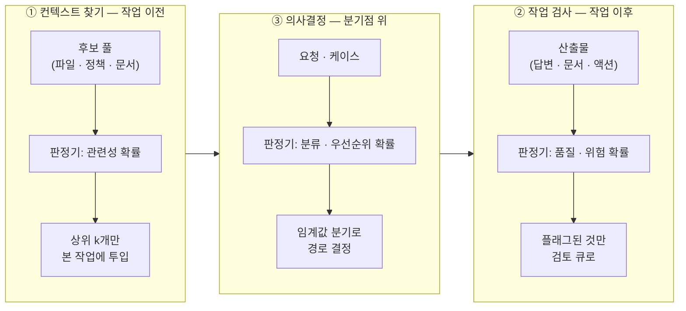
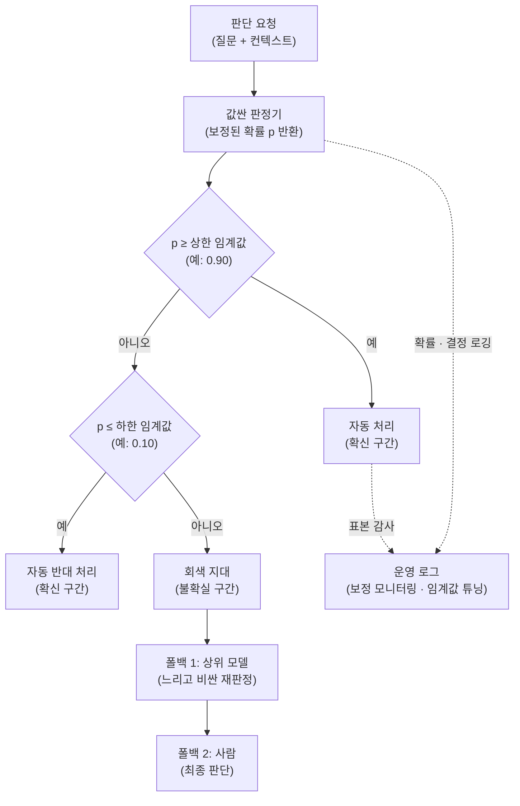

<figure class="post-figure post-figure--header">
<svg role="img" aria-label="판정 레이어의 분업 구조를 한 장에 담은 그림. 왼쪽의 값싼 판정기(판단 특화 모델)가 평범한 영어 질문에 대해 보정된 확률 p=0.87을 밀리초·마이크로센트 단위로 반환하면, 가운데의 '정책 = 코드' 패널이 그 확률을 받는다. 패널 안에는 upper 0.90, lower 0.10 임계값과 세 갈래 if 분기가 코드로 적혀 있다. 오른쪽으로 세 경로가 갈라진다 — p가 상한 이상이면 자동 처리(확신 구간, 대부분의 트래픽), 하한 이하면 자동 차단(확신 구간), 그 사이 회색 지대만 사람·상위 모델로 에스컬레이션. 패널 아래에는 확률 분포와 결정 이력이 운영 로그로 남는다는 점선 연결이 있다. 제목: 판단은 모델이, 정책은 코드가." viewBox="0 0 680 300" xmlns="http://www.w3.org/2000/svg">
  <title>판단은 모델이, 정책은 코드가 — 확률 + 임계값 + 폴백 판정 레이어</title>
  <defs>
    <marker id="jev6-h-arrow" markerWidth="8" markerHeight="8" refX="6" refY="4" orient="auto">
      <path d="M0,0 L8,4 L0,8 z" fill="var(--secondary-color)"/>
    </marker>
  </defs>

  <text x="340" y="28" text-anchor="middle" font-size="13" font-weight="700" fill="currentColor">판단은 모델이, 정책은 코드가</text>
  <text x="340" y="44" text-anchor="middle" font-size="8.5" fill="currentColor" opacity="0.75">확률 + 임계값 + 폴백 — 판정 레이어의 분업</text>

  <!-- 값싼 판정기 -->
  <rect x="24" y="86" width="150" height="96" rx="3" fill="var(--bg-panel)" stroke="var(--accent-color)" stroke-width="2.5"/>
  <text x="99" y="110" text-anchor="middle" font-size="11" font-weight="700" fill="currentColor">값싼 판정기</text>
  <text x="99" y="128" text-anchor="middle" font-size="8" fill="currentColor" opacity="0.8">판단 특화 모델 (System One)</text>
  <text x="99" y="146" text-anchor="middle" font-size="8" fill="currentColor" opacity="0.8">평범한 영어 질문</text>
  <text x="99" y="162" text-anchor="middle" font-size="8" fill="currentColor" opacity="0.8">→ 보정된 확률</text>
  <text x="99" y="198" text-anchor="middle" font-size="7.5" fill="currentColor" opacity="0.7">밀리초 · 마이크로센트</text>

  <!-- 확률 토큰 -->
  <line x1="174" y1="141" x2="266" y2="141" stroke="var(--secondary-color)" stroke-width="2" marker-end="url(#jev6-h-arrow)"/>
  <rect x="189" y="112" width="64" height="20" rx="10" fill="var(--bg-light)" stroke="var(--gold)" stroke-width="2"/>
  <text x="221" y="126" text-anchor="middle" font-size="9" font-weight="700" fill="currentColor">p = 0.87</text>

  <!-- 정책 = 코드 -->
  <rect x="272" y="56" width="204" height="170" rx="3" fill="var(--bg-panel)" stroke="var(--gold)" stroke-width="2.5"/>
  <text x="374" y="78" text-anchor="middle" font-size="11" font-weight="700" fill="currentColor">정책 = 코드</text>
  <text x="374" y="93" text-anchor="middle" font-size="7.5" fill="currentColor" opacity="0.8">버전 관리 · 리뷰 · 판단 지점별 조정</text>
  <line x1="284" y1="102" x2="464" y2="102" stroke="currentColor" stroke-width="1" opacity="0.3"/>
  <text x="288" y="124" text-anchor="start" font-size="9" fill="currentColor">upper = 0.90 · lower = 0.10</text>
  <text x="288" y="146" text-anchor="start" font-size="9" fill="currentColor">if p &gt;= upper: 자동 처리</text>
  <text x="288" y="166" text-anchor="start" font-size="9" fill="currentColor">elif p &lt;= lower: 자동 차단</text>
  <text x="288" y="186" text-anchor="start" font-size="9" fill="currentColor">else: 에스컬레이션 (폴백)</text>

  <!-- 세 경로 -->
  <line x1="476" y1="100" x2="532" y2="82" stroke="var(--secondary-color)" stroke-width="2" marker-end="url(#jev6-h-arrow)"/>
  <line x1="476" y1="141" x2="532" y2="141" stroke="var(--secondary-color)" stroke-width="2" marker-end="url(#jev6-h-arrow)"/>
  <line x1="476" y1="182" x2="532" y2="200" stroke="var(--secondary-color)" stroke-width="2" marker-end="url(#jev6-h-arrow)"/>

  <rect x="540" y="60" width="118" height="44" rx="3" fill="var(--bg-light)" stroke="var(--secondary-color)" stroke-width="2"/>
  <text x="599" y="78" text-anchor="middle" font-size="8.5" font-weight="700" fill="currentColor">자동 처리</text>
  <text x="599" y="94" text-anchor="middle" font-size="7.5" fill="currentColor" opacity="0.8">확신 구간 · 대부분</text>

  <rect x="540" y="119" width="118" height="44" rx="3" fill="var(--bg-light)" stroke="currentColor" stroke-width="1.8"/>
  <text x="599" y="137" text-anchor="middle" font-size="8.5" font-weight="700" fill="currentColor">자동 차단</text>
  <text x="599" y="153" text-anchor="middle" font-size="7.5" fill="currentColor" opacity="0.8">확신 구간</text>

  <rect x="540" y="178" width="118" height="44" rx="3" fill="var(--bg-light)" stroke="var(--accent-color)" stroke-width="2"/>
  <text x="599" y="196" text-anchor="middle" font-size="8.5" font-weight="700" fill="currentColor">사람 · 상위 모델</text>
  <text x="599" y="212" text-anchor="middle" font-size="7.5" fill="currentColor" opacity="0.8">회색 지대만 폴백</text>

  <!-- 운영 로그 -->
  <line x1="374" y1="226" x2="374" y2="244" stroke="currentColor" stroke-width="1.5" stroke-dasharray="4 3" opacity="0.6"/>
  <rect x="272" y="244" width="204" height="30" rx="3" fill="none" stroke="currentColor" stroke-width="1.5" stroke-dasharray="5 3" opacity="0.7"/>
  <text x="374" y="263" text-anchor="middle" font-size="8" fill="currentColor" opacity="0.85">운영 로그 — 확률 분포 · 결정 이력</text>
</svg>
<figcaption>판정 레이어의 분업 — <strong>판단(보정된 확률)은 값싼 판정기가, 정책(임계값·분기)은 버전 관리되는 코드가</strong> 맡는다. 확신 구간은 자동으로 흐르고 회색 지대만 사람·상위 모델로 올라가며, 모든 확률과 결정은 운영 로그로 남는다.</figcaption>
</figure>

## Introduction

[5단계](/2026/09/21/jev-anatomy-system-one-architecture.html)까지 우리는 판단 특화 모델이 **무엇인지**를 해부했습니다. 이제 질문이 바뀝니다 — 보정된(calibrated) 확률이 밀리초·마이크로센트 단위로 주어진다면, 그것을 **어디에, 어떻게 꽂을 것인가?**

이 질문에 대한 가장 좋은 실증 데이터는 Mike Taylor의 실사용 실험입니다([미니 바이브 체크](/2026/09/20/mini-vibe-check-typesafe-jev.html)). 자기 글 37편에 21개의 품질 질문을 동시에 던져 **777개의 판단을 0.7초, 약 0.25센트**에 받아냈고, 일부러 심어 둔 결함 7개 중 6개를 잡아냈습니다. 프론티어 모델 대비 약 25배 빠르고 580배 싼 이 숫자들이 의미하는 것은 단순한 성능 개선이 아닙니다. **판단의 단가가 특정 문턱 아래로 내려오면, 판단을 배치하는 아키텍처 자체가 달라진다**는 것입니다.

이 글은 그 실험이 보여준 세 활용 영역을 설계 패턴으로 일반화하고, 확률 + 임계값 + 폴백이라는 판정 레이어의 표준 구조를 Python 의사코드로 구체화합니다. 시리즈를 관통하는 질문 — "이 성질은 모델의 것인가, 시스템의 것인가?" — 의 6단계 버전은 이것입니다: **판정기의 가치는 판정기 자체가 아니라, 그것을 감싼 임계값·폴백·검증 구조에서 나온다.**

<div class="post-summary-box" markdown="1">

### 📌 이 글에서 다루는 내용

#### 🔍 핵심 주제

- **판단 지점의 발견과 목록화**: 라우팅·에스컬레이션·채점·우선순위 — 파이프라인 속 숨은 판단을 찾는 법
- **세 활용 영역의 설계 패턴**: 컨텍스트 찾기 · 작업 검사 · 의사결정
- **확률 + 임계값 + 폴백 아키텍처**: boolean이 아닌 확률을 받는 이유, 벤더 교체 가능성, 에스컬레이션 설계
- **triage로서의 판정기**: 6/7 검출률을 읽는 법, "지식 노동의 린터"라는 새 도구 계층

#### 🎯 주요 내용

1. **판단 지점 인벤토리** — "사람이나 비싼 LLM이 반복적으로 내리는 판단"을 코드에서 찾아내는 신호들
2. **판정 레이어 인터페이스** — 벤더 독립적인 `Judge` 추상화와 세 활용 영역별 구현 패턴
3. **임계값 + 폴백 분기** — 3-구간(자동 승인 / 회색 지대 / 자동 차단) 정책과 에스컬레이션 사다리
4. **도입 전 보정 검증** — 자기 데이터로 reliability를 확인하는 절차 (4단계의 실전 적용)
5. **triage 파이프라인** — 값싼 판정기를 1차 필터로, 비싼 검토를 2차로 배치하는 구조

#### 💡 이런 분들께 추천

- 파이프라인의 라우팅/채점/플래깅을 프론티어 LLM이나 사람에게 맡기고 있는 개발자
- LLM-as-Judge의 파싱·비용·지연 문제를 겪어 본 에이전트 시스템 설계자
- "확률을 if문에 꽂는다"가 정확히 어떤 코드인지 궁금한 분

</div>

## 1. 판단 지점을 찾아라 — 파이프라인 인벤토리

### 판단 지점이란 무엇인가

**판단 지점(judgment point)** 은 파이프라인이 "정답이 명세되지 않은 질문"에 답해야 진행되는 자리입니다. 정규식이나 규칙으로 판정할 수 있다면 판단 지점이 아닙니다 — 그건 그냥 조건문입니다. 판단 지점의 정의적 특징은 **애매함**입니다. "이 고객이 화나 있는가?", "이 티켓은 결제 문제인가 배송 문제인가?", "이 답변은 정책에 부합하는가?" — 사람이라면 몇 초 만에 답하지만 규칙으로는 못 짜는 질문들입니다.

지금까지 이런 지점은 세 가지 방식으로 처리돼 왔고, 각각의 비용이 배치를 결정했습니다.

| 처리 방식 | 단가 | 지연 | 결과 |
| --- | --- | --- | --- |
| **사람** | 건당 수백 원~수만 원 | 분~일 | 판단이 병목 — 큐가 쌓이고, 검사는 표본조사가 됨 |
| **프론티어 LLM** | 건당 수 원~수십 원 | 수 초 | 파싱 취약("The problem is the text itself") · 대량 적용 불가 |
| **규칙/휴리스틱** | ~0 | ~0 | 애매함을 다루지 못함 — 키워드 매칭의 오탐/미탐 |

판단 특화 모델이 겨냥하는 것이 바로 이 표의 빈칸 — **애매함을 다루면서도 단가와 지연이 규칙 수준에 가까운 칸**입니다.

### 발견의 신호: 코드와 워크플로에서 판단 지점을 찾는 법

자기 파이프라인의 판단 지점을 목록화할 때 유용한 탐지 신호들입니다.

1. **사람 큐가 있는 곳**: "검토 대기", "승인 요청", "수동 분류" 같은 상태가 존재하면 그 앞에 판단 지점이 있습니다. Mike Taylor의 권고 ①("이미 존재하는 판단 수요를 찾아라")이 정확히 이것입니다 — 판단 수요를 새로 발명하지 말고, 이미 사람이 하고 있는 반복 판단을 찾으세요.
2. **프론티어 LLM에게 산문으로 물어보고 파싱하는 곳**: 프롬프트에 "yes 또는 no로만 답해"라고 구슬리고 정규식으로 응답을 긁고 있다면, 그 자리는 판정 레이어로 교체할 1순위 후보입니다.
3. **휴리스틱이 자주 틀리는 곳**: 키워드 기반 라우팅("환불"이라는 단어가 있으면 결제팀으로)이 오분류를 내고 있는 자리.
4. **판단을 아예 포기한 곳**: "전수 검사는 비싸서 10%만 표본 검사한다" 같은 타협이 있는 자리 — 단가가 무너지면 전수 검사로 되돌릴 수 있습니다.

전형적인 판단 지점은 네 부류로 정리됩니다.

- **라우팅(routing)**: 이 요청을 어느 팀/모델/파이프라인으로 보낼 것인가
- **에스컬레이션(escalation)**: 이 케이스를 사람(또는 상위 모델)에게 올릴 것인가
- **채점(scoring)**: 이 산출물(답변·문서·코드)은 기준을 충족하는가
- **우선순위(prioritization)**: 무엇을 먼저 처리할 것인가

인벤토리 작성은 단순하게 시작하면 됩니다: 파이프라인의 각 단계에 대해 "여기서 애매한 질문에 답하고 있는가? 지금 누가(사람/LLM/휴리스틱) 얼마에 답하고 있는가?"를 표로 만드는 것입니다. 이 표가 이후 모든 설계의 출발점입니다.

## 2. 세 활용 영역의 설계 패턴

777개 판단 실험의 저자는 11개 시나리오(코드 파일·사내 정책 찾기, 고객지원 답변 채점, 스타트업 피치 분류, 도움이 급한 고객 우선순위 매기기, "이건 CEO가 결정할 사안인가" 판정 등)를 돌려 본 뒤 활용처를 세 갈래로 정리했습니다. 이 세 갈래는 판정기가 파이프라인의 **어느 위치에 꽂히는가**에 따라 서로 다른 설계 패턴을 요구합니다.



### ① 컨텍스트 찾기 (Finding context) — 작업 이전의 필터

코드베이스에서 관련 파일 찾기, 이 티켓에 해당하는 정책 문서 검색 — **본 작업(생성·추론)이 시작되기 전에 후보 풀을 좁히는** 자리입니다.

설계 포인트는 다음과 같습니다.

- **질문 형태**: "문서 X는 질문 Q와 관련이 있는가?" — 후보 하나당 판단 하나. 후보 N개 × 질문 1개가 배치(batch) 하나로 묶입니다.
- **확률의 용도**: 이진 필터가 아니라 **랭킹**입니다. 임계값으로 자르는 대신 관련성 확률 상위 k개를 취하면, 후보 풀의 품질 변동에 강건해집니다.
- **실패 비용의 비대칭**: 관련 문서를 놓치는 것(미탐)이 무관한 문서를 끼워 넣는 것(오탐)보다 대체로 비쌉니다. 임계값을 느슨하게 잡고 뒤 단계(생성 모델)가 무관한 컨텍스트를 무시하게 하는 편이 안전합니다.
- **임베딩 검색과의 관계**: 대체가 아니라 보완입니다. 임베딩은 의미 유사도를, 판정기는 **질문에 대한 판단**("이 파일이 이 버그와 관련 있는가")을 봅니다. 임베딩으로 100개로 좁히고 판정기로 10개를 고르는 2단 구조가 실용적입니다.

### ② 작업 검사 (Checking work) — 작업 이후의 감사

응답 채점, 위험한 액션 플래깅, 콘텐츠 감사 — **산출물이 만들어진 뒤 기준 충족 여부를 검사하는** 자리입니다. 777개 실험의 본체가 바로 이 패턴입니다: 문서 37편 × 품질 질문 21개.

설계 포인트:

- **질문 세트를 자산으로 관리하라**: "같은 아이디어를 근거 추가 없이 반복하는가?", "억지로 대칭적인 '양쪽 다 일리 있다' 논증을 만드는가?" 같은 질문 하나하나가 코드 린터의 룰 하나에 해당합니다. 룰셋처럼 버전 관리하고, 오탐이 잦은 질문은 문구를 다듬거나 제거합니다.
- **산출물 × 질문의 데카르트 곱**: 검사량은 곱으로 늘어나므로(37 × 21 = 777), 단가가 충분히 싸야만 성립하는 패턴입니다. 역으로, 단가가 싸면 질문을 아끼지 않아도 됩니다 — 의심스러운 축은 전부 질문으로 만드세요.
- **검사 결과는 게이트가 아니라 신호**: 이 패턴의 출력은 "차단"이 아니라 "플래그"입니다. 왜 그런지는 4장(triage)에서 다룹니다.

### ③ 의사결정 (Making decisions) — 분기점 위의 판정

우선순위 부여, 요청 분류, 선택 예측 — **파이프라인의 분기 그 자체를 판정기가 결정하는** 자리입니다. 고객서비스 라우팅이 전형입니다: "이 고객이 화나 있는가?"에 확률을 받아, 임계값을 넘으면 에스컬레이션합니다.

설계 포인트:

- **셋 중 가장 결과에 직접 닿는 패턴**이므로, 임계값·폴백 설계(3장)와 보정 검증이 가장 엄격해야 합니다. ①의 오탐은 컨텍스트 낭비, ②의 오탐은 불필요한 검토로 끝나지만, ③의 오판은 잘못된 경로로 실행이 진행됩니다.
- **되돌릴 수 있는 결정만 자동화하라**: 자동 분기의 대상은 라우팅처럼 사후 교정 가능한 결정부터 시작하고, 비가역적 결정(환불 승인, 계정 정지)은 판정기를 "추천"으로만 쓰고 확정은 사람이 합니다.
- **카테고리 분포를 활용하라**: yes/no 확률뿐 아니라 카테고리 분포를 받으면, 1위와 2위의 확률 차이가 작을 때("결제 0.45 vs 배송 0.41")를 애매 케이스로 감지해 에스컬레이션할 수 있습니다.

## 3. 확률 + 임계값 + 폴백 아키텍처

### 왜 boolean이 아니라 확률인가

판정기에게 "yes/no로 답해"가 아니라 확률을 요구해야 하는 이유는 네 가지입니다.

1. **임계값이 코드로 나온다.** boolean을 받으면 "얼마나 확신할 때 yes로 칠 것인가"라는 정책이 모델(또는 프롬프트) 안에 암묵적으로 숨습니다. 확률을 받으면 그 정책이 `threshold = 0.85`라는 **버전 관리되고, 리뷰되고, 도메인별로 조정되는 코드**가 됩니다. 판단(모델)과 정책(코드)의 분리 — 이것이 이 패턴의 핵심입니다.
2. **회색 지대를 다룰 수 있다.** boolean의 세계에는 "모르겠다"가 없습니다. 확률의 세계에는 0.5 근처라는 회색 지대가 있고, 그 지대를 사람에게 보내는 것이 폴백 설계의 전부입니다.
3. **벤더를 갈아 끼울 수 있다.** 출력 계약을 "질문 → [0, 1] 확률"로 고정하면, 그 뒤가 Jev든, prefill + 단일 토큰 constrained decoding을 태운 오픈 모델이든([5단계](/2026/09/21/jev-anatomy-system-one-architecture.html)에서 본 재현 실험처럼), 프론티어 LLM의 logprob이든 교체 가능합니다. 해자 논쟁이 어떻게 결론 나든 — 판정 레이어가 벤더 중립 인터페이스 뒤에 있다면 **당신의 아키텍처는 그 논쟁의 승자와 무관하게 유효합니다.**
4. **운영 데이터가 남는다.** 확률 분포를 로깅하면 드리프트(확률 분포가 흘러가는 것)와 보정 붕괴를 모니터링할 수 있습니다. boolean 로그로는 불가능합니다.

단, 전제가 있습니다 — **그 확률이 보정되어 있어야** 합니다. 모델이 0.9라고 말할 때 실제로 90% 맞아야 임계값이 의미를 갖습니다. 0.9라고 말하는데 실제로는 60%만 맞는 모델로는 에스컬레이션 정책을 짤 수 없습니다. 이것이 [4단계 — 확률 보정](/2026/09/21/jev-probability-calibration.html)이 이 단계의 전제 조건인 이유입니다.

### 판정 레이어의 전체 구조

한 건의 판단이 판정 레이어를 통과하는 표준 경로입니다. 임계값 두 개가 확률 축을 세 구간으로 나누고, 회색 지대만 에스컬레이션 사다리를 탑니다.



주목할 점: **자동 처리 구간에도 표본 감사가 붙습니다.** 보정은 한 번 검증하고 끝나는 성질이 아니라 도메인 이동과 함께 무너질 수 있는 성질이므로(7단계에서 다룹니다), 확신 구간의 판단도 일부를 뽑아 정답과 대조하는 루프를 상시로 돌려야 합니다.

### 임계값은 어떻게 정하는가

임계값은 취향이 아니라 **비용 계산**입니다. 두 가지 입력이 필요합니다.

- **오류 비용의 비대칭**: 미탐(놓침)과 오탐(과잉 반응)의 비용이 다릅니다. 위험 액션 플래깅에서 미탐은 사고이고 오탐은 검토 몇 분입니다 → 하한 임계값을 공격적으로(낮게) 잡아 많이 플래그합니다. 반대로 자동 차단류는 오탐이 사용자 경험을 해치므로 상한을 보수적으로(높게) 잡습니다.
- **폴백 처리 용량**: 회색 지대의 폭이 곧 사람/상위 모델에게 가는 유량입니다. 임계값을 (0.10, 0.90)으로 잡았는데 판단의 40%가 회색 지대에 떨어지면 검토 큐가 터집니다. 자기 데이터의 확률 분포 히스토그램을 먼저 보고, 폴백 용량이 감당할 수 있는 폭으로 구간을 잡으세요.

<figure class="post-figure">
<svg role="img" aria-label="임계값 두 개가 확률 축을 세 구간으로 나누는 구조와, 판단 지점마다 임계값이 달라지는 비대칭을 보여주는 그림. 위쪽: 0.0에서 1.0까지의 확률 축 위에 전형적인 확률 분포 곡선이 양끝에서 봉우리를 이루고, 하한 0.10과 상한 0.90 두 임계값 선이 축을 자동 차단(왼쪽 끝), 회색 지대(가운데), 자동 처리(오른쪽 끝)의 세 구간으로 나눈다. 회색 지대에서만 아래로 화살표가 내려가 에스컬레이션 사다리 — 폴백 1 상위 모델(느리고 비싼 재판정), 폴백 2 사람(최종 판단) — 로 이어진다. 아래쪽: 두 정책 막대의 비교. 라우팅 정책은 임계값 (0.20, 0.80)으로 회색 지대가 적당하고, 미탐이 치명적인 위험 플래깅 정책은 하한을 0.02까지 공격적으로 내려 회색 지대가 축의 거의 전부를 차지한다." viewBox="0 0 680 340" xmlns="http://www.w3.org/2000/svg">
  <title>임계값 두 개 → 확률 축의 세 구간, 그리고 판단 지점별 임계값의 비대칭</title>
  <defs>
    <marker id="jev6-a-arrow" markerWidth="8" markerHeight="8" refX="6" refY="4" orient="auto">
      <path d="M0,0 L8,4 L0,8 z" fill="var(--secondary-color)"/>
    </marker>
  </defs>

  <text x="340" y="22" text-anchor="middle" font-size="12" font-weight="700" fill="currentColor">임계값 두 개 → 확률 축의 세 구간</text>

  <!-- 확률 분포 곡선 (양끝 봉우리) -->
  <path d="M40,50 C70,42 88,58 120,62 C220,67 460,67 560,62 C592,58 610,42 640,50 L640,66 L40,66 Z" fill="var(--bg-light)" stroke="var(--secondary-color)" stroke-width="1.5" opacity="0.9"/>
  <text x="340" y="56" text-anchor="middle" font-size="7.5" fill="currentColor" opacity="0.75">전형적 확률 분포 — 대부분 확신 구간에 떨어진다</text>

  <!-- 세 구간 밴드 -->
  <rect x="40" y="68" width="60" height="40" fill="var(--bg-light)" stroke="currentColor" stroke-width="1.5"/>
  <rect x="100" y="68" width="480" height="40" fill="var(--bg-sunken)" stroke="var(--accent-color)" stroke-width="1.8"/>
  <rect x="580" y="68" width="60" height="40" fill="var(--bg-light)" stroke="currentColor" stroke-width="1.5"/>
  <text x="70" y="92" text-anchor="middle" font-size="7.5" font-weight="700" fill="currentColor">자동 차단</text>
  <text x="340" y="86" text-anchor="middle" font-size="9" font-weight="700" fill="currentColor">회색 지대 (ESCALATE)</text>
  <text x="340" y="100" text-anchor="middle" font-size="7.5" fill="currentColor" opacity="0.8">확신 부족 — 폭이 곧 폴백 유량</text>
  <text x="610" y="92" text-anchor="middle" font-size="7.5" font-weight="700" fill="currentColor">자동 처리</text>

  <!-- 임계값 선 + 눈금 -->
  <line x1="100" y1="62" x2="100" y2="116" stroke="var(--accent-color)" stroke-width="2.5"/>
  <line x1="580" y1="62" x2="580" y2="116" stroke="var(--accent-color)" stroke-width="2.5"/>
  <text x="40" y="130" text-anchor="middle" font-size="8" fill="currentColor" opacity="0.7">0.0</text>
  <text x="100" y="130" text-anchor="middle" font-size="8" font-weight="700" fill="var(--accent-color)">하한 0.10</text>
  <text x="580" y="130" text-anchor="middle" font-size="8" font-weight="700" fill="var(--accent-color)">상한 0.90</text>
  <text x="640" y="130" text-anchor="middle" font-size="8" fill="currentColor" opacity="0.7">1.0</text>

  <!-- 에스컬레이션 사다리 -->
  <line x1="340" y1="112" x2="340" y2="148" stroke="var(--secondary-color)" stroke-width="2" marker-end="url(#jev6-a-arrow)"/>
  <text x="352" y="136" text-anchor="start" font-size="7.5" fill="currentColor" opacity="0.75">회색 지대만 사다리를 탄다</text>
  <rect x="175" y="152" width="150" height="42" rx="3" fill="var(--bg-panel)" stroke="currentColor" stroke-width="1.8"/>
  <text x="250" y="170" text-anchor="middle" font-size="8.5" font-weight="700" fill="currentColor">폴백 1 — 상위 모델</text>
  <text x="250" y="185" text-anchor="middle" font-size="7.5" fill="currentColor" opacity="0.8">느리고 비싼 재판정</text>
  <line x1="325" y1="173" x2="351" y2="173" stroke="var(--secondary-color)" stroke-width="2" marker-end="url(#jev6-a-arrow)"/>
  <rect x="355" y="152" width="150" height="42" rx="3" fill="var(--bg-panel)" stroke="currentColor" stroke-width="1.8"/>
  <text x="430" y="170" text-anchor="middle" font-size="8.5" font-weight="700" fill="currentColor">폴백 2 — 사람</text>
  <text x="430" y="185" text-anchor="middle" font-size="7.5" fill="currentColor" opacity="0.8">최종 판단 · 자동화의 끝</text>

  <!-- 판단 지점별 비대칭 -->
  <text x="340" y="230" text-anchor="middle" font-size="10" font-weight="700" fill="currentColor">오류 비용의 비대칭이 임계값에 새겨진다</text>

  <text x="24" y="260" text-anchor="start" font-size="8.5" font-weight="700" fill="currentColor">라우팅</text>
  <text x="24" y="273" text-anchor="start" font-size="7" fill="currentColor" opacity="0.75">오분류는 교정 가능</text>
  <rect x="250" y="248" width="72" height="16" fill="var(--bg-light)" stroke="currentColor" stroke-width="1.2"/>
  <rect x="322" y="248" width="216" height="16" fill="var(--bg-sunken)" stroke="currentColor" stroke-width="1.2"/>
  <rect x="538" y="248" width="72" height="16" fill="var(--bg-light)" stroke="currentColor" stroke-width="1.2"/>
  <line x1="322" y1="244" x2="322" y2="268" stroke="var(--accent-color)" stroke-width="2"/>
  <line x1="538" y1="244" x2="538" y2="268" stroke="var(--accent-color)" stroke-width="2"/>
  <text x="322" y="280" text-anchor="middle" font-size="7.5" font-weight="700" fill="var(--accent-color)">0.20</text>
  <text x="538" y="280" text-anchor="middle" font-size="7.5" font-weight="700" fill="var(--accent-color)">0.80</text>

  <text x="24" y="306" text-anchor="start" font-size="8.5" font-weight="700" fill="currentColor">위험 플래깅</text>
  <text x="24" y="319" text-anchor="start" font-size="7" fill="currentColor" opacity="0.75">미탐이 치명적 → 하한 공격적</text>
  <rect x="250" y="294" width="7" height="16" fill="var(--bg-light)" stroke="currentColor" stroke-width="1.2"/>
  <rect x="257" y="294" width="335" height="16" fill="var(--bg-sunken)" stroke="currentColor" stroke-width="1.2"/>
  <rect x="592" y="294" width="18" height="16" fill="var(--bg-light)" stroke="currentColor" stroke-width="1.2"/>
  <line x1="257" y1="290" x2="257" y2="314" stroke="var(--accent-color)" stroke-width="2"/>
  <line x1="592" y1="290" x2="592" y2="314" stroke="var(--accent-color)" stroke-width="2"/>
  <text x="257" y="326" text-anchor="middle" font-size="7.5" font-weight="700" fill="var(--accent-color)">0.02</text>
  <text x="592" y="326" text-anchor="middle" font-size="7.5" font-weight="700" fill="var(--accent-color)">0.95</text>
</svg>
<figcaption>임계값 두 개(하한·상한)가 확률 축을 세 구간으로 나눈다 — 확신 구간(양끝)은 자동 처리되고, <strong>회색 지대만 에스컬레이션 사다리</strong>(상위 모델 → 사람)를 탄다. 아래: 같은 구조라도 판단 지점마다 임계값이 다르다. 라우팅은 (0.20, 0.80), 미탐이 치명적인 위험 플래깅은 하한을 0.02까지 공격적으로 내린다.</figcaption>
</figure>

그리고 반드시 — **도입 전에 자기 데이터로 보정을 검증**해야 합니다. RLCD로 보정 훈련이 됐다는 것은 벤더의 주장이고, 벤더의 검증 도메인과 당신의 도메인은 다릅니다. 절차는 4단계에서 배운 그대로입니다: 정답을 아는 케이스 수백 건을 모아, 판정기의 확률을 구간별로 묶고, "0.8이라고 말한 케이스들이 실제로 80% 맞는가"를 확인합니다(reliability diagram, ECE). 이 검증을 통과하지 못하면 임계값 자동화는 모래 위의 성입니다.

## 4. 값싼 판정기는 게이트가 아니라 triage다

### 6/7을 읽는 법

777개 실험에서 판정기는 일부러 심어 둔 결함 7개 중 **6개를 검출**했습니다. 이 숫자를 읽는 두 가지 방식이 있습니다.

- 잘못된 독해: "86% 정확도네. 100%가 아니니 최종 게이트로는 못 쓰겠다. 도입 보류."
- 올바른 독해: "0.25센트에 결함의 6/7이 걸러진다. 남은 1/7과 통과분의 확인은 비싼 검토(사람·프론티어 모델)의 몫으로 남긴다 — 그런데 그 비싼 검토가 봐야 할 양이 7분의 1 이하로 줄었다."

값싼 판정기의 가치는 정확도 그 자체가 아니라 **비싼 검토 자원을 어디에 쓸지 정해 주는 triage**에 있습니다. 코드 린터가 코드 리뷰를 대체하는 게 아니라 리뷰어가 오타·스타일 대신 설계에 집중하게 해 주듯이, 판정기는 사람의 검토를 대체하는 게 아니라 **사람이 봐야 할 소수를 골라 주는** 것입니다.

최종 게이트로 배치하면 안 되는 이유는 구조적입니다. 판정기를 게이트로 쓰는 순간 미탐 1건이 곧 시스템의 최종 오류가 되므로, 요구 정확도가 사실상 100%가 되고 — 그 요구는 값싼 판정기가 만족할 수 없습니다. 1차 필터로 쓰면 미탐 1건은 "2차 검토가 잡을 기회가 한 번 더 있는 오류"가 되어, 86%짜리 부품으로도 신뢰할 수 있는 시스템을 조립할 수 있습니다. **불완전한 부품을 신뢰 가능한 구조로 감싸는 것** — 시리즈의 관통 질문 그대로, 신뢰성은 모델이 아니라 시스템의 성질입니다.

<figure class="post-figure">
<svg role="img" aria-label="같은 86% 판정기를 두 가지 방식으로 배치했을 때의 구조 차이를 위아래로 비교한 그림. 위쪽(잘못된 배치): 산출물 스트림이 '판정기 = 최종 게이트' 하나만 거쳐 최종 결과로 나간다. 게이트 아래로 점선 화살표가 새어 나가며 '미탐 1건 → 그대로 최종 오류(사고)'라고 적혀 있다 — 요구 정확도가 사실상 100%가 된다. 아래쪽(올바른 배치): 산출물 전체가 '판정기 = 1차 필터'(6/7 검출, 0.7초, 약 0.25센트)를 지나 두 갈래로 나뉜다. 플래그된 소수만 비싼 검토(사람·프론티어)로 올라가 봐야 할 양이 7분의 1 이하로 줄고, 통과분(대부분)은 표본 감사를 붙여 자동 진행한다. 미탐도 2차 검토가 잡을 기회를 한 번 더 가진다." viewBox="0 0 680 330" xmlns="http://www.w3.org/2000/svg">
  <title>게이트 배치 vs triage 배치 — 같은 86% 판정기, 다른 신뢰성</title>
  <defs>
    <marker id="jev6-b-arrow" markerWidth="8" markerHeight="8" refX="6" refY="4" orient="auto">
      <path d="M0,0 L8,4 L0,8 z" fill="var(--secondary-color)"/>
    </marker>
    <marker id="jev6-b-arrow-acc" markerWidth="8" markerHeight="8" refX="6" refY="4" orient="auto">
      <path d="M0,0 L8,4 L0,8 z" fill="var(--accent-color)"/>
    </marker>
  </defs>

  <!-- 잘못된 배치: 최종 게이트 -->
  <text x="24" y="34" text-anchor="start" font-size="11" font-weight="700" fill="var(--accent-color)">잘못된 배치 — 판정기를 최종 게이트로</text>
  <rect x="24" y="54" width="130" height="48" rx="3" fill="var(--bg-light)" stroke="currentColor" stroke-width="1.8"/>
  <text x="89" y="74" text-anchor="middle" font-size="9" font-weight="700" fill="currentColor">산출물 스트림</text>
  <text x="89" y="90" text-anchor="middle" font-size="7.5" fill="currentColor" opacity="0.8">예: 결함 7개 포함</text>
  <line x1="154" y1="78" x2="216" y2="78" stroke="var(--secondary-color)" stroke-width="2" marker-end="url(#jev6-b-arrow)"/>
  <rect x="220" y="54" width="170" height="48" rx="3" fill="var(--bg-panel)" stroke="var(--accent-color)" stroke-width="2.5"/>
  <text x="305" y="74" text-anchor="middle" font-size="9" font-weight="700" fill="currentColor">판정기 = 최종 게이트</text>
  <text x="305" y="90" text-anchor="middle" font-size="7.5" fill="currentColor" opacity="0.8">요구 정확도 사실상 100%</text>
  <line x1="390" y1="78" x2="452" y2="78" stroke="var(--secondary-color)" stroke-width="2" marker-end="url(#jev6-b-arrow)"/>
  <rect x="456" y="54" width="130" height="48" rx="3" fill="var(--bg-light)" stroke="currentColor" stroke-width="1.8"/>
  <text x="521" y="74" text-anchor="middle" font-size="9" font-weight="700" fill="currentColor">최종 결과</text>
  <text x="521" y="90" text-anchor="middle" font-size="7.5" fill="currentColor" opacity="0.8">재검토 없음</text>
  <line x1="305" y1="102" x2="305" y2="124" stroke="var(--accent-color)" stroke-width="2" stroke-dasharray="4 3" marker-end="url(#jev6-b-arrow-acc)"/>
  <text x="305" y="140" text-anchor="middle" font-size="8" font-weight="700" fill="var(--accent-color)">미탐 1건 → 그대로 최종 오류 (사고)</text>

  <line x1="24" y1="156" x2="656" y2="156" stroke="currentColor" stroke-width="1" stroke-dasharray="5 4" opacity="0.3"/>

  <!-- 올바른 배치: triage -->
  <text x="24" y="180" text-anchor="start" font-size="11" font-weight="700" fill="var(--secondary-color)">올바른 배치 — 판정기를 1차 필터(triage)로</text>
  <rect x="24" y="198" width="130" height="52" rx="3" fill="var(--bg-light)" stroke="currentColor" stroke-width="1.8"/>
  <text x="89" y="220" text-anchor="middle" font-size="9" font-weight="700" fill="currentColor">산출물 전체</text>
  <text x="89" y="236" text-anchor="middle" font-size="7.5" fill="currentColor" opacity="0.8">전수 검사 가능한 단가</text>
  <line x1="154" y1="224" x2="196" y2="224" stroke="var(--secondary-color)" stroke-width="2" marker-end="url(#jev6-b-arrow)"/>
  <rect x="200" y="198" width="170" height="52" rx="3" fill="var(--bg-panel)" stroke="var(--secondary-color)" stroke-width="2.5"/>
  <text x="285" y="220" text-anchor="middle" font-size="9" font-weight="700" fill="currentColor">판정기 = 1차 필터</text>
  <text x="285" y="236" text-anchor="middle" font-size="7.5" fill="currentColor" opacity="0.8">6/7 검출 · 0.7초 · ~0.25센트</text>

  <line x1="370" y1="212" x2="450" y2="198" stroke="var(--secondary-color)" stroke-width="2" marker-end="url(#jev6-b-arrow)"/>
  <text x="408" y="196" text-anchor="middle" font-size="7.5" fill="currentColor" opacity="0.8">플래그된 소수</text>
  <rect x="456" y="176" width="200" height="48" rx="3" fill="var(--bg-panel)" stroke="var(--accent-color)" stroke-width="2"/>
  <text x="556" y="196" text-anchor="middle" font-size="8.5" font-weight="700" fill="currentColor">비싼 검토 (사람 · 프론티어)</text>
  <text x="556" y="212" text-anchor="middle" font-size="7.5" fill="currentColor" opacity="0.8">봐야 할 양이 1/7 이하로</text>

  <line x1="370" y1="238" x2="450" y2="256" stroke="var(--secondary-color)" stroke-width="2" marker-end="url(#jev6-b-arrow)"/>
  <text x="408" y="266" text-anchor="middle" font-size="7.5" fill="currentColor" opacity="0.8">통과 (대부분)</text>
  <rect x="456" y="236" width="200" height="48" rx="3" fill="var(--bg-light)" stroke="currentColor" stroke-width="1.8"/>
  <text x="556" y="256" text-anchor="middle" font-size="8.5" font-weight="700" fill="currentColor">자동 진행</text>
  <text x="556" y="272" text-anchor="middle" font-size="7.5" fill="currentColor" opacity="0.8">+ 표본 감사 상시</text>

  <text x="340" y="312" text-anchor="middle" font-size="8" fill="currentColor" opacity="0.8">미탐에도 2차 검토가 잡을 기회가 한 번 더 — 86% 부품으로 신뢰 가능한 시스템을 조립한다</text>
</svg>
<figcaption>같은 86% 판정기의 두 배치. <strong>최종 게이트</strong>로 세우면(위) 미탐 1건이 곧 시스템 오류가 되어 요구 정확도가 사실상 100%가 된다. <strong>1차 필터(triage)</strong>로 세우면(아래) 비싼 검토는 플래그된 소수만 보고, 미탐도 2차 검토가 잡을 기회를 한 번 더 가진다.</figcaption>
</figure>

### "지식 노동의 린터" — 검사가 이벤트에서 배경 프로세스로

triage 구조가 상시화되면 워크플로 자체가 바뀝니다. 777개 실험이 보여준 가장 좋은 프레임이 **"지식 노동의 린터"** 입니다.

코드 린터를 생각해 보세요. 린터 이전의 세계에서 스타일·버그 지적은 코드 리뷰라는 **이벤트**에서 일어났습니다. 린터 이후의 세계에서 그것은 저장할 때마다 돌아가는 **배경 프로세스**가 됐고, 리뷰라는 이벤트는 린터가 못 보는 것(설계, 의도)에 집중하도록 재편됐습니다. 이 전환을 가능하게 한 것은 린터의 정확도가 아니라 **비용이 0에 수렴했다는 사실**입니다.

지식 노동은 지금까지 린터가 없는 세계였습니다. 문서·답변·의사결정의 품질 검사는 사람의 리뷰라는 비싼 이벤트였고, 그래서 드문드문, 표본으로, 다 끝난 뒤에만 배치됐습니다. 판단의 단가가 건당 마이크로센트로 내려오면 이 구조가 뒤집힙니다 — 21개 품질 질문을 저장 시점마다 전체 문서에 돌리는 데 1초와 1센트도 안 든다면, 검사는 쓰기가 끝난 뒤의 이벤트가 아니라 **쓰는 동안 계속 도는 배경 프로세스**가 됩니다.

<figure class="post-figure">
<svg role="img" aria-label="품질 검사가 이벤트에서 배경 프로세스로 바뀌는 전환을 위아래 두 타임라인으로 비교한 그림. 위쪽(린터 이전 — 검사는 비싼 이벤트): 긴 작성 구간이 끝난 뒤에야 사람 리뷰라는 단일 이벤트가 한 번 붙는다. 표본으로, 다 끝난 뒤에만 — 결함은 리뷰 전까지 계속 잠복한다. 아래쪽(린터 이후 — 검사는 배경 프로세스): 같은 작성 구간 아래에 저장 시점마다 작은 검사 표시가 여섯 개 반복된다. 저장마다 21개 질문을 문서 전부에 돌리는 데 0.7초, 1센트 미만. 그중 플래그된 것만 점선으로 사람 리뷰로 올라가고, 사람 리뷰는 플래그된 소수와 판정기가 못 보는 것(설계·의도·맥락)에 집중한다. 전환의 동력은 정확도가 아니라 검사 단가가 0에 수렴한 것이다." viewBox="0 0 680 264" xmlns="http://www.w3.org/2000/svg">
  <title>지식 노동의 린터 — 검사가 이벤트에서 배경 프로세스로</title>
  <defs>
    <marker id="jev6-c-arrow" markerWidth="8" markerHeight="8" refX="6" refY="4" orient="auto">
      <path d="M0,0 L8,4 L0,8 z" fill="var(--secondary-color)"/>
    </marker>
    <marker id="jev6-c-arrow-acc" markerWidth="8" markerHeight="8" refX="6" refY="4" orient="auto">
      <path d="M0,0 L8,4 L0,8 z" fill="var(--accent-color)"/>
    </marker>
  </defs>

  <!-- 린터 이전 -->
  <text x="24" y="32" text-anchor="start" font-size="10.5" font-weight="700" fill="currentColor">린터 이전 — 검사는 비싼 '이벤트'</text>
  <rect x="24" y="44" width="460" height="28" rx="3" fill="var(--bg-light)" stroke="currentColor" stroke-width="1.6"/>
  <text x="254" y="62" text-anchor="middle" font-size="9" fill="currentColor">지식 노동 — 작성</text>
  <line x1="484" y1="58" x2="514" y2="58" stroke="var(--secondary-color)" stroke-width="2" marker-end="url(#jev6-c-arrow)"/>
  <rect x="520" y="40" width="136" height="40" rx="3" fill="var(--bg-panel)" stroke="var(--accent-color)" stroke-width="2"/>
  <text x="588" y="57" text-anchor="middle" font-size="9" font-weight="700" fill="currentColor">사람 리뷰</text>
  <text x="588" y="72" text-anchor="middle" font-size="7" fill="currentColor" opacity="0.8">표본 · 다 끝난 뒤에만</text>
  <text x="254" y="92" text-anchor="middle" font-size="7.5" fill="currentColor" opacity="0.75">결함은 리뷰 전까지 계속 잠복 — 검사가 드문드문 배치된다</text>

  <line x1="24" y1="108" x2="656" y2="108" stroke="currentColor" stroke-width="1" stroke-dasharray="5 4" opacity="0.3"/>

  <!-- 린터 이후 -->
  <text x="24" y="132" text-anchor="start" font-size="10.5" font-weight="700" fill="currentColor">린터 이후 — 검사는 '배경 프로세스'</text>
  <rect x="24" y="144" width="460" height="28" rx="3" fill="var(--bg-light)" stroke="currentColor" stroke-width="1.6"/>
  <text x="254" y="162" text-anchor="middle" font-size="9" fill="currentColor">지식 노동 — 작성</text>

  <line x1="69" y1="172" x2="69" y2="180" stroke="var(--secondary-color)" stroke-width="1.5"/>
  <rect x="64" y="180" width="10" height="10" fill="none" stroke="var(--secondary-color)" stroke-width="2"/>
  <line x1="139" y1="172" x2="139" y2="180" stroke="var(--secondary-color)" stroke-width="1.5"/>
  <rect x="134" y="180" width="10" height="10" fill="none" stroke="var(--secondary-color)" stroke-width="2"/>
  <line x1="209" y1="172" x2="209" y2="180" stroke="var(--secondary-color)" stroke-width="1.5"/>
  <rect x="204" y="180" width="10" height="10" fill="none" stroke="var(--secondary-color)" stroke-width="2"/>
  <line x1="279" y1="172" x2="279" y2="180" stroke="var(--secondary-color)" stroke-width="1.5"/>
  <rect x="274" y="180" width="10" height="10" fill="none" stroke="var(--secondary-color)" stroke-width="2"/>
  <line x1="349" y1="172" x2="349" y2="180" stroke="var(--secondary-color)" stroke-width="1.5"/>
  <rect x="344" y="180" width="10" height="10" fill="none" stroke="var(--secondary-color)" stroke-width="2"/>
  <line x1="419" y1="172" x2="419" y2="180" stroke="var(--secondary-color)" stroke-width="1.5"/>
  <rect x="414" y="180" width="10" height="10" fill="none" stroke="var(--secondary-color)" stroke-width="2"/>
  <text x="254" y="210" text-anchor="middle" font-size="7.5" fill="currentColor" opacity="0.8">저장마다 — 21개 질문 × 문서 전부 (0.7초 · 1센트 미만)</text>

  <line x1="214" y1="185" x2="512" y2="164" stroke="var(--accent-color)" stroke-width="1.5" stroke-dasharray="4 3" marker-end="url(#jev6-c-arrow-acc)"/>
  <line x1="354" y1="185" x2="512" y2="172" stroke="var(--accent-color)" stroke-width="1.5" stroke-dasharray="4 3" marker-end="url(#jev6-c-arrow-acc)"/>
  <rect x="520" y="140" width="136" height="52" rx="3" fill="var(--bg-panel)" stroke="var(--accent-color)" stroke-width="2"/>
  <text x="588" y="158" text-anchor="middle" font-size="9" font-weight="700" fill="currentColor">사람 리뷰</text>
  <text x="588" y="172" text-anchor="middle" font-size="7" fill="currentColor" opacity="0.8">플래그된 소수 +</text>
  <text x="588" y="184" text-anchor="middle" font-size="7" fill="currentColor" opacity="0.8">설계 · 의도 · 맥락</text>

  <text x="340" y="246" text-anchor="middle" font-size="8" fill="currentColor" opacity="0.8">전환의 동력은 정확도가 아니라 비용 — 검사 단가가 0에 수렴하며 이벤트가 상시 필터로 바뀐다</text>
</svg>
<figcaption>"지식 노동의 린터" — 검사 단가가 0에 수렴하면 품질 검사는 <strong>다 끝난 뒤의 비싼 이벤트</strong>(위)에서 <strong>저장마다 도는 배경 프로세스</strong>(아래)로 바뀌고, 사람 리뷰는 플래그된 소수와 판정기가 못 보는 것(설계·의도·맥락)에 재배치된다.</figcaption>
</figure>

이것이 이 위키가 반복해 온 **검증 비대칭** — "생성은 싸졌지만 검증은 싸지지 않았다"([확률적 엔지니어링과 24-7 직원](/2026/06/25/probabilistic-engineering-and-the-24-7-employee.html)) — 에 대한 첫 번째 **가격 파괴 응답**입니다. 에이전트 함대가 밤새 산출물을 쏟아내는 시대의 병목은 "이게 맞는지"를 판정하는 쪽이었고, 지금까지 판정자는 사람이거나 또 다른 프론티어 LLM — 둘 다 비싸고 느려서 검사는 드문드문 배치될 수밖에 없었습니다. 검사 단가가 0에 수렴하면 검사를 루프의 **모든 스텝에** 상시 배치할 수 있고, 사람의 리뷰는 판정기가 플래그한 소수 + 판정기가 못 보는 종류의 문제(설계·의도·맥락)로 재편됩니다.

운영 루프도 린터와 같습니다. 판정 이력과 검토 결과가 쌓이면 오탐이 잦은 질문의 문구를 다듬고, 룰별 민감도(`flag_above`)를 조정하고, 새 실패 유형을 새 질문으로 추가합니다 — 질문 세트가 룰셋처럼 버전업되는 개선 사이클입니다.

## 5. 실전 코드 — 판정 레이어를 조립하기

이 장의 코드는 특정 벤더 SDK가 아니라 **구조**를 보여주는 Python 의사코드입니다. 핵심은 세 겹입니다: 벤더 중립 인터페이스 → 임계값 + 폴백 정책 → triage 파이프라인.

### 5.1 판정 레이어 인터페이스 — 벤더를 갈아 끼울 수 있게

```python
from dataclasses import dataclass
from typing import Protocol


@dataclass(frozen=True)
class Judgment:
    """판정 한 건의 결과 — 출력 계약은 '보정된 확률'로 고정한다."""
    question: str          # 무엇을 물었나 (판정 이력 추적용)
    probability: float     # yes일 확률 [0.0, 1.0] — boolean이 아니다!
    latency_ms: float      # 운영 모니터링용
    judge_name: str        # 어느 판정기가 답했나 (에스컬레이션 이력)


class Judge(Protocol):
    """벤더 중립 판정기 인터페이스.

    이 계약 뒤에서 Jev든, prefill + 단일 토큰을 태운 오픈 모델이든,
    프론티어 LLM의 logprob이든 교체할 수 있다. 파이프라인 코드는
    '질문 → 확률'이라는 계약에만 의존하고 벤더에는 의존하지 않는다.
    """

    def judge(self, question: str, context: str) -> Judgment: ...

    def judge_batch(
        self, questions: list[str], contexts: list[str]
    ) -> list[Judgment]:
        """N개 판단을 한 번에 — 판단 특화 모델의 배칭 강점을 살리는 경로.
        (문서 37편 × 질문 21개 = 777건이 이 메서드 한 번의 호출이다)"""
        ...


class SpecializedJudge:
    """판단 특화 모델(Jev류) 어댑터 — 1차 필터용. 빠르고 싸다."""

    name = "specialized-judge"

    def judge(self, question: str, context: str) -> Judgment:
        # 벤더 API 호출: 평범한 영어 질문 → 보정된 확률
        resp = _vendor_api(question=question, context=context)
        return Judgment(question, resp.probability, resp.latency_ms, self.name)


class FrontierJudge:
    """프론티어 LLM 어댑터 — 회색 지대 재판정(폴백 1)용. 느리고 비싸다.

    같은 인터페이스를 구현하므로 에스컬레이션 사다리에 그대로 꽂힌다.
    """

    name = "frontier-judge"

    def judge(self, question: str, context: str) -> Judgment:
        # 산문이 아니라 단일 토큰(yes/no)의 logprob를 받아 확률로 변환
        # → 3단계에서 본 LLM-as-Judge의 파싱 취약성을 우회하는 경로
        ...
```

두 가지가 요점입니다. 첫째, `Judgment.probability`가 `bool`이 아니라 `float`입니다 — 임계값 정책은 이 레이어 바깥의 코드가 가져갑니다. 둘째, `SpecializedJudge`와 `FrontierJudge`가 같은 `Judge` 계약을 구현하므로, 값싼 판정기와 비싼 판정기가 **동일한 부품 규격**으로 에스컬레이션 사다리에 꽂힙니다.

### 5.2 임계값 + 폴백 분기 — 판단(모델)과 정책(코드)의 분리

```python
from enum import Enum


class Decision(Enum):
    AUTO_YES = "auto_yes"        # 확신 구간: 자동 처리
    AUTO_NO = "auto_no"          # 확신 구간: 자동 반대 처리
    ESCALATE = "escalate"        # 회색 지대: 사다리 위로


@dataclass(frozen=True)
class ThresholdPolicy:
    """임계값 정책 — 모델이 아니라 '코드'다.

    버전 관리되고, 리뷰되고, 판단 지점마다 다르게 설정된다.
    오류 비용의 비대칭과 폴백 처리 용량이 이 두 숫자를 결정한다.
    """
    upper: float   # 이 이상이면 자동 yes  (예: 0.90)
    lower: float   # 이 이하면 자동 no    (예: 0.10)

    def decide(self, p: float) -> Decision:
        if p >= self.upper:
            return Decision.AUTO_YES
        if p <= self.lower:
            return Decision.AUTO_NO
        return Decision.ESCALATE   # 회색 지대 → 폴백


# 판단 지점마다 정책이 다르다 — 오류 비용의 비대칭이 임계값에 새겨진다
ROUTING_POLICY = ThresholdPolicy(upper=0.80, lower=0.20)   # 오분류는 교정 가능
RISK_FLAG_POLICY = ThresholdPolicy(upper=0.95, lower=0.02) # 미탐이 치명적 → 하한 공격적


def run_judgment_point(
    question: str,
    context: str,
    cheap: Judge,             # 1차: 판단 특화 모델
    expensive: Judge,         # 폴백 1: 상위 모델
    policy: ThresholdPolicy,
) -> Decision:
    """판단 지점 한 곳의 표준 실행 경로: 확률 → 임계값 → 폴백."""

    j = cheap.judge(question, context)
    _log(j)                                  # 확률 분포 로깅 — 보정 모니터링의 원료

    decision = policy.decide(j.probability)
    if decision is not Decision.ESCALATE:
        return decision                      # 대부분의 트래픽은 여기서 끝난다

    # ── 회색 지대: 에스컬레이션 사다리 ──────────────────────
    # 폴백 1: 느리고 비싼 상위 모델로 재판정
    j2 = expensive.judge(question, context)
    _log(j2)
    decision = policy.decide(j2.probability)
    if decision is not Decision.ESCALATE:
        return decision

    # 폴백 2: 여전히 애매하면 사람 — 자동화의 겸손한 끝
    _enqueue_for_human(question, context, history=[j, j2])
    return Decision.ESCALATE
```

### 5.3 도입 전 보정 검증 — 임계값 자동화의 선결 조건

```python
def verify_calibration(
    judge: Judge,
    labeled_cases: list[tuple[str, str, bool]],  # (질문, 컨텍스트, 정답)
    n_bins: int = 10,
) -> bool:
    """자기 도메인 데이터로 '0.8이라 말할 때 실제로 80% 맞는가'를 확인한다.

    벤더의 보정 주장(RLCD 등)은 벤더의 검증 도메인에서의 주장일 뿐이다.
    정답을 아는 케이스 수백 건이면 충분하다 — 이 함수가 False를 돌려주는
    한 임계값 자동화를 시작해선 안 된다. (상세 원리는 4단계 참고)
    """
    bins = [[] for _ in range(n_bins)]
    for question, context, truth in labeled_cases:
        p = judge.judge(question, context).probability
        bins[min(int(p * n_bins), n_bins - 1)].append((p, truth))

    ece, total = 0.0, len(labeled_cases)
    for bucket in bins:
        if not bucket:
            continue
        avg_conf = sum(p for p, _ in bucket) / len(bucket)       # 말한 확신도
        accuracy = sum(t for _, t in bucket) / len(bucket)        # 실제 정답률
        ece += (len(bucket) / total) * abs(avg_conf - accuracy)   # 구간별 괴리

    return ece < 0.05   # 허용 오차는 판단 지점의 위험도에 맞게
```

### 5.4 triage 파이프라인 — 린터로 배치하기

```python
@dataclass(frozen=True)
class QualityRule:
    """질문 하나 = 린터 룰 하나. 룰셋처럼 버전 관리한다."""
    question: str          # 예: "같은 아이디어를 근거 추가 없이 반복하는가?"
    flag_above: float      # 이 확률 이상이면 플래그 (룰마다 민감도가 다르다)


def lint_documents(
    documents: list[str],
    rules: list[QualityRule],
    judge: Judge,
) -> dict[int, list[QualityRule]]:
    """문서 전체 × 룰 전체를 전수 검사하고, 플래그만 비싼 검토로 넘긴다.

    문서 37편 × 룰 21개 = 777개 판단이 배치 한 번(0.7초, ~0.25센트).
    이 단가라서 '전수 · 매 저장 시점'이라는 배치가 성립한다 —
    표본 검사로 타협했던 자리를 전수 검사로 되돌리는 것이 이 패턴의 본질.
    """
    # 데카르트 곱을 단일 배치로 — 판단 특화 모델의 배칭 강점을 그대로 살린다
    pairs = [(r, d) for d in documents for r in rules]
    judgments = judge.judge_batch(
        questions=[r.question for r, _ in pairs],
        contexts=[d for _, d in pairs],
    )

    flagged: dict[int, list[QualityRule]] = {}
    for (rule, _), j, idx in zip(
        pairs, judgments, [i for i in range(len(documents)) for _ in rules]
    ):
        if j.probability >= rule.flag_above:
            flagged.setdefault(idx, []).append(rule)

    # 판정기는 최종 게이트가 아니다: 여기서 문서를 '차단'하지 않는다.
    # 플래그된 소수만 비싼 검토(사람·프론티어 모델)의 큐로 보낸다 = triage.
    return flagged


# ── 사용: 저장 훅에 걸어 두면 '지식 노동의 린터'가 된다 ──────────
RULES = [
    QualityRule("같은 아이디어를 근거 추가 없이 반복하는가?", flag_above=0.75),
    QualityRule("뻔한 포인트를 과잉 설명하는가?", flag_above=0.80),
    QualityRule("억지로 대칭적인 '양쪽 다 일리 있다' 논증을 만드는가?", flag_above=0.70),
]

def on_save(documents: list[str]) -> None:
    flagged = lint_documents(documents, RULES, judge=SpecializedJudge())
    for doc_idx, rules in flagged.items():
        _send_to_review_queue(doc_idx, rules)   # 소수만 사람에게
```

코드 네 조각을 관통하는 원칙을 다시 확인합니다: **판단은 모델이, 정책은 코드가.** 확률과 결정을 나누는 임계값, 회색 지대의 폴백 경로, 룰별 민감도, 보정 허용 오차 — 시스템의 행동을 결정하는 이 모든 숫자가 프롬프트가 아니라 리뷰 가능한 코드에 있습니다. 벤더가 바뀌어도, 해자 논쟁이 어느 쪽으로 결론 나도, 이 구조는 남습니다.

## Summary

- **판단 지점부터 목록화하라**: 라우팅·에스컬레이션·채점·우선순위 — 사람 큐가 쌓이는 곳, LLM 산문을 파싱하는 곳, 휴리스틱이 틀리는 곳, 표본 검사로 타협한 곳이 후보입니다. 판단 수요를 발명하지 말고 이미 존재하는 것을 찾으세요.
- **세 활용 영역은 꽂히는 위치가 다르다**: 컨텍스트 찾기(작업 이전, 랭킹으로), 작업 검사(작업 이후, 질문 세트를 룰셋처럼), 의사결정(분기점 위, 가장 엄격한 검증과 되돌릴 수 있는 결정부터).
- **boolean이 아니라 확률을 받아라**: 임계값이 코드가 되고, 회색 지대가 생기고, 벤더가 교체 가능해지고, 운영 로그가 남습니다. 단 — 도입 전 자기 데이터로 보정을 검증하는 것이 선결 조건입니다.
- **값싼 판정기는 최종 게이트가 아니라 triage다**: 6/7 검출률은 "게이트로는 부족"이 아니라 "비싼 검토가 볼 양이 1/7로 준다"로 읽어야 합니다. 불완전한 부품을 신뢰 가능한 구조(1차 필터 + 2차 검토 + 표본 감사)로 감싸는 것 — 신뢰성은 시스템의 성질입니다.
- **"지식 노동의 린터"는 검증 비대칭에 대한 가격 파괴 응답이다**: 판단 단가가 0에 수렴하면 검사는 이벤트(리뷰)에서 배경 프로세스(상시 필터)로 바뀌고, 사람의 리뷰는 판정기가 못 보는 것(설계·의도·맥락)에 재배치됩니다.

다음 단계(7단계)에서는 이 계층의 천장을 봅니다 — test-time compute를 구조적으로 쓸 수 없다는 근본 한계, 도메인 이동 시 보정 붕괴와 적대적 입력이라는 미검증 지대, 그리고 "System One 시장"에서 판정기가 하니스 아키텍처에 차지할 자리입니다.

### 다음 학습 (Next Learning)

- [JEV Essential Curriculum](/2026/09/21/jev-essential-curriculum.html) — 시리즈 마스터 로드맵, 전체 7단계의 지도
- [5단계 — Jev 해부: System One 아키텍처와 저지연 구조화 출력](/2026/09/21/jev-anatomy-system-one-architecture.html) — 이 글이 전제하는 판정기의 본질(이전 단계)
- [7단계 — 한계와 전망: test-time compute 부재와 System One 시장](/2026/09/21/jev-limits-and-system-one-market.html) — 판정 레이어의 천장과 미검증 지대(다음 단계)
- [4단계 — 확률 보정: 신뢰할 수 있는 확률의 조건](/2026/09/21/jev-probability-calibration.html) — 임계값 자동화의 전제 조건인 보정의 정의·측정·검증
- [0.7초 만에 내 글 전부를 심사한 모델: TypeSafe Jev 미니 바이브 체크](/2026/09/20/mini-vibe-check-typesafe-jev.html) — 이 단계의 뼈대가 된 777개 판단 실험과 "지식 노동의 린터" 프레임
- [확률적 엔지니어링과 24-7 직원](/2026/06/25/probabilistic-engineering-and-the-24-7-employee.html) — 이 글이 응답하는 검증 비대칭("생성은 싸졌지만 검증은 싸지지 않았다")의 원형
