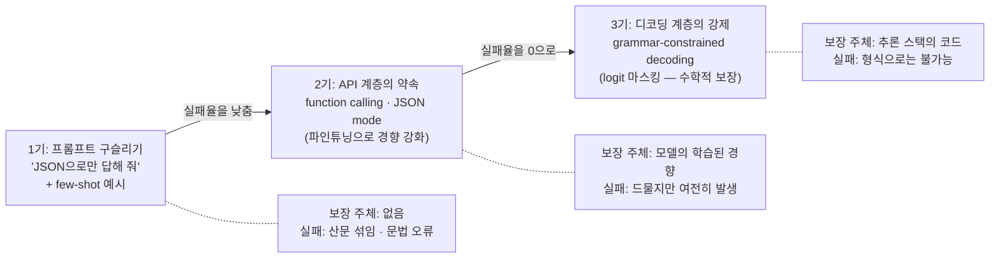
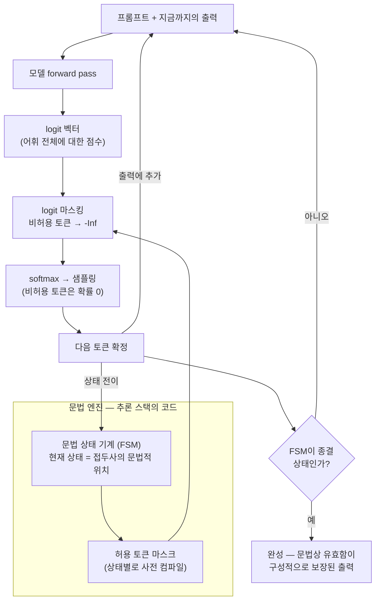
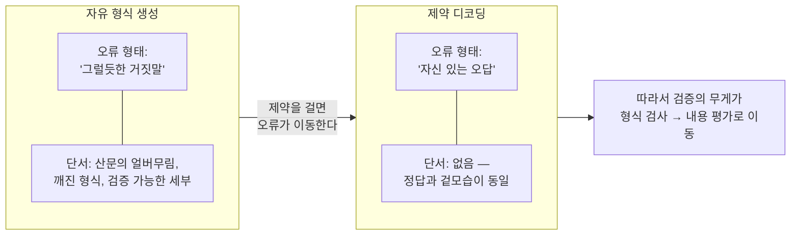

<figure class="post-figure post-figure--header">
<svg role="img" aria-label="제약 디코딩의 핵심 구도를 그린 그림. 왼쪽에서 모델이 다음 토큰 후보들에 logit 점수를 매기는데, 산문 토큰(물론입)의 점수가 가장 높다. 가운데의 문법 게이트가 logit 마스킹으로 JSON 문법상 허용되지 않는 토큰을 전부 -inf로 차단해 여는 중괄호만 통과시키고, 오른쪽에는 문법상 항상 유효한 JSON 출력이 완성된다. 형식은 보장되지만 내용은 여전히 모델의 몫이라는 메모가 붙어 있다." viewBox="0 0 680 275" xmlns="http://www.w3.org/2000/svg">
  <title>제약 디코딩 — 모델은 점수를 매기고, 문법 게이트는 후보를 제한한다</title>
  <defs>
    <marker id="jev1-h-arrow" markerWidth="8" markerHeight="8" refX="7" refY="4" orient="auto">
      <path d="M0,0 L8,4 L0,8 z" fill="var(--secondary-color)"/>
    </marker>
  </defs>

  <!-- ===== LEFT: model proposals (logits) ===== -->
  <text x="135" y="38" text-anchor="middle" font-size="11" font-weight="700" fill="currentColor" opacity="0.8">모델의 제안 — 다음 토큰 logit</text>
  <rect x="20" y="50" width="230" height="168" rx="4" fill="var(--bg-light)" stroke="currentColor" stroke-width="1.8"/>
  <!-- row 1: prose token, highest logit, blocked -->
  <text x="32" y="88" font-size="10" font-weight="700" font-family="monospace" fill="currentColor">물론입</text>
  <rect x="98" y="77" width="140" height="14" fill="currentColor" opacity="0.22"/>
  <!-- row 2: the only grammar-legal token -->
  <text x="32" y="122" font-size="10" font-weight="700" font-family="monospace" fill="currentColor">&#123;</text>
  <rect x="98" y="111" width="96" height="14" fill="var(--secondary-color)" opacity="0.9"/>
  <!-- row 3 -->
  <text x="32" y="156" font-size="10" font-weight="700" font-family="monospace" fill="currentColor">안녕</text>
  <rect x="98" y="145" width="58" height="14" fill="currentColor" opacity="0.22"/>
  <!-- row 4 -->
  <text x="32" y="190" font-size="10" font-weight="700" font-family="monospace" fill="currentColor">Sure</text>
  <rect x="98" y="179" width="34" height="14" fill="currentColor" opacity="0.22"/>
  <text x="135" y="210" text-anchor="middle" font-size="8" fill="currentColor" opacity="0.7">산문 토큰(물론입)의 점수가 가장 높다</text>

  <!-- ===== MIDDLE: grammar gate (logit masking) ===== -->
  <text x="308" y="26" text-anchor="middle" font-size="9.5" font-weight="700" fill="currentColor" opacity="0.85">문법 게이트</text>
  <text x="308" y="40" text-anchor="middle" font-size="8" fill="currentColor" opacity="0.7">(logit 마스킹)</text>
  <rect x="300" y="50" width="16" height="56" fill="var(--gold)"/>
  <rect x="300" y="130" width="16" height="88" fill="var(--gold)"/>
  <text x="308" y="234" text-anchor="middle" font-size="8" font-weight="700" fill="currentColor" opacity="0.75">FSM 허용: &#123; 뿐</text>

  <!-- blocked rows -->
  <line x1="252" y1="84" x2="288" y2="84" stroke="currentColor" stroke-width="1.5" opacity="0.5"/>
  <path d="M288,79 L298,89 M298,79 L288,89" stroke="var(--accent-color)" stroke-width="2.2" fill="none"/>
  <text x="270" y="75" text-anchor="middle" font-size="8" font-weight="700" fill="var(--accent-color)">-inf</text>
  <line x1="252" y1="152" x2="288" y2="152" stroke="currentColor" stroke-width="1.5" opacity="0.5"/>
  <path d="M288,147 L298,157 M298,147 L288,157" stroke="var(--accent-color)" stroke-width="2.2" fill="none"/>
  <text x="270" y="143" text-anchor="middle" font-size="8" font-weight="700" fill="var(--accent-color)">-inf</text>
  <line x1="252" y1="186" x2="288" y2="186" stroke="currentColor" stroke-width="1.5" opacity="0.5"/>
  <path d="M288,181 L298,191 M298,181 L288,191" stroke="var(--accent-color)" stroke-width="2.2" fill="none"/>
  <text x="270" y="177" text-anchor="middle" font-size="8" font-weight="700" fill="var(--accent-color)">-inf</text>

  <!-- allowed row passes through the gap -->
  <line x1="252" y1="118" x2="424" y2="118" stroke="var(--secondary-color)" stroke-width="2.5" marker-end="url(#jev1-h-arrow)"/>

  <!-- ===== RIGHT: guaranteed-valid output ===== -->
  <text x="545" y="78" text-anchor="middle" font-size="9" font-weight="700" fill="currentColor" opacity="0.8">출력 — 구성적으로 유효</text>
  <rect x="430" y="88" width="230" height="62" rx="4" fill="var(--bg-panel)" stroke="var(--secondary-color)" stroke-width="2.5"/>
  <text x="545" y="115" text-anchor="middle" font-size="11" font-weight="700" font-family="monospace" fill="currentColor">&#123;"category": "spam"&#125;</text>
  <text x="545" y="136" text-anchor="middle" font-size="8.5" font-weight="700" fill="var(--secondary-color)">파싱 실패 — 구성상 불가능 ✓</text>
  <text x="545" y="172" text-anchor="middle" font-size="8.5" fill="currentColor" opacity="0.8">내용(spam이 맞는가?)은 여전히 모델의 몫</text>

  <!-- ===== bottom summary ===== -->
  <text x="340" y="262" text-anchor="middle" font-size="10.5" font-weight="700" fill="currentColor" opacity="0.85">모델은 점수를 매기고 · 문법 엔진은 후보를 제한하며 · 샘플러는 교집합에서 뽑는다</text>
</svg>
<figcaption>제약 디코딩 한 장 요약 — 모델이 산문을 더 선호해도, 문법 게이트가 형식을 어기는 토큰의 logit을 -inf로 밀어 형식은 항상 보장된다. 단, 내용은 여전히 모델의 몫이다.</figcaption>
</figure>

## 소개 — 왜 "형식"이 문제였나

LLM을 소프트웨어 부품으로 쓰려는 순간, 누구나 같은 벽에 부딪힙니다. 모델에게 "JSON으로만 답해"라고 아무리 신신당부해도, 돌아오는 응답은 이런 식입니다.

````text
물론입니다! 요청하신 분류 결과입니다:

```json
{
  "category": "spam",
  "confidence": "high",   // 마지막 원소 뒤 콤마 — JSON 문법 위반
}
```

도움이 되셨길 바랍니다!
````

`JSON.parse`는 앞뒤의 친절한 산문에서 즉시 죽고, 산문을 벗겨내도 trailing comma에서 다시 죽습니다. 파이프라인의 나머지 전부가 이 한 줄의 파싱 성공에 걸려 있는데, 성공 여부가 **확률적**입니다. 재시도 루프, 정규식 발라내기, "제발 JSON만" 프롬프트 — 2023년 무렵 LLM 애플리케이션 코드의 상당 부분이 이 문제와의 씨름이었습니다.

이 문제는 오늘날 **제약 디코딩(constrained decoding)**으로 사실상 완전히 해결됐습니다. 형식은 이제 확률이 아니라 **보장**입니다. 그리고 이 보장의 원리를 정확히 이해하는 것이 [JEV Essential 시리즈](/2026/09/21/jev-essential-curriculum.html)의 첫 단추입니다. TypeSafe AI의 판단 특화 모델 **Jev**는 "출력은 구조화 데이터만"이라는 제약을 정체성으로 삼는데, 그 제약이 무엇을 보장하고 무엇을 보장하지 **못하는지** — 예컨대 "환각 면역(hallucination immunity)" 같은 주장을 어떻게 평가해야 하는지 — 는 전부 이 단계의 내용 위에서 갈립니다.

<div class="post-summary-box" markdown="1">

### 📌 이 글에서 다루는 내용

#### 🔍 핵심 질문 (커리큘럼 1단계)

1. 자기회귀 생성에서 JSON 같은 형식은 **어떻게 보장되는가** — grammar-constrained decoding은 logit 단계에서 정확히 무엇을 하는가?
2. 형식이 보장돼도 내용은 **왜 틀릴 수 있는가** — "환각 면역" 류의 주장은 이 구분 위에서 어떻게 평가해야 하는가?
3. **선택지가 유한한 판단 태스크**는 자유 형식 생성과 무엇이 구조적으로 다른가?

#### 🎯 주요 내용

1. **구조화 출력의 계보**: 프롬프트 구슬리기 → JSON mode·function calling → schema 강제(디코딩 제약)
2. **grammar-constrained decoding의 원리**: 문법 상태 기계(FSM) + logit 마스킹, 토큰화가 만드는 미묘한 문제
3. **형식 보장 ≠ 내용 정확성**: 오류 형태의 전환 — "그럴듯한 거짓말"에서 "자신 있는 오답"으로
4. **유한 선택지 판단 태스크의 특수성**: 출력 공간·비용·확률 해석·평가 가능성의 4중 차이

</div>

## 구조화 출력의 계보 — 구슬리기에서 디코딩 제약까지

형식 보장은 하루아침에 나온 기술이 아닙니다. "모델에게 부탁하기"에서 출발해 "모델이 물리적으로 다른 것을 출력할 수 없게 만들기"까지, 보장의 **책임 소재가 층층이 아래로 내려온 진화**입니다.



### 1기 — 프롬프트 구슬리기 (2022~2023)

가장 원시적인 방법은 프롬프트로 부탁하는 것입니다. "Respond with valid JSON only", few-shot 예시 몇 개, 그리고 기도. 여기에는 **보장의 주체가 없습니다**. 모델은 다음 토큰의 확률 분포에서 샘플링할 뿐이고, 그 분포에서 `물론입니다!`의 확률이 `{`보다 높으면 그대로 산문이 나옵니다. 실무에서는 실패를 전제로 한 방어 코드가 표준이었습니다.

```python
# 1기의 전형적인 방어 코드 — 파싱 실패를 전제로 한 재시도 루프
import json, re

def parse_with_retries(call_llm, prompt, max_retries=3):
    for attempt in range(max_retries):
        raw = call_llm(prompt)
        # 마크다운 코드 펜스로 감싸서 주는 경우가 흔해서 먼저 벗겨낸다
        stripped = re.sub(r"^```(json)?|```$", "", raw.strip(), flags=re.MULTILINE)
        try:
            return json.loads(stripped)
        except json.JSONDecodeError:
            # 실패 이유를 알려주며 다시 부탁 — 성공은 여전히 확률적
            prompt += f"\n\n이전 응답은 유효한 JSON이 아니었습니다. JSON만 출력하세요."
    raise ValueError("모든 재시도 실패")  # 파이프라인 전체가 여기서 죽는다
```

이 코드의 문제는 명확합니다. 재시도는 **지연과 비용을 배수로** 늘리고, 그러고도 성공을 보장하지 못합니다.

### 2기 — function calling과 JSON mode (2023~)

2023년 중반, OpenAI의 **function calling**을 시작으로 문제가 API 계층으로 올라왔습니다. 개발자가 함수 시그니처(사실상 JSON Schema)를 선언하면, 모델이 그 스키마에 맞는 인자 객체를 돌려주는 방식입니다. 이어서 **JSON mode**(문법적으로 유효한 JSON만 출력하도록 하는 스위치)가 표준 옵션이 됐습니다.

핵심은 이 시기의 보장이 대체로 **학습된 경향**이었다는 점입니다. 함수 호출 형식의 데이터로 파인튜닝해서 모델이 그 형식을 "매우 잘 지키게" 만든 것이지, 지키지 않는 것이 불가능해진 게 아니었습니다. 실패율은 극적으로 떨어졌지만 0이 아니었고 — 특히 스키마가 복잡하거나 컨텍스트가 길 때 필드 누락, 타입 불일치, 잘린 JSON이 여전히 새어 나왔습니다. "99% 성공"은 하루 10만 건을 처리하는 파이프라인에서는 **하루 1,000건의 장애**라는 뜻입니다.

### 3기 — schema 강제: 디코딩 계층의 제약 (2023 말~)

마지막 진화는 보장을 모델 바깥, **추론 스택의 코드**로 내리는 것입니다. llama.cpp의 GBNF grammar, Outlines·Guidance 같은 라이브러리, 그리고 OpenAI의 Structured Outputs(2024)가 이 계열입니다. 아이디어는 단순하고 강력합니다.

> 모델이 형식을 지키도록 **설득**하는 대신, 형식을 어기는 토큰을 **아예 선택할 수 없게** 만든다.

디코딩의 매 스텝에서, 지금까지 생성된 접두사(prefix) 기준으로 "문법상 다음에 올 수 있는 토큰"만 남기고 나머지를 전부 걸러냅니다. 모델의 선호와 무관하게 유효하지 않은 출력은 **수학적으로 불가능**해집니다. 이것이 grammar-constrained decoding이고, 다음 절의 주제입니다.

세 시기를 표로 정리하면 이렇습니다.

| | 1기: 구슬리기 | 2기: function calling / JSON mode | 3기: 디코딩 제약 |
|---|---|---|---|
| 보장 계층 | 없음 (프롬프트) | 모델 (파인튜닝된 경향) | 추론 스택 (logit 마스킹) |
| 형식 실패율 | 높음, 예측 불가 | 낮음, 그러나 0 아님 | **0** (구성상 불가능) |
| 전형적 실패 | 산문 섞임, 문법 오류 | 필드 누락, 잘린 JSON | 형식 실패 없음 — 내용 오류만 남음 |
| 대응 코드 | 재시도 루프, 정규식 | 검증 + 드문 재시도 | 검증 불필요 (파싱은 항상 성공) |

마지막 행의 표현에 주목하세요 — "**내용 오류만 남음**". 형식 실패가 0이 된다는 것은 오류가 사라진다는 뜻이 아니라, 오류가 전부 내용 쪽으로 이동한다는 뜻입니다. 이 글 후반부의 핵심 주제입니다.

## grammar-constrained decoding의 원리

### 전제 — 자기회귀 생성과 logit

자기회귀(autoregressive) LLM의 한 스텝은 다음과 같습니다: 지금까지의 토큰 시퀀스를 forward pass에 넣으면, 어휘(vocabulary)의 **모든 토큰 각각에 대한 점수** — logit — 벡터가 나옵니다. 어휘 크기가 10만이면 10만 차원의 실수 벡터입니다. 이 벡터를 softmax에 통과시켜 확률 분포로 만들고, 거기서 다음 토큰 하나를 샘플링합니다. 이 과정을 토큰 수만큼 반복합니다.

제약 디코딩의 통찰은, **샘플링 직전의 logit 벡터가 개입 지점**이라는 것입니다. softmax에 들어가기 전에 "문법상 허용되지 않는 토큰"의 logit을 `-inf`로 밀어 버리면, softmax 후 그 토큰들의 확률은 정확히 0이 됩니다. 샘플링이 아무리 무작위여도 확률 0인 토큰은 절대 뽑히지 않습니다. 이것이 **logit 마스킹(logit masking)**입니다.

### 문법 상태 기계 — "지금 어디까지 왔는가"의 추적

그런데 "문법상 허용되는 토큰"은 고정된 집합이 아닙니다. JSON을 생성 중이라면, 방금 `{`를 냈다면 다음은 `"`(키 시작)나 `}`(빈 객체)만 유효하고, `"category": `까지 왔다면 다음은 값의 시작(`"`, 숫자, `true`…)만 유효합니다. 즉 허용 집합은 **지금까지 생성된 접두사가 문법의 어느 지점에 있는지**에 따라 매 스텝 달라집니다.

이 "어느 지점"을 추적하는 장치가 **문법 상태 기계**입니다. 대상 형식을 형식 문법(정규 표현식이면 FSM — finite state machine, 재귀 중첩이 필요한 완전한 JSON이면 CFG 기반의 pushdown automaton)으로 컴파일해 두고, 토큰이 하나 생성될 때마다 상태를 전이시킵니다. 각 상태는 "이 상태에서 허용되는 다음 토큰 집합"을 알고 있습니다.

전체 루프를 그림으로 보면 다음과 같습니다.



핵심 구도를 다시 강조하면: **모델은 점수(logit)를 매기고, 문법 엔진은 후보를 제한하며, 샘플러는 교집합에서 뽑습니다.** 모델의 가중치는 전혀 건드리지 않습니다 — 이것은 순수하게 추론(inference) 계층의 기법이고, 어떤 LLM에든 적용할 수 있습니다. ("모델의 성질인가, 시스템의 성질인가"라는 이 시리즈의 관통 질문이 벌써 등장합니다.)

### logit 마스킹 의사코드

위 루프를 코드로 옮기면 다음과 같습니다. 실제 라이브러리(Outlines, XGrammar 등)의 구조를 단순화한 의사코드입니다.

```python
import torch

def constrained_generate(model, tokenizer, prompt_ids, fsm):
    """문법 상태 기계(fsm)의 제약 아래 토큰을 생성한다.

    fsm은 대상 형식(예: JSON Schema에서 컴파일된 문법)을 표현하며,
    상태마다 '허용되는 다음 토큰 id 집합'을 사전 계산해 갖고 있다.
    """
    state = fsm.initial_state          # 문법의 시작 상태
    generated = []

    while not fsm.is_final(state):     # 문법이 "완성"을 선언할 때까지
        # 1) 모델 forward pass — 어휘 전체에 대한 logit을 얻는다
        #    (모델은 문법의 존재를 전혀 모른다)
        logits = model(prompt_ids + generated).logits[-1]   # shape: [vocab_size]

        # 2) 현재 문법 상태에서 허용되는 토큰 집합을 조회한다
        #    핵심: 이 집합은 상태별로 '사전 컴파일'되어 있어 O(1) 조회 —
        #    매 스텝 문법을 다시 파싱하면 디코딩이 병목이 된다
        allowed_ids = fsm.allowed_tokens(state)             # 예: {'"', '}', ...의 id}

        # 3) logit 마스킹 — 비허용 토큰의 점수를 -inf로 민다
        mask = torch.full_like(logits, float("-inf"))
        mask[list(allowed_ids)] = 0.0
        masked_logits = logits + mask

        # 4) softmax 후 샘플링 — 비허용 토큰의 확률은 정확히 0이므로
        #    temperature·top-p가 무엇이든 절대 선택될 수 없다
        probs = torch.softmax(masked_logits, dim=-1)
        next_token = torch.multinomial(probs, num_samples=1).item()

        # 5) 출력에 추가하고 문법 상태를 전이시킨다
        generated.append(next_token)
        state = fsm.next_state(state, next_token)

    return tokenizer.decode(generated)   # 파싱 실패가 '구성상' 불가능한 출력
```

주석의 두 지점이 실전의 핵심입니다.

첫째, **모델은 문법의 존재를 모릅니다**(1번). 제약은 전적으로 모델 바깥의 코드입니다. 그래서 같은 문법 엔진을 Llama에도 Qwen에도 그대로 꽂을 수 있습니다.

둘째, **허용 집합의 사전 컴파일**(2번)이 성능의 전부입니다. 순진하게 구현하면 매 스텝 "어휘 10만 개 각각을 현재 접두사에 이어 붙여 보고 문법 검사"를 해야 하는데, 이건 디코딩 자체보다 느립니다. Outlines(2023)의 핵심 기여가 바로 이것 — 문법의 FSM을 **토큰 어휘 기준으로 미리 컴파일**해서, 디코딩 시점에는 상태 → 허용 마스크를 O(1)로 조회하게 만든 것입니다. 이 최적화 덕분에 제약 디코딩의 오버헤드는 사실상 0에 수렴했고, "형식 보장은 공짜"라는 현재의 상식이 성립했습니다.

### 토큰화가 만드는 미묘함 — 문법은 문자, 모델은 토큰

한 가지 짚고 갈 미묘함이 있습니다. 문법은 **문자(character)** 단위로 정의되지만 모델은 **토큰** 단위로 생성합니다. 그리고 하나의 문자열을 만드는 토큰 조합은 여러 가지입니다. 예컨대 `"blue"`라는 값은 `"` + `blue` + `"`로도, `"bl` + `ue"`로도 토큰화될 수 있습니다. BPE 어휘에는 `": "`처럼 문법 경계를 걸치는 토큰도 흔합니다.

그래서 문법 엔진은 "이 **토큰**을 소비하면 문자 단위 FSM이 어느 상태로 가는가"를 토큰별로 풀어서 컴파일해야 합니다. 토큰 하나가 FSM의 여러 문자 전이를 한 번에 통과하는 셈입니다. 이 컴파일이 위에서 말한 사전 계산의 실체이고, 토큰화와 문법의 이 어긋남을 정확히 처리하는 것이 제약 디코딩 라이브러리의 엔지니어링 난도 대부분을 차지합니다.

<figure class="post-figure">
<svg role="img" aria-label="문자 단위 문법과 토큰 단위 생성의 어긋남을 그린 그림. 아래쪽에는 문자열 따옴표-b-l-u-e-따옴표를 받아들이는 문자 단위 FSM이 일곱 개의 상태와 여섯 번의 문자 전이로 그려져 있고 마지막 상태는 종결 상태다. 위쪽에는 같은 문자열을 만드는 두 가지 토큰화가 있다. 토큰화 A는 따옴표, blue, 따옴표의 세 토큰이고, 토큰화 B는 bl이 붙은 따옴표와 ue가 붙은 따옴표의 두 토큰이다. 점선이 토큰 경계가 FSM의 서로 다른 상태에 닿는 것을 보여준다. 토큰 하나가 문자 전이 여러 개를 한 번에 통과하므로, 문법 엔진은 토큰별 상태 전이를 어휘 전체에 대해 사전 컴파일해야 한다." viewBox="0 0 660 295" xmlns="http://www.w3.org/2000/svg">
  <title>문법은 문자, 모델은 토큰 — 같은 문자열의 서로 다른 토큰 경로</title>
  <defs>
    <marker id="jev1-t-arrow" markerWidth="8" markerHeight="8" refX="7" refY="4" orient="auto">
      <path d="M0,0 L8,4 L0,8 z" fill="currentColor"/>
    </marker>
  </defs>

  <!-- ===== TOP: token segmentations ===== -->
  <text x="20" y="26" font-size="12" font-weight="700" fill="currentColor" opacity="0.75">모델이 생성하는 단위 — 토큰</text>

  <text x="70" y="56" font-size="9" font-weight="700" fill="currentColor" opacity="0.7">토큰화 A: 3 토큰</text>
  <rect x="70" y="62" width="70" height="28" rx="3" fill="var(--bg-panel)" stroke="var(--gold)" stroke-width="2"/>
  <text x="105" y="80" text-anchor="middle" font-size="11" font-weight="700" font-family="monospace" fill="currentColor">"</text>
  <rect x="160" y="62" width="340" height="28" rx="3" fill="var(--bg-panel)" stroke="var(--gold)" stroke-width="2"/>
  <text x="330" y="80" text-anchor="middle" font-size="11" font-weight="700" font-family="monospace" fill="currentColor">blue</text>
  <rect x="520" y="62" width="70" height="28" rx="3" fill="var(--bg-panel)" stroke="var(--gold)" stroke-width="2"/>
  <text x="555" y="80" text-anchor="middle" font-size="11" font-weight="700" font-family="monospace" fill="currentColor">"</text>

  <text x="70" y="118" font-size="9" font-weight="700" fill="currentColor" opacity="0.7">토큰화 B: 2 토큰</text>
  <rect x="70" y="124" width="250" height="28" rx="3" fill="var(--bg-panel)" stroke="var(--accent-color)" stroke-width="2"/>
  <text x="195" y="142" text-anchor="middle" font-size="11" font-weight="700" font-family="monospace" fill="currentColor">"bl</text>
  <rect x="340" y="124" width="250" height="28" rx="3" fill="var(--bg-panel)" stroke="var(--accent-color)" stroke-width="2"/>
  <text x="465" y="142" text-anchor="middle" font-size="11" font-weight="700" font-family="monospace" fill="currentColor">ue"</text>

  <!-- token boundaries → FSM states (dashed guides) -->
  <line x1="150" y1="94" x2="150" y2="216" stroke="currentColor" stroke-width="1.2" stroke-dasharray="4 3" opacity="0.35"/>
  <line x1="510" y1="94" x2="510" y2="216" stroke="currentColor" stroke-width="1.2" stroke-dasharray="4 3" opacity="0.35"/>
  <line x1="330" y1="156" x2="330" y2="216" stroke="currentColor" stroke-width="1.2" stroke-dasharray="4 3" opacity="0.35"/>

  <!-- ===== BOTTOM: character-level FSM ===== -->
  <text x="20" y="192" font-size="12" font-weight="700" fill="currentColor" opacity="0.75">문법이 아는 단위 — 문자 (FSM 상태 전이)</text>

  <circle cx="60" cy="232" r="13" fill="var(--bg-light)" stroke="currentColor" stroke-width="1.8"/>
  <text x="60" y="236" text-anchor="middle" font-size="8" font-weight="700" fill="currentColor">s0</text>
  <circle cx="150" cy="232" r="13" fill="var(--bg-light)" stroke="currentColor" stroke-width="1.8"/>
  <text x="150" y="236" text-anchor="middle" font-size="8" font-weight="700" fill="currentColor">s1</text>
  <circle cx="240" cy="232" r="13" fill="var(--bg-light)" stroke="currentColor" stroke-width="1.8"/>
  <text x="240" y="236" text-anchor="middle" font-size="8" font-weight="700" fill="currentColor">s2</text>
  <circle cx="330" cy="232" r="13" fill="var(--bg-light)" stroke="currentColor" stroke-width="1.8"/>
  <text x="330" y="236" text-anchor="middle" font-size="8" font-weight="700" fill="currentColor">s3</text>
  <circle cx="420" cy="232" r="13" fill="var(--bg-light)" stroke="currentColor" stroke-width="1.8"/>
  <text x="420" y="236" text-anchor="middle" font-size="8" font-weight="700" fill="currentColor">s4</text>
  <circle cx="510" cy="232" r="13" fill="var(--bg-light)" stroke="currentColor" stroke-width="1.8"/>
  <text x="510" y="236" text-anchor="middle" font-size="8" font-weight="700" fill="currentColor">s5</text>
  <circle cx="600" cy="232" r="13" fill="var(--bg-light)" stroke="var(--secondary-color)" stroke-width="2"/>
  <circle cx="600" cy="232" r="9" fill="none" stroke="var(--secondary-color)" stroke-width="1.5"/>
  <text x="600" y="236" text-anchor="middle" font-size="8" font-weight="700" fill="currentColor">s6</text>
  <text x="600" y="262" text-anchor="middle" font-size="8" fill="currentColor" opacity="0.7">종결 상태</text>

  <line x1="73" y1="232" x2="134" y2="232" stroke="currentColor" stroke-width="1.6" marker-end="url(#jev1-t-arrow)"/>
  <text x="105" y="220" text-anchor="middle" font-size="11" font-weight="700" font-family="monospace" fill="currentColor">"</text>
  <line x1="163" y1="232" x2="224" y2="232" stroke="currentColor" stroke-width="1.6" marker-end="url(#jev1-t-arrow)"/>
  <text x="195" y="220" text-anchor="middle" font-size="11" font-weight="700" font-family="monospace" fill="currentColor">b</text>
  <line x1="253" y1="232" x2="314" y2="232" stroke="currentColor" stroke-width="1.6" marker-end="url(#jev1-t-arrow)"/>
  <text x="285" y="220" text-anchor="middle" font-size="11" font-weight="700" font-family="monospace" fill="currentColor">l</text>
  <line x1="343" y1="232" x2="404" y2="232" stroke="currentColor" stroke-width="1.6" marker-end="url(#jev1-t-arrow)"/>
  <text x="375" y="220" text-anchor="middle" font-size="11" font-weight="700" font-family="monospace" fill="currentColor">u</text>
  <line x1="433" y1="232" x2="494" y2="232" stroke="currentColor" stroke-width="1.6" marker-end="url(#jev1-t-arrow)"/>
  <text x="465" y="220" text-anchor="middle" font-size="11" font-weight="700" font-family="monospace" fill="currentColor">e</text>
  <line x1="523" y1="232" x2="584" y2="232" stroke="currentColor" stroke-width="1.6" marker-end="url(#jev1-t-arrow)"/>
  <text x="555" y="220" text-anchor="middle" font-size="11" font-weight="700" font-family="monospace" fill="currentColor">"</text>

  <text x="330" y="286" text-anchor="middle" font-size="9" fill="currentColor" opacity="0.8">토큰 하나가 문자 전이 여러 개를 한 번에 통과한다 — 엔진은 토큰→상태 전이를 어휘 전체에 대해 사전 컴파일한다</text>
</svg>
<figcaption>같은 문자열 "blue"도 토큰 경로는 여러 가지다 — 문자 단위로 정의된 문법과 토큰 단위로 생성하는 모델의 어긋남을, 토큰별 전이의 사전 컴파일이 메운다.</figcaption>
</figure>

### JSON Schema 제약의 실제 — 무엇이 강제되고, 무엇이 남는가

이제 실전 형태로 봅시다. 다음 스키마를 강제한다고 할 때:

```json
{
  "type": "object",
  "properties": {
    "category": {
      "type": "string",
      "enum": ["spam", "not_spam", "unsure"]
    },
    "confidence": {
      "type": "number",
      "minimum": 0,
      "maximum": 1
    }
  },
  "required": ["category", "confidence"],
  "additionalProperties": false
}
```

이 스키마는 문법으로 컴파일되고, 디코딩은 대략 이렇게 진행됩니다.

```text
스텝  접두사(지금까지)              문법이 허용하는 다음 토큰
────  ─────────────────────────  ─────────────────────────────────
 1    (없음)                      { 뿐
 2    {                          "category" 키의 시작 뿐 (required + 순서 고정 시)
 3    {"category":               공백 또는 " 뿐
 4    {"category": "             spam / not_spam / unsure 의 첫 토큰 뿐  ← 판단의 순간
 5    {"category": "spam"        , 뿐
 6    ...confidence":            숫자 시작 토큰 뿐
 ...
 끝   ...}                        (종결 상태 — 생성 중단)
```

주목할 것은 **4번 스텝**입니다. 다른 모든 스텝에서 모델은 사실상 선택권이 없습니다 — 문법이 허용하는 토큰이 하나뿐이거나 거의 하나라서, 구조적 토큰(`{`, `"`, `:`)은 기계적으로 채워집니다. 모델의 "판단"이 실제로 개입하는 지점은 `enum` 세 값 중 무엇을 고르느냐, 그 한 순간뿐입니다.

이 관찰이 다음 두 절의 문을 엽니다. 첫째, 판단이 단 한 지점에 응축된다면 나머지 토큰들의 생성 비용은 낭비가 아닌가? — 이것이 [2단계(추론 비용 구조)](/2026/09/21/jev-autoregressive-inference-cost-structure.html)의 출발점입니다. 둘째, 그 한 지점의 선택이 **틀리면** 어떻게 되는가? — 지금 바로 다룹니다.

## 형식 보장 ≠ 내용 정확성 — 오류 형태의 전환

여기가 이 글에서 가장 중요한 구분입니다.

제약 디코딩이 보장하는 것은 정확히 하나, **출력이 문법에 속한다**는 사실뿐입니다. 문법의 원소 중 **어느 것**이 나오는지는 여전히 모델의 확률 분포가 결정합니다. "하늘은 무슨 색인가?"에 `{"answer": "red"}`라고 답하는 것은 스키마 관점에서 완벽하게 유효합니다. 파서는 통과하고, 타입 검사도 통과하고, 값만 틀렸습니다.

### 오류는 사라지지 않고 형태를 바꾼다

제약 없는 자유 생성에서 오류의 전형은 **그럴듯한 거짓말**이었습니다 — 존재하지 않는 논문을 인용하고, 없는 API를 자신 있게 설명하는, 이른바 환각(hallucination). 이 오류는 적어도 **표면에 단서를 남깁니다**. 산문에는 얼버무림이 섞이고, 검증 가능한 세부 사항(제목, URL, 함수명)이 노출되고, 형식이 깨지면 그 자체가 경보가 됩니다.

제약 디코딩은 이 오류를 없애는 게 아니라 **다른 형태로 압축**합니다. 산문이 사라지니 얼버무림도, 검증 단서도, 형식 경보도 함께 사라집니다. 남는 것은 스키마에 완벽히 부합하는, 겉으로는 정답과 구분 불가능한 **자신 있는 오답**입니다.



파서·타입 체커·스키마 검증기 — 기계가 자동으로 잡아 주던 오류 계층이 통째로 사라지는 대신, 남은 오류는 전부 **내용 평가**(선택 정확도, 그리고 시리즈 [4단계](/2026/09/21/jev-essential-curriculum.html)에서 다룰 확률 보정)로만 잡을 수 있는 계층으로 이동합니다. 어떤 의미에서 제약 디코딩은 오류를 줄이는 기술이 아니라 **오류를 잘 정의된 공간으로 몰아넣는** 기술입니다. 그 공간이 잘 정의됐기 때문에 측정과 관리가 쉬워진다는 것이 진짜 이점이고요.

### "환각 면역"을 이 구분 위에서 평가하면

이제 Jev의 마케팅 문구 "환각 면역(hallucination immunity)"을 평가할 도구가 생겼습니다. 사용자가 준 선택지에서만 고르니 내용을 "지어낼" 수 없다 — 는 주장인데, 위 구분을 대입하면 구조가 보입니다.

- **참인 부분**: 출력 공간이 유한하므로, 존재하지 않는 값을 만들어내는 형태의 환각은 구성상 불가능하다. 이것은 제약 디코딩의 형식 보장 그 자체다.
- **회피인 부분**: "하늘은 red"라고 답하는 오류는 여전히 가능하며, 사용자 입장에서 지어낸 거짓과 자신 있는 오답의 **피해는 다르지 않다**. 오류의 명칭이 바뀌었을 뿐 신뢰성이 올라간 게 아니다.
- **결정적 반론**: 이 성질은 Jev 고유의 것이 아니라 **제약 디코딩을 쓰는 모든 LLM이 똑같이 갖는** 성질이다. structured output을 켠 어떤 모델도 같은 의미로 "환각 면역"이다.

Sean Goedecke가 이 주장을 "의미론적 회피(semantic dodge)"라 부른 근거가 정확히 이것입니다([분석 포스트](/2026/09/20/jev-structured-output-interesting-again.html) 참고). 평가 지표는 결국 "환각 여부"가 아니라 **선택 정확도**여야 하고, 그 정확도에 대한 모델의 자기 확신이 믿을 만한가 — 즉 보정(calibration) — 가 그다음 질문이 됩니다.

## 유한 선택지 판단 vs 자유 형식 생성 — 구조적 차이

마지막 학습 항목입니다. 지금까지의 논의는 "임의의 JSON Schema"를 다뤘지만, 그 특수 사례 하나가 특별히 중요합니다: **선택지가 유한한 판단 태스크**. `{"choices": ["spam", "not_spam"]}`에서 하나를 고르는, 분류·라우팅·채점·게이트 류의 태스크입니다. 이것은 자유 형식 생성의 "제약이 좀 센 버전"이 아니라, 네 가지 축에서 **구조적으로 다른 문제**입니다.

### 차이 1 — 출력 공간: 무한에서 유한으로

자유 생성의 출력 공간은 사실상 무한합니다(가능한 모든 토큰 시퀀스). 유한 선택지 태스크의 출력 공간은 열거 가능합니다 — 선택지가 K개면 정확히 K개. 출력 공간이 유한해지는 순간, 이 문제는 LLM 이전 시대부터 이론이 정립된 **분류(classification)** 문제와 같은 꼴이 됩니다. 다른 점은 단 하나 — 분류 기준을 학습 데이터가 아니라 **프롬프트가 정의**한다는 것. "프롬프트로 즉석 정의되는 zero-shot 분류기"라는 이 관점은 시리즈 [3단계(판단의 계보)](/2026/09/21/jev-essential-curriculum.html)의 뼈대가 됩니다.

### 차이 2 — 생성 비용: N토큰에서 1토큰으로

자유 생성은 답의 길이만큼 순차적 디코딩 스텝을 밟습니다. 유한 선택지 판단에서 정보를 담은 토큰은 **단 하나**입니다(선택지를 가르는 첫 토큰). 나머지 구조 토큰(`{"answer": "` 등)은 문법이 강제하므로, 아예 프롬프트 쪽에 미리 붙여(prefill) 버리고 판단 토큰 1개만 생성할 수 있습니다. 생성 토큰 수가 N에서 1로 줄면 비용·지연의 구조 자체가 달라지는데 — 왜 그런지, 얼마나 달라지는지는 [2단계](/2026/09/21/jev-autoregressive-inference-cost-structure.html)에서 정량적으로 다룹니다.

### 차이 3 — 확률의 의미: 시퀀스 확률에서 판단 분포로

이것이 가장 심오한 차이입니다. 자유 생성에서도 모델은 매 토큰 확률을 계산하지만, 시퀀스 전체의 확률은 "이 특정 문장 표현"의 확률이지 "이 판단"의 확률이 아닙니다 — 같은 뜻의 다른 문장 수만 개에 확률이 흩어져 있어 판단의 확신도로 읽을 수 없습니다.

유한 선택지에서는 상황이 뒤집힙니다. 판단이 단일 토큰에 응축되므로, 그 지점의 logit에서 **선택지들 위의 확률 분포**를 직접 읽을 수 있습니다.

<figure class="post-figure">
<svg role="img" aria-label="유한 선택지 판단에서 확률 분포를 읽어내는 과정을 세 단계로 그린 그림. 맨 위에는 프롬프트와 prefill된 구조 토큰 뒤에 물음표로 표시된 판단의 순간, 단 하나의 토큰 위치가 있다. 그 위치에서 화살표가 아래의 logit 상자로 이어진다. logit 상자에는 어휘 전체 10만여 개 중 대부분이 흐리게 표시되고 spam과 not_spam 두 선택지만 강조되어 있다. 선택지 logit만 추출해 K개 위에서 softmax를 취하면 오른쪽 상자에 spam 0.87, not_spam 0.13이라는 확률 분포 막대가 나온다. 임계값을 걸어 자동 처리와 에스컬레이션을 가를 수 있다는 메모와, 샘플링 없이 forward pass 1회로 답이 아니라 분포를 돌려받는다는 요약이 붙어 있다." viewBox="0 0 660 300" xmlns="http://www.w3.org/2000/svg">
  <title>판단의 순간 — 단일 토큰 위치의 logit에서 선택지 위의 분포를 읽는다</title>
  <defs>
    <marker id="jev1-p-arrow" markerWidth="8" markerHeight="8" refX="7" refY="4" orient="auto">
      <path d="M0,0 L8,4 L0,8 z" fill="var(--accent-color)"/>
    </marker>
    <marker id="jev1-p-arrow2" markerWidth="8" markerHeight="8" refX="7" refY="4" orient="auto">
      <path d="M0,0 L8,4 L0,8 z" fill="currentColor"/>
    </marker>
  </defs>

  <!-- ===== TOP: prompt + prefill + judgment slot ===== -->
  <text x="120" y="40" text-anchor="middle" font-size="9" font-weight="700" fill="currentColor" opacity="0.7">프롬프트</text>
  <rect x="20" y="48" width="200" height="34" rx="3" fill="var(--bg-light)" stroke="currentColor" stroke-width="1.5"/>
  <text x="120" y="69" text-anchor="middle" font-size="9.5" fill="currentColor">질문: 이 메일은 스팸인가?</text>

  <text x="296" y="40" text-anchor="middle" font-size="9" font-weight="700" fill="currentColor" opacity="0.7">prefill (구조)</text>
  <rect x="232" y="48" width="128" height="34" rx="3" fill="var(--bg-light)" stroke="var(--gold)" stroke-width="2"/>
  <text x="296" y="69" text-anchor="middle" font-size="10" font-weight="700" font-family="monospace" fill="currentColor">&#123;"answer": "</text>

  <text x="394" y="40" text-anchor="middle" font-size="9" font-weight="700" fill="var(--accent-color)">판단의 순간 · 단 1토큰</text>
  <rect x="372" y="48" width="44" height="34" rx="3" fill="none" stroke="var(--accent-color)" stroke-width="2" stroke-dasharray="5 3"/>
  <text x="394" y="71" text-anchor="middle" font-size="14" font-weight="700" fill="var(--accent-color)">?</text>

  <!-- elbow: judgment slot → logit box -->
  <polyline points="394,82 394,102 150,102 150,120" fill="none" stroke="var(--accent-color)" stroke-width="2" marker-end="url(#jev1-p-arrow)"/>
  <text x="272" y="97" text-anchor="middle" font-size="8.5" fill="currentColor" opacity="0.75">이 위치의 logit을 읽는다</text>

  <!-- ===== LEFT: full-vocab logits ===== -->
  <rect x="40" y="124" width="220" height="136" rx="4" fill="var(--bg-light)" stroke="currentColor" stroke-width="1.8"/>
  <text x="150" y="142" text-anchor="middle" font-size="9.5" font-weight="700" fill="currentColor">logit — 어휘 전체 (10만+)</text>
  <text x="60" y="164" font-size="9.5" font-family="monospace" fill="currentColor" opacity="0.45">물론</text>
  <text x="238" y="164" text-anchor="end" font-size="9.5" font-family="monospace" fill="currentColor" opacity="0.45">-3.1</text>
  <rect x="52" y="171" width="194" height="16" fill="var(--gold-soft)"/>
  <text x="60" y="183" font-size="9.5" font-weight="700" font-family="monospace" fill="var(--accent-color)">spam</text>
  <text x="238" y="183" text-anchor="end" font-size="9.5" font-weight="700" font-family="monospace" fill="var(--accent-color)">2.4</text>
  <text x="60" y="202" font-size="9.5" font-family="monospace" fill="currentColor" opacity="0.45">하늘</text>
  <text x="238" y="202" text-anchor="end" font-size="9.5" font-family="monospace" fill="currentColor" opacity="0.45">-1.2</text>
  <rect x="52" y="209" width="194" height="16" fill="var(--gold-soft)"/>
  <text x="60" y="221" font-size="9.5" font-weight="700" font-family="monospace" fill="var(--accent-color)">not_spam</text>
  <text x="238" y="221" text-anchor="end" font-size="9.5" font-weight="700" font-family="monospace" fill="var(--accent-color)">0.5</text>
  <text x="150" y="245" text-anchor="middle" font-size="9.5" font-family="monospace" fill="currentColor" opacity="0.45">⋯ (나머지 전부)</text>

  <!-- arrow: extract + softmax -->
  <line x1="266" y1="192" x2="370" y2="192" stroke="currentColor" stroke-width="1.8" marker-end="url(#jev1-p-arrow2)"/>
  <text x="318" y="178" text-anchor="middle" font-size="8.5" font-weight="700" fill="currentColor" opacity="0.8">선택지 logit만 추출</text>
  <text x="318" y="210" text-anchor="middle" font-size="8.5" fill="currentColor" opacity="0.7">K개 위에서 softmax</text>

  <!-- ===== RIGHT: distribution over choices ===== -->
  <rect x="378" y="124" width="262" height="136" rx="4" fill="var(--bg-panel)" stroke="var(--secondary-color)" stroke-width="2.2"/>
  <text x="509" y="142" text-anchor="middle" font-size="9.5" font-weight="700" fill="currentColor">선택지 위의 확률 분포</text>
  <text x="392" y="170" font-size="9.5" font-weight="700" font-family="monospace" fill="currentColor">spam</text>
  <rect x="452" y="158" width="122" height="16" fill="var(--secondary-color)"/>
  <text x="580" y="170" font-size="9.5" font-weight="700" font-family="monospace" fill="currentColor">0.87</text>
  <text x="392" y="200" font-size="9.5" font-weight="700" font-family="monospace" fill="currentColor">not_spam</text>
  <rect x="452" y="188" width="18" height="16" fill="var(--secondary-color)" opacity="0.55"/>
  <text x="476" y="200" font-size="9.5" font-weight="700" font-family="monospace" fill="currentColor">0.13</text>
  <text x="509" y="230" text-anchor="middle" font-size="8.5" fill="currentColor" opacity="0.8">임계값: p 0.95 초과 → 자동 처리 · 이하 → 에스컬레이션</text>
  <text x="509" y="246" text-anchor="middle" font-size="8.5" fill="currentColor" opacity="0.65">(그 전에 — 0.87은 보정돼 있는가? · 시리즈 4단계)</text>

  <!-- bottom summary -->
  <text x="330" y="288" text-anchor="middle" font-size="10" font-weight="700" fill="currentColor" opacity="0.85">샘플링 없이 forward pass 1회 — 답이 아니라 분포를 돌려받는다</text>
</svg>
<figcaption>판단이 단일 토큰에 응축되면 그 위치의 logit에서 선택지 위의 확률 분포를 직접 읽을 수 있다 — 생성이 아니라 조회다.</figcaption>
</figure>

아래는 이 그림을 그대로 코드로 옮긴 것입니다.

```python
import torch

def judge_with_probabilities(model, tokenizer, question, choices):
    """유한 선택지 판단 — 답이 아니라 '선택지 위의 확률 분포'를 돌려준다.

    자유 생성과의 결정적 차이: 생성(샘플링)을 아예 하지 않는다.
    forward pass 1회로 판단 지점의 logit을 읽기만 한다.
    """
    # 응답 접두사까지 포함해 프롬프트를 구성한다 (prefill)
    # → 다음 토큰 위치가 정확히 '판단의 순간'이 되도록
    prompt = f'질문: {question}\n답: {{"answer": "'
    input_ids = tokenizer(prompt, return_tensors="pt").input_ids

    with torch.no_grad():
        logits = model(input_ids).logits[0, -1]      # 마지막 위치의 logit

    # 각 선택지의 '첫 토큰' id를 구한다
    # (단순화: 실제로는 첫 토큰이 겹치는 선택지 — "spam" vs "spam_risky" —
    #  의 경우 뒤 토큰까지 이어 읽는 처리가 필요하다)
    choice_ids = [tokenizer(c, add_special_tokens=False).input_ids[0]
                  for c in choices]

    # 선택지에 해당하는 logit만 뽑아 그들 사이에서 softmax
    # → 어휘 전체가 아니라 K개의 선택지 위에 정의된 확률 분포
    choice_logits = torch.tensor([logits[i] for i in choice_ids])
    probs = torch.softmax(choice_logits, dim=-1)

    return dict(zip(choices, probs.tolist()))

# 사용 예 — boolean이 아니라 분포가 나온다
# judge_with_probabilities(model, tok, "이 메일은 스팸인가?", ["spam", "not_spam"])
# → {"spam": 0.87, "not_spam": 0.13}
```

출력이 `"spam"`이라는 답이 아니라 `{"spam": 0.87, "not_spam": 0.13}`이라는 **분포**라는 점이 전환점입니다. 확률이 나오는 순간 임계값을 걸 수 있고(`p > 0.95`면 자동 처리, 아니면 에스컬레이션), 임계값을 걸 수 있으면 판단을 **일반 소프트웨어의 제어 흐름에 꽂을 수** 있습니다. 다만 그 전에 한 관문이 남습니다 — 0.87이라는 숫자가 실제로 "100번 중 87번 맞음"을 의미하는가? 이 관문이 보정(calibration)이고, 시리즈 4단계의 주제입니다.

### 차이 4 — 평가 가능성: 채점 곤란에서 정답률로

자유 생성의 품질 평가는 그 자체가 난제입니다(요약이 "좋은지"를 어떻게 채점하나 — LLM-as-Judge가 필요해진 이유). 유한 선택지 판단은 출력 공간이 열거 가능하므로 **정답률·정밀도·재현율·보정 오차** 같은 고전적 지표가 그대로 적용됩니다. 벤더의 주장을 자기 데이터로 검증하는 일이 원리적으로 가능해지는 것도, "같은 지연 시간에서의 정확도"라는 공정 비교가 성립하는 것도 이 축 덕분입니다.

### 네 차이의 종합

| 축 | 자유 형식 생성 | 유한 선택지 판단 |
|---|---|---|
| 출력 공간 | 무한 (모든 토큰 시퀀스) | 유한 (선택지 K개) — 분류 문제의 꼴 |
| 생성 비용 | N토큰 순차 디코딩 | 판단 토큰 1개 (구조는 prefill 가능) |
| 확률의 의미 | 시퀀스 확률 — 확신도로 못 읽음 | 선택지 위의 분포 — 임계값 설계 가능 |
| 평가 | 채점 자체가 난제 | 정답률·보정 등 고전 지표 직적용 |

Jev가 "출력은 구조화 데이터만"이라는 제약을 제품의 정체성으로 삼은 이유가 이 표에 있습니다. 그 제약은 기능의 포기가 아니라, 네 축 모두에서 **다른 문제로 갈아타는 선택**입니다 — 그리고 그중 무엇이 Jev 고유의 것이고 무엇이 제약 디코딩 일반의 것인지 가리는 일이 5단계의 해부 작업이 됩니다.

## 정리 — 핵심 포인트

- **형식 보장의 책임은 프롬프트 → 모델 → 추론 스택으로 내려왔다.** 구슬리기(보장 없음) → function calling·JSON mode(학습된 경향) → grammar-constrained decoding(logit 마스킹에 의한 구성적 보장). 마지막 단계에서 형식 실패율은 확률이 아니라 0이 된다.
- **제약 디코딩 = 문법 상태 기계 + logit 마스킹.** 문법을 FSM으로 컴파일해 접두사의 문법적 위치를 추적하고, 매 스텝 비허용 토큰의 logit을 `-inf`로 밀어 확률 0을 만든다. 허용 마스크의 사전 컴파일(토큰 어휘 기준)이 오버헤드를 0에 수렴시킨 핵심이다. 모델 가중치는 무관한 순수 추론 계층 기법 — "모델의 성질"이 아니라 "시스템의 성질"이다.
- **형식 보장은 내용 정확성과 별개다.** 제약은 오류를 없애는 게 아니라 형태를 바꾼다 — 단서를 남기는 "그럴듯한 거짓말"에서, 정답과 겉모습이 같은 "자신 있는 오답"으로. 기계적 형식 검증이 잡던 오류 계층이 사라진 만큼, 검증의 무게는 선택 정확도와 보정으로 이동한다.
- **"환각 면역"은 이 구분 위에서 읽어라.** 지어내기가 불가능한 건 참이지만 오답은 남고, 그 성질은 제약 디코딩을 쓰는 모든 모델이 공유한다 — 특정 제품의 신뢰성 우위 근거가 아니다.
- **유한 선택지 판단은 자유 생성의 부분집합이 아니라 다른 문제다.** 출력 공간(유한)·비용(1토큰)·확률(선택지 위의 분포)·평가(정답률 직적용)의 네 축이 모두 바뀌며, 특히 "확률 분포를 돌려받을 수 있다"는 성질이 판단을 소프트웨어 부품으로 만드는 문을 연다.

### 다음 학습 (Next Learning)

- [JEV Essential Curriculum — 판단 특화 모델의 배경·본질·활용](/2026/09/21/jev-essential-curriculum.html) — 이 시리즈의 마스터 로드맵. 1단계 완료 체크는 여기서
- [2단계: 자기회귀 추론의 비용 구조 — prefill vs generation](/2026/09/21/jev-autoregressive-inference-cost-structure.html) — 이 글에서 열어 둔 질문의 답: 판단 토큰이 1개일 때 prefill·배칭이 만드는 비용 비대칭과 "70ms의 비밀"
- [Jev와 구조화 출력의 재발견: 70ms 지능은 새로운 컴퓨팅 프리미티브인가 (Sean Goedecke)](/2026/09/20/jev-structured-output-interesting-again.html) — 이 단계의 씨앗이 된 분석. prefill + 단일 토큰 재현 실험과 "환각 면역" 비판의 원문 맥락
- [CS336 10강 — 추론(Inference)](/2026/06/26/cs336-lecture-10-inference.html) — 자기회귀 디코딩·KV 캐시의 기초. 2단계의 직접 선수 지식
