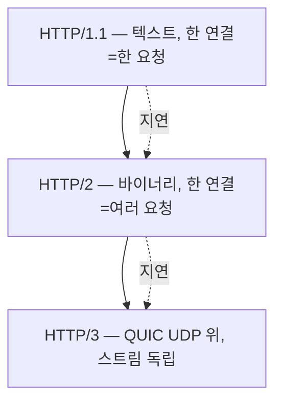
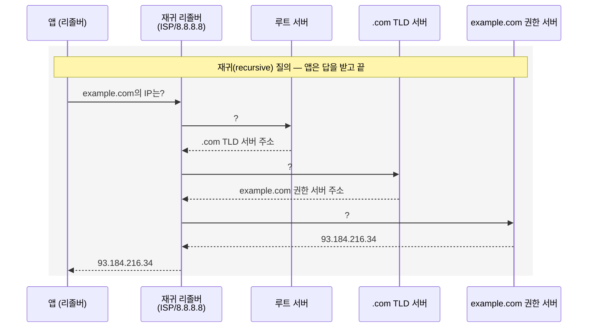
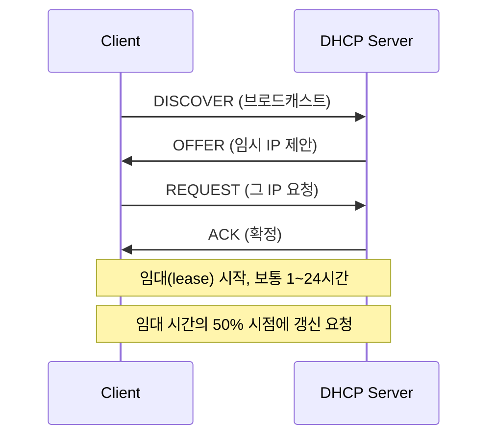
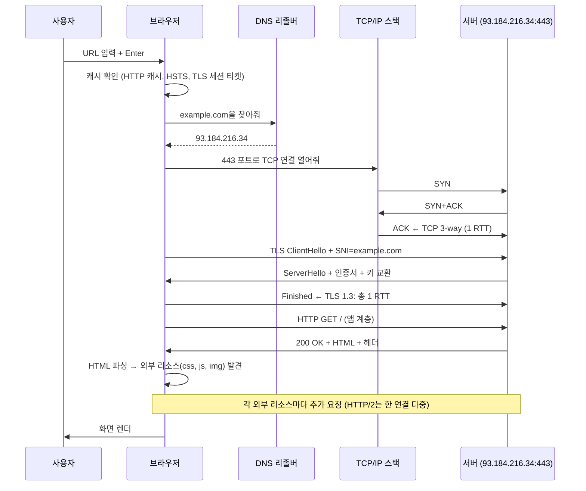

<figure class="post-figure post-figure--header">
<svg role="img" aria-label="URL을 입력하고 엔터를 누르면 무슨 일이 벌어지는가를 한 장에 그린 그림. 위쪽 흐름은 사용자 키 입력에서 시작해 DNS 조회, TCP 핸드셰이크, TLS 핸드셰이크, HTTP 요청, HTTP 응답, 브라우저 렌더 순서로 이어진다. 아래쪽은 응용 계층의 핵심 프로토콜들 — HTTP/HTTPS, DNS, DHCP — 가 각각 어떤 포트와 어떤 데이터 형식을 쓰는지를 보여주는 비교표다. 각 단계 옆에는 평균 소요 RTT와 한 줄 설명이 적혀 있다." viewBox="0 0 680 360" xmlns="http://www.w3.org/2000/svg">
  <title>응용 계층 — URL 입력 한 줄이 여는 여정 (DNS → TCP → TLS → HTTP → 렌더)</title>
  <defs>
    <marker id="ap-arrow" viewBox="0 0 10 10" refX="8" refY="5" markerWidth="6" markerHeight="6" orient="auto-start-reverse">
      <path d="M0,0 L10,5 L0,10 z" fill="var(--secondary-color)"/>
    </marker>
  </defs>

  <!-- title -->
  <text x="340" y="22" text-anchor="middle" font-size="15" font-weight="800" fill="currentColor" letter-spacing="1.2">응용 계층 — URL 한 줄이 여는 여정</text>

  <!-- ===== TOP: journey pipeline ===== -->
  <g font-size="9.5" font-weight="700" fill="currentColor" text-anchor="middle">
    <!-- step boxes -->
    <rect x="20"  y="48" width="92" height="46" rx="4" fill="var(--bg-light)" stroke="var(--secondary-color)" stroke-width="2"/>
    <text x="66" y="68" font-size="9.5">① DNS 조회</text>
    <text x="66" y="84" font-size="8" opacity="0.78">example.com → 93.184.216.34</text>

    <rect x="124" y="48" width="92" height="46" rx="4" fill="var(--bg-light)" stroke="var(--accent-color)" stroke-width="2"/>
    <text x="170" y="68" font-size="9.5">② TCP 3-way</text>
    <text x="170" y="84" font-size="8" opacity="0.78">SYN · SYN+ACK · ACK</text>

    <rect x="228" y="48" width="92" height="46" rx="4" fill="var(--bg-light)" stroke="var(--accent-color)" stroke-width="2"/>
    <text x="274" y="68" font-size="9.5">③ TLS 핸드셰이크</text>
    <text x="274" y="84" font-size="8" opacity="0.78">인증서·키 교환</text>

    <rect x="332" y="48" width="92" height="46" rx="4" fill="var(--bg-light)" stroke="var(--gold)" stroke-width="2"/>
    <text x="378" y="68" font-size="9.5">④ HTTP 요청</text>
    <text x="378" y="84" font-size="8" opacity="0.78">GET / HTTP/1.1</text>

    <rect x="436" y="48" width="92" height="46" rx="4" fill="var(--bg-light)" stroke="var(--gold)" stroke-width="2"/>
    <text x="482" y="68" font-size="9.5">⑤ HTTP 응답</text>
    <text x="482" y="84" font-size="8" opacity="0.78">200 OK + HTML</text>

    <rect x="540" y="48" width="92" height="46" rx="4" fill="var(--bg-light)" stroke="var(--gold)" stroke-width="2"/>
    <text x="586" y="68" font-size="9.5">⑥ 렌더</text>
    <text x="586" y="84" font-size="8" opacity="0.78">DOM · CSS · JS</text>

    <line x1="112" y1="71" x2="124" y2="71" stroke="var(--secondary-color)" stroke-width="2" marker-end="url(#ap-arrow)"/>
    <line x1="216" y1="71" x2="228" y2="71" stroke="var(--secondary-color)" stroke-width="2" marker-end="url(#ap-arrow)"/>
    <line x1="320" y1="71" x2="332" y2="71" stroke="var(--secondary-color)" stroke-width="2" marker-end="url(#ap-arrow)"/>
    <line x1="424" y1="71" x2="436" y2="71" stroke="var(--secondary-color)" stroke-width="2" marker-end="url(#ap-arrow)"/>
    <line x1="528" y1="71" x2="540" y2="71" stroke="var(--secondary-color)" stroke-width="2" marker-end="url(#ap-arrow)"/>
  </g>

  <!-- RTT hint -->
  <text x="340" y="118" text-anchor="middle" font-size="9.5" font-weight="700" fill="currentColor" opacity="0.78">HTTP/1.1 + TLS 1.3: 약 3~4 RTT. HTTP/3(QUIC): 0~1 RTT. 모바일에서 체감 차이가 큽니다.</text>

  <!-- ===== BOTTOM: protocol table ===== -->
  <line x1="30" y1="138" x2="650" y2="138" stroke="currentColor" stroke-width="1.4" opacity="0.25"/>

  <text x="340" y="160" text-anchor="middle" font-size="11" font-weight="800" fill="currentColor">응용 계층의 핵심 프로토콜 — 각자 다른 포트·목적·데이터 형식</text>

  <g font-size="9" font-weight="700" fill="currentColor" text-anchor="middle">
    <rect x="40"  y="178" width="180" height="158" rx="4" fill="var(--bg-light)" stroke="var(--secondary-color)" stroke-width="2"/>
    <text x="130" y="198" font-weight="800">HTTP / HTTPS</text>
    <text x="130" y="216" font-size="8.5" opacity="0.78">TCP 80 / 443</text>
    <text x="130" y="234" font-size="8.5" opacity="0.78">요청·응답 메시지</text>
    <text x="130" y="252" font-size="8.5" opacity="0.78">메서드·상태 코드·헤더</text>
    <text x="130" y="270" font-size="8.5" opacity="0.78">HTTP/1.1 → 2 → 3</text>
    <text x="130" y="288" font-size="8.5" opacity="0.78">REST · gRPC · GraphQL</text>
    <text x="130" y="320" font-size="8" opacity="0.7">웹의 언어</text>

    <rect x="232" y="178" width="180" height="158" rx="4" fill="var(--bg-light)" stroke="var(--accent-color)" stroke-width="2"/>
    <text x="322" y="198" font-weight="800">DNS</text>
    <text x="322" y="216" font-size="8.5" opacity="0.78">UDP 53 (응답 클 시 TCP)</text>
    <text x="322" y="234" font-size="8.5" opacity="0.78">도메인 → IP 변환</text>
    <text x="322" y="252" font-size="8.5" opacity="0.78">재귀 vs 반복 질의</text>
    <text x="322" y="270" font-size="8.5" opacity="0.78">A · AAAA · CNAME · MX</text>
    <text x="322" y="288" font-size="8.5" opacity="0.78">TTL · 캐시</text>
    <text x="322" y="320" font-size="8" opacity="0.7">이름의 전화번호부</text>

    <rect x="424" y="178" width="216" height="158" rx="4" fill="var(--bg-light)" stroke="var(--gold)" stroke-width="2"/>
    <text x="532" y="198" font-weight="800">DHCP</text>
    <text x="532" y="216" font-size="8.5" opacity="0.78">UDP 67/68</text>
    <text x="532" y="234" font-size="8.5" opacity="0.78">IP · 게이트웨이 · DNS 자동 배정</text>
    <text x="532" y="252" font-size="8.5" opacity="0.78">DISCOVER · OFFER · REQUEST · ACK</text>
    <text x="532" y="270" font-size="8.5" opacity="0.78">임대(lease) 시간</text>
    <text x="532" y="288" font-size="8.5" opacity="0.78">IPv6에선 SLAAC가 보완</text>
    <text x="532" y="320" font-size="8" opacity="0.7">첫 인사를 대신 해주는 손님</text>
  </g>
</svg>
<figcaption>응용 계층의 일상 — URL 한 줄이 여는 여정(DNS → TCP → TLS → HTTP → 렌더)과 핵심 프로토콜(HTTP·HTTPS·DNS·DHCP) 세 가족의 차이를 한 장에.</figcaption>
</figure>

## 들어가며

이 글은 `Network-Essential` 시리즈의 **5단계**입니다. 전체 흐름은 [Network Essential Curriculum](/2026/07/29/network-essential-curriculum.html)에서 확인하고, 직전 단계 [전송 계층 (TCP · UDP · 포트 · 소켓)](/2026/07/29/network-transport-tcp-udp.html)을 먼저 읽으면 좋습니다.

1~4단계에서 우리는 *데이터가 네트워크의 어떤 길을 따라, 어떤 신뢰성을 가지고, 어떤 호스트의 어떤 프로세스에* 도달하는지를 배웠습니다. 이제 그 모든 것 위에 **서비스가 실제로 굴러가는** 응용 계층을 올립니다. 우리가 매일 만나는 *HTTP*, *DNS*, *DHCP*가 어떻게 동작하는지, 그리고 이 모든 것을 한 줄로 꿰는 *"브라우저에 URL을 치고 엔터를 누르면 무슨 일이 벌어지는가"* 의 여정을 따라갑니다.

이 단계가 끝나면 *API 디버깅, CDN 설정, 인증서 문제, 캐시 정책* 같은 실무 주제의 좌표가 잡히고, 트러블슈팅에서 "DNS인가 TCP인가 TLS인가 HTTP인가"를 즉시 가를 수 있습니다.

<div class="post-summary-box" markdown="1">

### 📌 이 글에서 다루는 내용

#### 🔍 핵심 주제

- **HTTP/HTTPS**: 메서드·상태 코드·헤더, 캐시·쿠키, HTTP/1.1·2·3의 차이
- **DNS**: 이름 해석의 계층 구조, 재귀 vs 반복 질의, 레코드·TTL·캐시
- **웹 요청의 여정**: URL 입력 → DNS → TCP → TLS → HTTP → 렌더까지 한 흐름으로

</div>

## 1. HTTP/HTTPS — 웹의 언어

### 1.1 HTTP 메시지 — 텍스트로 된 요청·응답

**HTTP(HyperText Transfer Protocol)** 는 텍스트 기반 요청·응답 프로토콜입니다. 클라이언트가 *메서드 + 경로 + 버전*을 한 줄로 보내면 서버가 *버전 + 상태 코드 + 사유*로 답합니다.

```http
GET /index.html HTTP/1.1
Host: example.com
User-Agent: curl/8.0
Accept: text/html
Connection: keep-alive
```

```http
HTTP/1.1 200 OK
Content-Type: text/html; charset=UTF-8
Content-Length: 1256
Cache-Control: max-age=3600
Set-Cookie: session=abc123; HttpOnly; Secure

<!doctype html>
<html>...</html>
```

HTTP가 텍스트 기반이라는 사실은 오늘날에도 강력합니다. `curl`, `telnet`, 브라우저 devtools로 어떤 메시지가 오가는지 *사람이* 읽을 수 있습니다. HTTPS는 이 텍스트를 **TLS로 암호화**해 외부에서 못 읽게 만든 것일 뿐, 메시지 구조 자체는 같습니다.

### 1.2 메서드·상태 코드·헤더

**메서드**는 의도를 표현합니다.

| 메서드 | 의미 | 멱등성 | 안전성 |
| --- | --- | --- | --- |
| `GET` | 리소스 조회 | O | O |
| `HEAD` | 헤더만 조회 | O | O |
| `POST` | 리소스 생성·작업 | X | X |
| `PUT` | 리소스 전체 교체 | O | X |
| `PATCH` | 리소스 일부 수정 | X | X |
| `DELETE` | 리소스 삭제 | O | X |

*멱등(idempotent)* 은 같은 요청을 여러 번 보내도 결과가 같다는 의미이고, *안전(safe)* 는 부작용이 없다는 의미입니다. 이 구분은 **재전송·타임아웃 처리**에서 중요합니다 — 멱등하지 않은 POST를 네트워크 오류로 재시도하면 *중복 결제* 같은 사고가 납니다. 그래서 POST에는 보통 멱등 키(idempotency key)를 함께 보냅니다.

**상태 코드**는 응답의 의미를 다섯 클래스 묶음으로 분류합니다.

| 클래스 | 의미 | 대표 코드 |
| --- | --- | --- |
| 1xx | 정보(계속) | 100 Continue |
| 2xx | 성공 | 200 OK, 201 Created, 204 No Content |
| 3xx | 리다이렉트 | 301 Moved Permanently, 302 Found, 304 Not Modified |
| 4xx | 클라이언트 오류 | 400 Bad Request, 401 Unauthorized, 403 Forbidden, 404 Not Found, 429 Too Many Requests |
| 5xx | 서버 오류 | 500 Internal Server Error, 502 Bad Gateway, 503 Service Unavailable, 504 Gateway Timeout |

*502 Bad Gateway*는 실무에서 자주 만나는 상태로, 앞단(nginx·API Gateway)이 뒷단 앱에서 잘못된 응답을 받았다는 뜻입니다. *504 Gateway Timeout*은 앞단이 뒷단의 응답을 기다리다 포기했다는 뜻이고, 이 둘의 구분은 트러블슈팅의 출발점이 됩니다.

**헤더**는 메시지의 부가 정보입니다. `Content-Type`, `Content-Length`, `Authorization`, `Cache-Control`, `Cookie`, `User-Agent`, `Accept-Encoding` 등이 대표적이며, 표준 헤더는 IANA가 등록·관리합니다.

### 1.3 HTTP/1.1 → HTTP/2 → HTTP/3

시간 순으로 HTTP의 진화를 압축합니다.

| 버전 | 핵심 변화 | 강점 | 약점 |
| --- | --- | --- | --- |
| **HTTP/1.1** (1997) | keep-alive 기본, chunked, 캐시 헤더 표준화 | 단순·보편 | **HOL 블로킹**, 헤드 오버 라운드트립(매 요청마다 헤더 송신) |
| **HTTP/2** (2015) | 바이너리 프레이밍, **멀티플렉싱**, 헤더 압축(HPACK), 서버 푸시 | 한 연결에서 다중 요청 동시 처리, HOL 완화 | 여전히 **TCP 위**라 TCP의 HOL 블로킹은 남음 |
| **HTTP/3** (2022) | **QUIC** (UDP) 위에서 동작, 스트림 독립성, 0/1 RTT 핸드셰이크 | 패킷 손실이 다른 스트림에 영향 없음, 핸드셰이크 지연 ↓ | UDP 환경 필요, 운영·디버깅 도구 성숙 중 |



실무에서 가장 자주 만나는 차이는 HTTP/2의 **헤드 오브 라인 블로킹**입니다. HTTP/1.1은 한 TCP 연결에서 한 요청이 끝나야 다음을 보낼 수 있어, 브라우저가 6개의 연결을 동시에 엽니다(과 거의 모든 사이트가 도메인당 6 연결). HTTP/2는 한 연결에서 다중 요청을 동시에 보내지만, TCP 자체가 한 패킷 손실로 *모든 스트림*이 멈추는 특성을 가져 한 손실이 전체를 지연시킵니다. HTTP/3은 **스트림이 독립**이라 한 손실이 다른 요청에 영향을 주지 않습니다.

## 2. DNS — 이름의 전화번호부

### 2.1 도메인 이름과 IP의 분리

사람은 `example.com`을 기억하지, `93.184.216.34`를 기억하지 않습니다. 기계는 그 반대입니다. **DNS(Domain Name System)** 는 두 세계를 잇는 *분산 데이터베이스*입니다.

도메인 이름은 오른쪽에서 왼쪽으로 갈수록 *좁아집니다*.

<figure class="post-figure">
<svg role="img" aria-label="완전한 도메인 이름 www.example.com. 을 네 개의 색이 다른 조각으로 나눈 그림. 왼쪽부터 www는 호스트, example은 등록 도메인, com은 최상위 도메인(TLD), 끝의 점은 루트 DNS를 뜻한다. 위에는 오른쪽에서 왼쪽으로 갈수록 범위가 좁아진다는 화살표 주석이 있다." viewBox="0 0 560 180" xmlns="http://www.w3.org/2000/svg">
  <title>FQDN www.example.com. 의 계층 — 호스트 → 도메인 → TLD → 루트 (오른쪽일수록 범위가 넓다)</title>
  <defs>
    <marker id="dns-narrow" viewBox="0 0 10 10" refX="8" refY="5" markerWidth="6" markerHeight="6" orient="auto-start-reverse">
      <path d="M0,0 L10,5 L0,10 z" fill="var(--secondary-color)"/>
    </marker>
  </defs>

  <!-- scope-narrows annotation (right to left) -->
  <line x1="500" y1="30" x2="60" y2="30" stroke="var(--secondary-color)" stroke-width="1.5" stroke-dasharray="4 3" marker-end="url(#dns-narrow)"/>
  <text x="490" y="22" text-anchor="end" font-size="10" font-weight="700" fill="var(--secondary-color)">넓은 범위(루트) → 좁은 범위(호스트) · 좁아짐</text>

  <!-- segment boxes -->
  <g font-weight="800" text-anchor="middle">
    <rect x="40"  y="48" width="96" height="42" rx="5" fill="var(--bg-light)" stroke="var(--gold)" stroke-width="2"/>
    <text x="88" y="75" font-size="17" fill="currentColor">www</text>

    <rect x="164" y="48" width="120" height="42" rx="5" fill="var(--bg-light)" stroke="var(--accent-color)" stroke-width="2"/>
    <text x="224" y="75" font-size="17" fill="currentColor">example</text>

    <rect x="312" y="48" width="96" height="42" rx="5" fill="var(--bg-light)" stroke="var(--secondary-color)" stroke-width="2"/>
    <text x="360" y="75" font-size="17" fill="currentColor">com</text>

    <rect x="436" y="48" width="60" height="42" rx="5" fill="var(--bg-panel)" stroke="var(--secondary-color)" stroke-width="2" stroke-dasharray="4 3"/>
    <text x="466" y="75" font-size="17" fill="currentColor">.</text>
  </g>

  <!-- dot separators between segments -->
  <g font-size="17" font-weight="800" fill="currentColor" text-anchor="middle" opacity="0.6">
    <text x="150" y="75">.</text>
    <text x="298" y="75">.</text>
    <text x="422" y="75">.</text>
  </g>

  <!-- role labels -->
  <g font-size="11" font-weight="700" text-anchor="middle">
    <text x="88"  y="112" fill="var(--gold)">호스트</text>
    <text x="88"  y="128" font-size="9.5" fill="currentColor" opacity="0.7">서브 도메인</text>

    <text x="224" y="112" fill="var(--accent-color)">등록 도메인</text>
    <text x="224" y="128" font-size="9.5" fill="currentColor" opacity="0.7">2차 도메인</text>

    <text x="360" y="112" fill="var(--secondary-color)">TLD</text>
    <text x="360" y="128" font-size="9.5" fill="currentColor" opacity="0.7">최상위 도메인</text>

    <text x="466" y="112" fill="var(--secondary-color)">루트</text>
    <text x="466" y="128" font-size="9.5" fill="currentColor" opacity="0.7">루트 DNS</text>
  </g>
</svg>
<figcaption>도메인 이름은 오른쪽(루트)에서 왼쪽(호스트)으로 갈수록 범위가 좁아진다.</figcaption>
</figure>

`com`은 최상위 도메인(TLD), `example`은 그 아래 등록한 도메인, `www`는 그 안의 호스트 이름입니다. 끝의 점(`.`)은 *루트 DNS*를 가리키는 약속입니다.

### 2.2 DNS 질의의 두 방식



- **재귀(recursive) 질의** — 앱이 *리졸버*에게 위임. 리졸버가 모든 일을 하고 *최종 답*만 돌려줍니다.
- **반복(iterative) 질의** — 리졸버가 한 단계씩 다음 서버의 *힌트*를 받고 직접 따라갑니다.

대부분의 앱·OS는 *재귀 리졸버*를 사용하고(예: 우리 노트북이 `/etc/resolv.conf`로 가리키는 DNS 서버), 재귀 리졸버가 *반복*으로 답을 찾습니다.

### 2.3 주요 레코드 타입

| 타입 | 의미 | 예시 |
| --- | --- | --- |
| **A** | 도메인 → IPv4 | `example.com. A 93.184.216.34` |
| **AAAA** | 도메인 → IPv6 | `example.com. AAAA 2606:2800:220:1::1` |
| **CNAME** | 도메인 → 다른 도메인(별칭) | `www.example.com. CNAME example.com.` |
| **MX** | 메일 서버 | `example.com. MX 10 mail.example.com.` |
| **NS** | 권한 있는 DNS 서버 | `example.com. NS ns1.example.com.` |
| **TXT** | 자유 텍스트 | SPF, 도메인 검증 토큰 |
| **SRV** | 서비스 위치 | `_sip._tcp.example.com.` |
| **PTR** | IP → 도메인(역방향) | `34.216.184.93.in-addr.arpa.` |

`dig`/`nslookup`으로 직접 확인해 볼 수 있습니다.

```bash
$ dig example.com A +short
93.184.216.34

$ dig example.com MX +short
10 mail.example.com.
```

### 2.4 캐시와 TTL

각 DNS 응답에는 **TTL(Time To Live)** 이 붙어, 리졸버가 그 답을 *얼마나 오래 캐시할지*를 결정합니다. 짧은 TTL은 변경이 빠르게 반영되지만 *질의 빈도*가 늘어나고, 긴 TTL은 캐시가 오래 살아 *부하*가 줄지만 변경 반영이 느립니다.

운영 함정:

- **TTL 0 캐싱 무시** — 일부 CDN은 *TTL 0* 응답을 캐시해 *DNS 트래픽*을 줄입니다.
- **음성 캐시(Negative caching)** — "존재하지 않음(NXDOMAIN)"도 짧게 캐시될 수 있어 잘못된 설정이 *오래* 영향을 줍니다.
- **DNSSEC** — DNS 응답을 *서명*해 위·변조를 막는 표준. 운영 부담이 있어 *점진적 도입* 중입니다.

### 2.5 DNS 운영 도구

```bash
# 1) 시스템 리졸버가 어디로 가는지
$ cat /etc/resolv.conf
nameserver 8.8.8.8

# 2) 권한 있는 서버를 추적해 보기 (재귀 vs 반복이 어떻게 풀리는지)
$ dig +trace example.com
# 루트 → .com → example.com 권한 서버 순서로 출력

# 3) Python으로 한 줄 질의
$ python -c "import socket; print(socket.gethostbyname('example.com'))"
93.184.216.34
```

## 3. DHCP — 첫 인사를 대신 해주는 손님

호스트가 네트워크에 처음 접속하면 *자기 IP*, *서브넷 마스크*, *기본 게이트웨이*, *DNS 서버*를 알아야 합니다. 매번 운영자가 수동으로 정해주지 않으려면 **자동 배정** 메커니즘이 필요하고, 그 일을 하는 것이 **DHCP(Dynamic Host Configuration Protocol)** 입니다.



네 단계 **DISCOVER → OFFER → REQUEST → ACK** (DORA) 의 단순한 흐름입니다. 클라이언트는 처음에 *자기 IP*조차 모르므로 모두 *브로드캐스트*로 시작합니다. 서버는 **풀(pool)** 에서 IP를 골라 임시로 부여하고, *임대(lease)* 시간을 정해 *반납·갱신*을 관리합니다.

운영 포인트:

- **정적 매핑(reservation)** — MAC 주소로 항상 같은 IP를 부여. 서버·프린터처럼 주소가 안정돼야 하는 장비에 사용.
- **임대 시간** — 짧으면 트래픽이 늘고, 길면 풀 회수·변경이 늦음. 게스트 망은 짧게, 사내망은 길게.
- **IPv6에서는 SLAAC** — DHCP 없이 *라우터 통보(RA)* 만으로 자체 주소 구성 가능. DHCPv6는 보조 수단으로 남음.

## 4. 웹 요청의 여정 — URL 한 줄이 열어주는 무대

이제 1~4단계의 모든 것을 한 줄로 꿰어 봅니다. 브라우저 주소 창에 `https://example.com/`을 치고 엔터를 누르면 무슨 일이 벌어지는가.



실제 타이밍(예시, RTT ~50 ms 가정):

| 단계 | 소요 | 비고 |
| --- | --- | --- |
| DNS 조회 | ~10~50 ms | 캐시 있으면 0 ms |
| TCP 3-way | 1 RTT (~50 ms) | SYN · SYN+ACK · ACK |
| TLS 1.3 | 1 RTT (~50 ms) | 인증서·키 교환 |
| HTTP 요청/응답 | 1 RTT+ 서버 처리 (~200 ms) | 서버 처리 시간 포함 |
| **첫 바이트까지(TTFB)** | **~300 ms** | 위 단계의 합 |
| 페이지 완전 렌더 | 수백 ms ~ 수 초 | 리소스 개수·크기에 따라 |

### 4.1 단계별 — 어디서 무엇이 일어나는가

| 단계 | 계층 | 무엇을 하는가 | 흔한 장애 |
| --- | --- | --- | --- |
| URL 입력 | 응용 | `scheme://host:port/path?query#frag` 파싱 | 오타, 잘못된 포트 |
| DNS 조회 | 응용 → 4 → 3 → 2 | 호스트 이름을 IP로 | DNS 서버 다운, NXDOMAIN |
| TCP 연결 | 4 | SYN/SYN+ACK/ACK | `Connection refused`, `timed out` |
| TLS 핸드셰이크 | 6(응용과 4 사이) | 인증서·키 교환·세션 키 | 인증서 만료·CN/SNI 불일치·cipher 불일치 |
| HTTP 요청/응답 | 7 | 메서드·헤더·본문 송수신 | 4xx/5xx, 큰 본문 |
| 렌더링 | 응용 | HTML 파싱 → CSS/JS/이미지 로드 | 렌더 블로킹, FOUC |

### 4.2 TLS 핸드셰이크 — 한 단계 깊이

TLS 1.3의 핸드셰이크는 *1 RTT* 안에 끝납니다.

```text
Client → Server: ClientHello (cipher list, key share, SNI=example.com)
Server → Client: ServerHello + 인증서 + CertificateVerify + Finished
Client → Server: Finished (이후 암호화된 HTTP)
```

핵심:

- **SNI(Server Name Indication)** — 한 IP에 여러 도메인이 있을 때 *어떤 인증서를 보여줄지* 클라이언트가 알려줍니다. SNI 없으면 인증서 매칭 실패.
- **인증서·CA·PKI** — TLS는 *신뢰 체인*(루트 CA → 중간 CA → 서버 인증서)에 의존. 6단계에서 깊이 다룹니다.
- **세션 재개** — 같은 서버에 다시 접속할 때 *0-RTT*로 핸드셰이크를 단축합니다(PSK, 세션 티켓).

### 4.3 실전: 직접 한 번 따라가 보기

```bash
# 1) DNS부터 — TTL과 응답 IP까지 확인
$ dig +noall +answer example.com
example.com.    86329   IN  A    93.184.216.34

# 2) TCP·TLS·HTTP 한 번에 — curl의 verbose 출력
$ curl -v --tlsv1.3 https://example.com/ 2>&1 | head -40
* Trying 93.184.216.34:443...
* Connected to example.com (93.184.216.34) port 443
* TLSv1.3 (OUT), TLS handshake, ClientHello ...
* TLSv1.3 (IN), TLS handshake, ServerHello ...
* Server certificate: subject=CN=example.com
* TLSv1.3 (IN), TLS handshake, Finished ...
* TLSv1.3 (OUT), TLS change cipher, Change cipher spec ...
* SSL connection using TLS_AES_128_GCM_SHA256
* using HTTP/2
* h2h3 [:method: GET]
> GET / HTTP/2
> Host: example.com
> User-Agent: curl/8.0
> Accept: */*
>
< HTTP/2 200
< server: nginx
< content-type: text/html
< cache-control: max-age=86400
<
... HTML 본문 ...
```

`curl -v` 한 줄로 DNS → TCP → TLS → HTTP/H2 흐름이 모두 보입니다. 이게 이 단계가 가장 강조하는 *직접 눈으로 보는 학습법*입니다.

### 4.4 캐시·CDN — "이미 가져온 걸 다시 가져오지 않는다"

페이지가 빠르게 느껴지는 많은 부분은 **캐시** 덕분입니다.

| 계층 | 무엇을 캐시하나 | 만료 기준 |
| --- | --- | --- |
| 브라우저 | 정적 자산(이미지·CSS·JS) | `Cache-Control: max-age`, `Expires` |
| 서비스 워커 | 사용자 정의 캐시 | 코드 정책 |
| CDN(Cloudflare 등) | 모든 응답 | `Cache-Control`, 자체 정책 |
| 서버 | 렌더링된 페이지·DB 쿼리 | TTL·LRU |

`Cache-Control`은 핵심 헤더입니다. `no-store`(캐시 금지), `no-cache`(재검증 후 사용), `public`/`private`(공유 가능성), `max-age=N`(초 단위 유효)이 대표입니다. 잘못된 캐시 설정은 *변경이 안 반영됨* 사고와 *모든 요청이 서버로 가는* 부하 사고를 동시에 만듭니다.

## 5. 운영 노트

### 5.1 "왜 우리 사이트는 HTTP/3을 안 쓰나"

대부분의 CDN이 HTTP/3를 지원하지만 활성화 조건이 있습니다. UDP가 차단되거나 우선순위가 낮은 네트워크에서는 오히려 *느려질 수 있습니다*. 배포 시 **ALPN과 Alt-Svc 헤더로 협상**하고, *클라이언트 비율*과 *오류율*을 모니터링해 점진적으로 켭니다.

### 5.2 "왜 DNS가 자꾸 죽는가"

DNS는 *모든 통신의 시작*이라 한 번 죽으면 *모든 서비스가 동시에* 안 됩니다. **모범 사례**:

- *재귀 리졸버*를 이중화(내부 + 외부)
- *권한 서버*도 이중화(NS 레코드 2개 이상)
- TTL을 *운영 변경 빈도에 맞춰* 설정(긴 TTL + 사전 짧게 줄여 변경 반영)
- *DNSSEC*은 *점진적 도입*(`.com` 단계부터)

## 마무리

응용 계층은 우리가 매일 만나는 서비스의 언어입니다. HTTP가 요청·응답의 틀을, DNS가 이름을 주소로, DHCP가 첫 인사를 대신합니다. 그리고 이 모든 것을 *URL 한 줄*로 꿰으면, 1~4단계의 모든 지식이 한 그림으로 합쳐집니다. *어디서 끊겼는가*를 묻는 트러블슈팅의 첫 질문에 답할 수 있는 위치에 우리가 섰습니다.

다음 단계는 그 평문 위에 *신뢰*를 얹는 **6단계: 네트워크 보안**입니다. TLS, 인증서·PKI, 방화벽, VPN, 그리고 위협 모델의 사고법 — 앞 단계에서 배운 프로토콜의 취약점과 방어가 하나로 연결됩니다.

### 다음 학습

- [Network Essential Curriculum](/2026/07/29/network-essential-curriculum.html) — 시리즈 전체 지도와 진행률
- 직전: [전송 계층 (TCP · UDP · 포트 · 소켓)](/2026/07/29/network-transport-tcp-udp.html) — 프로세스와 프로세스를 잇는 계층
- 다음: [네트워크 보안 (TLS · 방화벽 · VPN · 위협 모델)](/2026/07/29/network-security-tls.html) — 평문 위에 신뢰를 얹다
- [PostgreSQL Architecture Deep Dive](/2025/12/06/postgresql-architecture-deep-dive.html) — TCP/HTTP 위에서 동작하는 DB의 연결 풀 관점 참고
