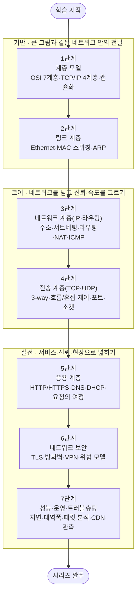

<figure class="post-figure post-figure--header">
<svg role="img" aria-label="Network Essential 시리즈를 한 장으로 정리한 그림. 위쪽은 두 호스트 사이의 통신 모델로, 왼쪽 Host A의 스택(응용·전송·네트워크·링크·물리 5계층)에서 데이터가 아래로 내려가며 계층마다 헤더가 겹겹이 감싸지고(캡슐화), 물리 매체(선)를 건너 오른쪽 Host B의 스택을 거슬러 올라가며 헤더가 벗겨진다(역캡슐화). 아래쪽은 계층 모델·링크·IP/라우팅·TCP/UDP·응용 프로토콜·보안·성능운영으로 이어지는 7단계 로드맵 타임라인이며, 끝에는 시리즈 완주를 뜻하는 트로피가 놓여 있다." viewBox="0 0 680 380" xmlns="http://www.w3.org/2000/svg">
  <title>Network Essential — 계층 스택과 캡슐화 통신 모델, 7단계 도장깨기 로드맵</title>
  <defs>
    <marker id="net-arrow" viewBox="0 0 10 10" refX="8" refY="5" markerWidth="6" markerHeight="6" orient="auto-start-reverse">
      <path d="M0,0 L10,5 L0,10 z" fill="var(--secondary-color)"/>
    </marker>
  </defs>

  <!-- ===== title ===== -->
  <text x="340" y="24" text-anchor="middle" font-size="17" font-weight="800" fill="currentColor" letter-spacing="1.5">NETWORK ESSENTIAL</text>

  <!-- ===== SECTION A: layered communication model ===== -->
  <text x="30" y="50" text-anchor="start" font-size="11" font-weight="700" fill="currentColor" opacity="0.72">통신 모델 — 계층을 내려가며 감싸고(캡슐화), 매체를 건너, 거슬러 올라가며 벗긴다</text>

  <!-- Host A stack (top=Application ... bottom=Physical) -->
  <text x="86" y="70" text-anchor="middle" font-size="10" font-weight="800" fill="currentColor">Host A</text>
  <g font-size="8.5" font-weight="700" fill="currentColor" text-anchor="middle">
    <rect x="26" y="78" width="120" height="20" rx="3" fill="var(--bg-light)" stroke="currentColor" stroke-width="1.8"/><text x="86" y="92">응용 (Application)</text>
    <rect x="26" y="100" width="120" height="20" rx="3" fill="var(--bg-light)" stroke="currentColor" stroke-width="1.8"/><text x="86" y="114">전송 (Transport)</text>
    <rect x="26" y="122" width="120" height="20" rx="3" fill="var(--bg-light)" stroke="currentColor" stroke-width="1.8"/><text x="86" y="136">네트워크 (Network)</text>
    <rect x="26" y="144" width="120" height="20" rx="3" fill="var(--bg-light)" stroke="currentColor" stroke-width="1.8"/><text x="86" y="158">링크 (Link)</text>
    <rect x="26" y="166" width="120" height="20" rx="3" fill="var(--bg-panel)" stroke="currentColor" stroke-width="1.8"/><text x="86" y="180">물리 (Physical)</text>
  </g>
  <!-- down arrow on A -->
  <line x1="12" y1="84" x2="12" y2="180" stroke="var(--secondary-color)" stroke-width="2" marker-end="url(#net-arrow)"/>
  <text x="12" y="196" text-anchor="middle" font-size="8" fill="currentColor" opacity="0.7">캡슐화</text>

  <!-- Encapsulation nested boxes (center) -->
  <text x="340" y="86" text-anchor="middle" font-size="9" font-weight="700" fill="currentColor" opacity="0.75">계층마다 헤더가 겹겹이 감싼다</text>
  <g text-anchor="middle" font-size="8" font-weight="700">
    <!-- L2 frame (outermost) -->
    <rect x="238" y="100" width="204" height="72" rx="4" fill="var(--bg-panel)" stroke="var(--secondary-color)" stroke-width="1.6"/>
    <text x="252" y="112" fill="var(--secondary-color)">Frame</text>
    <!-- L3 packet -->
    <rect x="262" y="118" width="164" height="48" rx="4" fill="var(--bg-light)" stroke="var(--accent-color)" stroke-width="1.6"/>
    <text x="278" y="130" fill="var(--accent-color)">Packet</text>
    <!-- L4 segment -->
    <rect x="288" y="134" width="120" height="26" rx="3" fill="var(--bg-panel)" stroke="var(--gold)" stroke-width="1.6"/>
    <text x="305" y="145" fill="var(--gold)">Segment</text>
    <!-- payload -->
    <rect x="332" y="139" width="60" height="16" rx="2" fill="var(--bg-light)" stroke="currentColor" stroke-width="1.4"/>
    <text x="362" y="150" fill="currentColor">Data</text>
  </g>
  <text x="340" y="188" text-anchor="middle" font-size="8.5" fill="currentColor" opacity="0.72">Data → Segment → Packet → Frame → bits</text>

  <!-- Host B stack (mirror) -->
  <text x="594" y="70" text-anchor="middle" font-size="10" font-weight="800" fill="currentColor">Host B</text>
  <g font-size="8.5" font-weight="700" fill="currentColor" text-anchor="middle">
    <rect x="534" y="78" width="120" height="20" rx="3" fill="var(--bg-light)" stroke="currentColor" stroke-width="1.8"/><text x="594" y="92">응용 (Application)</text>
    <rect x="534" y="100" width="120" height="20" rx="3" fill="var(--bg-light)" stroke="currentColor" stroke-width="1.8"/><text x="594" y="114">전송 (Transport)</text>
    <rect x="534" y="122" width="120" height="20" rx="3" fill="var(--bg-light)" stroke="currentColor" stroke-width="1.8"/><text x="594" y="136">네트워크 (Network)</text>
    <rect x="534" y="144" width="120" height="20" rx="3" fill="var(--bg-light)" stroke="currentColor" stroke-width="1.8"/><text x="594" y="158">링크 (Link)</text>
    <rect x="534" y="166" width="120" height="20" rx="3" fill="var(--bg-panel)" stroke="currentColor" stroke-width="1.8"/><text x="594" y="180">물리 (Physical)</text>
  </g>
  <!-- up arrow on B -->
  <line x1="668" y1="180" x2="668" y2="84" stroke="var(--secondary-color)" stroke-width="2" marker-end="url(#net-arrow)"/>
  <text x="668" y="196" text-anchor="middle" font-size="8" fill="currentColor" opacity="0.7">역캡슐화</text>

  <!-- physical medium / wire -->
  <line x1="146" y1="176" x2="238" y2="176" stroke="var(--secondary-color)" stroke-width="2" stroke-dasharray="4 3"/>
  <line x1="442" y1="176" x2="534" y2="176" stroke="var(--secondary-color)" stroke-width="2" stroke-dasharray="4 3"/>
  <text x="340" y="210" text-anchor="middle" font-size="9" fill="currentColor" opacity="0.72">물리 매체(구리·광·무선) 위로 비트가 흐른다</text>

  <!-- ===== divider ===== -->
  <line x1="30" y1="228" x2="650" y2="228" stroke="currentColor" stroke-width="1.4" opacity="0.25"/>

  <!-- ===== SECTION B: 7-step roadmap ===== -->
  <text x="30" y="252" text-anchor="start" font-size="11" font-weight="700" fill="currentColor" opacity="0.72">7단계 로드맵 — 모델 이해 → 코어 프로토콜 → 실전, 그리고 완주</text>

  <!-- act labels + underlines -->
  <g font-size="9" font-weight="700" text-anchor="middle">
    <text x="120" y="278" fill="var(--secondary-color)">기반 (1–2)</text>
    <text x="330" y="278" fill="var(--accent-color)">코어 (3–4)</text>
    <text x="530" y="278" fill="var(--gold)">실전 (5–7)</text>
  </g>
  <g stroke-width="2" opacity="0.45">
    <line x1="42" y1="284" x2="198" y2="284" stroke="var(--secondary-color)"/>
    <line x1="282" y1="284" x2="378" y2="284" stroke="var(--accent-color)"/>
    <line x1="442" y1="284" x2="618" y2="284" stroke="var(--gold)"/>
  </g>

  <!-- baseline -->
  <line x1="50" y1="316" x2="600" y2="316" stroke="currentColor" stroke-width="2" opacity="0.4"/>

  <!-- stamps -->
  <g font-weight="800" text-anchor="middle">
    <!-- 1 -->
    <circle cx="52" cy="316" r="15" fill="var(--bg-light)" stroke="var(--secondary-color)" stroke-width="2.5"/>
    <text x="52" y="320" font-size="12" fill="currentColor">1</text>
    <text x="52" y="346" font-size="8.5" font-weight="700" fill="currentColor">계층 모델</text>
    <!-- 2 -->
    <circle cx="139" cy="316" r="15" fill="var(--bg-light)" stroke="var(--secondary-color)" stroke-width="2.5"/>
    <text x="139" y="320" font-size="12" fill="currentColor">2</text>
    <text x="139" y="346" font-size="8.5" font-weight="700" fill="currentColor">링크 계층</text>
    <!-- 3 -->
    <circle cx="226" cy="316" r="15" fill="var(--bg-light)" stroke="var(--accent-color)" stroke-width="2.5"/>
    <text x="226" y="320" font-size="12" fill="currentColor">3</text>
    <text x="226" y="346" font-size="8.5" font-weight="700" fill="currentColor">IP·라우팅</text>
    <!-- 4 -->
    <circle cx="313" cy="316" r="15" fill="var(--bg-light)" stroke="var(--accent-color)" stroke-width="2.5"/>
    <text x="313" y="320" font-size="12" fill="currentColor">4</text>
    <text x="313" y="346" font-size="8.5" font-weight="700" fill="currentColor">TCP·UDP</text>
    <!-- 5 -->
    <circle cx="400" cy="316" r="15" fill="var(--bg-light)" stroke="var(--gold)" stroke-width="2.5"/>
    <text x="400" y="320" font-size="12" fill="currentColor">5</text>
    <text x="400" y="346" font-size="8.5" font-weight="700" fill="currentColor">응용 프로토콜</text>
    <!-- 6 -->
    <circle cx="487" cy="316" r="15" fill="var(--bg-light)" stroke="var(--gold)" stroke-width="2.5"/>
    <text x="487" y="320" font-size="12" fill="currentColor">6</text>
    <text x="487" y="346" font-size="8.5" font-weight="700" fill="currentColor">보안·TLS</text>
    <!-- 7 -->
    <circle cx="574" cy="316" r="15" fill="var(--bg-panel)" stroke="var(--gold)" stroke-width="3"/>
    <text x="574" y="320" font-size="12" fill="currentColor">7</text>
    <text x="574" y="346" font-size="8.5" font-weight="700" fill="currentColor">성능·운영</text>
  </g>

  <!-- arrow to trophy -->
  <line x1="592" y1="316" x2="618" y2="316" stroke="var(--secondary-color)" stroke-width="2" marker-end="url(#net-arrow)"/>

  <!-- ===== victory trophy ===== -->
  <g>
    <path d="M636,300 L664,300 Q662,320 650,322 Q638,320 636,300 Z" fill="var(--bg-light)" stroke="var(--gold)" stroke-width="2.5"/>
    <path d="M636,304 q-8,1 -2,11" fill="none" stroke="var(--gold)" stroke-width="2"/>
    <path d="M664,304 q8,1 2,11" fill="none" stroke="var(--gold)" stroke-width="2"/>
    <rect x="646" y="322" width="8" height="7" fill="var(--gold)"/>
    <rect x="638" y="329" width="24" height="5" rx="1" fill="var(--gold)"/>
    <polygon points="650,304 652.6,309.5 658.5,310 654,314 655.6,319.8 650,316.6 644.4,319.8 646,314 641.5,310 647.4,309.5" fill="var(--gold-bright)"/>
  </g>
  <text x="650" y="348" text-anchor="middle" font-size="9" font-weight="800" fill="var(--gold)">완주</text>
</svg>
<figcaption>이 시리즈를 한 장으로 — 계층 스택 위 캡슐화 통신 모델(Host A → 매체 → Host B)과 계층 모델부터 성능·운영까지 7단계 도장깨기 로드맵, 그리고 완주 트로피</figcaption>
</figure>

## 소개

컴퓨터 네트워크는 백엔드·데이터·인프라·보안 어디를 가든 발밑에 깔린 **공용 기반**입니다. API가 느릴 때, 배포한 서비스에 접속이 안 될 때, HTTPS 인증서가 깨질 때, 방화벽 뒤의 서버가 응답하지 않을 때 — 결국 답은 네트워크 계층 어딘가에 있습니다. 그런데 네트워크를 "케이블과 라우터의 물리적인 무엇"으로만 여기면 이 문제들이 늘 마법처럼 느껴집니다. **계층 모델**이라는 렌즈로 볼 때 비로소 "지금 어느 계층의 문제인가"를 물을 수 있고, 그 질문이 곧 해결의 절반입니다.

이 `Network-Essential` 시리즈는 그 렌즈를 손에 쥐여 주는 것을 목표로 합니다. 네트워크를 **7개의 계층이 아니라 7단계의 학습 여정**으로 재구성해, **계층 모델(OSI/TCP-IP)**에서 출발해 아래에서 위로 — **링크 계층**(같은 네트워크 안에서의 전달), **네트워크 계층**(IP·라우팅으로 네트워크를 넘어가기), **전송 계층**(TCP·UDP로 신뢰와 속도를 고르기) — 을 쌓아 올린 뒤, **응용 계층**(HTTP·DNS로 실제 서비스를 굴리기), **보안**(TLS로 그 위에 신뢰를 얹기), 그리고 **성능·운영·트러블슈팅**(현장에서 따져 묻고 고치기)으로 마무리합니다.

이 시리즈는 프로토콜 명세를 암기하는 책이 아니라, **"주소 창에 URL을 치고 엔터를 누르면 무슨 일이 벌어지는가"**라는 하나의 질문을 7단계에 걸쳐 완성해 가는 여정입니다. 각 단계를 정복할 때마다 상세 딥다이브 포스트를 작성하고 체크박스를 채우는 **도장깨기** 방식으로 진행합니다.

<figure class="post-figure">
<svg role="img" aria-label="이 시리즈의 학습 여정을 세 막으로 나눈 개념도. 제1막 '기반을 놓기'는 계층 모델과 링크 계층(1~2단계)으로 통신의 큰 그림과 같은 네트워크 안의 전달을 익히고, 제2막 '코어 프로토콜을 잡기'는 IP·라우팅과 TCP·UDP(3~4단계)로 네트워크를 넘어가는 법과 신뢰·속도의 선택을 다스리며, 제3막 '실전으로 넓히기'는 응용 프로토콜·보안·성능운영(5~7단계)으로 HTTP/DNS·TLS·트러블슈팅까지 활용 범위를 넓힌다. 세 막은 왼쪽에서 오른쪽으로 굵은 화살표로 이어진다." viewBox="0 0 680 280" xmlns="http://www.w3.org/2000/svg">
  <title>세 막으로 보는 네트워크 학습 여정 — 기반을 놓기 → 코어 프로토콜을 잡기 → 실전으로 넓히기</title>
  <defs>
    <marker id="ntl-arrow" viewBox="0 0 10 10" refX="8" refY="5" markerWidth="6" markerHeight="6" orient="auto-start-reverse">
      <path d="M0,0 L10,5 L0,10 z" fill="var(--gold)"/>
    </marker>
  </defs>

  <!-- title -->
  <text x="340" y="26" text-anchor="middle" font-size="15" font-weight="800" fill="currentColor">세 막으로 보는 학습 여정</text>

  <!-- ===== ACT 1: 기반을 놓기 (steps 1-2) ===== -->
  <rect x="16" y="52" width="200" height="210" rx="6" fill="var(--bg-light)" stroke="var(--secondary-color)" stroke-width="2.5"/>
  <circle cx="34" cy="74" r="12" fill="var(--bg-panel)" stroke="var(--secondary-color)" stroke-width="2"/>
  <text x="34" y="78" text-anchor="middle" font-size="11" font-weight="800" fill="currentColor">1</text>
  <text x="122" y="78" text-anchor="middle" font-size="13" font-weight="800" fill="var(--secondary-color)">기반을 놓기</text>
  <text x="122" y="96" text-anchor="middle" font-size="9" fill="currentColor" opacity="0.72">큰 그림과 같은 네트워크 안의 전달</text>
  <!-- layered-stack icon -->
  <g fill="var(--bg-panel)" stroke="var(--secondary-color)" stroke-width="1.6">
    <rect x="96" y="122" width="52" height="9"/><rect x="96" y="133" width="52" height="9"/><rect x="96" y="144" width="52" height="9"/><rect x="96" y="155" width="52" height="9"/>
  </g>
  <line x1="152" y1="138" x2="166" y2="138" stroke="var(--secondary-color)" stroke-width="2" marker-end="url(#ntl-arrow)"/>
  <text x="122" y="176" text-anchor="middle" font-size="8" fill="currentColor" opacity="0.7">계층으로 나누어 보기</text>
  <!-- step chips -->
  <g font-size="9.5" font-weight="700">
    <rect x="34" y="190" width="164" height="22" rx="4" fill="var(--bg-panel)" stroke="currentColor" stroke-width="1" opacity="0.9"/>
    <circle cx="48" cy="201" r="7" fill="var(--bg-light)" stroke="var(--secondary-color)" stroke-width="1.6"/><text x="48" y="204" text-anchor="middle" font-size="8" fill="currentColor">1</text><text x="62" y="204" fill="currentColor">계층 모델 (OSI/TCP-IP)</text>
    <rect x="34" y="216" width="164" height="22" rx="4" fill="var(--bg-panel)" stroke="currentColor" stroke-width="1" opacity="0.9"/>
    <circle cx="48" cy="227" r="7" fill="var(--bg-light)" stroke="var(--secondary-color)" stroke-width="1.6"/><text x="48" y="230" text-anchor="middle" font-size="8" fill="currentColor">2</text><text x="62" y="230" fill="currentColor">링크 계층 · Ethernet·ARP</text>
  </g>

  <!-- arrow ACT1 -> ACT2 -->
  <polygon points="218,148 232,148 232,141 246,157 232,173 232,166 218,166" fill="currentColor" opacity="0.5"/>

  <!-- ===== ACT 2: 코어 프로토콜을 잡기 (steps 3-4) ===== -->
  <rect x="248" y="52" width="176" height="210" rx="6" fill="var(--bg-light)" stroke="var(--accent-color)" stroke-width="2.5"/>
  <circle cx="266" cy="74" r="12" fill="var(--bg-panel)" stroke="var(--accent-color)" stroke-width="2"/>
  <text x="266" y="78" text-anchor="middle" font-size="11" font-weight="800" fill="currentColor">2</text>
  <text x="345" y="76" text-anchor="middle" font-size="12.5" font-weight="800" fill="var(--accent-color)">코어 프로토콜을</text>
  <text x="345" y="93" text-anchor="middle" font-size="12.5" font-weight="800" fill="var(--accent-color)">잡기</text>
  <text x="336" y="111" text-anchor="middle" font-size="9" fill="currentColor" opacity="0.72">네트워크를 넘고, 신뢰·속도를 고르기</text>
  <!-- routing/handshake icon -->
  <g stroke="var(--accent-color)" stroke-width="2" fill="none">
    <circle cx="304" cy="140" r="6" fill="var(--bg-panel)"/>
    <circle cx="386" cy="140" r="6" fill="var(--bg-panel)"/>
    <path d="M310,140 L346,128 L380,140" marker-end="url(#ntl-arrow)"/>
    <path d="M310,142 L346,154 L380,142" stroke-dasharray="3 2"/>
  </g>
  <text x="345" y="174" text-anchor="middle" font-size="8" fill="currentColor" opacity="0.7">홉을 넘고, 핸드셰이크로 잇기</text>
  <!-- step chips -->
  <g font-size="9.5" font-weight="700">
    <rect x="266" y="190" width="140" height="22" rx="4" fill="var(--bg-panel)" stroke="currentColor" stroke-width="1" opacity="0.9"/>
    <circle cx="280" cy="201" r="7" fill="var(--bg-light)" stroke="var(--accent-color)" stroke-width="1.6"/><text x="280" y="204" text-anchor="middle" font-size="8" fill="currentColor">3</text><text x="294" y="204" fill="currentColor">IP·서브네팅·라우팅</text>
    <rect x="266" y="216" width="140" height="22" rx="4" fill="var(--bg-panel)" stroke="currentColor" stroke-width="1" opacity="0.9"/>
    <circle cx="280" cy="227" r="7" fill="var(--bg-light)" stroke="var(--accent-color)" stroke-width="1.6"/><text x="280" y="230" text-anchor="middle" font-size="8" fill="currentColor">4</text><text x="294" y="230" fill="currentColor">TCP · UDP · 포트</text>
  </g>

  <!-- arrow ACT2 -> ACT3 -->
  <polygon points="426,148 440,148 440,141 454,157 440,173 440,166 426,166" fill="currentColor" opacity="0.5"/>

  <!-- ===== ACT 3: 실전으로 넓히기 (steps 5-7) ===== -->
  <rect x="456" y="52" width="208" height="210" rx="6" fill="var(--bg-light)" stroke="var(--gold)" stroke-width="2.5"/>
  <circle cx="474" cy="74" r="12" fill="var(--bg-panel)" stroke="var(--gold)" stroke-width="2"/>
  <text x="474" y="78" text-anchor="middle" font-size="11" font-weight="800" fill="currentColor">3</text>
  <text x="566" y="78" text-anchor="middle" font-size="13" font-weight="800" fill="var(--gold)">실전으로 넓히기</text>
  <text x="566" y="96" text-anchor="middle" font-size="9" fill="currentColor" opacity="0.72">서비스 · 신뢰 · 현장</text>
  <!-- globe/secure icon -->
  <g stroke="var(--gold)" stroke-width="2" fill="none">
    <circle cx="560" cy="140" r="14"/>
    <ellipse cx="560" cy="140" rx="6" ry="14"/>
    <line x1="546" y1="140" x2="574" y2="140"/>
  </g>
  <text x="566" y="172" text-anchor="middle" font-size="8" fill="currentColor" opacity="0.7">웹·보안·운영으로</text>
  <!-- step chips -->
  <g font-size="9.5" font-weight="700">
    <rect x="474" y="176" width="176" height="22" rx="4" fill="var(--bg-panel)" stroke="currentColor" stroke-width="1" opacity="0.9"/>
    <circle cx="488" cy="187" r="7" fill="var(--bg-light)" stroke="var(--gold)" stroke-width="1.6"/><text x="488" y="190" text-anchor="middle" font-size="8" fill="currentColor">5</text><text x="502" y="190" fill="currentColor">응용 · HTTP · DNS</text>
    <rect x="474" y="202" width="176" height="22" rx="4" fill="var(--bg-panel)" stroke="currentColor" stroke-width="1" opacity="0.9"/>
    <circle cx="488" cy="213" r="7" fill="var(--bg-light)" stroke="var(--gold)" stroke-width="1.6"/><text x="488" y="216" text-anchor="middle" font-size="8" fill="currentColor">6</text><text x="502" y="216" fill="currentColor">보안 · TLS · 방화벽</text>
    <rect x="474" y="228" width="176" height="22" rx="4" fill="var(--bg-panel)" stroke="currentColor" stroke-width="1" opacity="0.9"/>
    <circle cx="488" cy="239" r="7" fill="var(--bg-light)" stroke="var(--gold)" stroke-width="1.6"/><text x="488" y="242" text-anchor="middle" font-size="8" fill="currentColor">7</text><text x="502" y="242" fill="currentColor">성능 · 운영 · 트러블슈팅</text>
  </g>
</svg>
<figcaption>학습 스파인을 세 막으로 — ① 기반을 놓기(계층 모델·링크) → ② 코어 프로토콜을 잡기(IP·라우팅·TCP·UDP) → ③ 실전으로 넓히기(HTTP·DNS·TLS·성능/운영)</figcaption>
</figure>

## 학습 흐름

7단계는 아래 순서대로 진행하는 것을 권장합니다. 네트워크는 **아래에서 위로 쌓이는** 구조이므로 학습도 그 결을 따릅니다. 먼저 **계층 모델**로 전체 지도를 그리고, **링크 계층**에서 같은 네트워크 안의 전달(프레임·MAC·ARP)을 익힌 뒤, **네트워크 계층**(IP·서브네팅·라우팅)으로 네트워크의 경계를 넘어가는 법을 배웁니다. 그 위에 **전송 계층**(TCP·UDP)으로 신뢰성과 속도의 선택을 얹고, **응용 계층**(HTTP·DNS)에서 실제 서비스가 어떻게 굴러가는지를 봅니다. 마지막으로 **보안**(TLS·방화벽)으로 신뢰를 더하고, **성능·운영·트러블슈팅**으로 현장의 안목을 갖춥니다.

## 학습 진행 현황

> 완료한 항목에는 상세 포스트 링크가 연결됩니다. 학습이 진행될 때마다 체크박스와 진행률을 갱신합니다.

- 현재 완료한 항목: **7개**
- 전체 항목: **7개**
- 진행률: **100%**

## 1단계: 계층 모델 — OSI 7계층 · TCP/IP 4계층 · 캡슐화

네트워크의 모든 것이 여기서 출발합니다. 복잡한 통신을 **계층(layer)**으로 나눠, 각 계층이 바로 아래 계층의 서비스만 쓰고 위 계층에는 인터페이스만 노출하는 **계층화** 원리를 익힙니다. 개념적 참조 모델인 **OSI 7계층**과 실제 인터넷을 굴리는 **TCP/IP 4계층**의 대응 관계, 데이터가 아래로 내려가며 계층마다 헤더가 붙는 **캡슐화(encapsulation)**와 반대편에서 벗겨지는 **역캡슐화**를 그림으로 잡습니다. 이 지도를 손에 쥐면 이후 모든 단계가 "지금 어느 계층 이야기인가"로 정리되고, 트러블슈팅도 "어느 계층에서 끊겼는가"를 묻는 일이 됩니다.

- [x] **왜 계층화인가**: 관심사 분리, 계층 간 캡슐화·독립적 진화가 주는 힘 [[상세](/2026/07/29/network-layered-models.html)]
- [x] **OSI vs TCP/IP**: 7계층 참조 모델과 4계층 실무 모델의 대응, PDU(프레임·패킷·세그먼트) [[상세](/2026/07/29/network-layered-models.html)]
- [x] **캡슐화와 데이터 흐름**: Data → Segment → Packet → Frame → bits, 송신·수신의 대칭 [[상세](/2026/07/29/network-layered-models.html)]

## 2단계: 링크 계층 — Ethernet · MAC · 스위칭 · ARP

같은 네트워크(로컬 세그먼트) **안에서** 프레임이 어떻게 전달되는지를 다루는 단계입니다. 하드웨어 주소인 **MAC 주소**, 프레임 구조와 **Ethernet**의 동작, 프레임을 목적지 포트로만 보내는 **스위치**의 학습·포워딩, 충돌·브로드캐스트 도메인의 개념을 익힙니다. 특히 IP 주소를 MAC 주소로 변환하는 **ARP**는 "3계층 주소와 2계층 주소가 어떻게 이어지는가"라는 결정적 다리이며, ARP 스푸핑 같은 보안 이슈의 출발점이기도 합니다. **VLAN**으로 하나의 물리 스위치를 논리적으로 쪼개는 개념까지 잡으면 데이터센터·사내망의 그림이 보이기 시작합니다.

- [x] **MAC 주소와 프레임**: L2 주소 체계, Ethernet 프레임 구조, 브로드캐스트/유니캐스트 [[상세](/2026/07/29/network-link-layer.html)]
- [x] **스위칭**: MAC 학습·포워딩 테이블, 충돌 도메인 vs 브로드캐스트 도메인, VLAN [[상세](/2026/07/29/network-link-layer.html)]
- [x] **ARP**: IP↔MAC 해석, ARP 캐시, 게이트웨이로 나가기 전의 마지막 홉 [[상세](/2026/07/29/network-link-layer.html)]

## 3단계: 네트워크 계층 (IP · 라우팅) — 주소 · 서브네팅 · 라우팅 · NAT · ICMP

네트워크의 **경계를 넘어** 목적지까지 패킷을 보내는 단계입니다. 전 세계 어디로든 도달하게 하는 **IP 주소**(IPv4/IPv6), 주소 공간을 나누는 **서브네팅**과 CIDR, 홉과 홉을 거쳐 최적 경로를 찾는 **라우팅**(라우팅 테이블·기본 게이트웨이·정적/동적 라우팅), 사설망과 공인망을 잇는 **NAT**, 그리고 진단·오류 보고의 **ICMP**(ping·traceroute의 정체)를 익힙니다. "왜 내 컴퓨터의 IP는 192.168로 시작하는가", "traceroute는 어떻게 경로를 보여주는가" 같은 일상의 질문이 여기서 풀립니다.

- [x] **IP 주소와 서브네팅**: IPv4/IPv6, CIDR·서브넷 마스크, 사설/공인 주소 [[상세](/2026/07/29/network-ip-and-routing.html)]
- [x] **라우팅**: 라우팅 테이블·기본 게이트웨이, 정적 vs 동적 라우팅, 최장 프리픽스 매칭 [[상세](/2026/07/29/network-ip-and-routing.html)]
- [x] **NAT와 ICMP**: 주소 변환, ping·traceroute의 원리, MTU와 단편화 [[상세](/2026/07/29/network-ip-and-routing.html)]

## 4단계: 전송 계층 (TCP · UDP) — 3-way 핸드셰이크 · 흐름/혼잡 제어 · 포트 · 소켓

호스트가 아니라 **프로세스와 프로세스**를 잇는 계층입니다. **포트**와 **소켓**으로 하나의 IP 위 여러 애플리케이션을 구분하는 법, 연결 지향·신뢰성의 **TCP**(3-way 핸드셰이크로 연결을 세우고, 순서 보장·재전송으로 신뢰를 확보하며, **흐름 제어**와 **혼잡 제어**로 속도를 조율)와 비연결·경량의 **UDP**(신뢰성을 포기하고 지연을 택함)를 나란히 익힙니다. "왜 영상 스트리밍은 UDP이고 웹은 TCP인가", "혼잡 제어가 왜 인터넷을 무너지지 않게 하는가"를 이해하면 전송 계층이 성능의 핵심 무대임을 알게 됩니다.

- [x] **포트와 소켓**: 프로세스 다중화, 잘 알려진 포트, 소켓 = (IP, 포트) 쌍 [[상세](/2026/07/29/network-transport-tcp-udp.html)]
- [x] **TCP**: 3-way/4-way, 순서·재전송으로 만드는 신뢰성, 흐름 제어(윈도)·혼잡 제어 [[상세](/2026/07/29/network-transport-tcp-udp.html)]
- [x] **UDP**: 비연결·경량, 언제 UDP인가, QUIC이 UDP 위에 올라선 이유 [[상세](/2026/07/29/network-transport-tcp-udp.html)]

## 5단계: 응용 계층 — HTTP/HTTPS · DNS · DHCP · 웹 요청의 여정

우리가 매일 마주하는 서비스가 **실제로 굴러가는** 계층입니다. 웹의 언어인 **HTTP**(메서드·상태 코드·헤더, HTTP/1.1 → HTTP/2 → HTTP/3의 진화), 이름을 주소로 바꾸는 **DNS**(재귀·반복 질의, 레코드, 캐시), 접속 시 IP를 자동 배정하는 **DHCP**를 익힙니다. 이 단계의 백미는 **"브라우저에 URL을 치고 엔터를 누르면 무슨 일이 벌어지는가"** — DNS 조회 → TCP 연결 → TLS 핸드셰이크 → HTTP 요청/응답 → 렌더링으로 이어지는 여정을, 앞선 1~4단계 지식을 총동원해 한 줄로 꿰는 것입니다.

- [x] **HTTP/HTTPS**: 메서드·상태 코드·헤더, 캐시·쿠키, HTTP/1.1·2·3의 차이 [[상세](/2026/07/29/network-application-protocols.html)]
- [x] **DNS**: 이름 해석의 계층 구조, 재귀 vs 반복 질의, 레코드·TTL·캐시 [[상세](/2026/07/29/network-application-protocols.html)]
- [x] **웹 요청의 여정**: URL 입력 → DNS → TCP → TLS → HTTP → 렌더까지 한 흐름으로 [[상세](/2026/07/29/network-application-protocols.html)]

## 6단계: 네트워크 보안 — TLS/SSL · 방화벽 · VPN · 위협 모델

평문으로 흐르던 통신 위에 **신뢰**를 얹는 단계입니다. 도청·변조·위장을 막는 **TLS**(핸드셰이크로 세션 키를 세우고, 인증서·PKI로 상대를 검증하며, 대칭·비대칭 암호를 조합하는 원리), 트래픽을 정책으로 걸러내는 **방화벽**(패킷 필터·상태 기반·L7), 신뢰할 수 없는 망 위에 안전한 터널을 세우는 **VPN**을 익힙니다. 여기에 **위협 모델**의 사고법 — 무엇을, 누구로부터, 어떻게 지키는가 — 을 더하면, 앞 단계에서 배운 프로토콜들의 취약점(ARP 스푸핑·DNS 하이재킹·중간자 공격)이 왜 위험하고 어떻게 방어되는지가 하나로 연결됩니다.

- [x] **TLS/SSL**: 핸드셰이크·세션 키, 인증서·CA·PKI, 대칭+비대칭의 결합 [[상세](/2026/07/29/network-security-tls.html)]
- [x] **방화벽과 VPN**: 패킷 필터·상태 기반·L7 방화벽, VPN 터널링, 사설망 접근 [[상세](/2026/07/29/network-security-tls.html)]
- [x] **위협 모델**: 중간자·스푸핑·하이재킹, CIA(기밀성·무결성·가용성)로 사고하기 [[상세](/2026/07/29/network-security-tls.html)]

## 7단계: 성능·운영·트러블슈팅 — 지연·대역폭 · 패킷 분석 · CDN · 관측

배운 것을 **현장에서 따져 묻고 고치는** 마지막 단계입니다. 성능을 좌우하는 두 축인 **지연(latency)**과 **대역폭(bandwidth)**을 구분하고, RTT·처리량·버퍼블로트가 체감 속도를 어떻게 가르는지를 익힙니다. **패킷 분석**(tcpdump·Wireshark로 계층별로 흐름을 뜯어보기), 콘텐츠를 사용자 가까이 두는 **CDN**과 캐싱, 그리고 네트워크를 **관측(observability)**하는 지표·도구까지 다룹니다. "어느 계층에서 느려졌는가", "패킷이 어디서 사라졌는가"를 스스로 진단하는 안목을 갖추면 이 시리즈가 완성됩니다.

- [x] **지연 vs 대역폭**: RTT·처리량·버퍼블로트, 체감 성능을 가르는 것 [[상세](/2026/07/29/network-performance-and-operations.html)]
- [x] **패킷 분석**: tcpdump·Wireshark로 계층별 흐름 읽기, 재전송·핸드셰이크 관찰 [[상세](/2026/07/29/network-performance-and-operations.html)]
- [x] **CDN·캐싱·관측**: 엣지 캐시로 지연 줄이기, 네트워크 지표와 트러블슈팅 도구 [[상세](/2026/07/29/network-performance-and-operations.html)]

## 핵심 포인트

- **계층으로 사고하라**: 네트워크의 모든 문제는 "지금 어느 계층인가"로 시작합니다. 계층 모델은 암기 대상이 아니라 **문제를 분해하는 사고 도구**입니다.
- **아래에서 위로 쌓인다**: 링크(같은 망) → 네트워크(망을 넘어) → 전송(프로세스를 잇고) → 응용(서비스를 굴린다). 아래층의 이해 없이 위층부터 손대면 개념이 겉돕니다.
- **신뢰성과 속도는 트레이드오프다**: TCP와 UDP의 선택, 흐름·혼잡 제어, CDN·캐싱 — 네트워크 설계는 대부분 "무엇을 포기하고 무엇을 얻는가"의 문제입니다.
- **보안은 나중이 아니라 계층마다다**: TLS는 응용 위에 얹히지만, 위협은 ARP·DNS·라우팅 등 모든 계층에 있습니다. 각 계층의 프로토콜을 알아야 그 취약점과 방어가 보입니다.
- **URL 한 줄이 전부를 꿰뚫는다**: DNS → TCP → TLS → HTTP로 이어지는 웹 요청의 여정은 1~6단계 전부를 하나로 잇는 최고의 통합 예제입니다.

## 추천 학습 순서

위 단계 번호 순서대로 진행하는 것을 권합니다.

1. **기반(1~2단계)** — 계층 모델로 전체 지도를 그리고, 링크 계층으로 같은 네트워크 안의 전달을 익힙니다. 이 토대 없이 IP·TCP부터 손대면 "어느 계층 이야기인지"가 흐려집니다.
2. **코어(3~4단계)** — 네트워크 계층(IP·라우팅)으로 망을 넘어가는 법을, 전송 계층(TCP·UDP)으로 신뢰와 속도의 선택을 다스립니다. 인터넷을 굴리는 심장부입니다.
3. **실전(5~7단계)** — 응용 계층(HTTP·DNS)으로 서비스를, 보안(TLS)으로 신뢰를, 성능·운영으로 현장의 안목을 얹어 활용 범위를 넓힙니다.

각 단계는 앞 단계의 토대 위에 쌓이므로, 순서대로 정복하며 체크박스를 채워 나가길 권합니다.

## 결론

네트워크는 "계층으로 나누어, 각 계층이 제 몫만 하고 아래층의 서비스만 쓴다"는 단순한 발상 위에, 전 세계를 하나로 잇는 정교한 시스템을 얹은 기술입니다. 프로토콜과 도구는 계속 진화하지만(HTTP/3·QUIC·IPv6·eBPF 관측), **계층으로 나누고, 주소로 찾고, 홉을 넘고, 핸드셰이크로 잇는다**는 뼈대와 "각 계층은 아래를 신뢰하고 위에 서비스를 제공한다"는 원리는 오래 갑니다. 이 7단계를 순서대로 정복하면, 웹 요청 하나의 여정을 처음부터 끝까지 설명하고, 장애가 났을 때 어느 계층을 의심할지 아는 실무 안목을 갖추게 됩니다.

이 `Network-Essential` 시리즈는 7단계를 모두 정복해 **100% 완주**했습니다. 아래 인덱스가 시리즈 전체 딥다이브로의 길잡이입니다.

### 다음 학습 (Next Learning)

- [1단계: 계층 모델 (OSI 7계층 · TCP/IP 4계층 · 캡슐화)](/2026/07/29/network-layered-models.html) — 이 여정의 첫 관문
- [2단계: 링크 계층 (Ethernet · MAC · 스위칭 · ARP)](/2026/07/29/network-link-layer.html) — 같은 LAN 안의 전달
- [3단계: 네트워크 계층 (IP · 서브네팅 · 라우팅 · NAT · ICMP)](/2026/07/29/network-ip-and-routing.html) — 네트워크 사이의 전달
- [4단계: 전송 계층 (TCP · UDP · 포트 · 소켓)](/2026/07/29/network-transport-tcp-udp.html) — 프로세스와 프로세스를 잇는 계층
- [5단계: 응용 계층 (HTTP/HTTPS · DNS · DHCP · 웹 요청의 여정)](/2026/07/29/network-application-protocols.html) — 서비스가 실제로 굴러가는 계층
- [6단계: 네트워크 보안 (TLS · 방화벽 · VPN · 위협 모델)](/2026/07/29/network-security-tls.html) — 평문 위에 신뢰를 얹다
- [7단계: 성능·운영·트러블슈팅 (지연·대역폭 · 패킷 분석 · CDN · 관측)](/2026/07/29/network-performance-and-operations.html) — 현장의 안목
- [PostgreSQL Architecture Deep Dive](/2025/12/06/postgresql-architecture-deep-dive.html) — 네트워크 위에서 동작하는 DB의 연결·프로토콜 관점 참고
- [Kafka Essential Curriculum](/2026/07/12/kafka-essential-curriculum.html) — 네트워크 위에 세운 분산 로그, 전달 보장과 함께 읽기
