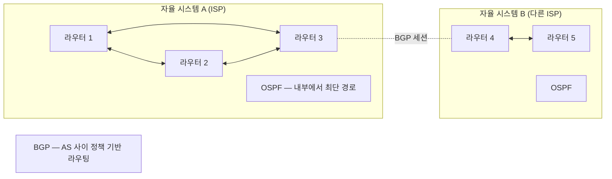
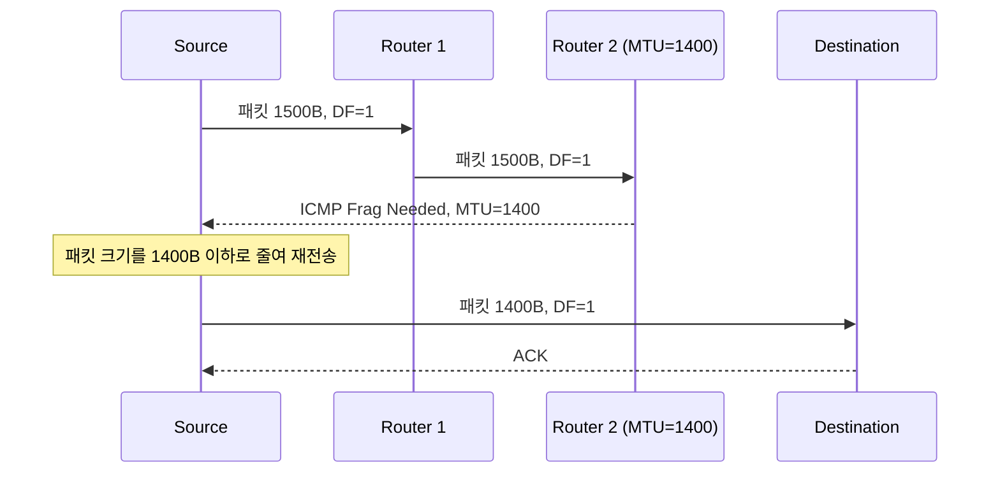
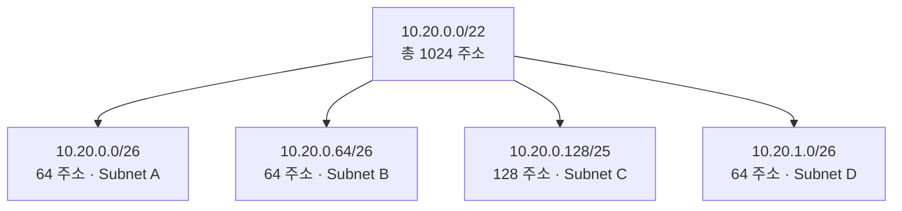

<figure class="post-figure post-figure--header">
<svg role="img" aria-label="네트워크 계층의 라우팅을 한 장에 그린 그림. 왼쪽의 호스트(내 컴퓨터)가 목적지 IP 8.8.8.8에 패킷을 보내기 위해 같은 LAN의 기본 게이트웨이로 먼저 보낸다. 게이트웨이 라우터가 패킷을 받아 라우팅 테이블에서 가장 길게 매칭되는 프리픽스를 골라 다음 홉으로 넘긴다. 라우터 두세 개를 거쳐 목적지에 도달하는 모양이 그려져 있고, 그 사이에 NAT가 사설망을 공인 IP로 바꾸는 지점, ICMP가 라우터 사이의 진단 메시지로 교환되는 지점이 표시되어 있다." viewBox="0 0 680 340" xmlns="http://www.w3.org/2000/svg">
  <title>네트워크 계층 — 패킷이 네트워크를 넘어 목적지 IP까지 가는 길, 라우팅과 NAT</title>
  <defs>
    <marker id="ip-arrow" viewBox="0 0 10 10" refX="8" refY="5" markerWidth="6" markerHeight="6" orient="auto-start-reverse">
      <path d="M0,0 L10,5 L0,10 z" fill="var(--secondary-color)"/>
    </marker>
  </defs>

  <!-- title -->
  <text x="340" y="22" text-anchor="middle" font-size="15" font-weight="800" fill="currentColor" letter-spacing="1.2">네트워크 계층 — 네트워크를 넘어 목적지 IP까지</text>

  <!-- source host -->
  <g font-size="10" font-weight="700" fill="currentColor" text-anchor="middle">
    <rect x="20" y="60" width="100" height="64" rx="6" fill="var(--bg-light)" stroke="var(--secondary-color)" stroke-width="2.5"/>
    <text x="70" y="82">My Host</text>
    <text x="70" y="100" font-size="8.5" opacity="0.75">192.168.1.5</text>
    <text x="70" y="114" font-size="8" opacity="0.7">→ 8.8.8.8</text>
  </g>

  <!-- NAT box -->
  <g font-size="10" font-weight="700" fill="currentColor" text-anchor="middle">
    <rect x="146" y="60" width="92" height="64" rx="6" fill="var(--bg-light)" stroke="var(--accent-color)" stroke-width="2.5"/>
    <text x="192" y="82">NAT Router</text>
    <text x="192" y="100" font-size="8.5" opacity="0.75">192.168.1.1</text>
    <text x="192" y="114" font-size="8" opacity="0.7">203.0.113.5</text>
  </g>

  <!-- ISP router 1 -->
  <g font-size="10" font-weight="700" fill="currentColor" text-anchor="middle">
    <rect x="282" y="60" width="92" height="64" rx="6" fill="var(--bg-light)" stroke="var(--gold)" stroke-width="2.5"/>
    <text x="328" y="82">ISP Router</text>
    <text x="328" y="100" font-size="8.5" opacity="0.75">10.20.0.1</text>
    <text x="328" y="114" font-size="8" opacity="0.7">라우팅 테이블</text>
  </g>

  <!-- ISP router 2 -->
  <g font-size="10" font-weight="700" fill="currentColor" text-anchor="middle">
    <rect x="420" y="60" width="92" height="64" rx="6" fill="var(--bg-light)" stroke="var(--gold)" stroke-width="2.5"/>
    <text x="466" y="82">Backbone</text>
    <text x="466" y="100" font-size="8.5" opacity="0.75">10.30.0.1</text>
    <text x="466" y="114" font-size="8" opacity="0.7">다음 홉</text>
  </g>

  <!-- destination -->
  <g font-size="10" font-weight="700" fill="currentColor" text-anchor="middle">
    <rect x="558" y="60" width="100" height="64" rx="6" fill="var(--bg-light)" stroke="var(--accent-color)" stroke-width="2.5"/>
    <text x="608" y="82">Destination</text>
    <text x="608" y="100" font-size="8.5" opacity="0.75">8.8.8.8</text>
    <text x="608" y="114" font-size="8" opacity="0.7">Google DNS</text>
  </g>

  <!-- arrows between hops -->
  <line x1="120" y1="92" x2="146" y2="92" stroke="var(--secondary-color)" stroke-width="2" marker-end="url(#ip-arrow)"/>
  <line x1="238" y1="92" x2="282" y2="92" stroke="var(--secondary-color)" stroke-width="2" marker-end="url(#ip-arrow)"/>
  <line x1="374" y1="92" x2="420" y2="92" stroke="var(--secondary-color)" stroke-width="2" marker-end="url(#ip-arrow)"/>
  <line x1="512" y1="92" x2="558" y2="92" stroke="var(--secondary-color)" stroke-width="2" marker-end="url(#ip-arrow)"/>
  <text x="133" y="86" font-size="8" font-weight="700" fill="currentColor" opacity="0.7">1</text>
  <text x="260" y="86" font-size="8" font-weight="700" fill="currentColor" opacity="0.7">2</text>
  <text x="397" y="86" font-size="8" font-weight="700" fill="currentColor" opacity="0.7">3</text>
  <text x="535" y="86" font-size="8" font-weight="700" fill="currentColor" opacity="0.7">4</text>

  <!-- annotation: each hop decrements TTL, may NAT -->
  <text x="340" y="156" text-anchor="middle" font-size="9" font-weight="700" fill="currentColor" opacity="0.78">각 홉에서 TTL-1, 라우팅 테이블의 최장 프리픽스 매칭으로 다음 홉 결정</text>

  <!-- routing table example -->
  <g font-size="9" font-weight="700" fill="currentColor" text-anchor="middle">
    <rect x="40" y="180" width="600" height="92" rx="4" fill="var(--bg-panel)" stroke="currentColor" stroke-width="1.2"/>
    <text x="340" y="200" font-weight="800" fill="currentColor">라우팅 테이블 — 최장 프리픽스 매칭(Longest Prefix Match)</text>
    <text x="80" y="220" font-size="8.5">목적지</text>
    <text x="240" y="220" font-size="8.5">프리픽스 길이</text>
    <text x="380" y="220" font-size="8.5">다음 홉</text>
    <text x="510" y="220" font-size="8.5">인터페이스</text>
    <line x1="60" y1="226" x2="620" y2="226" stroke="currentColor" opacity="0.25"/>
    <text x="80" y="240" font-size="8.5">0.0.0.0/0 (default)</text>
    <text x="240" y="240" font-size="8.5">0</text>
    <text x="380" y="240" font-size="8.5">10.20.0.1</text>
    <text x="510" y="240" font-size="8.5">eth0</text>
    <text x="80" y="256" font-size="8.5">203.0.113.0/24</text>
    <text x="240" y="256" font-size="8.5">24</text>
    <text x="380" y="256" font-size="8.5">direct</text>
    <text x="510" y="256" font-size="8.5">eth0</text>
  </g>

  <!-- bottom annotations -->
  <text x="340" y="296" text-anchor="middle" font-size="9" font-weight="700" fill="currentColor" opacity="0.78">"왜 내 IP는 192.168로 시작하는가?" — NAT가 사설 IP를 공인 IP로 바꿔 다수의 호스트가 하나의 공인 IP를 공유하게 한다.</text>
  <text x="340" y="314" text-anchor="middle" font-size="9" font-weight="700" fill="currentColor" opacity="0.78">"traceroute는 어떻게 경로를 보여주는가?" — ICMP TTL Exceeded를 의도적으로 발생시켜 각 홉의 응답을 모은다.</text>
</svg>
<figcaption>네트워크 계층의 모양 — 호스트의 패킷이 NAT를 거쳐 ISP 라우터를 지나 백본을 타고 목적지 IP까지 도달한다. 각 라우터는 라우팅 테이블에서 **가장 길게 매칭되는 프리픽스**로 다음 홉을 고른다. ICMP는 이 길을 진단하는 도구다.</figcaption>
</figure>

## 들어가며

이 글은 `Network-Essential` 시리즈의 **3단계**입니다. 전체 흐름은 [Network Essential Curriculum](/2026/07/29/network-essential-curriculum.html)에서 확인하고, 직전 단계 [링크 계층 (Ethernet · MAC · 스위칭 · ARP)](/2026/07/29/network-link-layer.html)을 먼저 읽으면 좋습니다.

링크 계층이 *같은 LAN 안*의 전달을 책임졌다면, 이번 단계는 **네트워크 사이**의 전달을 책임집니다. 우리 노트북이 `8.8.8.8`에 패킷을 보낼 때, 그 패킷은 같은 LAN의 게이트웨이를 거쳐 ISP 라우터를 지나 백본을 타고 데이터센터에 도달하기까지 **열 군데 이상의 라우터**를 통과합니다. IP 주소 체계, 서브네팅, 라우팅, NAT, ICMP — 이 다섯 가지가 그 긴 여행의 좌표와 도로, 표지판, 그리고 진단 도구입니다.

이 단계가 끝나면 "내 컴퓨터는 어떻게 전 세계 어디든 도달하는가"라는 질문의 답을 손에 쥡니다. 동시에 운영 현장에서 매일 보던 `192.168.x.x`, `ping`, `traceroute`, `route -n`이 어떤 일을 하는지도 명확해집니다.

<div class="post-summary-box" markdown="1">

### 📌 이 글에서 다루는 내용

#### 🔍 핵심 주제

- **IP 주소와 서브네팅**: IPv4/IPv6, CIDR·서브넷 마스크, 사설/공인 주소
- **라우팅**: 라우팅 테이블, 기본 게이트웨이, 정적 vs 동적 라우팅, 최장 프리픽스 매칭
- **NAT와 ICMP**: 주소 변환, ping·traceroute의 원리, MTU와 단편화

</div>

## 1. IP 주소와 서브네팅

### 1.1 IPv4 주소 — 32비트 점박이

IPv4 주소는 32비트(4바이트)입니다. 사람이 읽기 쉽도록 8비트씩 점으로 구분해 표기합니다.

```text
11000000.10101000.00000001.00000101  →  192.168.1.5
```

약 43억 개의 주소가 가능하지만, 전 세계 인구를 커버하기엔 턱없이 부족합니다. 이 한계가 NAT, 사설 IP, IPv6 같은 현실적 해법을 만들었습니다.

### 1.2 CIDR과 서브넷 마스크

옛날에는 주소를 *클래스*로 나눴습니다(A/8, B/16, C/24). 이 체계는 낭비가 심했습니다 — B 클래스(65,534 호스트)를 200 호스트짜리 회사에 부여하면 65,000이 넘는 주소가 낭비됩니다.

**CIDR(Classless Inter-Domain Routing)** 은 클래스 구분을 없애고 *프리픽스 길이*로 자유롭게 자를 수 있게 했습니다.

```text
192.168.1.0/24   ← 앞 24비트가 네트워크, 뒤 8비트가 호스트
                   서브넷 마스크: 255.255.255.0 (= 11111111.11111111.11111111.00000000)

192.168.1.0/26   ← 앞 26비트가 네트워크, 뒤 6비트가 호스트 (64개)
                   서브넷 마스크: 255.255.255.192
```

프리픽스 길이(`/N`)가 길수록 *네트워크 부분이 더 길고* 호스트 부분은 짧습니다 — 더 작은 서브넷이 됩니다. 같은 IP 주소도 어디서 보는지에 따라 다른 의미가 될 수 있습니다(예: `192.168.1.0/24`는 256 주소, `/26`은 64 주소).

서브넷의 호스트 수는 `2^(32-N) - 2`입니다(네트워크 주소와 브로드캐스트 주소 두 개를 빼야 함).

```python
# Python으로 서브넷 계산해 보기
import ipaddress
net = ipaddress.ip_network("192.168.1.0/26", strict=False)
print(net.num_addresses)              # 64
print(net.network_address)            # 192.168.1.0 (네트워크 주소)
print(net.broadcast_address)          # 192.168.1.63 (브로드캐스트)
print(list(net.hosts())[:3])          # 192.168.1.1, .2, .3 ...
print(net.subnets(new_prefix=27))     # /26을 두 개의 /27로 쪼갤 수 있음
```

### 1.3 IPv4의 고갈과 IPv6

IPv4 주소가 동나면서 등장한 두 가지 우회:

- **사설 IP + NAT**: 사설망에서 `192.168.0.0/16`, `10.0.0.0/8`, `172.16.0.0/12`만 쓰고, 인터넷으로 나갈 때 NAT가 공인 IP로 변환(아래 3절에서 자세히).
- **IPv6**: 128비트 주소. 약 3.4×10^38개. 현대 OS는 대부분 **듀얼 스택**(IPv4와 IPv6 동시 지원)이며, IPv6가 가능한 환경에서는 자동 우선됩니다.

IPv6 헤더는 IPv4보다 단순하고, **단편화는 송신 측만** 허용(라우터는 단편화하지 않음)해 라우터 부담을 줄였습니다. 또한 **IPSec이 표준**이고, **SLAAC**으로 주소 자동 구성이 가능합니다.

| 측면 | IPv4 | IPv6 |
| --- | --- | --- |
| 주소 길이 | 32비트 | 128비트 |
| 표기 | 192.168.1.1 | 2001:db8::1 |
| 헤더 길이 | 가변(20~60B) | 고정(40B) |
| 단편화 | 라우터 가능 | 송신 측만 |
| 주소 자동 구성 | DHCP | SLAAC + DHCPv6 |
| NAT 필요성 | 사실상 필수 | 불필요(공인 주소가 풍부) |
| 보안 | 옵션 | IPSec 표준 |

### 1.4 사설 IP와 공인 IP — "왜 내 IP는 192.168로 시작하는가"

집에서 공유기를 통해 인터넷을 쓰면 우리 노트북의 IP는 보통 `192.168.x.x`입니다. 이 주소는 **사설 IP**로, 전 세계에서 *우리 집 안에서만* 유일합니다. 전 세계의 다른 집도 같은 `192.168.1.5`를 쓰지만 서로 충돌하지 않습니다 — 공유기 안의 NAT가 우리 패킷을 **공인 IP**로 바꿔 인터넷에 내보내고, 응답을 다시 우리 노트북에 라우팅하기 때문입니다.

사설 IP 대역은 RFC 1918로 고정되어 있습니다.

| CIDR | 범위 | 호스트 수 |
| --- | --- | --- |
| `10.0.0.0/8` | 10.0.0.0 ~ 10.255.255.255 | 16,777,216 |
| `172.16.0.0/12` | 172.16.0.0 ~ 172.31.255.255 | 1,048,576 |
| `192.168.0.0/16` | 192.168.0.0 ~ 192.168.255.255 | 65,536 |

공인 IP는 인터넷 등록기관(IANA → RIR → NIR → ISP)을 통해 할당받아야 하고, 사설 IP는 누구나 자유롭게 사설망에서 쓸 수 있습니다.

## 2. 라우팅 — 패킷의 여행

### 2.1 라우팅 테이블 — "여기서 출발하면 어디로 갈까"

각 라우터는 **라우팅 테이블**을 갖고 있습니다. 라우팅 테이블의 각 행은 *(목적지 프리픽스, 다음 홉, 인터페이스)* 의 삼중항입니다.

```text
$ ip route
default via 10.20.0.1 dev eth0            ← 모든 트래픽의 기본값
10.20.0.0/24 dev eth0 scope link          ← 같은 LAN은 직접
192.168.1.0/24 via 10.20.0.1 dev eth0     ← 사설망은 ISP 라우터 경유
203.0.113.5 dev eth0 scope link           ← 공인 IP는 직접 매칭
```

패킷이 라우터에 도착하면 라우터는 *목적지 IP*와 테이블의 각 *프리픽스*를 비트 단위로 비교해 **가장 길게 매칭되는 행**을 선택합니다. 이를 **최장 프리픽스 매칭(Longest Prefix Match, LPM)** 이라 합니다.

```text
목적지: 8.8.8.8

테이블:
  0.0.0.0/0         → 10.20.0.1     ← 프리픽스 길이 0  (default)
  8.0.0.0/8         → 10.30.0.1     ← 프리픽스 길이 8  ← 더 길다, 이 행 선택
  8.8.0.0/16        → 10.40.0.1     ← 프리픽스 길이 16 ← 더 길다, 이 행 선택
  8.8.8.0/24        → direct        ← 프리픽스 길이 24 ← 가장 길다, 이 행 선택
```

LPM이 라우팅의 핵심 알고리즘입니다. ISP 라우터의 테이블에는 *수십만 개의 프리픽스*가 들어 있고, 매 패킷마다 LPM을 계산해야 하므로 실제 구현은 **TCAM(Ternary Content Addressable Memory)** 같은 전용 하드웨어로 가속합니다.

### 2.2 정적 라우팅 vs 동적 라우팅

| 종류 | 정의 | 장점 | 단점 |
| --- | --- | --- | --- |
| **정적(Static)** | 운영자가 수동으로 입력 | 단순·예측 가능·라우터 부하 없음 | 경로 변경 시 수동 갱신, 대규모에 부적합 |
| **동적(Dynamic)** | 라우팅 프로토콜이 자동 학습·갱신 | 장애 자동 우회, 대규모에 적합 | 설정 복잡, 수렴 시간, 라우터 부하 |

동적 라우팅 프로토콜은 두 가지로 나뉩니다.

- **IGP(Interior Gateway Protocol)** — 한 자율 시스템(AS) 내부. RIP(거리 벡터, 구세대), **OSPF**(링크 상태, 가장 흔함), IS-IS(대형 ISP).
- **EGP(Exterior Gateway Protocol)** — AS 사이. **BGP**가 사실상 유일하며, 인터넷의 *백본*을 형성합니다.



BGP의 가장 큰 특징은 *거리*가 아니라 *정책*으로 경로를 정한다는 점입니다. "상대 AS를 통과하지 않는다", "특정 지역의 트래픽은 우회한다" 같은 비즈니스 규칙이 경로에 반영됩니다.

### 2.3 기본 게이트웨이와 "다음 홉"

호스트의 라우팅 테이블이 단순한 이유 — 호스트는 **대부분의 결정을 게이트웨이에 위임**하기 때문입니다. 우리 노트북의 라우팅 테이블을 다시 봅니다.

```text
default via 192.168.1.1 dev wlan0     ← 기본 게이트웨이
192.168.1.0/24 dev wlan0 scope link   ← 같은 LAN은 직접
```

`8.8.8.8`을 보내는 상황을 따라가 봅니다.

1. 호스트는 `8.8.8.8`이 같은 서브넷이 아님을 인지(서브넷 마스크로 비교).
2. 라우팅 테이블에서 가장 길게 매칭되는 행 — `default via 192.168.1.1`을 선택.
3. 패킷의 *목적지 MAC*을 **게이트웨이의 MAC**으로 채움(2단계에서 본 ARP).
4. 게이트웨이가 패킷을 받으면 자기 라우팅 테이블로 다시 LPM을 계산.
5. 다음 라우터로 넘기고, 최종 목적지까지 홉마다 반복.

핵심: **호스트는 직접 도달 가능한 다음 홉에게 패킷을 넘기고, 라우터가 다시 그 일을 한다.** 한 홉씩 가까워지는 *분산 결정* 모델이 인터넷 라우팅의 본질입니다.

## 3. NAT — 사설 IP를 공인 IP로

### 3.1 NAT의 원리

**NAT(Network Address Translation)** 는 사설 IP의 패킷이 인터넷으로 나갈 때 *출발지 IP를 공인 IP로 바꾸고*, 응답이 돌아오면 *목적지 IP를 다시 원래 사설 IP로* 되돌리는 작업입니다.

```text
내 노트북: 192.168.1.5:52431 → 8.8.8.8:80     [사설 → 공인 변환]

NAT 라우터:
  변환 전: src=192.168.1.5:52431, dst=8.8.8.8:80
  변환 후: src=203.0.113.5:40001,    dst=8.8.8.8:80     ← 사설 IP가 공인 IP로

8.8.8.8이 응답: src=8.8.8.8:80, dst=203.0.113.5:40001
NAT 라우터: 매핑 테이블 조회 → 192.168.1.5:52431로 다시 변환
```

NAT 라우터는 보통 **(사설 IP, 사설 포트) ↔ (공인 IP, 공인 포트)** 의 매핑을 유지합니다. 여러 호스트가 같은 공인 IP를 공유할 수 있으므로 *포트 다중화(port multiplexing)* 가 필요합니다.

### 3.2 NAT 변형들

| 종류 | 동작 |
| --- | --- |
| **Static NAT (1:1)** | 한 사설 IP를 한 공인 IP에 고정 매핑 (서버 노출에 사용) |
| **Dynamic NAT** | 사설 IP를 공인 IP 풀에서 동적으로 할당 |
| **PAT / NAPT (Port Address Translation)** | 한 공인 IP를 여러 사설 호스트가 공유(포트 다중화). 가정 공유기가 대표 |
| **Carrier-Grade NAT (CGN)** | ISP 단위의 PAT. IPv4 고갈 대응 |

### 3.3 NAT의 부작용 — End-to-End 원칙의 훼손

NAT는 실용적이지만 *End-to-End 원칙* (양 종단 호스트가 직접 소통하는 것)을 깹니다.

- **인바운드 연결**: 외부에서 NAT 안 호스트로 *새로* 접속하기 어렵습니다. 그래서 포트 포워딩, 리버스 프록시, **STUN/TURN/ICE** 같은 우회 기술이 등장했습니다.
- **프로토콜 가정**: 일부 프로토콜은 패킷 안에 IP/포트를 *평문으로* 박아 넣습니다(예: FTP, SIP). NAT는 이런 패킷의 페이로드까지 수정해야 제대로 동작합니다 — 그래서 ALG(Application Layer Gateway)가 등장합니다.
- **추적 난이도**: 한 공인 IP를 수십 호스트가 공유하므로 *누가* 보낸 트래픽인지 구별하기 어렵습니다.

IPv6가 보급되면 NAT는 점차 불필요해질 것이지만, IPv4가 살아 있는 동안 NAT는 운영 현실입니다.

## 4. ICMP — 라우터의 진단 언어

### 4.1 ICMP는 무엇인가

**ICMP(Internet Control Message Protocol)** 는 IP 패킷의 전송에 이상이 있을 때 라우터나 호스트가 *상태를 보고*하는 프로토콜입니다. IP 자체의 신뢰성 부족을 *보고*하는 도구이지, 데이터를 운반하지는 않습니다.

대표 메시지 타입:

| 타입 | 의미 | 발생 상황 |
| --- | --- | --- |
| 0 — Echo Reply | ping 응답 | ping 요청에 답함 |
| 3 — Destination Unreachable | 목적지 도달 불가 | 라우터가 경로 없음/호스트 없음/포트 닫힘 등 보고 |
| 5 — Redirect | 더 좋은 경로 안내 | 라우터가 호스트에게 "다른 게이트웨이를 써라" 알림 |
| 8 — Echo Request | ping 요청 | 사용자가 보냄 |
| 11 — Time Exceeded | TTL 초과 | 라우터가 패킷의 TTL을 0으로 감소시켜 폐기 |
| 12 — Parameter Problem | 헤더 오류 | IP 헤더 필드 오류 보고 |

### 4.2 ping — "이 호스트가 살아 있나"

`ping`은 ICMP Echo Request(Type 8)을 보내 Echo Reply(Type 0)를 기다리는 단순한 도구입니다. 응답 시간(RTT)을 측정해 *도달 가능성*과 *왕복 지연*을 동시에 봅니다.

```bash
$ ping -c 4 8.8.8.8
PING 8.8.8.8 (8.8.8.8): 56 data bytes
64 bytes from 8.8.8.8: icmp_seq=0 ttl=119 time=12.3 ms
64 bytes from 8.8.8.8: icmp_seq=1 ttl=119 time=11.8 ms
64 bytes from 8.8.8.8: icmp_seq=2 ttl=119 time=12.0 ms
64 bytes from 8.8.8.8: icmp_seq=3 ttl=119 time=12.5 ms

--- 8.8.8.8 ping statistics ---
4 packets transmitted, 4 received, 0% packet loss
round-trip min/avg/max/stddev = 11.8/12.15/12.5/0.28 ms
```

여기서 `ttl=119`는 우리에게 *도달한 패킷의 TTL 값*입니다. 출발 시 TTL이 64였다면 **45홉**을 거쳤다는 뜻이고(라우터마다 1씩 감소), 운영 환경에서는 TTL 값의 변동으로 *어느 홉에서 지연이 생기는지* 단서를 얻습니다.

### 4.3 traceroute — "어디를 거쳐 왔나"

`traceroute`는 **ICMP Time Exceeded(Type 11)** 메시지를 의도적으로 발생시켜 경로의 각 홉을 드러냅니다. 동작은 단순합니다.

1. 출발지에서 **TTL=1**인 패킷을 보냅니다. 첫 라우터가 TTL을 0으로 줄이고 폐기 — ICMP Time Exceeded를 *출발지에 회신*.
2. 출발지는 **TTL=2**, **TTL=3**, ... 으로 한 홉씩 늘려가며 반복.
3. 각 TTL 단계의 *응답자 IP*와 *응답 시간*을 기록 → 경로가 그려짐.

```bash
$ traceroute 8.8.8.8
 1  192.168.1.1   1.123 ms   ← 우리 공유기
 2  10.20.0.1     5.456 ms   ← ISP 첫 라우터
 3  10.30.0.1     8.901 ms
 4  72.14.213.1   9.234 ms   ← ISP 백본
 5  108.170.240.1 12.567 ms
 ...
10  8.8.8.8       12.890 ms  ← 목적지
```

운영에서 흔히 보는 함정:

- **ICMP가 차단된 라우터**: 일부 라우터/방화벽이 ICMP를 차단해 `* * *`로 응답이 없습니다. *경로가 없는 것이 아니라 응답이 없는 것*입니다.
- **비대칭 라우팅**: 응답 경로가 출발 경로와 다를 수 있습니다. traceroute는 한 방향만 보여줍니다.
- **로드 밸런싱**: 큰 사이트는 패킷마다 다른 경로를 쓸 수 있어 traceroute 출력이 매번 다릅니다.

### 4.4 PMTUD — MTU와 단편화

**PMTUD(Path MTU Discovery)** 는 출발지에서 *목적지까지의 경로에서 통과할 수 있는 최대 패킷 크기*를 알아내 적절한 크기로 보내는 메커니즘입니다.



운영 함정: **VPN 터널은 MTU가 작아집니다** (예: 1400~1450). PMTUD가 잘 동작하면 OS가 자동으로 MSS를 줄여 *큰 패킷*을 보내지 않지만, **ICMP가 방화벽에서 차단되면 PMTUD가 실패**해 큰 패킷이 그대로 보내지고 응답이 멈춥니다. "특정 사이트만 파일 업로드가 멈춘다"는 보고는 거의 항상 이 그림입니다.

## 5. 실전 운영 노트

### 5.1 서브네팅을 직접 계산해 보기

보통 `/24` 또는 `/26` 단위로 잘라 쓰는 데이터센터 서브넷을 예로 들어 봅니다.



보통 **3비트 단위(`/24 → /27`, `/23 → /26`)** 로 잘라 사람이 읽기 쉬운 경계를 만듭니다. 게이트웨이로 `.1`을, 예약 IP로 `.0`과 `.255`(= `/24`의 경우)를 미리 빼 둡니다.

### 5.2 ICMP를 막지 말라 — 그러나 무한정은 막아라

ICMP를 완전히 막으면 PMTUD, MTU 협상, 경로 진단이 모두 실패합니다. 하지만 무한정 허용하면 *ICMP flood* 공격에 노출됩니다. **모범 사례**: 내부 ICMP는 허용, 외부에서 들어오는 ICMP는 *echo-request는 속도 제한*, *redirect/type 5는 차단*, *destination-unreachable/time-exceeded는 PMTUD를 위해 허용*.

## 마무리

네트워크 계층은 패킷이 **네트워크를 넘어** 도달하는 법을 다룹니다. IP 주소가 종단 식별자이고, CIDR이 주소 공간을 자유롭게 나누는 도구이며, 라우팅 테이블이 각 홉의 결정표이고, NAT가 사설과 공인을 잇는 현실적 다리이며, ICMP가 이 모든 길의 진단 도구입니다. 이 다섯 가지를 잡으면 "내 패킷이 8.8.8.8에 도달하는 길"이 그림으로 그려집니다.

다음 단계는 그 패킷이 **같은 호스트의 어떤 프로세스에**로 향하는지를 정하는 **전송 계층**입니다. 포트, TCP·UDP, 3-way 핸드셰이크, 흐름·혼잡 제어가 이 단계의 무대이며, "왜 영상 스트리밍은 UDP이고 웹은 TCP인가"라는 질문이 자연스럽게 풀립니다.

### 다음 학습

- [Network Essential Curriculum](/2026/07/29/network-essential-curriculum.html) — 시리즈 전체 지도와 진행률
- 직전: [링크 계층 (Ethernet · MAC · 스위칭 · ARP)](/2026/07/29/network-link-layer.html) — 같은 LAN의 전달
- 다음: [전송 계층 (TCP · UDP · 포트 · 소켓)](/2026/07/29/network-transport-tcp-udp.html) — 프로세스와 프로세스를 잇는 계층
- [PostgreSQL Architecture Deep Dive](/2025/12/06/postgresql-architecture-deep-dive.html) — 네트워크 위에서 동작하는 DB의 연결·프로토콜 관점 참고
