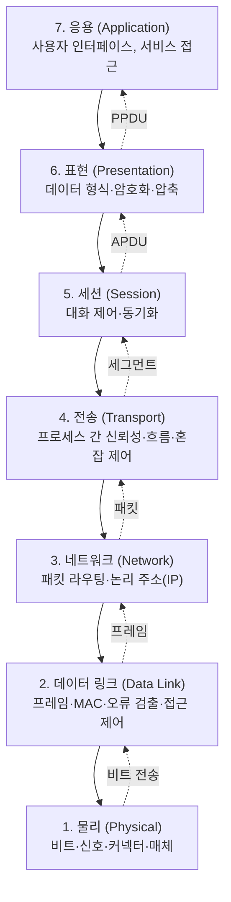

<figure class="post-figure post-figure--header">
<svg role="img" aria-label="OSI 7계층과 TCP/IP 4계층의 대응을 한 장에 그린 그림. 왼쪽은 OSI 참조 모델로 응용·표현·세션·전송·네트워크·데이터 링크·물리 일곱 계층이 세로로 쌓여 있고, 오른쪽은 TCP/IP 실무 모델로 응용·전송·인터넷·네트워크 액세스 네 계층이 쌓여 있다. 가운데 대응 화살표는 OSI 5~7층이 TCP/IP 응용으로, OSI 4층이 TCP/IP 전송으로, OSI 3층이 TCP/IP 인터넷으로, OSI 2~1층이 TCP/IP 네트워크 액세스로 묶인다. 가운데 위에는 데이터가 위에서 아래로 내려가며 세그먼트, 패킷, 프레임, 비트로 계층마다 헤더가 더해지는 캡슐화가 그려져 있다." viewBox="0 0 680 360" xmlns="http://www.w3.org/2000/svg">
  <title>OSI 7계층 ↔ TCP/IP 4계층 대응과 캡슐화 — 계층 모델의 큰 그림</title>
  <defs>
    <marker id="lm-arrow" viewBox="0 0 10 10" refX="8" refY="5" markerWidth="6" markerHeight="6" orient="auto-start-reverse">
      <path d="M0,0 L10,5 L0,10 z" fill="var(--secondary-color)"/>
    </marker>
    <marker id="lm-arrow2" viewBox="0 0 10 10" refX="8" refY="5" markerWidth="5" markerHeight="5" orient="auto-start-reverse">
      <path d="M0,0 L10,10 L0,10 z" fill="var(--accent-color)"/>
    </marker>
  </defs>

  <!-- title -->
  <text x="340" y="22" text-anchor="middle" font-size="15" font-weight="800" fill="currentColor" letter-spacing="1.2">계층 모델의 큰 그림 — OSI 7계층 ↔ TCP/IP 4계층</text>

  <!-- ===== LEFT: OSI 7 ===== -->
  <text x="160" y="46" text-anchor="middle" font-size="12" font-weight="800" fill="currentColor">OSI 7계층 (참조 모델)</text>

  <g font-size="10" font-weight="700" fill="currentColor" text-anchor="middle">
    <rect x="58" y="58" width="204" height="22" rx="3" fill="var(--bg-light)" stroke="var(--secondary-color)" stroke-width="2"/>
    <text x="160" y="73">7. 응용 (Application)</text>
    <rect x="58" y="82" width="204" height="22" rx="3" fill="var(--bg-light)" stroke="var(--secondary-color)" stroke-width="2"/>
    <text x="160" y="97">6. 표현 (Presentation)</text>
    <rect x="58" y="106" width="204" height="22" rx="3" fill="var(--bg-light)" stroke="var(--secondary-color)" stroke-width="2"/>
    <text x="160" y="121">5. 세션 (Session)</text>
    <rect x="58" y="130" width="204" height="22" rx="3" fill="var(--bg-light)" stroke="var(--accent-color)" stroke-width="2"/>
    <text x="160" y="145">4. 전송 (Transport)</text>
    <rect x="58" y="154" width="204" height="22" rx="3" fill="var(--bg-light)" stroke="var(--accent-color)" stroke-width="2"/>
    <text x="160" y="169">3. 네트워크 (Network)</text>
    <rect x="58" y="178" width="204" height="22" rx="3" fill="var(--bg-light)" stroke="var(--gold)" stroke-width="2"/>
    <text x="160" y="193">2. 데이터 링크 (Data Link)</text>
    <rect x="58" y="202" width="204" height="22" rx="3" fill="var(--bg-light)" stroke="var(--gold)" stroke-width="2"/>
    <text x="160" y="217">1. 물리 (Physical)</text>
  </g>

  <!-- ===== CENTER: arrows ===== -->
  <g stroke="var(--secondary-color)" stroke-width="1.6" fill="none">
    <line x1="266" y1="69" x2="290" y2="69" marker-end="url(#lm-arrow)"/>
    <line x1="266" y1="93" x2="290" y2="69"/>
    <line x1="266" y1="117" x2="290" y2="69"/>
    <line x1="266" y1="141" x2="290" y2="141" marker-end="url(#lm-arrow)"/>
    <line x1="266" y1="165" x2="290" y2="165" marker-end="url(#lm-arrow)"/>
    <line x1="266" y1="189" x2="290" y2="189" marker-end="url(#lm-arrow)"/>
    <line x1="266" y1="213" x2="290" y2="189"/>
  </g>
  <text x="278" y="58" text-anchor="middle" font-size="8" font-weight="700" fill="currentColor" opacity="0.7">대응</text>

  <!-- ===== RIGHT: TCP/IP 4 ===== -->
  <text x="446" y="46" text-anchor="middle" font-size="12" font-weight="800" fill="currentColor">TCP/IP 4계층 (실무 모델)</text>

  <g font-size="10" font-weight="700" fill="currentColor" text-anchor="middle">
    <rect x="344" y="58" width="204" height="64" rx="3" fill="var(--bg-light)" stroke="var(--secondary-color)" stroke-width="2"/>
    <text x="446" y="86">4. 응용 (Application)</text>
    <text x="446" y="104" font-size="8" font-weight="600" fill="currentColor" opacity="0.72">HTTP · DNS · TLS · SMTP</text>
    <rect x="344" y="130" width="204" height="22" rx="3" fill="var(--bg-light)" stroke="var(--accent-color)" stroke-width="2"/>
    <text x="446" y="145">3. 전송 (Transport)</text>
    <rect x="344" y="154" width="204" height="22" rx="3" fill="var(--bg-light)" stroke="var(--accent-color)" stroke-width="2"/>
    <text x="446" y="169">2. 인터넷 (Internet)</text>
    <rect x="344" y="178" width="204" height="46" rx="3" fill="var(--bg-light)" stroke="var(--gold)" stroke-width="2"/>
    <text x="446" y="203">1. 네트워크 액세스 (Link)</text>
  </g>

  <!-- ===== BOTTOM: encapsulation ===== -->
  <line x1="30" y1="240" x2="650" y2="240" stroke="currentColor" stroke-width="1.4" opacity="0.25"/>

  <text x="340" y="258" text-anchor="middle" font-size="11" font-weight="800" fill="currentColor">캡슐화 — 데이터는 위에서 아래로 내려가며 헤더가 겹겹이 쌓인다</text>

  <g text-anchor="middle" font-weight="700" font-size="8.5">
    <!-- L7 Data -->
    <rect x="280" y="270" width="200" height="14" rx="2" fill="var(--bg-light)" stroke="currentColor" stroke-width="1.2"/>
    <text x="380" y="280" fill="currentColor">Data (HTTP 메시지)</text>
    <!-- L4 Segment -->
    <rect x="290" y="286" width="180" height="14" rx="2" fill="var(--bg-light)" stroke="var(--secondary-color)" stroke-width="1.2"/>
    <text x="294" y="296" fill="var(--secondary-color)">TCP</text>
    <text x="380" y="296" fill="currentColor">Data</text>
    <!-- L3 Packet -->
    <rect x="300" y="302" width="160" height="14" rx="2" fill="var(--bg-light)" stroke="var(--accent-color)" stroke-width="1.2"/>
    <text x="304" y="312" fill="var(--accent-color)">IP</text>
    <text x="380" y="312" fill="currentColor">Data</text>
    <!-- L2 Frame -->
    <rect x="310" y="318" width="140" height="14" rx="2" fill="var(--bg-light)" stroke="var(--gold)" stroke-width="1.2"/>
    <text x="314" y="328" fill="var(--gold)">Eth</text>
    <text x="380" y="328" fill="currentColor">Data</text>
    <text x="380" y="346" font-size="9" fill="currentColor" opacity="0.75">Data → Segment → Packet → Frame → bits</text>
  </g>
</svg>
<figcaption>네트워크의 큰 지도 — OSI 7계층(참조 모델)과 TCP/IP 4계층(실무 모델)의 대응, 그리고 데이터가 위에서 아래로 내려가며 세그먼트·패킷·프레임으로 캡슐화되는 모양. 이 지도 한 장이 이후 모든 단계의 좌표축이 됩니다.</figcaption>
</figure>

## 들어가며

이 글은 `Network-Essential` 시리즈의 **1단계**입니다. 전체 흐름은 [Network Essential Curriculum](/2026/07/29/network-essential-curriculum.html)에서 확인할 수 있습니다.

네트워크를 어려워하는 가장 흔한 이유는 "모든 것이 동시에 벌어진다"는 인상 때문입니다. 웹 페이지를 한 장 열 때 실제로는 ARP 캐시 조회가 일어나고, TCP 핸드셰이크가 오가고, TLS 인증서가 검증되고, HTTP 요청이 직렬화되며, 라우터가 패킷을 다음 홉으로 넘기고 — 이 모든 일이 한 줄의 URL 입력 안에 압축되어 있습니다. **계층 모델(layered model)** 은 이 혼돈에 질서를 부여하는 가장 오래되고 강력한 도구입니다.

이 단계의 목표는 단순합니다. 네트워크의 **큰 지도**를 한 장 손에 쥐는 것. 이후 모든 단계의 모든 개념(링크, IP, TCP, HTTP, TLS…)은 이 지도 위의 한 칸으로 환원됩니다. 장애가 났을 때도 "지금 어느 계층의 문제인가"라는 질문을 던질 수 있게 됩니다.

<div class="post-summary-box" markdown="1">

### 📌 이 글에서 다루는 내용

#### 🔍 핵심 주제

- **왜 계층화인가**: 관심사 분리(separation of concerns)가 가져오는 힘과 비용
- **OSI 7계층 vs TCP/IP 4계층**: 참조 모델과 실무 모델의 대응, 각 계층의 역할
- **PDU와 캡슐화**: 데이터 → 세그먼트 → 패킷 → 프레임 → 비트, 송신·수신의 대칭

</div>

## 1. 왜 계층화인가

소프트웨어 공학에서 "관심사 분리(Separation of Concerns)"는 **변화하는 이유가 다른 것들을 다른 층에 두라**는 원칙입니다. 네트워크는 이 원칙의 원형 같은 영역입니다. 왜 네트워크는 계층으로 설계되었을까요.

### 1.1 한 번에 다 만들면 모든 게 같이 죽는다

만약 한 프로토콜이 "케이블 매체, 주소, 오류 검출, 흐름 제어, 암호화, 메시지 형식"을 *한꺼번에* 다 했다면, 매체를 광케이버에서 무선으로 바꿀 때마다 메시지 형식과 암호화까지 함께 뒤집혀야 합니다. **층이 다르면 바뀌는 주기도 다릅니다.**

- **물리 매체**: 10년 단위로 바뀜(구리 → 광 → 무선 → 위성)
- **주소·경로 배분**: 5~10년 단위(IPv4 → IPv6, NAT 도입)
- **전송 신뢰성**: 점진적 진화(TCP Reno → BIC → CUBIC)
- **응용 메시지**: 수년 단위(HTTP/1.0 → 1.1 → 2 → 3, REST → gRPC)

이 변화 주기를 분리하지 않으면 한 변화가 다른 변화를 억제합니다. 계층화는 각 층이 **자기 아래의 서비스만 사용하고 자기 위에는 인터페이스만 노출**하도록 강제해, 각 층을 독립적으로 진화시킬 수 있게 합니다.

### 1.2 계층화의 세 가지 효과

| 효과 | 설명 | 예시 |
| --- | --- | --- |
| **독립적 진화** | 한 계층의 구현이 바뀌어도 인접 계층은 그대로 | Wi-Fi가 6E로 진화해도 IP·TCP·HTTP는 무변경 |
| **교체 가능성** | 동일 인터페이스를 만족하면 구현을 통째로 교체 가능 | Ethernet ↔ Wi-Fi, IPv4 ↔ IPv6 모두 IP 위에서 공존 |
| **문제 분해** | 장애가 났을 때 "어느 계층인가"로 국소화 | TLS 핸드셰이크 실패 vs DNS 응답 없음 vs 라우터 패킷 드롭 |

마지막 행이 실무에서 가장 큰 힘을 발휘합니다. "API가 안 붙는다"는 한 줄짜리 장애 보고가 들어왔을 때, **어느 계층에서 끊겼는가**를 알면 진단 시간을 한 자리수로 줄일 수 있습니다.

### 1.3 계층화의 비용: 중복 헤더

분리의 대가도 있습니다. 같은 정보를 여러 계층 헤더에 반복해 담는 일이 생깁니다. 예를 들어 IPv4 헤더에는 16비트 *총 길이*이 있고, TCP 헤더에는 *시퀀스 번호*가 있고, Ethernet 프레임에는 *페이로드 길이*가 있습니다. **정보 중복**은 견고함의 비용이며, 이 비용은 대부분 합리적입니다(어떤 계층이 단독으로 동작해도 자기 정보로 작업을 끝낼 수 있어야 하므로).

## 2. OSI 7계층 vs TCP/IP 4계층

세상은 두 권의 지도, **OSI 7계층**과 **TCP/IP 4계층**을 동시에 갖고 있습니다. 둘은 경쟁하는 두 표준이 아니라, **역할이 다른 두 가지 지도**입니다.

### 2.1 OSI 7계층 — 참조 모델(Reference Model)

OSI(Open Systems Interconnection) 모델은 ISO가 1984년에 표준화한 **개념적 참조 모델**입니다. 통신을 일곱 계층으로 정의하고 각 계층이 무엇을 *해야 하는지*를 명세합니다. 실제 인터넷은 OSI 모델을 그대로 구현하지 않지만, **용어의 어원**이 여기 있습니다 — "L4 스위치", "L7 로드밸런서"라는 말은 모두 OSI 계층 번호에서 나옵니다.



OSI 모델에서 각 계층의 데이터 단위(PDU, Protocol Data Unit)는 다릅니다 — *비트, 프레임, 패킷, 세그먼트, APDU, PPDU, SPDU*. 이 용어들은 표준을 읽을 때 등장하지만, 실무에서는 대부분 **TCP/IP 모델의 PDU 이름**으로 충분합니다.

### 2.2 TCP/IP 4계층 — 실무 모델(Implementation Model)

TCP/IP 모델은 **실제 인터넷 프로토콜군(protocol suite)** 이 구현한 구조에서 출발해 사후에 정리된 모델입니다. DARPA가 1970년대에 만든 프로토콜이 시장을 만들었고, 모델은 그 위에 붙은 라벨입니다. 네 계층은 다음과 같이 묶입니다.

| TCP/IP 계층 | OSI 대응 | 핵심 프로토콜 | 데이터 단위(PDU) |
| --- | --- | --- | --- |
| **응용 (Application)** | OSI 5·6·7 통합 | HTTP, DNS, TLS, SSH, SMTP | 메시지 / 데이터그램 |
| **전송 (Transport)** | OSI 4 | TCP, UDP | 세그먼트 / 데이터그램 |
| **인터넷 (Internet)** | OSI 3 | IP, ICMP, ARP | 패킷 |
| **네트워크 액세스 (Link)** | OSI 1·2 통합 | Ethernet, Wi-Fi, PPP | 프레임 / 비트 |

OSI와 TCP/IP의 가장 큰 차이는 **5·6·7층을 하나로 합친 것**입니다. TLS는 표현 계층의 암호화에 가깝고, 세션 계층의 *다이얼로그 관리*는 TCP 자체에 녹아 있습니다. 그래서 실무에서는 거의 모든 글이 TCP/IP 모델을 기준으로 씁니다. 이 시리즈도 마찬가지입니다.

### 2.3 대응표를 머릿속에 새기는 법

OSI 7계층을 외우는 가장 흔한 머리글자는 **"All People Seem To Need Data Processing"**(응·표·세·전·네·데·물)입니다. 하지만 OSI 모델은 참조 모델이고 실무 코드는 TCP/IP를 쓰므로, 이 시리즈에서는 다음 두 가지만 잡으면 충분합니다.

1. **TCP/IP 4계층**의 이름과 역할
2. **OSI 계층 번호 ↔ TCP/IP 계층**의 대응 (L4=전송, L3=인터넷, L2=링크)

L7이라는 표현을 보면 "응용 계층", L4 스위치라는 표현을 보면 "TCP/UDP 단의 로드밸런서"로 즉시 옮길 수 있으면 됩니다.

## 3. 캡슐화 — Data → Segment → Packet → Frame → bits

계층화의 핵심 동작은 **캡슐화(encapsulation)** 와 **역캡슐화(decapsulation)** 입니다. 송신 측은 응용 데이터를 위에서 아래로 내려보내며 계층마다 자기 헤더를 앞에 붙이고, 수신 측은 그 반대 순서로 헤더를 벗겨가며 데이터를 위로 올려 보냅니다.

### 3.1 송신 측 캡슐화

응용 계층의 HTTP 메시지부터 출발합니다. 흔히 보는 GET 요청은 평문으로 이렇게 생겼습니다.

```http
GET /index.html HTTP/1.1
Host: example.com
User-Agent: curl/8.0
Connection: keep-alive
```

이 메시지가 아래로 내려가며 헤더가 더해지는 과정이 캡슐화입니다.

| 단계 | 계층 | 추가되는 것 | 결과 단위 |
| --- | --- | --- | --- |
| 1 | 응용 | (그대로) | HTTP 메시지 (Data) |
| 2 | 전송 (TCP) | 출발지/목적지 포트, 시퀀스 번호, 플래그, 체크섬 | **세그먼트(Segment)** |
| 3 | 인터넷 (IP) | 출발지/목적지 IP, TTL, 프로토콜 번호 | **패킷(Packet)** |
| 4 | 링크 (Ethernet) | 출발지/목적지 MAC, EtherType, FCS | **프레임(Frame)** |
| 5 | 물리 | 비트 스트림으로 신호화 | bits |

수신 측은 정확히 반대 순서로 헤더를 한 겹씩 벗기며(역캡슐화) 데이터를 위로 올립니다. 이 대칭이 핵심입니다. **송신이 헤더를 더하는 순서와 수신이 헤더를 읽는 순서는 정확히 반대**여야 합니다.

### 3.2 한 패킷의 모양 — Wireshark가 보는 세상

캡슐화를 가장 잘 보여 주는 도구는 Wireshark입니다. 실제 패킷 한 개를 잡아 보면 다음처럼 *매트료시카*처럼 보입니다.

<figure class="post-figure">
<svg role="img" aria-label="한 개의 패킷을 매트료시카처럼 겹겹이 감싼 캡슐화 구조 그림. 가장 바깥이 이더넷 프레임(헤더 14B, 단위 Frame)이고, 그 안에 IP 패킷(헤더 20B, 단위 Packet), 다시 그 안에 TCP 세그먼트(헤더 20B 이상, 단위 Segment), 그 안에 TLS 레코드(단위 Record), 가장 안쪽에 HTTP 요청 데이터(단위 Data)가 순서대로 중첩되어 들어 있다." viewBox="0 0 640 360" xmlns="http://www.w3.org/2000/svg">
  <title>한 패킷의 매트료시카 — 이더넷 프레임 ⊃ IP 패킷 ⊃ TCP 세그먼트 ⊃ TLS 레코드 ⊃ HTTP 데이터</title>

  <text x="320" y="26" text-anchor="middle" font-size="14" font-weight="800" fill="currentColor" letter-spacing="0.8">한 패킷의 매트료시카 — 캡슐화된 헤더의 겹</text>

  <!-- ===== L1: Ethernet Frame ===== -->
  <rect x="40" y="44" width="560" height="280" rx="5" fill="var(--bg-panel)" stroke="var(--gold)" stroke-width="2"/>
  <line x1="40" y1="72" x2="600" y2="72" stroke="var(--gold)" stroke-width="1.5"/>
  <text x="54" y="63" font-size="10" font-weight="700" fill="currentColor">Ethernet 헤더 · 14B</text>
  <rect x="468" y="50" width="120" height="18" rx="9" fill="var(--gold)" fill-opacity="0.18" stroke="var(--gold)" stroke-width="1"/>
  <text x="528" y="63" text-anchor="middle" font-size="9" font-weight="700" fill="currentColor">Frame · 프레임</text>

  <!-- ===== L2: IP Packet ===== -->
  <rect x="76" y="78" width="488" height="212" rx="5" fill="var(--bg-light)" stroke="var(--accent-color)" stroke-width="2"/>
  <line x1="76" y1="106" x2="564" y2="106" stroke="var(--accent-color)" stroke-width="1.5"/>
  <text x="90" y="97" font-size="10" font-weight="700" fill="currentColor">IP 헤더 · 20B</text>
  <rect x="436" y="84" width="120" height="18" rx="9" fill="var(--accent-color)" fill-opacity="0.18" stroke="var(--accent-color)" stroke-width="1"/>
  <text x="496" y="97" text-anchor="middle" font-size="9" font-weight="700" fill="currentColor">Packet · 패킷</text>

  <!-- ===== L3: TCP Segment ===== -->
  <rect x="112" y="112" width="416" height="144" rx="5" fill="var(--bg-panel)" stroke="var(--accent-color)" stroke-width="2"/>
  <line x1="112" y1="140" x2="528" y2="140" stroke="var(--accent-color)" stroke-width="1.5"/>
  <text x="126" y="131" font-size="10" font-weight="700" fill="currentColor">TCP 헤더 · 20B+</text>
  <rect x="398" y="118" width="122" height="18" rx="9" fill="var(--accent-color)" fill-opacity="0.18" stroke="var(--accent-color)" stroke-width="1"/>
  <text x="459" y="131" text-anchor="middle" font-size="9" font-weight="700" fill="currentColor">Segment · 세그먼트</text>

  <!-- ===== L4: TLS Record ===== -->
  <rect x="148" y="146" width="344" height="76" rx="5" fill="var(--bg-light)" stroke="var(--secondary-color)" stroke-width="2"/>
  <line x1="148" y1="174" x2="492" y2="174" stroke="var(--secondary-color)" stroke-width="1.5"/>
  <text x="162" y="165" font-size="10" font-weight="700" fill="currentColor">TLS Record</text>
  <rect x="364" y="152" width="120" height="18" rx="9" fill="var(--secondary-color)" fill-opacity="0.18" stroke="var(--secondary-color)" stroke-width="1"/>
  <text x="424" y="165" text-anchor="middle" font-size="9" font-weight="700" fill="currentColor">Record · 레코드</text>

  <!-- ===== L5: HTTP Request (Data) ===== -->
  <rect x="184" y="180" width="272" height="34" rx="5" fill="var(--bg-panel)" stroke="var(--gold-bright)" stroke-width="2"/>
  <text x="320" y="201" text-anchor="middle" font-size="10" font-weight="800" fill="currentColor">HTTP Request (Data)</text>
</svg>
<figcaption>한 개의 패킷은 매트료시카처럼 겹겹이 감싸여 있다 — 바깥쪽 이더넷 프레임(14B)이 IP 패킷(20B)을, 그 안이 TCP 세그먼트(20B+)를, 다시 TLS 레코드를, 가장 안쪽의 HTTP 요청 데이터를 감싼다.</figcaption>
</figure>

Wireshark에서 이 한 패킷을 잡으면 *계층별로 필터를 걸어 따로* 볼 수 있습니다 — `tcp.port == 443`은 TCP 세그먼트만, `ip.addr == 10.0.0.1`은 IP 패킷만, `eth.addr == aa:bb:cc:..`은 프레임만. 이 분리 능력이 계층 모델의 효용입니다.

### 3.3 실제로 한 패킷이 어떻게 생겼는지 Python으로 들여다보기

아주 작은 데모로 캡슐화를 눈으로 확인해 봅니다. Python의 `socket` 모듈을 쓰면 우리 머신의 한 패킷이 전송되기 직전에 어떤 헤더가 붙었는지 들여다볼 수 있습니다.

```python
import socket

# 1) 일반 TCP 소켓을 만든다 (응용 → 전송 → 인터넷까지 라이브러리가 캡슐화)
sock = socket.socket(socket.AF_INET, socket.SOCK_STREAM)
sock.connect(("example.com", 80))
sock.sendall(b"GET / HTTP/1.0\r\nHost: example.com\r\n\r\n")

# 2) TCP 헤더의 출발지 포트를 본다 — 우리 머신이 이 통신에서 임시로 잡은 포트
local_addr, local_port = sock.getsockname()
print(f"우리 측 TCP 출발지 포트: {local_port}")  # 예: 52431

# 3) 운영체제에게 라우팅 테이블과 IP 주소를 물어본다 (IP 계층이 자기 헤더에 채울 값들)
print(f"로컬 IP: {socket.gethostbyname(socket.gethostname())}")

# 4) 송신 측 TCP MSS(Maximum Segment Size)를 본다 — 한 세그먼트에 실을 수 있는 최대 페이로드
#    tcp.py의 MSS는 보통 OS의 net.ipv4.tcp_mss_default (예: 1460, 1500 - 20 IP - 20 TCP)
print(f"TCP_USER_TIMEOUT 기본값 확인용 syscall: {socket.TCP_CONGESTION!r}")
```

이 작은 코드에서 확인한 세 가지는 이미 캡슐화의 일부입니다. `local_port`는 **TCP 헤더**의 출발지 포트 필드 값이고, `gethostbyname`은 우리 호스트가 통신에 채울 **IP 헤더**의 출발지 IP 필드 값입니다. 캡슐화는 사용자가 일부러 안 해도 OS가 자동으로 하고 있다는 점만 기억하면 됩니다.

### 3.4 캡슐화가 깨지는 지점 — MTU와 단편화

캡슐화가 항상 매끄러운 것은 아닙니다. **MTU(Maximum Transmission Unit)** 는 링크 계층이 한 프레임에 담을 수 있는 최대 페이로드 크기입니다. Ethernet의 기본 MTU는 1500바이트입니다. 캡슐화 과정에서 **IP 패킷 + TCP/UDP 헤더의 합이 링크 MTU를 초과**하면 어떻게 될까요.

- IPv4: 라우터가 패킷을 **단편화(fragmentation)** 해서 여러 프레임으로 나눠 보냅니다. 수신 측이 재조립합니다.
- IPv6: 라우터가 단편화하지 않고 **ICMPv6 Packet Too Big** 메시지를 보내 송신 측이 패킷 크기를 줄여 재전송하게 합니다(Path MTU Discovery).

이 차이가 IPv4 → IPv6 전환에서 종종 운영 이슈가 됩니다. 흔한 함정은 "VPN 터널은 MTU가 작아진다(예: 1400)"는 사실과 "PMTUD가 ICMP를 차단당해 실패한다"는 사실이 겹쳐 어플리케이션이 큰 패킷에서 멈춤 현상을 일으키는 경우입니다. 이 이슈는 3단계(IP·라우팅)와 7단계(트러블슈팅)에서 다시 짚습니다.

## 4. 트러블슈팅의 첫 관문 — "지금 어느 계층인가"

이 단계가 끝나면 가져가야 할 가장 큰 자산은 한 문장입니다. **"지금 어느 계층의 문제인가?"** 이 질문을 던지면 진단이 시작됩니다.

| 증상 | 먼저 의심할 계층 | 다음에 의심할 계층 |
| --- | --- | --- |
| `No route to host` | 3 (라우팅/방화벽) | 2 (게이트웨이 ARP) |
| `Connection refused` | 4 (포트 닫힘/리슨 안 함) | 7 (서비스 미기동) |
| `Name resolution failed` | 7 (DNS) | 4·5 (리졸버·DNSSEC) |
| TLS 핸드셰이크 실패 | 6 (인증서·SNI·cipher) | 7 (앱·프록시) |
| 페이지 절반만 옴 | 4 (TCP RST, MSS/PMTUD) | 1 (매체 손실) |

각 증상이 어느 계층으로 분류되는지가 핵심입니다. 정확한 메커니즘은 이후 단계들이 채워 줍니다.

## 마무리

계층 모델은 네트워크의 **문법**입니다. 프로토콜 이름과 포트 번호를 외우기 전에, 이 문법부터 손에 익히면 모든 후속 학습이 "어느 칸에 대한 이야기인가"로 정리됩니다. OSI는 참조 모델로 용어의 어원을 제공하고, TCP/IP는 실제 인터넷이 굴러가는 구조입니다. 캡슐화는 이 모델이 동작하는 방식이고, PDU는 각 계층이 다루는 데이터의 단위입니다.

이제 **큰 지도**가 생겼으니, 다음 단계에서는 이 지도에서 **링크 계층(2단계)** 으로 내려갑니다. 같은 네트워크 안에서 프레임이 어떻게 전달되는지 — MAC, Ethernet, 스위치, ARP — 를 다루며, IP 주소가 MAC 주소로 해석되는 첫 다리를 놓습니다.

### 다음 학습

- [Network Essential Curriculum](/2026/07/29/network-essential-curriculum.html) — 시리즈 전체 지도와 진행률
- 다음 단계: [네트워크 링크 계층 (Ethernet · MAC · 스위칭 · ARP)](/2026/07/29/network-link-layer.html) — 같은 네트워크 안에서의 전달
- [PostgreSQL Architecture Deep Dive](/2025/12/06/postgresql-architecture-deep-dive.html) — 네트워크 위에서 동작하는 DB의 연결·프로토콜 관점 참고
