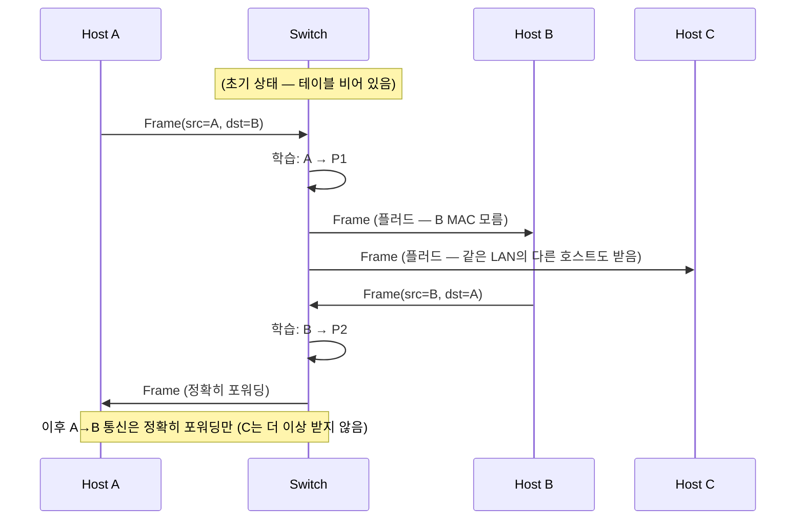
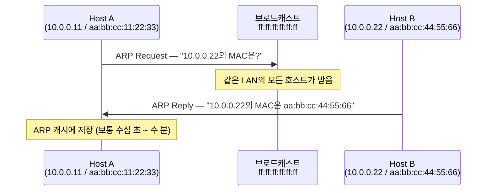

<figure class="post-figure post-figure--header">
<svg role="img" aria-label="같은 LAN 안의 링크 계층 전달을 한 장에 그린 그림. 왼쪽에 두 호스트 Host A와 Host B가 있고 각각 MAC 주소를 가지고 있다. 가운데에는 스위치가 있고, MAC 주소 테이블을 학습해 들어온 프레임의 출발지 MAC을 적어 두며, 목적지 MAC이 테이블에 있으면 해당 포트로만, 없으면 모든 포트로 플러드한다. 오른쪽에는 ARP 요청과 응답이 그려져 있다 — A가 B의 IP에 대한 MAC을 ARP 요청으로 브로드캐스트하고, B가 자신의 MAC을 유니캐스트로 답한다." viewBox="0 0 680 320" xmlns="http://www.w3.org/2000/svg">
  <title>링크 계층 — 같은 LAN에서의 프레임 전달, 스위치의 학습과 ARP</title>
  <defs>
    <marker id="lk-arrow" viewBox="0 0 10 10" refX="8" refY="5" markerWidth="6" markerHeight="6" orient="auto-start-reverse">
      <path d="M0,0 L10,5 L0,10 z" fill="var(--secondary-color)"/>
    </marker>
  </defs>

  <!-- title -->
  <text x="340" y="22" text-anchor="middle" font-size="15" font-weight="800" fill="currentColor" letter-spacing="1.2">링크 계층 — 같은 LAN 안의 전달</text>

  <!-- ===== LEFT: Host A ===== -->
  <g font-size="10" font-weight="700" fill="currentColor" text-anchor="middle">
    <rect x="24" y="58" width="160" height="80" rx="6" fill="var(--bg-light)" stroke="var(--secondary-color)" stroke-width="2.5"/>
    <text x="104" y="78">Host A</text>
    <text x="104" y="96" font-size="8.5" opacity="0.7">10.0.0.11</text>
    <rect x="40" y="104" width="128" height="22" rx="3" fill="var(--bg-panel)" stroke="currentColor" stroke-width="1.4"/>
    <text x="104" y="118" font-size="9">MAC: aa:bb:cc:11:22:33</text>
  </g>

  <!-- ===== CENTER: Switch ===== -->
  <g font-size="10" font-weight="700" fill="currentColor" text-anchor="middle">
    <rect x="260" y="42" width="160" height="180" rx="6" fill="var(--bg-light)" stroke="var(--gold)" stroke-width="2.5"/>
    <text x="340" y="62">Switch</text>
    <rect x="276" y="74" width="128" height="48" rx="3" fill="var(--bg-panel)" stroke="currentColor" stroke-width="1.2"/>
    <text x="340" y="90" font-size="9">MAC 학습 테이블</text>
    <text x="340" y="106" font-size="8" opacity="0.75">aa:bb:cc:11:22:33 → P1</text>
    <text x="340" y="118" font-size="8" opacity="0.75">aa:bb:cc:44:55:66 → P2</text>
    <!-- ports -->
    <rect x="276" y="138" width="20" height="10" fill="currentColor"/>
    <text x="286" y="156" font-size="8">P1</text>
    <rect x="316" y="138" width="20" height="10" fill="currentColor"/>
    <text x="326" y="156" font-size="8">P2</text>
    <rect x="356" y="138" width="20" height="10" fill="currentColor"/>
    <text x="366" y="156" font-size="8">P3</text>
    <rect x="396" y="138" width="20" height="10" fill="currentColor"/>
    <text x="406" y="156" font-size="8">P4</text>
    <text x="340" y="180" font-size="8" opacity="0.7">알면 포워딩, 모르면 플러드</text>
    <text x="340" y="194" font-size="8" opacity="0.7">VLAN으로 논리 분할 가능</text>
  </g>

  <!-- ===== RIGHT: Host B ===== -->
  <g font-size="10" font-weight="700" fill="currentColor" text-anchor="middle">
    <rect x="496" y="58" width="160" height="80" rx="6" fill="var(--bg-light)" stroke="var(--accent-color)" stroke-width="2.5"/>
    <text x="576" y="78">Host B</text>
    <text x="576" y="96" font-size="8.5" opacity="0.7">10.0.0.22</text>
    <rect x="512" y="104" width="128" height="22" rx="3" fill="var(--bg-panel)" stroke="currentColor" stroke-width="1.4"/>
    <text x="576" y="118" font-size="9">MAC: aa:bb:cc:44:55:66</text>
  </g>

  <!-- ===== links ===== -->
  <line x1="184" y1="143" x2="276" y2="143" stroke="var(--secondary-color)" stroke-width="2"/>
  <line x1="416" y1="143" x2="496" y2="143" stroke="var(--secondary-color)" stroke-width="2"/>

  <!-- ARP exchange -->
  <g font-size="8.5" font-weight="700">
    <!-- ARP Request (broadcast) -->
    <line x1="190" y1="232" x2="416" y2="232" stroke="var(--gold)" stroke-width="1.6" stroke-dasharray="4 3" marker-end="url(#lk-arrow)"/>
    <text x="340" y="226" text-anchor="middle" fill="currentColor">ARP Request — "10.0.0.22의 MAC은?" (브로드캐스트)</text>
    <!-- ARP Reply (unicast) -->
    <line x1="416" y1="260" x2="190" y2="260" stroke="var(--accent-color)" stroke-width="1.6" marker-end="url(#lk-arrow)"/>
    <text x="340" y="276" text-anchor="middle" fill="currentColor">ARP Reply — "aa:bb:cc:44:55:66" (유니캐스트)</text>
  </g>

  <!-- legend -->
  <g font-size="8" font-weight="700" fill="currentColor" opacity="0.78">
    <rect x="32" y="298" width="14" height="8" fill="var(--gold)"/><text x="50" y="305">ARP 요청 (브로드캐스트)</text>
    <rect x="240" y="298" width="14" height="8" fill="var(--accent-color)"/><text x="258" y="305">ARP 응답 (유니캐스트)</text>
    <rect x="430" y="298" width="14" height="8" fill="var(--secondary-color)"/><text x="448" y="305">데이터 프레임</text>
  </g>
</svg>
<figcaption>링크 계층의 일상 — 호스트들은 MAC 주소로 식별되고, 스위치는 MAC 학습 테이블을 채우며 목적지를 찾고, ARP는 "IP → MAC" 다리를 놓는다. VLAN은 하나의 물리 스위치를 여러 논리 네트워크로 쪼갠다.</figcaption>
</figure>

## 들어가며

이 글은 `Network-Essential` 시리즈의 **2단계**입니다. 전체 흐름은 [Network Essential Curriculum](/2026/07/29/network-essential-curriculum.html)에서 확인하고, 직전 단계 [계층 모델 (OSI 7계층 · TCP/IP 4계층 · 캡슐화)](/2026/07/29/network-layered-models.html)을 먼저 읽으면 좋습니다.

1단계에서 우리는 캡슐화의 큰 그림을 봤습니다. 그 그림의 **맨 아래** — 프레임이 만들어지고 같은 네트워크 안에서 상대 호스트에 도달하기까지의 영역 — 가 이번 단계의 무대입니다. "내 컴퓨터에서 같은 LAN의 다른 컴퓨터로 패킷이 도달하는 과정"이 어떻게 동작하는지를 MAC, Ethernet, 스위치, ARP의 순서로 쌓아 올립니다. 3단계에서 다룰 IP·라우팅은 **네트워크 사이**의 전달이고, 이 단계는 **같은 네트워크 안**의 전달입니다.

<div class="post-summary-box" markdown="1">

### 📌 이 글에서 다루는 내용

#### 🔍 핵심 주제

- **MAC 주소와 Ethernet 프레임**: L2 주소 체계, 프레임 구조, 유니캐스트/브로드캐스트/멀티캐스트
- **스위칭**: MAC 학습·포워딩, 충돌 도메인 vs 브로드캐스트 도메인, VLAN의 의미
- **ARP**: IP↔MAC 해석, ARP 캐시와 Proxy ARP, ARP 스푸핑의 위험

</div>

## 1. MAC 주소와 Ethernet 프레임

### 1.1 MAC 주소 — L2의 하드웨어 주소

**MAC(Media Access Control) 주소**는 네트워크 인터페이스 카드(NIC)에 출고 시 부여되는 48비트(6바이트) 주소입니다. 일반적으로 앞 24비트는 **OUI(Organizationally Unique Identifier, 제조사 식별자)**, 뒤 24비트는 제조사가 부여하는 일련번호입니다.

<figure class="post-figure">
<svg role="img" aria-label="MAC 주소 aa:bb:cc:11:22:33을 여섯 개의 16진수 옥텟 상자로 나눈 그림. 앞의 세 옥텟 aa, bb, cc는 OUI(제조사 식별자, 24비트)로 묶이고, 뒤의 세 옥텟 11, 22, 33은 제조사가 부여하는 일련번호(24비트)로 묶인다. 각 묶음 아래에 중괄호 모양의 표시와 설명 라벨이 있다." viewBox="0 0 640 200" xmlns="http://www.w3.org/2000/svg">
  <title>MAC 주소의 구조 — OUI(24bit) + 일련번호(24bit)</title>

  <text x="320" y="26" text-anchor="middle" font-size="14" font-weight="800" fill="currentColor" letter-spacing="0.8">MAC 주소 = 48bit = OUI(24bit) + 일련번호(24bit)</text>

  <!-- octet boxes -->
  <g font-size="18" font-weight="800" text-anchor="middle" font-family="monospace">
    <!-- OUI group: aa bb cc -->
    <rect x="103" y="56" width="64" height="46" rx="5" fill="var(--bg-light)" stroke="var(--accent-color)" stroke-width="2.5"/>
    <text x="135" y="86" fill="currentColor">aa</text>
    <rect x="177" y="56" width="64" height="46" rx="5" fill="var(--bg-light)" stroke="var(--accent-color)" stroke-width="2.5"/>
    <text x="209" y="86" fill="currentColor">bb</text>
    <rect x="251" y="56" width="64" height="46" rx="5" fill="var(--bg-light)" stroke="var(--accent-color)" stroke-width="2.5"/>
    <text x="283" y="86" fill="currentColor">cc</text>
    <!-- serial group: 11 22 33 -->
    <rect x="325" y="56" width="64" height="46" rx="5" fill="var(--bg-light)" stroke="var(--secondary-color)" stroke-width="2.5"/>
    <text x="357" y="86" fill="currentColor">11</text>
    <rect x="399" y="56" width="64" height="46" rx="5" fill="var(--bg-light)" stroke="var(--secondary-color)" stroke-width="2.5"/>
    <text x="431" y="86" fill="currentColor">22</text>
    <rect x="473" y="56" width="64" height="46" rx="5" fill="var(--bg-light)" stroke="var(--secondary-color)" stroke-width="2.5"/>
    <text x="505" y="86" fill="currentColor">33</text>
  </g>

  <!-- colons -->
  <g font-size="18" font-weight="800" text-anchor="middle" fill="currentColor" opacity="0.6" font-family="monospace">
    <text x="172" y="84">:</text>
    <text x="246" y="84">:</text>
    <text x="320" y="84">:</text>
    <text x="394" y="84">:</text>
    <text x="468" y="84">:</text>
  </g>

  <!-- braces -->
  <path d="M103,114 L103,122 L205,122 L209,130 L213,122 L315,122 L315,114" fill="none" stroke="var(--accent-color)" stroke-width="2"/>
  <path d="M325,114 L325,122 L427,122 L431,130 L435,122 L537,122 L537,114" fill="none" stroke="var(--secondary-color)" stroke-width="2"/>

  <!-- labels -->
  <g text-anchor="middle" fill="currentColor">
    <text x="209" y="152" font-size="13" font-weight="800">OUI</text>
    <text x="209" y="170" font-size="10.5" opacity="0.75">제조사 식별자 · 24bit</text>
    <text x="431" y="152" font-size="13" font-weight="800">일련번호</text>
    <text x="431" y="170" font-size="10.5" opacity="0.75">제조사 부여 · 24bit</text>
  </g>
</svg>
<figcaption>48비트 MAC 주소는 앞 24비트 OUI(제조사 식별자)와 뒤 24비트 일련번호로 나뉜다.</figcaption>
</figure>

MAC 주소의 몇 가지 성질은 직관과 다릅니다.

- **전 세계 유일하지 않다**: 가상 NIC, 컨테이너, 클라우드 환경에서는 충돌이 충분히 가능합니다. 다만 *같은 LAN*에서 충돌이 있으면 통신이 깨지므로 같은 브로드캐스트 도메인 안에서는 유일해야 합니다.
- **호스트의 식별자가 아니다**: NIC의 식별자입니다. 한 호스트가 NIC 여러 개(예: eth0 + wlan0)를 가지면 MAC도 여러 개입니다. 반대로 같은 NIC를 가상화해 여러 MAC을 부여하는 것도 흔합니다.
- **변할 수 있다**: `ip link set dev eth0 address ...` (Linux), NIC 변경, 컨테이너 마이그레이션 등으로 언제든 바뀝니다.

MAC 주소는 **같은 링크 안에서의 다음 홉 식별자**이지, 종단 간 통신의 최종 식별자가 아닙니다. 종단 간 주소는 IP가 담당합니다.

### 1.2 MAC 주소의 세 가지 전송 모드

| 모드 | 표현 | 동작 |
| --- | --- | --- |
| **유니캐스트(Unicast)** | 첫 옥텟의 최하위 비트가 0 | 정확히 한 NIC에만 도달하도록 설계된 주소 |
| **브로드캐스트(Broadcast)** | `ff:ff:ff:ff:ff:ff` | 같은 LAN의 모든 NIC가 수신 |
| **멀티캐스트(Multicast)** | 첫 옥텟의 최하위 비트가 1 | 가입된 NIC 그룹이 수신 (예: IPv4 멀티캐스트 `01:00:5e:00:00:00` ~ `01:00:5e:7f:ff:ff`) |

브로드캐스트는 "모두에게 보내는" 트래픽이므로 **브로드캐스트 도메인**(브로드캐스트가 도달하는 범위)이 넓으면 모든 호스트가 매번 깨어나 처리해야 합니다. 이 사실이 뒤에서 다룰 **VLAN**과 **서브넷 크기 결정**의 근거가 됩니다.

### 1.3 Ethernet 프레임의 구조

오늘날 LAN의 사실상 표준인 **Ethernet II 프레임** 구조입니다.

```text
 0                   1                   2                   3
 0 1 2 3 4 5 6 7 8 9 0 1 2 3 4 5 6 7 8 9 0 1 2 3 4 5 6 7 8 9 0 1
+-+-+-+-+-+-+-+-+-+-+-+-+-+-+-+-+-+-+-+-+-+-+-+-+-+-+-+-+-+-+-+-+
|                    목적지 MAC (6 octets)                      |
+                               +-+-+-+-+-+-+-+-+-+-+-+-+-+-+-+-+
|                               |     출발지 MAC (6 octets)     |
+-+-+-+-+-+-+-+-+-+-+-+-+-+-+-+-+ +-+-+-+-+-+-+-+-+-+-+-+-+-+-+-+
| EtherType            |  데이터 (46 ~ 1500 bytes)               |
+-+-+-+-+-+-+-+-+-+-+-+-+-+-+-+-+-+-+-+-+-+-+-+-+-+-+-+-+-+-+-+-+
| FCS (4 octets) — CRC32 오류 검출                              |
+-+-+-+-+-+-+-+-+-+-+-+-+-+-+-+-+-+-+-+-+-+-+-+-+-+-+-+-+-+-+-+-+
```

| 필드 | 길이 | 의미 |
| --- | --- | --- |
| 목적지 MAC | 6B | 프레임을 받을 NIC |
| 출발지 MAC | 6B | 프레임을 보낸 NIC |
| EtherType | 2B | 상위 프로토콜 식별 (`0x0800`=IPv4, `0x86DD`=IPv6, `0x0806`=ARP) |
| 데이터 | 46~1500B | 상위 계층의 PDU(보통 IP 패킷) |
| FCS | 4B | CRC32로 프레임 무결성 검증 |

**EtherType**이 핵심입니다. 이 2바이트가 같은 링크 위에서 IPv4와 ARP가 공존할 수 있게 합니다. 수신 측은 이 값을 보고 IP 패킷은 IP 스택으로, ARP는 ARP 처리기로, IPv6는 IPv6 스택으로 라우팅합니다.

프레임의 **최소 크기는 64바이트**(헤더 14 + 데이터 46 + FCS 4)입니다. 데이터가 46바이트보다 짧으면 *패딩*으로 채웁니다. 이 제약은 옛날 공유 매체(10BASE5, 10BASE2)에서 **충돌 감지**가 신뢰성 있게 동작하도록 보장하기 위한 것이지만, 현대에도 일부 코드가 이 최소 크기를 가정한 경우가 있어 알아두면 좋습니다.

## 2. 스위칭 — MAC 학습·포워딩·VLAN

옛 LAN에서는 모든 호스트가 하나의 동축 케이블이나 허브에 연결되어 **충돌 도메인**을 공유했습니다. 이 구조에서는 두 호스트가 동시에 보내면 충돌이 나서 둘 다 재전송해야 합니다 — 처리량이 동시에 늘지 않습니다.

**스위치(Switch)** 는 이 문제를 MAC 주소를 학습해 들어온 프레임을 *목적지 포트로만* 보내는 방식으로 해결합니다. 모든 포트가 별도의 충돌 도메인이 되므로 **전이중(full-duplex)** 통신이 가능해집니다.

### 2.1 MAC 학습과 포워딩 테이블

스위치는 단순한 규칙 두 개로 동작합니다.

1. **학습**: 프레임이 포트 P로 들어왔다면 *출발지 MAC → P*를 메모한다.
2. **포워딩**: 목적지 MAC이 테이블에 있으면 그 포트로만 보낸다. 없으면 *모든 포트로 플러드*(flood)한다.



이 단순한 알고리즘이 현대 LAN의 전부입니다. 단, **테이블이 비어 있는 직후의 첫 프레임, 목적지 MAC이 모르는 프레임, 브로드캐스트는 모든 포트로 흘러야 한다**는 점이 운영 함정이 됩니다 — 이를 **스톰(storm)** 이라 부르며, STP(스패닝 트리)나 포트 보안이 이를 다스립니다.

### 2.2 충돌 도메인 vs 브로드캐스트 도메인

개념을 분리해 두는 것이 중요합니다.

| 개념 | 정의 | 스위치의 영향 | 영향 |
| --- | --- | --- | --- |
| **충돌 도메인** | 같은 매체에서 두 신호가 부딪힐 수 있는 범위 | 스위치는 포트별로 분리 | 포트 수가 곧 충돌 도메인 수 |
| **브로드캐스트 도메인** | 브로드캐스트 프레임이 도달하는 범위 | 스위치는 통과시킴 | **VLAN / 라우터**로만 분리 가능 |

스위치는 충돌 도메인은 쪼개지만 브로드캐스트 도메인은 쪼개지 않습니다. 같은 VLAN의 모든 호스트는 여전히 서로의 ARP 브로드캐스트를 받습니다. **브로드캐스트 도메인을 쪼개려면 라우터 또는 VLAN(L3 인터페이스)** 이 필요합니다.

### 2.3 VLAN — 하나의 스위치를 여러 LAN처럼

**VLAN(Virtual LAN)** 은 하나의 물리 스위치를 **논리적으로 여러 스위치처럼** 보이게 합니다. 각 VLAN은 별도의 브로드캐스트 도메인입니다. 포트에 VLAN 태그(`802.1Q`)를 붙여 VLAN을 식별하고, 같은 VLAN에 속한 포트들끼리만 프레임을 교환합니다.

<figure class="post-figure">
<svg role="img" aria-label="하나의 물리 스위치가 세 개의 VLAN으로 논리 분할된 그림. VLAN 10 Engineering은 포트 1-2와 192.168.10.0/24, VLAN 20 Sales는 포트 3-4와 192.168.20.0/24, VLAN 30 Guest Wi-Fi는 포트 5와 192.168.30.0/24를 쓴다. 각 VLAN은 서로 다른 색으로 구분된 독립 브로드캐스트 도메인이다. 스위치 아래로 trunk(802.1Q) 링크가 라우터 또는 L3 스위치로 연결되며, VLAN 간 통신은 이 라우터를 거쳐야 한다." viewBox="0 0 640 360" xmlns="http://www.w3.org/2000/svg">
  <title>VLAN — 하나의 물리 스위치를 세 개의 독립 브로드캐스트 도메인으로 분할</title>
  <defs>
    <marker id="vl-arrow" viewBox="0 0 10 10" refX="8" refY="5" markerWidth="6" markerHeight="6" orient="auto-start-reverse">
      <path d="M0,0 L10,5 L0,10 z" fill="var(--gold)"/>
    </marker>
  </defs>

  <!-- Switch outer box -->
  <rect x="70" y="40" width="500" height="190" rx="8" fill="var(--bg-panel)" stroke="var(--gold)" stroke-width="2.5"/>
  <text x="320" y="63" text-anchor="middle" font-size="14" font-weight="800" fill="currentColor">Switch (물리 1대) — 각 VLAN = 독립 브로드캐스트 도메인</text>

  <!-- VLAN 10 -->
  <rect x="90" y="76" width="460" height="40" rx="5" fill="var(--bg-light)" stroke="var(--accent-color)" stroke-width="2.5"/>
  <rect x="90" y="76" width="8" height="40" rx="2" fill="var(--accent-color)"/>
  <g font-weight="700" fill="currentColor">
    <text x="112" y="101" font-size="12.5" font-weight="800">VLAN 10 · Engineering</text>
    <text x="360" y="101" font-size="11" opacity="0.85">Port 1–2</text>
    <text x="536" y="101" font-size="11" text-anchor="end" font-family="monospace">192.168.10.0/24</text>
  </g>

  <!-- VLAN 20 -->
  <rect x="90" y="124" width="460" height="40" rx="5" fill="var(--bg-light)" stroke="var(--secondary-color)" stroke-width="2.5"/>
  <rect x="90" y="124" width="8" height="40" rx="2" fill="var(--secondary-color)"/>
  <g font-weight="700" fill="currentColor">
    <text x="112" y="149" font-size="12.5" font-weight="800">VLAN 20 · Sales</text>
    <text x="360" y="149" font-size="11" opacity="0.85">Port 3–4</text>
    <text x="536" y="149" font-size="11" text-anchor="end" font-family="monospace">192.168.20.0/24</text>
  </g>

  <!-- VLAN 30 -->
  <rect x="90" y="172" width="460" height="40" rx="5" fill="var(--bg-light)" stroke="var(--gold)" stroke-width="2.5"/>
  <rect x="90" y="172" width="8" height="40" rx="2" fill="var(--gold)"/>
  <g font-weight="700" fill="currentColor">
    <text x="112" y="197" font-size="12.5" font-weight="800">VLAN 30 · Guest Wi-Fi</text>
    <text x="360" y="197" font-size="11" opacity="0.85">Port 5</text>
    <text x="536" y="197" font-size="11" text-anchor="end" font-family="monospace">192.168.30.0/24</text>
  </g>

  <!-- trunk link -->
  <line x1="320" y1="230" x2="320" y2="288" stroke="var(--gold)" stroke-width="2.5" stroke-dasharray="6 4" marker-start="url(#vl-arrow)" marker-end="url(#vl-arrow)"/>
  <text x="336" y="256" font-size="11.5" font-weight="800" fill="currentColor">trunk (802.1Q)</text>
  <text x="336" y="272" font-size="9.5" fill="currentColor" opacity="0.7">VLAN 태그로 여러 VLAN을 한 링크로</text>

  <!-- Router box -->
  <rect x="180" y="288" width="280" height="52" rx="8" fill="var(--bg-light)" stroke="var(--secondary-color)" stroke-width="2.5"/>
  <text x="320" y="312" text-anchor="middle" font-size="13" font-weight="800" fill="currentColor">Router / L3 Switch</text>
  <text x="320" y="330" text-anchor="middle" font-size="9.5" fill="currentColor" opacity="0.7">VLAN 간 라우팅 · 보안 경계</text>
</svg>
<figcaption>하나의 물리 스위치를 세 VLAN으로 논리 분할 — 각 VLAN은 독립 브로드캐스트 도메인이며, VLAN 간 통신은 trunk(802.1Q)로 연결된 라우터/L3 스위치를 거쳐야 한다.</figcaption>
</figure>

VLAN 간 라우팅이 필요하면 L3 스위치 또는 라우터가 있어야 합니다. **VLAN = 서브넷**으로 묶어 L3 인터페이스를 부여하는 것이 일반적이며, 이렇게 되면 VLAN은 단순한 트래픽 분리가 아니라 **보안 경계**(Guest VLAN은 사내망 자원에 접근 불가)의 역할도 합니다.

## 3. ARP — IP를 MAC으로 잇는 다리

### 3.1 왜 ARP가 필요한가

호스트가 IP `10.0.0.22`로 패킷을 보내려면, 같은 링크 안에서는 *목적지 MAC*을 채워야 프레임을 만들 수 있습니다. IP는 라우팅을 위한 종단 주소이고, MAC은 *다음 홉*의 링크 주소입니다. **IP → MAC** 변환이 필요하고, 그 일을 하는 프로토콜이 **ARP(Address Resolution Protocol)** 입니다.

### 3.2 ARP 요청과 응답



ARP 요청은 **브로드캐스트**(`ff:ff:ff:ff:ff:ff`)로 같은 LAN의 모든 호스트에게 *"이 IP의 MAC은 누구인가"*를 묻습니다. 해당 IP의 호스트만 응답하고, 응답은 **유니캐스트**로 요청자에게 직접 옵니다.

### 3.3 게이트웨이로 나가기 — 게이트웨이의 MAC

같은 LAN이 아닌 목적지로 보낼 때는 어떻게 될까요. 호스트는 먼저 *목적지 IP가 같은 서브넷인가*를 확인하고, **같지 않으면 게이트웨이로 보냅니다.** 그래서 패킷을 만들기 위해 **게이트웨이의 MAC**이 필요하고, 이때도 ARP가 사용됩니다.

```text
# Linux: 라우팅 테이블과 ARP 캐시를 동시에 본다
$ ip route
default via 10.0.0.1 dev eth0     ← 기본 게이트웨이
10.0.0.0/24 dev eth0 scope link  ← 같은 서브넷은 직접

$ ip neigh show dev eth0
10.0.0.1 lladdr aa:bb:cc:00:11:22 REACHABLE     ← 게이트웨이의 MAC
10.0.0.22 lladdr aa:bb:cc:44:55:66 REACHABLE    ← 같은 LAN 호스트의 MAC
```

ARP 캐시 상태(`REACHABLE`, `STALE`, `DELAY`, `PROBE` 등)는 RFC 826의 단순 응답에서 출발해 RFC 7048/4861로 진화한 **NUD(Neighbor Unreachability Detection)** 의 상태입니다. 한 번 쓰고 잊어버리는 게 아니라 *살아 있는지*를 적극적으로 확인합니다.

### 3.4 ARP 스푸핑과 방어

ARP에는 인증 메커니즘이 없습니다. *"이 IP의 MAC은 X"* 라는 응답을 *누구나* 보낼 수 있습니다. 이를 악용한 것이 **ARP 스푸핑(ARP poisoning)** 입니다.

```text
공격자 → A에게: "10.0.0.22의 MAC은 내 MAC"
공격자 → B에게: "10.0.0.11의 MAC은 내 MAC"
→ A와 B 사이의 트래픽이 공격자를 거치게 됨 (MITM)
```

방어 방법:

- **Static ARP entry** (소규모, 정적 인프라에 한해)
- **DAI(Dynamic ARP Inspection)** — 스위치에서 ARP 패킷의 IP↔MAC 바인딩을 DHCP snooping 테이블과 대조
- **802.1X + 포트 보안** — 인증되지 않은 MAC 차단
- **VPN / TLS** — L2가 신뢰할 수 없어도 L7 암호화로 데이터를 보호

마지막 항목이 핵심입니다. ARP 스푸핑은 L2의 신뢰 가정(같은 LAN = 안전)을 무너뜨리지만, 그 위에서 TLS·VPN·SSH로 데이터를 암호화해 두면 평문 노출을 막을 수 있습니다. 이 인식이 6단계 보안 학습의 토대가 됩니다.

### 3.5 ARP를 Python으로 들여다보기

`scapy` 없이 표준 라이브러리만으로 우리 호스트의 ARP 캐시와 라우팅 테이블을 읽을 수 있습니다.

```python
import socket
import subprocess

# 우리 호스트의 IP
host_ip = socket.gethostbyname(socket.gethostname())
print(f"로컬 IP: {host_ip}")

# 게이트웨이는 /proc/net/route의 'default' 행에서 찾는다
with open("/proc/net/route") as f:
    for line in f.readlines()[1:]:
        fields = line.split()
        if fields[0] == "00000000":  # default
            gw_hex = fields[2]
            gw_ip = socket.inet_ntoa(bytes.fromhex(gw_hex)[::-1])
            print(f"기본 게이트웨이: {gw_ip}")
            break

# ARP 캐시 — ip 명령의 출력에서 'lladdr'가 붙은 줄만 본다
arp = subprocess.run(["ip", "neigh"], capture_output=True, text=True).stdout
reachable = [l for l in arp.splitlines() if "REACHABLE" in l]
print(f"REACHABLE 이웃 {len(reachable)}개:")
for line in reachable:
    print(f"  {line}")
```

출력 예시는 다음과 비슷합니다.

```text
로컬 IP: 10.0.0.11
기본 게이트웨이: 10.0.0.1
REACHABLE 이웃 4개:
  10.0.0.1 lladdr aa:bb:cc:00:11:22 dev eth0 REACHABLE
  10.0.0.22 lladdr aa:bb:cc:44:55:66 dev eth0 REACHABLE
  ...
```

이 코드 한 조각이 3장에서 다룰 **IP·라우팅**으로 자연스럽게 이어집니다. 다음 단계에서 우리는 게이트웨이를 *넘어* 목적지까지 가는 법을 배웁니다.

## 4. 실전 운영 노트

### 4.1 브로드캐스트 도메인 크기를 의식하라

브로드캐스트는 모든 호스트가 처리해야 합니다. ARP 요청, DHCP discover, IPv6 NDP 등 많은 프로토콜이 브로드캐스트에 의존합니다. `/24`(254 호스트)보다 큰 서브넷은 종종 운영 악몽이 됩니다 — DHCP 갱신 트래픽이 평일 아침마다 폭증하고, ARP 테이블이 비대해집니다. **클라우드 서브넷은 보통 `/24` 이하**로 권장됩니다.

### 4.2 Jumbo Frame은 신중하게

이더넷 표준의 MTU는 1500바이트이지만, 데이터센터 백엔드에서는 9000바이트의 **점보 프레임**을 사용하기도 합니다. 처리량은 좋아지지만, 스위치와 NIC가 모두 점보를 지원해야 하고, 라우터·VPN 터널을 거치면서 단편화가 발생할 수 있습니다. **혼합 환경에서는 점보를 끄거나 MTU를 통일하는 편이 안전합니다.**

### 4.3 L2 루프와 STP

스위치 사이의 *물리적 중복 링크*는 신뢰성을 높이지만 **루프**를 만들 수 있습니다. 브로드캐스트가 무한히 도는 루프는 한 번 시작되면 LAN 전체를 멎게 합니다. **STP(Spanning Tree Protocol)** 가 이 루프를 막아 *논리적 트리*를 유지합니다. 별도 설정 없이도 대부분 스위치는 STP/RSTP가 기본 켜져 있지만, *비활성화한 경우*나 *특정 포트에서 BPDU가 차단된 경우* 문제가 됩니다.

## 마무리

링크 계층은 **같은 LAN 안에서의 전달**을 책임집니다. MAC 주소가 그 주체이고, Ethernet 프레임이 그 운반 도구이며, 스위치가 그 안내자, ARP가 *IP → MAC* 다리입니다. 이 모든 것이 *신뢰할 수 있는 같은 네트워크*를 전제로 합니다. 그 신뢰가 깨지는 지점이 ARP 스푸핑 같은 보안 이슈이며, 그래서 6단계에서 다시 만납니다.

다음 단계에서는 이 링크를 *넘어* 목적지 IP까지 패킷을 전달하는 **네트워크 계층(IP·라우팅)** 으로 올라갑니다. IP 주소 체계, 서브네팅, 라우팅 테이블, NAT, ICMP — "내 컴퓨터가 8.8.8.8에 도달하는 길"이 어떻게 만들어지는지를 다룹니다.

### 다음 학습

- [Network Essential Curriculum](/2026/07/29/network-essential-curriculum.html) — 시리즈 전체 지도와 진행률
- 직전: [계층 모델 (OSI 7계층 · TCP/IP 4계층 · 캡슐화)](/2026/07/29/network-layered-models.html) — 캡슐화의 큰 지도 다시 보기
- 다음: [네트워크 계층 (IP · 서브네팅 · 라우팅 · NAT · ICMP)](/2026/07/29/network-ip-and-routing.html) — 네트워크 사이의 전달
- [PostgreSQL Architecture Deep Dive](/2025/12/06/postgresql-architecture-deep-dive.html) — 네트워크 위에서 동작하는 DB의 연결·프로토콜 관점 참고
