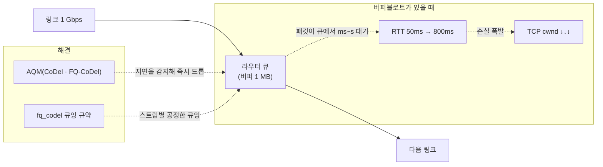
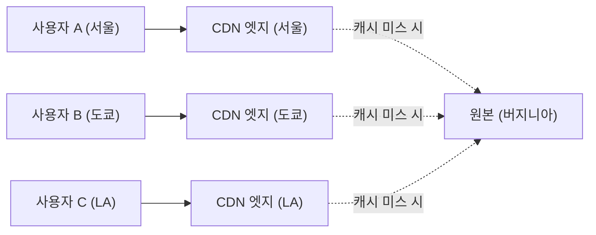
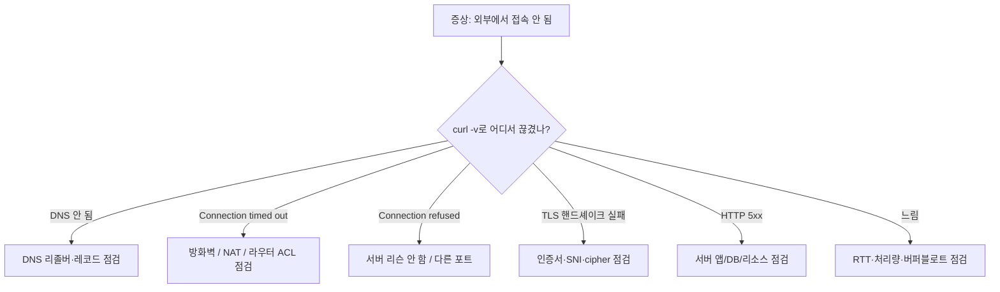

<figure class="post-figure post-figure--header">
<svg role="img" aria-label="성능·운영·트러블슈팅의 네 축을 한 장에 그린 그림. 왼쪽 위는 지연 vs 대역폭 — 빛의 속도, 처리 지연, 큐잉 지연, 직렬화 지연이 막대그래프로 그려져 있고 한 차트로 작은 파일의 지배 요인이 지연이고 큰 파일은 대역폭이라는 사실이 표현된다. 왼쪽 아래는 버퍼블로트 — 라우터의 큰 버퍼가 패킷을 대기시켜 RTT가 늘어나고 마지막에야 손실로 폭발하는 모습. 오른쪽 위는 패킷 분석 — 패킷이 계층별로 캡슐화된 모양을 tcpdump·Wireshark가 읽어내는 모습. 오른쪽 아래는 관측과 CDN — 클라이언트 가까이에 콘텐츠를 두는 엣지 노드, 캐시 적중과 원본 백엔드의 흐름, 그리고 네트워크 지표를 측정하는 에이전트가 그려져 있다." viewBox="0 0 680 360" xmlns="http://www.w3.org/2000/svg">
  <title>성능·운영·트러블슈팅 — 지연·대역폭, 패킷 분석, CDN, 관측의 네 축</title>
  <defs>
    <marker id="op-arrow" viewBox="0 0 10 10" refX="8" refY="5" markerWidth="6" markerHeight="6" orient="auto-start-reverse">
      <path d="M0,0 L10,5 L0,10 z" fill="var(--secondary-color)"/>
    </marker>
  </defs>

  <!-- title -->
  <text x="340" y="22" text-anchor="middle" font-size="15" font-weight="800" fill="currentColor" letter-spacing="1.2">성능·운영·트러블슈팅 — 현장의 네 눈</text>

  <!-- ===== Top-left: Latency vs Bandwidth ===== -->
  <g font-size="10" font-weight="700" fill="currentColor" text-anchor="middle">
    <rect x="20" y="48" width="312" height="120" rx="6" fill="var(--bg-light)" stroke="var(--secondary-color)" stroke-width="2.5"/>
    <text x="176" y="68">지연(latency) vs 대역폭(bandwidth)</text>
    <line x1="50" y1="140" x2="302" y2="140" stroke="currentColor" stroke-width="1.4" opacity="0.5"/>
    <line x1="50" y1="80"  x2="50"  y2="140" stroke="currentColor" stroke-width="1.4" opacity="0.5"/>
    <text x="48" y="78" text-anchor="end" font-size="8" opacity="0.7">시간</text>
    <text x="304" y="142" text-anchor="end" font-size="8" opacity="0.7">전송</text>
    <!-- components stacked bars -->
    <rect x="64"  y="128" width="22" height="12" fill="var(--accent-color)"/>
    <rect x="64"  y="116" width="22" height="12" fill="var(--gold)"/>
    <rect x="64"  y="104" width="22" height="12" fill="var(--secondary-color)"/>
    <rect x="64"  y="92"  width="22" height="12" fill="var(--bg-panel)" stroke="currentColor"/>
    <text x="76" y="148" font-size="8">작은 파일</text>

    <rect x="120" y="128" width="22" height="12" fill="var(--accent-color)"/>
    <rect x="120" y="116" width="22" height="12" fill="var(--gold)"/>
    <rect x="120" y="104" width="22" height="12" fill="var(--secondary-color)"/>
    <rect x="120" y="92"  width="200" height="12" fill="var(--bg-panel)" stroke="currentColor"/>
    <text x="132" y="148" font-size="8">큰 파일</text>

    <text x="230" y="78" font-size="8.5" opacity="0.78">작은 객체 → *지연*이 지배</text>
    <text x="230" y="92" font-size="8.5" opacity="0.78">큰 객체 → *대역폭*이 지배</text>
    <text x="230" y="106" font-size="8.5" opacity="0.78">웹 페이지 → 둘 다 중요</text>
    <text x="230" y="120" font-size="8.5" opacity="0.78">RTT는 *고정 비용*</text>
  </g>

  <!-- ===== Top-right: Packet analysis ===== -->
  <g font-size="10" font-weight="700" fill="currentColor" text-anchor="middle">
    <rect x="352" y="48" width="308" height="120" rx="6" fill="var(--bg-light)" stroke="var(--accent-color)" stroke-width="2.5"/>
    <text x="506" y="68">패킷 분석 — tcpdump · Wireshark</text>
    <text x="506" y="86" font-size="8.5" opacity="0.78">tcpdump -i eth0 -w cap.pcap port 443</text>
    <text x="506" y="100" font-size="8.5" opacity="0.78">Wireshark에서 캡슐화 단위로 뜯어 읽기</text>
    <text x="506" y="114" font-size="8.5" opacity="0.78">TCP Stream Graph로 RTT·윈도 변화 보기</text>
    <text x="506" y="128" font-size="8.5" opacity="0.78">재전송·중복 ACK 패턴이 보이면 혼잡</text>
    <text x="506" y="142" font-size="8.5" opacity="0.78">DNS / TLS / HTTP 분리해 트러블슈팅</text>
  </g>

  <!-- ===== Bottom-left: Bufferbloat ===== -->
  <g font-size="10" font-weight="700" fill="currentColor" text-anchor="middle">
    <rect x="20" y="184" width="312" height="146" rx="6" fill="var(--bg-light)" stroke="var(--gold)" stroke-width="2.5"/>
    <text x="176" y="204">버퍼블로트 — 큰 버퍼가 만드는 느림</text>
    <text x="176" y="222" font-size="8.5" opacity="0.78">라우터의 큰 큐가 패킷을 *오래* 대기시킴</text>
    <text x="176" y="238" font-size="8.5" opacity="0.78">RTT가 수십 배로 늘어나고 마지막에 손실 폭발</text>
    <text x="176" y="254" font-size="8.5" opacity="0.78">혼잡 신호가 *지연* 안에 묻혀버림</text>
    <text x="176" y="272" font-size="8.5" opacity="0.78">해결: 적정 버퍼 + AQM(CoDel·FQ-CoDel)</text>
    <text x="176" y="288" font-size="8.5" opacity="0.78">BQ(fq_codel) Linux 기본 큐잉 규약</text>
    <text x="176" y="304" font-size="8.5" opacity="0.78">VoIP·게임·SSH가 *먼저* 망가짐</text>
  </g>

  <!-- ===== Bottom-right: CDN + Observability ===== -->
  <g font-size="10" font-weight="700" fill="currentColor" text-anchor="middle">
    <rect x="352" y="184" width="308" height="146" rx="6" fill="var(--bg-light)" stroke="var(--secondary-color)" stroke-width="2.5"/>
    <text x="506" y="204">CDN · 캐싱 · 관측</text>
    <text x="506" y="222" font-size="8.5" opacity="0.78">엣지 노드로 RTT ↓, 원본 부하 ↓</text>
    <text x="506" y="238" font-size="8.5" opacity="0.78">Cache-Control · Vary · purge 정책</text>
    <text x="506" y="254" font-size="8.5" opacity="0.78">관측 지표: RTT · 재전송률 · 손실률</text>
    <text x="506" y="270" font-size="8.5" opacity="0.78">도구: smokeping · iperf · MTR · NetFlow</text>
    <text x="506" y="286" font-size="8.5" opacity="0.78">eBPF 기반 가시성(cilium, bpftrace)</text>
    <text x="506" y="302" font-size="8.5" opacity="0.78">"어느 계층에서 느려졌는가"를 묻는 안목</text>
  </g>

  <!-- ===== Bottom center: timeline ===== -->
  <text x="340" y="350" text-anchor="middle" font-size="10" font-weight="800" fill="var(--gold)">현장 한 줄 — "느려졌다"를 *측정*하고, *계층*으로 가르고, *원인*에 다가간다.</text>
</svg>
<figcaption>성능·운영·트러블슈팅의 네 축 — 지연·대역폭, 버퍼블로트, 패킷 분석, CDN·관측. 이 네 시선이 합쳐지면 *"어디서, 왜, 얼마나 느려졌는가"* 를 묻는 현장의 눈이 됩니다.</figcaption>
</figure>

## 들어가며

이 글은 `Network-Essential` 시리즈의 **7단계(마지막)**입니다. 전체 흐름은 [Network Essential Curriculum](/2026/07/29/network-essential-curriculum.html)에서 확인하고, 직전 단계 [네트워크 보안 (TLS · 방화벽 · VPN · 위협 모델)](/2026/07/29/network-security-tls.html)을 먼저 읽으면 좋습니다.

1~6단계에서 우리는 *프로토콜이 어떻게 동작하는지*를 배웠습니다. 마지막 단계는 그 모든 것을 **현장에서 따져 묻고 고치는** 안목을 키웁니다. *"API가 느려졌다"*는 한 줄짜리 보고가 들어왔을 때, *어느 계층의 문제*이고, *어느 지표가* 움직였고, *어떤 도구로* 확인해야 하는지를 결정하는 능력 — 이 능력이 이 단계의 목표입니다.

이 단계가 끝나면 *RTT와 대역폭을 구분해 사고하고*, *버퍼블로트가 무엇인지 알고*, *tcpdump·Wireshark로 패킷을 읽고*, *CDN·캐싱으로 지연을 줄이고*, *관측 지표와 도구로 운영 환경의 건강을 측정*할 수 있게 됩니다. 이 모든 능력이 합쳐져 이 시리즈가 완성됩니다.

<div class="post-summary-box" markdown="1">

### 📌 이 글에서 다루는 내용

#### 🔍 핵심 주제

- **지연 vs 대역폭**: RTT·처리량·버퍼블로트가 체감 성능을 가르는 법
- **패킷 분석**: tcpdump·Wireshark로 계층별 흐름 읽기, 재전송·핸드셰이크 관찰
- **CDN·캐싱·관측**: 엣지 캐시로 지연 줄이기, 네트워크 지표와 트러블슈팅 도구

</div>

## 1. 지연 vs 대역폭 — 성능을 좌우하는 두 축

### 1.1 두 축을 분리해 사고하기

성능은 *두 축*으로만 이해해도 절반은 잡힙니다.

- **지연(latency)** — 한 비트(또는 한 패킷)가 *도달하는 데 걸리는 시간*. 보통 ms 단위.
- **대역폭(bandwidth)** — 단위 시간에 *얼마나 많은 데이터를 실을 수 있는지*. 보통 Mbps·Gbps.

둘은 **직교**합니다 — *지연이 낮은데 대역폭이 작을 수도* 있고, *대역폭이 큰데 지연이 클 수도* 있습니다.

| 시나리오 | 결정 요인 |
| --- | --- |
| 1KB JSON 응답 | *지연* — 한 왕복이면 끝 |
| 1GB 비디오 다운로드 | *대역폭* — 받아야 할 양이 큼 |
| 웹 페이지(여러 리소스) | 둘 다 — 첫 바이트는 지연, 본문은 대역폭 |
| SSH 명령어 응답 | *지연* — 사용자 *체감*은 첫 응답 |
| VoIP·게임 | *지연 + 지터* — 패킷 도착 *변동성*까지 |

### 1.2 지연의 구성 — 어디서 시간이 드는가

지연은 한 덩어리가 아닙니다. 더 작은 요소들의 합입니다.

```text
total RTT ≈
  propagation delay      빛/전기 신호가 매체를 따라 이동 (대륙 간 ~50ms, 해저 ~100ms)
+ transmission delay     패킷을 링크에 실어 보내는 시간 (1KB / 1Gbps = 8μs)
+ processing delay       라우터가 헤더를 보고 다음 홉을 결정 (~μs)
+ queuing delay          라우터의 큐에서 대기 (가장 가변적, ms ~ 수 초)
+ serialization delay    패킷을 NIC에서 직렬화해 매체로 내보내는 시간
+ application latency    앱이 응답을 만들어내는 시간 (DB 쿼리·계산)
```

이 중 **queuing delay**가 가장 가변적이고 통제하기 어렵습니다. 그리고 이 큐잉 지연이 폭발하면 *버퍼블로트(bufferbloat)* 가 됩니다.

### 1.3 처리량(throughput) — *실제* 얼마나 빨리 받나

*대역폭은 회선의 최대치*이고, *처리량은 그 최대치에 실제로 도달하는 속도*입니다. 두 가지를 분리해야 합니다. 흔히 *왜 1Gbps 회선인데 200Mbps밖에 안 나오지?* 라는 질문이 생기는 이유가 처리량과 대역폭의 혼동입니다.

```text
처리량 ≈ min(링크 대역폭, 서버 처리 속도, 클라이언트 처리 속도, TCP 혼잡 윈도, RTT × 손실)
```

특히 TCP는 *혼잡 윈도(cwnd)* 와 *RTT*의 곱에 의해 처리량이 결정됩니다.

```text
처리량 ≈ cwnd / RTT    (단위: bytes / sec)
```

예: cwnd=64KB, RTT=50ms → 처리량 = 65536 / 0.05 = **1.3 MB/s ≈ 10 Mbps**. 이공식이 *왜 RTT가 큰 모바일 환경에서 속도가 안 나오는지*를 설명합니다 — 대역폭이 충분해도 *왕복 시간이 길면* 같은 양의 데이터를 더 오래 걸려 보냅니다.

### 1.4 버퍼블로트 — 큰 버퍼가 만드는 느림

라우터/스위치의 큐가 *너무 크면*, 패킷 손실 대신 *지연*이 폭발합니다. *패킷이 큐에 쌓여 오래 대기*하다가 마지막에야 손실로 신호를 보내면, TCP는 그 손실을 보고 *cwnd를 급격히 줄였다가* 다시 천천히 회복합니다. 그 사이 *체감 지연*은 수십~수백 ms로 늘어납니다.



해결은 **적정 버퍼 크기 + AQM(Active Queue Management)** 입니다. Linux의 기본 큐잉 규약은 **fq_codel**이며, *스트림별 공정한 큐잉*과 *지연 기반 드롭*을 함께 제공합니다.

```bash
# Linux에서 큐잉 규약 확인/설정
$ tc qdisc show dev eth0
qdisc fq_codel 0: parent 1: limit 10240p flows 1024 ...

# 특정 인터페이스를 fq_codel로
$ sudo tc qdisc replace dev eth0 root fq_codel
```

## 2. 패킷 분석 — tcpdump와 Wireshark

### 2.1 tcpdump — 터미널의 패킷 캡처

`tcpdump`는 가장 가벼운 패킷 캡처 도구입니다. 서버에서 직접 떠 봅니다.

```bash
# 1) eth0에서 443 포트로 오가는 패킷을 100개 캡처
$ sudo tcpdump -i eth0 -nn -c 100 -w /tmp/cap.pcap port 443

# 2) 캡처를 읽어 한 줄씩 보기 — 요약 출력
$ sudo tcpdump -i eth0 -nn port 443
15:42:31.123456 IP 10.0.0.11.52431 > 93.184.216.34.443: Flags [S], seq 1234567
15:42:31.146222 IP 93.184.216.34.443 > 10.0.0.11.52431: Flags [S.], seq 987654, ack 1234568
15:42:31.146300 IP 10.0.0.11.52431 > 93.184.216.34.443: Flags [.], ack 987655
15:42:31.150000 IP 10.0.0.11.52431 > 93.184.216.34.443: Flags [P.], seq 1234568:1234896
                         ↑
                         SYN → SYN+ACK → ACK → 데이터 (3-way + 데이터 전송)
```

플래그의 의미를 알면 핸드셰이크가 보입니다.

| 플래그 | 의미 |
| --- | --- |
| `[S]` | SYN — 연결 시작 |
| `[S.]` | SYN+ACK — 연결 수락 |
| `[.]` | ACK — 확인 |
| `[P]` | PSH — 데이터 밀어내기 |
| `[F]` | FIN — 연결 종료 |
| `[R]` | RST — 연결 강제 종료(보통 오류) |

### 2.2 Wireshark — GUI로 캡슐화를 뜯는다

`wireshark` 또는 `tshark`는 캡처를 열어 *각 계층의 헤더*를 풀어 보여줍니다. 특히 다음은 이 단계에서 가장 자주 봅니다.

```bash
# tshark로 SYN+ACK·ACK 사이의 시간 차 = RTT 추정
$ tshark -r /tmp/cap.pcap -Y "tcp.flags.syn==1 and tcp.flags.ack==1" \
         -T fields -e frame.time_relative -e ip.src -e ip.dst
0.023456  93.184.216.34  10.0.0.11
                          ↑ SYN+ACK 시점 = SYN + RTT
```

`/tmp/cap.pcap`을 Wireshark GUI로 열면 패킷 한 줄이 *Ethernet → IP → TCP → TLS → HTTP* 의 캡슐화 계층으로 펼쳐지고, 각 계층의 필드를 클릭해 *값*을 볼 수 있습니다. 재전송·중복 ACK·RST 같은 이상 패턴도 색으로 구분되어 보입니다.

### 2.3 흔히 보는 패턴과 의미

| 패턴 | 의미 |
| --- | --- |
| **SYN, SYN+ACK, ACK 후 RST** | 서버(또는 중간 방화벽)가 연결 거부 |
| **중복 ACK 3개 + 재전송** | 패킷 손실 → TCP 빠른 재전송 |
| **RST 후 곧바로 새 SYN** | keepalive 실패 또는 재연결 |
| **FIN_WAIT_1이 길다** | 서버가 닫기를 알렸는데 응답 ACK가 안 옴 |
| **SYN만 계속 (반쪽 연결)** | SYN flood 공격 또는 서버 미응답 |

### 2.4 MTR — *지속적* traceroute

`mtr`는 *traceroute + ping*을 합친 도구로, 경로의 각 홉에 *지속적으로* 패킷을 보내며 *손실률*과 *지연*을 누적 통계로 보여줍니다. *"어느 홉에서 느려졌는가"* 를 한눈에 봅니다.

```bash
$ mtr -r -c 30 8.8.8.8
```

```text
Host                  Loss%  Snt   Last   Avg  Best  Wrst StDev
1. 192.168.1.1          0.0%   30    1.2   1.4   1.0   3.1   0.6
2. 10.20.0.1            0.0%   30    5.4   5.6   5.0   7.0   0.4
3. 10.30.0.1            0.0%   30    8.7   9.0   8.5  10.2   0.5
4. 72.14.213.1          0.0%   30    9.2   9.6   9.0  11.0   0.7
5. 108.170.240.1        0.0%   30   12.5  12.8  12.0  14.0   0.6
6. *** (router hiding)   60.0%  30    --    --    --    --    --
7. 8.8.8.8              0.0%   30   12.9  13.0  12.5  14.0   0.6
```

`* * *`로 손실률 60%인 홉이 있어도 *다음 홉*이 정상이면 보통 *그 홉의 ICMP 응답이 차단된 것*입니다(경로가 끊긴 게 아님). 반면 손실이 *마지막* 홉까지 이어지면 *진짜 문제*.

## 3. CDN과 캐싱 — 지연을 줄이는 가장 큰 손잡이

### 3.1 CDN이 푸는 문제

만약 사용자가 서울에 있고 *원본 서버*가 버지니아에 있다면, 매 요청마다 *대륙 간* RTT(~150ms)를 치러야 합니다. **CDN(Content Delivery Network)** 은 *사용자 가까이*에 콘텐츠 사본을 두어 이 RTT를 *수십 ms 이내*로 줄입니다.



핵심 메트릭은 **캐시 적중률(cache hit ratio)** 입니다.

- **HIT** — 엣지가 답함. 빠름.
- **MISS** — 원본에서 가져와 엣지에 저장하고 답함. 느림, 원본에 부하.

### 3.2 캐시 제어 — Cache-Control의 의미

| 지시문 | 의미 |
| --- | --- |
| `no-store` | 캐시 금지 (민감 데이터) |
| `no-cache` | 캐시는 하되 *서버에 재검증* 후 사용 |
| `public` | 어떤 캐시든 저장 가능 |
| `private` | 사용자별 캐시만(공유 캐시 금지) |
| `max-age=N` | N초 동안 fresh |
| `s-maxage=N` | 공유 캐시(CDN)에서만 N초 |
| `stale-while-revalidate=N` | 만료 후 N초는 stale 데이터로 즉시 답하고 백그라운드 갱신 |

운영 포인트:

- **Vary** — 같은 URL이라도 *다른 응답*을 줄 조건(예: `Accept-Encoding`, `User-Agent`). 잘못 쓰면 *캐시 효율 저하*.
- **Purge / Invalidate** — 콘텐츠 변경 시 캐시 비우기. CDN API로 즉시 *purge* 또는 *TTL 단축*으로 점진 만료.
- **Origin Shield / Tiered Cache** — 엣지-리전-원본의 *계층 캐시*로 원본 보호.

### 3.3 DNS Anycast — CDN이 *빠르게 도달*되는 이유

대부분의 CDN은 **Anycast**로 *동일 IP*가 *여러 위치*에서 응답하게 합니다. 클라이언트의 DNS 질의가 *가장 가까운 데이터센터*로 라우팅되도록 *BGP*로 구현됩니다. 이 한 가지 결정으로 *DNS 지연*과 *첫 홉 지연*이 동시에 줄어듭니다.

## 4. 네트워크 관측(Observability) — 무엇을 보아야 하는가

### 4.1 관측의 세 기둥

| 기둥 | 데이터 종류 | 도구 예 |
| --- | --- | --- |
| **메트릭(Metrics)** | 시계열 숫자(평균·합·분위) | Prometheus, Grafana, smokeping |
| **로그(Logs)** | 이벤트·문맥 | syslog, Loki, ELK |
| **트레이스(Traces)** | 단일 요청의 *여정* | Jaeger, Zipkin, eBPF |

세 기둥이 *동시에* 있어야 *"어느 계층에서, 언제, 왜"* 가 보입니다.

### 4.2 네트워크 메트릭의 황금 5종

| 메트릭 | 의미 | 임계치 가이드 |
| --- | --- | --- |
| **RTT** | 왕복 지연 | 외부 호출 < 100ms 권장 |
| **패킷 손실률** | 손실 패킷 / 전체 | 1% 미만이어야 함, 5%면 *심각* |
| **재전송률** | 재전송 TCP 세그먼트 / 전체 | 1% 미만 |
| **cwnd / 처리량** | TCP 혼잡 윈도와 처리량 | cwnd 정체·처리량 정체 시 *병목 의심* |
| **DNS 응답 시간** | 첫 바이트 도달까지 | < 50ms 권장 |

### 4.3 eBPF — 커널 안의 가시성

**eBPF(extended Berkeley Packet Filter)** 는 Linux 커널에 *안전하게* 작은 프로그램을 주입해 *패킷·소켓·시스템콜* 수준의 가시성을 주는 기술입니다. 전통적인 `tcpdump`는 *패킷을 복사*해 보여주지만, eBPF는 *커널 안에서* 통계를 집계해 *비용 없이* 깊은 가시성을 줍니다.

```bash
# bpftrace로 TCP 재전송 이벤트 카운트
$ sudo bpftrace -e 'kprobe:tcp_retransmit_skb { @[comm] = count(); }'
Attaching 2 probes...
^C
curl            3
python3         12
sshd            0
```

`cilium`, `pixie`, `bpftrace` 같은 도구가 eBPF 기반 가시성을 제공합니다. 컨테이너·서비스 메시 환경에서 *어떤 서비스가 어떤 호스트와 통신하는지*의 *실시간 지도*를 그릴 수 있습니다.

### 4.4 합성 모니터링 — *사용자 시각*으로 본다

실제 사용자의 *시각*으로 성능을 보려면 **합성 모니터링(synthetic monitoring)** 이 유용합니다. 전 세계 여러 위치에서 *주기적으로* 정해진 요청을 보내 *RTT·DNS·첫 바이트*를 기록합니다.

- **Pingdom / Datadog Synthetic / Cloudflare Observatory** — 상용 SaaS
- **Smokeping** — 오픈소스, RTT 시계열에 *최적*

운영 팀은 *자사의 SLA*(예: "99% 요청이 1초 이내 응답")에 맞춰 알림을 설정합니다.

## 5. 트러블슈팅 플레이북 — "어느 계층인가"로 가른다

현장 트러블슈팅의 시작은 *측정*과 *계층 분리*입니다.

### 5.1 "API가 느려졌다"는 보고를 받았을 때

```bash
# 1) 첫 질문: 서버가 살아 있나? — 응답은 오는가?
$ curl -o /dev/null -s -w "http=%{http_code} time=%{time_total}s\n" https://api.example.com/health
http=200 time=0.523

# 2) 어디서 느려졌나? — 단계별 시간
$ curl -o /dev/null -s -w "dns=%{time_namelookup}s connect=%{time_connect}s tls=%{time_appconnect}s ttfb=%{time_starttransfer}s total=%{time_total}s\n" https://api.example.com/
dns=0.012  connect=0.045  tls=0.078  ttfb=0.498  total=0.523
        ↑ DNS    ↑ TCP 3-way   ↑ TLS      ↑ 첫 바이트      ↑ 끝
                                              ↑ 이게 크면 서버 처리 문제

# 3) 네트워크 경로의 어디서 느려졌나? — MTR
$ mtr -r -c 30 api.example.com

# 4) TCP 자체가 정상인가? — 재전송·손실
$ ss -ti dst api.example.com
# retrans 와 lost 컬럼이 보임 — 누적 재전송·손실 카운트
```

### 5.2 "특정 사이트만 파일 업로드가 멈춘다"는 보고

거의 항상 **PMTUD 실패**입니다. 큰 패킷이 보내졌는데 *ICMP frag needed*가 차단되어 *재전송이 멈춤*.

```bash
# 확인 — MTU를 명시해 다른 크기 시도
$ ping -c 1 -M do -s 1464 api.example.com     # 1464 + 28 = 1492
$ ping -c 1 -M do -s 1400 api.example.com     # 1400 + 28 = 1428 (VPN 일반값)

# 해결
# 1) 클라이언트 MSS 클램프 (예: iptables)
$ sudo iptables -A OUTPUT -p tcp --tcp-flags SYN,RST SYN -j TCPMSS --clamp-mss-to-pmtu
# 2) 방화벽에서 ICMP frag needed 허용
# 3) VPN의 MTU 통일
```

### 5.3 "TLS 핸드셰이크가 자꾸 실패한다"는 보고

```bash
# 1) 서버의 인증서 체인이 완전한가?
$ openssl s_client -connect example.com:443 -servername example.com < /dev/null 2>/dev/null \
  | grep -E "verify return code|Verification"
verify return: 0                          ← 0이면 OK
verify return: 21 (unable to verify ...)  ← 21이면 체인 불완전 또는 신뢰 불가 CA

# 2) SNI가 맞나?
$ openssl s_client -connect example.com:443 -servername wrong.example.com < /dev/null 2>/dev/null \
  | grep -E "subject=CN"
subject=CN = example.com                  ← SNI가 다르면 서버가 다른 인증서를 보여줌

# 3) cipher/TLS 버전 협상이 되나?
$ openssl s_client -connect example.com:443 -tls1_2 < /dev/null 2>/dev/null | grep Cipher
$ openssl s_client -connect example.com:443 -tls1_3 < /dev/null 2>/dev/null | grep Cipher
```

### 5.4 "왜 내 서버는 외부에서 접속이 안 되는가"



이 다이어그램이 *어느 계층의 문제인가*를 묻는 사고법의 한 예입니다.

## 6. 운영 노트 — 모범 사례 묶음

### 6.1 *측정 없는 최적화는 없다*

*"더 빠르게"*라는 요청이 들어오면 가장 먼저 **기준선(baseline)** 을 측정합니다 — RTT 분포, p50·p95·p99 지연, 손실률, 캐시 적중률. 기준선이 있어야 최적화가 *개선인지 퇴행인지*를 가릴 수 있습니다.

### 6.2 *관측은 처음부터* 깔아라

프로덕션 출시 *전에* 합성 모니터링·실 사용자 모니터링(RUM)·APM 트레이스를 깔아 두면, 장애 시 *"언제부터, 어디서부터"* 가 즉시 보입니다. 사후에 깔면 *그때까지의 데이터가 비어* 비교가 어렵습니다.

### 6.3 *TCP 튜닝의 우선순위*

1. **버퍼 크기** — BDP(Bandwidth-Delay Product)만큼 송수신 버퍼를 잡는다. 작은 버퍼는 *회선이 아무리 빨라도* 처리량을 *버퍼만큼* 가둡니다.
2. **혼잡 제어 알고리즘** — CUBIC 기본, *고대역폭·저손실*이면 BBR 검토.
3. **TLS 세션 재개** — TLS 세션 티켓 활성화로 *재방문 핸드셈 지연* 제거.
4. **HTTP keep-alive** — 한 연결에서 다중 요청(HTTP/1.1 기본).

```python
# BDP 계산 — 대역폭 × RTT × 안전 계수
bw_mbps   = 1000                    # 1 Gbps
rtt_ms    = 50                      # 서울-도쿄
safety    = 1.2

bdp_bytes = (bw_mbps * 1_000_000 / 8) * (rtt_ms / 1000) * safety
print(f"권장 송수신 버퍼: {bdp_bytes/1024:.1f} KiB")     # ≈ 7324 KiB
```

## 마무리

성능·운영·트러블슈팅은 네트워크 학습의 *마지막 여정*이자 가장 *현장적인* 단계입니다. 지연·대역폭을 구분해 사고하고, 버퍼블로트가 만드는 느림을 이해하며, tcpdump·Wireshark로 패킷을 읽고, CDN·캐싱으로 지연을 줄이며, 관측 지표와 도구로 운영 환경의 건강을 측정하는 능력 — 이 모든 능력이 *1~6단계의 모든 지식을 통합*합니다.

이제 *"어느 계층에서, 왜, 얼마나 느려졌는가"* 를 묻는 현장의 눈이 생겼습니다. 이 시리즈가 의도한 *도장깨기*의 마지막 도장이 찍힙니다.

`Network-Essential` 시리즈는 **여기서 완주**합니다. 7단계 모두를 정복한 지금, *URL 한 줄이 전부를 꿰뚫는 그림*이 머릿속에 있습니다. 그리고 그 그림은 네트워크뿐 아니라 *데이터베이스·분산 시스템·운영*의 토대가 됩니다. 다음 시리즈 — Kafka, Spark, 데이터 엔지니어링, 또는 더 깊은 LLM 시스템 — 어디로 가든, **계층으로 사고하는 이 렌즈**는 오래 가는 도구가 될 것입니다.

### 다음 학습

- [Network Essential Curriculum](/2026/07/29/network-essential-curriculum.html) — 시리즈 전체 지도와 진행률 (7단계 100% 완주)
- 직전: [네트워크 보안 (TLS · 방화벽 · VPN · 위협 모델)](/2026/07/29/network-security-tls.html) — 평문 위에 신뢰를 얹다
- [PostgreSQL Architecture Deep Dive](/2025/12/06/postgresql-architecture-deep-dive.html) — TCP/HTTP 위에서 동작하는 DB의 연결·트랜잭션 관점 참고
- [Kafka Essential Curriculum](/2026/07/12/kafka-essential-curriculum.html) — 네트워크 위에 세운 분산 로그의 전달 보장 참고
