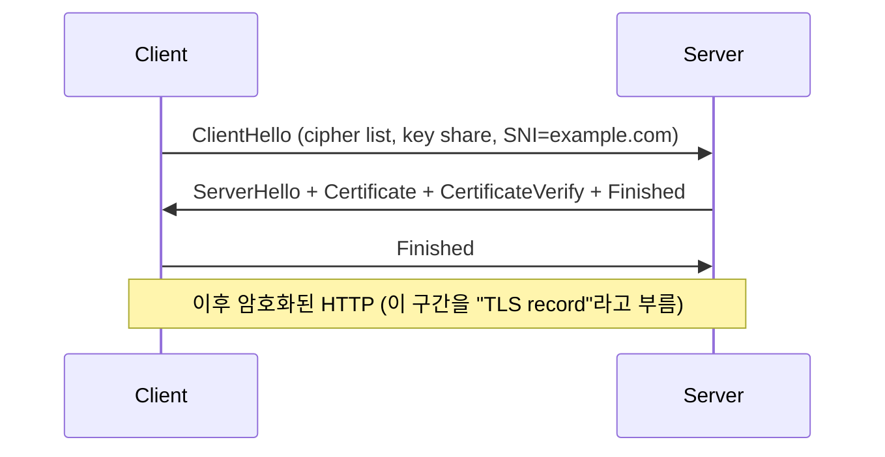
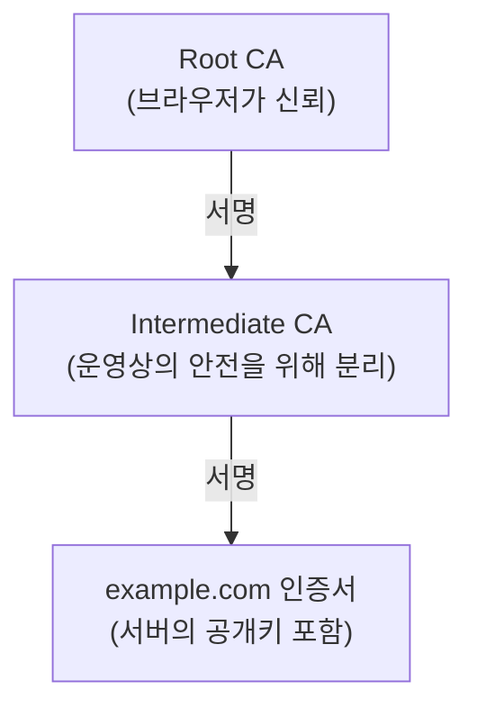
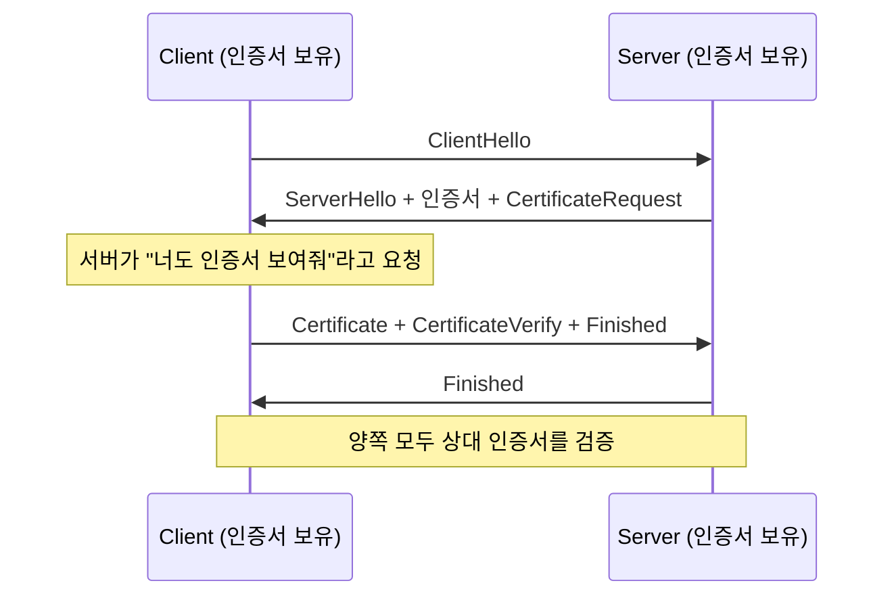

<figure class="post-figure post-figure--header">
<svg role="img" aria-label="네트워크 보안의 네 기둥을 한 장에 그린 그림. 왼쪽 위는 TLS의 핸드셰이크 — 비대칭 암호로 세션 키를 안전하게 합의한 뒤 대칭 암호로 데이터를 빠르게 암호화하는 두 단계. 왼쪽 아래는 PKI 신뢰 체인 — 서버 인증서가 중간 CA에 서명받고 중간 CA가 루트 CA에 서명받는 체인 구조. 오른쪽 위는 방화벽 — 단순 패킷 필터, 상태 기반 검사, L7 애플리케이션 게이트웨이가 점점 정교해지는 사다리. 오른쪽 아래는 VPN — 신뢰할 수 없는 네트워크 위에 암호화된 터널을 만들어 사설망처럼 소통하게 한다. 한 가운데에는 위협 모델의 사고 프레임 — 무엇을 누구로부터 어떻게 지키는가를 묻는 세 가지 질문이 놓여 있다." viewBox="0 0 680 360" xmlns="http://www.w3.org/2000/svg">
  <title>네트워크 보안의 네 기둥 — TLS, PKI, 방화벽, VPN, 그리고 위협 모델</title>
  <defs>
    <marker id="sec-arrow" viewBox="0 0 10 10" refX="8" refY="5" markerWidth="6" markerHeight="6" orient="auto-start-reverse">
      <path d="M0,0 L10,5 L0,10 z" fill="var(--secondary-color)"/>
    </marker>
  </defs>

  <!-- title -->
  <text x="340" y="22" text-anchor="middle" font-size="15" font-weight="800" fill="currentColor" letter-spacing="1.2">네트워크 보안의 네 기둥 — TLS · PKI · 방화벽 · VPN · 위협 모델</text>

  <!-- ===== Top-left: TLS handshake ===== -->
  <g font-size="10" font-weight="700" fill="currentColor" text-anchor="middle">
    <rect x="20" y="48" width="312" height="118" rx="6" fill="var(--bg-light)" stroke="var(--secondary-color)" stroke-width="2.5"/>
    <text x="176" y="68">TLS 핸드셰이크 — 비대칭으로 키 합의, 대칭으로 데이터</text>
    <text x="176" y="86" font-size="8.5" opacity="0.78">① ClientHello: cipher list, key share, SNI</text>
    <text x="176" y="100" font-size="8.5" opacity="0.78">② ServerHello + 인증서 + CertificateVerify + Finished</text>
    <text x="176" y="114" font-size="8.5" opacity="0.78">③ Client Finished → 이후 AES-GCM / ChaCha20으로 데이터 암호화</text>
    <line x1="42" y1="124" x2="120" y2="124" stroke="var(--secondary-color)" stroke-width="2" marker-end="url(#sec-arrow)"/>
    <line x1="142" y1="124" x2="220" y2="124" stroke="var(--secondary-color)" stroke-width="2" marker-end="url(#sec-arrow)"/>
    <line x1="242" y1="124" x2="310" y2="124" stroke="var(--secondary-color)" stroke-width="2" marker-end="url(#sec-arrow)"/>
    <text x="80" y="146" font-size="8" opacity="0.78">비대칭 (느림, 키 교환)</text>
    <text x="180" y="146" font-size="8" opacity="0.78">인증·서명</text>
    <text x="276" y="146" font-size="8" opacity="0.78">대칭 (빠름, 데이터)</text>
  </g>

  <!-- ===== Top-right: firewall ladder ===== -->
  <g font-size="10" font-weight="700" fill="currentColor" text-anchor="middle">
    <rect x="352" y="48" width="308" height="118" rx="6" fill="var(--bg-light)" stroke="var(--accent-color)" stroke-width="2.5"/>
    <text x="506" y="68">방화벽 — 검사 깊이의 사다리</text>
    <!-- ladder steps -->
    <rect x="372" y="82" width="84" height="22" rx="3" fill="var(--bg-panel)" stroke="currentColor" stroke-width="1.4"/>
    <text x="414" y="97" font-size="9">패킷 필터 (L3·L4)</text>
    <rect x="464" y="82" width="84" height="22" rx="3" fill="var(--bg-panel)" stroke="currentColor" stroke-width="1.4"/>
    <text x="506" y="97" font-size="9">상태 기반 (stateful)</text>
    <rect x="556" y="82" width="84" height="22" rx="3" fill="var(--bg-panel)" stroke="currentColor" stroke-width="1.4"/>
    <text x="598" y="97" font-size="9">L7 게이트웨이</text>
    <text x="506" y="128" font-size="8.5" opacity="0.78">단순 IP·포트 규칙 → 연결 추적 → 애플리케이션 의미</text>
    <text x="506" y="146" font-size="8.5" opacity="0.78">깊어질수록 비용↑ 가시성↑ — WAF·IDS·IPS</text>
  </g>

  <!-- ===== Bottom-left: PKI chain ===== -->
  <g font-size="10" font-weight="700" fill="currentColor" text-anchor="middle">
    <rect x="20" y="184" width="312" height="146" rx="6" fill="var(--bg-light)" stroke="var(--gold)" stroke-width="2.5"/>
    <text x="176" y="204">PKI — 신뢰 체인</text>
    <!-- boxes -->
    <rect x="42" y="220" width="78" height="30" rx="3" fill="var(--bg-panel)" stroke="currentColor" stroke-width="1.4"/>
    <text x="81" y="240" font-size="9">루트 CA</text>
    <rect x="138" y="220" width="78" height="30" rx="3" fill="var(--bg-panel)" stroke="currentColor" stroke-width="1.4"/>
    <text x="177" y="240" font-size="9">중간 CA</text>
    <rect x="234" y="220" width="78" height="30" rx="3" fill="var(--bg-panel)" stroke="currentColor" stroke-width="1.4"/>
    <text x="273" y="240" font-size="9">서버 인증서</text>
    <!-- arrows -->
    <line x1="120" y1="235" x2="138" y2="235" stroke="var(--secondary-color)" stroke-width="1.6" marker-end="url(#sec-arrow)"/>
    <line x1="216" y1="235" x2="234" y2="235" stroke="var(--secondary-color)" stroke-width="1.6" marker-end="url(#sec-arrow)"/>
    <text x="176" y="266" font-size="8.5" opacity="0.78">브라우저는 신뢰하는 루트 CA의 공개 키로 체인을 따라 검증</text>
    <text x="176" y="282" font-size="8.5" opacity="0.78">OCSP·CRL로 인증서 폐기 여부 확인</text>
    <text x="176" y="302" font-size="8.5" opacity="0.78">Let's Encrypt · ACME로 무료·자동 발급</text>
  </g>

  <!-- ===== Bottom-right: VPN tunnel ===== -->
  <g font-size="10" font-weight="700" fill="currentColor" text-anchor="middle">
    <rect x="352" y="184" width="308" height="146" rx="6" fill="var(--bg-light)" stroke="var(--accent-color)" stroke-width="2.5"/>
    <text x="506" y="204">VPN — 신뢰할 수 없는 망 위의 터널</text>
    <text x="506" y="222" font-size="8.5" opacity="0.78">원격 노트북 → (암호화 터널) → 회사 내부</text>
    <text x="506" y="240" font-size="8.5" opacity="0.78">WireGuard · IPsec · OpenVPN · SSL-VPN</text>
    <text x="506" y="258" font-size="8.5" opacity="0.78">MTU ↓, PMTUD 다시 점검, ICMP 차단 정책 주의</text>
    <text x="506" y="276" font-size="8.5" opacity="0.78">Zero Trust는 VPN을 대체/보완 — ID·기기 상태 기반 접근</text>
  </g>

  <!-- ===== Bottom center: threat model ===== -->
  <g font-size="10" font-weight="700" fill="currentColor" text-anchor="middle">
    <rect x="20" y="338" width="640" height="0" rx="0" fill="none" stroke="none"/>
    <text x="340" y="338" text-anchor="middle" font-size="10.5" font-weight="800" fill="var(--gold)">위협 모델 — 무엇을, 누구로부터, 어떻게 지키는가</text>
    <text x="340" y="354" text-anchor="middle" font-size="9" opacity="0.78">CIA: 기밀성(Confidentiality) · 무결성(Integrity) · 가용성(Availability). 이 세 축으로 사고하면 보안 사고가 보인다.</text>
  </g>
</svg>
<figcaption>네트워크 보안의 네 기둥과 위협 모델 — TLS가 *데이터를* , PKI가 *상대를* , 방화벽이 *트래픽을* , VPN이 *망을* , 위협 모델 사고가 *전체 그림을* 잡습니다.</figcaption>
</figure>

## 들어가며

이 글은 `Network-Essential` 시리즈의 **6단계**입니다. 전체 흐름은 [Network Essential Curriculum](/2026/07/29/network-essential-curriculum.html)에서 확인하고, 직전 단계 [응용 계층 (HTTP/HTTPS · DNS · DHCP · 웹 요청의 여정)](/2026/07/29/network-application-protocols.html)을 먼저 읽으면 좋습니다.

1~5단계에서 우리는 *데이터가 어떤 길을 따라 신뢰성을 가지고 목적지에 도달하는지*를 배웠습니다. 하지만 그 모든 통신은 *평문으로 흐를 수 있다*는 전제였습니다. 평문 통신은 *도청, 변조, 위장* 에 모두 취약합니다. 6단계는 그 평문 위에 **신뢰**를 얹습니다 — TLS가 *데이터를*, PKI가 *상대를*, 방화벽이 *트래픽을*, VPN이 *망을*, 위협 모델 사고가 *전체 그림*을 잡습니다.

이 단계가 끝나면 *인증서 만료 알림이 왜 위험한지*, *왜 HTTPS Everywhere가 아니라 HSTS가 필요한지*, *왜 사내망을 VPN으로 감싸는だけでは 부족할 수 있는지*가 명확해지고, 앞 단계의 모든 프로토콜이 *어떤 위협에 노출되어 있고 어떻게 방어되는지*가 한 그림으로 연결됩니다.

<div class="post-summary-box" markdown="1">

### 📌 이 글에서 다루는 내용

#### 🔍 핵심 주제

- **TLS/SSL**: 핸드셰이크·세션 키, 인증서·CA·PKI, 대칭+비대칭의 결합
- **방화벽과 VPN**: 패킷 필터·상태 기반·L7 방화벽, VPN 터널링, 사설망 접근
- **위협 모델**: 중간자·스푸핑·하이재킹, CIA(기밀성·무결성·가용성)로 사고하기

</div>

## 1. TLS/SSL — 평문 위에 신뢰를 얹다

### 1.1 TLS가 푸는 세 가지 위협

평문 HTTP 통신에는 세 가지 위협이 동시에 존재합니다.

- **도청(Eavesdropping)** — 누군가 패킷을 읽을 수 있다.
- **변조(Tampering)** — 누군가 패킷 내용을 바꿀 수 있다.
- **위장(Impersonation)** — 누군가 *내가 연결하려는 서버인 척*할 수 있다.

**TLS(Transport Layer Security)** 는 이 세 위협을 동시에 막습니다 — *암호화*로 도청을, *MAC(메시지 인증 코드)* 으로 변조를, *인증서 검증*으로 위장을. 이전 명칭은 SSL(Secure Sockets Layer)이며, 현재 표준은 TLS 1.2/1.3입니다.

### 1.2 TLS 1.3 핸드셰이크 — 비대칭으로 키를, 대칭으로 데이터를

TLS는 두 종류의 암호화를 *결합*합니다.

- **비대칭(공개키) 암호** — 키 쌍으로 한쪽이 암호화하면 다른 쪽이 복호화. *서명*에도 사용. 하지만 *느림*.
- **대칭(공유키) 암호** — 같은 키로 암호·복호. *빠름*이지만 *키 공유*가 어려움.

TLS는 **비대칭으로 대칭 키를 안전하게 합의한 뒤, 대칭으로 데이터를 암호화**합니다.



- **SNI(Server Name Indication)** — 한 IP에 여러 도메인이 있을 때 클라이언트가 *어떤 호스트의 인증서를 원하는지* 알려줍니다. SNI가 없으면 서버는 어떤 인증서를 보여줘야 할지 모릅니다.
- **인증서 + CertificateVerify** — 서버가 *자신이 그 인증서의 비밀키를 갖고 있음*을 증명합니다. 브라우저는 이 인증서를 *신뢰하는 CA*의 체인으로 검증합니다(아래 1.3).
- **Finished** — 핸드셰이크 전체의 무결성을 확인하는 MAC. 이 메시지가 *올바르게* 도달했다면 양쪽이 *같은 키*를 합의한 것입니다.

TLS 1.3은 핸드셰이크가 **1 RTT**에 끝납니다. 같은 서버에 다시 접속하면 *0-RTT*까지 줄일 수 있습니다 — **세션 티켓(session ticket)** 또는 **PSK(Pre-Shared Key)** 로 합의된 키를 재사용하기 때문입니다.

### 1.3 PKI — 신뢰의 사슬

TLS가 *"이 서버가 진짜 example.com이다"*를 입증하려면 *제3자*가 보증해야 합니다. 그 제3자가 **CA(Certificate Authority)** 이고, CA가 인증서에 서명해 *"이 공개키는 example.com의 것임"*을 보증합니다. CA들 사이의 신뢰 관계를 묶은 것이 **PKI(Public Key Infrastructure)** 입니다.



브라우저/OS는 *신뢰하는 루트 CA 목록*(예: Mozilla, Apple, Microsoft의 trust store)을 미리 내장하고 있습니다. 체인을 따라가다 *신뢰하는 루트*에 도달하면 그 인증서는 *신뢰할 수 있음*으로 간주됩니다.

운영 포인트:

- **OCSP / CRL** — 인증서가 *취소*되었는지 확인하는 메커니즘. OCSP Stapling으로 서버가 *스태플된* 응답을 함께 보내면 클라이언트가 CA에 직접 묻지 않아도 됩니다.
- **CT( Certificate Transparency)** — 발급된 인증서를 *공개 로그*에 기록해 위장 발급을 감지하는 시스템.
- **Let's Encrypt / ACME** — 무료·자동 발급. 인증서 만료 사고의 가장 흔한 원인인 *갱신 누락*을 자동화로 해결.

### 1.4 TLS가 실제로 동작하는지 직접 확인하기

```bash
# 1) 인증서 체인을 사람이 읽을 수 있게
$ openssl s_client -connect example.com:443 -servername example.com -showcerts < /dev/null 2>/dev/null \
  | grep -E "(subject=|issuer=)" | head -10
subject=CN = example.com
issuer=C = US, O = Let's Encrypt, CN = R10
subject=C = US, O = Let's Encrypt, CN = R10
issuer=C = US, O = Internet Security Research Group, CN = ISRG Root X1
subject=C = US, O = Internet Security Research Group, CN = ISRG Root X1
issuer=C = US, O = Internet Security Research Group, CN = ISRG Root X1
                                    ← 루트 CA — 자체 서명(self-signed)

# 2) 사용 중인 cipher와 TLS 버전
$ openssl s_client -connect example.com:443 -tls1_3 < /dev/null 2>/dev/null \
  | grep -E "Cipher is|Protocol"
Protocol  : TLSv1.3
Cipher    : TLS_AES_128_GCM_SHA256

# 3) Python으로 직접 TLS 연결 — 평문 HTTP가 어떻게 캡슐화되는지
import ssl, socket
ctx = ssl.create_default_context()        # 시스템 trust store로 검증
with socket.create_connection(("example.com", 443)) as raw:
    with ctx.wrap_socket(raw, server_hostname="example.com") as tls:
        print(f"TLS 버전: {tls.version()}, cipher: {tls.cipher()}")
        tls.sendall(b"GET / HTTP/1.0\r\nHost: example.com\r\n\r\n")
        print(tls.recv(64).split(b"\r\n")[0])   # "HTTP/1.0 200 OK"
```

### 1.5 HSTS — *사용자가 모르게* HTTPS를 강제

HSTS(HTTP Strict Transport Security)는 서버가 헤더로 *이 도메인은 항상 HTTPS로만 접속하라*고 선언하는 메커니즘입니다. 브라우저는 *한 번* HSTS를 받으면 *이후*는 HTTP로 시도조차 하지 않고 HTTPS로 *내부 리다이렉트*합니다.

```http
Strict-Transport-Security: max-age=31536000; includeSubDomains; preload
```

- `max-age` — 브라우저가 *얼마나* 기억할지(초). 보통 1~2년.
- `includeSubDomains` — 하위 도메인 모두 적용.
- `preload` — 브라우저 *내장 HSTS 목록*에 등재 요청. 등록되면 *브라우저 설치 직후부터* 강제.

HSTS의 가치는 *최초 1회*의 평문 요청조차 막는다는 점입니다 — 일반 HTTPS 리다이렉트는 *최초 한 번* 평문으로 도달하기 때문입니다.

### 1.6 mTLS — 양쪽 다 인증한다

일반 TLS는 *서버만* 인증서를 보입니다. **mTLS(Mutual TLS)** 는 *클라이언트도* 인증서를 보여줍니다. API 서버, 서비스 메시(Istio·Linkerd), 사내 시스템 간 통신에서 *상대를 알고 있는 경우*에 강력한 인증으로 쓰입니다.



## 2. 방화벽 — 트래픽을 정책으로 거른다

### 2.1 검사 깊이의 사다리

방화벽은 *어디까지 들여다볼 것인가*에 따라 세 종류로 나뉩니다.

| 종류 | 검사 범위 | 장점 | 단점 |
| --- | --- | --- | --- |
| **패킷 필터 (Stateless)** | IP·포트·프로토콜 | 매우 빠름·저비용 | 상태·맥락 모름 (SYN flood 등 무력) |
| **상태 기반 (Stateful)** | 위 + 연결 상태 추적 | SYN flood 방어, 정상 응답 패킷 통과 | L7 의미는 모름 |
| **애플리케이션 게이트웨이 (L7)** | HTTP·SQL·DNS 페이로드까지 | URL 필터링·SQL 인젝션 차단·프로토콜 검증 | 느림·복잡·비용↑ |

실무에서는 보통 **상태 기반** 방화벽이 LAN 가장자리에, **L7 게이트웨이/WAF**(Web Application Firewall)가 *웹 트래픽* 앞에, **IDS/IPS**(침입 탐지/방지)가 *이상 트래픽 패턴*을 잡습니다.

### 2.2 Linux의 기본 방화벽 — nftables / iptables

Linux의 *소유자* 방화벽은 **nftables**(최신) 또는 **iptables**(레거시)입니다. 운영자가 직접 규칙을 작성합니다.

```bash
# nftables — 기본 정책과 INPUT/OUTPUT
nft add table inet filter
nft add chain inet filter input { type filter hook input priority 0 \; policy drop \; }
nft add rule  inet filter input iif lo accept
nft add rule  inet filter input ct state established,related accept
nft add rule  inet filter input tcp dport 22 accept          # SSH만 허용
nft add rule  inet filter input counter drop
```

규칙의 핵심: **`policy drop`**을 기본으로 두고 *필요한 것만* 허용합니다(deny-by-default). 모든 포트가 잠겨 있고, 명시적으로 연 포트만 열립니다. 새로운 서비스를 띄울 때 *방화벽 규칙을 깜빡 잊어* 접속이 안 되는 일이 흔합니다.

### 2.3 흔한 함정

- **방화벽은 "신뢰"를 만들지 않는다** — 방화벽이 막아주는 건 *정책 위반 트래픽*이지 *0-day 취약점*은 아닙니다. 패치·최소 권한·관측이 함께 가야 합니다.
- **암호화 트래픽은 안 들여다본다** — TLS는 암호화되어 있어 L7 게이트웨이도 *인증서 복호화*를 하지 않으면 페이로드를 못 봅니다. 그래서 *상호 TLS 종료* 아키텍처가 중요합니다.
- **기본 정책 = accept는 위험** — 모든 걸 허용하고 막을 것만 막는 정책은 *새로 추가한 포트*를 자동으로 열어두는 셈입니다.

## 3. VPN — 신뢰할 수 없는 망 위의 터널

### 3.1 VPN이 푸는 문제

카페 Wi-Fi, 공항, 호텔 — 모든 공용 네트워크는 *신뢰할 수 없습니다*. 누군가 같은 네트워크에서 *ARP 스푸핑, DNS 하이재킹, 평문 도청*을 시도할 수 있습니다. **VPN(Virtual Private Network)** 은 *암호화된 터널*을 만들어 그 위에서는 *신뢰할 수 있는 망*처럼 소통하게 합니다.

<figure class="post-figure">
<svg role="img" aria-label="VPN 터널의 경로를 그린 그림. 내 노트북에서 VPN 서버까지는 공용 네트워크를 지나지만 암호화된 터널로 감싸여 있고, 그 터널은 WireGuard·IPsec·SSL-VPN 같은 프로토콜로 만들어진다. VPN 서버부터는 사내망 안이며, 거기서 내 서비스로 연결된다." viewBox="0 0 680 200" xmlns="http://www.w3.org/2000/svg">
  <title>VPN 터널 — 신뢰할 수 없는 공용 망 위에 만든 암호화 터널</title>
  <defs>
    <marker id="vpn-arrow" viewBox="0 0 10 10" refX="8" refY="5" markerWidth="6" markerHeight="6" orient="auto-start-reverse">
      <path d="M0,0 L10,5 L0,10 z" fill="var(--secondary-color)"/>
    </marker>
  </defs>

  <!-- ===== Encrypted tunnel band (emphasized) ===== -->
  <rect x="30" y="58" width="330" height="84" rx="10" fill="var(--bg-panel)" stroke="var(--gold)" stroke-width="3" stroke-dasharray="9 6"/>
  <text x="195" y="50" text-anchor="middle" font-size="12" font-weight="800" fill="var(--gold)">암호화 터널</text>
  <text x="195" y="130" text-anchor="middle" font-size="10" font-weight="700" fill="currentColor" opacity="0.82">WireGuard / IPsec / SSL-VPN</text>

  <!-- ===== Nodes ===== -->
  <g font-size="11" font-weight="700" fill="currentColor" text-anchor="middle">
    <!-- 내 노트북 -->
    <rect x="46" y="76" width="118" height="40" rx="6" fill="var(--bg-light)" stroke="var(--secondary-color)" stroke-width="2.5"/>
    <text x="105" y="101">내 노트북</text>
    <!-- VPN 서버 -->
    <rect x="226" y="76" width="118" height="40" rx="6" fill="var(--bg-light)" stroke="var(--secondary-color)" stroke-width="2.5"/>
    <text x="285" y="101">VPN 서버</text>
    <!-- 내 서비스 -->
    <rect x="516" y="76" width="118" height="40" rx="6" fill="var(--bg-light)" stroke="var(--accent-color)" stroke-width="2.5"/>
    <text x="575" y="101">내 서비스</text>
  </g>

  <!-- ===== Corporate network segment ===== -->
  <text x="435" y="50" text-anchor="middle" font-size="11" font-weight="700" fill="currentColor" opacity="0.82">사내망</text>

  <!-- ===== Connections ===== -->
  <line x1="164" y1="96" x2="226" y2="96" stroke="var(--secondary-color)" stroke-width="2.5" marker-end="url(#vpn-arrow)"/>
  <line x1="344" y1="96" x2="516" y2="96" stroke="var(--secondary-color)" stroke-width="2.5" marker-end="url(#vpn-arrow)"/>

  <!-- labels under public/private segments -->
  <text x="195" y="166" text-anchor="middle" font-size="9" fill="currentColor" opacity="0.7">공용 네트워크 (신뢰 불가) 위를 지나지만 암호화됨</text>
  <text x="435" y="166" text-anchor="middle" font-size="9" fill="currentColor" opacity="0.7">사내망 내부 — 신뢰 구간</text>
</svg>
<figcaption>VPN 터널: 내 노트북에서 VPN 서버까지는 공용 망을 지나지만 암호화된 터널로 감싸이고, 그 뒤로는 사내망에서 내 서비스로 이어집니다.</figcaption>
</figure>

VPN의 핵심:

- **기밀성** — 터널 안의 데이터는 암호화되어 공용 망에서 못 읽음.
- **무결성** — 변조 감지.
- **상대 인증** — VPN 서버와 클라이언트가 서로를 인증(PSK·인증서).

### 3.2 VPN 종류 — 어디까지 터널로 감쌌나

| 종류 | 어디까지 감싸나 | 사용 예 |
| --- | --- | --- |
| **사이트 투 사이트(Site-to-Site)** | 두 LAN 사이 전체 트래픽 | 본사-지사 연결 |
| **원격 액세스(Remote Access)** | 한 사용자 → 회사 내부 | 재택근무 |
| **SSL-VPN** | 브라우저/앱 단위 | 외부 협력업체 임시 접근 |
| **WireGuard / IPsec** | L3 터널 | 모바일·서버 간 |

**WireGuard**는 가장 현대적인 옵션입니다. 코드베이스가 ~4,000줄(상대 IPSec의 10분의 1 이하), Curve25519·ChaCha20·Poly1305 같은 검증된 primitive만 사용, 설정 파일이 단순합니다. 운영 부하가 매우 낮아 컨테이너·서버·모바일에 빠르게 채택 중입니다.

### 3.3 VPN 운영의 흔한 함정

- **MTU 감소** — 캡슐화 오버헤드(보통 50~80B)로 *유효 MTU*가 1400~1450으로 줄어듭니다. PMTUD가 실패하면 큰 패킷이 멈춥니다 — 7단계 트러블슈팅에서 다시 다룹니다.
- **ICMP 차단과의 충돌** — 일부 VPN은 ICMP를 차단해 PMTUD 진단이 실패합니다. 운영 가이드에 명시적으로 허용 범위를 적어야 합니다.
- **Split tunneling** — 회사 트래픽만 VPN으로 보내고 나머지는 *일반 인터넷*으로 가는 설정. 회사가 *내 모든 트래픽*을 보는 일이 없어 *프라이버시 측면에서* 유리하지만, 회사 자원이 *내 로컬*을 신뢰하는 셈이라 *제로 트러스트* 철학에는 어긋납니다.

### 3.4 제로 트러스트 — VPN 너머의 사고법

**Zero Trust**는 *"어떤 네트워크도 신뢰하지 말고, 모든 접근을 검증하라"*는 원칙입니다. VPN이 *한 번 인증되면 내부 자원을 막지 않는* 전통 모델이라면, Zero Trust는 *모든 요청*마다 *ID·기기 상태·맥락*을 다시 검증합니다.

- **BeyondCorp** (Google) — *내부망 = 안전*이라는 가정을 깨고, *모든 접근*을 *기기 상태 + 사용자 ID*로 결정.
- **서비스 메시 mTLS** — 서비스 간 통신을 *상호 인증*으로 검증. 네트워크 위치와 무관.
- **SASE / SSE** — *클라우드*로 보안 기능을 옮겨 어디서든 일관된 정책.

핵심 변화: 보안의 중심이 *"네트워크"*에서 *"ID"*로 이동했습니다.

## 4. 위협 모델 — 무엇을, 누구로부터, 어떻게 지키는가

### 4.1 위협 모델의 사고법

보안 사고를 *막연한 공포*가 아니라 *구체적 시나리오*로 바꾸는 도구가 **위협 모델**입니다. 다음 네 질문으로 시작합니다.

1. **무엇을** 지키려는가? (데이터, 서비스, 사용자, 인프라)
2. **누구로부터** 지키려는가? (외부 공격자, 내부자, 자연재해, 사용자 본인)
3. **어떻게** 공격받을 수 있는가? (도청, 변조, 위장, 서비스 거부)
4. **얼마나** 투자할 가치가 있는가? (자산의 가치 vs 방어 비용)

### 4.2 CIA — 보안의 세 축

| 축 | 의미 | 위협 예 | 방어 예 |
| --- | --- | --- | --- |
| **기밀성(Confidentiality)** | 허락된 사람만 본다 | 도청, 데이터 유출 | TLS, 암호화 저장 |
| **무결성(Integrity)** | 데이터가 변하지 않는다 | 변조, 중간자 삽입 | MAC, 서명 |
| **가용성(Availability)** | 필요할 때 쓸 수 있다 | DDoS, 랜섬웨어 | 이중화, rate limit, 백업 |

이 세 축은 **상호 충돌**합니다 — *기밀성*을 너무 강하게 추구하면 *가용성*이 떨어집니다(엄격한 인증은 사용성↓). 그래서 위협 모델은 *"어느 축을 우선할 것인가"*의 의사결정 프레임이기도 합니다.

### 4.3 1~5단계 프로토콜의 위협과 방어 — 한눈에

| 계층 | 위협 | 방어 (이 단계) |
| --- | --- | --- |
| **링크 (2)** | ARP 스푸핑, L2 스니핑 | DAI, 802.1X, TLS로 *위에서* 암호화 |
| **네트워크 (3)** | IP 스푸핑, 라우팅 하이재킹 | BCP38(ingress filtering), IPsec |
| **전송 (4)** | SYN flood, RST 인젝션 | SYN cookies, 패킷 필터 |
| **응용 (5)** | DNS 하이재킹, 평문 HTTP | DNSSEC, DoT/DoH, HTTPS/HSTS |
| **보안 (6)** | 인증서 위장, 인증서 유출 | PKI, mTLS, 비밀 관리(Vault) |

이 표가 이 단계의 결입니다. 각 계층의 프로토콜은 **자신에게 맞는 위협**이 있고, **자기 계층에서 방어**하거나 **위 계층에서 암호화**로 보완합니다.

### 4.4 직접 한 번 위협을 시뮬레이션해 보기

```bash
# 1) 우리 호스트가 노출한 포트 — 공격자가 보는 첫 번째 표면
$ ss -ltnp
LISTEN 0 128  0.0.0.0:22    0.0.0.0:*  users:(("sshd",pid=812,...))

# 2) 인증서 만료일 — 만료되면 서비스 불가
$ openssl s_client -connect example.com:443 -servername example.com < /dev/null 2>/dev/null \
  | openssl x509 -noout -dates
notBefore=Jul 12 12:00:00 2026 GMT
notAfter=Oct 10 12:00:00 2026 GMT

# 3) HSTS 헤더 — HSTS가 적용되었는지
$ curl -sI https://example.com/ | grep -i strict-transport
strict-transport-security: max-age=31536000

# 4) OCSP Stapling — 인증서가 취소되지 않았는지
$ openssl s_client -connect example.com:443 -status < /dev/null 2>/dev/null \
  | grep -A1 "OCSP Response Status"
OCSP Response Status: successful
```

## 5. 운영 노트

### 5.1 인증서 만료는 *가장 흔한* 보안 사건

PEM 파일 하나가 만료되어 *서비스 전체가 다운*되는 일이 매년 일어납니다. **모범 사례**:

- **자동 발급·갱신** (Let's Encrypt + ACME, cert-manager for k8s)
- **만료 30일 전 알림** (Prometheus blackbox_exporter, Grafana alert)
- **인증서 저장소는 분리** (Vault, AWS Secrets Manager)

### 5.2 TLS 1.2를 *끄는* 의사결정

TLS 1.0/1.1은 *오래*되고 취약합니다. PCI-DSS 같은 규정도 이미 1.0/1.1을 금지합니다. TLS 1.2를 *최소*로 두고 1.3을 우선하면 운영 부담이 줄고 안전성도 올라갑니다. 단, *아주 오래된 클라이언트*가 있다면 별도 대응(예: API 게이트웨이에서 *별도 호스트*로 안내)이 필요합니다.

### 5.3 "내부망 = 안전"을 의심해라

내부망에 있는 데이터베이스, 관리 콘솔, CI 도구 — 모두 *내부 사용자에 의한* 사고 표면입니다. *제로 트러스트*의 출발은 *"내부도 외부처럼 다뤄라"*입니다. mTLS·ID 기반 인증·기기 상태 검사를 내부에도 적용하는 게 현대 운영의 표준으로 자리 잡고 있습니다.

## 마무리

네트워크 보안은 평문 위에 *신뢰*를 얹는 작업입니다. TLS가 *데이터를*, PKI가 *상대를*, 방화벽이 *트래픽을*, VPN이 *망을*, 위협 모델 사고가 *전체 그림*을 잡습니다. 그리고 모든 계층의 프로토콜은 자기에게 맞는 위협이 있고, 그 방어는 자기 계층에서 *또는* 위 계층에서 일어납니다.

이제 1~6단계의 모든 것이 *현장*에서 합쳐집니다. 마지막 7단계 **성능·운영·트러블슈팅**에서는 이 모든 지식을 *어디서 느려졌는가*, *어디서 끊겼는가*를 묻는 *현장의 눈*으로 다시 봅니다. RTT·대역폭·버퍼블로트, 패킷 분석, CDN·캐싱, 관측까지 — 7단계가 끝나면 이 시리즈가 완성됩니다.

### 다음 학습

- [Network Essential Curriculum](/2026/07/29/network-essential-curriculum.html) — 시리즈 전체 지도와 진행률
- 직전: [응용 계층 (HTTP/HTTPS · DNS · DHCP · 웹 요청의 여정)](/2026/07/29/network-application-protocols.html) — 서비스가 실제로 굴러가는 계층
- 다음: [성능·운영·트러블슈팅 (지연·대역폭 · 패킷 분석 · CDN · 관측)](/2026/07/29/network-performance-and-operations.html) — 현장의 안목
- [PostgreSQL Architecture Deep Dive](/2025/12/06/postgresql-architecture-deep-dive.html) — TLS·인증서·방화벽을 넘어서는 DB의 연결 관점 참고
