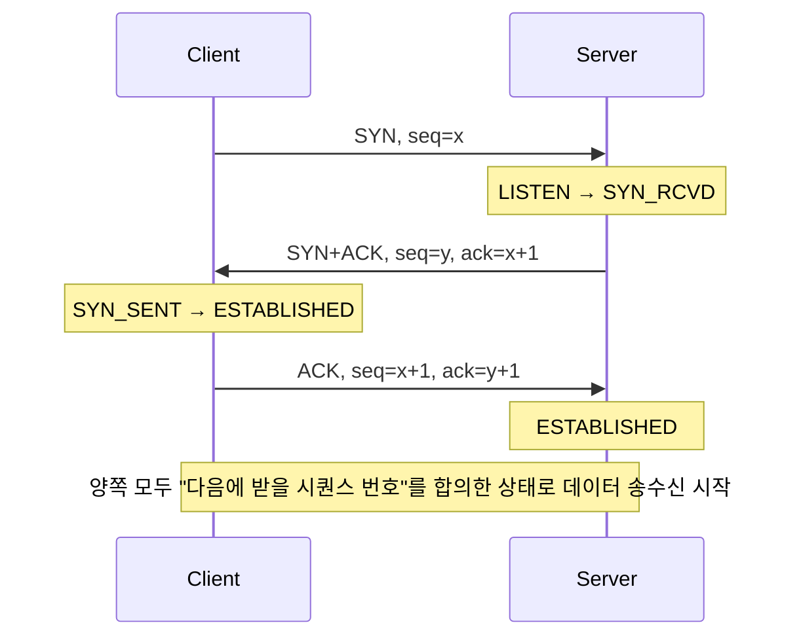
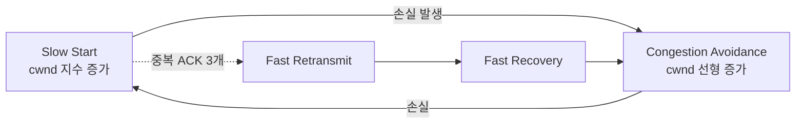
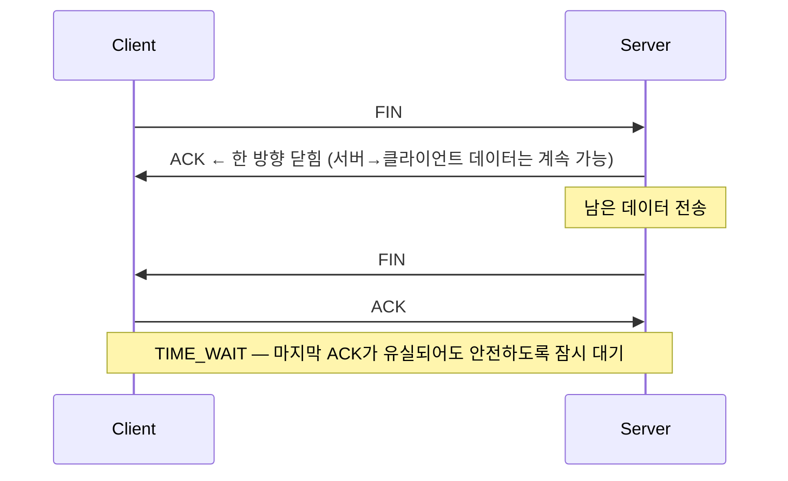
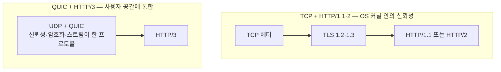

<figure class="post-figure post-figure--header">
<svg role="img" aria-label="전송 계층의 TCP와 UDP를 한 장에 그린 그림. 왼쪽은 호스트의 여러 프로세스가 포트 번호로 구분되어 있고 가운데에는 신뢰성을 추구하는 TCP 3-way 핸드셰이크(SYN, SYN+ACK, ACK)와 흐름·혼잡 제어, 오른쪽은 신뢰성을 포기한 UDP의 단순한 데이터그램 송신이 그려져 있다. 두 계층의 차이를 핸드셰이크·순서 보장·재전송·흐름 제어·혼잡 제어 다섯 가지 축으로 비교하고 있다." viewBox="0 0 680 340" xmlns="http://www.w3.org/2000/svg">
  <title>전송 계층 — TCP(신뢰, 핸드셰이크, 흐름·혼잡 제어) vs UDP(경량, 단순)</title>
  <defs>
    <marker id="tp-arrow" viewBox="0 0 10 10" refX="8" refY="5" markerWidth="6" markerHeight="6" orient="auto-start-reverse">
      <path d="M0,0 L10,5 L0,10 z" fill="var(--secondary-color)"/>
    </marker>
  </defs>

  <!-- title -->
  <text x="340" y="22" text-anchor="middle" font-size="15" font-weight="800" fill="currentColor" letter-spacing="1.2">전송 계층 — TCP(신뢰) vs UDP(경량)</text>

  <!-- ===== LEFT: Host with processes ===== -->
  <g font-size="10" font-weight="700" fill="currentColor" text-anchor="middle">
    <rect x="24" y="48" width="190" height="180" rx="6" fill="var(--bg-light)" stroke="var(--secondary-color)" stroke-width="2.5"/>
    <text x="119" y="68">Host (192.168.1.5)</text>
    <!-- processes -->
    <rect x="42" y="82" width="154" height="22" rx="3" fill="var(--bg-panel)" stroke="currentColor" stroke-width="1.4"/>
    <text x="119" y="97" font-size="9">curl — :52431</text>
    <rect x="42" y="110" width="154" height="22" rx="3" fill="var(--bg-panel)" stroke="currentColor" stroke-width="1.4"/>
    <text x="119" y="125" font-size="9">sshd — :22</text>
    <rect x="42" y="138" width="154" height="22" rx="3" fill="var(--bg-panel)" stroke="currentColor" stroke-width="1.4"/>
    <text x="119" y="153" font-size="9">nginx — :443</text>
    <rect x="42" y="166" width="154" height="22" rx="3" fill="var(--bg-panel)" stroke="currentColor" stroke-width="1.4"/>
    <text x="119" y="181" font-size="9">dns client — :55023</text>
    <text x="119" y="210" font-size="9" opacity="0.78">포트 번호 = 프로세스 식별</text>
  </g>

  <!-- ===== CENTER: TCP handshake ===== -->
  <g font-size="10" font-weight="700" fill="currentColor">
    <rect x="248" y="48" width="190" height="180" rx="6" fill="var(--bg-light)" stroke="var(--accent-color)" stroke-width="2.5"/>
    <text x="343" y="68" text-anchor="middle">TCP — 신뢰·순서·흐름·혼잡</text>

    <!-- vertical lifeline -->
    <line x1="278" y1="100" x2="278" y2="200" stroke="currentColor" stroke-width="1.4"/>
    <line x1="408" y1="100" x2="408" y2="200" stroke="currentColor" stroke-width="1.4"/>
    <text x="278" y="94" text-anchor="middle" font-size="9">Client</text>
    <text x="408" y="94" text-anchor="middle" font-size="9">Server</text>

    <!-- SYN -->
    <line x1="278" y1="110" x2="404" y2="110" stroke="var(--secondary-color)" stroke-width="1.8" marker-end="url(#tp-arrow)"/>
    <text x="343" y="106" text-anchor="middle" font-size="8">SYN, seq=x</text>
    <!-- SYN+ACK -->
    <line x1="408" y1="130" x2="282" y2="130" stroke="var(--secondary-color)" stroke-width="1.8" marker-end="url(#tp-arrow)"/>
    <text x="343" y="126" text-anchor="middle" font-size="8">SYN+ACK, seq=y, ack=x+1</text>
    <!-- ACK -->
    <line x1="278" y1="150" x2="404" y2="150" stroke="var(--secondary-color)" stroke-width="1.8" marker-end="url(#tp-arrow)"/>
    <text x="343" y="146" text-anchor="middle" font-size="8">ACK, seq=x+1, ack=y+1</text>

    <text x="343" y="174" text-anchor="middle" font-size="8" opacity="0.78">3-way 핸드셰이크</text>
    <text x="343" y="194" text-anchor="middle" font-size="8" opacity="0.78">순서 보장·재전송·흐름·혼잡</text>
  </g>

  <!-- ===== RIGHT: UDP ===== -->
  <g font-size="10" font-weight="700" fill="currentColor">
    <rect x="464" y="48" width="190" height="180" rx="6" fill="var(--bg-light)" stroke="var(--gold)" stroke-width="2.5"/>
    <text x="559" y="68" text-anchor="middle">UDP — 경량·비연결</text>

    <line x1="494" y1="100" x2="494" y2="200" stroke="currentColor" stroke-width="1.4"/>
    <line x1="624" y1="100" x2="624" y2="200" stroke="currentColor" stroke-width="1.4"/>
    <text x="494" y="94" text-anchor="middle" font-size="9">Client</text>
    <text x="624" y="94" text-anchor="middle" font-size="9">Server</text>

    <line x1="494" y1="130" x2="620" y2="130" stroke="var(--secondary-color)" stroke-width="1.8" marker-end="url(#tp-arrow)"/>
    <text x="559" y="126" text-anchor="middle" font-size="8">datagram</text>
    <line x1="624" y1="160" x2="498" y2="160" stroke="var(--secondary-color)" stroke-width="1.8" marker-end="url(#tp-arrow)"/>
    <text x="559" y="156" text-anchor="middle" font-size="8">datagram (no ACK)</text>

    <text x="559" y="184" text-anchor="middle" font-size="8" opacity="0.78">순서·재전송·흐름·혼잡 없음</text>
    <text x="559" y="200" text-anchor="middle" font-size="8" opacity="0.78">QUIC가 이 위에 신뢰를 다시 얹음</text>
  </g>

  <!-- ===== BOTTOM: tradeoff summary ===== -->
  <line x1="30" y1="240" x2="650" y2="240" stroke="currentColor" stroke-width="1.4" opacity="0.25"/>
  <g font-size="9.5" font-weight="700" fill="currentColor">
    <text x="340" y="262" text-anchor="middle">선택은 트레이드오프 — 신뢰성을 *얻고* 지연을 *지불*(TCP) vs 지연을 *얻고* 신뢰를 *포기*(UDP)</text>
    <text x="340" y="280" text-anchor="middle" opacity="0.78">웹·DB·SSH는 TCP / DNS·영상·음성·게임·QUIC은 UDP 또는 UDP 기반</text>
    <text x="340" y="298" text-anchor="middle" opacity="0.78">혼잡 제어는 인터넷을 *안정시키는* 메커니즘 — 한 사용자가 회선을 독점하지 않게 조율</text>
  </g>
</svg>
<figcaption>전송 계층의 두 얼굴 — TCP는 핸드셰이크로 신뢰성을 세우고 흐름·혼잡으로 양보하며, UDP는 그 모든 것을 포기한 대신 지연을 얻는다. QUIC은 UDP 위에 다시 신뢰성을 얹으면서 TCP의 한계를 우회한 최신 사례다.</figcaption>
</figure>

## 들어가며

이 글은 `Network-Essential` 시리즈의 **4단계**입니다. 전체 흐름은 [Network Essential Curriculum](/2026/07/29/network-essential-curriculum.html)에서 확인하고, 직전 단계 [네트워크 계층 (IP · 서브네팅 · 라우팅 · NAT · ICMP)](/2026/07/29/network-ip-and-routing.html)을 먼저 읽으면 좋습니다.

링크 계층이 같은 LAN 안을, 네트워크 계층이 네트워크 사이를 연결했다면, 이번 단계는 **호스트가 아니라 프로세스와 프로세스**를 잇습니다. 한 IP 위에서 동시에 여러 애플리케이션이 통신할 수 있는 이유는 *포트*라는 두 번째 식별자가 있고, *소켓*이라는 추상화가 그 둘을 묶기 때문입니다. 그리고 그 두 프로세스 사이의 신뢰성·순서·흐름·혼잡을 누가 보장할지가 **TCP vs UDP**의 선택입니다.

이 단계가 끝나면 "왜 영상 스트리밍은 UDP이고 웹은 TCP인가", "왜 HTTP/3은 UDP 위의 QUIC을 쓰는지", "Connection refused는 어디서 만들어지는가" 같은 실무 질문의 답을 손에 쥡니다.

<div class="post-summary-box" markdown="1">

### 📌 이 글에서 다루는 내용

#### 🔍 핵심 주제

- **포트와 소켓**: 프로세스 다중화, 잘 알려진 포트, 소켓 = (IP, 포트) 쌍
- **TCP**: 3-way/4-way 핸드셰이크, 순서 보장·재전송, 흐름 제어(윈도)·혼잡 제어
- **UDP**: 비연결·경량, 언제 UDP인가, QUIC이 UDP 위에 올라선 이유

</div>

## 1. 포트와 소켓

### 1.1 포트 — 같은 호스트의 프로세스 구분

한 호스트의 IP는 *하나*지만, 그 호스트 위에는 *수십~수백* 개의 네트워크 프로세스가 동시에 동작합니다(웹 서버, DB, SSH, DNS 클라이언트, 백업 등). IP만으로는 이들을 구별할 수 없습니다. **포트(port)** 가 두 번째 식별자입니다.

포트 번호는 16비트(0~65535)입니다. 관례상 다음 세 구간으로 나뉩니다.

| 구간 | 범위 | 의미 |
| --- | --- | --- |
| 잘 알려진(Well-known) | 0~1023 | 표준 서비스(HTTP=80, HTTPS=443, SSH=22, DNS=53, …) — 보통 root 권한 필요 |
| 등록된(Registered) | 1024~49151 | 애플리케이션이 등록한 포트 |
| 동적/사설(Dynamic/Private) | 49152~65535 | 클라이언트가 임시로 잡는 *ephemeral* 포트 |

예를 들어 우리 노트북이 `https://example.com/`에 접속하면:

- **클라이언트 측**: `192.168.1.5:52431`(ephemeral)
- **서버 측**: `93.184.216.34:443`(well-known)

```text
소켓 = (프로토콜, 로컬 IP, 로컬 포트, 원격 IP, 원격 포트)

예) 192.168.1.5:52431 ↔ 93.184.216.34:443 (TCP)
```

이 5-tuple이 통신 회선 하나를 유일하게 식별합니다. 같은 호스트가 같은 서버에 *두 개의* TCP 연결을 열면 5-tuple 중 *로컬 포트*가 달라집니다(또는 원격 포트가 다른 곳과 통신). 이 식별성 덕분에 한 호스트가 동시에 수만 개의 연결을 유지할 수 있습니다.

### 1.2 소켓 — OS가 제공하는 추상화

**소켓(socket)** 은 OS가 네트워크 통신을 위해 제공하는 **파일 디스크립터 비슷한 추상화**입니다. 한 프로세스가 소켓을 *열면* read/write로 데이터를 송수신할 수 있습니다.

```python
import socket

# TCP 서버 — 포트 8080에서 한 연결을 받고 메시지를 한 줄 읽고 답한다
server = socket.socket(socket.AF_INET, socket.SOCK_STREAM)
server.setsockopt(socket.SOL_SOCKET, socket.SO_REUSEADDR, 1)
server.bind(("127.0.0.1", 8080))
server.listen(5)
print("8080에서 대기 중…")

conn, addr = server.accept()                 # 클라이언트 연결을 받음
print(f"{addr}에서 연결됨")
data = conn.recv(1024)                       # 데이터 수신
conn.sendall(b"HTTP/1.0 200 OK\r\n\r\nhi")   # 응답
conn.close()
```

Python의 `socket`은 BSD 소켓 API의 거의 직역입니다. `AF_INET`은 IPv4, `SOCK_STREAM`은 TCP, `SOCK_DGRAM`은 UDP를 뜻합니다. 위 코드 한 조각이 *bind → listen → accept → recv/send → close* 의 전형적인 TCP 서버 흐름입니다.

### 1.3 포트 운영 노트

- **`Connection refused`**: 목적지 호스트가 살아 있지만 *해당 포트에 리슨하는 프로세스가 없다*는 뜻입니다. 방화벽이 막은 경우는 보통 *응답이 없는* `Connection timed out`으로 나타납니다 — 이 구분이 운영 진단의 출발점입니다.
- **`ss`/`netstat`**: 현재 열려 있는 소켓을 보는 표준 도구. `ss -tnp`로 TCP 연결, `ss -l`로 리슨 중인 포트를 확인합니다.
- **TIME_WAIT**: TCP 연결이 *능동 종료*된 측이 마지막 ACK 후 잠시 소켓을 유지하는 상태입니다. 서버가 짧은 시간에 많은 연결을 *닫는* 역할이라면 TIME_WAIT가 누적해 *ephemeral 포트 고갈*을 일으킬 수 있습니다. `SO_REUSEADDR`로 완화합니다.

## 2. TCP — 신뢰성과 성능의 동시 추구

**TCP(Transmission Control Protocol)** 는 **연결 지향(connection-oriented)** · **신뢰성(reliable)** · **바이트 스트림(byte stream)** 전송을 제공합니다. 핵심 메커니즘은 다섯 가지입니다.

### 2.1 3-way 핸드셰이크 — 연결을 세우다

TCP는 데이터를 보내기 전에 양쪽이 *동기화*되어야 합니다. 이 동기화 과정이 **3-way 핸드셰이크**입니다.



핵심은 양쪽이 *서로의 초기 시퀀스 번호(ISN)* 를 합의하는 것입니다. 이후 모든 바이트에 *시퀀스 번호*가 붙고, 수신 측은 ACK로 *받았다*를 알려 패킷 손실을 감지합니다.

```python
# TCP 핸드셰이크를 Python으로 들여다보기 — 연결 직후 소켓의 상태 정보
import socket
s = socket.socket(socket.AF_INET, socket.SOCK_STREAM)
s.connect(("example.com", 80))

# 우리 측 ISN은 OS가 관리 — 직접 보려면 SO_LINGER + recv로 SYN 페이로드 디버깅이 필요하지만
# TCP_INFO로 연결의 현재 통계를 확인 가능
info = s.getsockopt(socket.IPPROTO_TCP, socket.TCP_INFO, 256)
print(f"TCP_INFO 첫 64바이트: {info[:64].hex()}")
# → tcpi_state (8 = ESTABLISHED), tcpi_rtt, tcpi_snd_cwnd 등이 들어 있음
```

### 2.2 순서 보장·재전송·중복 제거

TCP는 데이터그램(UDP)과 달리 *바이트 스트림* 모델입니다. 송신 측은 큰 메시지를 MSS(보통 1460바이트) 단위로 잘라 보내고, *시퀀스 번호*로 바이트 순서를 표시합니다.

```text
요청: GET / HTTP/1.1\r\nHost: example.com\r\n\r\n   (총 40 바이트)

전송: [seq=1001, len=20] [seq=1021, len=20]
```

수신 측은 ACK로 *연속적으로 받은 마지막 바이트+1*을 알려, 송신 측이 *빠진 바이트*를 감지하고 **재전송**합니다. 네트워크에서 패킷 순서가 뒤바뀌어 도착해도 *시퀀스 번호*로 제자리에 끼워 넣습니다. 중복 패킷도 *이미 받은 시퀀스*면 버립니다. 이 단순한 메커니즘이 TCP의 *신뢰성*과 *순서 보장*의 본질입니다.

### 2.3 흐름 제어 — 받는 쪽 속도에 맞추기

수신 측은 *수신 윈도(receive window, rwnd)* 를 알려 자신의 처리 가능량을 표현합니다. 송신 측은 *미확인 바이트 ≤ rwnd*를 지키며 보냅니다. **흐름 제어(flow control)** 는 송신 측이 *받는 쪽*을 압도하지 않게 합니다.

```text
수신 측 ACK: "seq=1001, ack=1201, win=16384"
  → "1001~1200 바이트 받았음, 윈도 16KB 남았음"
```

### 2.4 혼잡 제어 — 네트워크를 함께 지키기

흐름 제어가 *종단 간* 속도 합의라면, **혼잡 제어(congestion control)** 는 *네트워크 전체*의 안정을 위한 메커니즘입니다. 한 사용자가 회선을 독점해 다른 사용자를 멈추게 하는 **혼잡 붕괴(congestion collapse)** 를 막기 위해, 송신 측은 네트워크가 견딜 수 있는 속도를 *찾아냅니다*.

핵심 아이디어: **패킷 손실은 혼잡 신호**다. ACK가 시간 안에 안 오면 보내던 속도를 줄이고, ACK가 잘 오면 천천히 늘린다.

| 단계 | 동작 | 의도 |
| --- | --- | --- |
| **Slow Start** | cwnd(혼잡 윈도)를 ACK마다 1 MSS씩 지수 증가 | 빠른 탐색 |
| **Congestion Avoidance** | cwnd를 ACK마다 1/cwnd MSS씩 선형 증가 | 안정적 유지 |
| **Fast Retransmit** | 중복 ACK 3개 → 즉시 재전송 (타임아웃 기다리지 않음) | 빠른 복구 |
| **Fast Recovery** | 재전송 후 cwnd를 절반으로 줄이고 선형 증가 복귀 | 진동 완화 |
| **CUBIC** | 최근 혼잡 시점 기준 *시간*에 따라 cwnd 곡선 복원 | 고대역폭·장거리에 강건 |

현代の TCP 혼잡 제어 알고리즘은 대부분 **CUBIC**(Linux 기본) 또는 **BBR**(Google, 처리량 기반 추정). CUBIC은 *손실 이벤트 기반*이고 BBR은 *왕복 시간·처리량 기반*으로, 둘은 철학이 다릅니다. 동영상 스트리밍처럼 *지속적·고대역폭*이 필요한 서비스는 BBR로 체감 품질이 크게 좋아지기도 합니다.



### 2.5 4-way 종료 — FIN 패킷의 정중한 작별

연결을 닫을 때는 **3-way가 아닌 4-way**입니다. TCP가 *전이중(full-duplex)* 이라 양쪽 데이터 흐름을 각각 닫아야 하기 때문입니다.



**TIME_WAIT**은 마지막 ACK가 유실되어 서버가 FIN을 재전송해도 클라이언트가 여전히 응답할 수 있도록 *2×MSL*(보통 60~120초) 동안 소켓을 유지하는 상태입니다. 운영 함정: 짧은 시간에 *능동 종료*가 폭증하면 TIME_WAIT가 누적되어 *ephemeral 포트가 고갈*됩니다. 부하 테스트 시 자주 만나는 이슈입니다.

## 3. UDP — 신뢰성을 포기한 대가로 얻은 것

**UDP(User Datagram Protocol)** 는 정반대의 선택입니다. 핸드셰이크도 없고, ACK도 없고, 재전송도 없고, 흐름·혼잡 제어도 없습니다. **데이터그램**(한 번 보내면 한 번 받음)이 모델의 전부입니다.

```python
import socket

# UDP 클라이언트 — DNS 쿼리처럼 한 번 보내고 한 번 받는다
sock = socket.socket(socket.AF_INET, socket.SOCK_DGRAM)
sock.settimeout(2.0)
sock.sendto(b"PING", ("127.0.0.1", 9999))

try:
    data, addr = sock.recvfrom(1024)
    print(f"{addr}로부터: {data!r}")
except socket.timeout:
    print("응답 없음")
```

UDP의 핵심 성질:

- **연결 없음** — 한쪽이 메시지를 보내고 잊어버림. 핸드셰이크 비용 0.
- **순서·중복·손실 무보장** — 받은 그대로 응용에 전달.
- **헤더가 작음** — TCP 헤더(20B) vs UDP 헤더(8B).
- **MTU 이상 데이터그램은 단편화** — IP 단편화 또는 응용이 스스로 분할.

### 3.1 언제 UDP인가

UDP가 *기술적으로 부족해 보이는* 만큼, 그 부족함이 *운영적 장점*이 되는 영역이 분명히 있습니다.

- **DNS** — 질의 1회·응답 1회, 핸드셰이크 비용이 너무 큼. UDP로 빠르게 묻고 응답 없으면 TCP로 재시도(DoT/DoH는 보통 UDP/TCP·TLS 기반).
- **영상·음성 스트리밍** — 30분 전 프레임을 재전송해 봐야 이미 늦었음. 약간의 손실은 허용하고 *최신 프레임*에 도달하는 게 중요.
- **온라인 게임** — 상태 패킷을 매 수십 ms마다 보내는 구조는 재전송이 *과거를 되살리는* 행위가 됨. UDP가 맞음.
- **VoIP** — 음성 지연 200ms 이상이면 *대화*가 불가능해짐. 손실은 숨기고 지연은 숨기지 못함.

### 3.2 QUIC — UDP 위에 다시 신뢰를 얹다

HTTP/3가 UDP를 채택하면서 QUIC(Quick UDP Internet Connections)이 등장했습니다. QUIC은 **UDP 위에 신뢰성·흐름·혼잡을 다시 구현**하면서도 *TCP의 한계*를 우회합니다.



QUIC이 TCP를 대체하는 이유:

- **연결 설정 지연을 줄인다** — TCP 3-way + TLS 핸드셰이크 = 2 RTT. QUIC은 두 핸드셰이크를 *합쳐* 1 RTT, 재방문 시 0 RTT.
- **HOL(head-of-line) 블로킹 제거** — TCP는 한 패킷 손실로 *같은 연결의 모든 스트림*이 멈춤. QUIC은 스트림이 독립.
- **사용자 공간 구현** — OS 커널을 건드리지 않고 진화 가능. 트래픽 제어가 더 빠르게 갱신.
- **연결 마이그레이션** — 클라이언트가 Wi-Fi → LTE로 바뀌면 TCP 연결은 끊어지지만, QUIC은 *Connection ID*로 유지.

이 변화는 "UDP가 단순하다 → 그 위에 우리가 필요한 신뢰를 우리가 만들겠다"는 설계의代表作입니다.

## 4. 운영 노트

### 4.1 TCP 튜닝 — 자주 만지는 손잡이

- **`tcp_tw_reuse` / `SO_REUSEADDR`** — TIME_WAIT 재사용. 서버 부하 테스트 환경에서 유용.
- **`tcp_fastopen`** — 핸드셰이크와 첫 데이터 *동시 전송*. 1 RTT 절약.
- **`tcp_rmem` / `tcp_wmem`** — 송수신 버퍼 크기. 큰 객체/느린 링크에서는 키우고, 메모리가 빠듯하면 줄임.
- **`net.core.somaxconn`** — listen() backlog 한계. 트래픽 폭증 시 `Connection refused` 원인이 됨.

### 4.2 UDP 운영 함정

- **MTU 초과** — 1500B 넘는 UDP 데이터그램은 *단편화*되거나 폐기됨. 1200~1300B가 안전한 크기.
- **방화벽 비친화** — 일부 방화벽은 *TCP만* 허용. UDP 서비스는 별도 *stateful* 규칙이 필요.
- **증폭 공격** — DNS·NTP·memcached 같은 UDP 서비스는 *응답이 요청보다 훨씬 큰* 증폭에 악용될 수 있음. **출처 인증(Source IP spoofing 차단, BCP38)** 이 방어의 핵심.

### 4.3 혼잡 제어가 *도덕적*인 이유

혼잡 제어는 단순한 성능 기능이 아닙니다. *한 사용자가 회선을 독점해 다른 사용자를 멈추게 하는* 일을 막는, **공유 자원 매너** 메커니즘입니다. 새로 등장한 QUIC·BBR·PCC 같은 알고리즘은 모두 "어떻게 같이 잘 살 것인가"를 다툽니다.

## 마무리

전송 계층은 **프로세스와 프로세스**를 잇고, **신뢰성과 속도 사이의 선택**을 다룹니다. 포트와 소켓이 다중화를 가능하게 하고, TCP가 핸드셰이크·순서·재전송·흐름·혼잡으로 신뢰를 세우며, UDP가 그 모든 것을 포기한 경량 옵션이 됩니다. QUIC은 UDP 위에 다시 신뢰성을 얹으면서도 TCP의 구조적 한계를 우회하는 최신 사례입니다.

다음 단계는 이 모든 계층 위에 **응용 프로토콜**이 자리 잡는 5단계입니다. HTTP/HTTPS, DNS, DHCP — 우리가 매일 만나는 *서비스*가 어떻게 굴러가는지를 다룹니다. 그리고 마지막으로 1~4단계를 한 줄로 꿰는 **"브라우저에 URL을 치고 엔터를 누르면 무슨 일이 벌어지는가"** 의 여정을 봅니다.

### 다음 학습

- [Network Essential Curriculum](/2026/07/29/network-essential-curriculum.html) — 시리즈 전체 지도와 진행률
- 직전: [네트워크 계층 (IP · 서브네팅 · 라우팅 · NAT · ICMP)](/2026/07/29/network-ip-and-routing.html) — 네트워크 사이의 전달
- 다음: [응용 계층 (HTTP/HTTPS · DNS · DHCP · 웹 요청의 여정)](/2026/07/29/network-application-protocols.html) — 서비스가 실제로 굴러가는 계층
- [PostgreSQL Architecture Deep Dive](/2025/12/06/postgresql-architecture-deep-dive.html) — TCP 위에서 동작하는 DB의 연결 풀 관점 참고
