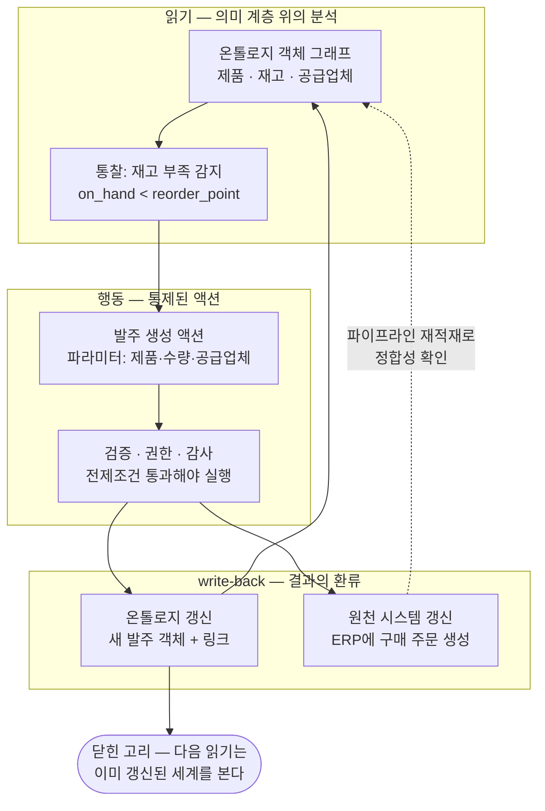

<figure class="post-figure post-figure--header">
<svg role="img" aria-label="읽기 모델에서 행동의 시스템으로 가는 변화를 좌우 두 패널로 대비한 그림. 왼쪽 read-only 패널에서는 제품·재고·공급업체 객체 그래프에서 화살표가 한 방향으로만 내려가 대시보드에서 끝나고, 그 아래 점선 화살표가 스크린샷·슬랙·ERP 수기 입력이라는 사람의 간극으로 이어진다. 오른쪽 운영 계층 패널에서는 같은 객체 그래프 아래에 검증·권한·감사를 관문으로 갖는 발주 생성 액션 박스가 있고, 액션에서 온톨로지로 즉시 갱신 화살표와 ERP 실린더로 write-back 화살표가 나가며, ERP에서 파이프라인 재적재를 뜻하는 점선 화살표가 다시 객체 그래프로 돌아와 닫힌 고리를 완성한다." viewBox="0 0 680 338" xmlns="http://www.w3.org/2000/svg">
  <title>읽기 모델에서 행동의 시스템으로 — read-only 의미 계층 vs 액션·write-back으로 닫힌 고리</title>
  <defs>
    <marker id="ah1-sec" viewBox="0 0 10 10" refX="8" refY="5" markerWidth="6" markerHeight="6" orient="auto-start-reverse">
      <path d="M0,0 L10,5 L0,10 z" fill="var(--secondary-color)"/>
    </marker>
    <marker id="ah1-gold" viewBox="0 0 10 10" refX="8" refY="5" markerWidth="6" markerHeight="6" orient="auto-start-reverse">
      <path d="M0,0 L10,5 L0,10 z" fill="var(--gold)"/>
    </marker>
    <marker id="ah1-acc" viewBox="0 0 10 10" refX="8" refY="5" markerWidth="6" markerHeight="6" orient="auto-start-reverse">
      <path d="M0,0 L10,5 L0,10 z" fill="var(--accent-color)"/>
    </marker>
    <marker id="ah1-cur" viewBox="0 0 10 10" refX="8" refY="5" markerWidth="6" markerHeight="6" orient="auto-start-reverse">
      <path d="M0,0 L10,5 L0,10 z" fill="currentColor" opacity="0.5"/>
    </marker>
  </defs>

  <text x="340" y="26" text-anchor="middle" font-size="16" font-weight="800" fill="currentColor">읽기 모델에서 행동의 시스템으로</text>

  <!-- ===== LEFT: read-only world ===== -->
  <rect x="16" y="44" width="300" height="278" rx="6" fill="var(--bg-light)" stroke="currentColor" stroke-width="2"/>
  <text x="166" y="66" text-anchor="middle" font-size="10.5" font-weight="800" fill="currentColor" opacity="0.75">read-only 의미 계층 — system of insight</text>

  <!-- object graph -->
  <g stroke="var(--secondary-color)" stroke-width="1.8" opacity="0.65">
    <line x1="110" y1="97" x2="138" y2="97"/>
    <line x1="194" y1="97" x2="222" y2="97"/>
  </g>
  <g>
    <rect x="54" y="84" width="56" height="26" rx="5" fill="var(--bg-panel)" stroke="currentColor" stroke-width="2"/>
    <text x="82" y="101" text-anchor="middle" font-size="9.5" font-weight="700" fill="currentColor">제품</text>
    <rect x="138" y="84" width="56" height="26" rx="5" fill="var(--bg-panel)" stroke="currentColor" stroke-width="2"/>
    <text x="166" y="101" text-anchor="middle" font-size="9.5" font-weight="700" fill="currentColor">재고</text>
    <rect x="222" y="84" width="74" height="26" rx="5" fill="var(--bg-panel)" stroke="currentColor" stroke-width="2"/>
    <text x="259" y="101" text-anchor="middle" font-size="9" font-weight="700" fill="currentColor">공급업체</text>
  </g>
  <text x="166" y="126" text-anchor="middle" font-size="7.5" fill="currentColor" opacity="0.6">온톨로지 객체 그래프</text>

  <!-- one-way read arrow -->
  <line x1="166" y1="132" x2="166" y2="156" stroke="var(--secondary-color)" stroke-width="2" marker-end="url(#ah1-sec)"/>
  <text x="173" y="148" text-anchor="start" font-size="7" fill="currentColor" opacity="0.8">질의 · 집계</text>

  <!-- dashboard -->
  <rect x="104" y="158" width="124" height="62" rx="4" fill="var(--bg-panel)" stroke="currentColor" stroke-width="2"/>
  <text x="166" y="172" text-anchor="middle" font-size="8.5" font-weight="700" fill="currentColor">대시보드</text>
  <g fill="var(--secondary-color)" opacity="0.8">
    <rect x="118" y="198" width="12" height="14"/>
    <rect x="136" y="190" width="12" height="22"/>
    <rect x="154" y="182" width="12" height="30"/>
    <rect x="172" y="174" width="12" height="38"/>
    <rect x="190" y="192" width="12" height="20"/>
  </g>

  <!-- the gap: dashed, fading -->
  <line x1="166" y1="220" x2="166" y2="242" stroke="currentColor" stroke-width="1.8" stroke-dasharray="4 3" opacity="0.45" marker-end="url(#ah1-cur)"/>
  <rect x="44" y="246" width="244" height="52" rx="5" fill="none" stroke="currentColor" stroke-width="1.5" stroke-dasharray="5 4" opacity="0.45"/>
  <text x="166" y="264" text-anchor="middle" font-size="8" font-weight="700" fill="currentColor" opacity="0.65">통찰 → 행동의 간극 — 사람이 나른다</text>
  <text x="166" y="278" text-anchor="middle" font-size="7" fill="currentColor" opacity="0.55">스크린샷 · 슬랙 · ERP 수기 입력</text>
  <text x="166" y="290" text-anchor="middle" font-size="7" fill="currentColor" opacity="0.55">결과 반영은 다음 배치까지 지연</text>
  <text x="166" y="314" text-anchor="middle" font-size="8" font-weight="700" fill="currentColor" opacity="0.55">보고 끝난다 — 행동은 계층 바깥에서</text>

  <!-- ===== middle transition arrow ===== -->
  <polygon points="322,176 336,176 336,168 352,185 336,202 336,194 322,194" fill="var(--gold)"/>
  <text x="337" y="216" text-anchor="middle" font-size="7.5" font-weight="700" fill="var(--gold)">액션</text>
  <text x="337" y="228" text-anchor="middle" font-size="7.5" font-weight="700" fill="var(--gold)">write-back</text>

  <!-- ===== RIGHT: system of action ===== -->
  <rect x="364" y="44" width="300" height="278" rx="6" fill="var(--bg-light)" stroke="var(--gold)" stroke-width="2.5"/>
  <text x="514" y="66" text-anchor="middle" font-size="10.5" font-weight="800" fill="var(--gold)">운영 계층을 갖춘 온톨로지 — system of action</text>

  <!-- same object graph -->
  <g stroke="var(--secondary-color)" stroke-width="1.8" opacity="0.65">
    <line x1="458" y1="97" x2="486" y2="97"/>
    <line x1="542" y1="97" x2="570" y2="97"/>
  </g>
  <g>
    <rect x="402" y="84" width="56" height="26" rx="5" fill="var(--bg-panel)" stroke="currentColor" stroke-width="2"/>
    <text x="430" y="101" text-anchor="middle" font-size="9.5" font-weight="700" fill="currentColor">제품</text>
    <rect x="486" y="84" width="56" height="26" rx="5" fill="var(--bg-panel)" stroke="currentColor" stroke-width="2"/>
    <text x="514" y="101" text-anchor="middle" font-size="9.5" font-weight="700" fill="currentColor">재고</text>
    <rect x="570" y="84" width="74" height="26" rx="5" fill="var(--bg-panel)" stroke="currentColor" stroke-width="2"/>
    <text x="607" y="101" text-anchor="middle" font-size="9" font-weight="700" fill="currentColor">공급업체</text>
  </g>
  <text x="514" y="126" text-anchor="middle" font-size="7.5" fill="currentColor" opacity="0.6">같은 객체 그래프</text>

  <!-- read down / write up -->
  <line x1="478" y1="132" x2="478" y2="156" stroke="var(--secondary-color)" stroke-width="2" marker-end="url(#ah1-sec)"/>
  <text x="471" y="148" text-anchor="end" font-size="7" fill="currentColor" opacity="0.8">재고 부족 감지</text>
  <line x1="550" y1="156" x2="550" y2="132" stroke="var(--gold)" stroke-width="2.2" marker-end="url(#ah1-gold)"/>
  <text x="557" y="148" text-anchor="start" font-size="7" font-weight="700" fill="var(--gold)">① 즉시 갱신</text>

  <!-- action box -->
  <rect x="452" y="158" width="124" height="54" rx="5" fill="var(--bg-panel)" stroke="var(--gold)" stroke-width="2.5"/>
  <text x="514" y="181" text-anchor="middle" font-size="10" font-weight="700" fill="currentColor">발주 생성 액션</text>
  <text x="514" y="198" text-anchor="middle" font-size="7.5" fill="currentColor" opacity="0.72">검증 · 권한 · 감사가 관문</text>

  <!-- write-back to ERP -->
  <line x1="514" y1="212" x2="514" y2="230" stroke="var(--gold)" stroke-width="2.2" marker-end="url(#ah1-gold)"/>
  <text x="521" y="226" text-anchor="start" font-size="7" font-weight="700" fill="var(--gold)">② write-back</text>

  <!-- ERP cylinder -->
  <path d="M480,240 v40 a34 8 0 0 0 68 0 v-40" fill="var(--bg-panel)" stroke="currentColor" stroke-width="2"/>
  <ellipse cx="514" cy="240" rx="34" ry="8" fill="var(--bg-light)" stroke="currentColor" stroke-width="2"/>
  <text x="514" y="266" text-anchor="middle" font-size="10" font-weight="700" fill="currentColor">ERP</text>
  <text x="514" y="278" text-anchor="middle" font-size="6" fill="currentColor" opacity="0.6">원천 (record)</text>

  <!-- pipeline reload loop -->
  <path d="M480,266 C 408,266 396,196 424,114" fill="none" stroke="var(--accent-color)" stroke-width="1.8" stroke-dasharray="5 4" opacity="0.8" marker-end="url(#ah1-acc)"/>
  <text x="514" y="306" text-anchor="middle" font-size="7.5" font-weight="700" fill="var(--accent-color)">③ 파이프라인 재적재 — 닫힌 고리, 정합성 확인</text>
  <text x="514" y="316" text-anchor="middle" font-size="7" fill="currentColor" opacity="0.6">다음 읽기는 이미 갱신된 세계를 본다</text>
</svg>
<figcaption>읽기에서 멈추는 의미 계층(왼쪽)은 통찰과 행동 사이를 사람이 나르지만, 운영 계층을 갖춘 온톨로지(오른쪽)는 같은 객체 그래프 위에서 <strong>액션</strong>으로 행동하고 그 결과가 모델과 원천으로 <strong>write-back</strong>되어 닫힌 고리를 만든다 — system of insight에서 system of action으로.</figcaption>
</figure>

## 들어가며

[5단계](/2026/07/19/ontology-data-mapping-entity-resolution.html)에서 원천 데이터를 백킹 데이터셋으로 빚고 엔티티 해소를 거쳐 **신뢰할 만한 객체 그래프**를 세웠습니다. 이제 온톨로지는 조직의 현실을 꽤 정확하게 비추는 거울이 되었습니다. 고객이 누구인지, 주문이 어떤 제품을 담는지, 어느 창고의 재고가 얼마인지 — 흩어진 시스템을 뒤지지 않아도 한 곳에서 읽을 수 있습니다.

그런데 여기서 멈추면, 우리가 만든 것은 결국 **아주 잘 만든 대시보드**입니다. 분석가가 재고 부족을 발견하고, 스크린샷을 찍어 슬랙에 올리고, 구매팀이 그걸 보고 ERP에 로그인해 발주를 넣는 — 통찰과 행동 사이의 간극을 여전히 사람이 복사·붙여넣기로 메우는 구조 말이죠. 데이터는 의미 계층 위에서 읽히지만, **행동은 여전히 의미 계층 바깥에서** 일어납니다. 그리고 그 행동의 결과(발주가 나갔다는 사실)는 다음 배치 파이프라인이 돌 때까지 온톨로지에 반영되지 않아, 그 사이 다른 사람이 같은 발주를 또 넣습니다.

이 간극을 메우는 것이 이번 단계의 주제인 **액션(action)과 운영 계층(operational layer)**입니다. 액션은 온톨로지의 객체를 생성·수정·삭제하는 **통제된 연산**이고, 그 변경이 모델과 원천 시스템으로 **되돌아 쓰이는(write-back)** 고리를 만듭니다. 이 고리가 닫힐 때 온톨로지는 현실을 *비추는* 거울에서 현실을 *바꾸는* 도구 — **행동의 시스템(system of action)** — 이 됩니다.

이 글은 [Ontology Essential Curriculum](/2026/07/19/ontology-essential-curriculum.html)의 **6단계**로, "살아있게 하기" 막(6~7단계)을 여는 편입니다.

<div class="post-summary-box" markdown="1">

### 📌 이 글에서 다루는 내용

- **액션과 write-back**: 통제된 객체 변경으로서의 액션 타입, 변경이 모델·원천 시스템으로 되돌아오는 write-back 고리, read-only 분석과의 결정적 차이
- **함수 기반 액션과 검증**: 파라미터·전제조건·부수효과로 이루어진 액션의 해부, 임의 로직을 붙이는 함수 기반 액션, 액션 단위의 검증·권한·감사
- **운영과 분석의 통합**: 하나의 의미 계층 위에서 만나는 read/write, "행동의 시스템"으로서의 온톨로지, 그 위에 업무 시스템·워크플로를 짓는 법
- **관통 시나리오**: 재고 부족 감지 → 발주 액션 → ERP write-back — 닫힌 고리 하나를 끝까지 따라가기

</div>

## 한눈에 보기 — 읽기에서 행동으로, 행동에서 다시 모델로

이 글의 서사는 하나의 **닫힌 고리**입니다. 온톨로지에서 상황을 *읽고*(재고 부족), 그 위에서 **액션**으로 *행동하며*(발주 생성), 행동의 결과가 온톨로지와 원천 시스템에 **되돌아 쓰여**(write-back) 다음 읽기가 이미 갱신된 세계를 보게 됩니다. 액션에는 검증·권한·감사가 걸려 있어, 이 고리는 빠르면서도 통제됩니다.



## 액션과 write-back — 통제된 변경, 되돌아오는 결과

### read-only 분석과의 결정적 차이

지금까지의 데이터 시스템 대부분은 **읽기 전용 계약** 위에 서 있습니다. 웨어하우스·BI·시맨틱 계층은 원천 데이터를 *복제해 와서* 분석하기 좋은 형태로 가공하지만, 그 위에서 무엇을 발견하든 **시스템 자체는 아무것도 바꾸지 않습니다**. 이것은 우연이 아니라 설계입니다 — 분석 계층이 원천을 건드리지 않는다는 보장이 있었기에 마음 놓고 복제하고 변환할 수 있었습니다.

대가는 **통찰과 행동의 분리**입니다. 읽기 전용 세계에서 데이터가 행동으로 이어지는 경로는 대략 이렇습니다.

1. 분석가가 대시보드에서 문제를 발견한다 (재고 부족)
2. 문제를 사람이 읽을 수 있는 형태로 옮긴다 (스크린샷, 메일, 티켓)
3. 담당자가 **별도의 운영 시스템**에 로그인해 조치한다 (ERP에서 발주 입력)
4. 조치 결과는 다음 배치가 돌아야 분석 계층에 반영된다 (내일 아침에야 대시보드가 갱신)

각 단계가 수작업 전달이고, 3번에서 입력되는 정보는 1번에서 본 정보와 어긋나기 일쑤이며, 4번의 지연 동안 분석 계층은 **이미 거짓이 된 세계**를 보여줍니다. 이 구조에서는 조직이 아무리 좋은 의미 계층을 가져도, 그것은 "결정을 *돕는* 시스템(system of insight)"에 머뭅니다.

두 세계의 차이를 한눈에 대비하면 이렇습니다.

| 관점 | read-only 의미 계층 | 운영 계층을 갖춘 온톨로지 |
| --- | --- | --- |
| 데이터의 흐름 | 원천 → 분석, **단방향** | 원천 ↔ 온톨로지, **양방향** (write-back) |
| 변경의 단위 | 없음 — 변경은 계층 바깥(ERP 화면 등)에서 | 선언된 **액션 타입** (도메인의 동사) |
| 통찰 → 행동 | 사람이 스크린샷·티켓으로 나른다 | 같은 객체 위에서 액션 실행 |
| 행동의 반영 | 다음 배치까지 지연 | 온톨로지에 **즉시**, 원천에 write-back |
| 검증·권한·감사 | 각 운영 시스템이 제각각 | 액션 단위로 **한 곳에서** 일관되게 |
| 역할 | system of insight | **system of action** |

**액션**은 이 계약을 바꿉니다. 온톨로지가 도메인의 의미(객체·링크)를 이미 알고 있으니, *그 의미의 단위로* 변경도 표현하자는 것입니다. "`stock_po_line` 테이블에 행을 INSERT한다"가 아니라 "**발주를 생성한다**" — 사용자가 이해하는 도메인의 동사가, 시스템이 실행하는 연산의 단위가 됩니다.

### 액션 타입 — 변경을 모델링한다

3단계에서 객체 타입이 도메인의 *명사*를, 4단계에서 링크 타입이 *관계*를 모델링했다면, **액션 타입(action type)은 도메인의 동사를 모델링합니다.** 액션 타입은 "이 온톨로지에서 허용되는 변경의 종류"를 스키마 수준에서 선언하는 것입니다.

핵심은 액션이 **자유로운 쓰기가 아니라 통제된 변경**이라는 점입니다. 온톨로지에 "아무 객체나 아무렇게나 수정하는 API"를 열어 주는 것이 아닙니다. 그렇게 하면 5단계까지 공들여 세운 객체 그래프의 신뢰성이 한 번의 잘못된 쓰기로 무너집니다. 대신, 도메인에서 실제로 일어나는 변경을 **유한한 액션 타입의 목록**으로 선언합니다.

- `발주-생성` — 제품·수량·공급업체를 받아 새 발주 객체를 만든다
- `발주-승인` — `대기` 상태의 발주를 `승인` 상태로 바꾼다
- `재고-이동` — 한 창고의 재고를 다른 창고로 옮긴다 (두 객체를 원자적으로 수정)
- `공급업체-비활성화` — 공급업체 객체의 상태를 바꾸고, 진행 중 발주가 있으면 거부한다

이 목록에 없는 변경은 **일어날 수 없습니다**. 개별 UPDATE 문이 아니라 선언된 액션만이 온톨로지를 바꿀 수 있다는 이 제약이, 역설적으로 쓰기를 *가능하게* 만듭니다 — 어떤 변경이 어떤 경로로 들어오는지 전부 알 수 있으니, 검증·권한·감사를 그 좁은 관문에 집중시킬 수 있기 때문입니다. 객체 타입이 "무엇이 존재할 수 있는가"의 계약이라면, 액션 타입은 **"무엇이 일어날 수 있는가"의 계약**입니다.

### write-back — 두 방향으로 되돌아 쓰기

액션이 실행되면 그 결과는 **두 곳으로** 되돌아 쓰여야 합니다.

**첫째, 온톨로지 자신에게.** 발주-생성 액션이 성공하면 새 `발주` 객체가 즉시 객체 그래프에 나타나고, `제품 → 발주` · `공급업체 → 발주` 링크가 걸립니다. 다음 순간 같은 화면을 보는 다른 사용자는 "이 제품, 방금 발주 나갔음"을 봅니다. 배치 파이프라인을 기다리지 않습니다. 이것이 read-only 세계의 4번 문제(반영 지연)를 해소합니다 — **행동의 결과가 즉시 다음 읽기의 입력이 됩니다.**

**둘째, 원천 시스템에게.** 이것이 좁은 의미의 **write-back**입니다. 발주의 진짜 기록 시스템(system of record)은 여전히 ERP입니다. 온톨로지에만 발주 객체를 만들고 ERP에 아무것도 쓰지 않으면, 온톨로지와 현실이 갈라집니다 — 회계도, 공급업체에 나가는 실제 주문서도 ERP에서 나오니까요. 그래서 액션은 온톨로지 객체를 갱신하는 동시에, ERP의 API를 호출해 **원천에도 같은 변경을 기록**합니다. 5단계의 매핑이 "원천 → 온톨로지"의 길이었다면, write-back은 그 길의 **역방향** — 온톨로지에서 일어난 의미 있는 변경을 원천의 어휘(테이블·API 페이로드)로 번역해 되돌려 보내는 길입니다.

이 두 방향이 모두 닫혀야 **고리가 완성**됩니다. 읽기(온톨로지) → 행동(액션) → 원천(ERP) → 파이프라인 재적재 → 읽기(온톨로지). 다음 배치가 ERP에서 그 발주를 다시 읽어 오면, 액션이 미리 갱신해 둔 온톨로지 객체와 만나 정합성이 확인됩니다. 온톨로지는 더 이상 현실의 *지연된 사본*이 아니라, 현실과 **양방향으로 동기화되는 작업 표면**이 됩니다.

### write-back의 실패를 설계하기

두 곳에 쓴다는 것은 곧 **이중 쓰기(dual write)의 고전적 문제**를 안는다는 뜻입니다. 온톨로지 편집은 성공했는데 ERP 호출이 타임아웃되면? 그 반대라면? 이 질문에 답이 없는 write-back은 고리를 닫는 게 아니라 **불일치를 양산하는 기계**가 됩니다. 실무에서 통하는 설계 원칙은 세 가지입니다.

- **중간 상태를 모델에 드러낸다.** 액션은 발주를 곧바로 "확정"으로 만들지 않고 `SUBMITTING`(원천 반영 중) 같은 **전이 상태**로 먼저 커밋합니다. write-back이 성공 응답과 원천 식별자를 돌려주면 그때 확정 상태로 올립니다. 실패하면 객체는 `SUBMIT_FAILED`로 남아 화면에 보이고, 재시도 액션의 대상이 됩니다 — 실패가 로그 속이 아니라 **모델 위에** 존재하므로 사람이 발견하고 조치할 수 있습니다.
- **write-back 호출을 멱등하게 만든다.** 재시도가 안전하려면 같은 액션 실행이 원천에 주문을 두 번 만들면 안 됩니다. 액션 실행 ID를 멱등 키(idempotency key)로 원천 API에 넘기거나, 원천이 이를 지원하지 않으면 "이 키로 이미 생성된 문서가 있는가"를 먼저 조회하는 방어를 둡니다. 데이터 파이프라인에서 배웠던 멱등 원칙이 역방향 쓰기에도 똑같이 적용되는 셈입니다.
- **최종 판정은 파이프라인 재적재에 맡긴다.** write-back 응답이 유실되어 성공 여부가 불명확한 경우조차, 다음 적재 때 원천에서 읽어 온 사실이 도착하면 식별자 매핑을 통해 상태가 수렴합니다. 즉 write-back은 *빠른 반영*을 책임지고, 파이프라인은 *최종 정합성*을 책임지는 — 두 경로의 역할 분담으로 설계합니다.

이 설계가 있어야 write-back은 "잘 되면 편한 기능"이 아니라 운영에 걸 수 있는 **신뢰 가능한 경로**가 됩니다.

<figure class="post-figure">
<svg role="img" aria-label="write-back 고리의 해부를 그린 도해. 가운데에 사용자 또는 자동화가 실행하는 발주-생성 액션 박스가 금색 테두리로 놓여 있고, 왼쪽 온톨로지 패널에는 제품·공급업체 객체와 액션이 새로 만든 발주 PO-1042 객체가 has_open_po 링크로 연결되어 있다. 액션에서 왼쪽으로 ① 온톨로지 즉시 갱신 화살표, 오른쪽 ERP 실린더로 ② 원천 write-back(API 호출, 문서번호 회신) 화살표가 나가며, ERP에서 아래로 돌아 온톨로지로 들어가는 ③ 파이프라인 재적재 점선 화살표가 문서번호를 열쇠로 같은 발주 객체에 합류해 고리를 닫는다." viewBox="0 0 680 290" xmlns="http://www.w3.org/2000/svg">
  <title>write-back 고리의 해부 — 액션 한 번이 만드는 두 방향의 쓰기와 파이프라인의 정합성 확인</title>
  <defs>
    <marker id="ah2-gold" viewBox="0 0 10 10" refX="8" refY="5" markerWidth="6" markerHeight="6" orient="auto-start-reverse">
      <path d="M0,0 L10,5 L0,10 z" fill="var(--gold)"/>
    </marker>
    <marker id="ah2-acc" viewBox="0 0 10 10" refX="8" refY="5" markerWidth="6" markerHeight="6" orient="auto-start-reverse">
      <path d="M0,0 L10,5 L0,10 z" fill="var(--accent-color)"/>
    </marker>
  </defs>

  <text x="340" y="24" text-anchor="middle" font-size="13.5" font-weight="800" fill="currentColor">액션 한 번, 쓰기 두 방향</text>

  <!-- ===== LEFT: ontology panel ===== -->
  <rect x="30" y="56" width="210" height="200" rx="6" fill="var(--bg-light)" stroke="var(--secondary-color)" stroke-width="2"/>
  <text x="135" y="76" text-anchor="middle" font-size="10" font-weight="800" fill="var(--secondary-color)">온톨로지 — 객체 그래프</text>

  <!-- existing objects + link -->
  <line x1="106" y1="106" x2="142" y2="106" stroke="var(--secondary-color)" stroke-width="1.8" opacity="0.6"/>
  <text x="124" y="101" text-anchor="middle" font-size="6" fill="currentColor" opacity="0.65">승인</text>
  <rect x="44" y="92" width="62" height="28" rx="5" fill="var(--bg-panel)" stroke="currentColor" stroke-width="2"/>
  <text x="75" y="110" text-anchor="middle" font-size="9.5" font-weight="700" fill="currentColor">제품</text>
  <rect x="142" y="92" width="84" height="28" rx="5" fill="var(--bg-panel)" stroke="currentColor" stroke-width="2"/>
  <text x="184" y="110" text-anchor="middle" font-size="9.5" font-weight="700" fill="currentColor">공급업체</text>

  <!-- new links created by the action -->
  <line x1="85" y1="120" x2="120" y2="172" stroke="var(--gold)" stroke-width="1.8"/>
  <text x="98" y="150" text-anchor="end" font-size="6" font-weight="700" fill="var(--gold)">has_open_po</text>
  <line x1="184" y1="120" x2="152" y2="172" stroke="var(--gold)" stroke-width="1.8"/>

  <!-- new PO object -->
  <rect x="100" y="172" width="76" height="32" rx="5" fill="var(--bg-panel)" stroke="var(--gold)" stroke-width="2.5"/>
  <text x="138" y="187" text-anchor="middle" font-size="9.5" font-weight="700" fill="currentColor">발주</text>
  <text x="138" y="199" text-anchor="middle" font-size="7" fill="currentColor" opacity="0.75">PO-1042</text>
  <polygon points="180,161 182,166 187,166.5 183.3,169.8 184.6,174.5 180,171.8 175.4,174.5 176.7,169.8 173,166.5 178,166" fill="var(--gold-bright)"/>

  <text x="135" y="246" text-anchor="middle" font-size="7" fill="currentColor" opacity="0.65">새 객체와 링크 — 다음 읽기가 즉시 본다</text>

  <!-- ===== CENTER: action ===== -->
  <circle cx="370" cy="90" r="6" fill="none" stroke="currentColor" stroke-width="1.8"/>
  <path d="M360,108 q10,-12 20,0" fill="none" stroke="currentColor" stroke-width="1.8"/>
  <text x="382" y="94" text-anchor="start" font-size="6.5" fill="currentColor" opacity="0.7">사용자 / 자동화 규칙</text>

  <rect x="310" y="118" width="120" height="64" rx="5" fill="var(--bg-panel)" stroke="var(--gold)" stroke-width="2.5"/>
  <text x="370" y="142" text-anchor="middle" font-size="10.5" font-weight="700" fill="currentColor">발주-생성 액션</text>
  <text x="370" y="159" text-anchor="middle" font-size="7.5" fill="currentColor" opacity="0.72">검증 · 권한 · 감사</text>

  <!-- ① immediate ontology edit -->
  <line x1="310" y1="150" x2="246" y2="150" stroke="var(--gold)" stroke-width="2.2" marker-end="url(#ah2-gold)"/>
  <text x="277" y="131" text-anchor="middle" font-size="7.5" font-weight="700" fill="var(--gold)">① 온톨로지</text>
  <text x="277" y="142" text-anchor="middle" font-size="7.5" font-weight="700" fill="var(--gold)">즉시 갱신</text>

  <!-- ② write-back to source -->
  <line x1="430" y1="150" x2="527" y2="150" stroke="var(--gold)" stroke-width="2.2" marker-end="url(#ah2-gold)"/>
  <text x="478" y="131" text-anchor="middle" font-size="7.5" font-weight="700" fill="var(--gold)">② 원천 write-back</text>
  <text x="478" y="142" text-anchor="middle" font-size="6.5" fill="var(--gold)" opacity="0.85">API 호출 · 문서번호 회신</text>

  <!-- ===== RIGHT: ERP cylinder ===== -->
  <path d="M533,112 v66 a42 10 0 0 0 84 0 v-66" fill="var(--bg-panel)" stroke="currentColor" stroke-width="2"/>
  <ellipse cx="575" cy="112" rx="42" ry="10" fill="var(--bg-light)" stroke="currentColor" stroke-width="2"/>
  <text x="575" y="150" text-anchor="middle" font-size="11" font-weight="700" fill="currentColor">ERP</text>
  <text x="575" y="164" text-anchor="middle" font-size="6.5" fill="currentColor" opacity="0.65">system of record</text>
  <text x="575" y="208" text-anchor="middle" font-size="7" fill="currentColor" opacity="0.65">진짜 기록 시스템</text>

  <!-- ③ pipeline reload closes the loop -->
  <path d="M545,192 C 505,258 300,272 168,224" fill="none" stroke="var(--accent-color)" stroke-width="1.8" stroke-dasharray="5 4" opacity="0.85" marker-end="url(#ah2-acc)"/>
  <text x="390" y="268" text-anchor="middle" font-size="7.5" font-weight="700" fill="var(--accent-color)">③ 파이프라인 재적재 — 정합성 확인</text>
  <text x="390" y="279" text-anchor="middle" font-size="6.5" fill="currentColor" opacity="0.75">ERP가 준 문서번호를 열쇠로, 같은 발주 객체에 합류한다</text>
</svg>
<figcaption>액션 한 번, 쓰기 두 방향 — 온톨로지는 즉시 갱신되고, 원천에는 write-back으로 되돌아 쓰이며, 파이프라인 재적재가 고리를 검증한다.</figcaption>
</figure>

## 함수 기반 액션과 검증 — 변경에 규칙을 새기다

### 액션의 해부 — 파라미터 · 전제조건 · 부수효과

액션 타입을 선언한다는 것은 구체적으로 무엇을 정의하는 걸까요? 액션 하나는 세 부분으로 해부됩니다.

- **파라미터(parameters)** — 액션이 입력으로 받는 값. 대상 객체(어느 제품?), 스칼라 값(수량은?), 다른 객체 참조(어느 공급업체에?). 각 파라미터에는 타입과 제약(양수, 필수 여부)이 붙습니다.
- **전제조건(preconditions)** — 액션이 실행되기 위해 참이어야 하는 조건. 대상 객체의 상태 검사("발주는 `대기` 상태여야 승인 가능"), 파라미터 검증("발주 수량은 공급업체의 최소 주문 단위 이상"), 실행자 검사("이 창고의 관리자만").
- **부수효과(effects)** — 액션이 성공했을 때 세계에 일어나는 변경. 객체 생성·수정·삭제, 링크 생성·해제, 그리고 원천 시스템으로의 write-back 호출과 알림 발송까지.

이 3분법이 낯설지 않다면, 맞습니다 — 소프트웨어 공학의 오래된 **계약에 의한 설계(design by contract)**, 그리고 고전 AI 계획(planning)에서 연산자를 전제조건·효과로 기술하던 전통과 같은 구조입니다. 온톨로지의 액션은 그 발상을 데이터 계층에 가져온 것입니다: **변경을 코드 여기저기에 흩어진 UPDATE 문이 아니라, 계약을 가진 선언된 연산으로 만든다.**

간단한 액션은 이 선언만으로 충분합니다. 개념을 의사코드로 적어 보면 이렇습니다 (특정 제품의 문법이 아니라, 어떤 온톨로지 플랫폼이든 이 요소들을 갖는다는 뜻으로 읽어 주세요).

```yaml
# 액션 타입 선언 (개념적 의사코드)
action_type: approve-purchase-order          # 발주-승인
parameters:
  order:
    type: object_reference                   # 대상 객체
    object_type: PurchaseOrder
preconditions:
  - order.status == "PENDING"                # 대기 상태만 승인 가능
  - actor.has_role("purchasing-manager")     # 구매 관리자만
effects:
  - modify: order
    set: { status: "APPROVED", approved_by: actor.id, approved_at: now() }
  - writeback:                               # 원천으로의 역방향 반영
      system: erp
      call: update_po_status(order.erp_po_number, "APPROVED")
  - audit: record(actor, action, order, timestamp)   # 감사 로그는 기본 내장
```

### 함수 기반 액션 — 선언으로 부족할 때

하지만 현실의 업무 규칙은 선언적 조건 몇 줄에 다 담기지 않습니다. "발주 수량은 *현재 재고와 향후 4주 수요 예측의 차이*를 넘지 않아야 한다", "공급업체 선택 시 *리드타임과 단가를 가중 평가해* 기본값을 제안한다", "발주 총액이 결재 한도를 넘으면 *승인 단계를 하나 더* 끼워 넣는다" — 이런 로직은 **코드**가 필요합니다.

그래서 운영 계층은 **함수 기반 액션(function-backed action)**을 제공합니다. 액션의 본체를 선언이 아니라 **함수(임의의 코드)**로 작성하되, 그 함수가 온톨로지의 타입 시스템 안에서 실행되게 하는 것입니다. 함수는 객체 그래프를 읽고(재고 조회, 링크 탐색), 계산하고(수요 예측과 비교), 조건에 따라 여러 객체를 함께 변경하는 **트랜잭션적 편집**을 만들어 냅니다.

```python
# 함수 기반 액션 (개념적 의사코드 — Python 스타일)
@action(name="create-purchase-order")
def create_purchase_order(ctx, product: Product, quantity: int, supplier: Supplier):
    # ── 전제조건: 임의 로직으로 검증 ──────────────────────────
    inventory = product.inventory                 # 링크 탐색: 제품 → 재고
    forecast = forecast_demand(product, weeks=4)  # 도메인 로직 호출
    max_qty = forecast.total - inventory.on_hand + product.safety_stock
    if quantity > max_qty:
        raise ActionValidationError(
            f"수요 예측 대비 과잉 발주: 최대 {max_qty}개까지 가능합니다")
    if supplier not in product.approved_suppliers:  # 링크 기반 검증
        raise ActionValidationError("승인되지 않은 공급업체입니다")

    # ── 부수효과 1: 온톨로지 편집 (원자적으로 커밋됨) ─────────
    po = ctx.objects.create(PurchaseOrder,
        product=product, supplier=supplier,
        quantity=quantity, status="PENDING",
        created_by=ctx.actor.id)
    ctx.links.create(product, "has_open_po", po)

    # ── 부수효과 2: 원천 시스템 write-back ────────────────────
    erp_po = ctx.writeback.erp.create_purchase_order(
        sku=product.erp_sku, qty=quantity,
        vendor_code=supplier.erp_vendor_code)
    po.erp_po_number = erp_po.number              # 원천의 식별자를 되받아 저장

    return po
```

주목할 점 세 가지입니다. 첫째, 함수는 **도메인의 어휘로 씁니다** — `product.inventory`, `approved_suppliers` 같은 객체·링크 탐색이지, 테이블 조인이 아닙니다. 1~5단계에서 세운 의미 계층이 여기서 *쓰기 로직의 언어*로 재사용됩니다. 둘째, 온톨로지 편집(객체 생성·링크 생성)은 **하나의 원자적 편집 묶음**으로 커밋됩니다 — 발주 객체는 생겼는데 링크는 안 걸린 어중간한 상태가 남지 않습니다. 셋째, write-back이 돌려준 **원천의 식별자(`erp_po_number`)를 객체에 저장**합니다 — 이것이 5단계에서 배운 식별자 매핑의 역방향 적용이며, 다음 파이프라인 적재 때 "ERP의 이 행 = 온톨로지의 이 객체"를 잇는 열쇠가 됩니다.

### 검증 · 권한 · 감사 — 액션 단위로 걸린다

액션이 변경의 유일한 관문이라는 사실의 최대 수혜자는 **거버넌스**입니다. 통제가 필요한 지점이 테이블·API 엔드포인트 수십 곳이 아니라, 선언된 액션 타입 목록 하나로 좁혀지기 때문입니다.

- **검증(validation)** — 전제조건과 함수 내 검증 로직이 모든 실행 경로에서 *예외 없이* 적용됩니다. UI에서 실행하든, API로 호출하든, 자동화 규칙이 트리거하든 같은 액션은 같은 검증을 통과해야 합니다. "화면에서는 막았는데 API로는 뚫리더라"가 구조적으로 불가능해집니다.
- **권한(permissions)** — "누가 이 액션을 실행할 수 있는가"를 액션 타입 단위로 선언합니다. 읽기 권한과 분리된 **행동 권한**입니다: 모두가 발주 현황을 *볼* 수 있어도, 발주-승인을 *실행*할 수 있는 사람은 구매 관리자뿐. 나아가 파라미터 범위로 세분할 수도 있습니다 — "자기 창고의 재고-이동만", "결재 한도 이내의 발주-승인만".
- **감사(audit)** — 모든 액션 실행은 *누가, 언제, 어떤 파라미터로, 어떤 객체를 어떻게 바꿨는지* 기록됩니다. 변경이 액션이라는 의미 단위로 들어오므로, 감사 로그도 의미 단위로 남습니다. "`po_status` 컬럼이 2에서 3으로 바뀜"이 아니라 **"김OO 매니저가 7/19 14:02에 발주 PO-1042를 승인함"** — 감사 담당자가 번역 없이 읽을 수 있는 기록입니다.

이 세 겹이 있어야 write-back이 **무섭지 않게** 됩니다. 원천 시스템에 쓰기를 연다는 것은 본래 큰 결단이지만, 그 쓰기가 검증된 파라미터로, 권한 있는 사람에 의해, 전부 감사 기록을 남기며, 선언된 액션을 통해서만 일어난다면 — 자유로운 DB 쓰기 권한을 나눠 주는 것보다 오히려 **더 통제된** 상태입니다.

## 운영과 분석의 통합 — 행동의 시스템

### 하나의 의미 계층에서 만나는 read와 write

전통적 아키텍처에서 분석과 운영은 **다른 세계**였습니다. 운영(OLTP)은 각 업무 시스템(ERP·CRM·WMS)이 자기 스키마로 처리하고, 분석(OLAP)은 그 데이터를 복제해 와서 웨어하우스의 별도 모델로 다룹니다. 두 세계는 어휘조차 다릅니다 — 운영 쪽의 `VBAK.VBELN`이 분석 쪽에서는 `fct_orders.order_key`가 되고, 그 사이의 번역은 파이프라인 코드 어딘가에 묻혀 있습니다.

온톨로지 기반 운영 계층의 핵심 주장은 이렇습니다. **읽기와 쓰기가 같은 의미 모델을 공유하게 하라.** 분석가가 재고 부족을 발견할 때 보는 `재고` 객체와, 발주 액션이 검증에 사용하는 `재고` 객체가 **같은 객체**입니다. "대시보드의 숫자"와 "행동의 대상" 사이에 번역이 없습니다. 이것이 앞서 본 read-only 경로의 2번 문제(사람이 정보를 옮겨 나르기)를 없앱니다 — 통찰이 발생한 바로 그 자리에서, 같은 객체를 대상으로, 행동이 실행됩니다.

이 통합이 주는 실질적 이득은 세 가지입니다.

1. **맥락 있는 행동**: 액션의 검증 로직이 분석 계층의 전체 맥락(링크 탐색, 집계, 예측)을 그대로 사용합니다. ERP 화면에서 발주를 넣을 때는 알 수 없던 "4주 수요 예측 대비 과잉"을, 온톨로지 위의 액션은 검증할 수 있습니다.
2. **즉각적 피드백**: 액션의 결과가 즉시 객체 그래프에 반영되어, 분석 화면이 실시간으로 행동을 따라잡습니다. 팀 전체가 같은 최신 상태를 봅니다.
3. **닫힌 학습 고리**: 행동과 그 결과가 모두 모델에 기록되므로, "그 발주는 적절했나?"를 나중에 데이터로 물을 수 있습니다. 행동이 다음 분석의 입력이 되는 순환이 만들어집니다.

### system of insight에서 system of action으로

이 구분에 이름을 붙이면, 읽기까지만 하는 의미 계층은 **system of insight**(통찰의 시스템)이고, 액션·write-back까지 갖춘 온톨로지는 **system of action**(행동의 시스템)입니다. Palantir가 Foundry Ontology를 설명할 때 즐겨 쓰는 표현으로, 이 운동성을 **kinetic** 계층이라 부르기도 합니다 — 세계를 기술(semantic)하는 데서 멈추지 않고 세계를 움직인다(kinetic)는 뜻입니다.

1단계에서 던졌던 "왜 스키마가 아니라 온톨로지인가"라는 질문이 여기서 최종 답을 얻습니다. 단지 *읽기 좋게* 하려는 것이었다면 잘 설계된 시맨틱 계층·메트릭 스토어로도 충분했을 겁니다. 온톨로지가 객체와 링크를 **일급 개념**으로 요구했던 진짜 이유는, 그 위에 **행동을 얹기 위해서**입니다. "발주를 승인한다"는 액션은 `발주`가 상태를 가진 객체로 존재할 때만 정의될 수 있습니다. 뷰(view)와 메트릭에는 액션을 걸 수 없습니다 — **행동의 대상이 되려면, 먼저 객체여야 합니다.**

### 온톨로지 위에 업무 시스템 짓기

운영 계층이 갖춰지면, 온톨로지는 **업무 애플리케이션의 백엔드**가 됩니다. 구매팀을 위한 "재고 보충 워크벤치"를 짓는다고 해 보죠. 필요한 것은:

- 재고 부족 제품 목록 (온톨로지 질의 — 3~4단계의 객체·링크)
- 제품별 맥락 패널: 재고 추이, 진행 중 발주, 승인 공급업체 (링크 탐색)
- "발주 생성" 버튼 (액션 — 파라미터 폼은 액션 타입 선언에서 자동 유도)
- 승인 대기함과 "승인/반려" 버튼 (상태 기반 질의 + 액션)

데이터 모델도, 검증 로직도, 권한도, 감사도 — 전부 온톨로지와 액션 타입에 **이미** 있습니다. 애플리케이션은 그 위의 얇은 화면일 뿐입니다. 같은 온톨로지 위에 물류팀용 앱, 재무팀용 앱을 추가로 지어도 업무 규칙은 액션 타입에 한 번만 존재합니다. 화면마다 검증 로직이 복제되어 어긋나는 고전적 문제가 구조적으로 사라집니다.

한 걸음 더 가면 **자동화**입니다. 사람이 화면에서 누르던 액션을, 조건 기반 규칙이 트리거하게 할 수 있습니다 — "재고가 재주문점 아래로 내려가면, 기본 공급업체로 발주-생성 액션을 자동 실행하되, 총액이 한도를 넘으면 사람의 승인 대기로 남겨라". 자동화가 임의의 스크립트가 아니라 **똑같은 액션**을 호출한다는 점이 중요합니다. 같은 검증, 같은 권한 모델, 같은 감사 기록 — 사람의 행동과 기계의 행동이 동일한 통제 아래 놓입니다.

## 관통 시나리오 — 재고 부족에서 ERP write-back까지

지금까지의 개념을 하나의 시나리오로 끝까지 따라가 봅시다. 제조기업의 온톨로지에 `제품`·`재고`·`공급업체`·`발주` 객체 타입과 그 링크들이 있고(3~5단계의 산출물), 위에서 정의한 `create-purchase-order` · `approve-purchase-order` 액션이 배포되어 있습니다.

**1) 감지 (read).** 월요일 아침, 재고 보충 워크벤치가 온톨로지를 질의합니다: `재고.on_hand < 제품.reorder_point`인 제품 목록. 부품 `BRKT-7`이 걸립니다 — 현재 120개, 재주문점 500개. 담당자가 행을 클릭하면 링크 탐색으로 맥락이 펼쳐집니다: 최근 4주 출고 추이, 진행 중 발주 **없음**, 승인 공급업체 두 곳과 각각의 리드타임·단가.

**2) 행동 (action).** 담당자가 "발주 생성"을 누릅니다. 파라미터 폼은 액션 타입 선언에서 유도된 것입니다 — 제품은 `BRKT-7`로 채워져 있고, 공급업체 필드는 `approved_suppliers` 링크가 걸린 두 곳만 보여 줍니다. 수량 5,000을 입력하자 검증이 막아섭니다: *"수요 예측 대비 과잉 발주: 최대 3,200개까지 가능합니다."* — 함수 기반 액션의 전제조건이 객체 그래프(재고+예측)를 읽어 계산한 결과입니다. 3,000으로 고쳐 실행합니다.

**3) write-back.** 액션 함수가 실행됩니다. 온톨로지에 `발주 PO-1042` 객체가 생성되고 `BRKT-7 → has_open_po → PO-1042` 링크가 걸립니다(원자적 편집). 이어서 ERP API로 구매 주문이 생성되고, ERP가 돌려준 문서번호 `4500012345`가 `PO-1042.erp_po_number`에 저장됩니다. 감사 로그에는 *"이OO, 7/19 09:14, create-purchase-order(BRKT-7, 3000, 공급업체 A) → PO-1042"*가 남습니다.

**4) 고리의 확인.** 실행 직후, 같은 워크벤치를 보던 동료의 화면에서 `BRKT-7`의 맥락 패널에 "진행 중 발주: PO-1042 (대기)"가 나타납니다 — 같은 부품을 중복 발주할 뻔한 상황이 **모델 수준에서** 예방됩니다. 결재 한도를 넘는 금액이라 `approve-purchase-order`는 구매 관리자의 승인 대기함으로 갑니다(권한 분리). 그리고 그날 밤 파이프라인이 ERP를 재적재할 때, 문서번호 `4500012345`인 행이 들어오고 — 5단계의 식별자 매핑이 `erp_po_number`를 열쇠로 기존 `PO-1042` 객체와 이어 붙입니다. 새 중복 객체가 생기는 게 아니라, 액션이 만든 객체와 원천이 확인해 준 사실이 **하나로 합쳐집니다**. 고리가 닫혔습니다.

read-only 세계에서 이 시나리오는 대시보드 확인 → 슬랙 → ERP 로그인 → 수기 입력 → 다음 날 반영이라는, 사람이 잇는 느슨한 사슬이었습니다. 운영 계층 위에서는 감지부터 원천 반영까지가 **하나의 의미 모델 위에서, 통제와 기록을 갖추고, 몇 분 안에** 일어납니다.

## 정리

- **액션은 도메인의 동사를 모델링한다.** 객체 타입이 명사, 링크 타입이 관계라면 액션 타입은 "이 온톨로지에서 일어날 수 있는 변경"의 선언입니다. 자유로운 쓰기가 아니라 유한한 액션 목록이라는 **통제된 관문**이기에, 오히려 안심하고 쓰기를 열 수 있습니다.
- **write-back은 두 방향이다.** 액션은 온톨로지 객체를 즉시 갱신하고(다음 읽기가 최신 세계를 본다), 원천 시스템에도 변경을 되돌려 씁니다(system of record와의 정합). 원천이 돌려준 식별자를 객체에 저장해 두면 다음 파이프라인 적재가 고리를 검증합니다.
- **액션은 파라미터·전제조건·부수효과로 해부되고, 복잡한 규칙은 함수 기반 액션으로 담는다.** 함수는 객체·링크라는 도메인의 어휘로 검증하고 편집하며, 검증·권한·감사는 모든 실행 경로(UI·API·자동화)에 예외 없이 걸립니다.
- **분석과 운영이 하나의 의미 계층에서 만날 때, 온톨로지는 system of insight를 넘어 system of action이 된다.** 통찰이 발생한 자리에서 같은 객체를 대상으로 행동이 실행되고, 그 결과가 다시 모델에 기록되는 닫힌 고리 — 이것이 온톨로지가 대시보드가 아니라 **업무 시스템의 기반**이 되는 이유입니다.

이제 온톨로지는 읽히고, 행동하고, 스스로를 갱신합니다. 남은 질문은 하나입니다 — 이 살아 움직이는 모델을 조직 안에서 **어떻게 안전하게 오래 살릴 것인가.** 스키마와 액션의 버전 관리, 의미 계층 위의 접근 제어, 그리고 이 모든 것을 관통하는 FDE의 작업 방식이 마지막 7단계의 주제입니다.

### 다음 학습 (Next Learning)

- [거버넌스·진화와 FDE 워크플로](/2026/07/19/ontology-governance-evolution-fde-workflow.html) — 7단계: 버전 관리·보안 마킹·도메인 협업으로 온톨로지를 안전하게 진화시키기
- [소스 데이터를 온톨로지로 매핑](/2026/07/19/ontology-data-mapping-entity-resolution.html) — 5단계: write-back의 역방향인 매핑·엔티티 해소 복습
- [Ontology Essential Curriculum](/2026/07/19/ontology-essential-curriculum.html) — 시리즈 로드맵으로 돌아가 진행 상황 확인하기
