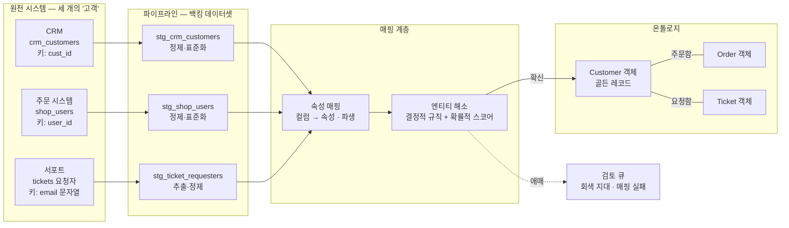
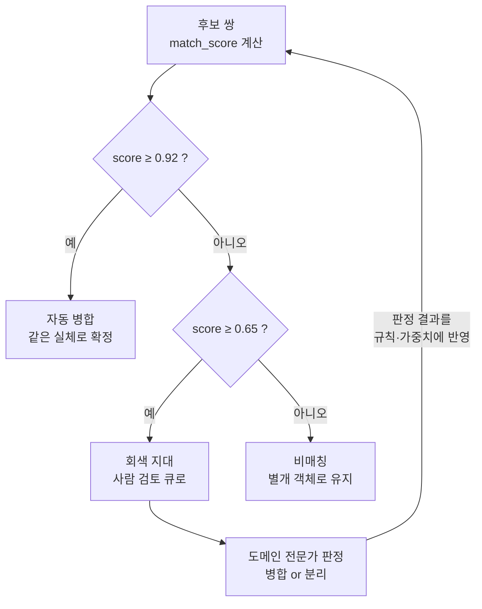

<figure class="post-figure post-figure--header">
<svg role="img" aria-label="이 글을 한 장으로 요약한 그림. 왼쪽에 식별자가 제각각인 세 원천 시스템(CRM은 cust_id, 주문 시스템은 user_id, 서포트는 email 문자열)이 테이블 카드로 서 있고, 각 카드에서 화살표가 가운데 '백킹 데이터셋 · 속성 매핑' 패널로 모인다. 패널 안에는 cust_nm이 name으로, email_norm이 email로 바뀌는 컬럼-속성 매핑 표가 보인다. 패널의 출력은 '엔티티 해소' 깔때기를 지나는데, 깔때기 안에는 결정적 규칙과 확률적 스코어가 적혀 있다. 확신한 결과는 금색 화살표로 오른쪽의 Customer 객체(골든 레코드)로 이어져 주문·티켓 객체와 링크로 연결된 작은 객체 그래프를 이루고, 애매한 결과는 점선을 따라 아래 검토 큐 트레이로 빠진다." viewBox="0 0 680 290" xmlns="http://www.w3.org/2000/svg">
  <title>데이터 매핑과 엔티티 해소 — 세 소스의 '고객'이 하나의 Customer 객체가 되기까지</title>
  <defs>
    <marker id="map-arr-s" viewBox="0 0 10 10" refX="8" refY="5" markerWidth="6" markerHeight="6" orient="auto-start-reverse">
      <path d="M0,0 L10,5 L0,10 z" fill="var(--secondary-color)"/>
    </marker>
    <marker id="map-arr-g" viewBox="0 0 10 10" refX="8" refY="5" markerWidth="6" markerHeight="6" orient="auto-start-reverse">
      <path d="M0,0 L10,5 L0,10 z" fill="var(--gold)"/>
    </marker>
    <marker id="map-arr-a" viewBox="0 0 10 10" refX="8" refY="5" markerWidth="6" markerHeight="6" orient="auto-start-reverse">
      <path d="M0,0 L10,5 L0,10 z" fill="var(--accent-color)"/>
    </marker>
  </defs>

  <!-- ===== title ===== -->
  <text x="340" y="22" text-anchor="middle" font-size="14" font-weight="800" fill="currentColor" letter-spacing="1.2">DATA MAPPING · ENTITY RESOLUTION</text>
  <text x="340" y="40" text-anchor="middle" font-size="9.5" fill="currentColor" opacity="0.72">세 개의 '고객'이 매핑과 해소를 거쳐 하나의 Customer가 된다</text>

  <!-- ===== source system cards (left) ===== -->
  <g>
    <rect x="18" y="62" width="122" height="56" rx="4" fill="var(--bg-light)" stroke="currentColor" stroke-width="1.8"/>
    <text x="79" y="77" text-anchor="middle" font-size="9" font-weight="700" fill="currentColor">CRM</text>
    <line x1="26" y1="83" x2="132" y2="83" stroke="currentColor" stroke-width="0.9" opacity="0.35"/>
    <text x="79" y="96" text-anchor="middle" font-size="7.5" fill="currentColor" opacity="0.85">crm_customers</text>
    <text x="79" y="109" text-anchor="middle" font-size="7.5" fill="currentColor" opacity="0.6">키: cust_id</text>

    <rect x="18" y="126" width="122" height="56" rx="4" fill="var(--bg-light)" stroke="currentColor" stroke-width="1.8"/>
    <text x="79" y="141" text-anchor="middle" font-size="9" font-weight="700" fill="currentColor">주문 시스템</text>
    <line x1="26" y1="147" x2="132" y2="147" stroke="currentColor" stroke-width="0.9" opacity="0.35"/>
    <text x="79" y="160" text-anchor="middle" font-size="7.5" fill="currentColor" opacity="0.85">shop_users</text>
    <text x="79" y="173" text-anchor="middle" font-size="7.5" fill="currentColor" opacity="0.6">키: user_id</text>

    <rect x="18" y="190" width="122" height="56" rx="4" fill="var(--bg-light)" stroke="currentColor" stroke-width="1.8"/>
    <text x="79" y="205" text-anchor="middle" font-size="9" font-weight="700" fill="currentColor">서포트</text>
    <line x1="26" y1="211" x2="132" y2="211" stroke="currentColor" stroke-width="0.9" opacity="0.35"/>
    <text x="79" y="224" text-anchor="middle" font-size="7.5" fill="currentColor" opacity="0.85">tickets 요청자</text>
    <text x="79" y="237" text-anchor="middle" font-size="7.5" fill="currentColor" opacity="0.6">키: email 문자열</text>
  </g>
  <text x="79" y="264" text-anchor="middle" font-size="8" font-weight="700" fill="currentColor" opacity="0.75">원천 시스템 — 식별자 제각각</text>

  <!-- arrows: sources → backing dataset panel -->
  <g stroke="var(--secondary-color)" stroke-width="2">
    <line x1="144" y1="90" x2="160" y2="122" marker-end="url(#map-arr-s)"/>
    <line x1="144" y1="154" x2="160" y2="154" marker-end="url(#map-arr-s)"/>
    <line x1="144" y1="218" x2="160" y2="186" marker-end="url(#map-arr-s)"/>
  </g>

  <!-- ===== backing dataset + property mapping panel (center) ===== -->
  <rect x="166" y="96" width="148" height="116" rx="5" fill="var(--bg-panel)" stroke="currentColor" stroke-width="2"/>
  <text x="240" y="112" text-anchor="middle" font-size="9.5" font-weight="700" fill="currentColor">백킹 데이터셋 · 속성 매핑</text>
  <line x1="176" y1="120" x2="304" y2="120" stroke="currentColor" stroke-width="0.9" opacity="0.3"/>
  <g font-size="7.5" fill="currentColor" text-anchor="middle">
    <text x="240" y="136">cust_nm <tspan fill="var(--secondary-color)" font-weight="700">→</tspan> name</text>
    <text x="240" y="152">email_norm <tspan fill="var(--secondary-color)" font-weight="700">→</tspan> email</text>
    <text x="240" y="168">created_at <tspan fill="var(--secondary-color)" font-weight="700">→</tspan> joined_date</text>
    <text x="240" y="184" opacity="0.75">+ is_active · tier <tspan opacity="0.8">(파생)</tspan></text>
  </g>
  <text x="240" y="201" text-anchor="middle" font-size="7" fill="currentColor" opacity="0.6">행 = 객체 · 컬럼 = 속성</text>
  <text x="240" y="228" text-anchor="middle" font-size="8" fill="currentColor" opacity="0.7">파이프라인 산출물 — 이미 정제됨</text>

  <!-- arrow: panel → funnel -->
  <line x1="318" y1="154" x2="332" y2="154" stroke="var(--secondary-color)" stroke-width="2.2" marker-end="url(#map-arr-s)"/>

  <!-- ===== entity-resolution funnel gate ===== -->
  <text x="381" y="99" text-anchor="middle" font-size="9.5" font-weight="700" fill="currentColor">엔티티 해소</text>
  <polygon points="338,106 424,140 424,168 338,202" fill="var(--bg-light)" stroke="var(--secondary-color)" stroke-width="2"/>
  <g font-size="7" fill="currentColor" text-anchor="middle" opacity="0.85">
    <text x="376" y="148">결정적 규칙</text>
    <text x="376" y="162">확률적 스코어</text>
  </g>

  <!-- gate output: confident merge -->
  <line x1="428" y1="152" x2="496" y2="130" stroke="var(--gold)" stroke-width="2.4" marker-end="url(#map-arr-g)"/>
  <text x="460" y="128" text-anchor="middle" font-size="7.5" font-weight="700" fill="var(--gold)">확신</text>

  <!-- gate output: gray zone → review queue -->
  <line x1="381" y1="190" x2="381" y2="228" stroke="var(--accent-color)" stroke-width="1.6" stroke-dasharray="4 3" opacity="0.8" marker-end="url(#map-arr-a)"/>
  <text x="396" y="214" text-anchor="start" font-size="7.5" font-weight="700" fill="var(--accent-color)">애매</text>
  <rect x="330" y="236" width="102" height="34" rx="3" fill="var(--bg-light)" stroke="currentColor" stroke-width="1.6" opacity="0.9"/>
  <text x="381" y="250" text-anchor="middle" font-size="8.5" font-weight="700" fill="currentColor">검토 큐</text>
  <text x="381" y="262" text-anchor="middle" font-size="7" fill="currentColor" opacity="0.65">회색 지대 · 실패 격리</text>

  <!-- ===== object graph (right) — links first, nodes on top ===== -->
  <g stroke="var(--secondary-color)" stroke-width="1.8" opacity="0.6">
    <line x1="545" y1="148" x2="524" y2="192"/>
    <line x1="580" y1="148" x2="618" y2="192"/>
  </g>
  <g font-size="6.5" fill="currentColor" opacity="0.7" text-anchor="middle">
    <text x="521" y="176">주문함</text>
    <text x="612" y="176">요청함</text>
  </g>
  <rect x="502" y="104" width="116" height="44" rx="5" fill="var(--bg-panel)" stroke="var(--gold)" stroke-width="2.5"/>
  <text x="560" y="122" text-anchor="middle" font-size="11" font-weight="700" fill="currentColor">Customer</text>
  <text x="560" y="136" text-anchor="middle" font-size="7.5" fill="currentColor" opacity="0.7">골든 레코드</text>
  <rect x="490" y="196" width="68" height="28" rx="5" fill="var(--bg-panel)" stroke="currentColor" stroke-width="2"/>
  <text x="524" y="214" text-anchor="middle" font-size="9" font-weight="700" fill="currentColor">주문</text>
  <rect x="584" y="196" width="68" height="28" rx="5" fill="var(--bg-panel)" stroke="currentColor" stroke-width="2"/>
  <text x="618" y="214" text-anchor="middle" font-size="9" font-weight="700" fill="currentColor">티켓</text>
  <text x="571" y="248" text-anchor="middle" font-size="8" fill="currentColor" opacity="0.7">소스 경계를 넘는 객체 그래프</text>
</svg>
<figcaption>세 원천 시스템의 '고객' 조각은 정제된 백킹 데이터셋에 속성 매핑으로 온톨로지의 어휘를 입고, 엔티티 해소 게이트(결정적 규칙 + 확률적 스코어)를 지나 하나의 Customer 객체 — 골든 레코드 — 로 합쳐진다. 확신하지 못한 쌍은 그래프 대신 검토 큐로 빠진다.</figcaption>
</figure>

## 들어가며

[3단계](/2026/07/19/ontology-object-types-properties.html)에서 객체 타입과 속성으로 도메인의 명사를 세우고, [4단계](/2026/07/19/ontology-link-types-relationships.html)에서 링크 타입으로 그 명사들을 그래프로 이었습니다. 화이트보드 위의 온톨로지는 이제 꽤 우아합니다 — Customer가 Order를 내고, Order가 Product를 담는, 도메인 전문가가 고개를 끄덕이는 모델. 그런데 여기서 실무의 진짜 질문이 시작됩니다. **그 Customer 객체는 대체 어디서 오는가?**

답은 낭만적이지 않습니다. 고객사의 현실에는 "고객 테이블" 하나가 있는 게 아니라, CRM의 `crm_customers`, 주문 시스템의 `shop_users`, 서포트 시스템의 `tickets` 안의 요청자 필드가 **따로따로** 있습니다. 세 시스템은 서로를 모르고, 식별자도 다르고(`cust_id` vs `user_id` vs 이메일 문자열), 같은 사람의 이름 표기조차 다릅니다(`홍길동` / `Gil-dong Hong` / `길동`). 개념 모델의 Customer 하나는 현실의 이 세 조각을 **묶어야만** 존재할 수 있습니다.

이 단계가 하는 일이 바로 그것입니다. 파이프라인이 만들어 낸 산출물을 객체 타입의 **백킹 데이터셋(backing dataset)**으로 연결하고, 컬럼을 속성으로 **매핑**하며, 여러 소스에 흩어진 같은 실체를 하나로 판정하는 **엔티티 해소(entity resolution)**를 수행합니다. 커리큘럼에서 예고했듯 이 단계는 실무에서 가장 손이 많이 가는 곳이고, **FDE(Forward Deployed Engineer) 업무의 실질적 무게중심**입니다 — 온톨로지 프로젝트의 성패는 대개 객체·링크 설계가 아니라 여기, 지저분한 데이터와 씨름하는 매핑 계층에서 갈립니다.

이 글은 [Ontology Essential Curriculum](/2026/07/19/ontology-essential-curriculum.html)의 5단계이자, 두 번째 막 "온톨로지를 짓기"의 마지막 관문입니다.

<div class="post-summary-box" markdown="1">

### 📌 이 글에서 다루는 내용

- **백킹 데이터셋과 속성 매핑**: 파이프라인 산출물이 객체 타입의 "물리적 뒷받침"이 되는 구조, 컬럼 → 속성 매핑과 타입 변환, 파생 속성, 그리고 "매핑 이전에 정제"라는 책임 분리
- **엔티티/식별자 해소**: 여러 소스의 같은 실체를 하나의 객체로 — 결정적(deterministic) 매칭과 확률적(probabilistic) 매칭, 매칭 신뢰도와 임계값 설계, 골든 레코드와 생존 규칙(survivorship)
- **지저분한 현실 다루기**: 중복·불일치·누락의 전형적 패턴, 데이터 품질이 온톨로지 신뢰성을 결정하는 이유, 매핑 실패의 운영적 처리(격리·검토 큐·모니터링)와 잘못된 병합/놓친 병합의 트레이드오프

</div>

## 한눈에 보기 — 세 개의 "고객"이 하나의 Customer가 되기까지

이 글의 스파인을 한 장으로 그리면 이렇습니다. 세 원천 시스템의 데이터가 파이프라인을 거쳐 정제된 백킹 데이터셋이 되고, 속성 매핑으로 온톨로지의 어휘를 입은 뒤, 엔티티 해소 게이트를 통과하며 하나의 Customer 객체로 합쳐집니다. 자신 있게 판정하지 못한 레코드는 그래프를 오염시키는 대신 검토 큐로 빠집니다.



그림에서 눈여겨볼 것은 흐름의 **방향**입니다. 온톨로지는 원천 데이터를 직접 만지지 않습니다 — 파이프라인이 만든 데이터셋을 *읽어서* 객체를 채웁니다. 이 한 겹의 간접화가 이 글 전체를 관통하는 설계 원칙입니다.

## 백킹 데이터셋 — 객체 타입의 물리적 뒷받침

### 개념 모델은 데이터셋 위에 선다

3~4단계에서 만든 객체 타입·링크 타입은 어디까지나 **논리적 정의**입니다. "Customer 객체 타입에는 name, email, tier 속성이 있다"는 선언은, 그 속성값을 실제로 채워 줄 물리 데이터가 있어야 비로소 객체 *인스턴스*가 됩니다. 그 물리 데이터가 **백킹 데이터셋**입니다 — 객체 타입 하나를 물리적으로 뒷받침하는, 파이프라인의 최종 산출물 테이블.

구조는 단순한 규약으로 요약됩니다.

- **데이터셋의 행(row) 하나 = 객체 인스턴스 하나.** `customers_backing` 데이터셋에 12만 행이 있으면 Customer 객체가 12만 개 존재합니다.
- **데이터셋의 컬럼 = 객체의 속성 후보.** 어떤 컬럼이 어떤 속성이 되는지는 매핑 정의가 결정합니다.
- **기본키 컬럼 = 객체의 기본키.** 3단계에서 강조한 유일 식별이 여기서 물리적으로 강제됩니다. 백킹 데이터셋에 중복 키가 있으면 객체 동기화 자체가 실패합니다.
- **링크의 백킹**: 4단계의 링크 타입도 마찬가지로 데이터에서 옵니다 — 1:N 링크는 백킹 데이터셋의 외래키 컬럼에서, N:M 링크는 별도의 조인 데이터셋에서.

이 규약이 뜻하는 바가 중요합니다. **온톨로지 계층은 데이터를 새로 저장하는 곳이 아니라, 이미 파이프라인이 만든 데이터에 의미를 입히는 곳**입니다. 추출·적재·변환·품질 검증 — 백킹 데이터셋이 만들어지기까지의 여정은 [Data Engineering Essential Curriculum](/2026/06/25/data-engineering-essential-curriculum.html)에서 다룬 파이프라인 그 자체이며, 온톨로지는 그 종착역의 소비자입니다.

### 책임 분리 — 정제는 파이프라인에서, 의미는 매핑에서

여기서 실무 원칙 하나를 분명히 해 둡니다. **백킹 데이터셋은 이미 정제된 데이터여야 합니다.** 원천 테이블(raw)을 곧바로 객체 타입에 물리고 싶은 유혹이 있지만, 그러면 타입 캐스팅·널 처리·표기 통일 같은 정제 로직이 매핑 계층에 스며들어 두 계층의 책임이 뒤엉킵니다.

건강한 분업은 이렇습니다.

| 계층 | 책임 | 예 |
| --- | --- | --- |
| **파이프라인 (staging → 정제)** | 타입 통일, 널·이상치 처리, 표기 표준화, 중복 제거, 품질 검증 | `"2026.07.01"` → `DATE`, 전화번호 E.164 표준화, 이메일 소문자화 |
| **매핑 계층** | 컬럼 → 속성 연결, 표시 이름, 파생 속성, 엔티티 해소 | `cust_nm` 컬럼 → `name` 속성, 최근 주문일로 `활성 고객` 파생 |
| **온톨로지** | 객체·링크·의미, 탐색과 (다음 단계의) 액션 | Customer 객체 그래프 |

정제가 파이프라인에 있어야 하는 실질적 이유는 **재사용**입니다. 표준화된 `stg_crm_customers`는 온톨로지만이 아니라 대시보드·ML 피처·다른 마트도 함께 쓰는 자산이 됩니다. 매핑 계층에 숨은 정제 로직은 온톨로지만 아는 비밀이 되어, 곧 "온톨로지의 숫자와 대시보드의 숫자가 다른" 사고로 돌아옵니다.

### 속성 매핑 — 컬럼에 온톨로지의 어휘를 입히기

백킹 데이터셋이 준비되면 매핑은 선언적인 작업입니다. CRM 백킹 데이터셋을 Customer 객체 타입에 매핑하는 정의를 의사-설정으로 표현하면 이렇습니다.

```yaml
object_type: Customer
backing_dataset: analytics.customers_backing   # 파이프라인 최종 산출물
primary_key: customer_id                       # 행당 유일 — 위반 시 동기화 실패

property_mappings:
  - column: customer_id
    property: customer_id        # 식별자 — 내부용, 화면 표시는 안 함
  - column: full_name
    property: name               # 표시 이름(title property)으로 지정
  - column: email_norm
    property: email              # 파이프라인에서 이미 소문자·트림 처리됨
  - column: created_at
    property: joined_date
    type: date
  - column: lifetime_value_krw
    property: lifetime_value
    type: decimal

derived_properties:
  - property: is_active          # 파생 속성 — 원천에 없는 도메인 개념
    expression: "last_order_date >= today() - 90d"
  - property: tier               # 여러 컬럼을 조합한 도메인 판단
    expression: "case when lifetime_value >= 10000000 then 'VIP' else 'STANDARD' end"
```

주석 몇 가지를 붙이면 —

- **이름 번역이 매핑의 절반입니다.** 원천의 `cust_nm`, `email_norm` 같은 시스템 어휘가 온톨로지에서는 `name`, `email`이라는 **도메인 어휘**가 됩니다. 1단계에서 말한 "공유 어휘로서의 온톨로지"가 물리적으로 실현되는 지점이 바로 이 이름 붙이기입니다. 도메인 전문가가 읽고 "우리 말이 맞다"고 확인해 줄 수 있어야 좋은 매핑입니다.
- **파생 속성은 도메인 판단의 코드화입니다.** `is_active`(90일 내 주문), `tier`(LTV 구간) 같은 속성은 어느 원천 컬럼에도 없지만 도메인에는 분명히 존재하는 개념입니다. 이런 판단을 소비자마다 제각각 SQL로 구현하게 두는 대신 매핑 계층에서 **한 번** 정의해 두면, 조직 전체가 같은 "활성 고객" 정의를 공유합니다.
- **매핑은 버전 관리 대상입니다.** 원천 스키마가 바뀌면 매핑도 바뀝니다. 매핑 정의를 코드(설정 파일)로 두고 리뷰·이력을 남기는 것이 7단계에서 다룰 거버넌스의 출발점입니다.

여기까지가 소스 **하나**를 객체 타입에 잇는 일입니다. 문제는 — 소스가 하나인 경우가 거의 없다는 것입니다.

## 엔티티 해소 — 흩어진 같은 실체를 하나로

### 문제의 형태: 세 시스템, 세 명의 "홍길동", 한 명의 고객

구체적인 상황을 놓고 이야기합시다. 고객사에 세 시스템이 있습니다.

| | CRM (`crm_customers`) | 주문 시스템 (`shop_users`) | 서포트 (`tickets`) |
| --- | --- | --- | --- |
| 식별자 | `cust_id: C-10442` | `user_id: 88213` | 요청자 이메일 문자열 |
| 이름 | `홍길동` | `Gil-dong Hong` | `길동` |
| 이메일 | `gildong.hong@example.com` | `GILDONG.HONG@example.com` | `gildong.hong@example.com` |
| 전화 | `010-1234-5678` | (없음) | `+82-10-1234-5678` |
| 갖고 있는 것 | 영업 이력, 등급 | 주문 이력 | 문의 이력 |

세 레코드는 물리적으로 완전히 다른 행이지만, 도메인의 눈에는 **한 명의 고객**입니다. 온톨로지가 "이 고객의 주문 이력과 문의 이력을 한 화면에서 보고 싶다"는 요구에 답하려면, 이 세 조각이 하나의 Customer 객체로 **해소(resolve)**되어야 합니다. 이것이 **엔티티 해소** — 식별자 체계가 다른 여러 소스에서 같은 실세계 실체를 찾아 묶는 문제입니다.

핵심 난점은 **전역 공통 키가 없다**는 것입니다. `C-10442`와 `88213` 사이에는 아무 관계가 없습니다. 묶을 근거는 이메일·전화·이름 같은 **준식별자(quasi-identifier)**뿐인데, 이들은 유일하지도(가족이 이메일 공유), 안정적이지도(전화번호 변경), 깨끗하지도(표기 변형) 않습니다. 그래서 해소 전략은 확실한 것부터 단계적으로 내려갑니다.

### 결정적 매칭 — 규칙으로 확정할 수 있는 것부터

**결정적(deterministic) 매칭**은 "이 조건이 맞으면 같은 실체다"라고 단언할 수 있는 규칙 기반 매칭입니다. 정규화를 전제로 한 정확 일치가 기본형입니다.

```sql
-- 규칙 1: 정규화된 이메일 정확 일치 (가장 신뢰도 높은 규칙)
-- 전제: 파이프라인에서 lower(trim(email)) 정규화 완료
SELECT c.cust_id, s.user_id
FROM stg_crm_customers c
JOIN stg_shop_users    s ON c.email_norm = s.email_norm;

-- 규칙 2: 정규화된 전화번호(E.164) 일치 + 성(姓) 일치
SELECT c.cust_id, s.user_id
FROM stg_crm_customers c
JOIN stg_shop_users    s
  ON  c.phone_e164 = s.phone_e164
  AND c.last_name_norm = s.last_name_norm;
```

결정적 규칙의 장점은 명확합니다 — **설명 가능하고, 재현 가능하고, 도메인 전문가와 합의 가능**합니다. "이메일이 같으면 같은 고객으로 본다"는 규칙은 비즈니스가 승인할 수 있는 문장입니다. B2B 도메인이라면 사업자등록번호, 의료라면 주민등록 기반 식별처럼 도메인에 **권위 있는 식별자**가 있을 때 특히 강력합니다.

한계도 명확합니다. 위 예시의 홍길동은 규칙 1로 CRM↔주문↔서포트가 모두 묶입니다(이메일 정규화 덕분에 대문자 표기도 흡수). 그러나 이메일을 시스템마다 다르게 등록한 고객, 이메일이 아예 없는 레코드, 오타가 난 레코드는 결정적 규칙의 그물을 빠져나갑니다. 현실 데이터에서 결정적 매칭만으로 묶이는 비율은 도메인에 따라 절반에도 못 미치기도 합니다. 나머지를 위해 확률의 세계로 갑니다.

### 확률적 매칭 — 유사도의 무게를 합산하기

**확률적(probabilistic) 매칭**은 여러 필드의 유사도를 각각 점수화해 가중 합산하고, 총점으로 "같은 실체일 가능성"을 판정합니다. 고전적으로는 Fellegi-Sunter 프레임워크로 정식화된 접근이고, 실무 도구(Splink, Zingg, Dedupe 등)의 뼈대이기도 합니다. 개념 골격은 이렇게 요약됩니다.

```python
# 개념 골격 — 필드별 유사도의 가중 합산 (실무에서는 Splink 같은 전용 도구 사용)
def match_score(a: Record, b: Record) -> float:
    score = 0.0
    # 각 필드: 일치의 희소성이 클수록 큰 가중치
    score += 0.45 * exact(a.email_norm, b.email_norm)        # 이메일 일치는 강한 증거
    score += 0.25 * exact(a.phone_e164, b.phone_e164)        # 전화 일치도 강한 증거
    score += 0.15 * jaro_winkler(a.name_norm, b.name_norm)   # 이름은 유사도로 (표기 변형 흡수)
    score += 0.10 * exact(a.birth_date, b.birth_date)
    score += 0.05 * same_region(a.address, b.address)        # 주소는 약한 증거
    return score  # 0.0 ~ 1.0
```

두 가지 실무 감각을 함께 챙겨야 합니다.

- **가중치는 "일치의 희소성"을 따릅니다.** 이메일이 같은 두 레코드가 남남일 확률은 극히 낮으므로 큰 가중치를, "성이 김씨로 같음"은 흔한 우연이므로 작은 가중치를 받습니다. 좋은 도구는 이 가중치를 데이터에서 통계적으로 추정합니다.
- **전수 비교는 불가능하므로 블로킹(blocking)이 필수입니다.** 레코드 10만 × 10만이면 후보 쌍이 100억 개입니다. 같은 이메일 도메인, 같은 지역, 이름 첫 글자 같은 **블로킹 키**로 비교 대상을 먼저 좁히고, 좁힌 후보 쌍에만 스코어링을 돌립니다. 블로킹이 너무 좁으면 진짜 쌍을 놓치고, 너무 넓으면 계산이 터지는 — 이것도 트레이드오프입니다.

### 매칭 신뢰도 — 점수를 세 구간으로 자르기

스코어가 나오면 판정입니다. 중요한 것은 임계값을 **하나가 아니라 둘** 두는 것입니다.



- **상한 이상(예: 0.92↑)**: 자동 병합. 이메일도 전화도 이름도 맞는 쌍 — 기계가 확정해도 됩니다.
- **하한 미만(예: 0.65↓)**: 비매칭. 억지로 묶지 않고 별개 객체로 둡니다.
- **그 사이 — 회색 지대**: 기계가 확신하지 못하는 쌍은 **사람의 검토 큐**로 보냅니다. 도메인 전문가가 병합/분리를 판정하고, 그 판정이 다시 규칙과 가중치를 개선하는 피드백 루프가 됩니다.

임계값을 어디에 두느냐는 기술 문제가 아니라 **비용 문제**입니다. 잘못된 병합(false merge)은 남의 주문·문의가 한 고객에 합쳐지는 사고 — 신뢰를 즉시 무너뜨리고 되돌리기도 어렵습니다. 놓친 병합(missed merge)은 한 고객이 둘로 보이는 불완전함 — 아쉽지만 나중에 병합하면 됩니다. **분리는 되돌리기 쉽고 병합은 되돌리기 어렵다**는 비대칭 때문에, 실무 임계값은 대개 보수적으로(자동 병합을 어렵게) 잡습니다.

### 골든 레코드 — 묶었으면 대표를 세운다

세 레코드가 같은 실체로 판정되면, 이제 Customer 객체 **하나**의 속성값을 정해야 합니다. 이름은 `홍길동`인가 `Gil-dong Hong`인가? 이 "필드별 대표값 선출"의 결과가 **골든 레코드(golden record)**이고, 선출 규칙을 **생존 규칙(survivorship rules)**이라 부릅니다.

| 속성 | 생존 규칙 | 홍길동의 골든 레코드 |
| --- | --- | --- |
| `customer_id` | 새로 발급한 온톨로지 전역 ID | `CUST-000731` |
| `name` | **신뢰 소스 우선** — CRM(영업이 직접 관리)이 권위 | `홍길동` (CRM) |
| `email` | 소스 간 동일 — 정규화값 채택 | `gildong.hong@example.com` |
| `phone` | **최신값 우선** — 최근 갱신된 소스 | `+82-10-1234-5678` (서포트) |
| `tier` | CRM 단독 보유 — 그대로 | `VIP` |
| `source_ids` | **계보 보존** — 원천 식별자 전부 유지 | `{crm: C-10442, shop: 88213}` |

규칙의 전형은 세 가지입니다 — **소스 우선순위**(이 필드는 이 시스템이 권위다), **최신성**(가장 최근에 갱신된 값), **완전성**(널이 아닌 값·더 상세한 값). 그리고 마지막 행이 조용히 중요합니다. **원천 식별자를 버리지 않고 `source_ids`로 보존**해야, "이 객체의 이 값은 어디서 왔는가"라는 계보(lineage) 질문에 답할 수 있고, 훗날 잘못된 병합을 발견했을 때 **분리(unmerge)**할 수 있습니다. 원천 흔적을 지운 골든 레코드는 되돌릴 수 없는 골든 레코드입니다.

이렇게 완성된 골든 레코드 데이터셋이 곧 Customer 객체 타입의 백킹 데이터셋이 됩니다 — 그리고 해소 과정에서 만들어진 `crm_id ↔ 전역 ID`, `shop_user_id ↔ 전역 ID` 대응표(crosswalk)는 링크의 백킹이 됩니다. 주문 시스템의 주문 행은 `user_id: 88213`만 알지만, 대응표를 거치면 `CUST-000731`에 연결되어 4단계의 "주문함" 링크가 세 시스템을 가로질러 성립합니다. **엔티티 해소는 객체만 만드는 게 아니라, 소스 경계를 넘는 링크를 가능하게 하는 기반 공사**입니다.

<figure class="post-figure">
<svg role="img" aria-label="골든 레코드 선출 과정을 보여주는 그림. 왼쪽에 세 소스 레코드 카드가 세로로 서 있다. CRM 카드(cust_id C-10442)에는 이름 홍길동, 이메일, 등급 VIP가 있고, 주문 시스템 카드(user_id 88213)에는 흐리게 표시된 이름 Gil-dong Hong과 이메일이, 서포트 카드에는 흐리게 표시된 이름 길동과 이메일, 그리고 최신 전화번호가 있다. 각 카드의 채택된 필드에서 오른쪽 골든 레코드 카드로 화살표가 이어진다. 이름과 등급은 CRM에서 금색 화살표(신뢰 소스 우선), 전화는 서포트에서 금색 화살표(최신값 우선), 이메일은 세 카드 공통의 정규화값에서 가는 화살표로 모인다. 골든 레코드 카드에는 name 홍길동, tier VIP, email, phone이 채워져 있고, 하단에 crm C-10442와 shop 88213 두 개의 source_ids 배지가 계보 보존을 나타낸다." viewBox="0 0 640 320" xmlns="http://www.w3.org/2000/svg">
  <title>골든 레코드 — 생존 규칙으로 필드별 대표값을 선출하고 source_ids로 계보를 보존한다</title>
  <defs>
    <marker id="gr-arr-g" viewBox="0 0 10 10" refX="8" refY="5" markerWidth="6" markerHeight="6" orient="auto-start-reverse">
      <path d="M0,0 L10,5 L0,10 z" fill="var(--gold)"/>
    </marker>
    <marker id="gr-arr-s" viewBox="0 0 10 10" refX="8" refY="5" markerWidth="6" markerHeight="6" orient="auto-start-reverse">
      <path d="M0,0 L10,5 L0,10 z" fill="var(--secondary-color)"/>
    </marker>
  </defs>

  <text x="320" y="24" text-anchor="middle" font-size="11.5" font-weight="800" fill="currentColor">생존 규칙 — 필드별로 대표값을 선출한다</text>

  <!-- ===== source record cards (left) ===== -->
  <!-- CRM -->
  <rect x="24" y="42" width="170" height="78" rx="4" fill="var(--bg-light)" stroke="currentColor" stroke-width="1.8"/>
  <text x="34" y="58" text-anchor="start" font-size="8.5" font-weight="700" fill="currentColor">CRM — cust_id: C-10442</text>
  <line x1="32" y1="64" x2="186" y2="64" stroke="currentColor" stroke-width="0.9" opacity="0.35"/>
  <g font-size="7" fill="currentColor" opacity="0.55" text-anchor="start">
    <text x="34" y="78">name</text>
    <text x="34" y="92">email</text>
    <text x="34" y="106">tier</text>
  </g>
  <text x="76" y="78" text-anchor="start" font-size="8" font-weight="700" fill="var(--gold)">홍길동</text>
  <text x="76" y="92" text-anchor="start" font-size="7.5" fill="currentColor" opacity="0.8">gildong.hong@example.com</text>
  <text x="76" y="106" text-anchor="start" font-size="8" font-weight="700" fill="var(--gold)">VIP</text>

  <!-- 주문 시스템 -->
  <rect x="24" y="134" width="170" height="64" rx="4" fill="var(--bg-light)" stroke="currentColor" stroke-width="1.8"/>
  <text x="34" y="150" text-anchor="start" font-size="8.5" font-weight="700" fill="currentColor">주문 시스템 — user_id: 88213</text>
  <line x1="32" y1="156" x2="186" y2="156" stroke="currentColor" stroke-width="0.9" opacity="0.35"/>
  <g font-size="7" fill="currentColor" opacity="0.55" text-anchor="start">
    <text x="34" y="170">name</text>
    <text x="34" y="184">email</text>
  </g>
  <text x="76" y="170" text-anchor="start" font-size="8" fill="currentColor" opacity="0.38">Gil-dong Hong</text>
  <text x="76" y="184" text-anchor="start" font-size="7.5" fill="currentColor" opacity="0.8">gildong.hong@example.com</text>

  <!-- 서포트 -->
  <rect x="24" y="212" width="170" height="78" rx="4" fill="var(--bg-light)" stroke="currentColor" stroke-width="1.8"/>
  <text x="34" y="228" text-anchor="start" font-size="8.5" font-weight="700" fill="currentColor">서포트 — email 키</text>
  <line x1="32" y1="234" x2="186" y2="234" stroke="currentColor" stroke-width="0.9" opacity="0.35"/>
  <g font-size="7" fill="currentColor" opacity="0.55" text-anchor="start">
    <text x="34" y="248">name</text>
    <text x="34" y="262">email</text>
    <text x="34" y="276">phone</text>
  </g>
  <text x="76" y="248" text-anchor="start" font-size="8" fill="currentColor" opacity="0.38">길동</text>
  <text x="76" y="262" text-anchor="start" font-size="7.5" fill="currentColor" opacity="0.8">gildong.hong@example.com</text>
  <text x="76" y="276" text-anchor="start" font-size="8" font-weight="700" fill="var(--gold)">+82-10-1234-5678 <tspan font-weight="400" fill="currentColor" opacity="0.6">(최신)</tspan></text>

  <text x="109" y="308" text-anchor="middle" font-size="8" font-weight="700" fill="currentColor" opacity="0.75">소스 레코드 — 같은 실체, 세 조각</text>

  <!-- ===== survivorship arrows ===== -->
  <!-- email: common across all three (thin, secondary) -->
  <g stroke="var(--secondary-color)" stroke-width="1.4" opacity="0.55">
    <line x1="198" y1="89" x2="414" y2="151" marker-end="url(#gr-arr-s)"/>
    <line x1="198" y1="181" x2="414" y2="151" marker-end="url(#gr-arr-s)"/>
    <line x1="198" y1="259" x2="414" y2="151" marker-end="url(#gr-arr-s)"/>
  </g>
  <text x="330" y="178" text-anchor="middle" font-size="7.5" font-weight="700" fill="var(--secondary-color)">셋 공통 — 정규화값</text>

  <!-- name: CRM wins (trusted source) -->
  <line x1="198" y1="75" x2="414" y2="105" stroke="var(--gold)" stroke-width="2.2" marker-end="url(#gr-arr-g)"/>
  <text x="306" y="84" text-anchor="middle" font-size="7.5" font-weight="700" fill="var(--gold)">신뢰 소스 우선</text>

  <!-- tier: CRM only -->
  <line x1="198" y1="103" x2="414" y2="128" stroke="var(--gold)" stroke-width="2.2" marker-end="url(#gr-arr-g)"/>

  <!-- phone: support wins (most recent) -->
  <line x1="198" y1="273" x2="414" y2="174" stroke="var(--gold)" stroke-width="2.2" marker-end="url(#gr-arr-g)"/>
  <text x="306" y="237" text-anchor="middle" font-size="7.5" font-weight="700" fill="var(--gold)">최신값 우선</text>

  <!-- ===== golden record card (right) ===== -->
  <rect x="418" y="58" width="200" height="182" rx="5" fill="var(--bg-panel)" stroke="var(--gold)" stroke-width="2.5"/>
  <text x="518" y="76" text-anchor="middle" font-size="11" font-weight="700" fill="currentColor">골든 레코드</text>
  <text x="518" y="89" text-anchor="middle" font-size="7.5" fill="currentColor" opacity="0.7">Customer · CUST-000731</text>
  <line x1="428" y1="95" x2="608" y2="95" stroke="currentColor" stroke-width="0.9" opacity="0.3"/>
  <g font-size="7" fill="currentColor" opacity="0.55" text-anchor="start">
    <text x="430" y="108">name</text>
    <text x="430" y="131">tier</text>
    <text x="430" y="154">email</text>
    <text x="430" y="177">phone</text>
  </g>
  <g text-anchor="start" fill="currentColor">
    <text x="470" y="108" font-size="8.5" font-weight="700">홍길동</text>
    <text x="470" y="131" font-size="8.5" font-weight="700">VIP</text>
    <text x="470" y="154" font-size="7.5">gildong.hong@example.com</text>
    <text x="470" y="177" font-size="8.5" font-weight="700">+82-10-1234-5678</text>
  </g>
  <line x1="428" y1="189" x2="608" y2="189" stroke="currentColor" stroke-width="0.9" opacity="0.3"/>
  <text x="430" y="203" text-anchor="start" font-size="7.5" fill="currentColor" opacity="0.65">source_ids — 계보 보존 · unmerge 가능</text>
  <rect x="430" y="211" width="84" height="16" rx="8" fill="var(--bg-light)" stroke="currentColor" stroke-width="1.2" opacity="0.9"/>
  <text x="472" y="222" text-anchor="middle" font-size="7" font-weight="700" fill="currentColor">crm: C-10442</text>
  <rect x="522" y="211" width="80" height="16" rx="8" fill="var(--bg-light)" stroke="currentColor" stroke-width="1.2" opacity="0.9"/>
  <text x="562" y="222" text-anchor="middle" font-size="7" font-weight="700" fill="currentColor">shop: 88213</text>
</svg>
<figcaption>필드별 대표값 선출 — 이름·등급은 신뢰 소스(CRM)에서, 전화는 최신값(서포트)에서 금색 화살표로 채택되고, 이메일은 셋 공통의 정규화값을 쓴다. 탈락한 표기는 흐리게 남지만, 원천 식별자는 source_ids 배지로 보존되어 계보 추적과 병합 취소(unmerge)를 가능하게 한다.</figcaption>
</figure>

## 지저분한 현실 다루기 — 품질이 곧 온톨로지의 신뢰성

### 매핑 계층이 매일 만나는 세 가지 적

교과서의 엔티티 해소는 여기서 끝나지만, 현장의 매핑 계층은 계속 공격받습니다. 전형적인 세 가지입니다.

- **중복(duplicates)**: 한 소스 *안*의 중복 — 같은 고객이 CRM에 두 번 등록된 경우. 소스 간 해소 이전에 소스 내 **중복 제거(deduplication)**가 먼저입니다(기법은 동일 — 자기 자신과의 엔티티 해소입니다). 소스 내 중복을 남긴 채 소스 간 매칭을 돌리면 매칭 그래프가 얽혀 사고가 배가됩니다.
- **불일치(inconsistencies)**: 같은 실체의 값이 소스마다 다른 경우 — 등급이 CRM에선 VIP, 주문 시스템에선 STANDARD. 생존 규칙이 대표값을 정해 주지만, **불일치 자체가 신호**일 때가 많습니다(한쪽 시스템의 갱신 파이프라인이 죽어 있다든가). 대표값으로 덮고 끝내지 말고 불일치율을 관측해야 합니다.
- **누락(missing values)**: 매칭의 근거가 될 준식별자가 비어 있는 경우. 이메일 없는 레코드는 이메일 규칙에 아예 참여하지 못하므로, 누락률이 높은 필드에 의존하는 매칭 전략은 설계부터 다시 생각해야 합니다.

이 적들과의 싸움을 관통하는 명제는 하나입니다 — **온톨로지의 신뢰성은 모델의 우아함이 아니라 데이터 품질이 결정합니다.** 사용자는 온톨로지를 "우리 조직의 현실을 비추는 거울"로 씁니다. 거울에 비친 고객이 실제와 다르면 — 남의 주문이 붙어 있거나, 한 고객이 셋으로 보이면 — 사용자는 모델이 아니라 **온톨로지 전체**를 불신하게 되고, 그 신뢰는 좀처럼 회복되지 않습니다. 품질 검증의 차원(정확성·완전성·일관성·적시성·유일성)과 그 방어선은 [데이터 품질·거버넌스 오버뷰](/2026/06/25/data-quality-governance.html)에서 다뤘습니다 — 그 방어선이 백킹 데이터셋 **앞**에 서 있어야, 매핑 계층은 자기 일(의미와 해소)에 집중할 수 있습니다.

### 매핑 실패의 운영적 처리 — 조용히 버리지 않는다

파이프라인이 아무리 잘해도 매핑 계층 자체의 실패는 남습니다 — 기본키가 중복된 행, 필수 속성이 널인 행, 타입 캐스팅이 안 되는 값, 어떤 규칙에도 걸리지 않아 소속을 못 찾은 레코드. 이때 최악의 선택은 **조용히 버리는 것**이고, 차악은 **전체를 세우는 것**입니다. 운영 가능한 매핑 계층은 세 원칙으로 짓습니다.

1. **격리(quarantine)하되 흘려보낸다.** 실패한 행은 격리 테이블(검토 큐)로 빠지고, 성공한 행은 계속 객체가 됩니다. 행 하나 때문에 12만 고객의 동기화를 세우지 않습니다 — Kafka 파이프라인의 [dead letter queue](/2026/07/15/kafka-connect-cdc.html)와 정확히 같은 발상입니다. 그리고 DLQ와 같은 경고도 그대로 적용됩니다: **격리 큐는 버리는 곳이 아니라 대기실**입니다. 적체 건수와 증가율을 모니터링하고, 조사·수정·재주입 절차를 갖춰야 "조용한 데이터 유실"이 되지 않습니다.
2. **실패를 계측한다.** 매핑 성공률, 소스별 해소율(결정적/확률적/미해소 비율), 격리 큐 적체, 회색 지대 판정 대기 건수, 병합 취소(unmerge) 발생 수 — 이 지표들이 매핑 계층의 건강 대시보드입니다. 해소율이 어느 날 뚝 떨어지면 원천 스키마 변경이나 정규화 로직의 회귀를 의심할 수 있습니다.
3. **미해소를 모델에 정직하게 드러낸다.** 소속을 못 찾은 레코드를 억지로 어딘가에 붙이는 대신, "미확인" 상태의 객체로 두거나 낮은 신뢰도 표시와 함께 노출합니다. 온톨로지가 모르는 것을 아는 척하는 순간부터 거울은 왜곡되기 시작합니다.

마지막으로, 엔티티 해소는 **한 번의 배치가 아니라 계속되는 프로세스**임을 기억해야 합니다. 내일도 새 고객이 등록되고, 새 소스가 붙고, 회색 지대 판정이 쌓이며 규칙이 진화합니다. 매핑과 해소를 일회성 마이그레이션 스크립트가 아니라 **파이프라인의 상시 단계**로 설계하는 것 — 그리고 그 규칙 변경을 리뷰·버전 관리하는 것 — 이 이 계층을 오래 살리는 방법이며, 후자는 7단계 거버넌스의 주제로 이어집니다.

## 정리

개념 모델과 실제 데이터를 잇는 5단계를 정복했습니다. 요점은 다음과 같습니다.

- **객체는 백킹 데이터셋에서 온다**: 데이터셋 행 하나 = 객체 하나, 컬럼 = 속성, 기본키 = 객체 식별자. 온톨로지는 데이터를 새로 저장하는 곳이 아니라 파이프라인 산출물에 의미를 입히는 곳이다.
- **정제는 파이프라인, 의미는 매핑**: 백킹 데이터셋은 이미 정제된 데이터여야 한다. 매핑 계층은 시스템 어휘(`cust_nm`)를 도메인 어휘(`name`)로 번역하고, `is_active` 같은 도메인 판단을 파생 속성으로 한 번만 정의해 조직이 공유하게 한다.
- **엔티티 해소는 확실한 것부터 단계적으로**: 권위 있는 식별자의 결정적 매칭(설명 가능, 합의 가능) → 확률적 매칭(필드별 유사도의 가중 합산 + 블로킹) 순서로 내려간다. 전역 공통 키가 없다는 것이 이 문제의 본질이다.
- **임계값은 둘, 회색 지대는 사람에게**: 자동 병합 / 검토 큐 / 비매칭의 3구간 설계. 잘못된 병합은 되돌리기 어렵고 놓친 병합은 되돌리기 쉽다는 비대칭 때문에 임계값은 보수적으로 잡는다.
- **골든 레코드는 계보와 함께**: 생존 규칙(소스 우선순위·최신성·완전성)으로 대표값을 선출하되 `source_ids`를 보존해 계보 추적과 병합 취소를 가능하게 한다. 해소가 만든 식별자 대응표는 소스 경계를 넘는 링크의 기반이 된다.
- **품질이 신뢰성을 결정한다**: 중복·불일치·누락과의 싸움에서 지면 사용자는 온톨로지 전체를 불신한다. 매핑 실패는 조용히 버리지도, 전체를 세우지도 말고 — 격리하고, 계측하고, 정직하게 드러낸다. 그리고 해소는 배치가 아니라 상시 프로세스다.

이제 온톨로지는 실제 데이터로 채워진, 살아 있는 객체 그래프가 되었습니다. 두 번째 막 "온톨로지를 짓기"가 여기서 끝납니다. 다음 질문은 방향이 다릅니다 — 이 그래프를 *읽는* 데서 멈추지 않고, 그 위에서 **결정을 내리고 세계를 바꾸려면** 무엇이 필요한가? 읽기 모델을 행동의 시스템으로 바꾸는 액션과 write-back이 다음 단계의 주제입니다.

### 다음 학습 (Next Learning)

- [액션과 운영 계층: 읽기 모델을 행동의 시스템으로](/2026/07/19/ontology-actions-writeback.html) — 6단계: 이 글에서 세운 객체 그래프 위에 통제된 변경과 write-back을 얹기
- [링크 타입과 관계](/2026/07/19/ontology-link-types-relationships.html) — 4단계: 엔티티 해소의 대응표가 가능하게 하는, 소스 경계를 넘는 링크의 모델
- [Data Engineering Essential Curriculum](/2026/06/25/data-engineering-essential-curriculum.html) — 백킹 데이터셋을 만들어 내는 파이프라인 전반의 지도
- [데이터 품질과 거버넌스](/2026/06/25/data-quality-governance.html) — 매핑 계층 앞에 세워야 할 품질 방어선의 차원과 도구
- [Ontology Essential Curriculum](/2026/07/19/ontology-essential-curriculum.html) — 시리즈 로드맵으로 돌아가 진행 상황 확인하기
