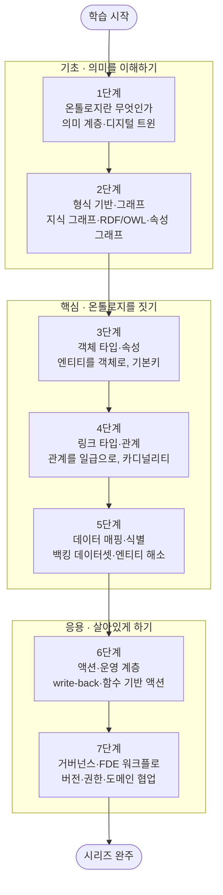

<figure class="post-figure post-figure--header">
<svg role="img" aria-label="온톨로지 기반 데이터 모델링을 한 장으로 정리한 그림. 위쪽은 데이터의 여정으로, 왼쪽에 흩어진 원천 데이터셋(표 세 개)이 '매핑'을 거쳐 가운데 온톨로지의 객체 그래프(고객·주문·제품·설비 네 객체가 링크로 연결됨)로 모이고, 다시 '운영·액션'을 거쳐 오른쪽의 결정·행동으로 이어진다. 아래쪽은 온톨로지 개념·형식 기반·객체·링크·데이터 매핑·액션·거버넌스로 이어지는 7단계 로드맵 타임라인이며, 끝에는 시리즈 완주를 뜻하는 트로피가 놓여 있다." viewBox="0 0 680 360" xmlns="http://www.w3.org/2000/svg">
  <title>Ontology Essential — 원천 데이터를 객체 그래프로, 다시 행동으로 · 7단계 도장깨기 로드맵</title>
  <defs>
    <marker id="ont-arrow" viewBox="0 0 10 10" refX="8" refY="5" markerWidth="6" markerHeight="6" orient="auto-start-reverse">
      <path d="M0,0 L10,5 L0,10 z" fill="var(--secondary-color)"/>
    </marker>
  </defs>

  <!-- ===== title ===== -->
  <text x="340" y="24" text-anchor="middle" font-size="17" font-weight="800" fill="currentColor" letter-spacing="1.5">ONTOLOGY ESSENTIAL</text>

  <!-- ===== SECTION A: data → ontology → action ===== -->
  <text x="30" y="50" text-anchor="start" font-size="11" font-weight="700" fill="currentColor" opacity="0.72">흩어진 데이터를 의미 있는 객체 그래프로, 다시 행동으로</text>

  <!-- Source datasets (left) -->
  <g>
    <rect x="26" y="82" width="92" height="26" rx="3" fill="var(--bg-light)" stroke="currentColor" stroke-width="1.8"/>
    <rect x="26" y="114" width="92" height="26" rx="3" fill="var(--bg-light)" stroke="currentColor" stroke-width="1.8"/>
    <rect x="26" y="146" width="92" height="26" rx="3" fill="var(--bg-light)" stroke="currentColor" stroke-width="1.8"/>
  </g>
  <g stroke="currentColor" stroke-width="0.9" opacity="0.4">
    <line x1="56" y1="82" x2="56" y2="108"/><line x1="88" y1="82" x2="88" y2="108"/>
    <line x1="56" y1="114" x2="56" y2="140"/><line x1="88" y1="114" x2="88" y2="140"/>
    <line x1="56" y1="146" x2="56" y2="172"/><line x1="88" y1="146" x2="88" y2="172"/>
  </g>
  <text x="72" y="192" text-anchor="middle" font-size="9.5" font-weight="700" fill="currentColor" opacity="0.8">원천 데이터셋</text>
  <text x="72" y="205" text-anchor="middle" font-size="8" fill="currentColor" opacity="0.65">테이블 · 로그 · 이벤트</text>

  <!-- 매핑 arrow -->
  <line x1="122" y1="127" x2="172" y2="127" stroke="var(--secondary-color)" stroke-width="2.2" marker-end="url(#ont-arrow)"/>
  <text x="147" y="118" text-anchor="middle" font-size="8.5" font-weight="700" fill="var(--secondary-color)">매핑</text>

  <!-- Object graph (middle) — links drawn first, nodes on top -->
  <g stroke="var(--secondary-color)" stroke-width="1.8" opacity="0.6">
    <line x1="215" y1="95" x2="330" y2="82"/>
    <line x1="330" y1="82" x2="345" y2="167"/>
    <line x1="345" y1="167" x2="215" y2="177"/>
    <line x1="215" y1="95" x2="215" y2="177"/>
  </g>
  <g font-size="6.5" fill="currentColor" opacity="0.7" text-anchor="middle">
    <text x="272" y="82">주문함</text>
    <text x="352" y="126">포함</text>
    <text x="280" y="182">생산</text>
    <text x="196" y="138">소유</text>
  </g>
  <!-- object nodes -->
  <g>
    <rect x="183" y="80" width="64" height="30" rx="5" fill="var(--bg-panel)" stroke="currentColor" stroke-width="2"/>
    <text x="215" y="99" text-anchor="middle" font-size="10" font-weight="700" fill="currentColor">고객</text>
    <rect x="298" y="67" width="64" height="30" rx="5" fill="var(--bg-panel)" stroke="var(--secondary-color)" stroke-width="2.2"/>
    <text x="330" y="86" text-anchor="middle" font-size="10" font-weight="700" fill="currentColor">주문</text>
    <rect x="313" y="152" width="64" height="30" rx="5" fill="var(--bg-panel)" stroke="currentColor" stroke-width="2"/>
    <text x="345" y="171" text-anchor="middle" font-size="10" font-weight="700" fill="currentColor">제품</text>
    <rect x="183" y="162" width="64" height="30" rx="5" fill="var(--bg-panel)" stroke="currentColor" stroke-width="2"/>
    <text x="215" y="181" text-anchor="middle" font-size="10" font-weight="700" fill="currentColor">설비</text>
  </g>
  <text x="278" y="212" text-anchor="middle" font-size="9.5" font-weight="700" fill="currentColor" opacity="0.8">온톨로지 · 객체 + 링크</text>

  <!-- 운영 arrow -->
  <line x1="392" y1="120" x2="452" y2="124" stroke="var(--secondary-color)" stroke-width="2.2" marker-end="url(#ont-arrow)"/>
  <text x="422" y="110" text-anchor="middle" font-size="8.5" font-weight="700" fill="var(--secondary-color)">운영·액션</text>

  <!-- Action node (right) -->
  <rect x="470" y="96" width="106" height="62" rx="5" fill="var(--bg-panel)" stroke="var(--gold)" stroke-width="2.5"/>
  <text x="523" y="120" text-anchor="middle" font-size="12" font-weight="700" fill="currentColor">결정 · 행동</text>
  <text x="523" y="137" text-anchor="middle" font-size="8" fill="currentColor" opacity="0.72">액션이 온톨로지를</text>
  <text x="523" y="148" text-anchor="middle" font-size="8" fill="currentColor" opacity="0.72">다시 바꾼다</text>
  <!-- write-back loop -->
  <path d="M523,158 q0,26 -120,26 q-125,0 -125,-24" fill="none" stroke="var(--accent-color)" stroke-width="1.6" stroke-dasharray="4 3" opacity="0.7" marker-end="url(#ont-arrow)"/>
  <text x="360" y="200" text-anchor="middle" font-size="8" font-weight="700" fill="var(--accent-color)" opacity="0.85">write-back — 행동의 결과가 모델로 되돌아온다</text>

  <!-- ===== divider ===== -->
  <line x1="30" y1="224" x2="650" y2="224" stroke="currentColor" stroke-width="1.4" opacity="0.25"/>

  <!-- ===== SECTION B: 7-step roadmap ===== -->
  <text x="30" y="248" text-anchor="start" font-size="11" font-weight="700" fill="currentColor" opacity="0.72">7단계 로드맵 — 기초 → 핵심 → 응용, 그리고 완주</text>

  <!-- act labels + underlines -->
  <g font-size="9" font-weight="700" text-anchor="middle">
    <text x="120" y="274" fill="var(--secondary-color)">기초 (1–2)</text>
    <text x="300" y="274" fill="var(--accent-color)">핵심 (3–5)</text>
    <text x="500" y="274" fill="var(--gold)">응용 (6–7)</text>
  </g>
  <g stroke-width="2" opacity="0.45">
    <line x1="60" y1="280" x2="180" y2="280" stroke="var(--secondary-color)"/>
    <line x1="220" y1="280" x2="380" y2="280" stroke="var(--accent-color)"/>
    <line x1="420" y1="280" x2="580" y2="280" stroke="var(--gold)"/>
  </g>

  <!-- baseline -->
  <line x1="52" y1="308" x2="596" y2="308" stroke="currentColor" stroke-width="2" opacity="0.4"/>

  <!-- stamps -->
  <g font-weight="800" text-anchor="middle">
    <circle cx="60" cy="308" r="15" fill="var(--bg-light)" stroke="var(--secondary-color)" stroke-width="2.5"/>
    <text x="60" y="312" font-size="12" fill="currentColor">1</text>
    <text x="60" y="338" font-size="8" font-weight="700" fill="currentColor">온톨로지 개념</text>

    <circle cx="150" cy="308" r="15" fill="var(--bg-light)" stroke="var(--secondary-color)" stroke-width="2.5"/>
    <text x="150" y="312" font-size="12" fill="currentColor">2</text>
    <text x="150" y="338" font-size="8" font-weight="700" fill="currentColor">형식·그래프</text>

    <circle cx="240" cy="308" r="15" fill="var(--bg-light)" stroke="var(--accent-color)" stroke-width="2.5"/>
    <text x="240" y="312" font-size="12" fill="currentColor">3</text>
    <text x="240" y="338" font-size="8" font-weight="700" fill="currentColor">객체·속성</text>

    <circle cx="330" cy="308" r="15" fill="var(--bg-light)" stroke="var(--accent-color)" stroke-width="2.5"/>
    <text x="330" y="312" font-size="12" fill="currentColor">4</text>
    <text x="330" y="338" font-size="8" font-weight="700" fill="currentColor">링크·관계</text>

    <circle cx="420" cy="308" r="15" fill="var(--bg-light)" stroke="var(--accent-color)" stroke-width="2.5"/>
    <text x="420" y="312" font-size="12" fill="currentColor">5</text>
    <text x="420" y="338" font-size="8" font-weight="700" fill="currentColor">데이터 매핑</text>

    <circle cx="510" cy="308" r="15" fill="var(--bg-light)" stroke="var(--gold)" stroke-width="2.5"/>
    <text x="510" y="312" font-size="12" fill="currentColor">6</text>
    <text x="510" y="338" font-size="8" font-weight="700" fill="currentColor">액션·운영</text>

    <circle cx="580" cy="308" r="15" fill="var(--bg-panel)" stroke="var(--gold)" stroke-width="3"/>
    <text x="580" y="312" font-size="12" fill="currentColor">7</text>
    <text x="580" y="338" font-size="8" font-weight="700" fill="currentColor">거버넌스·FDE</text>
  </g>

  <!-- arrow to trophy -->
  <line x1="598" y1="308" x2="624" y2="308" stroke="var(--secondary-color)" stroke-width="2" marker-end="url(#ont-arrow)"/>

  <!-- ===== victory trophy ===== -->
  <g>
    <path d="M632,292 L664,292 Q662,313 648,315 Q634,313 632,292 Z" fill="var(--bg-light)" stroke="var(--gold)" stroke-width="2.5"/>
    <path d="M632,296 q-9,1 -3,12" fill="none" stroke="var(--gold)" stroke-width="2"/>
    <path d="M664,296 q9,1 3,12" fill="none" stroke="var(--gold)" stroke-width="2"/>
    <rect x="644" y="315" width="8" height="7" fill="var(--gold)"/>
    <rect x="635" y="322" width="26" height="5" rx="1" fill="var(--gold)"/>
    <polygon points="648,297 650.6,302.5 656.5,303 651.8,306.8 653.4,312.5 648,309.2 642.6,312.5 644.2,306.8 639.5,303 645.4,302.5" fill="var(--gold-bright)"/>
  </g>
</svg>
<figcaption>이 시리즈를 한 장으로 — 흩어진 원천 데이터를 <strong>매핑</strong>으로 객체+링크의 <strong>온톨로지</strong>에 얹고, 그 위에서 <strong>액션</strong>으로 행동하며(결과는 write-back으로 모델에 되돌아온다), 온톨로지 개념부터 거버넌스·FDE까지 7단계 도장깨기로 정복한다.</figcaption>
</figure>

## 소개

데이터 엔지니어링이 "데이터를 어떻게 옮기고 저장하고 처리하는가"의 문제라면, **온톨로지 기반 데이터 모델링**은 "그 데이터가 *무엇을 의미하는가*"의 문제입니다. 테이블과 컬럼, 조인 키는 기계가 이해하는 구조일 뿐, 그 자체로는 "이 행은 한 명의 *고객*이고, 그 고객이 *주문*을 냈으며, 주문에는 *제품*이 담긴다"는 **도메인의 의미**를 담지 못합니다. 온톨로지는 바로 그 의미 — 조직이 다루는 실세계의 **객체(entity)**, 그들의 **속성**, 그리고 그들을 잇는 **관계(link)** — 를 데이터 위에 얹은 공유된 **의미 계층(semantic layer)**입니다. 흔히 "현실의 디지털 트윈(digital twin)"이라 부르는 것이 이것입니다.

이 모델링 역량은 **Palantir** 같은 회사의 **Forward Deployed Engineer(FDE)** 직무에서 가장 핵심적인 무기입니다. FDE는 고객사 현장에 들어가, 흩어지고 지저분한 운영 데이터를 그 조직이 실제로 일하는 방식에 맞는 **온톨로지**로 빚어내고, 그 위에 의사결정과 행동을 얹는 사람입니다. Palantir Foundry의 **Ontology**가 대표적인 구현이지만, 이 발상은 특정 제품에 갇히지 않습니다. 지식 그래프(knowledge graph), RDF/OWL 같은 형식 온톨로지, dbt의 시맨틱 계층, 도메인 주도 설계(DDD)의 유비쿼터스 언어 — 모두 "데이터에 도메인의 의미를 부여하고, 그 의미를 조직이 공유한다"는 같은 뿌리에서 자랍니다. 이 시리즈는 그 공통의 뿌리를 배웁니다.

이 글은 `Ontology-Essential` 시리즈의 **마스터 로드맵**입니다. 온톨로지가 *무엇이며 왜 필요한지*(의미 계층)에서 출발해, 그것을 떠받치는 *형식 기반*(지식 그래프·RDF/OWL·속성 그래프)을 다지고, 온톨로지를 구성하는 **객체·링크·데이터 매핑**으로 모델을 손으로 빚은 뒤, **액션·운영 계층**으로 읽기 모델을 *행동의 시스템*으로 바꾸고, 마지막으로 **거버넌스와 FDE 워크플로**로 마무리합니다. 각 단계를 정복할 때마다 상세 딥다이브 포스트를 작성하고 체크박스를 채우는 **도장깨기** 방식으로 진행합니다.

<figure class="post-figure">
<svg role="img" aria-label="이 시리즈의 학습 여정을 세 막으로 나눈 개념도. 제1막 '의미를 이해하기'는 온톨로지 개념과 형식 기반(1~2단계)으로 왜 의미 계층이 필요한지를 배우고, 제2막 '온톨로지를 짓기'는 객체·링크·데이터 매핑(3~5단계)으로 모델을 손으로 구성하며, 제3막 '살아있게 하기'는 액션·운영과 거버넌스·FDE(6~7단계)로 모델을 행동과 조직에 연결한다. 세 막은 왼쪽에서 오른쪽으로 화살표로 이어진다." viewBox="0 0 680 280" xmlns="http://www.w3.org/2000/svg">
  <title>세 막으로 보는 온톨로지 학습 여정 — 의미를 이해하기 → 온톨로지를 짓기 → 살아있게 하기</title>
  <defs>
    <marker id="ont-tl-arrow" viewBox="0 0 10 10" refX="8" refY="5" markerWidth="6" markerHeight="6" orient="auto-start-reverse">
      <path d="M0,0 L10,5 L0,10 z" fill="var(--gold)"/>
    </marker>
  </defs>

  <text x="340" y="26" text-anchor="middle" font-size="15" font-weight="800" fill="currentColor">세 막으로 보는 학습 여정</text>

  <!-- ===== ACT 1 (steps 1-2) ===== -->
  <rect x="16" y="52" width="196" height="210" rx="6" fill="var(--bg-light)" stroke="var(--secondary-color)" stroke-width="2.5"/>
  <circle cx="34" cy="74" r="12" fill="var(--bg-panel)" stroke="var(--secondary-color)" stroke-width="2"/>
  <text x="34" y="78" text-anchor="middle" font-size="11" font-weight="800" fill="currentColor">1</text>
  <text x="120" y="78" text-anchor="middle" font-size="13" font-weight="800" fill="var(--secondary-color)">의미를 이해하기</text>
  <text x="120" y="96" text-anchor="middle" font-size="9" fill="currentColor" opacity="0.72">왜 스키마를 넘어 의미 계층인가</text>
  <!-- lens icon -->
  <g>
    <circle cx="114" cy="140" r="16" fill="var(--bg-light)" stroke="var(--secondary-color)" stroke-width="2.5"/>
    <line x1="126" y1="152" x2="138" y2="164" stroke="var(--secondary-color)" stroke-width="3" stroke-linecap="round"/>
    <circle cx="114" cy="140" r="6" fill="var(--secondary-color)" opacity="0.5"/>
  </g>
  <g font-size="9" font-weight="700">
    <rect x="34" y="176" width="160" height="22" rx="4" fill="var(--bg-panel)" stroke="currentColor" stroke-width="1" opacity="0.9"/>
    <circle cx="48" cy="187" r="7" fill="var(--bg-light)" stroke="var(--secondary-color)" stroke-width="1.6"/><text x="48" y="190" text-anchor="middle" font-size="8" fill="currentColor">1</text><text x="62" y="190" fill="currentColor">온톨로지란 무엇인가</text>
    <rect x="34" y="202" width="160" height="22" rx="4" fill="var(--bg-panel)" stroke="currentColor" stroke-width="1" opacity="0.9"/>
    <circle cx="48" cy="213" r="7" fill="var(--bg-light)" stroke="var(--secondary-color)" stroke-width="1.6"/><text x="48" y="216" text-anchor="middle" font-size="8" fill="currentColor">2</text><text x="62" y="216" fill="currentColor">형식 기반·그래프</text>
  </g>

  <polygon points="214,148 228,148 228,141 242,157 228,173 228,166 214,166" fill="currentColor" opacity="0.5"/>

  <!-- ===== ACT 2 (steps 3-5) ===== -->
  <rect x="244" y="52" width="196" height="210" rx="6" fill="var(--bg-light)" stroke="var(--accent-color)" stroke-width="2.5"/>
  <circle cx="262" cy="74" r="12" fill="var(--bg-panel)" stroke="var(--accent-color)" stroke-width="2"/>
  <text x="262" y="78" text-anchor="middle" font-size="11" font-weight="800" fill="currentColor">2</text>
  <text x="352" y="78" text-anchor="middle" font-size="13" font-weight="800" fill="var(--accent-color)">온톨로지를 짓기</text>
  <text x="352" y="96" text-anchor="middle" font-size="9" fill="currentColor" opacity="0.72">객체·링크로 모델을 손으로 빚기</text>
  <!-- graph icon -->
  <g>
    <line x1="320" y1="132" x2="352" y2="118" stroke="var(--accent-color)" stroke-width="2"/>
    <line x1="352" y1="118" x2="384" y2="140" stroke="var(--accent-color)" stroke-width="2"/>
    <line x1="320" y1="132" x2="352" y2="150" stroke="var(--accent-color)" stroke-width="2"/>
    <circle cx="320" cy="132" r="7" fill="var(--bg-panel)" stroke="var(--accent-color)" stroke-width="2"/>
    <circle cx="352" cy="118" r="7" fill="var(--bg-panel)" stroke="var(--accent-color)" stroke-width="2"/>
    <circle cx="384" cy="140" r="7" fill="var(--bg-panel)" stroke="var(--accent-color)" stroke-width="2"/>
    <circle cx="352" cy="150" r="7" fill="var(--bg-panel)" stroke="var(--accent-color)" stroke-width="2"/>
  </g>
  <g font-size="9" font-weight="700">
    <rect x="262" y="170" width="162" height="20" rx="4" fill="var(--bg-panel)" stroke="currentColor" stroke-width="1" opacity="0.9"/>
    <circle cx="276" cy="180" r="7" fill="var(--bg-light)" stroke="var(--accent-color)" stroke-width="1.6"/><text x="276" y="183" text-anchor="middle" font-size="8" fill="currentColor">3</text><text x="290" y="183" fill="currentColor">객체 타입·속성</text>
    <rect x="262" y="194" width="162" height="20" rx="4" fill="var(--bg-panel)" stroke="currentColor" stroke-width="1" opacity="0.9"/>
    <circle cx="276" cy="204" r="7" fill="var(--bg-light)" stroke="var(--accent-color)" stroke-width="1.6"/><text x="276" y="207" text-anchor="middle" font-size="8" fill="currentColor">4</text><text x="290" y="207" fill="currentColor">링크 타입·관계</text>
    <rect x="262" y="218" width="162" height="20" rx="4" fill="var(--bg-panel)" stroke="currentColor" stroke-width="1" opacity="0.9"/>
    <circle cx="276" cy="228" r="7" fill="var(--bg-light)" stroke="var(--accent-color)" stroke-width="1.6"/><text x="276" y="231" text-anchor="middle" font-size="8" fill="currentColor">5</text><text x="290" y="231" fill="currentColor">데이터 매핑·식별</text>
  </g>

  <polygon points="442,148 456,148 456,141 470,157 456,173 456,166 442,166" fill="currentColor" opacity="0.5"/>

  <!-- ===== ACT 3 (steps 6-7) ===== -->
  <rect x="472" y="52" width="192" height="210" rx="6" fill="var(--bg-light)" stroke="var(--gold)" stroke-width="2.5"/>
  <circle cx="490" cy="74" r="12" fill="var(--bg-panel)" stroke="var(--gold)" stroke-width="2"/>
  <text x="490" y="78" text-anchor="middle" font-size="11" font-weight="800" fill="currentColor">3</text>
  <text x="578" y="78" text-anchor="middle" font-size="13" font-weight="800" fill="var(--gold)">살아있게 하기</text>
  <text x="578" y="96" text-anchor="middle" font-size="9" fill="currentColor" opacity="0.72">행동·조직에 온톨로지를 잇기</text>
  <!-- lightning/action icon -->
  <g>
    <polygon points="572,116 556,146 570,146 564,168 588,134 574,134" fill="var(--gold)" opacity="0.85"/>
  </g>
  <g font-size="9" font-weight="700">
    <rect x="490" y="176" width="158" height="22" rx="4" fill="var(--bg-panel)" stroke="currentColor" stroke-width="1" opacity="0.9"/>
    <circle cx="504" cy="187" r="7" fill="var(--bg-light)" stroke="var(--gold)" stroke-width="1.6"/><text x="504" y="190" text-anchor="middle" font-size="8" fill="currentColor">6</text><text x="518" y="190" fill="currentColor">액션·운영 계층</text>
    <rect x="490" y="202" width="158" height="22" rx="4" fill="var(--bg-panel)" stroke="currentColor" stroke-width="1" opacity="0.9"/>
    <circle cx="504" cy="213" r="7" fill="var(--bg-light)" stroke="var(--gold)" stroke-width="1.6"/><text x="504" y="216" text-anchor="middle" font-size="8" fill="currentColor">7</text><text x="518" y="216" fill="currentColor">거버넌스·FDE</text>
  </g>
</svg>
<figcaption>학습 스파인을 세 막으로 — ① 의미를 이해하기(개념·형식 기반) → ② 온톨로지를 짓기(객체·링크·매핑) → ③ 살아있게 하기(액션·운영·거버넌스·FDE)</figcaption>
</figure>

## 학습 흐름

7단계는 아래 순서대로 진행하는 것을 권장합니다. 먼저 온톨로지가 **무엇이며 왜 필요한지**(의미 계층)를 잡고, 그것을 떠받치는 **형식 기반**(지식 그래프·RDF/OWL·속성 그래프)으로 어휘를 다집니다. 그다음 온톨로지를 구성하는 **객체·링크·데이터 매핑**으로 모델을 손으로 빚고, **액션·운영 계층**으로 그 모델을 행동으로 잇습니다. 마지막으로 **거버넌스와 FDE 워크플로**로, 만든 온톨로지를 조직 안에서 안전하게 진화시키는 법을 익히는 흐름입니다.

## 학습 진행 현황

> 완료한 항목에는 상세 포스트 링크가 연결됩니다. 학습이 진행될 때마다 체크박스와 진행률을 갱신합니다.

- 현재 완료한 항목: **21개**
- 전체 항목: **21개**
- 진행률: **100%**

## 1단계: 온톨로지란 무엇인가 — 의미 계층·데이터 모델과의 차이

모든 것의 출발점입니다. **온톨로지**는 조직이 다루는 실세계를 객체·속성·관계로 표현한 공유된 의미 모델이며, 흔히 "현실의 디지털 트윈"이라 불립니다. 여기서 먼저 **데이터 모델 · 스키마 · 온톨로지**의 차이를 분명히 합니다 — 스키마가 *데이터를 어떻게 저장하는가*라면, 온톨로지는 *그 데이터가 무엇을 의미하는가*입니다. 왜 테이블·조인만으로는 부족하고 별도의 **의미 계층**이 필요한지, 그리고 온톨로지가 분석(analytical)을 넘어 **운영(operational)**의 기반이 될 때 어떤 힘을 갖는지 — 이 시리즈 전체의 "왜"를 여기서 세웁니다. Palantir Foundry의 Ontology를 대표 사례로, 이 발상이 특정 제품이 아니라 하나의 **모델링 패러다임**임을 이해합니다.

- [x] **데이터 모델 vs 스키마 vs 온톨로지**: 저장 구조와 의미 계층의 구분, 각각이 답하는 질문 — [[상세](/2026/07/19/ontology-semantic-layer-vs-data-model.html)]
- [x] **왜 의미 계층인가**: 조인·컬럼만으로 잃어버리는 도메인 의미, 공유 어휘로서의 온톨로지 — [[상세](/2026/07/19/ontology-semantic-layer-vs-data-model.html)]
- [x] **분석에서 운영으로**: read-only 데이터 모델과 "행동의 시스템"으로서의 온톨로지, 디지털 트윈 — [[상세](/2026/07/19/ontology-semantic-layer-vs-data-model.html)]

## 2단계: 형식 기반과 그래프 — 지식 그래프·RDF/OWL·속성 그래프

온톨로지라는 개념의 **학문적 뿌리**를 다지는 단계입니다. 온톨로지는 컴퓨터 과학에 갑자기 등장한 것이 아니라, 시맨틱 웹과 지식 표현(knowledge representation)의 오랜 계보 위에 있습니다. **지식 그래프(knowledge graph)**의 기본 발상, **RDF**의 트리플(주어–술어–목적어)과 **OWL**의 클래스·프로퍼티·추론, 그리고 이를 질의하는 **SPARQL**을 개념 수준에서 익힙니다. 아울러 실무 그래프 데이터베이스가 많이 쓰는 **속성 그래프(property graph)** 모델(노드·엣지·속성)과 RDF의 차이, 그리고 **택소노미(taxonomy) vs 온톨로지**, **기술논리(description logic)**의 위치를 잡습니다. 이 어휘가 이후 객체·링크 설계의 밑바탕이 됩니다.

- [x] **지식 그래프와 RDF/OWL**: 트리플·클래스·프로퍼티, SPARQL, 시맨틱 웹의 계보 — [[상세](/2026/07/19/ontology-knowledge-graphs-rdf-owl-property-graphs.html)]
- [x] **속성 그래프 모델**: 노드·엣지·속성, RDF와의 차이, 그래프 DB에서의 실무 표현 — [[상세](/2026/07/19/ontology-knowledge-graphs-rdf-owl-property-graphs.html)]
- [x] **택소노미·기술논리**: 분류 체계와 온톨로지의 차이, 추론(inference)이 가능해지는 지점 — [[상세](/2026/07/19/ontology-knowledge-graphs-rdf-owl-property-graphs.html)]

## 3단계: 객체 타입과 속성 — 엔티티를 객체로, 기본키와 객체 그래프

온톨로지를 손으로 짓기 시작하는 단계입니다. 온톨로지의 첫 번째 구성 요소는 **객체 타입(object type)** — 고객·주문·제품·설비처럼 도메인의 *명사(entity)*를 표현하는 단위입니다. 각 객체가 갖는 **속성(property)**과 그 타입, 객체를 유일하게 식별하는 **기본키(primary key)**, 그리고 여러 객체 타입이 모여 이루는 **객체 그래프**의 밑그림을 그립니다. 여기서 핵심은 "어떤 명사를 객체로 승격할 것인가"라는 **모델링 판단** — 무엇을 객체로 두고 무엇을 속성으로 남길지에 따라 온톨로지의 표현력과 사용성이 갈립니다. 전통적 ER(개체-관계) 모델링과 객체 중심 모델링의 연결·차이도 함께 짚습니다.

- [x] **객체 타입**: 도메인 명사를 객체로 승격하기, 무엇을 객체로/속성으로 둘지의 판단 — [[상세](/2026/07/19/ontology-object-types-properties.html)]
- [x] **속성과 타입**: 속성의 데이터 타입, 파생 속성, 표시용 이름과 식별자 — [[상세](/2026/07/19/ontology-object-types-properties.html)]
- [x] **기본키와 객체 그래프**: 유일 식별, ER 모델과의 관계, 객체 그래프의 밑그림 — [[상세](/2026/07/19/ontology-object-types-properties.html)]

## 4단계: 링크 타입과 관계 — 관계를 일급 개념으로, 카디널리티와 탐색

객체를 이어 붙여 **그래프**로 만드는 단계입니다. 온톨로지의 힘은 개별 객체가 아니라 그들 사이의 **관계(link)**에서 나옵니다. 관계형 DB에서 외래키·조인 테이블로 흩어져 있던 관계를, 온톨로지는 **링크 타입(link type)**이라는 *일급 개념*으로 끌어올립니다 — "고객이 주문을 낸다", "주문이 제품을 포함한다"가 조인 로직이 아니라 모델에 명시적으로 새겨집니다. **카디널리티**(1:1·1:N·N:M), 외래키가 어떻게 링크로 번역되는지, 그리고 이 링크를 따라 그래프를 **탐색(traversal)**하며 답을 얻는 사고방식을 익힙니다. 관계를 일급으로 두는 것이 왜 질의와 이해를 극적으로 단순화하는지 체감합니다.

- [x] **링크 타입**: 관계를 일급 개념으로, 조인 로직 대신 모델에 새겨진 관계 — [[상세](/2026/07/19/ontology-link-types-relationships.html)]
- [x] **카디널리티와 외래키 매핑**: 1:1·1:N·N:M, 외래키·조인 테이블 → 링크로의 번역 — [[상세](/2026/07/19/ontology-link-types-relationships.html)]
- [x] **그래프 탐색**: 링크를 따라 이동하며 답을 얻기, 다대다 관계와 경로 질의 — [[상세](/2026/07/19/ontology-link-types-relationships.html)]

## 5단계: 소스 데이터를 온톨로지로 매핑 — 백킹 데이터셋·엔티티 해소

개념 모델과 **실제 데이터**를 잇는, 실무에서 가장 손이 많이 가는 단계입니다. 객체·링크는 결국 파이프라인이 만들어 낸 **백킹 데이터셋(backing dataset)**에서 채워집니다. 원천 테이블의 어떤 컬럼이 어떤 객체의 어떤 속성이 되는지 **매핑**하고, 여러 소스에 흩어진 같은 실체를 하나의 객체로 묶는 **엔티티 해소 / 식별자 해소(entity/identity resolution)**를 다룹니다 — 시스템 A의 `cust_id`와 시스템 B의 이메일이 *같은 고객*임을 어떻게 판정할 것인가. 지저분한 운영 데이터의 현실(중복·불일치·누락)과 그 위에서 신뢰할 만한 객체 그래프를 세우는 법이 이 단계의 핵심이며, FDE 업무의 실질적 무게중심이기도 합니다.

- [x] **백킹 데이터셋과 속성 매핑**: 파이프라인 산출물 → 객체·속성, 컬럼 매핑과 파생 — [[상세](/2026/07/19/ontology-data-mapping-entity-resolution.html)]
- [x] **엔티티/식별자 해소**: 여러 소스의 같은 실체를 하나로, 매칭 규칙과 신뢰도 — [[상세](/2026/07/19/ontology-data-mapping-entity-resolution.html)]
- [x] **지저분한 현실 다루기**: 중복·불일치·누락, 데이터 품질과 온톨로지의 신뢰성 — [[상세](/2026/07/19/ontology-data-mapping-entity-resolution.html)]

## 6단계: 액션과 운영 계층 — 읽기 모델을 행동의 시스템으로 (write-back)

온톨로지를 *읽는* 대상에서 *행동하는* 시스템으로 바꾸는 단계입니다. 잘 만든 온톨로지의 진짜 가치는 그 위에서 **결정을 내리고 세계를 바꾸는 것**입니다. **액션(action)**은 온톨로지의 객체를 생성·수정·삭제하는 통제된 연산으로, 사용자의 행동이 다시 모델과 원천으로 **되돌아 쓰이는(write-back)** 고리를 만듭니다. 임의의 로직을 붙이는 **함수 기반 액션(function-backed action)**, 액션에 걸리는 검증·권한, 그리고 분석(read) 계층과 운영(write) 계층이 하나의 의미 모델 위에서 만나는 구조를 익힙니다. 이 "kinetic" 계층이 있어야 온톨로지는 대시보드를 넘어 **업무 시스템**이 됩니다.

- [x] **액션과 write-back**: 통제된 객체 변경, 행동의 결과가 모델·원천으로 되돌아오는 고리 — [[상세](/2026/07/19/ontology-actions-writeback.html)]
- [x] **함수 기반 액션과 검증**: 임의 로직·규칙, 액션 단위의 검증과 권한 — [[상세](/2026/07/19/ontology-actions-writeback.html)]
- [x] **운영과 분석의 통합**: 하나의 의미 계층 위에서 만나는 read/write, 업무 시스템으로서의 온톨로지 — [[상세](/2026/07/19/ontology-actions-writeback.html)]

## 7단계: 거버넌스·진화와 FDE 워크플로 — 버전·권한·도메인 협업

만든 온톨로지를 조직 안에서 **안전하게 오래 살리는** 마무리 단계입니다. 온톨로지는 한 번 만들고 끝이 아니라, 도메인이 변하면 함께 **진화**해야 합니다. 스키마·객체·링크의 **버전 관리와 진화** 전략, 의미 계층 위의 **접근 제어와 보안 마킹**(누가 어떤 객체·속성을 볼 수 있는가), 데이터 계보·감사와 함께 이 단계에서 다룹니다. 그리고 이 모든 것을 관통하는 **FDE 워크플로** — 도메인 전문가와의 워크숍으로 요구를 끌어내고, 지저분한 현실을 반복적으로 온톨로지로 번역하며, 배포 후 피드백으로 모델을 다듬는 과정 — 을 정리합니다. 기술을 넘어 "현실을 모델로 옮기는 사람"으로서의 태도가 여기에 담깁니다.

- [x] **온톨로지 진화**: 객체·링크·스키마의 버전 관리, 하위 호환과 마이그레이션 — [[상세](/2026/07/19/ontology-governance-evolution-fde-workflow.html)]
- [x] **거버넌스와 보안**: 의미 계층 위의 접근 제어·보안 마킹, 데이터 계보·감사 — [[상세](/2026/07/19/ontology-governance-evolution-fde-workflow.html)]
- [x] **FDE 워크플로**: 도메인 워크숍으로 요구 도출, 반복적 모델링, 배포·피드백 루프 — [[상세](/2026/07/19/ontology-governance-evolution-fde-workflow.html)]

## 핵심 포인트

- **온톨로지는 저장이 아니라 의미다**: 스키마가 "어떻게 저장하는가"라면 온톨로지는 "무엇을 의미하는가"입니다. 이 구분을 놓치면 온톨로지는 그저 또 하나의 스키마로 전락합니다.
- **관계가 가치를 만든다**: 객체를 나열하는 것만으로는 부족합니다. 관계를 **일급 개념(link)**으로 끌어올릴 때 조인 로직이 사라지고 질의와 이해가 극적으로 단순해집니다.
- **개념 모델은 데이터 매핑에서 검증된다**: 아무리 우아한 객체·링크도 지저분한 원천 데이터와 엔티티 해소를 통과하지 못하면 살아나지 않습니다. FDE 업무의 무게중심이 여기 있습니다.
- **읽기 모델을 넘어 행동으로**: 액션과 write-back이 있어야 온톨로지는 대시보드를 넘어 *업무 시스템*이 됩니다. 분석과 운영이 하나의 의미 계층에서 만나는 것이 핵심입니다.
- **온톨로지는 살아 진화한다**: 도메인이 변하면 모델도 변합니다. 버전·거버넌스·도메인 협업 없이는 좋은 온톨로지도 이내 현실과 어긋납니다.

## 추천 학습 순서

위 단계 번호 순서대로 진행하는 것을 권합니다.

1. **기초(1~2단계)** — 온톨로지가 *무엇이며 왜 필요한지*(의미 계층)를 세우고, 지식 그래프·RDF/OWL·속성 그래프로 형식 기반의 어휘를 다집니다. 이 "왜"와 어휘 없이 모델링부터 손대면 그저 테이블을 다시 그리게 됩니다.
2. **핵심(3~5단계)** — 객체·속성으로 명사를, 링크로 관계를 세우고, 데이터 매핑·엔티티 해소로 개념 모델을 실제 데이터와 잇습니다. 온톨로지를 *손으로 빚는* 실질 역량이 여기서 만들어집니다.
3. **응용(6~7단계)** — 액션·write-back으로 모델을 행동으로 잇고, 거버넌스·진화·FDE 워크플로로 조직 안에서 안전하게 살립니다. 읽는 모델을 넘어 *움직이는 시스템*으로 완성하는 단계입니다.

각 단계는 앞 단계의 토대 위에 쌓이므로, 순서대로 정복하며 체크박스를 채워 나가길 권합니다.

## 결론

온톨로지 기반 데이터 모델링은 "데이터를 어떻게 다루는가"에서 "데이터가 무엇을 의미하는가"로, 그리고 "그 의미 위에서 어떻게 행동하는가"로 시선을 옮기는 작업입니다. 도구와 제품은 계속 바뀌겠지만 — Foundry의 Ontology든, 오픈소스 지식 그래프든, dbt 시맨틱 계층이든 — **실세계를 객체와 관계로 모델링하고, 그 위에 의미와 행동을 얹는다**는 뼈대는 오래 갑니다. 이 7단계를 순서대로 정복하면, 지저분한 운영 데이터를 조직이 실제로 일하는 방식에 맞는 의미 계층으로 빚어내고 그 위에 의사결정과 행동을 얹는, **Forward Deployed Engineer의 핵심 역량**을 갖추게 됩니다.

이 `Ontology-Essential` 시리즈는 개념·형식 기반부터 객체·링크·매핑, 액션·운영, 거버넌스·FDE 워크플로까지 온톨로지 모델링의 전 여정을 다룹니다. 각 단계의 딥다이브가 채워질 때마다 이 로드맵의 체크박스와 진행률을 갱신하겠습니다.

### 다음 학습 (Next Learning)

- [Data Engineering Essential Curriculum](/2026/06/25/data-engineering-essential-curriculum.html) — 온톨로지의 백킹 데이터셋을 만들어 내는 파이프라인 전반의 지도
- [OO-Design Essential Curriculum](/2026/06/19/oo-design-essential-curriculum.html) — 객체·관계로 세상을 모델링하는 사고의 뿌리(도메인 모델링·유비쿼터스 언어)
- [dbt Essential Curriculum](/2026/07/12/dbt-essential-curriculum.html) — 시맨틱 계층·메트릭으로 데이터에 의미를 얹는 또 다른 접근

<!-- ============================================================
     PRESENTATION DECK — 발표 전용 편집본 (본문의 미러가 아님)
     스코프: 이 포스트 하나가 아니라 Ontology-Essential 시리즈 전체
     (커리큘럼 + 7단계 딥다이브)를 오버뷰하는 덱.
     청중: (1) 온톨로지를 전혀 모르는 사람 — 비유로 시작하고 용어는
     나올 때마다 짧게 정의한다. (2) 데이터 엔지니어링을 함께 배우는
     중인 사람 — 파이프라인·테이블·스키마·dbt 와의 연결 고리를 곳곳에
     명시한다. 모든 SVG 색은 토큰(var(--…))과 currentColor 만 사용 —
     라이트/다크 양쪽에서 읽힌다. 화면에 렌더되지 않으며
     presentation.js가 전체화면 재생. 한 슬라이드 = <section class="slide">.
     ============================================================ -->

<section class="slide slide--title">
  
Ontology-Essential · 시리즈 전체 오버뷰

  <h1>온톨로지, 처음부터</h1>
  
데이터에 <strong>의미</strong>를 입히는 법 — 7단계 여정을 한 바퀴 돕니다.

  
온톨로지를 몰라도 괜찮습니다. 데이터 엔지니어링을 배우는 중이라면 더 좋습니다 — 그 다음 층의 이야기입니다.

</section>

<section class="slide">
  
먼저, 비유부터

  <h2>온톨로지가 뭐예요?</h2>
  <svg role="img" aria-label="왼쪽 패널은 현실 세계로 고객, 주문, 제품이 관계로 얽혀 있는 모습이고, 오른쪽 패널은 데이터 위에 세운 복제본으로 같은 세 객체가 같은 관계로 이어져 있다. 두 패널 사이의 양방향 화살표는 동기화를 뜻한다." viewBox="0 0 680 240" style="width:100%;height:auto" xmlns="http://www.w3.org/2000/svg">
    <defs><marker id="dko1-arw" viewBox="0 0 10 10" refX="8" refY="5" markerWidth="6" markerHeight="6" orient="auto-start-reverse"><path d="M0,0 L10,5 L0,10 z" fill="var(--gold)"/></marker></defs>
    <rect x="20" y="36" width="280" height="170" rx="8" fill="var(--bg-light)" stroke="var(--border-color)" stroke-width="2"/>
    <text x="160" y="60" text-anchor="middle" font-size="13" font-weight="800" fill="currentColor">현실 세계</text>
    <g stroke="currentColor" stroke-width="1.8" opacity="0.55">
      <line x1="100" y1="110" x2="160" y2="150"/><line x1="160" y1="150" x2="228" y2="110"/>
    </g>
    <g fill="none" stroke="currentColor" stroke-width="2.4"><circle cx="100" cy="98" r="11"/><path d="M82,134 Q100,112 118,134"/></g>
    <text x="100" y="158" text-anchor="middle" font-size="10" font-weight="700" fill="currentColor">고객</text>
    <rect x="140" y="150" width="40" height="26" rx="4" fill="var(--bg-panel)" stroke="currentColor" stroke-width="2.2"/>
    <text x="160" y="194" text-anchor="middle" font-size="10" font-weight="700" fill="currentColor">주문</text>
    <path d="M214,96 h28 v26 h-28 z M221,96 v-8 h14 v8" fill="var(--bg-panel)" stroke="currentColor" stroke-width="2.2"/>
    <text x="228" y="140" text-anchor="middle" font-size="10" font-weight="700" fill="currentColor">제품</text>
    <line x1="312" y1="120" x2="368" y2="120" stroke="var(--gold)" stroke-width="2.6" marker-start="url(#dko1-arw)" marker-end="url(#dko1-arw)"/>
    <text x="340" y="106" text-anchor="middle" font-size="10" font-weight="700" fill="var(--gold)">동기화</text>
    <rect x="380" y="36" width="280" height="170" rx="8" fill="var(--bg-light)" stroke="var(--secondary-color)" stroke-width="2.5"/>
    <text x="520" y="60" text-anchor="middle" font-size="13" font-weight="800" fill="var(--secondary-color)">데이터 위의 복제본 — 온톨로지</text>
    <g stroke="var(--secondary-color)" stroke-width="2" opacity="0.7">
      <line x1="455" y1="112" x2="515" y2="152"/><line x1="515" y1="152" x2="585" y2="112"/>
    </g>
    <text x="474" y="144" text-anchor="middle" font-size="8" font-weight="700" fill="var(--secondary-color)">주문함</text>
    <text x="566" y="144" text-anchor="middle" font-size="8" font-weight="700" fill="var(--secondary-color)">포함</text>
    <g font-size="10" font-weight="700" text-anchor="middle">
      <rect x="425" y="96" width="60" height="28" rx="5" fill="var(--bg-panel)" stroke="currentColor" stroke-width="2"/>
      <text x="455" y="114" fill="currentColor">고객</text>
      <rect x="485" y="148" width="60" height="28" rx="5" fill="var(--bg-panel)" stroke="var(--secondary-color)" stroke-width="2.2"/>
      <text x="515" y="166" fill="currentColor">주문</text>
      <rect x="555" y="96" width="60" height="28" rx="5" fill="var(--bg-panel)" stroke="currentColor" stroke-width="2"/>
      <text x="585" y="114" fill="currentColor">제품</text>
    </g>
  </svg>
  
조직이 다루는 현실을 데이터 위에 그대로 본뜬 <strong>지도이자 사전</strong> — 흔히 "디지털 트윈"이라 부릅니다.

  
📖 <strong>용어 · 온톨로지(ontology)</strong> = 실세계의 <strong>객체</strong>(고객·주문·제품), 그 <strong>속성</strong>, 그들을 잇는 <strong>관계</strong>를 데이터 위에 명시한, 조직이 공유하는 의미 모델.

</section>

<section class="slide">
  
왜 필요한가

  <h2>데이터는 있는데, 의미가 없다</h2>
  
<code>status = 3</code>은 무슨 뜻일까? — "그건 김 선임이 알아요."

  <ul>
    <li>의미는 사라지지 않는다 — <strong>SQL 쿼리 · 백엔드 코드 · 낡은 위키 · 사람 머릿속</strong>에 흩어져 살 뿐 (📖 <strong>부족지식</strong>, tribal knowledge)</li>
    <li>그래서 마케팅과 재무의 "월간 고객 수"가 <strong>서로 다르고</strong>, 쿼리는 에러 없이 <strong>조용히 틀린다</strong></li>
    <li>파이프라인은 데이터의 <strong>형태</strong>를 옮길 뿐 — 테이블과 조인 키는 "이 행이 한 명의 <strong>고객</strong>"이라는 뜻을 담지 못한다</li>
  </ul>
  
데이터 엔지니어링이 "어떻게 옮기고 저장하는가"의 문제라면, 온톨로지는 "그 데이터가 <strong>무엇을 의미하는가</strong>"의 문제.

</section>

<section class="slide">
  
용어 정리 — 셋을 가르자

  <h2>데이터 모델 vs 스키마 vs 온톨로지</h2>
  

    

      <h3>데이터 모델</h3>
      
"무엇을 <strong>어떻게 구조화</strong>해 표현하는가"

      
ERD·개념→논리→물리 모델. 설계 문서로 박제되기 쉽다.

    

    

      <h3>스키마</h3>
      
"<strong>어떻게 저장</strong>하고 형태를 강제하는가"

      
CREATE TABLE·타입·제약. DE에서 배운 그것 — 형태는 지키지만 뜻은 모른다.

    

    

      <h3>온톨로지</h3>
      
"이 데이터가 <strong>무엇을 의미</strong>하는가"

      
객체·속성·링크·액션. 의미가 모델 안에 산다.

    

  

  
온톨로지는 스키마의 <strong>대체물이 아니다</strong> — 저장은 여전히 스키마가 하고, 온톨로지는 그 <strong>위에 얹는 층</strong>이다.

</section>

<section class="slide">
  
시리즈 지도 — 이 발표의 뼈대

  <h2>7단계, 세 막의 여정</h2>
  <ul class="deck-flow">
    <li>① 개념</li>
    <li>② 형식·그래프</li>
    <li>③ 객체</li>
    <li>④ 링크</li>
    <li>⑤ 매핑</li>
    <li>⑥ 액션</li>
    <li>⑦ 거버넌스</li>
  </ul>
  

    

      <h3>1막 · 의미를 이해하기 (①~②)</h3>
      
왜 스키마를 넘어 의미 계층인가, 그리고 그 학문적 뿌리

    

    

      <h3>2막 · 온톨로지를 짓기 (③~⑤)</h3>
      
객체·링크로 모델을 세우고, 실제 데이터로 채운다

    

    

      <h3>3막 · 살아있게 하기 (⑥~⑦)</h3>
      
행동을 얹고, 조직 안에서 안전하게 진화시킨다

    

  

</section>

<section class="slide">
  1단계 · 의미 계층
  <h2>저장 위에 의미, 의미 위에 행동</h2>
  <svg role="img" aria-label="세 개의 층이 아래에서 위로 쌓여 있다. 맨 아래 저장 계층에는 테이블 세 개가 있고, 매핑 화살표를 따라 가운데 의미 계층의 객체 그래프(고객, 주문, 제품이 링크로 연결)로 이어지며, 다시 위 행동 계층의 결정과 행동으로 이어진다. 행동 계층에서 의미 계층으로 되돌아오는 점선 화살표는 write-back을 뜻한다." viewBox="0 0 680 250" style="width:100%;height:auto" xmlns="http://www.w3.org/2000/svg">
    <defs><marker id="dko2-arw" viewBox="0 0 10 10" refX="8" refY="5" markerWidth="6" markerHeight="6" orient="auto-start-reverse"><path d="M0,0 L10,5 L0,10 z" fill="var(--secondary-color)"/></marker>
    <marker id="dko2-acc" viewBox="0 0 10 10" refX="8" refY="5" markerWidth="6" markerHeight="6" orient="auto-start-reverse"><path d="M0,0 L10,5 L0,10 z" fill="var(--accent-color)"/></marker></defs>
    <rect x="60" y="182" width="440" height="52" rx="6" fill="var(--bg-light)" stroke="var(--border-color)" stroke-width="2"/>
    <text x="86" y="212" font-size="11" font-weight="800" fill="currentColor">저장</text>
    <g stroke="currentColor" stroke-width="1.6">
      <rect x="150" y="194" width="70" height="28" fill="var(--bg-panel)"/><line x1="150" y1="203" x2="220" y2="203"/>
      <rect x="240" y="194" width="70" height="28" fill="var(--bg-panel)"/><line x1="240" y1="203" x2="310" y2="203"/>
      <rect x="330" y="194" width="70" height="28" fill="var(--bg-panel)"/><line x1="330" y1="203" x2="400" y2="203"/>
    </g>
    <text x="440" y="212" font-size="9" fill="currentColor" opacity="0.7">테이블 · 스키마</text>
    <rect x="60" y="96" width="440" height="66" rx="6" fill="var(--bg-light)" stroke="var(--secondary-color)" stroke-width="2.5"/>
    <text x="86" y="133" font-size="11" font-weight="800" fill="var(--secondary-color)">의미</text>
    <g stroke="var(--secondary-color)" stroke-width="1.8" opacity="0.7"><line x1="196" y1="128" x2="266" y2="128"/><line x1="326" y1="128" x2="396" y2="128"/></g>
    <text x="231" y="120" text-anchor="middle" font-size="8" font-weight="700" fill="var(--secondary-color)">주문함</text>
    <text x="361" y="120" text-anchor="middle" font-size="8" font-weight="700" fill="var(--secondary-color)">포함</text>
    <g font-size="9.5" font-weight="700" text-anchor="middle">
      <rect x="146" y="114" width="50" height="26" rx="5" fill="var(--bg-panel)" stroke="currentColor" stroke-width="1.8"/><text x="171" y="131" fill="currentColor">고객</text>
      <rect x="266" y="114" width="50" height="26" rx="5" fill="var(--bg-panel)" stroke="currentColor" stroke-width="1.8"/><text x="291" y="131" fill="currentColor">주문</text>
      <rect x="396" y="114" width="50" height="26" rx="5" fill="var(--bg-panel)" stroke="currentColor" stroke-width="1.8"/><text x="421" y="131" fill="currentColor">제품</text>
    </g>
    <rect x="60" y="20" width="440" height="52" rx="6" fill="var(--bg-light)" stroke="var(--gold)" stroke-width="2.5"/>
    <text x="86" y="50" font-size="11" font-weight="800" fill="var(--gold)">행동</text>
    <text x="280" y="50" text-anchor="middle" font-size="11" font-weight="700" fill="currentColor">결정 · 액션 — "주문을 취소한다"</text>
    <line x1="280" y1="180" x2="280" y2="166" stroke="var(--secondary-color)" stroke-width="2.4" marker-end="url(#dko2-arw)"/>
    <text x="304" y="177" font-size="8.5" font-weight="700" fill="var(--secondary-color)">매핑</text>
    <line x1="280" y1="94" x2="280" y2="76" stroke="var(--secondary-color)" stroke-width="2.4" marker-end="url(#dko2-arw)"/>
    <path d="M520,46 q42,80 -6,116" fill="none" stroke="var(--accent-color)" stroke-width="1.8" stroke-dasharray="4 3" marker-end="url(#dko2-acc)"/>
    <text x="576" y="118" text-anchor="middle" font-size="9" font-weight="700" fill="var(--accent-color)">write-back</text>
  </svg>
  
세 층은 각각 다른 질문에 답한다 — 이 그림이 시리즈 전체의 좌표축.

  
📖 <strong>용어 · 의미 계층(semantic layer)</strong> = 정의를 쿼리마다 복붙하지 않고 <strong>모델에 한 번</strong> 두고 조직 전체가 공유하는 층. DDD의 유비쿼터스 언어, dbt의 시맨틱 계층과 같은 계보다.

</section>

<section class="slide">
  2단계 · 형식 기반
  <h2>이 발상의 뿌리 — 지식 그래프</h2>
  

    

      <h3>RDF / OWL — 의미와 추론</h3>
      
모든 지식을 <strong>트리플</strong>(주어–술어–목적어)로: "김지수 — 주문했다 — 주문#1001"

      
클래스 계층·논리 제약 위에서 기계가 <strong>추론</strong>까지 한다 (시맨틱 웹 계보)

    

    

      <h3>속성 그래프 — 저장과 탐색</h3>
      
<strong>노드·엣지·속성</strong> — 값을 실체 안에 내장 (Neo4j·Cypher 계열)

      
개발자 경험과 탐색 성능에 강한, 실무 그래프 DB의 주류

    

  

  
우리가 지을 운영 온톨로지 = <strong>속성 그래프의 뼈대</strong> + <strong>스키마 우선의 의미 규율</strong>, 두 계보의 교배종.

  
📖 <strong>용어 · 택소노미</strong> = is-a 하나로 된 분류 <strong>트리</strong>(상품 카테고리). 온톨로지는 임의 관계·제약·추론까지 담는 <strong>그래프</strong> — 카테고리 트리를 만들었다고 온톨로지가 아니다.

</section>

<section class="slide">
  3단계 · 객체 타입
  <h2>도메인의 명사를 객체로 승격하기</h2>
  
테이블이 <strong>저장 단위</strong>라면, 객체 타입은 "우리 조직은 세계를 이 단위로 인식한다"는 <strong>인식 단위</strong>.

  <ul>
    <li><strong>승격 관문 셋</strong> — 독립 생명주기가 있는가 · 다른 곳에서 참조하는가 · 링크의 대상이 되는가. 둘 이상 "예"면 객체로, 아니면 속성으로</li>
    <li>"모든 명사를 객체로"는 안티패턴 — 그래프를 읽을 수 없게 만든다</li>
    <li>ER 모델링은 절반의 자산 — 엔티티→객체, 애트리뷰트→속성, 식별자→기본키로 거의 1:1 번역</li>
  </ul>
  <ul class="deck-chips">
    <li class="deck-chip">고객</li>
    <li class="deck-chip">주문</li>
    <li class="deck-chip">제품</li>
    <li class="deck-chip">설비</li>
  </ul>
  
📖 <strong>용어 · 기본키(primary key)</strong> = 객체를 유일하게 식별하는 값. 링크의 끝점이자 매핑의 닻이라 <strong>유일·불변·무의미</strong>하게 잡는다.

</section>

<section class="slide">
  4단계 · 링크 타입
  <h2>관계에 이름을 붙인다</h2>
  <svg role="img" aria-label="왼쪽 패널은 관계형 데이터베이스의 시선으로 customers 테이블과 orders 테이블이 이름 없는 외래키 선으로 이어져 있고 조인은 쿼리 작성자의 몫이라는 설명이 붙어 있다. 오른쪽 패널은 온톨로지의 시선으로 고객 객체와 주문 객체가 주문함이라는 이름 있는 링크로 이어져 있다." viewBox="0 0 680 210" style="width:100%;height:auto" xmlns="http://www.w3.org/2000/svg">
    <defs><marker id="dko3-arw" viewBox="0 0 10 10" refX="8" refY="5" markerWidth="6" markerHeight="6" orient="auto-start-reverse"><path d="M0,0 L10,5 L0,10 z" fill="var(--secondary-color)"/></marker></defs>
    <rect x="20" y="30" width="300" height="150" rx="8" fill="var(--bg-light)" stroke="var(--border-color)" stroke-width="2"/>
    <text x="170" y="54" text-anchor="middle" font-size="12" font-weight="800" fill="currentColor">관계형 DB — 외래키</text>
    <g font-size="9.5" font-weight="700" text-anchor="middle">
      <rect x="40" y="80" width="94" height="40" rx="3" fill="var(--bg-panel)" stroke="currentColor" stroke-width="1.8"/>
      <text x="87" y="97" fill="currentColor">customers</text>
      <text x="87" y="112" font-size="8" fill="currentColor" opacity="0.7">cust_id (PK)</text>
      <rect x="206" y="80" width="94" height="40" rx="3" fill="var(--bg-panel)" stroke="currentColor" stroke-width="1.8"/>
      <text x="253" y="97" fill="currentColor">orders</text>
      <text x="253" y="112" font-size="8" fill="currentColor" opacity="0.7">cust_id (FK)</text>
    </g>
    <line x1="136" y1="100" x2="204" y2="100" stroke="currentColor" stroke-width="1.6" opacity="0.6"/>
    <text x="170" y="92" text-anchor="middle" font-size="10" font-weight="800" fill="var(--accent-color)">이름 없음</text>
    <text x="170" y="162" text-anchor="middle" font-size="9.5" fill="currentColor" opacity="0.75">조인 경로는 매번 쿼리 작성자의 몫</text>
    <rect x="360" y="30" width="300" height="150" rx="8" fill="var(--bg-light)" stroke="var(--secondary-color)" stroke-width="2.5"/>
    <text x="510" y="54" text-anchor="middle" font-size="12" font-weight="800" fill="var(--secondary-color)">온톨로지 — 링크 타입</text>
    <g font-size="10.5" font-weight="700" text-anchor="middle">
      <rect x="382" y="82" width="82" height="36" rx="6" fill="var(--bg-panel)" stroke="currentColor" stroke-width="2"/>
      <text x="423" y="105" fill="currentColor">고객</text>
      <rect x="556" y="82" width="82" height="36" rx="6" fill="var(--bg-panel)" stroke="currentColor" stroke-width="2"/>
      <text x="597" y="105" fill="currentColor">주문</text>
    </g>
    <line x1="466" y1="100" x2="552" y2="100" stroke="var(--secondary-color)" stroke-width="2.6" marker-end="url(#dko3-arw)"/>
    <text x="510" y="90" text-anchor="middle" font-size="10" font-weight="800" fill="var(--secondary-color)">주문함 (1:N)</text>
    <text x="510" y="162" text-anchor="middle" font-size="9.5" fill="currentColor" opacity="0.75">관계가 모델에 한 번 선언되고, 모두가 재사용</text>
  </svg>
  
"고객이 주문을 낸다"가 조인 로직이 아니라 <strong>모델에 새겨진 일급 관계</strong>가 된다 — 조인 사고에서 <strong>탐색 사고</strong>로.

  
📖 <strong>용어 · 카디널리티</strong> = 관계의 짝수 규칙(1:1·1:N·N:M). 번역 규칙: FK 컬럼 → 1:N 링크, 순수 조인 테이블 → N:M 링크로 소멸.

</section>

<section class="slide">
  5단계 · 데이터 매핑
  <h2>개념 모델을 실제 데이터로 채우기</h2>
  <ul class="deck-flow">
    <li>원천 시스템</li>
    <li>파이프라인</li>
    <li>백킹 데이터셋</li>
    <li>객체·링크</li>
  </ul>
  
데이터셋의 <strong>행 하나 = 객체 하나</strong>, 컬럼 = 속성, 기본키 = 객체 식별자.

  <ul>
    <li>온톨로지는 데이터를 새로 저장하지 않는다 — <strong>파이프라인 산출물에 의미를 입힐 뿐</strong></li>
    <li>정제는 파이프라인의 일, <strong>의미는 매핑의 일</strong> — 시스템 어휘(<code>cust_nm</code>)를 도메인 어휘(이름)로 번역</li>
  </ul>
  
📖 <strong>용어 · 백킹 데이터셋(backing dataset)</strong> = 객체 타입을 물리적으로 뒷받침하는 테이블 — 바로 <strong>DE 시리즈에서 배우는 파이프라인의 산출물</strong>이 여기에 꽂힌다.

</section>

<section class="slide">
  5단계 · 엔티티 해소
  <h2>흩어진 "같은 실체"를 하나로</h2>
  
시스템 A의 <code>cust_id</code>와 시스템 B의 이메일이 <strong>같은 고객</strong>임을 어떻게 판정하나? — 전역 공통 키가 없다는 게 문제의 본질.

  <ul>
    <li><strong>결정적 매칭</strong>(권위 있는 식별자, 설명 가능) 먼저 → 안 되면 <strong>확률적 매칭</strong>(필드 유사도의 가중 합산)</li>
    <li>임계값은 둘 — <strong>자동 병합 / 검토 큐 / 비매칭</strong>의 3구간. 잘못된 병합은 되돌리기 어려우니 보수적으로</li>
    <li>품질에서 지면 사용자는 온톨로지 <strong>전체를</strong> 불신한다 — 매핑 실패는 격리하고, 계측하고, 정직하게 드러낸다</li>
  </ul>
  
📖 <strong>용어 · 엔티티 해소(entity resolution)</strong> = 여러 소스에 흩어진 같은 실체를 하나의 객체로 묶는 일. <strong>골든 레코드</strong> = 그렇게 병합해 선출한 대표 레코드(원본 계보 보존). FDE 업무의 무게중심이 여기다.

</section>

<section class="slide">
  6단계 · 액션
  <h2>읽기를 넘어, 닫힌 고리로</h2>
  <svg role="img" aria-label="네 개의 상자가 시계 방향 순환 고리를 이룬다. 온톨로지에서 통찰로, 통찰에서 액션으로, 액션에서 원천 시스템으로 이어지고, 원천 시스템에서 파이프라인을 거쳐 다시 온톨로지로 돌아온다. 액션에서 온톨로지로 바로 이어지는 화살표는 즉시 갱신을 뜻한다." viewBox="0 0 680 230" style="width:100%;height:auto" xmlns="http://www.w3.org/2000/svg">
    <defs><marker id="dko4-arw" viewBox="0 0 10 10" refX="8" refY="5" markerWidth="6" markerHeight="6" orient="auto-start-reverse"><path d="M0,0 L10,5 L0,10 z" fill="var(--secondary-color)"/></marker>
    <marker id="dko4-gold" viewBox="0 0 10 10" refX="8" refY="5" markerWidth="6" markerHeight="6" orient="auto-start-reverse"><path d="M0,0 L10,5 L0,10 z" fill="var(--gold)"/></marker></defs>
    <g font-size="12" font-weight="700" text-anchor="middle">
      <rect x="40" y="86" width="140" height="52" rx="7" fill="var(--bg-panel)" stroke="var(--secondary-color)" stroke-width="2.5"/>
      <text x="110" y="108" fill="currentColor">온톨로지</text>
      <text x="110" y="126" font-size="9" fill="currentColor" opacity="0.7">객체 · 링크</text>
      <rect x="230" y="26" width="140" height="52" rx="7" fill="var(--bg-panel)" stroke="var(--border-color)" stroke-width="2"/>
      <text x="300" y="48" fill="currentColor">통찰</text>
      <text x="300" y="66" font-size="9" fill="currentColor" opacity="0.7">"재고 부족 위험"</text>
      <rect x="420" y="86" width="140" height="52" rx="7" fill="var(--bg-panel)" stroke="var(--gold)" stroke-width="2.5"/>
      <text x="490" y="108" fill="currentColor">액션</text>
      <text x="490" y="126" font-size="9" fill="currentColor" opacity="0.7">발주 · 취소 · 재배정</text>
      <rect x="230" y="152" width="140" height="52" rx="7" fill="var(--bg-panel)" stroke="var(--border-color)" stroke-width="2"/>
      <text x="300" y="174" fill="currentColor">원천 시스템</text>
      <text x="300" y="192" font-size="9" fill="currentColor" opacity="0.7">ERP · CRM</text>
    </g>
    <g stroke="var(--secondary-color)" stroke-width="2.4">
      <line x1="168" y1="82" x2="238" y2="60" marker-end="url(#dko4-arw)"/>
      <line x1="374" y1="60" x2="444" y2="84" marker-end="url(#dko4-arw)"/>
      <line x1="238" y1="170" x2="172" y2="140" marker-end="url(#dko4-arw)"/>
    </g>
    <line x1="444" y1="142" x2="374" y2="168" stroke="var(--gold)" stroke-width="2.4" marker-end="url(#dko4-gold)"/>
    <text x="422" y="170" text-anchor="middle" font-size="9" font-weight="700" fill="var(--gold)">write-back</text>
    <line x1="418" y1="106" x2="184" y2="106" stroke="var(--gold)" stroke-width="1.8" stroke-dasharray="4 3" marker-end="url(#dko4-gold)"/>
    <text x="300" y="98" text-anchor="middle" font-size="9" font-weight="700" fill="var(--gold)">즉시 갱신</text>
    <text x="196" y="212" font-size="9" fill="currentColor" opacity="0.7">파이프라인이 다시 적재 — 고리 검증</text>
  </svg>
  
대시보드에서 멈추면 세계를 <strong>비추는 거울</strong>일 뿐 — 액션이 있어야 세계를 <strong>바꾸는 손</strong>, 곧 업무 시스템이 된다.

  
📖 <strong>용어 · 액션(action)</strong> = 전제조건·효과가 선언된 <strong>통제된</strong> 객체 변경 (임의 UPDATE의 반대). <strong>write-back</strong> = 그 행동의 결과가 모델과 원천 시스템으로 되돌아 쓰이는 것.

</section>

<section class="slide">
  7단계 · 거버넌스 · FDE
  <h2>온톨로지를 오래 살리는 법</h2>
  
배포된 온톨로지 변경은 <strong>공용 API 변경</strong>이다 — 객체·링크는 소비자와의 계약.

  <ul>
    <li><strong>진화</strong> — 추가는 안전, 의미 변경은 주의, 삭제는 위험. breaking 변경은 <strong>expand → migrate → contract</strong>로</li>
    <li><strong>거버넌스</strong> — 접근 제어를 테이블이 아니라 <strong>객체·속성·액션 단위</strong>(의미 단위)로. 좁은 액션 관문 덕에 완전한 감사 추적</li>
    <li><strong>FDE 워크플로</strong> — 도메인 워크숍에서 어휘를 캐고 → 좁게 모델링 → 진짜 데이터로 검증 → 배포·피드백의 <strong>순환</strong></li>
  </ul>
  
📖 <strong>용어 · FDE(Forward Deployed Engineer)</strong> = 고객사 현장에 들어가 지저분한 운영 데이터를 그 조직의 온톨로지로 빚어내는 엔지니어 — Palantir가 대표적. 이 시리즈가 겨냥하는 역량이다.

</section>

<section class="slide">
  
데이터 엔지니어링과 잇기

  <h2>DE를 배우는 중이라면 — 바로 그 다음 층</h2>
  <ul class="deck-flow">
    <li>생성·수집</li>
    <li>저장·변환</li>
    <li>서빙 (DE)</li>
    <li>온톨로지 (의미)</li>
    <li>액션 (행동)</li>
  </ul>
  <ul>
    <li>DE 시리즈의 파이프라인이 만든 산출물 = 온톨로지의 <strong>백킹 데이터셋</strong> — 온톨로지는 그 위의 의미 층</li>
    <li><strong>dbt의 시맨틱 계층</strong>이 메트릭에 하던 일을, 온톨로지는 <strong>객체·관계·행동 전부</strong>로 일반화한 것</li>
    <li>write-back은 파이프라인의 <strong>역방향</strong> — 행동의 결과가 원천으로 되돌아가고, 다음 적재가 고리를 검증한다</li>
  </ul>
  
Data-Engineering-Essential에서 "옮기고 저장하는 법"을 배웠다면, 이 시리즈는 그 데이터가 "무엇을 뜻하고 무엇을 하게 하는가"를 배운다.

</section>

<section class="slide">
  
용어집 ① — 모델의 어휘

  <h2>오늘 나온 말들, 다시 한 번</h2>
  

    

      <h3>온톨로지 / 의미 계층</h3>
      
실세계의 객체·속성·관계를 데이터 위에 명시한 공유 의미 모델 — "현실의 디지털 트윈"

    

    

      <h3>객체 타입 · 기본키</h3>
      
도메인의 명사(고객·주문)를 표현하는 인식 단위와, 그것을 유일하게 식별하는 값

    

    

      <h3>링크 타입 · 카디널리티</h3>
      
이름 있는 일급 관계("주문함")와 그 짝수 규칙(1:1·1:N·N:M)

    

    

      <h3>지식 그래프 · 트리플</h3>
      
주어–술어–목적어 사실들이 이루는 그래프 — 온톨로지의 형식적 뿌리

    

  

</section>

<section class="slide">
  
용어집 ② — 데이터와 운영의 어휘

  <h2>모델을 살아 있게 하는 말들</h2>
  

    

      <h3>백킹 데이터셋</h3>
      
객체를 물리적으로 뒷받침하는 테이블 — 파이프라인의 산출물

    

    

      <h3>엔티티 해소 · 골든 레코드</h3>
      
여러 소스의 같은 실체를 하나로 묶고, 대표 레코드를 선출하는 일

    

    

      <h3>액션 · write-back</h3>
      
통제된 객체 변경과, 그 결과가 모델·원천으로 되돌아 쓰이는 고리

    

    

      <h3>거버넌스 · FDE</h3>
      
의미 단위의 권한·버전·감사, 그리고 현장에서 온톨로지를 빚는 엔지니어

    

  

</section>

<section class="slide">
  
핵심 포인트

  <h2>다섯 문장만 가져가세요</h2>
  <ul>
    <li><strong>온톨로지는 저장이 아니라 의미다</strong> — 스키마가 "어떻게 저장"이라면 온톨로지는 "무엇을 의미"</li>
    <li><strong>관계가 가치를 만든다</strong> — 관계를 일급 링크로 올리면 조인 로직이 사라진다</li>
    <li><strong>개념 모델은 데이터 매핑에서 검증된다</strong> — 엔티티 해소를 통과 못 하면 그림일 뿐</li>
    <li><strong>읽기 모델을 넘어 행동으로</strong> — 액션·write-back이 있어야 업무 시스템</li>
    <li><strong>온톨로지는 살아 진화한다</strong> — 버전·거버넌스·도메인 협업 없이는 이내 현실과 어긋난다</li>
  </ul>
</section>

<section class="slide slide--title">
  
Ontology-Essential · 7단계 완주 🎉

  <h1>의미 위에서 행동하라</h1>
  
도구는 바뀌어도 뼈대는 오래 간다 — <strong>실세계를 객체와 관계로 모델링하고, 그 위에 의미와 행동을 얹는다.</strong>

  
더 알아보기 — <a href="/2026/07/19/ontology-essential-curriculum.html">Ontology Essential Curriculum</a> (7단계 도장깨기 로드맵) · <a href="/2026/06/25/data-engineering-essential-curriculum.html">Data Engineering Essential</a> (백킹 데이터셋을 만드는 파이프라인) · <a href="/2026/07/12/dbt-essential-curriculum.html">dbt Essential</a> (시맨틱 계층의 이웃 접근)

</section>

