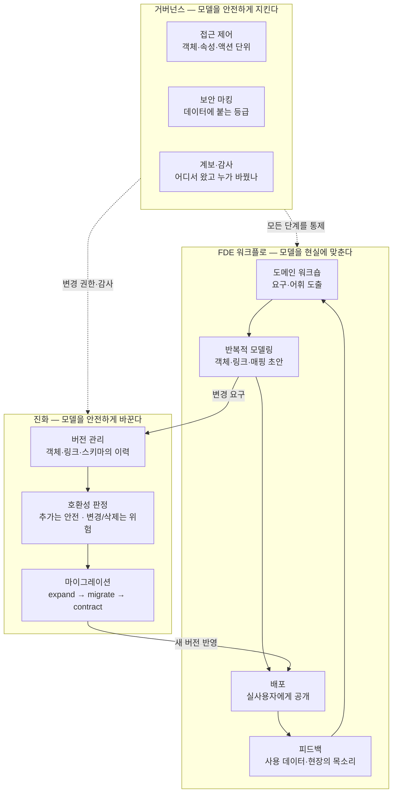

<figure class="post-figure post-figure--header">
<svg role="img" aria-label="이 포스트를 한 장으로 정리한 그림. 가운데에 1~6단계에서 완성한 고객·주문·제품 객체 그래프가 있다. 왼쪽 위 '진화'는 v1에서 v3로 이어지는 버전 태그와 함께, 점선으로 추가되는 속성은 안전하고 빗금 친 이름 변경·삭제에는 경고 표시가 붙은 위험 변경임을 보여 주며, 화살표가 그래프로 이어진다. 오른쪽 위 '거버넌스'는 방패와 자물쇠로 속성 단위 접근 제어를, 기밀·PII 배지로 보안 마킹을 나타내고 권한·마킹·감사가 그래프를 통제한다. 아래 'FDE 워크플로'는 도메인 전문가와 엔지니어가 워크숍 테이블에 마주 앉고, 모델링·배포·피드백으로 이어지는 화살표가 다시 객체 그래프로 되돌아오는 순환을 그린다. 오른쪽 위 구석의 7/7 배지는 시리즈 완주를 뜻한다." viewBox="0 0 680 380" xmlns="http://www.w3.org/2000/svg">
  <title>살아있는 온톨로지 — 진화·거버넌스·FDE 워크플로, 세 개의 고리</title>
  <defs>
    <marker id="gov-arrow" viewBox="0 0 10 10" refX="8" refY="5" markerWidth="6" markerHeight="6" orient="auto-start-reverse">
      <path d="M0,0 L10,5 L0,10 z" fill="var(--secondary-color)"/>
    </marker>
    <marker id="gov-arrow-gold" viewBox="0 0 10 10" refX="8" refY="5" markerWidth="6" markerHeight="6" orient="auto-start-reverse">
      <path d="M0,0 L10,5 L0,10 z" fill="var(--gold)"/>
    </marker>
    <marker id="gov-arrow-acc" viewBox="0 0 10 10" refX="8" refY="5" markerWidth="6" markerHeight="6" orient="auto-start-reverse">
      <path d="M0,0 L10,5 L0,10 z" fill="var(--accent-color)"/>
    </marker>
    <pattern id="gov-hatch" width="6" height="6" patternUnits="userSpaceOnUse" patternTransform="rotate(45)">
      <line x1="0" y1="0" x2="0" y2="6" stroke="var(--accent-color)" stroke-width="1.6" opacity="0.35"/>
    </pattern>
  </defs>

  <!-- ===== title + finish badge ===== -->
  <text x="340" y="24" text-anchor="middle" font-size="17" font-weight="800" fill="currentColor" letter-spacing="1.5">GOVERNANCE · EVOLUTION · FDE</text>
  <text x="340" y="42" text-anchor="middle" font-size="10" fill="currentColor" opacity="0.72">완성된 온톨로지를 조직 안에서 오래 살리는 세 개의 고리</text>
  <g>
    <circle cx="636" cy="26" r="15" fill="var(--bg-panel)" stroke="var(--gold)" stroke-width="2.5"/>
    <text x="636" y="30" text-anchor="middle" font-size="9.5" font-weight="800" fill="currentColor">7/7</text>
    <text x="636" y="52" text-anchor="middle" font-size="7.5" font-weight="700" fill="var(--gold)">완주</text>
  </g>

  <!-- ===== ring 1: evolution (top-left) ===== -->
  <text x="108" y="66" text-anchor="middle" font-size="11" font-weight="700" fill="var(--secondary-color)">① 진화 — 안전하게 바꾼다</text>
  <!-- version chain v1 → v2 → v3 -->
  <g font-size="9" font-weight="700" text-anchor="middle">
    <rect x="28" y="78" width="34" height="20" rx="3" fill="var(--bg-light)" stroke="currentColor" stroke-width="1.6"/>
    <text x="45" y="92" fill="currentColor">v1</text>
    <line x1="64" y1="88" x2="80" y2="88" stroke="var(--secondary-color)" stroke-width="1.6" marker-end="url(#gov-arrow)"/>
    <rect x="82" y="78" width="34" height="20" rx="3" fill="var(--bg-light)" stroke="currentColor" stroke-width="1.6"/>
    <text x="99" y="92" fill="currentColor">v2</text>
    <line x1="118" y1="88" x2="134" y2="88" stroke="var(--secondary-color)" stroke-width="1.6" marker-end="url(#gov-arrow)"/>
    <rect x="136" y="78" width="34" height="20" rx="3" fill="var(--bg-light)" stroke="var(--secondary-color)" stroke-width="2.2"/>
    <text x="153" y="92" fill="currentColor">v3</text>
  </g>
  <!-- additive change = safe (dashed) -->
  <rect x="28" y="112" width="130" height="20" rx="3" fill="var(--bg-panel)" stroke="var(--secondary-color)" stroke-width="1.6" stroke-dasharray="4 3"/>
  <text x="36" y="126" font-size="8" fill="currentColor">+ churn_risk 속성 추가</text>
  <text x="164" y="126" font-size="8" font-weight="700" fill="var(--secondary-color)">안전</text>
  <!-- rename/delete = breaking (hatched + warning) -->
  <rect x="28" y="140" width="130" height="20" rx="3" fill="url(#gov-hatch)" stroke="var(--accent-color)" stroke-width="1.6"/>
  <text x="36" y="154" font-size="8" fill="currentColor">grade 이름 변경·삭제</text>
  <line x1="34" y1="151" x2="118" y2="151" stroke="var(--accent-color)" stroke-width="1.1"/>
  <polygon points="166,158 176,141 186,158" fill="none" stroke="var(--accent-color)" stroke-width="2" stroke-linejoin="round"/>
  <text x="176" y="156" text-anchor="middle" font-size="9" font-weight="800" fill="var(--accent-color)">!</text>
  <text x="28" y="176" font-size="7.5" fill="var(--accent-color)" opacity="0.85">위험 — expand · migrate · contract 절차</text>
  <!-- evolution feeds the graph -->
  <path d="M172,88 Q228,96 248,140" fill="none" stroke="var(--secondary-color)" stroke-width="1.6" opacity="0.85" marker-end="url(#gov-arrow)"/>

  <!-- ===== center: the object graph built in stages 1-6 ===== -->
  <g stroke="var(--secondary-color)" stroke-width="1.8" opacity="0.6">
    <line x1="283" y1="163" x2="377" y2="131"/>
    <line x1="377" y1="131" x2="383" y2="205"/>
    <line x1="383" y1="205" x2="283" y2="163"/>
  </g>
  <g font-size="6.5" fill="currentColor" opacity="0.7" text-anchor="middle">
    <text x="322" y="138">주문함</text>
    <text x="392" y="172">포함</text>
  </g>
  <g text-anchor="middle" font-size="10" font-weight="700">
    <rect x="252" y="150" width="62" height="26" rx="5" fill="var(--bg-panel)" stroke="currentColor" stroke-width="2"/>
    <text x="283" y="167" fill="currentColor">고객</text>
    <rect x="346" y="118" width="62" height="26" rx="5" fill="var(--bg-panel)" stroke="var(--secondary-color)" stroke-width="2.2"/>
    <text x="377" y="135" fill="currentColor">주문</text>
    <rect x="352" y="192" width="62" height="26" rx="5" fill="var(--bg-panel)" stroke="currentColor" stroke-width="2"/>
    <text x="383" y="209" fill="currentColor">제품</text>
  </g>
  <text x="333" y="240" text-anchor="middle" font-size="8.5" font-weight="700" fill="currentColor" opacity="0.78">1–6단계에서 세운 객체 그래프</text>

  <!-- ===== ring 2: governance (top-right) ===== -->
  <text x="566" y="66" text-anchor="middle" font-size="11" font-weight="700" fill="var(--gold)">② 거버넌스 — 안전하게 지킨다</text>
  <!-- shield -->
  <path d="M512,80 L538,89 L538,110 Q538,131 512,140 Q486,131 486,110 L486,89 Z" fill="var(--bg-light)" stroke="var(--gold)" stroke-width="2.5"/>
  <path d="M501,109 l8,9 l15,-18" fill="none" stroke="var(--gold)" stroke-width="3" stroke-linecap="round" stroke-linejoin="round"/>
  <!-- property-level access control -->
  <rect x="552" y="84" width="104" height="18" rx="3" fill="var(--bg-panel)" stroke="currentColor" stroke-width="1.3" opacity="0.95"/>
  <text x="560" y="97" font-size="7.5" fill="currentColor">Employee — 전사 공개</text>
  <rect x="552" y="108" width="104" height="18" rx="3" fill="var(--bg-panel)" stroke="var(--gold)" stroke-width="1.8"/>
  <rect x="558" y="115" width="9" height="7" rx="1" fill="var(--gold)"/>
  <path d="M560,115 v-2 a2.5,2.5 0 0 1 5,0 v2" fill="none" stroke="var(--gold)" stroke-width="1.4"/>
  <text x="572" y="121" font-size="7.5" fill="currentColor">salary — 인사팀만</text>
  <!-- security markings -->
  <rect x="552" y="136" width="46" height="16" rx="8" fill="var(--bg-light)" stroke="var(--accent-color)" stroke-width="1.6"/>
  <text x="575" y="147" text-anchor="middle" font-size="8" font-weight="700" fill="var(--accent-color)">기밀</text>
  <rect x="604" y="136" width="36" height="16" rx="8" fill="var(--bg-light)" stroke="var(--accent-color)" stroke-width="1.6"/>
  <text x="622" y="147" text-anchor="middle" font-size="8" font-weight="700" fill="var(--accent-color)">PII</text>
  <text x="596" y="168" text-anchor="middle" font-size="7.5" fill="currentColor" opacity="0.7">보안 마킹 — 데이터에 붙는 등급</text>
  <!-- governance controls the graph -->
  <path d="M488,102 Q444,112 418,130" fill="none" stroke="var(--gold)" stroke-width="1.6" opacity="0.85" marker-end="url(#gov-arrow-gold)"/>
  <text x="452" y="100" text-anchor="middle" font-size="7" font-weight="700" fill="var(--gold)">권한 · 마킹 · 감사</text>

  <!-- ===== divider ===== -->
  <line x1="30" y1="254" x2="650" y2="254" stroke="currentColor" stroke-width="1.2" opacity="0.22"/>

  <!-- ===== ring 3: FDE workflow (bottom) ===== -->
  <text x="340" y="274" text-anchor="middle" font-size="11" font-weight="700" fill="var(--accent-color)">③ FDE 워크플로 — 현실에 맞춘다</text>
  <!-- workshop scene: expert + engineer at the table -->
  <rect x="148" y="284" width="60" height="26" rx="5" fill="var(--bg-panel)" stroke="currentColor" stroke-width="1.5"/>
  <g fill="none" stroke="var(--secondary-color)" stroke-width="1.5">
    <circle cx="163" cy="297" r="3.5"/>
    <circle cx="179" cy="292" r="3.5"/>
    <line x1="166" y1="296" x2="176" y2="293" stroke-width="1.3"/>
  </g>
  <path d="M204,310 l8,9" stroke="currentColor" stroke-width="1.3"/>
  <rect x="196" y="340" width="128" height="9" rx="2" fill="var(--bg-light)" stroke="currentColor" stroke-width="1.6"/>
  <line x1="204" y1="349" x2="204" y2="358" stroke="currentColor" stroke-width="1.6"/>
  <line x1="316" y1="349" x2="316" y2="358" stroke="currentColor" stroke-width="1.6"/>
  <circle cx="216" cy="316" r="8" fill="var(--bg-light)" stroke="currentColor" stroke-width="1.8"/>
  <path d="M203,340 Q216,322 229,340" fill="none" stroke="currentColor" stroke-width="2"/>
  <circle cx="304" cy="316" r="8" fill="var(--bg-light)" stroke="currentColor" stroke-width="1.8"/>
  <path d="M291,340 Q304,322 317,340" fill="none" stroke="currentColor" stroke-width="2"/>
  <path d="M276,340 l3,-13 h15 l3,13 z" fill="var(--bg-panel)" stroke="currentColor" stroke-width="1.5"/>
  <text x="216" y="370" text-anchor="middle" font-size="7.5" fill="currentColor" opacity="0.75">도메인 전문가</text>
  <text x="304" y="370" text-anchor="middle" font-size="7.5" fill="currentColor" opacity="0.75">엔지니어</text>
  <!-- loop: modeling → deploy → feedback → back to the graph -->
  <line x1="330" y1="330" x2="352" y2="327" stroke="var(--accent-color)" stroke-width="1.6" marker-end="url(#gov-arrow-acc)"/>
  <g text-anchor="middle" font-size="8.5" font-weight="700">
    <rect x="356" y="316" width="52" height="20" rx="10" fill="var(--bg-light)" stroke="var(--accent-color)" stroke-width="1.8"/>
    <text x="382" y="330" fill="currentColor">모델링</text>
    <rect x="428" y="316" width="44" height="20" rx="10" fill="var(--bg-light)" stroke="var(--accent-color)" stroke-width="1.8"/>
    <text x="450" y="330" fill="currentColor">배포</text>
    <rect x="492" y="316" width="52" height="20" rx="10" fill="var(--bg-light)" stroke="var(--accent-color)" stroke-width="1.8"/>
    <text x="518" y="330" fill="currentColor">피드백</text>
  </g>
  <line x1="410" y1="326" x2="426" y2="326" stroke="var(--accent-color)" stroke-width="1.6" marker-end="url(#gov-arrow-acc)"/>
  <line x1="474" y1="326" x2="490" y2="326" stroke="var(--accent-color)" stroke-width="1.6" marker-end="url(#gov-arrow-acc)"/>
  <path d="M546,320 Q604,300 588,258 Q570,222 424,210" fill="none" stroke="var(--accent-color)" stroke-width="1.6" stroke-dasharray="4 3" opacity="0.8" marker-end="url(#gov-arrow-acc)"/>
  <text x="450" y="356" text-anchor="middle" font-size="8" font-weight="700" fill="var(--accent-color)" opacity="0.9">모델은 완성이 아니라, 순환 속에 산다</text>
</svg>
<figcaption>이 글의 지도 — 1–6단계에서 세운 객체 그래프를 가운데 두고, <strong>진화</strong>(추가는 안전 · 이름 변경·삭제는 위험)가 모델을 안전하게 바꾸고, <strong>거버넌스</strong>(권한·보안 마킹·감사)가 모델을 지키며, 아래의 <strong>FDE 워크플로</strong>(모델링 → 배포 → 피드백)가 순환하며 모델을 현실에 맞춘다 — 시리즈 7/7 완주.</figcaption>
</figure>

## 들어가며

6단계 [액션과 운영 계층](/2026/07/19/ontology-actions-writeback.html)에서 우리는 온톨로지를 *읽는* 모델에서 *행동하는* 시스템으로 바꿨습니다. 객체와 링크 위에 액션과 write-back이 얹히는 순간, 온톨로지는 대시보드가 아니라 **업무 시스템**이 됩니다. 그런데 업무 시스템이 된다는 것은 축복이자 책임입니다 — 이제 이 모델 위에서 사람들이 매일 결정을 내리고, 세계를 바꾸고, 그 결과가 다시 모델로 돌아옵니다. 남은 질문은 하나입니다. **이 온톨로지를 어떻게 부수지 않고 바꾸고, 누구에게 무엇을 보여 주고, 조직 안에서 오래 살릴 것인가.**

이 질문이 어려운 이유는 온톨로지의 본성 때문입니다. 온톨로지는 도메인의 거울이고, 도메인은 멈추지 않습니다. 조직이 새 사업을 시작하면 새 객체 타입이 필요하고, 규제가 바뀌면 속성의 의미가 바뀌고, 인수합병이 일어나면 두 조직의 "고객"이 하나로 합쳐져야 합니다. 한 번 만들고 얼어붙은 온톨로지는 몇 달 안에 현실과 어긋나기 시작하고, 현실과 어긋난 의미 계층은 스키마보다 나쁩니다 — *틀린 의미를 공유 어휘로 강제*하기 때문입니다.

이 글은 `Ontology-Essential` 시리즈의 **마지막 7단계**로([Ontology Essential Curriculum](/2026/07/19/ontology-essential-curriculum.html)), 온톨로지의 **진화**(버전·하위 호환·마이그레이션), **거버넌스와 보안**(접근 제어·보안 마킹·계보·감사), 그리고 이 모든 것을 실제로 굴리는 사람 — **Forward Deployed Engineer의 워크플로** — 를 다뤄 시리즈를 완주합니다.

<div class="post-summary-box" markdown="1">

### 📌 이 글에서 다루는 내용

- **온톨로지 진화**: 객체·링크·스키마의 버전 관리, 변경의 위험 등급(속성 추가는 안전 / 이름 변경·삭제는 위험), expand–migrate–contract 마이그레이션 전략
- **거버넌스와 보안**: 의미 계층 위의 접근 제어(객체·속성·액션 단위), 보안 마킹(security marking), 데이터 계보(lineage)와 감사(audit)
- **FDE 워크플로**: 도메인 워크숍으로 요구 도출 → 반복적(iterative) 모델링 → 배포·피드백 루프, 그리고 도메인 전문가와의 협업 언어로서의 온톨로지
- **시리즈 회고**: 1~7단계 여정 전체를 한 번에 되짚기

</div>

## 한눈에 보기 — 온톨로지를 살아있게 하는 세 개의 고리

이 글의 뼈대는 세 개의 고리입니다. **진화**는 모델을 안전하게 *바꾸는* 장치이고, **거버넌스**는 모델을 안전하게 *지키는* 장치이며, **FDE 워크플로**는 그 둘을 굴리며 모델을 현실에 *맞추는* 사람의 순환입니다. 세 고리는 독립적이지 않습니다 — 워크숍에서 나온 변경 요구가 진화 절차를 타고 모델에 들어가고, 거버넌스가 그 변경과 사용을 통제하며, 배포된 모델에 대한 피드백이 다시 워크숍의 재료가 됩니다.



앞 두 절에서 진화와 거버넌스를 먼저 다루고, 마지막 절에서 FDE 워크플로의 순환을 다룹니다.

## 온톨로지 진화 — 부수지 않고 바꾸는 법

### 왜 진화가 어려운가 — 온톨로지 변경은 공용 API 변경이다

3~5단계에서 우리는 객체·링크·매핑으로 모델을 지었습니다. 그때는 백지 위의 작업이라 무엇이든 자유롭게 바꿀 수 있었습니다. 그러나 배포된 온톨로지는 사정이 다릅니다. 그 위에는 이미 대시보드가 얹혀 있고, 6단계의 액션이 객체를 읽고 쓰고 있으며, 다른 팀의 파이프라인이 객체 그래프를 소비하고 있습니다. **배포된 온톨로지의 객체 타입·속성·링크는 사실상 공용 API의 계약(contract)입니다.** `Customer` 객체의 `tier` 속성 이름을 바꾸는 일은, 라이브러리의 공개 함수 시그니처를 바꾸는 일과 정확히 같은 무게를 갖습니다.

그래서 진화의 출발점은 기술이 아니라 **태도**입니다 — "이 변경을 보는 소비자가 누구인가"를 먼저 묻는 것. 그 위에서 변경을 위험 등급으로 나누고, 위험한 변경에는 절차를 붙입니다.

### 변경의 위험 등급 — 추가는 안전, 변경·삭제는 위험

온톨로지 변경은 세 등급으로 나눌 수 있습니다. 이 분류는 API 버저닝의 하위 호환(backward compatibility) 원리를 의미 계층에 그대로 옮긴 것입니다.

| 등급 | 변경 예시 | 기존 소비자에게 | 절차 |
| --- | --- | --- | --- |
| **안전 (additive)** | 새 객체 타입 추가, 기존 객체에 선택적 속성 추가, 새 링크 타입 추가, 새 액션 추가 | 영향 없음 — 모르는 것은 무시하면 된다 | 리뷰 후 바로 배포 가능 |
| **주의 (behavioral)** | 속성의 의미·계산식 변경, 매핑 소스 교체, 카디널리티 완화(1:N → N:M), 액션의 검증 규칙 변경 | 형태는 같지만 **값·의미가 달라짐** — 조용히 틀린 결과를 만들 수 있다 | 소비자 공지 + 변경 이력 기록 필수 |
| **위험 (breaking)** | 속성·객체·링크의 **이름 변경 또는 삭제**, 기본키 변경, 속성 타입 변경, 카디널리티 강화(N:M → 1:N) | 소비자가 **즉시 깨진다** | 마이그레이션 절차(아래) 필수 |

두 가지가 특히 함정입니다. 첫째, **이름 변경은 삭제 + 추가입니다.** "이름만 바꾸는 건데"라는 말은 소비자 입장에서 성립하지 않습니다 — 옛 이름을 참조하던 모든 것이 깨집니다. 둘째, **behavioral 변경이 breaking보다 위험할 때가 많습니다.** breaking 변경은 시끄럽게 깨져서 즉시 발견되지만, 계산식이 바뀐 속성은 아무 오류 없이 *다른 숫자*를 내보내고, 그 숫자로 몇 주간 의사결정이 이뤄진 뒤에야 발각됩니다. 그래서 성숙한 조직은 behavioral 변경에도 breaking에 준하는 공지·이력 절차를 요구합니다.

### 무엇에 버전을 매기는가 — 스키마·매핑·인스턴스

"온톨로지의 버전 관리"라고 뭉뚱그리기 쉽지만, 실제로는 세 층이 따로 돕니다.

- **스키마(타입) 버전**: 객체 타입·속성·링크 타입·액션 정의의 이력. 온톨로지 정의를 코드/설정 파일로 관리하면(ontology-as-code) Git이 그대로 버전 저장소가 됩니다 — 리뷰(PR), diff, 롤백, "누가 언제 왜 바꿨나"가 공짜로 따라옵니다.
- **매핑 버전**: 5단계에서 만든 백킹 데이터셋 → 속성 매핑의 이력. 스키마는 그대로인데 매핑 소스가 바뀌는 경우(behavioral 변경의 대표)가 흔하므로, 매핑도 스키마와 같은 저장소에서 함께 버전 관리하는 것이 안전합니다.
- **인스턴스(데이터) 버전**: 개별 객체의 값 변화 이력. 이것은 스키마 버전과는 결이 다른 문제로, 6단계의 write-back 이력·감사 로그(아래 거버넌스 절)가 담당합니다.

```yaml
# ontology/customer.yaml — 온톨로지 정의를 코드로 (ontology-as-code)
object_type: Customer
version: 3                    # 스키마 버전 — 변경마다 증가
primary_key: customer_id
properties:
  customer_id: {type: string}
  name:        {type: string}
  tier:        {type: string}
  # v3에서 추가 — additive 변경, 기존 소비자 영향 없음
  churn_risk:  {type: double, added_in: 3, nullable: true}
  # v2에서 deprecated — 삭제는 v4 이후, 소비자 이관 완료가 조건
  grade:       {type: string, deprecated_in: 2, replaced_by: tier}
links:
  places_order: {target: Order, cardinality: one_to_many}
backing:
  dataset: analytics.dim_customer
  mapping_version: 5          # 매핑도 별도 버전으로 추적
```

이렇게 정의가 코드가 되면 온톨로지 변경도 소프트웨어 변경과 같은 규율을 따릅니다 — 브랜치에서 수정하고, 리뷰를 받고, 스테이징 온톨로지에서 검증한 뒤, 프로덕션에 반영합니다.

### 마이그레이션 전략 — expand → migrate → contract

breaking 변경이 불가피할 때(그리고 결국 불가피해집니다), 정석은 데이터베이스 스키마 마이그레이션에서 검증된 **expand–migrate–contract**(확장–이행–수축) 3박자입니다. 핵심은 **옛것과 새것이 공존하는 기간을 의도적으로 두는 것**입니다.

1. **Expand(확장)**: 새 속성/객체/링크를 *추가*합니다(additive이므로 안전). 옛것은 그대로 두고, 새것에 데이터를 병행 공급합니다. 예: `grade`를 `tier`로 바꾸고 싶다면, `tier`를 추가하고 매핑에서 두 속성을 모두 채웁니다.
2. **Migrate(이행)**: 소비자들을 새것으로 옮깁니다. 옛 속성에 `deprecated` 마킹을 하고, 사용 현황(어떤 대시보드·액션·파이프라인이 아직 `grade`를 읽는가)을 추적하며, 남은 소비자에게 기한을 공지합니다. **이 단계가 기술이 아니라 커뮤니케이션이라는 점이 중요합니다** — 계보(lineage) 정보가 있어야 "아직 옛것을 쓰는 소비자"를 찾을 수 있고, 이것이 아래 거버넌스 절과 이 절이 만나는 지점입니다.
3. **Contract(수축)**: 소비자가 0이 된 것을 *확인한 뒤* 옛것을 삭제합니다. 확인 없이 기한만 믿고 지우는 것이 사고의 단골 원인입니다.

이 3박자를 지키면 어떤 breaking 변경도 소비자 입장에서는 "안전한 추가 → 여유 있는 이관 → 조용한 정리"로 경험됩니다. 반대로 이를 건너뛴 "한 방에 교체"는, 온톨로지처럼 소비자가 많은 공유 계층에서는 거의 항상 장애로 돌아옵니다.

### 스키마 변경이 인스턴스에 닿을 때 — 정의만 바꾸면 끝나지 않는다

마이그레이션에서 한 가지 더 챙길 것이 있습니다. 스키마 변경 중 일부는 정의 파일만 고치면 끝나지 않고, **이미 존재하는 객체 인스턴스 전체를 손봐야** 합니다. 이 구분을 미리 알아 두면 변경의 비용을 정확히 견적할 수 있습니다.

| 변경 | 정의만 바꾸면 되는가 | 인스턴스 쪽 작업 |
| --- | --- | --- |
| 선택적 속성 추가 | 예 | 없음 — 기존 객체는 해당 속성이 비어 있을 뿐 |
| 필수 속성 추가 | 아니오 | 기존 전 객체의 값을 채우는 **백필(backfill)** 필요 — 매핑 소급 또는 기본값 정책 |
| 속성 타입 변경 (string → double 등) | 아니오 | 기존 값의 일괄 변환 + 변환 불가 값(파싱 실패)의 처리 정책 |
| 기본키 변경 | 아니오 | 사실상 **재구축** — 모든 링크가 키를 참조하므로 링크 재해소까지 연쇄 |
| 객체 타입 분리/병합 (예: `Customer`를 `개인고객`/`법인고객`으로) | 아니오 | 기존 인스턴스의 재분류 규칙 정의 + 링크 재배선 |

온톨로지의 인스턴스는 5단계에서 본 대로 백킹 데이터셋에서 채워지므로, 인스턴스 마이그레이션의 실체는 대개 **매핑·파이프라인의 소급 재실행**입니다. 그래서 견적의 감각은 이렇습니다 — *정의 변경 비용은 소비자 수에 비례하고, 인스턴스 변경 비용은 데이터 양과 매핑 복잡도에 비례한다.* 기본키 변경처럼 둘 다 큰 변경은, 정말로 그 변경이 필요한지(3단계의 기본키 설계로 돌아가) 다시 묻는 것이 먼저입니다.

## 거버넌스와 보안 — 의미 계층 위의 통제

### 접근 제어 — 테이블이 아니라 의미 단위로

온톨로지가 없던 시절의 접근 제어는 저장 구조의 언어로 이뤄졌습니다 — "이 스키마의 이 테이블에 SELECT 권한". 그러나 실제 정책은 저장 구조가 아니라 **의미**의 언어로 표현됩니다: "영업팀은 *자기 담당 지역의* 고객을 볼 수 있다", "급여 속성은 인사팀만 본다", "환불 승인 액션은 매니저만 실행한다". 온톨로지의 큰 이점 하나가 여기 있습니다 — **정책을 표현하는 언어(객체·속성·액션)와 정책을 집행하는 단위가 일치**합니다.

의미 계층 위의 접근 제어는 세 개의 결로 나뉩니다.

| 단위 | 통제하는 것 | 예시 |
| --- | --- | --- |
| **객체 단위** | 어떤 객체 타입·인스턴스를 볼 수 있는가 | 영업팀은 `Customer` 중 `region == 자기 지역`인 인스턴스만 조회 (row-level에 해당) |
| **속성 단위** | 객체는 보여도 어떤 속성은 가리는가 | `Employee` 객체는 전사 공개, `salary` 속성은 인사팀만 (column-level에 해당) |
| **액션 단위** | 누가 어떤 변경을 실행할 수 있는가 | `refund_order` 액션은 CS 매니저 역할만, 금액 상한 검증 포함 (6단계의 액션 권한) |

주목할 점은 액션 단위입니다. 읽기 전용 데이터 플랫폼의 거버넌스는 "누가 보는가"에서 끝나지만, 6단계에서 온톨로지가 행동의 시스템이 된 순간 "누가 바꾸는가"가 같은 무게로 들어옵니다. 액션이 통제된 관문이라는 6단계의 설계가 여기서 빛을 발합니다 — 변경이 전부 액션을 통해서만 일어나므로, **액션에 권한을 걸면 곧 쓰기 거버넌스가 완성**됩니다.

### 보안 마킹 — 권한을 사람이 아니라 데이터에 붙이기

역할 기반 접근 제어(RBAC)만으로 버티다 보면 규칙이 폭발합니다 — "인사팀이면서 유럽 법인 소속이면 유럽 직원의 급여를 볼 수 있다" 같은 조합이 늘어날수록 역할 수가 기하급수로 늘어납니다. 이를 다스리는 패턴이 **보안 마킹(security marking)**입니다. Palantir 계열 플랫폼이 대표적으로 쓰는 방식으로, 발상은 간단합니다. **분류 라벨을 데이터 쪽에 붙이고, 사용자는 라벨에 대한 해제 자격(clearance)을 갖습니다.**

- 데이터셋·객체·속성에 마킹을 붙입니다: `PII`, `재무-기밀`, `유럽-법인` …
- 사용자·그룹에 자격을 부여합니다: "PII 열람 가능", "재무-기밀 열람 가능" …
- 접근 시점에 시스템이 교차 검사합니다: 대상에 붙은 **모든** 마킹의 자격을 가진 사용자만 통과.

이 모델의 힘은 **전파(propagation)**에 있습니다. 마킹은 데이터를 따라 흐릅니다 — `PII` 마킹이 붙은 원천 데이터셋에서 파생된 백킹 데이터셋, 그 데이터셋이 채우는 객체 속성, 그 속성을 쓰는 파생 지표까지 마킹이 자동으로 따라붙습니다. "가공을 몇 번 거치면 규제가 증발하는" 구멍이 원리적으로 막히는 것입니다. 그리고 이 전파를 가능하게 하는 기반이 바로 다음의 계보입니다.

### 계보와 감사 — 어디서 왔고, 누가, 왜 바꿨나

거버넌스의 마지막 조각은 두 가지 질문에 항상 답할 수 있게 만드는 것입니다.

**"이 값은 어디서 왔는가" — 계보(lineage).** 5단계에서 우리는 원천 테이블 → 백킹 데이터셋 → 객체 속성의 매핑을 만들었습니다. 계보는 그 매핑 사슬을 조회 가능한 그래프로 유지하는 것입니다. 계보가 있으면 세 가지가 가능해집니다 — ① *신뢰 판단*: 대시보드의 숫자가 이상할 때 어느 원천·어느 변환에서 비롯됐는지 역추적, ② *영향 분석*: 원천 테이블을 바꾸면 어떤 객체·대시보드·액션이 영향받는지 순방향 추적(앞 절 마이그레이션의 "남은 소비자 찾기"가 정확히 이것), ③ *마킹 전파*: 보안 마킹이 파생물로 흐르는 경로. 데이터 플랫폼 전반의 계보·품질 이야기는 [데이터 품질과 거버넌스](/2026/06/25/data-quality-governance.html) 오버뷰에서 다뤘고, 온톨로지는 그 계보 그래프의 "의미 있는 종착점"에 해당합니다.

**"누가, 언제, 왜 바꿨는가" — 감사(audit).** 온톨로지가 업무 시스템인 이상 감사 로그는 선택이 아닙니다. 기록 대상은 두 층입니다.

```text
# 감사 로그의 두 층 — 스키마 변경과 데이터 변경
[스키마]  2026-07-14 10:02  jt.hwang   Customer v2→v3: churn_risk 속성 추가
          (PR #412, 리뷰어: data-gov, 사유: 이탈 예측 모델 배포)
[데이터]  2026-07-19 09:31  cs.kim     Action refund_order(order=O-1093, amount=45000)
          (검증 통과: 한도 이내 · 권한: cs-manager · 결과: Order.status → refunded)
```

스키마 변경 감사는 ontology-as-code라면 Git 이력이 절반을 해 주고, 데이터 변경 감사는 6단계의 액션이 해 줍니다 — 모든 쓰기가 액션이라는 좁은 관문을 지나므로, 관문에서 기록하면 완전한 감사 추적이 됩니다. 임의의 UPDATE가 가능한 시스템에서 사후에 감사를 재구성하는 것과, 애초에 통제된 액션만 존재하는 시스템의 차이가 여기서 갈립니다.

## FDE 워크플로 — 현실을 모델로 옮기는 사람의 순환

### FDE라는 직무 — 왜 엔지니어가 현장으로 가는가

이 시리즈의 출발점이었던 질문으로 돌아갑니다. Palantir 같은 회사는 왜 **Forward Deployed Engineer** — 고객사 현장에 "전진 배치"되는 엔지니어 — 라는 직무를 두는가. 답은 온톨로지의 본성에 있습니다. 온톨로지는 *그 조직이 실제로 일하는 방식*의 모델이고, 일하는 방식은 문서에 없습니다. 현장의 머릿속에, 엑셀의 숨은 컬럼에, "아 그건 원래 그렇게 해요"라는 말 속에 있습니다. 그래서 요구사항 문서를 받아 원격으로 구현하는 방식이 통하지 않고, 엔지니어가 도메인 한복판에 들어가 **관찰하고, 묻고, 모델로 번역하고, 즉시 보여 주고, 틀린 부분을 고치는** 순환을 도는 것입니다.

<figure class="post-figure">
<svg role="img" aria-label="FDE 워크플로를 시계 방향 순환으로 그린 그림. 네 정거장이 모서리에 놓인다 — 왼쪽 위 도메인 워크숍은 화이트보드 앞에서 두 사람이 어휘를 캐고, 오른쪽 위 반복적 모델링은 물음표와 점선 노드가 붙은 그래프 초안을 다듬으며, 오른쪽 아래 배포는 액션 버튼이 있는 화면으로 실사용자에게 공개하고, 왼쪽 아래 피드백은 사용 로그 차트와 현장의 말풍선을 모아 화살표를 따라 다시 워크숍으로 보낸다. 고리 가운데에는 객체 그래프가 v0.1에서 v1, v2로 갈수록 커지고 정교해지는 모습이 그려져 있다." viewBox="0 0 680 340" xmlns="http://www.w3.org/2000/svg">
  <title>FDE의 순환 — 워크숍 → 반복적 모델링 → 배포 → 피드백, 돌수록 자라는 그래프</title>
  <defs>
    <marker id="fde-arrow" viewBox="0 0 10 10" refX="8" refY="5" markerWidth="6" markerHeight="6" orient="auto-start-reverse">
      <path d="M0,0 L10,5 L0,10 z" fill="var(--secondary-color)"/>
    </marker>
  </defs>

  <text x="340" y="24" text-anchor="middle" font-size="12.5" font-weight="800" fill="currentColor">FDE의 순환 — 워크숍에서 시작해 피드백으로 되돌아온다</text>

  <!-- ===== station 1: domain workshop (top-left) ===== -->
  <rect x="18" y="44" width="168" height="92" rx="6" fill="var(--bg-light)" stroke="var(--secondary-color)" stroke-width="2.5"/>
  <circle cx="36" cy="62" r="10" fill="var(--bg-panel)" stroke="var(--secondary-color)" stroke-width="2"/>
  <text x="36" y="66" text-anchor="middle" font-size="10" font-weight="800" fill="currentColor">1</text>
  <text x="110" y="66" text-anchor="middle" font-size="10.5" font-weight="800" fill="var(--secondary-color)">도메인 워크숍</text>
  <text x="102" y="80" text-anchor="middle" font-size="7.5" fill="currentColor" opacity="0.7">요구가 아닌 어휘를 캔다</text>
  <rect x="32" y="86" width="54" height="42" rx="3" fill="var(--bg-panel)" stroke="currentColor" stroke-width="1.5"/>
  <g fill="none" stroke="var(--secondary-color)" stroke-width="1.5">
    <line x1="48" y1="100" x2="66" y2="96" stroke-width="1.3"/>
    <line x1="66" y1="96" x2="60" y2="114" stroke-width="1.3"/>
    <circle cx="48" cy="100" r="4"/>
    <circle cx="66" cy="96" r="4"/>
    <circle cx="60" cy="114" r="4"/>
  </g>
  <rect x="132" y="84" width="34" height="16" rx="4" fill="var(--bg-panel)" stroke="currentColor" stroke-width="1.2"/>
  <circle cx="141" cy="92" r="2.5" fill="none" stroke="var(--secondary-color)" stroke-width="1.2"/>
  <circle cx="156" cy="92" r="2.5" fill="none" stroke="var(--secondary-color)" stroke-width="1.2"/>
  <line x1="144" y1="92" x2="153" y2="92" stroke="var(--secondary-color)" stroke-width="1.1"/>
  <path d="M144,100 l-2,5" stroke="currentColor" stroke-width="1.2"/>
  <circle cx="120" cy="108" r="7" fill="var(--bg-light)" stroke="currentColor" stroke-width="1.8"/>
  <path d="M110,128 Q120,114 130,128" fill="none" stroke="currentColor" stroke-width="2"/>
  <circle cx="148" cy="110" r="7" fill="var(--bg-light)" stroke="currentColor" stroke-width="1.8"/>
  <path d="M138,128 Q148,116 158,128" fill="none" stroke="currentColor" stroke-width="2"/>

  <!-- ===== station 2: iterative modeling (top-right) ===== -->
  <rect x="494" y="44" width="168" height="92" rx="6" fill="var(--bg-light)" stroke="var(--accent-color)" stroke-width="2.5"/>
  <circle cx="512" cy="62" r="10" fill="var(--bg-panel)" stroke="var(--accent-color)" stroke-width="2"/>
  <text x="512" y="66" text-anchor="middle" font-size="10" font-weight="800" fill="currentColor">2</text>
  <text x="588" y="66" text-anchor="middle" font-size="10.5" font-weight="800" fill="var(--accent-color)">반복적 모델링</text>
  <text x="580" y="80" text-anchor="middle" font-size="7.5" fill="currentColor" opacity="0.7">완벽한 v1보다 고쳐지는 v0.1</text>
  <g fill="var(--bg-panel)" stroke="var(--accent-color)" stroke-width="1.8">
    <line x1="540" y1="104" x2="572" y2="96" stroke-width="1.4"/>
    <line x1="572" y1="96" x2="600" y2="110" stroke-width="1.4"/>
    <line x1="572" y1="96" x2="612" y2="86" stroke-width="1.4" stroke-dasharray="3 3"/>
    <circle cx="540" cy="104" r="6"/>
    <circle cx="572" cy="96" r="6"/>
    <circle cx="600" cy="110" r="6"/>
    <circle cx="614" cy="86" r="6" stroke-dasharray="3 3"/>
  </g>
  <text x="632" y="104" text-anchor="middle" font-size="13" font-weight="800" fill="var(--accent-color)">?</text>

  <!-- ===== station 3: deploy (bottom-right) ===== -->
  <rect x="494" y="214" width="168" height="92" rx="6" fill="var(--bg-light)" stroke="var(--gold)" stroke-width="2.5"/>
  <circle cx="512" cy="232" r="10" fill="var(--bg-panel)" stroke="var(--gold)" stroke-width="2"/>
  <text x="512" y="236" text-anchor="middle" font-size="10" font-weight="800" fill="currentColor">3</text>
  <text x="588" y="236" text-anchor="middle" font-size="10.5" font-weight="800" fill="var(--gold)">배포</text>
  <text x="580" y="250" text-anchor="middle" font-size="7.5" fill="currentColor" opacity="0.7">실사용자에게 공개한다</text>
  <rect x="536" y="258" width="64" height="40" rx="4" fill="var(--bg-panel)" stroke="currentColor" stroke-width="1.8"/>
  <circle cx="548" cy="270" r="3.5" fill="none" stroke="var(--secondary-color)" stroke-width="1.4"/>
  <circle cx="560" cy="266" r="3.5" fill="none" stroke="var(--secondary-color)" stroke-width="1.4"/>
  <line x1="551" y1="269" x2="557" y2="267" stroke="var(--secondary-color)" stroke-width="1.2"/>
  <rect x="564" y="278" width="30" height="12" rx="3" fill="var(--gold)" opacity="0.9"/>
  <text x="579" y="287" text-anchor="middle" font-size="7" font-weight="700" fill="var(--bg-panel)">액션</text>
  <rect x="562" y="298" width="12" height="5" fill="currentColor" opacity="0.5"/>

  <!-- ===== station 4: feedback (bottom-left) ===== -->
  <rect x="18" y="214" width="168" height="92" rx="6" fill="var(--bg-light)" stroke="var(--secondary-color)" stroke-width="2.5"/>
  <circle cx="36" cy="232" r="10" fill="var(--bg-panel)" stroke="var(--secondary-color)" stroke-width="2"/>
  <text x="36" y="236" text-anchor="middle" font-size="10" font-weight="800" fill="currentColor">4</text>
  <text x="110" y="236" text-anchor="middle" font-size="10.5" font-weight="800" fill="var(--secondary-color)">피드백</text>
  <text x="102" y="250" text-anchor="middle" font-size="7.5" fill="currentColor" opacity="0.7">사용 데이터 · 현장의 말</text>
  <line x1="34" y1="296" x2="80" y2="296" stroke="currentColor" stroke-width="1.4" opacity="0.6"/>
  <g fill="var(--secondary-color)" opacity="0.75">
    <rect x="38" y="282" width="8" height="14"/>
    <rect x="50" y="274" width="8" height="22"/>
    <rect x="62" y="266" width="8" height="30"/>
  </g>
  <rect x="94" y="262" width="78" height="22" rx="5" fill="var(--bg-panel)" stroke="currentColor" stroke-width="1.3"/>
  <text x="133" y="276" text-anchor="middle" font-size="6.5" fill="currentColor">"숫자가 장부랑 달라요"</text>
  <path d="M108,284 l5,8" stroke="currentColor" stroke-width="1.2"/>

  <!-- ===== clockwise loop arrows ===== -->
  <text x="340" y="82" text-anchor="middle" font-size="8" font-weight="700" fill="var(--secondary-color)">캔 어휘로 초안을 짓는다</text>
  <line x1="192" y1="90" x2="486" y2="90" stroke="var(--secondary-color)" stroke-width="2" marker-end="url(#fde-arrow)"/>
  <line x1="578" y1="142" x2="578" y2="208" stroke="var(--secondary-color)" stroke-width="2" marker-end="url(#fde-arrow)"/>
  <text x="590" y="178" font-size="7.5" font-weight="700" fill="var(--secondary-color)">실데이터로 검증</text>
  <text x="339" y="252" text-anchor="middle" font-size="8" font-weight="700" fill="var(--secondary-color)">사용 로그와 현장의 목소리가 쌓인다</text>
  <line x1="486" y1="262" x2="192" y2="262" stroke="var(--secondary-color)" stroke-width="2" marker-end="url(#fde-arrow)"/>
  <line x1="102" y1="208" x2="102" y2="142" stroke="var(--secondary-color)" stroke-width="2" marker-end="url(#fde-arrow)"/>
  <text x="94" y="178" text-anchor="end" font-size="7.5" font-weight="700" fill="var(--secondary-color)">다시 워크숍으로</text>

  <!-- ===== center: the graph grows each lap ===== -->
  <g fill="var(--bg-panel)" stroke="currentColor" stroke-width="1.6" opacity="0.85">
    <line x1="238" y1="172" x2="262" y2="160" stroke-width="1.3"/>
    <circle cx="238" cy="172" r="5"/>
    <circle cx="262" cy="160" r="5"/>
  </g>
  <text x="250" y="196" text-anchor="middle" font-size="8" font-weight="700" fill="currentColor" opacity="0.8">v0.1</text>
  <line x1="274" y1="168" x2="298" y2="166" stroke="var(--secondary-color)" stroke-width="1.4" opacity="0.7" marker-end="url(#fde-arrow)"/>
  <g fill="var(--bg-panel)" stroke="var(--secondary-color)" stroke-width="1.8">
    <line x1="316" y1="172" x2="338" y2="154" stroke-width="1.4"/>
    <line x1="338" y1="154" x2="354" y2="178" stroke-width="1.4"/>
    <line x1="316" y1="172" x2="354" y2="178" stroke-width="1.4"/>
    <circle cx="316" cy="172" r="6"/>
    <circle cx="338" cy="154" r="6"/>
    <circle cx="354" cy="178" r="6"/>
  </g>
  <text x="335" y="200" text-anchor="middle" font-size="8.5" font-weight="700" fill="currentColor" opacity="0.85">v1</text>
  <line x1="366" y1="168" x2="392" y2="166" stroke="var(--secondary-color)" stroke-width="1.4" opacity="0.7" marker-end="url(#fde-arrow)"/>
  <g fill="var(--bg-panel)" stroke="var(--gold)" stroke-width="2">
    <line x1="410" y1="170" x2="432" y2="148" stroke-width="1.5" opacity="0.7"/>
    <line x1="432" y1="148" x2="456" y2="172" stroke-width="1.5" opacity="0.7"/>
    <line x1="410" y1="170" x2="432" y2="190" stroke-width="1.5" opacity="0.7"/>
    <line x1="456" y1="172" x2="432" y2="190" stroke-width="1.5" opacity="0.7"/>
    <circle cx="410" cy="170" r="7"/>
    <circle cx="432" cy="148" r="7"/>
    <circle cx="456" cy="172" r="7"/>
    <circle cx="432" cy="190" r="7"/>
  </g>
  <text x="432" y="214" text-anchor="middle" font-size="9" font-weight="800" fill="var(--gold)">v2</text>
  <text x="340" y="236" text-anchor="middle" font-size="8.5" font-weight="700" fill="currentColor" opacity="0.78">순환이 돌수록 그래프는 자라고 정교해진다</text>
</svg>
<figcaption>FDE의 순환 — 워크숍에서 어휘를 캐고, 반복적으로 모델링하고, 배포해 피드백을 받아 다시 워크숍으로. 고리가 돌수록 가운데의 객체 그래프는 v0.1 → v1 → v2로 자란다.</figcaption>
</figure>

FDE의 도구 상자가 곧 이 시리즈였습니다 — 의미 계층이라는 관점(1단계), 그래프라는 어휘(2단계), 객체·링크라는 구성 요소(3~4단계), 지저분한 현실을 잇는 매핑(5단계), 행동으로 만드는 액션(6단계). 이 절은 그 도구들을 **어떤 순서와 태도로 휘두르는가**의 이야기입니다.

### 도메인 워크숍 — 요구가 아니라 어휘를 끌어낸다

순환의 시작은 도메인 전문가와의 **워크숍**입니다. 여기서 흔한 오해가 있습니다 — 워크숍의 목적은 "요구사항 수집"이 아닙니다. "어떤 화면이 필요하세요?"라고 물으면 현재 쓰는 엑셀의 복제품이 나올 뿐입니다. 워크숍의 진짜 목적은 그 도메인의 **명사와 동사를 끌어내는 것**입니다.

- **명사를 캔다**: "하루 일과를 처음부터 끝까지 말씀해 주세요"에서 등장하는 명사들 — 주문, 로트, 설비, 작업지시, 클레임 — 이 객체 타입 후보입니다(3단계의 "무엇을 객체로 승격할 것인가" 판단이 여기서 시작됩니다).
- **동사를 캔다**: "그 다음엔 뭘 하세요?"에서 나오는 동사들 — 배정한다, 승인한다, 반려한다, 이관한다 — 이 링크 타입과 액션 후보입니다.
- **경계 사례를 캔다**: 가장 값진 질문은 "그게 안 맞는 경우는 언제인가요?"입니다. "주문 하나에 고객이 둘인 경우도 있어요" 한 마디가 카디널리티 설계(4단계)를 통째로 바꿉니다.
- **어휘 충돌을 드러낸다**: 영업의 "고객"과 재무의 "고객"이 다른 것을 가리키는 순간을 포착하는 것 — DDD가 유비쿼터스 언어와 bounded context로 씨름하는 바로 그 문제이며, 온톨로지 설계에서 가장 먼저 합의해야 할 지점입니다.

화이트보드에 객체와 링크를 *그 자리에서 그려 가며* 진행하는 것이 요령입니다. 도메인 전문가는 ERD는 못 읽어도 "고객 → 주문 → 제품" 그림은 즉시 읽고, 즉시 틀린 곳을 지적해 줍니다. 모델링 언어의 진입 장벽이 낮다는 것 — 이것이 온톨로지가 협업 도구로 강력한 첫 번째 이유입니다.

### 반복적 모델링 — 완벽한 v1보다 고쳐지는 v0.1

워크숍에서 얻은 어휘로 첫 모델을 짓습니다. 여기서 FDE 워크플로의 핵심 태도가 나옵니다 — **크게 설계하고 한 번에 맞추려 하지 말 것.** 온톨로지 모델링은 본질적으로 반복적(iterative)입니다. 이유는 단순합니다. 모델의 오류는 종이 위에서 발견되지 않고, *실제 데이터를 흘려 넣고 실제 사용자가 써 볼 때* 발견되기 때문입니다.

실무의 리듬은 이렇습니다.

1. **좁게 시작한다**: 도메인 전체가 아니라, 아픈 업무 하나(예: 클레임 처리)를 끝에서 끝까지 커버하는 최소 객체 집합 — 객체 3~5개, 링크 몇 개 — 로 시작합니다.
2. **진짜 데이터를 바로 붙인다**: 샘플 데이터가 아니라 실제 백킹 데이터셋을 매핑합니다(5단계). 엔티티 해소의 지저분함, 채워지지 않는 속성, 워크숍에서 아무도 말하지 않은 예외가 이 단계에서 쏟아지고 — 그것이 정상입니다. 데이터가 모델의 첫 번째 리뷰어입니다.
3. **보여 주고 틀린다**: 반쯤 채워진 객체 그래프라도 도메인 전문가에게 바로 보여 줍니다. "이 고객이 왜 두 명으로 나오죠?"(엔티티 해소 누락), "여기 없는 거래처가 제일 중요한데요?"(객체 승격 판단 오류) — 이런 지적 하나하나가 문서 백 장보다 정확한 요구사항입니다.
4. **고치고 다시 돈다**: 지적을 반영해 모델을 고치고, 이때 앞 절의 진화 규율을 따릅니다. 초기(소비자가 없을 때)에는 과감하게 부수며 돌고, 소비자가 붙기 시작하면 additive 우선·expand–contract로 기어를 바꿉니다. **반복의 자유는 소비자 수에 반비례한다** — 이것이 진화 절과 이 절을 잇는 감각입니다.

### 배포·피드백 루프 — 사용이 모델을 검증한다

모델이 어느 정도 서면 실사용자에게 **배포**합니다. 배포는 끝이 아니라 가장 밀도 높은 피드백 채널의 개통입니다. 두 종류의 신호를 봅니다.

- **정량 신호 — 사용 데이터**: 어떤 객체가 많이 조회되는가(도메인의 무게중심), 어떤 속성이 전혀 안 쓰이는가(제거 후보 또는 이름이 나빠 발견이 안 되는 것), 어떤 액션이 자주 반려·실패하는가(검증 규칙이 현실과 안 맞는 신호), 사용자가 온톨로지 *밖에서* 엑셀로 하는 일은 무엇인가(다음에 모델로 끌어올 후보).
- **정성 신호 — 현장의 말**: "이 화면 보고 나서 결국 전화로 물어봐요"는 링크가 하나 빠져 있다는 뜻이고, "숫자가 우리 장부랑 달라요"는 매핑·해소 문제라는 뜻입니다. 신뢰는 여기서 결정됩니다 — 온톨로지의 숫자가 현장의 장부와 한 번 어긋나면, 그 온톨로지는 오래 외면당합니다.

피드백은 다시 워크숍(또는 짧은 확인 대화)으로 흘러들고, 순환이 다시 돕니다. 이 루프가 몇 바퀴 돌면 흥미로운 일이 일어납니다 — **온톨로지가 조직의 공용어가 되기 시작합니다.** 회의에서 사람들이 "그 데이터"가 아니라 "작업지시 객체의 지연 사유"라고 말하기 시작하고, 부서 간 논쟁이 "네 엑셀 vs 내 엑셀"에서 "온톨로지의 이 정의가 맞는가"로 옮겨 갑니다. 논쟁의 무대가 공유된 모델 위로 올라온 것 — 이것이 1단계에서 말한 **공유 어휘로서의 의미 계층**이 실현된 모습이며, FDE가 만들어 내는 진짜 가치입니다. 소프트웨어가 아니라, *조직이 자신을 이해하는 언어*를 만드는 것입니다.

### 현장 스케치 — 어느 클레임 온톨로지의 3주

추상적인 순환을 구체로 내리기 위해, 가상의(그러나 전형적인) 시나리오 하나를 스케치합니다. 제조사 고객지원 부서의 클레임 처리 업무에 FDE가 투입된 첫 3주입니다.

- **1주차 — 워크숍과 v0.1**: CS 팀장·현장 상담원 둘과 워크숍. 하루 일과를 따라가며 명사(클레임, 주문, 제품, 상담원, 처리 지침)와 동사(접수한다, 배정한다, 에스컬레이션한다, 종결한다)를 캔다. "클레임 하나에 제품이 여러 개인 경우도 있나요?" — "묶음 배송이면 그렇죠"라는 답에서 `클레임—제품`이 N:M임을 확정. 객체 4개(`Claim`·`Order`·`Product`·`Agent`)와 링크 4개로 v0.1을 그 자리에서 화이트보드에 그리고 합의.
- **2주차 — 데이터가 리뷰하다**: CS 티켓 시스템과 주문 DB를 백킹 데이터셋으로 매핑. 즉시 현실이 반격한다 — 티켓의 주문번호 필드가 자유 텍스트라 15%가 매칭 실패(엔티티 해소 규칙 추가), 워크숍에서 아무도 언급하지 않은 "대리점 경유 클레임"이 전체의 1/3(새 객체 `Dealer` 승격 판단). 반쯤 채워진 그래프를 팀장에게 보여 주자 "이 클레임이 왜 두 건으로 나오죠?"(중복 해소 누락) — v0.3으로 수정.
- **3주차 — 배포와 첫 액션**: 상담원 6명에게 조회 화면 배포, `escalate_claim` 액션 하나만 얹어 시작. 첫 주 피드백 — 액션 반려가 잦다(검증 규칙이 "처리 기한 초과 시 에스컬레이션 불가"로 돼 있었는데, 현장은 정확히 그때 에스컬레이션한다). 규칙을 뒤집어 배포. 상담원의 말: "이제 주문 이력 찾으러 다른 시스템 안 열어도 되네요" — 링크 탐색(4단계)이 만든 첫 가치 증명.

3주 만에 완성된 것은 온톨로지가 아니라 **돌기 시작한 순환**입니다. 이후의 확장(환불 액션, 대리점 뷰, 품질팀 연결)은 이 순환이 반복되며 자라고, 소비자가 늘어나는 만큼 앞 절의 진화 규율이 무거워집니다.

### FDE 워크플로의 수칙 요약

| 수칙 | 내용 |
| --- | --- |
| **어휘를 캐라, 요구를 받지 말라** | 워크숍의 산출물은 화면 목록이 아니라 도메인의 명사·동사·경계 사례 |
| **좁게, 끝에서 끝까지** | 넓고 얕은 모델보다 좁고 완결된 업무 하나 — 가치 증명이 빠르다 |
| **데이터가 첫 리뷰어** | 진짜 백킹 데이터를 일찍 붙여라 — 모델 오류는 데이터가 먼저 안다 |
| **일찍 보여 주고 일찍 틀려라** | 반쯤 된 그래프를 보여 주는 부끄러움 < 다 만들고 틀리는 비용 |
| **반복의 자유는 소비자 수에 반비례** | 초기엔 과감히 부수고, 소비자가 붙으면 진화 규율(additive·expand–contract)로 |
| **숫자의 신뢰를 사수하라** | 현장 장부와 한 번 어긋나면 오래 외면당한다 — 매핑·해소 품질이 곧 신뢰 |

## 시리즈 회고 — 7단계의 여정

이것으로 `Ontology-Essential` 시리즈 **7단계 완주**입니다. 걸어온 길을 한 번에 되짚어 봅니다.

**제1막 — 의미를 이해하기.** [1단계](/2026/07/19/ontology-semantic-layer-vs-data-model.html)에서 우리는 이 시리즈 전체의 "왜"를 세웠습니다 — 스키마가 *어떻게 저장하는가*라면 온톨로지는 *무엇을 의미하는가*이며, 테이블과 조인만으로는 도메인의 의미가 담기지 않기에 별도의 **의미 계층**이 필요하다는 것. 2단계에서는 그 발상의 학문적 뿌리 — 지식 그래프, RDF/OWL의 트리플과 추론, 속성 그래프, 택소노미와의 구분 — 로 어휘를 다졌습니다.

**제2막 — 온톨로지를 짓기.** 3단계에서 도메인의 명사를 **객체 타입**으로 승격하고 속성과 기본키를 설계했고, 4단계에서 관계를 **링크 타입**이라는 일급 개념으로 끌어올려 조인 로직을 모델에 새겼습니다. 5단계에서는 개념 모델을 지저분한 현실과 이었습니다 — 백킹 데이터셋 매핑과 **엔티티 해소**, 중복·불일치·누락 속에서 신뢰할 만한 객체 그래프를 세우는 법. FDE 업무의 무게중심이 여기 있다는 것도 확인했습니다.

**제3막 — 살아있게 하기.** [6단계](/2026/07/19/ontology-actions-writeback.html)에서 **액션과 write-back**으로 읽기 모델을 행동의 시스템으로 바꿨고, 오늘 7단계에서 그 시스템을 조직 안에서 오래 살리는 장치 — 진화의 규율, 거버넌스의 통제, 그리고 FDE의 순환 — 을 얹어 여정을 완성했습니다.

돌아보면 시리즈 전체를 관통하는 문장은 하나입니다. **온톨로지는 산출물이 아니라 순환이다.** 모델은 워크숍에서 태어나 데이터에게 검증받고, 사용자에게 다듬어지고, 액션으로 세계를 바꾸고, 그 결과와 함께 진화합니다. 도구는 바뀌어도 — Foundry든, 오픈소스 지식 그래프든, dbt 시맨틱 계층이든 — 이 순환을 돌릴 줄 아는 것이 Forward Deployed Engineer의 핵심 역량이고, 이제 그 전체 지도가 여러분 손에 있습니다.

## 정리

- **온톨로지 변경은 공용 API 변경이다**: 배포된 객체·속성·링크는 소비자와의 계약입니다. 변경을 위험 등급으로 나누고 — 추가는 안전, 의미 변경은 주의(조용히 틀리는 것이 더 위험), 이름 변경·삭제는 위험 — 등급에 맞는 절차를 붙입니다.
- **breaking 변경은 expand → migrate → contract로**: 새것을 추가하고, 계보로 남은 소비자를 추적해 이관하고, 소비자가 0임을 확인한 뒤 옛것을 지웁니다. ontology-as-code로 정의를 Git에 두면 버전·리뷰·롤백이 공짜로 따라옵니다.
- **거버넌스는 의미 단위로**: 접근 제어를 객체·속성·액션 단위로 걸면 정책의 언어와 집행의 단위가 일치합니다. 보안 마킹은 권한을 데이터에 붙여 파생물까지 전파시키고, 계보는 역추적·영향 분석·마킹 전파의 기반이 되며, 액션이라는 좁은 관문 덕에 완전한 감사 추적이 가능해집니다.
- **FDE 워크플로는 순환이다**: 워크숍에서 어휘를 캐고, 좁게 시작해 진짜 데이터로 검증하며 반복적으로 모델링하고, 배포 후 정량·정성 피드백으로 다시 다듬습니다. 그 순환의 끝에서 온톨로지는 소프트웨어를 넘어 **조직의 공용어**가 됩니다.

### 다음 학습 (Next Learning)

- [Ontology Essential Curriculum](/2026/07/19/ontology-essential-curriculum.html) — 시리즈 로드맵으로 돌아가 7단계 도장을 모두 채우기
- [온톨로지란 무엇인가: 의미 계층 vs 데이터 모델](/2026/07/19/ontology-semantic-layer-vs-data-model.html) — 여정의 출발점 복습: 완주 후 다시 읽으면 "왜"가 다르게 보입니다
- [액션과 운영 계층: write-back](/2026/07/19/ontology-actions-writeback.html) — 이 글의 거버넌스가 통제하는 대상, 행동의 시스템 복습
- [데이터 품질과 거버넌스](/2026/06/25/data-quality-governance.html) — 온톨로지 아래층, 데이터 플랫폼 전반의 품질·계보·거버넌스 오버뷰
