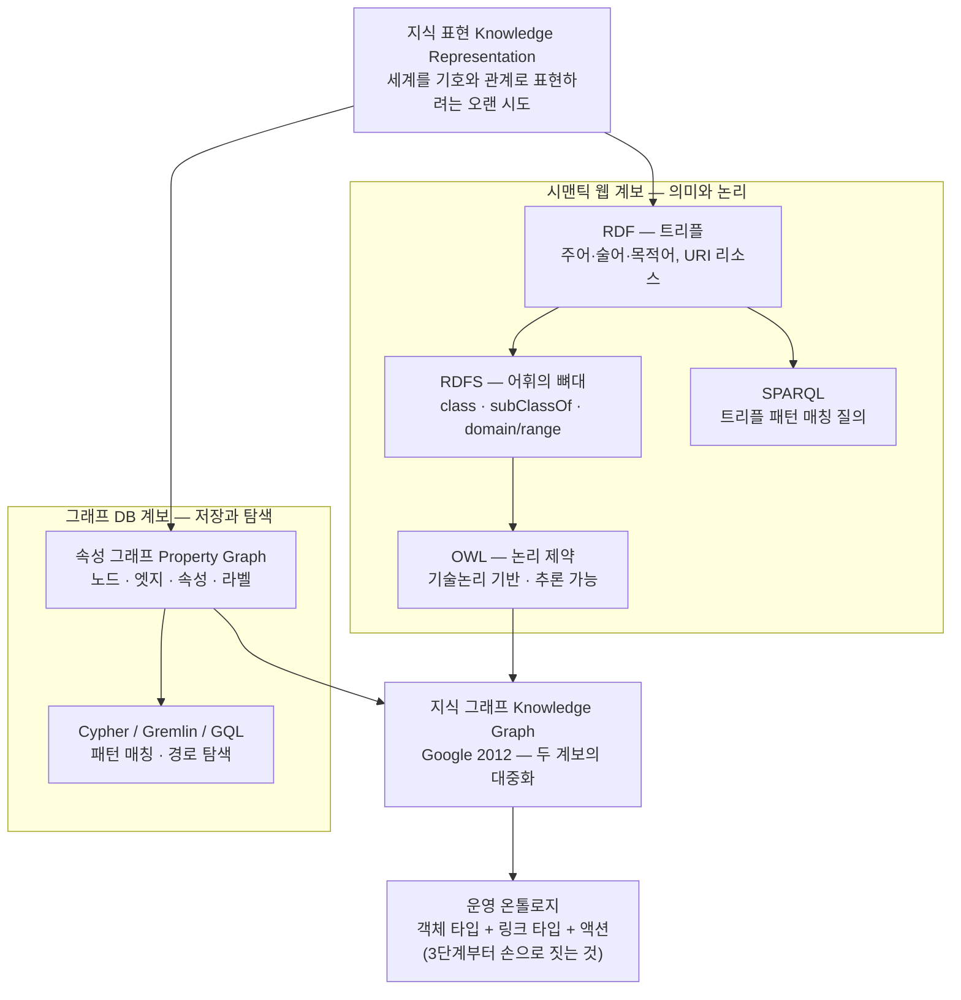

<figure class="post-figure post-figure--header">
<svg role="img" aria-label="하나의 그래프 발상이 두 형식으로 갈라진 모습. 왼쪽 RDF/OWL 패널에는 ex:Customer가 ex:Agent의 하위 클래스임을 나타내는 클래스 계층과, Customer가 placed로 Order에, Order가 contains로 Product에 이어지는 트리플 그래프, 그리고 Order에서 금액 리터럴로 향하는 amount 엣지가 그려져 있다. 오른쪽 속성 그래프 패널에는 name과 tier 속성을 내장한 Customer 노드와 amount 속성을 내장한 Order 노드가 PLACED 엣지로 이어지고, 엣지 자체에 since 2024라는 속성이 붙어 있다. 두 패널 사이에는 '같은 그래프 발상, 다른 형식'을 뜻하는 양방향 화살표가 있고, 하단 띠에는 택소노미의 단순 트리가 온톨로지의 그래프와 추론 기어로 확장되는 모습이 그려져 있다." viewBox="0 0 680 380" xmlns="http://www.w3.org/2000/svg">
  <title>하나의 그래프 발상, 두 갈래의 형식 — RDF/OWL의 트리플·논리와 속성 그래프의 노드·엣지·속성</title>
  <defs>
    <marker id="kgf-arr-sec" viewBox="0 0 10 10" refX="8" refY="5" markerWidth="6" markerHeight="6" orient="auto-start-reverse">
      <path d="M0,0 L10,5 L0,10 z" fill="var(--secondary-color)"/>
    </marker>
    <marker id="kgf-arr-acc" viewBox="0 0 10 10" refX="8" refY="5" markerWidth="6" markerHeight="6" orient="auto-start-reverse">
      <path d="M0,0 L10,5 L0,10 z" fill="var(--accent-color)"/>
    </marker>
    <marker id="kgf-arr-gold" viewBox="0 0 10 10" refX="8" refY="5" markerWidth="6" markerHeight="6" orient="auto-start-reverse">
      <path d="M0,0 L10,5 L0,10 z" fill="var(--gold)"/>
    </marker>
    <marker id="kgf-arr-cur" viewBox="0 0 10 10" refX="8" refY="5" markerWidth="6" markerHeight="6" orient="auto-start-reverse">
      <path d="M0,0 L10,5 L0,10 z" fill="currentColor"/>
    </marker>
    <marker id="kgf-sub" viewBox="0 0 12 12" refX="10" refY="6" markerWidth="9" markerHeight="9" orient="auto-start-reverse">
      <path d="M1,1 L11,6 L1,11 z" fill="var(--bg-light)" stroke="currentColor" stroke-width="1.4"/>
    </marker>
  </defs>

  <text x="340" y="24" text-anchor="middle" font-size="16" font-weight="800" fill="currentColor" letter-spacing="1">하나의 그래프 발상 · 두 갈래의 형식</text>

  <!-- ===== LEFT: RDF / OWL ===== -->
  <rect x="16" y="40" width="280" height="232" rx="6" fill="var(--bg-light)" stroke="var(--secondary-color)" stroke-width="2.5"/>
  <text x="156" y="62" text-anchor="middle" font-size="12" font-weight="800" fill="var(--secondary-color)">RDF / OWL — 트리플 + 논리</text>

  <!-- class layer (TBox) -->
  <text x="32" y="84" text-anchor="start" font-size="8" fill="currentColor" opacity="0.65">클래스 계층 (owl:Class)</text>
  <rect x="48" y="92" width="92" height="22" rx="3" fill="var(--bg-panel)" stroke="currentColor" stroke-width="1.6"/>
  <text x="94" y="106" text-anchor="middle" font-size="9" font-weight="700" fill="currentColor">ex:Customer</text>
  <rect x="196" y="92" width="72" height="22" rx="3" fill="var(--bg-panel)" stroke="currentColor" stroke-width="1.6"/>
  <text x="232" y="106" text-anchor="middle" font-size="9" font-weight="700" fill="currentColor">ex:Agent</text>
  <line x1="142" y1="103" x2="192" y2="103" stroke="currentColor" stroke-width="1.6" marker-end="url(#kgf-sub)"/>
  <text x="166" y="90" text-anchor="middle" font-size="6.5" fill="currentColor" opacity="0.7">⊑ subClassOf</text>

  <!-- rdf:type link from instance to class -->
  <line x1="86" y1="153" x2="92" y2="116" stroke="currentColor" stroke-width="1.3" stroke-dasharray="3 3" opacity="0.55"/>
  <text x="98" y="138" text-anchor="start" font-size="6.5" fill="currentColor" opacity="0.7">a (rdf:type)</text>

  <!-- triple graph (instances) -->
  <ellipse cx="84" cy="168" rx="46" ry="15" fill="var(--bg-panel)" stroke="currentColor" stroke-width="2"/>
  <text x="84" y="172" text-anchor="middle" font-size="8.5" font-weight="700" fill="currentColor">:Customer</text>
  <ellipse cx="176" cy="210" rx="38" ry="15" fill="var(--bg-panel)" stroke="currentColor" stroke-width="2"/>
  <text x="176" y="214" text-anchor="middle" font-size="8.5" font-weight="700" fill="currentColor">:Order</text>
  <ellipse cx="240" cy="252" rx="42" ry="15" fill="var(--bg-panel)" stroke="currentColor" stroke-width="2"/>
  <text x="240" y="256" text-anchor="middle" font-size="8.5" font-weight="700" fill="currentColor">:Product</text>

  <line x1="116" y1="184" x2="146" y2="197" stroke="var(--secondary-color)" stroke-width="1.8" marker-end="url(#kgf-arr-sec)"/>
  <text x="112" y="206" text-anchor="middle" font-size="7" font-weight="700" fill="var(--secondary-color)">:placed</text>
  <line x1="196" y1="224" x2="218" y2="240" stroke="var(--secondary-color)" stroke-width="1.8" marker-end="url(#kgf-arr-sec)"/>
  <text x="176" y="244" text-anchor="middle" font-size="7" font-weight="700" fill="var(--secondary-color)">:contains</text>

  <!-- literal -->
  <rect x="234" y="186" width="54" height="18" rx="2" fill="var(--bg-light)" stroke="currentColor" stroke-width="1.4"/>
  <text x="261" y="198" text-anchor="middle" font-size="7.5" fill="currentColor" opacity="0.85">120만</text>
  <line x1="214" y1="206" x2="230" y2="199" stroke="var(--secondary-color)" stroke-width="1.4" marker-end="url(#kgf-arr-sec)"/>
  <text x="222" y="182" text-anchor="middle" font-size="6.5" fill="var(--secondary-color)">:amount</text>

  <text x="32" y="266" text-anchor="start" font-size="7.5" fill="currentColor" opacity="0.7">트리플 = 주어 · 술어 · 목적어</text>

  <!-- ===== MIDDLE: same idea, different form ===== -->
  <line x1="304" y1="156" x2="376" y2="156" stroke="currentColor" stroke-width="2" marker-start="url(#kgf-arr-cur)" marker-end="url(#kgf-arr-cur)"/>
  <text x="340" y="144" text-anchor="middle" font-size="8" font-weight="700" fill="currentColor">같은 그래프 발상</text>
  <text x="340" y="172" text-anchor="middle" font-size="8" fill="currentColor" opacity="0.7">다른 형식</text>

  <!-- ===== RIGHT: property graph ===== -->
  <rect x="384" y="40" width="280" height="232" rx="6" fill="var(--bg-light)" stroke="var(--accent-color)" stroke-width="2.5"/>
  <text x="524" y="62" text-anchor="middle" font-size="12" font-weight="800" fill="var(--accent-color)">속성 그래프 — 노드 · 엣지 · 속성</text>

  <!-- node 1 with embedded properties -->
  <rect x="400" y="84" width="116" height="62" rx="10" fill="var(--bg-panel)" stroke="currentColor" stroke-width="2"/>
  <text x="458" y="101" text-anchor="middle" font-size="9" font-weight="800" fill="currentColor">:Customer</text>
  <line x1="408" y1="107" x2="508" y2="107" stroke="currentColor" stroke-width="1" opacity="0.3"/>
  <text x="410" y="122" text-anchor="start" font-size="8" fill="currentColor" opacity="0.85">name: 김지수</text>
  <text x="410" y="136" text-anchor="start" font-size="8" fill="currentColor" opacity="0.85">tier: VIP</text>

  <!-- node 2 -->
  <rect x="532" y="186" width="116" height="62" rx="10" fill="var(--bg-panel)" stroke="currentColor" stroke-width="2"/>
  <text x="590" y="203" text-anchor="middle" font-size="9" font-weight="800" fill="currentColor">:Order</text>
  <line x1="540" y1="209" x2="640" y2="209" stroke="currentColor" stroke-width="1" opacity="0.3"/>
  <text x="542" y="224" text-anchor="start" font-size="8" fill="currentColor" opacity="0.85">id: O-1001</text>
  <text x="542" y="238" text-anchor="start" font-size="8" fill="currentColor" opacity="0.85">amount: 120만</text>

  <!-- edge with its own property -->
  <line x1="492" y1="146" x2="554" y2="186" stroke="var(--accent-color)" stroke-width="2.2" marker-end="url(#kgf-arr-acc)"/>
  <text x="536" y="160" text-anchor="middle" font-size="8" font-weight="700" fill="var(--accent-color)">:PLACED</text>
  <line x1="523" y1="166" x2="504" y2="175" stroke="var(--gold)" stroke-width="1.3" stroke-dasharray="3 2"/>
  <rect x="414" y="168" width="90" height="20" rx="4" fill="var(--bg-panel)" stroke="var(--gold)" stroke-width="1.8"/>
  <text x="459" y="181" text-anchor="middle" font-size="8" fill="currentColor">since: 2024</text>
  <text x="459" y="204" text-anchor="middle" font-size="7" font-weight="700" fill="var(--gold)">엣지 위의 속성 — 일급</text>

  <text x="400" y="266" text-anchor="start" font-size="7.5" fill="currentColor" opacity="0.7">스키마 선택적 — 필요한 만큼 제약으로 조인다</text>

  <!-- ===== BOTTOM BAND: taxonomy → ontology ===== -->
  <line x1="30" y1="284" x2="650" y2="284" stroke="currentColor" stroke-width="1.4" opacity="0.25"/>
  <text x="30" y="304" text-anchor="start" font-size="8.5" font-weight="700" fill="currentColor" opacity="0.72">표현력의 확장 — 트리에서 그래프 · 추론으로</text>

  <!-- taxonomy mini tree -->
  <line x1="150" y1="322" x2="120" y2="344" stroke="currentColor" stroke-width="1.6" opacity="0.7"/>
  <line x1="150" y1="322" x2="180" y2="344" stroke="currentColor" stroke-width="1.6" opacity="0.7"/>
  <circle cx="150" cy="318" r="7" fill="var(--bg-panel)" stroke="currentColor" stroke-width="1.8"/>
  <circle cx="120" cy="346" r="7" fill="var(--bg-panel)" stroke="currentColor" stroke-width="1.8"/>
  <circle cx="180" cy="346" r="7" fill="var(--bg-panel)" stroke="currentColor" stroke-width="1.8"/>
  <text x="150" y="369" text-anchor="middle" font-size="7.5" font-weight="700" fill="currentColor">택소노미 — 단일 is-a 트리</text>

  <!-- expansion arrow -->
  <line x1="240" y1="332" x2="320" y2="332" stroke="var(--secondary-color)" stroke-width="2" marker-end="url(#kgf-arr-sec)"/>
  <text x="280" y="324" text-anchor="middle" font-size="7.5" font-weight="700" fill="var(--secondary-color)">확장</text>

  <!-- ontology mini graph -->
  <g stroke="var(--accent-color)" stroke-width="1.6" opacity="0.75">
    <line x1="392" y1="318" x2="436" y2="306"/>
    <line x1="436" y1="306" x2="468" y2="336"/>
    <line x1="392" y1="318" x2="420" y2="348"/>
    <line x1="420" y1="348" x2="468" y2="336"/>
    <line x1="436" y1="306" x2="420" y2="348"/>
  </g>
  <circle cx="392" cy="318" r="7" fill="var(--bg-panel)" stroke="var(--accent-color)" stroke-width="1.8"/>
  <circle cx="436" cy="306" r="7" fill="var(--bg-panel)" stroke="var(--accent-color)" stroke-width="1.8"/>
  <circle cx="420" cy="348" r="7" fill="var(--bg-panel)" stroke="var(--accent-color)" stroke-width="1.8"/>
  <circle cx="468" cy="336" r="7" fill="var(--bg-panel)" stroke="var(--accent-color)" stroke-width="1.8"/>
  <text x="436" y="369" text-anchor="middle" font-size="7.5" font-weight="700" fill="currentColor">온톨로지 — 그래프 + 제약 + 추론</text>

  <!-- reasoner gear + inferred fact -->
  <g stroke="var(--gold)" stroke-width="2">
    <line x1="560" y1="308" x2="560" y2="336"/>
    <line x1="546" y1="322" x2="574" y2="322"/>
    <line x1="550" y1="312" x2="570" y2="332"/>
    <line x1="570" y1="312" x2="550" y2="332"/>
  </g>
  <circle cx="560" cy="322" r="9" fill="var(--bg-panel)" stroke="var(--gold)" stroke-width="2"/>
  <circle cx="560" cy="322" r="3" fill="var(--gold)"/>
  <line x1="548" y1="326" x2="480" y2="336" stroke="var(--gold)" stroke-width="1.5" stroke-dasharray="4 3" marker-end="url(#kgf-arr-gold)"/>
  <text x="584" y="326" text-anchor="start" font-size="7" font-weight="700" fill="var(--gold)">추론기</text>
</svg>
<figcaption>"세계를 그래프로 표현한다"는 하나의 발상이 두 형식으로 — 왼쪽 <strong>RDF/OWL</strong>은 트리플·클래스 계층으로 의미와 추론에, 오른쪽 <strong>속성 그래프</strong>는 노드·엣지에 내장된 속성으로 저장과 탐색에 강하다. 아래 띠는 택소노미(트리)에서 온톨로지(그래프+추론)로의 표현력 확장.</figcaption>
</figure>

## 들어가며

[1단계](/2026/07/19/ontology-semantic-layer-vs-data-model.html)에서 우리는 온톨로지가 *무엇이며 왜 필요한지*를 세웠습니다 — 스키마가 "데이터를 어떻게 저장하는가"라면, 온톨로지는 "그 데이터가 무엇을 의미하는가"를 담는 공유된 의미 계층이라는 것. 그런데 이 발상은 Palantir Foundry 같은 제품이 발명한 것이 아닙니다. **온톨로지는 컴퓨터 과학의 오랜 계보 — 지식 표현(knowledge representation)과 시맨틱 웹 — 위에 서 있습니다.** 이 글은 그 계보를 따라가며, 온톨로지를 떠받치는 형식 기반의 어휘를 다집니다.

왜 이 어휘가 필요할까요? 3단계부터 우리는 객체 타입·링크 타입으로 온톨로지를 손으로 짓기 시작합니다. 그때 만나는 모든 개념 — "관계를 일급으로 둔다", "클래스와 인스턴스를 구분한다", "그래프를 탐색하며 답을 얻는다" — 은 이 글에서 다루는 RDF/OWL과 속성 그래프 모델이 수십 년 동안 벼려 온 것들입니다. 형식 기반을 모르고 모델링부터 손대면 용어가 흔들리고, 반대로 이 어휘를 쥐면 어떤 제품의 온톨로지를 만나든 "아, 이건 속성 그래프에 클래스 계층을 얹은 것이구나"처럼 좌표를 읽을 수 있습니다.

이 글은 [Ontology Essential Curriculum](/2026/07/19/ontology-essential-curriculum.html)의 **2단계**입니다. 세 부분으로 진행합니다 — 먼저 시맨틱 웹의 계보 위에서 **RDF의 트리플과 OWL의 클래스·프로퍼티, SPARQL**을 익히고, 다음으로 실무 그래프 DB가 채택한 **속성 그래프 모델**을 RDF와 비교하며, 마지막으로 **택소노미 vs 온톨로지, 기술논리(Description Logic)** 로 "추론이 가능해지는 지점"을 짚습니다.

<div class="post-summary-box" markdown="1">

### 📌 이 글에서 다루는 내용

- **지식 그래프와 RDF/OWL**: 트리플(주어–술어–목적어)이라는 최소 단위, URI로 식별되는 리소스, RDFS/OWL의 클래스·프로퍼티와 표현력의 층계(라벨 → 계층 → 논리 제약), SPARQL 질의, 그리고 Tim Berners-Lee의 시맨틱 웹에서 Google Knowledge Graph로 이어지는 계보
- **속성 그래프 모델**: 노드·엣지·속성(Neo4j/Cypher 계열)의 구조, 트리플 모델과의 표현 차이(엣지 위의 속성, 스키마 강제력, 추론 유무), RDF vs 속성 그래프 비교표와 실무 선택 기준
- **택소노미와 기술논리**: 분류 체계(taxonomy)와 온톨로지의 차이, Description Logic이 여는 추론 — subsumption(포섭 관계 자동 도출)과 일관성 검사(consistency check), 그리고 이 형식 어휘가 3단계 이후의 객체·링크 설계와 만나는 지점

</div>

## 한눈에 보기 — 하나의 발상, 두 갈래의 형식

이 글의 스파인을 한 장으로 그리면 이렇습니다. "세계를 그래프로 표현한다"는 하나의 발상이 시맨틱 웹 계보의 **RDF/OWL**(트리플 + 논리·추론)과 그래프 DB 계보의 **속성 그래프**(노드·엣지·속성 + 탐색 질의)라는 두 형식으로 갈라져 발전했고, 오늘날의 운영 온톨로지(Foundry Ontology 류)는 이 둘의 유산을 함께 물려받았습니다.



이 그림에서 쥐어야 할 좌표는 하나입니다 — **왼쪽 계보는 "의미와 추론"에, 오른쪽 계보는 "저장과 탐색"에 강합니다.** 그리고 3단계부터 우리가 짓는 객체·링크 중심의 온톨로지는 속성 그래프의 실용적 구조에 RDF/OWL이 다듬어 온 의미론의 규율을 얹은 것입니다.

## 지식 그래프와 RDF/OWL — 시맨틱 웹의 계보

### 트리플: 지식의 최소 단위

RDF(Resource Description Framework)의 출발점은 단순합니다. **어떤 지식이든 "주어(subject)–술어(predicate)–목적어(object)"의 3항 문장, 즉 트리플(triple)로 쪼갤 수 있다**는 것입니다.

```text
김지수(주어)  는 주문했다(술어)  주문#1001(목적어)  .
주문#1001    은 포함한다        제품 '노트북'      .
주문#1001    의 금액은          1,200,000          .
```

첫 두 문장의 목적어는 또 다른 실체(리소스)이고, 셋째 문장의 목적어는 값(리터럴)입니다. 트리플을 계속 쌓으면 주어와 목적어가 노드가 되고 술어가 방향 있는 엣지가 되어 — 자연스럽게 **그래프**가 됩니다. "지식 그래프"라는 말의 실체가 바로 이것입니다: 개별 사실(트리플)의 집합이 이루는 거대한 그래프.

RDF가 여기에 더한 결정적 규율이 하나 있습니다 — **모든 리소스와 술어를 URI(IRI)로 전역 식별한다**는 것. `김지수`가 아니라 `http://example.org/customer/C-042`, `주문했다`가 아니라 `http://example.org/ontology#placed`입니다. 이름이 전역적으로 유일하므로 서로 다른 데이터셋의 트리플을 그냥 합쳐도 같은 URI는 같은 실체로 병합됩니다. 5단계에서 다룰 엔티티 해소(entity resolution)가 어려운 이유가 현실 데이터에는 이 전역 식별자가 *없기* 때문이라는 점을 미리 눈여겨봐 둘 만합니다.

실제 직렬화 문법(Turtle)으로 위 예제를 쓰면 이렇습니다.

```turtle
@prefix ex:  <http://example.org/ontology#> .
@prefix c:   <http://example.org/customer/> .
@prefix o:   <http://example.org/order/> .
@prefix p:   <http://example.org/product/> .
@prefix xsd: <http://www.w3.org/2001/XMLSchema#> .

c:C-042  a ex:Customer ;          # "a"는 rdf:type의 축약 — 클래스 소속 선언
         ex:name    "김지수" ;
         ex:placed  o:O-1001 .

o:O-1001 a ex:Order ;
         ex:contains p:P-77 ;
         ex:amount   "1200000"^^xsd:decimal ;
         ex:orderedAt "2026-07-13T09:00:00+09:00"^^xsd:dateTime .

p:P-77   a ex:Product ;
         ex:name "노트북" .
```

세 가지가 보입니다. 첫째, `a ex:Customer` — 인스턴스(개별 고객)가 **클래스**(Customer)에 속한다는 선언도 그저 트리플 하나입니다. 둘째, 리터럴에는 `xsd:decimal`처럼 **데이터 타입**이 붙습니다. 셋째, 데이터(인스턴스)와 어휘(클래스·프로퍼티)가 같은 형식으로 한 그래프에 섞여 있습니다 — RDF에서는 스키마조차 데이터입니다.

### RDFS와 OWL: 어휘에 의미를 얹는 층계

트리플만으로는 "무엇이든 말할 수 있지만, 아무 규칙도 없는" 상태입니다. 그 위에 어휘의 의미를 규정하는 층이 **RDFS**(RDF Schema)와 **OWL**(Web Ontology Language)입니다. 표현력이 낮은 것부터 층계로 쌓입니다.

- **RDFS** — 어휘의 뼈대를 세웁니다. `rdfs:Class`(클래스 선언), `rdfs:subClassOf`(클래스 계층), `rdfs:subPropertyOf`(프로퍼티 계층), `rdfs:domain`/`rdfs:range`(이 술어의 주어/목적어는 어떤 클래스인가). 이것만으로도 "VIPCustomer는 Customer의 하위 클래스다", "placed의 주어는 Customer, 목적어는 Order다" 같은 구조적 의미가 생깁니다.
- **OWL** — 논리 제약을 더합니다. `owl:FunctionalProperty`(값이 최대 하나), `owl:inverseOf`(placed의 역은 placedBy), `owl:TransitiveProperty`(partOf가 이행적), `owl:disjointWith`(Customer와 Product는 서로소), 카디널리티 제약, 그리고 클래스를 조건으로 *정의*하는 능력("VIPCustomer란 주문 총액이 N 이상인 Customer다").

```turtle
ex:Customer    a rdfs:Class .
ex:VIPCustomer a rdfs:Class ;
               rdfs:subClassOf ex:Customer .          # 계층: VIP ⊑ Customer

ex:placed a rdf:Property ;
          rdfs:domain ex:Customer ;                   # 주어는 Customer여야
          rdfs:range  ex:Order .                      # 목적어는 Order여야

ex:placedBy a owl:ObjectProperty ;
            owl:inverseOf ex:placed .                 # 역방향 프로퍼티

ex:Customer owl:disjointWith ex:Product .             # 겹칠 수 없는 클래스
```

이 층계가 중요한 이유는 단순한 문서화가 아니라 **추론(inference)의 재료**이기 때문입니다. `c:C-042 a ex:VIPCustomer`라는 트리플과 `VIPCustomer ⊑ Customer`라는 공리가 있으면, 기계는 `c:C-042 a ex:Customer`를 **묻지 않아도 도출**합니다. `ex:placed`의 역이 `ex:placedBy`라면 한 방향만 저장해도 반대 방향 질의에 답할 수 있습니다. 표현력의 층계는 곧 "기계가 대신 결론 내려 줄 수 있는 범위"의 층계입니다 — 이 지점은 마지막 절의 기술논리에서 다시 만납니다.

### SPARQL: 트리플 패턴으로 묻기

RDF 그래프에 묻는 표준 질의어가 **SPARQL**입니다. 핵심 발상은 "질의 자체가 변수를 품은 트리플 패턴이고, 그래프에서 그 패턴에 들어맞는 조합을 찾는다"는 것 — SQL의 조인 나열과 달리, 묻고 싶은 관계의 모양을 그대로 적습니다.

```sparql
PREFIX ex: <http://example.org/ontology#>

# "노트북을 포함한 주문을 낸 고객의 이름은?"
SELECT ?customerName ?orderAmount
WHERE {
  ?customer  ex:name     ?customerName ;   # 고객 — 이름
             ex:placed   ?order .          # 고객 — 주문
  ?order     ex:contains ?product ;        # 주문 — 제품
             ex:amount   ?orderAmount .
  ?product   ex:name     "노트북" .
}
ORDER BY DESC(?orderAmount)
```

`?customer`, `?order` 같은 변수가 노드 자리에 놓이고, WHERE 절의 각 줄이 그래프에서 매칭되어야 할 엣지입니다. 관계형 SQL이라면 customers ⋈ orders ⋈ order_items ⋈ products의 3중 조인으로 썼을 질문이, 여기서는 도메인의 관계 구조를 그대로 옮긴 패턴이 됩니다. **"질의가 모델을 닮는다"** — 4단계에서 링크 탐색(traversal)을 다룰 때 이 감각이 그대로 돌아옵니다.

### 계보: 시맨틱 웹에서 지식 그래프로

이 형식들의 출처를 짚어 두면 좌표가 선명해집니다. 2001년 **Tim Berners-Lee**(웹의 발명자)는 "시맨틱 웹(Semantic Web)" 비전을 제시했습니다 — 웹 문서가 사람만 읽는 HTML을 넘어, **기계가 의미를 이해하고 추론할 수 있는 데이터의 웹**이 되어야 한다는 것. W3C는 이 비전을 RDF(1999/2004) → RDFS → OWL(2004, OWL 2는 2009) → SPARQL(2008)의 표준 스택으로 구현했습니다.

시맨틱 웹이 꿈꾼 "전 세계가 하나의 기계 가독 그래프"는 그 원형 그대로 실현되지는 않았습니다. 그러나 그 유산은 다른 이름으로 살아남았습니다 — 2012년 Google이 검색에 **Knowledge Graph**를 도입하며("things, not strings") 이 용어를 대중화했고, Wikidata·schema.org 같은 공개 그래프, 그리고 기업 내부의 엔터프라이즈 지식 그래프로 이어졌습니다. 우리가 이 시리즈에서 다루는 운영 온톨로지도 이 계보의 연장선입니다 — "문자열이 아니라 실체(thing)를, 테이블이 아니라 객체와 관계를"이라는 발상은 정확히 같습니다.

## 속성 그래프 모델 — 그래프 DB의 실무 표현

### 노드 · 엣지 · 속성

시맨틱 웹 진영이 논리와 표준을 다듬는 동안, 데이터베이스 진영은 다른 질문에 답하고 있었습니다 — "그래프를 **저장하고 빠르게 탐색**하려면 어떤 모델이 좋은가?" 그 답이 Neo4j로 대표되는 **속성 그래프(property graph, 정확히는 labeled property graph)** 모델입니다. 구성 요소는 셋입니다.

- **노드(node)**: 실체 하나. **라벨(label)** 로 종류를 표시하고(`:Customer`), **속성(property)** 키–값 쌍을 내부에 담습니다(`{name: "김지수", tier: "VIP"}`).
- **엣지(edge/relationship)**: 두 노드를 잇는 방향 있는 관계. **타입**을 갖고(`:PLACED`), 결정적으로 — **엣지 자신도 속성을 가질 수 있습니다**(`{placedAt: date("2026-07-13")}`).
- **속성**: 노드와 엣지 양쪽에 붙는 키–값. RDF처럼 별도 트리플로 풀지 않고 실체 안에 내장됩니다.

Cypher(Neo4j의 질의어이자 ISO 표준 GQL의 모태)로 같은 주문 도메인을 만들어 보면 모델의 감촉이 바로 옵니다.

```cypher
// 노드 생성 — 라벨과 내장 속성
CREATE (c:Customer {id: "C-042", name: "김지수", tier: "VIP"})
CREATE (o:Order    {id: "O-1001", amount: 1200000})
CREATE (p:Product  {id: "P-77",  name: "노트북"})

// 엣지 생성 — 엣지에도 속성이 붙는다
CREATE (c)-[:PLACED   {placedAt: date("2026-07-13")}]->(o)
CREATE (o)-[:CONTAINS {quantity: 1}]->(p);
```

질의도 패턴 매칭입니다 — ASCII 아트로 그래프 모양을 그대로 그립니다.

```cypher
// "노트북을 포함한 주문을 낸 고객의 이름은?"
MATCH (c:Customer)-[:PLACED]->(o:Order)-[:CONTAINS]->(p:Product {name: "노트북"})
RETURN c.name, o.amount
ORDER BY o.amount DESC;

// 그래프의 힘 — 가변 길이 경로: 추천(구매 이력이 겹치는 고객)
MATCH (me:Customer {id: "C-042"})-[:PLACED]->()-[:CONTAINS]->(prod)
      <-[:CONTAINS]-()<-[:PLACED]-(other:Customer)
WHERE other <> me
RETURN other.name, count(prod) AS overlap
ORDER BY overlap DESC LIMIT 5;
```

`(c)-[:PLACED]->(o)`라는 문법 자체가 화살표 그림입니다. SPARQL과 마찬가지로 "질의가 모델을 닮는" 성질을 갖되, 속성 그래프 쪽이 개발자 경험 면에서 더 직관적이라는 평가를 받으며 실무 그래프 DB의 주류가 되었습니다 (Neo4j, Amazon Neptune, Memgraph, TigerGraph 등 — 질의어는 Cypher/GQL, Gremlin 등).

스키마에 대한 태도도 눈여겨봐 둡니다. 속성 그래프는 기본적으로 **스키마 선택적(schema-optional)** 입니다 — 아무 라벨·속성이나 자유롭게 붙일 수 있고, 필요한 만큼만 제약조건으로 조입니다.

```cypher
// 실무에서 최소한으로 조이는 제약 — 유일성과 존재성
CREATE CONSTRAINT customer_id_unique IF NOT EXISTS
FOR (c:Customer) REQUIRE c.id IS UNIQUE;          // 기본키 역할 (3단계의 기본키와 연결)

CREATE CONSTRAINT order_amount_exists IF NOT EXISTS
FOR (o:Order) REQUIRE o.amount IS NOT NULL;       // 필수 속성
```

RDFS/OWL이 "어휘의 의미를 논리로 선언"하는 쪽이라면, 속성 그래프의 제약은 "DB가 강제하는 무결성 규칙"에 가깝습니다 — 표현은 소박하지만 위반이 즉시 거부된다는 점에서 운영 친화적입니다. 이 온도 차가 다음 비교표의 뿌리입니다.

### RDF와 무엇이 다른가

같은 "그래프"지만 두 모델의 결이 상당히 다릅니다. 가장 손에 잡히는 차이는 **속성이 사는 곳**입니다 — RDF에서는 모든 것이 트리플이므로 "주문 금액"도 `o:O-1001 ex:amount 1200000`이라는 독립된 엣지이고, 엣지에 속성을 붙이려면 관계 자체를 노드로 승격(reification)하거나 RDF-star(`<< s p o >> ex:since 2024`) 같은 확장을 써야 합니다. 속성 그래프에서는 속성이 노드·엣지 안에 내장되어 있고, 엣지 위의 속성이 일급으로 지원됩니다.

| 관점 | RDF / OWL | 속성 그래프 (LPG) |
| --- | --- | --- |
| 최소 단위 | 트리플 (주어–술어–목적어) | 노드 · 엣지 · 속성 |
| 식별 | 전역 URI/IRI — 데이터셋 간 병합이 자연스러움 | DB 내부 ID — 병합·연계는 별도 설계 |
| 속성 표현 | 모든 속성이 독립 트리플(엣지) | 노드·엣지에 키–값으로 내장 |
| 엣지의 속성 | 기본 불가 — reification / RDF-star 필요 | **일급 지원** (관계에 직접 키–값) |
| 스키마 | RDFS/OWL — 선택적, 논리 공리 중심 | 라벨 + 제약조건 — 가볍고 실용적 |
| **추론** | **표준 내장** (subsumption, 역·이행 프로퍼티 등) | 없음 — 필요하면 애플리케이션/알고리즘으로 |
| 질의어 | SPARQL (W3C 표준) | Cypher/GQL (ISO 표준화), Gremlin |
| 표준화 주체 | W3C (웹 표준의 일부) | 벤더 주도 → ISO GQL(2024) |
| 강점 | 상호운용성 · 어휘 공유 · 논리적 엄밀함 | 개발자 경험 · 탐색 성능 · 운영 단순함 |
| 전형적 용도 | 공개 지식 그래프, 표준 어휘, 데이터 통합 | 추천 · 사기 탐지 · 네트워크 분석 · 운영 그래프 |

정리하면 — **RDF는 "의미의 상호운용"에, 속성 그래프는 "저장과 탐색의 실용"에 최적화**되어 있습니다. 어느 쪽이 옳으냐의 문제가 아니라 무엇을 지불하고 무엇을 얻느냐의 문제이며, 실무에서는 "내부 운영 그래프는 속성 그래프로, 외부 공유·통합 어휘는 RDF로"처럼 역할을 나누는 경우도 많습니다.

### 운영 온톨로지는 어느 쪽인가

이 시리즈가 향하는 Foundry Ontology 류의 운영 온톨로지를 이 좌표에 놓아 보면 — **뼈대는 속성 그래프에 가깝습니다.** 객체 타입(3단계)은 라벨+속성을 가진 노드에, 링크 타입(4단계)은 타입 있는 엣지에 대응합니다. 그러나 순수 속성 그래프와 달리 **스키마가 선택이 아니라 중심**입니다 — 객체 타입·속성 타입·링크 타입을 먼저 선언하고 데이터가 그 틀에 채워지며(RDFS의 규율에 가까운 태도), 그 위에 권한·액션 같은 운영 장치가 얹힙니다. 즉 두 계보의 교배종입니다: 속성 그래프의 실용적 구조 + 스키마 우선의 의미 규율. 이 좌표를 쥐고 있으면 3~4단계의 설계 결정들이 "어느 전통에서 온 규율인지" 보입니다.

## 택소노미와 기술논리 — 추론이 가능해지는 지점

<figure class="post-figure">
<svg role="img" aria-label="표현력의 층계를 네 단의 계단으로 그린 그림. 첫째 단 용어집은 낱말 카드 두 장, 둘째 단 택소노미는 루트에서 갈라지는 is-a 트리, 셋째 단 시소러스는 트리의 잎들 사이에 점선 연관어 링크가 더해진 모습, 넷째 단 온톨로지는 임의 방향 엣지가 얽힌 그래프에 제약을 뜻하는 자물쇠와 추론을 뜻하는 기어가 붙어 있고, 기어에서 그래프로 향하는 점선 화살표가 자동 도출을 나타낸다. 오른쪽 세로 축은 계단을 오를수록 표현력과 설계 비용이 함께 오른다는 것을 화살표로 보여 준다." viewBox="0 0 680 300" xmlns="http://www.w3.org/2000/svg">
  <title>표현력의 층계 — 용어집 → 택소노미 → 시소러스 → 온톨로지, 오를수록 표현력과 비용이 함께 오른다</title>
  <defs>
    <marker id="expr-arr-cur" viewBox="0 0 10 10" refX="8" refY="5" markerWidth="6" markerHeight="6" orient="auto-start-reverse">
      <path d="M0,0 L10,5 L0,10 z" fill="currentColor"/>
    </marker>
    <marker id="expr-arr-gold" viewBox="0 0 10 10" refX="8" refY="5" markerWidth="6" markerHeight="6" orient="auto-start-reverse">
      <path d="M0,0 L10,5 L0,10 z" fill="var(--gold)"/>
    </marker>
  </defs>

  <text x="330" y="22" text-anchor="middle" font-size="14" font-weight="800" fill="currentColor">표현력의 층계</text>

  <!-- ===== steps ===== -->
  <rect x="28" y="210" width="142" height="52" rx="3" fill="var(--bg-light)" stroke="currentColor" stroke-width="2"/>
  <rect x="170" y="168" width="142" height="94" rx="3" fill="var(--bg-light)" stroke="currentColor" stroke-width="2"/>
  <rect x="312" y="126" width="142" height="136" rx="3" fill="var(--bg-light)" stroke="currentColor" stroke-width="2"/>
  <rect x="454" y="84" width="142" height="178" rx="3" fill="var(--bg-light)" stroke="var(--gold)" stroke-width="2.5"/>

  <text x="99" y="230" text-anchor="middle" font-size="9.5" font-weight="800" fill="currentColor">① 용어집</text>
  <text x="99" y="244" text-anchor="middle" font-size="7.5" fill="currentColor" opacity="0.7">낱말 + 정의</text>
  <text x="241" y="188" text-anchor="middle" font-size="9.5" font-weight="800" fill="currentColor">② 택소노미</text>
  <text x="241" y="202" text-anchor="middle" font-size="7.5" fill="currentColor" opacity="0.7">+ is-a 계층 (트리)</text>
  <text x="383" y="146" text-anchor="middle" font-size="9.5" font-weight="800" fill="currentColor">③ 시소러스</text>
  <text x="383" y="160" text-anchor="middle" font-size="7.5" fill="currentColor" opacity="0.7">+ 연관어 · 동의어</text>
  <text x="525" y="104" text-anchor="middle" font-size="9.5" font-weight="800" fill="var(--gold)">④ 온톨로지</text>
  <text x="525" y="118" text-anchor="middle" font-size="7.5" fill="currentColor" opacity="0.7">+ 임의 관계 · 제약 · 추론</text>

  <!-- step 1 icon: word cards -->
  <rect x="60" y="168" width="74" height="18" rx="2" fill="var(--bg-panel)" stroke="currentColor" stroke-width="1.4"/>
  <line x1="68" y1="177" x2="118" y2="177" stroke="currentColor" stroke-width="1.4" opacity="0.45"/>
  <rect x="76" y="184" width="74" height="18" rx="2" fill="var(--bg-panel)" stroke="currentColor" stroke-width="1.4"/>
  <line x1="84" y1="193" x2="134" y2="193" stroke="currentColor" stroke-width="1.4" opacity="0.45"/>

  <!-- step 2 icon: is-a tree -->
  <line x1="241" y1="122" x2="215" y2="146" stroke="currentColor" stroke-width="1.6" opacity="0.75"/>
  <line x1="241" y1="122" x2="267" y2="146" stroke="currentColor" stroke-width="1.6" opacity="0.75"/>
  <circle cx="241" cy="118" r="6" fill="var(--bg-panel)" stroke="currentColor" stroke-width="1.8"/>
  <circle cx="215" cy="148" r="6" fill="var(--bg-panel)" stroke="currentColor" stroke-width="1.8"/>
  <circle cx="267" cy="148" r="6" fill="var(--bg-panel)" stroke="currentColor" stroke-width="1.8"/>
  <text x="270" y="130" text-anchor="start" font-size="6.5" fill="currentColor" opacity="0.7">is-a</text>

  <!-- step 3 icon: tree + related-term links -->
  <line x1="383" y1="80" x2="357" y2="104" stroke="currentColor" stroke-width="1.6" opacity="0.75"/>
  <line x1="383" y1="80" x2="409" y2="104" stroke="currentColor" stroke-width="1.6" opacity="0.75"/>
  <circle cx="383" cy="76" r="6" fill="var(--bg-panel)" stroke="currentColor" stroke-width="1.8"/>
  <circle cx="357" cy="106" r="6" fill="var(--bg-panel)" stroke="currentColor" stroke-width="1.8"/>
  <circle cx="409" cy="106" r="6" fill="var(--bg-panel)" stroke="currentColor" stroke-width="1.8"/>
  <path d="M363,111 Q383,121 403,111" fill="none" stroke="var(--secondary-color)" stroke-width="1.4" stroke-dasharray="3 2"/>
  <text x="425" y="112" text-anchor="start" font-size="6.5" fill="var(--secondary-color)">연관어</text>

  <!-- step 4 icon: graph + lock + gear -->
  <g stroke="var(--accent-color)" stroke-width="1.6" opacity="0.75">
    <line x1="486" y1="44" x2="524" y2="30"/>
    <line x1="524" y1="30" x2="548" y2="52"/>
    <line x1="486" y1="44" x2="510" y2="66"/>
    <line x1="510" y1="66" x2="548" y2="52"/>
  </g>
  <circle cx="486" cy="44" r="6" fill="var(--bg-panel)" stroke="var(--accent-color)" stroke-width="1.8"/>
  <circle cx="524" cy="30" r="6" fill="var(--bg-panel)" stroke="var(--accent-color)" stroke-width="1.8"/>
  <circle cx="510" cy="66" r="6" fill="var(--bg-panel)" stroke="var(--accent-color)" stroke-width="1.8"/>
  <circle cx="548" cy="52" r="6" fill="var(--bg-panel)" stroke="var(--accent-color)" stroke-width="1.8"/>
  <!-- inferred subsumption edge, drawn by the reasoner -->
  <line x1="521" y1="37" x2="513" y2="59" stroke="var(--gold)" stroke-width="1.4" stroke-dasharray="3 2" marker-end="url(#expr-arr-gold)"/>
  <!-- lock (constraints) -->
  <path d="M572,34 a6,6 0 0 1 12,0" fill="none" stroke="currentColor" stroke-width="1.8"/>
  <rect x="569" y="34" width="18" height="13" rx="2" fill="var(--bg-panel)" stroke="currentColor" stroke-width="1.8"/>
  <text x="578" y="57" text-anchor="middle" font-size="6" fill="currentColor" opacity="0.75">제약</text>
  <!-- gear (reasoner) -->
  <g stroke="var(--gold)" stroke-width="1.8">
    <line x1="578" y1="60" x2="578" y2="82"/>
    <line x1="567" y1="71" x2="589" y2="71"/>
    <line x1="570" y1="63" x2="586" y2="79"/>
    <line x1="586" y1="63" x2="570" y2="79"/>
  </g>
  <circle cx="578" cy="71" r="7" fill="var(--bg-panel)" stroke="var(--gold)" stroke-width="1.8"/>
  <circle cx="578" cy="71" r="2.5" fill="var(--gold)"/>
  <line x1="569" y1="67" x2="530" y2="49" stroke="var(--gold)" stroke-width="1.3" stroke-dasharray="3 2"/>
  <text x="578" y="94" text-anchor="middle" font-size="6" font-weight="700" fill="var(--gold)">⊑ 자동 도출</text>

  <!-- ===== axis: expressiveness / cost ===== -->
  <line x1="636" y1="256" x2="636" y2="70" stroke="currentColor" stroke-width="2" marker-end="url(#expr-arr-cur)"/>
  <text x="654" y="163" text-anchor="middle" font-size="8.5" font-weight="700" fill="currentColor" transform="rotate(-90 654 163)">표현력 · 설계 비용</text>

  <!-- baseline + takeaway -->
  <line x1="28" y1="262" x2="610" y2="262" stroke="currentColor" stroke-width="2" opacity="0.4"/>
  <text x="330" y="286" text-anchor="middle" font-size="8.5" fill="currentColor" opacity="0.7">표현력은 공짜가 아니다 — 문제에 맞는 층을 고르는 것 자체가 모델링 판단</text>
</svg>
<figcaption>표현력의 층계 — 용어집 → 택소노미(is-a 트리) → 시소러스(+연관어) → 온톨로지(+임의 관계·제약·추론). 마지막 단에서만 추론기(기어)가 <strong>선언하지 않은 포섭 관계를 자동 도출</strong>하며, 계단을 오를수록 표현력과 설계·유지 비용이 함께 오른다.</figcaption>
</figure>

### 택소노미 vs 온톨로지

현장에서 자주 섞여 쓰이는 두 용어를 여기서 갈라 둡니다. **택소노미(taxonomy)** 는 *분류 체계*입니다 — "전자제품 > 컴퓨터 > 노트북"처럼, 단 하나의 관계("~의 하위 분류다", is-a)로 이루어진 **트리**입니다. 도서관 분류, 상품 카테고리, 조직도가 모두 택소노미입니다. 유용하지만 말할 수 있는 것이 "무엇이 무엇에 속하는가" 하나뿐입니다.

**온톨로지**는 그 위의 일반화입니다 — is-a 계층을 *포함하되*, **임의 종류의 관계**(주문한다, 포함한다, 공급한다), **속성과 제약**(금액은 음수일 수 없다, 주문은 정확히 한 고객에 속한다), 그리고 그로부터의 **추론**까지 담는 **그래프**입니다. 표현력의 스펙트럼으로 놓으면 이렇게 이어집니다.

```text
용어집(glossary)      — 낱말과 정의만
  → 택소노미           — + is-a 계층 (트리)
    → 시소러스          — + 연관어·동의어 관계
      → 온톨로지        — + 임의 관계 · 속성 · 제약 · 추론 (그래프)
```

실무 함의는 분명합니다 — 상품 카테고리 트리를 만들었다고 온톨로지를 만든 것이 아니며, 반대로 모든 문제에 온톨로지급 표현력이 필요한 것도 아닙니다. 태그 정리에는 택소노미면 충분하고, "고객–주문–제품–설비가 얽힌 운영 세계를 모델링해 그 위에서 행동"하려면 온톨로지가 필요합니다. **표현력은 공짜가 아니므로(설계·유지 비용), 문제에 맞는 층을 고르는 것** 자체가 모델링 판단입니다.

### 기술논리: 온톨로지의 수학적 토대

OWL의 표현력이 어디서 오는지 한 층 더 내려가면 **기술논리(Description Logic, DL)** 가 있습니다. DL은 1차 술어 논리의 부분집합으로, "표현력은 충분히 높되 추론이 **결정 가능(decidable)** 하도록" 신중하게 제한한 논리 계열입니다 — OWL 2 DL의 기반이 바로 이것입니다(SROIQ 계열). 어휘 몇 개만 익혀 둡니다.

- **TBox** (terminological box): 어휘·스키마 수준의 공리 — "VIPCustomer ⊑ Customer"(포섭), "Customer ⊓ Product ⊑ ⊥"(서로소). 우리가 온톨로지 *스키마*라 부르는 것.
- **ABox** (assertional box): 인스턴스 수준의 사실 — "C-042는 VIPCustomer다", "C-042는 O-1001을 placed했다". 우리가 *데이터*라 부르는 것.
- **개념 정의**: 클래스를 조건식으로 정의 — 예: `VIPCustomer ≡ Customer ⊓ ∃placed.(Order ⊓ amount ≥ 10⁶)` ("100만 이상 주문을 낸 고객"이라는 *정의*).

이 형식화가 값진 이유는, TBox+ABox 위에서 기계적 **추론 서비스**가 성립하기 때문입니다. 대표적인 둘:

- **Subsumption(포섭 검사)**: 클래스 정의들로부터 계층을 *자동 도출*합니다. "PremiumCustomer ≡ 주문 총액 ≥ 500만"과 "VIPCustomer ≡ 주문 총액 ≥ 100만"을 정의하면, 추론기(reasoner)는 PremiumCustomer ⊑ VIPCustomer를 **선언 없이 계산해 냅니다**. 분류 체계를 사람이 그리는 게 아니라 정의에서 유도하는 것 — 택소노미와 온톨로지의 결정적 차이가 바로 이 지점입니다.
- **일관성 검사(consistency check)**: 공리들이 서로 모순되지 않는지 검증합니다. "Customer와 Product는 서로소"라 선언해 놓고 어떤 인스턴스를 둘 다로 분류하면, 추론기가 **모순을 잡아냅니다**. 모델이 커질수록 사람 눈으로 불가능해지는 검증을 기계가 대신합니다.

추론이 실제로 어떤 모습인지 트리플로 보면 감이 옵니다 — 왼쪽이 우리가 **저장한** 사실이고, 오른쪽이 추론기가 **도출한** 사실입니다.

```turtle
# ── 저장한 것 (asserted) ──────────────
ex:VIPCustomer rdfs:subClassOf ex:Customer .
ex:placedBy    owl:inverseOf   ex:placed .
c:C-042        a               ex:VIPCustomer ;
               ex:placed       o:O-1001 .

# ── 추론기가 도출한 것 (inferred) ─────
c:C-042  a            ex:Customer .        # subClassOf 로부터
o:O-1001 ex:placedBy  c:C-042 .            # inverseOf 로부터
```

저장소에는 넉 줄뿐이지만 질의는 여섯 줄 모두에 대해 답합니다. "저장한 것"과 "참인 것"이 분리되는 이 성질이 형식 온톨로지의 고유한 힘이며 — 동시에, 저장하지 않은 사실이 결과에 나타난다는 점에서 디버깅·운영의 부담이기도 합니다.

여기서 표현력과 계산 비용의 긴장도 함께 봐 둘 만합니다 — 논리를 강하게 만들수록(OWL 2 Full) 추론은 결정 불가능해지고, 실무 프로파일(OWL 2 EL/QL/RL)은 표현력을 덜어 내 추론을 다항 시간으로 묶습니다. "무엇이든 말할 수 있는 모델"과 "기계가 검증해 줄 수 있는 모델" 사이의 트레이드오프는, 뒤에서 만날 "유연한 스키마 vs 엄격한 타입"의 설계 긴장과 정확히 같은 구조입니다.

### 운영 온톨로지에서 이 어휘가 뜻하는 것

Foundry 류의 운영 온톨로지는 DL 추론기를 내장하고 있지 않습니다 — subsumption을 자동 계산해 주지 않고, 클래스를 조건식으로 정의하지도 않습니다. 그럼에도 이 어휘를 배우는 이유는 **같은 구분이 그대로 살아 있기 때문**입니다. 객체 타입·링크 타입 정의(3~4단계)는 TBox이고, 백킹 데이터셋에서 채워지는 객체 인스턴스(5단계)는 ABox입니다. "이 링크의 양 끝은 어떤 객체 타입인가"는 domain/range이고, 파이프라인이나 검증 규칙으로 잡아내는 데이터 모순은 일관성 검사의 실무 버전입니다. 형식 온톨로지가 논리로 보장하던 것을, 운영 온톨로지는 타입 시스템·검증·파이프라인으로 *공학적으로* 보장합니다 — 무엇을 보장하려는 것인지의 어휘는 동일합니다.

## 정리

온톨로지의 형식 기반을 한 바퀴 돌았습니다. 요점을 정리하면 다음과 같습니다.

- **트리플이 지식의 원자다**: RDF는 모든 지식을 주어–술어–목적어 3항으로 쪼개고, 전역 URI로 리소스를 식별한다. 트리플의 집합이 곧 그래프이며, 스키마(클래스·프로퍼티)조차 트리플로 표현된다 — "지식 그래프"의 실체가 이것이다.
- **표현력은 층계로 쌓인다**: RDFS(클래스·계층·domain/range) 위에 OWL(역·이행 프로퍼티, 서로소, 카디널리티, 조건식 클래스 정의)이 얹히며, 층이 올라갈수록 기계가 대신 결론 내릴 수 있는 범위 — 추론 — 가 넓어진다. SPARQL은 이 그래프를 트리플 패턴 매칭으로 질의한다.
- **속성 그래프는 실무의 답이다**: 노드·엣지·속성(라벨)으로 구성되고, 엣지 위의 속성이 일급이며, Cypher/GQL의 패턴 매칭으로 탐색한다. RDF가 상호운용·논리에 강하다면 속성 그래프는 개발자 경험·탐색 성능에 강하다 — 경쟁이 아니라 최적화 대상이 다른 두 형식이다.
- **택소노미는 트리, 온톨로지는 그래프+추론이다**: is-a 하나로 된 분류 체계와, 임의 관계·제약·추론까지 담는 온톨로지를 구분하라. 표현력은 공짜가 아니므로 문제에 맞는 층을 고르는 것 자체가 모델링 판단이다.
- **기술논리가 추론을 연다**: TBox(스키마 공리)와 ABox(인스턴스 사실) 위에서 subsumption(계층의 자동 도출)과 일관성 검사(모순 탐지)가 기계적으로 성립한다 — 결정 가능성을 지키기 위해 표현력을 신중히 제한한 대가다.
- **운영 온톨로지는 두 계보의 교배종이다**: 뼈대는 속성 그래프(객체=노드, 링크=엣지)이되, 스키마 우선의 규율(TBox적 태도)과 검증·타입 시스템으로 형식 온톨로지의 보장을 공학적으로 대신한다.

어휘는 갖췄습니다. 다음 질문은 이것입니다 — 이 형식들 위에서, 우리 도메인의 어떤 명사를 **객체 타입**으로 승격하고, 무엇을 속성으로 남기며, 무엇으로 각 객체를 유일하게 식별할 것인가? 개념의 세계에서 모델링 판단의 세계로 넘어가는 이야기 — 3단계의 주제입니다.

### 다음 학습 (Next Learning)

- [객체 타입과 속성 — 엔티티를 객체로, 기본키와 객체 그래프](/2026/07/19/ontology-object-types-properties.html) — 3단계: 이 형식 어휘 위에서 온톨로지를 손으로 짓기 시작하기
- [온톨로지란 무엇인가 — 의미 계층·데이터 모델과의 차이](/2026/07/19/ontology-semantic-layer-vs-data-model.html) — 1단계 복습: 이 형식들이 떠받치는 "왜"
- [Ontology Essential Curriculum](/2026/07/19/ontology-essential-curriculum.html) — 시리즈 로드맵으로 돌아가 진행 상황 확인하기
