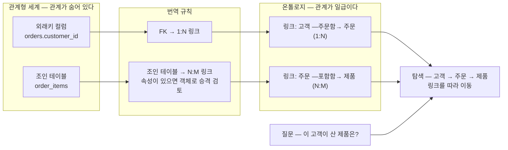

<figure class="post-figure post-figure--header">
<svg role="img" aria-label="외래키에서 링크로의 승격을 한 장으로 보여 주는 그림. 위쪽 절반은 관계형 세계로, customers·orders·order_items·products 네 테이블 상자가 가는 외래키 화살표(customer_id, order_id, product_id)로 이어져 있고 조인 테이블 order_items가 orders와 products 사이에 끼어 있다 — 관계는 조인 로직 속에 숨어 있다. 가운데 아래 방향의 승격 화살표를 지나면 아래쪽 절반의 온톨로지 세계가 나온다. 고객·주문·제품 세 객체 노드가 '주문함 1:N', '포함함 N:M'이라는 이름 붙은 굵은 링크로 직접 연결되고, 조인 테이블은 점선 유령 상자로만 남아 링크로 소멸했음을 보여 준다 — 관계가 모델의 일급 시민이 된다." viewBox="0 0 680 352" xmlns="http://www.w3.org/2000/svg">
  <title>외래키에서 링크로 — 조인 로직에 숨어 있던 관계가 이름·방향·카디널리티를 가진 일급 개념으로 승격된다</title>
  <defs>
    <marker id="fk2l-fk" viewBox="0 0 10 10" refX="8" refY="5" markerWidth="6" markerHeight="6" orient="auto-start-reverse">
      <path d="M0,0 L10,5 L0,10 z" fill="currentColor"/>
    </marker>
    <marker id="fk2l-link" viewBox="0 0 10 10" refX="8" refY="5" markerWidth="6" markerHeight="6" orient="auto-start-reverse">
      <path d="M0,0 L10,5 L0,10 z" fill="var(--secondary-color)"/>
    </marker>
    <marker id="fk2l-gold" viewBox="0 0 10 10" refX="8" refY="5" markerWidth="6" markerHeight="6" orient="auto-start-reverse">
      <path d="M0,0 L10,5 L0,10 z" fill="var(--gold)"/>
    </marker>
  </defs>

  <!-- ===== title ===== -->
  <text x="340" y="24" text-anchor="middle" font-size="16" font-weight="800" fill="currentColor" letter-spacing="1">외래키에서 링크로</text>

  <!-- ===== SECTION A: relational world ===== -->
  <text x="30" y="48" text-anchor="start" font-size="11" font-weight="700" fill="currentColor" opacity="0.72">관계형 세계 — 관계는 조인 로직 속에 숨어 있다</text>

  <!-- customers -->
  <g>
    <rect x="30" y="64" width="116" height="56" rx="3" fill="var(--bg-light)" stroke="currentColor" stroke-width="1.8"/>
    <line x1="30" y1="82" x2="146" y2="82" stroke="currentColor" stroke-width="1" opacity="0.5"/>
    <text x="88" y="77" text-anchor="middle" font-size="9" font-weight="700" fill="currentColor">customers</text>
    <text x="38" y="97" font-size="7.5" fill="currentColor" opacity="0.7">id PK</text>
    <text x="38" y="111" font-size="7.5" fill="currentColor" opacity="0.7">name · email</text>
  </g>
  <!-- orders -->
  <g>
    <rect x="200" y="64" width="116" height="56" rx="3" fill="var(--bg-light)" stroke="currentColor" stroke-width="1.8"/>
    <line x1="200" y1="82" x2="316" y2="82" stroke="currentColor" stroke-width="1" opacity="0.5"/>
    <text x="258" y="77" text-anchor="middle" font-size="9" font-weight="700" fill="currentColor">orders</text>
    <text x="208" y="97" font-size="7.5" fill="currentColor" opacity="0.7">id PK</text>
    <text x="208" y="111" font-size="7.5" font-weight="700" fill="var(--secondary-color)">customer_id FK</text>
  </g>
  <!-- order_items (join table) -->
  <g>
    <rect x="376" y="64" width="116" height="56" rx="3" fill="var(--bg-light)" stroke="currentColor" stroke-width="1.8"/>
    <line x1="376" y1="82" x2="492" y2="82" stroke="currentColor" stroke-width="1" opacity="0.5"/>
    <text x="434" y="77" text-anchor="middle" font-size="9" font-weight="700" fill="currentColor">order_items</text>
    <text x="384" y="97" font-size="7.5" font-weight="700" fill="var(--secondary-color)">order_id FK</text>
    <text x="384" y="111" font-size="7.5" font-weight="700" fill="var(--secondary-color)">product_id FK</text>
  </g>
  <text x="434" y="134" text-anchor="middle" font-size="8" fill="currentColor" opacity="0.65">조인 테이블 — N:M의 우회 장치</text>
  <!-- products -->
  <g>
    <rect x="546" y="64" width="104" height="56" rx="3" fill="var(--bg-light)" stroke="currentColor" stroke-width="1.8"/>
    <line x1="546" y1="82" x2="650" y2="82" stroke="currentColor" stroke-width="1" opacity="0.5"/>
    <text x="598" y="77" text-anchor="middle" font-size="9" font-weight="700" fill="currentColor">products</text>
    <text x="554" y="97" font-size="7.5" fill="currentColor" opacity="0.7">id PK</text>
    <text x="554" y="111" font-size="7.5" fill="currentColor" opacity="0.7">name · price</text>
  </g>

  <!-- thin FK arrows -->
  <g stroke="currentColor" stroke-width="1.4" opacity="0.55">
    <line x1="200" y1="92" x2="152" y2="92" marker-end="url(#fk2l-fk)"/>
    <line x1="376" y1="92" x2="322" y2="92" marker-end="url(#fk2l-fk)"/>
    <line x1="492" y1="92" x2="540" y2="92" marker-end="url(#fk2l-fk)"/>
  </g>
  <g font-size="6.8" fill="currentColor" opacity="0.6" text-anchor="middle">
    <text x="175" y="86">customer_id</text>
    <text x="349" y="86">order_id</text>
    <text x="516" y="86">product_id</text>
  </g>
  <text x="180" y="152" text-anchor="middle" font-size="8.5" fill="currentColor" opacity="0.6">이름도 방향도 없는 FK — 질의 때마다 JOIN으로 재조립</text>

  <!-- ===== transform arrow ===== -->
  <line x1="340" y1="150" x2="340" y2="196" stroke="var(--gold)" stroke-width="2.5" marker-end="url(#fk2l-gold)"/>
  <text x="354" y="170" text-anchor="start" font-size="9.5" font-weight="700" fill="var(--gold)">승격 (promote)</text>
  <text x="354" y="184" text-anchor="start" font-size="8" fill="currentColor" opacity="0.7">이름 · 방향 · 카디널리티를 새긴다</text>

  <!-- ===== SECTION B: ontology world ===== -->
  <text x="30" y="228" text-anchor="start" font-size="11" font-weight="700" fill="currentColor" opacity="0.72">온톨로지 세계 — 관계가 모델의 일급 시민이 된다</text>

  <!-- named links (drawn first) -->
  <line x1="152" y1="277" x2="288" y2="277" stroke="var(--secondary-color)" stroke-width="3" marker-end="url(#fk2l-link)"/>
  <line x1="382" y1="277" x2="518" y2="277" stroke="var(--secondary-color)" stroke-width="3" marker-end="url(#fk2l-link)"/>
  <g text-anchor="middle">
    <text x="222" y="250" font-size="9.5" font-weight="700" fill="var(--secondary-color)">주문함 · 1:N</text>
    <text x="222" y="294" font-size="7.5" fill="currentColor" opacity="0.6">역방향: 주문한 고객</text>
    <text x="452" y="250" font-size="9.5" font-weight="700" fill="var(--secondary-color)">포함함 · N:M</text>
  </g>

  <!-- object nodes -->
  <g text-anchor="middle">
    <rect x="64" y="258" width="88" height="38" rx="5" fill="var(--bg-panel)" stroke="currentColor" stroke-width="2"/>
    <text x="108" y="282" font-size="11" font-weight="700" fill="currentColor">고객</text>
    <rect x="294" y="258" width="88" height="38" rx="5" fill="var(--bg-panel)" stroke="currentColor" stroke-width="2"/>
    <text x="338" y="282" font-size="11" font-weight="700" fill="currentColor">주문</text>
    <rect x="524" y="258" width="88" height="38" rx="5" fill="var(--bg-panel)" stroke="currentColor" stroke-width="2"/>
    <text x="568" y="282" font-size="11" font-weight="700" fill="currentColor">제품</text>
  </g>

  <!-- ghost of the join table -->
  <rect x="406" y="304" width="92" height="22" rx="3" fill="none" stroke="currentColor" stroke-width="1.2" stroke-dasharray="4 3" opacity="0.35"/>
  <text x="452" y="318" text-anchor="middle" font-size="7.5" fill="currentColor" opacity="0.45">order_items</text>
  <text x="560" y="318" text-anchor="start" font-size="8" font-weight="700" fill="var(--accent-color)" opacity="0.85">→ 링크로 소멸</text>
</svg>
<figcaption>관계형 세계에서 조인 로직 속에 숨어 있던 관계(FK 컬럼·조인 테이블)가, 온톨로지에서는 이름·방향·카디널리티가 새겨진 <strong>링크 타입</strong>으로 승격된다 — 조인 테이블은 링크로 소멸하고, 관계는 모델의 일급 시민이 된다.</figcaption>
</figure>

## 들어가며

[3단계](/2026/07/19/ontology-object-types-properties.html)에서 우리는 도메인의 명사 — 고객·주문·제품 — 를 객체 타입으로 승격하고 속성과 기본키를 입혔습니다. 그런데 객체만 나열된 온톨로지는 아직 온톨로지가 아닙니다. 명함첩일 뿐입니다. "이 고객이 *어떤* 주문을 냈는가", "그 주문에 *어떤* 제품이 담겼는가" — 조직이 실제로 던지는 질문은 거의 전부 객체 *사이*를 가로지릅니다. **온톨로지의 힘은 객체가 아니라 관계에서 나옵니다.**

관계형 데이터베이스에도 물론 관계가 있습니다. 그러나 그 관계는 모델에 명시적으로 존재하는 것이 아니라, 외래키 컬럼과 조인 테이블, 그리고 그것을 아는 사람의 머릿속 조인 로직에 **흩어져** 있습니다. `orders.customer_id`라는 컬럼을 보고 "아, 이건 고객과의 관계구나"라고 *해석해야* 하고, 그 해석은 쿼리를 쓸 때마다 `JOIN ... ON ...` 절로 매번 다시 표현됩니다. 온톨로지는 이 관계를 **링크 타입(link type)**이라는 *일급 개념(first-class concept)*으로 끌어올립니다 — "고객이 주문을 낸다"가 조인 로직이 아니라 모델 그 자체에 이름·방향·의미와 함께 새겨지는 것입니다.

이 글은 [Ontology Essential Curriculum](/2026/07/19/ontology-essential-curriculum.html)의 4단계이자, 시리즈 두 번째 막 "온톨로지를 짓기(3~5단계)"의 한가운데입니다. 링크 타입이 무엇이고 어떻게 설계하는지, 관계형 세계의 1:1·1:N·N:M 카디널리티와 외래키·조인 테이블이 어떤 규칙으로 링크로 번역되는지, 그리고 링크를 따라 그래프를 **탐색(traversal)**하며 답을 얻는 사고방식이 조인 사고와 어떻게 다른지를 다룹니다. 이 링크들이 실제 데이터에서 어떻게 채워지는지는 [5단계 — 데이터 매핑과 엔티티 해소](/2026/07/19/ontology-data-mapping-entity-resolution.html)의 몫입니다.

<div class="post-summary-box" markdown="1">

### 📌 이 글에서 다루는 내용

- **링크 타입**: 관계를 일급 개념으로 — 외래키·조인 로직에 숨어 있던 관계를 이름·방향·의미를 가진 모델 요소로 승격하기, 좋은 링크 이름 짓기, 링크에 속성이 필요해지는 순간
- **카디널리티와 외래키 매핑**: 1:1·1:N·N:M의 의미와 링크 타입 선언, 외래키 → 1:N 링크·조인 테이블 → N:M 링크의 번역 규칙, 번역 시 판단이 필요한 경계 사례들
- **그래프 탐색**: 링크를 따라 이동하며 답을 얻기 — SQL 조인 사고 vs 그래프 탐색 사고의 대비, 다대다 관계와 다중 홉 경로 질의, 탐색이 질의와 이해를 단순화하는 이유

</div>

## 한눈에 보기 — 외래키가 링크가 되고, 조인이 탐색이 된다

이 글의 스파인을 한 장으로 그리면 이렇습니다. 관계형 스키마의 외래키와 조인 테이블은 각각 카디널리티 번역 규칙을 따라 링크 타입으로 승격되고, 그렇게 세워진 객체 그래프 위에서 질문은 조인 조립이 아니라 링크를 따라가는 탐색으로 답해집니다.



왼쪽(숨은 관계)에서 오른쪽(일급 관계)으로 승격되는 흐름과, 그 위에서 질문이 탐색으로 풀리는 흐름 — 이 두 축을 세 절로 나눠 파고듭니다.

## 링크 타입 — 관계를 일급 개념으로

### 조인 로직에 숨어 있던 관계

관계형 스키마에서 "고객과 주문의 관계"는 어디에 있을까요? 스키마를 봅시다.

```sql
CREATE TABLE customers (
    id          BIGINT PRIMARY KEY,
    name        TEXT NOT NULL,
    email       TEXT
);

CREATE TABLE orders (
    id          BIGINT PRIMARY KEY,
    customer_id BIGINT REFERENCES customers(id),  -- 관계는 이 컬럼 하나에 숨어 있다
    ordered_at  TIMESTAMPTZ NOT NULL,
    status      TEXT NOT NULL
);
```

관계는 `customer_id`라는 **컬럼 하나**로 표현됩니다. 이 표현에는 세 가지가 빠져 있습니다.

- **이름이 없습니다.** 이 관계가 "주문했다"인지 "관리한다"인지 "추천받았다"인지 컬럼명에서 *추측*할 뿐입니다. `customer_id`가 두 개라면(`ordered_by`, `approved_by`) 추측은 더 어려워집니다.
- **방향과 의미가 없습니다.** "고객이 주문을 낸다"는 도메인 문장은 스키마 어디에도 없습니다. 그 문장은 쿼리 작성자의 머릿속과, 운이 좋으면 위키 문서에 있습니다.
- **질의할 때마다 다시 조립해야 합니다.** 관계를 쓰려면 매번 `JOIN orders o ON o.customer_id = c.id`를 손으로 씁니다. 같은 관계가 회사의 수백 개 쿼리에 수백 번 복제되고, 스키마가 바뀌면 그 수백 곳이 전부 수선 대상이 됩니다.

즉 관계형 모델에서 관계는 데이터로는 존재하지만 **모델의 시민으로는 존재하지 않습니다**. 온톨로지가 하는 일이 바로 이 승격입니다.

### 링크 타입 — 이름·방향·의미를 가진 모델 요소

**링크 타입(link type)**은 두 객체 타입 사이의 관계를 온톨로지에 명시적으로 선언한 것입니다. [2단계](/2026/07/19/ontology-knowledge-graphs-rdf-owl-property-graphs.html)에서 본 RDF의 술어(predicate), 속성 그래프의 엣지 타입과 같은 계보의 개념입니다. 링크 타입 하나는 최소한 다음을 갖습니다.

```yaml
# 링크 타입 선언 (의사 스키마)
link_type:
  api_name: customer-places-order
  display_name: "주문함"            # 고객 → 주문 방향에서 읽는 이름
  inverse_name: "주문한 고객"        # 주문 → 고객 방향에서 읽는 이름
  source: Customer                  # 출발 객체 타입
  target: Order                     # 도착 객체 타입
  cardinality: ONE_TO_MANY          # 고객 1 : 주문 N
```

요소를 하나씩 뜯어 봅시다.

- **이름(name)**: 링크는 도메인의 *동사*입니다. "주문함(places)", "포함함(contains)", "소속됨(belongs to)", "담당함(is assigned to)" — 도메인 전문가가 화이트보드에서 말하는 그 동사를 그대로 씁니다. `customer_id`가 아니라 "주문함"이라는 이름이 모델에 있으면, 온톨로지를 처음 보는 사람도 스키마 고고학 없이 도메인을 읽을 수 있습니다.
- **방향(direction)과 역방향 이름**: 링크에는 출발과 도착이 있지만, 잘 만든 온톨로지는 **양방향에서 자연스럽게 읽히는 이름**을 둘 다 갖습니다. 고객에서 보면 "이 고객이 주문함 → 주문 목록", 주문에서 보면 "이 주문을 주문한 고객 → 고객 한 명". 관계형 DB에서 역방향 질의가 항상 가능하듯, 링크도 양방향 탐색이 기본입니다 — 이름만 방향마다 다르게 읽힙니다.
- **의미(semantics)**: 링크 타입은 출발·도착 객체 타입을 **제약**합니다. "주문함" 링크는 `Customer`에서 `Order`로만 놓일 수 있습니다. 외래키 제약이 참조 무결성을 지키듯, 링크 타입은 관계의 *의미적 무결성* — 설비가 주문을 "주문함"으로 가리키는 난센스 — 를 모델 수준에서 막습니다.

이 승격이 주는 실질 이득은 명확합니다. 관계가 모델에 한 번 선언되면, 그 관계를 쓰는 모든 질의·화면·API가 **같은 선언 하나를 참조**합니다. "고객의 주문 목록"은 더 이상 수백 개 쿼리에 흩어진 `JOIN` 절이 아니라, `customer.orders`라는 탐색 한 번입니다. 관계의 정의가 바뀌면 링크 타입 한 곳을 고치면 됩니다.

### 링크에도 데이터가 실릴 때 — 링크 속성과 객체 승격

관계 자체가 정보를 가질 때가 있습니다. "직원이 프로젝트에 참여한다"는 관계에는 *역할*과 *참여 시작일*이 붙습니다. 이때 선택지는 둘입니다.

- **링크 속성(link property)**: 속성 그래프처럼 링크 자체에 `role`, `since` 같은 속성을 답니다. 관계가 단순하고 속성이 한둘일 때 적합합니다.
- **관계의 객체 승격**: 관계 자체를 **객체 타입으로 승격**합니다 — `참여(Assignment)`라는 객체를 만들고, `직원 —참여함→ 참여 ←포함됨— 프로젝트`로 잇는 것입니다. 관계에 속성이 많거나, 관계가 자기 생애주기(생성·승인·종료)를 갖거나, 관계에 *또 다른 관계*가 붙을 때(참여를 승인한 관리자)는 이쪽이 맞습니다.

3단계에서 다룬 "무엇을 객체로 승격할 것인가"라는 판단이 여기서 재등장합니다 — **명사만이 아니라, 충분히 무거워진 동사도 객체가 됩니다.** 관계형 모델링에서 조인 테이블에 컬럼이 붙기 시작하면 그것이 사실은 숨은 엔티티였다는 신호인 것과 정확히 같은 판단입니다.

## 카디널리티와 외래키 매핑 — 관계형 스키마를 링크로 번역하기

### 1:1 · 1:N · N:M — 카디널리티가 말해 주는 것

**카디널리티(cardinality)**는 링크 양끝에 객체가 몇 개씩 설 수 있는지의 제약입니다. 링크 타입 선언에서 가장 중요한 한 줄입니다 — 이 제약이 탐색 결과의 *모양*(하나인가, 목록인가)을 정하기 때문입니다.

- **1:1** — 양쪽 모두 최대 하나. 예: 직원 ↔ 사원증. 탐색하면 양방향 모두 객체 *하나*가 나옵니다.
- **1:N** — 한쪽은 하나, 반대쪽은 여럿. 예: 고객 1명 → 주문 N건. 고객에서 탐색하면 *목록*, 주문에서 탐색하면 *하나*입니다.
- **N:M** — 양쪽 모두 여럿. 예: 주문 N건 ↔ 제품 M종. 양방향 모두 *목록*이 나옵니다.

### 번역 규칙 — 외래키·조인 테이블 → 링크 타입

관계형 스키마의 관계 표현은 정형화되어 있으므로, 링크로의 번역도 규칙으로 정리됩니다.

| 카디널리티 | 관계형 표현 | 온톨로지 번역 | 예시 |
| --- | --- | --- | --- |
| 1:N | N쪽 테이블의 **외래키 컬럼** (`orders.customer_id`) | **1:N 링크 타입 하나** — FK 컬럼은 링크의 백킹 데이터가 되고, 객체 속성에서는 제외 검토 | 고객 —주문함→ 주문 |
| 1:1 | FK + **UNIQUE 제약**, 또는 기본키 공유 | **1:1 링크 타입** — 또는 애초에 두 테이블이 한 객체였는지 재검토 | 직원 —발급받음→ 사원증 |
| N:M | **조인 테이블** (`order_items(order_id, product_id)`) | 순수 매핑이면 **N:M 링크 타입 하나** — 조인 테이블은 모델에서 사라짐 | 주문 —포함함→ 제품 |
| N:M + 부가 컬럼 | 조인 테이블 + 데이터 컬럼 (`quantity`, `unit_price`) | **링크 속성**, 또는 관계를 **객체로 승격** (주문항목) + 1:N 링크 둘 | 주문 —구성됨→ 주문항목 ←담김— 제품 |
| 자기 참조 | 같은 테이블로의 FK (`employees.manager_id`) | 같은 객체 타입을 양끝에 둔 **자기 링크** — 이름·역방향 이름이 특히 중요 ("관리함" / "보고함") | 직원 —관리함→ 직원 |

번역할 때 판단이 필요한 지점이 셋 있습니다.

**첫째, FK 컬럼의 거취.** `orders.customer_id`를 링크로 번역했다면, `주문` 객체의 *속성*으로 `customer_id`를 또 둘 필요는 없습니다. 관계는 링크가 표현하고, 속성은 그 객체 *자신의* 성질만 담는 것이 원칙입니다. FK 컬럼은 링크를 채우는 **백킹 데이터**([5단계](/2026/07/19/ontology-data-mapping-entity-resolution.html)의 주제)로 내려갑니다.

**둘째, 조인 테이블의 운명.** 순수한 매핑만 담은 조인 테이블은 온톨로지에서 **사라지는 것이 정상**입니다 — 그 존재 이유가 "관계형 모델이 N:M을 직접 표현하지 못한다"는 표현력의 한계였기 때문입니다. 온톨로지는 N:M 링크를 직접 선언할 수 있으므로 우회 장치가 필요 없습니다. 반대로 `quantity` 같은 컬럼이 붙은 조인 테이블은 숨은 엔티티(주문항목)일 가능성이 높고, 그때는 위 표의 마지막 규칙대로 객체로 승격합니다.

**셋째, 카디널리티는 스키마가 아니라 도메인에게 묻습니다.** 스키마에 UNIQUE 제약이 없다고 해서 N:M인 것도, FK가 있다고 반드시 1:N인 것도 아닙니다 — 제약이 느슨하게 만들어진 스키마는 흔합니다. "고객 한 명이 주문을 여러 개 낼 수 있는가"는 DBA가 아니라 **도메인 전문가에게 물어야 할 질문**이고, 링크의 카디널리티는 그 답을 새기는 자리입니다. 스키마를 그대로 베끼면 스키마의 실수까지 베끼게 됩니다.

<figure class="post-figure">
<svg role="img" aria-label="관계형 표현을 링크 타입으로 옮기는 번역 규칙 3연을 세 행으로 보여 주는 그림. 1행: orders 테이블의 customer_id 외래키 컬럼이 번역 화살표를 지나 고객에서 주문으로 향하는 '주문함 1:N' 링크가 된다. 2행: order_id와 product_id만 담은 순수 조인 테이블 order_items는 점선 상자로 그려져 있고, 번역되면 주문에서 제품으로 향하는 '포함함 N:M' 직접 링크가 되며 조인 테이블 자신은 소멸한다. 3행: quantity·unit_price 같은 부가 컬럼이 붙은 order_items는 숨은 엔티티라서, 금색으로 강조된 주문항목 객체로 승격되고 주문—구성됨(1:N)→주문항목←담김(N:1)—제품의 링크 둘로 분해된다." viewBox="0 0 680 334" xmlns="http://www.w3.org/2000/svg">
  <title>번역 규칙 3연 — FK 컬럼은 1:N 링크로, 순수 조인 테이블은 N:M 링크로 소멸, 부가 컬럼이 붙으면 관계를 객체로 승격</title>
  <defs>
    <marker id="card-link" viewBox="0 0 10 10" refX="8" refY="5" markerWidth="6" markerHeight="6" orient="auto-start-reverse">
      <path d="M0,0 L10,5 L0,10 z" fill="var(--secondary-color)"/>
    </marker>
  </defs>

  <text x="340" y="22" text-anchor="middle" font-size="13" font-weight="800" fill="currentColor">번역 규칙 3연 — 관계형 표현 → 링크 타입</text>

  <!-- ===== ROW 1: FK column → 1:N link ===== -->
  <text x="30" y="48" text-anchor="start" font-size="10" font-weight="700" fill="currentColor" opacity="0.8">① 외래키 컬럼 → 1:N 링크</text>
  <g>
    <rect x="30" y="58" width="190" height="46" rx="3" fill="var(--bg-light)" stroke="currentColor" stroke-width="1.8"/>
    <line x1="30" y1="74" x2="220" y2="74" stroke="currentColor" stroke-width="1" opacity="0.5"/>
    <text x="125" y="70" text-anchor="middle" font-size="8.5" font-weight="700" fill="currentColor">orders</text>
    <text x="40" y="87" font-size="7.5" fill="currentColor" opacity="0.7">id BIGINT PK</text>
    <text x="40" y="99" font-size="7.5" font-weight="700" fill="var(--secondary-color)">customer_id FK → customers</text>
  </g>
  <line x1="238" y1="81" x2="298" y2="81" stroke="var(--secondary-color)" stroke-width="2.2" marker-end="url(#card-link)"/>
  <text x="269" y="72" text-anchor="middle" font-size="8" font-weight="700" fill="var(--secondary-color)">번역</text>
  <g text-anchor="middle">
    <rect x="316" y="65" width="76" height="32" rx="5" fill="var(--bg-panel)" stroke="currentColor" stroke-width="2"/>
    <text x="354" y="85" font-size="10" font-weight="700" fill="currentColor">고객</text>
    <rect x="540" y="65" width="76" height="32" rx="5" fill="var(--bg-panel)" stroke="currentColor" stroke-width="2"/>
    <text x="578" y="85" font-size="10" font-weight="700" fill="currentColor">주문</text>
    <text x="464" y="59" font-size="9" font-weight="700" fill="var(--secondary-color)">주문함 · 1:N</text>
    <text x="464" y="97" font-size="7" fill="currentColor" opacity="0.55">FK 컬럼은 링크의 백킹 데이터로</text>
  </g>
  <line x1="392" y1="81" x2="534" y2="81" stroke="var(--secondary-color)" stroke-width="2.6" marker-end="url(#card-link)"/>

  <!-- ===== ROW 2: pure join table → N:M link ===== -->
  <text x="30" y="146" text-anchor="start" font-size="10" font-weight="700" fill="currentColor" opacity="0.8">② 순수 조인 테이블 → N:M 링크 (조인 테이블은 소멸)</text>
  <g>
    <rect x="30" y="156" width="190" height="46" rx="3" fill="var(--bg-light)" stroke="currentColor" stroke-width="1.6" stroke-dasharray="5 3"/>
    <line x1="30" y1="172" x2="220" y2="172" stroke="currentColor" stroke-width="1" opacity="0.5"/>
    <text x="125" y="168" text-anchor="middle" font-size="8.5" font-weight="700" fill="currentColor">order_items</text>
    <text x="40" y="185" font-size="7.5" fill="currentColor" opacity="0.7">order_id FK · product_id FK</text>
    <text x="40" y="197" font-size="7" fill="currentColor" opacity="0.55">부가 컬럼 없음 — 순수 매핑</text>
  </g>
  <line x1="238" y1="179" x2="298" y2="179" stroke="var(--secondary-color)" stroke-width="2.2" marker-end="url(#card-link)"/>
  <text x="269" y="170" text-anchor="middle" font-size="8" font-weight="700" fill="var(--secondary-color)">번역</text>
  <g text-anchor="middle">
    <rect x="316" y="163" width="76" height="32" rx="5" fill="var(--bg-panel)" stroke="currentColor" stroke-width="2"/>
    <text x="354" y="183" font-size="10" font-weight="700" fill="currentColor">주문</text>
    <rect x="540" y="163" width="76" height="32" rx="5" fill="var(--bg-panel)" stroke="currentColor" stroke-width="2"/>
    <text x="578" y="183" font-size="10" font-weight="700" fill="currentColor">제품</text>
    <text x="464" y="157" font-size="9" font-weight="700" fill="var(--secondary-color)">포함함 · N:M</text>
    <text x="464" y="195" font-size="7" fill="currentColor" opacity="0.55">N:M 직접 선언 — 우회 장치 불필요</text>
  </g>
  <line x1="392" y1="179" x2="534" y2="179" stroke="var(--secondary-color)" stroke-width="2.6" marker-end="url(#card-link)"/>

  <!-- ===== ROW 3: join table + data columns → object promotion ===== -->
  <text x="30" y="244" text-anchor="start" font-size="10" font-weight="700" fill="currentColor" opacity="0.8">③ 부가 컬럼이 붙은 조인 테이블 → 관계의 객체 승격</text>
  <g>
    <rect x="30" y="254" width="190" height="58" rx="3" fill="var(--bg-light)" stroke="currentColor" stroke-width="1.8"/>
    <line x1="30" y1="270" x2="220" y2="270" stroke="currentColor" stroke-width="1" opacity="0.5"/>
    <text x="125" y="266" text-anchor="middle" font-size="8.5" font-weight="700" fill="currentColor">order_items</text>
    <text x="40" y="283" font-size="7.5" fill="currentColor" opacity="0.7">order_id FK · product_id FK</text>
    <text x="40" y="295" font-size="7.5" font-weight="700" fill="var(--gold)">quantity · unit_price</text>
    <text x="40" y="306" font-size="6.5" fill="currentColor" opacity="0.55">데이터가 실린 관계 = 숨은 엔티티</text>
  </g>
  <line x1="238" y1="283" x2="292" y2="283" stroke="var(--secondary-color)" stroke-width="2.2" marker-end="url(#card-link)"/>
  <text x="265" y="274" text-anchor="middle" font-size="8" font-weight="700" fill="var(--secondary-color)">승격</text>
  <g text-anchor="middle">
    <rect x="308" y="267" width="64" height="32" rx="5" fill="var(--bg-panel)" stroke="currentColor" stroke-width="2"/>
    <text x="340" y="287" font-size="10" font-weight="700" fill="currentColor">주문</text>
    <rect x="436" y="267" width="84" height="32" rx="5" fill="var(--bg-panel)" stroke="var(--gold)" stroke-width="2.5"/>
    <text x="478" y="287" font-size="10" font-weight="700" fill="currentColor">주문항목</text>
    <rect x="584" y="267" width="64" height="32" rx="5" fill="var(--bg-panel)" stroke="currentColor" stroke-width="2"/>
    <text x="616" y="287" font-size="10" font-weight="700" fill="currentColor">제품</text>
    <text x="404" y="261" font-size="7.5" font-weight="700" fill="var(--secondary-color)">구성됨 · 1:N</text>
    <text x="552" y="261" font-size="7.5" font-weight="700" fill="var(--secondary-color)">담김 · N:1</text>
    <text x="478" y="320" font-size="7.5" font-weight="700" fill="var(--gold)">관계의 객체 승격 — 링크 둘로 분해</text>
  </g>
  <line x1="372" y1="283" x2="430" y2="283" stroke="var(--secondary-color)" stroke-width="2.6" marker-end="url(#card-link)"/>
  <line x1="584" y1="283" x2="526" y2="283" stroke="var(--secondary-color)" stroke-width="2.6" marker-end="url(#card-link)"/>
</svg>
<figcaption>외래키·조인 테이블을 링크로 옮기는 번역 규칙 3연 — ① FK 컬럼은 1:N 링크로(컬럼은 백킹 데이터로), ② 순수 조인 테이블은 N:M 링크로 소멸, ③ 부가 컬럼이 붙은 조인 테이블은 숨은 엔티티이므로 객체(주문항목)로 승격해 1:N 링크 둘로 분해한다.</figcaption>
</figure>

### 번역 예제 — 주문 도메인 전체

3단계에서 세운 객체 타입들에 이제 링크를 얹어 봅시다. 한 가지 미리 밝혀 두면, 3단계에서는 설비–제품을 `equipment_id` FK의 1:N으로 두었지만, 여기서는 **여러 설비가 여러 제품을 만드는 N:M으로 요구가 확장된 시나리오**를 가정합니다(조인 테이블 `product_facility` 등장) — 카디널리티가 바뀌면 번역 결과가 어떻게 달라지는지 보여 주기 위해서입니다. 원천 스키마와 번역 결과를 나란히 놓으면 이렇습니다.

```sql
-- 원천 관계형 스키마 (요약)
customers(id PK, name, email)
orders(id PK, customer_id FK→customers, ordered_at, status)
order_items(order_id FK→orders, product_id FK→products,   -- 조인 테이블
            quantity, unit_price)                          -- + 부가 컬럼!
products(id PK, name, price)
facilities(id PK, name, region)
product_facility(product_id FK, facility_id FK)            -- 순수 조인 테이블
```

```text
번역된 링크 타입:

  고객   —주문함(1:N)→        주문        # orders.customer_id에서
  주문   —구성됨(1:N)→        주문항목    # order_items에 quantity·unit_price가
  주문항목 —담음(N:1)→        제품        #   있으므로 객체로 승격, 링크 둘로 분해
  제품   —생산됨(N:M)→        설비        # product_facility는 순수 매핑 → 링크로 소멸
```

같은 도메인, 같은 정보 — 그러나 관계형 쪽에서는 관계를 읽으려면 FK를 추적해야 하고, 온톨로지 쪽에서는 **관계가 문장으로 읽힙니다**. "고객이 주문하고, 주문은 주문항목으로 구성되며, 주문항목은 제품을 담고, 제품은 설비에서 생산된다." 이 문장이 그대로 모델입니다.

## 그래프 탐색 — 링크를 따라 이동하며 답 얻기

### 조인 사고 vs 탐색 사고

같은 질문을 두 세계에서 풀어 보면 사고방식의 차이가 선명해집니다. **질문: "고객 '김온톨'이 지금까지 구매한 제품을 모두 보여 달라."**

관계형 세계 — **조인 사고**입니다. 답에 필요한 테이블 네 개를 머릿속에 펼치고, FK 관계를 기억해 내서, 결과 집합이 나올 때까지 조인을 조립합니다.

```sql
-- 조인 사고: 테이블을 펼치고, 키를 맞춰 붙이고, 집합을 좁힌다
SELECT DISTINCT p.name
FROM customers c
JOIN orders       o  ON o.customer_id = c.id       -- 관계 1을 손으로 재조립
JOIN order_items  oi ON oi.order_id   = o.id       -- 관계 2를 손으로 재조립
JOIN products     p  ON p.id          = oi.product_id  -- 관계 3을 손으로 재조립
WHERE c.name = '김온톨';
```

온톨로지 세계 — **탐색 사고**입니다. 출발 객체 하나를 잡고, 링크를 따라 이동합니다.

```text
# 탐색 사고: 객체에서 출발해 링크의 이름을 따라 걷는다
customer("김온톨")
  .traverse("주문함")        # 고객 → 그 고객의 주문들
  .traverse("구성됨")        # 주문들 → 주문항목들
  .traverse("담음")          # 주문항목들 → 제품들
  .distinct()
```

두 코드는 같은 답을 내지만, 요구하는 지식이 다릅니다. 조인 쪽은 **스키마 지식**을 요구합니다 — 어떤 테이블이 있고, 어떤 컬럼이 어떤 컬럼을 참조하는지. 탐색 쪽은 **도메인 지식**만 요구합니다 — 고객은 주문하고, 주문은 항목으로 구성되고, 항목은 제품을 담는다. 도메인 전문가가 말로 설명하는 경로와 질의 코드가 **일대일로 대응**하는 것, 이것이 관계를 일급으로 둔 대가로 얻는 것입니다.

차이를 정리하면 이렇습니다.

| | 조인 사고 (관계형) | 탐색 사고 (온톨로지/그래프) |
| --- | --- | --- |
| 출발점 | 테이블(집합) 전체 | 특정 객체(들) |
| 관계 표현 | 질의마다 `ON` 절로 재조립 | 모델에 선언된 링크를 이름으로 참조 |
| 필요한 지식 | 스키마 (테이블·FK 구조) | 도메인 (누가 무엇과 어떻게 이어지는가) |
| 질의의 모양 | 집합을 붙이고 걸러서 좁힘 | 경로를 따라 이동하며 수집 |
| 관계가 바뀌면 | 흩어진 쿼리를 일괄 수선 | 링크 타입 정의 한 곳 수정 |
| 잘 맞는 질문 | 집계·대량 스캔 ("지난달 전체 매출") | 이웃·경로 ("이 객체와 이어진 것들") |

마지막 행이 중요합니다 — 탐색이 조인의 *상위 호환*은 아닙니다. "지난달 전체 주문의 카테고리별 매출 합계"처럼 특정 객체가 아니라 **집합 전체**를 쓸어야 하는 분석 질의는 여전히 관계형·컬럼너(columnar) 엔진의 홈그라운드입니다. 온톨로지의 탐색이 빛나는 것은 "**이 객체**에서 출발해 이어진 것들"을 묻는 운영적 질문 — 그리고 그것이 바로 현장의 업무 화면과 액션(6단계의 주제)이 온종일 던지는 질문입니다.

### 다대다와 다중 홉 — 경로 질의

탐색 사고의 진가는 홉(hop)이 늘어날수록 드러납니다. 실무의 질문은 종종 서너 개의 관계를 가로지릅니다. **"설비 F-07에 결함이 발견됐다. 이 설비에서 생산된 제품이 담긴 주문의 고객 전원에게 연락해야 한다."**

```sql
-- 조인 사고: 4개 관계 = 4중 조인, N:M 조인 테이블도 다시 등장한다
SELECT DISTINCT c.name, c.email
FROM facilities f
JOIN product_facility pf ON pf.facility_id = f.id
JOIN products p          ON p.id  = pf.product_id
JOIN order_items oi      ON oi.product_id = p.id
JOIN orders o            ON o.id  = oi.order_id
JOIN customers c         ON c.id  = o.customer_id
WHERE f.id = 'F-07';
```

```text
# 탐색 사고: 사건의 서사가 그대로 질의 경로가 된다
facility("F-07")
  .traverse("생산됨", direction="inverse")   # 설비 → 이 설비가 생산한 제품
  .traverse("담음", direction="inverse")     # 제품 → 이 제품을 담은 주문항목
  .traverse("구성됨", direction="inverse")   # 주문항목 → 그 항목이 속한 주문
  .traverse("주문함", direction="inverse")   # 주문 → 주문한 고객
  .distinct()
```

SQL 쪽은 6개 테이블·5개 `ON` 절이 되었고, 조인 순서와 키를 하나라도 틀리면 조용히 틀린 답이 나옵니다. 탐색 쪽은 홉이 하나 늘 때마다 **줄이 하나 늘 뿐**이고, 각 줄은 도메인 문장("이 설비가 생산한 제품")과 일대일로 읽힙니다. 역방향 탐색(`inverse`)이 자연스럽다는 점도 눈여겨볼 만합니다 — 링크 타입에 역방향 이름을 함께 설계해 둔 이유가 여기서 회수됩니다. 사고의 방향(결함 설비에서 고객으로)이 링크 선언의 방향(고객에서 주문으로)과 반대여도, 탐색은 막힘없이 거슬러 올라갑니다.

여기서 한 걸음 더 가면 **경로 자체가 답인 질의**가 있습니다 — "이 고객과 이 설비는 도대체 어떻게 연결되어 있는가?"(연결 경로 발견), "이 부품의 결함이 영향을 미치는 범위 전체"(도달 가능성, transitive closure). 관계형 SQL에서는 재귀 CTE로 힘겹게 표현되는 이 질의들이, 그래프 세계에서는 가변 길이 탐색으로 자연스럽게 표현됩니다. 2단계에서 본 속성 그래프 질의 언어(Cypher 계열)의 문법을 빌리면 이렇게 읽힙니다.

```text
# 가변 길이 경로: 고객 c와 설비 f를 잇는 최단 연결 고리 찾기 (최대 6홉)
MATCH path = shortestPath(
  (c:고객 ... )-[*..6]-(f:설비 ... )
)
RETURN path
```

공급망 영향 분석, 자금 흐름 추적, 권한 전파 — "무엇과 무엇이 어떻게 이어져 있는가"가 본질인 도메인에서, 관계를 일급으로 모델링해 둔 조직과 조인 로직에 묻어 둔 조직의 대응 속도는 같을 수가 없습니다.

### 탐색이 단순한 데는 이유가 있다 — 비용은 어디로 갔는가

공정하게 짚어 둘 것이 있습니다. 탐색 질의가 단순해진 것은 복잡성이 *사라져서*가 아니라 **모델링 시점으로 옮겨졌기** 때문입니다. 조인 사고에서는 관계의 정의를 질의 시점에 매번 지불합니다(`ON` 절). 탐색 사고에서는 그 비용을 링크 타입을 설계하는 시점에 **한 번** 지불하고, 이후의 모든 질의가 그 투자를 재사용합니다. 질의가 수백·수천 개로 늘어날수록 이 선불 투자의 수익률이 커지는 구조입니다.

성능 관점의 상식도 하나 챙겨 둡시다. 관계형 조인의 비용은 (인덱스가 받쳐 줘도) 대상 테이블 크기의 함수이기 쉽지만, 그래프 탐색의 비용은 원리적으로 **출발 객체의 이웃 수의 함수**입니다 — 전체 그래프가 아무리 커도, 고객 한 명의 주문이 30건이면 첫 홉은 30개만 만집니다(index-free adjacency를 갖춘 그래프 저장소 기준). 물론 슈퍼노드(수백만 이웃을 가진 객체)를 지나는 탐색은 그 자체로 폭발하므로, 카디널리티 설계 때 "N이 실제로 얼마나 큰가"를 함께 가늠해 두는 것이 좋습니다 — 파티셔닝 키가 핫 파티션을 만들 수 있듯, 링크도 핫 노드를 만들 수 있습니다.

## 정리

객체를 이어 그래프로 만들었습니다. 요점을 정리하면 다음과 같습니다.

- **온톨로지의 힘은 관계에서 나온다**: 관계형 모델에서 외래키 컬럼·조인 테이블·머릿속 조인 로직에 흩어져 있던 관계를, 온톨로지는 링크 타입이라는 일급 개념으로 승격한다. 링크는 이름(도메인의 동사)·방향(역방향 이름 포함)·의미(출발·도착 타입 제약)를 갖고 모델에 한 번 선언되어 모든 질의가 재사용한다.
- **카디널리티가 링크 선언의 핵심이다**: 1:1·1:N·N:M은 탐색 결과의 모양(하나/목록)을 정한다. 번역 규칙 — FK 컬럼은 1:N 링크로(속성에서는 제외), 순수 조인 테이블은 N:M 링크로 소멸, 부가 컬럼이 붙은 조인 테이블은 관계의 객체 승격(주문항목)을 검토. 카디널리티는 스키마가 아니라 도메인 전문가에게 확인한다.
- **무거워진 동사는 객체가 된다**: 관계에 속성이 많아지거나 자기 생애주기·자기 관계가 생기면, 링크 속성 대신 관계 자체를 객체 타입으로 승격한다 — 3단계의 승격 판단이 동사에도 적용되는 것이다.
- **조인 사고에서 탐색 사고로**: 조인은 스키마 지식으로 집합을 재조립하고, 탐색은 도메인 지식으로 객체에서 출발해 링크를 걷는다. 홉이 늘수록 조인은 급격히 복잡해지지만 탐색은 줄이 하나 늘 뿐이며, 경로가 그대로 도메인 문장으로 읽힌다. 단, 집합 전체를 쓰는 집계 분석은 여전히 관계형의 홈그라운드다.
- **단순함의 비용은 모델링 시점으로 선불된 것이다**: 링크 설계에 한 번 투자하면 이후의 모든 질의·화면·API가 재사용한다. 탐색 비용은 이웃 수의 함수임을 기억하고, 슈퍼노드가 될 카디널리티는 설계 때 가늠해 둔다.

이제 객체(3단계)와 링크(4단계)로 개념 모델의 뼈대가 섰습니다. 다음 질문은 이것입니다 — **이 우아한 객체와 링크를, 지저분한 실제 데이터로 어떻게 채우는가?** 원천 테이블의 컬럼을 객체 속성에 잇는 매핑, 그리고 여러 시스템에 흩어진 같은 실체를 하나의 객체로 묶는 엔티티 해소가 다음 단계의 주제입니다.

### 다음 학습 (Next Learning)

- [소스 데이터를 온톨로지로 매핑: 백킹 데이터셋과 엔티티 해소](/2026/07/19/ontology-data-mapping-entity-resolution.html) — 5단계: 개념 모델을 실제 데이터로 채우기
- [객체 타입과 속성: 엔티티를 객체로, 기본키와 객체 그래프](/2026/07/19/ontology-object-types-properties.html) — 3단계: 이 글의 링크가 잇는 객체들을 세운 단계
- [Ontology Essential Curriculum](/2026/07/19/ontology-essential-curriculum.html) — 시리즈 로드맵으로 돌아가 진행 상황 확인하기
