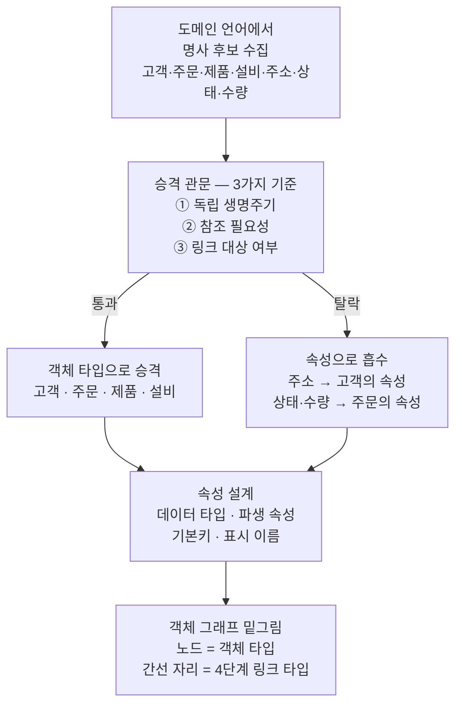
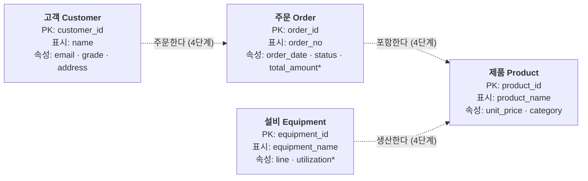

<figure class="post-figure post-figure--header">
<svg role="img" aria-label="이 글을 한 장으로 요약한 그림. 왼쪽에 도메인의 명사 후보 일곱 장(고객·주문·제품·설비·주소·상태·수량)이 낱말 카드로 흩어져 있고, 가운데의 승격 관문에는 세 가지 심사 기준(독립 생명주기·참조 필요성·링크 대상)이 세로로 적혀 있다. 관문을 통과한 네 명사는 오른쪽에서 기본키 열쇠가 달린 객체 타입 카드(고객·주문·제품·설비)가 되어 점선 링크(주문한다·포함한다·생산한다)로 이어진 객체 그래프의 밑그림을 이루고, 탈락한 세 명사(주소·상태·수량)는 객체 카드 안의 속성 줄로 흡수된다." viewBox="0 0 680 320" xmlns="http://www.w3.org/2000/svg">
  <title>객체 타입과 속성 — 명사 후보가 승격 관문을 지나 객체 그래프의 노드가 된다</title>
  <defs>
    <marker id="otp-h-arrow" viewBox="0 0 10 10" refX="8" refY="5" markerWidth="6" markerHeight="6" orient="auto-start-reverse">
      <path d="M0,0 L10,5 L0,10 z" fill="var(--secondary-color)"/>
    </marker>
    <marker id="otp-h-arrow-a" viewBox="0 0 10 10" refX="8" refY="5" markerWidth="6" markerHeight="6" orient="auto-start-reverse">
      <path d="M0,0 L10,5 L0,10 z" fill="var(--accent-color)"/>
    </marker>
    <g id="otp-h-key">
      <circle cx="0" cy="0" r="3.6" fill="none" stroke="var(--gold)" stroke-width="1.8"/>
      <line x1="3.4" y1="0" x2="13" y2="0" stroke="var(--gold)" stroke-width="1.8"/>
      <line x1="9" y1="0" x2="9" y2="3.6" stroke="var(--gold)" stroke-width="1.8"/>
      <line x1="13" y1="0" x2="13" y2="3.6" stroke="var(--gold)" stroke-width="1.8"/>
    </g>
  </defs>

  <!-- ===== title ===== -->
  <text x="340" y="24" text-anchor="middle" font-size="17" font-weight="800" fill="currentColor" letter-spacing="1.5">OBJECT TYPES &amp; PROPERTIES</text>
  <text x="340" y="46" text-anchor="middle" font-size="11" font-weight="700" fill="currentColor" opacity="0.72">도메인의 명사를 심사해 객체로 승격하고, 나머지는 속성으로 남긴다</text>

  <!-- ===== left: noun candidates ===== -->
  <g font-size="9" font-weight="700" text-anchor="middle">
    <rect x="30" y="78" width="56" height="22" rx="3" fill="var(--bg-light)" stroke="var(--secondary-color)" stroke-width="1.8"/>
    <text x="58" y="93" fill="currentColor">고객</text>
    <rect x="98" y="70" width="56" height="22" rx="3" fill="var(--bg-light)" stroke="var(--secondary-color)" stroke-width="1.8"/>
    <text x="126" y="85" fill="currentColor">주문</text>
    <rect x="44" y="112" width="56" height="22" rx="3" fill="var(--bg-light)" stroke="var(--secondary-color)" stroke-width="1.8"/>
    <text x="72" y="127" fill="currentColor">제품</text>
    <rect x="110" y="106" width="56" height="22" rx="3" fill="var(--bg-light)" stroke="var(--secondary-color)" stroke-width="1.8"/>
    <text x="138" y="121" fill="currentColor">설비</text>
    <rect x="32" y="150" width="56" height="22" rx="3" fill="var(--bg-light)" stroke="var(--accent-color)" stroke-width="1.6" stroke-dasharray="4 3"/>
    <text x="60" y="165" fill="currentColor">주소</text>
    <rect x="98" y="144" width="56" height="22" rx="3" fill="var(--bg-light)" stroke="currentColor" stroke-width="1.4"/>
    <text x="126" y="159" fill="currentColor">상태</text>
    <rect x="64" y="184" width="56" height="22" rx="3" fill="var(--bg-light)" stroke="currentColor" stroke-width="1.4"/>
    <text x="92" y="199" fill="currentColor">수량</text>
  </g>
  <text x="100" y="230" text-anchor="middle" font-size="9.5" font-weight="700" fill="currentColor" opacity="0.8">도메인의 명사 후보</text>
  <text x="100" y="243" text-anchor="middle" font-size="8" fill="currentColor" opacity="0.65">워크숍에서 수집한 낱말 카드</text>

  <!-- ===== arrow into gate ===== -->
  <line x1="174" y1="140" x2="220" y2="140" stroke="var(--secondary-color)" stroke-width="2.2" marker-end="url(#otp-h-arrow)"/>

  <!-- ===== middle: promotion gate ===== -->
  <rect x="228" y="64" width="112" height="172" rx="6" fill="var(--bg-panel)" stroke="var(--gold)" stroke-width="2.5"/>
  <text x="284" y="86" text-anchor="middle" font-size="11.5" font-weight="800" fill="var(--gold)">승격 관문</text>
  <g>
    <rect x="238" y="96" width="92" height="28" rx="4" fill="var(--bg-light)" stroke="currentColor" stroke-width="1"/>
    <circle cx="252" cy="110" r="7.5" fill="var(--bg-panel)" stroke="var(--secondary-color)" stroke-width="1.6"/>
    <text x="252" y="113" text-anchor="middle" font-size="8" fill="currentColor">1</text>
    <text x="264" y="113" font-size="8.2" font-weight="700" fill="currentColor">독립 생명주기</text>
    <rect x="238" y="132" width="92" height="28" rx="4" fill="var(--bg-light)" stroke="currentColor" stroke-width="1"/>
    <circle cx="252" cy="146" r="7.5" fill="var(--bg-panel)" stroke="var(--secondary-color)" stroke-width="1.6"/>
    <text x="252" y="149" text-anchor="middle" font-size="8" fill="currentColor">2</text>
    <text x="264" y="149" font-size="8.2" font-weight="700" fill="currentColor">참조 필요성</text>
    <rect x="238" y="168" width="92" height="28" rx="4" fill="var(--bg-light)" stroke="currentColor" stroke-width="1"/>
    <circle cx="252" cy="182" r="7.5" fill="var(--bg-panel)" stroke="var(--secondary-color)" stroke-width="1.6"/>
    <text x="252" y="185" text-anchor="middle" font-size="8" fill="currentColor">3</text>
    <text x="264" y="185" font-size="8.2" font-weight="700" fill="currentColor">링크 대상</text>
  </g>
  <text x="284" y="222" text-anchor="middle" font-size="7.5" fill="currentColor" opacity="0.7">둘 이상 '예'면 객체로</text>

  <!-- pass / fail paths -->
  <line x1="344" y1="104" x2="384" y2="96" stroke="var(--secondary-color)" stroke-width="2.2" marker-end="url(#otp-h-arrow)"/>
  <text x="362" y="88" text-anchor="middle" font-size="8.5" font-weight="700" fill="var(--secondary-color)">통과</text>
  <line x1="344" y1="186" x2="384" y2="236" stroke="var(--accent-color)" stroke-width="1.8" stroke-dasharray="4 3" marker-end="url(#otp-h-arrow-a)"/>
  <text x="352" y="228" text-anchor="middle" font-size="8.5" font-weight="700" fill="var(--accent-color)">탈락</text>
  <text x="284" y="262" text-anchor="middle" font-size="8.5" font-weight="700" fill="var(--accent-color)">탈락 → 속성으로 흡수</text>
  <text x="284" y="276" text-anchor="middle" font-size="8" fill="currentColor" opacity="0.7">주소는 고객으로, 상태·수량은 주문으로</text>

  <!-- ===== right: object graph draft — links first, cards on top ===== -->
  <g stroke="var(--secondary-color)" stroke-width="1.8" stroke-dasharray="5 4" opacity="0.6">
    <line x1="455" y1="96" x2="455" y2="222"/>
    <line x1="455" y1="222" x2="603" y2="96"/>
    <line x1="603" y1="222" x2="603" y2="96"/>
  </g>
  <g font-size="6.5" fill="currentColor" opacity="0.7">
    <text x="448" y="163" text-anchor="end">주문한다</text>
    <text x="540" y="150" text-anchor="start">포함한다</text>
    <text x="610" y="163" text-anchor="start">생산한다</text>
  </g>

  <!-- 고객 card -->
  <g>
    <rect x="392" y="64" width="126" height="64" rx="5" fill="var(--bg-panel)" stroke="currentColor" stroke-width="2"/>
    <text x="402" y="80" font-size="10" font-weight="700" fill="currentColor">고객</text>
    <use href="#otp-h-key" transform="translate(492,75)"/>
    <line x1="400" y1="88" x2="510" y2="88" stroke="currentColor" stroke-width="1" opacity="0.3"/>
    <text x="404" y="103" font-size="7.5" fill="currentColor" opacity="0.78">name · email · grade</text>
    <text x="404" y="118" font-size="7.5" font-weight="700" fill="var(--accent-color)">+ 주소 (흡수)</text>
  </g>
  <!-- 제품 card -->
  <g>
    <rect x="540" y="64" width="126" height="64" rx="5" fill="var(--bg-panel)" stroke="currentColor" stroke-width="2"/>
    <text x="550" y="80" font-size="10" font-weight="700" fill="currentColor">제품</text>
    <use href="#otp-h-key" transform="translate(640,75)"/>
    <line x1="548" y1="88" x2="658" y2="88" stroke="currentColor" stroke-width="1" opacity="0.3"/>
    <text x="552" y="103" font-size="7.5" fill="currentColor" opacity="0.78">product_name · unit_price</text>
    <text x="552" y="118" font-size="7.5" fill="currentColor" opacity="0.78">category</text>
  </g>
  <!-- 주문 card -->
  <g>
    <rect x="392" y="190" width="126" height="64" rx="5" fill="var(--bg-panel)" stroke="var(--secondary-color)" stroke-width="2.2"/>
    <text x="402" y="206" font-size="10" font-weight="700" fill="currentColor">주문</text>
    <use href="#otp-h-key" transform="translate(492,201)"/>
    <line x1="400" y1="214" x2="510" y2="214" stroke="currentColor" stroke-width="1" opacity="0.3"/>
    <text x="404" y="229" font-size="7.5" fill="currentColor" opacity="0.78">order_date · total_amount*</text>
    <text x="404" y="244" font-size="7.5" font-weight="700" fill="var(--accent-color)">+ 상태 · 수량 (흡수)</text>
  </g>
  <!-- 설비 card -->
  <g>
    <rect x="540" y="190" width="126" height="64" rx="5" fill="var(--bg-panel)" stroke="currentColor" stroke-width="2"/>
    <text x="550" y="206" font-size="10" font-weight="700" fill="currentColor">설비</text>
    <use href="#otp-h-key" transform="translate(640,201)"/>
    <line x1="548" y1="214" x2="658" y2="214" stroke="currentColor" stroke-width="1" opacity="0.3"/>
    <text x="552" y="229" font-size="7.5" fill="currentColor" opacity="0.78">equipment_name · line</text>
    <text x="552" y="244" font-size="7.5" fill="currentColor" opacity="0.78">utilization* (파생)</text>
  </g>

  <text x="528" y="286" text-anchor="middle" font-size="9.5" font-weight="700" fill="currentColor" opacity="0.8">객체 그래프의 밑그림</text>
  <text x="528" y="300" text-anchor="middle" font-size="8" fill="currentColor" opacity="0.65">열쇠 = 기본키 · 점선 링크는 4단계에서 실선이 된다</text>
</svg>
<figcaption>이 글을 한 장으로 — 도메인의 명사 후보를 <strong>승격 관문</strong>(독립 생명주기·참조 필요성·링크 대상)에 통과시켜 기본키(열쇠)를 단 <strong>객체 타입</strong>을 세우고, 탈락한 명사(주소·상태·수량)는 객체 카드 안의 <strong>속성</strong> 줄로 흡수하며, 객체들은 점선 링크(4단계 예고)로 이어진 객체 그래프의 밑그림이 된다.</figcaption>
</figure>

## 들어가며

[커리큘럼](/2026/07/19/ontology-essential-curriculum.html)의 첫 두 단계에서 우리는 "왜"와 어휘를 갖췄습니다. 온톨로지는 스키마가 아니라 **의미 계층**이고, 그 밑에는 [지식 그래프·RDF/OWL·속성 그래프](/2026/07/19/ontology-knowledge-graphs-rdf-owl-property-graphs.html)라는 형식 기반이 있다는 것 — 여기까지가 "의미를 이해하기"였습니다. 이제부터는 **온톨로지를 손으로 짓는** 단계입니다. 그 첫 벽돌이 바로 이 글의 주제, **객체 타입(object type)** 입니다.

객체 타입은 온톨로지의 가장 기본 단위로, 도메인이 다루는 실세계의 **명사(entity)** — 고객, 주문, 제품, 설비 — 를 표현합니다. 그런데 여기서 곧바로 이 단계의 핵심 질문이 나옵니다. **도메인의 모든 명사가 객체가 되어야 하는가?** 주문은 명백히 객체 같지만, "배송 주소"는? "주문 상태"는? "수량"은? 무엇을 객체로 승격하고 무엇을 속성으로 남기느냐에 따라 온톨로지의 표현력과 사용성이 갈립니다. 객체를 너무 적게 만들면 링크로 이을 대상이 없어 그래프가 빈약해지고, 너무 많이 만들면 모든 것이 노드가 되어 아무도 읽을 수 없는 모델이 됩니다.

이 글은 `Ontology-Essential` 시리즈의 3단계이자 둘째 막 "온톨로지를 짓기(3~5단계)"의 출발점입니다. 객체 타입의 승격 판단 기준에서 시작해, 객체가 갖는 **속성(property)** 과 그 타입, 객체를 유일하게 식별하는 **기본키(primary key)**, 그리고 여러 객체 타입이 모여 이루는 **객체 그래프**의 밑그림까지 — 주문·고객·제품·설비라는 구체 도메인 하나를 글 전체에 관통시키며 모델링 과정을 시연합니다. 전통적 **ER(개체-관계) 모델링**과의 연결·차이도 함께 짚습니다. 이미 ER 다이어그램을 그려 본 사람이라면, 이 글은 "아는 것을 새 좌표계로 옮기는" 번역 연습이 될 것입니다.

<div class="post-summary-box" markdown="1">

### 📌 이 글에서 다루는 내용

- **객체 타입**: 도메인 명사를 객체로 승격하는 3가지 판단 기준 — 독립 생명주기·참조 필요성·링크 대상 여부, "객체로 둘 것 vs 속성으로 남길 것"의 실전 판단
- **속성과 타입**: 속성의 데이터 타입 선택, 원천에 없는 값을 계산해 붙이는 파생 속성(derived property), 기계용 식별자와 사람용 표시 이름(display name)의 분리
- **기본키와 객체 그래프**: 유일 식별과 좋은 기본키의 조건, ER 모델 → 온톨로지 번역 표(엔티티→객체 타입, 관계→링크 타입), 주문 도메인 객체 그래프의 밑그림

</div>

## 한눈에 보기 — 명사에서 객체 그래프까지

이 글의 스파인을 한 장으로 그리면 이렇습니다. 도메인 언어에서 명사 후보를 수집하고, 세 가지 기준의 **승격 관문**을 통과한 명사만 객체 타입이 됩니다. 통과하지 못한 명사는 어느 객체의 속성으로 흡수됩니다. 각 객체 타입에 속성·타입·기본키·표시 이름을 부여하면, 마지막으로 객체 타입들이 모여 링크로 이어질 **객체 그래프의 밑그림**이 완성됩니다.



이 흐름의 각 단계를 순서대로 파고듭니다.

## 객체 타입 — 도메인 명사를 객체로 승격하기

### 객체 타입이란 무엇인가

**객체 타입은 도메인의 실세계 개체 한 종류를 표현하는 온톨로지의 단위**입니다. "고객"이라는 객체 타입이 있으면, 김철수·이영희 같은 개별 고객 하나하나는 그 타입의 **객체 인스턴스(object instance)** 가 됩니다. 관계형 모델에 빗대면 객체 타입은 테이블 정의에, 인스턴스는 행에 대응하지만 — 결정적 차이가 있습니다. 테이블은 "데이터를 이렇게 저장한다"는 선언이고, 객체 타입은 **"우리 조직은 세계를 이런 단위로 인식하고 그 언어로 일한다"** 는 선언입니다. 1단계에서 세운 구분 그대로, 저장이 아니라 의미의 단위입니다.

그래서 객체 타입의 이름은 도메인 전문가가 회의에서 실제로 쓰는 말이어야 합니다. 현장에서 "설비"라고 부르는 것을 모델에서 `EQUIP_MST_TBL`이라 부르는 순간, 의미 계층은 또 하나의 스키마로 전락합니다.

### 승격 관문 — 무엇을 객체로 두고, 무엇을 속성으로 남길 것인가

도메인 워크숍에서 명사를 수집하면 후보는 금방 수십 개가 됩니다. 주문 도메인이라면 이런 식입니다 — 고객, 주문, 제품, 설비, 배송 주소, 주문 상태, 수량, 이메일, 생산 라인, 단가. 이 중 무엇이 객체이고 무엇이 속성일까요? 판단 기준은 세 가지입니다.

| 기준 | 묻는 질문 | 예 (객체로) | 아니오 (속성으로) |
| --- | --- | --- | --- |
| **① 독립 생명주기** | 이것은 다른 것과 무관하게 생성·변경·소멸하는가? 자기만의 이력을 갖는가? | 제품 — 주문과 무관하게 등록·단종된다 | 주문 상태 — 주문이 사라지면 함께 사라진다 |
| **② 참조 필요성** | 여러 곳에서 "바로 그것"이라고 가리켜야 하는가? 식별자가 필요한가? | 고객 — 주문·문의·계약이 모두 같은 고객을 가리킨다 | 이메일 — 그 고객의 일부일 뿐, 따로 가리킬 일이 없다 |
| **③ 링크 대상 여부** | 다른 객체와의 관계 자체가 도메인의 관심사인가? "누가–무엇을" 질문에 등장하는가? | 설비 — "어느 설비가 이 제품을 생산했나"를 묻는다 | 수량 — 관계의 부속 정보이지, 관계의 끝점이 아니다 |

세 기준은 사실 한 문장의 세 측면입니다 — **"도메인이 그것을 독립된 '무엇'으로 취급하며, 그것에 대해 이야기하는가?"** 세 기준 중 둘 이상에 "예"라면 객체 승격이 안전하고, 하나 이하라면 속성으로 남기는 것이 보통 옳습니다.

주문 도메인 후보들을 이 관문에 통과시켜 봅니다.

- **고객·주문·제품·설비** — 넷 모두 통과. 각자 독립된 이력이 있고, 여러 곳에서 참조되며, "고객이 주문을 낸다 / 설비가 제품을 생산한다"는 관계의 끝점입니다. → **객체 타입**
- **배송 주소** — 애매한 경계 사례. 지금 도메인에서 주소는 주문에 딸린 정보일 뿐이라면 속성입니다. 그러나 물류 도메인처럼 "같은 주소로 배송된 주문들", "이 주소의 배송 실패 이력"을 물어야 한다면 ②·③이 "예"가 되어 객체로 승격할 후보가 됩니다. **판단은 도메인의 질문이 결정합니다.** 여기서는 속성으로 남깁니다.
- **주문 상태·수량·이메일·단가** — 모두 탈락. 독립 생명주기가 없고, 따로 가리킬 일도, 링크의 끝점이 될 일도 없습니다. → 각각 주문·고객·제품의 **속성**

한 가지 실무 경고 — **"모든 명사를 객체로"는 안티패턴입니다.** RDF의 세계에서는 모든 것이 노드가 될 수 있지만([2단계](/2026/07/19/ontology-knowledge-graphs-rdf-owl-property-graphs.html)에서 본 트리플의 세계), 운영 온톨로지는 사람이 읽고 그 위에서 행동하는 모델입니다. "주문 상태"를 객체로 만들면 상태 하나 읽을 때마다 그래프를 한 홉 이동해야 하고, 모델을 처음 보는 도메인 전문가는 길을 잃습니다. 그래프의 노드 수는 표현력이 아니라 **관심사의 수**를 따라가야 합니다.

덧붙이면, 이 판단 기준은 새로운 것이 아닙니다. **DDD(도메인 주도 설계)가 식별성과 생명주기를 갖는 것을 엔티티(entity)로, 값으로만 의미 있는 것을 값 객체(value object)로 구분하는 것과 정확히 같은 판단**이며 — 배송 주소가 값 객체의 고전적 예인 것까지 같습니다. 객체·관계로 세상을 모델링하는 이 사고의 뿌리는 [OO-Design Essential Curriculum](/2026/06/19/oo-design-essential-curriculum.html)에서 깊게 다뤘습니다.

<figure class="post-figure">
<svg role="img" aria-label="승격 관문 개념도. 왼쪽에 명사 후보 일곱 장(고객·주문·제품·설비·주소·상태·수량)이 세로로 쌓여 있고, 점선 테두리의 주소 카드에는 경계 사례 별표가 붙어 있다. 카드들이 가운데 관문으로 들어가면 세 가지 질문 — 독립 생명주기(자기만의 이력이 있는가), 참조 필요성(여러 곳에서 가리키는가), 링크 대상(관계의 끝점이 되는가) — 으로 심사받는다. 통과한 네 장은 오른쪽 위 패널에서 기본키 열쇠가 달린 객체 타입 카드(고객·주문·제품·설비)가 되고, 탈락한 세 장은 오른쪽 아래 패널에서 고객 카드의 주소 속성 줄, 주문 카드의 상태·수량 속성 줄로 흡수된다." viewBox="0 0 680 340" xmlns="http://www.w3.org/2000/svg">
  <title>승격 관문 — 세 질문에 둘 이상 '예'면 객체 타입으로, 아니면 속성으로</title>
  <defs>
    <marker id="otp-g-arrow" viewBox="0 0 10 10" refX="8" refY="5" markerWidth="6" markerHeight="6" orient="auto-start-reverse">
      <path d="M0,0 L10,5 L0,10 z" fill="var(--secondary-color)"/>
    </marker>
    <marker id="otp-g-arrow-a" viewBox="0 0 10 10" refX="8" refY="5" markerWidth="6" markerHeight="6" orient="auto-start-reverse">
      <path d="M0,0 L10,5 L0,10 z" fill="var(--accent-color)"/>
    </marker>
    <g id="otp-g-key">
      <circle cx="0" cy="0" r="3.6" fill="none" stroke="var(--gold)" stroke-width="1.8"/>
      <line x1="3.4" y1="0" x2="13" y2="0" stroke="var(--gold)" stroke-width="1.8"/>
      <line x1="9" y1="0" x2="9" y2="3.6" stroke="var(--gold)" stroke-width="1.8"/>
      <line x1="13" y1="0" x2="13" y2="3.6" stroke="var(--gold)" stroke-width="1.8"/>
    </g>
  </defs>

  <text x="340" y="24" text-anchor="middle" font-size="15" font-weight="800" fill="currentColor">승격 관문 — 객체인가, 속성인가</text>

  <!-- ===== left: noun candidates ===== -->
  <g font-size="9.5" font-weight="700" text-anchor="middle">
    <rect x="30" y="52" width="88" height="24" rx="3" fill="var(--bg-light)" stroke="var(--secondary-color)" stroke-width="1.8"/>
    <text x="74" y="68" fill="currentColor">고객</text>
    <rect x="30" y="82" width="88" height="24" rx="3" fill="var(--bg-light)" stroke="var(--secondary-color)" stroke-width="1.8"/>
    <text x="74" y="98" fill="currentColor">주문</text>
    <rect x="30" y="112" width="88" height="24" rx="3" fill="var(--bg-light)" stroke="var(--secondary-color)" stroke-width="1.8"/>
    <text x="74" y="128" fill="currentColor">제품</text>
    <rect x="30" y="142" width="88" height="24" rx="3" fill="var(--bg-light)" stroke="var(--secondary-color)" stroke-width="1.8"/>
    <text x="74" y="158" fill="currentColor">설비</text>
    <rect x="30" y="172" width="88" height="24" rx="3" fill="var(--bg-light)" stroke="var(--accent-color)" stroke-width="1.6" stroke-dasharray="4 3"/>
    <text x="74" y="188" fill="currentColor">주소 *</text>
    <rect x="30" y="202" width="88" height="24" rx="3" fill="var(--bg-light)" stroke="currentColor" stroke-width="1.4"/>
    <text x="74" y="218" fill="currentColor">상태</text>
    <rect x="30" y="232" width="88" height="24" rx="3" fill="var(--bg-light)" stroke="currentColor" stroke-width="1.4"/>
    <text x="74" y="248" fill="currentColor">수량</text>
  </g>
  <text x="74" y="280" text-anchor="middle" font-size="9" font-weight="700" fill="currentColor" opacity="0.8">명사 후보 7장</text>
  <text x="74" y="300" text-anchor="middle" font-size="8.5" font-weight="700" fill="var(--accent-color)">* 주소 = 경계 사례</text>
  <text x="74" y="313" text-anchor="middle" font-size="7.5" fill="currentColor" opacity="0.7">도메인의 질문이 판정한다</text>

  <!-- arrow into gate -->
  <line x1="122" y1="160" x2="166" y2="160" stroke="var(--secondary-color)" stroke-width="2.2" marker-end="url(#otp-g-arrow)"/>

  <!-- ===== middle: the gate with three checks ===== -->
  <rect x="176" y="56" width="150" height="210" rx="6" fill="var(--bg-panel)" stroke="var(--gold)" stroke-width="2.5"/>
  <text x="251" y="80" text-anchor="middle" font-size="12" font-weight="800" fill="var(--gold)">승격 관문</text>
  <g>
    <rect x="188" y="94" width="126" height="40" rx="4" fill="var(--bg-light)" stroke="currentColor" stroke-width="1"/>
    <circle cx="203" cy="114" r="8" fill="var(--bg-panel)" stroke="var(--secondary-color)" stroke-width="1.6"/>
    <text x="203" y="117" text-anchor="middle" font-size="8.5" fill="currentColor">1</text>
    <text x="216" y="111" font-size="8.5" font-weight="700" fill="currentColor">독립 생명주기</text>
    <text x="216" y="125" font-size="7" fill="currentColor" opacity="0.68">자기만의 이력이 있는가</text>
    <rect x="188" y="142" width="126" height="40" rx="4" fill="var(--bg-light)" stroke="currentColor" stroke-width="1"/>
    <circle cx="203" cy="162" r="8" fill="var(--bg-panel)" stroke="var(--secondary-color)" stroke-width="1.6"/>
    <text x="203" y="165" text-anchor="middle" font-size="8.5" fill="currentColor">2</text>
    <text x="216" y="159" font-size="8.5" font-weight="700" fill="currentColor">참조 필요성</text>
    <text x="216" y="173" font-size="7" fill="currentColor" opacity="0.68">여러 곳에서 가리키는가</text>
    <rect x="188" y="190" width="126" height="40" rx="4" fill="var(--bg-light)" stroke="currentColor" stroke-width="1"/>
    <circle cx="203" cy="210" r="8" fill="var(--bg-panel)" stroke="var(--secondary-color)" stroke-width="1.6"/>
    <text x="203" y="213" text-anchor="middle" font-size="8.5" fill="currentColor">3</text>
    <text x="216" y="207" font-size="8.5" font-weight="700" fill="currentColor">링크 대상</text>
    <text x="216" y="221" font-size="7" fill="currentColor" opacity="0.68">관계의 끝점이 되는가</text>
  </g>
  <text x="251" y="252" text-anchor="middle" font-size="7.5" fill="currentColor" opacity="0.72">셋 중 둘 이상 '예'면 객체로</text>

  <!-- pass / fail paths -->
  <line x1="330" y1="120" x2="362" y2="104" stroke="var(--secondary-color)" stroke-width="2.2" marker-end="url(#otp-g-arrow)"/>
  <text x="346" y="90" text-anchor="middle" font-size="8.5" font-weight="700" fill="var(--secondary-color)">통과 · 4장</text>
  <line x1="330" y1="210" x2="362" y2="232" stroke="var(--accent-color)" stroke-width="1.8" stroke-dasharray="4 3" marker-end="url(#otp-g-arrow-a)"/>
  <text x="346" y="250" text-anchor="middle" font-size="8.5" font-weight="700" fill="var(--accent-color)">탈락 · 3장</text>

  <!-- ===== right-top: promoted object types ===== -->
  <rect x="370" y="52" width="294" height="128" rx="6" fill="var(--bg-light)" stroke="var(--secondary-color)" stroke-width="2"/>
  <text x="517" y="68" text-anchor="middle" font-size="10" font-weight="800" fill="var(--secondary-color)">객체 타입으로 승격</text>
  <g>
    <rect x="382" y="74" width="136" height="42" rx="4" fill="var(--bg-panel)" stroke="currentColor" stroke-width="1.6"/>
    <text x="392" y="91" font-size="9.5" font-weight="700" fill="currentColor">고객</text>
    <use href="#otp-g-key" transform="translate(492,86)"/>
    <text x="392" y="107" font-size="7" fill="currentColor" opacity="0.7">PK: customer_id</text>
    <rect x="522" y="74" width="136" height="42" rx="4" fill="var(--bg-panel)" stroke="currentColor" stroke-width="1.6"/>
    <text x="532" y="91" font-size="9.5" font-weight="700" fill="currentColor">주문</text>
    <use href="#otp-g-key" transform="translate(632,86)"/>
    <text x="532" y="107" font-size="7" fill="currentColor" opacity="0.7">PK: order_id</text>
    <rect x="382" y="124" width="136" height="42" rx="4" fill="var(--bg-panel)" stroke="currentColor" stroke-width="1.6"/>
    <text x="392" y="141" font-size="9.5" font-weight="700" fill="currentColor">제품</text>
    <use href="#otp-g-key" transform="translate(492,136)"/>
    <text x="392" y="157" font-size="7" fill="currentColor" opacity="0.7">PK: product_id</text>
    <rect x="522" y="124" width="136" height="42" rx="4" fill="var(--bg-panel)" stroke="currentColor" stroke-width="1.6"/>
    <text x="532" y="141" font-size="9.5" font-weight="700" fill="currentColor">설비</text>
    <use href="#otp-g-key" transform="translate(632,136)"/>
    <text x="532" y="157" font-size="7" fill="currentColor" opacity="0.7">PK: equipment_id</text>
  </g>

  <!-- ===== right-bottom: absorbed as properties ===== -->
  <rect x="370" y="196" width="294" height="126" rx="6" fill="var(--bg-light)" stroke="var(--accent-color)" stroke-width="2"/>
  <text x="517" y="212" text-anchor="middle" font-size="10" font-weight="800" fill="var(--accent-color)">속성으로 흡수</text>
  <g>
    <rect x="382" y="220" width="136" height="76" rx="4" fill="var(--bg-panel)" stroke="currentColor" stroke-width="1.6"/>
    <text x="392" y="236" font-size="9.5" font-weight="700" fill="currentColor">고객</text>
    <use href="#otp-g-key" transform="translate(492,231)"/>
    <line x1="390" y1="243" x2="510" y2="243" stroke="currentColor" stroke-width="1" opacity="0.3"/>
    <text x="394" y="258" font-size="7.5" fill="currentColor" opacity="0.75">name · email</text>
    <text x="394" y="272" font-size="7.5" fill="currentColor" opacity="0.75">grade · signup_date</text>
    <text x="394" y="288" font-size="7.5" font-weight="700" fill="var(--accent-color)">+ 주소 (흡수)</text>
    <rect x="522" y="220" width="136" height="76" rx="4" fill="var(--bg-panel)" stroke="currentColor" stroke-width="1.6"/>
    <text x="532" y="236" font-size="9.5" font-weight="700" fill="currentColor">주문</text>
    <use href="#otp-g-key" transform="translate(632,231)"/>
    <line x1="530" y1="243" x2="650" y2="243" stroke="currentColor" stroke-width="1" opacity="0.3"/>
    <text x="534" y="258" font-size="7.5" fill="currentColor" opacity="0.75">order_no · order_date</text>
    <text x="534" y="272" font-size="7.5" fill="currentColor" opacity="0.75">total_amount*</text>
    <text x="534" y="288" font-size="7.5" font-weight="700" fill="var(--accent-color)">+ 상태 · 수량 (흡수)</text>
  </g>
  <text x="517" y="312" text-anchor="middle" font-size="7.5" fill="currentColor" opacity="0.7">탈락한 명사는 어느 객체의 속성 줄이 된다</text>
</svg>
<figcaption>승격 관문의 세 질문에 둘 이상 '예'면 기본키(열쇠)를 단 객체 타입으로, 아니면 어느 객체의 속성 줄로 — 점선 테두리의 경계 사례 주소(*)는 도메인이 던지는 질문이 판정한다.</figcaption>
</figure>

### 실무 감각 — 객체 타입은 몇 개가 적당한가

승격 관문을 익혔다면, 남는 실무 질문은 규모 감각입니다. 정답 숫자는 없지만, 현장의 경험칙은 이렇습니다.

- **첫 반복(iteration)에서는 한 줌으로 시작합니다.** 도메인 하나를 처음 모델링할 때 객체 타입은 대여섯 개 안팎이면 충분합니다 — 그 도메인의 핵심 질문("어느 설비가 어느 주문의 제품을 생산했나")에 등장하는 명사만 세우고, 나머지는 속성으로 묻어 둡니다. 온톨로지는 한 번에 완성하는 설계도가 아니라 반복적으로 자라는 모델이며(7단계의 진화·FDE 워크플로), 속성을 객체로 나중에 승격하는 것이 객체를 속성으로 강등하는 것보다 훨씬 쉽습니다 — 강등은 그 객체를 가리키던 링크와 소비처를 모두 걷어내야 하기 때문입니다. **의심스러우면 속성으로 시작하라**가 안전한 기본값인 이유입니다.
- **조직 전체로는 수십~수백 개까지 자랍니다.** 도메인이 늘고 모델이 성숙하면 객체 타입 수는 자연스럽게 커집니다. 그때의 관리 도구가 이름 규약(도메인 언어의 단수 명사), 소유권(어느 팀이 이 객체 타입의 정의를 책임지는가), 그리고 거버넌스(7단계)입니다.
- **위험 신호 두 가지.** 속성이 수십 개로 비대해진 객체(여러 관심사가 한 객체에 뭉쳐 있다는 신호 — 분리 후보)와, 링크가 하나도 없는 객체(아무 관계에도 등장하지 않는다면 애초에 승격 기준 ③을 통과했는지 재심사할 신호)입니다.

## 속성과 타입 — 객체에 살을 붙이기

승격 관문을 통과한 객체 타입에는 이제 **속성(property)** 을 부여합니다. 속성은 객체 인스턴스 하나하나가 갖는 값 — 고객의 이름·이메일·등급, 주문의 주문일·상태·금액 — 이며, 여기서 챙길 것이 세 가지입니다: 데이터 타입, 파생 속성, 그리고 식별자와 표시 이름의 분리.

### 속성의 데이터 타입

속성마다 타입을 선언합니다. 문자열·정수·소수·불리언·날짜/타임스탬프가 기본이고, 지리 좌표(geopoint)·배열 같은 도메인 특화 타입을 지원하는 구현도 많습니다(Palantir Foundry의 Ontology가 대표적). 타입 선언이 중요한 이유는 저장 검증 때문만이 아닙니다 — **타입이 곧 그 속성으로 무엇을 할 수 있는지를 결정**하기 때문입니다. `order_date`가 문자열이면 "지난 30일 주문"이라는 질문을 던질 수 없고, `status`가 자유 문자열이면 필터가 `"완료" / "complete" / "DONE"` 사이에서 길을 잃습니다. 상태처럼 값의 집합이 닫혀 있는 속성은 **열거형(enum)** 으로 선언해 어휘를 고정하는 것이 좋습니다.

주문 도메인의 네 객체 타입에 속성을 붙이면 이렇습니다. (특정 제품 문법이 아닌, 개념을 드러내기 위한 의사(pseudo) YAML입니다.)

```yaml
# 주문 도메인 온톨로지 — 객체 타입과 속성 (개념 스케치)

object_type: Customer            # 고객
  primary_key: customer_id       # 기본키 — 다음 섹션에서 상세히
  display_name: name             # 사람에게 보여줄 대표 속성
  properties:
    customer_id:   {type: string}
    name:          {type: string}
    email:         {type: string}
    grade:         {type: enum, values: [BRONZE, SILVER, GOLD]}
    signup_date:   {type: date}
    address:       {type: string}     # 승격 관문에서 탈락 → 속성으로

object_type: Order               # 주문
  primary_key: order_id
  display_name: order_no         # "ORD-2026-07-0042" 같은 업무 번호
  properties:
    order_id:      {type: string}
    order_no:      {type: string}
    order_date:    {type: timestamp}
    status:        {type: enum, values: [PLACED, PAID, SHIPPED, DELIVERED, CANCELLED]}
    total_amount:  {type: decimal, derived: true}   # 파생 — 항목 합계에서 계산

object_type: Product             # 제품
  primary_key: product_id
  display_name: product_name
  properties:
    product_id:    {type: string}
    product_name:  {type: string}
    unit_price:    {type: decimal}
    category:      {type: string}

object_type: Equipment           # 설비
  primary_key: equipment_id
  display_name: equipment_name
  properties:
    equipment_id:   {type: string}
    equipment_name: {type: string}
    line:           {type: string}
    commissioned:   {type: date}
    utilization:    {type: double, derived: true}   # 파생 — 가동 로그에서 계산
```

`customer_id → Order` 같은 **외래키 속성이 보이지 않는 것**을 눈여겨보세요. 이는 실수가 아니라 온톨로지 모델링의 의도입니다 — "이 주문은 저 고객의 것"이라는 사실은 속성이 아니라 **링크**로 표현되며, 그것이 다음 [4단계](/2026/07/19/ontology-link-types-relationships.html)의 주제입니다.

### 파생 속성 — 원천에 없는 값을 계산해 붙이기

위 스케치의 `total_amount`와 `utilization`처럼, 원천 데이터에 컬럼으로 존재하지 않고 **다른 값에서 계산되는 속성**을 파생 속성(derived property)이라 합니다. 주문의 총액은 항목별 수량×단가의 합에서, 설비 가동률은 가동 로그의 집계에서 나옵니다. 파생 속성이 중요한 이유는 **계산 로직을 소비처가 아니라 모델에 두기 때문**입니다. 파생 속성이 없으면 대시보드·리포트·애플리케이션이 저마다 총액을 다시 계산하고, 어느 날 세 곳의 숫자가 서로 다른 사고가 납니다. 의미 계층의 약속 — "조직이 같은 어휘로 같은 값을 본다" — 은 파생 속성까지 포함해야 완성됩니다. (계산의 재료가 되는 백킹 데이터셋과 매핑 파이프라인은 5단계의 주제입니다.)

### 식별자와 표시 이름 — 기계의 이름과 사람의 이름을 분리하기

속성 설계에서 자주 놓치는 마지막 조각은 **표시 이름(display name)** 입니다. 객체 인스턴스는 두 개의 이름이 필요합니다.

- **식별자(기본키)** — 기계가 참조하는 이름. 유일하고, 불변이며, 대개 사람에게 무의미합니다: `c-8813fa`, `PRD-00417`.
- **표시 이름** — 사람이 인식하는 이름. 검색 결과·링크 탐색 화면·대시보드에서 인스턴스를 대표합니다: "김철수", "ORD-2026-07-0042", "3호 프레스".

이 둘을 분리하지 않으면 두 방향으로 무너집니다. 표시 이름을 기본키로 쓰면 동명이인에서 식별이 깨지고 이름 변경이 참조 전체를 흔들며, 반대로 표시 이름 지정을 잊으면 사용자는 `c-8813fa`가 나열된 화면을 마주합니다 — 도메인 전문가에게 온톨로지가 "우리 언어로 된 모델"로 느껴지느냐는, 의외로 이 작은 설계에 크게 좌우됩니다. 그래서 위 스케치의 모든 객체 타입은 `primary_key`와 `display_name`을 별도 속성으로 선언하고 있습니다.

## 기본키와 객체 그래프 — 유일 식별에서 그래프의 밑그림까지

### 기본키 — "바로 그것"을 가리키는 힘

승격 기준 ②(참조 필요성)에서 이미 예고된 이야기입니다. 객체가 여러 곳에서 참조되려면, 각 인스턴스를 **유일하게 식별하는 기본키(primary key)** 가 있어야 합니다. 기본키는 온톨로지에서 세 가지 역할을 합니다 — 인스턴스의 유일 식별(같은 키 = 같은 객체), 링크의 끝점 주소(4단계의 링크는 결국 기본키 쌍의 연결입니다), 그리고 원천 데이터가 갱신될 때 "어느 객체를 갱신할지"를 정하는 기준(5단계 매핑의 닻).

좋은 기본키의 조건은 관계형 모델의 지혜와 같습니다 — **유일하고, 불변하고, 의미를 싣지 않는 것.** 특히 "의미 있는 값(이메일, 제품명, 설비 위치)을 기본키로 쓰지 말라"는 오래된 규칙은 온톨로지에서 더 무겁습니다. 관계형 DB에서 자연키의 변경은 한 스키마 안의 마이그레이션이지만, 온톨로지의 기본키 변경은 그 객체를 가리키는 모든 링크·액션·소비처가 걸린 문제이기 때문입니다. 실무에서 더 어려운 문제는 따로 있습니다 — 시스템 A의 `cust_id`와 시스템 B의 이메일이 같은 고객을 가리킬 때 누구의 키를 쓸 것인가. 이 **엔티티 해소(entity resolution)** 는 5단계에서 정면으로 다루며, 이번 단계에서는 "객체 타입마다 유일·불변의 키가 선언되어야 한다"는 원칙까지만 세워 둡니다.

### ER 모델과의 관계 — 아는 지도를 새 좌표계로

여기까지 오면 ER(개체-관계) 모델링을 아는 독자는 기시감을 느낄 것입니다. 당연합니다 — **온톨로지의 객체 중심 모델링은 ER 모델링의 후계이자 확장**입니다. 개념은 거의 1:1로 번역됩니다.

| ER 모델 (개념) | 관계형 구현 (물리) | 온톨로지 | 비고 |
| --- | --- | --- | --- |
| 엔티티(entity) | 테이블 | **객체 타입** | 도메인의 명사 — 번역의 축 |
| 엔티티 인스턴스 | 행(row) | **객체 인스턴스** | 개별 고객·주문 하나 |
| 애트리뷰트 | 컬럼 | **속성** | 파생 속성·표시 이름은 온톨로지 쪽이 일급으로 지원 |
| 식별자 | 기본키(PK) | **기본키** | 유일·불변 원칙 동일 |
| 관계(relationship) | 외래키 · 조인 테이블 | **링크 타입** | 4단계 — 온톨로지는 관계를 일급 개념으로 |
| — (해당 없음) | — | **액션** | 6단계 — ER에는 "행동" 개념이 없다 |

그렇다면 차이는 무엇일까요? 세 가지가 본질적입니다.

- **관계의 지위**: ER 다이어그램의 관계는 구현 단계에서 외래키·조인 테이블로 *녹아 사라지지만*, 온톨로지의 링크는 실행 시점에도 이름을 가진 일급 개념으로 남아 탐색·질의의 대상이 됩니다(4단계).
- **모델의 수명**: ER 다이어그램은 대개 설계 시점의 산출물로, 구현 후에는 현실과 어긋난 문서가 되기 쉽습니다. 온톨로지는 **실행되는 모델**입니다 — 실제 데이터가 그 위에 매핑되고(5단계), 사용자가 그 모델을 통해 데이터를 보고 바꿉니다(6단계).
- **의미의 방향**: ER은 결국 저장 설계로 수렴하는 도구지만, 온톨로지는 저장과 독립적으로 "조직이 세계를 인식하는 단위"를 선언합니다. 같은 온톨로지가 여러 저장 시스템 위에 얹힐 수 있습니다.

한 문장으로 — **ER 모델링을 할 줄 안다면 온톨로지 모델링의 절반은 이미 아는 것이고, 나머지 절반(일급 링크, 실행되는 모델, 행동 계층)이 이 시리즈의 4~6단계입니다.**

### 번역 시연 — 관계형 스키마를 온톨로지로 옮기기

번역 표를 실제로 굴려 봅니다. FDE가 현장에서 마주치는 전형적 출발점 — 이미 존재하는 운영 DB의 스키마 — 에서 시작합니다.

```sql
-- 고객사 운영 DB의 기존 스키마 (출발점)

CREATE TABLE customers (
    customer_id   VARCHAR(20) PRIMARY KEY,
    name          VARCHAR(100),
    email         VARCHAR(200),
    grade         VARCHAR(10),
    address       TEXT
);

CREATE TABLE products (
    product_id    VARCHAR(20) PRIMARY KEY,
    product_name  VARCHAR(200),
    unit_price    NUMERIC(12, 2),
    equipment_id  VARCHAR(20) REFERENCES equipment(equipment_id)  -- 생산 설비
);

CREATE TABLE equipment (
    equipment_id  VARCHAR(20) PRIMARY KEY,
    name          VARCHAR(100),
    line          VARCHAR(50)
);

CREATE TABLE orders (
    order_id      VARCHAR(20) PRIMARY KEY,
    customer_id   VARCHAR(20) REFERENCES customers(customer_id),  -- FK
    order_date    TIMESTAMP,
    status        VARCHAR(20)
);

CREATE TABLE order_items (          -- 주문-제품의 N:M을 푸는 조인 테이블
    order_id      VARCHAR(20) REFERENCES orders(order_id),
    product_id    VARCHAR(20) REFERENCES products(product_id),
    quantity      INTEGER,
    PRIMARY KEY (order_id, product_id)
);
```

이 스키마를 온톨로지로 번역하는 과정은 기계적 변환이 아니라 **분류 판단의 연속**입니다. 테이블·컬럼 하나하나에 대해 "이것의 의미상 지위는 무엇인가"를 묻습니다.

1. **본체 테이블 → 객체 타입.** `customers`·`orders`·`products`·`equipment`는 승격 관문을 통과하는 명사의 테이블이므로 그대로 객체 타입 고객·주문·제품·설비가 됩니다. 이때 이름을 도메인 언어로 되돌립니다 — 테이블명 복수형·약어를 버리고, 도메인 전문가가 부르는 단수 명사로.
2. **일반 컬럼 → 속성.** `name`·`email`·`order_date`·`unit_price`는 각 객체의 속성이 됩니다. 이 과정에서 원천 스키마보다 의미를 강화합니다 — `status VARCHAR(20)`은 열거형으로, `grade`도 마찬가지로. 원천이 문자열로 뭉개 놓은 어휘를 온톨로지가 닫힌 집합으로 복원하는 것입니다.
3. **외래키 컬럼 → 링크 타입(속성 아님).** `orders.customer_id`와 `products.equipment_id`는 온톨로지에서 속성으로 옮기지 **않습니다**. 각각 "고객–주문한다–주문", "설비–생산한다–제품"이라는 이름 있는 링크 타입이 됩니다. 컬럼은 사라지고 관계가 일급으로 떠오르는, 번역에서 가장 중요한 손맛입니다(4단계).
4. **조인 테이블 → 판단 필요.** `order_items`는 경계 사례입니다. 주문–제품의 N:M 관계를 푸는 순수 조인 테이블이라면 링크 타입 하나("포함한다")로 녹이면 되지만, 이 테이블에는 `quantity`라는 **관계 자체의 데이터**가 있습니다. 이런 경우 선택지는 두 가지 — 속성을 가진 링크로 표현하거나, "주문 항목"을 독립 객체 타입으로 승격하거나. 승격 관문에 다시 물어보면 됩니다: 주문 항목을 개별적으로 참조·추적해야 하는 도메인(항목별 취소·부분 배송)이라면 객체로, 아니라면 링크의 속성으로. 이 판단은 카디널리티·링크 속성을 다루는 4단계에서 이어집니다.
5. **어디에도 없던 것 → 파생 속성으로 보강.** `total_amount`(항목 합계)와 `utilization`(가동률)은 원천 스키마 어디에도 컬럼으로 없습니다. 온톨로지는 저장의 사본이 아니라 의미의 선언이므로, 도메인이 항상 묻는 값이라면 파생 속성으로 모델에 올립니다.

번역의 결과가 앞서 본 의사 YAML 스케치입니다. 요약하면 — **테이블은 (심사를 거쳐) 객체 타입으로, 컬럼은 (의미를 강화해) 속성으로, 외래키·조인 테이블은 (일급으로 승격해) 링크로.** 세 번째 화살표가 온톨로지 번역의 무게중심이며, 그것이 다음 단계 전체를 차지합니다.

### 객체 그래프의 밑그림

이번 단계의 산출물을 모아 봅니다. 승격 관문을 통과한 네 객체 타입, 각각의 속성·타입·기본키·표시 이름 — 이것을 한 장에 배치하면 **객체 그래프의 밑그림**이 됩니다.



점선 간선에 주목하세요 — 아직 **밑그림**인 이유가 저기 있습니다. "고객이 주문한다", "설비가 제품을 생산한다"는 관계가 자리만 잡혀 있을 뿐, 카디널리티(한 고객이 여러 주문을? 주문과 제품은 다대다?)도, 관계 자체의 속성(주문 항목의 수량은 어디에?)도 아직 정의되지 않았습니다. 노드만 있는 그래프는 그래프가 아닙니다 — 커리큘럼에서 말했듯 **온톨로지의 힘은 관계에서** 나오고, 그 점선을 실선의 **링크 타입**으로 바꾸는 것이 바로 다음 단계입니다. (`total_amount*`·`utilization*`의 별표는 파생 속성 표시입니다.)

밑그림 단계에서의 자기 점검 목록으로 이 섹션을 마무리합니다.

- [ ] 모든 객체 타입이 승격 관문(독립 생명주기·참조 필요성·링크 대상)을 정당하게 통과했는가?
- [ ] 객체 타입 이름이 도메인 전문가가 실제로 쓰는 말인가?
- [ ] 모든 객체 타입에 유일·불변의 기본키와 사람용 표시 이름이 선언되어 있는가?
- [ ] 열거 가능한 속성은 enum으로, 계산되는 값은 파생 속성으로 선언했는가?
- [ ] 외래키 성격의 속성을 만들지 않았는가? (관계는 4단계의 링크로)

## 정리

온톨로지의 첫 벽돌인 객체 타입을 쌓았습니다. 요점을 정리하면 다음과 같습니다.

- **객체 타입은 저장 단위가 아니라 인식 단위다**: 테이블이 "이렇게 저장한다"라면 객체 타입은 "우리 조직은 세계를 이 단위로 인식한다"는 선언이다. 이름은 반드시 도메인의 언어를 따른다.
- **승격 관문 세 가지가 객체와 속성을 가른다**: 독립 생명주기·참조 필요성·링크 대상 여부. 둘 이상 "예"면 객체로, 아니면 속성으로. "모든 명사를 객체로"는 그래프를 읽을 수 없게 만드는 안티패턴이며, 경계 사례(배송 주소)는 도메인이 던지는 질문이 판정한다. DDD의 엔티티/값 객체 구분과 같은 판단이다.
- **속성은 타입·파생·표시 이름까지가 설계다**: 타입이 그 속성으로 가능한 질문을 결정하고(닫힌 값 집합은 enum으로), 파생 속성은 계산 로직을 소비처가 아닌 모델에 모으며, 기계용 식별자와 사람용 표시 이름은 반드시 분리한다.
- **기본키는 유일·불변·무의미하게**: 링크의 끝점이자 매핑의 닻이므로 관계형 DB에서보다 변경 비용이 무겁다. 여러 소스의 키를 하나로 묶는 엔티티 해소는 5단계에서 다룬다.
- **ER 모델링은 절반의 자산이다**: 엔티티→객체 타입, 애트리뷰트→속성, 식별자→기본키로 거의 1:1 번역된다. 차이는 관계가 일급 개념으로 살아남는다는 것, 그리고 온톨로지는 그림이 아니라 실행되는 모델이라는 것이다.

객체 타입이라는 노드는 세웠지만, 그래프의 간선은 아직 점선입니다. "고객이 주문을 낸다"를 조인 로직이 아니라 모델에 새겨진 **일급 관계**로 만드는 것 — 링크 타입과 카디널리티, 그리고 링크를 따라 답을 얻는 그래프 탐색이 다음 단계의 주제입니다.

### 다음 학습 (Next Learning)

- [링크 타입과 관계: 관계를 일급 개념으로, 카디널리티와 탐색](/2026/07/19/ontology-link-types-relationships.html) — 4단계: 밑그림의 점선을 일급 링크로 바꾸기
- [Ontology Essential Curriculum](/2026/07/19/ontology-essential-curriculum.html) — 시리즈 로드맵으로 돌아가 진행 상황 확인하기
- [형식 기반과 그래프: 지식 그래프·RDF/OWL·속성 그래프](/2026/07/19/ontology-knowledge-graphs-rdf-owl-property-graphs.html) — 2단계: 객체·링크의 형식적 뿌리 복습
- [OO-Design Essential Curriculum](/2026/06/19/oo-design-essential-curriculum.html) — 객체·관계로 세상을 모델링하는 사고의 뿌리 (엔티티/값 객체, 유비쿼터스 언어)
