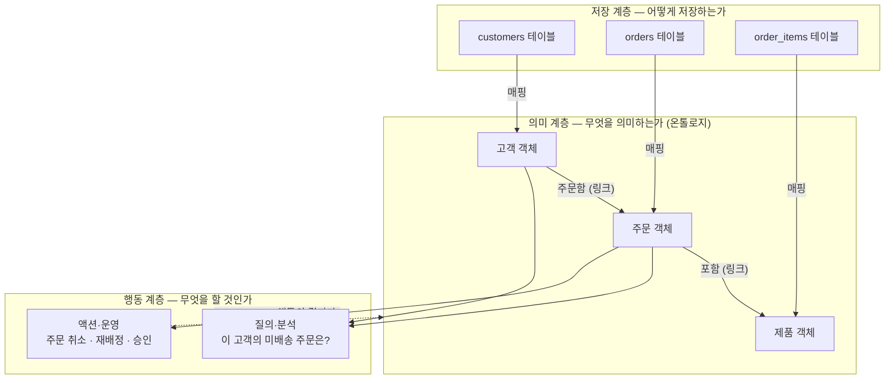

<figure class="post-figure post-figure--header">
<svg role="img" aria-label="같은 데이터를 바라보는 두 개의 시선을 대비한 그림. 왼쪽 '저장의 시선' 패널에는 customers, orders, order_items 세 관계형 테이블이 컬럼 목록과 외래키 화살표로 그려져 있고 아래에 '어떻게 저장하는가'라는 물음이 붙어 있다. 가운데의 위로 향한 화살표('의미 계층을 얹는다')를 건너면, 오른쪽 '의미의 시선' 패널에는 같은 데이터가 고객·주문·제품 객체 노드와 '주문함'·'포함' 링크로 이어진 그래프로 그려져 있으며, 도메인 전문가(사람)와 시스템(기어)이 같은 그래프를 함께 바라보고, 주문 객체 아래의 번개는 읽기를 넘어 액션(행동)까지 가능함을 암시한다. 아래 물음은 '무엇을 의미하는가'." viewBox="0 0 680 340" xmlns="http://www.w3.org/2000/svg">
  <title>같은 데이터, 두 개의 시선 — 저장의 시선 위에 의미의 시선을 얹는다</title>
  <defs>
    <marker id="ont-s1h-cc" viewBox="0 0 10 10" refX="8" refY="5" markerWidth="6" markerHeight="6" orient="auto-start-reverse">
      <path d="M0,0 L10,5 L0,10 z" fill="currentColor"/>
    </marker>
    <marker id="ont-s1h-sec" viewBox="0 0 10 10" refX="8" refY="5" markerWidth="6" markerHeight="6" orient="auto-start-reverse">
      <path d="M0,0 L10,5 L0,10 z" fill="var(--secondary-color)"/>
    </marker>
    <marker id="ont-s1h-gold" viewBox="0 0 10 10" refX="8" refY="5" markerWidth="7" markerHeight="7" orient="auto-start-reverse">
      <path d="M0,0 L10,5 L0,10 z" fill="var(--gold)"/>
    </marker>
  </defs>

  <text x="340" y="26" text-anchor="middle" font-size="16" font-weight="800" fill="currentColor" letter-spacing="0.5">같은 데이터, 두 개의 시선</text>

  <!-- ===== LEFT PANEL: 저장의 시선 ===== -->
  <rect x="22" y="44" width="283" height="250" rx="6" fill="var(--bg-light)" stroke="currentColor" stroke-width="2"/>
  <text x="163" y="68" text-anchor="middle" font-size="13" font-weight="800" fill="currentColor">저장의 시선</text>
  <text x="163" y="84" text-anchor="middle" font-size="9" fill="currentColor" opacity="0.7">테이블 · 컬럼 · 외래키</text>

  <!-- customers table -->
  <g>
    <rect x="42" y="98" width="108" height="16" fill="var(--bg-panel)" stroke="currentColor" stroke-width="1.6"/>
    <text x="96" y="110" text-anchor="middle" font-size="8.5" font-weight="700" fill="currentColor">customers</text>
    <rect x="42" y="114" width="108" height="42" fill="var(--bg-light)" stroke="currentColor" stroke-width="1.6"/>
    <line x1="42" y1="128" x2="150" y2="128" stroke="currentColor" stroke-width="0.8" opacity="0.3"/>
    <line x1="42" y1="142" x2="150" y2="142" stroke="currentColor" stroke-width="0.8" opacity="0.3"/>
    <text x="48" y="124" font-size="7.5" fill="currentColor">cust_id (PK)</text>
    <text x="48" y="138" font-size="7.5" fill="currentColor" opacity="0.8">seg_cd</text>
    <text x="48" y="152" font-size="7.5" fill="currentColor" opacity="0.8">reg_dt</text>
  </g>

  <!-- orders table -->
  <g>
    <rect x="178" y="128" width="108" height="16" fill="var(--bg-panel)" stroke="currentColor" stroke-width="1.6"/>
    <text x="232" y="140" text-anchor="middle" font-size="8.5" font-weight="700" fill="currentColor">orders</text>
    <rect x="178" y="144" width="108" height="56" fill="var(--bg-light)" stroke="currentColor" stroke-width="1.6"/>
    <line x1="178" y1="158" x2="286" y2="158" stroke="currentColor" stroke-width="0.8" opacity="0.3"/>
    <line x1="178" y1="172" x2="286" y2="172" stroke="currentColor" stroke-width="0.8" opacity="0.3"/>
    <line x1="178" y1="186" x2="286" y2="186" stroke="currentColor" stroke-width="0.8" opacity="0.3"/>
    <text x="184" y="154" font-size="7.5" fill="currentColor">order_id (PK)</text>
    <text x="184" y="168" font-size="7.5" fill="currentColor">cust_id (FK)</text>
    <text x="184" y="182" font-size="7.5" fill="currentColor" opacity="0.8">status</text>
    <text x="184" y="196" font-size="7.5" fill="currentColor" opacity="0.8">total_amt</text>
  </g>

  <!-- order_items table -->
  <g>
    <rect x="42" y="196" width="108" height="16" fill="var(--bg-panel)" stroke="currentColor" stroke-width="1.6"/>
    <text x="96" y="208" text-anchor="middle" font-size="8.5" font-weight="700" fill="currentColor">order_items</text>
    <rect x="42" y="212" width="108" height="42" fill="var(--bg-light)" stroke="currentColor" stroke-width="1.6"/>
    <line x1="42" y1="226" x2="150" y2="226" stroke="currentColor" stroke-width="0.8" opacity="0.3"/>
    <line x1="42" y1="240" x2="150" y2="240" stroke="currentColor" stroke-width="0.8" opacity="0.3"/>
    <text x="48" y="222" font-size="7.5" fill="currentColor">order_id (FK)</text>
    <text x="48" y="236" font-size="7.5" fill="currentColor" opacity="0.8">product_id</text>
    <text x="48" y="250" font-size="7.5" fill="currentColor" opacity="0.8">qty</text>
  </g>

  <!-- FK arrows -->
  <line x1="176" y1="165" x2="153" y2="126" stroke="currentColor" stroke-width="1.4" opacity="0.75" marker-end="url(#ont-s1h-cc)"/>
  <text x="158" y="146" text-anchor="middle" font-size="7" font-weight="700" fill="currentColor" opacity="0.7">FK</text>
  <line x1="152" y1="219" x2="175" y2="201" stroke="currentColor" stroke-width="1.4" opacity="0.75" marker-end="url(#ont-s1h-cc)"/>
  <text x="160" y="222" text-anchor="middle" font-size="7" font-weight="700" fill="currentColor" opacity="0.7">FK</text>
  <!-- legacy: product_id has no FK -->
  <line x1="152" y1="233" x2="170" y2="242" stroke="var(--accent-color)" stroke-width="1.2" stroke-dasharray="3 3" opacity="0.7"/>
  <text x="182" y="248" text-anchor="middle" font-size="7" font-weight="700" fill="var(--accent-color)" opacity="0.85">FK?</text>

  <text x="163" y="282" text-anchor="middle" font-size="11" font-weight="700" fill="currentColor" opacity="0.85">어떻게 저장하는가</text>

  <!-- ===== MIDDLE: 전환 ===== -->
  <text x="340" y="132" text-anchor="middle" font-size="9.5" font-weight="700" fill="var(--gold)">의미 계층을</text>
  <text x="340" y="145" text-anchor="middle" font-size="9.5" font-weight="700" fill="var(--gold)">얹는다</text>
  <path d="M312,212 Q340,196 366,162" fill="none" stroke="var(--gold)" stroke-width="2.5" marker-end="url(#ont-s1h-gold)"/>

  <!-- ===== RIGHT PANEL: 의미의 시선 ===== -->
  <rect x="375" y="44" width="283" height="250" rx="6" fill="var(--bg-light)" stroke="var(--secondary-color)" stroke-width="2.2"/>
  <text x="516" y="68" text-anchor="middle" font-size="13" font-weight="800" fill="var(--secondary-color)">의미의 시선</text>
  <text x="516" y="84" text-anchor="middle" font-size="9" fill="currentColor" opacity="0.7">객체 · 링크 · 액션</text>

  <!-- observers: domain expert (person) + system (gear) -->
  <g stroke="currentColor" stroke-width="1.8" fill="var(--bg-light)">
    <circle cx="445" cy="104" r="6"/>
    <path d="M434,122 q11,-10 22,0" fill="none"/>
  </g>
  <text x="445" y="133" text-anchor="middle" font-size="7" fill="currentColor" opacity="0.7">도메인 전문가</text>
  <g stroke="currentColor" stroke-width="1.8">
    <circle cx="590" cy="106" r="7" fill="var(--bg-light)"/>
    <line x1="590" y1="95" x2="590" y2="99"/><line x1="590" y1="113" x2="590" y2="117"/>
    <line x1="579" y1="106" x2="583" y2="106"/><line x1="597" y1="106" x2="601" y2="106"/>
    <line x1="582.5" y1="98.5" x2="585.5" y2="101.5"/><line x1="594.5" y1="110.5" x2="597.5" y2="113.5"/>
    <line x1="597.5" y1="98.5" x2="594.5" y2="101.5"/><line x1="585.5" y1="110.5" x2="582.5" y2="113.5"/>
    <circle cx="590" cy="106" r="2.5" fill="currentColor" stroke="none"/>
  </g>
  <text x="590" y="133" text-anchor="middle" font-size="7" fill="currentColor" opacity="0.7">시스템</text>
  <!-- both look at the same graph -->
  <line x1="450" y1="124" x2="492" y2="160" stroke="currentColor" stroke-width="1.1" stroke-dasharray="3 3" opacity="0.45"/>
  <line x1="586" y1="120" x2="546" y2="164" stroke="currentColor" stroke-width="1.1" stroke-dasharray="3 3" opacity="0.45"/>

  <!-- object graph: links first, nodes on top -->
  <line x1="452" y1="186" x2="492" y2="206" stroke="var(--secondary-color)" stroke-width="2" marker-end="url(#ont-s1h-sec)"/>
  <text x="458" y="205" text-anchor="middle" font-size="7.5" font-weight="700" fill="currentColor" opacity="0.8">주문함</text>
  <line x1="542" y1="206" x2="582" y2="186" stroke="var(--secondary-color)" stroke-width="2" marker-end="url(#ont-s1h-sec)"/>
  <text x="576" y="205" text-anchor="middle" font-size="7.5" font-weight="700" fill="currentColor" opacity="0.8">포함</text>
  <g>
    <rect x="400" y="160" width="60" height="28" rx="5" fill="var(--bg-panel)" stroke="currentColor" stroke-width="2"/>
    <text x="430" y="178" text-anchor="middle" font-size="10" font-weight="700" fill="currentColor">고객</text>
    <rect x="486" y="202" width="60" height="28" rx="5" fill="var(--bg-panel)" stroke="var(--secondary-color)" stroke-width="2.2"/>
    <text x="516" y="220" text-anchor="middle" font-size="10" font-weight="700" fill="currentColor">주문</text>
    <rect x="576" y="160" width="60" height="28" rx="5" fill="var(--bg-panel)" stroke="currentColor" stroke-width="2"/>
    <text x="606" y="178" text-anchor="middle" font-size="10" font-weight="700" fill="currentColor">제품</text>
  </g>

  <!-- action lightning into 주문 -->
  <polygon points="518,232 504,252 513,252 508,266 526,244 516,244" fill="var(--gold)" opacity="0.9"/>
  <text x="540" y="258" text-anchor="middle" font-size="7.5" font-weight="700" fill="var(--gold)">액션</text>

  <text x="516" y="282" text-anchor="middle" font-size="11" font-weight="700" fill="var(--secondary-color)">무엇을 의미하는가</text>
</svg>
<figcaption>같은 데이터, 두 개의 시선 — 왼쪽 저장의 시선(테이블·컬럼·FK)은 "어떻게 저장하는가"에 답하고, 그 위에 의미 계층을 얹으면 오른쪽 의미의 시선(객체·링크·액션)이 "무엇을 의미하는가"에 답한다. 도메인 전문가와 시스템이 같은 그래프를 함께 읽고, 주문 객체의 번개(액션)는 읽기를 넘어 행동까지 암시한다.</figcaption>
</figure>

## 들어가며

데이터 엔지니어링의 언어로 조직을 보면, 조직은 테이블의 집합입니다. `customers`, `orders`, `order_items` — 잘 정규화된 스키마, 무결성이 걸린 외래키, 밤마다 도는 파이프라인. 그런데 그 테이블들을 아무리 들여다봐도 답이 나오지 않는 질문이 있습니다. **"이 조직에게 '주문'이란 무엇인가?"** `orders` 테이블의 행 하나가 주문인가, 아니면 `order_items`까지 조인해야 주문인가? `status = 3`은 무슨 뜻인가? "취소된 주문"은 행이 지워진 것인가, 플래그가 선 것인가, 별도 테이블로 옮겨진 것인가?

이 질문들에 대한 답은 분명히 존재합니다. 다만 **데이터 안에 있지 않을 뿐**입니다. 답은 시니어 엔지니어의 머릿속에, 3년 전 위키 문서에, 500줄짜리 정산 SQL의 `WHERE` 절에 흩어져 있습니다. 테이블과 컬럼, 조인 키는 기계가 데이터를 *저장하고 찾는* 데 필요한 구조일 뿐, "이 행은 한 명의 **고객**이고, 그 고객이 **주문**을 냈으며, 주문에는 **제품**이 담긴다"는 **도메인의 의미**를 담는 그릇이 아니기 때문입니다.

**온톨로지(ontology)**는 바로 그 의미를 담는 그릇입니다 — 조직이 다루는 실세계의 **객체(object)**, 그들의 **속성(property)**, 그들을 잇는 **관계(link)**를 데이터 위에 명시적으로 얹은, 조직이 공유하는 **의미 계층(semantic layer)**. Palantir 같은 회사의 Forward Deployed Engineer(FDE)가 고객사 현장에서 가장 먼저 세우는 것이 이것이고, 흔히 "현실의 디지털 트윈(digital twin)"이라 부르는 것이 이것입니다.

이 글은 [Ontology Essential Curriculum](/2026/07/19/ontology-essential-curriculum.html)의 1단계이자 시리즈 첫 막 "의미를 이해하기(1~2단계)"의 출발점입니다. 온톨로지를 손으로 짓는 법(3~5단계)이나 그 위에 행동을 얹는 법(6단계)에 앞서, 먼저 **데이터 모델·스키마·온톨로지가 각각 무엇이고 무엇이 다른지**, **왜 스키마만으로는 부족해서 별도의 의미 계층이 필요한지**, 그리고 **온톨로지가 분석을 넘어 운영의 기반이 될 때 어떤 힘을 갖는지**를 세웁니다. 이 "왜"가 서야, 이후 단계의 객체·링크·액션 설계가 도구의 기능 목록이 아니라 필연으로 읽힙니다.

<div class="post-summary-box" markdown="1">

### 📌 이 글에서 다루는 내용

- **데이터 모델 vs 스키마 vs 온톨로지**: 개념·논리·물리 데이터 모델의 층위와 스키마의 자리, 그리고 그 위에 얹히는 의미 계층 — 세 층이 각각 답하는 질문("무엇을 표현하는가 / 어떻게 저장·강제하는가 / 무엇을 의미하는가")을 주문 도메인 예제와 비교 표로 가른다
- **왜 의미 계층인가**: 조인 로직·컬럼 코드·부족지식(tribal knowledge)에 흩어져 사라지는 도메인 의미, 팀마다 다른 "고객 수"의 정의 — 의미를 한 곳에 명시하고 조직이 공유하는 **어휘(shared vocabulary)**로 만드는 온톨로지, 그리고 DDD의 유비쿼터스 언어·BI 시맨틱 계층과의 연결
- **분석에서 운영으로**: 대시보드까지만 가는 read-only 데이터 모델의 한계, 온톨로지 객체에 **액션(action)**을 걸어 "세계를 읽는 모델"을 "세계를 바꾸는 **행동의 시스템(system of action)**"으로 만드는 발상 — Palantir Foundry Ontology를 대표 사례로 본 디지털 트윈과 write-back 루프

</div>

## 한눈에 보기 — 저장에서 의미로, 의미에서 행동으로

이 글의 스파인을 한 장으로 그리면 이렇습니다. 아래에는 데이터를 저장하는 물리 세계(스키마·테이블)가 있고, 그 위에 실세계의 명사와 관계를 명시한 의미 계층(온톨로지)이 얹히며, 그 의미 위에서 사람과 시스템이 결정하고 행동합니다 — 그리고 행동의 결과는 다시 모델로 되돌아옵니다.



핵심은 세 층이 **각각 다른 질문에 답한다**는 것입니다. 저장 계층을 아무리 잘 설계해도 의미 계층의 질문("주문이란 무엇인가")에는 답할 수 없고, 의미 계층이 read-only에 머물면 행동 계층("주문을 취소한다")은 온톨로지 밖의 다른 시스템에서 일어나 모델과 현실이 어긋납니다. 이 세 층의 구분과 연결이 이 글 전체의 좌표축입니다.

## 데이터 모델 vs 스키마 vs 온톨로지 — 각각이 답하는 질문

### 세 용어가 흐려지는 이유

실무에서 이 세 단어는 자주 섞여 쓰입니다. "데이터 모델 좀 보여줘"라는 요청에 ERD가 나오기도, DDL이 나오기도, dbt 문서가 나오기도 합니다. 섞이는 이유는 셋이 실제로 **연속된 층위**이기 때문입니다 — 같은 도메인을 점점 더 기계에 가깝게, 혹은 점점 더 사람에 가깝게 표현한 것들입니다. 그러니 경계를 가르는 가장 좋은 방법은 정의를 외우는 것이 아니라, **각 층이 어떤 질문에 답하는지**를 보는 것입니다.

**데이터 모델(data model)**은 넓은 말입니다. 전통적으로는 세 단계로 나눕니다 — 도메인의 개체와 관계를 그리는 **개념 모델(conceptual)**, 그것을 테이블·컬럼·키로 구체화한 **논리 모델(logical)**, 특정 DBMS의 타입·인덱스·파티션까지 내려간 **물리 모델(physical)**. 개념 모델은 사람의 언어에 가깝고, 물리 모델은 기계의 사정에 가깝습니다. 그리고 대부분의 조직에서 실제로 오래 살아남는 것은 물리에 가까운 쪽입니다 — 개념 ERD는 프로젝트 초기 문서로 박제되고, 살아 있는 진실은 DDL이 됩니다.

**스키마(schema)**는 그 논리·물리 모델이 **시스템에 선언되어 강제되는 형태**입니다. `CREATE TABLE`이 만든 구조, NOT NULL과 외래키 제약, Avro/Protobuf 스키마 레지스트리의 계약. 스키마의 질문은 명확합니다 — "데이터를 **어떻게 저장하고, 어떤 형태를 강제하는가**." 스키마는 훌륭한 발명입니다. 다만 스키마가 강제하는 것은 *형태*이지 *의미*가 아닙니다. `status INTEGER NOT NULL`은 status가 정수이고 비어 있지 않음을 보장하지만, 3이 "배송 중"이라는 것은 어디에도 없습니다.

**온톨로지(ontology)**는 그 위에 얹히는 층입니다. 어원 그대로 "존재(on)에 대한 논(logos)" — 철학에서는 "무엇이 존재하는가"를 다루는 분야이고, 컴퓨터 과학이 이를 빌려와 **"어떤 도메인에 무엇이 존재하고, 그들이 어떤 속성과 관계를 갖는지에 대한 명시적·공유된 명세(explicit, shared specification of a conceptualization)"**라는 뜻으로 씁니다. 온톨로지의 질문은 "이 데이터가 **무엇을 의미하는가** — 이 도메인에는 어떤 **객체**가 존재하고, 서로 어떤 **관계**로 이어지며, 각 객체에 어떤 **행동**이 가능한가"입니다. 개념 모델과 닮았지만 결정적 차이가 있습니다. 개념 모델은 설계 단계의 *문서*로 끝나지만, 온톨로지는 실제 데이터와 매핑되어 시스템이 *실행하는* **살아 있는 계층**입니다.

### 비교 표 — 세 층위 한눈에

| | 데이터 모델 (개념~물리) | 스키마 | 온톨로지 (의미 계층) |
| --- | --- | --- | --- |
| **답하는 질문** | 무엇을 어떻게 구조화해 표현하는가 | 어떻게 저장하고 어떤 형태를 강제하는가 | 이 데이터가 무엇을 의미하는가 |
| **기본 단위** | 엔티티·관계 → 테이블·컬럼 | 테이블·컬럼·타입·제약 | 객체 타입·속성·링크 타입·액션 |
| **관계의 표현** | ERD의 선 → 외래키 | 외래키 제약 (조인은 쿼리의 몫) | **링크 타입** — 이름 있는 일급 개념 |
| **주 사용자** | 설계자·DBA·엔지니어 | DBMS와 엔지니어 | 도메인 전문가 + 엔지니어 + 애플리케이션 |
| **의미의 위치** | 문서·주석·머릿속 | 없음 (형태만 강제) | 모델 자체에 명시 |
| **생애 주기** | 설계 시 작성, 이후 박제되기 쉬움 | 시스템과 함께 살지만 물리에 종속 | 데이터와 매핑된 채 도메인과 함께 진화 |
| **쓰기(행동)** | 해당 없음 | DML — 임의 UPDATE, 의미 보장 없음 | **액션** — 통제·검증된 도메인 연산 |
| **대표 산물** | ERD, 차원 모델(스타 스키마) | DDL, Avro/Protobuf 스키마 | 지식 그래프, Foundry Ontology, 시맨틱 계층 |

표에서 가장 눈여겨볼 행은 **관계의 표현**과 **의미의 위치**입니다. 스키마의 세계에서 관계는 외래키라는 *제약*으로만 존재하고, 그 관계를 실제로 걷는 일(조인)은 매번 쿼리 작성자의 몫입니다. 온톨로지는 관계 자체를 "고객이 주문을 **낸다**"라는 **이름 있는 일급 개념(link type)**으로 끌어올립니다 — 이것이 왜 강력한지는 4단계에서 정면으로 다루지만, 의미가 모델 안으로 들어온다는 방향 전환은 여기서 이미 시작됩니다.

### 주문 도메인으로 보는 세 층위

추상적인 층위 이야기를 구체적인 도메인 하나로 눌러 보겠습니다. 이커머스의 주문입니다.

```sql
-- 스키마의 세계: 형태는 완벽하게 강제되지만, 의미는 어디에도 없다
CREATE TABLE customers (
    cust_id     BIGINT PRIMARY KEY,
    seg_cd      VARCHAR(2),          -- 'P1'? 'G3'? 아는 사람만 안다
    reg_dt      TIMESTAMP NOT NULL
);

CREATE TABLE orders (
    order_id    BIGINT PRIMARY KEY,
    cust_id     BIGINT REFERENCES customers(cust_id),
    status      INTEGER NOT NULL,    -- 1=접수, 2=결제, 3=배송중, 4=완료, 9=취소
                                     -- ...라는 사실은 이 주석과 누군가의 머릿속에만 있다
    total_amt   NUMERIC(12,2)
);

CREATE TABLE order_items (
    order_id    BIGINT REFERENCES orders(order_id),
    product_id  BIGINT,              -- 어느 테이블을 참조하는지 FK조차 없다 (레거시)
    qty         INTEGER,
    PRIMARY KEY (order_id, product_id)
);
```

이 스키마는 나쁜 스키마가 아닙니다. 정규화되어 있고, 키가 걸려 있고, 흔한 현실적 타협(레거시 FK 누락, 코드 값 컬럼)을 포함한 평범하게 좋은 스키마입니다. 문제는 이 스키마가 자신의 질문 — 어떻게 저장하는가 — 에는 완벽히 답하면서, 다음 질문들에는 침묵한다는 것입니다.

- "**활성 주문**이란 무엇인가?" → `status IN (1,2,3)`이라는 지식은 스키마 밖에 있다
- "주문은 **누구의** 것인가?" → `cust_id`라는 컬럼명이 힌트일 뿐, "고객이 주문을 낸다"는 관계는 이름조차 없다
- "주문에 어떤 **행동**이 가능한가?" → 취소는 `UPDATE orders SET status = 9`인가? 환불 처리는? 재고 복원은? 스키마는 임의의 UPDATE를 막지 않는다

같은 도메인을 온톨로지의 언어로 선언하면 이렇게 됩니다. (특정 제품의 문법이 아니라 개념을 보여주는 의사 표기입니다.)

```yaml
# 온톨로지의 세계: 존재하는 것, 잇는 것, 가능한 것을 명시한다
object_types:
  고객 (Customer):
    primary_key: customer_id
    properties:
      - 이름: string
      - 등급: enum [일반, 골드, VIP]        # 'P1'/'G3' 코드가 의미 있는 값으로
      - 가입일: timestamp
    backing: analytics.dim_customers        # 5단계: 데이터 매핑

  주문 (Order):
    primary_key: order_id
    properties:
      - 상태: enum [접수, 결제완료, 배송중, 완료, 취소]   # 1..9 매직 넘버가 어휘로
      - 총액: decimal
    backing: analytics.fct_orders

  제품 (Product):
    primary_key: product_id
    backing: analytics.dim_products

link_types:
  주문함:   고객 (1) -> 주문 (N)             # "고객이 주문을 낸다" — 관계에 이름이 있다
  포함:     주문 (N) -> 제품 (M)             # 4단계: 링크·카디널리티

actions:
  주문_취소:                                 # 6단계: 임의 UPDATE가 아닌 통제된 연산
    target: 주문
    precondition: 상태 in [접수, 결제완료]    # 배송 중인 주문은 이 액션으로 못 지운다
    effect: 상태 -> 취소, 재고 복원, 원천 시스템에 write-back
```

두 선언은 **같은 데이터**를 가리킵니다. 달라진 것은 데이터가 아니라 **의미가 사는 곳**입니다. 스키마의 세계에서 주석과 머릿속에 있던 지식 — 상태 코드의 뜻, 관계의 이름, 가능한 행동과 그 전제 조건 — 이 전부 **모델 안으로** 들어왔습니다. 사람이 읽으면 도메인 설명서이고, 시스템이 읽으면 실행 가능한 계약입니다. 이 "이중 가독성"이 온톨로지의 본질입니다.

한 가지를 분명히 해 둡니다. **온톨로지는 스키마의 대체물이 아닙니다.** 저장은 여전히 스키마가 하고, 파이프라인은 여전히 테이블을 만듭니다. 온톨로지는 그 *위에* 얹혀, 잘 만든 스키마조차 담을 수 없는 것 — 의미 — 을 담는 별도의 층입니다. 층을 겹치는 것이지 갈아치우는 것이 아닙니다.

## 왜 의미 계층인가 — 조인과 컬럼만으로 잃어버리는 것

### 의미는 어디에 살고 있었나

"의미가 스키마에 없다"는 말은, 의미가 없다는 뜻이 아닙니다. 의미는 반드시 어딘가에 삽니다. 문제는 그 주소입니다.

- **쿼리 속에**: "유효 고객"의 정의가 `WHERE deleted_at IS NULL AND seg_cd != 'X9'`라는 형태로 수십 개의 SQL에 복붙되어 산다. 정의가 바뀌면 몇 개를 고쳐야 하는지 아무도 모른다.
- **코드 속에**: 주문 취소의 규칙("배송 중이면 불가")이 백엔드 서비스 어딘가의 `if` 문에 산다. 데이터 팀은 그 규칙을 모른 채 `status` 분포를 분석한다.
- **문서 속에**: 3년 전 위키의 ERD와 용어집. 현재 스키마와 이미 어긋나 있지만, 어긋났다는 사실조차 아무도 모른다.
- **사람 속에**: "그건 김 선임이 알아요." 조직에서 가장 흔하고 가장 취약한 저장소 — **부족지식(tribal knowledge)**. 그가 퇴사하면 의미도 퇴사한다.

이 상태의 비용은 온갖 얼굴로 청구됩니다. 마케팅과 재무가 보고하는 "월간 고객 수"가 다르다 — 서로 다른 쿼리에 서로 다른 정의가 박혀 있기 때문입니다. 새 엔지니어의 온보딩이 몇 달씩 걸린다 — 스키마는 하루면 읽지만, 스키마에 없는 의미를 사람들에게서 채굴하는 데 몇 달이 걸리기 때문입니다. 그리고 LLM에게 "지난 분기 VIP 고객의 취소율을 알려줘"라고 물을 수 없다 — 모델이 접근할 수 있는 것은 `seg_cd`와 `status 9`뿐, VIP도 취소도 어디에도 정의되어 있지 않기 때문입니다. **데이터에 의미가 없는 것이 아니라, 의미가 기계가 닿을 수 없는 곳에 흩어져 있는 것**입니다.

### 공유 어휘 — 의미를 한 곳에, 이름으로

의미 계층의 처방은 발상 자체는 단순합니다. **흩어진 의미를 한 곳에 모아, 이름을 붙이고, 그 이름을 조직 전체가 공유하는 것.** 온톨로지가 "고객", "활성 주문", "주문함"이라는 어휘를 한 번 정의하면, 그 어휘는 분석가의 질의에서도, 애플리케이션의 화면에서도, 도메인 전문가의 회의에서도, LLM의 프롬프트에서도 **같은 것**을 가리킵니다. 어휘가 공유되는 순간 대화의 층위가 바뀝니다.

```text
의미 계층이 없을 때 — 부서마다 자기 방언으로 말한다

  분석가:      "fct_orders에서 status in (1,2,3)이고 deleted_at이 null인 행 기준으로…"
  도메인 전문가: "그게 '진행 중인 주문' 얘기예요? 반품 접수된 건 빠진 거고요?"
  엔지니어:     "반품은 다른 테이블이에요. rma_requests를 left join해야…"
  (30분 뒤, 세 사람은 서로 다른 숫자를 들고 회의를 끝낸다)

의미 계층이 있을 때 — 모두가 온톨로지의 어휘로 말한다

  전원:        "'활성 주문' 중 '반품 요청' 링크가 걸린 것을 제외한 수"
  (정의는 온톨로지에 한 번 존재하고, 숫자는 하나다)
```

이 발상이 온톨로지의 전유물이 아니라는 점이 오히려 이 발상의 힘을 증언합니다. 도메인 주도 설계(DDD)의 **유비쿼터스 언어(ubiquitous language)**는 "코드와 대화가 같은 어휘를 쓰게 하라"는 같은 처방을 소프트웨어 설계에 내린 것이고([OO-Design Essential Curriculum](/2026/06/19/oo-design-essential-curriculum.html)에서 다룬 뿌리입니다), BI 세계의 **시맨틱 계층**(dbt semantic layer, Looker의 LookML 등)은 "메트릭의 정의를 쿼리가 아니라 모델에 두라"는 같은 처방을 분석에 내린 것입니다. 온톨로지는 이 계보의 가장 일반화된 형태입니다 — 메트릭만이 아니라 **객체·관계·행동 전부**에 어휘를 부여하고, 분석만이 아니라 **운영까지** 그 어휘 위에 세웁니다.

<figure class="post-figure">
<svg role="img" aria-label="의미가 어디에 사는지를 대비한 그림. 왼쪽 '의미 계층이 없을 때'에는 가운데 테이블 하나에서 점선이 사방으로 뻗어 SQL 쿼리, 백엔드 코드, 낡은 위키, 사람 머릿속 네 곳으로 의미 조각이 물음표와 함께 흩어져 있다 — 흩어진 의미, 부족지식. 오른쪽 '의미 계층이 있을 때'에는 같은 테이블이 매핑으로 온톨로지 패널(고객·주문·제품 객체와 링크) 하나에 연결되고, 분석가·도메인 전문가·애플리케이션·LLM 넷이 모두 그 하나의 계층을 실선으로 바라본다 — 공유 어휘, 하나의 정의." viewBox="0 0 680 300" xmlns="http://www.w3.org/2000/svg">
  <title>의미는 어디에 사는가 — 흩어진 부족지식 vs 하나의 공유 어휘</title>
  <defs>
    <marker id="ont-s1s-sec" viewBox="0 0 10 10" refX="8" refY="5" markerWidth="6" markerHeight="6" orient="auto-start-reverse">
      <path d="M0,0 L10,5 L0,10 z" fill="var(--secondary-color)"/>
    </marker>
  </defs>

  <line x1="340" y1="34" x2="340" y2="272" stroke="currentColor" stroke-width="1.2" opacity="0.2"/>

  <!-- ===== LEFT: 의미 계층이 없을 때 ===== -->
  <text x="170" y="32" text-anchor="middle" font-size="11.5" font-weight="800" fill="currentColor">의미 계층이 없을 때</text>

  <!-- central table -->
  <g>
    <rect x="138" y="138" width="64" height="44" rx="3" fill="var(--bg-light)" stroke="currentColor" stroke-width="2"/>
    <line x1="138" y1="151" x2="202" y2="151" stroke="currentColor" stroke-width="1.4" opacity="0.7"/>
    <line x1="160" y1="151" x2="160" y2="182" stroke="currentColor" stroke-width="0.9" opacity="0.4"/>
    <line x1="182" y1="151" x2="182" y2="182" stroke="currentColor" stroke-width="0.9" opacity="0.4"/>
    <line x1="138" y1="166" x2="202" y2="166" stroke="currentColor" stroke-width="0.9" opacity="0.4"/>
  </g>

  <!-- scattered meaning: dashed lines + ? -->
  <g stroke="currentColor" stroke-width="1.3" stroke-dasharray="4 3" opacity="0.5">
    <line x1="146" y1="140" x2="82" y2="80"/>
    <line x1="194" y1="140" x2="260" y2="80"/>
    <line x1="146" y1="180" x2="82" y2="212"/>
    <line x1="194" y1="180" x2="260" y2="212"/>
  </g>
  <g font-size="10" font-weight="800" fill="var(--accent-color)" text-anchor="middle">
    <text x="112" y="108">?</text>
    <text x="229" y="108">?</text>
    <text x="112" y="203">?</text>
    <text x="229" y="203">?</text>
  </g>

  <!-- SQL doc (top-left) -->
  <g>
    <rect x="46" y="48" width="32" height="30" rx="2" fill="var(--bg-panel)" stroke="currentColor" stroke-width="1.6"/>
    <g stroke="currentColor" stroke-width="1" opacity="0.55">
      <line x1="51" y1="56" x2="73" y2="56"/><line x1="51" y1="62" x2="69" y2="62"/><line x1="51" y1="68" x2="72" y2="68"/>
    </g>
    <text x="62" y="92" text-anchor="middle" font-size="7.5" font-weight="700" fill="currentColor" opacity="0.78">SQL 쿼리 속</text>
    <text x="62" y="103" text-anchor="middle" font-size="7" fill="var(--accent-color)">"활성 주문"의 정의</text>
  </g>

  <!-- code file (top-right) -->
  <g>
    <rect x="248" y="48" width="32" height="30" rx="2" fill="var(--bg-panel)" stroke="currentColor" stroke-width="1.6"/>
    <text x="264" y="68" text-anchor="middle" font-size="9.5" font-weight="700" fill="currentColor" opacity="0.75">&lt;/&gt;</text>
    <text x="264" y="92" text-anchor="middle" font-size="7.5" font-weight="700" fill="currentColor" opacity="0.78">백엔드 코드 속</text>
    <text x="264" y="103" text-anchor="middle" font-size="7" fill="var(--accent-color)">취소 규칙 if 문</text>
  </g>

  <!-- old wiki (bottom-left) -->
  <g>
    <path d="M46,206 h24 l8,8 v22 h-32 z" fill="var(--bg-panel)" stroke="currentColor" stroke-width="1.6"/>
    <path d="M70,206 v8 h8" fill="none" stroke="currentColor" stroke-width="1.2" opacity="0.7"/>
    <g stroke="currentColor" stroke-width="1" opacity="0.35">
      <line x1="51" y1="220" x2="72" y2="220"/><line x1="51" y1="226" x2="68" y2="226"/>
    </g>
    <text x="62" y="250" text-anchor="middle" font-size="7.5" font-weight="700" fill="currentColor" opacity="0.78">낡은 위키 속</text>
    <text x="62" y="261" text-anchor="middle" font-size="7" fill="var(--accent-color)">3년 전 ERD·용어집</text>
  </g>

  <!-- person head (bottom-right) -->
  <g stroke="currentColor" stroke-width="1.8" fill="var(--bg-light)">
    <circle cx="264" cy="215" r="7"/>
    <path d="M251,236 q13,-12 26,0" fill="none"/>
  </g>
  <text x="264" y="250" text-anchor="middle" font-size="7.5" font-weight="700" fill="currentColor" opacity="0.78">사람 머릿속</text>
  <text x="264" y="261" text-anchor="middle" font-size="7" fill="var(--accent-color)">"김 선임이 알아요"</text>

  <text x="170" y="286" text-anchor="middle" font-size="10.5" font-weight="800" fill="var(--accent-color)">흩어진 의미 · 부족지식</text>

  <!-- ===== RIGHT: 의미 계층이 있을 때 ===== -->
  <text x="505" y="32" text-anchor="middle" font-size="11.5" font-weight="800" fill="currentColor">의미 계층이 있을 때</text>

  <!-- consumers row -->
  <g>
    <!-- analyst: bar chart -->
    <g fill="var(--secondary-color)" opacity="0.85">
      <rect x="381" y="68" width="5" height="10"/><rect x="388" y="62" width="5" height="16"/><rect x="395" y="56" width="5" height="22"/>
    </g>
    <line x1="378" y1="78" x2="403" y2="78" stroke="currentColor" stroke-width="1.4" opacity="0.7"/>
    <text x="390" y="92" text-anchor="middle" font-size="7.5" font-weight="700" fill="currentColor" opacity="0.78">분석가</text>

    <!-- domain expert: person -->
    <g stroke="currentColor" stroke-width="1.8" fill="var(--bg-light)">
      <circle cx="466" cy="62" r="6"/>
      <path d="M455,78 q11,-10 22,0" fill="none"/>
    </g>
    <text x="466" y="92" text-anchor="middle" font-size="7.5" font-weight="700" fill="currentColor" opacity="0.78">도메인 전문가</text>

    <!-- application: window -->
    <g>
      <rect x="530" y="56" width="28" height="22" rx="2" fill="var(--bg-panel)" stroke="currentColor" stroke-width="1.6"/>
      <line x1="530" y1="63" x2="558" y2="63" stroke="currentColor" stroke-width="1.2" opacity="0.7"/>
      <circle cx="535" cy="59.5" r="1.2" fill="currentColor" opacity="0.7"/>
    </g>
    <text x="544" y="92" text-anchor="middle" font-size="7.5" font-weight="700" fill="currentColor" opacity="0.78">애플리케이션</text>

    <!-- LLM: chip -->
    <g>
      <rect x="608" y="56" width="24" height="20" rx="4" fill="var(--bg-panel)" stroke="currentColor" stroke-width="1.6"/>
      <text x="620" y="70" text-anchor="middle" font-size="8" font-weight="800" fill="currentColor">AI</text>
      <g stroke="currentColor" stroke-width="1.2" opacity="0.6">
        <line x1="614" y1="52" x2="614" y2="56"/><line x1="626" y1="52" x2="626" y2="56"/>
        <line x1="614" y1="76" x2="614" y2="80"/><line x1="626" y1="76" x2="626" y2="80"/>
      </g>
    </g>
    <text x="620" y="92" text-anchor="middle" font-size="7.5" font-weight="700" fill="currentColor" opacity="0.78">LLM</text>
  </g>

  <!-- all point at ONE layer (solid lines) -->
  <g stroke="var(--secondary-color)" stroke-width="1.5" opacity="0.65">
    <line x1="392" y1="98" x2="458" y2="126"/>
    <line x1="466" y1="98" x2="490" y2="126"/>
    <line x1="544" y1="98" x2="522" y2="126"/>
    <line x1="618" y1="98" x2="552" y2="126"/>
  </g>

  <!-- ontology layer panel -->
  <rect x="415" y="126" width="180" height="68" rx="6" fill="var(--bg-panel)" stroke="var(--secondary-color)" stroke-width="2.2"/>
  <text x="505" y="142" text-anchor="middle" font-size="8.5" font-weight="800" fill="var(--secondary-color)">온톨로지 — 하나의 정의</text>
  <line x1="465" y1="167" x2="483" y2="172" stroke="var(--secondary-color)" stroke-width="1.5" marker-end="url(#ont-s1s-sec)"/>
  <text x="474" y="162" text-anchor="middle" font-size="6" fill="currentColor" opacity="0.7">주문함</text>
  <line x1="527" y1="172" x2="545" y2="167" stroke="var(--secondary-color)" stroke-width="1.5" marker-end="url(#ont-s1s-sec)"/>
  <text x="536" y="162" text-anchor="middle" font-size="6" fill="currentColor" opacity="0.7">포함</text>
  <g>
    <rect x="425" y="156" width="40" height="18" rx="4" fill="var(--bg-light)" stroke="currentColor" stroke-width="1.5"/>
    <text x="445" y="168.5" text-anchor="middle" font-size="7.5" font-weight="700" fill="currentColor">고객</text>
    <rect x="485" y="166" width="40" height="18" rx="4" fill="var(--bg-light)" stroke="var(--secondary-color)" stroke-width="1.7"/>
    <text x="505" y="178.5" text-anchor="middle" font-size="7.5" font-weight="700" fill="currentColor">주문</text>
    <rect x="545" y="156" width="40" height="18" rx="4" fill="var(--bg-light)" stroke="currentColor" stroke-width="1.5"/>
    <text x="565" y="168.5" text-anchor="middle" font-size="7.5" font-weight="700" fill="currentColor">제품</text>
  </g>

  <!-- mapping from the same table -->
  <line x1="505" y1="222" x2="505" y2="198" stroke="var(--secondary-color)" stroke-width="2" marker-end="url(#ont-s1s-sec)"/>
  <text x="522" y="213" text-anchor="middle" font-size="7.5" font-weight="700" fill="var(--secondary-color)">매핑</text>
  <g>
    <rect x="473" y="224" width="64" height="42" rx="3" fill="var(--bg-light)" stroke="currentColor" stroke-width="2"/>
    <line x1="473" y1="237" x2="537" y2="237" stroke="currentColor" stroke-width="1.4" opacity="0.7"/>
    <line x1="495" y1="237" x2="495" y2="266" stroke="currentColor" stroke-width="0.9" opacity="0.4"/>
    <line x1="517" y1="237" x2="517" y2="266" stroke="currentColor" stroke-width="0.9" opacity="0.4"/>
    <line x1="473" y1="251" x2="537" y2="251" stroke="currentColor" stroke-width="0.9" opacity="0.4"/>
  </g>

  <text x="505" y="286" text-anchor="middle" font-size="10.5" font-weight="800" fill="var(--secondary-color)">공유 어휘 · 하나의 정의</text>
</svg>
<figcaption>의미는 어디에 사는가 — 의미 계층이 없으면 정의가 SQL·코드·낡은 위키·사람 머릿속에 물음표와 함께 흩어지고(부족지식), 온톨로지가 있으면 분석가·도메인 전문가·애플리케이션·LLM이 모두 하나의 정의를 바라본다.</figcaption>
</figure>

### 조인은 의미를 실어 나르지 못한다

의미 계층 없는 세계의 일상을 쿼리 하나로 체감해 보겠습니다. 질문은 평범합니다 — "이 고객이 주문했지만 아직 배송되지 않은 제품은?"

```sql
-- 질문: 고객 42가 주문했지만 아직 배송되지 않은 제품
SELECT DISTINCT p.product_name
FROM customers c
JOIN orders o        ON o.cust_id = c.cust_id        -- 이 조인이 "주문함"이라는 뜻임을
JOIN order_items oi  ON oi.order_id = o.order_id     -- 쿼리 작성자가 알고 있어야 하고
JOIN products p      ON p.product_id = oi.product_id -- FK가 없는 조인 키도 알아야 하며
WHERE c.cust_id = 42
  AND o.status IN (1, 2)          -- "아직 배송되지 않은"의 번역임을 알아야 하고
  AND o.deleted_at IS NULL;       -- 이 관례를 빼먹으면 조용히 틀린 답이 나온다
```

이 쿼리는 실행되고, 답을 내고, 아마 맞을 것입니다. 그러나 주목할 점은 이 쿼리를 쓰기 위해 작성자가 알아야 했던 것들입니다 — 네 테이블의 조인 경로, FK 없는 조인 키, 상태 코드의 의미, soft delete 관례. 이 중 **어느 것도 데이터베이스가 알려주지 않습니다.** 전부 사람에게서 사람으로 전수되는 지식이고, 하나라도 빠지면 쿼리는 에러 없이 **조용히 틀립니다**. 조인은 관계를 *실행*할 수는 있어도 관계의 *의미*를 실어 나르지는 못합니다.

온톨로지 위에서 같은 질문은 어휘 그대로 표현됩니다. 개념적으로는 이렇습니다.

```text
고객(42) → [주문함] → 주문(상태: 접수 | 결제완료) → [포함] → 제품
```

조인 경로·조인 키·상태 코드·soft delete는 전부 온톨로지 정의와 데이터 매핑(5단계) 속으로 들어갔고, 질문하는 사람은 **도메인의 어휘로 그래프를 걷기만** 하면 됩니다. 질의가 짧아지는 것이 요점이 아닙니다 — **틀릴 수 있는 지점이 모델 안의 한 곳으로 모였다**는 것이 요점입니다. 정의가 바뀌면 온톨로지에서 한 번 고치고, 그 어휘를 쓰는 모두가 자동으로 새 정의를 씁니다.

## 분석에서 운영으로 — read-only 모델과 행동의 시스템

### 잘 만든 데이터 모델도 대시보드에서 멈춘다

지금까지의 이야기 — 의미를 모델에 명시하고 공유 어휘로 만든다 — 만으로도 온톨로지는 충분히 유용합니다. 그런데 이 지점에서 멈추면, 온톨로지는 결국 **더 좋은 분석 모델**에 그칩니다. 그리고 분석 모델에는 구조적인 한계가 하나 있습니다. **read-only**라는 것입니다.

전형적인 분석 아키텍처를 떠올려 보십시오. 운영 시스템(ERP·CRM·주문 시스템)에서 데이터를 추출해, 파이프라인으로 정제하고([Data Engineering Essential Curriculum](/2026/06/25/data-engineering-essential-curriculum.html)이 다루는 세계입니다), 웨어하우스에 차원 모델로 적재하고, 대시보드에 뿌립니다. 이 흐름은 한 방향입니다. 현실 → 데이터 → 통찰. 그런데 통찰 다음 칸이 비어 있습니다.

```text
운영 시스템 ──ETL──> 웨어하우스 ──모델링──> 대시보드 ──?──> 행동
                                                        │
                                    여기서 사람이 시스템 밖으로 나간다:
                                    대시보드에서 이상을 발견하고 →
                                    화면을 캡처해 슬랙에 올리고 →
                                    ERP에 별도 로그인해 수동 조치하고 →
                                    그 조치는 다음 ETL까지 데이터에 반영되지 않는다
```

공급망 대시보드가 "설비 7호기 지연 위험"을 아무리 정확히 보여줘도, 재배정이라는 *행동*은 대시보드 밖 — 다른 시스템, 다른 화면, 다른 어휘 — 에서 일어납니다. 분석 세계와 운영 세계가 갈라져 있는 한, 데이터 모델은 세계를 **비추는 거울**일 수는 있어도 세계를 **바꾸는 손**은 되지 못합니다. 그리고 거울과 현실 사이의 시차(다음 배치까지의 지연) 동안, 모델은 이미 낡은 세계를 비추고 있습니다.

### 디지털 트윈 — 비추는 모델에서 살아 있는 모델로

온톨로지가 "현실의 **디지털 트윈**"이라 불리는 이유가 여기서 나옵니다. 디지털 트윈은 원래 제조업의 개념입니다 — 물리적 설비의 디지털 복제본을 만들되, 센서로 **실시간 동기화**하고, 시뮬레이션으로 **개입을 실험**하며, 그 결과로 **실물을 제어**하는 것. 핵심은 복제의 정밀함이 아니라 **양방향성**입니다. 실물이 변하면 트윈이 변하고, 트윈에 가한 조작이 실물로 돌아갑니다.

온톨로지는 이 발상을 조직 전체로 일반화합니다. 고객·주문·제품·설비라는 객체 그래프는 조직이 다루는 실세계의 트윈이고, 파이프라인·스트림이 그 트윈을 현실과 동기화하며 — 결정적으로 — 트윈 위에서 내린 결정이 **액션(action)**을 통해 현실로 되돌아갑니다. 이 마지막 화살표가 있느냐 없느냐가, 잘 만든 분석 모델과 온톨로지를 가르는 선입니다.

### 액션 — 통제된 쓰기가 의미 계층을 완성한다

"모델에 쓰기를 허용한다"는 말은 위험하게 들릴 수 있습니다. 웨어하우스 테이블에 임의 UPDATE를 열어주자는 뜻이라면 실제로 위험합니다. 온톨로지의 액션은 정반대의 발상입니다 — 쓰기를 여는 것이 아니라, **도메인의 어휘로 좁히는 것**입니다.

앞의 주문 도메인에서 `주문_취소` 액션을 다시 보십시오. 이 액션은 (1) **대상**이 주문 객체로 한정되고, (2) **전제 조건**(상태가 접수·결제완료일 것)이 모델에 선언되어 있으며, (3) **효과**(상태 변경, 재고 복원, 원천 시스템으로의 write-back)가 명시되어 있습니다. `UPDATE orders SET status = 9`는 무엇이든 할 수 있어서 아무 의미도 보장하지 않지만, `주문_취소`는 **할 수 있는 일이 좁기 때문에 의미가 보장됩니다**. 스키마가 형태의 무결성을 강제했듯, 액션은 **행동의 무결성**을 강제합니다 — 의미 계층이 읽기뿐 아니라 쓰기까지 관장하게 되는 것입니다.

이것이 만드는 차이를 표로 정리하면 이렇습니다.

| | 분석 데이터 모델 (read-only) | 온톨로지 (system of action) |
| --- | --- | --- |
| **지향** | 세계를 정확히 비춘다 (system of record 위의 분석) | 세계를 비추고 **바꾼다** |
| **데이터 흐름** | 단방향: 원천 → 모델 → 대시보드 | 양방향: 원천 ↔ 모델 ↔ 사용자 (write-back) |
| **쓰기** | 없음 — 조치는 모델 밖 시스템에서 | **액션** — 전제 조건·효과가 선언된 도메인 연산 |
| **의미의 범위** | 명사(객체·메트릭)까지 | 명사 + **동사**(가능한 행동)까지 |
| **행동과 데이터의 시차** | 다음 배치까지 어긋남 | 액션의 결과가 즉시 모델에 반영 |
| **전형적 소비자** | 분석가·대시보드 | 현업 운영자·애플리케이션·자동화·AI 에이전트 |

마지막 행은 갈수록 중요해지는 지점입니다. **AI 에이전트에게 조직의 업무를 맡기려면**, 에이전트가 이해할 수 있는 어휘(객체·링크)와 에이전트에게 허용할 행동의 울타리(액션·전제 조건)가 필요합니다. 온톨로지는 정확히 그 두 가지를 제공합니다 — 의미 계층은 사람을 위한 공유 어휘였지만, 같은 이유로 **기계를 위한 행동 규격**이 됩니다.

### Palantir Foundry Ontology — 대표 구현이 보여주는 것

이 구도를 가장 밀도 있게 구현한 대표 사례가 **Palantir Foundry의 Ontology**입니다. Foundry에서 온톨로지는 정확히 이 글의 세 층 구도로 서 있습니다 — 파이프라인이 만든 데이터셋이 **백킹 데이터셋(backing dataset)**으로 객체·링크에 매핑되고(의미 계층, 이 매핑이 5단계 주제), 그 위에 **Action Type**이 전제 조건·효과와 함께 선언되며(행동 계층, 6단계 주제), 현업 사용자와 애플리케이션은 테이블이 아니라 객체·링크·액션의 어휘로 일합니다. Palantir가 이 구조를 **"kinetic layer"** — 데이터를 아는 층이 아니라 데이터로 *움직이는* 층 — 라 부르는 것은 이 글의 언어로 "분석에서 운영으로"의 정확한 요약입니다. 항공사가 결항 하나에 기체·승무원·승객·정비 일정 객체를 함께 재배정하고, 제조사가 결품 경보에서 대체 공급사 발주 액션까지 한 화면에서 가는 사례들이 이 구조 위에 서 있습니다.

동시에 분명히 해 둘 것은, **Foundry는 사례이지 정의가 아니라는 점**입니다. 이 글이 세운 구도 — 저장 위의 의미, 의미 위의 행동 — 는 특정 제품의 기능 목록이 아니라 하나의 **모델링 패러다임**이고, 그 뿌리는 훨씬 깊습니다. "명시적·공유된 개념화의 명세"라는 정의는 1990년대 지식 표현 연구에서 왔고, 시맨틱 웹의 RDF/OWL은 그것을 웹 규모의 형식 언어로 다듬었으며(바로 다음 2단계의 주제입니다), 지식 그래프·속성 그래프·DDD·시맨틱 계층이 각자의 자리에서 같은 발상을 구현해 왔습니다. 도구는 바뀌어도 — Foundry든, 오픈소스 지식 그래프든, 직접 설계한 의미 계층이든 — **실세계를 객체와 관계로 명시하고, 그 위에 의미와 행동을 얹는다**는 뼈대는 같습니다. 이 시리즈가 배우는 것은 그 뼈대입니다.

## 정리

세 층위의 구분에서 행동의 시스템까지, 이 글의 요점을 정리하면 다음과 같습니다.

- **세 층은 각각 다른 질문에 답한다**: 데이터 모델은 "무엇을 어떻게 구조화하는가", 스키마는 "어떻게 저장하고 형태를 강제하는가", 온톨로지는 "이 데이터가 무엇을 의미하는가". 온톨로지는 스키마의 대체물이 아니라 스키마 *위에* 얹히는 별도의 층이며, 개념 모델과 달리 실제 데이터와 매핑되어 시스템이 실행하는 살아 있는 계층이다.
- **스키마는 형태를 강제할 뿐 의미를 담지 못한다**: `status INTEGER NOT NULL`은 3이 "배송 중"임을 모른다. 의미는 사라지는 것이 아니라 쿼리·코드·낡은 문서·사람 머릿속으로 흩어지고(부족지식), 그 흩어짐의 비용은 부서마다 다른 숫자, 몇 달 걸리는 온보딩, 조용히 틀리는 쿼리로 청구된다.
- **온톨로지는 의미를 한 곳에 모은 공유 어휘다**: 객체·속성·링크·액션에 도메인의 이름을 붙여, 분석가·도메인 전문가·애플리케이션·AI가 같은 어휘로 말하게 한다. DDD의 유비쿼터스 언어, BI의 시맨틱 계층과 같은 계보의 가장 일반화된 형태 — 명사만이 아니라 동사까지, 분석만이 아니라 운영까지.
- **관계와 행동이 모델 안으로 들어온다**: 조인은 관계를 실행할 뿐 의미를 실어 나르지 못한다. 온톨로지는 관계를 이름 있는 링크로(4단계), 쓰기를 전제 조건·효과가 선언된 액션으로(6단계) 끌어올려, 틀릴 수 있는 지점을 모델 안의 한 곳으로 모은다.
- **read-only를 넘어야 디지털 트윈이다**: 분석 모델은 세계를 비추는 거울에서 멈추지만, 온톨로지는 액션과 write-back으로 세계를 바꾸는 손까지 겸한다 — 이것이 "행동의 시스템(system of action)"이며, Palantir Foundry Ontology가 대표 구현이지만 발상 자체는 도구 중립적인 모델링 패러다임이다.

"왜 의미 계층인가"는 세워졌습니다. 다음 질문은 자연스럽게 이것입니다 — **그 의미 계층을 어떤 형식으로 표현할 것인가?** 온톨로지라는 발상이 갑자기 등장한 것이 아니라 지식 그래프와 시맨틱 웹의 오랜 계보 위에 있다는 것, RDF의 트리플과 OWL의 클래스·추론, 그리고 실무 그래프 DB의 속성 그래프 모델이 다음 단계의 주제입니다.

### 다음 학습 (Next Learning)

- [형식 기반과 그래프: 지식 그래프·RDF/OWL·속성 그래프](/2026/07/19/ontology-knowledge-graphs-rdf-owl-property-graphs.html) — 2단계: 이 글의 의미 계층을 떠받치는 형식적 뿌리와 어휘
- [Ontology Essential Curriculum](/2026/07/19/ontology-essential-curriculum.html) — 시리즈 로드맵으로 돌아가 진행 상황 확인하기
- [OO-Design Essential Curriculum](/2026/06/19/oo-design-essential-curriculum.html) — 객체·관계로 도메인을 모델링하는 사고의 뿌리, 유비쿼터스 언어
- [Data Engineering Essential Curriculum](/2026/06/25/data-engineering-essential-curriculum.html) — 온톨로지의 백킹 데이터셋을 만들어 내는 파이프라인의 세계
