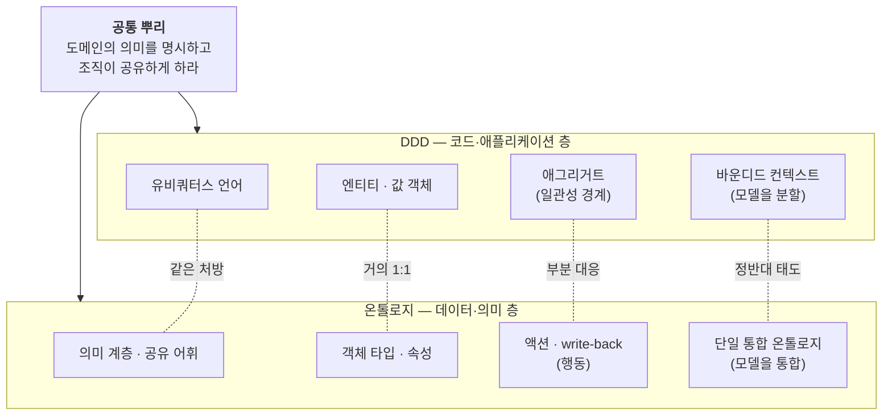
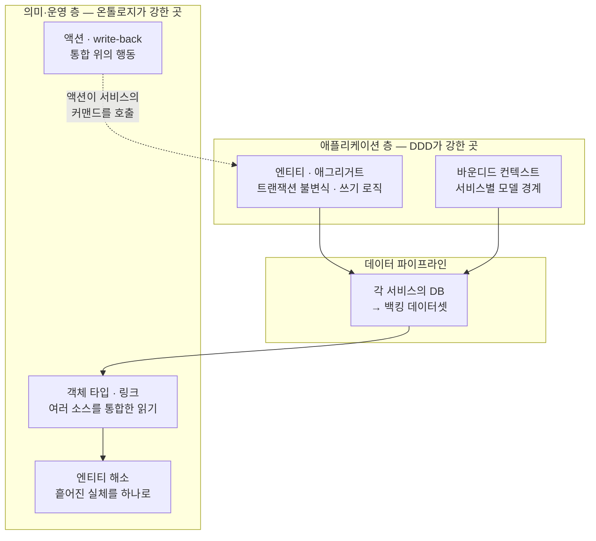

<figure class="post-figure post-figure--header">
<svg role="img" aria-label="온톨로지와 DDD를 한 장으로 요약한 그림. 화면 아래 가운데에 금색 테두리의 공통 뿌리 상자 '도메인의 의미를 명시하고 조직이 공유하게 하라'가 있고, 거기서 두 줄기가 위로 갈라진다. 왼쪽 줄기는 DDD(코드·애플리케이션 층)로 아래에서 위로 유비쿼터스 언어·엔티티와 값 객체·애그리거트(일관성 경계)·바운디드 컨텍스트(모델을 분할) 네 장의 카드가 쌓여 있고 '쓰기·트랜잭션·도메인 로직'이라 적혀 있다. 오른쪽 줄기는 온톨로지(데이터·의미 층)로 의미 계층과 공유 어휘·객체 타입과 속성·액션과 write-back·단일 통합 온톨로지(모델을 통합) 네 장이 쌓여 있고 '통합·읽기·행동'이라 적혀 있다. 두 줄기의 같은 높이 카드는 점선으로 이어져 대응 정도를 표시한다 — 뿌리에 가까운 아래는 '같은 처방'과 '거의 1:1'로 잘 겹치고, 위로 갈수록 '부분 대응'과 '정반대 태도'로 어긋난다." viewBox="0 0 680 360" xmlns="http://www.w3.org/2000/svg">
  <title>온톨로지 vs DDD — 하나의 공통 뿌리에서 갈라져 올라가는 두 줄기, 위로 갈수록 어긋나고 아래로 갈수록 겹친다</title>
  <defs>
    <marker id="vd-h-up" viewBox="0 0 10 10" refX="5" refY="2" markerWidth="6" markerHeight="6" orient="auto-start-reverse">
      <path d="M0,10 L5,0 L10,10 z" fill="var(--secondary-color)"/>
    </marker>
  </defs>

  <!-- ===== title ===== -->
  <text x="340" y="26" text-anchor="middle" font-size="17" font-weight="800" fill="currentColor" letter-spacing="1.5">ONTOLOGY vs DDD</text>
  <text x="340" y="47" text-anchor="middle" font-size="10.5" font-weight="700" fill="currentColor" opacity="0.72">같은 뿌리에서 갈라진 두 줄기 — 위로 갈수록 어긋나고, 아래로 갈수록 겹친다</text>

  <!-- ===== column headers ===== -->
  <text x="126" y="66" text-anchor="middle" font-size="10.5" font-weight="800" fill="var(--secondary-color)">DDD · 코드·애플리케이션 층</text>
  <text x="554" y="66" text-anchor="middle" font-size="10.5" font-weight="800" fill="var(--secondary-color)">온톨로지 · 데이터·의미 층</text>

  <!-- ===== stems + trunk (behind cards) ===== -->
  <g stroke="var(--secondary-color)" fill="none" opacity="0.45" stroke-width="2.4">
    <line x1="126" y1="248" x2="126" y2="82"/>
    <line x1="554" y1="248" x2="554" y2="82"/>
  </g>
  <g stroke="var(--secondary-color)" fill="none" stroke-width="2.6">
    <line x1="322" y1="304" x2="130" y2="250" marker-end="url(#vd-h-up)"/>
    <line x1="358" y1="304" x2="550" y2="250" marker-end="url(#vd-h-up)"/>
  </g>

  <!-- ===== cross-correspondence dashed links (behind cards edges) ===== -->
  <g stroke-dasharray="5 4" stroke-width="1.6">
    <line x1="212" y1="227" x2="468" y2="227" stroke="var(--secondary-color)"/>
    <line x1="212" y1="183" x2="468" y2="183" stroke="var(--secondary-color)"/>
    <line x1="212" y1="139" x2="468" y2="139" stroke="var(--accent-color)"/>
    <line x1="212" y1="95" x2="468" y2="95" stroke="var(--accent-color)"/>
  </g>

  <!-- ===== left column: DDD cards (bottom = closest to root) ===== -->
  <!-- r1 바운디드 컨텍스트 -->
  <rect x="40" y="76" width="172" height="38" rx="4" fill="var(--bg-panel)" stroke="currentColor" stroke-width="1.6"/>
  <text x="126" y="92" text-anchor="middle" font-size="9.5" font-weight="700" fill="currentColor">바운디드 컨텍스트</text>
  <text x="126" y="105" text-anchor="middle" font-size="7" fill="currentColor" opacity="0.68">모델을 분할</text>
  <!-- r2 애그리거트 -->
  <rect x="40" y="120" width="172" height="38" rx="4" fill="var(--bg-panel)" stroke="currentColor" stroke-width="1.6"/>
  <text x="126" y="136" text-anchor="middle" font-size="9.5" font-weight="700" fill="currentColor">애그리거트</text>
  <text x="126" y="149" text-anchor="middle" font-size="7" fill="currentColor" opacity="0.68">일관성 경계</text>
  <!-- r3 엔티티 · 값 객체 -->
  <rect x="40" y="164" width="172" height="38" rx="4" fill="var(--bg-panel)" stroke="currentColor" stroke-width="1.6"/>
  <text x="126" y="187" text-anchor="middle" font-size="9.5" font-weight="700" fill="currentColor">엔티티 · 값 객체</text>
  <!-- r4 유비쿼터스 언어 -->
  <rect x="40" y="208" width="172" height="38" rx="4" fill="var(--bg-panel)" stroke="var(--secondary-color)" stroke-width="2.2"/>
  <text x="126" y="231" text-anchor="middle" font-size="9.5" font-weight="700" fill="currentColor">유비쿼터스 언어</text>

  <!-- ===== right column: 온톨로지 cards ===== -->
  <!-- r1 단일 통합 온톨로지 -->
  <rect x="468" y="76" width="172" height="38" rx="4" fill="var(--bg-panel)" stroke="currentColor" stroke-width="1.6"/>
  <text x="554" y="92" text-anchor="middle" font-size="9.5" font-weight="700" fill="currentColor">단일 통합 온톨로지</text>
  <text x="554" y="105" text-anchor="middle" font-size="7" fill="currentColor" opacity="0.68">모델을 통합</text>
  <!-- r2 액션 · write-back -->
  <rect x="468" y="120" width="172" height="38" rx="4" fill="var(--bg-panel)" stroke="currentColor" stroke-width="1.6"/>
  <text x="554" y="136" text-anchor="middle" font-size="9.5" font-weight="700" fill="currentColor">액션 · write-back</text>
  <text x="554" y="149" text-anchor="middle" font-size="7" fill="currentColor" opacity="0.68">행동</text>
  <!-- r3 객체 타입 · 속성 -->
  <rect x="468" y="164" width="172" height="38" rx="4" fill="var(--bg-panel)" stroke="currentColor" stroke-width="1.6"/>
  <text x="554" y="187" text-anchor="middle" font-size="9.5" font-weight="700" fill="currentColor">객체 타입 · 속성</text>
  <!-- r4 의미 계층 -->
  <rect x="468" y="208" width="172" height="38" rx="4" fill="var(--bg-panel)" stroke="var(--secondary-color)" stroke-width="2.2"/>
  <text x="554" y="226" text-anchor="middle" font-size="9.5" font-weight="700" fill="currentColor">의미 계층</text>
  <text x="554" y="239" text-anchor="middle" font-size="7" fill="currentColor" opacity="0.68">공유 어휘</text>

  <!-- ===== correspondence chips (on top of dashed links) ===== -->
  <g text-anchor="middle" font-size="8" font-weight="700">
    <rect x="300" y="87" width="80" height="16" rx="8" fill="var(--bg-panel)" stroke="var(--accent-color)" stroke-width="1.2"/>
    <text x="340" y="98" fill="var(--accent-color)">✕ 정반대 태도</text>
    <rect x="300" y="131" width="80" height="16" rx="8" fill="var(--bg-panel)" stroke="var(--accent-color)" stroke-width="1.2"/>
    <text x="340" y="142" fill="var(--accent-color)">△ 부분 대응</text>
    <rect x="304" y="175" width="72" height="16" rx="8" fill="var(--bg-panel)" stroke="var(--secondary-color)" stroke-width="1.2"/>
    <text x="340" y="186" fill="var(--secondary-color)">◎ 거의 1:1</text>
    <rect x="304" y="219" width="72" height="16" rx="8" fill="var(--bg-panel)" stroke="var(--secondary-color)" stroke-width="1.2"/>
    <text x="340" y="230" fill="var(--secondary-color)">◎ 같은 처방</text>
  </g>

  <!-- ===== layer descriptors near root ===== -->
  <text x="126" y="272" text-anchor="middle" font-size="8.5" font-weight="700" fill="currentColor" opacity="0.78">쓰기 · 트랜잭션 · 도메인 로직</text>
  <text x="554" y="272" text-anchor="middle" font-size="8.5" font-weight="700" fill="currentColor" opacity="0.78">통합 · 읽기 · 행동</text>

  <!-- ===== common root ===== -->
  <rect x="250" y="302" width="180" height="46" rx="7" fill="var(--bg-panel)" stroke="var(--gold)" stroke-width="2.5"/>
  <text x="340" y="320" text-anchor="middle" font-size="10" font-weight="800" fill="var(--gold)">공통 뿌리</text>
  <text x="340" y="335" text-anchor="middle" font-size="7.8" fill="currentColor" opacity="0.85">도메인의 의미를 명시하고 조직이 공유하게 하라</text>
</svg>
<figcaption>이 글의 좌표축 — 하나의 <strong>공통 뿌리</strong>(유비쿼터스 언어 = 의미 계층)에서 <strong>DDD 줄기</strong>(코드·애플리케이션 층)와 <strong>온톨로지 줄기</strong>(데이터·의미 층)가 갈라져 올라간다. 뿌리에 가까운 아래는 <strong>거의 1:1</strong>로 겹치고, 경계·일관성을 다루는 위로 갈수록 <strong>정반대 태도</strong>로 어긋난다.</figcaption>
</figure>

## 들어가며

이 글은 `Ontology-Essential` 시리즈의 **심화·비교편**입니다. 전체 학습 지도는 [Ontology Essential Curriculum](/2026/07/19/ontology-essential-curriculum.html)에서 확인할 수 있습니다.

시리즈를 따라오며 온톨로지를 배우다 보면, 소프트웨어 설계를 공부한 사람이라면 누구나 한 번쯤 이런 생각이 듭니다. **"이거 도메인 주도 설계(DDD)랑 거의 같은 이야기 아닌가?"** 실제로 그렇습니다. 온톨로지의 **객체 타입**은 DDD의 **엔티티**와 판박이고, 온톨로지가 말하는 **의미 계층**은 DDD의 **유비쿼터스 언어**와 정확히 같은 처방입니다. 이 시리즈의 여러 글이 그때그때 "이건 DDD의 무엇과 같다"고 짚어 왔지만, 정작 둘을 **정면으로 나란히 놓고** 어디가 같고 어디가 어긋나는지를 정리한 적은 없었습니다. 이 글이 그 자리입니다.

결론을 먼저 말하면 이렇습니다. **온톨로지와 DDD는 같은 뿌리에서 자란 두 줄기다.** 뿌리는 하나 — *"도메인의 의미를 명시적으로 붙잡고, 그것을 조직이 공유하게 하라."* 하지만 두 줄기가 **사는 층이 다릅니다.** DDD는 **애플리케이션 코드 안**에서, 쓰기와 트랜잭션과 도메인 로직을 다루기 위해 도메인을 모델링합니다. 온톨로지는 **데이터 위**에서, 여러 소스를 통합해 읽고 그 위에서 행동하기 위해 도메인을 모델링합니다. 그래서 상당 부분이 겹치면서도, 겹치지 않는 곳에서 각자의 정체성이 드러납니다.

이 글은 온톨로지를 이미 배운 독자가 자신이 아는 DDD(혹은 그 반대)와 좌표를 맞추도록 돕습니다. DDD를 모른다면 [Domain-Driven Design: 도메인 중심 사고](/2026/06/19/domain-driven-design.html)를 먼저 읽고 오면 좋지만, 핵심 개념은 이 글에서 그때그때 짧게 복기합니다.

### 📌 이 글에서 다루는 내용

#### 🔍 핵심 주제

- **공통 뿌리**: 유비쿼터스 언어 ↔ 의미 계층 — 왜 둘이 같은 처방인가
- **개념 대응표**: 엔티티↔객체 타입, 값 객체↔속성, 연관↔링크, 도메인 서비스↔액션
- **결정적 차이 셋**: ① 사는 층(코드 vs 데이터) ② 경계에 대한 태도(분할 vs 통합) ③ 엔티티 해소라는 온톨로지 고유의 층
- **함께 쓰기**: DDD와 온톨로지가 한 시스템에서 어떻게 층을 나눠 협력하는가

## 한눈에 보기 — 같은 뿌리에서 갈라진 두 줄기

이 그림이 글 전체의 좌표축입니다. 위쪽 뿌리는 하나. 아래로 갈라진 두 상자가 DDD와 온톨로지이고, 점선은 개념 사이의 대응 관계 — **위로 갈수록 잘 겹치고(같은 처방·거의 1:1), 아래로 갈수록 어긋납니다(부분 대응·정반대 태도)**. 이 글은 위에서 아래로, 잘 겹치는 것부터 크게 어긋나는 것 순서로 훑습니다.

## 공통 뿌리: 유비쿼터스 언어와 의미 계층은 같은 처방이다

두 방법론이 각자 가장 먼저 내세우는 처방을 나란히 놓아 보면, 문장이 거의 똑같습니다.

- **DDD 유비쿼터스 언어**: "도메인 전문가와 개발자가 **회의·문서·코드에서 똑같은 단어를 똑같은 의미로** 쓰자." 대화에서는 "대출"이라 하면서 코드에서는 `UserBookMapping`이라 부르는 순간, 번역 비용과 오해가 쌓인다.
- **온톨로지 의미 계층**: "메트릭·객체·관계의 정의를 **쿼리마다 복붙하지 말고 모델에 한 번** 두고, 분석가·도메인 전문가·애플리케이션·AI가 같은 어휘로 말하게 하자." SQL 쿼리와 백엔드 코드와 낡은 위키에 흩어진 도메인 의미를, 한곳에 명시한다.

둘 다 병을 진단하는 방식이 같습니다 — **의미는 사라지지 않고, 흩어져 살 뿐이다.** DDD는 그 흩어진 의미가 코드와 대화 사이에서 새는 것을 막고, 온톨로지는 그 의미가 쿼리와 파이프라인과 사람 머릿속(부족지식, tribal knowledge)에 흩어지는 것을 막습니다. 처방도 같습니다 — **의미를 한 곳에, 명시적으로, 조직이 공유하는 어휘로.**

이것이 우연이 아닌 이유가 있습니다. 온톨로지라는 말 자체가 "명시적·공유된 개념화의 명세(a specification of a shared conceptualization)"라는 정의에서 왔고, DDD의 유비쿼터스 언어도 정확히 "공유된 개념화를 명시적으로 붙잡는" 작업입니다. 표현하는 매체(코드냐 데이터냐)만 다를 뿐, **철학이 같습니다.** 그래서 이 시리즈가 반복해서 "온톨로지는 DDD·BI 시맨틱 계층과 같은 계보의 가장 일반화된 형태"라고 말해 온 것입니다.

## 개념 대응표: 무엇이 무엇과 같은가

뿌리가 같으니 빌딩 블록도 상당수 대응합니다. 온톨로지의 어휘를 이미 배운 독자가 DDD 쪽 좌표를 맞출 수 있도록, 개념을 한 줄씩 짝지어 봅니다.

| DDD (코드·애플리케이션) | 온톨로지 (데이터·의미) | 대응 정도 |
| --- | --- | --- |
| 유비쿼터스 언어 | 의미 계층 · 공유 어휘 | ◎ 같은 처방 |
| 도메인 모델 | 온톨로지(객체 + 링크 그래프) | ◎ 같은 목표, 다른 매체 |
| 엔티티(Entity) | 객체 타입(Object Type) | ◎ 거의 1:1 — 식별자로 추적 |
| 값 객체(Value Object) | 속성(Property) | ○ "객체로 승격하지 않는 것" |
| 엔티티 식별자(Identity) | 기본키(Primary Key) | ◎ 동일 개념 |
| 연관(Association) | 링크 타입(Link Type) | ○ 온톨로지가 관계를 더 일급으로 |
| 도메인 서비스 · 도메인 이벤트 | 액션 · write-back | △ 행동을 모델에 얹는 대응 |
| 애그리거트 · 애그리거트 루트 | *(직접 대응 없음)* | ✕ 온톨로지에 트랜잭션 일관성 경계가 약함 |
| 바운디드 컨텍스트 | *(단일 통합 온톨로지 지향)* | ✕ 태도가 정반대 |
| 컨텍스트 맵 | 네임스페이스 · 온톨로지 연합 | △ 부분 대응 |
| Repository · Factory | 백킹 데이터셋 · 데이터 매핑 | △ 다른 층의 관심사 |

윗줄(◎)은 이름만 바꾸면 그대로 통하는 것들이고, 아랫줄(✕)은 한쪽에만 있거나 태도가 갈리는 것들입니다. 잘 겹치는 것부터 짚겠습니다.

### 엔티티 ↔ 객체 타입, 값 객체 ↔ 속성 — 거의 1:1

DDD는 도메인의 "객체"를 두 종류로 가릅니다. **엔티티**는 고유한 식별자를 갖고 속성이 바뀌어도 같은 것으로 취급됩니다(회원은 이름이 바뀌어도 같은 회원). **값 객체**는 식별자가 없고 값이 같으면 같은 것으로 취급됩니다(5,000원, 배송 주소). 이 구분이 온톨로지의 **"무엇을 객체 타입으로 승격하고 무엇을 속성으로 남길 것인가"** 판단과 **정확히 같은 판단**입니다.

이 시리즈의 [객체 타입과 속성](/2026/07/19/ontology-object-types-properties.html) 글이 제시한 "승격 관문 셋"(독립 생명주기가 있는가 · 다른 곳에서 참조되는가 · 링크의 대상이 되는가)을 DDD 언어로 번역하면, **"이것은 엔티티인가 값 객체인가"**를 묻는 것과 같습니다. 배송 주소가 값 객체의 고전적 예인 것까지 똑같습니다 — 온톨로지에서도 배송 주소는 대개 객체로 승격하지 않고 주문의 속성으로 둡니다. 식별자 개념도 겹칩니다. DDD 엔티티의 **identity**가 곧 온톨로지 객체의 **기본키**이고, 둘 다 "동등성은 속성이 아니라 식별자로 판단한다"는 원칙을 공유합니다.

### 연관 ↔ 링크 타입 — 온톨로지가 한 발 더 나간다

DDD에서 객체 사이의 **연관(association)**은 보통 다른 객체에 대한 참조(필드)로 표현됩니다. 온톨로지의 [링크 타입](/2026/07/19/ontology-link-types-relationships.html)은 여기서 한 발 더 나갑니다 — 관계 자체를 **이름 붙은 일급 개념**으로 끌어올려 "고객이 주문을 낸다(주문함)"를 모델에 명시적으로 새깁니다. DDD도 좋은 모델이라면 연관에 의미 있는 이름을 주라고 권하지만, 온톨로지는 이를 **강제**합니다. 그래프를 링크를 따라 탐색(traversal)하는 것이 온톨로지의 기본 사용법이기 때문입니다. 차이는 정도의 문제 — 같은 방향, 온톨로지가 조금 더 급진적입니다.

### 도메인 서비스·이벤트 ↔ 액션·write-back — 행동을 모델에 얹기

DDD에서 "어느 한 엔티티에도 속하지 않는 연산"은 **도메인 서비스**로, "도메인에서 일어난 의미 있는 사건"은 **도메인 이벤트**로 표현합니다. 온톨로지의 [액션·write-back](/2026/07/19/ontology-actions-writeback.html)이 이와 대응합니다 — 액션은 전제조건과 효과가 선언된 통제된 객체 변경이고("주문을 취소한다"), write-back은 그 행동의 결과가 모델과 원천으로 되돌아 쓰이는 고리입니다. 둘 다 **"모델은 명사(데이터)만이 아니라 동사(행동)까지 담아야 한다"**는 같은 통찰을 구현합니다. 다만 대응은 느슨합니다(△) — 다음 절에서 볼 일관성 문제 때문입니다.

## 결정적 차이 ①: 사는 층이 다르다 — 코드 vs 데이터

여기서부터가 두 줄기가 갈라지는 지점입니다. 가장 근본적인 차이는 **모델이 어디에 사는가**입니다.

- **DDD의 모델은 애플리케이션 코드 안에 산다.** 엔티티는 런타임 객체이고, 애그리거트는 트랜잭션 단위이며, Repository는 그 객체를 저장소에서 꺼내 옵니다. DDD가 다루는 전형적 상황은 **하나의 애플리케이션이 자기 데이터의 주인**인 경우 — 쓰기(command)가 중심이고, 도메인 로직을 코드로 정확히 표현하는 것이 목표입니다.
- **온톨로지의 모델은 데이터 위에 산다.** 객체 타입은 [백킹 데이터셋](/2026/07/19/ontology-data-mapping-entity-resolution.html)이 채우고, 링크는 여러 테이블의 관계를 통합하며, 온톨로지 자신은 데이터를 새로 저장하지 않고 **파이프라인 산출물에 의미를 입힐 뿐**입니다. 온톨로지가 다루는 전형적 상황은 **여러 시스템에 흩어진 데이터를 하나의 의미 계층으로 통합**하는 경우 — 읽기(analytical)가 먼저이고, 그 위에 운영(operational)을 얹습니다.

이 차이가 나머지 모든 차이를 낳습니다. DDD는 "하나의 앱, 하나의 트랜잭션, 깨끗한 소유권"을 전제하기에 **일관성**을 지키는 장치(애그리거트)가 핵심이 되고, 온톨로지는 "여러 소스, 지저분한 현실, 소유권 없음"을 전제하기에 **통합**하는 장치(매핑·엔티티 해소)가 핵심이 됩니다.

## 결정적 차이 ②: 경계에 대한 태도가 정반대다 — 분할 vs 통합

이것이 이 글에서 가장 중요한 대목입니다. DDD의 가장 값진 통찰과 온톨로지의 기본 지향이 **정면으로 부딪히는** 것처럼 보이기 때문입니다.

DDD의 **바운디드 컨텍스트**는 이렇게 말합니다 — *"조직 전체를 아우르는 하나의 통합 모델은 불가능하다(그리고 바람직하지도 않다). 같은 단어 '책'이 대출 컨텍스트에서는 물리적 장서(BookCopy), 카탈로그에서는 서지 정보(Title), 구매에서는 주문 상품(OrderItem)을 뜻한다. 이 모두를 하나의 거대한 `Book` 클래스에 욱여넣지 말고, **모델을 경계로 쪼개라.**"* DDD의 핵심 지혜는 **분할**입니다.

반면 온톨로지는 흔히 **"조직 전체의 단일 통합 의미 계층 — 현실의 디지털 트윈"**을 지향합니다. 흩어진 데이터를 **하나의** 객체 그래프로 통합하는 것이 목표입니다. 표면적으로 이 둘은 반대 방향을 가리킵니다.

<figure class="post-figure">
<svg role="img" aria-label="경계에 대한 태도를 대비한 개념도. 왼쪽 패널 'DDD — 분할'에서는 하나의 단어 '책'이 세 개의 점선 경계 상자(대출 컨텍스트·카탈로그·구매)로 갈라져 각각 BookCopy(물리 장서)·Title(서지 정보)·OrderItem(주문 상품)이라는 다른 모델을 가리킨다. 오른쪽 패널 '온톨로지 — 통합'에서는 CRM 테이블·주문 DB·제품 마스터 세 소스 테이블이 화살표로 모여 고객·주문·제품이 링크로 이어진 하나의 통합 객체 그래프를 이룬다. 아래 금색 띠에는 화해 문구 — 그러나 규모가 커지면 온톨로지도 네임스페이스·도메인 모듈·연합으로 경계를 재발견하며, 두 방향이 만나는 곳은 같다 — 가 적혀 있다." viewBox="0 0 680 342" xmlns="http://www.w3.org/2000/svg">
  <title>경계에 대한 태도 — DDD는 분할, 온톨로지는 통합, 그러나 규모의 압력 속에서 다시 만난다</title>
  <defs>
    <marker id="vd-c-split" viewBox="0 0 10 10" refX="8" refY="5" markerWidth="6" markerHeight="6" orient="auto-start-reverse">
      <path d="M0,0 L10,5 L0,10 z" fill="var(--accent-color)"/>
    </marker>
    <marker id="vd-c-merge" viewBox="0 0 10 10" refX="8" refY="5" markerWidth="6" markerHeight="6" orient="auto-start-reverse">
      <path d="M0,0 L10,5 L0,10 z" fill="var(--secondary-color)"/>
    </marker>
  </defs>

  <!-- ===== left panel: DDD — 분할 ===== -->
  <rect x="16" y="44" width="312" height="238" rx="6" fill="var(--bg-light)" stroke="var(--secondary-color)" stroke-width="1.6"/>
  <text x="172" y="64" text-anchor="middle" font-size="12.5" font-weight="800" fill="var(--secondary-color)">DDD — 분할</text>
  <text x="172" y="79" text-anchor="middle" font-size="8.5" fill="currentColor" opacity="0.72">경계마다 다른 모델</text>

  <!-- 책 word -->
  <rect x="139" y="88" width="66" height="26" rx="4" fill="var(--bg-panel)" stroke="currentColor" stroke-width="2"/>
  <text x="172" y="105" text-anchor="middle" font-size="12" font-weight="800" fill="currentColor">"책"</text>

  <!-- split arrows -->
  <g stroke="var(--accent-color)" stroke-width="1.8" stroke-dasharray="4 3">
    <line x1="164" y1="114" x2="76" y2="140" marker-end="url(#vd-c-split)"/>
    <line x1="172" y1="114" x2="172" y2="140" marker-end="url(#vd-c-split)"/>
    <line x1="180" y1="114" x2="268" y2="140" marker-end="url(#vd-c-split)"/>
  </g>

  <!-- three bounded contexts -->
  <!-- 대출 -->
  <rect x="28" y="144" width="90" height="76" rx="4" fill="none" stroke="var(--accent-color)" stroke-width="1.5" stroke-dasharray="5 3"/>
  <text x="73" y="159" text-anchor="middle" font-size="8" font-weight="700" fill="var(--accent-color)">대출 컨텍스트</text>
  <rect x="36" y="166" width="74" height="46" rx="3" fill="var(--bg-panel)" stroke="currentColor" stroke-width="1.4"/>
  <text x="73" y="185" text-anchor="middle" font-size="9" font-weight="700" fill="currentColor">BookCopy</text>
  <text x="73" y="200" text-anchor="middle" font-size="7" fill="currentColor" opacity="0.7">물리 장서</text>
  <!-- 카탈로그 -->
  <rect x="128" y="144" width="90" height="76" rx="4" fill="none" stroke="var(--accent-color)" stroke-width="1.5" stroke-dasharray="5 3"/>
  <text x="173" y="159" text-anchor="middle" font-size="8" font-weight="700" fill="var(--accent-color)">카탈로그</text>
  <rect x="136" y="166" width="74" height="46" rx="3" fill="var(--bg-panel)" stroke="currentColor" stroke-width="1.4"/>
  <text x="173" y="185" text-anchor="middle" font-size="9" font-weight="700" fill="currentColor">Title</text>
  <text x="173" y="200" text-anchor="middle" font-size="7" fill="currentColor" opacity="0.7">서지 정보</text>
  <!-- 구매 -->
  <rect x="228" y="144" width="90" height="76" rx="4" fill="none" stroke="var(--accent-color)" stroke-width="1.5" stroke-dasharray="5 3"/>
  <text x="273" y="159" text-anchor="middle" font-size="8" font-weight="700" fill="var(--accent-color)">구매</text>
  <rect x="236" y="166" width="74" height="46" rx="3" fill="var(--bg-panel)" stroke="currentColor" stroke-width="1.4"/>
  <text x="273" y="185" text-anchor="middle" font-size="9" font-weight="700" fill="currentColor">OrderItem</text>
  <text x="273" y="200" text-anchor="middle" font-size="7" fill="currentColor" opacity="0.7">주문 상품</text>

  <text x="172" y="240" text-anchor="middle" font-size="8.5" font-weight="700" fill="currentColor" opacity="0.82">같은 단어 '책'이 경계마다 다른 객체로</text>
  <text x="172" y="256" text-anchor="middle" font-size="7.5" fill="currentColor" opacity="0.66">하나의 거대한 Book으로 욱여넣지 않는다</text>

  <!-- ===== divider ===== -->
  <line x1="340" y1="92" x2="340" y2="250" stroke="currentColor" stroke-width="1.2" stroke-dasharray="3 5" opacity="0.4"/>
  <circle cx="340" cy="163" r="13" fill="var(--bg-panel)" stroke="var(--gold)" stroke-width="1.6"/>
  <text x="340" y="167" text-anchor="middle" font-size="9" font-weight="800" fill="var(--gold)">vs</text>

  <!-- ===== right panel: 온톨로지 — 통합 ===== -->
  <rect x="352" y="44" width="312" height="238" rx="6" fill="var(--bg-light)" stroke="var(--secondary-color)" stroke-width="1.6"/>
  <text x="508" y="64" text-anchor="middle" font-size="12.5" font-weight="800" fill="var(--secondary-color)">온톨로지 — 통합</text>
  <text x="508" y="79" text-anchor="middle" font-size="8.5" fill="currentColor" opacity="0.72">하나의 의미 계층으로 통합</text>

  <!-- three source tables -->
  <g font-size="7.5" font-weight="700" text-anchor="middle">
    <rect x="362" y="100" width="86" height="34" rx="3" fill="var(--bg-panel)" stroke="currentColor" stroke-width="1.4"/>
    <line x1="362" y1="112" x2="448" y2="112" stroke="currentColor" stroke-width="1" opacity="0.35"/>
    <text x="405" y="127" fill="currentColor">CRM 테이블</text>
    <rect x="362" y="146" width="86" height="34" rx="3" fill="var(--bg-panel)" stroke="currentColor" stroke-width="1.4"/>
    <line x1="362" y1="158" x2="448" y2="158" stroke="currentColor" stroke-width="1" opacity="0.35"/>
    <text x="405" y="173" fill="currentColor">주문 DB</text>
    <rect x="362" y="192" width="86" height="34" rx="3" fill="var(--bg-panel)" stroke="currentColor" stroke-width="1.4"/>
    <line x1="362" y1="204" x2="448" y2="204" stroke="currentColor" stroke-width="1" opacity="0.35"/>
    <text x="405" y="219" fill="currentColor">제품 마스터</text>
  </g>
  <text x="405" y="240" text-anchor="middle" font-size="7.5" fill="currentColor" opacity="0.66">여러 소스</text>

  <!-- merge arrows -->
  <g stroke="var(--secondary-color)" stroke-width="1.8" fill="none">
    <path d="M448 117 C 478 122, 486 150, 508 158" marker-end="url(#vd-c-merge)"/>
    <line x1="448" y1="163" x2="508" y2="163" marker-end="url(#vd-c-merge)"/>
    <path d="M448 209 C 478 204, 486 176, 508 168" marker-end="url(#vd-c-merge)"/>
  </g>

  <!-- unified object graph -->
  <rect x="512" y="96" width="146" height="140" rx="6" fill="var(--bg-panel)" stroke="var(--gold)" stroke-width="2.2"/>
  <text x="585" y="114" text-anchor="middle" font-size="8.5" font-weight="800" fill="var(--gold)">통합 객체 그래프</text>
  <!-- links first -->
  <g stroke="var(--secondary-color)" stroke-width="1.6">
    <line x1="566" y1="140" x2="548" y2="180"/>
    <line x1="560" y1="188" x2="608" y2="204"/>
  </g>
  <g font-size="6.5" fill="currentColor" opacity="0.72">
    <text x="543" y="162" text-anchor="end">주문한다</text>
    <text x="588" y="192" text-anchor="start">포함한다</text>
  </g>
  <!-- nodes -->
  <g text-anchor="middle" font-size="8" font-weight="700">
    <ellipse cx="576" cy="134" rx="24" ry="13" fill="var(--bg-light)" stroke="currentColor" stroke-width="1.6"/>
    <text x="576" y="137" fill="currentColor">고객</text>
    <ellipse cx="540" cy="188" rx="24" ry="13" fill="var(--bg-light)" stroke="var(--secondary-color)" stroke-width="1.8"/>
    <text x="540" y="191" fill="currentColor">주문</text>
    <ellipse cx="614" cy="208" rx="24" ry="13" fill="var(--bg-light)" stroke="currentColor" stroke-width="1.6"/>
    <text x="614" y="211" fill="currentColor">제품</text>
  </g>

  <!-- ===== reconciliation band ===== -->
  <rect x="40" y="294" width="600" height="38" rx="7" fill="var(--bg-panel)" stroke="var(--gold)" stroke-width="2"/>
  <text x="340" y="311" text-anchor="middle" font-size="9" font-weight="700" fill="currentColor">그러나 규모가 커지면 — 온톨로지도 <tspan fill="var(--gold)" font-weight="800">네임스페이스 · 도메인 모듈 · 연합</tspan>으로 경계를 재발견한다</text>
  <text x="340" y="326" text-anchor="middle" font-size="8" fill="currentColor" opacity="0.78">출발은 반대(분할 ↔ 통합)지만, 의미는 경계 안에서만 하나로 고정된다 — 만나는 곳은 같다</text>
</svg>
<figcaption>경계에 대한 태도 — <strong>DDD는 분할</strong>(하나의 단어 '책'이 대출·카탈로그·구매 컨텍스트에서 서로 다른 모델), <strong>온톨로지는 통합</strong>(여러 소스가 하나의 객체 그래프로). 하지만 규모의 압력 속에서 온톨로지도 네임스페이스·연합으로 경계를 재발견하며, 두 방향은 <strong>같은 곳에서 만난다</strong>.</figcaption>
</figure>

하지만 조금 더 깊이 보면, 이 긴장은 **화해합니다.** 실제로 온톨로지를 조직 규모로 키우면, 곧바로 바운디드 컨텍스트가 제기한 바로 그 문제에 부딪힙니다 — 영업의 "고객"과 재무의 "고객"이 다른 것을 가리키고, 같은 이름의 객체가 부서마다 다른 의미로 쓰입니다. 이 시리즈의 [거버넌스·FDE 워크플로](/2026/07/19/ontology-governance-evolution-fde-workflow.html) 글이 "어휘 충돌을 드러내는 것 — DDD가 유비쿼터스 언어와 바운디드 컨텍스트로 씨름하는 바로 그 문제 — 이 온톨로지 설계에서 가장 먼저 합의해야 할 지점"이라고 짚은 것이 이것입니다.

그래서 성숙한 온톨로지는 **단일 통합**을 순진하게 밀어붙이지 않습니다. 대신 **네임스페이스**, **도메인별 모듈**, **온톨로지 연합(federation)**으로 경계를 도입합니다 — 이름만 다를 뿐 사실상 바운디드 컨텍스트입니다. 결국 두 방법론은 같은 결론에 도착합니다: **의미는 경계 안에서만 하나로 고정된다.** DDD는 그 경계를 처음부터 설계의 중심에 놓고, 온톨로지는 통합을 지향하다 규모의 압력 속에서 경계를 재발견합니다. 방향은 반대에서 출발하지만, **만나는 곳은 같습니다.** DDD를 아는 사람이 온톨로지를 설계할 때 가장 크게 기여할 수 있는 지점이 바로 여기 — "이 하나의 통합 모델이 정말 하나의 컨텍스트인가?"를 일찍 묻는 것입니다.

## 결정적 차이 ③: 애그리거트와 엔티티 해소 — 서로에게 없는 층

마지막으로, 한쪽에만 있고 다른 쪽에는 (거의) 없는 두 개의 층이 두 방법론의 정체성을 가장 선명하게 드러냅니다.

**애그리거트는 DDD에만 있다.** DDD의 애그리거트는 **트랜잭션 일관성의 경계**입니다 — "한 회원은 동시에 5권까지만 대출한다" 같은 불변식을, 애그리거트 루트라는 게이트키퍼를 통과할 때만 검사해 강제합니다. 이것은 **쓰기 중심 애플리케이션**의 관심사입니다. 온톨로지에는 이에 정확히 대응하는 것이 없습니다. 온톨로지는 근본적으로 여러 원천을 통합한 **읽기 모델**에서 출발했기에, "이 묶음을 한 트랜잭션에서 원자적으로 바꾼다"는 경계 개념이 약합니다. 액션이 전제조건·검증으로 이를 부분적으로 흉내 내지만(그래서 표에서 △), 애그리거트가 강제하는 종류의 다중 객체 트랜잭션 불변식과는 결이 다릅니다. **일관성이 중요한 쓰기 도메인이라면 DDD의 애그리거트가 온톨로지의 액션보다 훨씬 정교한 도구입니다.**

**엔티티 해소는 온톨로지에만 있다.** DDD는 대체로 애플리케이션이 자기 데이터의 주인이라고 전제합니다 — 회원 ID는 이미 깨끗하고 유일합니다. 그래서 DDD에는 "여러 소스에 흩어진 같은 실체를 하나로 묶는" 문제가 거의 등장하지 않습니다. 반면 온톨로지의 [엔티티/식별자 해소](/2026/07/19/ontology-data-mapping-entity-resolution.html)는 시리즈가 "FDE 업무의 무게중심"이라 부를 만큼 핵심입니다 — 시스템 A의 `cust_id`와 시스템 B의 이메일이 *같은 고객*임을 판정하고, 골든 레코드를 선출하는 일. 이것은 **여러 시스템을 통합하는** 데이터 층 고유의 문제라 DDD의 지도에는 그려져 있지 않습니다. **여러 소스를 통합하는 것이 본질인 문제라면 온톨로지의 데이터 매핑·엔티티 해소가 DDD에 없는 무기입니다.**

이 두 층이 각 방법론이 최적화된 지점을 알려 줍니다 — DDD는 **깨끗한 소유권 위의 일관된 쓰기**에, 온톨로지는 **지저분한 다중 소스의 통합된 읽기+행동**에.

## 함께 쓰기: 경쟁이 아니라 층을 나눈 협력

그렇다면 둘 중 하나를 골라야 할까요? 아닙니다. 실무에서 이 둘은 **한 시스템의 서로 다른 층**을 맡아 협력합니다.

- **아래에서 위로(읽기 통합)**: 각 서비스가 DDD로 자기 바운디드 컨텍스트를 모델링하고 쓰기를 책임집니다. 그 데이터가 파이프라인을 타고 백킹 데이터셋이 되면, 온톨로지가 여러 서비스를 가로질러 하나의 의미 계층으로 통합합니다. **DDD가 쪼갠 것을 온톨로지가 통합해 조망합니다.**
- **위에서 아래로(행동 위임)**: 온톨로지의 액션이 세계를 바꿀 때, 그 write-back은 결국 **각 서비스의 커맨드(애그리거트 루트 메서드)를 호출**하는 것으로 실현되는 것이 안전합니다 — 불변식은 그것이 사는 곳(애그리거트)에서 지켜져야 하기 때문입니다. **온톨로지가 조망한 행동을 DDD가 일관성 있게 실행합니다.**
- **어휘의 일치**: 무엇보다, DDD의 유비쿼터스 언어와 온톨로지의 객체·링크 이름이 **같아야** 합니다. 서비스 코드에서 `Loan`이라 부르는 것이 온톨로지에서 "대출"이라는 다른 객체로 어긋나면, 통합 지점에서 다시 번역 비용이 발생합니다. 두 층은 **하나의 공유 어휘 위에서** 만나야 합니다 — 그것이 애초에 두 방법론의 공통 뿌리였습니다.

## 정리

온톨로지와 DDD를 나란히 놓고 보면, "유사하다"는 첫인상은 정확했지만 그 유사함의 정체는 **같은 뿌리에서 갈라진 두 줄기**라는 것이었습니다.

- **공통 뿌리**: 유비쿼터스 언어 ↔ 의미 계층 — 둘 다 "도메인의 의미를 명시하고 조직이 공유하게 하라"는 같은 처방. 엔티티↔객체 타입, 값 객체↔속성, 식별자↔기본키는 거의 1:1로 겹친다.
- **사는 층이 다르다**: DDD는 애플리케이션 코드 안에서 쓰기·트랜잭션·도메인 로직을, 온톨로지는 데이터 위에서 통합·읽기·행동을 다룬다. 이 차이가 나머지 모든 차이를 낳는다.
- **경계에 대한 태도는 반대에서 만난다**: DDD는 처음부터 바운디드 컨텍스트로 분할하고, 온톨로지는 단일 통합을 지향하다 규모의 압력 속에서 경계(네임스페이스·연합)를 재발견한다. **의미는 경계 안에서만 하나로 고정된다**는 결론은 같다.
- **서로에게 없는 층이 정체성을 드러낸다**: 애그리거트(트랜잭션 일관성)는 DDD에만, 엔티티 해소(다중 소스 통합)는 온톨로지에만. 각자가 최적화된 지점의 증거다.
- **함께 쓴다**: 경쟁이 아니라 층을 나눈 협력 — DDD가 쪼갠 것을 온톨로지가 통합해 조망하고, 온톨로지가 조망한 행동을 DDD가 일관성 있게 실행한다. 단, 하나의 공유 어휘 위에서.

DDD를 아는 사람은 온톨로지를 배울 때 새로운 언어를 처음부터 익히는 것이 아니라, **이미 아는 지도를 새 좌표계로 옮기는 것**입니다. 반대도 마찬가지입니다. 두 방법론을 함께 쥔 엔지니어는 "이 도메인의 의미를 어디에 — 코드에? 데이터에? 둘 다에? — 어떤 경계로 새길 것인가"를 훨씬 넓은 시야로 판단할 수 있습니다.

### 다음 학습 (Next Learning)

- [Ontology Essential Curriculum](/2026/07/19/ontology-essential-curriculum.html) — 이 심화편이 딛고 선 7단계 도장깨기 로드맵
- [Domain-Driven Design: 도메인 중심 사고](/2026/06/19/domain-driven-design.html) — 유비쿼터스 언어·바운디드 컨텍스트·애그리거트의 원전(Architecture-Essential 1단계)
- [의미 계층 vs 데이터 모델](/2026/07/19/ontology-semantic-layer-vs-data-model.html) — 온톨로지가 DDD·BI 시맨틱 계층과 같은 계보임을 짚은 시리즈 1단계
- [OO-Design Essential Curriculum](/2026/06/19/oo-design-essential-curriculum.html) — 객체·관계로 도메인을 모델링하는 사고의 더 깊은 뿌리
