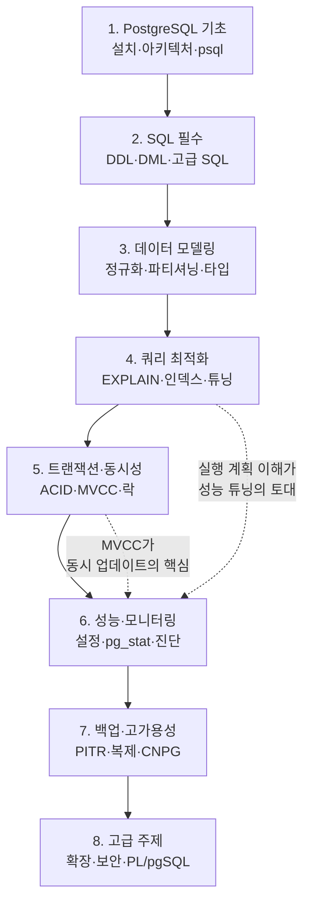

<figure class="post-figure post-figure--header">
<svg role="img" aria-label="PostgreSQL 학습 여정을 도장깨기 계단으로 표현한 그림. 왼쪽 아래 출발점에서 시작해 여덟 개의 계단이 오른쪽 위로 올라가며, 각 계단에는 기초·SQL·데이터 모델링·쿼리 최적화·트랜잭션과 동시성·성능과 모니터링·백업과 고가용성·고급 주제 단계가 차례로 새겨져 있다. 정상에는 깃발이 꽂혀 있고, 그림 한가운데 위쪽에는 PostgreSQL을 상징하는 코끼리 실루엣이 자리한다." viewBox="0 0 680 300" xmlns="http://www.w3.org/2000/svg">
  <title>PostgreSQL Essential — 여덟 단계 도장깨기 학습 여정 (기초에서 고급까지 오르는 계단)</title>

  <!-- ===== PostgreSQL elephant motif (top-center) ===== -->
  <g transform="translate(300 18)" opacity="0.9">
    <!-- body -->
    <ellipse cx="40" cy="34" rx="34" ry="24" fill="var(--bg-light)" stroke="currentColor" stroke-width="2"/>
    <!-- head -->
    <circle cx="14" cy="30" r="16" fill="var(--bg-light)" stroke="currentColor" stroke-width="2"/>
    <!-- ear -->
    <path d="M10 18 q-12 2 -10 16 q8 4 12 -4 z" fill="var(--bg-panel)" stroke="currentColor" stroke-width="1.6"/>
    <!-- trunk curling up -->
    <path d="M6 38 q-10 8 -6 18 q4 8 12 4" fill="none" stroke="currentColor" stroke-width="2.4" stroke-linecap="round"/>
    <!-- eye -->
    <circle cx="16" cy="28" r="2" fill="currentColor"/>
    <!-- legs -->
    <rect x="26" y="52" width="7" height="14" rx="2" fill="var(--bg-light)" stroke="currentColor" stroke-width="1.6"/>
    <rect x="50" y="52" width="7" height="14" rx="2" fill="var(--bg-light)" stroke="currentColor" stroke-width="1.6"/>
    <text x="40" y="14" text-anchor="middle" font-size="10" fill="currentColor" font-weight="700" opacity="0.8">PostgreSQL</text>
  </g>

  <!-- ===== ground line ===== -->
  <line x1="20" y1="276" x2="660" y2="276" stroke="currentColor" stroke-width="1.5" opacity="0.4"/>
  <text x="34" y="294" text-anchor="middle" font-size="9" fill="currentColor" opacity="0.7">출발</text>

  <!-- ===== eight ascending stamp-steps (도장깨기) ===== -->
  <!-- Each step: a rectangular block with a stage number stamp and label. Heights rise left→right. -->
  <g font-weight="700">
    <!-- step 1 -->
    <rect x="44" y="244" width="68" height="32" rx="3" fill="var(--bg-light)" stroke="currentColor" stroke-width="1.8"/>
    <circle cx="60" cy="260" r="9" fill="var(--bg-panel)" stroke="var(--secondary-color)" stroke-width="2"/>
    <text x="60" y="263" text-anchor="middle" font-size="9" fill="currentColor">1</text>
    <text x="86" y="263" text-anchor="middle" font-size="8.5" fill="currentColor">기초</text>
    <!-- step 2 -->
    <rect x="116" y="220" width="68" height="56" rx="3" fill="var(--bg-light)" stroke="currentColor" stroke-width="1.8"/>
    <circle cx="132" cy="236" r="9" fill="var(--bg-panel)" stroke="var(--secondary-color)" stroke-width="2"/>
    <text x="132" y="239" text-anchor="middle" font-size="9" fill="currentColor">2</text>
    <text x="158" y="239" text-anchor="middle" font-size="8.5" fill="currentColor">SQL</text>
    <!-- step 3 -->
    <rect x="188" y="196" width="68" height="80" rx="3" fill="var(--bg-light)" stroke="currentColor" stroke-width="1.8"/>
    <circle cx="204" cy="212" r="9" fill="var(--bg-panel)" stroke="var(--secondary-color)" stroke-width="2"/>
    <text x="204" y="215" text-anchor="middle" font-size="9" fill="currentColor">3</text>
    <text x="230" y="215" text-anchor="middle" font-size="8" fill="currentColor">모델링</text>
    <!-- step 4 -->
    <rect x="260" y="172" width="68" height="104" rx="3" fill="var(--bg-light)" stroke="currentColor" stroke-width="1.8"/>
    <circle cx="276" cy="188" r="9" fill="var(--bg-panel)" stroke="var(--accent-color)" stroke-width="2"/>
    <text x="276" y="191" text-anchor="middle" font-size="9" fill="currentColor">4</text>
    <text x="302" y="191" text-anchor="middle" font-size="8" fill="currentColor">최적화</text>
    <!-- step 5 -->
    <rect x="332" y="148" width="68" height="128" rx="3" fill="var(--bg-light)" stroke="currentColor" stroke-width="1.8"/>
    <circle cx="348" cy="164" r="9" fill="var(--bg-panel)" stroke="var(--accent-color)" stroke-width="2"/>
    <text x="348" y="167" text-anchor="middle" font-size="9" fill="currentColor">5</text>
    <text x="374" y="167" text-anchor="middle" font-size="8" fill="currentColor">동시성</text>
    <!-- step 6 -->
    <rect x="404" y="124" width="68" height="152" rx="3" fill="var(--bg-light)" stroke="currentColor" stroke-width="1.8"/>
    <circle cx="420" cy="140" r="9" fill="var(--bg-panel)" stroke="var(--accent-color)" stroke-width="2"/>
    <text x="420" y="143" text-anchor="middle" font-size="9" fill="currentColor">6</text>
    <text x="446" y="143" text-anchor="middle" font-size="8" fill="currentColor">성능</text>
    <!-- step 7 -->
    <rect x="476" y="100" width="68" height="176" rx="3" fill="var(--bg-light)" stroke="currentColor" stroke-width="1.8"/>
    <circle cx="492" cy="116" r="9" fill="var(--bg-panel)" stroke="var(--gold)" stroke-width="2"/>
    <text x="492" y="119" text-anchor="middle" font-size="9" fill="currentColor">7</text>
    <text x="518" y="119" text-anchor="middle" font-size="8" fill="currentColor">HA</text>
    <!-- step 8 (summit) -->
    <rect x="548" y="76" width="68" height="200" rx="3" fill="var(--bg-panel)" stroke="var(--gold)" stroke-width="2.5"/>
    <circle cx="564" cy="92" r="9" fill="var(--bg-light)" stroke="var(--gold)" stroke-width="2"/>
    <text x="564" y="95" text-anchor="middle" font-size="9" fill="currentColor">8</text>
    <text x="590" y="95" text-anchor="middle" font-size="8" fill="currentColor">고급</text>
  </g>

  <!-- ===== victory flag at the summit ===== -->
  <line x1="600" y1="76" x2="600" y2="40" stroke="currentColor" stroke-width="2.4" stroke-linecap="round"/>
  <path d="M600 42 L634 50 L600 60 z" fill="var(--accent-color)" stroke="var(--gold)" stroke-width="1.5"/>

  <!-- ===== ascending dashed climb line over the steps ===== -->
  <polyline points="78,244 150,220 222,196 294,172 366,148 438,124 510,100 582,76"
            fill="none" stroke="var(--secondary-color)" stroke-width="2" stroke-dasharray="3 4" opacity="0.85"
            marker-end="url(#pg-climb)"/>

  <defs>
    <marker id="pg-climb" markerWidth="9" markerHeight="9" refX="6" refY="4.5" orient="auto">
      <path d="M0,0 L9,4.5 L0,9 z" fill="var(--secondary-color)"/>
    </marker>
  </defs>
</svg>
<figcaption>PostgreSQL Essential 학습 여정 — 출발점에서 시작해 <strong>기초 → SQL → 데이터 모델링 → 쿼리 최적화 → 트랜잭션·동시성 → 성능·모니터링 → 백업·고가용성 → 고급 주제</strong>의 여덟 단계를 한 칸씩 도장깨기로 올라 정상의 깃발에 닿는 길. 위쪽 코끼리는 PostgreSQL의 상징.</figcaption>
</figure>

## 소개

PostgreSQL은 가장 진보된 오픈소스 관계형 데이터베이스 시스템 중 하나로, 견고성, 확장성, 표준 준수로 잘 알려져 있습니다. 이 커리큘럼은 PostgreSQL을 기초부터 마스터하고자 하는 개발자들을 위한 체계적인 학습 경로를 제공합니다.

이 가이드는 기본 설치 및 SQL 기초부터 쿼리 최적화, 복제, 성능 튜닝과 같은 고급 주제까지 모든 것을 다룹니다.

### 한눈에 보기 — 전체 학습 경로

여덟 단계는 따로 노는 주제 묶음이 아니라 **아래에서 위로 쌓아 올리는 한 줄기**입니다. 기초에서 SQL을 다지면 데이터 모델링과 쿼리 최적화로 이어지고, 동시성·성능·운영을 거쳐 마지막에 고급 기능으로 마무리됩니다. 앞 단계를 건너뛰면 뒷 단계가 흔들립니다.

## 1. PostgreSQL 기초

### 1.1 설치 및 설정

- 다양한 플랫폼에서 PostgreSQL 설치하기
- PostgreSQL 아키텍처 이해하기
- 설정 파일 및 기본 설정
- psql 커맨드라인 도구 사용하기
- GUI 도구 (pgAdmin, DBeaver)

### 1.2 데이터베이스 기본

- 데이터베이스 생성 및 관리
- 스키마 이해하기
- 사용자, 역할, 권한
- 연결 관리
- 데이터베이스 인코딩 및 콜레이션

## 2. SQL 필수 개념

### 2.1 데이터 정의 언어 (DDL)

- 적절한 데이터 타입으로 테이블 생성하기
- 기본 키, 외래 키, 제약조건
- 인덱스와 그 종류
- 뷰와 구체화된 뷰 (Materialized Views)
- 시퀀스와 아이덴티티 컬럼

### 2.2 데이터 조작 언어 (DML)

- INSERT, UPDATE, DELETE 연산
- SELECT 쿼리와 필터링
- 조인 (INNER, LEFT, RIGHT, FULL)
- 서브쿼리와 CTE (Common Table Expressions)
- 집계와 GROUP BY

### 2.3 고급 SQL

- 윈도우 함수 (Window Functions)
- 재귀 쿼리 (Recursive Queries)
- JSON 및 JSONB 연산
- 전문 검색 (Full-text Search)
- 배열 연산

## 3. 데이터 모델링

### 3.1 설계 원칙

- 정규화 (1NF, 2NF, 3NF, BCNF)
- 엔티티-관계 모델링
- 적절한 데이터 타입 선택
- 비정규화가 필요한 경우
- 스키마 설계 패턴

### 3.2 PostgreSQL 특화 기능

- 상속 (Inheritance)
- 테이블 파티셔닝
- 사용자 정의 타입과 도메인
- 복합 타입 (Composite Types)
- 범위 타입 (Range Types)

## 4. 쿼리 최적화

### 4.1 EXPLAIN 이해하기

- 실행 계획 읽기
- 비용과 타이밍 이해하기
- 병목 지점 식별하기
- EXPLAIN vs EXPLAIN ANALYZE
- 시각화 도구

### 4.2 인덱스 최적화

- B-tree, Hash, GiST, GIN, BRIN 인덱스
- 각 인덱스 타입을 언제 사용할지
- 커버링 인덱스 (Covering Indexes)
- 부분 인덱스 (Partial Indexes)
- 인덱스 유지보수

### 4.3 쿼리 튜닝

- 더 나은 성능을 위한 쿼리 재작성
- 통계 이해하기
- 일반적인 안티 패턴 피하기
- Prepared Statement 사용
- 커넥션 풀링

## 5. 트랜잭션과 동시성

### 5.1 트랜잭션 관리

- ACID 속성
- 트랜잭션 격리 수준
- SAVEPOINT와 중첩 트랜잭션
- 2단계 커밋 (Two-Phase Commit)
- 교착 상태 감지 및 방지

### 5.2 동시성 제어

- MVCC (Multi-Version Concurrency Control)
- 락 타입과 락 모니터링
- 행 수준 vs 테이블 수준 락킹
- Advisory Locks
- 동시 업데이트 처리

<figure class="post-figure">
<svg role="img" aria-label="PostgreSQL MVCC가 동작하는 방식을 표현한 그림. 한 행의 옛 버전과 새 버전이 함께 보관된다. 트랜잭션 A는 UPDATE로 새 버전을 만들지만, 같은 시점에 이미 시작된 트랜잭션 B는 자신의 스냅숏 기준 옛 버전을 그대로 읽는다. 그래서 읽기와 쓰기가 서로를 막지 않으며, 나중에 VACUUM이 더 이상 보이지 않는 옛 버전을 정리한다." viewBox="0 0 640 280" xmlns="http://www.w3.org/2000/svg">
  <title>MVCC — 읽기와 쓰기가 서로 막지 않는 이유: 같은 행의 여러 버전을 동시에 보관</title>

  <!-- transaction A (writer) -->
  <rect x="24" y="40" width="120" height="34" rx="4" fill="var(--bg-light)" stroke="var(--accent-color)" stroke-width="2"/>
  <text x="84" y="56" text-anchor="middle" font-size="10" fill="currentColor" font-weight="700">트랜잭션 A</text>
  <text x="84" y="68" text-anchor="middle" font-size="8" fill="currentColor" opacity="0.8">UPDATE (쓰기)</text>

  <!-- transaction B (reader) -->
  <rect x="24" y="206" width="120" height="34" rx="4" fill="var(--bg-light)" stroke="var(--secondary-color)" stroke-width="2"/>
  <text x="84" y="222" text-anchor="middle" font-size="10" fill="currentColor" font-weight="700">트랜잭션 B</text>
  <text x="84" y="234" text-anchor="middle" font-size="8" fill="currentColor" opacity="0.8">SELECT (읽기)</text>

  <!-- the row: two versions stacked -->
  <text x="360" y="28" text-anchor="middle" font-size="11" fill="currentColor" font-weight="700" opacity="0.8">같은 행 (row) — 두 버전 공존</text>

  <!-- old version (visible to B) -->
  <rect x="276" y="180" width="168" height="56" rx="4" fill="var(--bg-panel)" stroke="var(--secondary-color)" stroke-width="2"/>
  <text x="360" y="202" text-anchor="middle" font-size="10" fill="currentColor" font-weight="700">옛 버전 (v1)</text>
  <text x="360" y="218" text-anchor="middle" font-size="8" fill="currentColor" opacity="0.85">xmin=100, xmax=200</text>
  <text x="360" y="230" text-anchor="middle" font-size="8" fill="currentColor" opacity="0.85">B의 스냅숏에 보임</text>

  <!-- new version (created by A) -->
  <rect x="276" y="48" width="168" height="56" rx="4" fill="var(--bg-panel)" stroke="var(--accent-color)" stroke-width="2"/>
  <text x="360" y="70" text-anchor="middle" font-size="10" fill="currentColor" font-weight="700">새 버전 (v2)</text>
  <text x="360" y="86" text-anchor="middle" font-size="8" fill="currentColor" opacity="0.85">xmin=200</text>
  <text x="360" y="98" text-anchor="middle" font-size="8" fill="currentColor" opacity="0.85">A가 만든 행</text>

  <!-- A writes new version -->
  <line x1="144" y1="60" x2="272" y2="70" stroke="var(--accent-color)" stroke-width="2" marker-end="url(#mv-a)"/>
  <text x="208" y="48" text-anchor="middle" font-size="8" fill="currentColor" opacity="0.85">새 버전 생성</text>

  <!-- B reads old version -->
  <line x1="144" y1="220" x2="272" y2="210" stroke="var(--secondary-color)" stroke-width="2" marker-end="url(#mv-b)"/>
  <text x="208" y="234" text-anchor="middle" font-size="8" fill="currentColor" opacity="0.85">옛 버전 읽음</text>

  <!-- no blocking note -->
  <rect x="200" y="120" width="320" height="40" rx="4" fill="var(--bg-light)" stroke="var(--gold)" stroke-width="2"/>
  <text x="360" y="138" text-anchor="middle" font-size="9.5" fill="currentColor" font-weight="700">읽기는 쓰기를, 쓰기는 읽기를 막지 않는다</text>
  <text x="360" y="152" text-anchor="middle" font-size="8" fill="currentColor" opacity="0.85">각 트랜잭션은 자기 스냅숏이 보는 버전만 읽는다</text>

  <!-- VACUUM cleans dead version -->
  <rect x="484" y="186" width="132" height="44" rx="4" fill="var(--bg-panel)" stroke="currentColor" stroke-width="1.8"/>
  <text x="550" y="206" text-anchor="middle" font-size="9.5" fill="currentColor" font-weight="700">VACUUM</text>
  <text x="550" y="220" text-anchor="middle" font-size="8" fill="currentColor" opacity="0.85">죽은 옛 버전 정리</text>
  <line x1="444" y1="208" x2="480" y2="208" stroke="currentColor" stroke-width="2" stroke-dasharray="3 3" marker-end="url(#mv-v)"/>

  <defs>
    <marker id="mv-a" markerWidth="8" markerHeight="8" refX="6" refY="4" orient="auto"><path d="M0,0 L8,4 L0,8 z" fill="var(--accent-color)"/></marker>
    <marker id="mv-b" markerWidth="8" markerHeight="8" refX="6" refY="4" orient="auto"><path d="M0,0 L8,4 L0,8 z" fill="var(--secondary-color)"/></marker>
    <marker id="mv-v" markerWidth="8" markerHeight="8" refX="6" refY="4" orient="auto"><path d="M0,0 L8,4 L0,8 z" fill="currentColor"/></marker>
  </defs>
</svg>
<figcaption>MVCC의 핵심 직관 — UPDATE는 행을 덮어쓰는 대신 <strong>새 버전</strong>을 만들고 옛 버전을 남겨 둡니다. 먼저 시작한 읽기 트랜잭션은 자기 스냅숏 기준 <strong>옛 버전</strong>을 그대로 보므로, 읽기와 쓰기가 서로를 막지 않습니다. 더 이상 어떤 트랜잭션에도 보이지 않게 된 옛 버전은 나중에 VACUUM이 정리합니다.</figcaption>
</figure>

## 6. 성능과 모니터링

### 6.1 성능 튜닝

- 설정 파라미터 (shared_buffers, work_mem 등)
- Autovacuum 설정
- 체크포인트 튜닝
- WAL (Write-Ahead Logging) 최적화
- 리소스 관리

### 6.2 모니터링과 진단

- pg_stat 뷰
- 느린 쿼리 식별하기
- 로그 분석
- 모니터링 도구 (pg_stat_statements)
- 알림과 메트릭

## 7. 백업과 복구

### 7.1 백업 전략

- pg_dump와 pg_dumpall
- 파일 시스템 수준 백업
- 연속 아카이빙 (Continuous Archiving)
- 특정 시점 복구 (PITR)
- 백업 모범 사례

### 7.2 고가용성

- 스트리밍 복제 (Streaming Replication)
- 논리 복제 (Logical Replication)
- 장애 조치와 전환 (Failover and Switchover)
- PgBouncer를 이용한 커넥션 풀링
- 로드 밸런싱

### 7.3 Kubernetes에서의 PostgreSQL (CNPG)

- CloudNativePG (CNPG) 소개
- CNPG 아키텍처 이해하기
- Kubernetes에 PostgreSQL 클러스터 배포
- CNPG Operator를 통한 자동화된 관리
- 선언적 설정을 통한 클러스터 구성
- 자동 장애 조치 및 자가 복구
- 롤링 업데이트와 버전 업그레이드
- 백업 및 복구 자동화 (Barman)
- 모니터링 및 메트릭 수집 (Prometheus, Grafana)
- CNPG 플러그인을 통한 kubectl 통합
- 프로덕션 환경에서의 CNPG 운영 패턴
- 스토리지 클래스 및 PVC 관리
- 리소스 제한 및 QoS 설정

## 8. 고급 주제

### 8.1 확장 기능

- 인기 있는 확장 기능 (PostGIS, pg_trgm, hstore)
- 사용자 정의 확장 기능 생성
- 확장 기능 관리
- Foreign Data Wrappers (FDW)

### 8.2 보안

- 인증 방법
- SSL/TLS 설정
- 행 수준 보안 (Row-Level Security, RLS)
- 저장 데이터 암호화 (Encryption at Rest)
- 감사 로깅

### 8.3 고급 기능

- 저장 프로시저와 함수 (PL/pgSQL)
- 트리거와 이벤트 트리거
- Pub-Sub을 위한 Listen/Notify
- 외부 테이블 (Foreign Tables)
- 병렬 쿼리 실행

## 핵심 포인트

- **기초부터 시작**: 고급 주제로 넘어가기 전에 SQL과 기본 데이터베이스 개념을 마스터하세요
- **쿼리 최적화 연습**: 성능을 위해 EXPLAIN과 인덱스를 이해하는 것이 중요합니다
- **MVCC 학습**: PostgreSQL의 동시성 모델은 독특하고 강력합니다
- **확장 기능 탐색**: PostgreSQL의 확장성은 가장 큰 강점 중 하나입니다
- **성능에 집중**: 설정 튜닝과 모니터링은 필수 기술입니다
- **백업/복구 이해**: 데이터 안전은 항상 우선순위여야 합니다
- **실제 패턴 학습**: 프로덕션 사용 사례와 모범 사례에서 배우세요
- **클라우드 네이티브 접근**: Kubernetes에서 CNPG를 사용한 현대적인 PostgreSQL 운영을 이해하세요

## 결론

PostgreSQL 마스터하기는 이론적 지식과 실무 경험을 모두 필요로 하는 여정입니다. 이 커리큘럼은 기초부터 시작해 고급 주제로 진행하는 체계적인 PostgreSQL 학습 접근법을 제공합니다.

성공의 열쇠는 실습입니다. 로컬 PostgreSQL 인스턴스를 설정하고, 각 주제를 체계적으로 학습하며, 배운 것을 실제 시나리오에 적용하세요. 기초를 건너뛰지 마세요—MVCC, 쿼리 플래닝, 인덱싱과 같은 핵심 개념을 이해하는 것이 모든 고급 주제의 기반이 됩니다.

### 다음 학습

- PostgreSQL 개발 환경 구축 - 설치 및 설정 시작하기
- PostgreSQL 아키텍처 심층 분석 - PostgreSQL이 내부적으로 어떻게 작동하는지 이해하기
- SQL 쿼리 최적화 기법 - 효율적인 쿼리 작성을 위한 실용 가이드
- PostgreSQL 성능 튜닝 가이드 - 종합적인 성능 최적화 전략
- PostgreSQL로 고가용성 구현하기 - 복제 및 장애 조치 전략
- CloudNativePG (CNPG) 시작하기 - Kubernetes에서 PostgreSQL 운영하기
