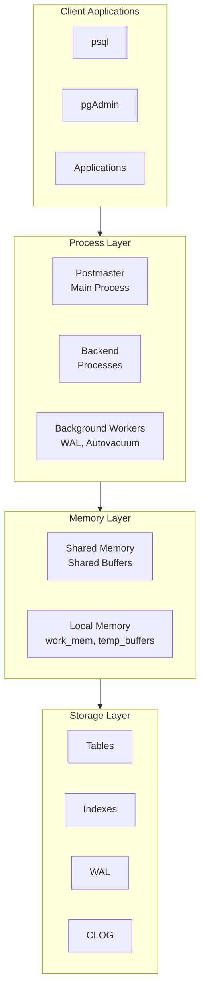
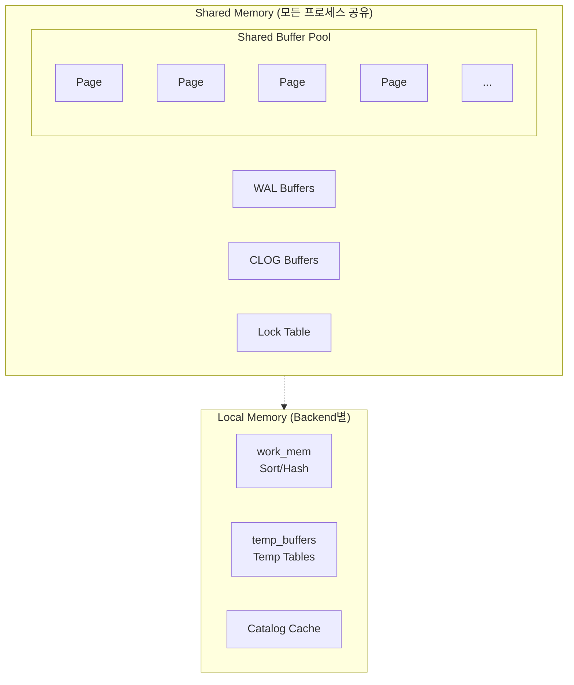
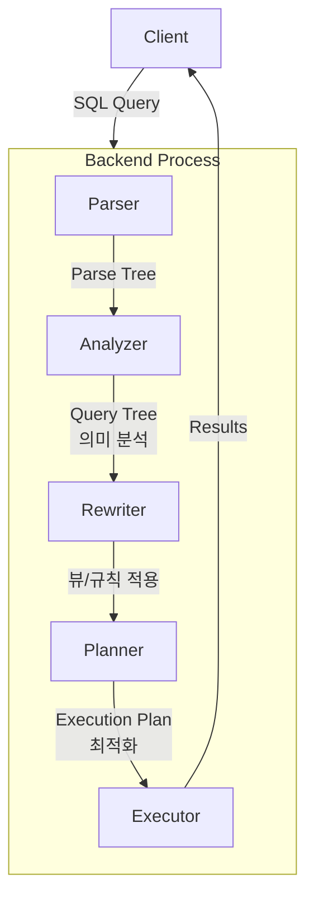

## 소개

PostgreSQL의 내부 아키텍처를 이해하는 것은 효율적인 데이터베이스 관리와 성능 최적화의 기초입니다. 이 글에서는 PostgreSQL이 내부적으로 어떻게 작동하는지 프로세스 구조, 메모리 구조, 스토리지 구조의 세 가지 핵심 영역을 중심으로 살펴봅니다.

PostgreSQL은 클라이언트/서버 모델을 기반으로 하며, 멀티프로세스 아키텍처를 채택하고 있습니다. 이러한 설계는 안정성과 확장성을 동시에 제공합니다.

<div class="post-summary-box" markdown="1">

### 📌 이 글에서 다루는 내용

#### 🔍 핵심 주제

- **프로세스 구조**: Postmaster, Backend Process, Background Workers의 역할과 상호작용
- **메모리 구조**: Shared Memory(shared_buffers, WAL buffers)와 Local Memory(work_mem, temp_buffers)
- **스토리지 구조**: 데이터 디렉토리, 8KB 페이지 구조, WAL, TOAST 메커니즘
- **쿼리 처리 흐름**: Parser → Analyzer → Rewriter → Planner → Executor

</div>

## 1. PostgreSQL 전체 아키텍처 개요

PostgreSQL 아키텍처는 크게 세 가지 계층으로 나눌 수 있습니다:



## 2. 프로세스 구조 (Process Architecture)

PostgreSQL은 멀티프로세스 아키텍처를 사용합니다. 각 클라이언트 연결은 별도의 프로세스에서 처리됩니다.

### 2.1 Postmaster (Main Process)

Postmaster는 PostgreSQL의 메인 프로세스로, 다음과 같은 역할을 수행합니다:

- **서버 시작 및 종료**: 데이터베이스 서버의 생명주기 관리
- **클라이언트 연결 수락**: 새로운 연결 요청을 받아 Backend 프로세스 생성
- **Background Worker 관리**: 백그라운드 프로세스들의 시작과 감독
- **장애 복구**: 자식 프로세스 실패 시 복구 처리

```bash
# Postmaster 프로세스 확인
ps aux | grep postgres | grep -v grep

# 출력 예시
postgres  1234  0.0  0.1  postmaster -D /var/lib/postgresql/data
```

### 2.2 Backend Process

각 클라이언트 연결마다 하나의 Backend 프로세스가 생성됩니다:

- **쿼리 파싱**: SQL 문을 파싱 트리로 변환
- **쿼리 플래닝**: 최적의 실행 계획 수립
- **쿼리 실행**: 실행 계획에 따라 쿼리 수행
- **결과 반환**: 클라이언트에 결과 전송

```sql
-- 현재 연결된 Backend 프로세스 확인
SELECT pid, usename, application_name, client_addr, state, query
FROM pg_stat_activity
WHERE backend_type = 'client backend';
```

### 2.3 Background Worker Processes

PostgreSQL은 다양한 백그라운드 프로세스를 통해 시스템을 관리합니다:

| 프로세스            | 역할                                     |
| ------------------- | ---------------------------------------- |
| **WAL Writer**      | WAL 버퍼를 디스크에 기록                 |
| **Checkpointer**    | 체크포인트 수행, 더티 페이지 기록        |
| **Autovacuum**      | 자동으로 VACUUM 및 ANALYZE 수행          |
| **BGWriter**        | 백그라운드에서 더티 버퍼를 디스크에 기록 |
| **Stats Collector** | 데이터베이스 통계 수집                   |
| **Archiver**        | WAL 파일 아카이빙                        |

```sql
-- Background Worker 프로세스 목록 확인
SELECT pid, backend_type, state
FROM pg_stat_activity
WHERE backend_type != 'client backend';
```

## 3. 메모리 구조 (Memory Architecture)

PostgreSQL의 메모리는 공유 메모리(Shared Memory)와 로컬 메모리(Local Memory)로 구분됩니다.

### 3.1 공유 메모리 (Shared Memory)

모든 프로세스가 공유하는 메모리 영역입니다:

#### Shared Buffers

데이터 페이지를 캐싱하는 가장 중요한 메모리 영역입니다.

```sql
-- shared_buffers 설정 확인
SHOW shared_buffers;

-- 권장 설정: 전체 RAM의 25% (최대 8GB 정도)
-- postgresql.conf
-- shared_buffers = 4GB
```

#### WAL Buffers

WAL 레코드를 임시 저장하는 버퍼입니다.

```sql
-- wal_buffers 설정 확인
SHOW wal_buffers;

-- 일반적으로 shared_buffers의 1/32, 최소 64KB ~ 최대 16MB
```

#### CLOG Buffers

트랜잭션 커밋 상태를 저장하는 버퍼입니다.

### 3.2 로컬 메모리 (Local Memory)

각 Backend 프로세스가 개별적으로 사용하는 메모리 영역입니다:

#### work_mem

정렬, 해시 조인 등의 작업에 사용되는 메모리입니다.

```sql
-- work_mem 설정 확인 및 변경
SHOW work_mem;

-- 세션 단위로 변경 가능
SET work_mem = '256MB';

-- 주의: 쿼리당 여러 개의 정렬/해시 작업이 동시에 수행될 수 있음
-- 총 사용량 = work_mem × 동시 작업 수 × 연결 수
```

#### maintenance_work_mem

VACUUM, CREATE INDEX, ALTER TABLE 등의 유지보수 작업에 사용됩니다.

```sql
SHOW maintenance_work_mem;

-- 권장: 시스템 RAM의 5~10%
-- maintenance_work_mem = 1GB
```

#### temp_buffers

임시 테이블을 위한 버퍼입니다.

```sql
SHOW temp_buffers;

-- 세션에서 임시 테이블을 처음 사용하기 전에만 변경 가능
SET temp_buffers = '128MB';
```

### 3.3 메모리 구조 다이어그램



## 4. 스토리지 구조 (Storage Architecture)

### 4.1 데이터 디렉토리 구조

PostgreSQL의 데이터는 `PGDATA` 디렉토리에 저장됩니다:

```
$PGDATA/
├── base/                 # 데이터베이스 파일
│   ├── 1/               # template1 데이터베이스
│   ├── 13445/           # 사용자 데이터베이스
│   └── ...
├── global/              # 클러스터 전체 테이블 (pg_database 등)
├── pg_wal/              # WAL 세그먼트 파일
├── pg_xact/             # 트랜잭션 커밋 상태 (CLOG)
├── pg_stat/             # 영구 통계 데이터
├── pg_tblspc/           # 테이블스페이스 심볼릭 링크
├── postgresql.conf      # 메인 설정 파일
├── pg_hba.conf          # 클라이언트 인증 설정
└── postmaster.pid       # 서버 PID 및 상태 정보
```

### 4.2 페이지 구조

PostgreSQL의 모든 데이터는 8KB 크기의 페이지(블록)로 저장됩니다:

#### Page Layout (8KB Default)

| 영역              | 크기       | 설명                                                           |
| ----------------- | ---------- | -------------------------------------------------------------- |
| **Page Header**   | 24 bytes   | `pd_lsn` (WAL 위치), `pd_checksum`, `pd_lower`, `pd_upper`     |
| **Item Pointers** | variable   | 각 튜플의 위치(offset)와 길이 정보를 저장하는 라인 포인터 배열 |
| **Free Space**    | ↕ variable | 새로운 Item Pointer(↓)와 Tuple(↑)이 채워지는 빈 공간           |
| **Tuples (Rows)** | grows ↑    | 실제 데이터가 저장되는 영역, 페이지 끝에서부터 위로 채워짐     |
| **Special Space** | optional   | 인덱스 페이지에서만 사용 (B-tree 메타데이터 등)                |

```sql
-- 페이지 크기 확인
SHOW block_size;

-- 테이블의 페이지 수 확인
SELECT pg_relation_size('테이블명') / 8192 as pages;
```

### 4.3 힙 튜플 구조 (MVCC)

PostgreSQL은 MVCC(Multi-Version Concurrency Control)를 위해 각 튜플에 메타데이터를 저장합니다:

#### HeapTuple Structure

| 영역                | 크기     | 설명                                    |
| ------------------- | -------- | --------------------------------------- |
| **HeapTupleHeader** | 23 bytes | 튜플 메타데이터 (아래 상세 참조)        |
| **Null Bitmap**     | optional | NULL 값을 가진 컬럼 표시 (컬럼당 1비트) |
| **User Data**       | variable | 실제 컬럼 데이터                        |

#### HeapTupleHeader 상세

| 필드         | 설명                                                       |
| ------------ | ---------------------------------------------------------- |
| `t_xmin`     | 튜플을 **생성**한 트랜잭션 ID                              |
| `t_xmax`     | 튜플을 **삭제/갱신**한 트랜잭션 ID (0이면 유효한 튜플)     |
| `t_cid`      | 트랜잭션 내 커맨드 순서 ID                                 |
| `t_ctid`     | 현재 튜플 위치 또는 업데이트된 새 튜플 위치 (page, offset) |
| `t_infomask` | 튜플 상태 플래그 (committed, deleted, updated 등)          |

```sql
-- 튜플의 시스템 컬럼 확인
SELECT ctid, xmin, xmax, * FROM 테이블명 LIMIT 5;
```

### 4.4 WAL (Write-Ahead Logging)

WAL은 데이터 무결성을 보장하는 핵심 메커니즘입니다:

```
트랜잭션 커밋 과정:
1. 변경 내용을 WAL 버퍼에 기록
2. WAL 버퍼를 디스크의 WAL 파일에 동기화 (fsync)
3. 커밋 완료 응답
4. 나중에 체크포인트에서 실제 데이터 페이지를 디스크에 기록
```

```sql
-- WAL 관련 설정 확인
SHOW wal_level;
SHOW max_wal_size;
SHOW min_wal_size;

-- 현재 WAL 위치 확인
SELECT pg_current_wal_lsn();
```

### 4.5 TOAST (The Oversized-Attribute Storage Technique)

큰 데이터를 효율적으로 저장하기 위한 메커니즘입니다:

```sql
-- TOAST 전략
-- PLAIN: TOAST 미사용 (고정 크기 타입)
-- EXTENDED: 압축 후 외부 저장 (기본값)
-- EXTERNAL: 압축 없이 외부 저장
-- MAIN: 압축만 수행, 최대한 메인 테이블에 유지

-- 테이블의 TOAST 테이블 확인
SELECT relname, reltoastrelid::regclass
FROM pg_class
WHERE relname = '테이블명';
```

## 5. 쿼리 처리 흐름

클라이언트 쿼리가 처리되는 전체 과정을 살펴봅니다:



```sql
-- 쿼리 실행 계획 확인
EXPLAIN (ANALYZE, BUFFERS, FORMAT TEXT)
SELECT * FROM users WHERE id = 1;
```

## 핵심 포인트

- **멀티프로세스 아키텍처**: PostgreSQL은 각 연결에 대해 별도의 Backend 프로세스를 생성하여 안정성을 확보합니다
- **Shared Buffers**: 가장 중요한 메모리 설정으로, 일반적으로 전체 RAM의 25%를 권장합니다
- **WAL**: Write-Ahead Logging을 통해 데이터 무결성과 복구 능력을 보장합니다
- **MVCC**: 각 튜플에 트랜잭션 정보를 저장하여 동시성 제어를 구현합니다
- **8KB 페이지**: 모든 데이터는 8KB 페이지 단위로 저장되고 관리됩니다
- **Background Workers**: Autovacuum, Checkpointer 등의 프로세스가 자동으로 시스템을 관리합니다

## 결론

PostgreSQL의 아키텍처를 이해하는 것은 데이터베이스 성능 튜닝과 문제 해결의 기초입니다. 프로세스 구조는 안정성을, 메모리 구조는 성능을, 스토리지 구조는 데이터 무결성을 담당합니다.

특히 Shared Buffers, work_mem, WAL 관련 설정들은 시스템 성능에 직접적인 영향을 미치므로, 워크로드 특성에 맞게 적절히 조정해야 합니다. MVCC 메커니즘을 이해하면 VACUUM의 필요성과 트랜잭션 동작 방식을 더 잘 이해할 수 있습니다.

### 다음 학습

- [MVCC와 Vacuum 메커니즘](/postgresql/mvcc-vacuum) - PostgreSQL 동시성 제어 심층 분석
- [쿼리 플래너와 실행 계획](/postgresql/query-planner) - 쿼리 최적화의 핵심
- [PostgreSQL 성능 튜닝](/postgresql/performance-tuning) - 실무 성능 최적화 전략
- [WAL과 복제](/postgresql/wal-replication) - 고가용성 구현의 기초
