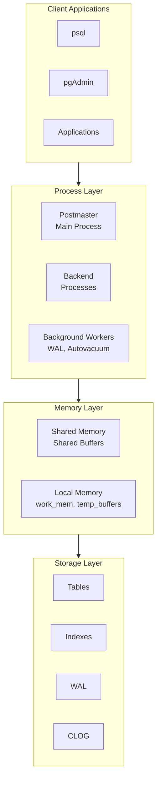
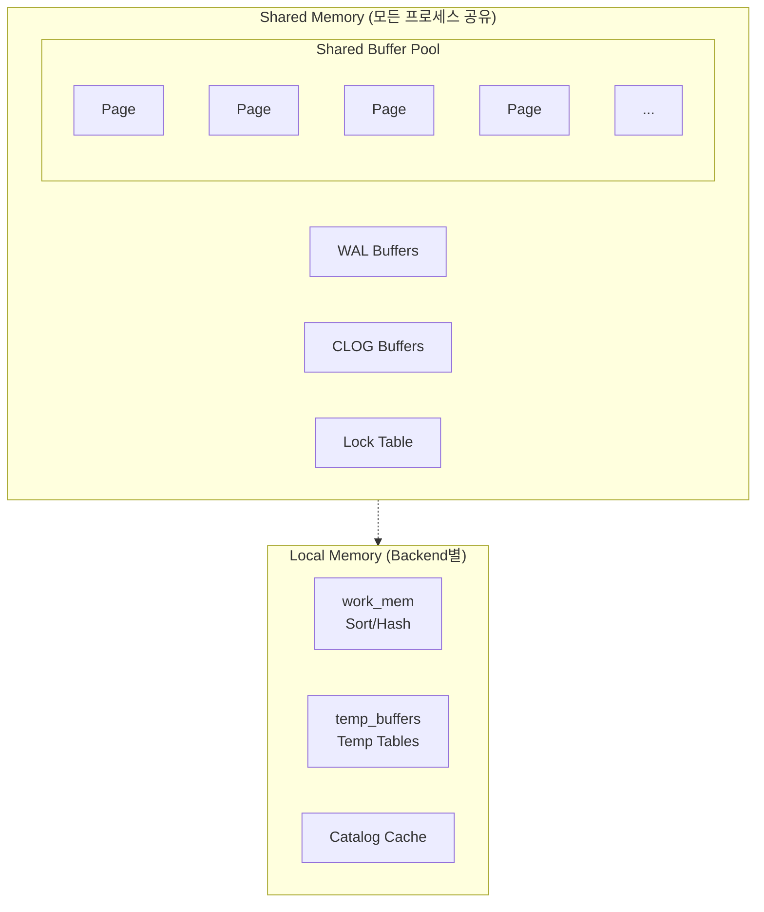
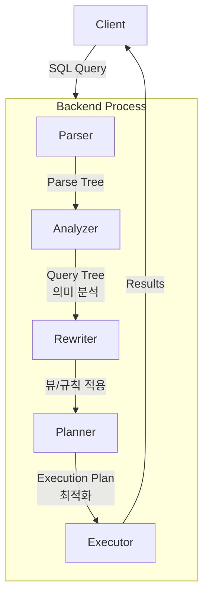

<figure class="post-figure post-figure--header">
<svg role="img" aria-label="PostgreSQL 멀티프로세스 아키텍처를 세 계층으로 한 장에 담은 그림. 위쪽은 프로세스 계층으로, 메인 프로세스인 Postmaster가 여러 클라이언트 연결마다 별도의 Backend 프로세스를 만들고, 옆에는 WAL Writer·Checkpointer·Autovacuum 같은 백그라운드 워커가 함께 있다. 가운데는 메모리 계층으로, 모든 프로세스가 함께 쓰는 공유 메모리(Shared Buffers·WAL Buffers)와 Backend마다 따로 쓰는 로컬 메모리(work_mem·temp_buffers)가 나뉜다. 아래쪽은 스토리지 계층으로, 8KB 페이지로 이루어진 테이블·인덱스 파일과 WAL 세그먼트가 디스크에 놓인다. 화살표가 위에서 아래로, 프로세스가 메모리를 거쳐 스토리지에 닿는 흐름을 보여준다." viewBox="0 0 680 360" xmlns="http://www.w3.org/2000/svg">
  <title>PostgreSQL 아키텍처 — 프로세스 · 메모리 · 스토리지의 세 계층</title>

  <!-- ===== PROCESS LAYER (top) ===== -->
  <text x="22" y="30" text-anchor="start" font-size="12" fill="currentColor" font-weight="700" opacity="0.75">프로세스 계층</text>
  <!-- Postmaster -->
  <rect x="22" y="42" width="120" height="40" rx="3" fill="var(--bg-panel)" stroke="var(--gold)" stroke-width="2.5"/>
  <text x="82" y="60" text-anchor="middle" font-size="10" fill="currentColor" font-weight="700">Postmaster</text>
  <text x="82" y="74" text-anchor="middle" font-size="7.5" fill="currentColor" opacity="0.8">메인 프로세스</text>
  <!-- fork arrows to backends -->
  <line x1="142" y1="58" x2="176" y2="58" stroke="var(--secondary-color)" stroke-width="2" marker-end="url(#pg-arrow)"/>
  <!-- backends -->
  <g>
    <rect x="180" y="40" width="74" height="30" rx="3" fill="var(--bg-light)" stroke="var(--accent-color)" stroke-width="2"/>
    <text x="217" y="59" text-anchor="middle" font-size="8.5" fill="currentColor" font-weight="700">Backend #1</text>
    <rect x="192" y="50" width="74" height="30" rx="3" fill="var(--bg-light)" stroke="var(--accent-color)" stroke-width="2"/>
    <rect x="204" y="60" width="74" height="30" rx="3" fill="var(--bg-light)" stroke="var(--accent-color)" stroke-width="2"/>
    <text x="241" y="79" text-anchor="middle" font-size="8.5" fill="currentColor" font-weight="700">Backend #N</text>
  </g>
  <text x="229" y="104" text-anchor="middle" font-size="7.5" fill="currentColor" opacity="0.75">연결마다 1개</text>
  <!-- background workers -->
  <rect x="372" y="42" width="286" height="46" rx="3" fill="var(--bg-light)" stroke="currentColor" stroke-width="1.8"/>
  <text x="515" y="58" text-anchor="middle" font-size="9" fill="currentColor" font-weight="700">Background Workers</text>
  <text x="515" y="74" text-anchor="middle" font-size="7.5" fill="currentColor" opacity="0.8">WAL Writer · Checkpointer · Autovacuum · BGWriter</text>

  <!-- arrows process -> memory -->
  <line x1="217" y1="90" x2="217" y2="128" stroke="var(--secondary-color)" stroke-width="2" marker-end="url(#pg-arrow)"/>
  <line x1="515" y1="88" x2="515" y2="128" stroke="var(--secondary-color)" stroke-width="2" marker-end="url(#pg-arrow)"/>

  <!-- ===== MEMORY LAYER (middle) ===== -->
  <text x="22" y="148" text-anchor="start" font-size="12" fill="currentColor" font-weight="700" opacity="0.75">메모리 계층</text>
  <!-- shared memory -->
  <rect x="22" y="156" width="384" height="58" rx="3" fill="var(--bg-panel)" stroke="var(--accent-color)" stroke-width="2.5"/>
  <text x="214" y="174" text-anchor="middle" font-size="10" fill="currentColor" font-weight="700">Shared Memory — 모든 프로세스 공유</text>
  <rect x="34" y="182" width="110" height="24" rx="2" fill="var(--bg-light)" stroke="currentColor" stroke-width="1.4"/>
  <text x="89" y="198" text-anchor="middle" font-size="8" fill="currentColor" font-weight="700">Shared Buffers</text>
  <rect x="152" y="182" width="100" height="24" rx="2" fill="var(--bg-light)" stroke="currentColor" stroke-width="1.4"/>
  <text x="202" y="198" text-anchor="middle" font-size="8" fill="currentColor" font-weight="700">WAL Buffers</text>
  <rect x="260" y="182" width="134" height="24" rx="2" fill="var(--bg-light)" stroke="currentColor" stroke-width="1.4"/>
  <text x="327" y="198" text-anchor="middle" font-size="8" fill="currentColor" font-weight="700">CLOG · Lock Table</text>
  <!-- local memory -->
  <rect x="420" y="156" width="238" height="58" rx="3" fill="var(--bg-panel)" stroke="currentColor" stroke-width="1.8"/>
  <text x="539" y="174" text-anchor="middle" font-size="10" fill="currentColor" font-weight="700">Local Memory — Backend별</text>
  <rect x="432" y="182" width="100" height="24" rx="2" fill="var(--bg-light)" stroke="currentColor" stroke-width="1.4"/>
  <text x="482" y="198" text-anchor="middle" font-size="8" fill="currentColor" font-weight="700">work_mem</text>
  <rect x="540" y="182" width="106" height="24" rx="2" fill="var(--bg-light)" stroke="currentColor" stroke-width="1.4"/>
  <text x="593" y="198" text-anchor="middle" font-size="8" fill="currentColor" font-weight="700">temp_buffers</text>

  <!-- arrows memory -> storage -->
  <line x1="214" y1="214" x2="214" y2="252" stroke="var(--secondary-color)" stroke-width="2" marker-end="url(#pg-arrow)"/>
  <text x="244" y="238" text-anchor="middle" font-size="7.5" fill="currentColor" opacity="0.75">flush / fsync</text>

  <!-- ===== STORAGE LAYER (bottom) ===== -->
  <text x="22" y="272" text-anchor="start" font-size="12" fill="currentColor" font-weight="700" opacity="0.75">스토리지 계층 ($PGDATA)</text>
  <!-- disk platter hint -->
  <rect x="22" y="282" width="180" height="56" rx="3" fill="var(--bg-light)" stroke="currentColor" stroke-width="1.8"/>
  <text x="112" y="302" text-anchor="middle" font-size="9" fill="currentColor" font-weight="700">테이블 · 인덱스</text>
  <!-- 8KB page tiles -->
  <rect x="36" y="312" width="16" height="18" rx="1.5" fill="none" stroke="currentColor" stroke-width="1.2"/>
  <rect x="56" y="312" width="16" height="18" rx="1.5" fill="none" stroke="currentColor" stroke-width="1.2"/>
  <rect x="76" y="312" width="16" height="18" rx="1.5" fill="none" stroke="currentColor" stroke-width="1.2"/>
  <text x="150" y="326" text-anchor="middle" font-size="7.5" fill="currentColor" opacity="0.8">8KB 페이지 단위</text>
  <rect x="212" y="282" width="150" height="56" rx="3" fill="var(--bg-panel)" stroke="var(--gold)" stroke-width="2.5"/>
  <text x="287" y="306" text-anchor="middle" font-size="9" fill="currentColor" font-weight="700">WAL 세그먼트</text>
  <text x="287" y="322" text-anchor="middle" font-size="7.5" fill="currentColor" opacity="0.8">먼저 기록 → 복구 보장</text>
  <rect x="372" y="282" width="286" height="56" rx="3" fill="var(--bg-light)" stroke="currentColor" stroke-width="1.8"/>
  <text x="515" y="306" text-anchor="middle" font-size="9" fill="currentColor" font-weight="700">CLOG · 설정 파일 · pg_tblspc</text>
  <text x="515" y="322" text-anchor="middle" font-size="7.5" fill="currentColor" opacity="0.8">트랜잭션 상태 · postgresql.conf 등</text>

  <defs>
    <marker id="pg-arrow" markerWidth="8" markerHeight="8" refX="6" refY="4" orient="auto">
      <path d="M0,0 L8,4 L0,8 z" fill="var(--secondary-color)"/>
    </marker>
  </defs>
</svg>
<figcaption>PostgreSQL 멀티프로세스 아키텍처의 한 장 요약 — 위에서부터 <strong>프로세스 계층</strong>(Postmaster가 연결마다 Backend를 fork, 백그라운드 워커가 보조), <strong>메모리 계층</strong>(모든 프로세스가 공유하는 Shared Memory와 Backend마다 따로 쓰는 Local Memory), <strong>스토리지 계층</strong>(8KB 페이지로 이루어진 테이블·인덱스와 WAL 세그먼트). 화살표는 프로세스→메모리→디스크로 데이터가 내려가는 흐름이다.</figcaption>
</figure>

## 소개

PostgreSQL의 내부 아키텍처를 이해하는 것은 효율적인 데이터베이스 관리와 성능 최적화의 기초입니다. 이 글에서는 PostgreSQL이 내부적으로 어떻게 작동하는지 프로세스 구조, 메모리 구조, 스토리지 구조의 세 가지 핵심 영역을 중심으로 살펴봅니다.

PostgreSQL은 클라이언트/서버 모델을 기반으로 하며, 멀티프로세스 아키텍처를 채택하고 있습니다. 이러한 설계는 안정성과 확장성을 동시에 제공합니다.

<div class="post-summary-box" markdown="1">

### 📌 이 글에서 다루는 내용

#### 🔍 핵심 주제

- **프로세스 구조**: Postmaster, Backend Process, Background Workers의 역할과 상호작용
- **메모리 구조**: Shared Memory(shared_buffers, WAL buffers)와 Local Memory(work_mem, temp_buffers)
- **스토리지 구조**: 데이터 디렉토리, 8KB 페이지 구조, WAL, TOAST 메커니즘
- **쿼리 처리 흐름**: Parser → Analyzer → Rewriter → Planner → Executor

</div>

## 1. PostgreSQL 전체 아키텍처 개요

PostgreSQL 아키텍처는 크게 세 가지 계층으로 나눌 수 있습니다:


```mermaid
flowchart TD
    subgraph CLIENT["Client Applications"]
        C1[psql]
        C2[pgAdmin]
        C3[Applications]
    end

    subgraph PROCESS["Process Layer"]
        P1[Postmaster<br/>Main Process]
        P2[Backend<br/>Processes]
        P3[Background Workers<br/>WAL, Autovacuum]
    end

    subgraph MEMORY["Memory Layer"]
        M1[Shared Memory<br/>Shared Buffers]
        M2[Local Memory<br/>work_mem, temp_buffers]
    end

    subgraph STORAGE["Storage Layer"]
        S1[Tables]
        S2[Indexes]
        S3[WAL]
        S4[CLOG]
    end

    CLIENT --> PROCESS
    PROCESS --> MEMORY
    MEMORY --> STORAGE
```

## 2. 프로세스 구조 (Process Architecture)

PostgreSQL은 멀티프로세스 아키텍처를 사용합니다. 각 클라이언트 연결은 별도의 프로세스에서 처리됩니다.

### 2.1 Postmaster (Main Process)

Postmaster는 PostgreSQL의 메인 프로세스로, 다음과 같은 역할을 수행합니다:

- **서버 시작 및 종료**: 데이터베이스 서버의 생명주기 관리
- **클라이언트 연결 수락**: 새로운 연결 요청을 받아 Backend 프로세스 생성
- **Background Worker 관리**: 백그라운드 프로세스들의 시작과 감독
- **장애 복구**: 자식 프로세스 실패 시 복구 처리

```bash
# Postmaster 프로세스 확인
ps aux | grep postgres | grep -v grep

# 출력 예시
postgres  1234  0.0  0.1  postmaster -D /var/lib/postgresql/data
```

### 2.2 Backend Process

각 클라이언트 연결마다 하나의 Backend 프로세스가 생성됩니다:

- **쿼리 파싱**: SQL 문을 파싱 트리로 변환
- **쿼리 플래닝**: 최적의 실행 계획 수립
- **쿼리 실행**: 실행 계획에 따라 쿼리 수행
- **결과 반환**: 클라이언트에 결과 전송

```sql
-- 현재 연결된 Backend 프로세스 확인
SELECT pid, usename, application_name, client_addr, state, query
FROM pg_stat_activity
WHERE backend_type = 'client backend';
```

### 2.3 Background Worker Processes

PostgreSQL은 다양한 백그라운드 프로세스를 통해 시스템을 관리합니다:

| 프로세스            | 역할                                     |
| ------------------- | ---------------------------------------- |
| **WAL Writer**      | WAL 버퍼를 디스크에 기록                 |
| **Checkpointer**    | 체크포인트 수행, 더티 페이지 기록        |
| **Autovacuum**      | 자동으로 VACUUM 및 ANALYZE 수행          |
| **BGWriter**        | 백그라운드에서 더티 버퍼를 디스크에 기록 |
| **Stats Collector** | 데이터베이스 통계 수집                   |
| **Archiver**        | WAL 파일 아카이빙                        |

```sql
-- Background Worker 프로세스 목록 확인
SELECT pid, backend_type, state
FROM pg_stat_activity
WHERE backend_type != 'client backend';
```

## 3. 메모리 구조 (Memory Architecture)

PostgreSQL의 메모리는 공유 메모리(Shared Memory)와 로컬 메모리(Local Memory)로 구분됩니다.

### 3.1 공유 메모리 (Shared Memory)

모든 프로세스가 공유하는 메모리 영역입니다:

#### Shared Buffers

데이터 페이지를 캐싱하는 가장 중요한 메모리 영역입니다.

```sql
-- shared_buffers 설정 확인
SHOW shared_buffers;

-- 권장 설정: 전체 RAM의 25% (최대 8GB 정도)
-- postgresql.conf
-- shared_buffers = 4GB
```

#### WAL Buffers

WAL 레코드를 임시 저장하는 버퍼입니다.

```sql
-- wal_buffers 설정 확인
SHOW wal_buffers;

-- 일반적으로 shared_buffers의 1/32, 최소 64KB ~ 최대 16MB
```

#### CLOG Buffers

트랜잭션 커밋 상태를 저장하는 버퍼입니다.

### 3.2 로컬 메모리 (Local Memory)

각 Backend 프로세스가 개별적으로 사용하는 메모리 영역입니다:

#### work_mem

정렬, 해시 조인 등의 작업에 사용되는 메모리입니다.

```sql
-- work_mem 설정 확인 및 변경
SHOW work_mem;

-- 세션 단위로 변경 가능
SET work_mem = '256MB';

-- 주의: 쿼리당 여러 개의 정렬/해시 작업이 동시에 수행될 수 있음
-- 총 사용량 = work_mem × 동시 작업 수 × 연결 수
```

#### maintenance_work_mem

VACUUM, CREATE INDEX, ALTER TABLE 등의 유지보수 작업에 사용됩니다.

```sql
SHOW maintenance_work_mem;

-- 권장: 시스템 RAM의 5~10%
-- maintenance_work_mem = 1GB
```

#### temp_buffers

임시 테이블을 위한 버퍼입니다.

```sql
SHOW temp_buffers;

-- 세션에서 임시 테이블을 처음 사용하기 전에만 변경 가능
SET temp_buffers = '128MB';
```

### 3.3 메모리 구조 다이어그램


```mermaid
flowchart TB
    subgraph SHARED["Shared Memory (모든 프로세스 공유)"]
        subgraph BUFFER["Shared Buffer Pool"]
            BP1[Page]
            BP2[Page]
            BP3[Page]
            BP4[Page]
            BP5[...]
        end
        WB[WAL Buffers]
        CB[CLOG Buffers]
        LT[Lock Table]
    end

    subgraph LOCAL["Local Memory (Backend별)"]
        WM[work_mem<br/>Sort/Hash]
        TB[temp_buffers<br/>Temp Tables]
        CC[Catalog Cache]
    end

    SHARED -.-> LOCAL
```

위 도표가 메모리의 *구성*을 보여준다면, 아래 그림은 그 메모리가 **연결 수에 따라 어떻게 곱해지는지**를 보여줍니다. Shared Memory는 아무리 연결이 늘어도 **하나뿐**이지만, Local Memory는 **Backend마다 따로** 잡히기 때문입니다.

<figure class="post-figure">
<svg role="img" aria-label="여러 Backend 프로세스가 메모리를 어떻게 나눠 쓰는지 보여주는 그림. 위쪽에 Backend 프로세스 세 개가 나란히 있고, 각 Backend는 자기만의 Local Memory(work_mem, temp_buffers) 상자를 따로 하나씩 가지고 있다. 세 Backend 모두에서 아래로 화살표가 내려가, 가운데에 단 하나뿐인 큰 Shared Memory 상자(Shared Buffers, WAL Buffers, CLOG)로 모인다. Local Memory는 연결 수만큼 곱해져 늘어나지만 Shared Memory는 하나로 고정된다는 점을, 한쪽은 여러 개 다른 한쪽은 단 하나로 대비해 보여준다." viewBox="0 0 680 330" xmlns="http://www.w3.org/2000/svg">
  <title>Shared Memory(전체에 단 하나) vs Local Memory(Backend마다 따로) — 연결 수만큼 곱해지는 쪽</title>

  <text x="22" y="26" text-anchor="start" font-size="12" fill="currentColor" font-weight="700" opacity="0.75">Backend마다 따로 (연결 수 × N)</text>

  <!-- three backends, each with its own local memory -->
  <g>
    <!-- backend 1 -->
    <rect x="40" y="40" width="170" height="86" rx="4" fill="var(--bg-panel)" stroke="var(--accent-color)" stroke-width="2"/>
    <text x="125" y="60" text-anchor="middle" font-size="10" fill="currentColor" font-weight="700">Backend #1</text>
    <rect x="54" y="70" width="142" height="44" rx="3" fill="var(--bg-light)" stroke="currentColor" stroke-width="1.4"/>
    <text x="125" y="88" text-anchor="middle" font-size="8.5" fill="currentColor" font-weight="700">Local Memory</text>
    <text x="125" y="104" text-anchor="middle" font-size="7.5" fill="currentColor" opacity="0.8">work_mem · temp_buffers</text>
    <!-- backend 2 -->
    <rect x="255" y="40" width="170" height="86" rx="4" fill="var(--bg-panel)" stroke="var(--accent-color)" stroke-width="2"/>
    <text x="340" y="60" text-anchor="middle" font-size="10" fill="currentColor" font-weight="700">Backend #2</text>
    <rect x="269" y="70" width="142" height="44" rx="3" fill="var(--bg-light)" stroke="currentColor" stroke-width="1.4"/>
    <text x="340" y="88" text-anchor="middle" font-size="8.5" fill="currentColor" font-weight="700">Local Memory</text>
    <text x="340" y="104" text-anchor="middle" font-size="7.5" fill="currentColor" opacity="0.8">work_mem · temp_buffers</text>
    <!-- backend N -->
    <rect x="470" y="40" width="170" height="86" rx="4" fill="var(--bg-panel)" stroke="var(--accent-color)" stroke-width="2"/>
    <text x="555" y="60" text-anchor="middle" font-size="10" fill="currentColor" font-weight="700">Backend #N</text>
    <rect x="484" y="70" width="142" height="44" rx="3" fill="var(--bg-light)" stroke="currentColor" stroke-width="1.4"/>
    <text x="555" y="88" text-anchor="middle" font-size="8.5" fill="currentColor" font-weight="700">Local Memory</text>
    <text x="555" y="104" text-anchor="middle" font-size="7.5" fill="currentColor" opacity="0.8">work_mem · temp_buffers</text>
  </g>

  <!-- arrows from each backend down into the single shared pool -->
  <line x1="125" y1="126" x2="225" y2="198" stroke="var(--secondary-color)" stroke-width="2" marker-end="url(#mem-arrow)"/>
  <line x1="340" y1="126" x2="340" y2="198" stroke="var(--secondary-color)" stroke-width="2" marker-end="url(#mem-arrow)"/>
  <line x1="555" y1="126" x2="455" y2="198" stroke="var(--secondary-color)" stroke-width="2" marker-end="url(#mem-arrow)"/>

  <text x="22" y="190" text-anchor="start" font-size="12" fill="currentColor" font-weight="700" opacity="0.75">전체에 단 하나 (공유)</text>

  <!-- single shared memory pool -->
  <rect x="40" y="202" width="600" height="96" rx="4" fill="var(--bg-panel)" stroke="var(--gold)" stroke-width="2.5"/>
  <text x="340" y="224" text-anchor="middle" font-size="11" fill="currentColor" font-weight="700">Shared Memory — 하나뿐, 모든 Backend가 공유</text>
  <rect x="70" y="238" width="170" height="44" rx="3" fill="var(--bg-light)" stroke="currentColor" stroke-width="1.4"/>
  <text x="155" y="258" text-anchor="middle" font-size="9" fill="currentColor" font-weight="700">Shared Buffers</text>
  <text x="155" y="272" text-anchor="middle" font-size="7.5" fill="currentColor" opacity="0.8">데이터 페이지 캐시</text>
  <rect x="255" y="238" width="170" height="44" rx="3" fill="var(--bg-light)" stroke="currentColor" stroke-width="1.4"/>
  <text x="340" y="258" text-anchor="middle" font-size="9" fill="currentColor" font-weight="700">WAL Buffers</text>
  <text x="340" y="272" text-anchor="middle" font-size="7.5" fill="currentColor" opacity="0.8">WAL 레코드 임시</text>
  <rect x="440" y="238" width="170" height="44" rx="3" fill="var(--bg-light)" stroke="currentColor" stroke-width="1.4"/>
  <text x="525" y="258" text-anchor="middle" font-size="9" fill="currentColor" font-weight="700">CLOG · Lock Table</text>
  <text x="525" y="272" text-anchor="middle" font-size="7.5" fill="currentColor" opacity="0.8">커밋 상태 · 잠금</text>

  <defs>
    <marker id="mem-arrow" markerWidth="8" markerHeight="8" refX="6" refY="4" orient="auto">
      <path d="M0,0 L8,4 L0,8 z" fill="var(--secondary-color)"/>
    </marker>
  </defs>
</svg>
<figcaption>같은 메모리라도 <strong>증가 방식</strong>이 다르다. Shared Memory는 연결이 100개든 1,000개든 <strong>단 하나</strong>를 모두가 공유하지만, Local Memory(work_mem·temp_buffers)는 <strong>Backend마다 따로</strong> 잡힌다. 그래서 work_mem을 키울 때는 <em>work_mem × 동시 작업 수 × 연결 수</em>만큼 메모리가 곱해진다는 점을 늘 함께 계산해야 한다.</figcaption>
</figure>

## 4. 스토리지 구조 (Storage Architecture)

### 4.1 데이터 디렉토리 구조

PostgreSQL의 데이터는 `PGDATA` 디렉토리에 저장됩니다:

```
$PGDATA/
├── base/                 # 데이터베이스 파일
│   ├── 1/               # template1 데이터베이스
│   ├── 13445/           # 사용자 데이터베이스
│   └── ...
├── global/              # 클러스터 전체 테이블 (pg_database 등)
├── pg_wal/              # WAL 세그먼트 파일
├── pg_xact/             # 트랜잭션 커밋 상태 (CLOG)
├── pg_stat/             # 영구 통계 데이터
├── pg_tblspc/           # 테이블스페이스 심볼릭 링크
├── postgresql.conf      # 메인 설정 파일
├── pg_hba.conf          # 클라이언트 인증 설정
└── postmaster.pid       # 서버 PID 및 상태 정보
```

### 4.2 페이지 구조

PostgreSQL의 모든 데이터는 8KB 크기의 페이지(블록)로 저장됩니다:

#### Page Layout (8KB Default)

| 영역              | 크기       | 설명                                                           |
| ----------------- | ---------- | -------------------------------------------------------------- |
| **Page Header**   | 24 bytes   | `pd_lsn` (WAL 위치), `pd_checksum`, `pd_lower`, `pd_upper`     |
| **Item Pointers** | variable   | 각 튜플의 위치(offset)와 길이 정보를 저장하는 라인 포인터 배열 |
| **Free Space**    | ↕ variable | 새로운 Item Pointer(↓)와 Tuple(↑)이 채워지는 빈 공간           |
| **Tuples (Rows)** | grows ↑    | 실제 데이터가 저장되는 영역, 페이지 끝에서부터 위로 채워짐     |
| **Special Space** | optional   | 인덱스 페이지에서만 사용 (B-tree 메타데이터 등)                |

<figure class="post-figure">
<svg role="img" aria-label="PostgreSQL의 8KB 힙 페이지 내부 구조를 위에서 아래로 단면으로 보여주는 그림. 페이지 맨 위에는 24바이트 Page Header가 있고, 그 아래로 Item Pointer(라인 포인터) 배열이 위에서 아래 방향으로 채워진다. 페이지 맨 아래에서는 실제 튜플(행 데이터)이 아래에서 위 방향으로 채워진다. 두 영역 사이의 가운데에는 Free Space가 있어, 새 데이터가 들어올수록 양쪽 끝에서 가운데로 좁혀진다. 인덱스 페이지일 때만 맨 아래에 Special Space가 추가된다. 위쪽 화살표는 아래로, 아래쪽 화살표는 위로 향해 두 끝이 가운데를 향해 자란다는 것을 나타낸다." viewBox="0 0 680 340" xmlns="http://www.w3.org/2000/svg">
  <title>8KB 힙 페이지 레이아웃 — 라인 포인터(↓)와 튜플(↑)이 양 끝에서 가운데 Free Space를 향해 자란다</title>

  <!-- page frame -->
  <rect x="200" y="20" width="280" height="300" rx="4" fill="var(--bg-panel)" stroke="var(--gold)" stroke-width="2.5"/>
  <text x="340" y="13" text-anchor="middle" font-size="10" fill="currentColor" font-weight="700" opacity="0.85">1 Page = 8KB (block_size)</text>

  <!-- Page Header -->
  <rect x="200" y="20" width="280" height="38" rx="4" fill="var(--bg-light)" stroke="currentColor" stroke-width="1.6"/>
  <text x="340" y="38" text-anchor="middle" font-size="9.5" fill="currentColor" font-weight="700">Page Header (24 bytes)</text>
  <text x="340" y="51" text-anchor="middle" font-size="7.5" fill="currentColor" opacity="0.8">pd_lsn · pd_checksum · pd_lower · pd_upper</text>

  <!-- Item Pointers (grow down) -->
  <rect x="200" y="58" width="280" height="58" fill="none" stroke="currentColor" stroke-width="1" opacity="0.45" stroke-dasharray="3 3"/>
  <rect x="210" y="66" width="34" height="14" rx="1.5" fill="var(--bg-light)" stroke="var(--accent-color)" stroke-width="1.3"/>
  <rect x="250" y="66" width="34" height="14" rx="1.5" fill="var(--bg-light)" stroke="var(--accent-color)" stroke-width="1.3"/>
  <rect x="290" y="66" width="34" height="14" rx="1.5" fill="var(--bg-light)" stroke="var(--accent-color)" stroke-width="1.3"/>
  <rect x="330" y="66" width="34" height="14" rx="1.5" fill="var(--bg-light)" stroke="currentColor" stroke-width="1" opacity="0.5"/>
  <text x="340" y="100" text-anchor="middle" font-size="9" fill="currentColor" font-weight="700">Item Pointers (라인 포인터)</text>
  <text x="340" y="112" text-anchor="middle" font-size="7.5" fill="currentColor" opacity="0.8">각 튜플의 offset·길이 — 위 → 아래로 채워짐</text>

  <!-- Free Space (middle) -->
  <rect x="200" y="116" width="280" height="92" fill="none" stroke="currentColor" stroke-width="1" opacity="0.35"/>
  <text x="340" y="158" text-anchor="middle" font-size="10" fill="currentColor" font-weight="700" opacity="0.7">Free Space</text>
  <text x="340" y="172" text-anchor="middle" font-size="7.5" fill="currentColor" opacity="0.7">양 끝이 가운데로 좁혀진다</text>

  <!-- Tuples (grow up) -->
  <rect x="200" y="208" width="280" height="74" fill="none" stroke="currentColor" stroke-width="1" opacity="0.45" stroke-dasharray="3 3"/>
  <text x="340" y="226" text-anchor="middle" font-size="9" fill="currentColor" font-weight="700">Tuples (행 데이터)</text>
  <text x="340" y="238" text-anchor="middle" font-size="7.5" fill="currentColor" opacity="0.8">페이지 끝 → 위로 채워짐</text>
  <rect x="214" y="250" width="120" height="24" rx="2" fill="var(--bg-light)" stroke="currentColor" stroke-width="1.3"/>
  <text x="274" y="266" text-anchor="middle" font-size="7.5" fill="currentColor" font-weight="700">Tuple</text>
  <rect x="346" y="250" width="120" height="24" rx="2" fill="var(--bg-light)" stroke="currentColor" stroke-width="1.3"/>
  <text x="406" y="266" text-anchor="middle" font-size="7.5" fill="currentColor" font-weight="700">Tuple</text>

  <!-- Special Space -->
  <rect x="200" y="282" width="280" height="38" rx="4" fill="var(--bg-light)" stroke="currentColor" stroke-width="1.6"/>
  <text x="340" y="300" text-anchor="middle" font-size="9" fill="currentColor" font-weight="700">Special Space (선택)</text>
  <text x="340" y="313" text-anchor="middle" font-size="7.5" fill="currentColor" opacity="0.8">인덱스 페이지에서만 — B-tree 메타데이터</text>

  <!-- direction arrows -->
  <line x1="150" y1="66" x2="150" y2="110" stroke="var(--secondary-color)" stroke-width="2.5" marker-end="url(#pg2-arrow)"/>
  <text x="118" y="92" text-anchor="middle" font-size="8" fill="currentColor" font-weight="700">↓ 위에서</text>
  <text x="118" y="103" text-anchor="middle" font-size="7.5" fill="currentColor" opacity="0.8">아래로</text>

  <line x1="530" y1="276" x2="530" y2="218" stroke="var(--secondary-color)" stroke-width="2.5" marker-end="url(#pg2-arrow)"/>
  <text x="562" y="248" text-anchor="middle" font-size="8" fill="currentColor" font-weight="700">↑ 아래에서</text>
  <text x="562" y="259" text-anchor="middle" font-size="7.5" fill="currentColor" opacity="0.8">위로</text>

  <defs>
    <marker id="pg2-arrow" markerWidth="8" markerHeight="8" refX="6" refY="4" orient="auto">
      <path d="M0,0 L8,4 L0,8 z" fill="var(--secondary-color)"/>
    </marker>
  </defs>
</svg>
<figcaption>8KB 페이지의 단면. <strong>Page Header</strong> 아래로 <strong>Item Pointers</strong>(라인 포인터)가 위 → 아래로 쌓이고, 페이지 맨 끝에서는 <strong>Tuples</strong>(실제 행)가 아래 → 위로 쌓인다. 둘 사이의 <strong>Free Space</strong>는 데이터가 들어올수록 <em>양 끝에서 가운데로</em> 좁혀진다(<code>pd_lower</code>가 내려가고 <code>pd_upper</code>가 올라간다). <strong>Special Space</strong>는 인덱스 페이지에서만 쓰인다.</figcaption>
</figure>

```sql
-- 페이지 크기 확인
SHOW block_size;

-- 테이블의 페이지 수 확인
SELECT pg_relation_size('테이블명') / 8192 as pages;
```

### 4.3 힙 튜플 구조 (MVCC)

PostgreSQL은 MVCC(Multi-Version Concurrency Control)를 위해 각 튜플에 메타데이터를 저장합니다:

#### HeapTuple Structure

| 영역                | 크기     | 설명                                    |
| ------------------- | -------- | --------------------------------------- |
| **HeapTupleHeader** | 23 bytes | 튜플 메타데이터 (아래 상세 참조)        |
| **Null Bitmap**     | optional | NULL 값을 가진 컬럼 표시 (컬럼당 1비트) |
| **User Data**       | variable | 실제 컬럼 데이터                        |

#### HeapTupleHeader 상세

| 필드         | 설명                                                       |
| ------------ | ---------------------------------------------------------- |
| `t_xmin`     | 튜플을 **생성**한 트랜잭션 ID                              |
| `t_xmax`     | 튜플을 **삭제/갱신**한 트랜잭션 ID (0이면 유효한 튜플)     |
| `t_cid`      | 트랜잭션 내 커맨드 순서 ID                                 |
| `t_ctid`     | 현재 튜플 위치 또는 업데이트된 새 튜플 위치 (page, offset) |
| `t_infomask` | 튜플 상태 플래그 (committed, deleted, updated 등)          |

```sql
-- 튜플의 시스템 컬럼 확인
SELECT ctid, xmin, xmax, * FROM 테이블명 LIMIT 5;
```

### 4.4 WAL (Write-Ahead Logging)

WAL은 데이터 무결성을 보장하는 핵심 메커니즘입니다:

```
트랜잭션 커밋 과정:
1. 변경 내용을 WAL 버퍼에 기록
2. WAL 버퍼를 디스크의 WAL 파일에 동기화 (fsync)
3. 커밋 완료 응답
4. 나중에 체크포인트에서 실제 데이터 페이지를 디스크에 기록
```

```sql
-- WAL 관련 설정 확인
SHOW wal_level;
SHOW max_wal_size;
SHOW min_wal_size;

-- 현재 WAL 위치 확인
SELECT pg_current_wal_lsn();
```

### 4.5 TOAST (The Oversized-Attribute Storage Technique)

큰 데이터를 효율적으로 저장하기 위한 메커니즘입니다:

```sql
-- TOAST 전략
-- PLAIN: TOAST 미사용 (고정 크기 타입)
-- EXTENDED: 압축 후 외부 저장 (기본값)
-- EXTERNAL: 압축 없이 외부 저장
-- MAIN: 압축만 수행, 최대한 메인 테이블에 유지

-- 테이블의 TOAST 테이블 확인
SELECT relname, reltoastrelid::regclass
FROM pg_class
WHERE relname = '테이블명';
```

## 5. 쿼리 처리 흐름

클라이언트 쿼리가 처리되는 전체 과정을 살펴봅니다:


```mermaid
flowchart TD
    CLIENT[Client] -->|SQL Query| BACKEND

    subgraph BACKEND["Backend Process"]
        PARSER[Parser] -->|Parse Tree| ANALYZER[Analyzer]
        ANALYZER -->|Query Tree<br/>의미 분석| REWRITER[Rewriter]
        REWRITER -->|뷰/규칙 적용| PLANNER[Planner]
        PLANNER -->|Execution Plan<br/>최적화| EXECUTOR[Executor]
    end

    EXECUTOR -->|Results| CLIENT
```

```sql
-- 쿼리 실행 계획 확인
EXPLAIN (ANALYZE, BUFFERS, FORMAT TEXT)
SELECT * FROM users WHERE id = 1;
```

## 핵심 포인트

- **멀티프로세스 아키텍처**: PostgreSQL은 각 연결에 대해 별도의 Backend 프로세스를 생성하여 안정성을 확보합니다
- **Shared Buffers**: 가장 중요한 메모리 설정으로, 일반적으로 전체 RAM의 25%를 권장합니다
- **WAL**: Write-Ahead Logging을 통해 데이터 무결성과 복구 능력을 보장합니다
- **MVCC**: 각 튜플에 트랜잭션 정보를 저장하여 동시성 제어를 구현합니다
- **8KB 페이지**: 모든 데이터는 8KB 페이지 단위로 저장되고 관리됩니다
- **Background Workers**: Autovacuum, Checkpointer 등의 프로세스가 자동으로 시스템을 관리합니다

## 결론

PostgreSQL의 아키텍처를 이해하는 것은 데이터베이스 성능 튜닝과 문제 해결의 기초입니다. 프로세스 구조는 안정성을, 메모리 구조는 성능을, 스토리지 구조는 데이터 무결성을 담당합니다.

특히 Shared Buffers, work_mem, WAL 관련 설정들은 시스템 성능에 직접적인 영향을 미치므로, 워크로드 특성에 맞게 적절히 조정해야 합니다. MVCC 메커니즘을 이해하면 VACUUM의 필요성과 트랜잭션 동작 방식을 더 잘 이해할 수 있습니다.

### 다음 학습

- [MVCC와 Vacuum 메커니즘](/postgresql/mvcc-vacuum) - PostgreSQL 동시성 제어 심층 분석
- [쿼리 플래너와 실행 계획](/postgresql/query-planner) - 쿼리 최적화의 핵심
- [PostgreSQL 성능 튜닝](/postgresql/performance-tuning) - 실무 성능 최적화 전략
- [WAL과 복제](/postgresql/wal-replication) - 고가용성 구현의 기초
