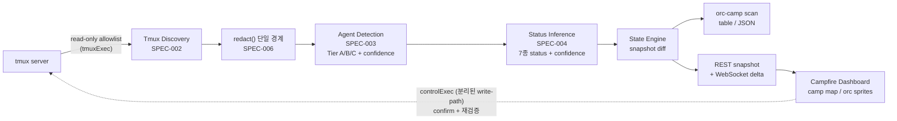

<figure class="post-figure post-figure--header">
<picture>
  <source type="image/webp" srcset="/assets/images/projects/orc-camp-poster-640.webp 640w, /assets/images/projects/orc-camp-poster-1024.webp 1024w, /assets/images/projects/orc-camp-poster-1536.webp 1536w" sizes="(max-width: 800px) 100vw, 760px">
  
</picture>
<figcaption>Orc Camp 메인 포스터 — 캠프파이어 관제 콘솔을 둘러싼 오크들. 작업 중·대기·에러를 알리는 말풍선과 바닥의 버그들까지, 도구의 세계관을 한 장에 담았다.</figcaption>
</figure>

## 프로젝트 소개

**Orc Camp**는 여러 tmux 세션의 pane에서 실행 중인 LLM 코딩 에이전트(Claude Code · Codex 등)를 **한 화면에서 관제**하기 위해 만든 tmux 기반 로컬 CLI 도구다. 저장소는 GitHub에 공개되어 있다.

- 저장소: <https://github.com/hwangjongtaek/orc-camp>

에이전트 여러 개에 작업을 나눠 맡기고 병렬로 돌리다 보면, 터미널 탭과 tmux pane 사이를 계속 순회하게 된다. 어느 에이전트가 일하고 있는지, 어느 놈이 입력을 기다리다 멈춰 있는지, 어느 pane이 에러로 죽었는지를 확인하는 비용이 생각보다 크다. Orc Camp의 기획 문서는 이 문제를 이렇게 정의한다 — "여러 tmux session에서 실행 중인 AI agent 상태를 한눈에 볼 수 없다. 장시간 병렬 작업을 맡긴 뒤 진행 상황을 추적할 lightweight dashboard가 없다."

그래서 `orc-camp`를 실행하면 로컬 서버가 뜨고, 브라우저에 **픽셀 게임풍 대시보드**가 열린다. tmux 세션들이 캠프로 나열되고, 그 안의 에이전트 세션들이 오크 캐릭터로 걸어 다닌다. 유용한 관제 도구인 동시에 보고 있으면 즐거운 화면 — **유용성과 재미를 함께 담는 것**이 이 프로젝트의 정체성이다.

한 가지 원칙은 처음부터 고정했다. **read-only + 로컬 전용 + 프라이버시 우선**이다. tmux를 절대 변경하지 않는 읽기 전용 스캔이 기본이고, 서버는 `127.0.0.1`에만 바인딩되며, 터미널 캡처·명령줄·경로는 전부 redaction을 거친 뒤에만 소비된다. 원문은 파일·로그·JSON 어디에도 저장되지 않는다.

## 핵심 컨셉

Orc Camp의 어휘는 네 개면 충분하다.

| 개념 | 의미 |
| --- | --- |
| **Camp** | tmux session 하나 (프로젝트, 작업 묶음, 실험 단위) |
| **Orc** | pane/window 안에서 실행 중인 AI 에이전트 세션 (Claude Code · Codex · 기타 CLI 에이전트) |
| **Campfire Dashboard** | `orc-camp` 실행 시 열리는 localhost 웹 대시보드 |
| **Prestige Tier** | 누적 LLM 사용량(또는 세션 수명)이 쌓일수록 오크의 외형이 화려해지는 단계 — T0 → T1 → T2 → T3 |

사용자가 tmux로 이미 작업 컨텍스트를 세션 단위로 나누고 있으니, 캠프를 세션에 매핑하는 것이 mental model에 가장 가깝다는 판단이었다(결정 로그 D-002). 캐릭터는 World of Warcraft의 오크들을 무드 레퍼런스로만 삼되, 실제 에셋과 이름은 `orc-claude-storm-shaman`, `orc-codex-field-engineer` 같은 고유 아키타입으로 만들었다(D-010) — 공개 배포를 고려하면 기존 게임 IP와 혼동될 요소는 처음부터 배제해야 했기 때문이다.

이 **dotted orc camp concept**은 사실 이 위키와 뿌리가 같다. 위키의 Warsong Codex 픽셀 RPG 디자인과 Orc Camp의 도트 캠프는 같은 세계관에서 갈라져 나온 두 갈래다.

## 주요 기능

### 읽기 전용 발견과 상태 추론

`orc-camp scan`은 tmux 세션/윈도우/pane 인벤토리를 allowlist 명령(`list-sessions` / `list-windows` / `list-panes` / `capture-pane`)으로만 훑고, 각 pane의 AI 에이전트를 Tier A→B→C 신호(직접 command → wrapper + signature → output 패턴)로 핑거프린팅한다. 상태는 `active` / `waiting` / `idle` / `stale` / `error` / `terminated`(+ `unknown`)의 enum으로 추론하되, **항상 confidence를 함께 반환하고 모호하면 단정하지 않는다**. 추정값은 추정임을 표시한다. `--json`과 `--watch [초]`도 지원해 다른 도구에서 파이프로 쓸 수 있다.

### 로컬 대시보드

기본 실행(`orc-camp`)은 로컬 서버를 띄우고 브라우저를 연다. 서버는 기본 `127.0.0.1` 바인딩 + 1회용 CSPRNG startup token URL로 보호되고, 외부 바인딩은 `--allow-external` 명시 opt-in(+경고)이다. snapshot REST API 위에 WebSocket 실시간 델타가 흐르고, camp 상세에서는 픽셀 camp 맵(공간 배치 · drag-pan)과 orc sprite 상태 애니메이션이 렌더된다. map ↔ terminal 모드를 전환하면 xterm 기반 라이브 pane 스트림으로 실제 터미널을 관전하거나, 명시적 arm/disarm을 거쳐 조종할 수도 있다.

### 프라이버시 우선 redaction

모든 캡처·명령줄·경로·pane 제목은 소비되기 전에 **단일 `redact()` 경계**를 통과한다(D-016). token/key/secret 패턴, URL credential, private key block이 마스킹되고, 원문은 어디에도 영속되지 않는다. secret redaction은 설정으로도 끌 수 없게 floor-lock되어 있다(D-027). 자동 텔레메트리나 원격 전송도 없다.

### Prestige Tier — 일한 만큼 전설이 된다

"더 많이 일한 오크일수록 전설적으로 보인다"는 게임화 보상이다. 누적 LLM 토큰/비용(측정이 어려우면 에이전트 프로세스 uptime으로 폴백)이 임계를 넘을 때마다 갑옷과 장비가 단계적으로 강화된다 — T0 base → T1 → T2 → T3. 판정 우선순위는 `누적 tokens → cost → process uptime → base`이고, 여기서도 모호하면 추측하지 않는다는 원칙이 유지된다.

### 최소 의존성

CLI/서버는 Node 빌트인 + `ws`만 쓴다. 코어 npm 패키지는 코드-only(~250KB)이고, 픽셀 아트 에셋 팩은 별도 optional 패키지 `orc-camp-assets`로 분리되어 있다. 팩이 없어도 대시보드는 placeholder로 동일한 layout/interaction을 유지한다.

## 아키텍처 개요

전체 파이프라인을 한눈에 보면 다음과 같다. 핵심 스펙 문서(SPEC-001 scan CLI, SPEC-002 tmux discovery, SPEC-003 agent detection, SPEC-004 status inference)가 각 단계를 하나씩 소유한다.

읽기 경로와 쓰기 경로가 구조적으로 분리되어 있다는 점이 특징이다. 스캔은 fail-closed allowlist wrapper(`tmuxExec`)를 통해서만 tmux를 호출하고, allowlist 밖 subcommand는 spawn 자체가 거부된다(D-019). 사용자가 명시적으로 실행하는 control action(text input · interrupt)만이 별도의 single-writer `controlExec` 경로로 `send-keys`를 내보내며(D-028), 실행 직전 대상 pane을 다시 검증하고 위험한 액션은 confirm을 요구한다. "read-only는 문서가 아니라 테스트로 강제된다"가 이 프로젝트의 표어 중 하나다.

<figure class="post-figure">
<svg role="img" aria-label="scan 파이프라인: 왼쪽 tmux 서버를 읽기 전용 allowlist(tmuxExec)로 훑은 데이터가 가운데 redact 관문(성문)을 통과해야만 agent detection과 status inference를 거쳐 오른쪽 Campfire Dashboard의 오크 카드(status 뱃지와 confidence 게이지)가 된다. 원문 secret은 관문을 통과하지 못하고, 대시보드에서 tmux로 되돌아가는 쓰기는 아래쪽의 confirm을 거치는 controlExec 단일 경로뿐이다" viewBox="0 0 760 392" xmlns="http://www.w3.org/2000/svg">
  <title>redact() 관문을 중심으로 한 scan 파이프라인과 controlExec 쓰기 경로</title>
  <defs>
    <marker id="ocp-arr" viewBox="0 0 10 10" refX="9" refY="5" markerWidth="7" markerHeight="7" orient="auto-start-reverse">
      <path d="M0,0 L10,5 L0,10 z" fill="currentColor"/>
    </marker>
    <marker id="ocp-arr-w" viewBox="0 0 10 10" refX="9" refY="5" markerWidth="7" markerHeight="7" orient="auto-start-reverse">
      <path d="M0,0 L10,5 L0,10 z" fill="var(--accent-color)"/>
    </marker>
  </defs>

  <!-- tmux 서버 (격자 pane) -->
  <text x="82" y="74" font-size="10.5" font-weight="600" text-anchor="middle" fill="currentColor">tmux server</text>
  <rect x="16" y="84" width="132" height="140" fill="none" stroke="currentColor" stroke-width="2"/>
  <line x1="82" y1="84" x2="82" y2="224" stroke="currentColor" stroke-width="1" opacity="0.5"/>
  <line x1="16" y1="154" x2="148" y2="154" stroke="currentColor" stroke-width="1" opacity="0.5"/>
  <circle cx="72" cy="96" r="3" fill="var(--orc-green)"/>
  <line x1="26" y1="110" x2="66" y2="110" stroke="currentColor" stroke-width="2" opacity="0.35"/>
  <line x1="26" y1="122" x2="56" y2="122" stroke="currentColor" stroke-width="2" opacity="0.35"/>
  <circle cx="138" cy="96" r="3" fill="var(--gold)"/>
  <line x1="92" y1="110" x2="136" y2="110" stroke="currentColor" stroke-width="2" opacity="0.35"/>
  <line x1="92" y1="122" x2="124" y2="122" stroke="currentColor" stroke-width="2" opacity="0.35"/>
  <text x="26" y="176" font-size="10" fill="currentColor" opacity="0.6">$</text>
  <line x1="26" y1="190" x2="60" y2="190" stroke="currentColor" stroke-width="2" opacity="0.35"/>
  <line x1="92" y1="180" x2="132" y2="180" stroke="currentColor" stroke-width="2" opacity="0.35"/>
  <line x1="92" y1="192" x2="116" y2="192" stroke="currentColor" stroke-width="2" opacity="0.35"/>
  <text x="82" y="240" font-size="8" text-anchor="middle" fill="currentColor" opacity="0.6">sessions · windows · panes</text>

  <!-- 읽기 경로: tmuxExec allowlist -->
  <text x="203" y="126" font-size="10" font-weight="600" text-anchor="middle" fill="currentColor">tmuxExec</text>
  <text x="203" y="140" font-size="8.5" text-anchor="middle" fill="currentColor" opacity="0.7">read-only allowlist</text>
  <line x1="148" y1="150" x2="252" y2="150" stroke="currentColor" stroke-width="2" marker-end="url(#ocp-arr)"/>

  <!-- 관문을 통과하지 못하는 원문 secret -->
  <rect x="190" y="192" width="50" height="18" fill="none" stroke="var(--crimson)" stroke-width="1.5"/>
  <text x="215" y="204" font-size="8" text-anchor="middle" fill="var(--crimson)">sk-a1b2…</text>
  <line x1="247" y1="196" x2="257" y2="206" stroke="var(--crimson)" stroke-width="2"/>
  <line x1="257" y1="196" x2="247" y2="206" stroke="var(--crimson)" stroke-width="2"/>
  <text x="215" y="226" font-size="8" text-anchor="middle" fill="currentColor" opacity="0.65">원문 통과 불가</text>

  <!-- redact() 관문 (성벽 + 게이트) -->
  <text x="277" y="42" font-size="12" font-weight="700" text-anchor="middle" fill="var(--accent-color)">redact()</text>
  <rect x="258" y="52" width="38" height="66" fill="currentColor" fill-opacity="0.1" stroke="currentColor" stroke-width="2"/>
  <line x1="258" y1="74" x2="296" y2="74" stroke="currentColor" stroke-width="1" opacity="0.3"/>
  <line x1="258" y1="96" x2="296" y2="96" stroke="currentColor" stroke-width="1" opacity="0.3"/>
  <line x1="271" y1="52" x2="271" y2="74" stroke="currentColor" stroke-width="1" opacity="0.25"/>
  <line x1="283" y1="74" x2="283" y2="96" stroke="currentColor" stroke-width="1" opacity="0.25"/>
  <rect x="258" y="182" width="38" height="70" fill="currentColor" fill-opacity="0.1" stroke="currentColor" stroke-width="2"/>
  <line x1="258" y1="204" x2="296" y2="204" stroke="currentColor" stroke-width="1" opacity="0.3"/>
  <line x1="258" y1="226" x2="296" y2="226" stroke="currentColor" stroke-width="1" opacity="0.3"/>
  <line x1="271" y1="182" x2="271" y2="204" stroke="currentColor" stroke-width="1" opacity="0.25"/>
  <line x1="283" y1="204" x2="283" y2="226" stroke="currentColor" stroke-width="1" opacity="0.25"/>
  <line x1="266" y1="120" x2="266" y2="180" stroke="currentColor" stroke-width="2" stroke-dasharray="5 4" opacity="0.45"/>
  <line x1="277" y1="120" x2="277" y2="180" stroke="currentColor" stroke-width="2" stroke-dasharray="5 4" opacity="0.45"/>
  <line x1="288" y1="120" x2="288" y2="180" stroke="currentColor" stroke-width="2" stroke-dasharray="5 4" opacity="0.45"/>
  <text x="277" y="268" font-size="8.5" text-anchor="middle" fill="currentColor" opacity="0.7">단일 redaction 경계 · secret floor-lock</text>

  <!-- 관문을 통과한 masked 데이터 -->
  <line x1="296" y1="150" x2="358" y2="150" stroke="currentColor" stroke-width="2" marker-end="url(#ocp-arr)"/>
  <g fill="currentColor" shape-rendering="crispEdges">
    <rect x="306" y="142" width="8" height="6"/>
    <rect x="318" y="142" width="8" height="6"/>
    <rect x="330" y="142" width="8" height="6"/>
  </g>
  <text x="324" y="168" font-size="8" text-anchor="middle" fill="currentColor" opacity="0.65">masked</text>

  <!-- Agent Detection → Status Inference -->
  <rect x="360" y="84" width="150" height="58" fill="none" stroke="currentColor" stroke-width="2"/>
  <text x="435" y="106" font-size="10.5" font-weight="600" text-anchor="middle" fill="currentColor">Agent Detection</text>
  <text x="435" y="124" font-size="8.5" text-anchor="middle" fill="currentColor" opacity="0.7">Tier A → B → C 핑거프린트</text>
  <line x1="435" y1="142" x2="435" y2="166" stroke="currentColor" stroke-width="2" marker-end="url(#ocp-arr)"/>
  <rect x="360" y="168" width="150" height="58" fill="none" stroke="currentColor" stroke-width="2"/>
  <text x="435" y="190" font-size="10.5" font-weight="600" text-anchor="middle" fill="currentColor">Status Inference</text>
  <text x="435" y="208" font-size="8.5" text-anchor="middle" fill="currentColor" opacity="0.7">7종 status + confidence</text>
  <line x1="510" y1="197" x2="552" y2="197" stroke="currentColor" stroke-width="2" marker-end="url(#ocp-arr)"/>

  <!-- Campfire Dashboard + 오크 카드 -->
  <rect x="556" y="64" width="190" height="244" fill="none" stroke="currentColor" stroke-width="2.5"/>
  <text x="651" y="82" font-size="10" font-weight="600" text-anchor="middle" fill="currentColor">Campfire Dashboard</text>
  <line x1="564" y1="90" x2="738" y2="90" stroke="currentColor" stroke-width="1" opacity="0.4"/>
  <rect x="570" y="106" width="162" height="132" fill="var(--gold-soft)" stroke="currentColor" stroke-width="1.5"/>
  <g shape-rendering="crispEdges">
    <rect x="587" y="120" width="12" height="9" fill="var(--orc-green)"/>
    <rect x="589" y="123" width="2" height="2" fill="currentColor"/>
    <rect x="595" y="123" width="2" height="2" fill="currentColor"/>
    <rect x="588" y="127" width="2" height="3" fill="var(--bg-panel)"/>
    <rect x="596" y="127" width="2" height="3" fill="var(--bg-panel)"/>
    <rect x="585" y="129" width="16" height="10" fill="var(--orc-green-deep)"/>
    <rect x="585" y="134" width="16" height="3" fill="currentColor" opacity="0.55"/>
    <rect x="588" y="139" width="4" height="6" fill="currentColor" opacity="0.7"/>
    <rect x="594" y="139" width="4" height="6" fill="currentColor" opacity="0.7"/>
  </g>
  <text x="612" y="131" font-size="9.5" font-weight="600" fill="currentColor">storm-shaman</text>
  <text x="612" y="144" font-size="8" fill="currentColor" opacity="0.65">claude-code</text>
  <rect x="612" y="152" width="56" height="17" fill="none" stroke="var(--orc-green)" stroke-width="1.5"/>
  <circle cx="621" cy="160.5" r="3.5" fill="var(--orc-green)"/>
  <text x="630" y="164" font-size="8.5" fill="currentColor">active</text>
  <text x="584" y="196" font-size="8" fill="currentColor" opacity="0.7">confidence 0.85</text>
  <rect x="584" y="202" width="136" height="9" fill="none" stroke="currentColor" stroke-width="1"/>
  <rect x="586" y="204" width="114" height="5" fill="var(--gold)"/>
  <text x="651" y="262" font-size="8.5" text-anchor="middle" fill="currentColor" opacity="0.6">camp map · orc sprites</text>

  <!-- controlExec: 유일한 쓰기 경로 -->
  <g stroke="var(--accent-color)" stroke-width="2.5" fill="none">
    <line x1="651" y1="308" x2="651" y2="352"/>
    <line x1="651" y1="352" x2="460" y2="352"/>
    <line x1="300" y1="352" x2="82" y2="352"/>
    <line x1="82" y1="352" x2="82" y2="232" marker-end="url(#ocp-arr-w)"/>
  </g>
  <rect x="300" y="330" width="160" height="44" fill="none" stroke="var(--accent-color)" stroke-width="2"/>
  <text x="380" y="348" font-size="10.5" font-weight="700" text-anchor="middle" fill="var(--accent-color)">controlExec</text>
  <text x="380" y="364" font-size="8" text-anchor="middle" fill="currentColor" opacity="0.75">single-writer · confirm + pane 재검증</text>
  <text x="170" y="344" font-size="8.5" text-anchor="middle" fill="var(--accent-color)">유일한 쓰기 경로 (send-keys)</text>
</svg>
<figcaption>모든 캡처·명령줄은 redact() 관문을 지나야만 오크 카드가 되고, tmux로 되돌아가는 쓰기는 confirm을 거치는 controlExec 단일 경로뿐이다.</figcaption>
</figure>

## 개발 여정

이 프로젝트는 코드보다 문서가 먼저였다. `docs/product/`(기획 · 요구사항 · 로드맵 · 결정 로그), `docs/design/`(아키텍처 · UX), `docs/specs/`(구현 계약 SSOT), `docs/assets/`(에셋 파이프라인)가 골격이고, 실제 개발 여정이 그 안에 결정 로그(D-001 ~ D-054)로 남아 있다.

### 기획과 청사진 (2026-06-25)

첫날 결정 로그에 이름(D-001 "제품명은 Orc Camp"), 도메인 모델(D-002 "tmux session = Camp"), 경계(D-003 "MVP는 local-first dashboard로 제한")가 박혔다. 문제 정의 → 제품 가설 → 타깃 사용자 → 성공 지표 → **비목표**(tmux를 대체하지 않는다, 에이전트를 새로 만들지 않는다, remote/cloud는 MVP에서 제외)까지 기획 문서에서 먼저 고정하고, 로드맵은 Discovery Prototype부터 Packaging까지 Milestone 0~5로 나눴다.

### 가장 얇은 수직 슬라이스 — scan PoC (2026-06-26)

설계가 끝나고 처음 만든 것은 대시보드가 아니라 **`orc-camp scan` CLI 하나**였다(D-012). 이유가 명확했다 — 이 제품의 가장 큰 미검증 리스크는 "AI agent 상태 추론 정확도"이고, detection이 부정확하면 예쁜 대시보드는 *잘못된 상태를 더 그럴듯하게 보여줄 뿐*이기 때문이다. 서버도 UI도 에셋도 없이, tmux 발견 + agent 탐지 + 상태 추론 + stdout 출력만으로 핵심 가설을 검증했다. 이때 산출된 camp/orc 도메인 모델과 데이터 계약(SPEC-005)을 이후 모든 슬라이스가 그대로 재사용했다.

수용 기준도 정량으로 미리 박아 두었다. agent detection precision ≥ 0.9, `waiting` recall ≥ 0.7, 20 pane 기준 scan latency p95 < 1s 같은 지표가 PoC 판정 기준이었다.

### Spec을 SSOT로 — 전체 제품 게이트 (2026-06-27 ~ 07-03)

이후 개발은 `docs/specs/`의 SPEC-000 ~ SPEC-900을 구현의 단일 진실 공급원으로 삼아 진행됐다. "코드를 수정하기 전 spec을 확인하고, 구현이 달라지면 spec을 먼저 갱신한다"는 규칙과 함께, spec-reviewer/도메인 리뷰 게이트를 통과해야 `approved`로 승격되고 구현에 착수하는 워크플로였다.

결정 로그에서 인상적이었던 것 몇 개를 꼽아 본다.

- **D-016 / D-019 — 불변식은 구조로 강제한다.** redaction은 단일 chokepoint에서만, tmux 호출은 fail-closed allowlist wrapper를 통해서만. 둘 다 "조심하자"가 아니라 코드 구조와 테스트로 강제되는 계약이다.
- **D-048 — allowlist가 리뷰에서 실증적으로 깨진 사건.** 저지연 스트리밍을 위한 tmux control-mode 브리지 초안은 `refresh-client`·`capture-pane` 정도를 허용하는 verb 단위 allowlist였다. 그런데 도메인 리뷰가 tmux 3.6b에서 `refresh-client -C 80x24`가 실제 window를 200×50 → 80×24로 **resize해 버리는 것**(read-only 위반)과, 브리지가 발행한 `capture-pane` 산출이 redaction chokepoint를 **우회하는 것**을 실증했다. 결론은 극단적이었다 — 브리지의 명령 allowlist를 **빈 집합(∅)**으로 고정하고, stdin을 열어둔 attach만으로 `%output` 이벤트를 dirty-signal로 소비하며, 실제 프레임은 기존 검증된 폴링 경로로만 만든다(D-047). 위협 표면을 줄이는 최선의 방법은 표면을 0으로 만드는 것이었다.
- **D-039 / D-040 — 실측이 설계를 고친다.** Prestige tier의 근거인 누적 토큰은 에이전트 세션 로그에서 읽는데, 이 로그는 대화 원문·secret을 담는 민감한 read surface다. 그래서 parser가 **닫힌 집합의 집계 스칼라 4개만** 추출하고 transcript 내용은 구조적으로 건너뛰는 data-minimization 계약(SPEC-008)을 먼저 세웠다. 그런데 라이브 측정에서 28개 orc 중 3개만 토큰이 상관됐다(세션 파일이 여럿이면 추측하지 않고 null로 두는 원칙 때문). 결국 판정 축을 `tokens → cost → process uptime` 다중 신호 폴백으로 확장하고, 임계값도 실측에 맞춰 보정했다(초기 1M/5M/20M 토큰 → 100k/500k/2M).
- **D-013 — 문서가 아니라 전달본이 SSOT.** 초기 에셋 문서는 64×64 spritesheet를 가정했지만 실제 전달본은 232×232 개별 frame PNG · 8방향 구조였다. 옛 가정을 폐기하고 `manifest.json`을 source of truth로 선언해 문서-산출물 불일치를 정리했다.

### 도트 에셋 파이프라인 — PixelLab (2026-06-25 ~ )

픽셀 아트는 PixelLab.ai로 생성했다. 처음부터 "보기 좋은 이미지 묶음"이 아니라 **재생성 가능하고 runtime에 매핑 가능한 asset pack**을 요구사항으로 걸었다(D-009) — `manifest.json`(frame size, anchor, FPS, state 매핑, reduced-motion fallback), `palette.json`, 생성 prompt/seed, license 문서까지 포함해서다.

최종 팩에는 5종 캐릭터(`orc-high-warchief-mascot` · `orc-claude-storm-shaman` · `orc-codex-field-engineer` · `orc-unknown` · `orc-iron-commander`)가 8방향 · 상태별(idle/roaming/active/waiting/error/stale) 애니메이션으로 담겼고, 상태 오버레이 아이콘(active-spark, waiting-bubble, error-burst 등), 지형 타일, 테마 배경들이 함께 들어갔다. `agentType → character` 매핑으로 Claude Code pane은 storm shaman이, Codex pane은 field engineer가 된다.

라이선스는 처음엔 미확정(TBD)이어서, 확정 전까지는 published npm artifact에 에셋 PNG 0개를 **테스트 가능한 release gate**로 강제했다(D-032). 2026-07-19 PixelLab 유료 플랜의 상업 사용·재배포 허용이 확정되자(D-054), 에셋을 코어에 합치는 대신 별도 optional 패키지 `orc-camp-assets`로 배포했다 — 팩이 ~106MB · PNG 3,918개라 코어에 넣으면 모든 설치가 무거워지기 때문이다.

### 릴리스 — v0.1.0과 v0.2.0 (2026-07-18 ~ 07-19)

기획 첫 문서로부터 약 3주 뒤인 2026-07-18에 **v0.1.0 첫 공개 릴리스**가 나왔다. read-only 발견 + 상태 추론, 로컬 대시보드 서버, Campfire SPA, Terminal Workspace, 제어 액션, broadcast, redaction, doctor 진단, 단일 self-contained 패키징까지 담겼다. 다음 날 v0.2.0에서 에셋 서빙(`/asset-pack/*`)과 `orc-camp-assets` 분리 패키지가 추가됐다.

## 배운 것 / 회고

- **가장 큰 리스크를 가장 얇은 슬라이스로 먼저 검증한다.** dashboard polish보다 detection 정확도가 먼저였고, 그 순서 덕분에 이후 모든 슬라이스가 검증된 도메인 모델 위에 쌓였다.
- **불변식은 문서가 아니라 구조와 테스트로 강제해야 한다.** "read-only를 지키자"는 다짐은 리뷰 한 번에 깨질 수 있다(D-048의 `refresh-client -C` resize 실증이 정확히 그 사례다). allowlist wrapper, 단일 redaction chokepoint, single-writer control 경로처럼 위반이 컴파일/테스트 단계에서 걸리는 구조가 답이었다.
- **모호하면 단정하지 않는다는 원칙은 여러 층에서 반복된다.** 상태 추론의 confidence, unknown 에이전트 처리, 세션 로그 상관에서의 "추측 금지"까지 — 관제 도구의 신뢰는 정확히 아는 것과 모르는 것을 구분하는 데서 나온다.
- **실측 없는 임계값은 가설일 뿐이다.** spec마다 "확정 사양"과 "PoC로 보정할 가설"을 구분 표기했고, prestige 임계값과 uptime 폴백은 실제로 라이브 측정 후 크게 수정됐다.
- **schema-first는 점진 도입을 가능하게 한다.** 에셋·usage 데이터가 없어도 placeholder와 null로 항상 안전하게 동작하도록 먼저 계약을 고정해 두니, 자산과 데이터를 나중에 끼워 넣는 일이 위험하지 않았다.

## 마무리

Orc Camp는 "여러 에이전트를 굴리는 개발자의 관제 문제"라는 실용적인 목표와 "내 캠프의 오크들이 일하는 걸 구경하는 재미"라는 장난기를 한 몸에 담으려는 실험이다. 이 위키의 픽셀 디자인과 같은 뿌리에서 나온 만큼, 앞으로의 진화도 여기에 기록해 나갈 예정이다.

- 저장소: <https://github.com/hwangjongtaek/orc-camp>

### 관련 포스트

- [tmux 안의 Claude Code 함대를 지휘하기 — craftzdog의 tmux-claude-session-manager](/2026/07/11/tmux-claude-session-manager.html) — 같은 문제 공간(여러 Claude Code 세션의 상태 관제)을 셸 스크립트 + fzf로 푼 도구 분석. Orc Camp와 접근을 비교해 보면 재미있다.
- [Codex의 agent loop를 펼쳐 보기: 하니스가 LLM을 부리는 방식](/2026/06/25/codex-agent-loop.html) — Orc Camp가 관찰하는 대상인 코딩 에이전트 하니스의 내부 동작.
