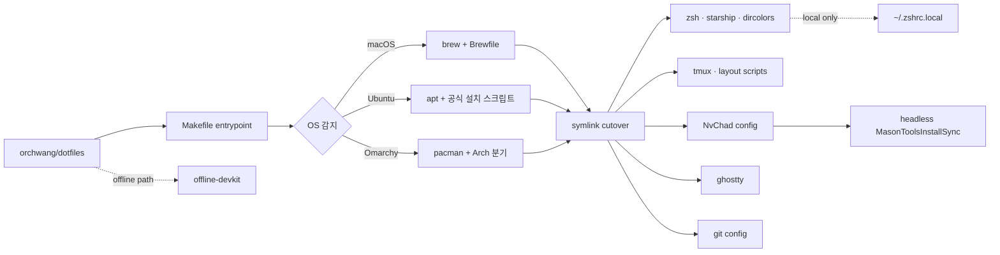

## 프로젝트 소개

**[orchwang/dotfiles](https://github.com/orchwang/dotfiles)**는 내가 매일 쓰는 터미널 개발 환경을 코드로 관리하는 저장소다. 겉으로 보면 `zsh`, `tmux`, `nvim`, `git`, `ghostty` 설정을 모아 둔 평범한 dotfiles repo처럼 보이지만, 실제 성격은 조금 다르다. 이 저장소의 목표는 단순히 설정 파일을 백업하는 것이 아니라, **macOS·Ubuntu·Omarchy(Arch Linux) 어디서든 같은 작업 감각을 재현하는 개발 작업장**을 만드는 데 있다.

개인 dotfiles를 오래 운영하는 이유도 여기 있다. 좋은 dotfiles는 "내 취향을 과시하는 설정집"이 아니라 **작업 컨텍스트를 복구하는 장치**다. 새 맥북을 꺼냈을 때, 서버에 급히 붙었을 때, 인터넷이 제한된 환경으로 들어갔을 때, 다시 손에 익은 셸·에디터·터미널·키 흐름을 최대한 빨리 되찾게 해 준다. 개발자에게 생산성은 IDE 기능 몇 개보다도 **매일 반복하는 손동작과 피드백 루프의 안정성**에서 더 많이 나온다.

이 저장소는 그 점에서 꽤 야심차다. `make install` 한 번으로 OS를 감지해 설치 경로를 갈라 타고, symlink를 정리하고, Neovim 플러그인과 Mason 도구까지 headless로 부팅한다. 심지어 `offline-devkit/`은 인터넷도 편집기도 없는 Ubuntu 24+ 환경에 이 작업장을 거의 그대로 옮겨 놓기 위한 오프라인 번들까지 만든다. dotfiles가 아니라 작은 **developer workstation product**에 가깝다.

## 개인 dotfiles를 운영하는 효용

개인 dotfiles 운영의 효용은 생각보다 단순하다. **환경을 기억에 의존하지 않게 만드는 것**이다.

### 1. 재현성 — 설치 순서를 머릿속에서 빼낸다

환경을 수동으로 세팅하면 항상 "이 다음에 뭐였지?"가 생긴다. Homebrew를 먼저 깔아야 하는지, `nvim`과 `tmux` 중 무엇을 먼저 설치해야 하는지, Python·Rust·Go 툴체인을 어떤 순서로 맞춰야 하는지, LSP/DAP는 최초 실행 때 어떤 명령을 돌려야 하는지 같은 자잘한 순서 의존성이 쌓인다.

이 저장소는 그 순서를 `Makefile`로 고정한다. macOS에서는 Xcode CLI tools → Homebrew → Brewfile → Neovim → Rust → Go packages → tmux plugins → symlink → headless Neovim bootstrap 순으로 흐르고, Ubuntu와 Omarchy에서는 각 배포판에 맞는 패키지 설치 경로로 자동 분기한다. 개발 환경 셋업을 문서가 아니라 **실행 가능한 절차**로 관리하는 셈이다.

### 2. 복구성 — 기기 교체와 서버 접속의 비용을 낮춘다

환경을 코드로 관리하지 않으면 새 기기를 만날 때마다 예전 손맛을 복원하는 데 며칠이 든다. 반대로 dotfiles가 잘 관리되면 새 장비는 프로젝트가 아니라 **배포 대상**이 된다.

특히 이 저장소에서 인상적인 부분은 "새 환경에 안전하게 덮어씌우는 법"까지 같이 다룬다는 점이다. 기존 `~/.zshrc`는 백업하고 필요하면 `~/.zshrc.local`로 이관하며, XDG 경로의 tmux 설정이 `~/.tmux.conf`를 그림자처럼 가리는 문제도 감지해서 치워 준다. 잘 만든 dotfiles는 새로 설치하는 능력만큼 **기존 환경을 망가뜨리지 않는 cutover**가 중요하다.

### 3. workflow as code — 습관을 설정이 아니라 시스템으로 만든다

dotfiles는 단순한 preference 저장소가 아니다. 자주 반복하는 동작을 시스템 레벨의 기본값으로 끌어올리는 장치다.

예를 들어 이 저장소에서 `tmux`는 그냥 multiplexer가 아니다. pane label, popup scratch terminal, 50|25|25 컬럼 복구, 현재 컬럼만 균등 재분배하는 단축키, Claude 세션 관리 플러그인까지 포함한 **작업장 orchestration layer**다. `nvim`도 단순 편집기가 아니라 Python·JS/TS·Go·Rust 개발에 필요한 LSP, formatter, debugger, lazygit 연동이 붙은 작업 표면이다. 익숙한 손동작을 매번 다시 만들지 않고, 기계가 먼저 준비해 놓게 한다.

### 4. 공유 설정과 개인 비밀을 분리한다

개인 dotfiles를 운영하다 보면 가장 쉽게 망가지는 지점이 secret 처리다. 토큰, SSH agent, private registry 설정을 전부 repo에 넣기 시작하면 재현성은 얻어도 안전성을 잃는다.

이 저장소는 그 경계를 명확히 긋는다. 공용 셸 설정은 `zsh/.zshrc`에 두고, 토큰·SSH agent·machine-specific 설정은 git-ignored인 `~/.zshrc.local`에 분리한다. 즉 "반복 가능한 기본 작업장"과 "각 장비의 비공개 상태"를 섞지 않는다. dotfiles의 품질은 화려한 alias보다 이런 **경계 관리**에서 갈린다.

## 저장소 구성

저장소 구조를 보면 무엇을 중요하게 여기는지 바로 드러난다.

| 구성 | 역할 | 왜 중요한가 |
| --- | --- | --- |
| `zsh/`, `starship/`, `dircolors/` | 셸, 프롬프트, 색상 규칙 | 매일 가장 오래 만지는 표면을 일정하게 만든다 |
| `nvim/` | NvChad 기반 Neovim 설정, LSP/DAP/formatter 구성 | Python 백엔드 중심 개발을 빠른 피드백 루프로 묶는다 |
| `tmux/` | pane label, popup scratch, 레이아웃 스크립트, Claude 세션 관리 | 멀티 프로젝트·멀티 에이전트 작업을 운영 가능한 형태로 만든다 |
| `git/` | `nvimdiff`, alias, 조건부 회사 계정 include | 코드 리뷰와 브랜치 작업 흐름을 터미널 쪽으로 당긴다 |
| `ghostty/` | 블록 커서, 비깜빡임, padding, keybind | 화면 자체를 키보드 중심 작업에 맞춘다 |
| `brewfiles/`, `packages/`, `Makefile` | macOS/Ubuntu/Omarchy 패키지 설치 자동화 | 환경 구축을 문서가 아니라 명령으로 만든다 |
| `offline-devkit/` | airgapped Ubuntu용 오프라인 개발 번들 | 인터넷 없는 환경에서도 작업장을 복제한다 |
| `.claude/skills/`, `specs/` | AI 에이전트 작업 지식과 변경 스펙 | 환경 구성도 AI Native / spec-driven 방식으로 다룬다 |

특히 눈에 띄는 건 이 repo가 **OS별 차이를 억지로 숨기지 않는다**는 점이다. macOS는 Brew, Ubuntu는 `apt + 공식 설치 스크립트`, Omarchy는 `pacman`으로 가고, Arch에서는 partial upgrade 위험을 피하려고 `pacman -Syu`를 먼저 수행한다. "어디서나 똑같이 보이는 설치기"보다 **각 플랫폼의 현실에 맞는 boring한 경로**를 택한 것이다.

또 한 가지는 `nvim` 쪽의 세밀함이다. Neovim은 `v0.11.6`으로 pin되어 있다. 이유도 명확하다. `0.12+`가 이 구성의 `nvim-treesitter` 경로를 깨기 때문이다. 대단한 혁신은 아니지만, 개인 환경을 오래 굴릴 때 이런 보수적 pinning이 훨씬 중요하다. 최신이 아니라 **안정적으로 손에 붙는 버전**이 정답인 경우가 많다.

## 아키텍처 개요

이 저장소의 핵심 파이프라인은 아래처럼 읽을 수 있다.

핵심은 세 가지다.

첫째, **설치와 연결을 분리**한다. 패키지 설치는 OS별로 다르게 가고, 실제 사용자 환경에 붙이는 단계는 `link` 타깃이 맡는다. 둘째, **cutover가 안전 지향**이다. 기존 셸 설정과 tmux shadow config를 백업한 뒤 연결한다. 셋째, **에디터 부팅까지 자동화**한다. `nvim` config만 링크해 두고 "나머지는 첫 실행 때 알아서"에 맡기지 않고, `MasonToolsInstallSync`를 headless로 실행해 LSP/DAP 도구 설치까지 마친다.

이 구조 덕분에 dotfiles repo가 흔히 빠지는 함정, 즉 "설정 파일은 복원됐는데 실제 도구는 절반만 깔린 상태"를 피한다. 설정 복원과 실행 가능 상태 사이의 틈을 줄인 것이다.

## CV가 그대로 묻어나는 구성의 특징

이 저장소를 [CV](/pages/cv.html)와 함께 보면 더 재미있다. CV의 문장들이 추상적인 자기소개에 그치지 않고, dotfiles 구성에서 꽤 직접적으로 읽힌다.

### Python 백엔드 엔지니어의 작업 표면

CV의 첫 줄은 "11년차 Python 백엔드 엔지니어"다. 이 repo의 `nvim` 구성을 보면 그 문장이 그냥 슬로건이 아니라는 걸 바로 알 수 있다. Python에는 `pyright`, `ruff`, `ruff_format`, `debugpy`, `venv-selector.nvim`이 붙어 있고, 프로젝트별 가상환경을 다시 선택하고 복원하는 흐름까지 잡혀 있다.

검색 전략도 Python 백엔드 실무에 맞다. 기본 검색은 `.gitignore`를 존중하고, 전체 검색만 별도 키맵으로 분리한다. `.venv`, `node_modules`, `target` 같은 거대한 디렉터리 때문에 Telescope가 타이핑 지연을 일으키는 문제를 실제로 겪어 본 사람이 아니면 잘 나오지 않는 구성이다. "에디터 예쁘게 꾸미기"보다 **대형 실무 저장소에서 느려지지 않는 것**을 우선한 셈이다.

### HHKB & NeoVim이라는 자기소개를 진짜 환경으로 만든다

CV subtitle이 아예 "Python Backend Engineer | HHKB & NeoVim"이다. 이 repo는 그 취향을 매우 정직하게 구현한다.

`tmux` prefix를 `C-b`에서 `C-a`로 바꾸고, `M-Left/Right/Up/Down`으로 pane을 이동하고, `prefix + Enter`로 세션별 popup scratch terminal을 열고, Ghostty에서는 block cursor·비깜빡임·mouse-hide-while-typing을 켠다. `nvim` 안에서는 `;`를 `:`로 바꾸고, `jk`로 insert 모드를 빠져나오고, `hop.nvim`, `lazygit` float, DAP function key를 묶는다. 즉 HHKB와 NeoVim이라는 취향이 단순 소비재 취향이 아니라 **키보드 중심 입력 체계 전체**로 이어진다.

### AI Native Engineering이 tmux와 .claude에 스며 있다

CV에는 AI Native Engineering, Harness Engineering, Claude Code, Codex가 핵심 역량과 성과로 적혀 있다. 이 dotfiles repo는 그 관점이 로컬 작업장까지 내려온 사례다.

`tmux` 설정에는 `craftzdog/tmux-claude-session-manager`가 들어 있고, pane 위 status line에 label을 박아 여러 에이전트를 구분하게 하며, `tmux-layout` 스크립트는 왼쪽 50%에 `nvim`, 오른쪽에는 `agent-1`, `agent-2`, `agent-3`, `lazygit`, `shell`을 배치하는 세션을 만든다. 말 그대로 **에이전트를 함께 쓰는 개발자용 tmux 작업장**이다.

여기에 `.claude/skills/apply-dotfiles`와 `offline-devkit` 관련 skill이 저장소 안에 함께 들어 있다는 점도 중요하다. 환경을 사람 손으로만 설명하지 않고, AI 에이전트가 읽고 실행 절차를 따를 수 있는 형태로도 같이 패키징한다. 개발 환경 관리 자체를 이미 **agent-compatible knowledge**로 다루고 있는 셈이다.

### 인프라 운영 경험이 만든 cross-platform·offline 감각

CV에는 Kubernetes, CNPG, Terraform, Docs as Code, MLOps/LLMOps 같은 인프라·플랫폼 성격의 경험이 강하게 적혀 있다. 이 저장소가 단순한 Mac setup이 아니라 macOS·Ubuntu·Omarchy를 모두 겨냥하고, 심지어 airgapped Ubuntu에 오프라인으로 배포 가능한 `offline-devkit`까지 제공하는 이유도 그 연장선으로 읽힌다.

특히 `offline-devkit`은 단순 캐시 모음이 아니다. 온라인 빌드 머신에서 패키지와 바이너리를 미리 가져오고, Neovim plugin·Mason·Treesitter까지 prewarm한 뒤, 오프라인 타깃에서는 압축만 풀어 바로 `nvim`이 동작하게 만든다. 개인 dotfiles repo에서 여기까지 가는 경우는 드물다. 이건 취향 저장소라기보다 **개발자용 배포판**에 가깝다.

## 배운 것 / 회고

이 저장소를 보며 다시 확인하게 되는 건 세 가지다.

첫째, **좋은 dotfiles는 cleverness보다 recovery를 우선한다.** 화려한 one-liner alias보다 새 장비를 받았을 때 얼마나 빨리 원래 속도로 돌아오는지가 더 중요하다.

둘째, **개인 취향도 구조로 관리해야 오래 간다.** `~/.zshrc.local` 분리, tmux shadow config 백업, Neovim 버전 pinning, 기본 검색과 전체 검색 분리처럼, 오래 가는 환경은 대부분 "멋진 해킹"보다 작은 경계 설계에서 나온다.

셋째, **dotfiles는 결국 일하는 방식의 압축본**이다. 내가 어떤 언어를 주력으로 쓰는지, 코드를 어떻게 탐색하는지, 어떤 피드백 루프를 선호하는지, AI 에이전트를 어디까지 로컬 워크플로우에 통합했는지, 심지어 새 기기와 폐쇄망 환경을 얼마나 자주 의식하는지까지 저장소 구조에 그대로 남는다.

그래서 개인 dotfiles를 운영한다는 건 설정 몇 개를 공유하는 일이 아니다. 자기 작업 방식을 조금씩 코드로 굳혀 가는 일이다.

## 마무리

`orchwang/dotfiles`는 "내가 좋아하는 도구 모음"이라기보다 **내가 어떻게 일하고 싶은지에 대한 선언문**에 더 가깝다. Python 백엔드 중심의 실무, HHKB와 NeoVim 기반의 키보드 워크플로우, tmux 위의 멀티 에이전트 작업, 그리고 어떤 장비에서도 다시 같은 감각을 복구하려는 인프라적 집착이 한 저장소 안에 모여 있다.

개인 dotfiles를 운영하는 가장 큰 효용은 결국 여기에 있다. 환경을 취향으로 남겨 두지 않고, 다시 설치 가능하고 다시 설명 가능하고 다시 실행 가능한 **작업 시스템**으로 바꾸는 것.

- 저장소: <https://github.com/orchwang/dotfiles>
- CV: [Jongtaek Hwang CV](/pages/cv.html)

### 관련 포스트

- [tmux 안의 Claude Code 함대를 지휘하기 — craftzdog의 tmux-claude-session-manager](/2026/07/11/tmux-claude-session-manager.html) — 이 dotfiles의 tmux 플러그인 선택이 겨냥하는 문제 공간을 자세히 정리한 글.
- [Orc Camp: tmux 위의 코딩 에이전트들을 픽셀 캠프로 관제하기](/2026/07/19/orc-camp-tmux-agent-dashboard.html) — tmux 위 에이전트 관제라는 문제를 더 본격적인 로컬 도구로 확장한 프로젝트 소개.
- [Codex의 agent loop를 펼쳐 보기: 하니스가 LLM을 부리는 방식 (OpenAI, Michael Bolin)](/2026/06/25/codex-agent-loop.html) — 이 저장소의 AI Native / harness engineering 취향이 어떤 맥락에서 나오는지 연결해 읽기 좋다.
