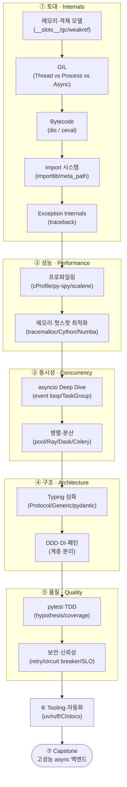
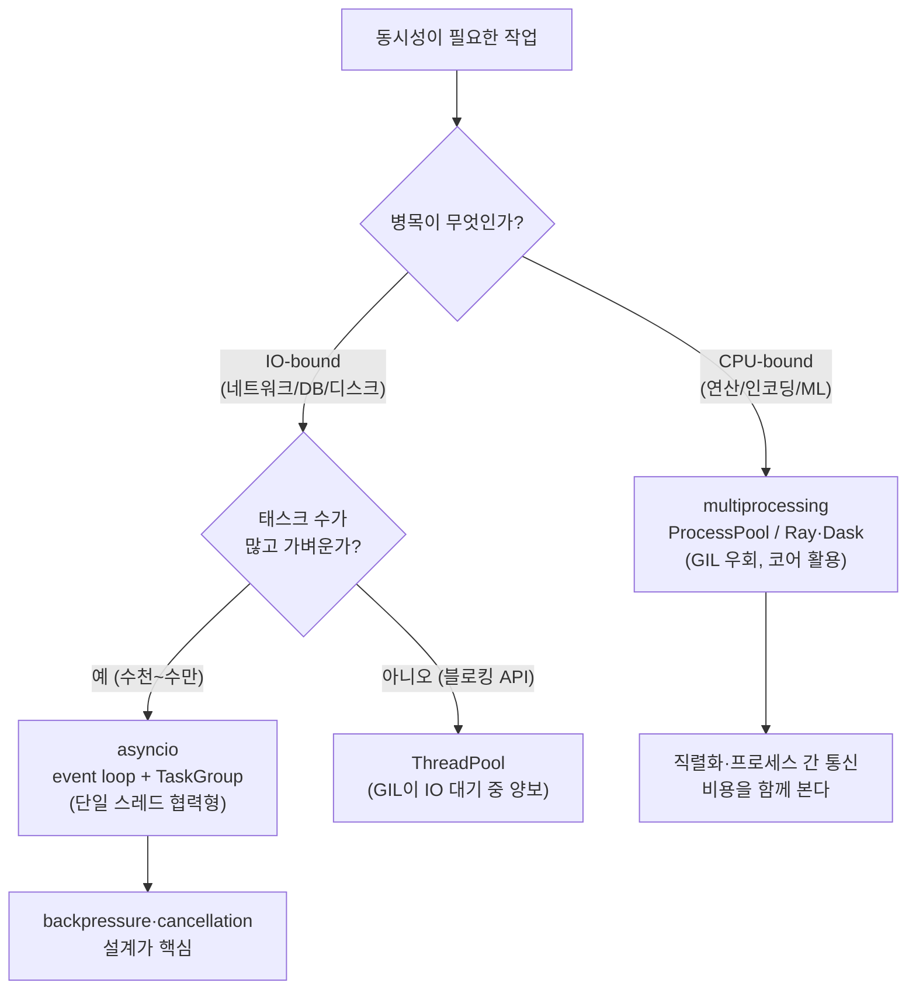

<figure class="post-figure post-figure--header">
<svg role="img" aria-label="Python 심화 역량 커리큘럼을 한 장에 담은 그림. 왼쪽 아래의 인터프리터 내부 톱니바퀴에서 출발해, 메모리·GIL·바이트코드·임포트라는 내부 메커니즘 토대를 딛고, 성능 프로파일링과 비동기 동시성을 거쳐, 타입·아키텍처와 테스트 품질을 지나, 맨 위 기술 리더의 시스템 품질 정상으로 한 단씩 올라가는 여덟 계단의 등반으로 표현된다. 오른쪽 위에는 깃발이 꽂힌 정상이 있다." viewBox="0 0 680 300" xmlns="http://www.w3.org/2000/svg">
  <title>Python 심화 역량 — 인터프리터 내부에서 시스템 품질 정상까지, 여덟 단계의 등반</title>

  <!-- ground line -->
  <line x1="24" y1="266" x2="656" y2="266" stroke="currentColor" stroke-width="1.5" opacity="0.3"/>

  <!-- ===== LEFT: interpreter internals (the foundation, gears) ===== -->
  <g stroke="currentColor" fill="none">
    <circle cx="70" cy="232" r="26" stroke-width="2.5"/>
    <circle cx="70" cy="232" r="9" stroke-width="2"/>
    <g stroke-width="2.5">
      <line x1="70" y1="200" x2="70" y2="210"/>
      <line x1="70" y1="254" x2="70" y2="264"/>
      <line x1="38" y1="232" x2="48" y2="232"/>
      <line x1="92" y1="232" x2="102" y2="232"/>
      <line x1="47" y1="209" x2="54" y2="216"/>
      <line x1="86" y1="248" x2="93" y2="255"/>
      <line x1="93" y1="209" x2="86" y2="216"/>
      <line x1="54" y1="248" x2="47" y2="255"/>
    </g>
  </g>
  <circle cx="118" cy="240" r="14" fill="none" stroke="var(--secondary-color)" stroke-width="2"/>
  <circle cx="118" cy="240" r="5" fill="none" stroke="var(--secondary-color)" stroke-width="1.8"/>
  <text x="84" y="290" text-anchor="middle" font-size="10" fill="currentColor" font-weight="700" opacity="0.85">인터프리터 내부 (토대)</text>

  <!-- ===== STAIRCASE: 8 stages, each a step higher ===== -->
  <!-- step geometry: x grows right, y shrinks (climbs). w=58 per step -->
  <g font-weight="700">
    <!-- step 1 -->
    <rect x="150" y="222" width="62" height="40" rx="3" fill="var(--bg-light)" stroke="currentColor" stroke-width="1.8"/>
    <text x="181" y="240" text-anchor="middle" font-size="13" fill="currentColor">1</text>
    <text x="181" y="254" text-anchor="middle" font-size="8" fill="currentColor" opacity="0.85">Internals</text>
    <!-- step 2 -->
    <rect x="212" y="200" width="62" height="62" rx="3" fill="var(--bg-light)" stroke="currentColor" stroke-width="1.8"/>
    <text x="243" y="218" text-anchor="middle" font-size="13" fill="currentColor">2</text>
    <text x="243" y="232" text-anchor="middle" font-size="8" fill="currentColor" opacity="0.85">Profiling</text>
    <!-- step 3 -->
    <rect x="274" y="178" width="62" height="84" rx="3" fill="var(--bg-light)" stroke="currentColor" stroke-width="1.8"/>
    <text x="305" y="196" text-anchor="middle" font-size="13" fill="currentColor">3</text>
    <text x="305" y="210" text-anchor="middle" font-size="8" fill="currentColor" opacity="0.85">Async</text>
    <!-- step 4 -->
    <rect x="336" y="156" width="62" height="106" rx="3" fill="var(--bg-light)" stroke="currentColor" stroke-width="1.8"/>
    <text x="367" y="174" text-anchor="middle" font-size="13" fill="currentColor">4</text>
    <text x="367" y="188" text-anchor="middle" font-size="8" fill="currentColor" opacity="0.85">Typing</text>
    <!-- step 5 -->
    <rect x="398" y="134" width="62" height="128" rx="3" fill="var(--bg-light)" stroke="currentColor" stroke-width="1.8"/>
    <text x="429" y="152" text-anchor="middle" font-size="13" fill="currentColor">5</text>
    <text x="429" y="166" text-anchor="middle" font-size="8" fill="currentColor" opacity="0.85">Testing</text>
    <!-- step 6 -->
    <rect x="460" y="112" width="62" height="150" rx="3" fill="var(--bg-light)" stroke="var(--accent-color)" stroke-width="2"/>
    <text x="491" y="130" text-anchor="middle" font-size="13" fill="currentColor">6</text>
    <text x="491" y="144" text-anchor="middle" font-size="8" fill="currentColor" opacity="0.85">Reliability</text>
    <!-- step 7 -->
    <rect x="522" y="90" width="62" height="172" rx="3" fill="var(--bg-light)" stroke="var(--accent-color)" stroke-width="2"/>
    <text x="553" y="108" text-anchor="middle" font-size="13" fill="currentColor">7</text>
    <text x="553" y="122" text-anchor="middle" font-size="8" fill="currentColor" opacity="0.85">Tooling</text>
    <!-- step 8 (summit) -->
    <rect x="584" y="68" width="62" height="194" rx="3" fill="var(--bg-panel)" stroke="var(--gold)" stroke-width="2.5"/>
    <text x="615" y="100" text-anchor="middle" font-size="13" fill="currentColor">8</text>
    <text x="615" y="114" text-anchor="middle" font-size="8" fill="currentColor" opacity="0.85">Capstone</text>
  </g>

  <!-- summit flag -->
  <line x1="615" y1="68" x2="615" y2="40" stroke="var(--gold)" stroke-width="2.5"/>
  <path d="M615,42 L640,49 L615,56 z" fill="var(--accent-color)"/>

  <!-- climbing arrow tracing the stair edge -->
  <path d="M150,222 L212,200 L274,178 L336,156 L398,134 L460,112 L522,90 L584,68"
        fill="none" stroke="var(--secondary-color)" stroke-width="2.5"
        stroke-linecap="round" stroke-linejoin="round" marker-end="url(#climb-arrow)" opacity="0.9"/>

  <!-- top label -->
  <text x="615" y="290" text-anchor="middle" font-size="10" fill="currentColor" font-weight="700" opacity="0.85">시스템 품질 정상</text>

  <defs>
    <marker id="climb-arrow" markerWidth="9" markerHeight="9" refX="6" refY="4.5" orient="auto">
      <path d="M0,0 L9,4.5 L0,9 z" fill="var(--secondary-color)"/>
    </marker>
  </defs>
</svg>
<figcaption>이 커리큘럼의 한 장 요약 — <strong>인터프리터 내부</strong>(메모리·GIL·바이트코드·임포트)라는 토대 위에서, Internals → Profiling → Async → Typing → Testing → Reliability → Tooling → Capstone의 <strong>여덟 계단</strong>을 한 단씩 올라 "코드" 중심에서 "시스템 품질" 중심으로 사고를 전환하는 등반.</figcaption>
</figure>

아래는 10년차 백엔드 엔지니어 / Lead급 개발자가 갖춰야 할 "Python 심화 역량 커리큘럼" 입니다.

단순한 문법 학습이 아니라,
실제 대규모 시스템 운영, 성능 최적화, 내부 구조 이해, 코드 품질과 생산성 향상까지
"실무 고급 엔지니어링 관점"으로 구성했습니다.

## 🧠 Python Advanced Competency Curriculum

(10년차 백엔드 엔지니어용 — 실전 중심 심화 커리큘럼)

### 🗺️ 한눈에 보기 — 전체 학습 경로

여덟 영역은 따로 노는 주제 목록이 아니라 하나의 척추로 이어집니다. **언어 내부 이해**가 토대가 되어 성능과 동시성을 떠받치고, 그 위에 **구조와 품질**이 쌓여, 마지막에 **실무 캡스톤**으로 수렴합니다.

이 글의 §1~§8은 위 경로를 순서대로 펼친 것입니다. 아래 "권장 학습 순서"의 6개월 로드맵도 같은 척추를 따라갑니다.

## 📘 1. Python Internals — 언어 내부 메커니즘 이해

**목표**: Python 인터프리터와 런타임 내부 구조를 이해하고, 성능과 안정성을 설계 관점에서 제어한다.

| 주제                         | 세부 내용                                                                               | 실습 / 목표                         |
| ---------------------------- | --------------------------------------------------------------------------------------- | ----------------------------------- |
| 메모리 구조와 객체 모델      | - CPython 메모리 구조 - id(), sys.getsizeof() - \_\_slots\_\_, weakref, gc 모듈 | 객체 생명주기 / 순환참조 탐지 실습  |
| GIL(Global Interpreter Lock) | - GIL 작동 원리 - Thread vs Process vs Async - PyPy, nogil 프로젝트 동향        | CPU-bound 연산의 병렬 처리 실험     |
| Bytecode와 실행 과정         | - dis 모듈로 bytecode 분석 - Interpreter loop 이해 (ceval.c)                        | 동일 로직 bytecode 비교             |
| Import 시스템 심화           | - sys.meta_path, importlib 활용 - lazy import 최적화                                | 모듈 로더 커스터마이징 실습         |
| Exception Internals          | - BaseException 구조, traceback 객체 - context exception                            | 커스텀 예외 로깅 / Stack trace 분석 |

## ⚙️ 2. Performance & Profiling — 성능 최적화와 병목 분석

**목표**: 코드 단위 성능을 정량적으로 분석하고, 병목 구간을 구조적으로 제거한다.

| 주제                         | 세부 내용                                                 | 실습 / 목표                     |
| ---------------------------- | --------------------------------------------------------- | ------------------------------- |
| 프로파일링 기법              | cProfile, line_profiler, py-spy, scalene                  | I/O vs CPU-bound 비교           |
| 메모리 최적화                | tracemalloc, generator, iterator, \_\_slots\_\_           | 데이터 파이프라인 메모리 개선   |
| asyncio 이벤트 루프 최적화   | - TaskGroup, Cancellation, Backpressure 제어 - uvloop | 10만 요청 동시 처리 실험        |
| 멀티프로세싱/멀티스레딩 비교 | concurrent.futures, multiprocessing.Pool                  | parallel map 성능 비교          |
| Cython / Numba 활용          | Hotspot 함수 JIT / C-level 최적화                         | ML inference pipeline 속도 개선 |

## 🧩 3. Advanced Concurrency Model

**목표**: 비동기, 병렬, 이벤트 기반 구조를 상황에 맞게 설계할 수 있다.

이 영역의 핵심은 "어떤 동시성 모델을 고를 것인가"입니다. GIL 때문에 CPU-bound와 IO-bound의 선택지가 갈리는데, 그 결정 흐름을 한 장으로 정리하면 다음과 같습니다.

이 분기는 §1의 GIL 이해와 §2의 프로파일링(병목이 IO인지 CPU인지 측정)에 그대로 의존합니다 — 그래서 토대가 먼저인 것입니다.

| 주제                             | 세부 내용                                                              | 실습 / 목표                         |
| -------------------------------- | ---------------------------------------------------------------------- | ----------------------------------- |
| asyncio Deep Dive                | - event loop / task scheduling - asyncio.create_task, cancellation | concurrent fetcher 설계             |
| Producer–Consumer 패턴           | - asyncio.Queue, janus, backpressure                                   | API aggregator 구현                 |
| Thread vs Process Pool 선택 전략 | - IO vs CPU-bound 구분                                                 | DB IO vs ML inference 비교 실험     |
| 분산 처리 프레임워크             | - Ray, Dask, Celery 내부 구조 - remote actor / object store        | Ray 기반 병렬 job orchestrator 구현 |
| Event-driven 설계 패턴           | Pub/Sub, Message Queue (Kafka/Redis Streams)                           | non-blocking pipeline 구축          |

## 🧱 4. Typing, Abstraction & Code Architecture

**목표**: 대규모 코드베이스를 안전하게 유지하고, 타입 기반 리팩토링 가능 구조로 발전시킨다.

| 주제                              | 세부 내용                                                                   | 실습 / 목표                         |
| --------------------------------- | --------------------------------------------------------------------------- | ----------------------------------- |
| Typing 심화                       | - Protocol, TypedDict, Generic[T] - runtime type checking (pydantic v2) | mypy strict mode 적용               |
| Dataclass / attrs / Pydantic 비교 | - 데이터 구조 설계 최적화                                                   | pydantic BaseModel → dataclass 변환 |
| 의존성 주입 (DI)                  | - Provider, Factory, Service Layer 설계                                     | FastAPI Depends 확장                |
| DDD 기반 코드 구조화              | - domain/service/infrastructure 계층 분리                                   | 모듈 경계 리팩토링 실습             |
| 패턴 응용                         | Strategy, Factory, Facade, CQRS                                             | 도메인 서비스 패턴 구현             |

## 🧮 5. Testing & Quality Engineering

**목표**: 품질이 높은 코드를 지속적으로 배포 가능한 형태로 관리한다.

| 주제                                 | 세부 내용                                                               | 실습 / 목표                     |
| ------------------------------------ | ----------------------------------------------------------------------- | ------------------------------- |
| pytest 심화                          | - fixture factory, parametrization, marking - async 테스트, mocking | DB + async 통합테스트 환경 구축 |
| TDD/BDD 실천                         | - Given–When–Then 구조 - hypothesis 기반 property test              | behavior 기반 테스트 작성       |
| Code Coverage & CI                   | - coverage, GitHub Actions 통합                                         | PR 단위 coverage report 자동화  |
| Static Analysis                      | - flake8, pylint, mypy, ruff                                            | pre-commit hook 통합            |
| Contract Testing / Schema Validation | - Pact, schemathesis                                                    | API 변경 안정성 확보            |

## 🔒 6. Security & Reliability Engineering

**목표**: 안전하고 신뢰성 있는 백엔드 서비스를 설계한다.

| 주제                             | 세부 내용                                         | 실습 / 목표                 |
| -------------------------------- | ------------------------------------------------- | --------------------------- |
| 보안 패턴                        | - CSRF/CORS, SQL Injection 방어 - OAuth2, JWT | DRF 인증 시스템 구현        |
| Idempotency & Transaction Safety | - retry-safe design, outbox pattern               | task duplication 방지 설계  |
| Exception Resilience             | - retry/backoff, circuit breaker                  | 서비스 장애 복구 시뮬레이션 |
| Observability                    | - logging, metrics, tracing 구조                  | opentelemetry 실습          |
| Error Budget & SLO               | - 서비스 안정성 지표 기반 운영                    | SLA/SLO 모니터링 설계       |

## ☁️ 7. Tooling & Productivity Automation

**목표**: 반복 업무를 자동화하고, 생산성과 코드 품질을 동시에 높인다.

| 주제                       | 세부 내용                                | 실습 / 목표                 |
| -------------------------- | ---------------------------------------- | --------------------------- |
| poetry / uv / pip-tools    | - modern dependency 관리                 | monorepo 환경 구성          |
| build / release automation | - Makefile, pre-commit, semantic-release | release 파이프라인 구성     |
| Profiling & Debugging 툴   | - ipdb, py-spy, perf                     | 실시간 프로파일링           |
| Linting & Formatter 통합   | - black, ruff, isort                     | 자동화 코드 포맷팅          |
| Documentation 자동화       | - sphinx, mkdocs, pdoc                   | internal API 문서 자동 생성 |

## 🧭 8. 실무 적용 프로젝트 (Capstone Topics)

**목표**: 위의 심화 역량을 실무 문제 해결로 연결한다.

| 주제                          | 도전 과제                                       | 핵심 포인트              |
| ----------------------------- | ----------------------------------------------- | ------------------------ |
| 고성능 async API 서버         | FastAPI + uvicorn + asyncio + pydantic v2       | 10k RPS 목표             |
| 비동기 데이터 파이프라인      | asyncio + Redis + Celery + S3                   | backpressure, retry-safe |
| Plugin 기반 서비스 프레임워크 | entrypoint / importlib 기반 확장 구조           | multi-tenant 관리        |
| 성능 병목 추적 시스템         | Prometheus + Grafana + OpenTelemetry            | APM 레벨 가시성          |
| 테스트 자동화 파이프라인      | pytest + GitHub Actions + coverage + pre-commit | 품질 지표 자동화         |

## 📈 권장 학습 순서 (6개월 기준 로드맵 예시)

| 월  | 학습 영역                      | 주요 목표                      |
| --- | ------------------------------ | ------------------------------ |
| 1   | Python Internals, Memory Model | 내부 동작 이해, 성능 감각 확립 |
| 2   | Concurrency & asyncio          | 비동기 구조 실무 적용          |
| 3   | Profiling & Optimization       | 병목 분석 및 개선 실습         |
| 4   | Typing & DDD 구조화            | 타입 안정성 + 도메인 구조 설계 |
| 5   | Reliability & Testing          | 안정성, 회복성 중심 아키텍처   |
| 6   | Capstone Project               | Plugin 기반 확장형 백엔드 구현 |

## 🎯 결과물 (Outcome)

- Python 내부 구조, 성능 병목, 비동기 처리에 대한 "설계 수준의 이해"
- 팀 차원에서 재사용 가능한 DDD 기반 백엔드 프레임워크 설계 능력
- 코드 품질, observability, 자동화 등 엔터프라이즈급 개발 표준 습득
- 기술 리더로서의 사고 전환: "코드" 중심 → "시스템 품질" 중심
