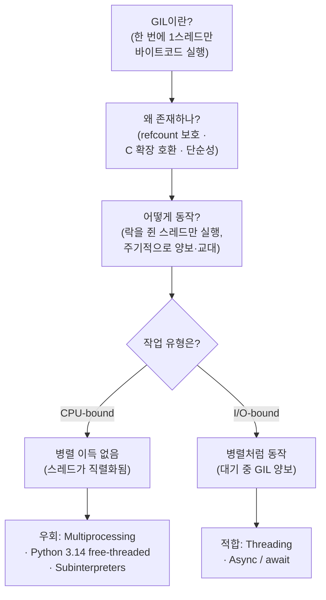

<figure class="post-figure post-figure--header">
<svg role="img" aria-label="GIL(Global Interpreter Lock)의 핵심 개념 그림. 네 개의 스레드(Thread 1~4)가 단 하나의 GIL 토큰을 차지하려고 줄을 서 있고, 가운데 자물쇠 모양의 GIL을 현재 쥔 스레드 하나만 인터프리터에서 바이트코드를 실행한다. 나머지 세 스레드는 대기 상태로 멈춰 있고, 인터프리터는 한 번에 한 스레드만 받아들인다." viewBox="0 0 680 300" xmlns="http://www.w3.org/2000/svg">
  <title>GIL — 단 하나의 락을 두고 여러 스레드가 교대로 인터프리터를 실행</title>

  <!-- ===== LEFT: four threads queued for the lock ===== -->
  <text x="92" y="26" text-anchor="middle" font-size="12" fill="currentColor" font-weight="700" opacity="0.75">스레드 (4개)</text>

  <!-- Thread 1 — holds the GIL (active) -->
  <rect x="24" y="48" width="136" height="40" rx="3" fill="var(--bg-light)" stroke="var(--accent-color)" stroke-width="2.5"/>
  <text x="92" y="66" text-anchor="middle" font-size="10" fill="currentColor" font-weight="700">Thread 1</text>
  <text x="92" y="80" text-anchor="middle" font-size="8" fill="currentColor" opacity="0.8">실행 중 · GIL 보유</text>

  <!-- Thread 2~4 — waiting -->
  <rect x="24" y="100" width="136" height="36" rx="3" fill="var(--bg-light)" stroke="currentColor" stroke-width="1.6"/>
  <text x="92" y="116" text-anchor="middle" font-size="10" fill="currentColor" font-weight="700" opacity="0.65">Thread 2</text>
  <text x="92" y="129" text-anchor="middle" font-size="7.5" fill="currentColor" opacity="0.55">대기</text>
  <rect x="24" y="148" width="136" height="36" rx="3" fill="var(--bg-light)" stroke="currentColor" stroke-width="1.6"/>
  <text x="92" y="164" text-anchor="middle" font-size="10" fill="currentColor" font-weight="700" opacity="0.65">Thread 3</text>
  <text x="92" y="177" text-anchor="middle" font-size="7.5" fill="currentColor" opacity="0.55">대기</text>
  <rect x="24" y="196" width="136" height="36" rx="3" fill="var(--bg-light)" stroke="currentColor" stroke-width="1.6"/>
  <text x="92" y="212" text-anchor="middle" font-size="10" fill="currentColor" font-weight="700" opacity="0.65">Thread 4</text>
  <text x="92" y="225" text-anchor="middle" font-size="7.5" fill="currentColor" opacity="0.55">대기</text>

  <!-- active thread passes through the lock -->
  <line x1="160" y1="68" x2="296" y2="120" stroke="var(--accent-color)" stroke-width="2.5" marker-end="url(#gil-arrow-on)"/>
  <!-- waiting threads blocked at the lock (dashed, stopped) -->
  <line x1="160" y1="118" x2="280" y2="132" stroke="var(--secondary-color)" stroke-width="1.6" stroke-dasharray="4 4" opacity="0.55"/>
  <line x1="160" y1="166" x2="280" y2="146" stroke="var(--secondary-color)" stroke-width="1.6" stroke-dasharray="4 4" opacity="0.55"/>
  <line x1="160" y1="214" x2="280" y2="160" stroke="var(--secondary-color)" stroke-width="1.6" stroke-dasharray="4 4" opacity="0.55"/>

  <!-- ===== MIDDLE: the single GIL (one lock) ===== -->
  <text x="318" y="26" text-anchor="middle" font-size="12" fill="currentColor" font-weight="700" opacity="0.75">단 하나의 GIL</text>
  <!-- padlock body -->
  <rect x="288" y="118" width="60" height="52" rx="5" fill="var(--bg-panel)" stroke="var(--gold)" stroke-width="3"/>
  <!-- padlock shackle -->
  <path d="M300 118 v-12 a18 18 0 0 1 36 0 v12" fill="none" stroke="var(--gold)" stroke-width="3"/>
  <!-- keyhole -->
  <circle cx="318" cy="138" r="5" fill="none" stroke="currentColor" stroke-width="2"/>
  <line x1="318" y1="142" x2="318" y2="156" stroke="currentColor" stroke-width="2"/>
  <text x="318" y="190" text-anchor="middle" font-size="9" fill="currentColor" opacity="0.8" font-weight="700">한 번에 1개만 통과</text>

  <!-- ===== RIGHT: interpreter runs one thread's bytecode ===== -->
  <text x="540" y="26" text-anchor="middle" font-size="12" fill="currentColor" font-weight="700" opacity="0.75">CPython 인터프리터</text>
  <line x1="348" y1="144" x2="430" y2="120" stroke="var(--accent-color)" stroke-width="2.5" marker-end="url(#gil-arrow-on)"/>
  <rect x="434" y="60" width="212" height="160" rx="4" fill="var(--bg-light)" stroke="currentColor" stroke-width="2"/>
  <text x="540" y="84" text-anchor="middle" font-size="10" fill="currentColor" font-weight="700">바이트코드 실행</text>
  <!-- "running thread 1" tag -->
  <rect x="460" y="100" width="160" height="30" rx="3" fill="var(--bg-panel)" stroke="var(--accent-color)" stroke-width="2"/>
  <text x="540" y="119" text-anchor="middle" font-size="9.5" fill="currentColor" font-weight="700">▶ Thread 1 의 코드</text>
  <!-- pseudo bytecode lines -->
  <g stroke="currentColor" stroke-width="2" opacity="0.45" stroke-linecap="round">
    <line x1="464" y1="150" x2="556" y2="150"/>
    <line x1="464" y1="166" x2="616" y2="166"/>
    <line x1="464" y1="182" x2="540" y2="182"/>
    <line x1="464" y1="198" x2="600" y2="198"/>
  </g>

  <defs>
    <marker id="gil-arrow-on" markerWidth="8" markerHeight="8" refX="6" refY="4" orient="auto">
      <path d="M0,0 L8,4 L0,8 z" fill="var(--accent-color)"/>
    </marker>
  </defs>
</svg>
<figcaption>GIL의 한 장 요약 — 여러 스레드(왼쪽)가 <strong>단 하나의 GIL 자물쇠</strong>(가운데)를 두고 경쟁하지만, 락을 쥔 <strong>한 스레드만</strong> CPython 인터프리터(오른쪽)에서 바이트코드를 실행한다. 나머지는 대기(점선)하다 락을 넘겨받아 교대로 실행된다.</figcaption>
</figure>

## Introduction

Python의 GIL(Global Interpreter Lock)은 CPython 인터프리터의 핵심 메커니즘 중 하나로, 멀티스레딩 환경에서 Python 코드의 실행을 제어합니다. GIL은 Python의 성능과 동시성 처리에 큰 영향을 미치며, Python 개발자라면 반드시 이해해야 할 개념입니다.

<div class="post-summary-box" markdown="1">

### 📌 이 글에서 다루는 내용

#### 🔍 핵심 주제

- **GIL의 작동 원리**: 한 번에 하나의 스레드만 Python 바이트코드를 실행하는 메커니즘
- **동시성 처리 비교**: Threading vs Multiprocessing vs Async/Await의 차이점과 적합한 사용 사례
- **Python 3.14 혁신**: Free-threaded 빌드 공식 지원 (PEP 779) 및 실전 벤치마크

#### 🎯 주요 내용

1. **GIL 기초**

   - GIL이 필요한 이유 (메모리 관리, C 확장 호환성)
   - GIL의 동작 방식과 성능 영향

2. **동시성 처리 패턴**

   - Threading: I/O-bound 작업에 적합
   - Multiprocessing: CPU-bound 작업에 적합
   - Async: 대량 I/O 작업에 최적
   - 각 방식의 장단점 비교표

3. **Free-threaded Python (3.13+)**

   - PyPy와 nogil 프로젝트 동향
   - PEP 703 & PEP 779 마일스톤
   - Subinterpreters (PEP 554) 접근법

4. **Python 3.14 실전 가이드**
   - Free-threaded 빌드 설치 및 설정
   - Fibonacci/Counter 벤치마크 (3-5배 성능 향상)
   - 사용 권장사항 및 주의사항

#### 💡 이런 분들께 추천

- Python 멀티스레딩 성능 이슈를 경험한 개발자
- CPU-bound 작업 최적화가 필요한 경우
- Python 3.14+ free-threaded 적용을 고려 중인 팀
- MLOps/데이터 처리 파이프라인 개발자

</div>

### 한눈에 보기

이 글은 다음 흐름으로 GIL을 따라갑니다 — **GIL이 무엇인지**부터 **왜 존재하는지**, **어떻게 동작하는지**, 그것이 **CPU-bound / I/O-bound 작업에 미치는 영향**, 그리고 각 상황의 **우회법**까지.



## GIL 작동 원리

### GIL이란?

GIL(Global Interpreter Lock)은 **한 번에 하나의 스레드만 Python 바이트코드를 실행할 수 있도록 보장하는 뮤텍스(mutex)**입니다. 즉, 멀티스레드 환경에서도 실제로는 한 시점에 하나의 스레드만 Python 코드를 실행할 수 있습니다.

### 왜 GIL이 필요한가?

1. **메모리 관리의 단순화**: CPython은 reference counting 방식으로 메모리를 관리합니다. GIL이 없다면 여러 스레드가 동시에 객체의 reference count를 수정할 때 race condition이 발생할 수 있습니다.

2. **C 확장 모듈과의 호환성**: 많은 C 확장 모듈들이 GIL의 존재를 전제로 설계되었습니다.

3. **구현의 단순성**: GIL을 사용하면 인터프리터 구현이 훨씬 단순해집니다.

### GIL의 동작 방식

```python
import threading
import time

counter = 0

def increment():
    global counter
    for _ in range(1000000):
        counter += 1

# 멀티스레드 실행
threads = []
start_time = time.time()

for _ in range(2):
    thread = threading.Thread(target=increment)
    threads.append(thread)
    thread.start()

for thread in threads:
    thread.join()

print(f"Counter: {counter}")
print(f"Time: {time.time() - start_time:.2f}s")
```

위 코드에서 두 스레드가 동시에 실행되지만, GIL로 인해 실제로는 순차적으로 실행됩니다.

<figure class="post-figure">
<svg role="img" aria-label="GIL의 시간 분할(타임라인) 그림. 두 개의 스레드가 같은 CPU 코어 위에서 시간을 따라 번갈아 실행된다. 가로축은 시간이고, Thread A와 Thread B의 실행 구간이 서로 겹치지 않고 교대로 나타난다. 한 시점에는 언제나 한 스레드만 GIL을 쥐고 실행되며, 일정 주기마다 GIL을 양보하면 다른 스레드로 전환된다. 따라서 두 스레드를 합쳐도 단일 코어에서는 동시 실행이 아니라 교대 실행이 된다." viewBox="0 0 680 240" xmlns="http://www.w3.org/2000/svg">
  <title>GIL 타임라인 — 두 스레드가 단일 코어를 시간으로 나눠 교대 실행</title>

  <!-- lane labels -->
  <text x="58" y="62" text-anchor="end" font-size="11" fill="currentColor" font-weight="700">Thread A</text>
  <text x="58" y="112" text-anchor="end" font-size="11" fill="currentColor" font-weight="700">Thread B</text>
  <text x="58" y="166" text-anchor="end" font-size="11" fill="currentColor" font-weight="700" opacity="0.85">GIL 보유</text>

  <!-- lane base lines -->
  <line x1="70" y1="58" x2="640" y2="58" stroke="currentColor" stroke-width="1" opacity="0.25"/>
  <line x1="70" y1="108" x2="640" y2="108" stroke="currentColor" stroke-width="1" opacity="0.25"/>

  <!-- Thread A active slices (filled) / idle (none) — alternating with B -->
  <rect x="70" y="44" width="120" height="28" rx="2" fill="var(--bg-light)" stroke="var(--accent-color)" stroke-width="2"/>
  <rect x="310" y="44" width="120" height="28" rx="2" fill="var(--bg-light)" stroke="var(--accent-color)" stroke-width="2"/>
  <rect x="550" y="44" width="90" height="28" rx="2" fill="var(--bg-light)" stroke="var(--accent-color)" stroke-width="2"/>

  <!-- Thread B active slices -->
  <rect x="190" y="94" width="120" height="28" rx="2" fill="var(--bg-light)" stroke="var(--secondary-color)" stroke-width="2"/>
  <rect x="430" y="94" width="120" height="28" rx="2" fill="var(--bg-light)" stroke="var(--secondary-color)" stroke-width="2"/>

  <!-- "running" markers -->
  <text x="130" y="62" text-anchor="middle" font-size="8.5" fill="currentColor" opacity="0.8">실행</text>
  <text x="370" y="62" text-anchor="middle" font-size="8.5" fill="currentColor" opacity="0.8">실행</text>
  <text x="595" y="62" text-anchor="middle" font-size="8.5" fill="currentColor" opacity="0.8">실행</text>
  <text x="250" y="112" text-anchor="middle" font-size="8.5" fill="currentColor" opacity="0.8">실행</text>
  <text x="490" y="112" text-anchor="middle" font-size="8.5" fill="currentColor" opacity="0.8">실행</text>

  <!-- GIL ownership bar — shows the single token handed back and forth -->
  <rect x="70" y="152" width="120" height="22" rx="2" fill="var(--bg-panel)" stroke="var(--accent-color)" stroke-width="1.8"/>
  <text x="130" y="167" text-anchor="middle" font-size="8" fill="currentColor" font-weight="700">A</text>
  <rect x="190" y="152" width="120" height="22" rx="2" fill="var(--bg-panel)" stroke="var(--secondary-color)" stroke-width="1.8"/>
  <text x="250" y="167" text-anchor="middle" font-size="8" fill="currentColor" font-weight="700">B</text>
  <rect x="310" y="152" width="120" height="22" rx="2" fill="var(--bg-panel)" stroke="var(--accent-color)" stroke-width="1.8"/>
  <text x="370" y="167" text-anchor="middle" font-size="8" fill="currentColor" font-weight="700">A</text>
  <rect x="430" y="152" width="120" height="22" rx="2" fill="var(--bg-panel)" stroke="var(--secondary-color)" stroke-width="1.8"/>
  <text x="490" y="167" text-anchor="middle" font-size="8" fill="currentColor" font-weight="700">B</text>
  <rect x="550" y="152" width="90" height="22" rx="2" fill="var(--bg-panel)" stroke="var(--accent-color)" stroke-width="1.8"/>
  <text x="595" y="167" text-anchor="middle" font-size="8" fill="currentColor" font-weight="700">A</text>

  <!-- switch points (GIL handoff) -->
  <g stroke="currentColor" stroke-width="1" opacity="0.3" stroke-dasharray="3 3">
    <line x1="190" y1="40" x2="190" y2="178"/>
    <line x1="310" y1="40" x2="310" y2="178"/>
    <line x1="430" y1="40" x2="430" y2="178"/>
    <line x1="550" y1="40" x2="550" y2="178"/>
  </g>

  <!-- time axis -->
  <line x1="70" y1="200" x2="640" y2="200" stroke="currentColor" stroke-width="1.5" marker-end="url(#tl-arrow)"/>
  <text x="355" y="222" text-anchor="middle" font-size="10" fill="currentColor" opacity="0.8" font-weight="700">시간 →  (단일 코어 · 같은 시점엔 항상 한 스레드만)</text>

  <defs>
    <marker id="tl-arrow" markerWidth="8" markerHeight="8" refX="6" refY="4" orient="auto">
      <path d="M0,0 L8,4 L0,8 z" fill="currentColor"/>
    </marker>
  </defs>
</svg>
<figcaption>GIL이 시간으로 코어를 나누는 모습 — Thread A와 B의 실행 구간은 절대 <strong>겹치지 않습니다</strong>. GIL이라는 단일 토큰이 A→B→A로 넘어가며, 일정 주기마다 양보·전환이 일어나 두 스레드가 <strong>교대로</strong> 실행됩니다. "동시"처럼 보여도 단일 코어에서는 병렬이 아니라 시분할입니다.</figcaption>
</figure>

## Thread vs Process vs Async

Python에서 동시성을 처리하는 세 가지 주요 방법을 비교해보겠습니다.

### Threading (멀티스레딩)

**특징:**

- 하나의 프로세스 내에서 여러 스레드 생성
- 메모리 공유로 인한 낮은 오버헤드
- **GIL로 인해 CPU-bound 작업에서는 성능 향상이 없음**
- I/O-bound 작업에 적합

**적합한 경우:**

- 네트워크 요청
- 파일 I/O
- 데이터베이스 쿼리

```python
import threading
import requests

def fetch_url(url):
    response = requests.get(url)
    print(f"Fetched {url}: {len(response.content)} bytes")

urls = ["https://example.com" for _ in range(5)]
threads = [threading.Thread(target=fetch_url, args=(url,)) for url in urls]

for thread in threads:
    thread.start()
for thread in threads:
    thread.join()
```

### Multiprocessing (멀티프로세싱)

**특징:**

- 독립적인 Python 인터프리터 프로세스 생성
- **각 프로세스가 자체 GIL을 가지므로 진정한 병렬 처리 가능**
- 높은 메모리 오버헤드
- CPU-bound 작업에 적합

**적합한 경우:**

- 이미지/비디오 처리
- 데이터 분석
- 수학적 계산

```python
import multiprocessing
import time

def cpu_intensive_task(n):
    count = 0
    for i in range(n):
        count += i ** 2
    return count

if __name__ == "__main__":
    start_time = time.time()

    with multiprocessing.Pool(processes=4) as pool:
        results = pool.map(cpu_intensive_task, [10000000] * 4)

    print(f"Results: {len(results)}")
    print(f"Time: {time.time() - start_time:.2f}s")
```

### Async/Await (비동기 프로그래밍)

**특징:**

- 단일 스레드에서 이벤트 루프 기반 동작
- **GIL의 영향을 받지만, I/O 대기 중에 다른 작업 수행 가능**
- 낮은 메모리 오버헤드
- 많은 수의 I/O-bound 작업에 최적

**적합한 경우:**

- 웹 스크래핑
- API 서버
- 웹소켓 통신

```python
import asyncio
import aiohttp

async def fetch_url(session, url):
    async with session.get(url) as response:
        content = await response.read()
        print(f"Fetched {url}: {len(content)} bytes")

async def main():
    urls = ["https://example.com" for _ in range(5)]
    async with aiohttp.ClientSession() as session:
        tasks = [fetch_url(session, url) for url in urls]
        await asyncio.gather(*tasks)

asyncio.run(main())
```

### 비교 표

| 방식            | GIL 영향 | CPU-bound | I/O-bound | 메모리    | 복잡도 |
| --------------- | -------- | --------- | --------- | --------- | ------ |
| Threading       | 높음     | ❌        | ✅        | 낮음      | 낮음   |
| Multiprocessing | 없음     | ✅        | ⚠️        | 높음      | 중간   |
| Async           | 있음     | ❌        | ✅        | 매우 낮음 | 높음   |

<figure class="post-figure">
<svg role="img" aria-label="멀티스레드 환경에서 CPU-bound 작업과 I/O-bound 작업의 성능 차이 그림. 위쪽 CPU-bound 패널에서는 두 스레드가 GIL을 쥐고 있는 동안 계속 계산만 하므로 락을 양보할 틈이 없어, 두 스레드를 합쳐도 전체 시간이 거의 줄지 않고 직렬 실행과 다름없다. 아래쪽 I/O-bound 패널에서는 각 스레드가 네트워크나 디스크 응답을 기다리는 동안 GIL을 양보하므로, 그 대기 시간에 다른 스레드가 실행되어 전체 시간이 크게 줄고 사실상 겹쳐(병렬처럼) 진행된다." viewBox="0 0 680 320" xmlns="http://www.w3.org/2000/svg">
  <title>CPU-bound vs I/O-bound — 멀티스레드에서 GIL의 영향이 갈리는 이유</title>

  <!-- ===== TOP: CPU-bound (no speedup) ===== -->
  <text x="20" y="26" font-size="12" fill="currentColor" font-weight="700">CPU-bound — 스레드를 늘려도 빨라지지 않음</text>
  <text x="58" y="58" text-anchor="end" font-size="10" fill="currentColor" font-weight="700">Thread A</text>
  <text x="58" y="92" text-anchor="end" font-size="10" fill="currentColor" font-weight="700">Thread B</text>

  <!-- A: solid compute blocks, B fills the gaps — total spans full width -->
  <rect x="70" y="44" width="135" height="24" rx="2" fill="var(--bg-light)" stroke="var(--accent-color)" stroke-width="2"/>
  <text x="137" y="60" text-anchor="middle" font-size="8" fill="currentColor">계산</text>
  <rect x="340" y="44" width="135" height="24" rx="2" fill="var(--bg-light)" stroke="var(--accent-color)" stroke-width="2"/>
  <text x="407" y="60" text-anchor="middle" font-size="8" fill="currentColor">계산</text>

  <rect x="205" y="78" width="135" height="24" rx="2" fill="var(--bg-light)" stroke="var(--secondary-color)" stroke-width="2"/>
  <text x="272" y="94" text-anchor="middle" font-size="8" fill="currentColor">계산</text>
  <rect x="475" y="78" width="135" height="24" rx="2" fill="var(--bg-light)" stroke="var(--secondary-color)" stroke-width="2"/>
  <text x="542" y="94" text-anchor="middle" font-size="8" fill="currentColor">계산</text>

  <!-- total time bracket (long) -->
  <line x1="70" y1="116" x2="610" y2="116" stroke="currentColor" stroke-width="1.5" opacity="0.6"/>
  <line x1="70" y1="111" x2="70" y2="121" stroke="currentColor" stroke-width="1.5" opacity="0.6"/>
  <line x1="610" y1="111" x2="610" y2="121" stroke="currentColor" stroke-width="1.5" opacity="0.6"/>
  <text x="340" y="132" text-anchor="middle" font-size="9.5" fill="currentColor" font-weight="700">총 시간 = 거의 직렬 (이득 ❌) — 계산 중엔 GIL을 놓지 않음</text>

  <!-- divider -->
  <line x1="20" y1="156" x2="660" y2="156" stroke="currentColor" stroke-width="1" opacity="0.25"/>

  <!-- ===== BOTTOM: I/O-bound (overlap → speedup) ===== -->
  <text x="20" y="186" font-size="12" fill="currentColor" font-weight="700">I/O-bound — 대기 중 GIL을 양보해 겹쳐 실행됨</text>
  <text x="58" y="220" text-anchor="end" font-size="10" fill="currentColor" font-weight="700">Thread A</text>
  <text x="58" y="254" text-anchor="end" font-size="10" fill="currentColor" font-weight="700">Thread B</text>

  <!-- A: short compute then long wait (dashed = GIL released) -->
  <rect x="70" y="206" width="48" height="24" rx="2" fill="var(--bg-light)" stroke="var(--accent-color)" stroke-width="2"/>
  <text x="94" y="222" text-anchor="middle" font-size="7.5" fill="currentColor">요청</text>
  <rect x="118" y="206" width="150" height="24" rx="2" fill="var(--bg-panel)" stroke="var(--accent-color)" stroke-width="1.4" stroke-dasharray="4 3" opacity="0.7"/>
  <text x="193" y="222" text-anchor="middle" font-size="7.5" fill="currentColor" opacity="0.8">I/O 대기 (GIL 양보)</text>
  <rect x="268" y="206" width="48" height="24" rx="2" fill="var(--bg-light)" stroke="var(--accent-color)" stroke-width="2"/>
  <text x="292" y="222" text-anchor="middle" font-size="7.5" fill="currentColor">응답</text>

  <!-- B runs during A's wait -->
  <rect x="120" y="240" width="48" height="24" rx="2" fill="var(--bg-light)" stroke="var(--secondary-color)" stroke-width="2"/>
  <text x="144" y="256" text-anchor="middle" font-size="7.5" fill="currentColor">요청</text>
  <rect x="168" y="240" width="150" height="24" rx="2" fill="var(--bg-panel)" stroke="var(--secondary-color)" stroke-width="1.4" stroke-dasharray="4 3" opacity="0.7"/>
  <text x="243" y="256" text-anchor="middle" font-size="7.5" fill="currentColor" opacity="0.8">I/O 대기 (GIL 양보)</text>
  <rect x="318" y="240" width="48" height="24" rx="2" fill="var(--bg-light)" stroke="var(--secondary-color)" stroke-width="2"/>
  <text x="342" y="256" text-anchor="middle" font-size="7.5" fill="currentColor">응답</text>

  <!-- total time bracket (short) -->
  <line x1="70" y1="278" x2="366" y2="278" stroke="currentColor" stroke-width="1.5" opacity="0.6"/>
  <line x1="70" y1="273" x2="70" y2="283" stroke="currentColor" stroke-width="1.5" opacity="0.6"/>
  <line x1="366" y1="273" x2="366" y2="283" stroke="currentColor" stroke-width="1.5" opacity="0.6"/>
  <text x="218" y="294" text-anchor="middle" font-size="9.5" fill="currentColor" font-weight="700">총 시간 = 짧음 (이득 ✅)</text>
  <text x="500" y="262" text-anchor="middle" font-size="9" fill="currentColor" opacity="0.75">대기가 서로 겹쳐</text>
  <text x="500" y="278" text-anchor="middle" font-size="9" fill="currentColor" opacity="0.75">병렬처럼 진행</text>
</svg>
<figcaption>같은 GIL, 정반대 결과 — <strong>CPU-bound</strong>(위)는 계산 중 락을 내려놓지 않아 스레드가 직렬화되어 멀티스레딩 이득이 없고, <strong>I/O-bound</strong>(아래)는 대기 중 GIL을 양보하므로 그 틈에 다른 스레드가 실행되어 전체 시간이 줄어듭니다. 그래서 Threading·Async는 I/O에, Multiprocessing·free-threaded는 CPU에 맞습니다.</figcaption>
</figure>

## PyPy, nogil 프로젝트 동향

### PyPy

**PyPy**는 JIT(Just-In-Time) 컴파일러를 사용하는 대안 Python 구현체입니다.

**특징:**

- CPython보다 평균 4.5배 빠른 성능
- 여전히 GIL을 가지고 있음
- STM(Software Transactional Memory) 기반 GIL-free 버전 실험 중

**현재 상태 (2025):**

- PyPy 3.10 버전까지 지원
- 대부분의 주요 라이브러리와 호환
- 프로덕션 환경에서 안정적으로 사용 가능

```bash
# PyPy 설치 및 사용
pypy3 -m pip install numpy
pypy3 my_script.py
```

### PEP 703 & PEP 779: Free-Threaded Python

**Free-threaded Python**은 CPython에서 GIL을 제거하여 진정한 병렬 처리를 가능하게 하는 공식 프로젝트입니다.

**주요 마일스톤:**

- Sam Gross가 제안한 GIL 제거 방안 (PEP 703)
- 2024년 PEP 703 승인됨
- Python 3.13 (2024.10): 실험적 기능으로 포함
- **Python 3.14 (2025.10.07)**: PEP 779 승인으로 **공식 지원** 시작
  - "실험적" 태그 제거
  - Production-ready 상태로 승격
  - 바이너리 휠, CI 이미지, 호스팅 플랫폼의 1급 시민 지원

**기술적 접근:**

1. **Biased Reference Counting**: 효율적인 참조 카운팅
2. **Deferred Reference Counting**: 지연된 참조 카운팅
3. **Immortal Objects**: 불변 객체의 최적화
4. **PEP 659 적용 (3.14)**: Specializing adaptive interpreter가 free-threaded 모드에서 활성화
5. **메모리 관리 개선**: 약 10% 메모리 사용량 증가 (성능 향상의 트레이드오프)

**빌드 및 설치:**

```bash
# 방법 1: uv를 사용한 간편 설치 (권장)
uvx python@3.14t  # 't' suffix는 free-threaded 빌드를 의미

# 방법 2: 소스에서 빌드
./configure --disable-gil
make
./python

# Python 코드에서 GIL 상태 확인
import sys
print(sys._is_gil_enabled())  # False
```

**Windows에서 확장 모듈 컴파일 시 주의사항 (3.14+):**

```python
# build backend에서 Py_GIL_DISABLED 전처리 변수를 명시적으로 지정해야 함
import sysconfig
print(sysconfig.get_config_var('Py_GIL_DISABLED'))
```

**성능 영향:**

- **단일 스레드**: 약 5-10% 성능 저하 (3.13의 10-15%에서 크게 개선)
- **멀티 스레드**: CPU-bound 작업에서 선형적 성능 향상
  - Python 3.14: 약 3.1x 속도 향상 (vs 3.13의 2.2x)
  - Fibonacci 테스트 (4 threads): 5배 빠름 (279ms vs 1377ms)
  - Counter 테스트 (2 threads): 1.4배 빠름 (27.21s vs 37.35s)
  - DataFrame 연산: 50-90% 처리 시간 단축

**마이그레이션 로드맵:**

- ✅ Python 3.13 (2024.10): 실험적 free-threaded 빌드 도입
- ✅ **Python 3.14 (2025.10)**: **공식 지원 시작** (PEP 779 승인)
  - 단일 스레드 성능 페널티 5-10%로 개선
  - PEP 659 adaptive interpreter 활성화
  - 확장 모듈 생태계 지원 확대 (Cython, pybind11, nanobind, PyO3)
- 🔄 Python 3.15-3.16: 안정화 및 생태계 성숙도 향상
- 🔮 Python 3.17+ (예상): free-threaded가 기본값이 될 가능성

### Subinterpreters (PEP 554)

GIL 문제를 해결하는 또 다른 접근법:

**특징:**

- 하나의 프로세스에 여러 독립적인 Python 인터프리터
- 각 인터프리터가 자체 GIL 보유
- multiprocessing보다 낮은 오버헤드

```python
# Python 3.12+ 에서 사용 가능
import _xxsubinterpreters as interpreters

interp_id = interpreters.create()
interpreters.run_string(interp_id, "print('Hello from subinterpreter')")
interpreters.destroy(interp_id)
```

## Python 3.14 Free-Threaded 실전 예제

### CPU-Bound 작업 벤치마크

Python 3.14의 free-threaded 빌드는 CPU-bound 멀티스레드 작업에서 극적인 성능 향상을 보여줍니다.

**Fibonacci 계산 예제:**

```python
import threading
import time

def fibonacci(n):
    """재귀적 Fibonacci 계산 (CPU-bound)"""
    if n <= 1:
        return n
    return fibonacci(n-1) + fibonacci(n-2)

def run_benchmark(n, num_threads):
    """멀티스레드 Fibonacci 벤치마크"""
    threads = []
    start = time.time()

    for _ in range(num_threads):
        t = threading.Thread(target=lambda: fibonacci(n))
        threads.append(t)
        t.start()

    for t in threads:
        t.join()

    elapsed = time.time() - start
    return elapsed

# 테스트 실행
print("=== Fibonacci(40) 4 Threads ===")
elapsed = run_benchmark(40, 4)
print(f"Elapsed: {elapsed:.2f}s")

# 결과:
# Python 3.12 (GIL): ~1.38초
# Python 3.14 (free-threaded): ~0.28초
# 성능 향상: 약 5배
```

**Counter 작업 예제:**

```python
import threading
import time

def count_to_billion():
    """단순 카운팅 작업 (CPU-bound)"""
    count = 0
    for i in range(1000000000):
        count += 1
    return count

def run_counter_test(num_threads):
    """멀티스레드 카운터 테스트"""
    threads = []
    start = time.time()

    for _ in range(num_threads):
        t = threading.Thread(target=count_to_billion)
        threads.append(t)
        t.start()

    for t in threads:
        t.join()

    elapsed = time.time() - start
    return elapsed

# 테스트 실행
print("=== Counter Test (2 Threads) ===")
elapsed = run_counter_test(2)
print(f"Elapsed: {elapsed:.2f}s")

# 결과:
# Python 3.12 (GIL): ~37.35초
# Python 3.14 (free-threaded): ~27.21초
# 성능 향상: 약 1.4배
```

### 성능 비교 표

| 작업 유형                 | Python 3.12 (GIL) | Python 3.14 (Free-threaded) | 개선율    | 적합성       |
| ------------------------- | ----------------- | --------------------------- | --------- | ------------ |
| **Fibonacci (4 threads)** | 1377ms            | 279ms                       | **5.0x**  | ✅ 매우 적합 |
| **Counter (2 threads)**   | 37.35s            | 27.21s                      | **1.4x**  | ✅ 적합      |
| **DataFrame 연산**        | 기준              | 50-90% 빠름                 | **2-10x** | ✅ 매우 적합 |
| **단일 스레드 작업**      | 기준              | 5-10% 느림                  | **0.9x**  | ⚠️ 부적합    |
| **I/O-bound 작업**        | 기준              | 거의 동일                   | **~1.0x** | ⚠️ 이득 없음 |

### 사용 권장사항

**Free-threaded Python을 사용하면 좋은 경우:**

✅ CPU-bound 멀티스레드 애플리케이션
✅ 과학 계산, 데이터 분석, 머신러닝 추론
✅ 이미지/비디오 처리 (병렬 처리)
✅ 수학적 시뮬레이션
✅ 4개 이상의 코어를 활용하는 작업

**일반 Python을 사용하는 것이 나은 경우:**

⚠️ 단일 스레드 애플리케이션
⚠️ I/O-bound 작업 (네트워크, 파일 I/O)
⚠️ 이미 asyncio를 잘 활용하는 경우
⚠️ 확장 모듈 호환성이 중요한 경우 (아직 일부 라이브러리 미지원)

### 주의사항

**확장 모듈 호환성:**

```python
# free-threaded 빌드에서 확장 모듈 호환성 확인
import sys
print(f"GIL enabled: {sys._is_gil_enabled()}")

# 일부 C 확장 모듈은 아직 free-threaded를 완전히 지원하지 않을 수 있음
# Cython, pybind11, nanobind, PyO3 등의 도구는 지원 작업 진행 중
```

**메모리 사용량:**

- Free-threaded 빌드는 약 10% 더 많은 메모리 사용
- 메모리가 제한된 환경에서는 주의 필요

## Key Points

- **GIL은 CPython의 메모리 관리를 단순화하지만, 멀티스레딩 성능을 제한함**
- **I/O-bound 작업**: Threading 또는 Async 사용
- **CPU-bound 작업**: Multiprocessing 또는 **Python 3.14 Free-threaded** 사용
- **Python 3.14 (2025.10)**: Free-threaded 빌드가 공식 지원으로 승격 (PEP 779)
  - 단일 스레드 페널티 5-10%로 개선 (vs 3.13의 10-15%)
  - CPU-bound 멀티스레드 작업에서 3-5배 성능 향상
  - Production-ready 상태로 바이너리 휠 및 CI 이미지 지원
- **PyPy**: JIT 컴파일로 성능 향상, 여전히 GIL 존재
- **Subinterpreters**: multiprocessing과 threading의 중간 지점
- **설치**: `uvx python@3.14t`로 간편하게 free-threaded Python 사용 가능

## Conclusion

Python의 GIL은 오랫동안 논쟁의 대상이었지만, 동시에 CPython의 단순성과 안정성을 보장해왔습니다. **2025년 10월 7일, Python 3.14의 출시와 함께 free-threaded 빌드가 공식 지원되면서, GIL이 없는 Python의 미래가 현실이 되었습니다.**

**Python 3.14의 의미:**

- PEP 779 승인으로 free-threaded가 "실험적"에서 "공식 지원"으로 승격
- 단일 스레드 성능 페널티가 5-10%로 크게 개선
- CPU-bound 멀티스레드 작업에서 실질적인 성능 향상 (3-5배)
- `uvx python@3.14t`로 누구나 쉽게 free-threaded Python을 사용 가능

**개발자를 위한 가이드:**

1. **작업 특성 파악**: I/O-bound vs CPU-bound 구분
2. **적절한 도구 선택**:
   - I/O-bound: Threading 또는 Async
   - CPU-bound (단일 코어): 일반 Python
   - CPU-bound (멀티 코어): **Python 3.14 Free-threaded** 또는 Multiprocessing
3. **점진적 마이그레이션**: 기존 코드는 일반 Python으로, 새 CPU-bound 프로젝트는 free-threaded로
4. **생태계 동향 주시**: Cython, pybind11 등 확장 모듈 도구의 지원 확대 추이 관찰

Python 3.14는 GIL의 종말이 아니라, **개발자에게 선택권을 제공하는 새로운 시작**입니다. 필요에 따라 GIL의 단순성과 free-threaded의 성능을 선택할 수 있게 되었습니다.

### 이전 학습

이 글을 더 잘 이해하기 위해 먼저 읽어보세요:

- **[Python 메모리 구조와 객체 모델](/2025/10/19/python-memory-structure-and-object-model.html)** ← 이전 추천
  - GIL이 왜 필요한지 이해하려면 Python의 메모리 관리(reference counting) 메커니즘을 먼저 알아야 합니다

### 다음 학습

이 글을 읽으셨다면 다음 주제로 넘어가보세요:

- **[Python Bytecode](/2025/10/24/python-bytecode.html)** ← 다음 추천
  - GIL이 바이트코드 실행에 어떻게 영향을 미치는지, 인터프리터 루프는 어떻게 동작하는지 알아보세요
- Python Concurrency 패턴 학습
- Asyncio 심화 학습
- CPython 인터프리터 내부 구조
- Python 3.14 Free-Threaded 실전 활용 및 벤치마크
- PyPy vs CPython vs Free-threaded Python 성능 비교
- 확장 모듈의 Free-threaded 호환성 가이드

## 참고 자료

### 공식 문서

- [PEP 703 – Making the Global Interpreter Lock Optional in CPython](https://peps.python.org/pep-0703/)
- [PEP 779 – Criteria for supported status for free-threaded Python](https://peps.python.org/pep-0779/)
- [PEP 659 – Specializing Adaptive Interpreter](https://peps.python.org/pep-0659/)
- [Python 3.14 Release Notes - What's New](https://docs.python.org/3/whatsnew/3.14.html)
- [Python 3.14.0 Release | Python.org](https://www.python.org/downloads/release/python-3140/)
- [Python support for free threading — Python 3.14 Documentation](https://docs.python.org/3/howto/free-threading-python.html)

### 기술 분석 및 벤치마크

- [Python 3.14 Is Here. How Fast Is It? - Miguel Grinberg](https://blog.miguelgrinberg.com/post/python-3-14-is-here-how-fast-is-it)
- [Breaking Free: Python 3.14 Shatters the GIL Ceiling - Python Cheatsheet](https://www.pythoncheatsheet.org/blog/python-3-14-breaking-free-from-gil)
- [Python 3.14 and the End of the GIL | Towards Data Science](https://towardsdatascience.com/python-3-14-and-the-end-of-the-gil/)
- [State of Python 3.13 Performance: Free-Threading - CodSpeed](https://codspeed.io/blog/state-of-python-3-13-performance-free-threading)
- [Unlocking Performance in Python's Free-Threaded Future - Quansight Labs](https://labs.quansight.org/blog/free-threaded-gc-3-14)

### 도구 및 생태계

- [Python 3.14 - Astral (uv installation guide)](https://astral.sh/blog/python-3.14)
- [Python Free-Threading Guide](https://py-free-threading.github.io/)
- [PyPy Official Website](https://www.pypy.org/)

### 뉴스 및 커뮤니티

- [Python 3.14 released with cautious free-threaded support - The Register](https://www.theregister.com/2025/10/08/python_314_released_with_cautious/)
- [Free-Threaded Python Unleashed - Real Python](https://realpython.com/python-news-july-2025/)
- [PEP 779 Discussion - Python.org Forums](https://discuss.python.org/t/pep-779-criteria-for-supported-status-for-free-threaded-python/84319)

### 멀티스레딩 및 동시성 기초

- [Python threading module documentation](https://docs.python.org/3/library/threading.html)
- [Python multiprocessing module documentation](https://docs.python.org/3/library/multiprocessing.html)
- [Python asyncio documentation](https://docs.python.org/3/library/asyncio.html)
- [Understanding the Python GIL - David Beazley](http://www.dabeaz.com/python/UnderstandingGIL.pdf)
