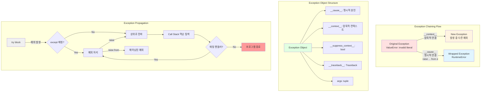

## Introduction

Python에서 예외(Exception)는 프로그램 실행 중 발생하는 오류를 처리하는 핵심 메커니즘입니다. 이 글에서는 Python 예외의 내부 동작 원리, 효과적인 로깅 전략, 그리고 Stack trace를 분석하는 방법을 깊이 있게 살펴봅니다.

<div class="post-summary-box" markdown="1">

**핵심 내용 요약:**

- **BaseException 구조**: C 레벨 구조체와 예외 계층 이해
- **Traceback 내부**: 연결 리스트 구조와 Frame 객체 분석
- **효과적인 로깅**: logging 모듈 활용과 구조화된 예외 기록
- **Stack Trace 분석**: Frame 검사와 예외 체이닝 추적
- **Customized Exception**: 풍부한 컨텍스트를 담은 예외 설계 패턴

</div>

## BaseException 구조 Deep Dive

### BaseException 클래스의 C 레벨 구조

Python의 예외 시스템은 C 레벨에서 `PyBaseExceptionObject` 구조체로 구현됩니다:

```c
typedef struct {
    PyObject_HEAD
    PyObject *args;          // 예외 생성 시 전달된 인자들
    PyObject *traceback;     // traceback 객체
    PyObject *cause;         // 명시적 원인 (__cause__)
    PyObject *context;       // 암묵적 컨텍스트 (__context__)
    char suppress_context;   // context 억제 여부
} PyBaseExceptionObject;
```

### Exception 클래스 전체 계층

Python의 모든 예외는 `BaseException` 클래스를 상속합니다:

```mermaid
graph TD
    A[BaseException] --> B[SystemExit]
    A --> C[KeyboardInterrupt]
    A --> D[GeneratorExit]
    A --> E[Exception]

    E --> F[StopIteration]
    E --> G[StopAsyncIteration]
    E --> H[ArithmeticError]
    E --> I[AssertionError]
    E --> J[AttributeError]
    E --> K[ImportError]
    E --> L[LookupError]
    E --> M[OSError]
    E --> N[RuntimeError]
    E --> O[SyntaxError]
    E --> P[TypeError]
    E --> Q[ValueError]
    E --> R[Warning]

    H --> H1[FloatingPointError]
    H --> H2[OverflowError]
    H --> H3[ZeroDivisionError]

    K --> K1[ModuleNotFoundError]

    L --> L1[IndexError]
    L --> L2[KeyError]

    M --> M1[FileNotFoundError]
    M --> M2[PermissionError]
    M --> M3[ConnectionError]
    M3 --> M3a[BrokenPipeError]
    M3 --> M3b[ConnectionRefusedError]

    N --> N1[NotImplementedError]
    N --> N2[RecursionError]

    O --> O1[IndentationError]
    O1 --> O1a[TabError]

    Q --> Q1[UnicodeError]
    Q1 --> Q1a[UnicodeDecodeError]
    Q1 --> Q1b[UnicodeEncodeError]

    R --> R1[DeprecationWarning]
    R --> R2[UserWarning]
    R --> R3[FutureWarning]

    style A fill:#ff9999
    style E fill:#99ccff
    style B fill:#ffcc99
    style C fill:#ffcc99
    style D fill:#ffcc99
```



**주요 예외 범주:**

- **SystemExit, KeyboardInterrupt, GeneratorExit**: 특수 제어 흐름 예외
- **ArithmeticError**: 수학 연산 관련 오류
- **LookupError**: 인덱싱/키 조회 실패
- **OSError**: 운영체제 및 I/O 오류
- **RuntimeError**: 실행 시간 오류
- **SyntaxError**: 구문 오류
- **ValueError**: 잘못된 값 오류
- **Warning**: 경고 계층

### BaseException vs Exception 차이

```python
# BaseException을 직접 상속하는 이유
class SystemExit(BaseException):
    """프로그램 정상 종료를 위한 예외"""
    pass

# Exception을 상속하는 일반적인 경우
class CustomError(Exception):
    """애플리케이션 에러"""
    pass

# bare except의 위험성
try:
    sys.exit(0)
except:  # 나쁜 예: SystemExit도 잡힘
    print("This catches SystemExit too!")

# 올바른 방법
try:
    sys.exit(0)
except Exception:  # 좋은 예: SystemExit는 잡히지 않음
    print("This won't catch SystemExit")
```

### 예외 객체의 주요 속성

```python
try:
    result = 10 / 0
except ZeroDivisionError as e:
    # 기본 속성
    print(f"Exception type: {type(e)}")           # <class 'ZeroDivisionError'>
    print(f"Exception args: {e.args}")            # ('division by zero',)
    print(f"String repr: {str(e)}")               # division by zero
    print(f"Repr: {repr(e)}")                     # ZeroDivisionError('division by zero')

    # Traceback 관련
    print(f"__traceback__: {e.__traceback__}")    # traceback object
    print(f"__traceback__.tb_frame: {e.__traceback__.tb_frame}")  # frame object
    print(f"__traceback__.tb_lineno: {e.__traceback__.tb_lineno}")  # line number

    # Exception chaining
    print(f"__cause__: {e.__cause__}")            # None (명시적 원인)
    print(f"__context__: {e.__context__}")        # None (암묵적 컨텍스트)
    print(f"__suppress_context__: {e.__suppress_context__}")  # False

    # 기타
    print(f"__notes__: {getattr(e, '__notes__', None)}")  # Python 3.11+
```

### 예외 객체의 메모리 구조

```python
import sys

class TestException(Exception):
    pass

try:
    raise TestException("test message")
except TestException as e:
    # 예외 객체의 메모리 크기
    print(f"Size of exception object: {sys.getsizeof(e)} bytes")
    print(f"Size of args tuple: {sys.getsizeof(e.args)} bytes")
    print(f"Size of traceback: {sys.getsizeof(e.__traceback__)} bytes")

    # 참조 카운트
    print(f"Refcount: {sys.getrefcount(e)}")
```

## Traceback 내부 구조 Deep Dive

### Traceback 객체의 C 레벨 구조

Traceback 객체는 C 레벨에서 다음과 같이 정의됩니다:

```c
typedef struct _traceback {
    PyObject_HEAD
    struct _traceback *tb_next;   // 다음 traceback (연결 리스트)
    PyFrameObject *tb_frame;      // 실행 프레임
    int tb_lasti;                 // 마지막 실행된 명령어 인덱스
    int tb_lineno;                // 소스 코드 라인 번호
} PyTracebackObject;
```

### Frame 객체의 구조

각 traceback은 Frame 객체를 포함하며, Frame은 다음과 같은 구조를 가집니다:

```c
typedef struct _frame {
    PyObject_HEAD
    struct _frame *f_back;        // 호출자 프레임 (call stack)
    PyCodeObject *f_code;         // 코드 객체
    PyObject *f_builtins;         // 내장 네임스페이스
    PyObject *f_globals;          // 전역 네임스페이스
    PyObject *f_locals;           // 로컬 네임스페이스
    PyObject **f_valuestack;      // 값 스택
    PyObject *f_trace;            // 트레이스 함수
    int f_lasti;                  // 마지막 명령어 인덱스
    int f_lineno;                 // 현재 라인 번호
    // ... 기타 필드
} PyFrameObject;
```

### Traceback 객체 탐색

```python
import sys
import traceback

def level_3():
    return 1 / 0

def level_2():
    return level_3()

def level_1():
    return level_2()

try:
    level_1()
except Exception as e:
    # Get traceback information
    exc_type, exc_value, exc_traceback = sys.exc_info()

    # Print formatted traceback
    traceback.print_exc()

    # Extract traceback details
    tb_lines = traceback.format_tb(exc_traceback)
    for line in tb_lines:
        print(line)
```

### 상세한 Traceback 분석

```python
def analyze_traceback(tb):
    """Traceback 객체의 상세 분석"""
    depth = 0
    while tb is not None:
        frame = tb.tb_frame
        code = frame.f_code

        print(f"\n=== Frame Depth: {depth} ===")

        # 기본 정보
        print(f"File: {code.co_filename}")
        print(f"Function: {code.co_name}")
        print(f"Line number: {tb.tb_lineno}")
        print(f"Last instruction: {tb.tb_lasti}")

        # Frame 정보
        print(f"\nFrame info:")
        print(f"  First line number: {code.co_firstlineno}")
        print(f"  Argument count: {code.co_argcount}")
        print(f"  Local variables count: {code.co_nlocals}")
        print(f"  Stack size: {code.co_stacksize}")
        print(f"  Flags: {code.co_flags}")

        # 네임스페이스
        print(f"\nLocal variables:")
        for var_name, var_value in frame.f_locals.items():
            try:
                print(f"  {var_name} = {repr(var_value)[:100]}")
            except:
                print(f"  {var_name} = <unprintable>")

        # Bytecode 정보
        print(f"\nBytecode names: {code.co_names}")
        print(f"Variable names: {code.co_varnames}")

        tb = tb.tb_next
        depth += 1

# 사용 예제
try:
    x = 10
    y = 0
    result = x / y
except ZeroDivisionError:
    analyze_traceback(sys.exc_info()[2])
```

### Traceback 연결 리스트 구조

Traceback 객체는 연결 리스트로 구성되어 있으며, 각 노드는 호출 스택의 한 프레임을 나타냅니다:

```mermaid
graph LR
    subgraph "Traceback Chain (Linked List)"
        TB1[Traceback 1<br/>tb_frame: Frame1<br/>tb_lineno: 225<br/>tb_next: →] --> TB2[Traceback 2<br/>tb_frame: Frame2<br/>tb_lineno: 222<br/>tb_next: →]
        TB2 --> TB3[Traceback 3<br/>tb_frame: Frame3<br/>tb_lineno: 219<br/>tb_next: None]
    end

    subgraph "Frame Objects"
        F1[Frame 1<br/>f_code: level_1<br/>f_locals: &#123;&#125;<br/>f_back: None]
        F2[Frame 2<br/>f_code: level_2<br/>f_locals: &#123;&#125;<br/>f_back: →Frame1]
        F3[Frame 3<br/>f_code: level_3<br/>f_locals: &#123;&#125;<br/>f_back: →Frame2]
    end

    TB1 -.참조.-> F1
    TB2 -.참조.-> F2
    TB3 -.참조.-> F3

    F2 -.-> F1
    F3 -.-> F2

    style TB1 fill:#e1f5ff
    style TB2 fill:#e1f5ff
    style TB3 fill:#ffe1e1
    style F1 fill:#fff4e1
    style F2 fill:#fff4e1
    style F3 fill:#ffe1e1
```



**구조 설명:**

- **Traceback 노드**: 각 예외 발생 지점의 정보를 담은 연결 리스트
- **Frame 객체**: 실행 컨텍스트 (코드, 네임스페이스, 변수)
- **tb_next**: 다음 Traceback 노드 (호출 스택을 따라 이동)
- **f_back**: 이전 Frame 객체 (호출자 방향)

```python
def visualize_traceback_chain(tb):
    """Traceback 체인을 시각화"""
    print("Traceback Chain (from oldest to newest):\n")

    # 체인의 모든 노드 수집
    tb_list = []
    current = tb
    while current is not None:
        tb_list.append(current)
        current = current.tb_next

    # 역순으로 출력 (호출 순서대로)
    for i, tb_node in enumerate(tb_list):
        frame = tb_node.tb_frame
        indent = "  " * i
        print(f"{indent}↓")
        print(f"{indent}[Frame {i}]")
        print(f"{indent}  Function: {frame.f_code.co_name}")
        print(f"{indent}  File: {frame.f_code.co_filename}:{tb_node.tb_lineno}")

    print(f"\n{'  ' * len(tb_list)}💥 Exception occurred here!")
```

### Code 객체 상세 분석

```python
def analyze_code_object(code):
    """PyCodeObject의 상세 정보"""
    print(f"Code Object Analysis:")
    print(f"  Name: {code.co_name}")
    print(f"  Filename: {code.co_filename}")
    print(f"  First line: {code.co_firstlineno}")

    # 인자 정보
    print(f"\n  Arguments:")
    print(f"    Positional: {code.co_argcount}")
    print(f"    Keyword-only: {code.co_kwonlyargcount}")
    print(f"    Has *args: {bool(code.co_flags & 0x04)}")
    print(f"    Has **kwargs: {bool(code.co_flags & 0x08)}")

    # 변수 정보
    print(f"\n  Variables:")
    print(f"    Local vars: {code.co_varnames}")
    print(f"    Free vars: {code.co_freevars}")
    print(f"    Cell vars: {code.co_cellvars}")

    # Bytecode 정보
    print(f"\n  Bytecode:")
    print(f"    Instructions: {len(code.co_code)} bytes")
    print(f"    Constants: {code.co_consts}")
    print(f"    Names: {code.co_names}")

    # 플래그 분석
    flags = []
    if code.co_flags & 0x01: flags.append("OPTIMIZED")
    if code.co_flags & 0x02: flags.append("NEWLOCALS")
    if code.co_flags & 0x04: flags.append("VARARGS")
    if code.co_flags & 0x08: flags.append("VARKEYWORDS")
    if code.co_flags & 0x10: flags.append("NESTED")
    if code.co_flags & 0x20: flags.append("GENERATOR")
    if code.co_flags & 0x40: flags.append("NOFREE")
    if code.co_flags & 0x80: flags.append("COROUTINE")
    if code.co_flags & 0x100: flags.append("ITERABLE_COROUTINE")
    if code.co_flags & 0x200: flags.append("ASYNC_GENERATOR")

    print(f"\n  Flags: {' | '.join(flags)}")

try:
    def example_function(a, b, *args, **kwargs):
        local_var = a + b
        return local_var / 0

    example_function(1, 2, 3, x=4)
except:
    tb = sys.exc_info()[2]
    while tb.tb_next:
        tb = tb.tb_next
    analyze_code_object(tb.tb_frame.f_code)
```

### Traceback 객체 수동 생성

```python
import types

def create_custom_traceback():
    """커스텀 traceback 생성 (디버깅/테스트용)"""
    try:
        # 실제 예외 발생
        1 / 0
    except:
        # 실제 traceback 획득
        real_tb = sys.exc_info()[2]

        # Traceback 객체는 불변이므로 직접 수정 불가
        # 대신 새로운 예외를 발생시켜 traceback 체인 생성

        return real_tb

# Python 3.7+에서는 traceback 모듈의 TracebackException 사용
from traceback import TracebackException

def create_traceback_exception():
    """TracebackException 객체 생성"""
    try:
        dangerous_operation()
    except Exception as e:
        # TracebackException은 예외 정보를 캡처하여 나중에 사용 가능
        tb_exc = TracebackException.from_exception(e)

        # 나중에 출력 가능
        print("".join(tb_exc.format()))

        return tb_exc
```

## 효과적인 예외 로깅

### logging 모듈과 예외 처리

```python
import logging

# 로거 설정
logging.basicConfig(
    level=logging.INFO,
    format='%(asctime)s - %(name)s - %(levelname)s - %(message)s'
)
logger = logging.getLogger(__name__)

def risky_operation():
    try:
        # 위험한 작업
        result = complex_calculation()
    except ValueError as e:
        # 예외 정보와 함께 로깅 (traceback 포함)
        logger.exception("ValueError occurred during calculation")
        raise
    except Exception as e:
        # 일반 예외 처리
        logger.error(f"Unexpected error: {e}", exc_info=True)
        raise
```

### 구조화된 로깅

```python
import logging
import json
from datetime import datetime

class StructuredLogger:
    def __init__(self, name):
        self.logger = logging.getLogger(name)

    def log_exception(self, exc_info, context=None):
        """예외를 구조화된 형태로 로깅"""
        exc_type, exc_value, exc_tb = exc_info

        log_data = {
            'timestamp': datetime.utcnow().isoformat(),
            'exception_type': exc_type.__name__,
            'exception_message': str(exc_value),
            'traceback': traceback.format_tb(exc_tb),
            'context': context or {}
        }

        self.logger.error(json.dumps(log_data, indent=2))

# 사용 예제
structured_logger = StructuredLogger(__name__)

try:
    dangerous_operation()
except Exception:
    structured_logger.log_exception(
        sys.exc_info(),
        context={'user_id': 123, 'operation': 'data_processing'}
    )
```

## Stack Trace 상세 분석 기법

### Frame 객체 검사

```python
import inspect

def detailed_stack_analysis():
    """현재 스택의 상세 정보 분석"""
    frames = inspect.stack()

    for i, frame_info in enumerate(frames):
        print(f"\n=== Frame {i} ===")
        print(f"Function: {frame_info.function}")
        print(f"Filename: {frame_info.filename}")
        print(f"Line: {frame_info.lineno}")
        print(f"Code context: {frame_info.code_context}")

        # 로컬 변수 확인
        frame = frame_info.frame
        print(f"Local variables:")
        for var_name, var_value in frame.f_locals.items():
            print(f"  {var_name} = {var_value}")
```

### 예외 체이닝 분석

Python은 예외 발생 시 컨텍스트 정보를 자동으로 연결하거나, `from` 키워드로 명시적으로 연결할 수 있습니다:



**예외 체이닝 종류:**

- **`__cause__`**: `raise Exception from original_exception` - 명시적 원인 지정
- **`__context__`**: 예외 처리 중 다른 예외 발생 시 자동 설정
- **`__suppress_context__`**: `from` 사용 시 True, context 출력 억제

```python
def analyze_exception_chain(exc):
    """예외 체인 전체 분석"""
    print("=== Exception Chain Analysis ===\n")

    depth = 0
    while exc is not None:
        print(f"Level {depth}:")
        print(f"  Type: {type(exc).__name__}")
        print(f"  Message: {exc}")

        if exc.__cause__:
            print(f"  Explicit cause (__cause__): {type(exc.__cause__).__name__}")
            exc = exc.__cause__
        elif exc.__context__:
            print(f"  Implicit context (__context__): {type(exc.__context__).__name__}")
            exc = exc.__context__
        else:
            exc = None

        depth += 1
        print()

# 예제: 예외 체이닝
try:
    try:
        int('invalid')
    except ValueError as e:
        raise RuntimeError("Failed to parse integer") from e
except RuntimeError as e:
    analyze_exception_chain(e)
```

## 프로덕션 환경의 예외 처리 패턴

### 중앙화된 예외 처리

```python
from functools import wraps
import time

def exception_handler(retry_count=3, delay=1):
    """데코레이터를 사용한 중앙화된 예외 처리"""
    def decorator(func):
        @wraps(func)
        def wrapper(*args, **kwargs):
            last_exception = None

            for attempt in range(retry_count):
                try:
                    return func(*args, **kwargs)
                except (ConnectionError, TimeoutError) as e:
                    last_exception = e
                    logger.warning(
                        f"Attempt {attempt + 1}/{retry_count} failed: {e}",
                        exc_info=True
                    )
                    if attempt < retry_count - 1:
                        time.sleep(delay)
                except Exception as e:
                    logger.exception(f"Unrecoverable error in {func.__name__}")
                    raise

            # 모든 재시도 실패
            logger.error(f"All {retry_count} attempts failed")
            raise last_exception

        return wrapper
    return decorator

@exception_handler(retry_count=3, delay=2)
def fetch_data_from_api():
    # API 호출 로직
    pass
```

### 컨텍스트 매니저를 활용한 예외 처리

```python
from contextlib import contextmanager

@contextmanager
def error_context(operation_name):
    """컨텍스트 정보를 포함한 예외 처리"""
    try:
        yield
    except Exception as e:
        logger.exception(
            f"Error in operation: {operation_name}",
            extra={
                'operation': operation_name,
                'exception_type': type(e).__name__,
                'traceback': traceback.format_exc()
            }
        )
        raise

# 사용
with error_context("user_authentication"):
    authenticate_user(username, password)
```

## Stack Trace 시각화

### Pretty Print Traceback

```python
from rich.console import Console
from rich.traceback import install

# Rich 라이브러리를 사용한 아름다운 traceback
install(show_locals=True)

console = Console()

def pretty_exception_display():
    try:
        risky_function()
    except Exception:
        console.print_exception(show_locals=True)
```

### 커스텀 Traceback 포맷터

```python
class CustomTracebackFormatter:
    """커스텀 traceback 포맷터"""

    @staticmethod
    def format_exception(exc_info):
        exc_type, exc_value, exc_tb = exc_info

        lines = []
        lines.append(f"\n{'='*60}")
        lines.append(f"Exception Type: {exc_type.__name__}")
        lines.append(f"Exception Message: {exc_value}")
        lines.append(f"{'='*60}\n")

        lines.append("Stack Trace:")
        for frame_summary in traceback.extract_tb(exc_tb):
            lines.append(f"\n  File: {frame_summary.filename}")
            lines.append(f"  Line: {frame_summary.lineno}")
            lines.append(f"  Function: {frame_summary.name}")
            lines.append(f"  Code: {frame_summary.line}")

        return '\n'.join(lines)

# 사용
try:
    problematic_code()
except Exception:
    formatted = CustomTracebackFormatter.format_exception(sys.exc_info())
    print(formatted)
```

## 성능 고려사항

### Traceback 수집의 비용

```python
import time

def measure_traceback_overhead():
    """Traceback 수집의 성능 오버헤드 측정"""

    # Traceback 없이
    start = time.perf_counter()
    try:
        raise ValueError("Test")
    except ValueError:
        pass
    time_without_tb = time.perf_counter() - start

    # Traceback 수집
    start = time.perf_counter()
    try:
        raise ValueError("Test")
    except ValueError:
        _ = sys.exc_info()
    time_with_tb = time.perf_counter() - start

    # 전체 traceback 포맷팅
    start = time.perf_counter()
    try:
        raise ValueError("Test")
    except ValueError:
        _ = traceback.format_exc()
    time_with_format = time.perf_counter() - start

    print(f"Without traceback: {time_without_tb*1e6:.2f} μs")
    print(f"With traceback: {time_with_tb*1e6:.2f} μs")
    print(f"With formatting: {time_with_format*1e6:.2f} μs")
```

## Customized Exception 설계 및 구현

### 기본 커스텀 예외 패턴

```python
class ApplicationError(Exception):
    """애플리케이션의 베이스 예외"""
    pass

class ValidationError(ApplicationError):
    """유효성 검증 실패"""
    pass

class DatabaseError(ApplicationError):
    """데이터베이스 관련 에러"""
    pass

class APIError(ApplicationError):
    """외부 API 호출 실패"""
    pass
```

### 풍부한 컨텍스트를 담은 예외

```python
class DetailedError(Exception):
    """상세한 컨텍스트 정보를 포함하는 예외"""

    def __init__(self, message, error_code=None, details=None, **kwargs):
        super().__init__(message)
        self.message = message
        self.error_code = error_code
        self.details = details or {}
        self.timestamp = datetime.now()

        # 추가 컨텍스트 정보
        for key, value in kwargs.items():
            setattr(self, key, value)

    def __str__(self):
        parts = [self.message]
        if self.error_code:
            parts.append(f"[Code: {self.error_code}]")
        if self.details:
            parts.append(f"Details: {self.details}")
        return " ".join(parts)

    def __repr__(self):
        return f"{self.__class__.__name__}(message={self.message!r}, error_code={self.error_code!r})"

    def to_dict(self):
        """예외를 딕셔너리로 변환 (JSON 직렬화용)"""
        return {
            'type': self.__class__.__name__,
            'message': self.message,
            'error_code': self.error_code,
            'details': self.details,
            'timestamp': self.timestamp.isoformat()
        }

# 사용 예제
try:
    user_id = 123
    raise DetailedError(
        "Failed to process user data",
        error_code="USER_PROC_001",
        details={'user_id': user_id, 'step': 'validation'},
        severity='high'
    )
except DetailedError as e:
    print(f"Error: {e}")
    print(f"Error code: {e.error_code}")
    print(f"Details: {e.details}")
    print(f"Severity: {e.severity}")
    print(f"JSON: {json.dumps(e.to_dict(), indent=2)}")
```

### 예외 데이터 클래스 패턴 (Python 3.7+)

```python
from dataclasses import dataclass, field, asdict
from typing import Optional, Dict, Any
from datetime import datetime

@dataclass
class DataError(Exception):
    """데이터 클래스 기반 예외"""
    message: str
    error_code: str
    severity: str = "medium"
    details: Dict[str, Any] = field(default_factory=dict)
    timestamp: datetime = field(default_factory=datetime.now)

    def __post_init__(self):
        # Exception.__init__ 호출
        super().__init__(self.message)

    def __str__(self):
        return f"[{self.error_code}] {self.message} (severity: {self.severity})"

    def to_dict(self):
        data = asdict(self)
        data['timestamp'] = self.timestamp.isoformat()
        return data

# 사용
try:
    raise DataError(
        message="Invalid data format",
        error_code="DATA_001",
        severity="high",
        details={'field': 'email', 'value': 'invalid'}
    )
except DataError as e:
    print(e)
    print(json.dumps(e.to_dict(), indent=2))
```

### 예외 그룹화 (Python 3.11+)

```python
# ExceptionGroup을 사용한 다중 예외 처리
def process_multiple_items(items):
    errors = []

    for item in items:
        try:
            validate_item(item)
        except ValueError as e:
            errors.append(e)

    if errors:
        raise ExceptionGroup("Validation failed for multiple items", errors)

# 사용
try:
    process_multiple_items([1, 2, 3, 'invalid', 5])
except* ValueError as eg:  # except* 구문으로 그룹 처리
    print(f"Caught {len(eg.exceptions)} validation errors")
    for exc in eg.exceptions:
        print(f"  - {exc}")
```

### 재시도 가능한 예외

```python
class RetryableError(Exception):
    """재시도 가능한 예외"""

    def __init__(self, message, max_retries=3, backoff_factor=2):
        super().__init__(message)
        self.max_retries = max_retries
        self.backoff_factor = backoff_factor
        self.retry_count = 0

    def should_retry(self):
        """재시도 가능 여부 확인"""
        return self.retry_count < self.max_retries

    def get_retry_delay(self):
        """다음 재시도까지 대기 시간 계산"""
        return self.backoff_factor ** self.retry_count

    def increment_retry(self):
        """재시도 카운트 증가"""
        self.retry_count += 1

# 사용 예제
def execute_with_retry(func, *args, **kwargs):
    """재시도 로직을 포함한 함수 실행"""
    error = None

    while True:
        try:
            return func(*args, **kwargs)
        except RetryableError as e:
            error = e
            if not e.should_retry():
                raise

            delay = e.get_retry_delay()
            print(f"Retry {e.retry_count + 1}/{e.max_retries} after {delay}s")
            time.sleep(delay)
            e.increment_retry()
```

### HTTP 에러 예외 계층

```python
class HTTPError(Exception):
    """HTTP 에러 베이스"""

    def __init__(self, message, status_code, response=None):
        super().__init__(message)
        self.status_code = status_code
        self.response = response

    def __str__(self):
        return f"[{self.status_code}] {self.args[0]}"

class ClientError(HTTPError):
    """4xx 클라이언트 에러"""
    pass

class BadRequest(ClientError):
    """400 Bad Request"""
    def __init__(self, message, response=None):
        super().__init__(message, 400, response)

class Unauthorized(ClientError):
    """401 Unauthorized"""
    def __init__(self, message, response=None):
        super().__init__(message, 401, response)

class NotFound(ClientError):
    """404 Not Found"""
    def __init__(self, message, response=None):
        super().__init__(message, 404, response)

class ServerError(HTTPError):
    """5xx 서버 에러"""
    pass

class InternalServerError(ServerError):
    """500 Internal Server Error"""
    def __init__(self, message, response=None):
        super().__init__(message, 500, response)

class ServiceUnavailable(ServerError):
    """503 Service Unavailable"""
    def __init__(self, message, response=None):
        super().__init__(message, 503, response)

# HTTP 상태 코드로 예외 생성하는 팩토리
def create_http_error(status_code, message, response=None):
    """상태 코드에 맞는 예외 객체 생성"""
    error_map = {
        400: BadRequest,
        401: Unauthorized,
        404: NotFound,
        500: InternalServerError,
        503: ServiceUnavailable,
    }

    error_class = error_map.get(status_code)
    if error_class:
        return error_class(message, response)
    elif 400 <= status_code < 500:
        return ClientError(message, status_code, response)
    elif 500 <= status_code < 600:
        return ServerError(message, status_code, response)
    else:
        return HTTPError(message, status_code, response)
```

### 예외에 노트 추가 (Python 3.11+)

```python
def process_with_notes():
    """예외에 추가 정보(notes) 첨부"""
    try:
        risky_operation()
    except ValueError as e:
        # 예외에 노트 추가
        e.add_note("This error occurred during data validation")
        e.add_note(f"User ID: {user_id}")
        e.add_note(f"Timestamp: {datetime.now()}")
        raise

# 노트는 traceback에 포함되어 출력됨
try:
    process_with_notes()
except ValueError as e:
    print(e)
    if hasattr(e, '__notes__'):
        for note in e.__notes__:
            print(f"  Note: {note}")
```

### 컨텍스트 매니저를 사용한 예외 변환

```python
from contextlib import contextmanager

@contextmanager
def convert_exceptions(from_exc, to_exc, message_template=None):
    """특정 예외를 다른 예외로 변환"""
    try:
        yield
    except from_exc as e:
        if message_template:
            message = message_template.format(original=str(e))
        else:
            message = str(e)
        raise to_exc(message) from e

# 사용 예제
class DatabaseError(Exception):
    pass

with convert_exceptions(
    KeyError,
    DatabaseError,
    "Database key not found: {original}"
):
    data = {'name': 'John'}
    value = data['age']  # KeyError 발생 -> DatabaseError로 변환
```

### 예외 필터링 및 래핑

```python
class ExceptionWrapper:
    """예외를 래핑하고 필터링하는 컨텍스트 매니저"""

    def __init__(self, wrapper_class, include=None, exclude=None):
        self.wrapper_class = wrapper_class
        self.include = include or ()
        self.exclude = exclude or ()

    def __enter__(self):
        return self

    def __exit__(self, exc_type, exc_value, exc_tb):
        if exc_type is None:
            return False

        # exclude에 지정된 예외는 그대로 전파
        if self.exclude and isinstance(exc_value, self.exclude):
            return False

        # include가 지정되지 않았거나, include에 포함된 예외만 래핑
        if not self.include or isinstance(exc_value, self.include):
            raise self.wrapper_class(f"Wrapped: {exc_value}") from exc_value

        return False

# 사용
with ExceptionWrapper(
    RuntimeError,
    include=(ValueError, TypeError),
    exclude=(KeyboardInterrupt,)
):
    # ValueError나 TypeError는 RuntimeError로 래핑
    # KeyboardInterrupt는 그대로 전파
    int("invalid")  # ValueError -> RuntimeError로 변환
```

### 예외 스택 조작

```python
def remove_traceback_frames(exc, num_frames=1):
    """예외의 traceback에서 특정 프레임 제거"""
    tb = exc.__traceback__
    for _ in range(num_frames):
        if tb.tb_next:
            tb = tb.tb_next
        else:
            break

    return exc.with_traceback(tb)

# 데코레이터 프레임을 traceback에서 제거
def clean_traceback(func):
    """데코레이터의 프레임을 traceback에서 제거"""
    @wraps(func)
    def wrapper(*args, **kwargs):
        try:
            return func(*args, **kwargs)
        except Exception as e:
            # 데코레이터 프레임 제거
            raise remove_traceback_frames(e, 1)
    return wrapper

@clean_traceback
def my_function():
    return 1 / 0
```

### 예외 메타클래스

```python
class ExceptionMeta(type):
    """예외 클래스의 메타클래스 - 자동 등록 및 검증"""

    _registry = {}

    def __new__(mcs, name, bases, namespace):
        cls = super().__new__(mcs, name, bases, namespace)

        # 에러 코드 자동 검증
        if 'error_code' in namespace:
            error_code = namespace['error_code']
            if error_code in mcs._registry:
                raise ValueError(
                    f"Error code {error_code} already registered "
                    f"for {mcs._registry[error_code]}"
                )
            mcs._registry[error_code] = cls

        return cls

    @classmethod
    def get_exception_by_code(mcs, error_code):
        """에러 코드로 예외 클래스 조회"""
        return mcs._registry.get(error_code)

class BaseApplicationError(Exception, metaclass=ExceptionMeta):
    """메타클래스를 사용하는 베이스 예외"""
    error_code = None

class UserNotFoundError(BaseApplicationError):
    error_code = "USER_001"

class InvalidCredentialsError(BaseApplicationError):
    error_code = "AUTH_001"

# 에러 코드로 예외 조회
ErrorClass = ExceptionMeta.get_exception_by_code("USER_001")
if ErrorClass:
    raise ErrorClass("User not found")
```

## Key Points

### BaseException 구조

- Python 예외 시스템은 C 레벨에서 `PyBaseExceptionObject` 구조체로 구현
- `BaseException`은 SystemExit, KeyboardInterrupt 등 특수 예외의 베이스
- `Exception`을 상속해야 일반 애플리케이션 예외 처리 가능
- 전체 예외 계층은 70개 이상의 내장 예외 타입 포함

### Traceback 내부

- Traceback은 연결 리스트 구조로 호출 스택 정보 저장
- 각 Traceback 노드는 Frame 객체 참조
- Frame은 코드 객체, 로컬/전역 네임스페이스, 값 스택 포함
- Code 객체는 함수의 bytecode, 변수명, 상수 등 메타데이터 보유
- `sys.exc_info()`로 현재 예외의 타입, 값, traceback 획득 가능

### 로깅 및 분석

- `logging.exception()` 메서드는 자동으로 traceback 포함하여 로깅
- 구조화된 로깅으로 JSON 형태의 예외 정보 기록 가능
- 예외 체이닝(`from` 키워드)으로 원인 예외 추적
- Frame 객체를 통해 예외 발생 시점의 로컬 변수 접근
- Traceback 수집과 포맷팅은 성능 오버헤드 있음

### Customized Exception

- 커스텀 예외에 error_code, details, timestamp 등 컨텍스트 추가
- Dataclass 패턴으로 구조화된 예외 설계 가능
- Python 3.11+ ExceptionGroup으로 다중 예외 처리
- 재시도 로직, HTTP 에러 계층, 메타클래스 등 고급 패턴 활용
- 예외 체인 조작, 필터링, 래핑으로 예외 흐름 제어

## Conclusion

Python의 예외 처리 메커니즘을 깊이 이해하고 효과적으로 로깅하는 것은 안정적인 애플리케이션 개발의 핵심입니다. Stack trace를 정확히 분석하고 의미 있는 로그를 남기는 능력은 디버깅 시간을 크게 단축시키고 시스템의 신뢰성을 높입니다.

### 이전 학습

**Python-Essential 시리즈:**

- **이전:** [Python Import System Deepdive](/2025/10/24/python-import-system-deepdive.html) - Import 메커니즘과 모듈 시스템 이해

### 다음 학습

**관련 주제:**

- 비동기 환경에서의 예외 처리 (asyncio exceptions)
- 멀티스레드 환경에서의 예외 전파
- APM(Application Performance Monitoring) 도구 연동
- Sentry, Rollbar 등 예외 모니터링 서비스 활용
