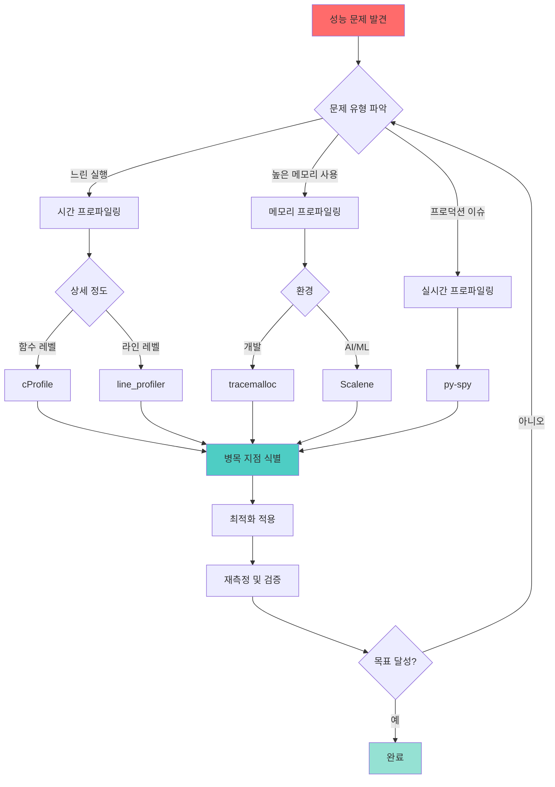
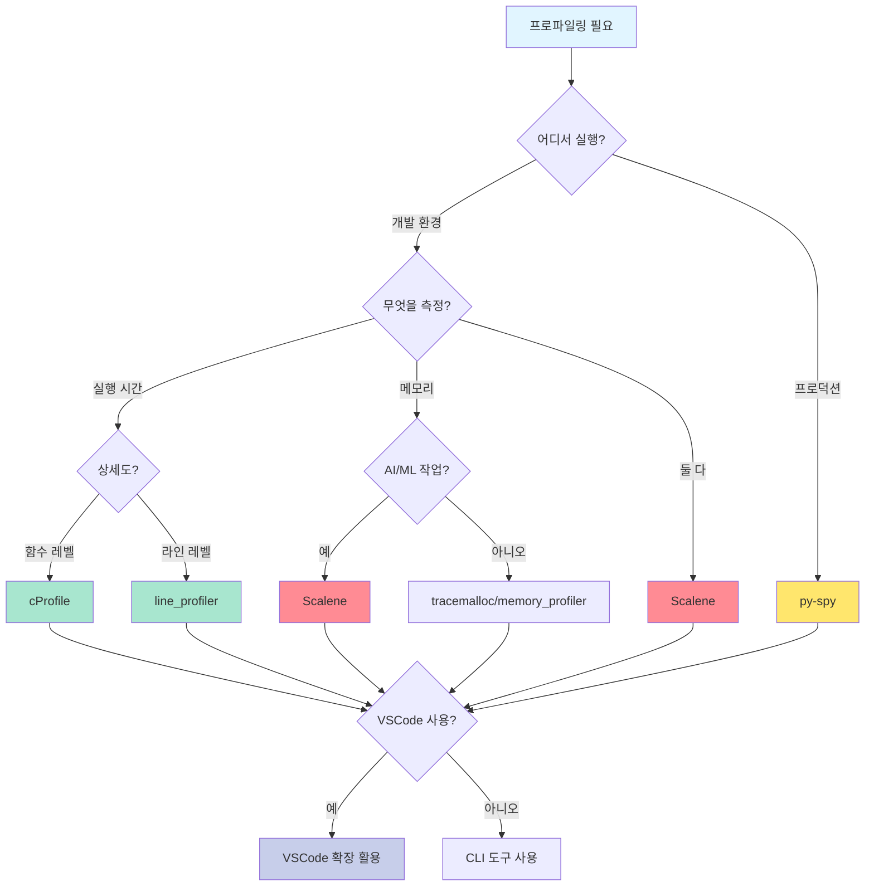
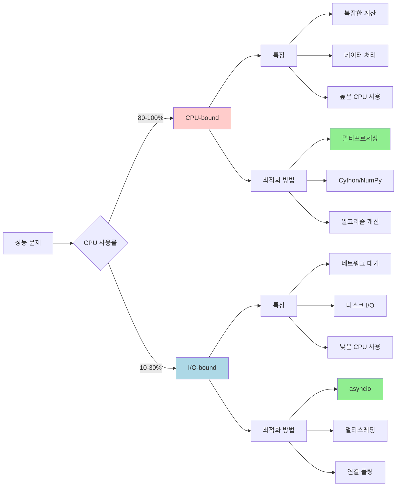
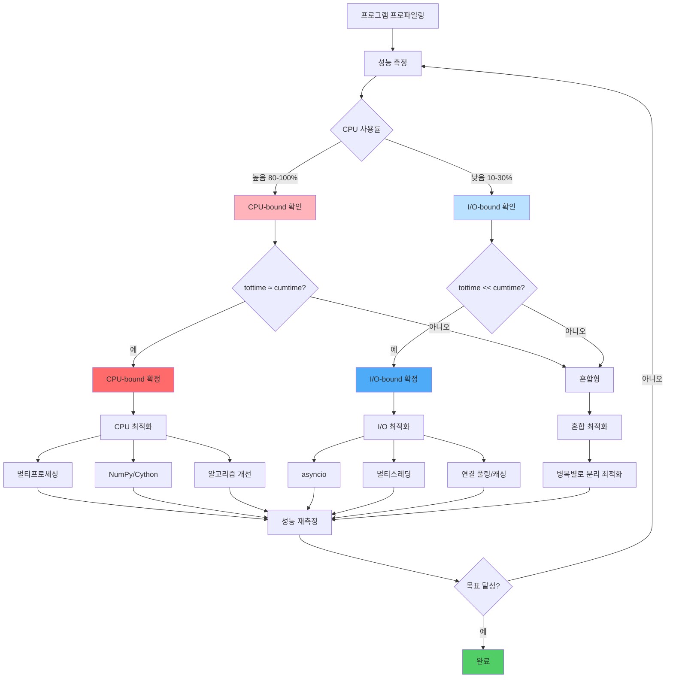
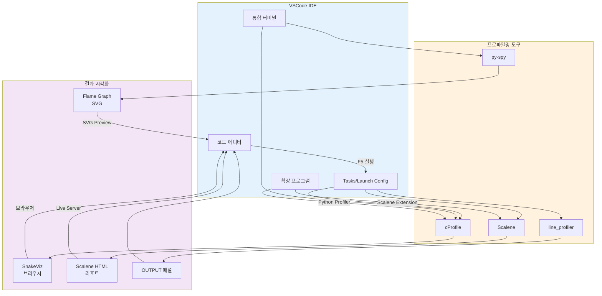

<div class="post-summary-box" markdown="1">

## 📊 이 글에서 배울 내용

### 핵심 프로파일링 도구 마스터하기

- **cProfile**: Python 표준 라이브러리 프로파일러로 함수 레벨 성능 분석
- **line_profiler**: 라인별 상세 분석으로 정확한 병목 지점 식별
- **py-spy**: 프로덕션 환경에서 코드 수정 없이 실시간 프로파일링
- **Scalene**: CPU, 메모리, GPU를 동시에 분석하는 차세대 프로파일러

### 실전 활용 기법

- **I/O-bound vs CPU-bound 구분법**: 프로파일링으로 성능 문제 유형 파악
- **최적화 전략**: 문제 유형에 따른 올바른 최적화 방법 (멀티프로세싱 vs asyncio)
- **VSCode 통합**: IDE에서 프로파일링 워크플로 구축하기

### 학습 성과

이 가이드를 마치면 프로파일링 도구를 선택하고, 성능 병목을 정확히 진단하며, 데이터 기반으로 최적화할 수 있습니다.

**예상 학습 시간**: 30-45분 | **난이도**: 중급

</div>

## 소개

성능 최적화는 Python 개발자에게 중요한 스킬입니다. 코드를 최적화하기 전에 먼저 병목 지점이 어디인지 파악해야 합니다. Python 프로파일링은 실행 시간, 메모리 사용량을 측정하고 애플리케이션의 성능 문제를 식별하는 데 도움을 줍니다.

이 가이드에서는 더 빠르고 효율적인 Python 코드를 작성하는 데 필요한 핵심 프로파일링 도구와 기법을 다룹니다.

### 프로파일링 워크플로 개요



## 프로파일링 이해하기

### 프로파일링이란?

프로파일링은 코드의 성능 특성을 측정하는 프로세스입니다. 다음과 같은 질문에 답하는 데 도움을 줍니다:

- 어떤 함수가 가장 많은 시간을 소비하는가?
- 메모리가 어디에서 할당되는가?
- 함수가 몇 번 호출되는가?
- 성능 병목 지점은 어디인가?

### 프로파일링의 종류

1. **시간 프로파일링**: 함수 실행 시간 측정
2. **메모리 프로파일링**: 메모리 사용량 추적
3. **라인별 프로파일링**: 각 라인의 실행 시간 분석
4. **샘플링 프로파일링**: 실행 중인 프로그램의 주기적 샘플링

## 내장 프로파일링 도구

### cProfile 모듈

Python의 내장 `cProfile` 모듈은 Python 프로그램의 결정론적 프로파일링을 제공합니다. C로 작성되어 오버헤드가 낮고, 별도 설치 없이 사용할 수 있습니다.

#### 기본 사용법

```python
import cProfile
import pstats

def example_function():
    total = 0
    for i in range(1000000):
        total += i
    return total

# 함수 프로파일링
profiler = cProfile.Profile()
profiler.enable()
result = example_function()
profiler.disable()

# 통계 출력
stats = pstats.Stats(profiler)
stats.sort_stats('cumulative')
stats.print_stats(10)  # 상위 10개 함수 표시
```

#### 명령줄에서 사용

```bash
# 스크립트 전체 프로파일링
python -m cProfile -s cumulative script.py

# 결과를 파일로 저장
python -m cProfile -o output.prof script.py

# 정렬 옵션:
# -s cumulative: 누적 시간순 정렬
# -s time: 함수 내부 실행 시간순 정렬
# -s calls: 호출 횟수순 정렬
```

#### 고급 활용: pstats로 결과 분석

```python
import pstats
from pstats import SortKey

# 프로파일 결과 로드
stats = pstats.Stats('output.prof')

# 다양한 정렬 방식
stats.sort_stats(SortKey.TIME)        # 시간순
stats.sort_stats(SortKey.CUMULATIVE)  # 누적 시간순
stats.sort_stats(SortKey.CALLS)       # 호출 횟수순

# 특정 함수만 필터링
stats.print_stats('my_module')  # my_module의 함수만 표시

# 호출자 정보 확인
stats.print_callers('slow_function')  # 누가 이 함수를 호출했는지

# 피호출자 정보 확인
stats.print_callees('main')  # 이 함수가 무엇을 호출했는지

# 통계 제한
stats.print_stats(0.1)  # 상위 10%만 표시
stats.print_stats(20)   # 상위 20개만 표시
```

#### cProfile 출력 이해하기

```
         5 function calls in 0.001 seconds

   Ordered by: cumulative time

   ncalls  tottime  percall  cumtime  percall filename:lineno(function)
        1    0.000    0.000    0.001    0.001 script.py:1(<module>)
        1    0.001    0.001    0.001    0.001 script.py:3(calculate)
        1    0.000    0.000    0.000    0.000 {built-in method sum}
        2    0.000    0.000    0.000    0.000 {built-in method print}
```

**컬럼 설명:**

- **ncalls**: 함수 호출 횟수
- **tottime**: 해당 함수에서 소비한 총 시간 (하위 함수 호출 제외)
- **percall**: tottime / ncalls (함수 호출당 평균 시간)
- **cumtime**: 해당 함수와 모든 하위 함수에서 소비한 총 시간
- **percall**: cumtime / ncalls (함수와 하위 호출 포함 평균 시간)

#### 컨텍스트 매니저로 사용

```python
import cProfile

with cProfile.Profile() as pr:
    # 프로파일링할 코드
    result = expensive_operation()
    process_data(result)

# 자동으로 통계 출력
pr.print_stats(sort='cumulative')
```

#### 장단점

**장점:**

- 별도 설치 불필요 (표준 라이브러리)
- 낮은 오버헤드 (C로 구현)
- 함수 레벨 전체 프로파일링
- 프로덕션에서도 사용 가능

**단점:**

- 라인별 분석 불가능
- 함수 레벨에서만 분석 (세밀한 분석 어려움)
- 결과 해석이 초보자에게 어려울 수 있음

### timeit 모듈

작은 코드 스니펫의 벤치마킹에 적합:

```python
import timeit

# 간단한 연산 시간 측정
execution_time = timeit.timeit(
    'sum(range(100))',
    number=10000
)
print(f"실행 시간: {execution_time:.4f}초")

# 다양한 접근 방식 비교
list_comp = timeit.timeit('[x**2 for x in range(100)]', number=10000)
map_func = timeit.timeit('list(map(lambda x: x**2, range(100)))', number=10000)

print(f"리스트 컴프리헨션: {list_comp:.4f}초")
print(f"map 함수: {map_func:.4f}초")
```

**명령줄에서 사용:**

```bash
# 간단한 표현식 시간 측정
python -m timeit "sum(range(100))"
```

## 라인별 프로파일링

### line_profiler

`line_profiler`는 함수의 각 라인이 몇 번 실행되었고 각 라인에서 얼마나 시간이 소비되었는지 정확히 보여줍니다. cProfile이 함수 레벨 분석이라면, line_profiler는 라인 레벨 분석입니다.

#### 설치

```bash
pip install line_profiler
```

#### 기본 사용법

```python
# script.py
@profile  # line_profiler를 위한 데코레이터
def process_data(data):
    result = []
    for item in data:
        processed = item * 2
        result.append(processed)
    return result

data = list(range(10000))
process_data(data)
```

```bash
# 프로파일링 실행
kernprof -l -v script.py

# 옵션 설명:
# -l: 라인별 프로파일링
# -v: 결과를 바로 출력 (verbose)
```

#### 출력 이해하기

```
Line #  Hits         Time  Per Hit   % Time  Line Contents
==============================================================
     3                                       @profile
     4                                       def process_data(data):
     5     1          2.0      2.0      0.1      result = []
     6 10001       4532.0      0.5     22.5      for item in data:
     7 10000       7821.0      0.8     38.8          processed = item * 2
     8 10000       7801.0      0.8     38.6          result.append(processed)
     9     1          1.0      1.0      0.0      return result
```

**컬럼 설명:**

- **Line #**: 소스 코드의 라인 번호
- **Hits**: 해당 라인이 실행된 횟수
- **Time**: 해당 라인에서 소비한 총 시간 (마이크로초)
- **Per Hit**: 평균 실행 시간 (Time / Hits)
- **% Time**: 전체 시간 중 해당 라인이 차지하는 비율

#### 프로그래밍 방식으로 사용

```python
from line_profiler import LineProfiler

def slow_function(n):
    total = 0
    for i in range(n):
        total += i ** 2
    return total

def main():
    result = slow_function(1000000)
    return result

# LineProfiler 객체 생성
profiler = LineProfiler()

# 프로파일링할 함수 등록
profiler.add_function(slow_function)

# 메인 함수를 래핑하여 실행
profiler_wrapper = profiler(main)
profiler_wrapper()

# 결과 출력
profiler.print_stats()
```

#### 여러 함수 동시 프로파일링

```python
# script.py
def function_a(data):
    return [x * 2 for x in data]

def function_b(data):
    return sum(data)

@profile
def main():
    data = list(range(100000))
    result_a = function_a(data)
    result_b = function_b(result_a)
    return result_b

if __name__ == '__main__':
    main()
```

```bash
# 특정 함수들만 프로파일링
kernprof -l -v script.py

# 또는 프로그래밍 방식으로
python -c "
from line_profiler import LineProfiler
from script import main, function_a, function_b

lp = LineProfiler()
lp.add_function(function_a)
lp.add_function(function_b)
lp.add_function(main)
lp.runcall(main)
lp.print_stats()
"
```

#### 실전 예제: 최적화 전후 비교

**최적화 전:**

```python
@profile
def process_items_slow(items):
    result = []
    for item in items:
        if item % 2 == 0:
            squared = item ** 2
            result.append(squared)
    return result
```

**최적화 후:**

```python
@profile
def process_items_fast(items):
    # 리스트 컴프리헨션 사용
    return [item ** 2 for item in items if item % 2 == 0]
```

비교 결과를 보면 리스트 컴프리헨션이 for 루프보다 훨씬 빠른 것을 확인할 수 있습니다.

#### 장단점

**장점:**

- 정확한 라인별 시간 측정
- 병목 지점을 정확히 찾을 수 있음
- 최적화 전후 비교에 이상적
- 출력이 직관적이고 읽기 쉬움

**단점:**

- 데코레이터 추가 필요 (코드 수정)
- 오버헤드가 상대적으로 높음
- 큰 프로젝트에서는 분석 시간이 오래 걸림
- 프로덕션 환경에는 부적합

## 메모리 프로파일링

### memory_profiler

라인별 메모리 사용량 추적:

```python
# 설치: pip install memory_profiler

from memory_profiler import profile

@profile
def memory_intensive_function():
    # 큰 리스트 생성
    big_list = [i for i in range(1000000)]

    # 큰 딕셔너리 생성
    big_dict = {i: i**2 for i in range(100000)}

    return len(big_list) + len(big_dict)

if __name__ == '__main__':
    result = memory_intensive_function()
    print(f"결과: {result}")
```

**실행 방법:**

```bash
# 메모리 프로파일링 실행
python -m memory_profiler script.py

# 출력 예시:
# Line #    Mem usage    Increment  Occurrences   Line Contents
# =============================================================
#      3   38.5 MiB   38.5 MiB           1   @profile
#      4                                      def memory_intensive_function():
#      5   46.1 MiB    7.6 MiB           1       big_list = [i for i in range(1000000)]
#      6   54.3 MiB    8.2 MiB           1       big_dict = {i: i**2 for i in range(100000)}
#      7   54.3 MiB    0.0 MiB           1       return len(big_list) + len(big_dict)
```

### tracemalloc (내장 모듈)

Python 3.4+에서 사용 가능한 내장 메모리 추적 도구:

```python
import tracemalloc

# 메모리 추적 시작
tracemalloc.start()

# 메모리를 많이 사용하는 코드
data = [i**2 for i in range(100000)]
more_data = {i: str(i) for i in range(50000)}

# 현재 메모리 사용량 확인
current, peak = tracemalloc.get_traced_memory()
print(f"현재 메모리 사용량: {current / 1024 / 1024:.2f} MB")
print(f"최대 메모리 사용량: {peak / 1024 / 1024:.2f} MB")

# 메모리를 가장 많이 사용하는 부분 찾기
snapshot = tracemalloc.take_snapshot()
top_stats = snapshot.statistics('lineno')

print("\n메모리를 가장 많이 사용하는 상위 3개:")
for stat in top_stats[:3]:
    print(stat)

tracemalloc.stop()
```

## 시각화 도구

### SnakeViz

cProfile 출력을 브라우저에서 시각화:

```bash
# 설치
pip install snakeviz

# 프로파일링 후 시각화
python -m cProfile -o program.prof script.py
snakeviz program.prof
```

**특징:**

- 인터랙티브한 icicle 차트와 sunburst 차트
- 함수 호출 계층 구조 시각화
- 브라우저 기반 인터페이스

### py-spy

`py-spy`는 실행 중인 Python 프로그램을 프로파일링할 수 있는 샘플링 프로파일러입니다. **코드 수정 없이** 프로덕션 환경에서도 사용할 수 있는 강력한 도구입니다.

#### 설치

```bash
pip install py-spy

# 또는 root 권한이 필요한 경우
sudo pip install py-spy
```

#### 기본 사용법

**1. Top 모드 (실시간 모니터링)**

```bash
# 실행 중인 프로세스 프로파일링 (PID 사용)
py-spy top --pid 12345

# Python 스크립트 실행하면서 프로파일링
py-spy top -- python script.py

# 특정 인터프리터로 실행
py-spy top -- python3.9 script.py
```

Top 모드는 `top` 명령어처럼 실시간으로 함수 호출 통계를 보여줍니다:

```
Total Samples 1000
GIL: 100%, Active: 100%, Threads: 4

  %Own   %Total  OwnTime  TotalTime  Function (filename:line)
 60.00%  60.00%   0.600s    0.600s   slow_function (script.py:10)
 30.00%  30.00%   0.300s    0.300s   medium_function (script.py:20)
 10.00%  10.00%   0.100s    0.100s   fast_function (script.py:30)
```

**2. Record 모드 (Flame Graph 생성)**

```bash
# Flame graph 생성
py-spy record -o profile.svg -- python script.py

# 샘플링 레이트 조정 (기본: 100Hz)
py-spy record --rate 1000 -o profile.svg -- python script.py

# 네이티브 확장 포함 (C/C++ 코드도 프로파일링)
py-spy record --native -o profile.svg -- python script.py

# 실행 중인 프로세스 기록
py-spy record -o profile.svg --pid 12345 --duration 60
```

**3. Dump 모드 (스택 트레이스 덤프)**

```bash
# 현재 스택 트레이스 출력
py-spy dump --pid 12345

# 모든 스레드의 스택 트레이스
py-spy dump --pid 12345 --full

# JSON 형식으로 출력
py-spy dump --pid 12345 --json
```

#### 고급 활용

**서브프로세스 프로파일링:**

```bash
# 서브프로세스도 함께 프로파일링
py-spy record --subprocesses -o profile.svg -- python script.py
```

**GIL 분석:**

```bash
# GIL 상태 추적
py-spy record --gil -o profile.svg -- python script.py

# 멀티스레딩 프로그램의 GIL 경합 확인에 유용
```

**특정 함수만 필터링:**

```bash
# 특정 모듈만 프로파일링
py-spy record --function -o profile.svg -- python script.py

# 정규식으로 필터링
py-spy record --regex "mymodule.*" -o profile.svg -- python script.py
```

#### 실전 예제: Flask 앱 프로파일링

```python
# app.py
from flask import Flask
import time

app = Flask(__name__)

@app.route('/slow')
def slow_endpoint():
    time.sleep(0.5)
    result = calculate_something()
    return {"result": result}

def calculate_something():
    total = 0
    for i in range(1000000):
        total += i ** 2
    return total

if __name__ == '__main__':
    app.run(debug=False)
```

```bash
# Flask 앱 실행
python app.py &
APP_PID=$!

# 60초 동안 프로파일링
py-spy record -o flask_profile.svg --pid $APP_PID --duration 60

# 부하 테스트와 함께
# 터미널 1: Flask 앱 실행
python app.py

# 터미널 2: 프로파일링 시작
py-spy record -o profile.svg --pid $(pgrep -f app.py) --duration 60

# 터미널 3: 부하 생성
ab -n 1000 -c 10 http://localhost:5000/slow
```

#### Flame Graph 읽는 법

Flame Graph는 함수 호출 스택을 시각화한 차트입니다:

- **X축 (너비)**: CPU 시간 사용량 (넓을수록 더 많은 시간 소비)
- **Y축 (높이)**: 호출 스택 깊이 (위로 갈수록 더 깊은 호출)
- **색상**: 무작위 (의미 없음, 시각적 구분용)

**읽는 팁:**

- 가장 넓은 박스 찾기 → 가장 많은 시간을 소비하는 함수
- 평평한 상단 (plateau) → 실제 작업이 일어나는 곳
- 높은 스택 → 깊은 호출 체인

#### 실전 사용 시나리오

**1. 프로덕션 서버에서 느린 요청 디버깅:**

```bash
# 서버 PID 찾기
ps aux | grep python

# 30초 동안 샘플링
sudo py-spy record -o prod_profile.svg --pid 12345 --duration 30

# SVG 파일 다운로드 후 브라우저로 확인
```

**2. 멀티스레딩 앱의 GIL 경합 분석:**

```bash
# GIL 추적 활성화
py-spy record --gil -o gil_profile.svg -- python multithread_app.py

# Flame graph에서 빨간색 = GIL 대기 시간
```

**3. CPU vs I/O 바운드 구분:**

```bash
# 네이티브 스택 포함
py-spy record --native --idle -o full_profile.svg -- python script.py

# --idle: I/O 대기 중인 시간도 포함
```

#### 장단점

**장점:**

- **코드 수정 불필요**: 실행 중인 프로세스에 attach 가능
- **낮은 오버헤드**: 프로덕션 환경에서도 안전하게 사용
- **멀티스레드/프로세스 지원**: GIL 분석 가능
- **시각화**: Flame graph로 직관적인 분석
- **샘플링 방식**: 빠르고 효율적
- **네이티브 코드 프로파일링**: C/C++ 확장도 분석 가능

**단점:**

- **샘플링 기반**: 매우 빠른 함수는 놓칠 수 있음
- **라인별 분석 불가**: 함수 레벨만 가능
- **권한 필요**: 다른 프로세스 프로파일링 시 sudo 필요
- **결정론적 아님**: 실행마다 결과가 약간 다를 수 있음

#### py-spy vs cProfile 비교

| 특징            | py-spy           | cProfile          |
| --------------- | ---------------- | ----------------- |
| 코드 수정       | 불필요           | 불필요            |
| 프로파일링 방식 | 샘플링           | 결정론적          |
| 오버헤드        | 매우 낮음 (1-5%) | 낮음 (10-30%)     |
| 프로덕션 사용   | ✅ 적합          | ⚠️ 주의 필요      |
| 실행 중 attach  | ✅ 가능          | ❌ 불가능         |
| 멀티스레드      | ✅ 우수          | ⚠️ 제한적         |
| 시각화          | ✅ Flame graph   | ❌ 별도 도구 필요 |
| 정확도          | ⚠️ 근사치        | ✅ 정확           |

### Scalene

`Scalene`은 CPU, GPU, 메모리를 동시에 프로파일링할 수 있는 차세대 프로파일러입니다. AI/ML 작업에 특히 유용하며, 라인별 상세 분석과 함께 메모리 사용량까지 추적합니다.

#### 설치

```bash
pip install scalene

# macOS에서 추가 권한 필요 시
sudo pip install scalene
```

#### 기본 사용법

```bash
# 기본 프로파일링
scalene script.py

# 특정 함수만 프로파일링
scalene --profile-only function_name script.py

# HTML 리포트 생성
scalene --html --outfile profile.html script.py

# 메모리 프로파일링 비활성화 (CPU만)
scalene --cpu-only script.py

# GPU 프로파일링 활성화
scalene --gpu script.py
```

#### 프로그래밍 방식으로 사용

```python
from scalene import scalene_profiler

# 프로파일링 시작
scalene_profiler.start()

# 프로파일링할 코드
def my_function():
    data = [i ** 2 for i in range(1000000)]
    return sum(data)

result = my_function()

# 프로파일링 종료
scalene_profiler.stop()
```

#### Scalene 출력 이해하기

Scalene은 터미널에서 컬러풀한 테이블 형식으로 결과를 보여줍니다:

```
Memory usage: ▁▂▃▅▆▇█ (max: 45.2MB)

Line │ Time % │ Time % │     │Mem % │Mem % │ script.py
     │  Python│  native│ sys │Python│ peak │
─────┼────────┼────────┼─────┼──────┼──────┼─────────────────────
   1 │        │        │     │      │      │ def process_data():
   2 │   45%  │    5%  │ 10% │  60% │  80% │     data = [i**2 for i in range(1000000)]
   3 │   30%  │    8%  │  2% │  30% │  15% │     result = sum(data)
   4 │        │        │     │      │      │     return result
```

**컬럼 설명:**

- **Time % Python**: Python 코드 실행 시간 비율
- **Time % native**: 네이티브 코드 (C/C++) 실행 시간 비율
- **sys**: 시스템 시간 (I/O 등)
- **Mem % Python**: Python 객체 메모리 사용 비율
- **Mem % peak**: 최대 메모리 사용 시점

#### 고급 기능

**1. 메모리 누수 탐지:**

```bash
# 메모리 누수 경고 활성화
scalene --reduced-profile script.py

# 메모리 증가 추적
scalene --memory-leak-detector script.py
```

**2. 프로파일 영역 제한:**

```python
from scalene import scalene_profiler

def expensive_function():
    # 프로파일링 일시 중지
    scalene_profiler.pause()

    # 이 부분은 프로파일링 안 됨
    setup_code()

    # 프로파일링 재개
    scalene_profiler.resume()

    # 이 부분만 프로파일링
    actual_work()
```

**3. 샘플링 간격 조정:**

```bash
# 더 정확한 프로파일링 (더 높은 오버헤드)
scalene --sampling-rate 0.001 script.py

# 더 빠른 프로파일링 (낮은 정확도)
scalene --sampling-rate 0.1 script.py
```

#### 실전 예제: NumPy vs 순수 Python 비교

```python
# comparison.py
import numpy as np

def pure_python_sum(n):
    """순수 Python으로 합계 계산"""
    data = [i for i in range(n)]
    return sum(data)

def numpy_sum(n):
    """NumPy로 합계 계산"""
    data = np.arange(n)
    return np.sum(data)

if __name__ == '__main__':
    n = 10_000_000

    result1 = pure_python_sum(n)
    result2 = numpy_sum(n)

    print(f"Pure Python: {result1}")
    print(f"NumPy: {result2}")
```

```bash
scalene comparison.py
```

Scalene은 NumPy 함수가 네이티브 코드로 실행되는 것을 보여주며, 훨씬 빠른 것을 확인할 수 있습니다.

#### GPU 프로파일링 (PyTorch/TensorFlow)

```python
# gpu_script.py
import torch

def train_model():
    # GPU 메모리 할당
    model = torch.nn.Linear(1000, 100).cuda()
    data = torch.randn(1000, 1000).cuda()

    # 학습
    for _ in range(100):
        output = model(data)
        loss = output.sum()
        loss.backward()

if __name__ == '__main__':
    train_model()
```

```bash
# GPU 프로파일링
scalene --gpu gpu_script.py
```

#### HTML 리포트 활용

```bash
# 인터랙티브 HTML 리포트 생성
scalene --html --outfile report.html script.py

# 브라우저에서 자동 열기
scalene --html --outfile report.html --viewer script.py
```

HTML 리포트는:

- 라인별 CPU/메모리 사용량 시각화
- 함수 호출 그래프
- 시간에 따른 메모리 사용량 그래프
- 소스 코드와 프로파일 데이터 병렬 표시

#### Scalene vs 다른 프로파일러

| 특징               | Scalene       | cProfile      | line_profiler   | py-spy           |
| ------------------ | ------------- | ------------- | --------------- | ---------------- |
| CPU 프로파일링     | ✅ 라인별     | ✅ 함수별     | ✅ 라인별       | ✅ 함수별        |
| 메모리 프로파일링  | ✅ 라인별     | ❌            | ❌              | ❌               |
| GPU 지원           | ✅            | ❌            | ❌              | ❌               |
| 네이티브 코드 구분 | ✅            | ❌            | ❌              | ✅               |
| 오버헤드           | 낮음 (10-20%) | 낮음 (10-30%) | 높음 (50%+)     | 매우 낮음 (1-5%) |
| 코드 수정          | 불필요        | 불필요        | 필요 (@profile) | 불필요           |
| 시각화             | ✅ HTML       | ❌            | ❌              | ✅ Flame graph   |
| AI/ML 최적화       | ✅ 우수       | ❌            | ❌              | ⚠️ 보통          |

#### 장단점

**장점:**

- **올인원 솔루션**: CPU, 메모리, GPU를 한 번에 프로파일링
- **라인별 정확도**: 정확한 병목 지점 식별
- **Python vs Native 구분**: NumPy, C 확장 등의 성능 분리 측정
- **GPU 지원**: PyTorch, TensorFlow 등의 GPU 사용량 추적
- **낮은 오버헤드**: 샘플링 기반으로 빠름
- **시각화**: HTML 리포트로 직관적인 분석

**단점:**

- **비교적 신규 도구**: 커뮤니티가 cProfile보다 작음
- **복잡한 출력**: 초보자에게는 정보량이 많을 수 있음
- **일부 환경 제약**: 일부 플랫폼에서 권한 문제 발생 가능

#### 언제 Scalene을 사용해야 하나?

**사용하기 좋은 경우:**

- AI/ML 모델 학습 최적화
- 메모리 사용량이 중요한 애플리케이션
- NumPy, Pandas 등 네이티브 라이브러리 사용 코드
- GPU 가속 코드 분석
- 라인별 상세 분석이 필요한 경우

**다른 도구가 나은 경우:**

- 단순한 함수 레벨 분석: cProfile
- 프로덕션 환경 실시간 모니터링: py-spy
- 매우 세밀한 라인별 시간 측정: line_profiler

## 프로파일링 도구 비교 및 선택 가이드

### 도구 선택 플로우차트



### 상황별 최적 도구

| 상황                  | 추천 도구                | 이유                            |
| --------------------- | ------------------------ | ------------------------------- |
| 빠른 함수 레벨 분석   | cProfile                 | 설치 불필요, 빠름               |
| 라인별 상세 시간 분석 | line_profiler            | 정확한 라인별 측정              |
| 프로덕션 환경 디버깅  | py-spy                   | 코드 수정 불필요, 낮은 오버헤드 |
| AI/ML 최적화          | Scalene                  | GPU + 메모리 + CPU 동시 분석    |
| 메모리 누수 찾기      | Scalene 또는 tracemalloc | 메모리 추적 특화                |
| 멀티스레딩 GIL 분석   | py-spy                   | GIL 추적 지원                   |
| 초보자 학습용         | cProfile + SnakeViz      | 시각화로 이해하기 쉬움          |

## 실전 프로파일링 예제

### 느린 함수 최적화하기

**최적화 전:**

```python
def slow_function(data):
    result = []
    for item in data:
        if item % 2 == 0:
            result.append(item ** 2)
    return result

# 프로파일링
import cProfile
import pstats

profiler = cProfile.Profile()
profiler.enable()

data = list(range(1000000))
result = slow_function(data)

profiler.disable()
stats = pstats.Stats(profiler)
stats.print_stats()
```

**최적화 후:**

```python
def fast_function(data):
    # 리스트 컴프리헨션 사용
    return [item ** 2 for item in data if item % 2 == 0]

# 또는 NumPy 사용 (대량 데이터의 경우)
import numpy as np

def numpy_function(data):
    arr = np.array(data)
    even_mask = arr % 2 == 0
    return arr[even_mask] ** 2
```

### 메모리 누수 찾기

```python
import tracemalloc

class LeakyClass:
    def __init__(self):
        self.data = []

    def add_data(self, size):
        # 메모리 누수: 데이터가 계속 누적됨
        self.data.extend(range(size))

# 메모리 추적
tracemalloc.start()

obj = LeakyClass()
for i in range(10):
    obj.add_data(100000)

    current, peak = tracemalloc.get_traced_memory()
    print(f"반복 {i+1}: 현재 {current / 1024 / 1024:.2f} MB, "
          f"최대 {peak / 1024 / 1024:.2f} MB")

tracemalloc.stop()
```

### I/O-bound vs CPU-bound 프로파일링 비교

성능 문제를 최적화하기 전에 먼저 프로그램이 **I/O-bound**인지 **CPU-bound**인지 파악해야 합니다. 각각 최적화 전략이 완전히 다르기 때문입니다.

#### 개념 이해



**CPU-bound (CPU 바운드):**

- CPU 연산이 병목: 복잡한 계산, 데이터 처리
- CPU 사용률이 높음 (80-100%)
- 예시: 이미지 처리, 암호화, 머신러닝 학습

**I/O-bound (I/O 바운드):**

- I/O 대기가 병목: 네트워크, 디스크, 데이터베이스
- CPU 사용률이 낮음 (10-30%)
- 예시: 웹 크롤링, 파일 읽기/쓰기, API 호출

#### 실습 예제 1: CPU-bound 프로그램

```python
# cpu_bound.py
import time
import cProfile
import pstats

def cpu_intensive_task(n):
    """CPU 집약적 작업: 소수 찾기"""
    primes = []
    for num in range(2, n):
        is_prime = True
        for i in range(2, int(num ** 0.5) + 1):
            if num % i == 0:
                is_prime = False
                break
        if is_prime:
            primes.append(num)
    return primes

def main():
    print("CPU-bound 작업 시작...")
    start = time.time()

    # 10,000 이하의 소수 찾기
    result = cpu_intensive_task(10000)

    elapsed = time.time() - start
    print(f"찾은 소수 개수: {len(result)}")
    print(f"실행 시간: {elapsed:.2f}초")

if __name__ == '__main__':
    # cProfile로 프로파일링
    profiler = cProfile.Profile()
    profiler.enable()

    main()

    profiler.disable()
    stats = pstats.Stats(profiler)
    stats.sort_stats('cumulative')
    stats.print_stats(10)
```

**실행 결과:**

```bash
python cpu_bound.py

# 출력:
# CPU-bound 작업 시작...
# 찾은 소수 개수: 1229
# 실행 시간: 2.34초
#
# ncalls  tottime  percall  cumtime  percall filename:lineno(function)
#      1    2.340    2.340    2.340    2.340 cpu_bound.py:4(cpu_intensive_task)
#      1    0.000    0.000    2.340    2.340 cpu_bound.py:16(main)
```

**분석:**

- `tottime`이 매우 높음 → CPU에서 실제 계산 수행
- I/O 관련 함수 호출 없음
- **해결책**: 멀티프로세싱, NumPy/Cython 사용, 알고리즘 최적화

#### 실습 예제 2: I/O-bound 프로그램

```python
# io_bound.py
import time
import requests
import cProfile
import pstats

def io_intensive_task(urls):
    """I/O 집약적 작업: 여러 웹페이지 가져오기"""
    results = []
    for url in urls:
        try:
            response = requests.get(url, timeout=5)
            results.append(len(response.content))
        except Exception as e:
            results.append(0)
    return results

def main():
    print("I/O-bound 작업 시작...")
    start = time.time()

    # 여러 웹사이트에서 데이터 가져오기
    urls = [
        'https://www.python.org',
        'https://www.github.com',
        'https://www.stackoverflow.com',
        'https://www.wikipedia.org',
        'https://www.reddit.com'
    ]

    results = io_intensive_task(urls)

    elapsed = time.time() - start
    print(f"가져온 페이지 수: {len(results)}")
    print(f"실행 시간: {elapsed:.2f}초")

if __name__ == '__main__':
    # cProfile로 프로파일링
    profiler = cProfile.Profile()
    profiler.enable()

    main()

    profiler.disable()
    stats = pstats.Stats(profiler)
    stats.sort_stats('cumulative')
    stats.print_stats(10)
```

**실행 결과:**

```bash
python io_bound.py

# 출력:
# I/O-bound 작업 시작...
# 가져온 페이지 수: 5
# 실행 시간: 3.45초
#
# ncalls  tottime  percall  cumtime  percall filename:lineno(function)
#      5    0.001    0.000    3.420    0.684 {method 'get' of 'requests'}
#      1    0.024    0.024    3.445    3.445 io_bound.py:5(io_intensive_task)
#      1    0.000    0.000    3.445    3.445 io_bound.py:16(main)
```

**분석:**

- `tottime`은 낮지만 `cumtime`이 높음 → I/O 대기 시간
- 네트워크 요청에서 대부분의 시간 소비
- **해결책**: 비동기 I/O (asyncio), 멀티스레딩, 연결 풀링

#### 실습 예제 3: py-spy로 구분하기

**CPU-bound 프로파일링:**

```bash
# CPU-bound 프로그램 프로파일링
py-spy record -o cpu_profile.svg -- python cpu_bound.py
```

Flame graph를 보면:

- `cpu_intensive_task` 함수가 넓은 박스로 표시됨
- 대부분의 시간이 Python 코드 실행에 소비
- I/O 대기 시간 없음

**I/O-bound 프로파일링:**

```bash
# I/O-bound 프로그램 프로파일링 (idle 포함)
py-spy record --idle -o io_profile.svg -- python io_bound.py
```

Flame graph를 보면:

- `socket.recv` 또는 `select.select` 같은 I/O 함수가 넓게 표시
- 대부분의 시간이 대기(idle) 상태
- Python 코드 실행 시간은 매우 짧음

#### 실습 예제 4: Scalene으로 동시 분석

```python
# mixed_workload.py
import time
import requests

def cpu_task():
    """CPU 작업: 피보나치 수열 계산"""
    def fib(n):
        if n <= 1:
            return n
        return fib(n-1) + fib(n-2)

    result = fib(30)
    return result

def io_task():
    """I/O 작업: 웹 페이지 가져오기"""
    response = requests.get('https://www.python.org', timeout=5)
    return len(response.content)

def main():
    print("혼합 작업 시작...")

    # CPU 작업
    cpu_result = cpu_task()
    print(f"Fibonacci(30) = {cpu_result}")

    # I/O 작업
    io_result = io_task()
    print(f"페이지 크기: {io_result} bytes")

if __name__ == '__main__':
    main()
```

```bash
# Scalene으로 프로파일링
scalene mixed_workload.py
```

**Scalene 출력 분석:**

```
Line │ Time % │ Time % │ sys │ mixed_workload.py
     │ Python │ native │     │
─────┼────────┼────────┼─────┼──────────────────
   6 │  95.0% │   0.0% │  0% │ def fib(n):        # ← CPU-bound
  14 │   0.5% │   0.0% │ 4.5%│ response = requests.get(...)  # ← I/O-bound
```

**sys** 컬럼이 높으면 I/O-bound, **Python** 컬럼이 높으면 CPU-bound입니다.

#### 실습 예제 5: 최적화 전후 비교

**I/O-bound 최적화: 순차 → 병렬**

```python
# io_optimization.py
import time
import requests
import asyncio
import aiohttp
from concurrent.futures import ThreadPoolExecutor

URLS = [
    'https://www.python.org',
    'https://www.github.com',
    'https://www.stackoverflow.com',
] * 3  # 9개 요청

# ❌ 나쁜 예: 순차 실행 (I/O-bound)
def sequential_fetch():
    """순차적으로 URL 가져오기"""
    start = time.time()
    results = []
    for url in URLS:
        response = requests.get(url, timeout=5)
        results.append(len(response.content))
    elapsed = time.time() - start
    print(f"순차 실행: {elapsed:.2f}초")
    return results

# ✅ 좋은 예 1: 멀티스레딩
def threaded_fetch():
    """스레드 풀로 병렬 가져오기"""
    start = time.time()

    def fetch_url(url):
        response = requests.get(url, timeout=5)
        return len(response.content)

    with ThreadPoolExecutor(max_workers=5) as executor:
        results = list(executor.map(fetch_url, URLS))

    elapsed = time.time() - start
    print(f"멀티스레드: {elapsed:.2f}초")
    return results

# ✅ 좋은 예 2: 비동기 I/O
async def async_fetch():
    """asyncio로 비동기 가져오기"""
    start = time.time()

    async def fetch_url(session, url):
        async with session.get(url, timeout=aiohttp.ClientTimeout(total=5)) as response:
            content = await response.read()
            return len(content)

    async with aiohttp.ClientSession() as session:
        tasks = [fetch_url(session, url) for url in URLS]
        results = await asyncio.gather(*tasks)

    elapsed = time.time() - start
    print(f"비동기 I/O: {elapsed:.2f}초")
    return results

if __name__ == '__main__':
    print("=== I/O-bound 최적화 비교 ===\n")

    # 순차 실행
    sequential_fetch()

    # 멀티스레드
    threaded_fetch()

    # 비동기 I/O
    asyncio.run(async_fetch())
```

**실행 결과:**

```bash
python io_optimization.py

# 출력:
# === I/O-bound 최적화 비교 ===
#
# 순차 실행: 9.23초
# 멀티스레드: 2.15초  (4.3x 빠름!)
# 비동기 I/O: 1.87초  (4.9x 빠름!)
```

**CPU-bound 최적화: 순차 → 멀티프로세싱**

```python
# cpu_optimization.py
import time
import multiprocessing as mp

def cpu_task(n):
    """CPU 집약적 작업"""
    total = 0
    for i in range(n):
        total += i ** 2
    return total

# ❌ 나쁜 예: 순차 실행 (CPU-bound)
def sequential_compute():
    """순차적으로 계산"""
    start = time.time()
    data = [10_000_000] * 4
    results = [cpu_task(n) for n in data]
    elapsed = time.time() - start
    print(f"순차 실행: {elapsed:.2f}초")
    return results

# ✅ 좋은 예: 멀티프로세싱
def parallel_compute():
    """멀티프로세싱으로 병렬 계산"""
    start = time.time()
    data = [10_000_000] * 4

    with mp.Pool(processes=4) as pool:
        results = pool.map(cpu_task, data)

    elapsed = time.time() - start
    print(f"멀티프로세싱: {elapsed:.2f}초")
    return results

if __name__ == '__main__':
    print("=== CPU-bound 최적화 비교 ===\n")

    # 순차 실행
    sequential_compute()

    # 멀티프로세싱
    parallel_compute()
```

**실행 결과:**

```bash
python cpu_optimization.py

# 출력:
# === CPU-bound 최적화 비교 ===
#
# 순차 실행: 8.45초
# 멀티프로세싱: 2.31초  (3.7x 빠름!)
```

#### 프로파일링으로 구분하는 방법 요약

| 지표               | CPU-bound                   | I/O-bound              |
| ------------------ | --------------------------- | ---------------------- |
| CPU 사용률         | 높음 (80-100%)              | 낮음 (10-30%)          |
| cProfile `tottime` | 높음                        | 낮음                   |
| cProfile `cumtime` | tottime과 유사              | tottime보다 훨씬 높음  |
| Scalene `Python %` | 높음                        | 낮음                   |
| Scalene `sys %`    | 낮음                        | 높음                   |
| py-spy Flame graph | 계산 함수가 넓음            | I/O 함수가 넓음        |
| 최적화 방법        | 멀티프로세싱, 알고리즘 개선 | 비동기 I/O, 멀티스레딩 |

#### 최적화 전략 결정 트리



#### 핵심 포인트

1. **먼저 구분하라**: 최적화 전에 CPU-bound인지 I/O-bound인지 확인
2. **잘못된 최적화**: CPU-bound에 멀티스레딩은 효과 없음 (GIL)
3. **올바른 최적화**:
   - **CPU-bound** → 멀티프로세싱, Cython, NumPy
   - **I/O-bound** → asyncio, 멀티스레딩, 연결 풀링
4. **프로파일링 도구**:
   - **cProfile**: tottime vs cumtime 비교
   - **Scalene**: Python % vs sys % 비교
   - **py-spy**: Flame graph로 시각적 확인

## VSCode에서 프로파일링하기

VSCode는 Python 개발에 가장 인기 있는 IDE 중 하나입니다. 다양한 확장과 통합 기능을 통해 프로파일링을 더 쉽게 할 수 있습니다.

### 추천 VSCode 확장 프로그램

#### 1. Python Extension (필수)

Microsoft의 공식 Python 확장은 기본적인 프로파일링 지원을 제공합니다.

**설치:**

```bash
# VSCode에서
Ctrl+Shift+X (또는 Cmd+Shift+X)
"Python" 검색 후 설치
```

**기능:**

- 통합 터미널에서 프로파일링 명령 실행
- 디버깅과 프로파일링 동시 지원
- Jupyter 노트북 통합

#### 2. Python Profiler Extension

VSCode에서 직접 프로파일링 결과를 시각화할 수 있는 확장입니다.

**설치:**

- Extension ID: `ms-python.vscode-pylance`와 함께 사용
- "Python Profiler" 검색 후 설치

**사용법:**

```bash
# 1. 프로파일 생성
python -m cProfile -o output.prof script.py

# 2. VSCode에서 .prof 파일 열기
# output.prof 파일을 클릭하면 자동으로 시각화
```

**기능:**

- cProfile 결과를 트리뷰로 시각화
- 함수별 시간 소비 막대 그래프
- 호출 계층 구조 탐색
- 함수 클릭 시 소스 코드로 이동

#### 3. Scalene VSCode Extension

Scalene을 VSCode에서 직접 사용할 수 있는 확장입니다.

**설치:**

```bash
# 1. Scalene 설치
pip install scalene

# 2. VSCode 확장 설치
# "Scalene" 검색
```

**사용법:**

1. Python 파일 열기
2. Command Palette (Cmd+Shift+P): "Scalene: Profile Script"
3. HTML 리포트가 VSCode 내부 브라우저에서 열림

**장점:**

- IDE 내에서 완결된 프로파일링 워크플로
- CPU, 메모리, GPU 동시 분석
- 라인별 프로파일 결과 하이라이팅
- 소스 코드와 프로파일 데이터 나란히 보기

#### 4. Python Test Explorer

테스트 성능을 프로파일링할 때 유용합니다.

**설치:**

- "Python Test Explorer" 검색 후 설치

**기능:**

- pytest, unittest 통합
- 각 테스트의 실행 시간 표시
- 느린 테스트 자동 식별
- 테스트별 프로파일링 가능

### VSCode 프로파일링 통합 아키텍처



### VSCode에서 프로파일링 워크플로

#### 워크플로 1: cProfile + VSCode 시각화

**1. 프로파일 생성 (통합 터미널):**

```bash
# VSCode 터미널에서
python -m cProfile -o profile.prof script.py
```

**2. VSCode에서 결과 보기:**

`launch.json` 설정:

```json
{
  "version": "0.2.0",
  "configurations": [
    {
      "name": "Python: Profile",
      "type": "python",
      "request": "launch",
      "program": "${file}",
      "console": "integratedTerminal",
      "args": ["-m", "cProfile", "-o", "profile.prof"]
    }
  ]
}
```

**3. 결과 분석:**

- `profile.prof` 파일을 에디터에서 열기
- 또는 SnakeViz 사용:

```bash
pip install snakeviz
snakeviz profile.prof
```

#### 워크플로 2: line_profiler 통합

**1. 설정 파일 생성 (`.vscode/tasks.json`):**

```json
{
  "version": "2.0.0",
  "tasks": [
    {
      "label": "Profile with line_profiler",
      "type": "shell",
      "command": "kernprof",
      "args": ["-l", "-v", "${file}"],
      "problemMatcher": [],
      "presentation": {
        "reveal": "always",
        "panel": "new"
      }
    }
  ]
}
```

**2. 사용:**

- Command Palette: "Tasks: Run Task"
- "Profile with line_profiler" 선택
- 결과가 OUTPUT 패널에 표시됨

**3. 코드에 데코레이터 추가:**

```python
@profile  # line_profiler를 위한 데코레이터
def my_function():
    # 프로파일링할 코드
    pass
```

#### 워크플로 3: py-spy 실시간 모니터링

**1. 스크립트를 디버그 모드로 실행:**

```json
// launch.json
{
  "name": "Python: Current File (Long Running)",
  "type": "python",
  "request": "launch",
  "program": "${file}",
  "console": "integratedTerminal",
  "justMyCode": false
}
```

**2. 별도 터미널에서 py-spy 실행:**

```bash
# 프로세스 ID 찾기
ps aux | grep python

# py-spy top 모드로 모니터링
py-spy top --pid <PID>

# 또는 flame graph 생성
py-spy record -o profile.svg --pid <PID> --duration 30
```

**3. SVG 파일을 VSCode에서 열기:**

- SVG Preview 확장 설치
- `profile.svg` 파일 미리보기

#### 워크플로 4: Scalene 통합 워크플로

**1. VSCode Task 설정:**

```json
{
  "label": "Profile with Scalene",
  "type": "shell",
  "command": "scalene",
  "args": ["--html", "--outfile", "scalene-report.html", "${file}"],
  "problemMatcher": []
}
```

**2. 실행 및 결과 보기:**

- Task 실행
- `scalene-report.html`을 Live Server로 열기 (Live Server 확장 필요)

### 유용한 VSCode 설정

#### settings.json 추천 설정

```json
{
  "python.testing.pytestEnabled": true,
  "python.testing.unittestEnabled": false,
  "python.testing.pytestArgs": [
    "--durations=10" // 가장 느린 10개 테스트 표시
  ],

  // 터미널 설정
  "terminal.integrated.env.osx": {
    "PYTHONPROFILEOPT": "-m cProfile -o profile.prof"
  },

  // 파일 연결
  "files.associations": {
    "*.prof": "python-profile-viewer"
  }
}
```

### 추천 VSCode 확장 목록

| 확장                 | 용도                  | 설치 우선순위 |
| -------------------- | --------------------- | ------------- |
| Python (Microsoft)   | 기본 Python 지원      | ⭐⭐⭐ 필수   |
| Pylance              | 타입 체크, 린팅       | ⭐⭐⭐ 필수   |
| Python Test Explorer | 테스트 성능 추적      | ⭐⭐ 추천     |
| Live Server          | HTML 리포트 보기      | ⭐⭐ 추천     |
| SVG Preview          | Flame graph 보기      | ⭐ 선택       |
| Jupyter              | 노트북에서 프로파일링 | ⭐⭐ 추천     |

### VSCode에서 프로파일링 단축키 설정

**keybindings.json:**

```json
[
  {
    "key": "ctrl+shift+p",
    "command": "workbench.action.tasks.runTask",
    "args": "Profile with line_profiler",
    "when": "editorLangId == python"
  },
  {
    "key": "ctrl+shift+m",
    "command": "workbench.action.tasks.runTask",
    "args": "Profile with Scalene",
    "when": "editorLangId == python"
  }
]
```

### Jupyter 노트북에서 프로파일링

VSCode의 Jupyter 통합을 활용한 프로파일링:

```python
# 셀 1: 매직 명령어로 프로파일링
%load_ext line_profiler

# 셀 2: 함수 정의
def my_function(n):
    total = 0
    for i in range(n):
        total += i ** 2
    return total

# 셀 3: 라인별 프로파일링
%lprun -f my_function my_function(1000000)

# 셀 4: timeit 매직 명령어
%timeit my_function(1000000)

# 셀 5: memory_profiler 사용
%load_ext memory_profiler
%memit my_function(1000000)
```

### 실전 팁

**1. VSCode 터미널에서 빠른 프로파일링:**

```bash
# alias 설정 (.bashrc 또는 .zshrc)
alias pyprof='python -m cProfile -s cumulative'
alias pyprofile='python -m cProfile -o profile.prof'

# 사용
pyprof script.py
```

**2. 프로젝트별 프로파일링 설정:**

```bash
# .vscode/settings.json (프로젝트 루트)
{
    "python.terminal.activateEnvironment": true,
    "python.defaultInterpreterPath": "${workspaceFolder}/venv/bin/python"
}
```

**3. 프로파일 결과를 Git에서 제외:**

```bash
# .gitignore
*.prof
*.lprof
profile.svg
scalene-report.html
```

### 문제 해결

**문제: VSCode에서 .prof 파일이 열리지 않음**

해결책:

```bash
# SnakeViz 설치
pip install snakeviz

# VSCode 설정에 추가
"files.associations": {
    "*.prof": "plaintext"
}

# 터미널에서 수동으로 열기
snakeviz profile.prof
```

**문제: py-spy 권한 오류**

해결책:

```bash
# macOS
sudo py-spy record -o profile.svg --pid <PID>

# 또는 현재 사용자에게 권한 부여
sudo chown $USER $(which py-spy)
```

## 프로파일링 모범 사례

### 1. 측정 후 최적화

```python
# ❌ 나쁜 예: 추측에 의한 최적화
def process_data(data):
    # "이 부분이 느릴 것 같으니 최적화하자"
    pass

# ✅ 좋은 예: 프로파일링 후 최적화
# 1. 먼저 프로파일링 실행
# 2. 실제 병목 지점 확인
# 3. 해당 부분만 최적화
```

### 2. 적절한 도구 선택

- **빠른 벤치마크**: `timeit`
- **전체 프로그램 분석**: `cProfile`
- **라인별 상세 분석**: `line_profiler`
- **메모리 문제**: `memory_profiler`, `tracemalloc`
- **프로덕션 환경**: `py-spy`

### 3. 프로파일링 결과 해석

```python
# cProfile 출력 예시:
#   ncalls  tottime  percall  cumtime  percall filename:lineno(function)
#      100    0.005    0.000    0.010    0.000 module.py:10(slow_func)
#
# ncalls: 호출 횟수
# tottime: 이 함수에서 소비한 총 시간 (하위 호출 제외)
# percall: tottime / ncalls
# cumtime: 이 함수와 모든 하위 함수에서 소비한 총 시간
# percall: cumtime / ncalls
```

### 4. 성능 목표 설정

```python
# 벤치마크 테스트 작성
import timeit

def benchmark(func, *args, iterations=1000):
    """함수의 평균 실행 시간 측정"""
    total_time = timeit.timeit(
        lambda: func(*args),
        number=iterations
    )
    avg_time = total_time / iterations
    print(f"{func.__name__}: {avg_time * 1000:.4f} ms (평균)")
    return avg_time

# 목표: 함수 실행 시간을 10ms 이하로 유지
target_time = 0.01  # 10ms

actual_time = benchmark(my_function, test_data)
if actual_time > target_time:
    print(f"⚠️ 성능 목표 미달: {actual_time:.4f}s > {target_time:.4f}s")
else:
    print(f"✅ 성능 목표 달성")
```

## 주요 포인트

- **최적화 전 프로파일링**: 추측이 아닌 실제 병목 지점을 찾아 최적화
- **적절한 도구 사용**: 상황에 맞는 프로파일링 도구 선택 (시간 vs 메모리, 샘플링 vs 결정론적)
- **핫스팟 집중**: 전체 실행 시간의 80%를 차지하는 20%의 코드에 집중
- **프로덕션 환경에서 테스트**: 개발 환경과 프로덕션 환경의 성능 차이 고려
- **트레이드오프 고려**: 빠른 코드가 더 많은 메모리를 사용할 수 있음
- **정기적 프로파일링**: 코드가 변경됨에 따라 성능 특성도 변화
- **프로덕션용 샘플링 프로파일러**: py-spy 같은 도구는 오버헤드가 적음

## 결론

프로파일링은 고성능 Python 애플리케이션을 작성하는 데 필수적입니다. 적절한 도구와 기법을 사용하면 병목 지점을 식별하고, 정보에 기반한 최적화 결정을 내리며, 코드의 성능을 크게 향상시킬 수 있습니다.

기억하세요: 섣부른 최적화는 모든 악의 근원이지만, 프로파일링 데이터에 기반한 현명한 최적화는 매우 가치 있는 스킬입니다.

### 다음 학습

- Python 성능 최적화 기법
- Python GIL과 동시성 이해하기
- Python 메모리 관리
- 고급 디버깅 기법
- Cython을 활용한 성능 개선
