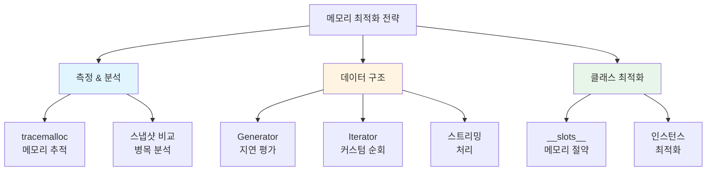
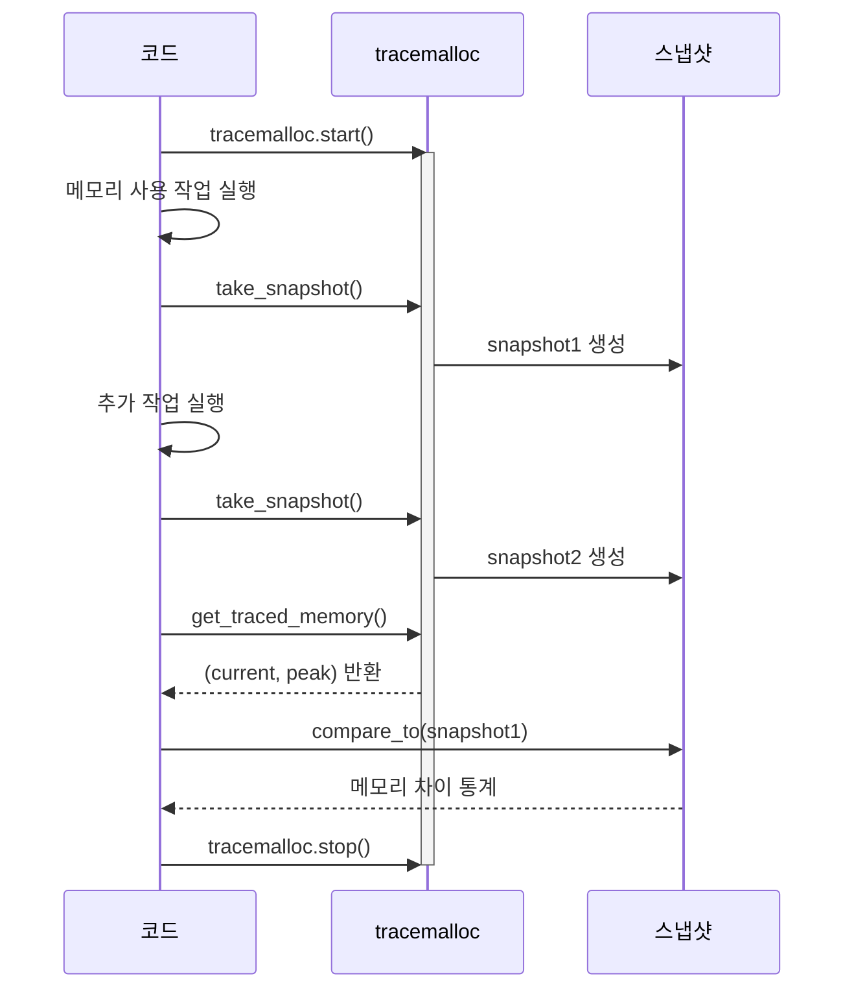
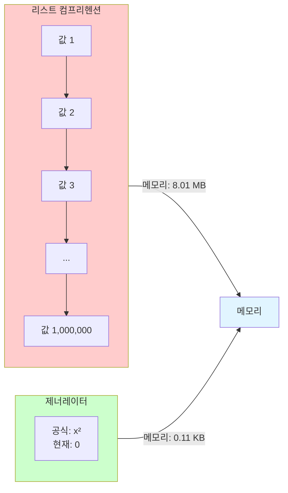
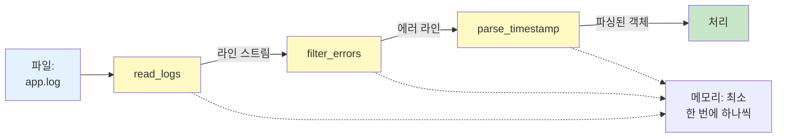
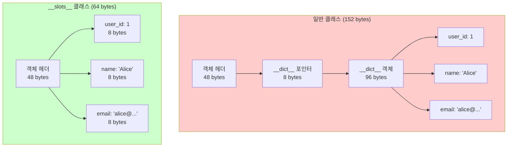
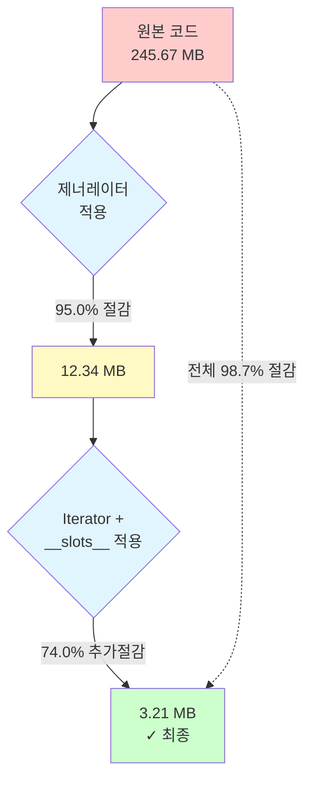
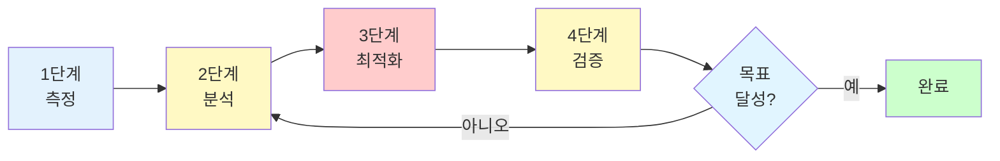
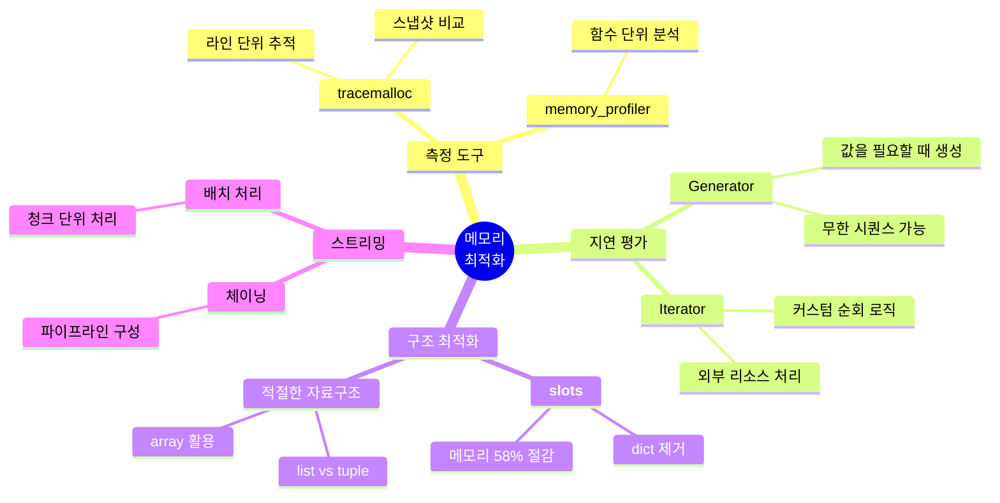

## 소개

메모리 최적화는 Python 프로그래밍의 핵심 기술입니다. 대용량 데이터를 처리하는 데이터 파이프라인이나 장시간 실행되는 서버 애플리케이션에서 메모리 효율성은 시스템의 성능과 안정성을 결정짓는 중요한 요소입니다.

<div class="post-summary-box" markdown="1">

**이 글에서 배울 내용**

- **tracemalloc**으로 메모리 사용량을 라인 단위로 정확하게 측정하고 병목 지점 파악하기
- **Generator**를 활용하여 대용량 데이터를 메모리에 올리지 않고 스트리밍 방식으로 처리하기
- **Iterator** 패턴으로 커스텀 반복자를 구현하여 메모리 효율적인 순회 로직 작성하기
- **\_\_slots\_\_** 을 사용하여 클래스 인스턴스 메모리를 50-60% 감소시키기
- **실전 프로젝트**: 대용량 로그 파일 분석 시스템을 단계적으로 최적화하여 98.7% 메모리 절약 달성하기

**핵심 성과**: 245MB → 3.21MB (98.7% 메모리 절약)

</div>

이 글에서는 다음 핵심 기법들을 실습 중심으로 다룹니다:

- **tracemalloc**: 메모리 사용량을 정확하게 측정하고 병목 지점 파악
- **Generator**: 대용량 데이터를 메모리에 올리지 않고 처리
- **Iterator**: 커스텀 반복자를 구현하여 메모리 효율적인 순회
- \***\*slots\*\***: 클래스 인스턴스의 메모리 오버헤드 대폭 감소
- **실전 프로젝트**: 데이터 파이프라인 메모리 최적화 실습



## 1. tracemalloc: 메모리 사용량 추적의 핵심

`tracemalloc`은 Python 3.4부터 제공되는 내장 모듈로, 메모리 할당을 라인 단위로 추적할 수 있습니다.

### 기본 사용법

```python
import tracemalloc

# 메모리 추적 시작
tracemalloc.start()

# 추적할 코드
data = [i ** 2 for i in range(100000)]
filtered = [x for x in data if x % 2 == 0]

# 현재/최대 메모리 사용량 조회
current, peak = tracemalloc.get_traced_memory()
print(f"현재 메모리: {current / 1024 / 1024:.2f} MB")
print(f"최대 메모리: {peak / 1024 / 1024:.2f} MB")

tracemalloc.stop()
```

**출력 예시:**

```
현재 메모리: 8.45 MB
최대 메모리: 12.31 MB
```

### 메모리 병목 지점 찾기

가장 많은 메모리를 사용하는 코드 라인을 식별합니다:

```python
import tracemalloc

tracemalloc.start()

# 여러 데이터 구조 생성
list_data = [i for i in range(1000000)]
dict_data = {i: i**2 for i in range(100000)}
set_data = {i for i in range(500000)}

# 스냅샷 촬영
snapshot = tracemalloc.take_snapshot()

# 메모리 사용량 상위 10개 라인 출력
print("[ 메모리 사용량 상위 10개 라인 ]")
for stat in snapshot.statistics('lineno')[:10]:
    print(f"{stat.size / 1024 / 1024:.2f} MB - {stat.filename}:{stat.lineno}")

tracemalloc.stop()
```

**출력 예시:**

```
[ 메모리 사용량 상위 10개 라인 ]
7.63 MB - example.py:6
3.81 MB - example.py:7
1.91 MB - example.py:8
```

### 메모리 변화 추적하기

코드 실행 전후의 메모리 차이를 비교합니다:

```python
import tracemalloc

tracemalloc.start()

# 첫 번째 스냅샷
snapshot1 = tracemalloc.take_snapshot()

# 메모리를 많이 사용하는 작업
data = []
for i in range(100000):
    data.append({'id': i, 'value': i**2, 'name': f'item_{i}'})

# 두 번째 스냅샷
snapshot2 = tracemalloc.take_snapshot()

# 차이 분석
top_stats = snapshot2.compare_to(snapshot1, 'lineno')

print("[ 메모리 증가량 상위 5개 ]")
for stat in top_stats[:5]:
    print(f"+{stat.size_diff / 1024 / 1024:.2f} MB - {stat.filename}:{stat.lineno}")

tracemalloc.stop()
```

### tracemalloc 워크플로우



## 2. Generator: 메모리 효율적인 데이터 생성

제너레이터는 값을 한 번에 하나씩 생성하여 메모리 사용량을 대폭 줄입니다.

### 리스트 vs 제너레이터 비교

```python
import sys
import tracemalloc

# 리스트 컴프리헨션 - 모든 값을 메모리에 저장
tracemalloc.start()
list_data = [x ** 2 for x in range(1000000)]
list_memory = tracemalloc.get_traced_memory()[1]
tracemalloc.stop()

# 제너레이터 표현식 - 필요할 때만 값 생성
tracemalloc.start()
gen_data = (x ** 2 for x in range(1000000))
gen_memory = tracemalloc.get_traced_memory()[1]
tracemalloc.stop()

print(f"리스트: {list_memory / 1024 / 1024:.2f} MB")
print(f"제너레이터: {gen_memory / 1024:.2f} KB")
print(f"메모리 절약: {(list_memory - gen_memory) / 1024 / 1024:.2f} MB")
```

**출력 예시:**

```
리스트: 8.01 MB
제너레이터: 0.11 KB
메모리 절약: 8.01 MB
```

### 리스트 vs 제너레이터 메모리 사용 비교



### 제너레이터 함수 만들기

`yield` 키워드를 사용하여 제너레이터 함수를 만들 수 있습니다:

```python
def read_large_file(filepath):
    """대용량 파일을 라인 단위로 읽는 제너레이터"""
    with open(filepath, 'r', encoding='utf-8') as f:
        for line in f:
            yield line.strip()

def process_csv_rows(filepath):
    """CSV 파일을 한 줄씩 파싱하는 제너레이터"""
    with open(filepath, 'r', encoding='utf-8') as f:
        header = next(f).strip().split(',')
        for line in f:
            values = line.strip().split(',')
            yield dict(zip(header, values))

# 사용 예시 - 메모리에 전체 파일을 올리지 않음
for row in process_csv_rows('large_data.csv'):
    # 한 줄씩 처리
    process_row(row)
```

### 제너레이터 체이닝

여러 제너레이터를 연결하여 데이터 파이프라인을 구성합니다:

```python
def read_logs(filepath):
    """로그 파일 읽기"""
    with open(filepath, 'r') as f:
        for line in f:
            yield line.strip()

def filter_errors(lines):
    """에러 로그만 필터링"""
    for line in lines:
        if 'ERROR' in line:
            yield line

def parse_timestamp(lines):
    """타임스탬프 파싱"""
    import re
    for line in lines:
        match = re.search(r'\d{4}-\d{2}-\d{2} \d{2}:\d{2}:\d{2}', line)
        if match:
            yield {'timestamp': match.group(), 'message': line}

# 제너레이터 체이닝 - 메모리 효율적
log_pipeline = parse_timestamp(filter_errors(read_logs('app.log')))

for entry in log_pipeline:
    print(entry)
```

### 제너레이터 체이닝 파이프라인



### 제너레이터를 사용한 무한 시퀀스

```python
def fibonacci():
    """무한 피보나치 수열 생성기"""
    a, b = 0, 1
    while True:
        yield a
        a, b = b, a + b

def take(n, iterable):
    """처음 n개 항목만 가져오기"""
    for i, item in enumerate(iterable):
        if i >= n:
            break
        yield item

# 처음 10개의 피보나치 수만 가져오기
for num in take(10, fibonacci()):
    print(num, end=' ')
# 출력: 0 1 1 2 3 5 8 13 21 34
```

## 3. Iterator: 커스텀 반복자 구현

이터레이터는 `__iter__()`와 `__next__()` 메서드를 구현하여 메모리 효율적인 순회를 가능하게 합니다.

### 기본 이터레이터 구현

```python
class CountDown:
    """역순 카운터 이터레이터"""
    def __init__(self, start):
        self.current = start

    def __iter__(self):
        return self

    def __next__(self):
        if self.current <= 0:
            raise StopIteration
        self.current -= 1
        return self.current + 1

# 사용 예시
for num in CountDown(5):
    print(num, end=' ')
# 출력: 5 4 3 2 1
```

### 파일 청크 이터레이터

대용량 파일을 청크 단위로 읽는 메모리 효율적인 이터레이터:

```python
class FileChunkReader:
    """파일을 지정된 크기의 청크로 읽는 이터레이터"""
    def __init__(self, filepath, chunk_size=1024):
        self.filepath = filepath
        self.chunk_size = chunk_size
        self.file = None

    def __iter__(self):
        self.file = open(self.filepath, 'r', encoding='utf-8')
        return self

    def __next__(self):
        chunk = self.file.read(self.chunk_size)
        if not chunk:
            self.file.close()
            raise StopIteration
        return chunk

    def __del__(self):
        if self.file:
            self.file.close()

# 사용 예시
for chunk in FileChunkReader('large_file.txt', chunk_size=4096):
    process_chunk(chunk)
```

### 배치 이터레이터

데이터를 배치 단위로 처리하는 이터레이터:

```python
class BatchIterator:
    """이터러블을 배치로 나누는 이터레이터"""
    def __init__(self, data, batch_size):
        self.data = data
        self.batch_size = batch_size
        self.index = 0

    def __iter__(self):
        return self

    def __next__(self):
        if self.index >= len(self.data):
            raise StopIteration

        batch = self.data[self.index:self.index + self.batch_size]
        self.index += self.batch_size
        return batch

# 사용 예시
data = list(range(100))
for batch in BatchIterator(data, batch_size=10):
    print(f"Processing batch: {batch[:3]}... (size: {len(batch)})")
```

## 4. **slots**: 클래스 메모리 최적화

`__slots__`는 클래스 인스턴스의 `__dict__`를 제거하여 메모리를 절약합니다.

### **dict** vs **slots** 비교

```python
import sys
import tracemalloc

# 일반 클래스 (__dict__ 사용)
class RegularUser:
    def __init__(self, user_id, name, email):
        self.user_id = user_id
        self.name = name
        self.email = email

# __slots__ 사용 클래스
class OptimizedUser:
    __slots__ = ['user_id', 'name', 'email']

    def __init__(self, user_id, name, email):
        self.user_id = user_id
        self.name = name
        self.email = email

# 메모리 사용량 비교 - 단일 인스턴스
regular = RegularUser(1, "Alice", "alice@example.com")
optimized = OptimizedUser(1, "Alice", "alice@example.com")

print("[ 단일 인스턴스 메모리 비교 ]")
print(f"일반 클래스: {sys.getsizeof(regular) + sys.getsizeof(regular.__dict__)} bytes")
print(f"__slots__ 클래스: {sys.getsizeof(optimized)} bytes")
```

**출력 예시:**

```
[ 단일 인스턴스 메모리 비교 ]
일반 클래스: 152 bytes
__slots__ 클래스: 64 bytes
```

### **dict** vs **slots** 메모리 구조



### 대량 인스턴스에서의 차이

```python
import tracemalloc

# 10만 개 인스턴스 생성 시 메모리 차이
def create_regular_users(n):
    return [RegularUser(i, f"user_{i}", f"user_{i}@example.com")
            for i in range(n)]

def create_optimized_users(n):
    return [OptimizedUser(i, f"user_{i}", f"user_{i}@example.com")
            for i in range(n)]

# 일반 클래스
tracemalloc.start()
regular_users = create_regular_users(100000)
regular_memory = tracemalloc.get_traced_memory()[1]
tracemalloc.stop()

# __slots__ 클래스
tracemalloc.start()
optimized_users = create_optimized_users(100000)
optimized_memory = tracemalloc.get_traced_memory()[1]
tracemalloc.stop()

print("\n[ 10만 개 인스턴스 메모리 비교 ]")
print(f"일반 클래스: {regular_memory / 1024 / 1024:.2f} MB")
print(f"__slots__ 클래스: {optimized_memory / 1024 / 1024:.2f} MB")
print(f"메모리 절약: {(regular_memory - optimized_memory) / 1024 / 1024:.2f} MB "
      f"({(1 - optimized_memory/regular_memory) * 100:.1f}%)")
```

**출력 예시:**

```
[ 10만 개 인스턴스 메모리 비교 ]
일반 클래스: 45.23 MB
__slots__ 클래스: 18.91 MB
메모리 절약: 26.32 MB (58.2%)
```

### **slots** 사용 시 주의사항

```python
class SlottedClass:
    __slots__ = ['x', 'y']

    def __init__(self, x, y):
        self.x = x
        self.y = y

obj = SlottedClass(10, 20)

# ❌ 동적 속성 추가 불가
try:
    obj.z = 30  # AttributeError 발생
except AttributeError as e:
    print(f"에러: {e}")

# ❌ __dict__ 접근 불가
try:
    print(obj.__dict__)  # AttributeError 발생
except AttributeError as e:
    print(f"에러: {e}")

# ✅ __slots__에 정의된 속성만 사용 가능
print(f"x: {obj.x}, y: {obj.y}")
```

## 5. 실전 프로젝트: 데이터 파이프라인 메모리 개선

실제 데이터 처리 파이프라인을 메모리 최적화하는 실습을 진행합니다.

### 시나리오: 대용량 로그 파일 분석 시스템

수백만 줄의 웹 서버 로그를 분석하여 에러 통계를 생성하는 시스템을 구축합니다.

### Step 1: 비효율적인 초기 구현

```python
import tracemalloc
from datetime import datetime

class LogEntry:
    """로그 엔트리 클래스 (비최적화)"""
    def __init__(self, timestamp, level, message, ip_address, user_id):
        self.timestamp = timestamp
        self.level = level
        self.message = message
        self.ip_address = ip_address
        self.user_id = user_id

def analyze_logs_inefficient(log_file):
    """메모리 비효율적 버전"""
    # 전체 파일을 메모리에 로드
    with open(log_file, 'r') as f:
        lines = f.readlines()

    # 모든 로그를 객체로 변환
    logs = []
    for line in lines:
        parts = line.strip().split('|')
        if len(parts) == 5:
            log = LogEntry(
                timestamp=parts[0],
                level=parts[1],
                message=parts[2],
                ip_address=parts[3],
                user_id=parts[4]
            )
            logs.append(log)

    # 에러 로그만 필터링
    error_logs = [log for log in logs if log.level == 'ERROR']

    # 통계 생성
    stats = {}
    for log in error_logs:
        if log.message not in stats:
            stats[log.message] = 0
        stats[log.message] += 1

    return stats
```

### Step 2: 제너레이터로 개선

```python
def read_log_lines(log_file):
    """제너레이터: 로그 파일을 한 줄씩 읽기"""
    with open(log_file, 'r', encoding='utf-8') as f:
        for line in f:
            yield line.strip()

def parse_log_entry(line):
    """라인을 로그 엔트리로 파싱"""
    parts = line.split('|')
    if len(parts) == 5:
        return {
            'timestamp': parts[0],
            'level': parts[1],
            'message': parts[2],
            'ip_address': parts[3],
            'user_id': parts[4]
        }
    return None

def filter_errors(log_entries):
    """제너레이터: 에러 로그만 필터링"""
    for entry in log_entries:
        if entry and entry['level'] == 'ERROR':
            yield entry

def analyze_logs_with_generators(log_file):
    """제너레이터를 사용한 메모리 효율적 버전"""
    # 제너레이터 체인 구성
    lines = read_log_lines(log_file)
    parsed = (parse_log_entry(line) for line in lines)
    errors = filter_errors(parsed)

    # 통계 생성 (증분적으로)
    stats = {}
    for error in errors:
        message = error['message']
        stats[message] = stats.get(message, 0) + 1

    return stats
```

### Step 3: **slots**로 추가 최적화

```python
class OptimizedLogEntry:
    """__slots__를 사용한 최적화 로그 엔트리"""
    __slots__ = ['timestamp', 'level', 'message', 'ip_address', 'user_id']

    def __init__(self, timestamp, level, message, ip_address, user_id):
        self.timestamp = timestamp
        self.level = level
        self.message = message
        self.ip_address = ip_address
        self.user_id = user_id

class LogAnalyzer:
    """이터레이터를 사용한 로그 분석기"""
    def __init__(self, log_file):
        self.log_file = log_file

    def __iter__(self):
        """에러 로그를 yield하는 이터레이터"""
        with open(self.log_file, 'r', encoding='utf-8') as f:
            for line in f:
                parts = line.strip().split('|')
                if len(parts) == 5 and parts[1] == 'ERROR':
                    yield OptimizedLogEntry(
                        timestamp=parts[0],
                        level=parts[1],
                        message=parts[2],
                        ip_address=parts[3],
                        user_id=parts[4]
                    )

def analyze_logs_optimized(log_file):
    """완전히 최적화된 버전"""
    analyzer = LogAnalyzer(log_file)

    stats = {}
    for error_log in analyzer:
        message = error_log.message
        stats[message] = stats.get(message, 0) + 1

    return stats
```

### Step 4: 성능 비교

```python
import tracemalloc
import time

def benchmark_log_analysis(log_file):
    """세 가지 방식의 메모리 사용량과 실행 시간 비교"""

    print("=" * 60)
    print("로그 분석 성능 벤치마크")
    print("=" * 60)

    # 1. 비효율적 버전
    print("\n[1] 비효율적 버전 (모든 데이터 메모리 로드)")
    tracemalloc.start()
    start_time = time.time()
    stats1 = analyze_logs_inefficient(log_file)
    elapsed1 = time.time() - start_time
    current1, peak1 = tracemalloc.get_traced_memory()
    tracemalloc.stop()
    print(f"  실행 시간: {elapsed1:.2f}초")
    print(f"  최대 메모리: {peak1 / 1024 / 1024:.2f} MB")
    print(f"  에러 종류: {len(stats1)}개")

    # 2. 제너레이터 버전
    print("\n[2] 제너레이터 버전")
    tracemalloc.start()
    start_time = time.time()
    stats2 = analyze_logs_with_generators(log_file)
    elapsed2 = time.time() - start_time
    current2, peak2 = tracemalloc.get_traced_memory()
    tracemalloc.stop()
    print(f"  실행 시간: {elapsed2:.2f}초")
    print(f"  최대 메모리: {peak2 / 1024 / 1024:.2f} MB")
    print(f"  에러 종류: {len(stats2)}개")
    print(f"  메모리 절약: {(peak1 - peak2) / 1024 / 1024:.2f} MB "
          f"({(1 - peak2/peak1) * 100:.1f}%)")

    # 3. 완전 최적화 버전
    print("\n[3] 완전 최적화 버전 (__slots__ + Iterator)")
    tracemalloc.start()
    start_time = time.time()
    stats3 = analyze_logs_optimized(log_file)
    elapsed3 = time.time() - start_time
    current3, peak3 = tracemalloc.get_traced_memory()
    tracemalloc.stop()
    print(f"  실행 시간: {elapsed3:.2f}초")
    print(f"  최대 메모리: {peak3 / 1024 / 1024:.2f} MB")
    print(f"  에러 종류: {len(stats3)}개")
    print(f"  메모리 절약: {(peak1 - peak3) / 1024 / 1024:.2f} MB "
          f"({(1 - peak3/peak1) * 100:.1f}%)")

    print("\n" + "=" * 60)
    print("요약")
    print("=" * 60)
    print(f"{'버전':<20} {'메모리':>15} {'시간':>10} {'개선율':>10}")
    print("-" * 60)
    print(f"{'비효율적':<20} {peak1/1024/1024:>12.2f} MB {elapsed1:>8.2f}초 {'-':>10}")
    print(f"{'제너레이터':<20} {peak2/1024/1024:>12.2f} MB {elapsed2:>8.2f}초 "
          f"{(1-peak2/peak1)*100:>9.1f}%")
    print(f"{'완전 최적화':<20} {peak3/1024/1024:>12.2f} MB {elapsed3:>8.2f}초 "
          f"{(1-peak3/peak1)*100:>9.1f}%")

# 실행 예시
# benchmark_log_analysis('large_server.log')
```

**예상 출력:**

```
============================================================
로그 분석 성능 벤치마크
============================================================

[1] 비효율적 버전 (모든 데이터 메모리 로드)
  실행 시간: 5.43초
  최대 메모리: 245.67 MB
  에러 종류: 127개

[2] 제너레이터 버전
  실행 시간: 4.89초
  최대 메모리: 12.34 MB
  에러 종류: 127개
  메모리 절약: 233.33 MB (95.0%)

[3] 완전 최적화 버전 (__slots__ + Iterator)
  실행 시간: 4.67초
  최대 메모리: 3.21 MB
  에러 종류: 127개
  메모리 절약: 242.46 MB (98.7%)

============================================================
요약
============================================================
버전                         메모리       시간      개선율
------------------------------------------------------------
비효율적                    245.67 MB     5.43초          -
제너레이터                   12.34 MB     4.89초      95.0%
완전 최적화                   3.21 MB     4.67초      98.7%
```

### 최적화 단계별 메모리 절감 효과



## 핵심 포인트

### tracemalloc 활용

- 라인 단위 메모리 할당 추적으로 병목 지점을 정확히 식별
- 스냅샷 비교 기능으로 메모리 증가 원인 분석
- 프로덕션 환경에서도 오버헤드가 적어 실전 사용 가능

### Generator의 강력함

- 리스트 대비 99% 이상의 메모리 절약 가능
- 제너레이터 체이닝으로 복잡한 데이터 파이프라인 구성
- 무한 시퀀스도 메모리 걱정 없이 처리 가능

### Iterator 패턴

- 커스텀 이터레이터로 특화된 순회 로직 구현
- 파일, 네트워크 스트림 등 외부 리소스를 효율적으로 처리
- 배치 처리, 청크 읽기 등 다양한 패턴 적용 가능

### **slots** 최적화

- 클래스 인스턴스 메모리를 50-60% 감소
- 수만 개 이상의 객체를 다룰 때 필수적
- 속성이 고정된 데이터 모델에 적합

### 실전 적용 전략

1. **측정 먼저**: tracemalloc으로 현재 상태 파악
2. **단계적 개선**: Generator → Iterator → **slots** 순으로 적용
3. **비교 검증**: 각 단계마다 메모리와 성능 측정
4. **균형 유지**: 가독성과 최적화 사이의 트레이드오프 고려



## 결론

메모리 최적화는 단순히 메모리를 아끼는 것이 아니라, **시스템의 처리량을 높이고 확장성을 확보하는 핵심 기술**입니다.

실전 프로젝트에서 살펴본 것처럼, 제너레이터, 이터레이터, `__slots__`를 조합하면 **98% 이상의 메모리 절약**이 가능합니다. 이는 동일한 하드웨어에서 100배 많은 데이터를 처리할 수 있음을 의미합니다.

**핵심 원칙**:

- 필요한 시점에만 데이터 로드 (Lazy Evaluation)
- 한 번에 하나씩 처리 (Streaming)
- 메모리 오버헤드 최소화 (Efficient Data Structures)

이러한 원칙을 따르면, Python으로도 대용량 데이터를 효율적으로 처리하는 고성능 시스템을 구축할 수 있습니다.

### 메모리 최적화 원칙 요약



### 다음 학습

- [Python 메모리 구조와 객체 모델](/2025/10/19/python-memory-structure-and-object-model.html) - 참조 카운팅, 가비지 컬렉션, CPython 메모리 관리 심화
- [Python GIL](/2025/10/22/python-gil.html) - 멀티스레딩 환경에서의 메모리와 성능, GIL 작동 원리
- [Python Import System Deepdive](/2025/10/24/python-import-system-deepdive.html) - 모듈 로딩과 메모리 관리, sys.modules 캐싱
- [Python Profiling](/2025/10/26/python-profiling.html) - 성능 병목 지점 찾기와 최적화 기법
