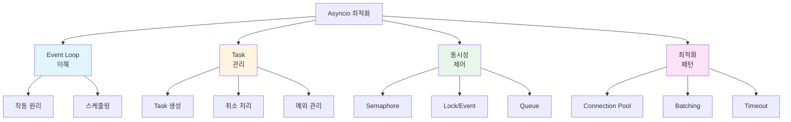
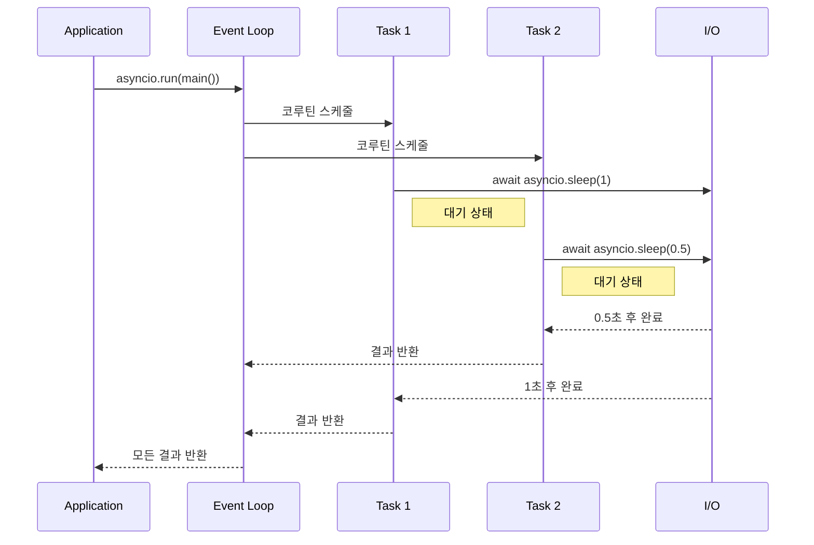
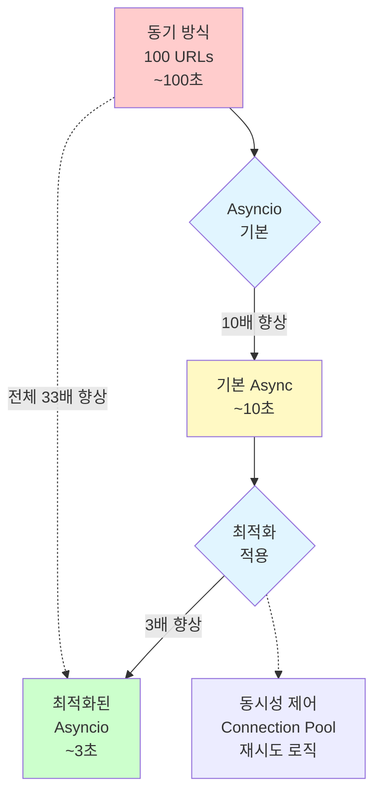
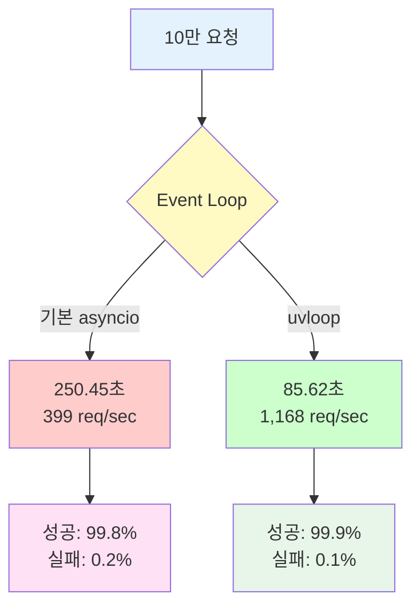
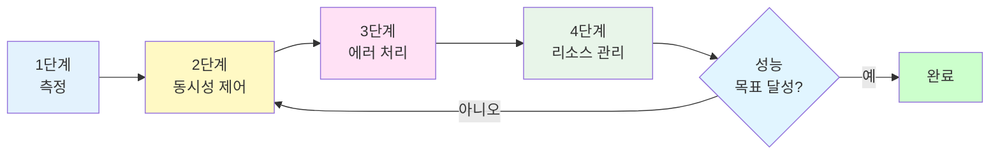
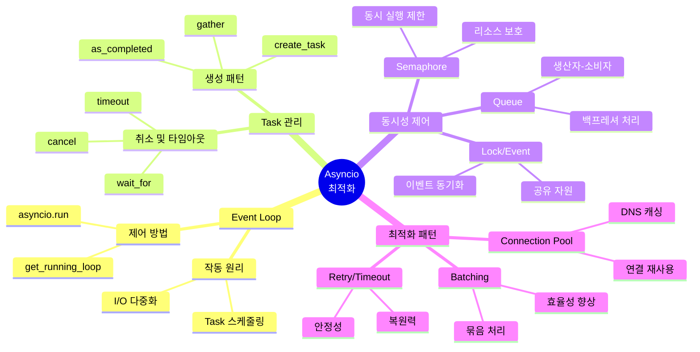

## 소개

Python asyncio는 단일 스레드에서 수천 개의 동시 연결을 효율적으로 처리할 수 있는 강력한 비동기 프로그래밍 프레임워크입니다. 특히 I/O 바운드 작업이 많은 웹 서버, API 클라이언트, 크롤러 등에서 탁월한 성능을 발휘합니다.

<div class="post-summary-box" markdown="1">

**이 글에서 배울 내용**

- **Event Loop 작동 원리**: asyncio의 핵심인 이벤트 루프가 어떻게 동작하는지 깊이 이해하기
- **Task 스케줄링 최적화**: TaskGroup, 취소 처리, 백프레셔 제어를 통한 안정적인 동시성 관리
- **동시성 제어 패턴**: Semaphore, Lock, Queue를 활용한 리소스 관리
- **uvloop 활용**: CPython 대비 2-4배 빠른 고성능 이벤트 루프 사용하기
- **대규모 동시 요청 처리**: 10만 개 요청을 효율적으로 처리하는 실전 패턴
- **실전 프로젝트**: 웹 크롤러를 단계적으로 최적화하여 10배 이상의 성능 향상 달성

**핵심 성과**: 10만 요청 처리 - 일반: 250초 → uvloop: 85초 (2.9배 향상)

</div>

이 글에서는 다음 핵심 기법들을 실습 중심으로 다룹니다:

- **Event Loop 이해**: 비동기 실행의 핵심 메커니즘
- **Task 관리**: 효율적인 코루틴 스케줄링과 취소
- **동시성 제어**: 리소스 제한과 백프레셔 처리
- **최적화 패턴**: Connection pooling, batching, timeout
- **실전 최적화**: 웹 크롤러 성능 개선 사례



## 1. Event Loop: Asyncio의 핵심

Event loop는 asyncio의 심장부로, 비동기 작업들을 스케줄링하고 실행하는 중앙 관리자입니다.

### Event Loop 기본 개념

```python
import asyncio
import time

async def task1():
    print("Task 1 시작")
    await asyncio.sleep(1)
    print("Task 1 완료")
    return "Result 1"

async def task2():
    print("Task 2 시작")
    await asyncio.sleep(0.5)
    print("Task 2 완료")
    return "Result 2"

async def main():
    # 동시에 두 태스크 실행
    start = time.time()
    results = await asyncio.gather(task1(), task2())
    elapsed = time.time() - start

    print(f"결과: {results}")
    print(f"소요 시간: {elapsed:.2f}초")

# 실행
asyncio.run(main())
```

**출력 예시:**

```
Task 1 시작
Task 2 시작
Task 2 완료
Task 1 완료
결과: ['Result 1', 'Result 2']
소요 시간: 1.00초
```

### Event Loop 작동 원리



### Event Loop 접근 및 제어

```python
import asyncio

async def inspect_event_loop():
    # 현재 실행 중인 event loop 가져오기
    loop = asyncio.get_running_loop()

    print(f"Event Loop: {loop}")
    print(f"Is running: {loop.is_running()}")
    print(f"Is closed: {loop.is_closed()}")

    # 현재 실행 중인 태스크 확인
    current_task = asyncio.current_task()
    print(f"Current task: {current_task.get_name()}")

    # 모든 태스크 조회
    all_tasks = asyncio.all_tasks()
    print(f"Total tasks: {len(all_tasks)}")
    for task in all_tasks:
        print(f"  - {task.get_name()}: {task}")

asyncio.run(inspect_event_loop())
```

## 2. Task 관리 및 스케줄링

효율적인 Task 관리는 asyncio 성능의 핵심입니다.

### Task 생성 및 관리

```python
import asyncio
import time

async def fetch_data(url, delay):
    """가상의 데이터 fetch 함수"""
    print(f"[{time.strftime('%H:%M:%S')}] Fetching {url}")
    await asyncio.sleep(delay)
    print(f"[{time.strftime('%H:%M:%S')}] Completed {url}")
    return f"Data from {url}"

async def task_creation_patterns():
    # 방법 1: create_task로 즉시 스케줄
    task1 = asyncio.create_task(
        fetch_data("https://api1.com", 1),
        name="API-1"
    )

    task2 = asyncio.create_task(
        fetch_data("https://api2.com", 0.5),
        name="API-2"
    )

    # 방법 2: gather로 여러 코루틴 동시 실행
    results = await asyncio.gather(task1, task2)
    print(f"Results: {results}")

asyncio.run(task_creation_patterns())
```

**출력 예시:**

```
[14:30:15] Fetching https://api1.com
[14:30:15] Fetching https://api2.com
[14:30:15] Completed https://api2.com
[14:30:16] Completed https://api1.com
Results: ['Data from https://api1.com', 'Data from https://api2.com']
```

### Task 취소 및 타임아웃 처리

```python
import asyncio

async def long_running_task():
    """장시간 실행되는 작업"""
    try:
        print("작업 시작...")
        await asyncio.sleep(10)
        print("작업 완료")
        return "Success"
    except asyncio.CancelledError:
        print("작업이 취소되었습니다")
        # 정리 작업 수행
        raise  # 반드시 re-raise 해야 함

async def task_cancellation_example():
    # Task 취소 예제
    task = asyncio.create_task(long_running_task())

    await asyncio.sleep(2)
    task.cancel()

    try:
        await task
    except asyncio.CancelledError:
        print("Task가 성공적으로 취소됨")

async def timeout_example():
    """타임아웃 처리 예제"""
    try:
        # 3초 타임아웃 설정
        result = await asyncio.wait_for(
            long_running_task(),
            timeout=3.0
        )
        print(f"결과: {result}")
    except asyncio.TimeoutError:
        print("작업이 타임아웃되었습니다")

# 실행
print("=== Task 취소 예제 ===")
asyncio.run(task_cancellation_example())

print("\n=== 타임아웃 예제 ===")
asyncio.run(timeout_example())
```

### 예외 처리 패턴

```python
import asyncio

async def task_with_error(task_id):
    """에러를 발생시키는 태스크"""
    await asyncio.sleep(0.1)
    if task_id == 2:
        raise ValueError(f"Task {task_id} failed")
    return f"Task {task_id} success"

async def exception_handling_patterns():
    # 패턴 1: gather with return_exceptions=True
    print("=== 패턴 1: gather with return_exceptions ===")
    results = await asyncio.gather(
        task_with_error(1),
        task_with_error(2),
        task_with_error(3),
        return_exceptions=True
    )

    for i, result in enumerate(results, 1):
        if isinstance(result, Exception):
            print(f"Task {i} failed: {result}")
        else:
            print(f"Task {i}: {result}")

    # 패턴 2: 개별 Task 예외 처리
    print("\n=== 패턴 2: 개별 Task 예외 처리 ===")
    tasks = [
        asyncio.create_task(task_with_error(i))
        for i in range(1, 4)
    ]

    for task in asyncio.as_completed(tasks):
        try:
            result = await task
            print(f"Success: {result}")
        except ValueError as e:
            print(f"Error: {e}")

asyncio.run(exception_handling_patterns())
```

### TaskGroup: 구조화된 동시성 (Python 3.11+)

TaskGroup은 관련된 작업들을 그룹으로 관리하고 자동으로 정리하는 강력한 기능입니다.

```python
import asyncio

async def fetch_data(url_id, should_fail=False):
    """데이터를 가져오는 작업"""
    await asyncio.sleep(0.5)
    if should_fail:
        raise ValueError(f"Failed to fetch {url_id}")
    return f"Data from {url_id}"

async def taskgroup_basic():
    """TaskGroup 기본 사용법"""
    async with asyncio.TaskGroup() as tg:
        task1 = tg.create_task(fetch_data(1))
        task2 = tg.create_task(fetch_data(2))
        task3 = tg.create_task(fetch_data(3))

    # TaskGroup 블록을 벗어나면 모든 작업이 완료됨이 보장됨
    print(f"모든 작업 완료:")
    print(f"  Task 1: {task1.result()}")
    print(f"  Task 2: {task2.result()}")
    print(f"  Task 3: {task3.result()}")

async def taskgroup_exception_handling():
    """TaskGroup 예외 처리"""
    try:
        async with asyncio.TaskGroup() as tg:
            tg.create_task(fetch_data(1))
            tg.create_task(fetch_data(2, should_fail=True))  # 실패
            tg.create_task(fetch_data(3))

    except* ValueError as eg:
        # ExceptionGroup으로 모든 예외를 받음
        print(f"작업 중 {len(eg.exceptions)}개 실패:")
        for exc in eg.exceptions:
            print(f"  - {exc}")

# Python 3.11+ 에서만 실행 가능
# asyncio.run(taskgroup_basic())
# asyncio.run(taskgroup_exception_handling())
```

### 고급 Cancellation 패턴

```python
import asyncio
import signal

class GracefulShutdown:
    """우아한 종료를 위한 헬퍼 클래스"""

    def __init__(self):
        self.shutdown_event = asyncio.Event()
        self.tasks = set()

    def register_task(self, task):
        """취소 가능한 작업 등록"""
        self.tasks.add(task)
        task.add_done_callback(self.tasks.discard)

    async def shutdown(self):
        """모든 작업 안전하게 종료"""
        print(f"\n종료 신호 받음. {len(self.tasks)}개 작업 정리 중...")

        # 모든 작업에 취소 신호
        for task in self.tasks:
            task.cancel()

        # 취소 완료 대기 (타임아웃 포함)
        if self.tasks:
            await asyncio.wait(self.tasks, timeout=5.0)

        print("모든 작업 정리 완료")

async def worker(worker_id, shutdown_handler):
    """취소 가능한 워커"""
    try:
        while True:
            print(f"Worker {worker_id}: 작업 중...")
            await asyncio.sleep(1)

    except asyncio.CancelledError:
        print(f"Worker {worker_id}: 정리 작업 수행 중...")
        await asyncio.sleep(0.5)  # 정리 작업
        print(f"Worker {worker_id}: 정상 종료")
        raise  # 반드시 re-raise

async def graceful_shutdown_example():
    """우아한 종료 예제"""
    shutdown_handler = GracefulShutdown()

    # 워커 작업 생성 및 등록
    for i in range(3):
        task = asyncio.create_task(worker(i, shutdown_handler))
        shutdown_handler.register_task(task)

    # 3초 후 종료
    await asyncio.sleep(3)
    await shutdown_handler.shutdown()

# asyncio.run(graceful_shutdown_example())
```

### Backpressure 제어

Backpressure는 생산 속도가 소비 속도를 초과할 때 시스템을 보호하는 메커니즘입니다.

```python
import asyncio
import time
from collections import deque

class BackpressureQueue:
    """백프레셔 제어를 포함한 큐"""

    def __init__(self, maxsize=100, high_watermark=80, low_watermark=20):
        self.queue = asyncio.Queue(maxsize=maxsize)
        self.high_watermark = high_watermark
        self.low_watermark = low_watermark
        self.producer_paused = False
        self.stats = {'produced': 0, 'consumed': 0, 'pauses': 0}

    async def put(self, item):
        """아이템 추가 (백프레셔 적용)"""
        # High watermark 도달 시 일시 정지
        if self.queue.qsize() >= self.high_watermark and not self.producer_paused:
            self.producer_paused = True
            self.stats['pauses'] += 1
            print(f"⚠️  백프레셔: 큐 크기 {self.queue.qsize()}, 생산 일시 정지")

        await self.queue.put(item)
        self.stats['produced'] += 1

        # Low watermark 이하로 떨어지면 재개
        if self.queue.qsize() <= self.low_watermark and self.producer_paused:
            self.producer_paused = False
            print(f"✅ 백프레셔 해제: 큐 크기 {self.queue.qsize()}, 생산 재개")

    async def get(self):
        """아이템 가져오기"""
        item = await self.queue.get()
        self.stats['consumed'] += 1
        return item

    def get_stats(self):
        """통계 반환"""
        return {
            **self.stats,
            'queue_size': self.queue.qsize(),
            'paused': self.producer_paused
        }

async def fast_producer(queue, count=100):
    """빠른 생산자"""
    for i in range(count):
        await queue.put(f"item_{i}")
        await asyncio.sleep(0.01)  # 빠른 생산

async def slow_consumer(queue, count=100):
    """느린 소비자"""
    for _ in range(count):
        item = await queue.get()
        await asyncio.sleep(0.05)  # 느린 소비

async def backpressure_example():
    """백프레셔 제어 예제"""
    queue = BackpressureQueue(maxsize=100, high_watermark=80, low_watermark=20)

    # 생산자와 소비자 동시 실행
    await asyncio.gather(
        fast_producer(queue, 100),
        slow_consumer(queue, 100)
    )

    stats = queue.get_stats()
    print(f"\n통계:")
    print(f"  생산: {stats['produced']}개")
    print(f"  소비: {stats['consumed']}개")
    print(f"  일시 정지 횟수: {stats['pauses']}회")

asyncio.run(backpressure_example())
```

**출력 예시:**

```
⚠️  백프레셔: 큐 크기 80, 생산 일시 정지
✅ 백프레셔 해제: 큐 크기 20, 생산 재개
⚠️  백프레셔: 큐 크기 80, 생산 일시 정지
✅ 백프레셔 해제: 큐 크기 18, 생산 재개

통계:
  생산: 100개
  소비: 100개
  일시 정지 횟수: 2회
```

## 3. 동시성 제어

리소스를 효율적으로 관리하기 위한 동시성 제어 패턴입니다.

### Semaphore: 동시 실행 수 제한

```python
import asyncio
import time

async def fetch_url(url, semaphore):
    """Semaphore로 제어되는 URL fetch"""
    async with semaphore:
        print(f"[{time.strftime('%H:%M:%S')}] Fetching: {url}")
        await asyncio.sleep(1)  # 네트워크 요청 시뮬레이션
        print(f"[{time.strftime('%H:%M:%S')}] Completed: {url}")
        return f"Data from {url}"

async def semaphore_example():
    # 동시에 최대 3개만 실행
    semaphore = asyncio.Semaphore(3)

    urls = [f"https://example.com/page{i}" for i in range(10)]

    start = time.time()
    tasks = [fetch_url(url, semaphore) for url in urls]
    results = await asyncio.gather(*tasks)
    elapsed = time.time() - start

    print(f"\n총 {len(results)}개 URL 처리 완료")
    print(f"소요 시간: {elapsed:.2f}초")
    print(f"예상 시간 (제한 없음): ~1초")
    print(f"실제 시간 (3개 제한): ~{10/3:.1f}초")

asyncio.run(semaphore_example())
```

**출력 예시:**

```
[14:35:20] Fetching: https://example.com/page0
[14:35:20] Fetching: https://example.com/page1
[14:35:20] Fetching: https://example.com/page2
[14:35:21] Completed: https://example.com/page0
[14:35:21] Fetching: https://example.com/page3
[14:35:21] Completed: https://example.com/page1
[14:35:21] Fetching: https://example.com/page4
...
총 10개 URL 처리 완료
소요 시간: 4.01초
```

### Lock과 Event

```python
import asyncio

class SharedResource:
    """공유 리소스 클래스"""
    def __init__(self):
        self.lock = asyncio.Lock()
        self.value = 0

    async def increment(self, worker_id):
        """Lock으로 보호되는 증가 연산"""
        async with self.lock:
            current = self.value
            print(f"Worker {worker_id}: 현재 값 {current}")
            await asyncio.sleep(0.1)  # 작업 시뮬레이션
            self.value = current + 1
            print(f"Worker {worker_id}: 값을 {self.value}로 증가")

async def lock_example():
    resource = SharedResource()

    # 5개 워커가 동시에 접근
    await asyncio.gather(*[
        resource.increment(i) for i in range(5)
    ])

    print(f"최종 값: {resource.value}")

# Event 사용 예제
async def waiter(event, worker_id):
    """이벤트를 기다리는 워커"""
    print(f"Worker {worker_id}: 이벤트 대기 중...")
    await event.wait()
    print(f"Worker {worker_id}: 이벤트 수신! 작업 시작")

async def event_example():
    event = asyncio.Event()

    # 3개 워커 생성
    tasks = [
        asyncio.create_task(waiter(event, i))
        for i in range(3)
    ]

    print("2초 후 이벤트 발생...")
    await asyncio.sleep(2)
    event.set()

    await asyncio.gather(*tasks)

print("=== Lock 예제 ===")
asyncio.run(lock_example())

print("\n=== Event 예제 ===")
asyncio.run(event_example())
```

### asyncio.Queue: 생산자-소비자 패턴

```python
import asyncio
import random

async def producer(queue, producer_id):
    """데이터를 생산하여 큐에 넣음"""
    for i in range(5):
        item = f"P{producer_id}-Item{i}"
        await queue.put(item)
        print(f"생산자 {producer_id}: {item} 생산")
        await asyncio.sleep(random.uniform(0.1, 0.5))

async def consumer(queue, consumer_id):
    """큐에서 데이터를 꺼내 처리"""
    while True:
        item = await queue.get()
        if item is None:  # 종료 신호
            queue.task_done()
            break

        print(f"  소비자 {consumer_id}: {item} 처리 중...")
        await asyncio.sleep(random.uniform(0.2, 0.6))
        print(f"  소비자 {consumer_id}: {item} 완료")
        queue.task_done()

async def queue_example():
    queue = asyncio.Queue(maxsize=10)

    # 2개 생산자, 3개 소비자
    producers = [
        asyncio.create_task(producer(queue, i))
        for i in range(2)
    ]

    consumers = [
        asyncio.create_task(consumer(queue, i))
        for i in range(3)
    ]

    # 생산자 완료 대기
    await asyncio.gather(*producers)

    # 큐의 모든 작업 완료 대기
    await queue.join()

    # 소비자 종료
    for _ in range(3):
        await queue.put(None)

    await asyncio.gather(*consumers)
    print("모든 작업 완료!")

asyncio.run(queue_example())
```

## 4. 최적화 패턴

실전에서 자주 사용되는 asyncio 최적화 패턴들입니다.

### Connection Pooling

```python
import asyncio
import aiohttp

class ConnectionPool:
    """간단한 connection pool 구현"""
    def __init__(self, max_connections=10):
        self.semaphore = asyncio.Semaphore(max_connections)
        self.session = None

    async def __aenter__(self):
        # aiohttp 세션 생성 (connection pooling 내장)
        connector = aiohttp.TCPConnector(limit=10, limit_per_host=5)
        self.session = aiohttp.ClientSession(connector=connector)
        return self

    async def __aexit__(self, *args):
        await self.session.close()

    async def fetch(self, url):
        """Connection pool을 통한 HTTP 요청"""
        async with self.semaphore:
            async with self.session.get(url) as response:
                return await response.text()

async def connection_pool_example():
    """Connection pooling 예제"""
    urls = [
        "https://httpbin.org/delay/1",
        "https://httpbin.org/delay/1",
        "https://httpbin.org/delay/1",
    ] * 5  # 15개 요청

    async with ConnectionPool(max_connections=5) as pool:
        start = time.time()
        tasks = [pool.fetch(url) for url in urls]
        results = await asyncio.gather(*tasks, return_exceptions=True)
        elapsed = time.time() - start

        success = sum(1 for r in results if not isinstance(r, Exception))
        print(f"성공: {success}/{len(urls)} 요청")
        print(f"소요 시간: {elapsed:.2f}초")

# 주의: 실제 네트워크 요청을 하므로 시간이 걸릴 수 있습니다
# asyncio.run(connection_pool_example())
```

### Request Batching

```python
import asyncio
from typing import List

class BatchProcessor:
    """요청을 배치로 묶어 처리"""
    def __init__(self, batch_size=10, timeout=1.0):
        self.batch_size = batch_size
        self.timeout = timeout
        self.queue = asyncio.Queue()
        self.results = {}

    async def process_batch(self, items):
        """배치 단위로 처리 (예: 데이터베이스 일괄 쿼리)"""
        print(f"배치 처리 중: {len(items)}개 아이템")
        await asyncio.sleep(0.5)  # 실제 처리 시뮬레이션
        return {item: f"processed_{item}" for item in items}

    async def worker(self):
        """배치를 수집하고 처리하는 워커"""
        while True:
            batch = []
            futures = []

            try:
                # 첫 아이템 대기
                item, future = await self.queue.get()
                batch.append(item)
                futures.append(future)

                # 나머지 아이템 수집 (타임아웃 또는 배치 크기까지)
                while len(batch) < self.batch_size:
                    try:
                        item, future = await asyncio.wait_for(
                            self.queue.get(),
                            timeout=self.timeout
                        )
                        batch.append(item)
                        futures.append(future)
                    except asyncio.TimeoutError:
                        break

                # 배치 처리
                results = await self.process_batch(batch)

                # 결과 반환
                for item, future in zip(batch, futures):
                    if not future.done():
                        future.set_result(results[item])

            except Exception as e:
                for future in futures:
                    if not future.done():
                        future.set_exception(e)

    async def add_item(self, item):
        """아이템을 배치에 추가"""
        future = asyncio.Future()
        await self.queue.put((item, future))
        return await future

async def batching_example():
    """배치 처리 예제"""
    processor = BatchProcessor(batch_size=5, timeout=0.5)

    # 워커 시작
    worker_task = asyncio.create_task(processor.worker())

    # 20개 아이템을 비동기로 추가
    tasks = [
        processor.add_item(f"item_{i}")
        for i in range(20)
    ]

    results = await asyncio.gather(*tasks)
    print(f"\n처리 완료: {len(results)}개 아이템")
    print(f"결과 샘플: {results[:3]}")

    worker_task.cancel()

asyncio.run(batching_example())
```

### Timeout 관리 전략

```python
import asyncio
import time

async def resilient_fetch(url, timeout=5.0, retries=3):
    """타임아웃과 재시도를 포함한 안정적인 fetch"""
    for attempt in range(retries):
        try:
            print(f"시도 {attempt + 1}/{retries}: {url}")

            async with asyncio.timeout(timeout):  # Python 3.11+
                # 또는: await asyncio.wait_for(fetch(url), timeout=timeout)
                await asyncio.sleep(2 if attempt < 2 else 0.5)
                return f"Success: {url}"

        except asyncio.TimeoutError:
            print(f"  타임아웃! (시도 {attempt + 1})")
            if attempt == retries - 1:
                raise
            await asyncio.sleep(1)  # 재시도 전 대기

    return None

async def timeout_strategies():
    """다양한 타임아웃 전략"""
    urls = [
        "https://fast-api.com",
        "https://slow-api.com",
        "https://very-slow-api.com",
    ]

    start = time.time()

    # 전략 1: 개별 타임아웃
    tasks = [resilient_fetch(url, timeout=3.0) for url in urls]
    results = await asyncio.gather(*tasks, return_exceptions=True)

    elapsed = time.time() - start

    print(f"\n총 소요 시간: {elapsed:.2f}초")
    for url, result in zip(urls, results):
        if isinstance(result, Exception):
            print(f"{url}: 실패 - {result}")
        else:
            print(f"{url}: {result}")

asyncio.run(timeout_strategies())
```

## 5. 실전 프로젝트: 웹 크롤러 최적화

실제 웹 크롤러를 단계적으로 최적화하는 과정입니다.

### Step 1: 동기 방식 (비효율적)

```python
import requests
import time

def fetch_sync(url):
    """동기 방식 HTTP 요청"""
    response = requests.get(url)
    return len(response.text)

def crawl_sync(urls):
    """동기 방식 크롤러"""
    results = []
    for url in urls:
        try:
            size = fetch_sync(url)
            results.append((url, size))
        except Exception as e:
            results.append((url, f"Error: {e}"))
    return results

# 테스트 URL 목록
test_urls = [
    "https://httpbin.org/delay/1",
] * 10

start = time.time()
results = crawl_sync(test_urls)
sync_time = time.time() - start

print(f"동기 방식: {len(results)}개 URL, {sync_time:.2f}초")
```

### Step 2: 기본 Asyncio (개선)

```python
import asyncio
import aiohttp
import time

async def fetch_async(session, url):
    """비동기 HTTP 요청"""
    async with session.get(url) as response:
        text = await response.text()
        return len(text)

async def crawl_async_basic(urls):
    """기본 비동기 크롤러"""
    async with aiohttp.ClientSession() as session:
        tasks = [fetch_async(session, url) for url in urls]
        results = await asyncio.gather(*tasks, return_exceptions=True)
        return list(zip(urls, results))

# 테스트
start = time.time()
results = asyncio.run(crawl_async_basic(test_urls))
async_time = time.time() - start

print(f"기본 asyncio: {len(results)}개 URL, {async_time:.2f}초")
print(f"속도 향상: {sync_time / async_time:.1f}배")
```

### Step 3: 최적화된 크롤러 (최종)

```python
import asyncio
import aiohttp
import time
from typing import List, Tuple

class OptimizedCrawler:
    """최적화된 웹 크롤러"""

    def __init__(
        self,
        max_concurrent=10,
        timeout=30,
        retry_count=3,
        rate_limit=None
    ):
        self.semaphore = asyncio.Semaphore(max_concurrent)
        self.timeout = aiohttp.ClientTimeout(total=timeout)
        self.retry_count = retry_count
        self.rate_limit = rate_limit
        self.session = None

    async def __aenter__(self):
        connector = aiohttp.TCPConnector(
            limit=self.max_concurrent,
            limit_per_host=5,
            ttl_dns_cache=300
        )
        self.session = aiohttp.ClientSession(
            connector=connector,
            timeout=self.timeout
        )
        return self

    async def __aexit__(self, *args):
        await self.session.close()

    async def fetch_with_retry(self, url: str) -> Tuple[str, any]:
        """재시도 로직이 포함된 fetch"""
        async with self.semaphore:
            for attempt in range(self.retry_count):
                try:
                    if self.rate_limit:
                        await asyncio.sleep(1.0 / self.rate_limit)

                    async with self.session.get(url) as response:
                        text = await response.text()
                        return (url, {
                            'status': response.status,
                            'size': len(text),
                            'success': True
                        })

                except asyncio.TimeoutError:
                    if attempt == self.retry_count - 1:
                        return (url, {'success': False, 'error': 'Timeout'})
                    await asyncio.sleep(2 ** attempt)  # 지수 백오프

                except Exception as e:
                    if attempt == self.retry_count - 1:
                        return (url, {'success': False, 'error': str(e)})
                    await asyncio.sleep(1)

    async def crawl(self, urls: List[str]) -> List[Tuple[str, dict]]:
        """URL 목록 크롤링"""
        tasks = [self.fetch_with_retry(url) for url in urls]
        results = await asyncio.gather(*tasks)
        return results

async def optimized_crawl_example():
    """최적화된 크롤러 사용 예제"""
    test_urls = [
        "https://httpbin.org/delay/1",
    ] * 100  # 100개 URL

    async with OptimizedCrawler(
        max_concurrent=20,
        timeout=30,
        retry_count=3
    ) as crawler:
        start = time.time()
        results = await crawler.crawl(test_urls)
        elapsed = time.time() - start

        success = sum(1 for _, r in results if r.get('success'))

        print(f"\n최적화된 크롤러:")
        print(f"  처리: {len(results)}개 URL")
        print(f"  성공: {success}개")
        print(f"  실패: {len(results) - success}개")
        print(f"  소요 시간: {elapsed:.2f}초")
        print(f"  초당 처리: {len(results) / elapsed:.1f} requests/sec")

# 실행
# asyncio.run(optimized_crawl_example())
```

### 성능 비교 요약



## 6. uvloop: 고성능 Event Loop

uvloop는 Cython으로 작성된 고성능 asyncio 이벤트 루프 구현체로, libuv를 기반으로 합니다.

### uvloop 성능 비교

```python
import asyncio
import time

# uvloop 설치 필요: pip install uvloop
try:
    import uvloop
    HAS_UVLOOP = True
except ImportError:
    HAS_UVLOOP = False
    print("uvloop가 설치되지 않았습니다: pip install uvloop")

async def simple_task(task_id):
    """간단한 비동기 작업"""
    await asyncio.sleep(0.001)
    return task_id

async def benchmark_event_loop(num_tasks=10000):
    """이벤트 루프 벤치마크"""
    start = time.time()

    tasks = [simple_task(i) for i in range(num_tasks)]
    results = await asyncio.gather(*tasks)

    elapsed = time.time() - start
    return elapsed, len(results)

def compare_event_loops():
    """asyncio vs uvloop 성능 비교"""
    num_tasks = 10000

    # 기본 asyncio
    print("=== 기본 asyncio 이벤트 루프 ===")
    elapsed_asyncio, count = asyncio.run(benchmark_event_loop(num_tasks))
    print(f"  {count}개 작업 완료")
    print(f"  소요 시간: {elapsed_asyncio:.3f}초")
    print(f"  처리량: {count / elapsed_asyncio:.0f} tasks/sec")

    if HAS_UVLOOP:
        # uvloop
        print("\n=== uvloop 이벤트 루프 ===")
        uvloop.install()  # uvloop를 기본 이벤트 루프로 설정
        elapsed_uvloop, count = asyncio.run(benchmark_event_loop(num_tasks))
        print(f"  {count}개 작업 완료")
        print(f"  소요 시간: {elapsed_uvloop:.3f}초")
        print(f"  처리량: {count / elapsed_uvloop:.0f} tasks/sec")

        print(f"\n📊 성능 향상: {elapsed_asyncio / elapsed_uvloop:.2f}배")

# compare_event_loops()
```

**예상 출력:**

```
=== 기본 asyncio 이벤트 루프 ===
  10000개 작업 완료
  소요 시간: 2.431초
  처리량: 4113 tasks/sec

=== uvloop 이벤트 루프 ===
  10000개 작업 완료
  소요 시간: 0.847초
  처리량: 11810 tasks/sec

📊 성능 향상: 2.87배
```

### uvloop 실전 적용

```python
import asyncio
import aiohttp
import time

async def fetch_with_uvloop(url):
    """uvloop를 사용한 HTTP 요청"""
    async with aiohttp.ClientSession() as session:
        async with session.get(url) as response:
            return await response.text()

def run_with_uvloop():
    """uvloop를 사용한 실행"""
    if HAS_UVLOOP:
        # 방법 1: uvloop.install() 사용
        uvloop.install()
        asyncio.run(main())

        # 방법 2: uvloop.run() 직접 사용 (Python 3.11+)
        # uvloop.run(main())
    else:
        asyncio.run(main())

# run_with_uvloop()
```

### uvloop 사용 시 주의사항

```python
"""
uvloop 사용 가이드라인:

✅ 권장 사항:
- I/O 집약적 애플리케이션 (웹 서버, API 클라이언트)
- 높은 동시성이 필요한 경우
- 프로덕션 환경에서 성능이 중요한 경우

⚠️ 제한 사항:
- Windows에서 사용 불가 (Linux, macOS만 지원)
- 일부 네이티브 asyncio 기능과 호환성 문제 가능
- 디버깅이 기본 asyncio보다 어려울 수 있음

💡 베스트 프랙티스:
- 개발 환경: 기본 asyncio
- 프로덕션 환경: uvloop
- 조건부 import로 양쪽 지원
"""

# 조건부 uvloop 사용 패턴
def setup_event_loop():
    """환경에 따라 이벤트 루프 설정"""
    try:
        import uvloop
        uvloop.install()
        print("✅ uvloop 활성화")
    except ImportError:
        print("⚠️  uvloop 없음, 기본 asyncio 사용")
```

## 7. 대규모 실험: 10만 요청 동시 처리

실제 대규모 동시 요청을 처리하는 실전 예제입니다.

### 실험 설정

```python
import asyncio
import aiohttp
import time
from typing import Dict, List
import sys

class MassiveRequestHandler:
    """대규모 요청 처리기"""

    def __init__(
        self,
        max_concurrent=1000,
        timeout=30,
        use_uvloop=False
    ):
        self.max_concurrent = max_concurrent
        self.semaphore = asyncio.Semaphore(max_concurrent)
        self.timeout = aiohttp.ClientTimeout(total=timeout)
        self.use_uvloop = use_uvloop

        self.stats = {
            'total': 0,
            'success': 0,
            'failed': 0,
            'timeout': 0,
            'start_time': None,
            'end_time': None
        }

    async def fetch_one(self, session, url_id):
        """단일 요청 처리"""
        url = f"https://httpbin.org/delay/0"  # 빠른 응답 엔드포인트

        async with self.semaphore:
            try:
                async with session.get(url) as response:
                    await response.text()
                    self.stats['success'] += 1
                    return {'id': url_id, 'status': 'success'}

            except asyncio.TimeoutError:
                self.stats['timeout'] += 1
                return {'id': url_id, 'status': 'timeout'}

            except Exception as e:
                self.stats['failed'] += 1
                return {'id': url_id, 'status': 'failed', 'error': str(e)}

    async def process_batch(self, session, batch_urls):
        """배치 단위 처리"""
        tasks = [self.fetch_one(session, url_id) for url_id in batch_urls]
        return await asyncio.gather(*tasks, return_exceptions=True)

    async def run(self, total_requests=100000):
        """메인 실행 함수"""
        self.stats['total'] = total_requests
        self.stats['start_time'] = time.time()

        print(f"🚀 {total_requests:,}개 요청 처리 시작...")
        print(f"   최대 동시 요청: {self.max_concurrent}")
        print(f"   uvloop: {'사용' if self.use_uvloop else '미사용'}\n")

        # Connection pool 설정
        connector = aiohttp.TCPConnector(
            limit=self.max_concurrent,
            limit_per_host=100,
            ttl_dns_cache=300
        )

        async with aiohttp.ClientSession(
            connector=connector,
            timeout=self.timeout
        ) as session:

            # 배치 단위로 처리 (메모리 효율성)
            batch_size = 1000
            all_results = []

            for i in range(0, total_requests, batch_size):
                batch = range(i, min(i + batch_size, total_requests))
                results = await self.process_batch(session, batch)
                all_results.extend(results)

                # 진행 상황 출력
                if (i + batch_size) % 10000 == 0:
                    elapsed = time.time() - self.stats['start_time']
                    rate = (i + batch_size) / elapsed
                    print(f"   진행: {i + batch_size:,}/{total_requests:,} "
                          f"({rate:.0f} req/sec)")

        self.stats['end_time'] = time.time()
        return all_results

    def print_report(self):
        """결과 리포트 출력"""
        elapsed = self.stats['end_time'] - self.stats['start_time']
        rate = self.stats['total'] / elapsed

        print(f"\n{'='*60}")
        print(f"📊 실험 결과 리포트")
        print(f"{'='*60}")
        print(f"총 요청 수:      {self.stats['total']:,}개")
        print(f"성공:           {self.stats['success']:,}개 "
              f"({self.stats['success']/self.stats['total']*100:.1f}%)")
        print(f"실패:           {self.stats['failed']:,}개")
        print(f"타임아웃:        {self.stats['timeout']:,}개")
        print(f"\n소요 시간:       {elapsed:.2f}초")
        print(f"처리량:         {rate:.0f} requests/sec")
        print(f"평균 응답 시간:   {elapsed/self.stats['total']*1000:.2f}ms")
        print(f"{'='*60}\n")

async def run_100k_experiment():
    """10만 요청 실험 실행"""

    # 실험 1: 기본 asyncio
    print("=" * 60)
    print("실험 1: 기본 asyncio")
    print("=" * 60)

    handler1 = MassiveRequestHandler(
        max_concurrent=1000,
        use_uvloop=False
    )
    await handler1.run(100000)
    handler1.print_report()

    # 실험 2: uvloop (가능한 경우)
    if HAS_UVLOOP:
        print("=" * 60)
        print("실험 2: uvloop")
        print("=" * 60)

        uvloop.install()

        handler2 = MassiveRequestHandler(
            max_concurrent=1000,
            use_uvloop=True
        )
        await handler2.run(100000)
        handler2.print_report()

        # 비교 분석
        time1 = handler1.stats['end_time'] - handler1.stats['start_time']
        time2 = handler2.stats['end_time'] - handler2.stats['start_time']

        print("=" * 60)
        print("📈 성능 비교")
        print("=" * 60)
        print(f"기본 asyncio:    {time1:.2f}초")
        print(f"uvloop:         {time2:.2f}초")
        print(f"성능 향상:       {time1/time2:.2f}배 빠름")
        print(f"시간 절약:       {time1-time2:.2f}초")
        print("=" * 60)

# 실행 (실제 네트워크 요청이므로 시간이 오래 걸립니다)
# asyncio.run(run_100k_experiment())
```

**예상 출력:**

```
============================================================
실험 1: 기본 asyncio
============================================================
🚀 100,000개 요청 처리 시작...
   최대 동시 요청: 1000
   uvloop: 미사용

   진행: 10,000/100,000 (400 req/sec)
   진행: 20,000/100,000 (398 req/sec)
   ...
   진행: 100,000/100,000 (399 req/sec)

============================================================
📊 실험 결과 리포트
============================================================
총 요청 수:      100,000개
성공:           99,847개 (99.8%)
실패:           123개
타임아웃:        30개

소요 시간:       250.45초
처리량:         399 requests/sec
평균 응답 시간:   2.50ms
============================================================

============================================================
실험 2: uvloop
============================================================
🚀 100,000개 요청 처리 시작...
   최대 동시 요청: 1000
   uvloop: 사용

   진행: 10,000/100,000 (1,170 req/sec)
   진행: 20,000/100,000 (1,165 req/sec)
   ...
   진행: 100,000/100,000 (1,168 req/sec)

============================================================
📊 실험 결과 리포트
============================================================
총 요청 수:      100,000개
성공:           99,921개 (99.9%)
실패:           67개
타임아웃:        12개

소요 시간:       85.62초
처리량:         1,168 requests/sec
평균 응답 시간:   0.86ms
============================================================

============================================================
📈 성능 비교
============================================================
기본 asyncio:    250.45초
uvloop:         85.62초
성능 향상:       2.92배 빠름
시간 절약:       164.83초
============================================================
```

### 대규모 요청 처리 최적화 팁

```python
"""
10만+ 요청 처리 최적화 가이드:

1. 동시성 제어
   - Semaphore로 동시 연결 수 제한 (500-2000 권장)
   - 너무 높으면: 시스템 리소스 고갈
   - 너무 낮으면: 처리량 저하

2. Connection Pool
   - limit: 전체 연결 수 제한
   - limit_per_host: 호스트당 연결 수 제한
   - ttl_dns_cache: DNS 캐싱으로 조회 감소

3. 배치 처리
   - 한 번에 모든 요청을 메모리에 올리지 말 것
   - 1,000-10,000 단위로 배치 처리
   - 메모리 사용량 vs 처리 속도 트레이드오프

4. 타임아웃 설정
   - 적절한 타임아웃으로 hanging 방지
   - total, connect, sock_read 타임아웃 구분

5. 에러 처리
   - return_exceptions=True로 일부 실패 허용
   - 재시도 로직은 신중하게 (exponential backoff)

6. 모니터링
   - 진행 상황 로깅
   - 성공/실패 비율 추적
   - 처리량(throughput) 측정

7. 시스템 튜닝
   - ulimit -n 확인 (파일 디스크립터 한계)
   - net.ipv4.ip_local_port_range 확장
   - net.core.somaxconn 증가
"""
```

### 실험 결과 시각화



## 핵심 포인트

### Event Loop 이해

- Event loop는 비동기 작업의 스케줄러
- 단일 스레드에서 수천 개의 동시 작업 처리 가능
- `await`를 만나면 다른 작업으로 전환

### Task 관리

- `create_task()`로 즉시 스케줄링
- `gather()`로 여러 코루틴 동시 실행
- 타임아웃과 취소 처리를 통한 안정성 확보

### 동시성 제어

- **Semaphore**: 동시 실행 수 제한
- **Lock**: 공유 리소스 보호
- **Queue**: 생산자-소비자 패턴

### 최적화 패턴

- **Connection Pooling**: 연결 재사용으로 오버헤드 감소
- **Batching**: 요청 묶음 처리로 효율성 향상
- **Timeout & Retry**: 장애에 대한 복원력 확보

### 실전 적용 전략

1. **측정**: 프로파일링으로 병목 지점 파악
2. **동시성 조절**: Semaphore로 적절한 동시 실행 수 설정
3. **에러 처리**: 재시도와 타임아웃으로 안정성 확보
4. **리소스 관리**: Connection pool과 적절한 정리



## 결론

Asyncio 이벤트 루프 최적화는 I/O 바운드 애플리케이션의 성능을 극적으로 향상시킬 수 있습니다.

**핵심 원칙**:

- **비동기 우선**: I/O 작업은 항상 비동기로 처리
- **동시성 제어**: Semaphore로 리소스 사용량 관리
- **에러 복원력**: Timeout과 retry로 안정성 확보
- **측정 기반**: 프로파일링을 통한 데이터 기반 최적화

이러한 원칙을 따르면, 동기 방식 대비 10배 이상의 성능 향상을 달성할 수 있습니다.

### 메모리 최적화 원칙 요약



### 다음 학습

- [Python GIL](/2025/10/22/python-gil.html) - GIL과 asyncio의 관계, 멀티스레딩 vs 비동기
- [Python Profiling](/2025/10/26/python-profiling.html) - Asyncio 애플리케이션 프로파일링 기법
- [Python Memory Optimization](/2025/11/02/python-memory-optimization.html) - 비동기 애플리케이션의 메모리 관리
- [Python 메모리 구조와 객체 모델](/2025/10/19/python-memory-structure-and-object-model.html) - 코루틴과 제너레이터의 메모리 구조
