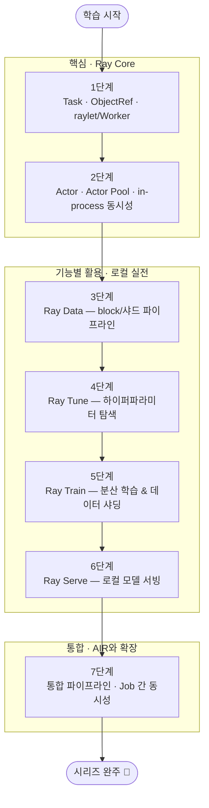

<figure class="post-figure post-figure--header">
<svg role="img" aria-label="한 대의 노트북(단일 노드)이 곧 완전한 Ray 분산 클러스터임을 나타낸 그림. 중앙 하단에 노트북이 있고, 그 위로 GCS·raylet·오브젝트 스토어·대시보드 노드가 떠 있다. 노트북에서 뻗어 나온 ObjectRef 화살표들이 주변의 워커 프로세스 버블들(Task/Actor)에 작업을 분배하고, 그 결과가 다시 모여들며, 오른쪽 위에는 Ray Data block들(Train/Tune/Serve 기능 타일)이 데이터를 분할(split)해 흘려보낸다. 한 노드 = 전체 클러스터라는, Ray의 '같은 코드가 노트북에서도 클러스터에서도 그대로'라는 핵심 가치를 대비한다." viewBox="0 0 680 300" xmlns="http://www.w3.org/2000/svg">
  <title>Ray Essential — 한 대의 노트북이 곧 완전한 Ray 클러스터: Core·Data·Train·Tune·Serve 7단계 학습 여정</title>

  <!-- central node machine (laptop) at bottom-center -->
  <g transform="translate(290 210)">
    <rect x="0" y="0" width="100" height="58" rx="5" fill="var(--bg-light)" stroke="var(--accent-color)" stroke-width="2.5"/>
    <rect x="6" y="6" width="88" height="34" rx="3" fill="var(--bg-panel)" stroke="currentColor" stroke-width="1.2"/>
    <text x="50" y="26" text-anchor="middle" font-size="9" fill="currentColor" font-weight="700">노트북</text>
    <text x="50" y="38" text-anchor="middle" font-size="7" fill="currentColor" opacity="0.8">1 Node</text>
    <rect x="30" y="50" width="40" height="6" rx="2" fill="currentColor" opacity="0.5"/>
    <text x="50" y="72" text-anchor="middle" font-size="8.5" fill="currentColor" font-weight="700">ray.init()</text>
  </g>

  <!-- cluster components above the node -->
  <g transform="translate(120 60)">
    <rect x="0" y="0" width="120" height="34" rx="4" fill="var(--bg-light)" stroke="currentColor" stroke-width="1.6"/>
    <text x="60" y="14" text-anchor="middle" font-size="9" fill="currentColor" font-weight="700">GCS · raylet</text>
    <text x="60" y="26" text-anchor="middle" font-size="7" fill="currentColor" opacity="0.8">스케줄러</text>
  </g>
  <g transform="translate(440 60)">
    <rect x="0" y="0" width="130" height="34" rx="4" fill="var(--bg-light)" stroke="currentColor" stroke-width="1.6"/>
    <text x="65" y="14" text-anchor="middle" font-size="9" fill="currentColor" font-weight="700">오브젝트 스토어</text>
    <text x="65" y="26" text-anchor="middle" font-size="7" fill="currentColor" opacity="0.8">메모리 · 스필</text>
  </g>
  <g transform="translate(280 20)">
    <rect x="0" y="0" width="120" height="34" rx="4" fill="var(--bg-light)" stroke="var(--secondary-color)" stroke-width="1.8"/>
    <text x="60" y="14" text-anchor="middle" font-size="9" fill="currentColor" font-weight="700">대시보드</text>
    <text x="60" y="26" text-anchor="middle" font-size="7" fill="currentColor" opacity="0.8">:8265</text>
  </g>

  <!-- worker bubbles radiating -->
  <g transform="translate(60 160)">
    <circle cx="0" cy="0" r="22" fill="var(--bg-panel)" stroke="var(--secondary-color)" stroke-width="2"/>
    <text x="0" y="-1" text-anchor="middle" font-size="8" fill="currentColor" font-weight="700">Task</text>
    <text x="0" y="10" text-anchor="middle" font-size="7" fill="currentColor" opacity="0.8">Worker 1</text>
  </g>
  <g transform="translate(210 150)">
    <circle cx="0" cy="0" r="22" fill="var(--bg-panel)" stroke="var(--secondary-color)" stroke-width="2"/>
    <text x="0" y="-1" text-anchor="middle" font-size="8" fill="currentColor" font-weight="700">Actor</text>
    <text x="0" y="10" text-anchor="middle" font-size="7" fill="currentColor" opacity="0.8">Worker 2</text>
  </g>
  <g transform="translate(560 150)">
    <circle cx="0" cy="0" r="22" fill="var(--bg-panel)" stroke="var(--secondary-color)" stroke-width="2"/>
    <text x="0" y="-1" text-anchor="middle" font-size="8" fill="currentColor" font-weight="700">Actor</text>
    <text x="0" y="10" text-anchor="middle" font-size="7" fill="currentColor" opacity="0.8">Worker 3</text>
  </g>

  <!-- object ref arrows from node to workers -->
  <path d="M300 208 L240 182 M300 208 L230 172 M420 208 L540 168" fill="none" stroke="currentColor" stroke-width="1.6" stroke-dasharray="3 3" opacity="0.6" marker-end="url(#re-arrow)"/>

  <!-- ray data shards (blocks) flowing right -->
  <g transform="translate(500 240)">
    <rect x="0" y="0" width="16" height="30" rx="3" fill="var(--bg-panel)" stroke="var(--accent-color)" stroke-width="1.6"/>
    <rect x="22" y="8" width="16" height="30" rx="3" fill="var(--bg-panel)" stroke="var(--accent-color)" stroke-width="1.6"/>
    <rect x="44" y="16" width="16" height="30" rx="3" fill="var(--bg-panel)" stroke="var(--accent-color)" stroke-width="1.6"/>
    <text x="74" y="34" text-anchor="middle" font-size="8" fill="currentColor" font-weight="700">blocks</text>
    <text x="74" y="46" text-anchor="middle" font-size="7" fill="currentColor" opacity="0.8">= 샤드</text>
  </g>
  <path d="M390 246 L500 258" fill="none" stroke="var(--secondary-color)" stroke-width="1.6" marker-end="url(#re-arrow)"/>

  <defs>
    <marker id="re-arrow" markerWidth="8" markerHeight="8" refX="6" refY="4" orient="auto">
      <path d="M0,0 L8,4 L0,8 z" fill="var(--secondary-color)"/>
    </marker>
  </defs>
</svg>
<figcaption>이 커리큘럼이 세우는 핵심 전제 — **한 대의 노트북에서 `ray.init()` 한 번이 곧 완전한 Ray 클러스터**입니다. GCS·raylet·오브젝트 스토어·대시보드가 모두 한 노드에 공존하고, 그 위로 Task/Actor 워커들이 작업을 분산 처리하며, Ray Data block(= 샤드)들이 데이터를 분할해 흘려보냅니다. 같은 코드가 노트북에서도 클러스터에서도 그대로 돈다는 원리가 7단계 전체의 뼈대입니다.</figcaption>
</figure>

## 소개

**Ray**는 UC Berkeley RISELab에서 시작해 현재 Anyscale이 운영하는 오픈소스 **분산 컴퓨팅 프레임워크**입니다. 파이썬만으로 분산 실행·데이터 파이프라인·분산 학습·하이퍼파라미터 최적화·모델 서빙을 하나의 추상화 위에서 다룹니다. 이 시리즈의 특징은 — 분산 시스템 지식 없이도 `@ray.remote` 한 줄로 병렬화가 된다는 점을, 한 대의 노트북(로컬)에서 손으로 체득한다는 것입니다.

이 커리큘럼은 `Ray-Essential` 시리즈의 마스터 로드맵입니다. **한 대의 노트북(로컬)** 을 기준으로, Ray가 지원하는 기능별 활용 전략을 손으로 체득하도록 설계했습니다. 각 항목을 정복할 때마다 체크박스를 채워 나가는 **도장깨기** 방식으로 진행 상황을 추적합니다.

> **선수 지식:** Python 중급 문법과 동시성 기초. [Concurrency Essential](/2026/08/24/concurrency-essential-curriculum.html) 시리즈가 세운 프로세스·스레드·GIL·멀티프로세싱 지식을 **재사용**합니다 — Ray는 바로 그 동시성 개념들을 분산 수준으로 일반화하기 때문입니다. 파이썬 GIL의 원리는 [Python GIL](/2025/10/22/python-gil.html) 포스트에서 다뤘습니다.

## 학습 흐름

7단계는 아래 순서대로 진행하는 것을 권장합니다. **핵심**(Core: Task/Actor)으로 Ray의 뼈대를 다진 뒤, **기능별 활용**(Data·Tune·Train·Serve)으로 라이브러리를 정복하고, **통합**(AIR + concurrency 종합 + Job 간 동시성)으로 마무리하는 흐름입니다.

## 학습 진행 현황

> 완료한 항목에는 상세 포스트 링크가 연결되어 있습니다. 학습이 진행될 때마다 체크박스와 진행률을 갱신합니다.

- 현재 완료한 항목: **21개**
- 전체 항목: **21개**
- 진행률: **100%**

## 1단계: Ray 핵심 모델 & 로컬 설치 — Task · ObjectRef · raylet/Worker

Ray를 이해하는 출발점은 **한 대의 노트북이 곧 하나의 분산 클러스터**라는 사실입니다. 설치, `ray.init()`, 대시보드, 그리고 `raylet`(스케줄러)과 `Worker`(실행 프로세스)의 구분(Task는 워커 풀 공유, Actor는 워커 독점)을 잡습니다. 자세한 내용은 **Stage 1 포스트**에서 다룹니다.

- [x] **로컬 설치와 기동**: `pip install "ray[default]"`, `ray.init(num_cpus)`, 대시보드(:8265), `ray stop/status` — [[상세]](/2026/08/24/stage1-ray-기본과-로컬-설치.html)
- [x] **Task와 ObjectRef**: `@ray.remote`, `ray.get`/`put`/`wait`, GIL 초월 CPU 병렬화 — [[상세]](/2026/08/24/stage1-ray-기본과-로컬-설치.html)
- [x] **raylet vs Worker & 오브젝트 스토어**: 스케줄러와 실행 프로세스 구분, 메모리/디스크 스필(spill), `OMP_NUM_THREADS` 폭주 방지 — [[상세]](/2026/08/24/stage1-ray-기본과-로컬-설치.html)

## 2단계: 상태와 동시성 — Actor · Actor Pool · in-process concurrency

Ray의 상태를 가진 분산 객체 모델입니다. `Counter` 액터부터 async/threaded 액터와 **`max_concurrency`**(Job 내부 동시성의 핵심), 그리고 고정 워커 풀인 `ActorPool`을 실습합니다. 자세한 내용은 **Stage 2 포스트**에서 다룹니다.

- [x] **Actor의 생명주기**: `@ray.remote` 클래스, 전용 워커, 메서드 직렬화 — [[상세]](/2026/08/24/stage2-actor와-동시성.html)
- [x] **in-process 동시성**: threaded vs async 액터(구분법: `async def` 존재), `max_concurrency`, `await obj_ref` — [[상세]](/2026/08/24/stage2-actor와-동시성.html)
- [x] **Actor Pool**: `ray.util.ActorPool`(`map`/`map_unordered`), 상태 격리 워커 처리 — [[상세]](/2026/08/24/stage2-actor와-동시성.html)

## 3단계: 로컬 데이터 파이프라인 & 샤딩 — Ray Data

대용량 데이터 전처리를 분산 파이프라인으로 처리합니다. **"DB shard = Ray Data block"** 멘탈 모델을 세우고, 병렬도(= block 수)를 제어하는 방법을 익힙니다. 자세한 내용은 **Stage 3 포스트**에서 다룹니다.

- [x] **Ray Data 기초**: `from_pandas`/`read_parquet`/`read_sql`, `map`/`map_batches`(Task/Pool 전략), `to_pandas()` — [[상세]](/2026/08/24/stage3-ray-data-파이프라인.html)
- [x] **block과 샤딩**: `repartition(n)`, `split(n)`/`split_at_indices`/`streaming_split`, 병렬도 제어 — [[상세]](/2026/08/24/stage3-ray-data-파이프라인.html)
- [x] **batch 변환 실전**: `map_batches`(numpy/pandas), `ActorPoolStrategy`, `compute` 인자(deprecated `concurrency` 대체) — [[상세]](/2026/08/24/stage3-ray-data-파이프라인.html)

## 4단계: 하이퍼파라미터 자동화 — Ray Tune

머신러닝 모델 튜닝을 "노트북 코어 수만큼 병렬"로 탐색합니다. 그리드/로그 유니폼 탐색, ASHA 조기 종료, 코어 오버서브스크라이빙을 실습합니다. 자세한 내용은 **Stage 4 포스트**에서 다룹니다.

- [x] **Tuner 기본**: `tune.Tuner` + `grid_search`/`loguniform`/`choice`, `tune.report` — [[상세]](/2026/08/24/stage4-ray-tune-튜닝.html)
- [x] **조기 종료와 탐색**: ASHA/HyperBand, Optuna 등 검색 알고리즘 — [[상세]](/2026/08/24/stage4-ray-tune-튜닝.html)
- [x] **로컬 리소스 제어**: `with_resources`, `max_concurrent_trials`, 코어 오버서브스크라이빙 — [[상세]](/2026/08/24/stage4-ray-tune-튜닝.html)

## 5단계: 분산 학습 — Ray Train & 데이터 샤딩

PyTorch 모델을 노트북에서 N개 워커로 분산 학습합니다. **각 워커가 데이터의 서로 다른 "샤드"를 받는** 원리(`get_dataset_shard`/`DistributedSampler`)가 핵심입니다. 자세한 내용은 **Stage 5 포스트**에서 다룹니다.

- [x] **TorchTrainer 기본**: `ScalingConfig(num_workers)`, `prepare_model`/`prepare_data_loader` — [[상세]](/2026/08/24/stage5-ray-train-분산-학습.html)
- [x] **데이터 샤딩**: `get_dataset_shard()`, `DistributedSampler`, 전역 배치 = 워커배치 × world_size — [[상세]](/2026/08/24/stage5-ray-train-분산-학습.html)
- [x] **체크포인트와 복원**: `RunConfig`/`CheckpointConfig`, 로컬 경로 저장, Train V2(`RAY_TRAIN_V2_ENABLED`) 주의 — [[상세]](/2026/08/24/stage5-ray-train-분산-학습.html)

## 6단계: 로컬 모델 서빙 — Ray Serve (동시성/스케일)

학습한 모델을 로컬에서 즉시 HTTP 엔드포인트로 배포합니다. Serve는 공식적으로 *local first* — 배포 전 로컬 테스트를 장려합니다. 자세한 내용은 **Stage 6 포스트**에서 다룹니다.

- [x] **Deployment 기본**: `@serve.deployment`, `serve.run(app, route_prefix="/")`, `localhost:8000` — [[상세]](/2026/08/24/stage6-ray-serve-서빙.html)
- [x] **구성과 인그레스**: deployment graph, FastAPI ingress, HF 파이프라인 — [[상세]](/2026/08/24/stage6-ray-serve-서빙.html)
- [x] **로컬 스케일/동시성**: `num_replicas`, 리퀘스트 배칭, `max_concurrent_queries` 주의점 — [[상세]](/2026/08/24/stage6-ray-serve-서빙.html)

## 7단계: 실전 통합 — AIR 파이프라인 & Job 간 동시성

배운 모든 것을 하나의 조립 스크립트로 통합합니다. Data → Train → Tune → Serve를 잇는 **엔드투엔드 ML 파이프라인(AIR)** 을 로컬에서 구동하고, concurrency 처리(워커 풀 · Job 내부/간 동시성)를 종합합니다. 자세한 내용은 **Stage 7 포스트**에서 다룹니다.

- [x] **AIR 통합**: `ray.data` 전처리 → `TorchTrainer` → `Tuner` → 체크포인트 → `Serve` HTTP 최종 호출 — [[상세]](/2026/08/24/stage7-실전-통합.html)
- [x] **concurrency 종합**: 워커 풀(액터 풀), `map_batches`, `ray.wait` 스트리밍, async 액터 — [[상세]](/2026/08/24/stage7-실전-통합.html)
- [x] **Job 간 동시성 & 확장**: `ray job submit`으로 여러 잡 클러스터 공유, `--num-cpus`/`--memory` 상한, KubeRay 전망(선택) — [[상세]](/2026/08/24/stage7-실전-통합.html)

## 핵심 포인트

- **한 노드 = 전체 클러스터**: `ray.init()` 한 번이 곧 완전한 Ray 클러스터입니다. 클러스터 모델을 처음부터 로컬에서 가르치면, 나중에 KubeRay로 올라가도 코드가 그대로입니다.
- **worker와 shard를 정확히 구분하세요**: Worker = Task/Actor 코드가 도는 **프로세스**(Task는 워커 풀 공유, Actor는 독점). Ray에서 "shard"는 부품이 아니라 **데이터를 독립 워커에 분할 배치하는 행위**(Ray Data block, Train 데이터 샤드, `split(n)`).
- **Job 내부 vs Job 간 동시성을 구분하세요**: Job *내부* 는 태스크/액터/`max_concurrency`(스레드·이벤트 루프)로, Job *간* 은 별도 `ray job submit`이 클러스터를 공유하고 `--num-cpus`/`--memory`로 제한합니다.
- **GIL을 재사용하세요**: [Python GIL](/2025/10/22/python-gil.html)은 이 시리즈의 파이썬 면의 토대입니다. Ray가 GIL을 어떻게 프로세스 수준으로 우회하고, threaded 액터가 왜 GIL에 묶이는지가 1·2단계의 핵심 대비입니다.

## 추천 학습 자료

1. **Ray 공식 문서 — Ray Core (Tasks & Actors)**: Ray의 심장인 태스크·액터·스케줄링의 권위 있는 설명.
2. **Ray 공식 문서 — Ray Data / Ray Train / Ray Tune / Ray Serve**: 각 라이브러리의 API와 활용 가이드.
3. **Ray 공식 문서 — Ray Jobs (Job Submission)**: Job 간 동시성과 클러스터 공유/자원 제한.
4. **[Concurrency Essential](/2026/08/24/concurrency-essential-curriculum.html)**: 동시성 개념(프로세스·스레드·GIL·통신)을 다룬 선행 시리즈 — 이 시리즈의 개념적 토대.
5. **[Python GIL](/2025/10/22/python-gil.html)**: GIL의 원리와 한계를 다룬 상세 포스트.

## 결론

Ray는 **개념을 아는 것보다 손으로 익히는** 분산 컴퓨팅 프레임워크입니다. 이 커리큘럼을 나침반 삼아 한 대의 노트북에서 Task/Actor로 시작해, Data·Tune·Train·Serve의 기능별 활용 전략, 그리고 AIR 통합 파이프라인까지 7단계로 도장을 깨며 체화해 보세요. 완료할 때마다 체크박스를 채워 나가는 **도장깨기**로 진행 상황을 시각적으로 확인할 수 있습니다.

### 시리즈 전체 글

- [Ray Essential Curriculum](/2026/08/24/ray-essential-curriculum.html) — 이 로드맵 (1단계~7단계 개괄)
- [Stage 1 · Ray 기본과 로컬 설치](/2026/08/24/stage1-ray-기본과-로컬-설치.html) — Task · ObjectRef · raylet/Worker
- [Stage 2 · Actor와 동시성](/2026/08/24/stage2-actor와-동시성.html) — Actor · Actor Pool · in-process concurrency
- [Stage 3 · Ray Data 파이프라인](/2026/08/24/stage3-ray-data-파이프라인.html) — block/샤딩 · batch 변환
- [Stage 4 · Ray Tune 튜닝](/2026/08/24/stage4-ray-tune-튜닝.html) — 하이퍼파라미터 탐색 · 조기 종료
- [Stage 5 · Ray Train 분산 학습](/2026/08/24/stage5-ray-train-분산-학습.html) — 분산 학습 · 데이터 샤딩
- [Stage 6 · Ray Serve 서빙](/2026/08/24/stage6-ray-serve-서빙.html) — 로컬 모델 서빙 · 스케일
- [Stage 7 · 실전 통합](/2026/08/24/stage7-실전-통합.html) — AIR 파이프라인 · Job 간 동시성
