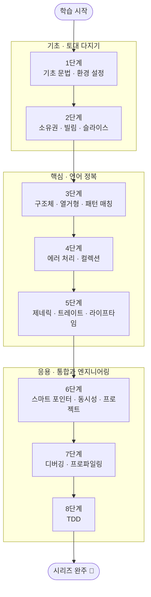

<figure class="post-figure post-figure--header">
<svg role="img" aria-label="Rust 학습 여정을 왼쪽에서 오른쪽으로 올라가는 다섯 개의 정거장으로 그린 그림. 바닥에서 출발해 소유권·빌림, 구조체·열거형 타입, 트레이트·제네릭, 동시성을 차례로 거쳐 맨 위 오른쪽 실전 프로젝트 깃발에 도달한다. 각 정거장은 도장깨기처럼 채워진 표식으로 표현된다." viewBox="0 0 680 300" xmlns="http://www.w3.org/2000/svg">
  <title>Rust 학습 여정 — 소유권·빌림 → 타입(구조체·열거형) → 트레이트·제네릭 → 동시성 → 실전</title>

  <!-- ascending guide path (dashed climb) -->
  <polyline points="64,236 196,200 328,160 460,120 596,76" fill="none" stroke="currentColor" stroke-width="2" stroke-dasharray="5 6" opacity="0.4"/>

  <!-- ===== Station 1: 소유권 · 빌림 (foundation) ===== -->
  <rect x="34" y="216" width="92" height="48" rx="4" fill="var(--bg-light)" stroke="var(--accent-color)" stroke-width="2.5"/>
  <text x="80" y="236" text-anchor="middle" font-size="11" fill="currentColor" font-weight="700">소유권 · 빌림</text>
  <text x="80" y="252" text-anchor="middle" font-size="8" fill="currentColor" opacity="0.8">메모리 안전의 토대</text>
  <text x="80" y="206" text-anchor="middle" font-size="9" fill="currentColor" opacity="0.6" font-weight="700">1–2</text>
  <line x1="126" y1="224" x2="158" y2="208" stroke="var(--secondary-color)" stroke-width="2" marker-end="url(#rust-arrow)"/>

  <!-- ===== Station 2: 타입 (structs / enums) ===== -->
  <rect x="166" y="180" width="92" height="48" rx="4" fill="var(--bg-light)" stroke="currentColor" stroke-width="1.8"/>
  <text x="212" y="200" text-anchor="middle" font-size="11" fill="currentColor" font-weight="700">타입</text>
  <text x="212" y="216" text-anchor="middle" font-size="8" fill="currentColor" opacity="0.8">구조체 · 열거형 · match</text>
  <text x="212" y="170" text-anchor="middle" font-size="9" fill="currentColor" opacity="0.6" font-weight="700">3–4</text>
  <line x1="258" y1="188" x2="290" y2="172" stroke="var(--secondary-color)" stroke-width="2" marker-end="url(#rust-arrow)"/>

  <!-- ===== Station 3: 트레이트 · 제네릭 ===== -->
  <rect x="298" y="140" width="92" height="48" rx="4" fill="var(--bg-light)" stroke="currentColor" stroke-width="1.8"/>
  <text x="344" y="160" text-anchor="middle" font-size="11" fill="currentColor" font-weight="700">트레이트 · 제네릭</text>
  <text x="344" y="176" text-anchor="middle" font-size="8" fill="currentColor" opacity="0.8">추상화 · 라이프타임</text>
  <text x="344" y="130" text-anchor="middle" font-size="9" fill="currentColor" opacity="0.6" font-weight="700">5</text>
  <line x1="390" y1="148" x2="422" y2="132" stroke="var(--secondary-color)" stroke-width="2" marker-end="url(#rust-arrow)"/>

  <!-- ===== Station 4: 동시성 ===== -->
  <rect x="430" y="100" width="92" height="48" rx="4" fill="var(--bg-light)" stroke="currentColor" stroke-width="1.8"/>
  <text x="476" y="120" text-anchor="middle" font-size="11" fill="currentColor" font-weight="700">동시성</text>
  <text x="476" y="136" text-anchor="middle" font-size="8" fill="currentColor" opacity="0.8">스레드 · Arc · Mutex</text>
  <text x="476" y="90" text-anchor="middle" font-size="9" fill="currentColor" opacity="0.6" font-weight="700">6</text>
  <line x1="522" y1="108" x2="554" y2="92" stroke="var(--secondary-color)" stroke-width="2" marker-end="url(#rust-arrow)"/>

  <!-- ===== Station 5: 실전 (summit flag) ===== -->
  <rect x="560" y="56" width="86" height="50" rx="4" fill="var(--bg-panel)" stroke="var(--gold)" stroke-width="2.5"/>
  <text x="603" y="78" text-anchor="middle" font-size="11" fill="currentColor" font-weight="700">실전</text>
  <text x="603" y="94" text-anchor="middle" font-size="8" fill="currentColor" opacity="0.8">프로젝트 · 디버깅 · TDD</text>
  <text x="603" y="46" text-anchor="middle" font-size="9" fill="currentColor" opacity="0.6" font-weight="700">7–8</text>
  <!-- summit flag -->
  <line x1="640" y1="56" x2="640" y2="30" stroke="currentColor" stroke-width="2"/>
  <path d="M640,32 L660,38 L640,44 z" fill="var(--gold)" stroke="var(--gold)" stroke-width="1"/>

  <!-- start marker -->
  <circle cx="34" cy="278" r="6" fill="none" stroke="currentColor" stroke-width="2"/>
  <text x="48" y="282" text-anchor="start" font-size="9" fill="currentColor" opacity="0.7">학습 시작</text>

  <!-- foundation → summit caption rail -->
  <text x="80" y="20" text-anchor="middle" font-size="11" fill="currentColor" font-weight="700" opacity="0.7">기초</text>
  <text x="344" y="20" text-anchor="middle" font-size="11" fill="currentColor" font-weight="700" opacity="0.7">핵심</text>
  <text x="603" y="20" text-anchor="middle" font-size="11" fill="currentColor" font-weight="700" opacity="0.7">응용</text>

  <defs>
    <marker id="rust-arrow" markerWidth="8" markerHeight="8" refX="6" refY="4" orient="auto">
      <path d="M0,0 L8,4 L0,8 z" fill="var(--secondary-color)"/>
    </marker>
  </defs>
</svg>
<figcaption>이 커리큘럼이 오르는 길 한 장 요약 — <strong>소유권 · 빌림</strong>(메모리 안전의 토대)에서 출발해 <strong>타입</strong>(구조체 · 열거형 · 패턴 매칭), <strong>트레이트 · 제네릭</strong>(추상화), <strong>동시성</strong>을 차례로 딛고 맨 위 <strong>실전</strong>(프로젝트 · 디버깅 · TDD)에 도달합니다. 한 단씩 도장을 깨며 올라가는 8단계 학습 여정.</figcaption>
</figure>

## 소개

Rust는 가비지 컬렉터(GC) 없이도 메모리 안전성과 데이터 레이스 없는 동시성을 컴파일 타임에 보장하는 시스템 프로그래밍 언어입니다. 그만큼 학습 곡선(Learning Curve)이 가파른 것으로 유명하지만, 체계적인 순서로 접근하면 "컴파일러와의 싸움"을 "컴파일러와의 협업"으로 바꿀 수 있습니다.

이 커리큘럼은 `Rust-Essential` 시리즈의 마스터 로드맵입니다. 기초 문법과 환경 설정부터 소유권 시스템, 제네릭·트레이트·라이프타임, 동시성, 그리고 TDD까지 8단계로 구성했으며, 각 항목을 정복할 때마다 체크박스를 채워 나가는 **도장깨기** 방식으로 진행 상황을 추적합니다. 언어 전반에 대한 개괄은 [Rust lang 개요](/2026/01/03/rust-lang-개요.html)를 먼저 읽어보길 권합니다.

## 학습 흐름

8단계는 아래 순서대로 진행하는 것을 권장합니다. **기초**(문법·소유권)로 토대를 다지고, **핵심**(데이터 모델링·에러 처리·추상화)으로 언어를 정복한 뒤, **응용**(통합 프로젝트·엔지니어링 실천)으로 마무리하는 흐름입니다.

## 학습 진행 현황

> 완료한 항목에는 상세 포스트 링크가 연결되어 있습니다. 학습이 진행될 때마다 체크박스와 진행률을 갱신합니다.

- 현재 완료한 항목: **24개**
- 전체 항목: **24개**
- 진행률: **100%** 🎉

## 1단계: 기초 문법과 환경 설정

Rust 개발을 시작하기 위한 도구를 설치하고, 언어의 기본 구성 요소를 익히는 단계입니다. 자세한 내용은 [Rust 기초 문법과 환경 설정](/2026/01/04/rust-basic-syntax-and-setup.html) 포스트에서 다룹니다.

- [x] **Rust 설치**: `rustup` 툴체인으로 `rustc`/`cargo` 설치 — [[상세](/2026/01/04/rust-basic-syntax-and-setup.html)]
- [x] **Hello World & Cargo**: `cargo new`, `cargo run`과 `Cargo.toml` 구조 — [[상세](/2026/01/04/rust-basic-syntax-and-setup.html)]
- [x] **변수·가변성·타입·함수**: `let`, `mut`, 스칼라/복합 타입, 함수와 표현식 — [[상세](/2026/01/04/rust-basic-syntax-and-setup.html)]
- [x] **흐름 제어**: `if` 표현식, `loop`/`while`/`for`, `Range` — [[상세](/2026/01/04/rust-basic-syntax-and-setup.html)]

## 2단계: 소유권(Ownership) 시스템

Rust의 가장 독창적이고 중요한 개념으로, 메모리 안전성의 토대가 됩니다. 자세한 내용은 [Rust 소유권(Ownership) 시스템 이해하기](/2026/01/05/rust-ownership.html) 포스트에서 다룹니다.

- [x] **소유권 규칙**: 이동(Move)과 복사(Copy), 스코프와 `drop` — [[상세](/2026/01/05/rust-ownership.html)]
- [x] **빌림(Borrowing)**: 불변 참조(`&`)와 가변 참조(`&mut`), 빌림 규칙 — [[상세](/2026/01/05/rust-ownership.html)]
- [x] **슬라이스(Slice)**: 문자열·배열의 연속 요소 참조 — [[상세](/2026/01/05/rust-ownership.html)]

## 3단계: 구조적 데이터와 패턴 매칭

데이터를 의미 있는 단위로 묶고, 그 형태에 따라 분기하는 방법을 배웁니다. 자세한 내용은 [Rust 구조체, 열거형, 패턴 매칭](/2026/01/06/rust-structs-enums-pattern-matching.html) 포스트에서 다룹니다.

- [x] **Structs**: 필드 구조체, 튜플 구조체, 메서드(`impl`) — [[상세](/2026/01/06/rust-structs-enums-pattern-matching.html)]
- [x] **Enums & `Option<T>`**: 열거형 정의와 널 안전성을 위한 `Option` — [[상세](/2026/01/06/rust-structs-enums-pattern-matching.html)]
- [x] **Pattern Matching**: `match` 흐름 제어와 `if let` — [[상세](/2026/01/06/rust-structs-enums-pattern-matching.html)]

## 4단계: 에러 처리와 컬렉션

실용적인 프로그램을 작성하는 데 필수적인 표준 컬렉션과 에러 처리 패러다임을 다룹니다. 자세한 내용은 [Rust 에러 처리와 컬렉션](/2026/01/07/rust-error-handling-and-collections.html) 포스트에서 다룹니다.

- [x] **Collections**: `Vec<T>`, `String`, `HashMap<K, V>` — [[상세](/2026/01/07/rust-error-handling-and-collections.html)]
- [x] **Error Handling**: 복구 가능한 에러(`Result<T, E>`)와 복구 불가능한 에러(`panic!`), `?` 연산자 — [[상세](/2026/01/07/rust-error-handling-and-collections.html)]

## 5단계: 제네릭, 트레이트, 라이프타임

코드 중복을 줄이고 추상화하는 Rust의 핵심 도구이자, 컴파일러를 가장 깊이 이해해야 하는 단계입니다. 자세한 내용은 [Rust 제네릭, 트레이트, 라이프타임](/2026/01/08/rust-generics-traits-lifetimes.html) 포스트에서 다룹니다.

- [x] **Generics**: 타입 매개변수를 이용한 데이터 타입·함수의 추상화 — [[상세](/2026/01/08/rust-generics-traits-lifetimes.html)]
- [x] **Traits**: 공통 동작 정의(타 언어의 인터페이스 유사), 트레이트 바운드 — [[상세](/2026/01/08/rust-generics-traits-lifetimes.html)]
- [x] **Lifetimes**: 참조자의 유효 범위 검증과 라이프타임 명시(`'a`) — [[상세](/2026/01/08/rust-generics-traits-lifetimes.html)]

## 6단계: 고급 기능 및 프로젝트

스마트 포인터와 동시성을 익히고, 작은 실전 프로젝트로 지식을 통합합니다. 자세한 내용은 [Rust 스마트 포인터, 동시성, 그리고 프로젝트](/2026/01/09/rust-smart-pointers-concurrency-and-projects.html) 포스트에서 다룹니다.

- [x] **Smart Pointers**: `Box<T>`, `Rc<T>`, `RefCell<T>`와 내부 가변성 — [[상세](/2026/01/09/rust-smart-pointers-concurrency-and-projects.html)]
- [x] **Concurrency**: 스레드, 메시지 패싱(`channel`), 공유 상태(`Mutex`, `Arc`) — [[상세](/2026/01/09/rust-smart-pointers-concurrency-and-projects.html)]
- [x] **Automated Tests**: `#[test]` 단위 테스트와 통합 테스트 작성 — [[상세](/2026/01/09/rust-smart-pointers-concurrency-and-projects.html)]
- [x] **I/O Project**: 커맨드 라인 도구 만들기 (예: 미니 `grep` 구현) — [[상세](/2026/01/09/rust-smart-pointers-concurrency-and-projects.html)]

## 7단계: 디버깅 및 프로파일링

작성한 코드의 동작을 추적하고 성능을 정량적으로 측정하는 방법을 다룹니다. 자세한 내용은 [Rust 디버깅과 프로파일링](/2026/01/10/rust-debugging-and-profiling.html) 포스트에서 다룹니다.

- [x] **Debugging**: `dbg!` 매크로 활용, `gdb`/`lldb` 디버거 연동 — [[상세](/2026/01/10/rust-debugging-and-profiling.html)]
- [x] **Profiling**: `criterion` 크레이트 벤치마킹, Flamegraph 등 성능 분석 — [[상세](/2026/01/10/rust-debugging-and-profiling.html)]

## 8단계: TDD with Rust

테스트를 먼저 작성하며 견고한 코드를 만들어 가는 개발 방법론을 Rust 생태계에 적용합니다. 자세한 내용은 [Rust로 하는 TDD](/2026/01/11/rust-tdd.html) 포스트에서 다룹니다.

- [x] **TDD 사이클**: Red-Green-Refactor 사이클 이해 및 적용 — [[상세](/2026/01/11/rust-tdd.html)]
- [x] **Mocking**: `mockall` 등 크레이트를 활용한 테스트 더블 작성 — [[상세](/2026/01/11/rust-tdd.html)]
- [x] **Integration Testing**: 라이브러리 구조(`tests/` 디렉토리)와 통합 테스트 패턴 — [[상세](/2026/01/11/rust-tdd.html)]

## 핵심 포인트

- **순서를 지키세요**: 소유권(2단계)을 건너뛰면 이후 모든 단계에서 컴파일러와 헤매게 됩니다. 토대부터 단단히 다지는 것이 가장 빠른 길입니다.
- **컴파일러를 신뢰하세요**: Rust 컴파일러의 에러 메시지는 매우 친절합니다. 에러를 적으로 보지 말고, 더 안전한 코드로 안내하는 가이드로 활용하세요.
- **손으로 익히세요**: `rustlings`로 작은 코드를 직접 고치고, `cargo`로 직접 빌드·테스트하며 감각을 익히는 것이 핵심입니다.
- **추상화는 천천히**: 제네릭·트레이트·라이프타임(5단계)은 한 번에 이해되지 않습니다. 반복해서 마주치며 자연스럽게 체화하세요.

## 추천 학습 자료

1. **The Rust Programming Language (The Book)**: 공식 문서이자 최고의 입문서입니다.
2. **Rustlings**: 작은 코드를 수정하며 배우는 실습형 튜토리얼입니다.
3. **Rust by Example**: 예제 코드를 통해 개념을 빠르게 확인하는 방식입니다.

## 결론

Rust 학습은 처음에는 컴파일러와의 싸움처럼 느껴지지만, 그 과정을 통해 더 안전하고 견고한 코드를 작성하는 습관을 기를 수 있습니다. 이 커리큘럼을 나침반 삼아 각 단계를 하나씩 정복하고, 완료할 때마다 체크박스를 채워 나가며 진행 상황을 시각적으로 확인해 보세요.

### 시리즈 전체 글

- [Rust lang 개요](/2026/01/03/rust-lang-개요.html) — 언어의 특징과 전체 학습 로드맵 개괄
- [Rust 기초 문법과 환경 설정](/2026/01/04/rust-basic-syntax-and-setup.html) — 1단계: 환경 설정과 기본 문법
- [Rust 소유권(Ownership) 시스템 이해하기](/2026/01/05/rust-ownership.html) — 2단계: 소유권·빌림·슬라이스
- [Rust 구조체, 열거형, 패턴 매칭](/2026/01/06/rust-structs-enums-pattern-matching.html) — 3단계: Struct·Enum·Pattern Matching
- [Rust 에러 처리와 컬렉션](/2026/01/07/rust-error-handling-and-collections.html) — 4단계: Collections·Result·`?`
- [Rust 제네릭, 트레이트, 라이프타임](/2026/01/08/rust-generics-traits-lifetimes.html) — 5단계: Generics·Traits·Lifetimes
- [Rust 스마트 포인터, 동시성, 그리고 프로젝트](/2026/01/09/rust-smart-pointers-concurrency-and-projects.html) — 6단계: Smart Pointers·Concurrency·미니 프로젝트
- [Rust 디버깅과 프로파일링](/2026/01/10/rust-debugging-and-profiling.html) — 7단계: `dbg!`·gdb/lldb·criterion·flamegraph
- [Rust로 하는 TDD](/2026/01/11/rust-tdd.html) — 8단계: Red-Green-Refactor·mockall·통합 테스트

8단계를 모두 완주했다면 이제 비동기(`async`/`await`)와 웹 프레임워크, 또는 실전 오픈소스 기여로 학습을 확장해 보세요.
